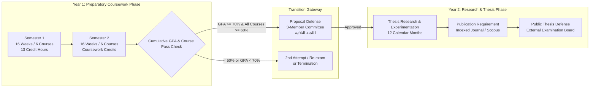

# Master Studio: Postgraduate Academic Regulations & Governance Framework

> **Jurisdiction:** Ministry of Higher Education & Scientific Research (MOHESR), Republic of Iraq & University of Wasit.  
> **Faculty:** College of Computer Science & Information Technology — Department of Computer Science.  
> **Degree Program:** Master of Computer Science (MCS) / *ماجستير علوم الحاسوب*.  
> **Applicable Academic Year:** 2026–2027 onwards.

---

## 1. Postgraduate Program Structural Overview

The Master of Computer Science program is governed by Iraqi Postgraduate Studies Law No. 26 of 1990 and its subsequent ministerial directives and circulars. The degree spans a standard duration of **two calendar years (24 months)**, divided into two distinct, strictly sequential phases:



---

## 2. Phase 1: Preparatory Coursework Regulations (*السنة التحضيرية*)

### 2.1. Term Duration & Credit Load
- **Structure:** Two semesters, each consisting of exactly **16 academic weeks** of lectures, seminars, laboratory assignments, and examinations.
- **Course Distribution:**
  - **Semester 1 (Fall):** 6 Subjects (13 Credit Hours total).
  - **Semester 2 (Spring):** 6 Subjects (Advanced specialization courses).
- **Credit Hour Definition:** 1 Credit Hour = 1 Hour of theoretical lecture per week over a 16-week semester (or 2 hours of laboratory/practical instruction).

### 2.2. Attendance and Absence Thresholds
- Attendance is mandatory for all scheduled postgraduate lectures and laboratory sessions.
- **Maximum Allowable Absence:**
  - An unexcused absence exceeding **10%** of total course hours results in an official departmental warning.
  - An unexcused absence exceeding **15%** (or excused absence exceeding 25%) results in immediate **Administrative Failure due to Absence (*رسوب بالغياب*)**, resulting in a grade of zero for the course and legal dismissal.

### 2.3. Assessment & Grade Distribution
Course performance is evaluated on a strict 100-point scale partitioned as follows:

| Assessment Component | Weight | Elements Evaluated |
|:---|:---:|:---|
| **Continuous Coursework (*السعي السنوي*)** | **40% – 50%** | Written mid-term examinations, periodic quizzes, seminar presentations, laboratory coding deliverables, and active academic participation. |
| **Final Semester Examination (*الامتحان النهائي*)** | **50% – 60%** | Comprehensive written examination covering the entire semester syllabus. |
| **Total Final Grade** | **100%** | Cumulative course score recorded on official university transcript. |

---

## 3. Passing Thresholds & Minimum Grade Standards

```
+-------------------------------------------------------------------------------+
|                      MINISTERIAL GRADING BARRIERS (IRAQ)                      |
|                                                                               |
|  [ >= 75.0% ] ---> Institutional Master Studio Target (Safe / Excellence)     |
|  [ >= 70.0% ] ---> Ministerial Cumulative GPA Floor for Research Transition  |
|  [ >= 60.0% ] ---> Minimum Individual Course Passing Grade                    |
|  [  < 60.0% ] ---> Subject Failure (Mandatory 2nd Attempt / دور ثان)          |
|  [  < 70.0% ] ---> Cumulative Year Failure (Ineligible for Thesis Stage)      |
+-------------------------------------------------------------------------------+
```

### 3.1. Individual Subject Barrier: 60.0%
- Every candidate must achieve a final grade of **at least 60.0% (Sixty Percent)** in every registered subject.
- A grade between $0.0\%$ and $59.9\%$ is classified as a **Fail (*راسب*)**.

### 3.2. Cumulative Weighted GPA Barrier: 70.0%
- At the end of the preparatory coursework year, the candidate’s **Cumulative Weighted Grade Point Average (GPA)** is computed:
  $$\text{Cumulative GPA} = \frac{\sum_{i=1}^{N} (\text{Grade}_i \times \text{Credits}_i)}{\sum_{i=1}^{N} \text{Credits}_i}$$
- **Legal Transition Floor:** The cumulative annual GPA across both semesters must be **$\ge 70.0\%$ (Seventy Percent)**.
- **Master Studio Institutional Excellence Target:** **$\ge 75.0\%$** (Secures priority for research advisor selection and doctoral fellowship eligibility).

### 3.3. Failure Protocols & Consequences
1. **First Attempt Failure in Coursework:**
   - If a student fails ($< 60\%$) in one or more courses in the first attempt (*الدور الأول*), they are entitled to sit for the **Second Attempt Examination (*امتحان الدور الثاني*)**.
   - If a student passes all individual subjects with $\ge 60\%$ but their cumulative weighted GPA is $< 70.0\%$, they must sit for the second attempt in the courses with the lowest marks to elevate their cumulative GPA.
2. **Second Attempt Failure & Status Termination (*ترقين القيد*):**
   - Failing any subject after the second attempt, or failing to attain the $70.0\%$ cumulative GPA after the second attempt, results in official termination of postgraduate status (*ترقين قيد الطالب*) according to ministerial bylaws.

---

## 4. Phase 2: Thesis & Research Transition Gateway (*مرحلة البحث*)

Transition to the second year (Thesis Phase) requires satisfying all coursework prerequisites followed by formal administrative approvals:

### 4.1. The 3-Member Scientific Committee (*اللجنة الثلاثية*)
- The Department of Computer Science establishes a specialized 3-member examination committee (*اللجنة الثلاثية*) composed of senior faculty members (Professors and Assistant Professors).
- **Proposal Defense:** The candidate must present a formal **Research Proposal (*خطة البحث*)** covering:
  1. Problem statement, technical gap, and research motivation.
  2. Comprehensive literature review with verified IEEE/ACM citations.
  3. Proposed methodology, algorithmic frameworks, and experimental datasets.
  4. Feasibility, timeline, and expected novel contributions.
- **Committee Decision:** The committee votes to:
  - *Approve as Submitted*
  - *Approve with Minor Modifications (30 days resubmission)*
  - *Reject / Require Major Revision & Re-defense*

### 4.2. Supervisor Eligibility Criteria (*شروط الأستاذ المشرف*)
Under MOHESR postgraduate directives, an academic supervisor must meet the following legal qualifications:
1. **Academic Rank:**
   - **Professor (*أستاذ*)** or **Assistant Professor (*أستاذ مساعد*)**: Eligible to supervise master's theses directly.
   - **Lecturer with PhD (*مدرس دكتور*)**: Eligible to supervise a master's thesis **only** if:
     - At least **two full calendar years** have elapsed since obtaining their PhD degree.
     - They have published at least **two original research papers** in reputable, indexed international journals (e.g., Scopus / Clarivate) post-PhD.
2. **Supervision Load:** A faculty member may not exceed the legally stipulated concurrent student quota.

---

## 5. Thesis Submission, Publication & Final Defense

### 5.1. Research Duration & Extensions
- The standard research duration is **12 calendar months** from the date of official topic approval by the College Council.
- **Extensions:** A maximum of two extensions may be granted upon supervisor justification and departmental council approval:
  - First Extension: Up to **6 months**.
  - Second Extension: Up to **3 months** (exceptional approval required).

### 5.2. Mandatory Publication Requirement
Prior to scheduling the final viva defense, the master's candidate must produce verified evidence of:
- Publication (or official acceptance for publication) of at least **one original research paper** derived from the thesis work in a recognized journal indexed in **Scopus** or **Clarivate Analytics**, or in an accredited peer-reviewed national/international conference.

### 5.3. Plagiarism & Originality Screening (*الاستلال الإلكتروني*)
- The complete thesis manuscript must undergo official electronic plagiarism screening (Turnitin / iThenticate).
- **Threshold:** The overall similarity index must not exceed **20%**, with no single source exceeding **5%** (excluding standard bibliography and institutional quotes).

### 5.4. Examination Board & Honors Classification
The thesis is defended publicly before an approved Examination Committee consisting of at least three examiners plus the supervisor. Final thesis evaluation grades are classified as:

| Grade Range | Descriptive Rating (Arabic) | Descriptive Rating (English) |
|:---:|:---|:---|
| **90% – 100%** | **امتياز** | **Excellent / Distinction** |
| **80% – 89.9%** | **جيد جداً** | **Very Good** |
| **70% – 79.9%** | **جيد** | **Good** |
| **60% – 69.9%** | **مقبول** | **Satisfactory / Pass** |
| **$< 60\%$** | **مستوفي / غير مستوفي (راسب)** | **Unsatisfactory / Fail** |
