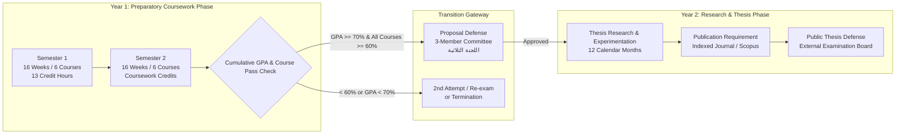

# Master Studio: Postgraduate Academic Regulations & Governance Framework

> **Jurisdiction:** Ministry of Higher Education & Scientific Research (MOHESR), Republic of Iraq & University of Wasit.  
> **Faculty:** College of Computer Science & Information Technology — Department of Computer Science.  
> **Degree Program:** Master of Computer Science (MCS) / *ماجستير علوم الحاسوب*.  
> **Applicable Academic Year:** 2026–2027 onwards.

---

## 1. Postgraduate Program Structural Overview

The Master of Computer Science program is governed by Iraqi Postgraduate Studies Law No. 26 of 1990 and its subsequent ministerial directives and circulars. The degree spans a standard duration of **two calendar years (24 months)**, divided into two distinct, strictly sequential phases:


```mermaid
flowchart LR
    subgraph Year1 [Year 1: Preparatory Coursework Phase]
        S1[Semester 1<br>16 Weeks / 6 Courses<br>13 Credit Hours] --> S2[Semester 2<br>16 Weeks / 6 Courses<br>Coursework Credits]
        S2 --> GPA{Cumulative GPA & Course Pass Check}
    end

    subgraph Gateway [Transition Gateway]
        GPA -->|GPA >= 70% & All Courses >= 60%| PropDef[Proposal Defense<br>3-Member Committee<br>اللجنة الثلاثية]
        GPA -->|< 60% or GPA < 70%| FailProc[2nd Attempt / Re-exam<br>or Termination]
    end

    subgraph Year2 [Year 2: Research & Thesis Phase]
        PropDef -->|Approved| Research[Thesis Research & Experimentation<br>12 Calendar Months]
        Research --> Pub[Publication Requirement<br>Indexed Journal / Scopus]
        Pub --> Defense[Public Thesis Defense<br>External Examination Board]
    end
```

---

## 2. Phase 1: Preparatory Coursework Regulations (*السنة التحضيرية*)

### 2.1. Term Duration & Credit Load
- **Structure:** Two semesters, each consisting of exactly **16 academic weeks** of lectures, seminars, laboratory assignments, and examinations.
- **Course Distribution:**
  - **Semester 1 (Fall):** 6 Subjects (13 Credit Hours total).
  - **Semester 2 (Spring):** 6 Subjects (Advanced specialization courses).
- **Credit Hour Definition:** 1 Credit Hour = 1 Hour of theoretical lecture per week over a 16-week semester (or 2 hours of laboratory/practical instruction).

### 2.2. Attendance and Absence Thresholds
- Attendance is mandatory for all scheduled postgraduate lectures and laboratory sessions.
- **Maximum Allowable Absence:**
  - An unexcused absence exceeding **10%** of total course hours results in an official departmental warning.
  - An unexcused absence exceeding **15%** (or excused absence exceeding 25%) results in immediate **Administrative Failure due to Absence (*رسوب بالغياب*)**, resulting in a grade of zero for the course and legal dismissal.

### 2.3. Assessment & Grade Distribution

> ✅ **CONFIRMED (2026-10-04) — source: the Head of Department, College of CS&IT, stated in person to the student.** The split is **30% Continuous Coursework (*السعي*) / 70% Final Examination**. Recorded as given. This replaces the earlier unverified 40–50 / 50–60 figure.
>
> ⚠️ Still open: whether the 30% is further sub-divided (monthly exams vs daily quizzes) and whether it is uniform across all six subjects. Ask for it in writing per subject.

| Assessment Component | Weight | Elements Evaluated |
|:---|:---:|:---|
| **Continuous Coursework (*السعي*)** | **30%** (30 marks) | Monthly examinations, daily quizzes, seminars, assignments, participation. |
| **Final Semester Examination (*الامتحان النهائي*)** | **70%** (70 marks) | End-of-semester written examination. |
| **Total Final Grade** | **100%** (100 marks) | Recorded on the transcript, then **weighted by credit units** (Art. 24(6)). |

#### 2.3.1. The mark-exchange rate (why the daily is not "just filling")

With a 30/70 split, the course grade is $G = S + 0.7F$ where $S \in [0,30]$ is the coursework mark and $F \in [0,100]$ is the final percentage.

$$\frac{\partial G}{\partial S} = 1 \qquad \frac{\partial G}{\partial F} = 0.7 \qquad \Longrightarrow \quad \textbf{1 coursework mark} = \textbf{1.43 final marks}$$

**A single *سعي* mark is worth 43% more than a single final mark.** Therefore:

| Coursework mark $S$ (of 30) | Final % needed for a course grade of 70 | for 60 |
|:---:|:---:|:---:|
| 18 (the floor of the student's estimate) | **74.3%** | 60.0% |
| 20 | 71.4% | 57.1% |
| 23 | 67.1% | 52.9% |
| 25 | **64.3%** | 50.0% |
| 27 | **61.4%** | 47.1% |
| 30 | 57.1% | 42.9% |

**Strategic consequence:** treating the coursework as a low-priority "filler" is a mistake — it is the **cheapest source of marks in the entire system**. Raising $S$ from 20 to 27 lowers the required final from 71.4% to 61.4% — a **10-point saving on the final for 7 marks of coursework**, and across 13 units that is roughly **+7 average points** — the difference between 63 and 70.

**Priority of coursework effort follows credit units:** the *سعي* of a 3-credit course (ASE, AI) is worth 3× the *سعي* of a 1-credit course (English) in the weighted average.

---

## 3. Passing Thresholds & Minimum Grade Standards

```
+-------------------------------------------------------------------------------+
|                      MINISTERIAL GRADING BARRIERS (IRAQ)                      |
|                                                                               |
|  [ >= 75.0% ] ---> Institutional Master Studio Target (Safe / Excellence)     |
|  [ >= 70.0% ] ---> Ministerial Cumulative GPA Floor for Research Transition  |
|  [ >= 60.0% ] ---> Minimum Individual Course Passing Grade                    |
|  [  < 60.0% ] ---> Subject Failure (Mandatory 2nd Attempt / دور ثان)          |
|  [  < 70.0% ] ---> Cumulative Year Failure (Ineligible for Thesis Stage)      |
+-------------------------------------------------------------------------------+
```

### 3.1. Individual Subject Barrier: 60.0%
- Every candidate must achieve a final grade of **at least 60.0% (Sixty Percent)** in every registered subject.
- A grade between $0.0\%$ and $59.9\%$ is classified as a **Fail (*راسب*)**.

### 3.2. Cumulative Weighted GPA Barrier: 70.0%
- At the end of the preparatory coursework year, the candidate’s **Cumulative Weighted Grade Point Average (GPA)** is computed:
  $$\text{Cumulative GPA} = \frac{\sum_{i=1}^{N} (\text{Grade}_i \times \text{Credits}_i)}{\sum_{i=1}^{N} \text{Credits}_i}$$
- **Legal Transition Floor:** The cumulative annual GPA across both semesters must be **$\ge 70.0\%$ (Seventy Percent)**.
- **Master Studio Institutional Excellence Target:** **$\ge 75.0\%$** (Secures priority for research advisor selection and doctoral fellowship eligibility).

### 3.3. Failure Protocols & Consequences
1. **First Attempt Failure in Coursework:**
   - If a student fails ($< 60\%$) in one or more courses in the first attempt (*الدور الأول*), they are entitled to sit for the **Second Attempt Examination (*امتحان الدور الثاني*)**.
   - If a student passes all individual subjects with $\ge 60\%$ but their cumulative weighted GPA is $< 70.0\%$, they must sit for the second attempt in the courses with the lowest marks to elevate their cumulative GPA.
2. **Second Attempt Failure & Status Termination (*ترقين القيد*):**
   - Failing any subject after the second attempt, or failing to attain the $70.0\%$ cumulative GPA after the second attempt, results in official termination of postgraduate status (*ترقين قيد الطالب*) according to ministerial bylaws.

### 3.4. Verified Legal Basis (source-checked 2026-10-04)

> **Which instructions govern grading?** *Instructions No. 27 of 1982* (study / examination / grading), **not** No. 26 of 1990 (establishment, admission, supervision). No. 27 remains in force under **Article 17 of Instructions No. 26 of 1990**, which repealed only the provisions conflicting with it.

| Legal source | Provision |
|:---|:---|
| **Instr. 27/1982, Art. 24(1)** | Grading scale: 90–100 ممتاز · 80–89 جيد جداً · 70–79 **جيد** · 60–69 **مقبول** · 59 and below **راسب**. **No «متوسط» grade exists in postgraduate studies** — the pass floor is 60, not 50. |
| **Instr. 27/1982, Art. 24(4)** | Dismissal if the student fails **more than half** of the *first-semester* subjects in the first attempt. (With 6 subjects in Semester 1: the hard line is 4 failures.) |
| **Instr. 27/1982, Art. 24(5)** | Requires «مقبول» in **every** course **and** a general average of «جيد» (70). If either fails, the student re-sits at the **start of the following academic year** — in the failed courses **and in courses of their own choosing in order to raise the general average to «جيد»**. Failing again ⇒ **dismissal**. |
| **Instr. 27/1982, Art. 24(6)** | Each course grade is **weighted by its credit units** when computing the general average. |
| **Instr. 27/1982, Art. 25** | Compensatory (تكميلية) courses: minimum «مقبول» each; **one** re-sit only. |
| **MOHESR announcement, 21 Jul 2026** | Adopted **60** as the passing threshold in the postgraduate preparatory year (agency-reported; underlying letter not located). |

**Ministerial «معالجة» (curve) letters — verified images:**

- **ب ت 5/5421, 11 Sep 2025** — result-processing of 2024–2025 (Semester 1, Semester 2, Second Attempt) put to university councils to change status to «مكمّل» or «ناجح».
- **ب ت 5/1105, 10 May 2025** — 5 marks granted for second-attempt processing, **conditional on the status changing to passing and clearing the preparatory year**.
- **ب ت 5/11137, 6 Oct 2025** — the processing marks are added **to the courses with the highest credit units**, for the purpose of **raising the average and changing the student's status to «النجاح بالمعدل»**.

**Consequences for strategy:** (a) the 3-credit courses move the average roughly 3× as much as 1-credit courses; (b) curve marks apply **only if they change the status completely** — partial benefit is not awarded at all; (c) curve marks are discretionary and vary year to year, so they are a safety net, never a plan.

> **Full Arabic analysis, the deliberate-deferral question, and the Semester-1 plan:** `00_STUDIO_HUB/POSTGRAD_RULES_AND_PLAN.md` (+ PDF).

---

## 4. Phase 2: Thesis & Research Transition Gateway (*مرحلة البحث*)

Transition to the second year (Thesis Phase) requires satisfying all coursework prerequisites followed by formal administrative approvals:

### 4.1. The 3-Member Scientific Committee (*اللجنة الثلاثية*)
- The Department of Computer Science establishes a specialized 3-member examination committee (*اللجنة الثلاثية*) composed of senior faculty members (Professors and Assistant Professors).
- **Proposal Defense:** The candidate must present a formal **Research Proposal (*خطة البحث*)** covering:
  1. Problem statement, technical gap, and research motivation.
  2. Comprehensive literature review with verified IEEE/ACM citations.
  3. Proposed methodology, algorithmic frameworks, and experimental datasets.
  4. Feasibility, timeline, and expected novel contributions.
- **Committee Decision:** The committee votes to:
  - *Approve as Submitted*
  - *Approve with Minor Modifications (30 days resubmission)*
  - *Reject / Require Major Revision & Re-defense*

### 4.2. Supervisor Eligibility Criteria (*شروط الأستاذ المشرف*)
Under MOHESR postgraduate directives, an academic supervisor must meet the following legal qualifications:
1. **Academic Rank:**
   - **Professor (*أستاذ*)** or **Assistant Professor (*أستاذ مساعد*)**: Eligible to supervise master's theses directly.
   - **Lecturer with PhD (*مدرس دكتور*)**: Eligible to supervise a master's thesis **only** if:
     - At least **two full calendar years** have elapsed since obtaining their PhD degree.
     - They have published at least **two original research papers** in reputable, indexed international journals (e.g., Scopus / Clarivate) post-PhD.
2. **Supervision Load:** A faculty member may not exceed the legally stipulated concurrent student quota.

---

## 5. Thesis Submission, Publication & Final Defense

### 5.1. Research Duration & Extensions
- The standard research duration is **12 calendar months** from the date of official topic approval by the College Council.
- **Extensions:** A maximum of two extensions may be granted upon supervisor justification and departmental council approval:
  - First Extension: Up to **6 months**.
  - Second Extension: Up to **3 months** (exceptional approval required).

### 5.2. Mandatory Publication Requirement
Prior to scheduling the final viva defense, the master's candidate must produce verified evidence of:
- Publication (or official acceptance for publication) of at least **one original research paper** derived from the thesis work in a recognized journal indexed in **Scopus** or **Clarivate Analytics**, or in an accredited peer-reviewed national/international conference.

### 5.3. Plagiarism & Originality Screening (*الاستلال الإلكتروني*)
- The complete thesis manuscript must undergo official electronic plagiarism screening (Turnitin / iThenticate).
- **Threshold:** The overall similarity index must not exceed **20%**, with no single source exceeding **5%** (excluding standard bibliography and institutional quotes).

### 5.4. Examination Board & Honors Classification
The thesis is defended publicly before an approved Examination Committee consisting of at least three examiners plus the supervisor. Final thesis evaluation grades are classified as:

| Grade Range | Descriptive Rating (Arabic) | Descriptive Rating (English) |
|:---:|:---|:---|
| **90% – 100%** | **امتياز** | **Excellent / Distinction** |
| **80% – 89.9%** | **جيد جداً** | **Very Good** |
| **70% – 79.9%** | **جيد** | **Good** |
| **60% – 69.9%** | **مقبول** | **Satisfactory / Pass** |
| **$< 60\%$** | **مستوفي / غير مستوفي (راسب)** | **Unsatisfactory / Fail** |
