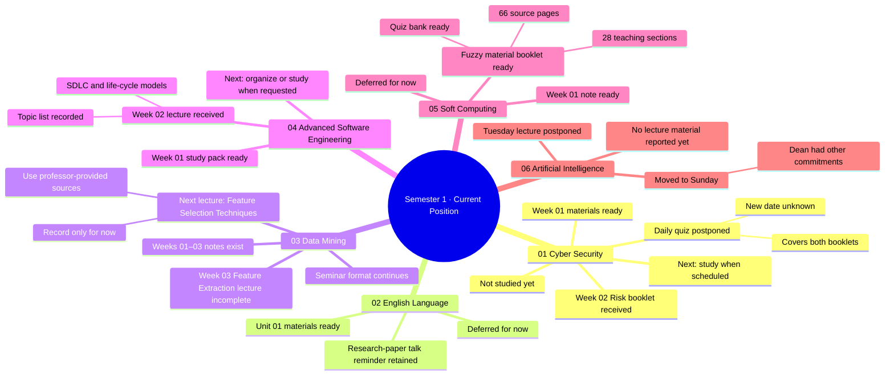

# Current Master Studio Map

> Snapshot from the student's reports on 2026-09-23. This is an orientation map across all subjects, not a topic map for one lecture.

## What to focus on now

1. Follow the Wednesday–Sunday plan in [PLAN_2026-09-23_to_27.md](PLAN_2026-09-23_to_27.md); one primary subject per day.
2. Keep Data Mining Feature Selection on the upcoming list without preparing it yet.
3. Cyber Security Risk booklet is available; the two-booklet quiz has no confirmed date.
4. Attend Sunday's Artificial Intelligence lecture and capture what was actually taught.
5. Advanced Software Engineering Week 02 topics are recorded; no separate preparation task is planned this week.

## Scope notes

- Data Mining's Feature Extraction lecture was not fully covered in class before the seminar decision.
- Seminar cancellation was not final: seminars are still required instead of the professor's lecture format.
- The map records student-reported status. It does not infer exam dates or treat platform quizzes as course exams.
