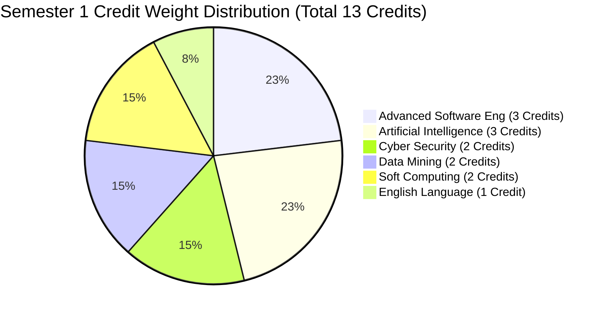

# Master Studio: Cumulative GPA & Course Grade Tracker

> **Student Track:** Master of Computer Science (Coursework Year 2026–2027)  
> **Institution:** University of Wasit — College of Computer Science & IT  
> **Governing Regulations:** MOHESR Legal Minimum: **70.0%** | Subject Pass Minimum: **60.0%** | Studio Target: **75.0%**

---

## 1. Executive Performance Dashboard

```
+-------------------------------------------------------------------------------+
|                           CUMULATIVE GPA DASHBOARD                            |
|                                                                               |
|  Semester 1 Projected GPA:  85.0% (Target)     Current Actual GPA:  ---       |
|  Semester 2 Projected GPA:  85.0% (Target)     Combined Annual GPA: ---       |
|  Academic Standing:         INITIALIZED        Thesis Eligibility:  ON TRACK  |
+-------------------------------------------------------------------------------+
```

### Prior Academic Baseline (context, not part of the semester GPA)
- **BSc Computer Science, graduated 2025–2026.**
- **Master's differential (qualifying) exam: placed FIRST in his cohort, cumulative 83.46.**
- He has never worked; he went straight from the bachelor's into master's preparation.
- **Implication:** the 85% targets above are realistic, not aspirational — he has already performed at this level. Do not lower expectations on his behalf.

### Key Threshold Indicators
- **$\ge 75.0\%$ (Green / Safe):** Master Studio Institutional Target. Secures optimal supervisor selection priority and honors standing.
- **$70.0\% - 74.9\%$ (Yellow / Warning):** Ministerial legal floor for thesis transition. Requires immediate corrective focus.
- **$< 70.0\%$ (Red / Danger):** Ministerial Failure Zone. Ineligible to transition to Year 2 Research Phase without 2nd attempt re-examinations.
- **$< 60.0\%$ in any Course (Critical Fail):** Individual course failure requiring mandatory Second Attempt (*الدور الثاني*).

---

## 2. Mathematical Calculation Model

The Semester and Annual Cumulative Grade Point Average (GPA) is computed as the **Credit-Weighted Arithmetic Mean**:

$$\text{Semester GPA} = \frac{\sum_{i=1}^{k} (\text{Grade}_i \times \text{Credits}_i)}{\sum_{i=1}^{k} \text{Credits}_i}$$

$$\text{Cumulative Annual GPA} = \frac{\sum_{\text{All Courses}} (\text{Grade}_j \times \text{Credits}_j)}{\text{Total Annual Credits}}$$

$$\text{Weighted Grade Points}_i = \text{Grade}_i \times \text{Credits}_i$$

---

## 3. Semester 1 (Fall 2026) Grade Ledger

- **Total Semester 1 Credits:** **13 Credit Hours**
- **Course Distribution:** 6 Subjects

| Code | Subject Name | Credits | Instructor | Coursework (/50) | Final Exam (/50) | Final Grade (/100) | Weighted Points | Target Grade | Status |
|:---:|:---|:---:|:---|:---:|:---:|:---:|:---:|:---:|:---:|
| **CS501** | `01_Cyber_Security` | 2 | Asst. Prof. Dr. Huda Lafta Majeed | — | — | **—** | — | 85.0% | Active (W1) |
| **CS502** | `02_English_Language` | 1 | Asst. Prof. Dr. Haidar Akab Alwan | — | — | **—** | — | 90.0% | Unit 1 done |
| **CS503** | `03_Data_Mining` | 2 | Asst. Prof. Dr. Ahmed Shakir Abd Al-Rida | — | — | **—** | — | 85.0% | Pending |
| **CS504** | `04_Advanced_Software_Eng` | 3 | Asst. Prof. Dr. Ali Fahim Ni'ma | — | — | **—** | — | 88.0% | Active |
| **CS505** | `05_Soft_Computing` | 2 | Prof. Dr. Abdul Hadi Mohammed Adkhil | — | — | **—** | — | 82.0% | Pending |
| **CS506** | `06_Artificial_Intelligence` | 3 | Prof. Dr. Saif Ali Al-Saidi | — | — | **—** | — | 85.0% | ⏸️ Awaiting course start |
| **TOTAL** | **Semester 1 Cumulative** | **13** | — | — | — | **—** | **—** | **85.5%** | **In Progress** |

---

## 4. Semester 2 (Spring 2027) Grade Ledger (Placeholder)

- **Total Semester 2 Credits:** *(13–15 Credits Projected)*
- **Course Distribution:** 6 Subjects (To be populated upon departmental release)

| Code | Subject Name | Credits | Instructor | Coursework (/50) | Final Exam (/50) | Final Grade (/100) | Weighted Points | Target Grade | Status |
|:---:|:---|:---:|:---|:---:|:---:|:---:|:---:|:---:|:---:|
| **CS507** | `01_Advanced_Algorithms` | 3 | Faculty TBD | — | — | **—** | — | 85.0% | Scheduled |
| **CS508** | `02_Distributed_Systems` | 3 | Faculty TBD | — | — | **—** | — | 85.0% | Scheduled |
| **CS509** | `03_Advanced_Computer_Networks` | 2 | Faculty TBD | — | — | **—** | — | 85.0% | Scheduled |
| **CS510** | `04_Computer_Vision_&_Pattern_Rec` | 2 | Faculty TBD | — | — | **—** | — | 85.0% | Scheduled |
| **CS511** | `05_Cloud_Computing_&_IoT` | 2 | Faculty TBD | — | — | **—** | — | 85.0% | Scheduled |
| **CS512** | `06_Research_Methodology_&_Ethics` | 1 | Faculty TBD | — | — | **—** | — | 90.0% | Scheduled |
| **TOTAL** | **Semester 2 Cumulative** | **13** | — | — | — | **—** | **—** | **85.4%** | **Planned** |

---

## 5. Combined Annual Preparatory Stage Summary

| Phase | Total Credits | Minimum Req. | Target GPA | Actual GPA | Status |
|:---|:---:|:---:|:---:|:---:|:---:|
| **Semester 1 (Fall)** | 13 | 70.0% | 85.5% | — | Active / Week 01 |
| **Semester 2 (Spring)** | 13 | 70.0% | 85.4% | — | Upcoming |
| **ANNUAL CUMULATIVE** | **26** | **70.0%** | **85.5%** | **—** | **INITIALIZED** |

---

## 6. Sensitivity & Risk Margin Analysis

Because course credits are weighted differently (3 credits for Advanced Software Engineering and AI vs. 1 credit for English Language), performance in 3-credit courses has **300% greater impact** on the cumulative GPA than 1-credit courses.



### High-Leverage Strategic Rule
- A drop to $65\%$ in a 3-credit course reduces total weighted points by $45$ points (equivalent to a $3.46\%$ hit on the entire Semester 1 GPA).
- Maintaining $\ge 85\%$ in `04_Advanced_Software_Eng` and `06_Artificial_Intelligence` creates a solid safety cushion guaranteeing transition requirements.
