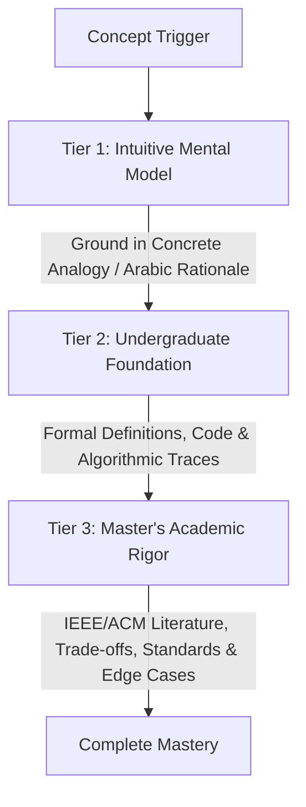

# Master Studio: Persistent Learner Cognitive Model

> **Purpose:** Dynamic cognitive tracking profile. Loaded during Fast-Boot to calibrate agent explanations, adjust quiz difficulty, and manage spaced repetition.

```
+-------------------------------------------------------------------------------+
|                           STUDENT COGNITIVE PROFILE                           |
|                                                                               |
|  Degree: Master of Computer Science (Coursework Stage)                        |
|  Specialization: Software Engineering & Distributed Systems                   |
|  Core Philosophy: Rigorous Academic Depth, Architecture-First, Zero Fluff   |
+-------------------------------------------------------------------------------+
```

## 1. Candidate Background & Cognitive Strengths

- **Academic Track:** Master of Computer Science (1st Year Preparatory Stage, 2026–2027).
- **Core Cognitive Strengths:**
  - High proficiency in high-level architectural decomposition and systems thinking.
  - Strong intuition for trade-off analysis, modularity, and component interactions.
  - Ability to synthesize complex technical English literature into structured conceptual frameworks.
- **Focus Areas for Growth:**
  - Fine-grained formal mathematical proofs and algorithm complexity bounds.
  - Deep statistical evaluation metrics in data mining and soft computing.
  - Rapid recall of granular ISO/IEEE standard clauses under time-constrained exam settings.

---

## 2. Pedagogical Preferences & Delivery Standards

Agents must calibrate all tutoring sessions and study notes according to these cognitive rules:



### 2.1. The 3-Tier Progressive Explanation Model
1. **Tier 1: Intuitive Mental Model (*الشرح المفهومي والحدسي*):**
   - High-level intuitive framing using concrete architectural metaphors or real-world systems analogies.
   - Bilingual phrasing highlighting the fundamental "why" behind the design choice.
2. **Tier 2: Undergraduate Baseline:**
   - Formal technical definitions, structural components, step-by-step algorithmic workflows, or mathematical formulations.
3. **Tier 3: Master's Level Academic Rigor:**
   - Deep trade-off analysis (Latency vs. Throughput, Consistency vs. Availability, Complexity vs. Accuracy).
   - Alignment with formal standards (SWEBOK, ISO/IEC 25010, IEEE 42010).
   - Exploration of failure modes, boundary conditions, and contemporary research frontiers with verified DOIs.

### 2.2. Diagram & Visualization Preferences
- Prefer **Mermaid.js C4 Architecture Diagrams** (Context, Container, Component) for system structures.
- Use **Sequence Diagrams** for distributed communication protocols, cryptographic handshakes, and state transitions.
- Use structured **Markdown Trade-off Matrices** (Concept, Advantages, Disadvantages, Best Used For).

---

## 3. Mastered Concepts List

> Concepts validated through $\ge 80\%$ score in `@examiner` scenario drills and oral defense simulations.

*(Initialized fresh — No entries yet)*

| Subject | Topic / Concept | Date Mastered | Validation Score | Verifying Agent |
|:---|:---|:---:|:---:|:---:|
| *Pending* | *Initial baseline calibration in progress* | — | — | — |

---

## 4. Active Review Queue (Spaced Repetition)

> Concepts requiring active reinforcement due to missed exam questions or identified conceptual ambiguity.

*(Initialized fresh — No active gaps recorded)*

| Subject | Concept / Sub-topic | Last Tested | Error Pattern / Difficulty | Priority | Next Review Due |
|:---|:---|:---:|:---|:---:|:---:|
| *None* | *Queue clear — ready for Week 01 intake* | — | — | — | — |

---

## 5. Retention & Examination History

- **Total Quizzes Attempted:** 0
- **Overall Scenario Accuracy:** — %
- **Oral Defense Confidence Rating:** Initializing
- **Anki Card Generation State:** Clean / Awaiting first week batch
