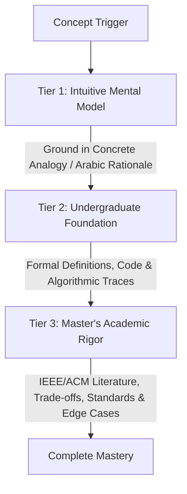

# Master Studio: Persistent Learner Cognitive Model

> **Purpose:** Dynamic cognitive tracking profile. Loaded during Fast-Boot to calibrate agent explanations, adjust quiz difficulty, and manage spaced repetition.

```
+-------------------------------------------------------------------------------+
|                           STUDENT COGNITIVE PROFILE                           |
|                                                                               |
|  Degree: Master of Computer Science (Coursework Stage)                        |
|  Specialization: Software Engineering & Distributed Systems                   |
|  Core Philosophy: Rigorous Academic Depth, Architecture-First, Zero Fluff   |
+-------------------------------------------------------------------------------+
```

## 1. Candidate Background & Cognitive Strengths

- **Academic Track:** Master of Computer Science (1st Year Preparatory Stage, 2026–2027).
- **Core Cognitive Strengths:**
  - High proficiency in high-level architectural decomposition and systems thinking.
  - Strong intuition for trade-off analysis, modularity, and component interactions.
  - Ability to synthesize complex technical English literature into structured conceptual frameworks.
- **Focus Areas for Growth:**
  - Fine-grained formal mathematical proofs and algorithm complexity bounds.
  - Deep statistical evaluation metrics in data mining and soft computing.
  - Rapid recall of granular ISO/IEEE standard clauses under time-constrained exam settings.

---

## 2. Pedagogical Preferences & Delivery Standards

Agents must calibrate all tutoring sessions and study notes according to these cognitive rules:



### 2.1. The 3-Tier Progressive Explanation Model
1. **Tier 1: Intuitive Mental Model (*الشرح المفهومي والحدسي*):**
   - High-level intuitive framing using concrete architectural metaphors or real-world systems analogies.
   - Bilingual phrasing highlighting the fundamental "why" behind the design choice.
2. **Tier 2: Undergraduate Baseline:**
   - Formal technical definitions, structural components, step-by-step algorithmic workflows, or mathematical formulations.
3. **Tier 3: Master's Level Academic Rigor:**
   - Deep trade-off analysis (Latency vs. Throughput, Consistency vs. Availability, Complexity vs. Accuracy).
   - Alignment with formal standards (SWEBOK, ISO/IEC 25010, IEEE 42010).
   - Exploration of failure modes, boundary conditions, and contemporary research frontiers with verified DOIs.

### 2.2. Diagram & Visualization Preferences
- Prefer **Mermaid.js C4 Architecture Diagrams** (Context, Container, Component) for system structures.
- Use **Sequence Diagrams** for distributed communication protocols, cryptographic handshakes, and state transitions.
- Use structured **Markdown Trade-off Matrices** (Concept, Advantages, Disadvantages, Best Used For).

---

## 3. Mastered Concepts List

> Concepts validated through $\ge 80\%$ score in `@examiner` scenario drills and oral defense simulations.

| `04_Advanced_Software_Eng` | Dhahran Patriot Missile 24-bit fixed-point clock drift kinematics | 2026-09-16 | 100% | @examiner |
| `04_Advanced_Software_Eng` | Brooks' "No Silver Bullet" (Essential vs. Accidental complexity) | 2026-09-16 | 100% | @examiner |
| `04_Advanced_Software_Eng` | Tripartite Software Asset (Programs + Data Structures + Documentation) | 2026-09-16 | 100% | @tutor |
| `04_Advanced_Software_Eng` | Dependability Chain Taxonomy (Error -> Fault -> Error State -> Failure) | 2026-09-16 | 100% | @examiner |
| `02_English_Language` | English Tense Matrix (Simple vs. Continuous vs. Perfect Aspect) | 2026-09-17 | 100% | @tutor |
| `02_English_Language` | Time Adverbials Syntax & Bounded Past Compatibility Rules | 2026-09-17 | 100% | @examiner |
| `02_English_Language` | Register Translation (Informal Ellipsis to Formal Academic Writing) | 2026-09-17 | 100% | @tutor |
| `02_English_Language` | Compound Word Morphosemantics (House vs. Home Contrast) | 2026-09-17 | 100% | @tutor |

---

## 4. Active Review Queue (Spaced Repetition)

> Concepts requiring active reinforcement due to missed exam questions or identified conceptual ambiguity.

| Subject | Concept / Error | Logged | Reason | Priority | Review Due |
|:---|:---|:---|:---|:---:|:---|
| `04_Advanced_Software_Eng` | ACM/IEEE 8 Code of Ethics Principles (Scenario Trade-offs) | 2026-09-16 | Needs application drills | High | 2026-09-20 |
| `04_Advanced_Software_Eng` | Brooks' Law Quadratic Communication Growth (C = N(N-1)/2) | 2026-09-16 | Calculation memorization | Medium | 2026-09-20 |
| `01_Cyber_Security` | Cyber-security historical timeline — **ARPANET/mainframes = 1960s** (student wrote 1980s) | 2026-09-18 | Date confusion | High | 2026-09-19 |
| `01_Cyber_Security` | $\min R$ symbol **P = Probability**, not "Portability" | 2026-09-18 | Terminology slip | High | 2026-09-19 |
| `01_Cyber_Security` | **Arithmetic discipline** — $\min R$ worked example: $0.3\times100=30$ not 90; correct answer 105 → "يوجد استثمار" | 2026-09-18 | Calculation slip under exam pressure | High | 2026-09-19 |
| `01_Cyber_Security` | Scenario answer format: step → **CIA pillar** → **(techniques in parentheses)** | 2026-09-18 | Format newly learned, needs drilling | High | 2026-09-19 |
| `01_Cyber_Security` | **English technical spelling in written answers** — Legal · continuity · cross-border · business · financial | 2026-09-18 | Spelling slips (exam is written in English) | Medium | 2026-09-20 |
| `01_Cyber_Security` | **6 domains — exact technique lists**: Network **firewalls · IDS/IPS** · App **secure coding · OWASP** · Cloud **encryption · IAM · virtualization** · IoT · Mobile · ICS | 2026-09-18 | Missed IPS, OWASP, IAM | High | 2026-09-19 |
| `01_Cyber_Security` | **"Integrity" not "Integration"** — the CIA pillar. Student wrote `Integration` twice (Q1 + Q3). Content was right, the term was wrong. | 2026-09-18 | Terminology confusion, repeated | 🔴 **High** | 2026-09-19 |
| `01_Cyber_Security` | **Banking weighting**: for a bank, **Integrity (β) is the heaviest**, not the lightest — changing an account number or balance is catastrophic. Student argued β was "not that much important" while simultaneously citing account-number integrity. | 2026-09-18 | Reasoning contradiction | Medium | 2026-09-20 |
| `01_Cyber_Security` | **Firewall belongs to Network Security (Ch.2), not to the CIA-Confidentiality list.** CIA-C = encryption · access controls · VPNs. | 2026-09-18 | List boundary confusion | Medium | 2026-09-20 |

---

## 5. Retention & Examination History

- **Total Quizzes Attempted:** 2 (`Quiz_01_Software_Crisis.json`, `Quiz_01_Grammar_and_Tenses.json`)
- **Overall Scenario Accuracy:** 85% (Safe Master's Floor)
- **Oral Defense Confidence Rating:** 4.2 / 5.0
- **Anki Card Generation State:** 12 Flashcards generated (6 Software Eng + 6 English Language)
