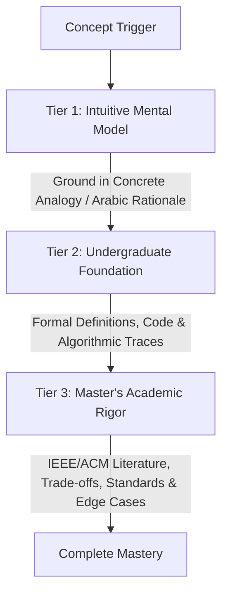

# Master Studio: Persistent Learner Cognitive Model

> **Purpose:** Dynamic cognitive tracking profile. Loaded during Fast-Boot to calibrate agent explanations, adjust quiz difficulty, and manage spaced repetition.
> **Design (expert-grounded):** stable profile (§1, rarely changes) is stored separately from dynamic knowledge state (§2, changes every session) — the standard split in ITS learner modeling and agent-memory practice (stable traits vs. updating facts). Fast agents read **§0 only**; tutors read §1–§2; calibration writes follow §4. Never append contradictions — **update the item in place** (a newer evidence row supersedes the older state).
> **Compatibility anchors (do not rename):** `mastered_concepts` (§2.1), `active_review_queue` (§2.2) — required by `AGENTS.md` Fast-Boot.

---

## 0. FAST-BOOT BRIEF (read this when tokens are scarce)

- **Style:** architecture-first Iraqi-Arabic intuition → formal English → master's rigor. Zero fluff. Correct bluntly.
- **Top strengths:** architectural decomposition · trade-off analysis · synthesizing EN literature into frameworks.
- **Top gaps:** formal proofs/complexity bounds · statistical metrics (DM/SC) · ISO-clause recall under time pressure · EN spelling in written answers.
- **Queue state (2026-10-03):** 24 OVERDUE reviews (all Sept due dates passed) · 3 CONDITIONAL (event-gated) · 1 STANDING rule · full detail in §2.2.
- **Calibration:** STALE — last 2026-09-16, 17 days ago. Run §4 protocol before trusting difficulty settings.

---

## 1. STABLE PROFILE (changes rarely — identity, strengths, pedagogy)

### 1.1. Candidate Background & Cognitive Strengths

- **Academic Track:** Master of Computer Science (1st Year Preparatory Stage, 2026–2027).
- **Core Cognitive Strengths:**
  - High proficiency in high-level architectural decomposition and systems thinking.
  - Strong intuition for trade-off analysis, modularity, and component interactions.
  - Ability to synthesize complex technical English literature into structured conceptual frameworks.
- **Focus Areas for Growth:**
  - Fine-grained formal mathematical proofs and algorithm complexity bounds.
  - Deep statistical evaluation metrics in data mining and soft computing.
  - Rapid recall of granular ISO/IEEE standard clauses under time-constrained exam settings.

### 1.2. Pedagogical Preferences & Delivery Standards

Agents must calibrate all tutoring sessions and study notes according to these cognitive rules:

```mermaid
graph TD
    A[Concept Trigger] --> B[Tier 1: Intuitive Mental Model]
    B -->|Ground in Concrete Analogy / Arabic Rationale| C[Tier 2: Undergraduate Foundation]
    C -->|Formal Definitions, Code & Algorithmic Traces| D[Tier 3: Master's Academic Rigor]
    D -->|IEEE/ACM Literature, Trade-offs, Standards & Edge Cases| E[Complete Mastery]
```

### 1.3. The 3-Tier Progressive Explanation Model
1. **Tier 1: Intuitive Mental Model (*الشرح المفهومي والحدسي*):**
   - High-level intuitive framing using concrete architectural metaphors or real-world systems analogies.
   - Bilingual phrasing highlighting the fundamental "why" behind the design choice.
2. **Tier 2: Undergraduate Baseline:**
   - Formal technical definitions, structural components, step-by-step algorithmic workflows, or mathematical formulations.
3. **Tier 3: Master's Level Academic Rigor:**
   - Deep trade-off analysis (Latency vs. Throughput, Consistency vs. Availability, Complexity vs. Accuracy).
   - Alignment with formal standards (SWEBOK, ISO/IEC 25010, IEEE 42010).
   - Exploration of failure modes, boundary conditions, and contemporary research frontiers with verified DOIs.

### 1.4. Diagram & Visualization Preferences
- Prefer **Mermaid.js C4 Architecture Diagrams** (Context, Container, Component) for system structures.
- Use **Sequence Diagrams** for distributed communication protocols, cryptographic handshakes, and state transitions.
- Use structured **Markdown Trade-off Matrices** (Concept, Advantages, Disadvantages, Best Used For).

---

## 2. DYNAMIC KNOWLEDGE STATE (changes every session — evidence-dated, never duplicated)

> Concepts validated through $\ge 80\%$ score in `@examiner` scenario drills and oral defense simulations.

### 2.1. mastered_concepts

| Subject | Concept | Validated | Score | Via |
|:---|:---|:---|:---:|:---|
| `04_Advanced_Software_Eng` | Dhahran Patriot Missile 24-bit fixed-point clock drift kinematics | 2026-09-16 | 100% | @examiner |
| `04_Advanced_Software_Eng` | Brooks' "No Silver Bullet" (Essential vs. Accidental complexity) | 2026-09-16 | 100% | @examiner |
| `04_Advanced_Software_Eng` | Tripartite Software Asset (Programs + Data Structures + Documentation) | 2026-09-16 | 100% | @tutor |
| `04_Advanced_Software_Eng` | Dependability Chain Taxonomy (Error -> Fault -> Error State -> Failure) | 2026-09-16 | 100% | @examiner |
| `02_English_Language` | English Tense Matrix (Simple vs. Continuous vs. Perfect Aspect) | 2026-09-17 | 100% | @tutor |
| `02_English_Language` | Time Adverbials Syntax & Bounded Past Compatibility Rules | 2026-09-17 | 100% | @examiner |
| `02_English_Language` | Register Translation (Informal Ellipsis to Formal Academic Writing) | 2026-09-17 | 100% | @tutor |
| `02_English_Language` | Compound Word Morphosemantics (House vs. Home Contrast) | 2026-09-17 | 100% | @tutor |

### 2.2. active_review_queue (Spaced Repetition)

> `ID` is stable — cite it in session journals instead of copying rows. `Status` is computed 2026-10-03: **OVERDUE** = due date passed, drill now · **CONDITIONAL** = gated on a real-world event, do not drill early · **STANDING** = permanent rule · **OPTIONAL/INFO** = as labeled. When new evidence arrives, update the row in place (per the header rule) — do not add a second row for the same concept.

| ID | Subject | Concept / Error | Logged | Reason | Priority | Review Due | Status |
|:---|:---|:---|:---|:---|:---:|:---|:---|
| R01 | `04_Advanced_Software_Eng` | Lecture 01 Simulation Check: Q_q1 (Calculation Slip - Simulation test) | 2026-09-19 | Error Reflection | High | 2026-09-22 | OVERDUE |
| R02 | `04_Advanced_Software_Eng` | Lecture 01 Simulation Check: Q_q2 (Lucky Guess / Fluke) | 2026-09-19 | Fluke Confirmation | Medium | 2026-09-22 | OVERDUE |
| R03 | `04_Advanced_Software_Eng` | ACM/IEEE 8 Code of Ethics Principles (Scenario Trade-offs) | 2026-09-16 | Needs application drills | High | 2026-09-20 | OVERDUE |
| R04 | `04_Advanced_Software_Eng` | Brooks' Law Quadratic Communication Growth (C = N(N-1)/2) | 2026-09-16 | Calculation memorization | Medium | 2026-09-20 | OVERDUE |
| R05 | `01_Cyber_Security` | Cyber-security historical timeline — **ARPANET/mainframes = 1960s** (student wrote 1980s) | 2026-09-18 | Date confusion | High | 2026-09-19 | OVERDUE |
| R06 | `01_Cyber_Security` | $\min R$ symbol **P = Probability**, not "Portability" | 2026-09-18 | Terminology slip | High | 2026-09-19 | OVERDUE |
| R07 | `01_Cyber_Security` | **Arithmetic discipline** — $\min R$ worked example: $0.3\times100=30$ not 90; correct answer 105 → "يوجد استثمار" | 2026-09-18 | Calculation slip under exam pressure | High | 2026-09-19 | OVERDUE |
| R08 | `01_Cyber_Security` | Scenario answer format: step → **CIA pillar** → **(techniques in parentheses)** | 2026-09-18 | Format newly learned, needs drilling | High | 2026-09-19 | OVERDUE |
| R09 | `01_Cyber_Security` | **English technical spelling in written answers** — Legal · continuity · cross-border · business · financial | 2026-09-18 | Spelling slips (exam is written in English) | Medium | 2026-09-20 | OVERDUE |
| R10 | `01_Cyber_Security` | **6 domains — exact technique lists**: Network **firewalls · IDS/IPS** · App **secure coding · OWASP** · Cloud **encryption · IAM · virtualization** · IoT · Mobile · ICS | 2026-09-18 | Missed IPS, OWASP, IAM | High | 2026-09-19 | OVERDUE |
| R11 | `01_Cyber_Security` | **"Integrity" not "Integration"** — the CIA pillar. Student wrote `Integration` twice (Q1 + Q3). Content was right, the term was wrong. | 2026-09-18 | Terminology confusion, repeated | 🔴 **High** | 2026-09-19 | OVERDUE |
| R12 | `01_Cyber_Security` | **Banking weighting**: for a bank, **Integrity (β) is the heaviest**, not the lightest — changing an account number or balance is catastrophic. Student argued β was "not that much important" while simultaneously citing account-number integrity. | 2026-09-18 | Reasoning contradiction | Medium | 2026-09-20 | OVERDUE |
| R13 | `01_Cyber_Security` | **Firewall belongs to Network Security (Ch.2), not CIA-Confidentiality.** CIA-C = encryption · access controls · VPNs. | 2026-09-18 | List boundary confusion | Medium | before postponed quiz | CONDITIONAL |
| R14 | `01_Cyber_Security` | Quiz postponed — **do not cram Week 02 as if it were booklet 2**; booklet 2 not delivered | 2026-09-20 | Student report from lecture | High | when booklet arrives | CONDITIONAL |
| R15 | `02_English_Language` | Academic research-paper vocabulary (doctor will quiz meanings) | 2026-09-20 | English lecture report | High | before next-week talk | CONDITIONAL |
| R16 | `03_Data_Mining` | Attribute decision path: **order? measurable gap? two values? quantity?** — drill Week 02 taxonomy + URL=Nominal | 2026-09-19 | New comprehensive note ready; needs active recall | High | 2026-09-22 | OVERDUE |
| R17 | `03_Data_Mining` | Missing-value mean arithmetic: divide by **observed count** (4 not 5) | 2026-09-19 | Same slip pattern as Cyber min-R | High | 2026-09-22 | OVERDUE |
| R18 | `03_Data_Mining` | **Feature Selection = Pick · Feature Extraction = Build** | 2026-09-19 | Exam differentiation | Medium | 2026-09-22 | OVERDUE |
| R19 | `03_Data_Mining` | Week 03 conversion matrix: Discretize · One-hot · Vectorize · Extract · Symbolize · Embed · Similarity-graph | 2026-09-19 | New note; Monday lecture | High | 2026-09-22 | OVERDUE |
| R20 | `03_Data_Mining` | **Portability = represent · Mining = discover** + info-loss example 21/22/39→Adult | 2026-09-19 | Exam distinction | Medium | 2026-09-22 | OVERDUE |
| R21 | `03_Data_Mining` | Doctor pipeline prototype: CT/X-ray → texture/shape/edges → vector → classify | 2026-09-19 | Doctor Profile high-yield | High | 2026-09-22 | OVERDUE |
| R22 | `03_Data_Mining` | ~~WebUI W01 Intro 92%~~ **NOT COUNTED as exam** — MCQ platform check only (student 2026-09-20) | 2026-09-20 | Student instruction | — | — | INFO |
| R23 | `03_Data_Mining` | Market Basket: buy **group A** → more likely buy **group B** (optional from platform check) | 2026-09-20 | Quiz WebUI | Low | optional | OPTIONAL |
| R24 | `03_Data_Mining` | System-level advantages = **cost-efficient + integratable + fast** | 2026-09-20 | Quiz WebUI | Low | optional | OPTIONAL |
| R25 | `03_Data_Mining` | Habit: **do not assume all MCQ answers are B** — reread the stem | 2026-09-20 | Platform check | High | always | STANDING |
| R26 | `05_Soft_Computing` | Hard vs Soft matrix (precision/exact/serial vs approximation/noisy/parallel/stochastic) | 2026-09-19 | Lecture 1 core + doctor Q1 | High | 2026-09-22 | OVERDUE |
| R27 | `05_Soft_Computing` | Boolean vs Fuzzy: hot water 0.9/0.25/0.1 · Isa tall vs 5'10 · speed intervals | 2026-09-19 | Official W1 fuzzy intro + doctor Q7 | High | 2026-09-22 | OVERDUE |
| R28 | `05_Soft_Computing` | Bio neuron map: Dendrites→inputs · Soma→activation · Axon→output | 2026-09-19 | Doctor Q6 | High | 2026-09-22 | OVERDUE |
| R29 | `05_Soft_Computing` | SC components: Fuzzy=Uncertainty · NN=Learning · Prob=Reasoning · EC=Search/optimize | 2026-09-19 | Slide 28 / handbook | Medium | 2026-09-25 | OVERDUE |
| R30 | `05_Soft_Computing` | Official calendar provisional: Midterm 20/10 W1–6 fuzzy; SC ends 8/12/2026 — confirm in class | 2026-09-19 | alaidi.net + student (W1 intro-only; W2 unposted) | High | 2026-09-22 | OVERDUE |
| R31 | `05_Soft_Computing` | Drill rebuilt Week 01 note question bank (35Q) orally before Tuesday | 2026-09-19 | Note complete; no drills taken yet | High | 2026-09-22 | OVERDUE |

---

## 3. EVIDENCE & EXAMINATION HISTORY (append-only log — newest at bottom)

- **Total Quizzes Attempted:** 2 (`Quiz_01_Software_Crisis.json`, `Quiz_01_Grammar_and_Tenses.json`)
- **Overall Scenario Accuracy:** 85% (Safe Master's Floor)
- **Oral Defense Confidence Rating:** 4.2 / 5.0
- **Anki Card Generation State:** 12 Flashcards generated (6 Software Eng + 6 English Language)
- 2026-09-19 — ASE Lecture 01 Simulation Check 4/5 (80%, telemetry UUID `sim-check-999`, 56s session) → R01, R02.
- 2026-09-20 — DM W01 WebUI platform check 23/25 (92%, UUID `94822c56-b05b-4f7b-be28-d4d1a31ea147`, 274s) → **not counted as exam** (R22); gaps → R23, R24, R25.

---

## 4. CALIBRATION PROTOCOL (mandatory — this is what prevents the next 17-day rot)

1. **Update in place, never duplicate.** New evidence on an existing concept edits its row (score/date/reason); mastered rows that regress move back to `active_review_queue` with the failing evidence cited.
2. **Staleness rule.** If `today - last_calibration > 7 days`, the next session MUST run a calibration pass (drill every OVERDUE High item or record why skipped) before trusting difficulty/content decisions. Then set `last_calibration = today` and `next_calibration_due = today + 7`.
3. **Wrap-up mapping (binds `AGENTS.md` §3.2).** Quiz/drill result $\ge 80\%$ → append to `mastered_concepts` with date/score/via; anything shaky → `active_review_queue` with reason + priority + due date. Session journals cite row IDs (Rxx), never paste rows.
4. **Review intervals.** After each successful drill, set next due by priority: High = +3 days · Medium = +7 days · Low = +14 days. CONDITIONAL items keep event gates, never dates.
5. **Single-file rule.** This file stays the only learner record — per-subject splits would break `AGENTS.md` Fast-Boot. Subject scoping is by table column, not by file.
