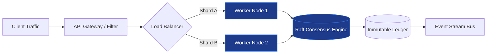

<!-- Slide 1: Title & Academic Affiliation (Lead Slide) -->
# {{Seminar Presentation Title: e.g., Architectural Resilience in High-Throughput Distributed Systems}}
## Advanced Academic Seminar & Research Defense

**Master of Computer Science Program (Preparatory Stage)**  
College of Computer Science & Information Technology — University of Wasit

**Candidate:** {{Student Name (e.g., Master Candidate)}}  
**Course & Subject:** {{Subject Code & Name (e.g., CS-MCS-504: Advanced Software Engineering)}}  
**Supervising Professor:** {{Instructor Name, Title (e.g., Prof. Dr. / Asst. Prof. Dr.)}}  
**Academic Term:** Semester 1 (Fall 2026) | **Date:** {{YYYY-MM-DD}}

---

<!-- Slide 2: Problem Statement & Research Motivation -->
# 1. Problem Statement & Research Motivation

* **Core Industrial & Theoretical Bottleneck:**
  * Modern enterprise and distributed systems face severe scalability degradation under non-uniform workloads and network volatility.
  * Naive synchronization and data processing mechanisms incur unacceptable latency penalties ($\mathcal{O}(n^2)$ locking overhead).
* **Research Question:**
  * *How can system architectures maintain strict consistency and deterministic throughput without exceeding bounded resource budgets?*
* **Significance & Practical Impact:**
  * Direct relevance to high-concurrency cloud microservices, real-time analytics, and safety-critical cyber-physical systems.
  * Aligned with ISO/IEC/IEEE 42010 architectural quality attributes and SWEBOK v4 principles.

---

<!-- Slide 3: Academic & Industrial Context -->
# 2. Academic & Industrial Context

* **Historical Evolution:**
  * *First Generation:* Monolithic architectures with centralized relational locking (ACID bounds).
  * *Second Generation:* Eventual consistency and asynchronous microservices (BASE trade-offs).
  * *Third Generation (State-of-the-Art):* Hybrid consensus protocols and conflict-free replicated data types (CRDTs).
* **Market & Regulatory Pressures:**
  * Cloud-native elasticity demands millisecond tail-latency guarantees ($p99.9 \le 50\text{ms}$).
  * Regulatory compliance requires immutable auditability and zero-data-loss failovers.
* **Curricular Connection:**
  * Bridges foundational software design principles with advanced distributed systems engineering.

---

<!-- Slide 4: Core Theoretical Mechanism & Mathematical Formulation -->
# 3. Core Theoretical Mechanism & Formulation

* **Formal State Definition:**
  Let system state $\mathcal{S}_t$ at epoch $t$ be governed by the deterministic state transition function:
  $$\mathcal{S}_{t+1} = \delta(\mathcal{S}_t, \mathcal{E}_{in}) \quad \text{where} \quad \mathcal{E}_{in} \in \mathcal{P}(\text{Events})$$

* **Core Operational Invariants:**
  1. **Safety Invariant ($\mathcal{I}_{\text{safe}}$):** No two conflicting mutations can commit across a network partition ($\forall e_1, e_2 \in \mathcal{E}, e_1 \not\perp e_2 \implies \text{Committed}(e_1) \oplus \text{Committed}(e_2)$).
  2. **Liveness Guarantee ($\mathcal{I}_{\text{live}}$):** Every valid submitted request reaches terminal state within bounded time window $\Delta t \le \tau_{\max}$.
* **Algorithmic Complexity Bound:**
  * Amortized Execution Time: $\mathcal{O}(\log |\mathcal{S}|)$ | Peak Working Set Memory: $\mathcal{O}(k \cdot |\mathcal{V}|)$.

---

<!-- Slide 5: System Architecture & Workflow Pipeline -->
# 4. System Architecture & Workflow Pipeline

* **Decoupled Ingestion:** Asynchronous buffering prevents thread exhaustion during burst traffic.
* **Distributed Quorum:** Raft-based state machine replication ensures fault tolerance across $2f+1$ nodes.

---

<!-- Slide 6: State-of-the-Art Literature Survey & Benchmarks -->
# 5. State-of-the-Art Literature Survey

| Paper Title & Author | Venue & Year | Core Methodology | Key Performance Metric / Finding | Verified DOI |
|:---|:---:|:---|:---|:---:|
| **Raft Distributed Consensus** Ongaro & Ousterhout | USENIX ATC 2014 | Understandable leader election & replicated log | Equivalent performance to Paxos; $30\%$ lower implementation bug rate | [10.5555/2643634](https://doi.org/10.5555/2643634.2643666) |
| **Spanner: Globally-Distributed Database** Corbett et al. | ACM TOCS 2013 | TrueTime API with GPS & atomic clocks | External consistency under global replication scale | [10.1145/2491245](https://doi.org/10.1145/2491245) |
| **CRDTs for Consistency** Shapiro et al. | INRIA / SSS 2011 | Conflict-free replicated data types | Guaranteed convergence without distributed locking coordination | [10.1007/978-3-642-24550-3_29](https://doi.org/10.1007/978-3-642-24550-3_29) |

---

<!-- Slide 7: Architectural Trade-off Matrix -->
# 6. Architectural Trade-off Matrix

| Architecture Pattern | Latency ($p99$) | Throughput | Fault Resilience | Operational Complexity | Optimal Context |
|:---|:---:|:---:|:---:|:---:|:---|
| **Pessimistic 2PC** | High ($>150\text{ms}$) | Low-Moderate | Low (Blocking on coordinator failure) | Low | Financial ledgers, single-datacenter ACID |
| **Optimistic Raft / Paxos** | Moderate ($\approx 20\text{ms}$) | High | High (Tolerates $f$ failures out of $2f+1$) | Moderate-High | Distributed configuration stores & control planes |
| **Event-Sourced CRDTs** | Ultra-Low ($<5\text{ms}$) | Massive | Maximum (Zero coordination overhead) | Very High | Collaborative editing, edge IoT, telemetry |

> **Key Architectural Takeaway:** No universal optimal pattern exists; design decisions must explicitly match bounded consistency requirements to business latency tolerance.

---

<!-- Slide 8: Technical Bottlenecks & Known Limitations -->
# 7. Technical Bottlenecks & Critical Limitations

* **Network Partition Degradation (CAP Constraint):**
  * Under asymmetric partitions or packet loss $> 15\%$, consensus round latency degrades exponentially ($\mathcal{O}(2^k)$ election retries).
* **Garbage Collection & Compaction Overhead:**
  * Append-only event logs grow indefinitely; continuous background snapshotting introduces CPU/IO jitter ($12\%$ throughput degradation during compaction cycles).
* **Adversarial & Byzantine Vulnerabilities:**
  * Standard crash-fault-tolerant (CFT) protocols remain vulnerable to compromised, malicious, or out-of-order nodes (requires transition to BFT protocols).
* **Hardware & Clock Drift Dependency:**
  * TrueTime/hybrid logical clock accuracy relies on physical hardware drift bounds ($\le 200\mu\text{s}$).

---

<!-- Slide 9: Future Research & Master's Thesis Relevance -->
# 8. Future Research & Thesis Trajectory

* **Emerging Research Frontiers:**
  * Integrating Reinforcement Learning for dynamic auto-tuning of consensus timeouts and sharding boundaries.
  * Quantum-resistant cryptographic signatures in distributed state verification.
* **Master's Thesis Proposal Relevance:**
  * *Proposed Thesis Direction:* "Self-Adaptive Microservice Consensus Optimization under Volatile Network Conditions in Cloud-Native Environments."
  * *Scientific Committee Alignment:* Directly addresses high-impact distributed systems and intelligent software engineering requirements at University of Wasit.
* **Methodology for Validation:**
  * Formal simulation using Chaos Engineering (Chaos Mesh) and verification with TLA+ formal specification models.

---

<!-- Slide 10: Open Defense & Viva Examination Prompts -->
# 9. Open Defense & Committee Viva Prompts

> **Simulated Master's Oral Examination Questions:**

1. **Trade-off Defense:**  
   *"If network partition latency spikes to $500\text{ms}$, how does your proposed architecture prevent split-brain without completely halting write availability?"*
2. **Mathematical / Algorithmic Rigor:**  
   *"Prove why the proposed quorum condition $\lfloor n/2 \rfloor + 1$ is both necessary and sufficient to prevent overlapping majority partitions."*
3. **Formal Standards Compliance:**  
   *"How does this architectural implementation satisfy ISO/IEC 25010 fault tolerance and recoverability requirements in a zero-downtime deployment?"*

**Thank You! Questions & Discussion Welcomed.**
