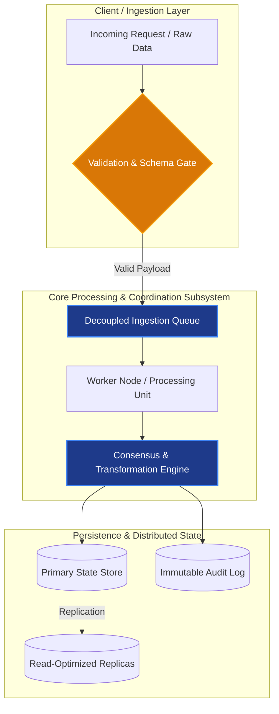

# {{Subject Code}}: {{Topic Title}}

> **Academic Level:** Master of Computer Science (Preparatory Coursework Stage)  
> **Institution:** College of Computer Science & Information Technology, University of Wasit  
> **Prerequisites:** {{Prerequisite Concepts or Baseline Knowledge}}

```
+-------------------------------------------------------------------------------+
|                             TOPIC NAVIGATION & SCOPE                          |
|                                                                               |
|  Subject: {{Subject Name}}             | Week: {{Week Number}}               |
|  Cognitive Tier: 3-Tier Progressive     | Literature Base: IEEE / ACM / ISO   |
|  Target Retention: Master's Exam & Oral Defense Gateway                       |
+-------------------------------------------------------------------------------+
```

---

## 1. Executive Summary & Conceptual Bridge (Tier 1)

### 1.1. High-Level Technical Synopsis (English)
{{Provide a concise, academically rigorous 2-paragraph executive overview of the concept. Explain its role within advanced computer science, its structural significance in large-scale systems or algorithms, and the critical problem it solves over naive approaches.}}

### 1.2. Intuitive Mental Model & Arabic Conceptual Bridge (*الجسر المفاهيمي والحدسي*)
> **الرؤية الهندسية والحدس التطبيقي:**  
> {{اشرح هنا الفلسفة الجوهرية والسبب الهندسي الذي أدى لابتكار هذا المفهوم أو هذا النمط المعماري. لماذا فشلت الحلول التقليدية؟ كيف نتخيل آلية العمل بتشبيه واقعي عميق يربط بين الأنظمة الموزعة أو الخوارزميات المتقدمة وبين الواقع العملي؟}}

- **المشكلة الجوهرية (*The Root Bottleneck*):** {{وصف المشكلة الأساسية التي يعالجها المفهوم}}
- **الحل الهندسي (*The Architectural Solution*):** {{كيف يحل المفهوم هذه العقدة بشكل فعال}}
- **القاعدة الذهبية (*The Golden Invariant*):** {{القانون الهندسي أو الرياضي الذي لا يمكن كسره}}

---

## 2. Formal Theoretical Foundations & Mechanics (Tier 2)

### 2.1. Mathematical Formulation & Notation
{{Present the formal mathematical definitions, state transitions, algorithm formulations, or structural equations using LaTeX.}}

$$
\mathcal{F}(x) = \sum_{i=1}^{n} w_i \cdot \phi_i(x) + \epsilon
$$

Where:
- $\mathcal{F}(x)$: {{Definition of the objective function or system state}}
- $w_i$: {{Definition of parameters or weights}}
- $\phi_i(x)$: {{Basis transformation or component function}}
- $\epsilon$: {{Error margin, noise, or network latency tolerance}}

### 2.2. Algorithmic Workflow & Operational Invariants
1. **Phase 1 (Initialization / Discovery):** {{Step-by-step technical breakdown}}
2. **Phase 2 (Processing / Transformation):** {{Step-by-step technical breakdown}}
3. **Phase 3 (Consensus / Output / Commit):** {{Step-by-step technical breakdown}}

---

## 3. Architectural & Workflow Diagrams



---

## 4. Master's-Level Academic Rigor, Standards & Literature (Tier 3)

### 4.1. Formal International Standards & Frameworks
- **IEEE/ISO/ACM Standard:** {{e.g., ISO/IEC/IEEE 42010 (Architecture Description), ISO/IEC 25010 (System Quality), IEEE 802.11, SWEBOK v4}}
  - *Applicable Clause/Guideline:* {{Specific section, metric, or mandatory design principle}}
  - *Engineering Implication:* {{How this standard dictates compliance and validation in enterprise / research software}}

### 4.2. Foundational & State-of-the-Art Academic Literature
> **Mandatory Rule:** All citations must feature valid, resolvable DOIs (`https://doi.org/...`). Zero citation fabrication.

1. **Seminal Paper:**
   - **Citation:** [{{Author(s)}}, "{{Paper Title}}", *{{Journal/Conference Name}}*, {{Year}}](https://doi.org/10.xxxx/xxxxx)
   - **Key Finding:** {{Core theoretical breakthrough or foundational theorem}}
   - **Relevance to Wasit MCS Curriculum:** {{Direct mapping to syllabus topics}}

2. **Contemporary State-of-the-Art (Recent 3-5 Years):**
   - **Citation:** [{{Author(s)}}, "{{Paper Title}}", *{{Journal/Conference Name}}*, {{Year}}](https://doi.org/10.xxxx/xxxxx)
   - **Key Finding:** {{Modern optimization, neural architecture, distributed consensus improvement}}
   - **Thesis Research Gateway:** {{How this paper sparks a thesis proposal idea}}

---

## 5. Comparative Trade-off Matrix

| Design Option / Architectural Pattern | Key Strengths (+) | Critical Bottlenecks & Weaknesses (-) | Computational & Space Complexity | Optimal Production / Research Context |
|:---|:---|:---|:---|:---|
| **{{Pattern / Algorithm A}}** | • High throughput<br>• Fault tolerant | • Eventual consistency window<br>• Increased network overhead | $\mathcal{O}(n \log n)$ time<br>$\mathcal{O}(n)$ space | High-concurrency distributed microservices |
| **{{Pattern / Algorithm B}}** | • Strict serializability<br>• Deterministic state | • Single point of contention<br>• High lock latency | $\mathcal{O}(n^2)$ worst-case<br>$\mathcal{O}(1)$ auxiliary space | Financial transaction engines & ACID ledgers |
| **{{Pattern / Algorithm C}}** | • Minimal memory footprint<br>• Rapid convergence | • Sensitive to hyperparameter drift<br>• Approximation error | $\mathcal{O}(k \cdot d)$ time<br>$\mathcal{O}(k)$ space | Real-time edge computing & IoT stream mining |

---

## 6. Practical Enterprise Scenario & Failure Mode Analysis

### 6.1. Production Scenario Description
> **Context:** An enterprise platform experiences {{describe realistic production challenge: e.g., network partition under 100k requests/sec, data skew in clustering, adversarial gradient attacks}}.

```python
# Concrete Architectural / Algorithmic Implementation Pattern
class ArchitecturalComponent:
    def __init__(self, capacity: int, timeout_ms: int):
        self.capacity = capacity
        self.timeout_ms = timeout_ms
        self.state = "INITIALIZED"

    def execute_transaction(self, payload: dict) -> bool:
        """
        Executes bounded, fail-safe processing under high concurrency.
        Guarantees idempotency and invariants.
        """
        # Guard clause: Invariant verification
        if not self._verify_invariants(payload):
            raise ValueError("Invariant violation detected: rejecting payload")
            
        # Core execution logic
        return True

    def _verify_invariants(self, payload: dict) -> bool:
        return bool(payload and "id" in payload)
```

### 6.2. Boundary Conditions & Failure Modes (*نقاط الانهيار وحالات الحافة*)
- **Failure Mode 1 (Cascading Collapse / Race Condition):** {{Detailed analysis of when the system fails, threshold conditions, and mitigation strategy}}
- **Failure Mode 2 (Data Skew / Resource Exhaustion):** {{Detailed analysis of memory/CPU explosion under non-uniform distribution}}
- **Mitigation Strategy (Architectural Circuit Breaker / Backpressure):** {{Specific design pattern to restore stability}}

---

## 7. High-Probability Exam Questions & Distractor Teardown

### 7.1. Scenario-Based Multiple Choice Question (Master's Difficulty)

**Scenario:** {{Present a non-trivial architectural or algorithmic scenario involving multiple conflicting constraints (latency, consistency, accuracy, security).}}

**Question:** Which design decision represents the most mathematically and architecturally sound solution?

- **[A]** {{Option A text - plausible but flawed}}
- **[B]** {{Option B text - correct optimal solution}}
- **[C]** {{Option C text - subtle distractor based on undergraduate misconception}}
- **[D]** {{Option D text - distractor violating boundary invariants}}

<details>
<summary><b>🔍 View Model Answer, Distractor Analysis & Bilingual Rationale</b></summary>

> **Correct Answer:** **[B]**

#### English Technical Rationale:
{{Detailed explanation proving why Option B satisfies all mathematical constraints, preserves system invariants, and adheres to standard specifications.}}

#### Arabic Intuitive Explanation (*تفكيك السؤال والمغالطات بالعربي*):
{{شرح دقيق باللغة العربية يوضح كيف تم بناء السؤال، ولماذا الخيار [B] هو الصحيح هندسياً، مع تفكيك الفخاخ المفاهيمية في بقية الخيارات.}}

#### Distractor Breakdown:
- **Why [A] is False:** {{Explains the specific flaw, e.g., ignores lock contention under high write skew}}
- **Why [C] is False:** {{Explains why this common assumption fails in distributed/advanced settings}}
- **Why [D] is False:** {{Explains the mathematical or operational invariant violation}}

#### Authoritative Source / Standard:
- Ref: [{{Author et al., Year}}](https://doi.org/10.xxxx/xxxxx) / ISO Standard Clause {{X.X}}
</details>

---

### 7.2. Oral Defense / Analytical Exam Question

**Viva Question:** *"{{Provide a demanding question challenging the candidate to defend an architectural compromise or explain a theoretical contradiction under committee cross-examination}}"*

<details>
<summary><b>🎓 View Comprehensive Oral Defense Model Answer & Rubric</b></summary>

#### Candidate Model Response:
> *"Distinguished Committee Members, when evaluating {{Topic}}, the core architectural tension lies between {{Factor 1}} and {{Factor 2}}. While naive implementations assume {{Common Myth}}, formal analysis under {{Theorem/Standard}} dictates that..."*
>
> 1. **Foundational Defense:** {{Core theoretical argument}}
> 2. **Empirical Evidence:** {{Citation of benchmark results or formal proofs}}
> 3. **Risk Mitigation:** {{How the candidate handles the unavoidable trade-off in production}}

#### Evaluation Rubric:
- **Excellence ($\ge 75\%$):** Explicitly identifies trade-off bounds, cites formal standard/DOI, and defends failure modes.
- **Passing ($60\% - 74\%$):** Correctly explains mechanics but glosses over edge-case failure modes.
- **Fail ($< 60\%$):** Confuses basic definitions or suggests impossible zero-cost trade-offs.
</details>

---

## 8. Spaced Repetition Flashcard Prompts (Anki Deck Extraction Block)

```tsv
# Target Deck: Master-CS::{{Subject_Name}}::Week_{{Week_Number}}
{{Question / Front of Card 1}}	{{Concise, Rigorous Answer / Back of Card 1}}	{{Tag1}} {{Tag2}}
{{Question / Front of Card 2 (Bilingual Intuition)}}	{{Arabic Intuitive Rationale + Key English Invariant}}	{{Tag1}} {{Tag2}}
{{Formula / Theorem Identifier}}	{{LaTeX Equation + Variable Definitions + Complexity Bound}}	{{Tag1}} {{Tag2}}
```
