# 📅 Semester 1: Official Master's Course Timetable & Study Schedule

> **Academic Program:** Master of Computer Science (Coursework Year 2026–2027)  
> **Faculty:** College of Computer Science & Information Technology, University of Wasit  
> **Total Credit Units:** 13 Credit Hours (6 Mandatory Core Courses)  
> **Attendance Policy:** Minimum 85% attendance required under Iraqi Postgraduate Regulations (Law No. 26/1990).

---

## 1. Master Class Timetable (Sunday – Tuesday)

All on-campus master's lectures take place across three intensive lecture days:

```
+=======================================================================================================+
|                                    SEMESTER 1 ON-CAMPUS TIMETABLE                                     |
+===========+==============================+============================================================+
| Day       | Time Window                  | Course Name & Faculty Member                               |
+===========+==============================+============================================================+
| Sunday    | 08:30 AM – 10:30 AM (2 hrs)  | 🔐 Cyber Security (2 Credits)                              |
|           |                              |    Instructor: Asst. Prof. Dr. Huda Lafta Majeed           |
|           +------------------------------+------------------------------------------------------------+
|           | 10:30 AM – 11:30 AM (1 hr)   | 🇬🇧 English Language (1 Credit)                             |
|           |                              |    Instructor: Asst. Prof. Dr. Haidar Akab Alwan           |
+-----------+------------------------------+------------------------------------------------------------+
| Monday    | 08:30 AM – 10:30 AM (2 hrs)  | ⛏️ Data Mining (2 Credits)                                  |
|           |                              |    Instructor: Asst. Prof. Dr. Ahmed Shakir Abd Al-Rida    |
|           +------------------------------+------------------------------------------------------------+
|           | 10:30 AM – 01:30 PM (3 hrs)  | 🏗️ Advanced Software Engineering (3 Credits)               |
|           |                              |    Instructor: Asst. Prof. Dr. Ali Fahim Ni'ma             |
+-----------+------------------------------+------------------------------------------------------------+
| Tuesday   | 08:30 AM – 10:30 AM (2 hrs)  | 🧠 Soft Computing (2 Credits)                              |
|           |                              |    Instructor: Prof. Dr. Abdul Hadi Mohammed Adkhil        |
|           +------------------------------+------------------------------------------------------------+
|           | 10:30 AM – 01:30 PM (3 hrs)  | 🤖 Artificial Intelligence (3 Credits)                     |
|           |                              |    Instructor: Prof. Dr. Saif Ali Al-Saidi                 |
+===========+==============================+============================================================+
```

### Course Summary & Unit Weights

| Code | Subject Directory | Course Name | Credit Units | Weekly Contact Hours | Primary Reference / Style |
|:---:|:---|:---|:---:|:---:|:---|
| CS601 | `01_Cyber_Security` | Cyber Security | 2 | 2 hrs | Enterprise threat modeling, ransomware cases, IoT/cloud risk |
| EN601 | `02_English_Language` | English Language | 1 | 1 hr | *Q: Skills for Success 4*, academic vocabulary & defense discourse |
| CS602 | `03_Data_Mining` | Data Mining | 2 | 2 hrs | Han & Kamber textbook, attribute definitions, feature extraction |
| CS603 | `04_Advanced_Software_Eng` | Advanced Software Engineering | 3 | 3 hrs | SWEBOK v3, ISO 25010, Bass/Clements Architecture Tactics |
| CS604 | `05_Soft_Computing` | Soft Computing | 2 | 2 hrs | Jang-Sun-Mizutani, Sivanandam, Fuzzy Inference & Chain Codes |
| CS605 | `06_Artificial_Intelligence` | Artificial Intelligence | 3 | 3 hrs | Russell & Norvig (AIMA), advanced heuristic search & agents |
| **Total** | | **6 Courses** | **13 Credits** | **13 Contact Hrs** | |

---

## 2. Independent Study & Research Allocation Plan (Wednesday – Saturday)

In postgraduate education, 1 lecture contact hour demands approximately **2 to 3 hours of self-directed study and literature exploration**. The 4 non-lecture days (Wednesday, Thursday, Friday, Saturday) are systematically structured into focused research, coding, and synthesis blocks:

```mermaid
gantt
    title Semester 1 Weekly Rhythm & Cognitive Allocation
    dateFormat  X
    axisFormat %s
    section Campus Lectures
    Sunday (CyberSec + English)   :active, 0, 3
    Monday (DataMining + Adv SE)  :active, 3, 8
    Tuesday (SoftComp + AI)        :active, 8, 13
    section Independent Deep Work
    Wednesday (Adv SE & Literature)  :crit, 13, 19
    Thursday (AI & Soft Computing)  :crit, 19, 25
    Friday (Data Mining & Cyber)  :crit, 25, 31
    Saturday (English & Review Deck):crit, 31, 37
```



### Day-by-Day Autonomous Schedule

#### 🔵 Wednesday: Architecture & Primary Literature Deep-Dive (Advanced SE Focus)
- **Morning (09:00 – 12:30):**
  - **Focus:** `04_Advanced_Software_Eng` (Dr. Ali Fahim Ni'ma).
  - **Activities:** Deep reading of assigned IEEE/ACM literature, SWEBOK knowledge areas, and ISO/IEC 25010 quality scenarios.
  - **Deliverable:** Generate/update bilingual study notes in `03_Study_Notes/` with Mermaid C4 architecture diagrams.
- **Afternoon (02:00 – 05:00):**
  - **Focus:** Architecture Trade-off Analysis (ATAM / CBAM) and case scenario evaluations.
  - **Deliverable:** Formulate trade-off matrices comparing competing architectural patterns.
- **Evening (08:00 – 10:00):**
  - **Focus:** Literature paper verification and DOI logging in `04_Academic_Papers/`.

---

#### 🟢 Thursday: Algorithmic Rigor & Mathematical Prototyping (AI & Soft Computing)
- **Morning (09:00 – 12:30):**
  - **Focus:** `06_Artificial_Intelligence` (Dr. Saif Ali Al-Saidi).
  - **Activities:** State space search proofs, heuristic admissibility derivations ($h(n) \le h^*(n)$), game tree minimax & alpha-beta pruning drills.
  - **Deliverable:** Mathematical proofs and Python verification scripts for heuristic graph search.
- **Afternoon (02:00 – 05:00):**
  - **Focus:** `05_Soft_Computing` (Dr. Abdul Hadi Mohammed Adkhil).
  - **Activities:** Jang-Sun-Mizutani slide analysis, fuzzy set membership function calculations, Mamdani/Sugeno inference engine derivations, and Freeman chain code contour simulations.
  - **Deliverable:** Solved numerical examples for fuzzy union/intersection and contour chain sequence generation.
- **Evening (08:00 – 10:00):**
  - **Focus:** Anki flashcard generation for AI heuristics and Soft Computing definitions in `07_Quizzes_&_Anki/`.

---

#### 🟡 Friday: Data Prep, Feature Engineering & Practical Security Triage
- **Morning (09:00 – 12:30):**
  - **Focus:** `03_Data_Mining` (Dr. Ahmed Shakir Abd Al-Rida).
  - **Activities:** Han & Kamber textbook exercises (Chapters 2–6), attribute mathematical classification (nominal, ordinal, interval, ratio), distance metric proofs (Euclidean, Manhattan, Minkowski, Cosine).
  - **Deliverable:** Step-by-step problem solutions and feature extraction workflows.
- **Afternoon (02:00 – 05:00):**
  - **Focus:** `01_Cyber_Security` (Dr. Huda Lafta Majeed).
  - **Activities:** Practical attack scenario analysis (ransomware incident triage, cloud lateral movement, IoT firmware threat modeling).
  - **Deliverable:** Enterprise security incident response briefs with mitigation checklists.
- **Evening (08:00 – 10:00):**
  - **Focus:** Thesis idea scanning in `03_Thesis_&_Research_Transition/02_Research_Topic_Ideas/`.

---

#### 🟣 Saturday: Academic Communication, Marp Seminar Deck & Weekly Review
- **Morning (09:00 – 12:00):**
  - **Focus:** `02_English_Language` (Dr. Haidar Akab Alwan).
  - **Activities:** *Q: Skills for Success 4* unit reading, Academic Word List (AWL) mastery, critical thinking writing drills, abstract drafting.
  - **Deliverable:** Short academic summary and grammar exercise completion.
- **Afternoon (01:30 – 04:30):**
  - **Focus:** Seminar Preparation & Presentation Skills.
  - **Activities:** Writing Markdown slide decks (`seminar.md`) using `template-marp-seminar.md` and compiling to PDF via `@marp-team/marp-cli`.
  - **Deliverable:** Production-ready PDF seminar slide deck in the upcoming presentation course folder.
- **Evening (06:00 – 09:30):**
  - **Focus:** Comprehensive Weekly Spaced Retrieval & Sunday Pre-reading.
  - **Activities:** 50-question mixed MCQ drill using `@examiner` persona across all 6 courses; reviewing Sunday lecture materials for Dr. Huda and Dr. Haidar.
  - **Deliverable:** Update `ACTIVE_STATE.md` and `LEARNER_MODEL.md` with weekly mastery benchmarks.

---

## 3. Weekly Time Budget Distribution

| Category | On-Campus Lecture | Deep Reading & Notes | Problem Solving / Code | Spaced Retrieval & Quizzes | Total Weekly Commitment |
|:---|:---:|:---:|:---:|:---:|:---:|
| **Advanced Software Eng** (3 Cr) | 3.0 hrs | 4.0 hrs | 3.0 hrs | 1.5 hrs | **11.5 hrs** |
| **Artificial Intelligence** (3 Cr) | 3.0 hrs | 3.5 hrs | 3.5 hrs | 1.5 hrs | **11.5 hrs** |
| **Data Mining** (2 Cr) | 2.0 hrs | 3.0 hrs | 2.0 hrs | 1.0 hr | **8.0 hrs** |
| **Soft Computing** (2 Cr) | 2.0 hrs | 3.0 hrs | 2.0 hrs | 1.0 hr | **8.0 hrs** |
| **Cyber Security** (2 Cr) | 2.0 hrs | 2.5 hrs | 2.0 hrs | 1.0 hr | **7.5 hrs** |
| **English Language** (1 Cr) | 1.0 hr | 1.5 hrs | 1.0 hr | 0.5 hr | **4.0 hrs** |
| **Thesis Seed Exploration** | — | 2.5 hrs | — | — | **2.5 hrs** |
| **Total Study Load** | **13.0 hrs** | **20.0 hrs** | **13.5 hrs** | **6.5 hrs** | **53.0 hrs / week** |

---

## 4. Key Academic Milestones (Semester 1)

- **Week 01:** Course orientation, textbook distribution, syllabus baseline establishment.
- **Week 04:** First oral presentations and initial quiz round across all departments.
- **Week 08:** Midterm Examination Week (*امتحانات نصف الفصل الأول*) — Weight: 30%–40% of coursework total.
- **Week 12:** Seminar presentation round 2 & submission of advanced term research reports.
- **Week 15:** Coursework closure, final assignment grading, practical project defense.
- **Week 16:** Final Semester Examination (*امتحانات نهاية الفصل الأول*) — Passing Floor: 60%.
- **Post-Semester 1 Break:** GPA evaluation and preliminary thesis topic brainstorming with potential advisors.
