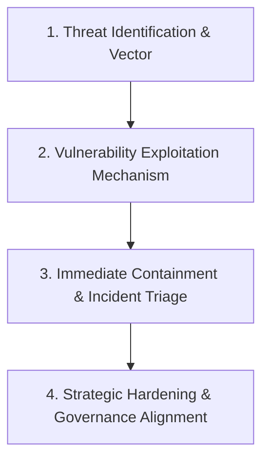

# 👨‍🏫 Instructor Dossier: Asst. Prof. Dr. Huda Lafta Majeed

> **Subject:** 🔐 Cyber Security (CS601)  
> **Academic Rank:** Assistant Professor (*أستاذ مساعد دكتور*)  
> **Administrative Role:** 🔴 **Head of the Postgraduate Studies Department (مقررة قسم الدراسات العليا)** — College of Computer Science & IT  
> **Faculty:** College of Computer Science & Information Technology, University of Wasit  
> **Lecture Slot:** Sunday, 08:30 AM – 10:30 AM (2 Credit Hours)  
> **Status:** Active Coursework Instructor (Semester 1, 2026–2027)

> ⚠️ **Because she heads Postgraduate Studies, her word is the reference.** Anything she states in lecture is recorded **as given** — it is not to be questioned, challenged, or "corrected" against a textbook. The student's instruction: *"لمن هي تكول فهاهي"* (when she says it, that's it). She is also well-liked; no friction is wanted.

---

## 1. Professional Background & Academic Persona

Asst. Prof. Dr. Huda Lafta Majeed is a senior faculty member specializing in information security, network defense, enterprise risk management, and organizational cybersecurity. 

Her pedagogical model is **heavily practical, scenario-driven, and enterprise-oriented**. Unlike purely theoretical cryptographers, Dr. Huda prioritizes:
- Real-world threat dissection and attack kill-chains.
- Enterprise incident response and digital triage.
- Practical defense engineering (firewalls, IDS/IPS, network segmentation, Zero Trust).
- Organizational security governance and compliance standards (NIST CSF, ISO/IEC 27001).

---

## 2. Core Focus Areas & Preferred Technical Themes

```
+-----------------------------------------------------------------------------------------------+
|                                DR. HUDA'S HIGH-YIELD DOMAINS                                  |
+===============================================================================================+
| 1. Ransomware & Cyber Kill Chains | Initial vector -> Privilege escalation -> Exfiltration   |
| 2. Cloud Security & Shared Risk   | IaaS/PaaS/SaaS boundaries, FinSecure hybrid cloud threats |
| 3. IoT & SCADA/CPS Security       | Constrained device vulnerabilities, firmware analysis     |
| 4. Incident Response & Forensics  | Memory dump analysis, log correlation, containment rules  |
| 5. Social Engineering & Phishing  | Spear phishing, BEC (Business Email Compromise), triage   |
+-----------------------------------------------------------------------------------------------+
```

### Key Syllabus Emphases
1. **Ransomware Outbreak Scenarios:** Step-by-step breakdown of modern extortion operations (e.g., LockBit, BlackCat) targeting financial and educational infrastructure.
2. **Data-Leak & Insider Threat Triage:** Analyzing DLP alerts, unauthorized exfiltration over covert channels, and endpoint telemetry.
3. **Cloud Risk in Hybrid Environments:** Shared Responsibility Model breakdowns, IAM misconfigurations, S3 bucket exposures, and lateral movement in multi-cloud architectures.
4. **IoT and Critical Infrastructure:** Weak authentication, unpatched firmware, insecure communication protocols (MQTT, CoAP), and industrial control systems (SCADA).

---

## 3. Examination Philosophy & Question Tendencies

Dr. Huda’s exams are designed to test **analytical diagnostic competence** rather than rote memorization.

### 3.1 ✅ Confirmed exam mechanics (student-verified, 2026-09-18)

These are facts reported by the student from the actual lectures — treat them as authoritative over the general tendencies below.

| Question | Confirmed answer |
|:---|:---|
| **Mathematical models** | If the question **gives numbers**, apply the formula and compute. If there are **no numbers** (or nothing asked as a number), she wants an **analytical scenario** instead. |
| **Daily quiz (امتحان يومي)** | **Written, essay type (مقالي)** — explicitly *not* MCQ. **~10 minutes**, most likely at the start of the lecture. |
| **Daily quiz stakes** | **Soft.** Her words: *"if I see you've answered, I won't count it; if I see you haven't answered, I'll count it against you. I'll help you — but I want you to read, even if you're forced to."* It is a **reading-compliance check**. |
| **Scenario questions** | A short real-world story (e.g. a bank customer's account drops $100,000). Answer by walking the story **step by step**, naming the **CIA pillar** involved at each step, and writing the **matching techniques in parentheses** — e.g. *Integrity (hashing SHA-256, digital signatures, version control)*, then *Availability (redundancy, load balancing, DDoS mitigation)*. |
| **Scenario answer depth** | **Either** deep step-by-step **or** whole-scenario analysis — *"الاجابتين صح"*, both are accepted. |
| **Peripheral models** | Some formulas (e.g. $R(t)$) only need *awareness* — "know that this law is used here", nothing more. |
| **Her stated thresholds** | Where she gives a decision rule in her own words — e.g. on $\min R$: *"above 100 → there is investment; below 100 → there is none"* — **record it verbatim and treat it as authoritative.** Do not audit it, question it, or flag it as needing clarification. |
| **Excluded content** | She explicitly excluded the **case-study chapter** (Stuxnet / Colonial Pipeline / GDPR). |

**Practical consequence:** the **CIA Triad plus its technique lists must be memorised cold**, because they are the vocabulary written inside the parentheses of every scenario answer. Formulas are for *recognition* — spot whether the question is a numbers question or a scenario question.

### Typical Question Formats

| Format | Description | Example Question Prototype |
|:---|:---|:---|
| **Scenario-Based Case Study** | A multi-paragraph real-world enterprise breach is presented. The student must diagnose the entry point, identify vulnerabilities, and design containment. | *"A commercial bank detects abnormal encrypted SMB traffic between internal workstations and an external IP at 02:00 AM. Diagnose the attack stage, outline 3 immediate containment actions, and propose permanent architectural remediations."* |
| **Comparative Defense Matrix** | Demands a structured markdown table comparing security controls, protocols, or architectural paradigms. | *"Construct a trade-off matrix comparing Traditional Perimeter Security vs. Zero Trust Architecture across Authentication, Lateral Movement, and Administrative Overhead."* |
| **Threat Vector & Mechanism Breakdown** | Requires technical step-by-step explanation of an exploit mechanism. | *"Explain how a Cross-Site Scripting (XSS) attack leads to session hijacking. Illustrate the flow diagram and provide both client-side and server-side mitigations."* |
| **Governance & Incident Workflow** | Testing knowledge of structured response frameworks (NIST SP 800-61r2). | *"Outline the 4 phases of the Incident Response Lifecycle and map them to a Ransomware recovery event."* |

---

## 4. Master-Level Response Strategy (How to Score $\ge 85\%$)

To achieve top marks on Dr. Huda’s exams and assignments, every answer must follow a structured **4-Tier Diagnostic Framework**:



### The 4-Tier Answer Structure:
1. **Tier 1: Threat Identification & Vector:** State the exact category of threat (e.g., *Spear-phishing with malicious payload executing dynamic DLL injection*).
2. **Tier 2: Technical Vulnerability & Mechanism:** Explain *why* the attack succeeded (e.g., *Missing egress filtering, lack of endpoint EDR telemetry, unsegmented VLAN*).
3. **Tier 3: Tactical Containment (Immediate Action):** Prescribe immediate, actionable steps (e.g., *Isolate infected hosts at switch port level, revoke active Kerberos tickets, freeze compromised AWS IAM credentials*).
4. **Tier 4: Strategic Remediation (Long-Term Defense):** Cite formal industry standards (e.g., *Implement Zero Trust micro-segmentation, mandate FIDO2 hardware MFA, align with NIST CSF PR.AC-1*).

### What Dr. Huda Penalizes ❌
- **Vague non-technical generalizations:** Writing *"Install an antivirus program and train employees"* will receive minimal credit.
- **Ignoring the business context:** Failing to address operational impact or regulatory reporting (e.g., notifying data protection authorities during a data leak).
- **Purely theoretical textbook regurgitation:** Skipping practical containment steps.

---

## 5. Seminar & Presentation Expectations

- **Topic Selection:** Focus on modern emerging threats (e.g., AI-driven deepfake phishing, software supply chain attacks like SolarWinds/XZ Utils, Cloud-native Kubernetes security).
- **Slide Deck Style:** Professional Marp presentation format (10–12 slides). Avoid dense walls of text; use architecture flow diagrams (Mermaid) and tabular comparisons.
- **Oral Delivery:** Deliver in formal academic English. Be ready for rapid-fire oral questions on defense trade-offs (e.g., *"What is the performance cost of enabling deep packet inspection on this gateway?"*).

---

## 6. Doctor-Specific Agent Tuning Prompt (`@examiner` & `@tutor`)

```yaml
doctor_profile:
  name: "Asst. Prof. Dr. Huda Lafta Majeed"
  subject: "Cyber Security"
  rigor_level: "Master of Science (Postgraduate)"
  exam_style: "Practical enterprise incident scenarios, multi-vector breach triage, mitigation matrices"
  forbidden_responses:
    - "Generic advice like 'use strong passwords' without specifying PAM or MFA architecture"
  scoring_rubric:
    technical_precision: 40%
    incident_triage_actionability: 30%
    standards_and_architecture: 30%
```
