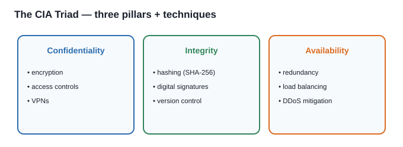
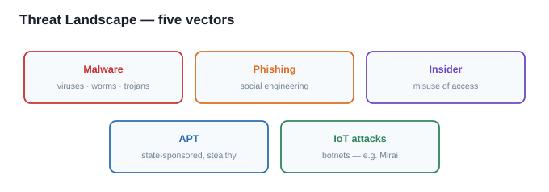
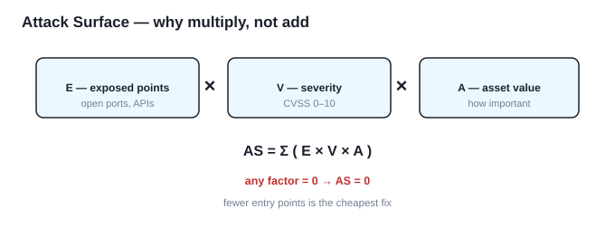

# الأمن السيبراني — Week 1: الأساسيات

> كل اقتباس إنكليزي معلَّم بـ `W1 Pn` هو حرفياً من مادة الدكتورة (الملزمة، صفحة n). والباقي شرح عربي فهمي.

> **دليل القراءة — أنواع المحتوى:** كل قسم موسوم بنوعه علمود ما يتلخبط عليك وقت المراجعة، واللستات الإنجليزية تبقى نظيفة ومفصولة عن الشرح:
> - **شرح + تعريف** — تعريف المفهوم وشرحه، بدون لستة.
> - **شرح + تعداد** — نشرح المفهوم، وبعده نعدّد عناصره بلستة نظيفة.
> - **تعداد فقط** — اللستة الإنجليزية هي المحتوى؛ تنحفظ حرفياً وما تنغلف بشرح.
> - **نقاط + شرح** — مجموعة نقاط، كل وحدة مشروحة لحالها.

---

## القسم 1 — تعريف الأمن السيبراني ونشأته
> **نوع المحتوى:** شرح + تعريف

> **W1 P1** "Cybersecurity refers to the practice of protecting systems, networks, applications, and data from cyber threats, unauthorized access, or damage. It encompasses technical, legal, managerial, and social aspects."

> **W1 P1** "Definition: The set of tools, policies, security concepts, safeguards, risk management approaches, and technologies to protect the cyber environment."

**المعنى:** الأمن السيبراني = حماية الأنظمة والشبكات والتطبيقات والبيانات من التهديدات والوصول غير المصرّح به والضرر. ويشمّل أربعة جوانب: **تقني + قانوني + إداري + اجتماعي**.

**النطاق:** من الأجهزة الشخصية → أنظمة المؤسسات → **البنية التحتية الوطنية الحرجة**.

> **W1 P1** "Importance: Cybersecurity is directly linked to national security, economic stability, and privacy protection."

### التطور التاريخي
> **نوع المحتوى:** نقاط + شرح

| الفترة | المرحلة |
|:---|:---|
| **1960s** | أول ذِكر مع ARPANET وأجهزة الـ mainframe |
| **1980s–90s** | الفيروسات والديدان ومضادات الفيروسات |
| **2000s** | الأمن السيبراني يصير جزءاً من التجارة الإلكترونية والمصرفية |
| **2010s–الآن** | APT · Ransomware · IoT · AI · Zero Trust |

### المعادلة ① — الأمن كمشكلة تحسين
> **W1 P1** "Mathematical Viewpoint: Cybersecurity as an optimization problem, where the goal is to minimize risk R while maximizing security investments."

$$\min R = \sum_{i=1}^{n} P_i \cdot I_i - \sum_{j=1}^{m} C_j$$

| الرمز | المعنى |
|:---|:---|
| $P_i$ | احتمال حصول التهديد $i$ |
| $I_i$ | تأثير التهديد $i$ |
| $C_j$ | الاستثمار في ضابط الأمان $j$ |

**الفكرة:** نقلّل الخطر ونزيد الاستثمار **معاً** — مو حماية وخلاص. **قاعدة الدكتورة (حرفية):** إذا الناتج فوق **100** → فيه استثمار؛ إذا تحت 100 → ما فيه استثمار.

> [!CONCEPT] بطاقة بحث: ARPANET
> - **شنو هو:** الشبكة العسكرية الأمريكية (1969) اللي منها تطور الإنترنت، وأول سياق ظهر فيه مفهوم أمن الشبكات.
> - **ارتباطه بالمحاضرة:** أول مرحلة بالتطور التاريخي.

> [!CONCEPT] بطاقة بحث: Zero Trust (عدم الثقة الافتراضية)
> - **شنو هو:** نموذج أمني مبدؤه **"لا تثق بأحد، تحقّق من كل شي"** — حتى داخل الشبكة.
> - **شلون يشتغل:** كل طلب يُصادَق ويُصرَّح له على حدة (بدل "الثقة الافتراضية" داخل المحيط).
> - **ارتباطه بالمحاضرة:** يظهر بمرحلة **2010s–الآن** بالتطور التاريخي.

---

## القسم 2 — الأهمية والنطاق والمجالات
> **نوع المحتوى:** شرح + تعداد

> **W1 P2** "Individuals: Protecting personal devices, emails, social media accounts, and banking details. Enterprises: Ensuring business continuity, customer trust, and legal compliance. Governments: Protecting national security, defense, and e-governance infrastructure. Global Trade: Safeguarding cross-border digital commerce and financial systems."

**اللستة التالية (المستويات الأربعة) تُحفظ حرفياً:**

| المستوى | شنو يحمي |
|:---|:---|
| **Individuals** | الأجهزة الشخصية · الإيميلات · السوشيال ميديا · بيانات المصرف |
| **Enterprises** | استمرارية العمل · ثقة العملاء · الامتثال القانوني |
| **Governments** | الأمن الوطني · الدفاع · البنية التحتية للحكومة الإلكترونية |
| **Global Trade** | التجارة الرقمية عبر الحدود · الأنظمة المالية |

### المجالات الأساسية
> **W1 P2** "Key Domains: Network Security (firewalls, IDS/IPS). Application Security (secure coding, OWASP standards). Cloud Security (encryption, IAM, virtualization). IoT Security (lightweight encryption, anomaly detection). Mobile Security (sandboxing, malware detection). Industrial Control Systems (ICS) Security."

**اللستة التالية (المجالات الستة) تُحفظ حرفياً — مرتبة ومنفصلة عن الشرح:**

| # | المجال | أدواته |
|:--:|:---|:---|
| 1 | Network Security | firewalls · IDS/IPS |
| 2 | Application Security | secure coding · OWASP |
| 3 | Cloud Security | encryption · IAM · virtualization |
| 4 | IoT Security | lightweight encryption · anomaly detection |
| 5 | Mobile Security | sandboxing · malware detection |
| 6 | ICS Security | حماية أنظمة التحكّم الصناعي |

> القائمة **قابلة للتوسّع** (مثل AI Security، Supply-Chain Security).

### المعادلة ② — التعرّض للخطر عبر الزمن
> **W1 P2** "Mathematical Model – Cyber Risk Exposure: R(t) = Σ Pᵢ(t) · Iᵢ(t)"

$$R(t) = \sum_{i=1}^{n} P_i(t) \cdot I_i(t)$$

**المعنى:** الخطر المتوقع عند زمن $t$ = مجموع (احتمال كل تهديد × تأثيره) عند نفس الزمن. مطلوب **معرفة سطحية فقط** (وعي بوجود القانون).

> [!CONCEPT] بطاقة بحث: IAM (Identity and Access Management)
> - **شنو هو:** إدارة الهويات والصلاحيات — مَن يدخل، ولأي مورد، وبأي صلاحية.
> - **شلون يشتغل:** حسابات + أدوار (roles) + سياسات وصول + مصادقة متعددة العوامل.
> - **ارتباطه بالمحاضرة:** أداة أساسية في **Cloud Security**.

> [!CONCEPT] بطاقة بحث: IDS/IPS
> - **شنو هو:** **IDS** يكشف الاختراق ويُنبّه؛ **IPS** يكشفه **ويمنعه** فوراً.
> - **شلون يشتغل:** IDS يراقب الترافيك ويطابقه مع تواقيع أو يكتشف الشذوذ؛ IPS يتدخل ويحجب.
> - **ارتباطه بالمحاضرة:** أداة **Network Security**.

> [!CONCEPT] بطاقة بحث: OWASP
> - **شنو هو:** منظمة تعطي **معايير أمن التطبيقات**، وأشهرها **OWASP Top 10** (أخطر 10 ثغرات تطبيقات).
> - **شلون يشتغل:** قائمة مرجعية للمطوّرين لتجنّب ثغرات مثل SQL Injection و XSS.
> - **ارتباطه بالمحاضرة:** أداة **Application Security** (وهي أيضاً مثال على الثغرات بالقسم 5).

> [!CONCEPT] بطاقة بحث: ICS Security
> - **شنو هو:** حماية **أنظمة التحكّم الصناعي** (مصانع، شبكات كهرباء، مياه).
> - **شلون يشتغل:** فصل الشبكات + مراقبة + تحديثات مدروسة (لا يجوز إيقاف النظام).
> - **ارتباطه بالمحاضرة:** المجال السادس بقائمة المجالات.

---

## القسم 3 — ثالوث CIA (أهم شي بالوحدة)
> **نوع المحتوى:** شرح + تعداد

> **W1 P2** "The CIA Triad (Confidentiality, Integrity, Availability) is the backbone of cybersecurity."

**الفكرة:** ثالوث CIA هو **العمود الفقري** للأمن السيبراني — كل جواب سيناريو يُبنى عليه. الجدول التالي (الأركان الثلاثة + تقنياتها) يُحفظ حرفياً ويرتّب:

> **W1 P2** "Confidentiality: Preventing unauthorized access to data. Techniques: encryption, access controls, VPNs."
>
> **W1 P3** "Integrity: Ensuring data is accurate and unaltered. Techniques: hashing (SHA-256), digital signatures, version control."
>
> **W1 P3** "Availability: Ensuring resources are accessible when needed. Techniques: redundancy, load balancing, DDoS mitigation."

| الركن | التعريف | التقنيات (تُكتب بالقوس) |
|:---|:---|:---|
| **Confidentiality** (السرّية) | منع الوصول غير المصرّح به | encryption · access controls · VPNs |
| **Integrity** (السلامة) | ضمان البيانات دقيقة وغير معدّلة | hashing (SHA-256) · digital signatures · version control |
| **Availability** (التوفر) | ضمان الموارد متاحة وقت الحاجة | redundancy · load balancing · DDoS mitigation |

### المعادلة ③ — دالة المنفعة الأمنية
> **W1 P3** "Mathematical Model – Security Utility Function: U(C, I, A) = αC + βI + γA"

$$U(C, I, A) = \alpha C + \beta I + \gamma A$$

| الرمز | المعنى |
|:---|:---|
| $C, I, A$ | قيم مُنظَّمة (0–1) للسرّية والسلامة والتوفر |
| $\alpha, \beta, \gamma$ | **أوزان الأهمية** لنظام معيّن |

> **W1 P3** "In healthcare, confidentiality (α) has higher weight than availability."

**يعني الأوزان مو ثابتة — تتغير حسب المجال:**

| المجال | الركن الأثقل | ليش |
|:---|:---|:---|
| Healthcare | **Confidentiality (α)** | خصوصية سجلات المرضى |
| Banking | **Integrity (β)** | تغيّر رقم بالحساب = كارثة |
| Emergency services | **Availability (γ)** | النظام لازم يشتغل دائماً |

> [!CONCEPT] بطاقة بحث: Encryption (التشفير)
> - **شنو هو:** تحويل البيانات لصيغة غير مفهومة، لا يفكّها إلا مَن عنده المفتاح.
> - **شلون يشتغل:** بيانات + مفتاح → ciphertext؛ والعكس بالمفتاح الصحيح.
> - **ارتباطه بالمحاضرة:** تقنية **Confidentiality** الأساسية.

> [!CONCEPT] بطاقة بحث: Hashing (SHA-256)
> - **شنو هو:** دالة تُنتج **بصمة رقمية ثابتة الطول** لأي بيانات؛ أي تغيير ولو بحرف يغيّر البصمة تماماً.
> - **شلون يشتغل:** `SHA-256(data) → 256-bit hash`. تقارن البصمة الأصلية بالحالية لكشف التعديل.
> - **ارتباطه بالمحاضرة:** تقنية **Integrity** الأولى.

> [!CONCEPT] بطاقة بحث: Digital Signatures (التوقيع الرقمي)
> - **شنو هو:** توقيع بالمفتاح الخاص يثبت **المصدر** و**عدم التعديل**.
> - **شلون يشتغل:** المُرسِل يوقّع ببصمة + مفتاحه الخاص؛ المستلم يتحقق بالمفتاح العام.
> - **ارتباطه بالمحاضرة:** تقنية **Integrity** (تُثبت السلامة والأصالة).

> [!CONCEPT] بطاقة بحث: DDoS Mitigation
> - **شنو هو:** صدّ هجمات **إغراق الخدمة** (تعطيل التوفر بترافيك ضخم).
> - **شلون يشتغل:** فلترة الترافيك + توزيعه على شبكات تنظيف (scrubbing centers).
> - **ارتباطه بالمحاضرة:** تقنية **Availability**.

> [!CONCEPT] بطاقة بحث: Load Balancing & Redundancy
> - **شنو هو:** **Load balancing** يوزّع الحمل على عدة سيرفرات؛ **Redundancy** نسخ احتياطية جاهزة.
> - **شلون يشتغل:** لو سيرفر وقع، غيره يكمّل بلا توقف للمستخدم.
> - **ارتباطه بالمحاضرة:** تقنيتا **Availability**.

---

## القسم 4 — مشهد التهديدات
> **نوع المحتوى:** شرح + تعداد

> **W1 P3** "The modern cyber threat landscape includes: Malware: Viruses, worms, Trojans, ransomware. Phishing & Social Engineering: Exploiting human trust. Insider Threats: Employees misusing access. Advanced Persistent Threats (APTs): State-sponsored, stealthy long-term attacks. IoT Attacks: Botnets (e.g., Mirai)."

**اللستة التالية (أنواع التهديدات الخمسة) تُحفظ حرفياً — منفصلة عن الشرح:**

| النوع | الوصف |
|:---|:---|
| **Malware** | فيروسات · ديدان · أحصنة طروادة · Ransomware |
| **Phishing & Social Engineering** | استغلال الثقة البشرية |
| **Insider Threats** | موظفون يسيئون استخدام صلاحياتهم |
| **APT** | مدعومة من دول · خفية · طويلة المدى |
| **IoT Attacks** | Botnets — مثال: **Mirai** |

**اتجاهات 2023–2024 (حرفي):**

> **W1 P4** "Ransomware damages expected to exceed $20 billion. Cloud-related attacks rising due to misconfigurations. AI-powered attacks growing."

### المعادلة ④ — سطح الهجوم
> **W1 P4** "Mathematical Model – Attack Surface Metric: AS = Σ (Eⱼ · Vⱼ · Aⱼ). This quantifies how 'attackable' a system is."

$$AS = \sum_{j=1}^{m} (E_j \cdot V_j \cdot A_j)$$

| الرمز | المعنى | مجاله |
|:---|:---|:---|
| $E_j$ | عدد نقاط الدخول المكشوفة | عدد صحيح |
| $V_j$ | شدة الثغرة (CVSS) | 0.0 – 10.0 |
| $A_j$ | قيمة الأصل (asset value) | أي رقم |

**ليش ضرب (×) مو جمع (+):** الخطر يحتاج **الثلاثة معاً**؛ لو أي عامل = صفر → الناتج صفر.

| الحالة | $E$ | $V$ | $A$ | $E\times V\times A$ | المعنى |
|:---|:--:|:--:|:--:|:--:|:---|
| مكشوف + ثغرة + بيانات مهمة | 5 | 8 | 1000 | **40,000** | خطر حقيقي |
| مكشوف بس بلا ثغرة | 5 | **0** | 1000 | **0** | محصّن |
| بيه ثغرة بس مسكّر | **0** | 8 | 1000 | **0** | ما يوصله أحد |
| مكشوف + ثغرة بس فاضي | 5 | 8 | **0** | **0** | ما يستاهل |

**مثال محلول:** مكوّنان — الأول $E=3, V=8, A=100$، والثاني $E=2, V=5, A=300$.

$$3 \times 8 \times 100 = 2400 \quad;\quad 2 \times 5 \times 300 = 3000 \quad;\quad AS = 2400 + 3000 = \boxed{5400}$$

**الأخطاء الشائعة:** لا تجمع الأعمدة عمودياً أول؛ اضرب **سطر سطر** وبعدها اجمع. ولا تنسَ $A_j$.

> [!CONCEPT] بطاقة بحث: Ransomware
> - **شنو هو:** برمجية تُشفّر بيانات الضحية وتطلب فدية لفكّها.
> - **شلون يشتغل:** يدخل (غالباً ببريد تصيّد أو ثغرة) → يشفّر الملفات → يطلب دفعاً.
> - **ارتباطه بالمحاضرة:** نوع Malware، وأضراره تجاوزت **$20 مليار** بالاتجاهات.

> [!CONCEPT] بطاقة بحث: APT (Advanced Persistent Threat)
> - **شنو هو:** هجوم **مدعوم من دولة**، خفي، يبقى داخل الشبكة **طويل المدى** لسرقة معلومات.
> - **شلون يشتغل:** تسلّل → تثبيت أقدام → حركة جانبية → تسريب بطيء بلا اكتشاف.
> - **ارتباطه بالمحاضرة:** من أنواع مشهد التهديدات.

> [!CONCEPT] بطاقة بحث: Botnet / Mirai
> - **شنو هو:** شبكة أجهزة مخترَقة (غالباً IoT) تُستخدَم لهجوم واحد (مثل DDoS). **Mirai** أشهر مثال.
> - **شلون يشتغل:** يخترق كاميرات/راوترات ضعيفة كلمة السر → يربطها ببعض → يوجّهها بهجوم ضخم.
> - **ارتباطه بالمحاضرة:** مثال IoT Attacks.

> [!CONCEPT] بطاقة بحث: CVSS (Common Vulnerability Scoring System)
> - **شنو هو:** معيار عالمي يقيس **خطورة الثغرة** من **0 إلى 10**.
> - **شلون يشتغل:** Low (0.1–3.9) · Medium (4.0–6.9) · High (7.0–8.9) · Critical (9.0–10.0).
> - **ارتباطه بالمحاضرة:** هو قيمة $V_j$ بمعادلة سطح الهجوم.

---

## القسم 5 — المخاطر والثغرات والاستغلالات
> **نوع المحتوى:** شرح + تعداد

> **W1 P4** "Risk: Function of likelihood and impact. Vulnerabilities: Weaknesses in software, hardware, or human factors. (Examples: OWASP Top 10, CVEs). Exploits: Tools/methods used to take advantage of vulnerabilities."

**اللستة التالية (المفاهيم الثلاثة) تُحفظ حرفياً:**

| المفهوم | التعريف |
|:---|:---|
| **Risk** | دالة **الاحتمال × التأثير** |
| **Vulnerabilities** | نقاط ضعف برمجية/عتادية/بشرية (OWASP Top 10 · CVEs) |
| **Exploits** | أدوات/طرق تستغل الثغرة |

**نماذج تقييم المخاطر:**

> **W1 P4** "Models for Risk Assessment: OCTAVE: Operationally Critical Threat, Asset, and Vulnerability Evaluation. FAIR: Factor Analysis of Information Risk. NIST RMF: Risk Management Framework."

**اللستة التالية (نماذج التقييم الثلاثة) تُحفظ حرفياً — منفصلة عن الشرح:**

| النموذج | التوسّع | شنو يعطي |
|:---|:---|:---|
| **OCTAVE** | Operationally Critical Threat, Asset, and Vulnerability Evaluation | منهجية تقييم مخاطر مبنية على الأصول (3 مراحل) |
| **FAIR** | Factor Analysis of Information Risk | تحليل كمّي للخطر (عوامل الخطر + حساب رقمي) |
| **NIST RMF** | Risk Management Framework | إطار أمريكي لإدارة المخاطر بدورة 6 خطوات |

### المعادلة ⑤ — توزيع احتمال الخطر
> **W1 P4** "Mathematical Model – Risk Probability Distribution: P(R > r) = 1 − F(r)"

$$P(R > r) = 1 - F(r)$$

**المعنى:** احتمال أن يتجاوز الخطر قيمةً معيّنة $r$. و$F(r)$ هي **دالة التوزيع التراكمي (CDF)**، فمجالها $[0,1]$ دائماً.

> [!CONCEPT] بطاقة بحث: Risk (الخطر)
> - **شنو هو:** احتمال حصول ضرر × حجم تأثيره.
> - **شلون يشتغل:** خطر عالٍ = احتمال كبير + تأثير كبير.
> - **ارتباطه بالمحاضرة:** حجر الأساس بالقسم الخامس.

> [!CONCEPT] بطاقة بحث: CVE (Common Vulnerabilities and Exposures)
> - **شنو هو:** معرّف عالمي موحّد لكل ثغرة معروفة (مثل `CVE-2021-44228`).
> - **شلون يشتغل:** كل ثغرة تاخذ رقماً فريداً ليتشاركها العالم.
> - **ارتباطه بالمحاضرة:** مثال على **الثغرات**.

> [!CONCEPT] بطاقة بحث: OCTAVE
> - **شنو هو:** منهجية تقييم مخاطر مبنية على الأصول: **O**perationally **C**ritical **T**hreat, **A**sset, and **V**ulnerability **E**valuation.
> - **شلون يشتغل:** ثلاث مراحل — ملفات تهديد مبنية على الأصول → تحديد ثغرات البنية → استراتيجية وخطط أمنية.
> - **ارتباطه بالمحاضرة:** من نماذج تقييم المخاطر.

> [!CONCEPT] بطاقة بحث: FAIR
> - **شنو هو:** منهجية تحليل كمّي للخطر: **F**actor **A**nalysis of **I**nformation **R**isk.
> - **شلون يشتغل:** تفكّك الخطر لعوامل (احتمال الحدث × حجم الخسارة) وتحسبها رقمياً.
> - **ارتباطه بالمحاضرة:** من نماذج تقييم المخاطر.

> [!CONCEPT] بطاقة بحث: NIST RMF
> - **شنو هو:** إطار إدارة المخاطر الأمريكي (**R**isk **M**anagement **F**ramework) من NIST.
> - **شلون يشتغل:** دورة: تصنيف → اختيار الضوابط → تنفيذ → تقييم → تصريح → مراقبة.
> - **ارتباطه بالمحاضرة:** من نماذج تقييم المخاطر.

> [!CONCEPT] بطاقة بحث: CDF (دالة التوزيع التراكمي)
> - **شنو هو:** دالة تعطي احتمال أن يكون المتغير **أقل من أو يساوي** قيمة معيّنة.
> - **شلون يشتغل:** مجالها $[0,1]$؛ ولذلك $1 - F(r)$ = احتمال الذيل (الخطر يتجاوز $r$).
> - **ارتباطه بالمحاضرة:** أساس معادلة $P(R>r)$.

---

## القسم 6 — التطور والسياسات
> **نوع المحتوى:** شرح + تعداد

> **W1 P5** "Early Cybersecurity (1960s–1990s): Focused on perimeter defense (firewalls, antivirus). Modern Cybersecurity (2000s–present): Cloud, IoT, mobile, AI-driven attacks."

**السياسات والأطر:**

> **W1 P5** "Policies and Frameworks: GDPR (EU): Data protection and privacy. HIPAA (US): Healthcare information protection. NIST/ISO 27001: International standards."

**اللستة التالية (الأطر الثلاثة) تُحفظ حرفياً — منفصلة عن الشرح:**

| الإطار | الجهة | يغطي |
|:---|:---|:---|
| **GDPR** | الاتحاد الأوروبي | حماية البيانات والخصوصية |
| **HIPAA** | أمريكا | حماية معلومات الرعاية الصحية |
| **NIST / ISO 27001** | دولية | المعايير الدولية |

**المنظورات العالمية:** US → NIST CSF · EU → GDPR/ENISA · Middle East → National Cybersecurity Councils.

### المعادلة ⑥ — مؤشر الامتثال للسياسات
> **W1 P5** "Mathematical Model – Policy Compliance Index (PCI) = Σ wₖ cₖ / Σ wₖ"

$$PCI = \frac{\sum_{k=1}^{n} w_k \cdot c_k}{\sum_{k=1}^{n} w_k}$$

| الرمز | المعنى |
|:---|:---|
| $c_k$ | مستوى الامتثال للمتطلب $k$ (0–1) |
| $w_k$ | وزن أهمية المتطلب |

**المعنى:** متوسط **موزون** — يقيس شكد المؤسسة ملتزمة بالسياسة، مع إعطاء المتطلبات الأهم وزناً أكبر. الناتج بين 0 و 1.

> [!CONCEPT] بطاقة بحث: GDPR
> - **شنو هو:** لائحة حماية البيانات الأوروبية (2018) — من أقوى قوانين الخصوصية عالمياً.
> - **شلون يشتغل:** تفرض حقوقاً للأفراد وغرامات ضخمة على المخالفين.
> - **ارتباطه بالمحاضرة:** من السياسات والأطر.

> [!CONCEPT] بطاقة بحث: HIPAA
> - **شنو هو:** قانون أمريكي لحماية **معلومات الرعاية الصحية**.
> - **شلون يشتغل:** يفرض ضوابط على مَن يتعامل مع السجلات الطبية.
> - **ارتباطه بالمحاضرة:** من السياسات والأطر.

> [!CONCEPT] بطاقة بحث: ISO/IEC 27001
> - **شنو هو:** معيار دولي لنظام إدارة أمن المعلومات (ISMS).
> - **شلون يشتغل:** يعطي متطلبات لبناء وإدارة وتدقيق نظام أمني داخل المؤسسة.
> - **ارتباطه بالمحاضرة:** من المعايير الدولية.

> [!CONCEPT] بطاقة بحث: NIST CSF
> - **شنو هو:** إطار الأمن السيبراني الأمريكي: Identify · Protect · Detect · Respond · Recover.
> - **شلون يشتغل:** خمس وظائف تغطي دورة إدارة الخطر الأمني.
> - **ارتباطه بالمحاضرة:** المنظور الأمريكي.

> [!CONCEPT] بطاقة بحث: ENISA
> - **شنو هو:** وكالة الاتحاد الأوروبي للأمن السيبراني.
> - **شلون يشتغل:** تنسيق السياسات + إصدار إرشادات + دعم الدول الأعضاء.
> - **ارتباطه بالمحاضرة:** المنظور الأوروبي.

---

## القسم 7 — نمط أسئلة الدكتورة والتدريب
> **نوع المحتوى:** نقاط + شرح

**عندها نمطان للسؤال:**

| إذا السؤال… | شنو تريد | شلون تجاوب |
|:---|:---|:---|
| **بيه أرقام** | تطبّق المعادلة | اكتب المعادلة → عوّض → الناتج → فسّره بسطر |
| **ما بيه أرقام** (سيناريو) | تحليل | خطوة خطوة → سمّي ركن CIA → **وبالقوس اكتب التقنيات** |

**القوس هو المفتاح:** بدون التقنيات داخل القوس، الجواب ناقص. مثال: `Integrity (hashing SHA-256, digital signatures, version control)`.

### سيناريوهات تدريب

**1)** عميل بمصرف شاف حسابه نقص 100,000 دولار مرة وحدة، وطلع السبب خلل برمجي، وانصلّح ورجع المبلغ.
> تغيّرت بياناته → **Integrity** (hashing SHA-256, digital signatures, version control). النظام ما كان يشتغل صح → **Availability** (redundancy, load balancing, DDoS mitigation).

**2)** مستشفى: سجلات مرضى ظهرت لمستخدم غير مصرّح له؛ التحقيق بيّن حساب موظف قديم لا زال فعّالاً.
> انكشفت البيانات → **Confidentiality** (encryption, access controls, VPNs). السبب: فشل ضبط الوصول → يُعالَج بـ **access controls** + مراجعة دورية للحسابات.

**3)** جامعة: نظام التسجيل وقع بوقت التسجيل وآلاف الطلاب ما قدروا يسجّلوا.
> النظام ما كان متاح وقت الحاجة → **Availability** (redundancy, load balancing, DDoS mitigation). الحل طويل المدى: سيرفرات احتياطية + توزيع الحمل.

**4)** متجر إلكتروني: سعر المنتج بالفاتورة تغيّر بعد ما أكّد العميل الطلب.
> البيانات تغيّرت بعد التأكيد → **Integrity** (hashing SHA-256, digital signatures, version control)؛ و**version control** يبيّن متى ومَن غيّر السعر.

---

## Retrieval Set (للمراجعة السريعة)

**[RS-01]** عرّف الأمن السيبراني.
> حماية الأنظمة والشبكات والتطبيقات والبيانات من التهديدات والوصول غير المصرّح به والضرر — بجوانب تقنية وقانونية وإدارية واجتماعية.

**[RS-02]** اذكر أركان ثالوث CIA وتقنياتها.
> Confidentiality (encryption, access controls, VPNs) · Integrity (hashing SHA-256, digital signatures, version control) · Availability (redundancy, load balancing, DDoS mitigation).

**[RS-03]** ليش الأوزان α, β, γ تختلف؟
> لأنها تعتمد على المجال: Healthcare يرجّح السرّية، Banking يرجّح السلامة، Emergency services يرجّح التوفر.

**[RS-04]** اكتب معادلة سطح الهجوم، وليش ضرب مو جمع.
> `AS = Σ(Eⱼ·Vⱼ·Aⱼ)`. ضرب لأن الخطر يحتاج العوامل الثلاثة معاً؛ لو أي عامل صفر → الناتج صفر.

**[RS-05]** شنو قيمة $V_j$ ومنين تجيبها؟
> شدة الثغرة، من **CVSS** (0–10): Low · Medium · High · Critical.

**[RS-06]** اذكر نماذج تقييم المخاطر الثلاثة.
> OCTAVE · FAIR · NIST RMF.

**[RS-07]** اشرح معادلة توزيع احتمال الخطر.
> احتمال أن يتجاوز الخطر قيمةً معيّنة r = 1 − F(r)؛ و F(r) دالة توزيع تراكمي مجالها [0,1]، فالطرح يعطي احتمال الذيل.

**[RS-08]** اذكر الاتجاهات العالمية 2023–2024.
> أضرار الـ ransomware تتجاوز $20 مليار · هجمات السحابة ترتفع بسبب misconfigurations · هجمات مدعومة بالذكاء الاصطناعي تنمو.

**[RS-09]** اذكر السياسات والأطر الثلاثة.
> GDPR (الاتحاد الأوروبي) · HIPAA (أمريكا) · NIST/ISO 27001 (دولية).
