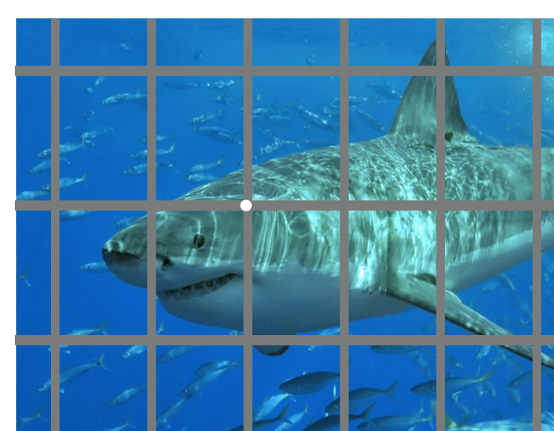
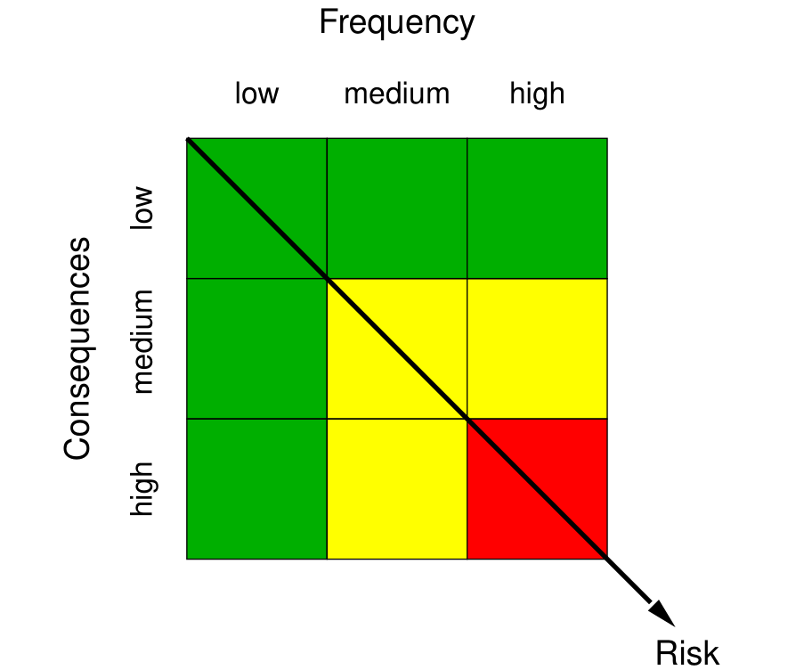
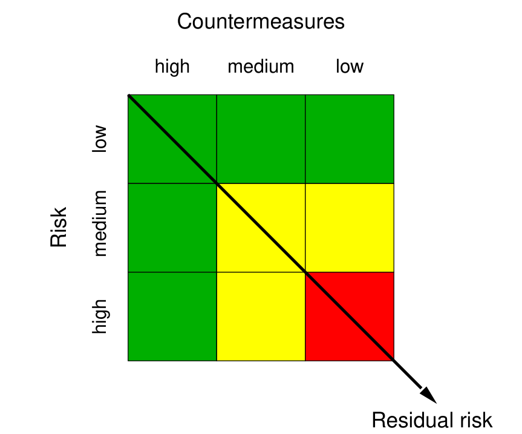
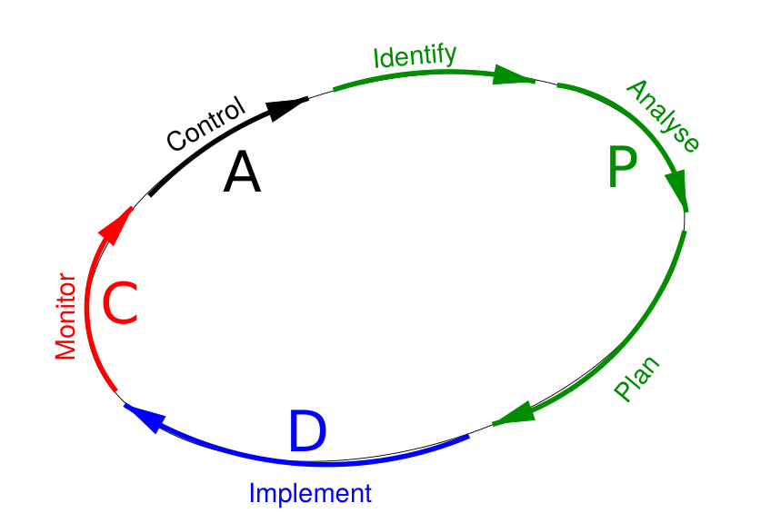

# الجابتر الثاني — Risk (المخاطر والتهديدات)

> **دليل القراءة:** كل مقطع مقسوم ثلاث طبقات:
> **① النص الأصلي (English)** — **النص الكامل حرفياً** من الملزمة (بلا اختصار) · **② الترجمة** — ترجمة كاملة · **③ الشرح الفهمي** — الشرح اللي يفهمك المفهوم.
> **المصدر:** الملزمة = **Sharp, "Risk", *Introduction to Cybersecurity*, Springer, pp.37–56** + مصدر ثانٍ (الأمن الفيزيائي/المصادقة/NIST).
> **⭐ مهم للامتحان:** الأطر الخمسة · ISO (14 فئة) · OCTAVE (3 مراحل) · PDCA · مصفوفتا اللون · المعادلتان · «السؤال بيه ثلاث أجوبة».

---

---

### القسم 1 — What Is Risk?
#### ① النص الأصلي
> In its technical sense, the word risk means the quantitative probability that an error situation occurs and gives rise to damage. In IT security, "damage" is synonymous with a breach of the security policy. This is an objective definition of risk, which must not be confused with subjective risk — the latter also takes human factors such as public attitudes, trust and personality into consideration.

#### ② الترجمة
> «بمعناها التقني، تعني كلمة risk الاحتمال الكمّي (quantitative probability) بأن تحدث حالة خطأ وتؤدي إلى damage. وفي IT security، فإن "damage" مرادفة لخرق الـ security policy. وهذا تعريف objective للخطر، ويجب عدم الخلط بينه وبين الـ subjective risk — فالأخير يأخذ بنظر الاعتبار أيضاً العوامل البشرية مثل المواقف العامة (attitudes) والثقة (trust) والشخصية (personality).»

#### ③ الشرح الفهمي
الـ risk بمعناه التقني مب مجرد "خطر" بالمعنى العام. هو رقم — احتمال (probability) محسوب — إنه يصير خطأ وبعدين ينتج منه damage.

وبـ IT security، شو يعني damage؟ يعني صار breach للـ security policy، يعني تجاوزنا القواعد الأمنية المتفق عليها.

أكو نوعين لازم نفرّق بينهم:

| النوع | يعتمد على | مثال |
|---|---|---|
| objective risk | أرقام وحقائق قابلة للقياس | احتمال إن ينجح هجوم معيّن |
| subjective risk | العوامل البشرية: attitudes، trust، personality | إحساس المستخدم بالخوف أو الثقة |

نقطة مهمة: تعريفنا هنا objective — يعني محسوب ومحدّد بالأرقام، مب مبني على رأي أحد.

---

### القسم 2 — The Threat / Vulnerability / Damage Chain (Fig. 3.1)
#### ① النص الأصلي
> In IT security, damage occurs when a threat is realised against some weakness in the system. A weakness which can be exploited to damage the system is known as a vulnerability. Fig. 3.1 illustrates this idea, where the threat is a shark and the vulnerability is a welding fault in the shark cage.

#### ② الترجمة
> «في IT security، يحدث الـ damage عندما يتحقق threat ضد ضعف ما في النظام. والضعف الذي يمكن استغلاله لإلحاق الضرر بالنظام يُعرف بالـ vulnerability. ويوضّح Fig. 3.1 هذه الفكرة، حيث الـ threat هو قرش (shark) والـ vulnerability هي عيب في اللحام (welding fault) في قفص القرش.»

#### ③ الشرح الفهمي
السلسلة تمشي هيك: threat ← vulnerability ← damage.

- threat: القوة أو الجهة اللي تحاول تضر.
- vulnerability: نقطة ضعف بالنظام قابلة للاستغلال.
- damage: النتيجة — خرق الـ security policy.

مثال القرش (Fig. 3.1) يوضّح كل شي:

| بالتشبيه | بالـ IT | المعنى |
|---|---|---|
| القرش | threat | المهاجم / القوة الخارجية |
| عيب اللحام بالقفص | vulnerability | الثغرة في النظام |
| القفص | النظام نفسه | اللي المفروض يحميك |
| الغوّاص جوّه | الـ asset | اللي يتضرر فعلاً |

الفكرة الأساسية: الضرر ما يصير بمجرد وجود قرش — لازم يكون أكو ثغرة (welding fault) يستغلها. لو القفص سليم، القرش موجود بس ما يأثر عليك.

---

### القسم 3 — Basic Risk S = F × K and the Risk Matrix
#### ① النص الأصلي
> The basic risk, S, of a threat depends on the frequency, F, of attempts to exploit the vulnerability and the consequences, K, of a successful attempt, as expressed in the equation:
>
> $$S = F \times K$$
>
> These concepts are often visualized in a so-called risk matrix, where the result of the "multiplication" is indicated by a colour code: red indicates a high risk associated with the given threat, arising when both the consequences of a successful attack and the frequency of attempts to exploit the vulnerability are high. The yellow areas indicate a medium level and the green areas a low level of risk.

#### ② الترجمة
> «الخطر الأساسي S لأي threat يعتمد على التكرار F لمحاولات استغلال الـ vulnerability، وعلى العواقب K لمحاولة ناجحة، كما في المعادلة: $S = F \times K$. وهذه المفاهيم غالباً ما تُصوَّر على شكل ما يسمى risk matrix، حيث تُشار إلى نتيجة "الضرب" برمز لوني: الأحمر يعني خطراً عالياً مرتبطاً بالـ threat المعني، وينشأ عندما تكون العواقب المترتبة على هجوم ناجح عالية وكذلك تكرار محاولات استغلال الـ vulnerability عالياً. والمناطق الصفراء تعني مستوى متوسطاً، والخضراء مستوى منخفضاً من الخطر.»

#### ③ الشرح الفهمي
الـ basic risk S يطلع من ضرب شيئين: شكد يهجمون عليك (F)، وشكد يضرّونك لو نجحوا (K).

$$S = F \times K$$

| الرمز | الاسم | المعنى |
|---|---|---|
| S | Risk | الخطر الأساسي (basic risk) |
| F | Frequency | تكرار محاولات استغلال الثغرة |
| K | Consequences | حجم الضرر إذا نجحت المحاولة |

يعني لو F عالي (يهجمون عليك هواي) و K عالي (إذا نجح يخرّب هواي)، راح يصير S عالي.

الـ risk matrix تحوّل هذي الأرقام إلى لون:

| اللون | المستوى | متى يطلع |
|---|---|---|
| أحمر | عالي (high) | F عالي و K عالي |
| أصفر | متوسط (medium) | واحد منهم عالي والثاني متوسط |
| أخضر | منخفض (low) | F و K الاثنين واطيين |

الفكرة: كل threat نحدّده على المصفوفة حسب موقعه بـ F و K، واللون يخبرنا بسرعة بأولوية الاهتمام.

---

### القسم 4 — Countermeasures and Residual Risk R = S / M
#### ① النص الأصلي
> The risk is reduced by introducing countermeasures (also known as controls), which must protect against the relevant threat; the reduced risk is known as the residual risk, R. If the threat is evaluated to give a risk S, and the level of countermeasures is M, then the residual risk is often defined by the equation:
>
> $$R = \frac{S}{M}$$
>
> M covers both the number of countermeasures (there can be several things which affect the risk for particular types of attack) and their effectiveness. These relationships are often visualised in a so-called residual risk matrix, where the result of the "division" is again given by a colour code: a high residual risk from a given threat is indicated by red, arising when the risk is high and the level of countermeasures is low. As in the risk matrix, yellow indicates a medium level and green a low level of residual risk.

#### ② الترجمة
> «يُقلَّل الخطر بإدخال countermeasures (وتُعرف أيضاً بالـ controls)، التي يجب أن تحمي من الـ threat المعني؛ والخطر بعد التقليل يُعرف بالـ residual risk أي R. وإذا قُيّم الـ threat ليعطي خطراً S، وكان مستوى الـ countermeasures هو M، فإن الـ residual risk يُعرَّف غالباً بالمعادلة: $R = S / M$. ويشمل M كلاً من عدد الـ countermeasures (إذ يمكن أن تكون هناك عدة أمور تؤثر على الخطر لأنواع معينة من الهجوم) وفاعليتها. وهذه العلاقات غالباً ما تُصوَّر على شكل ما يسمى residual risk matrix، حيث تُعطى نتيجة "القسمة" مرة أخرى برمز لوني: الخطر المتبقي العالي من threat معين يُشار إليه بالأحمر، وينشأ عندما يكون الخطر عالياً ومستوى الـ countermeasures واطئاً. وكما في risk matrix، يشير الأصفر إلى مستوى متوسط والأخضر إلى مستوى منخفض من الـ residual risk.»

#### ③ الشرح الفهمي
الـ countermeasures (أو controls) هي كل شي نضيفه لنقلّل الخطر — firewall، antivirus، encryption، backup، تدريب الموظفين... إلخ.

الخطر بعد ما نضيف الحماية يصير اسمه residual risk (R):

$$R = \frac{S}{M}$$

| الرمز | الاسم | المعنى |
|---|---|---|
| R | Residual risk | الخطر المتبقي بعد الحماية |
| S | Risk | الخطر الأساسي |
| M | Level of countermeasures | مستوى الحماية، ويشمل العدد + الفاعلية |

نقطة مهمة: M مب بس "عدد" الحمايات، لا — يشمل العدد و effective لكل واحدة. عشر جدران حماية ضعيفة يمكن تكون أقل فاعلية من واحد قوي.

الـ residual risk matrix:

| اللون | المستوى | متى يطلع |
|---|---|---|
| أحمر | عالي (high) | S عالي و M واطي |
| أصفر | متوسط (medium) | في توازن بين S و M |
| أخضر | منخفض (low) | S واطي أو M عالي |

الفكرة النهائية: ما يمكن نوصل خطر صفر. دايماً يبقى residual risk، والمهم نخليه ضمن مستوى مقبول (acceptable level).

---

### القسم 5 — Threats in IT Systems
#### ① النص الأصلي
> Many IT users believe mistakenly that the only threat which can prevent the correct operation of their computers is attackers who hack their way into the computer. In reality, the threat pattern is much more varied, and the threats can be related to many different aspects of the computer's operation. We can distinguish between at least four main groups of threats:
>
> - **Hardware related threats**: threats which physically affect the computer itself or the infrastructure on which it depends in order to work as required — harmful surroundings, natural disasters such as storms, physical attacks such as theft, and faults in the infrastructure.
> - **Software related threats**: threats which affect the installed software (applications and the operating system) or which are due to poorly designed or wilfully malicious programs coming from outside — unauthorized modification or deletion of software; wilfully malicious programs (so-called malware) such as viruses, worms, trojan horses and logic bombs; use of poorly designed programs which contain vulnerabilities; use of incorrect or out-of-date software versions; theft or unauthorized copying of software.
> - **Data related threats**: threats which can lead to unauthorized processing (including storage) of data in any way — unwanted storage, modification, disclosure or deletion of data; Inference, that is, collecting accessible data from which it is possible to deduce confidential information which is not directly accessible; "Masquerading" (i.e. pretending to be someone else) and unauthorized access.
> - **Liveware related threats**: threats which are related to human error among the computer's users — social engineering and phishing, as well as IT fraud, forgery and other forms of criminality now carried out with the help of computers.
#### ② الترجمة
> «يعتقد كثير من مستخدمي الـ IT خطأً أن التهديد الوحيد الذي يمكن أن يمنع التشغيل الصحيح لأجهزتهم هو المهاجمون الذين يخترقون الحاسوب. في الواقع، نمط التهديدات أكثر تنوّعًا بكثير، ويمكن أن ترتبط التهديدات بجوانب مختلفة عديدة من عمل الحاسوب. ويمكننا التمييز بين أربع مجموعات رئيسية على الأقل من التهديدات:
>
> - **تهديدات متعلقة بالـ Hardware**: تهديدات تؤثّر فيزيائيًا على الحاسوب نفسه أو على البنية التحتية التي يعتمد عليها ليعمل كما هو مطلوب — بيئة ضارّة، وكوارث طبيعية كالعواصف، وهجمات فيزيائية كالسرقة، وأعطال في البنية التحتية.
> - **تهديدات متعلقة بالـ Software**: تهديدات تؤثّر على البرمجيات المثبّتة (التطبيقات ونظام التشغيل)، أو تكون ناتجة عن برامج مصمَّمة بشكل سيّئ أو خبيثة عن قصد قادمة من الخارج — التعديل أو الحذف غير المصرّح به للبرمجيات؛ والبرامج الخبيثة عن قصد (malware) كالفيروسات والـ worms وأحصنة طروادة والقنابل المنطقية (logic bombs)؛ واستخدام برامج مصمَّمة بشكل سيّئ تحتوي ثغرات؛ واستخدام إصدارات برمجية خاطئة أو قديمة؛ وسرقة البرمجيات أو نسخها دون تصريح.
> - **تهديدات متعلقة بالبيانات (Data)**: تهديدات يمكن أن تؤدي إلى معالجة غير مصرّح بها (بما فيها التخزين) للبيانات بأي طريقة — التخزين أو التعديل أو الإفشاء أو الحذف غير المرغوب فيه للبيانات؛ والاستنتاج (Inference)، أي جمع بيانات متاحة يمكن منها استنتاج معلومات سرية غير متاحة مباشرة؛ و"التنكّر" (Masquerading) أي التظاهر بأنك شخص آخر، والوصول غير المصرّح به.
> - **تهديدات متعلقة بالبشر (Liveware)**: تهديدات مرتبطة بالخطأ البشري عند مستخدمي الحاسوب — الهندسة الاجتماعية (social engineering) والتصيّد (phishing)، إضافة إلى الاحتيال المعلوماتي (IT fraud) والتزوير (forgery) وأشكال أخرى من الجريمة تُنفَّذ الآن بمساعدة الحاسوب.»
#### ③ الشرح الفهمي
هذا القسم يصحّح فكرة غلط شائعة: المستخدم يظن إن الخطر الوحيد هو "الهاكر اللي يخترق الكومبيوتر". المصدر يقول إن نمط التهديدات أوسع بكثير، ويقسّمها لأربع مجموعات رئيسية على الأقل. مفتاح الحفظ: كل مجموعة ترتبط بجزء معيّن من منظومة الكومبيوتر ← الـ hardware، الـ software، الداتا، والبشر (liveware).

| المجموعة | مصدرها | أمثلة |
|---|---|---|
| Hardware related threats | الشي الفيزيائي: الكومبيوتر نفسه أو البنية التحتية اللي يعتمد عليها | بيئة مؤذية (harmful surroundings)، كوارث طبيعية كالعواصف، هجمات فيزيائية كالسرقة، أعطال في البنية التحتية |
| Software related threats | السوفتوير المثبّت (تطبيقات + نظام تشغيل) أو برامج جاية من الخارج مصمّمة بشكل سيئ/خبيثة | تعديل أو حذف غير مصرّح به، malware (فيروسات، worms، trojan horses، logic bombs)، برامج فيها ثغرات، إصدارات خاطئة أو قديمة، سرقة/نسخ السوفتوير |
| Data related threats | البيانات نفسها: أي معالجة (بما فيها التخزين) غير مصرّح بها | تخزين/تعديل/إفشاء/حذف غير مرغوب فيه، Inference (استنتاج معلومة سرية من بيانات متاحة)، Masquerading (تنكّر) ووصول غير مصرّح به |
| Liveware related threats | الخطأ البشري عند المستخدمين | social engineering و phishing، الاحتيال المعلوماتي (IT fraud)، التزوير (forgery) وأشكال جريمة أخرى بمساعدة الكومبيوتر |

ملاحظة مهمة للحفظ: مجموعة الـ Data فيها تهديدين مذكورين بالاسم — الـ **Inference** (استنتاج معلومة سرية من بيانات متاحة بدون وصول مباشر إلها) والـ **Masquerading** (التنكّر بشخصية غيرك). ومجموعة الـ Liveware تربط الخطر بسلوك البشر لا بالجهاز ← يعني حتى لو الأجهزة كلها سليمة، الخطأ البشري يبقى ثغرة.

---

### القسم 6 — Countermeasures
#### ① النص الأصلي
> A threat is blocked by control of a vulnerability with the help of suitable countermeasures, which must of course be adapted to suit the type of threat. For example, but not limited:
>
> - **Threats from attackers outside the system who attack through the Internet**: use firewalls in the network, in order to prevent traffic from the attacker reaching the target.
> - **Threats from malware**: use antivirus programs and other so-called security programs.
> - **Threats such as vandalism, theft and other physical damage to the equipment**: place the equipment in a secure room.
> - **Threats such as unauthorized modification or deletion of data or software**: take regular backup copies.
> - **Threats such as unauthorized access to data**: use encryption or access control.
> - **Threats from personnel and ordinary authorized users**: check personnel and introduce suitable training.
#### ② الترجمة
> «التهديد يُسدّ من خلال السيطرة على ثغرة (vulnerability) بمساعدة تدابير مضادة (countermeasures) مناسبة، وهذه بطبيعة الحال يجب أن تُكيَّف بما يناسب نوع التهديد. على سبيل المثال، وليس على سبيل الحصر:
>
> - **تهديدات من مهاجمين خارج النظام يهاجمون عبر الإنترنت**: استخدام جدران الحماية (firewalls) في الشبكة، لمنع حركة المرور الصادرة من المهاجم من الوصول إلى الهدف.
> - **تهديدات من الـ malware**: استخدام برامج مكافحة الفيروسات (antivirus) وبرامج أمنية أخرى تُسمّى كذلك.
> - **تهديدات مثل التخريب (vandalism) والسرقة وأي ضرر فيزيائي آخر على المعدات**: وضع المعدات في غرفة آمنة (secure room).
> - **تهديدات مثل التعديل أو الحذف غير المصرّح به للبيانات أو البرمجيات**: أخذ نسخ احتياطية منتظمة (backup copies).
> - **تهديدات مثل الوصول غير المصرّح به إلى البيانات**: استخدام التشفير (encryption) أو التحكم بالوصول (access control).
> - **تهديدات من الموظفين والمستخدمين المصرّح لهم العاديين**: فحص الموظفين وإدخال تدريب مناسب.»
#### ③ الشرح الفهمي
الفكرة الأساسية هنا: ما تقدر تحمي شي بدون ما تعرف نوع التهديد. كل تهديد ← إله تدبير مضاد (countermeasure) يناسبه، يعني التدبير ما يكون عام، يكون مكيّف حسب التهديد. المصدر يعطينا ست حالات ويقول "مثلاً بس مو محصور" ← يعني هذي أمثلة مو قائمة كاملة.

| التهديد | التدبير |
|---|---|
| مهاجمون خارج النظام يهاجمون عبر الإنترنت | استخدام firewalls في الشبكة لمنع وصول الترافيك للمهاجم للهدف |
| البرامج الخبيثة (malware) | استخدام برامج antivirus وبرامج أمنية أخرى |
| التخريب (vandalism)، السرقة، والضرر الفيزيائي للمعدات | وضع المعدات في غرفة آمنة (secure room) |
| تعديل أو حذف غير مصرّح به للبيانات أو السوفتوير | أخذ نسخ احتياطية منتظمة (regular backups) |
| وصول غير مصرّح به للبيانات | استخدام encryption أو access control |
| تهديدات من الموظفين والمستخدمين المصرّح لهم العاديين | فحص الموظفين (personnel checks) وإدخال تدريب مناسب (training) |

نقطة تربطها بالوضع العملي: لاحظ إن التدابير هنا موزّعة على نفس مجموعات القسم الأول تقريباً — فيزائي (غرفة آمنة)، سوفتوير (antivirus)، داتا (backup + encryption/access control)، وبشر (فحص وتدريب). يعني الحماية ما تكون من جهة وحدة ← لازم تغطّي كل المجموعات.

---

### القسم 7 — Risk Management
#### ① النص الأصلي
> Risk management deals with all the activities which are related to evaluating and reducing risks. The part of it whose aim is to reduce risk to an acceptable level is often called risk mitigation. There are five generally recognised strategies for this:
>
> - **Risk avoidance**: Keep the target system away from given risks. e.g.: forbid risky behaviour such as use of WiFi.
> - **Risk reduction**: Take proactive steps to prevent losses occurring or to reduce the extent of the loss. e.g.: make use of backups, encryption and so on.
> - **Risk retention**: Allow a certain, agreed amount of "residual risk". e.g.: use reliable, but not redundant communication equipment.
> - **Risk transfer**: Transfer the risk to others. e.g.: set up a contract for outsourcing.
> - **Risk sharing**: Agree with other parties to deal with risks jointly. e.g.: agree on common facilities or mutual insurance.
#### ② الترجمة
> «إدارة المخاطر تتعامل ويا كل الأنشطة المرتبطة بتقييم المخاطر وتقليلها. الجزء اللي هدفه تقليل المخاطرة لمستوى مقبول يُسمى غالبًا risk mitigation. موجودة خمس استراتيجيات معترف بيها عمومًا لهذا الغرض:
>
> - Risk avoidance: إبعاد النظام المستهدف عن مخاطر معينة. مثال: منع سلوك خطير مثل استخدام WiFi.
> - Risk reduction: اتخاذ خطوات استباقية لمنع حدوث الخسائر أو لتقليل حجم الخسارة. مثال: استخدام النسخ الاحتياطية والتشفير وهكذا.
> - Risk retention: السماح بمقدار معين ومتفق عليه من «residual risk». مثال: استخدام معدات اتصال موثوقة لكن غير redundant.
> - Risk transfer: نقل المخاطرة إلى جهات أخرى. مثال: إعداد عقد للـ outsourcing.
> - Risk sharing: الاتفاق ويا أطراف أخرى للتعامل مع المخاطر بشكل مشترك. مثال: الاتفاق على مرافق مشتركة أو تأمين متبادل.»
#### ③ الشرح الفهمي
إدارة المخاطر (Risk Management) هي كل الشغل اللي يدور حول تقييم المخاطر وتقليلها. جزء منها اسمه risk mitigation، أي تخفيض المخاطرة لمستوى مقبول. عدنا 5 استراتيجيات معروفة لهذا الغرض، وكل واحدة إلها مثال عملي:

| الاستراتيجية | شنو تسوي | المثال (e.g.) |
|---|---|---|
| Risk avoidance | تبعد النظام المستهدف عن المخاطرة أساسًا | منع سلوك خطير مثل استخدام WiFi |
| Risk reduction | خطوات استباقية تمنع الخسارة أو تقللها | استخدام backups و encryption وهكذا |
| Risk retention | تقبل مقدار متفق عليه من المخاطرة المتبقية | معدات اتصال موثوقة لكن غير redundant |
| Risk transfer | تنقل المخاطرة لجهة ثانية | عقد outsourcing |
| Risk sharing | تتشارك المخاطرة ويا أطراف ثانية | مرافق مشتركة أو تأمين متبادل |

نقطة مهمة: الفرق بين transfer و sharing. بالـ transfer تنقل المخاطرة بالكامل لجهة خارجية (شركة تأمين أو مقاول)، أما بالـ sharing فتتحملها ويا تلك الأطراف سويّة. والـ retention يعني تقبل تعيش ويا مقدار محدد من المخاطرة بدون ما تحاول تقللها أكثر.

---

### القسم 8 — Systematic Security Analysis
#### ① النص الأصلي
> To develop a secure system, it is an advantage to use a systematic method; over the years a number of systematic procedures for security analysis of IT systems have been developed. Some well-known examples are:
>
> - **COBIT** (Control Objectives for Information and related Technology): presents objectives for measures which can be used to manage risk.
> - **COSO** (Committee of Sponsoring Organizations): gives a detailed description of internal processes which must be followed within a company in order to achieve suitably low risk.
> - **FAIR** (Factor Analysis of Information Risk): presents a taxonomy for factors which can contribute to risk formation, a standard for naming risk-related quantities, and a model for calculating risk.
> - **ISO/IEC 27002** (International Standard): gives a checklist of things which have to be taken into consideration in order to achieve a secure system.
> - **OCTAVE** (Operationally Critical Threat, Asset and Vulnerability Evaluation): describes the process of analysing threats and the corresponding risks, and of finding suitable countermeasures.
#### ② الترجمة
> «لكي تطوّر نظامًا آمنًا، من المفيد أنك تستخدم طريقة منهجية؛ وعلى مرّ السنين تم تطوير عدد من الإجراءات المنهجية للتحليل الأمني لأنظمة الـ IT. بعض الأمثلة المعروفة هي:
>
> - COBIT (Control Objectives for Information and related Technology): يعرض أهدافًا لإجراءات يمكن استخدامها لإدارة المخاطرة.
> - COSO (Committee of Sponsoring Organizations): يعطي وصفًا مفصّلًا للعمليات الداخلية اللي يجب اتباعها داخل الشركة للوصول إلى مستوى مخاطرة منخفض بشكل مناسب.
> - FAIR (Factor Analysis of Information Risk): يعرض taxonomy للعوامل اللي يمكن أن تساهم في تكوّن المخاطرة، ومعيارًا لتسمية الكميات المرتبطة بالمخاطرة، وموديل لحساب المخاطرة.
> - ISO/IEC 27002 (المعيار الدولي): يعطي checklist بالأمور اللي يجب أخذها بنظر الاعتبار للوصول إلى نظام آمن.
> - OCTAVE (Operationally Critical Threat, Asset and Vulnerability Evaluation): يوصف عملية تحليل التهديدات والمخاطر المقابلة إلها وإيجاد countermeasures مناسبة.»
#### ③ الشرح الفهمي
بدل ما تحلّل الأمن بطريقة عشوائية، الأفضل تستخدم منهجية (systematic method). على مرّ السنين تطوّرت عدة أُطر معروفة، وكل واحد إله هدف مختلف. هذا الجدول يلخّص الخمسة:

| الإطار | الاسم الكامل | شنو يقدّم |
|---|---|---|
| COBIT | Control Objectives for Information and related Technology | أهداف لإجراءات تُستخدم لإدارة المخاطرة |
| COSO | Committee of Sponsoring Organizations | وصف مفصّل للعمليات الداخلية الواجب اتباعها داخل الشركة للوصول لمخاطرة منخفضة |
| FAIR | Factor Analysis of Information Risk | taxonomy للعوامل، معيار لتسمية الكميات المرتبطة بالمخاطرة، وموديل لحساب المخاطرة |
| ISO/IEC 27002 | International Standard ISO/IEC 27002 | checklist بالأمور الواجب مراعاتها للوصول لنظام آمن |
| OCTAVE | Operationally Critical Threat, Asset and Vulnerability Evaluation | تحليل التهديدات والمخاطر وإيجاد countermeasures مناسبة |

تذكّر: COBIT = أهداف، COSO = عمليات داخلية، FAIR = حساب كمّي للمخاطرة، ISO 27002 = checklist، OCTAVE = عملية تحليل كاملة.

---

### القسم 9 — ISO/IEC 27002
#### ① النص الأصلي
> The international standard ISO/IEC 27002 [49] is part of a series developed jointly by the International Organization for Standardization (ISO) and the International Electrotechnical Commission (IEC). The series currently consists of 44 complete or planned standards which cover many aspects of information security, both in general and within specific areas such as finance, energy supply, collection of digital evidence and "cloud computing". The latest version of ISO/IEC 27002 from 2022 describes targets for what has to be done within 14 categories:
>
> 1. Information security policies
> 2. Organization of information security
> 3. Human resource security
> 4. Asset management
> 5. Access control
> 6. Cryptography
> 7. Physical and environmental security
> 8. Operation security
> 9. Communication security
> 10. System acquisition, development and maintenance
> 11. Supplier relationships
> 12. Information security incident management
> 13. Information security aspects of business continuity management
> 14. Compliance with legal and contractual requirements
#### ② الترجمة
> «المعيار الدولي ISO/IEC 27002 [49] هو جزء من سلسلة طوّرتها بشكل مشترك المنظمة الدولية للمعايير (ISO) واللجنة الكهروتقنية الدولية (IEC). السلسلة حاليًا تتكوّن من 44 معيارًا مكتملًا أو مخططًا له، وتغطي جوانب كثيرة من أمن المعلومات، سواء بشكل عام أو داخل مجالات محددة مثل المالية، وإمداد الطاقة، وجمع الأدلة الرقمية، و«الحوسبة السحابية». أحدث نسخة من ISO/IEC 27002 من سنة 2022 توصف الأهداف لما يجب عمله ضمن 14 فئة:
>
> 1. Information security policies
> 2. Organization of information security
> 3. Human resource security
> 4. Asset management
> 5. Access control
> 6. Cryptography
> 7. Physical and environmental security
> 8. Operation security
> 9. Communication security
> 10. System acquisition, development and maintenance
> 11. Supplier relationships
> 12. Information security incident management
> 13. Information security aspects of business continuity management
> 14. Compliance with legal and contractual requirements»
#### ③ الشرح الفهمي
ISO/IEC 27002 معيار دولي ضمن سلسلة مشتركة بين ISO و IEC، والسلسلة عندها 44 معيارًا مكتملًا أو مخططًا له، تغطي أمن المعلومات عمومًا وفي مجالات محددة (مالية، طاقة، أدلة رقمية، cloud computing). نسخة 2022 توصف الأهداف ضمن 14 فئة. الفئات الأربعة عشر:

| # | الفئة |
|---|---|
| 1 | Information security policies |
| 2 | Organization of information security |
| 3 | Human resource security |
| 4 | Asset management |
| 5 | Access control |
| 6 | Cryptography |
| 7 | Physical and environmental security |
| 8 | Operation security |
| 9 | Communication security |
| 10 | System acquisition, development and maintenance |
| 11 | Supplier relationships |
| 12 | Information security incident management |
| 13 | Information security aspects of business continuity management |
| 14 | Compliance with legal and contractual requirements |

ملاحظة صريحة: الـ 14 فئة هذه فعليًا هي هيكل نسخة 2013، أما نسخة 2022 الحقيقية فهي 4 themes و 93 control. لكن بالكتيّب والتصحيح معتمدين رقم 14، فجاوب بـ 14.

---

### القسم 10 — OCTAVE®
#### ① النص الأصلي
> OCTAVE is a method for risk analysis developed for the international organization CERT® (Computer Emergency Response Team) at Carnegie Mellon University in USA. The method is based on a systematic analysis of assets, threats and vulnerabilities in three phases:
>
> - Phase 1: Build up asset-based threat profiles.
> - Phase 2: Identify vulnerabilities in the infrastructure which could lead to unauthorized action.
> - Phase 3: Develop a security strategy and plans.
>
> OCTAVE exists in four variants:
>
> - OCTAVE, the original method.
> - OCTAVE-S, a simplified version for small enterprises with limited resources.
> - OCTAVE ALLEGRO, an expanded version for enterprises with an advanced IT structure.
> - OCTAVE FORTE.
#### ② الترجمة
> «OCTAVE هي طريقة لتحليل المخاطر طوّرت لمنظمة CERT® الدولية (Computer Emergency Response Team) في جامعة Carnegie Mellon بالولايات المتحدة. الطريقة مبنية على تحليل منهجي للأصول (assets) والتهديدات (threats) والثغرات (vulnerabilities) على ثلاث مراحل:
>
> - Phase 1: بناء threat profiles مبنية على الأصول.
> - Phase 2: تحديد الثغرات في الـ infrastructure اللي يمكن أن تؤدي إلى إجراء غير مصرّح بيه.
> - Phase 3: تطوير security strategy وخطط.
>
> و OCTAVE موجودة بأربع variants:
>
> - OCTAVE، الطريقة الأصلية.
> - OCTAVE-S، نسخة مبسّطة للمؤسسات الصغيرة ذات الموارد المحدودة.
> - OCTAVE ALLEGRO، نسخة موسّعة للمؤسسات اللي عندها بنية IT متقدمة.
> - OCTAVE FORTE.»
#### ③ الشرح الفهمي
OCTAVE طريقة لتحليل المخاطر طوّرت لمنظمة CERT في جامعة Carnegie Mellon بأمريكا. تعتمد على تحليل منهجي لثلاث أشياء: assets و threats و vulnerabilities، وعلى ثلاث مراحل:

| المرحلة | شنو تسوي |
|---|---|
| Phase 1 | بناء threat profiles مبنية على الأصول |
| Phase 2 | تحديد الثغرات بالـ infrastructure اللي ممكن تؤدي لإجراء غير مصرّح بيه |
| Phase 3 | تطوير security strategy وخطط |

وتوجد OCTAVE بأربع variants: OCTAVE (الأصلية)، OCTAVE-S (للمؤسسات الصغيرة المحدودة الموارد)، OCTAVE ALLEGRO (للمؤسسات ذات بنية IT متقدمة)، و OCTAVE FORTE.

---

### القسم 11 — Risk Management as a PDCA Process
#### ① النص الأصلي
> Risk management should not be a one-time activity: the risk profile changes with time, as new forms of attack are developed or known threats appear more often, so the situation must be re-evaluated at regular intervals. This means that risk management most often takes the form of a so-called PDCA process with four characteristic phases (Plan, Do, Check, Act), which in the case of risk management are as follows:
>
> - **Plan**: Threats are identified, risks are analyzed, and countermeasures are planned.
> - **Do**: Countermeasures or other forms of risk management are implemented.
> - **Check**: The implemented solution is monitored, to check that the desired level of security is maintained.
> - **Act**: The solution is adjusted so that it continues to give the desired security level, or a decision is taken to carry out a completely new Plan phase.
#### ② الترجمة
> «إدارة المخاطر ما لازم تكون نشاط يحدث مرة واحدة: الـ risk profile يتغير بمرور الوقت، لأن أشكال هجوم جديدة تتطور أو تهديدات معروفة تظهر أكثر، فلهذا الوضع لازم يُعاد تقييمه على فترات منتظمة. هذا يعني أن إدارة المخاطر غالبًا تأخذ شكل ما يسمى عملية PDCA، بأربع مراحل مميزة (Plan, Do, Check, Act)، واللي تكون في حالة إدارة المخاطر كما يلي:
>
> - Plan: تُحدَّد التهديدات، وتُحلَّل المخاطر، وتُخطَّط countermeasures.
> - Do: تُنفَّذ countermeasures أو أشكال أخرى من إدارة المخاطر.
> - Check: يُراقَب الحل المنفَّذ، للتأكد أن مستوى الأمان المطلوب مُحافَظ عليه.
> - Act: يُعدَّل الحل لكي يستمر بإعطاء مستوى الأمان المطلوب، أو يُتخذ قرار بالقيام بمرحلة Plan جديدة كليًا.»
#### ③ الشرح الفهمي
إدارة المخاطر مو شغلة مرة واحدة وتخلص. لأن الـ risk profile يتغير مع الوقت (هجمات جديدة تظهر، أو تهديدات معروفة تصير أكثر شيوعًا)، فلازم نعيد تقييم الوضع على فترات منتظمة. لهذا السبب غالبًا تأخذ شكل PDCA process بأربع مراحل:

| المرحلة | شنو يصير بيها |
|---|---|
| Plan | تُحدَّد التهديدات، تُحلَّل المخاطر، وتُخطَّط countermeasures |
| Do | تُنفَّذ countermeasures أو أشكال أخرى من إدارة المخاطر |
| Check | يُراقَب الحل المنفَّذ للتأكد أن مستوى الأمان المطلوب محافظ عليه |
| Act | يُعدَّل الحل ليستمر بإعطاء المستوى المطلوب، أو يُتخذ قرار بمرحلة Plan جديدة كليًا |

الفكرة الأساسية: العملية دائرية. بعد ما تخلص Act، ترجع للـ Plan من جديد، وتستمر الحلقة. هذا اللي يخليها process مستمرة مو نشاط لمرة واحدة.

---

### القسم 12 — Develop a risk-management program / Use NIST security controls / The NIST Framework Stakeholders
#### ① النص الأصلي
> **Develop a risk-management program.** This breaks into three steps:
>
> - **Determine the risks** of losing control of a host.
> - **Identify potential adversarial activities** that could target your domain (e.g., are they targeting intellectual property?).
> - **Present a risk-informed report** so the organization recognizes the risks and provides support/buy-in to resolve, reduce, or prevent risks of loss.
>
> **Use NIST security controls.**
>
> - **Create a matrix** of individual concerns and associated attack vectors.
> - **Provide a mitigation method(s)** for each.
> - **Select the appropriate NIST family** (Management, Operational, Technical) of security controls to implement (reference NIST SP 800-53, tables, spreadsheets, tools).
> - **Justify the selection**: the reasons must be commensurate to the risks. Describe the low-, medium-, and high-level implementations in the guidance to ensure a cost-effective solution — and don't overprescribe controls!
>
> **The NIST Framework Stakeholders.**
>
> - **Create a policy for assessments.**
> - **Define the environment.**
> - **Determine organizational priorities** for protecting company property and materials.
> - **Ensure senior management is supportive.**
> - **Procedurally define a process and diligence** to form an informative assessment outcome.

#### ② الترجمة
> «**طوّر برنامج إدارة مخاطر (risk-management program).** وينقسم إلى ثلاث خطوات:
>
> - **حدّد المخاطر** الناتجة عن فقدان السيطرة على الـ host.
> - **حدّد الأنشطة العدائية المحتملة** اللي قد تستهدف نطاقك (domain) (مثلاً: هل يستهدفون الملكية الفكرية؟).
> - **قدّم تقريراً مبنياً على المخاطر (risk-informed)** حتى تدرك المنظمة المخاطر وتقدّم الدعم/التأييد (buy-in) لحلّها أو تقليلها أو منعها.
>
> **استخدم ضوابط أمان NIST.**
>
> - **أنشئ مصفوفة (matrix)** بالاهتمامات الفردية ومتجهات الهجوم (attack vectors) المرتبطة بها.
> - **وفّر طريقة/طرق تخفيف (mitigation)** لكل واحدة.
> - **اختر عائلة NIST المناسبة** (Management, Operational, Technical) من ضوابط الأمان اللي تحتاج تنفيذ (راجع NIST SP 800-53، والجداول، والأدوات).
> - **برّر الاختيار**: لازم تكون الأسباب متناسبة مع المخاطر. وصف التنفيذات منخفضة/متوسطة/عالية المستوى في الإرشادات لضمان حل فعّال من حيث التكلفة — ولا تفرط في وصف الضوابط!
>
> **أصحاب المصلحة في إطار عمل NIST.**
>
> - **أنشئ سياسة (policy) للتقييمات.**
> - **حدّد البيئة.**
> - **حدّد أولويات المنظمة** لحماية ممتلكات الشركة وموادها.
> - **تأكد من دعم الإدارة العليا.**
> - **حدّد إجرائياً العملية والاجتهاد** لتكوين نتيجة تقييم مفيدة وغنية بالمعلومات.»

#### ③ الشرح الفهمي
هذي ثلاث بلوكات من مصدر ثاني (مب من كتاب Sharp) تجي تحت عنوان كبير "NIST". كلها إرشادات عملية procedural — يعني "شلون تسوي"، مب "شو هو المفهوم".

| البلوك | شو يسوي |
|---|---|
| Develop a risk-management program | تبني برنامج كامل: تشوف مخاطر فقدان السيطرة على الـ host ← تحدّد الأنشطة العدائية ← تنتهي بتقرير risk-informed |
| Use NIST security controls | مصفوفة (concern ← attack vector) + mitigation لكل واحد + اختيار عائلة NIST المناسبة (Management / Operational / Technical)، والمرجع NIST SP 800-53 |
| The NIST Framework Stakeholders | policy للتقييمات، تحديد البيئة، أولويات حماية الممتلكات، دعم الإدارة العليا، وتحديد العملية الإجرائية |

> **ملاحظة مهمة (رأي الطالب من قبل):** هذي البلوكات الثلاثة تبع NIST **مب مهمة للامتحان** (NOT exam-important). هي إرشادات عملية عامة، مب مفاهيم امتحانية، فاحفظها للفهم بس ولا تضيّع وقتك عليها حفظ.

---

### القسم 13 — Security Policies
#### ① النص الأصلي
> A key component that brings all three levels of security together is a well-designed **security policy** that states how security is implemented at each level. Businesses and organizations develop comprehensive security policies that define **who is authorized** to access different assets and **what they are allowed to do** with those assets.
>
> For example, allowing employees and visitors free access to all departments inside the organization creates a variety of security risks. You want to maintain access control to reduce the human nature of temptation — if everyone can move freely inside, it is much harder to implement safeguards to prevent them from accessing or taking physical or cyber assets. You also need access control to prevent accidents.
>
> Instead, develop a **cohesive access-control policy** at each level that gives authorized people appropriate levels of access to selected assets, while inhibiting access to people who are not authorized. Then **enforce** those policies with the correct types and numbers of access-control devices (sensors, barriers, logs, ID badges, or security guards).

#### ② الترجمة
> «المكوّن الأساسي اللي يجمع مستويات الأمان الثلاثة مع بعض هو **security policy** مصمَّمة بشكل جيد، تبيّن كيف يُنفَّذ الأمان في كل مستوى. الشركات والمنظمات تطوّر سياسات أمنية شاملة تحدّد **مَن المصرَّح له** بالوصول إلى الأصول المختلفة، و**شو مسموح له يسوي** بها لما يوصلها.
>
> مثلاً، السماح للموظفين والزوار بالوصول الحر إلى كل الأقسام داخل المنظمة يخلق مخاطر أمنية متنوعة. أنت تريد تحافظ على access control لتقليل طبيعة الإنسان المتمثّلة في الإغراء (temptation) — إذا الكل يتحرك بحرية بالداخل، يصير أصعب بكثير تطبيق الضمانات (safeguards) لمنعهم من الوصول أو أخذ أصول مادية أو إلكترونية. كذلك تحتاج access control لمنع الحوادث (accidents).
>
> بدلاً من ذلك، طوّر **access-control policy متماسكة (cohesive)** عند كل مستوى، تعطي المصرَّح لهم مستويات وصول مناسبة لأصول مختارة، وتمنع وصول غير المصرَّح لهم. بعدين **افرض (enforce)** هذي السياسات بالأنواع والأعداد الصحيحة من أجهزة access-control (حساسات، حواجز، سجلات logs، شارات هوية ID badges، أو حراس أمن).»

#### ③ الشرح الفهمي
الفكرة الأساسية: الـ **security policy** هي الخيط اللي يجمع مستويات الأمان الثلاثة. تعرّف شيئين بالضبط:

| السؤال | الجواب بالـ policy |
|---|---|
| مَن المصرَّح له يوصل؟ (who) | تحديد authorized users للأصول |
| شو مسموح له يسوي؟ (what) | تحديد الصلاحيات بعد الوصول |

المثال اللي يعطيه المصدر: إذا خليت الموظفين والزوار يتحركون بحرية بكل الأقسام ← تصير مخاطر أمنية كثيرة، لأن صعب تحط safeguards. فالحل إنك تسوي **access-control policy** عند كل مستوى، وتفرضها بأجهزة مناسبة (sensors, barriers, logs, ID badges, security guards).

النقطة اللي يحب يقرها بالامتحان: الـ policy لازم تكون **cohesive** (متماسكة) و**enforced** (مفروضة) — مب بس مكتوبة على ورق.

---

### القسم 14 — Physical Security Controls
#### ① النص الأصلي
> Enforcing access-control measures may initially include placing **locks on doors** that access offices and separating departments or networking sections with similar physical barriers. Many companies have a front door or an entranceway that includes a **receptionist** to control access.
>
> The physical controls are:
>
> - **Locks and Keys**: The primary physical barrier in most security perimeters is the lockable door. The door is the physical barrier but by itself only keeps honest people out; the **lock** provides the authentication function through its key. Having the key means the person either possesses or knows the information required to gain access.
> - **Standard Key-Locking Deadbolts**: Have a locking mechanism similar to the electronic solenoid-operated deadbolt, but are engaged or withdrawn with a **key**. They add security for doors operated manually, and are available with a single or double cylinder.
> - **Solenoid-Operated Deadbolt Locks**: Electronically operated deadbolt locks offer increased security for the perimeter. Adaptable to any security system, they perform well as **auxiliary locks** on doors where access control is desired.
> - **Cipher Locks**: Require personal access codes known by the user, and are often used in access-control and management systems. They unlock magnetic door locks when the correct programmed code is entered on the cipher-lock **keypad**, adding security for perimeter entry areas.
> - **Access-Control Gates**: Like a door, a gate is a physical barrier that can be swung, drawn, or lowered to control **ingress and egress** through a wall or fence. Two main types: **sliding gates** (where high operational safety and security are needed) and **swinging gates** (with fully adjustable hinges that swing through 180 degrees).
> - **Control Relays**: Electromechanical devices that use safer **low-voltage/low-current** control signals to control **higher-voltage/higher-current** devices.

#### ② الترجمة
> «فرض إجراءات access-control قد يشمل في البداية وضع **أقفال على الأبواب** اللي تدخل على المكاتب، وفصل الأقسام أو أقسام الشبكة بحواجز مادية مشابهة. شركات كثيرة عندها باب أمامي أو مدخل يشمل **موظف استقبال (receptionist)** للسيطرة على الوصول.
>
> الضوابط المادية هي:
>
> - **الأقفال والمفاتيح (Locks and Keys)**: الحاجز المادي الأساسي في معظم محيطات الأمان (security perimeters) هو الباب القابل للإقفال. الباب هو الحاجز المادي لكن بحد ذاته بس يمنع الناس الصادقين؛ أما **القفل** فيوفّر وظيفة المصادقة (authentication) عن طريق مفتاحه. امتلاك المفتاح يعني أن الشخص إما يملك أو يعرف المعلومات المطلوبة للوصول.
> - **الأقفال المزلاجية القياسية بمفتاح (Standard Key-Locking Deadbolts)**: آلية إقفال مشابهة للقفل المزلاجي المدفوع إلكترونياً، لكنها تُفعَّل أو تُسحب بـ **مفتاح**. توفّر أماناً مضافاً للأبواب اللي تُشغَّل يدوياً، ومتوفّرة بأسطوانة واحدة أو مزدوجة (single or double cylinder).
> - **الأقفال المزلاجية المدفوعة بالـ Solenoid (Solenoid-Operated Deadbolt Locks)**: أقفال مزلاجية تُشغَّل إلكترونياً وتوفّر أماناً متزايداً للمحيط. قابلة للتكيّف مع أي نظام أمان، وتداوم بشكل جيد كـ **أقفال مساعدة (auxiliary)** على الأبواب اللي يُراد فيها access control.
> - **الأقفال الشفرية (Cipher Locks)**: تتطلب أكواد وصول شخصية يعرفها المستخدم، وتُستخدم غالباً في أنظمة access-control والإدارة. تفتح الأقفال المغناطيسية لما يُدخِل المستخدم الكود المبرمج الصحيح على **لوحة مفاتيح (keypad)** القفل الشفري، وتوفّر أماناً مضافاً لمناطق دخول المحيط.
> - **بوابات التحكم بالوصول (Access-Control Gates)**: مثل الباب، البوابة حاجز مادي يمكن أن تُفتح أو تُسحب أو تُنزَل للسيطرة على **الدخول والخروج (ingress and egress)** عبر جدار أو سياج. نوعان رئيسيان: **البوابات المنزلقة (sliding gates)** حيث تكون هناك حاجة لمستويات عالية من السلامة التشغيلية والأمان، و**البوابات المتأرجحة (swinging gates)** المجهّزة بمفصلات قابلة للتعديل بالكامل تدور 180 درجة.
> - **مرحّلات التحكم (Control Relays)**: أجهزة كهروميكانيكية (electromechanical) تستخدم إشارات تحكم أكثر أماناً بـ **جهد/تيار منخفض (low-voltage/low-current)** للتحكم بأجهزة ذات **جهد/تيار أعلى (higher-voltage/higher-current)**.»

#### ③ الشرح الفهمي
هذا القسم يتكلم عن **الطبقة المادية** (physical layer) من الأمان. الفكرة العامة: أول خط دفاع هو حواجز مادية — أبواب، أقفال، بوابات، حتى موظف استقبال. المصدر يمشي عنصر عنصر:

| العنصر | التمييز |
|---|---|
| Locks and Keys | الباب هو الحاجز المادي، لكن القفل هو اللي يوفّر وظيفة authentication عن طريق المفتاح. امتلاك المفتاح ← إما تملك أو تعرف المعلومة المطلوبة. |
| Standard Key-Locking Deadbolts | قفل مزلاجي بمفتاح، آلية مشابهة للـ solenoid لكن يُفعَّل/يُسحب بمفتاح يدوي. متوفر بأسطوانة واحدة أو مزدوجة. |
| Solenoid-Operated Deadbolt Locks | قفل مزلاجي يُشغَّل إلكترونياً، يزيد الأمان، ويتكيّف مع أي نظام أمان. يُستخدم كقفل مساعد (auxiliary). |
| Cipher Locks | تحتاج كود وصول شخصي، وتفتح الأقفال المغناطيسية لما يُدخَل الكود الصحيح على الـ keypad. |
| Access-Control Gates | حاجز مادي يُفتح/يُسحب/يُنزَل للسيطرة على ingress وegress. نوعان: Sliding gates (للسلامة والأمان العاليين) وSwinging gates (تدور 180°). |
| Control Relays | جهاز كهروميكانيكي يستخدم إشارات low-voltage/low-current للتحكم بأجهزة higher-voltage/higher-current. |

نقطة مهمة: لاحظ المصدر يفرّق بين **الباب (the door)** و**القفل (the lock)**. الباب حاجز مادي بحد ذاته، لكن القفل هو اللي يعطي وظيفة المصادقة. والباب لحاله "بس يمنع الناس الصادقين" (keep honest people out).

---

### القسم 15 — Authentication Systems
#### ① النص الأصلي
> Authentication is the process of determining that someone is who they say they are. Effective access control means being able to control the **ingress, egress, and regress** to an asset based on authorization; limiting the access of unauthorized personnel to important assets is the most fundamental security step you can take. Therefore, **authorization is based on authentication**.
>
> Multiple factors are involved in authentication:
>
> - **Knowledge**: Something you know, or something only the designated person should know.
> - **Possession**: Something you have, or something only the designated person should have.
> - **Inheritance**: Something you are, or something only the designated person is.
> - **Location**: Somewhere you are, or somewhere only the designated person is.

#### ② الترجمة
> «المصادقة (Authentication) هي عملية تحديد أن الشخص هو فعلاً مَن يدّعي أنه هو. الـ access control الفعّال يعني القدرة على السيطرة على **الدخول (ingress) والخروج (egress) والرجوع (regress)** إلى أصل (asset) بناءً على التصريح (authorization)؛ وتحديد وصول الأفراد غير المصرَّح لهم إلى الأصول المهمة هو أكثر خطوة أمنية أساسية يمكن أن تتخذها. لذلك، **الـ authorization مبني على الـ authentication**.
>
> عوامل متعددة تدخل في المصادقة:
>
> - **Knowledge (المعرفة)**: شي تعرفه، أو شي يجب أن يعرفه الشخص المعني (designated) فقط.
> - **Possession (الحيازة)**: شي تملكه، أو شي يجب أن يملكه الشخص المعني فقط.
> - **Inheritance (الوراثة)**: شي تكونه، أو شي يكونه الشخص المعني فقط.
> - **Location (الموقع)**: مكان تتواجد فيه أنت، أو مكان يتواجد فيه الشخص المعني فقط.»

#### ③ الشرح الفهمي
الفكرة: الـ **Authentication** تجيب على سؤال "هل أنت فعلاً مَن تدّعي؟". والـ **Authorization** يعتمد عليها — يعني أول تصادق (authentication)، بعدين تصرّح (authorization). والوصول لازم يسيطر على ثلاث حركات: **ingress** (الدخول)، **egress** (الخروج)، و**regress** (الرجوع).

عوامل المصادقة الأربعة:

| العامل | معناها |
|---|---|
| Knowledge | شي تعرفه — مثل password أو PIN. |
| Possession | شي تملكه — مثل بطاقة، مفتاح، أو token. |
| Inheritance | شي تكونه — خصائص جسدية/بيولوجية (biometrics). |
| Location | مكان تتواجد فيه — الموقع الجغرافي. |

> **ملاحظتان مهمتان (بصراحة):**
> 1. الكتاب مطبوع فيه **"Inheritance"**، لكن المصطلح الإنجليزي القياسي والمعتمد هو **"Inherence"** (يعني الصفة الملازمة/الجوهرية للشخص، مثل البصمة). "Inheritance" حرفياً تعني "الوراثة" وهي مب دقيقة هُنا، فانتبه للامتحان — الأرجح يقصدون Inherence.
> 2. عدد العوامل **أربعة (FOUR)، مب ثلاثة**. أحياناً الطالب ينسى واحد ويفتكرهم ثلاثة، فاحفظهم أربعة: Knowledge · Possession · Inherence · Location.

---

### القسم 16 — Magnetic Stripe Readers
#### ① النص الأصلي
> A magnetic stripe card is a physical, credit-card-like device that contains authentication information in the form of magnetically coded spots on a magnetic stripe.
#### ② الترجمة
> «بطاقة الشريط المغناطيسي (magnetic stripe card) هي جهاز مادي يشبه بطاقة الائتمان، ويحتوي على معلومات المصادقة (authentication information) على شكل نقاط مُرمَّزة مغناطيسياً (magnetically coded spots) على شريط مغناطيسي.»
#### ③ الشرح الفهمي
هاي أبسط أنواع أدوات المصادقة الفيزيائية. عندك بطاقة بلاستيكية مثل بطاقة البنك، وعلى ظهرها شريط مغناطيسي (magnetic stripe) مخزّن عليه معلومات المصادقة على شكل نقاط مغناطيسية مُرمَّزة. القارئ (reader) يقرأ الشريط ويقارن البيانات حتى يتأكد إنك أنت الشخص المصرّح له.

نقطة مهمة أمنياً: بيانات الشريط مكشوفة نسبياً وسهلة النسخ (copying / skimming) لأنها مجرد نقاط مغناطيسية تُقرأ مباشرة، ما فيها حماية ذكية تخفي البيانات ← وهذا بالضبط الفرق اللي يخلي smart cards أحسن منها.

### القسم 17 — Smart Cards
#### ① النص الأصلي
> Smart cards are also credit-card-like devices that often resemble magnetic stripe cards, but they offer improved data security thanks to an intelligent circuitry that can hide the user's data until an authentication process has been performed.
#### ② الترجمة
> «البطاقات الذكية (smart cards) هي أيضاً أجهزة تشبه بطاقة الائتمان، وكثيراً ما تشبه بطاقات الشريط المغناطيسي، لكنها توفّر أماناً أفضل للبيانات بسبب وجود دائرة إلكترونية ذكية (intelligent circuitry) يمكن استخدامها لإخفاء بيانات المستخدم إلى أن تُنفَّذ عملية المصادقة (authentication).»
#### ③ الشرح الفهمي
شكلها من برّا مثل بطاقة الشريط المغناطيسي، بس الفرق بالجوّا: فيها chip / دائرة إلكترونية ذكية (intelligent circuitry). هذا الـ chip ما يخلّي بيانات المستخدم مكشوفة، يخليها مخفية (hidden) لين تتم عملية المصادقة (authentication) بنجاح. يعني حتى لو حد مسك البطاقة، ما يقدر يقرأ البيانات مباشرة مثل ما يصير بالشريط المغناطيسي ← وهذا هو سبب عبارة improved data security.

### القسم 18 — RFID Badges
#### ① النص الأصلي
> Radio Frequency Identification (RFID) badges provide hands-free access-control tools that improve on the bar code, magnetic stripe, and proximity reader technologies. The RFID system employs radio signals to identify unique items using an RFID reader device and RFID tags.
#### ② الترجمة
> «شارات التعريف بترددات الراديو (RFID badges) توفّر أدوات للتحكم بالوصول من دون استخدام اليدين (hands-free)، وهي تطوّر على تقنيات الباركود (bar code) والشريط المغناطيسي (magnetic stripe) وقارئات الاقتراب (proximity reader). ونظام RFID يستعمل إشارات الراديو (radio signals) لتمييز العناصر الفريدة باستخدام جهاز قارئ RFID ووسوم RFID (RFID tags).»
#### ③ الشرح الفهمي
كلمة hands-free هي المفتاح: ما تحتاج تطلّع البطاقة وتمرّرها، بس تقرّبها أو تمرّ جنبها وتتقرأ تلقائياً. النظام يتكوّن من جزئين:

- **RFID reader device** ← الجهاز اللي يقرأ.
- **RFID tags** ← الوسوم اللي تكون على الشارة/العنصر.

يستعمل إشارات راديو (radio signals) حتى يميّز العناصر الفريدة (identify unique items). بالمقارنة، هذا يطوّر على bar code وmagnetic stripe وproximity reader لأنه أسرع وأسهل بالاستخدام وما يحتاج لمس.

### القسم 19 — Biometric Scanners
#### ① النص الأصلي
> Biometrics is the term used to describe access-control mechanisms that use human physical characteristics to verify individual identities.
#### ② الترجمة
> «القياسات الحيوية (Biometrics) هو المصطلح المستخدم لوصف آليات التحكم بالوصول (access-control mechanisms) التي تستعمل الخصائص الجسدية للإنسان للتحقق من هوية الأفراد (verify individual identities).»
#### ③ الشرح الفهمي
بدل ما تعتمد على شي تملكه (بطاقة) أو شي تعرفه (كلمة مرور)، الـ biometrics تعتمد على **خصائص جسدية** خاصة بشخصك أنت. أمثلة شائعة: بصمة الإصبع (fingerprint)، القزحية/العين (iris)، الوجه (face)، الصوت (voice). الوظيفة الأساسية: تتحقق من هوية الفرد (verify identity). هذا النوع أقوى لأنه صعب ينتقل من شخص لشخص مثل البطاقة أو كلمة المرور.

وهذا جدول يجمّع تقنيات المصادقة الفيزيائية الأربعة اللي مرّت علينا:

| التقنية | النقطة المميزة |
|---|---|
| Magnetic Stripe Readers | بيانات المصادقة مخزّنة كنقاط مغناطيسية على شريط، والأمان فيها أضعف |
| Smart Cards | فيها دائرة ذكية (intelligent circuitry) تخفي بيانات المستخدم لين تتم المصادقة |
| RFID Badges | hands-free، تستعمل إشارات راديو (radio signals) مع reader وtags |
| Biometric Scanners | تعتمد على الخصائص الجسدية للإنسان للتحقق من الهوية |

### القسم 20 — Remote-Access Monitoring
#### ① النص الأصلي
> Remote monitoring refers to monitoring or measuring devices from a remote location or control room. In the security realm, this involves having external access to the security system through a communication system.
#### ② الترجمة
> «المراقبة عن بُعد (Remote monitoring) تشير إلى مراقبة أو قياس الأجهزة من موقع بعيد أو من غرفة تحكم (control room). وفي المجال الأمني، هذا يعني امتلاك وصول خارجي (external access) إلى النظام الأمني عبر نظام اتصال (communication system).»
#### ③ الشرح الفهمي
الفكرة: بدل ما تكون واقف عند الجهاز نفسه، تراقبه من مكان ثاني (موقع بعيد أو control room). بالمجال الأمني هذا يتحقق لما يكون عندك **وصول خارجي (external access) للنظام الأمني عبر نظام اتصال (communication system)** — يعني الاتصال هو الجسر اللي يوصّل المراقب البعيد بالنظام. النتيجة: تقدر تشوف وتقيس شنو يصير بالأجهزة الأمنية وأنت بعيد.

### القسم 21 — Automated Access-Control Systems
#### ① النص الأصلي
> Automated access-control capabilities add another dimension to standard security monitoring and reporting functions. Although it is not an integral part of the typical intrusion-detection and monitoring system, it adds to the safety and convenience of perimeter-access control. Automated access-control systems come in two flavors: remote-access-control systems and remote-control access systems.
> Remote-access control is a design feature that manages entry to protected areas by authenticating the identity of persons entering a secured area (a security zone or computer system) using an authentication system located in a different location than the access point, while remote-control access is a design feature that works with remote monitoring systems to monitor, control, and supervise doors, gates, and conveyances from a distance.
#### ② الترجمة
> «قدرات التحكم الآلي بالوصول (Automated access-control) تضيف بُعداً آخر لوظائف المراقبة والإبلاغ الأمنية القياسية. ومع إنها ما هي جزء أصيل (integral) من نظام كشف التسلل والمراقبة (intrusion-detection and monitoring) النموذجي، إلا إنها تضيف للأمان والراحة في التحكم بالوصول عند المحيط (perimeter-access control). وأنظمة التحكم الآلي بالوصول تجي بنوعين: أنظمة التحكم بالوصول عن بُعد (remote-access-control systems) وأنظمة الوصول بالتحكم عن بُعد (remote-control access systems).
> التحكم بالوصول عن بُعد (Remote-access control) هو خاصية تصميمية تدير الدخول إلى المناطق المحمية عبر مصادقة هوية الأشخاص الداخلين إلى منطقة مؤمّنة (منطقة أمنية أو نظام حاسوبي) باستخدام نظام مصادقة موجود في موقع مختلف عن نقطة الدخول (access point)، بينما الوصول بالتحكم عن بُعد (Remote-control access) هو خاصية تصميمية تشتغل مع أنظمة المراقبة عن بُعد لمراقبة والتحكم والإشراف على الأبواب والبوابات ووسائل النقل (doors, gates, and conveyances) من مسافة بعيدة.»
#### ③ الشرح الفهمي
هنا الفقرة تفرّق بين مصطلحين متشابهين بالاسم بس مختلفين تماماً بالمعنى، وهذا أشهر موضع يخبط الطالب:

- **Remote-access control**: تسيطر على **من يدخل** (entry management). فيه نظام مصادقة (authentication system) موجود بمكان **مختلف عن نقطة الدخول** — يعني الجهاز اللي يصادق الهوية مو بنفس الباب.
- **Remote-control access**: تسيطر على **الأجهزة نفسها عن بُعد** (أبواب، بوابات، conveyances). تشتغل مع remote monitoring systems لمراقبة والتحكم والإشراف من مسافة بعيدة.

خلاصة الفرق: الأول محوره **هوية الشخص الداخل**، والثاني محوره **التحكم الفيزيائي بالأبواب والبوابات من بعيد**.

| المصطلح | شنو يدير | مكان آلية العمل |
|---|---|---|
| Remote-access monitoring | مراقبة/قياس الأجهزة فقط (بدون تحكم بالدخول) | وصول خارجي للنظام الأمني عبر نظام اتصال |
| Remote-access control | يدير **الدخول** للمناطق المحمية عبر مصادقة الهوية | نظام المصادقة بموقع **مختلف عن نقطة الدخول** |
| Remote-control access | يراقب ويتحكم ويشرف على **الأبواب والبوابات ووسائل النقل** | يشتغل مع أنظمة المراقبة عن بُعد ومن مسافة بعيدة |

### القسم 22 — Security Policy
#### ① النص الأصلي
> Documentation stating how security should be implemented at each level. Businesses and organizations develop comprehensive security policies that define who is authorized to access different assets and what they are allowed to do with those assets when they access them.
#### ② الترجمة
> «وثائق تبيّن كيف ينبغي تنفيذ الأمن (implement security) على كل مستوى. والشركات والمؤسسات تطوّر سياسات أمنية شاملة (comprehensive security policies) تحدّد من هو المصرّح له (authorized) بالوصول إلى الأصول المختلفة (assets)، وشنو المسموح لهم يسوون بهذه الأصول عند وصولهم إليها.»
#### ③ الشرح الفهمي
تعريف قصير: سياسة الأمن = **وثائق (documentation)** تقول كيف يتنفّذ الأمن على كل مستوى (level). وهي تحدّد شيئين:

1. **من** المصرّح له يوصل للأصول (who is authorized).
2. **شنو** مسموح يسوي بهالأصول بعد ما يوصل (what they are allowed to do).

يعني السياسة تجاوب على سؤالين: مَن يقدر يدخل؟ وشنو يقدر يسوي بعد الدخول؟

### القسم 23 — Cyber Security Policy
#### ① النص الأصلي
> The company's security policy explains the overall requirements needed to protect an organization's network data and computer systems.
#### ② الترجمة
> «سياسة الأمن الخاصة بالشركة (company's security policy) تشرح المتطلبات الكلية (overall requirements) اللازمة لحماية بيانات شبكة المؤسسة (network data) وأنظمة الحاسوب الخاصة بها.»
#### ③ الشرح الفهمي
هنا السياسة ترتفع من المستوى العام (documentation) إلى مستوى **الأمن السيبراني** تحديداً. السياسة تشرح **المتطلبات الكلية** اللازمة لحماية شيئين بالذات:

- **network data** ← بيانات الشبكة.
- **computer systems** ← أنظمة الحاسوب.

يعني هي الإطار العام اللي يحدّد شنو محتاجين نسوي حتى نحمي الشبكة والحواسيب من التهديدات.

### القسم 24 — Cyber Risk Assessment and Management
#### ① النص الأصلي
> Cyber Risk Assessment and Management is the process of identifying, evaluating, and mitigating the risks associated with cyber threats to an organization or system. It involves understanding the potential vulnerabilities in a system, the likelihood of cyberattacks, and the impact such attacks could have on the organization's operations, reputation, and data security.
>
> Key Components:
>
> 1. Risk Identification: pinpointing potential cyber threats such as malware, phishing, ransomware, data breaches, etc.
> 2. Risk Evaluation: analyzing the likelihood of each risk materializing and the severity of its potential impact.
> 3. Risk Mitigation: developing strategies to reduce or manage the risks, including implementing security controls such as firewalls, encryption, user education, and backup systems.
> 4. Monitoring and Review: continuously observing the cyber landscape, updating defenses, and reassessing risks as new threats emerge.
>
> Importance:
>
> - As technology advances, cyber threats become more complex, making risk management essential for protecting sensitive data and ensuring the continuity of business operations.
> - Standards and frameworks such as ISO 27001, the NIST Cybersecurity Framework, and country-specific guidelines (e.g., the UK's National Cyber Security Centre) provide structured approaches to performing risk assessment and management in cybersecurity contexts.
>
> By properly conducting cyber risk assessments and management, organizations can improve their resilience against attacks and better prepare for the inevitable challenges in the digital landscape.
#### ② الترجمة
> «تقييم وإدارة المخاطر السيبرانية (Cyber Risk Assessment and Management) هي العملية المتمثلة في تحديد (identifying) وتقييم (evaluating) وتخفيف (mitigating) المخاطر المرتبطة بالتهديدات السيبرانية (cyber threats) على مؤسسة أو نظام. وهي تشمل فهم الثغرات المحتملة (potential vulnerabilities) في النظام، واحتمالية وقوع الهجمات السيبرانية (likelihood of cyberattacks)، والأثر الذي قد تُحدثه هذه الهجمات على عمليات المؤسسة وسمعتها وأمن بياناتها.
>
> المكوّنات الأساسية (Key Components):
>
> 1. تحديد المخاطر (Risk Identification): تحديد التهديدات السيبرانية المحتملة مثل البرمجيات الخبيثة (malware)، والتصيّد (phishing)، وبرامج الفدية (ransomware)، وخروقات البيانات (data breaches)، وغيرها.
> 2. تقييم المخاطر (Risk Evaluation): تحليل احتمالية تحقّق كل خطر وشدّة أثره المحتمل.
> 3. تخفيف المخاطر (Risk Mitigation): تطوير استراتيجيات لتقليل المخاطر أو إدارتها، بما يشمل تنفيذ ضوابط أمنية (security controls) مثل الجدران النارية (firewalls)، والتشفير (encryption)، وتوعية المستخدمين (user education)، وأنظمة النسخ الاحتياطي (backup systems).
> 4. المراقبة والمراجعة (Monitoring and Review): المراقبة المستمرة للمشهد السيبراني، وتحديث الدفاعات، وإعادة تقييم المخاطر مع ظهور تهديدات جديدة.
>
> الأهمية (Importance):
>
> - مع تقدّم التقنية، تصبح التهديدات السيبرانية أكثر تعقيداً، مما يجعل إدارة المخاطر أمراً أساسياً لحماية البيانات الحساسة وضمان استمرارية عمليات الأعمال.
> - المعايير والأطر مثل ISO 27001، وإطار NIST للأمن السيبراني (NIST Cybersecurity Framework)، والإرشادات الخاصة بكل بلد (مثل الصادرة عن المركز الوطني للأمن السيبراني في المملكة المتحدة) توفّر مناهج منظّمة لتنفيذ تقييم وإدارة المخاطر في سياقات الأمن السيبراني.
>
> ومن خلال تنفيذ تقييم وإدارة المخاطر السيبرانية بشكل صحيح، يمكن للمؤسسات أن تحسّن مرونتها (resilience) في مواجهة الهجمات وأن تستعد بشكل أفضل للتحديات الحتمية في المشهد الرقمي.»
#### ③ الشرح الفهمي
هاي الفقرة تعطينا تعريف كامل + مكوّنات + أهمية. التعريف يقول إنها **عملية** من ثلاث خطوات: identifying ← evaluating ← mitigating. وعشان تسوي هذا، لازم تفهم ثلاث أشياء: الثغرات المحتملة (vulnerabilities)، احتمال الهجوم (likelihood)، والأثر (impact) على العمليات والسمعة وأمن البيانات.

المكوّنات الأربعة (وهي اللي مرتّبة بالجدول تحت):

| المكوّن | شنو يعني |
|---|---|
| Risk Identification | تحديد التهديدات المحتملة (malware, phishing, ransomware, data breaches…) |
| Risk Evaluation | تحليل احتمال وقوع كل خطر + شدة تأثيره |
| Risk Mitigation | تطوير استراتيجيات لتقليل/إدارة الخطر (firewalls, encryption, user education, backups) |
| Monitoring and Review | مراقبة مستمرة + تحديث الدفاعات + إعادة تقييم المخاطر مع التهديدات الجديدة |

أما **الأهمية**: مع تقدّم التقنية، التهديدات تصير أعقد ← لهذا إدارة المخاطر صارت ضرورية لحماية البيانات الحساسة وضمان استمرارية العمل. وتوجد **أطر ومعايير** جاهزة تساعدك (ISO 27001، NIST Cybersecurity Framework، وإرشادات محلية مثل UK's National Cyber Security Centre) تعطيك منهج منظّم. والنتيجة النهائية: لو طبّقتها صح، تزيد **resilience** (المرونة/القدرة على التعافي) وتستعد للتحديات الحتمية بالمشهد الرقمي.

---

## 🎯 خلاصة الامتحان

### ⭐ الأشياء المهمة (شدّدت عليها الدكتورة)

| # | المهم | ليش |
|:--:|:---|:---|
| 1 | المعادلتان $S = F \times K$ و $R = S / M$ | تُحفظ + تُطبَّق |
| 2 | الأطر الخمسة (COBIT · COSO · FAIR · ISO · OCTAVE) | MCQ كرموز |
| 3 | ISO/IEC 27002 = **14 فئة** | مظلّل أصفر |
| 4 | OCTAVE = **3 مراحل** · PDCA = **4 مراحل** | مظلّل أحمر |
| 5 | **5 استراتيجيات التخفيف** بالترتيب | مظلّل أصفر |
| 6 | **4 مجموعات التهديد** · **4 عوامل المصادقة** | تصنيفات |
| 7 | طريقة أسئلتها: **«السؤال بيه ثلاث أجوبة»** — اقرأ للنهاية | قاعدة إجابة |

### 🚫 ما مو داخل (كلامها)

| البند | الحكم |
|:---|:---|
| كتل **NIST** (برنامج إدارة الخطر · ضوابط NIST · أصحاب المصلحة) | حُكمك السابق: **مو مهمة** |
| **الـExample** (المثال الرقمي) | قالت «**ما أريده**» |
| **«رقم 6»** | قالت «راح أطفر، رقم 6 ما أريده» |
| أقسام بعد **Authentication** (magnetic stripe · RFID · biometrics · remote access) | ما غطّتها بالمحاضرة (بس مضمّنة للمرجعية) |

### 📋 خلاصة المعادلتين

| المعادلة | تقيس | العملية |
|:---|:---|:---|
| $S = F \times K$ | الخطر **قبل** الدفاع | ضرب (رتّبي) |
| $R = S / M$ | الخطر **بعد** الدفاع | قسمة (رتّبية) |

---

## Retrieval set — أسئلة استرجاع

**1. عرّف المخاطرة بالمعنى التقني، وشنو الضرر؟**
> الاحتمال الكمّي لوقوع حالة خطأ تسبّب ضرر. والضرر = **خرق سياسة الأمن**.

**2. شنو الفرق بين objective و subjective risk؟**
> Objective = التعريف التقني الكمّي. Subjective = يدخل بيه العامل البشري (مواقف، ثقة، شخصية).

**3. اشرح سلسلة الضرر بتشبيه القفص.**
> threat (القرش) يشتغل على vulnerability (عيب اللحام) ← damage (خرق السياسة). الثغرة مو تهديد.

**4. اكتب معادلة الخطر الأساسي واشرح رموزها.**
> $S = F \times K$ — S=الخطر، F=التكرار، K=العواقب. الضرب لأن الاثنين لازم يهمّون.

**5. متى يصير المربّع أحمر بمصفوفة الخطر؟**
> لمّا يكون **التكرار عالي** **و** **العواقب عالية** معاً.

**6. اكتب معادلة الخطر المتبقي، وشنو تشمل M؟**
> $R = S / M$ — و M تشمل **عدد التدابير + فعاليتها**.

**7. عدّد مجموعات التهديد الأربع بمثال.**
> Hardware (عواصف/سرقة) · Software (malware) · Data (inference/masquerading) · Liveware (phishing).

**8. عدّد استراتيجيات التخفيف الخمس بالترتيب.**
> Avoidance ← Reduction ← Retention ← Transfer ← Sharing.

**9. شنو الفرق بين Transfer و Sharing؟**
> Transfer = تخلّي عن الخطر لطرف آخر. Sharing = تقاسمه مع أطراف أخرى.

**10. عدّد أطر التحليل الخمسة وشنو يقدّم كل واحد.**
> COBIT (أهداف إدارة خطر) · COSO (عمليات داخلية) · FAIR (تصنيف+معيار+نموذج حساب) · ISO 27002 (checklist) · OCTAVE (عملية).

**11. كم فئة بـISO/IEC 27002 وكم مرحلة بـOCTAVE؟**
> ISO = **14 فئة** · OCTAVE = **3 مراحل**.

**12. اشرح PDCA الأربعة.**
> Plan (تحديد+تحليل+تخطيط) · Do (تنفيذ) · Check (مراقبة) · Act (تعديل أو دورة جديدة).

**13. عدّد عوامل المصادقة الأربعة.**
> Knowledge · Possession · Inheritance · Location.

**14. شنو الفرق بين الباب والقفل بالأمن الفيزيائي؟**
> الباب = الحاجز المادي. القفل = وظيفة المصادقة عبر المفتاح.

**15. شنو طريقة أسئلة الدكتورة؟**
> السؤال بيه **ثلاث أجوبة** — اقرأ للنهاية قبل ما تجاوب.

---
*المصدر: `02_Raw_Materials/W02_Risks_DrHuda_Booklet2.pdf` (= Sharp Ch.3 + مصدر ثانٍ). الأشكال من `from_sharp_ch3/`. التحقق: `W02_Source_Verify.md`.*
