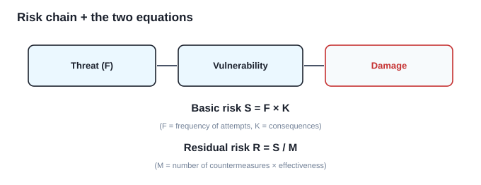
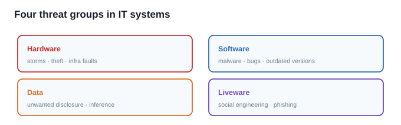
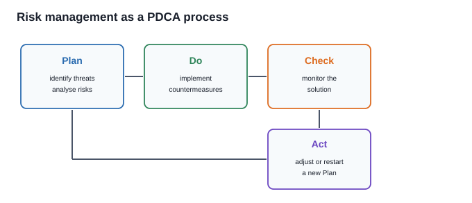

# المخاطر والأمن السيبراني — Week 2

> كل اقتباس إنكليزي معلَّم بـ `W2 Pn` هو حرفياً من مادة الدكتورة (الملزمة، صفحة n). والباقي شرح عربي فهمي.

> **دليل القراءة — أنواع المحتوى:** كل قسم موسوم بنوعه علمود ما يتلخبط عليك وقت المراجعة، واللستات الإنجليزية تبقى نظيفة ومفصولة عن الشرح:
> - **شرح + تعريف** — تعريف المفهوم وشرحه، بدون لستة.
> - **شرح + تعداد** — نشرح المفهوم، وبعده نعدّد عناصره بلستة نظيفة.
> - **تعداد فقط** — اللستة الإنجليزية هي المحتوى؛ تنحفظ حرفياً وما تنغلف بشرح.
> - **نقاط + شرح** — مجموعة نقاط، كل وحدة مشروحة لحالها.

---

## القسم 1 — شنو يعني "الخطر"؟ (What Is Risk)
> **نوع المحتوى:** شرح + تعريف

> **W2 P1** "The word risk is used here in its technical sense, where it is understood to mean the quantitative probability that an error situation occurs and gives rise to damage."

> **W2 P1** "In IT security, 'damage' is synonymous with a breach of the security policy."

**المعنى:** الخطر هنا **مو كلمة عامة** — تعريفه التقني: **الاحتمال الكمّي** إنه تصير حالة خطأ وتسبّب ضرر. والضرر بالأمن السيبراني = **خرق لسياسة الأمن** (مو بالضرورة خسارة مالية).

> **W2 P1** "It is important to understand that this is an objective definition of risk, which must not be confused with subjective risk, which also takes human factors such as public attitudes, trust and personality into consideration."

**نقطة مهمة:** الخطر **موضوعي (objective)**؛ أما **subjective risk** فيدخل بيه العامل البشري (نظرة الناس، الثقة، الشخصية) — والاثنان **مو نفس المفهوم**.

### سلسلة الضرر: تهديد → ثغرة → ضرر
> **W2 P1** "In IT security, people say that damage occurs when a threat is realised against some weakness in the system. A weakness which can be exploited to damage the system is known as a vulnerability. This idea is illustrated in Fig. 3.1, where the threat is a shark and the vulnerability is a welding fault in the shark cage."

**السلسلة:** **threat** (تهديد) → يشتغل على **vulnerability** (نقطة ضعف قابلة للاستغلال) → **damage** (ضرر = خرق السياسة). تشبيه القفص: **القرش = التهديد**، و**عيوب اللحام = الثغرة** — الضرر يصير لمّا يتلاقون، فالثغرة مو تهديد والتهديد مو ثغرة.

> [!CONCEPT] بطاقة بحث: Threat / Vulnerability / Damage
> - **شنو هو:** **Threat** = شي ممكن يسبّب ضرر. **Vulnerability** = نقطة ضعف قابلة للاستغلال. **Damage** = خرق سياسة الأمن.
> - **شلون يشتغل:** الضرر يحتاج **تهديد + ثغرة معاً**؛ بلا ثغرة التهديد ما يوصلك، وبلا تهديد الثغرة ما تنتفع.
> - **ارتباطه بالمحاضرة:** أساس القسم الأول وأساس معادلة الخطر.

> [!CONCEPT] بطاقة بحث: Objective vs Subjective Risk
> - **شنو هو:** **Objective** = احتمال كمّي قابل للقياس. **Subjective** = يدخل بيه العامل البشري.
> - **شلون يشتغل:** نفس النظام ممكن يُقيَّم موضوعياً (أرقام) وذاتياً (خوف الناس) — والنتيجتان تختلفان.
> - **ارتباطه بالمحاضرة:** الدكتورة تشدّد إن تعريفها للخطر **موضوعي**.

---

## القسم 2 — المعادلتان: الخطر الأساسي والمتبقّي
> **نوع المحتوى:** شرح + تعريف

> **W2 P1** "The basic risk, S, of a threat depends on the frequency, F, of attempts to exploit the vulnerability and the consequences, K, of a successful attempt."

$$S = F \times K$$

| الرمز | المعنى |
|:---|:---|
| $S$ | الخطر الأساسي (basic risk) |
| $F$ | **تكرار** محاولات استغلال الثغرة (frequency) |
| $K$ | **عواقب** الهجوم الناجح (consequences) |

**مصفوفة الخطر:** الناتج يُقرأ بلون — **أحمر = خطر عالٍ** (عواقب عالية × تكرار عالٍ) · **أصفر = متوسط** · **أخضر = منخفض**.

> **W2 P3** "The risk is reduced by introducing countermeasures (also known as controls), which must protect against the relevant threat. The reduced risk is known as the residual risk, R."

> **W2 P3** "If the threat is evaluated to give a risk S, and the level of countermeasures is M, then the residual risk is often defined by the equation: R = S / M."

$$R = \frac{S}{M}$$

> **W2 P3** "M covers both the number of countermeasures (there can be several things which affect the risk for particular types of attack) and their effectiveness."

| الرمز | المعنى |
|:---|:---|
| $R$ | الخطر المتبقّي (residual risk) |
| $M$ | مستوى الإجراءات المضادة = **عددها × فاعليتها** |

**مصفوفة الخطر المتبقّي:** ناتج القسمة يُقرأ بلون — **أحمر** لمّا الخطر عالٍ والإجراءات قليلة.

> [!CONCEPT] بطاقة بحث: Risk Matrix & Residual Risk Matrix
> - **شنو هو:** جدولان: الأول يوزّع التهديدات حسب (التكرار × العواقب)؛ الثاني حسب (الخطر × الإجراءات).
> - **شلون يشتغل:** كل خلية بلون (أحمر/أصفر/أخضر) يبيّن مستوى الخطر، والتهديد يُوضع بالخلية المناسبة.
> - **ارتباطه بالمحاضرة:** الصورة العملية للمعادلتين $S$ و $R$.

> [!CONCEPT] بطاقة بحث: Countermeasures / Controls
> - **شنو هو:** أي إجراء يحمي من تهديد معيّن (جدار ناري، مضاد فيروسات، تشفير…).
> - **شلون يشتغل:** كل ما زاد **عددها وفاعليتها** ($M$)، قلّ الخطر المتبقّي $R = S/M$.
> - **ارتباطه بالمحاضرة:** هي المقام بالمعادلة الثانية.

---

## القسم 3 — مجموعات التهديد في أنظمة IT (أربع مجموعات)
> **نوع المحتوى:** شرح + تعداد

> **W2 P5** "Many IT users believe mistakenly that the only threat which can prevent the correct operation of their computers is attackers who hack their way into the computer. In reality, the threat pattern is much more varied... We can distinguish between at least four main groups of threats."

**الفكرة:** التهديد مو بس "هاكر يخترق" — النمط أوسع بكثير، ومفتاح التمييز هو **مصدر التهديد**. التعداد التالي يبيّن المجموعات الأربع وما يميز كل وحدة:

| المجموعة | التعريف | أمثلة |
|:---|:---|:---|
| **Hardware related** | تهديدات تمسّ الجهاز نفسه أو البنية اللي يعتمد عليها | بيئة ضارّة · كوارث طبيعية · سرقة · أعطال البنية |
| **Software related** | تهديدات تمسّ البرمجيات (تطبيقات ونظام تشغيل) | تعديل/حذف غير مصرّح به · malware (فيروسات، ديدان، أحصنة طروادة، قنابل منطقية) · برامج رديئة · نسخ قديمة |
| **Data related** | تهديدات تؤدي لمعالجة بيانات غير مصرّح بها | تخزين/تعديل/كشف/حذف غير مرغوب · **Inference** (استنتاج معلومات سرّية من بيانات متاحة) · **Masquerading** (انتحال شخصية) |
| **Liveware related** | تهديدات مرتبطة بخطأ بشري من المستخدمين | Social engineering · phishing · احتيال إلكتروني وتزوير |

> [!CONCEPT] بطاقة بحث: Malware
> - **شنو هو:** برامج خبيثة بقصد الإضرار: فيروسات · ديدان · أحصنة طروادة · قنابل منطقية (logic bombs).
> - **شلون يشتغل:** تنتشر أو تنفّذ عند شرط معيّن، وتعدّل/تحذف/تسرّب.
> - **ارتباطه بالمحاضرة:** تحت **Software related threats**.

> [!CONCEPT] بطاقة بحث: Inference & Masquerading
> - **شنو هو:** **Inference** = استنتاج معلومة سرّية من بيانات متاحة (بلا وصول مباشر لها). **Masquerading** = انتحال شخصية غيرك.
> - **شلون يشتغل:** Inference يجمع قطعاً ظاهرية ليستنتج المخفي؛ Masquerading يستخدم هوية مسروقة.
> - **ارتباطه بالمحاضرة:** تحت **Data related threats**.

> [!CONCEPT] بطاقة بحث: Social Engineering & Phishing
> - **شنو هو:** خداع الإنسان ليخالف سياسة الأمن (لا خداع تقني).
> - **شلون يشتغل:** رسالة مقنعة (تصيّد) تجعل الموظف يفصح عن بيانات أو يفتح مرفقاً ضاراً.
> - **ارتباطه بالمحاضرة:** تحت **Liveware related threats**.

---

## القسم 4 — الإجراءات المضادة (Countermeasures)
> **نوع المحتوى:** شرح + تعداد

> **W2 P8** "A threat is blocked by control of a vulnerability with the help of suitable countermeasures."

**القاعدة:** التهديد يُسدّ بضبط الثغرة بإجراء مضاد **مناسب لنوع التهديد**. اللستة التالية مطابقة حرفية بين التهديد وإجراءه:

| التهديد | الإجراء المضاد |
|:---|:---|
| مهاجمون من خارج النظام عبر الإنترنت | **Firewalls** (منع ترافيك المهاجم من الوصول) |
| تهديدات من الـ malware | **Antivirus** وبرامج الحماية |
| تخريب/سرقة/ضرر فيزيائي | وضع الأجهزة في **غرفة آمنة** |
| تعديل/حذف بيانات أو برمجيات | **نسخ احتياطية دورية** |
| وصول غير مصرّح به للبيانات | **تشفير** أو **ضبط الوصول** |
| تهديدات من الموظفين | **فحص الموظفين** + **تدريب مناسب** |

> [!CONCEPT] بطاقة بحث: Defense-in-Depth (تعدد طبقات الدفاع)
> - **شنو هو:** عدم الاعتماد على ضابط واحد؛ عدة ضوابط متكاملة (فيزيائي + شبكي + بيانات + بشري).
> - **شلون يشتغل:** لو فشل ضابط، غيره يكمّل — وهذا يرفع $M$ ويخفض $R$.
> - **ارتباطه بالمحاضرة:** جدول المطابقة يبيّن تنوّع الضوابط حسب التهديد.

---

## القسم 5 — إدارة المخاطر + الاستراتيجيات الخمس
> **نوع المحتوى:** شرح + تعداد

> **W2 P10** "Risk management deals with all the activities which are related to evaluating and reducing risks. The part of it whose aim is to reduce risk to an acceptable level is often called risk mitigation."

**الفكرة:** **Risk management** هي المظلة (كل نشاط لتقييم وتخفيض الخطر)، و**Risk mitigation** هو الجزء اللي يوصله لمستوى **مقبول**. الخمس استراتيجيات التالية تُحفظ **بالترتيب** (الامتحان يسأل "أي استراتيجية هذي؟" ويكتب حالة):

| # | الاستراتيجية | الفكرة | مثال |
|:--:|:---|:---|:---|
| 1 | **Risk avoidance** | إبعاد النظام عن الخطر | منع سلوك خطر مثل استخدام WiFi |
| 2 | **Risk reduction** | خطوات استباقية لتقليل الخسارة | نسخ احتياطية · تشفير |
| 3 | **Risk retention** | قبول قدر متّفق من الخطر المتبقّي | معدات موثوقة لكن غير مكرّرة |
| 4 | **Risk transfer** | نقل الخطر لطرف آخر | عقد استعانة بمصادر خارجية |
| 5 | **Risk sharing** | تقاسم الخطر مع أطراف أخرى | مرافق مشتركة أو تأمين متبادل |

> **فرّق:** **Transfer** = تخلّي عن الخطر لطرف آخر. **Sharing** = تقاسم مع أطراف. و**Retention** ("موثوقة لكن مو مكرّرة") = قبول الخطر المتبقي طوعاً.

> [!CONCEPT] بطاقة بحث: Risk Mitigation Strategies
> - **شنو هو:** خمس طرق للتعامل مع الخطر: Avoidance · Reduction · Retention · Transfer · Sharing.
> - **شلون يشتغل:** تختار الاستراتيجية حسب نوع الخطر وقدرة المؤسسة.
> - **ارتباطه بالمحاضرة:** **الترتيب مهم** — سؤال "اذكر الاستراتيجيات" يتوقّع الخمسة بالترتيب.

---

## القسم 6 — التحليل المنهجي للأمن (خمسة أطر)
> **نوع المحتوى:** تعداد فقط

> **W2 P10** "In order to develop a secure system, it is an advantage to use a systematic method... Some well-known examples are:"

**اللستة التالية (أطر التحليل المنهجي) تُحفظ حرفياً — كل إطار يُعرّف بـ "شنو يقدّم":**

| الإطار | التوسّع | شنو يعطي |
|:---|:---|:---|
| **COBIT** | Control Objectives for Information and related Technology | أهداف لتدابير تُستخدَم لإدارة الخطر |
| **COSO** | Committee of Sponsoring Organizations | وصف تفصيلي للعمليات الداخلية للوصول لخطر منخفض |
| **FAIR** | Factor Analysis of Information Risk | تصنيف لعوامل الخطر + معيار تسمية + نموذج حساب |
| **ISO/IEC 27002** | — | قائمة تحقّق لما يجب مراعاته لنظام آمن |
| **OCTAVE** | Operationally Critical Threat, Asset and Vulnerability Evaluation | عملية تحليل التهديدات والمخاطر وإيجاد الإجراءات |

> [!CONCEPT] بطاقة بحث: COBIT & COSO & FAIR
> - **شنو هو:** ثلاثة من خمسة أطر: **COBIT** يركّز على أهداف تدابير تقنية المعلومات؛ **COSO** على العمليات الداخلية للمؤسسة؛ **FAIR** الوحيد اللي فيه "حساب" (تصنيف + تسمية + نموذج).
> - **شلون يشتغل:** يعطون هيكلاً إدارياً لضمان وصول الخطر لمستوى مقبول.
> - **ارتباطه بالمحاضرة:** من أمثلة التحليل المنهجي الخمسة.

---

## القسم 7 — معيار ISO/IEC 27002
> **نوع المحتوى:** تعداد فقط

> **W2 P13** "The international standard ISO/IEC 27002 is part of a series developed jointly by ISO and IEC... The latest version of ISO/IEC 27002 from 2022 describes targets for what has to be done within 14 categories."

**التعداد التالي (الفئات الـ14) يُحفظ حرفياً كقائمة — هذا هو المحتوى الأساسي للقسم:**

| # | الفئة (Category) |
|:--:|:---|
| 1 | Information security policies |
| 2 | Organization of information security |
| 3 | Human resource security |
| 4 | Asset management |
| 5 | Access control |
| 6 | Cryptography |
| 7 | Physical and environmental security |
| 8 | Operation security |
| 9 | Communication security |
| 10 | System acquisition, development and maintenance |
| 11 | Supplier relationships |
| 12 | Information security incident management |
| 13 | Information security aspects of business continuity management |
| 14 | Compliance with legal and contractual requirements |

> **تصحيح مهم (مفصول عن اللستة):** عبارة "**2022 … 14 فئة**" هي نصّ الكتاب نفسه، لكن الفئات الـ14 هي هيكل نسخة **2013**؛ ونسخة **2022** أعادت التنظيم إلى **4 محاور / 93 ضابطاً**. بالامتحان: لو سألت "كم فئة بنسخة 2022؟" الجواب الصحيح = **14 هيكل 2013**، و2022 = 4 محاور.

> [!CONCEPT] بطاقة بحث: ISO/IEC 27002
> - **شنو هو:** معيار دولي يعطي **قائمة تحقّق** لما يجب مراعاته (العائلة فيها 44 معياراً).
> - **شلون يشتغل:** تغطّي الفئات السياسات والأصول والوصول والتشفير والأمن الفيزيائي والاستمرارية والامتثال.
> - **ارتباطه بالمحاضرة:** إحدى الفئات الخمس للأطر، ولها قسم مستقل.

---

## القسم 8 — منهجية OCTAVE
> **نوع المحتوى:** تعداد فقط

> **W2 P14** "OCTAVE is a method for risk analysis developed for the international organization CERT (Computer Emergency Response Team) at Carnegie Mellon University in USA. The method is based on a systematic analysis of assets, threats and vulnerabilities in three phases."

**التعداد التالي (المراحل الثلاث + النسخ الأربع) يُحفظ حرفياً:**

| المرحلة | المضمون |
|:---|:---|
| **Phase 1** | Build up asset-based threat profiles |
| **Phase 2** | Identify vulnerabilities in the infrastructure which could lead to unauthorized action |
| **Phase 3** | Develop a security strategy and plans |

**النسخ الأربع:** OCTAVE (الأصلية) · OCTAVE-S (للمؤسسات الصغيرة) · OCTAVE ALLEGRO (للمؤسسات المتقدّمة) · OCTAVE FORTE.

> **تصحيح مهم (مفصول):** الكتاب يسمّي OCTAVE FORTE رابع نسخة، لكن فعلياً **ثلاث** منهجيات OCTAVE منشورة: OCTAVE · OCTAVE-S · OCTAVE Allegro. احفظ الثلاثة الأساسية.

> [!CONCEPT] بطاقة بحث: OCTAVE
> - **شنو هو:** منهجية تحليل مخاطر مبنية على **الأصول**، من CERT / Carnegie Mellon.
> - **شلون يشتغل:** ثلاث مراحل — ملفات تهديد على الأصول → ثغرات البنية → استراتيجية وخطط.
> - **ارتباطه بالمحاضرة:** إحدى الفئات الخمس، ولها قسم مستقل بمراحلها ونسخها.

---

## القسم 9 — إدارة المخاطر كعملية PDCA
> **نوع المحتوى:** شرح + تعداد

> **W2 P16** "Risk management should not be a one-time activity... This means that risk management most often takes the form of a so-called PDCA process with four characteristic phases (Plan, Do, Check, Act)."

**الفكرة:** إدارة الخطر **مو نشاط لمرة واحدة** — لأن مشهد التهديدات يتغيّر، فلازم إعادة تقييم دورية، ولهذا تاخذ شكل **دورة (cycle)** مو خط مستقيم. المراحل الأربع:

| المرحلة | المضمون (حرفي) |
|:---|:---|
| **Plan** | تُحدَّد التهديدات، تُحلَّل المخاطر، وتُخطَّط الإجراءات |
| **Do** | تُنفَّذ الإجراءات أو غيرها من أشكال إدارة الخطر |
| **Check** | تُراقَب الحلول للتأكد إن مستوى الأمن المطلوب محفوظ |
| **Act** | يُعدَّل الحل ليستمر، أو يُقرَّر البدء بدورة Plan جديدة |

> [!CONCEPT] بطاقة بحث: PDCA
> - **شنو هو:** دورة تحسين مستمرة: Plan · Do · Check · Act.
> - **شلون يشتغل:** بعد Act إما تُعدَّل الخطة أو تُبدأ دورة جديدة — لأن ملف المخاطر يتغيّر بمرور الوقت.
> - **ارتباطه بالمحاضرة:** إدارة المخاطر **مو نشاط لمرة واحدة**.

---

## القسم 10 — الأمن الفيزيائي والمصادقة
> **نوع المحتوى:** مختلط — كل فرعي موسوم بنوعه

### 10.1 السياسات الأمنية
> **نوع المحتوى:** شرح + تعريف

> **W2 P22** "A key component that brings all three levels of security together is a well-designed security policy that states how security is implemented at each level."

> **W2 P24** "Develop a cohesive access-control policy at each level that provides authorized people with appropriate levels of access to selected assets, while inhibiting access to assets by people who are not authorized."

**المعنى:** السياسة تحدّد **مَن** يصرّح له بالوصول **لأي أصل**، و**شنو** يُسمح له يعمل. والوصول الحرّ للجميع يخلق مخاطر — فالضبط يحمي من الإغراء ومن الحوادث.

### 10.2 ضوابط الأمن الفيزيائي
> **نوع المحتوى:** تعداد فقط

> **W2 P26** "The primary physical barrier in most security perimeters is the lockable door... The lock provides the authentication function of the barrier through its key."

**التعداد التالي (ضوابط فيزيائية) يُحفظ حرفياً:**

| الضابط | الفكرة (حرفي/مبسّط) |
|:---|:---|
| **Locks & Keys** | الباب الحاجز، والقفل يوفّر وظيفة **المصادقة** بالمفتاح |
| **Key-Locking Deadbolts** | مزلاج يُقفل/يُفتح بمفتاح، بأسلوب أسطوانة واحدة أو مزدوجة |
| **Solenoid Deadbolt Locks** | مزلاج يُدار إلكترونياً، أعلى أماناً وقابل للربط بأي نظام |
| **Cipher Locks** | قفل يُفتح برمز شخصي على لوحة مفاتيح |
| **Access-Control Gates** | بوابات: **Sliding** (للأمان العالي) و **Swinging** (مفصلات 180°) |
| **Control Relays** | مرحّلات تستخدم إشارة تحكّم منخفضة الجهد لقيادة أجهزة عالية الجهد |

### 10.3 أنظمة المصادقة
> **نوع المحتوى:** تعداد فقط

> **W2 P30** "Authentication is the process of determining that someone is who they say they are... authorization is based on authentication."

> **W2 P30** "Multiple factors are involved in authentication: Knowledge — something you know... Possession — something you have... Inheritance — something you are... Location — somewhere you are."

**التعداد التالي (عوامل المصادقة الأربعة) يُحفظ حرفياً — الترتيب مهم:**

| العامل | المعنى |
|:---|:---|
| **Knowledge** | شي تعرفه (كلمة سر) |
| **Possession** | شي تملكه (بطاقة، مفتاح) |
| **Inherence** | شي أنت عليه (بصمة، وجه) |
| **Location** | مكان أنت فيه |

> **تصحيح مهم (مفصول):** الملزمة تكتب العامل الثالث "**Inheritance**"، والصحيح اصطلاحاً **Inherence** (السمة الذاتية). احفظ المصطلح الصحيح مع الإشارة إن الملزمة سمّته Inheritance.

**تقنيات المصادقة الفيزيائية (تعداد — حرفي):** Magnetic Stripe Readers · Smart Cards (بدارة ذكية تخفي البيانات حتى تتم المصادقة) · RFID Badges (بلا لمس، إشارات راديوية) · Biometric Scanners (خصائص بشرية) · Remote-Access Monitoring · Automated Access-Control Systems.

> [!CONCEPT] بطاقة بحث: Authentication Factors (MFA)
> - **شنو هو:** التمييز بين **Knowledge / Possession / Inherence / Location**.
> - **شلون يشتغل:** كل عامل يمثّل فئة مستقلة؛ والمصادقة المتعددة (MFA) تجمع عاملين من فئات مختلفة.
> - **ارتباطه بالمحاضرة:** **التصريح مبني على المصادقة** — وهذي قائمته.

> [!CONCEPT] بطاقة بحث: RFID & Biometrics
> - **شنو هو:** **RFID** بطاقات تُقرأ بإشارة راديوية بلا لمس؛ **Biometrics** قياس خصائص بشرية للتحقق.
> - **شلون يشتغل:** RFID يرسل هوية للقارئ؛ Biometrics يقارن البصمة/الوجه بنمط مخزّن.
> - **ارتباطه بالمحاضرة:** تقنيات **Possession** و **Inherence**.

> [!CONCEPT] بطاقة بحث: Smart Cards
> - **شنو هو:** بطاقة بدارة ذكية تحمي البيانات حتى تتم المصادقة.
> - **شلون يشتغل:** تخزّن المفتاح/الهوية داخل الشريحة، ولا تُفصح إلا بعد التحقق.
> - **ارتباطه بالمحاضرة:** تقنية **Possession** أعلى أماناً من الشريط المغناطيسي.

### 10.4 الإطار والمقاربة NIST
> **نوع المحتوى:** تعداد فقط

> **W2 P20** "Use NIST security controls. Create a matrix of individual concerns and associated attack vectors. Provide a mitigation method(s) for each. Select the appropriate NIST family (Management, Operational, Technical) of security controls."

**التعداد التالي (عائلات ضوابط NIST الثلاث) يُحفظ حرفياً:** Management · Operational · Technical.

**قاعدة:** الاختيار يكون **متناسباً مع الخطر** (لا إفراط بالضوابط — "Don't overprescribe controls!").

---

## القسم 11 — تقييم وإدارة المخاطر السيبرانية (أربع مكوّنات)
> **نوع المحتوى:** تعداد فقط

> **W2 P39** "Cyber Risk Assessment and Management is the process of identifying, evaluating, and mitigating the risks associated with cyber threats to an organization or system."

> **W2 P41** "1. Risk Identification... 2. Risk Evaluation... 3. Risk Mitigation... 4. Monitoring and Review."

**التعداد التالي (المكوّنات الأربعة) يُحفظ حرفياً — الترتيب مهم:**

| # | المكوّن | المضمون |
|:--:|:---|:---|
| 1 | **Risk Identification** | تحديد التهديدات المحتملة (malware · phishing · ransomware · data breaches) |
| 2 | **Risk Evaluation** | تحليل احتمال كل خطر وشدة تأثيره |
| 3 | **Risk Mitigation** | تطوير استراتيجيات التقليل (ضوابط: firewalls · encryption · تدريب المستخدمين · نسخ احتياطية) |
| 4 | **Monitoring and Review** | مراقبة مستمرة وتحديث الدفاعات وإعادة التقييم مع ظهور تهديدات جديدة |

> **الأهمية (حرفي):** مع تقدّم التقنية تتعقّد التهديدات، فتصير إدارة المخاطر ضرورية لحماية البيانات وضمان استمرارية العمل. وأطر مثل **ISO 27001** و**NIST CSF** تعطي مناهج منظّمة.

> [!CONCEPT] بطاقة بحث: Cyber Risk Assessment (المكوّنات الأربعة)
> - **شنو هو:** دورة: **Identification → Evaluation → Mitigation → Monitoring & Review**.
> - **شلون يشتغل:** تبدأ بتحديد التهديدات، تقييمها، معالجتها، ثم مراقبة مستمرة (تشبه PDCA).
> - **ارتباطه بالمحاضرة:** الخلاصة العملية للجزء الثاني من الملزمة.

---

## Retrieval Set (للمراجعة السريعة)

**[RS-01]** عرّف الخطر بالمعنى التقني، وفرّق بين objective و subjective.
> الخطر = الاحتمال الكمّي لحالة خطأ تسبّب ضرراً (والضرر = خرق سياسة الأمن). Objective قابل للقياس؛ Subjective يدخل بيه العامل البشري (نظرة الناس، الثقة، الشخصية).

**[RS-02]** اكتب معادلتَي الخطر.
> `S = F × K` (F = تكرار المحاولات، K = العواقب) · `R = S / M` (M = عدد الإجراءات × فاعليتها).

**[RS-03]** اذكر مجموعات التهديد الأربع.
> Hardware · Software · Data · Liveware.

**[RS-04]** اذكر الاستراتيجيات الخمس لتخفيف الخطر (بالترتيب).
> Avoidance · Reduction · Retention · Transfer · Sharing.

**[RS-05]** اذكر الأطر الخمسة للتحليل المنهجي.
> COBIT · COSO · FAIR · ISO/IEC 27002 · OCTAVE.

**[RS-06]** اذكر مراحل OCTAVE الثلاث.
> ملفات تهديد مبنية على الأصول · تحديد ثغرات البنية · استراتيجية وخطط أمنية.

**[RS-07]** اشرح دورة PDCA بإيجاز.
> Plan (تحديد وتحليل وتخطيط) · Do (تنفيذ) · Check (مراقبة) · Act (تعديل أو بدء دورة جديدة).

**[RS-08]** اذكر عوامل المصادقة الأربعة، والمصطلح الصحيح للعامل الثالث.
> Knowledge · Possession · **Inherence** (الملزمة سمّته Inheritance) · Location.

**[RS-09]** اذكر مكوّنات تقييم وإدارة المخاطر السيبرانية الأربعة.
> Identification · Evaluation · Mitigation · Monitoring and Review.

**[RS-10]** اذكر عائلات ضوابط NIST الثلاث.
> Management · Operational · Technical.
