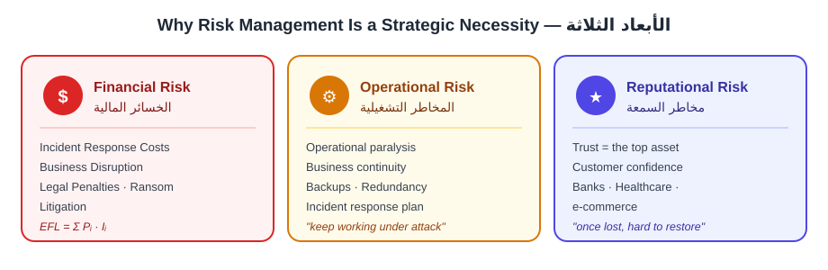
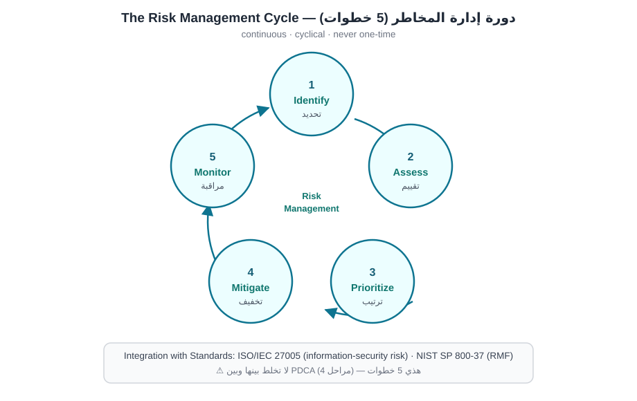
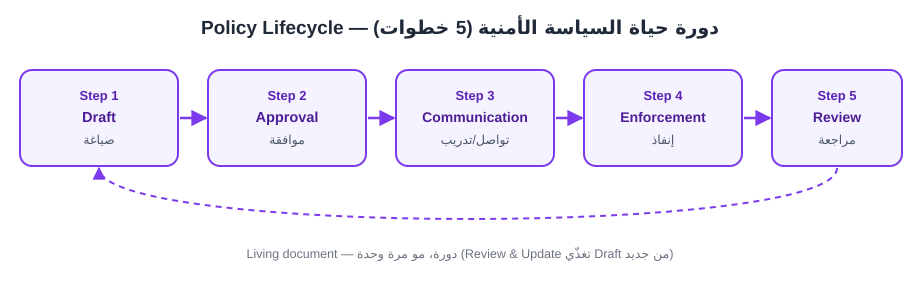

# الجابتر الثالث — Cybersecurity Risks as Organizational Threats
## المخاطر السيبرانية كتهديد على مستوى المؤسسة

> **دليل القراءة:** كل مقطع مقسوم ثلاث طبقات:
> **① النص الأصلي (English)** — نسخة نظيفة **كثافة وسط** (مو مضغوطة للصفر، ومو منسوخة سطر بسطر) · **② الترجمة** — ترجمة كاملة مطابقة · **③ الشرح الفهمي** — الشرح اللي يفهمك المفهوم.
>
> **المصدر:** `02_Raw_Materials/W03_Risks.pdf` (14 صفحة · 27 تأشيرة من الدكتورة).
>
> ⚠️ **مهم:** هذا الفصل **مادة مولّدة بالـ AI** (مو من كتاب Sharp). معادلاته ($EFL$ · $Risk = T \times V \times I$ · $PE$ · $PCI$) **مُختَرَعة** — بس الدكتورة تدرّسها كما هي، فاحفظها **بمفرداتها** للامتحان.
>
> **🎯 مفاتيح المحاضرة:** «السؤال بيه **ثلاث أجوبة** — اقرأ السؤال للنهاية قبل ما تجاوب» · **Zero Trust = Never Trust** · الأطر الخمسة (COBIT · COSO · FAIR · ISO · OCTAVE) تيجي **MCQ كرموز**.

## 🎯 خريطة تأشيرات الدكتورة (من النسخة المعلَّمة)

| الصفحة | العلامة | شنو معلَّم |
|:--:|:--:|:---|
| **p1** | 🟡 هايلايت | جملة «cybersecurity cannot be isolated within the IT department» + كلمة «Why?» + تسميات الأسباب الأربعة |
| **p3** | 🟡 هايلايت | عنوان «5. Future Challenges in Cyber Risk Management» |
| **p4** | 🟡 هايلايت | عنوان «Why It Is Not Only IT's Concern» |
| **p4** | ❌ شخبطة | بوليتات «Reduce likelihood / Reduce impact» + بوليتات «Governance Integration» |
| **p5** | 🟡 هايلايت | عنوانا «4. Industry-Specific Cyber Risks» و«4.1 Banking and Financial Services» |
| **p5** | ❌ شخبطة | قسم «3. Balancing Cost of Controls» كامل + بوليت «Cross-departmental policies» |
| **p8** | 🟡 هايلايت | عنوان «Characteristics of Security Policies» |
| **p8** | ❌ شخبطة | قسم «5. Definition of Security Policies» + «Examples» + قسم «2. Policy vs. Technology» كامل |
| **p9** | 🟡 هايلايت | عنوان «Policy Lifecycle» |
| **p9** | ❌ شخبطة | بوليت «Technology without Policy» + جملة socio-technical |
| **p12** | 🟡 هايلايت | «3. Modern Trends» + «3.1 Zero Trust» + «3.2 AI-Driven Compliance Auditing» + «3.3 ESG» |
| **p14** | 🟡 هايلايت | عنوان «Strategic Value of Policies in Enterprise Security» |

> **القاعدة:** 🟡 = **مهم للامتحان** · ❌ = **مو مطلوب** (مندرجة بالملاحظة للفهم بس، مو للحفظ).

---

### القسم 1 — Cybersecurity as an Organizational Risk, Not Just a Technical Problem

#### ① النص الأصلي

> For much of its early history, cybersecurity was framed as a technical challenge: firewalls, antivirus software, and intrusion detection systems were considered sufficient to secure enterprise systems, and security problems were assumed to be "fixed" by deploying the right technological solution. However, the last two decades have demonstrated that cybersecurity failures are fundamentally organizational threats, often leading to financial loss, reputational damage, regulatory penalties, and even systemic risks to national security. It is critical to recognize that cybersecurity cannot be isolated within the IT department. Instead, it is a boardroom-level concern, requiring governance structures, risk management practices, and integration with organizational strategy.
>
> Why?
>
> - **Pervasive Digitization**: Every business process today depends on IT systems (finance, healthcare, supply chains), so cybersecurity failures can halt operations.
> - **Ecosystem Dependence**: Organizations rely on third-party vendors, cloud services, and global supply chains; a breach in one weak link (e.g., a vendor) can cascade into enterprise-level crises.
> - **Adversarial Nature**: Unlike natural risks (fires, floods), cyber risks are caused by adaptive, intelligent adversaries (hackers, nation-states, insiders).
> - **Legal/Regulatory Context**: Compliance obligations (GDPR, HIPAA, PCI-DSS) directly tie cybersecurity failures to legal liabilities and financial penalties.
>
> Thus, cybersecurity risks must be understood as enterprise-wide risks. Technical tools are only one layer in a larger governance and risk management framework.

#### ② الترجمة

> «على مدى معظم تاريخه المبكر، كان الأمن السيبراني يُصاغ كتحدٍّ تقني: كانت الجدران النارية (firewalls) وبرامج مكافحة الفيروسات وأنظمة كشف التسلل تُعدّ كافية لتأمين أنظمة المؤسسة، وكان يُفترض أن المشاكل الأمنية يمكن "إصلاحها" بنشر الحل التقني الصحيح. لكن العقدين الماضيين أثبتا أن إخفاقات الأمن السيبراني هي تهديدات تنظيمية بالأساس، كثيرًا ما تؤدي إلى خسائر مالية وضرر في السمعة وعقوبات تنظيمية وحتى مخاطر نظامية على الأمن القومي. من الضروري إدراك أن الأمن السيبراني لا يمكن عزله داخل قسم تقنية المعلومات (IT). بل هو شأن على مستوى مجلس الإدارة، يتطلب هياكل حوكمة وممارسات إدارة مخاطر ودمجًا مع استراتيجية المؤسسة.
>
> لماذا؟
>
> - **الرقمنة الشاملة (Pervasive Digitization)**: كل عملية تجارية اليوم تعتمد على أنظمة تقنية المعلومات (المالية، الرعاية الصحية، سلاسل التوريد)، لذا قد تُوقف إخفاقات الأمن السيبراني العمليات.
> - **الاعتماد على المنظومة (Ecosystem Dependence)**: تعتمد المؤسسات على موردين خارجيين وخدمات سحابية وسلاسل توريد عالمية؛ واختراق في حلقة ضعيفة واحدة (مثل مورّد) قد يتسلسل إلى أزمات على مستوى المؤسسة.
> - **الطبيعة العدائية (Adversarial Nature)**: على عكس المخاطر الطبيعية (الحرائق والفيضانات)، تُسبَّب المخاطر السيبرانية من خصوم متكيّفين وأذكياء (قراصنة، دول، عناصر داخلية).
> - **السياق القانوني/التنظيمي (Legal/Regulatory Context)**: تُربط التزامات الامتثال (GDPR، HIPAA، PCI-DSS) إخفاقات الأمن السيبراني مباشرة بالمسؤوليات القانونية والعقوبات المالية.
>
> وبالتالي، يجب فهم مخاطر الأمن السيبراني كمخاطر على مستوى المؤسسة بأكملها. الأدوات التقنية ليست سوى طبقة واحدة داخل إطار أوسع للحوكمة وإدارة المخاطر.»

#### ③ الشرح الفهمي

الفكرة الأساسية هنا إنه الأمن السيبراني مو مجرد "مشكلة تقنية" تنحلّ بالجدار الناري والأنتي فايرس. هاي كانت النظرة القديمة، وطلع خطأ كبير. الإخفاق الأمني اليوم هو **threat على مستوى المؤسسة**، يعني يوصل للمالية والسمعة والعقوبات القانونية وحتى الأمن القومي.

ليش صار هيك؟ لأن المؤسسة صارت مبنية على الـ IT من رأسها لرجلها، وكل عملية تجارية (payroll، logistics، finance) معلّقة على الأنظمة. فلمّا يخترقونها، العمليات توقف مو بس الأجهزة.

أهم نقطة في القسم: **الأمن السيبراني ما ينعزل داخل قسم الـ IT** — هو شأن على مستوى **مجلس الإدارة (boardroom)**, يحتاج حوكمة وإدارة مخاطر وربطه بالاستراتيجية.

نلخّص الأسباب الأربعة بهذا الجدول:

| السبب | المعنى بالفهم البسيط | مثال من النص |
|---|---|---|
| Pervasive Digitization | كل شي صار معلّق على الـ IT | finance, healthcare, supply chains |
| Ecosystem Dependence | نعتمد على طرف ثالث وسحابة وسلاسل توريد | اختراق مورّد واحد ← أزمة على مستوى المؤسسة |
| Adversarial Nature | الخصم ذكي ومتكيّف، مو مخاطرة طبيعية | hackers, nation-states, insiders |
| Legal/Regulatory Context | الامتثال يربط الفشل بالمسؤولية القانونية | GDPR, HIPAA, PCI-DSS |

الخلاصة اللي لازم تحفظها: الخطر السيبراني هو **enterprise-wide risk**، والأدوات التقنية طبقة وحدة فقط داخل إطار الحوكمة وإدارة المخاطر.

🎯 **تأشيرة الدكتورة:** محدّدة بالـ yellow = مهمة للامتحان: جملة «الأمن ما ينعزل داخل قسم الـ IT» + كلمة "Why?" + تسميات البوليتات الأربعة (Pervasive Digitization · Ecosystem Dependence · Adversarial Nature · Legal/Regulatory Context).

---

### القسم 2 — Why Risk Management is a Strategic Necessity

#### ① النص الأصلي

> Risk management in cybersecurity ensures organizations can anticipate, prioritize, and mitigate risks before they escalate into crises. Its necessity can be explained through three main dimensions: financial, operational, and reputational.
>
> **2.1 Financial Risk** — The direct financial cost of cyberattacks has grown exponentially.
>
> Sources of Financial Loss:
>
> - Incident Response Costs.
> - Business Disruption.
> - Legal Penalties.
> - Ransom Payments.
> - Litigation.
>
> Mathematical framing of Expected Financial Loss (EFL):
>

$$EFL = \sum_{i=1}^{n} P_i \cdot I_i$$

>
> This model allows CISOs and executives to prioritize investments in cybersecurity controls.
>
> **2.2 Operational Risk** — Cybersecurity failures often result in operational paralysis, which is why cybersecurity must integrate with business continuity planning. Risk management ensures organizations can keep functioning even under attack, through backups, redundancies, and incident response planning.
>
> **2.3 Reputational Risk** — Trust is one of the most valuable assets for organizations, and a cybersecurity breach can irreparably damage customer confidence; reputation once lost is hard to restore. For financial institutions, healthcare providers, or e-commerce companies, reputation directly correlates with customer retention and revenue streams.

#### ② الترجمة

> «إدارة المخاطر في الأمن السيبراني تضمن أن المؤسسات تستطيع أن تتوقّع المخاطر وتحدّد أولوياتها وتخفّفها قبل أن تتصاعد إلى أزمات. وتُفسَّر ضرورتها من خلال ثلاثة أبعاد رئيسية: المالي والتشغيلي والسمعة.
>
> **2.1 المخاطر المالية** — التكلفة المالية المباشرة للهجمات السيبرانية نمت نموًّا أُسّيًّا.
>
> مصادر الخسارة المالية:
>
> - تكاليف الاستجابة للحوادث (Incident Response Costs).
> - تعطُّل الأعمال (Business Disruption).
> - العقوبات القانونية (Legal Penalties).
> - مدفوعات الفدية (Ransom Payments).
> - التقاضي (Litigation).
>
> الصياغة الرياضية للخسارة المالية المتوقعة (EFL):
>

$$EFL = \sum_{i=1}^{n} P_i \cdot I_i$$

>
> هذا النموذج يمكّن مديري أمن المعلومات (CISOs) والمديرين التنفيذيين من ترتيب أولويات الاستثمار في ضوابط الأمن السيبراني.
>
> **2.2 المخاطر التشغيلية** — كثيرًا ما تؤدي إخفاقات الأمن السيبراني إلى شلل تشغيلي، ولهذا يجب أن يتكامل الأمن السيبراني مع تخطيط استمرارية الأعمال. إدارة المخاطر تضمن أن المؤسسات تبقى قادرة على العمل حتى تحت الهجوم، عبر النسخ الاحتياطية والتكرارية وتخطيط الاستجابة للحوادث.
>
> **2.3 مخاطر السمعة** — الثقة من أثمن أصول المؤسسة، وقد يُلحق اختراق أمني ضررًا لا يُصلَح بثقة العملاء؛ والسمعة متى ما ضاعت يصعب استرجاعها. بالنسبة للمؤسسات المالية أو مزوّدي الرعاية الصحية أو شركات التجارة الإلكترونية، ترتبط السمعة مباشرة بالاحتفاظ بالعملاء وتدفقات الإيرادات.»

#### ③ الشرح الفهمي

ليش إدارة المخاطر "ضرورة استراتيجية" مو مجرد كماليات؟ لأنها تخلي المؤسسة **تتوقّع وترتّب وتخفّف** قبل ما تصير الأزمة. والضرورة تنجلي بثلاث أبعاد: **financial, operational, reputational**.

**البُعد المالي (Financial)** — التكلفة تكبر بشكل أُسّي. النص يعدّ خمس مصادر للخسارة:

| المصدر | شنو يعني |
|---|---|
| Incident Response Costs | تكاليف الاستجابة للحادث (تحقيق، استرجاع) |
| Business Disruption | توقف الأعمال عن العمل |
| Legal Penalties | عقوبات قانونية / غرامات |
| Ransom Payments | دفع الفدية للقراصنة |
| Litigation | الدعاوى القضائية |

ويجي أهم شي: الصيغة الرياضية للـ **Expected Financial Loss**:

$$EFL = \sum_{i=1}^{n} P_i \cdot I_i$$

| الرمز | المعنى |
|---|---|
| $EFL$ | الخسارة المالية المتوقعة (Expected Financial Loss) |
| $P_i$ | احتمال وقوع الحدث السيبراني $i$ |
| $I_i$ | التأثير المالي للحدث $i$ |
| $n$ | عدد الأحداث المحتملة |

يعني: نضرب احتمال كل حدث بتأثيره المالي، ونجمعهم. هذا يخلي الـ CISO يقنع الإدارة وين يصرف الفلوس على الضوابط.

**البُعد التشغيلي (Operational)** — الفشل الأمني يسبّب **operational paralysis** (شلل تشغيلي). الحل: نربط الأمن السيبراني بـ **business continuity planning** — backups, redundancies, incident response planning — حتى المؤسسة تكمّل شغل حتى وهي تحت الهجوم.

**البُعد السمعة (Reputational)** — **الثقة (trust)** رأس مال ما يُقدّر بثمن. الاختراق يكسر ثقة العميل، والسمعة **مرة تروح صعب ترجع**. وعند البنوك والمستشفيات وشركات الـ e-commerce، السمعة مرتبطة مباشرة بالاحتفاظ بالعملاء والإيرادات.

الخلاصة: الأبعاد الثلاثة مترابطة — ضربة أمنية وحدة تضرب المال والتشغيل والسمعة بنفس الوقت.

---

### القسم 3 — Bridging Technical Controls and Enterprise Governance
#### ① النص الأصلي
> Cybersecurity risk management plays a bridging role: it translates technical vulnerabilities into business risks that executives can understand and act upon.
>
> Technical Controls vs. Governance:
>
> - **Technical Controls**: Firewalls, IDS, antivirus, patching.
> - **Governance Structures**: Policies, compliance frameworks, executive oversight.
>
> Without risk management, these two operate in silos. Risk management frameworks ensure that technical findings (e.g., a missing patch) are quantified in terms of financial and operational impact, enabling executives to prioritize resources.

#### ② الترجمة
> «إدارة مخاطر الأمن السيبراني تلعب دور الجسر: فهي تترجم الثغرات التقنية إلى مخاطر أعمال يفهمها المدراء التنفيذيون ويقدرون يتصرفون بناءً عليها.
>
> الضوابط التقنية مقابل الحوكمة:
>
> - **الضوابط التقنية**: الجدران النارية (Firewalls)، أنظمة كشف التسلل (IDS)، مضاد الفيروسات، والتحديثات (patching).
> - **هياكل الحوكمة**: السياسات، أطر الامتثال، والإشراف التنفيذي.
>
> بدون إدارة المخاطر، هذين الجانبين يشتغلون بجزر معزولة (silos). أطر إدارة المخاطر تضمن أن النتائج التقنية (مثل تحديث ناقص) تُقاس من ناحية الأثر المالي والتشغيلي، وهذا يمكّن المدراء التنفيذيين من ترتيب أولويات الموارد.»

#### ③ الشرح الفهمي
هنا الفكرة الأساسية أن الأمن السيبراني ما هو بس شغلة تقنية، بل هو جسر يربط بين عالمين:

| الجانب | شنو يشمل | مين يهتم بيه |
|---|---|---|
| **Technical Controls** | Firewalls, IDS, antivirus, patching | فريق الـ IT |
| **Governance Structures** | Policies, compliance frameworks, executive oversight | الإدارة العليا والـ Board |

المشكلة إذا اشتغلوا منفصلين (silos): فريق الـ IT يشوف "patch ناقص" ويعتبره مشكلة تقنية عادية، أما الإدارة ما تفهم قيمة هذا الشي. إدارة المخاطر تجي وتقول: هذا الـ patch الناقص ممكن يسبب خسارة مالية بمقدار معين وأثر تشغيلي معين ← وقتها الإدارة تقدر ترتّب أولوياتها وتصرف الموارد على المكان الصح. يعني إدارة المخاطر = لغة مشتركة بين الـ IT والإدارة.

---

### القسم 4 — Risk Management as a Continuous Process
#### ① النص الأصلي
> Risk management in cybersecurity is not a one-time assessment. It is a continuous cycle integrated into enterprise operations.
>
> The Risk Management Cycle:
>
> - **Identify**: Assets, vulnerabilities, and threats.
> - **Assess**: Probability and impact.
> - **Prioritize**: Rank risks by severity.
> - **Mitigate**: Apply technical and organizational controls.
> - **Monitor**: Continuously review and update.
>
> This cycle ensures that organizations adapt to evolving threats, which is particularly relevant in cybersecurity where new vulnerabilities emerge daily.
>
> Integration with Standards:
>
> - **ISO/IEC 27005**: Formalizes risk management for information security.
> - **NIST SP 800-37**: The Risk Management Framework (RMF) integrates risk into federal IT systems.
>
> Academic programs must emphasize not only how to identify vulnerabilities but also how to integrate findings into governance cycles.

#### ② الترجمة
> «إدارة المخاطر في الأمن السيبراني مو تقييم مرة واحدة وبس. هي دورة مستمرة مندمجة داخل عمليات المؤسسة.
>
> دورة إدارة المخاطر (Risk Management Cycle):
>
> - **Identify (تحديد)**: الأصول (Assets)، الثغرات (Vulnerabilities)، والتهديدات (Threats).
> - **Assess (تقييم)**: الاحتمالية (Probability) والأثر (Impact).
> - **Prioritize (ترتيب الأولويات)**: ترتيب المخاطر حسب شدّتها.
> - **Mitigate (التخفيف)**: تطبيق ضوابط تقنية وتنظيمية.
> - **Monitor (المراقبة)**: مراجعة وتحديث مستمر.
>
> هذي الدورة تضمن أن المؤسسات تتكيف مع التهديدات المتطورة، وهذا مهم بالذات في الأمن السيبراني وين تظهر ثغرات جديدة كل يوم.
>
> التكامل مع المعايير (Standards):
>
> - **ISO/IEC 27005**: يرسّخ إدارة المخاطر الخاصة بأمن المعلومات بشكل رسمي.
> - **NIST SP 800-37**: إطار إدارة المخاطر (RMF) يدمج المخاطر داخل أنظمة الـ IT الفيدرالية.
>
> البرامج الأكاديمية لازم تركّز مو بس على كيف نحدد الثغرات، بل كذلك على كيف ندمج النتائج داخل دورات الحوكمة.»

#### ③ الشرح الفهمي
إدارة المخاطر ما هي "شغلة نسويها مرة وخلاص"، هي دورة تدور كل مرة. الخمس خطوات:

1. **Identify** ← نعرف الأصول والثغرات والتهديدات.
2. **Assess** ← نحسب الاحتمالية والأثر.
3. **Prioritize** ← نرتّب حسب الخطورة.
4. **Mitigate** ← نطبّق ضوابط.
5. **Monitor** ← نراقب ونحدّث.

| الخطوة | السؤال الأساسي |
|---|---|
| Identify | شنو عندنا؟ وشنو ممكن يهدده؟ |
| Assess | شكد احتمال يصير؟ وشكد يأثر؟ |
| Prioritize | أي خطر أهم؟ |
| Mitigate | شنو نسوي حتى نقلّله؟ |
| Monitor | شنو تغيّر؟ وشنو نحدّث؟ |

⚠️ **ملاحظة مهمة (لا تخلط!):** لا تخلط بين **Risk Management Cycle** (اللي عندها **5 خطوات**: Identify, Assess, Prioritize, Mitigate, Monitor) وبين **PDCA** (اللي عندها **4 مراحل**: Plan, Do, Check, Act) اللي جانت بالـ Risk booklet السابق. الأولى 5 خطوات والثانية 4 مراحل — مو نفس الشي رغم التشابه بالفكرة (كلاهما دورة مستمرة).

---

### القسم 5 — Future Challenges in Cyber Risk Management
#### ① النص الأصلي
> As technology evolves, risk management faces new challenges:
>
> - **Cloud Security Risks**: Misconfigured cloud storage (e.g., open AWS S3 buckets) is a leading cause of breaches.
> - **IoT & OT Risks**: Billions of IoT devices expand the attack surface, while industrial control systems (ICS) lack robust security.
> - **AI-Driven Attacks**: AI is being weaponized to create polymorphic malware and deepfake phishing.
> - **Quantum Computing Threats**: Will break traditional encryption (RSA, ECC). Risk management must plan for post-quantum cryptography.
>
> These challenges underscore the need for risk management as a dynamic, forward-looking discipline.

#### ② الترجمة
> «مع تطور التقنية، إدارة المخاطر تواجه تحديات جديدة:
>
> - **مخاطر أمن السحابة (Cloud Security Risks)**: سوء إعداد (Misconfiguration) التخزين السحابي (مثل دلاء AWS S3 المفتوحة) هو من الأسباب الرئيسية للاختراقات.
> - **مخاطر إنترنت الأشياء والتقنيات التشغيلية (IoT & OT Risks)**: مليارات أجهزة الـ IoT توسّع مساحة الهجوم (attack surface)، وأنظمة التحكم الصناعي (ICS) تفتقر لأمن قوي.
> - **الهجمات المدفوعة بالذكاء الاصطناعي (AI-Driven Attacks)**: الـ AI يُستخدم كسلاح لإنتاج برمجيات خبيثة متعددة الأشكال (polymorphic malware) وتصيّد بالبريد عبر التزييف العميق (deepfake phishing).
> - **تهديدات الحوسبة الكمومية (Quantum Computing Threats)**: ستكسر التشفير التقليدي (RSA, ECC). إدارة المخاطر لازم تخطط للتشفير ما بعد الكمومي (post-quantum cryptography).
>
> هذي التحديات تبيّن الحاجة إلى إدارة المخاطر كتخصص ديناميكي ونظرة مستقبلية.»

#### ③ الشرح الفهمي
المشاكل الحالية (التقليدية) صارت معروفة، لكن التقنية تتطور وتجيب تحديات جديدة على إدارة المخاطر. الأربع تحديات:

| التحدي | المشكلة الأساسية | مثال من النص |
|---|---|---|
| **Cloud Security Risks** | سوء إعداد التخزين السحابي | AWS S3 buckets مفتوحة |
| **IoT & OT Risks** | توسّع attack surface + ضعف أمن الـ ICS | مليارات أجهزة IoT |
| **AI-Driven Attacks** | الـ AI صار سلاح للهجوم | polymorphic malware + deepfake phishing |
| **Quantum Computing Threats** | يكسر التشفير التقليدي | RSA و ECC |

الخلاصة: إدارة المخاطر لازم تكون **dynamic** (تتحرك مع التغيير) و**forward-looking** (تنظر للمستقبل) — مو بس تحل مشاكل اليوم، بل تستعد لتهديدات باچر. مثلاً التهديد الكمومي بعد ما صار واقع اليوم، بس لازم نخطط اله من هسّة عبر post-quantum cryptography.

🎯 **تأشيرة الدكتورة:** عنوان القسم «5. Future Challenges in Cyber Risk Management» مظلّل بالأصفر (yellow) = مهم للامتحان.

---

### القسم 6 — Understanding Risk in the Cybersecurity Context

#### ① النص الأصلي

> Risk in cybersecurity is not an abstract concept — it is the quantifiable possibility that a threat actor exploits a vulnerability to damage organizational assets. Such risk could result in financial loss, operational disruption, reputational damage, or legal liability.
>
> In formal terms, risk is expressed as:
>

$$Risk = Threat \times Vulnerability \times Impact$$

>
> Where:
>
> - **Likelihood**: Probability that a threat will exploit a vulnerability.
> - **Impact**: Potential damage (financial, reputational, operational).
>
> This simple equation is foundational in cybersecurity. It illustrates that risk can be minimized in two ways:
>
> - **Reduce likelihood**: through preventive measures (patching, firewalls, training).
> - **Reduce impact**: through resilience (backups, incident response, cyber insurance).
>
> **Extended Mathematical Framing** — Risk can also be aggregated across multiple threats:
>

$$Risk = \sum_{i=1}^{n} P_i \cdot I_i$$

>
> Where:
>
> - $P_i$: probability of attack $i$.
> - $I_i$: impact of attack $i$.
>
> For example, a phishing campaign ($P_1$) might have a high likelihood but low impact per event, while a zero-day exploit ($P_2$) may have a low likelihood but catastrophic impact. Risk management requires balancing both dimensions. This quantitative framing therefore provides organizations with a rational basis for decision-making in resource allocation and security investments.

#### ② الترجمة

> «المخاطرة في الأمن السيبراني مو مفهوم مجرّد — هي الاحتمال القابل للقياس أن يستغلّ جهة تهديد (threat actor) ثغرة (vulnerability) لإلحاق الضرر بأصول المؤسسة. وهذي المخاطرة قد تنتج خسارة مالية، أو تعطّلًا تشغيليًا، أو ضررًا في السمعة، أو مسؤولية قانونية.
>
> بالصيغة الرسمية، تُعبَّر المخاطرة عن:
>

$$Risk = Threat \times Vulnerability \times Impact$$

>
> حيث:
>
> - **Likelihood (الاحتمالية)**: احتمال أن يستغلّ التهديد ثغرة معينة.
> - **Impact (الأثر)**: الضرر المحتمل (مالي، سمعة، تشغيلي).
>
> هذي المعادلة البسيطة أساسية في الأمن السيبراني، وهي توضّح أن المخاطرة يمكن تقليلها بطريقتين:
>
> - **تقليل الاحتمالية (Reduce likelihood)**: عبر إجراءات وقائية (patching، firewalls، تدريب).
> - **تقليل الأثر (Reduce impact)**: عبر المرونة (backups، الاستجابة للحوادث، التأمين السيبراني).
>
> **الإطار الرياضي الموسّع (Extended Mathematical Framing)** — يمكن أيضًا تجميع المخاطرة عبر تهديدات متعددة:
>

$$Risk = \sum_{i=1}^{n} P_i \cdot I_i$$

>
> حيث:
>
> - $P_i$: احتمال الهجوم $i$.
> - $I_i$: أثر الهجوم $i$.
>
> مثلًا، حملة تصيّد (phishing campaign) ($P_1$) قد يكون احتمالها عاليًا لكن أثرها لكل حدث منخفض، بينما ثغرة يوم الصفر (zero-day exploit) ($P_2$) قد يكون احتمالها منخفضًا لكن أثرها كارثي. إدارة المخاطر تتطلّب موازنة البعدين. ولهذا، هذي الصياغة الكمّية توفّر للمؤسسات أساسًا عقلانيًا لاتخاذ القرار في تخصيص الموارد والاستثمارات الأمنية.»

#### ③ الشرح الفهمي

الفكرة الأساسية هنا إنه المخاطرة مو شي "معنوي" أو مجرد خوف — هي **شي يُقاس**. التعريف: احتمال أن جهة تهديد (threat actor) تستغل ثغرة (vulnerability) وتأذي أصول المؤسسة. والنتيجة ممكن تكون: خسارة مالية، تعطّل تشغيلي، ضرر سمعة، أو مسؤولية قانونية.

المعادلة الأولى (الأساسية):

$$Risk = Threat \times Vulnerability \times Impact$$

| الرمز | المعنى |
|---|---|
| $Risk$ | المخاطرة الكلية |
| $Threat$ | التهديد — وجود جهة قادرة على الهجوم |
| $Vulnerability$ | الثغرة — نقطة ضعف قابلة للاستغلال |
| $Impact$ | الأثر — حجم الضرر لو نجح الهجوم |

ليش الضرب (multiplication) مهم مو الجمع؟ لأن لو أي عامل = صفر، المخاطرة كلها = صفر. يعني لو ماكو تهديد، أو ماكو ثغرة، أو الأثر = صفر ← ماكو مخاطرة أصلًا.

المعادلة الثانية (الموسّعة — تجميع عدة تهديدات):

$$Risk = \sum_{i=1}^{n} P_i \cdot I_i$$

| الرمز | المعنى |
|---|---|
| $Risk$ | المخاطرة المجمّعة (aggregated risk) |
| $P_i$ | احتمال الهجوم $i$ |
| $I_i$ | أثر الهجوم $i$ |
| $n$ | عدد التهديدات المحتملة |
| $\sum$ | مجموع كل التهديدات من $1$ إلى $n$ |

مثال النص يوضّح ليش لازم نوازن: **phishing** ($P_1$) احتمال عالي بس أثر منخفض لكل حدث، بينما **zero-day** ($P_2$) احتمال منخفض بس أثر كارثي. فإدارة المخاطر لازم توازن بين البعدين، مو بس تشوف الاحتمال.

⚠️ **ملاحظة أمينة (مهمة للفهم):** هالفصل يعرّف المخاطرة **مرّتين**: مرة بصيغة $Threat \times Vulnerability \times Impact$، ومرة بصيغة $\sum P_i \cdot I_i$ — والمادة تتعامل مع الاثنتين كأنهم **نفس الفكرة**، مو تعريفين متضادين. عمليًا: الـ $P_i$ تشتغل مكان (Threat × Vulnerability) لأنها احتمال صير الهجوم، والـ $I_i$ تشتغل مكان الـ Impact. كذلك انتبه: قائمة "Where:" تحت المعادلة الأولى تذكر **Likelihood** و**Impact** بس (مو Threat/Vulnerability) — هذي صياغة المادة نفسها، فخذها كما هي.

🎯 **تأشيرة الدكتورة:** البوليتين «Reduce likelihood…» و«Reduce impact…» **مشطوبين بالأحمر = مو مطلوبين للامتحان** (مندرجة هنا للفهم بس، مو للحفظ).

---

### القسم 7 — Cybersecurity as an Enterprise-Wide Responsibility

#### ① النص الأصلي

> Traditionally, cybersecurity was relegated to the IT department: firewalls were configured, antivirus was installed, and risk was assumed to be managed. However, as the Equifax, Target, and Colonial Pipeline breaches demonstrated, cybersecurity failures affect the entire enterprise ecosystem.
>
> **Why It Is Not Only IT's Concern:**
>
> 1. **Enterprise Assets Are Diverse**: Customer data, intellectual property, financial systems, and operational technologies (OT) extend beyond IT servers into HR, finance, R&D, and the supply chain.
> 2. **Business Processes Depend on IT**: From payroll to logistics, all processes are IT-dependent, so a ransomware attack on IT halts business operations enterprise-wide.
> 3. **Regulatory Compliance Is Enterprise-Wide**: Laws like GDPR (Europe) or HIPAA (U.S.) place accountability at the organizational level, not just on IT departments.
> 4. **Reputation and Trust Are Corporate Assets**: Cyber incidents tarnish brand reputation, directly impacting sales and shareholder value.
>
> **Governance Integration** — Cybersecurity must therefore be integrated into:
>
> - **Corporate governance frameworks**: Boards must understand and oversee cyber risk.
> - **Enterprise risk management (ERM)**: Cyber risk is now ranked among the top five global business risks (World Economic Forum, 2023).
> - **Cross-departmental policies**: HR enforces insider threat controls, legal ensures compliance, finance budgets for security, and IT implements technical controls.
>
> This shift requires executives, managers, and employees alike to internalize cybersecurity as part of their roles.

#### ② الترجمة

> «تقليديًا، كان الأمن السيبراني محصورًا بقسم تقنية المعلومات (IT): تُضبَط الجدران النارية (firewalls)، ويُثبَّت مضاد الفيروسات، ويُفترض أن المخاطرة مُدارة. لكن، كما أثبتت اختراقات Equifax وTarget وColonial Pipeline، فإن إخفاقات الأمن السيبراني تؤثر على منظومة المؤسسة بأكملها.
>
> **ليش هو مو شأن الـ IT لحاله (Why It Is Not Only IT's Concern):**
>
> 1. **أصول المؤسسة متنوّعة (Enterprise Assets Are Diverse)**: بيانات العملاء، الملكية الفكرية، الأنظمة المالية، والتقنيات التشغيلية (OT) — كلها تمتد أبعد من سيرفرات الـ IT لتصل إلى HR والمالية والبحث والتطوير وسلسلة التوريد.
> 2. **عمليات الأعمال تعتمد على الـ IT (Business Processes Depend on IT)**: من الرواتب إلى اللوجستيات، كل العمليات تعتمد على الـ IT، فهجوم فدية (ransomware) على الـ IT يوقف عمليات المؤسسة بأكملها.
> 3. **الامتثال التنظيمي على مستوى المؤسسة (Regulatory Compliance Is Enterprise-Wide)**: قوانين مثل GDPR (أوروبا) أو HIPAA (أمريكا) تضع المسؤولية على مستوى المؤسسة، مو على قسم الـ IT بس.
> 4. **السمعة والثقة أصول مؤسسية (Reputation and Trust Are Corporate Assets)**: الحوادث السيبرانية تلطّخ سمعة العلامة التجارية، وتؤثر مباشرة على المبيعات وقيمة المساهمين.
>
> **دمج الحوكمة (Governance Integration)** — لذلك يجب دمج الأمن السيبراني داخل:
>
> - **أطر الحوكمة المؤسسية (Corporate governance frameworks)**: على مجالس الإدارة أن تفهم وتشرف على المخاطر السيبرانية.
> - **إدارة مخاطر المؤسسة (Enterprise risk management — ERM)**: المخاطر السيبرانية اليوم مصنّفة ضمن أعلى خمس مخاطر أعمال عالمية (المنتدى الاقتصادي العالمي، 2023).
> - **السياسات المشتركة بين الأقسام (Cross-departmental policies)**: الـ HR يفرض ضوابط التهديد الداخلي، والقانوني يضمن الامتثال، والمالية تخصّص ميزانية الأمن، والـ IT ينفّذ الضوابط التقنية.
>
> هذا التحوّل يتطلّب من المدراء التنفيذيين والمدراء والموظفين على حدّ سواء أن يستوعبوا الأمن السيبراني كجزء من أدوارهم.»

#### ③ الشرح الفهمي

البداية: زمان كانوا يعتبرون الأمن السيبراني شغلة قسم الـ IT وبس — يضبطون firewall، يثبتون antivirus، ويقولون "خلصنا". لكن اختراقات كبيرة مثل **Equifax** و**Target** و**Colonial Pipeline** أثبتت إن الفشل الأمني ما يوقف عند الـ IT، بل يضرب **منظومة المؤسسة كلها**.

الأربع نقاط اللي تفسّر ليش مو شغلة الـ IT لحاله:

| # | النقطة | المعنى البسيط |
|---|---|---|
| 1 | **Enterprise Assets Are Diverse** | الأصول مو بس سيرفرات — بيانات عملاء، IP، أنظمة مالية، OT — موزّعة على HR والمالية وR&D والتوريد |
| 2 | **Business Processes Depend on IT** | كل شي (رواتب، لوجستيات) معلّق على الـ IT ← ransomware واحد يوقف المؤسسة كلها |
| 3 | **Regulatory Compliance Is Enterprise-Wide** | GDPR / HIPAA تحاسب **المؤسسة** مو قسم الـ IT |
| 4 | **Reputation and Trust Are Corporate Assets** | الاختراق يكسر السمعة ← يأثر على المبيعات وقيمة المساهمين |

الخلاصة اللي تربط كل شي: الأمن السيبراني = **enterprise-wide responsibility**، يعني مسؤولية موزّعة على المؤسسة كلها (executives + managers + employees)، مو مسؤولية فريق تقني واحد.

🎯 **تأشيرة الدكتورة:** عنوان «Why It Is Not Only IT's Concern» **مظلّل بالأصفر = مهم للامتحان**. أما بوليتات «Governance Integration» الثلاثة **مشطوبة بالأحمر = مو مطلوبة للامتحان** (مندرجة هنا للفهم بس).

---

### القسم 8 — Balancing Cost of Controls vs. Potential Damage

#### ① النص الأصلي

> One of the key functions of risk management is to rationalize investments in cybersecurity. No organization has unlimited resources, so it must determine:
>
> - Which risks are worth mitigating?
> - Which can be transferred (e.g., cyber insurance)?
> - Which can be accepted?
>
> This requires balancing the cost of security controls against the potential cost of damage.
>
> **Example: The Firewall Dilemma**
>
> - Annual firewall upgrade cost: USD 250,000.
> - Probability of network intrusion without the upgrade: 10%.
> - Potential impact of an intrusion: USD 5M.
>
> Expected Loss without the upgrade:
>

$$EFL = P \cdot I = 0.10 \times 5{,}000{,}000 = 500{,}000$$

>
> Since USD 500,000 (expected loss) > USD 250,000 (control cost), the upgrade is justified.
>
> **Over-Control vs. Under-Control:**
>
> - **Over-Control**: Spending excessively on low-impact threats → wasted resources.
> - **Under-Control**: Ignoring high-impact risks → catastrophic failures.
> - **Balanced Approach**: Use quantitative and qualitative methods to align controls with risk appetite.

#### ② الترجمة

> «من أهم وظائف إدارة المخاطر أنها تعقلن (rationalize) الاستثمارات في الأمن السيبراني. ما كو مؤسسة عندها موارد لا محدودة، فلازم تحدّد:
>
> - أي مخاطر تستحق التخفيف؟
> - أي مخاطر يمكن نقلها (transfer) (مثل التأمين السيبراني)؟
> - أي مخاطر يمكن قبولها (accept)؟
>
> وهذا يتطلّب موازنة كلفة ضوابط الأمن مقابل الكلفة المحتملة للضرر.
>
> **مثال: معضلة الجدار الناري (The Firewall Dilemma)**
>
> - كلفة ترقية الجدار الناري السنوية: USD 250,000.
> - احتمال اختراق الشبكة بدون الترقية: 10%.
> - الأثر المحتمل للاختراق: USD 5M.
>
> الخسارة المتوقعة بدون الترقية:
>

$$EFL = P \cdot I = 0.10 \times 5{,}000{,}000 = 500{,}000$$

>
> وبما أن USD 500,000 (الخسارة المتوقعة) > USD 250,000 (كلفة الضابط)، فالترقية مبرَّرة.
>
> **الإفراط مقابل التقصير في الضبط (Over-Control vs. Under-Control):**
>
> - **الإفراط في الضبط (Over-Control)**: صرف مبالغ مفرطة على تهديدات منخفضة الأثر ← موارد مهدرة.
> - **التقصير في الضبط (Under-Control)**: تجاهل المخاطر عالية الأثر ← إخفاقات كارثية.
> - **النهج المتوازن (Balanced Approach)**: استخدام أساليب كمّية ونوعية لمواءمة الضوابط مع شهية المخاطرة (risk appetite).»

#### ③ الشرح الفهمي

الفكرة: إدارة المخاطر ما هدفها "نشتري كل شي أمني"، هدفها **نعقلن الصرف** — لأن الموارد محدودة. فلازم نجاوب على ثلاث أسئلة: شنو نخفّف؟ شنو ننقل (تأمين)؟ وشنو نقبل؟ والجواب يجي من موازنة **كلفة الضابط** مقابل **الكلفة المحتملة للضرر**.

مثال معضلة الجدار الناري:

| العنصر | القيمة |
|---|---|
| كلفة ترقية الـ firewall سنويًا | USD 250,000 |
| احتمال الاختراق بدون ترقية ($P$) | 10% (0.10) |
| الأثر المحتمل للاختراق ($I$) | USD 5M |

نحسب الخسارة المتوقعة:

$$EFL = P \cdot I = 0.10 \times 5{,}000{,}000 = 500{,}000$$

| الرمز | المعنى |
|---|---|
| $EFL$ | الخسارة المالية المتوقعة (Expected Financial Loss) |
| $P$ | احتمال وقوع الحدث |
| $I$ | الأثر المالي للحدث |

القاعدة الحاسمة: **لو $EFL$ > كلفة الضابط ← الضابط مبرَّر**. هنا USD 500,000 > USD 250,000، يعني الترقية تستاهل.

بعدها النص يقارن حالتين متطرفتين:

| الحالة | المشكلة | النتيجة |
|---|---|---|
| **Over-Control** | صرف مفرط على تهديدات منخفضة الأثر | موارد مهدرة |
| **Under-Control** | تجاهل المخاطر عالية الأثر | إخفاقات كارثية |
| **Balanced Approach** | موازنة الضوابط مع risk appetite بأساليب كمّية ونوعية | الوضع الصحيح |

يعني الحل مو "أضبط أكثر" ولا "أضبط أقل"، بل **الضبط المناسب حسب المخاطرة**.

🎯 **تأشيرة الدكتورة:** ⚠️ **هذا القسم كامل مشطوب بالأحمر = مو مطلوب للامتحان** (مندرجة هنا للفهم والشمولية بس، مو للحفظ).

---

### القسم 9 — Industry-Specific Cyber Risks

#### ① النص الأصلي

> Cyber risk manifests differently across industries, and understanding these differences helps illustrate the enterprise-wide importance of risk management.
>
> **4.1 Banking and Financial Services**
>
> Banks are prime targets due to the direct monetary value of their assets. Risks include:
>
> - **Fraud and Theft**: Cybercriminals exploit online banking systems to siphon funds.
> - **Payment System Attacks**: SWIFT network compromises.
> - **Data Breaches**: Exposure of customer financial data leads to identity theft.
>
> *Impact:* Loss of trust in financial institutions can destabilize entire economies.
>
> **4.2 Healthcare**
>
> Hospitals and healthcare providers hold sensitive medical data, which is highly valuable on the dark web. Risks include:
>
> - **HIPAA Violations**: Breaches result in multimillion-dollar fines.
> - **Ransomware Attacks**: Lock patient records and delay treatment (WannaCry crippled the UK NHS in 2017).
> - **IoT Device Exploits**: Pacemakers, insulin pumps, and MRI machines are attack vectors.
>
> *Impact:* Lives can be endangered directly, in addition to financial and legal costs.
>
> **4.3 Critical Infrastructure**
>
> Utilities, energy, and transportation systems are high-value targets for nation-state actors. Risks include:
>
> - **Industrial Control System (ICS) Attacks**: Stuxnet (2010) sabotaged Iranian nuclear centrifuges.
> - **Energy Grid Attacks**: Ukraine's power grid attack (2015) left 230,000 citizens without electricity.
> - **Transportation**: GPS spoofing and air traffic system disruptions.
>
> *Impact:* Beyond finances, these attacks affect national security and public safety.

#### ② الترجمة

> «المخاطر السيبرانية تظهر بشكل مختلف من صناعة لصناعة، وفهم هذي الاختلافات يساعد على توضيح أهمية إدارة المخاطر على مستوى المؤسسة كلها.
>
> **4.1 المصارف والخدمات المالية**
>
> المصارف أهداف رئيسية بسبب القيمة النقدية المباشرة لأصولها. والمخاطر تشمل:
>
> - **الاحتيال والسرقة (Fraud and Theft)**: المجرمون السيبرانيون يستغلون أنظمة الخدمات المصرفية الإلكترونية لسحب الأموال.
> - **هجمات أنظمة الدفع (Payment System Attacks)**: اختراقات شبكة SWIFT.
> - **اختراقات البيانات (Data Breaches)**: كشف بيانات العملاء المالية يؤدي إلى سرقة الهوية.
>
> *الأثر:* فقدان الثقة بالمؤسسات المالية ممكن يزعزع اقتصادات كاملة.
>
> **4.2 الرعاية الصحية**
>
> المستشفيات ومقدّمو الرعاية الصحية يمتلكون بيانات طبية حساسة، وهي عالية القيمة في الويب المظلم (dark web). والمخاطر تشمل:
>
> - **انتهاكات HIPAA**: الاختراقات تؤدي إلى غرامات بملايين الدولارات.
> - **هجمات الفدية (Ransomware Attacks)**: تقفل سجلات المرضى وتؤخر العلاج (WannaCry شلّت الـ NHS البريطانية سنة 2017).
> - **استغلال أجهزة IoT**: منظّمات ضربات القلب ومضخات الأنسولين وأجهزة الرنين المغناطيسي (MRI) هي نواقل هجوم.
>
> *الأثر:* حياة الناس ممكن تكون في خطر مباشرة، بالإضافة إلى التكاليف المالية والقانونية.
>
> **4.3 البنية التحتية الحيوية**
>
> المرافق والطاقة وأنظمة النقل هي أهداف عالية القيمة لفاعلين من الدول (nation-state actors). والمخاطر تشمل:
>
> - **هجمات أنظمة التحكم الصناعي (ICS Attacks)**: Stuxnet (2010) خرّب أجهزة الطرد المركزي النووية الإيرانية.
> - **هجمات شبكة الطاقة (Energy Grid Attacks)**: هجوم شبكة كهرباء أوكرانيا (2015) خلّى 230,000 مواطن بدون كهرباء.
> - **النقل (Transportation)**: التزييف بالـ GPS (GPS spoofing) وتعطيل أنظمة الملاحة الجوية.
>
> *الأثر:* ما يتوقف على المال فقط — هذي الهجمات تأثر على الأمن القومي والسلامة العامة.»

#### ③ الشرح الفهمي

الفكرة الأساسية: المخاطر السيبرانية مو نفس الشي بكل صناعة — كل قطاع عنده حاجاته ومخاطره، وفهم هذي الفروقات يبيّن ليش إدارة المخاطر مهمة على مستوى المؤسسة كلها مو بس قسم واحد.

| القطاع | ليش هدف؟ | أهم المخاطر | الأثر |
|---|---|---|---|
| **Banking & Financial** | قيمة نقدية مباشرة بالأصول | Fraud & Theft، هجمات SWIFT، Data Breaches | فقدان الثقة ← زعزعة الاقتصاد كله |
| **Healthcare** | بيانات طبية حساسة غالية بالـ dark web | انتهاكات HIPAA، Ransomware، استغلال أجهزة IoT | خطر مباشر على حياة المريض + تكاليف |
| **Critical Infrastructure** | أهداف عالية القيمة لفاعلين دوليين | هجمات ICS (Stuxnet)، شبكة الطاقة، النقل | تمس الأمن القومي والسلامة العامة |

نقطة مهمة: كل قطاع من هذي الثلاثة الأثر عنده يتعدّى المال — بالمصارف يوصل للاقتصاد كله، بالصحة يوصل لحياة المريض، وبالبنية التحتية يوصل للأمن القومي. وهاي بالضبط تثبت إن إدارة المخاطر شأن مؤسسي.

أمثلة تحفظها للامتحان: **WannaCry (2017)** ← الـ NHS البريطانية، **Stuxnet (2010)** ← أجهزة الطرد المركزي الإيرانية، **هجوم شبكة كهرباء أوكرانيا (2015)** ← 230,000 مواطن بلا كهرباء.

🎯 **تأشيرة الدكتورة:** عناوين «4. Industry-Specific Cyber Risks» و«4.1 Banking and Financial Services» مظلّلة بالأصفر (yellow) = مهمة للامتحان.

---

### القسم 10 — Example — Scenario: Quantifying Cyber Risk for a Hospital

#### ① النص الأصلي

> **Setting.** Al-Rahma General Hospital wants a numeric view of cyber risk to guide a limited mitigation budget.
>
> **Framing.** Use the basic model $Risk = Likelihood \times Impact$ and the aggregate model $Aggregate\ Risk = \sum_{i=1}^{n} P_i \cdot I_i$.
>
> **1) Baseline risk register (annualized expected loss)**
>
> - **Ransomware**: $P=0.20$, $I=\text{USD }10\text{M}$ → $EAL = 0.20 \times 10 = \text{USD }2.00\text{M}$.
> - **Insider data theft**: $P=0.10$, $I=\text{USD }5\text{M}$ → $EAL = 0.10 \times 5 = \text{USD }0.50\text{M}$.
> - **Power outage**: $P=0.05$, $I=\text{USD }2\text{M}$ → $EAL = 0.05 \times 2 = \text{USD }0.10\text{M}$.
>
> Total baseline aggregate risk $= \text{USD }2.6\text{M}$ per year.
>
> **2) Control options (with costs and modeled effect)**
>
> - **C1 — Ransomware hardening package** (segmentation + immutable backups + EDR): Cost $\text{USD }0.90\text{M}$; adjust to $P=0.08$, $I=\text{USD }6\text{M}$ → residual $EAL = 0.08 \times 6 = \text{USD }0.48\text{M}$. Benefit vs baseline $= \text{USD }2.00\text{M} - \text{USD }0.48\text{M} = \text{USD }1.52\text{M}$ (ROI $\approx 1.69$).
> - **C2 — Insider/DLP + IAM tightening** (DLP, PAM, JIT access, stronger joiner–mover–leaver): Cost $\text{USD }0.40\text{M}$; adjust to $P=0.05$, $I=\text{USD }3\text{M}$ → residual $EAL = 0.05 \times 3 = \text{USD }0.15\text{M}$. Benefit $= \text{USD }0.50\text{M} - \text{USD }0.15\text{M} = \text{USD }0.35\text{M}$ (ROI $\approx 0.88$).
> - **C3 — Power resilience** (UPS refresh + genset testing + failover runbooks): Cost $\text{USD }0.30\text{M}$; adjust to $P=0.02$, $I=\text{USD }1.5\text{M}$ → residual $EAL = 0.02 \times 1.5 = \text{USD }0.03\text{M}$. Benefit $= \text{USD }0.10\text{M} - \text{USD }0.03\text{M} = \text{USD }0.07\text{M}$ (ROI $\approx 0.23$).
> - **C4 — Human-layer boost** (targeted phishing drills + admin opsec coaching): Cost $\text{USD }0.20\text{M}$; assumed to further trim ransomware likelihood from $0.08$ to $0.07$ after C1. Incremental benefit $= (0.08 - 0.07) \times \text{USD }6\text{M} = \text{USD }0.06\text{M}$ (ROI $\approx 0.30$).
>
> **3) Budgeted decision ($\text{USD }1.5\text{M}$ cap) — two viable portfolios:**
>
> - **Portfolio A (risk-minimizing under budget): C1 + C2 + C4.** Cost $= \text{USD }0.90\text{M} + \text{USD }0.40\text{M} + \text{USD }0.20\text{M} = \text{USD }1.50\text{M}$. Residual EALs: ransomware $\text{USD }0.42\text{M}$ (with C1+C4), insider $\text{USD }0.15\text{M}$, power $\text{USD }0.10\text{M}$. Aggregate residual $= \text{USD }0.42\text{M} + \text{USD }0.15\text{M} + \text{USD }0.10\text{M} = \text{USD }0.67\text{M}$. Annual risk reduction $= \text{USD }2.60\text{M} - \text{USD }0.67\text{M} = \text{USD }1.93\text{M}$. ROI $= 1.93 / 1.50 \approx 1.29$; payback $\approx 0.78$ years (~9.3 months).
> - **Portfolio B (higher ROI but higher residual risk): C1 + C3.** Cost $= \text{USD }0.90\text{M} + \text{USD }0.30\text{M} = \text{USD }1.20\text{M}$. Residual EALs: ransomware $\text{USD }0.48\text{M}$, insider $\text{USD }0.50\text{M}$, power $\text{USD }0.03\text{M}$. Aggregate residual $= \text{USD }1.01\text{M}$; reduction $= \text{USD }1.59\text{M}$. ROI $= 1.59 / 1.20 \approx 1.33$; payback $\approx 0.76$ years.
>
> **Recommendation.** For a hospital, Portfolio A better aligns with patient-safety and regulatory exposure: it minimizes total residual risk ($\text{USD }0.67\text{M}$) while staying on budget, even if Portfolio B's ROI is marginally higher. Prioritize ransomware first, then insider risk; address power as a next wave when budget allows.
>
> **4) Takeaways for managers**
>
> - The simple $\sum P_i I_i$ framing turns vague threats into budget-ranked actions.
> - Controls act by lowering $P$, $I$, or both; quantify each to compare apples to apples.
> - Re-run this calculator quarterly with fresh incident intel and control efficacy to keep priorities current.

#### ② الترجمة

> «**الإطار (Setting).** مستشفى الرحمة العام يريد رؤية رقمية للمخاطر السيبرانية حتى يوجّه ميزانية تخفيف محدودة.
>
> **التأطير (Framing).** نستخدم النموذج الأساسي $Risk = Likelihood \times Impact$ والنموذج التجميعي $Aggregate\ Risk = \sum_{i=1}^{n} P_i \cdot I_i$.
>
> **1) سجل المخاطر الأساسي (الخسارة المتوقعة السنوية)**
>
> - **Ransomware (الفدية)**: $P=0.20$، $I=\text{USD }10\text{M}$ ← $EAL = 0.20 \times 10 = \text{USD }2.00\text{M}$.
> - **سرقة بيانات داخلية (Insider data theft)**: $P=0.10$، $I=\text{USD }5\text{M}$ ← $EAL = 0.10 \times 5 = \text{USD }0.50\text{M}$.
> - **انقطاع الكهرباء (Power outage)**: $P=0.05$، $I=\text{USD }2\text{M}$ ← $EAL = 0.05 \times 2 = \text{USD }0.10\text{M}$.
>
> إجمالي المخاطر الأساسية التجميعية $= \text{USD }2.6\text{M}$ سنويًا.
>
> **2) خيارات الضبط (مع التكاليف والأثر المُنمذَج)**
>
> - **C1 — حزمة تحصين ضد الفدية** (تقسيم الشبكة + نسخ احتياطية غير قابلة للتغيير + EDR): التكلفة $\text{USD }0.90\text{M}$؛ نعدّل إلى $P=0.08$، $I=\text{USD }6\text{M}$ ← $EAL = 0.08 \times 6 = \text{USD }0.48\text{M}$. الفائدة مقابل الأساس $= \text{USD }2.00\text{M} - \text{USD }0.48\text{M} = \text{USD }1.52\text{M}$ (ROI $\approx 1.69$).
> - **C2 — تشديد Insider/DLP + IAM** (DLP، PAM، وصول JIT، تقوية joiner–mover–leaver): التكلفة $\text{USD }0.40\text{M}$؛ نعدّل إلى $P=0.05$، $I=\text{USD }3\text{M}$ ← $EAL = 0.05 \times 3 = \text{USD }0.15\text{M}$. الفائدة $= \text{USD }0.50\text{M} - \text{USD }0.15\text{M} = \text{USD }0.35\text{M}$ (ROI $\approx 0.88$).
> - **C3 — مرونة الطاقة** (تجديد UPS + فحص المولّد + runbooks للتحويل الاحتياطي): التكلفة $\text{USD }0.30\text{M}$؛ نعدّل إلى $P=0.02$، $I=\text{USD }1.5\text{M}$ ← $EAL = 0.02 \times 1.5 = \text{USD }0.03\text{M}$. الفائدة $= \text{USD }0.10\text{M} - \text{USD }0.03\text{M} = \text{USD }0.07\text{M}$ (ROI $\approx 0.23$).
> - **C4 — تعزيز الطبقة البشرية** (تدريبات تصيّد مستهدفة + توعية opsec للمدراء): التكلفة $\text{USD }0.20\text{M}$؛ يُفترض أنه يقلّل احتمال الفدية من $0.08$ إلى $0.07$ بعد C1. الفائدة الإضافية $= (0.08 - 0.07) \times \text{USD }6\text{M} = \text{USD }0.06\text{M}$ (ROI $\approx 0.30$).
>
> **3) القرار ضمن الميزانية (سقف $\text{USD }1.5\text{M}$) — محفظتان قابلتان للتنفيذ:**
>
> - **المحفظة A (الأقل مخاطرة ضمن الميزانية): C1 + C2 + C4.** التكلفة $= \text{USD }0.90\text{M} + \text{USD }0.40\text{M} + \text{USD }0.20\text{M} = \text{USD }1.50\text{M}$. الـ EAL المتبقية: الفدية $\text{USD }0.42\text{M}$ (مع C1+C4)، الداخلي $\text{USD }0.15\text{M}$، الكهرباء $\text{USD }0.10\text{M}$. المخاطر التجميعية المتبقية $= \text{USD }0.67\text{M}$. تخفيض المخاطر السنوي $= \text{USD }2.60\text{M} - \text{USD }0.67\text{M} = \text{USD }1.93\text{M}$. ROI $= 1.93 / 1.50 \approx 1.29$؛ فترة الاسترداد $\approx 0.78$ سنة (~9.3 شهر).
> - **المحفظة B (ROI أعلى لكن مخاطرة متبقية أعلى): C1 + C3.** التكلفة $= \text{USD }0.90\text{M} + \text{USD }0.30\text{M} = \text{USD }1.20\text{M}$. الـ EAL المتبقية: الفدية $\text{USD }0.48\text{M}$، الداخلي $\text{USD }0.50\text{M}$، الكهرباء $\text{USD }0.03\text{M}$. المخاطر التجميعية المتبقية $= \text{USD }1.01\text{M}$؛ التخفيض $= \text{USD }1.59\text{M}$. ROI $= 1.59 / 1.20 \approx 1.33$؛ فترة الاسترداد $\approx 0.76$ سنة.
>
> **التوصية (Recommendation).** بالنسبة لمستشفى، المحفظة A تتوافق أكثر مع سلامة المريض والتعرض التنظيمي: فهي تقلّل إجمالي المخاطر المتبقية ($\text{USD }0.67\text{M}$) وتبقى ضمن الميزانية، حتى لو كان ROI للمحفظة B أعلى بشكل طفيف. رتّب الفدية أولًا، ثم المخاطر الداخلية؛ وعالج الكهرباء كموجة تالية لما تسمح الميزانية.
>
> **4) خلاصات للمدراء (Takeaways for managers)**
>
> - صيغة $\sum P_i I_i$ البسيطة تحوّل التهديدات المبهمة إلى إجراءات مرتّبة بالميزانية.
> - الضوابط تشتغل بتخفيض $P$ أو $I$ أو الاثنين؛ قِس كل واحد حتى تقارن تفاحة بتفاحة.
> - أعد تشغيل هذي الحاسبة كل ثلاثة أشهر مع معلومات حوادث جديدة وفعالية الضوابط حتى تبقى الأولويات محدّثة.»

#### ③ الشرح الفهمي

القصة بسيطة: مستشفى (الرحمة) عنده ميزانية تخفيف محدودة ويريد يعرف وين يصرفها. بدل ما يقول "التهديدات خطيرة" بشكل عام، يحوّلها لأرقام.

المعادلتان اللي يعتمد عليهم:

$$Risk = Likelihood \times Impact \qquad Aggregate\ Risk = \sum_{i=1}^{n} P_i \cdot I_i$$

يعني الخطر الفردي هو الاحتمالية مضروبة بالأثر، والخطر الكلي هو مجموع كل الاحتمالات مضروبة بآثارها (رمز الجمع $\sum$).

| الرمز | المعنى |
|---|---|
| $P_i$ | احتمال حدوث التهديد رقم $i$ (Likelihood) |
| $I_i$ | الأثر المالي للتهديد رقم $i$ (Impact) |
| $EAL$ | الخسارة السنوية المتوقعة (Expected Annual Loss) $= P \times I$ |
| $ROI$ | العائد على الاستثمار $=$ الفائدة $\div$ التكلفة |

**شنو صار بالضبط (بالفكرة، بدون تعقيد الحسابات):**

1. حسبوا المخاطر الحالية ← طلع الإجمالي $\text{USD }2.6\text{M}$ سنويًا (أكبر بند هو الـ Ransomware بـ $\text{USD }2.0\text{M}$).
2. جرّبوا أربع ضوابط C1–C4، وكل ضابط يخفض الـ $P$ أو الـ $I$ أو الاثنين ← يقلّل الخسارة المتوقعة، بس عنده تكلفة.
3. عندهم سقف ميزانية $\text{USD }1.5\text{M}$، فكوّنوا محفظتين:
   - **A (C1+C2+C4)** ← تكلفة $\text{USD }1.50\text{M}$، مخاطر متبقية $\text{USD }0.67\text{M}$، تخفيض $\text{USD }1.93\text{M}$.
   - **B (C1+C3)** ← تكلفة $\text{USD }1.20\text{M}$، مخاطر متبقية $\text{USD }1.01\text{M}$، تخفيض $\text{USD }1.59\text{M}$.
4. القرار: **اختاروا A** — لأن المستشفى حساسية عنده عالية (سلامة المريض + امتثال)، فالأولوية تقليل المخاطرة الكلية مو أعلى ROI. الـ B الـ ROI ماله أعلى شوية ($1.33$ مقابل $1.29$) بس مخاطرته المتبقية أعلى.

| | التكلفة | المخاطر المتبقية | التخفيض | ROI |
|---|---|---|---|---|
| **Portfolio A** (C1+C2+C4) | $\text{USD }1.50\text{M}$ | $\text{USD }0.67\text{M}$ | $\text{USD }1.93\text{M}$ | $\approx 1.29$ |
| **Portfolio B** (C1+C3) | $\text{USD }1.20\text{M}$ | $\text{USD }1.01\text{M}$ | $\text{USD }1.59\text{M}$ | $\approx 1.33$ |

الفكرة اللي تريدها الدكتورة: هذا المثال يعلّمك كيف تحوّل تهديدات مبهمة إلى **إجراءات مرتّبة بالميزانية** — الضوابط تخفّض $P$ أو $I$، وقيس كل واحد حتى تقارن صح، وأعد الحساب دوريًا.

🎯 **تأشيرة الدكتورة:** «المثال داخل» — المثال نفسه مطلوب في الامتحان.

---

### القسم 11 — Risk Management in Modern Cybersecurity Strategy

#### ① النص الأصلي

> Risk management today is not static; emerging challenges require dynamic, adaptive approaches:
>
> 1. **Cloud Computing**: Misconfiguration of cloud services (open S3 buckets) is the top cause of cloud breaches.
> 2. **AI-Driven Threats**: Polymorphic malware uses AI to evade detection.
> 3. **Supply Chain Risks**: Attacks on trusted vendors (SolarWinds breach, 2020).
> 4. **Quantum Computing**: A future threat to RSA and ECC encryption.
>
> **Enterprise Response**
>
> - Adoption of Zero Trust Architecture ("Never trust, always verify").
> - Investment in cyber risk quantification models (CRQ).
> - Alignment with global standards: ISO 27001, NIST CSF, and the FAIR model for financial quantification.

#### ② الترجمة

> «إدارة المخاطر اليوم مو ثابتة. التحديات الناشئة تتطلب مناهج ديناميكية ومتكيّفة:
>
> 1. **الحوسبة السحابية (Cloud Computing)**: سوء إعداد الخدمات السحابية (دلاء S3 مفتوحة) هو السبب الأول لاختراقات السحابة.
> 2. **التهديدات المدفوعة بالذكاء الاصطناعي (AI-Driven Threats)**: البرمجيات الخبيثة متعددة الأشكال تستخدم الـ AI لتتفادى الكشف.
> 3. **مخاطر سلسلة التوريد (Supply Chain Risks)**: هجمات على موردين موثوقين (اختراق SolarWinds سنة 2020).
> 4. **الحوسبة الكمومية (Quantum Computing)**: تهديد مستقبلي لتشفير RSA و ECC.
>
> **استجابة المؤسسات (Enterprise Response)**
>
> - تبنّي معمارية الثقة الصفرية (Zero Trust Architecture) — «لا تثق أبدًا، تحقّق دائمًا».
> - الاستثمار في نماذج التحديد الكمّي لمخاطر السيبرانية (CRQ).
> - التوافق مع المعايير العالمية: ISO 27001، NIST CSF، ونموذج FAIR للتحديد الكمّي المالي.»

#### ③ الشرح الفهمي

الفكرة: إدارة المخاطر ما توقف عند حل مشاكل اليوم — التقنية تتغير، فالمخاطر تتغير، فلازم منهج **dynamic** (يتحرك) و**adaptive** (يتكيّف). أربع تحديات ناشئة:

| التحدي | المشكلة | المثال من النص |
|---|---|---|
| **Cloud Computing** | سوء إعداد الخدمات السحابية | دلاء S3 مفتوحة |
| **AI-Driven Threats** | برمجيات خبيثة تتطور وتتفادى الكشف | Polymorphic malware |
| **Supply Chain Risks** | هجوم على مورد موثوق | SolarWinds (2020) |
| **Quantum Computing** | يكسر التشفير الحالي | RSA و ECC |

والرد المؤسسي عليهن ثلاث نقاط:

1. **Zero Trust Architecture** ← «لا تثق أبدًا، تحقّق دائمًا» (Never trust, always verify).
2. **CRQ** ← الاستثمار بنماذج التحديد الكمّي لمخاطر السيبرانية (Cyber Risk Quantification).
3. **المعايير العالمية** ← ISO 27001، NIST CSF، ونموذج FAIR للتحديد الكمّي المالي.

خلاصة تربط كل شي: كل تحدّي من الأربعة يبيّن إن إدارة المخاطر لازم تكون **forward-looking** — تستعد للمستقبل (مثلًا التشفير ما بعد الكمومي) مو بس تتعامل مع الحاضر.

---

### القسم 12 — Definition of Security Policies in Cybersecurity
#### ① النص الأصلي
> A security policy is a high-level organizational document that sets out rules, expectations, and guidelines for securing information assets. It is not a technical manual but a governance tool, ensuring that people, processes, and technologies work together toward the same security objectives.
>
> Characteristics of Security Policies:
>
> - High-Level Guidance: Focuses on "what" must be done, not necessarily "how."
> - Alignment with Risk: Derived from risk assessments to address actual threats.
> - Organization-Wide: Applies across departments, employees, contractors, and even third parties.
> - Living Document: Policies evolve as threats, technologies, and regulations change.
>
> Examples:
>
> - Acceptable Use Policy (AUP): Defines what employees can/cannot do on corporate systems.
> - Data Handling Policy: Specifies rules for classifying, storing, and transmitting data.
> - Incident Response Policy: Outlines responsibilities and escalation steps during a cyber incident.
>
> Thus, policies bridge strategic objectives with operational controls, making them indispensable for effective cybersecurity governance.
#### ② الترجمة
> «السياسة الأمنية (security policy) هي وثيقة تنظيمية عالية المستوى تحدّد القواعد والتوقّعات والإرشادات لحماية أصول المعلومات (information assets). وهي ليست دليلاً تقنياً بل أداة حوكمة (governance tool)، تضمن أن يعمل الأفراد والعمليات والتقنيات معاً نحو نفس أهداف الأمان.»
>
> «خصائص السياسات الأمنية (Characteristics of Security Policies):»
>
> - «إرشاد عالي المستوى (High-Level Guidance): تركّز على "ماذا" يجب أن يُفعَل، وليس بالضرورة "كيف".»
> - «التوافق مع المخاطر (Alignment with Risk): مستمدّة من تقييمات المخاطر (risk assessments) لمعالجة التهديدات الفعلية.»
> - «شاملة للمنظمة (Organization-Wide): تنطبق على الأقسام والموظفين والمتعاقدين وحتى الأطراف الثالثة.»
> - «وثيقة حيّة (Living Document): تتطوّر السياسات مع تغيّر التهديدات والتقنيات واللوائح.»
>
> «أمثلة (Examples):»
>
> - «سياسة الاستخدام المقبول (AUP): تحدّد ما يجوز للموظفين فعله أو عدم فعله على أنظمة الشركة.»
> - «سياسة التعامل مع البيانات (Data Handling Policy): تحدّد قواعد تصنيف البيانات وتخزينها ونقلها.»
> - «سياسة الاستجابة للحوادث (Incident Response Policy): تبيّن المسؤوليات وخطوات التصعيد أثناء حادث سيبراني.»
>
> «وهكذا، تربط السياسات الأهداف الاستراتيجية بالضوابط التشغيلية (operational controls)، ما يجعلها لا غنى عنها لحوكمة أمن سيبراني فعّالة.»
#### ③ الشرح الفهمي
السياسة الأمنية مو "برنامج" ولا "فايروول" — هي **وثيقة حوكمة**. يعني كلام مكتوب يقول: شنو القواعد، وشنو المتوقّع من الناس، وشنو الإرشادات لحماية أصول المعلومات. الفكرة المهمة: هي تخلّي الناس + العمليات + التقنيات يمشون بنفس الاتجاه (نفس أهداف الأمان)، بدل كل واحد يسوي شي من راسه.

نقطة أساسية بالتعريف: هي **مو technical manual** — يعني ما تشرح لك خطوة بخطوة كيف تضبط الجهاز، بس تقول "شنو" المطلوب. الجدول يوضّح شنو تعني كل خاصية:

| الخاصية | المعنى بالمختصر |
|---|---|
| High-Level Guidance | تقول "شنو" المطلوب، مو "كيف" تفنّياً |
| Alignment with Risk | مبنية على risk assessments حتى تعالج تهديدات حقيقية |
| Organization-Wide | تشمل الكل: أقسام، موظفين، متعاقدين، أطراف ثالثة |
| Living Document | تتحدّث باستمرار مع تغيّر التهديدات والتقنيات واللوائح |

الفرق اللي تربطه بالجملة الأخيرة: السياسات هي **الجسر** بين الأهداف الاستراتيجية (اللي يريدها الإدارة) والضوابط التشغيلية (اللي تنفّذها التقنية)، ولهذا هي indispensable للـ governance.

🎯 **تأشيرة الدكتورة:** «Characteristics of Security Policies» مظلّلة = **مطلوبة للامتحان**. أما فقرة التعريف وقائمة «Examples» فمشطوبة بالأحمر = **غير مطلوبة للامتحان** (مذكورة هنا للمرجعية فقط).

### القسم 13 — Policy vs. Technology: Complementary Roles
#### ① النص الأصلي
> Students often assume that deploying advanced security tools (firewalls, IDS, EDR systems) guarantees security. However, technology without policy is directionless.
>
> Policy as Guidance: Policies define the objectives, scope, and acceptable practices. Example: "All passwords must be at least 12 characters, with complexity requirements."
>
> Technology as Enforcement — tools implement and enforce policy:
>
> - Password managers enforce length/complexity.
> - Firewalls enforce network segmentation policies.
> - SIEM systems enforce monitoring policies.
>
> Why Both Are Needed:
>
> - Policy without Technology: A strong password policy written on paper but no enforcement → employees set "123456."
> - Technology without Policy: A sophisticated SIEM system but no defined policy on incident escalation → alerts ignored.
>
> This symbiosis illustrates why cybersecurity is socio-technical, involving both human governance and technological enforcement.
#### ② الترجمة
> «كثيراً ما يفترض الطلبة أن نشر أدوات أمنية متقدّمة (firewalls, IDS, EDR systems) يضمن الأمان. لكن التقنية بدون سياسة تكون بلا اتجاه.»
>
> «السياسة كإرشاد (Policy as Guidance): تحدّد السياسات الأهداف والنطاق والممارسات المقبولة. مثال: "يجب أن تكون كل كلمات المرور 12 حرفاً على الأقل، مع متطلبات تعقيد (complexity requirements)."»
>
> «التقنية كتنفيذ (Technology as Enforcement) — الأدوات تُنفّذ السياسة وتفرضها:»
>
> - «مديرو كلمات المرور (Password managers) يفرضون الطول والتعقيد.»
> - «الجدران النارية (Firewalls) تفرض سياسات تقسيم الشبكة (network segmentation).»
> - «أنظمة SIEM تفرض سياسات المراقبة (monitoring policies).»
>
> «لماذا نحتاج الاثنين معاً (Why Both Are Needed):»
>
> - «سياسة بدون تقنية (Policy without Technology): سياسة كلمات مرور قوية على ورق لكن بلا تنفيذ ← الموظفون يضعون "123456".»
> - «تقنية بدون سياسة (Technology without Policy): نظام SIEM متطوّر لكن بلا سياسة محدّدة للتصعيد عند الحوادث ← التنبيهات تُتجاهَل.»
>
> «هذا التكافل (symbiosis) يوضّح لماذا الأمن السيبراني اجتماعي-تقني (socio-technical)، لأنه يشمل الحوكمة البشرية والتنفيذ التقني معاً.»
#### ③ الشرح الفهمي
القسم هذا يرد على فكرة غلط شائعة عند الطلبة: "إذا جبت أدوات أمنية قوية خلاص صرت آمن". الجواب: **لأ**. التقنية لحالها بلا سياسة تكون بلا اتجاه (directionless)، لأن الأداة ما تعرف شنو المفروض تسوي إلا إذا فيه سياسة تحدّد الهدف.

التقسيم واضح:
- **Policy** = إرشاد (Guidance) ← تحدّد الهدف والنطاق والممارسة المقبولة.
- **Technology** = تنفيذ (Enforcement) ← الأدوات تجيب النتيجة وتفرض القاعدة.

والنقطة الأهم هي جدول "ليش الاثنين ضروريين":

| الحالة | النتيجة |
|---|---|
| Policy بدون Technology | سياسة قوية مكتوبة بس بلا فرض ← الناس تكتب "123456" |
| Technology بدون Policy | نظام SIEM قوي بس بلا سياسة تصعيد ← التنبيهات تُتجاهَل |

الخلاصة: الاثنين يعتمدون على بعض (symbiosis)، ولهذا نقول الأمن **socio-technical** — نص بشر (governance) ونص تقنية (enforcement). يعني الاثنين لا يتجزّون.

🎯 **تأشيرة الدكتورة:** هذا القسم **كامل مشطوب بالأحمر = غير مطلوب للامتحان**. مذكور هنا للفهم والمرجعية فقط، مو ضمن مادة الامتحان.

### القسم 14 — Challenges in Policy Creation and Enforcement
#### ① النص الأصلي
> Developing policies is straightforward. Enforcing and maintaining them across organizations is the real challenge.
>
> 3.1 User Resistance:
>
> - Employees often view security policies as burdensome (e.g., frequent password changes).
> - Resistance increases when policies reduce convenience without clear communication of benefits.
>
> 3.2 Lack of Enforcement:
>
> - Policies are ineffective without technical and administrative enforcement.
> - Many organizations have well-written policies that remain unenforced due to weak monitoring or lack of executive backing.
>
> 3.3 Outdated Policies:
>
> - Technology evolves rapidly, but policies often lag behind.
> - Example: An outdated AUP may not address risks from cloud services or personal mobile devices.
>
> 3.4 Cultural Barriers:
>
> - In some organizations, especially those with legacy IT practices, employees treat security as "IT's job" rather than a shared responsibility.
>
> Lesson: Policy enforcement must be practical, consistent, and continuously updated.
#### ② الترجمة
> «كتابة السياسات أمر مباشر وسهل. لكن فرضها والحفاظ عليها عبر المنظمة هو التحدّي الحقيقي.»
>
> «3.1 مقاومة المستخدمين (User Resistance):»
>
> - «غالباً ما يرى الموظفون السياسات الأمنية عبئاً (مثل التغيير المتكرّر لكلمات المرور).»
> - «تزداد المقاومة عندما تقلّل السياسات الراحة دون توضيح الفوائد بشكل واضح.»
>
> «3.2 غياب التنفيذ (Lack of Enforcement):»
>
> - «السياسات غير فعّالة بدون فرض تقني وإداري.»
> - «كثير من المنظمات لديها سياسات مكتوبة جيداً لكنها تبقى غير مُنفَّذة بسبب ضعف المراقبة أو غياب دعم الإدارة التنفيذية.»
>
> «3.3 السياسات القديمة (Outdated Policies):»
>
> - «تتطوّر التقنية بسرعة، لكن السياسات غالباً تتأخّر عنها.»
> - «مثال: سياسة AUP قديمة قد لا تعالج مخاطر الخدمات السحابية (cloud services) أو الأجهزة المحمولة الشخصية.»
>
> «3.4 الحواجز الثقافية (Cultural Barriers):»
>
> - «في بعض المنظمات، وخاصة ذات الممارسات التقنية القديمة (legacy IT)، يعتبر الموظفون الأمن "شغل قسم IT" وليس مسؤولية مشتركة.»
>
> «الدرس (Lesson): يجب أن يكون فرض السياسة عملياً ومتّسقاً ومحدَّثاً باستمرار.»
#### ③ الشرح الفهمي
المعنى بالمختصر: **كتابة السياسة سهلة، بس فرضها هو المشكلة**. أربع عقبات أساسية، وكل واحدة إلها سبب:

| التحدّي | شنو يصير |
|---|---|
| User Resistance | الموظف يشوف السياسة عبء (خصوصاً تغيير كلمة المرور المتكرّر)، والمقاومة تزيد إذا قلّلت الراحة بلا شرح الفائدة |
| Lack of Enforcement | سياسة مكتوبة حلو بس ما تنفرض ← ضعف المراقبة أو ما فيه دعم من الإدارة العليا |
| Outdated Policies | التقنية تتطوّر والسياسة تتأخّر ← سياسة AUP قديمة ما تعالج cloud أو الأجهزة الشخصية |
| Cultural Barriers | الموظف يقول "هذا شغل IT مو شغلي" ← الأمن مسؤولية مشتركة مو حصرية على قسم |

الـ **Lesson** هو الخلاصة العملية: الفرض لازم يكون **practical** (واقعي)، **consistent** (ثابت على الكل)، و**continuously updated** (يتحدّث باستمرار).

### القسم 15 — Policy Lifecycle
#### ① النص الأصلي
> A security policy is not static — it must follow a lifecycle approach to remain relevant.
>
> Step 1: Draft (Based on Risk Assessments):
>
> - Drafting begins with identifying risks from frameworks (OCTAVE, NIST SP 800-30).
> - Example: A university detects rising phishing attempts → drafts an email security policy.
>
> Step 2: Approval (Executive Buy-In):
>
> - Policies require endorsement from senior leadership (CIO, CISO, Board).
> - Executive buy-in ensures policies are treated as strategic, not optional.
>
> Step 3: Communication (Training and Awareness):
>
> - Policies must be communicated to all stakeholders.
> - Training ensures employees understand not only "what" the rules are but also "why" they matter.
> - Example: Simulated phishing campaigns raise awareness of email security policies.
>
> Step 4: Enforcement (Monitoring and Disciplinary Measures):
>
> - Enforcement mechanisms include technical controls (firewalls, access controls) and administrative measures (warnings, HR interventions).
> - Example: Enforcing acceptable use policy through web proxies blocking non-work-related sites.
>
> Step 5: Review & Update:
>
> - Policies must be regularly reviewed to reflect evolving threats, regulations, and technologies.
> - Example: Updates to GDPR in Europe required revising data handling policies across many organizations.
>
> Lifecycle Principle: A policy is effective only if it is dynamic and cyclical, not one-time.
#### ② الترجمة
> «السياسة الأمنية ليست ثابتة — يجب أن تتبع نهج دورة حياة (lifecycle approach) حتى تبقى ذات صلة.»
>
> «الخطوة 1: الصياغة (Draft) — بناءً على تقييمات المخاطر:»
>
> - «تبدأ الصياغة بتحديد المخاطر من أطر عمل (frameworks) مثل OCTAVE و NIST SP 800-30.»
> - «مثال: جامعة تلاحظ تصاعد محاولات التصيّد (phishing) ← تصوغ سياسة أمن البريد الإلكتروني.»
>
> «الخطوة 2: الموافقة (Approval) — تأييد الإدارة التنفيذية:»
>
> - «تتطلّب السياسات تأييد القيادة العليا (CIO, CISO, Board).»
> - «تأييد الإدارة التنفيذية يضمن أن تُعامَل السياسات كاستراتيجية وليست اختيارية.»
>
> «الخطوة 3: التواصل (Communication) — التدريب والتوعية:»
>
> - «يجب إيصال السياسات إلى جميع أصحاب المصلحة (stakeholders).»
> - «التدريب يضمن أن يفهم الموظفون ليس فقط "ماذا" هي القواعد بل أيضاً "لماذا" هي مهمّة.»
> - «مثال: حملات التصيّد المحاكاة (simulated phishing) ترفع الوعي بسياسات أمن البريد.»
>
> «الخطوة 4: الفرض (Enforcement) — المراقبة والإجراءات التأديبية:»
>
> - «تشمل آليات الفرض ضوابط تقنية (firewalls, access controls) وإجراءات إدارية (إنذارات، تدخّل الموارد البشرية).»
> - «مثال: فرض سياسة الاستخدام المقبول عبر وكلاء الويب (web proxies) التي تحجب المواقع غير المتعلّقة بالعمل.»
>
> «الخطوة 5: المراجعة والتحديث (Review & Update):»
>
> - «يجب مراجعة السياسات بانتظام لتعكس التهديدات واللوائح والتقنيات المتطوّرة.»
> - «مثال: تحديثات GDPR في أوروبا استلزمت تعديل سياسات التعامل مع البيانات في منظمات كثيرة.»
>
> «مبدأ دورة الحياة (Lifecycle Principle): السياسة تكون فعّالة فقط إذا كانت ديناميكية ودورية (dynamic and cyclical)، وليست لمرة واحدة.»
#### ③ الشرح الفهمي
الفكرة الأساسية: السياسة **مو وثيقة تكتبها مرة وتنساها** — هي دورة مستمرة. خمس خطوات لازم تمر بها بالترتيب:

| الخطوة | شنو يصير فيها |
|---|---|
| 1. Draft | الصياغة تبدأ من تحديد المخاطر باستعمال frameworks مثل OCTAVE و NIST SP 800-30 |
| 2. Approval | لازم تأييد من القيادة العليا (CIO/CISO/Board) حتى تُعامَل كاستراتيجية مو اختيارية |
| 3. Communication | إيصال السياسة للكل + تدريب يشرح "شنو" و"ليش" — مثال: simulated phishing |
| 4. Enforcement | فرض تقني (firewalls, access controls) + إداري (إنذارات، تدخّل HR) |
| 5. Review & Update | مراجعة دورية تعكس التهديدات واللوائح الجديدة — مثال: تحديثات GDPR |

لاحظ الترتيب المنطقي: أول شي **تكتبها** (Draft)، بعدين **توافق عليها** (Approval)، بعدين **تفهّم الناس** (Communication)، بعدين **تفرضها** (Enforcement)، وأخيراً **تراجعها** (Review). والـ **Lifecycle Principle** هي الزبدة: السياسة لازم تكون dynamic + cyclical، يعني تدور الدورة من جديد، مو شي one-time.

🎯 **تأشيرة الدكتورة:** عنوان «Policy Lifecycle» **مظلّل بالأصفر = مطلوب للامتحان** (احفظ الخطوات الخمس بالترتيب).

### القسم 16 — Mathematical Model: Policy Effectiveness
#### ① النص الأصلي
> The success of policies must be measurable. One approach is to evaluate the reduction in security incidents after policy enforcement.
>

$$PE = \frac{Incidents_{before} - Incidents_{after}}{Incidents_{before}}$$

>
> Where:
>
> - $Incidents_{before}$ is the number of incidents before policy enforcement.
> - $Incidents_{after}$ is the number of incidents after enforcement.
> - $PE$ is the Policy Effectiveness, expressed as a percentage.
>
> Example Calculation:
>
> - Brute-force login attempts: 200 incidents (before policy).
> - After enforcing MFA: 20 incidents.
> - $PE = \frac{200 - 20}{200} = 0.9 = 90\%$
>
> This demonstrates that the MFA policy reduced brute-force incidents by 90%. Such models allow CISOs to justify policy investments with quantifiable evidence.
#### ② الترجمة
> «يجب أن يكون نجاح السياسات قابلاً للقياس. ومن الأساليب المتبعة تقييم مقدار الانخفاض في الحوادث الأمنية بعد فرض السياسة.»
>

$$PE = \frac{Incidents_{before} - Incidents_{after}}{Incidents_{before}}$$

>
> «حيث (Where):»
>
> - «$Incidents_{before}$ هو عدد الحوادث قبل فرض السياسة.»
> - «$Incidents_{after}$ هو عدد الحوادث بعد الفرض.»
> - «$PE$ هي فعالية السياسة (Policy Effectiveness)، وتُعبَّر عنها كنسبة مئوية.»
>
> «مثال حسابي (Example Calculation):»
>
> - «محاولات تسجيل الدخول بالقوة الغاشمة (brute-force): 200 حادثة (قبل السياسة).»
> - «بعد فرض MFA: 20 حادثة.»
> - «$PE = \frac{200 - 20}{200} = 0.9 = 90\%$»
>
> «يوضّح هذا أن سياسة MFA قلّلت حوادث القوة الغاشمة بنسبة 90%. ومثل هذه النماذج تمكّن مديري أمن المعلومات (CISOs) من تبرير الاستثمار في السياسات بأدلّة قابلة للقياس.»
#### ③ الشرح الفهمي
هنا القسم يجاوب على سؤال: **شلون نعرف إن السياسة نجحت؟** الجواب: نقيس الانخفاض بحوادث الأمان قبل وبعد الفرض. النسبة تسمّى فعالية السياسة (Policy Effectiveness, PE).

$$PE = \frac{Incidents_{before} - Incidents_{after}}{Incidents_{before}}$$

| الرمز | المعنى |
|---|---|
| $PE$ | فعالية السياسة (Policy Effectiveness)، تُعبَّر عنها كنسبة مئوية |
| $Incidents_{before}$ | عدد الحوادث قبل فرض السياسة |
| $Incidents_{after}$ | عدد الحوادث بعد فرض السياسة |

المثال: كان عندك 200 حادثة brute-force، وبعد ما فرضت MFA صارت 20 حادثة:

$$PE = \frac{200 - 20}{200} = \frac{180}{200} = 0.9 = 90\%$$

يعني سياسة MFA خفّضت الحوادث بـ 90%. الفائدة العملية: هذا الرقم يعطي الـ CISO دليل رقمي (quantifiable evidence) يقنع فيه الإدارة إن الاستثمار بالسياسة كان يستحق.

### القسم 17 — The Strategic Role of Policies in Cybersecurity
#### ① النص الأصلي
> Policies serve as the translation layer between:
>
> - Technical Controls: Firewalls, IDS, VPNs.
> - Organizational Governance: Risk management, compliance, board oversight.
>
> They provide:
>
> 1. Consistency: Standardizing practices across the enterprise.
> 2. Accountability: Defining responsibilities (who can access what, and under which conditions).
> 3. Compliance: Ensuring alignment with external regulations (GDPR, HIPAA, PCI-DSS).
> 4. Culture: Embedding security into everyday behavior.
>
> In an enterprise context, policies shift cybersecurity from a reactive IT function into a proactive organizational strategy.
#### ② الترجمة
> «تعمل السياسات كطبقة ترجمة (translation layer) بين:»
>
> - «الضوابط التقنية (Technical Controls): الجدران النارية، أنظمة كشف التسلل (IDS)، الشبكات الافتراضية الخاصة (VPNs).»
> - «الحوكمة التنظيمية (Organizational Governance): إدارة المخاطر، الامتثال، إشراف مجلس الإدارة.»
>
> «وهي توفّر:»
>
> 1. «الاتساق (Consistency): توحيد الممارسات عبر المنظمة.»
> 2. «المساءلة (Accountability): تحديد المسؤوليات (من يستطيع الوصول إلى ماذا، وتحت أي شروط).»
> 3. «الامتثال (Compliance): ضمان التوافق مع اللوائح الخارجية (GDPR, HIPAA, PCI-DSS).»
> 4. «الثقافة (Culture): دمج الأمن في السلوك اليومي.»
>
> «وفي سياق المنظمة، تنقل السياسات الأمن السيبراني من وظيفة IT تفاعلية (reactive) إلى استراتيجية تنظيمية استباقية (proactive).»
#### ③ الشرح الفهمي
الفكرة الأساسية: السياسة هي **translation layer** — يعني المترجم بين عالمين: من جهة الضوابط التقنية (firewalls, IDS, VPNs)، ومن جهة الحوكمة التنظيمية (risk management, compliance, board oversight). بدون هذا المترجم، كل جهة تشتغل لحالها.

و"شنو توفّر" هي القائمة المهمة — أربع أشياء:

| ما توفّره | المعنى |
|---|---|
| Consistency | توحيد الممارسات على مستوى المنظمة كلها |
| Accountability | تحديد من مسؤول عن شنو، ومن يوصل لشنو وبأي شروط |
| Compliance | التوافق مع اللوائح الخارجية (GDPR, HIPAA, PCI-DSS) |
| Culture | دمج الأمن بالسلوك اليومي للناس |

الخلاصة بالجملة الأخيرة: وجود السياسات يحوّل الأمن السيبراني من **reactive** (رد فعل داخل قسم IT) إلى **proactive** (استراتيجية على مستوى المنظمة).

---

### القسم 18 — 1. Policies as the Strategic Glue Between IT, Management, and Compliance
#### ① النص الأصلي
> In the modern digital enterprise, cybersecurity is no longer confined to technical departments; it spans the domains of IT operations, executive management, and regulatory compliance. Policies serve as the strategic glue binding these domains, ensuring that security is aligned across organizational layers.
>
> - IT Departments focus on technical controls: firewalls, intrusion detection, patch management.
> - Management/Executives focus on business objectives: continuity, profitability, reputation, shareholder value.
> - Compliance Officers/Legal Teams focus on regulations: GDPR, HIPAA, PCI-DSS, SOX.
>
> Without policies, these groups operate in silos, with fragmented priorities. Policies establish a shared framework, ensuring that technical practices serve business goals while also satisfying regulatory requirements. This strategic glue transforms cybersecurity into a holistic governance function rather than a collection of isolated technical measures.

#### ② الترجمة
> «في المؤسسة الرقمية الحديثة، لم يعد الأمن السيبراني محصوراً في الأقسام التقنية؛ بل يمتد عبر عمليات IT والإدارة التنفيذية والامتثال التنظيمي. وتعمل السياسات كالغراء الاستراتيجي الذي يربط هذه المجالات، بما يضمن مواءمة الأمن عبر طبقات المؤسسة.»
>
> - أقسام IT تركّز على الضوابط التقنية: الجدران النارية، كشف التسلل، إدارة الترقيع.
> - الإدارة/التنفيذيون يركّزون على أهداف العمل: الاستمرارية، الربحية، السمعة، قيمة المساهمين.
> - مسؤولو الامتثال/الفرق القانونية يركّزون على اللوائح: GDPR، HIPAA، PCI-DSS، SOX.
>
> بدون السياسات تعمل هذه المجموعات في جزر منعزلة بأولويات مجزّأة. أما السياسات فتُنشئ إطاراً مشتركاً يضمن أن تخدم الممارسات التقنية أهداف العمل مع تلبية المتطلبات التنظيمية. هذا الغراء الاستراتيجي يحوّل الأمن السيبراني إلى وظيفة حوكمة شاملة بدل مجموعة من التدابير التقنية المنعزلة.

#### ③ الشرح الفهمي
الفكرة هنا بسيطة بس قوية: الأمن السيبراني مو شغلة قسم IT بروحه. داخل أي شركة كبيرة عندك ثلاث جهات، وكل واحدة عندها همّ مختلف ومصلحة مختلفة. الـ policies هي "الغراء" اللي يخلي هذي الجهات تمشي بنفس الاتجاه بدل ما كل واحد يسحب صوب.

**ليش بلا policies تصير مشكلة؟** لأن كل جهة راح تشتغل لحالها (silos): قسم IT يريد يسدّ الثغرات وخلاص، الإدارة تريد ربح واستمرارية، والـ legal يريد يرضي المنظّمين ويتجنّب الغرامات. هذي الأولويات لو ما ربطتها ببعضها، تتصادم وتترك فجوات يستغلها المهاجم.

| الجهة | همّها الأساسي | شتشتغل عليه |
|---|---|---|
| IT Departments | الضوابط التقنية | firewalls · intrusion detection · patch management |
| Management / Executives | أهداف العمل | continuity · profitability · reputation · shareholder value |
| Compliance Officers / Legal | اللوائح والقانون | GDPR · HIPAA · PCI-DSS · SOX |

النتيجة النهائية: الـ policy مو ورقة إدارية، هي اللي تحوّل الأمن من "مجموعة أدوات تقنية مبعثرة" إلى **وظيفة حوكمة (governance function) شاملة** — تقنية + إدارية + قانونية تحت سقف واحد.

---

### القسم 19 — 2. Core Functions of Enterprise Security Policies
#### ① النص الأصلي
> 2.1 Defining Responsibilities
>
> Policies clearly articulate who is responsible for what. For example:
>
> - System administrators manage patching.
> - Employees must follow acceptable use and data handling policies.
> - The CISO ensures incident response readiness.
>
> By defining responsibilities, policies reduce ambiguity, strengthen accountability, and minimize the risk of human error—a leading cause of breaches.
>
> 2.2 Aligning Security with Business Objectives
>
> Security cannot exist in opposition to business operations. Policies ensure alignment by:
>
> - Prioritizing protection of critical assets (e.g., intellectual property in R&D).
> - Supporting operational continuity (e.g., backup and disaster recovery policies).
> - Enabling secure innovation (e.g., policies on cloud adoption, DevSecOps).
>
> This alignment allows security to be viewed not as a "cost center" but as a business enabler, building trust and competitiveness.
>
> 2.3 Ensuring Legal and Regulatory Compliance
>
> Non-compliance carries steep penalties. Policies operationalize compliance requirements into day-to-day practices:
>
> - GDPR: Policies on data subject rights, breach notifications.
> - HIPAA: Policies on electronic health record (EHR) access and disclosure.
> - PCI-DSS: Policies on cardholder data encryption and monitoring.
>
> By embedding compliance requirements into policies, organizations reduce the risk of fines, lawsuits, and reputational damage.
>
> 2.4 Reducing Insider Threats
>
> Insiders—employees, contractors, or partners—are often responsible for breaches, whether through negligence or malice. Policies mitigate insider threats by:
>
> - Restricting access (least privilege policies).
> - Monitoring activity (logging and auditing policies).
> - Enforcing consequences for violations.
>
> For example, a strict data access policy prevents employees from copying sensitive data onto USB drives without authorization.

#### ② الترجمة
> «2.1 تحديد المسؤوليات
>
> السياسات توضّح بصراحة مين مسؤول عن شو. مثلاً:
>
> - مسؤولو الأنظمة (system administrators) يديرون الترقيع.
> - الموظفون ملزمون بسياسات الاستخدام المقبول والتعامل مع البيانات.
> - الـ CISO يضمن جهوزية الاستجابة للحوادث.
>
> بتحديد المسؤوليات، تقلّل السياسات الغموض، وتقوّي المساءلة، وتقلّل خطر الخطأ البشري — وهو سبب رئيسي للاختراقات.
>
> 2.2 مواءمة الأمن مع أهداف العمل
>
> الأمن ما يصير يكون ضدّ سير العمل. السياسات تضمن المواءمة عبر:
>
> - إعطاء الأولوية لحماية الأصول الحرجة (مثل الملكية الفكرية في R&D).
> - دعم استمرارية التشغيل (مثل سياسات النسخ الاحتياطي والتعافي من الكوارث).
> - تمكين الابتكار الآمن (مثل سياسات تبنّي السحابة و DevSecOps).
>
> هذي المواءمة تخلي الأمن يُنظر إليه مو كـ "مركز تكلفة" بل كمُمكِّن للعمل يبني الثقة والتنافسية.
>
> 2.3 ضمان الامتثال القانوني والتنظيمي
>
> عدم الامتثال يجلب عقوبات قاسية. السياسات تحوّل متطلبات الامتثال إلى ممارسات يومية:
>
> - GDPR: سياسات حول حقوق أصحاب البيانات وإشعارات الاختراق.
> - HIPAA: سياسات حول الوصول إلى السجل الصحي الإلكتروني (EHR) والإفصاح عنه.
> - PCI-DSS: سياسات حول تشفير بيانات حاملي البطاقات ومراقبتها.
>
> بإدماج متطلبات الامتثال في السياسات، تقلّل المؤسسات خطر الغرامات والدعاوى والأضرار بالسمعة.
>
> 2.4 تقليل التهديدات الداخلية
>
> المطلعون الداخليون — موظفون أو متعاقدون أو شركاء — غالباً ما يكونون مسؤولين عن الاختراقات، سواء بالإهمال أو بسوء النية. السياسات تخفّف التهديدات الداخلية عبر:
>
> - تقييد الوصول (سياسات الامتياز الأدنى / least privilege).
> - مراقبة النشاط (سياسات التسجيل والتدقيق / logging and auditing).
> - فرض عقوبات على المخالفات.
>
> مثلاً، سياسة صارمة للوصول إلى البيانات تمنع الموظفين من نسخ بيانات حساسة على USB بدون تصريح.»

#### ③ الشرح الفهمي
الأربع وظائف هذي هي "شغل" الـ policy الفعلي داخل الشركة. كل واحدة تسدّ ثغرة تنظيمية معينة:

| الوظيفة | المشكلة اللي تحلّها | مفتاح الحل |
|---|---|---|
| 2.1 Defining Responsibilities | الغموض ومين مسؤول عن شو | تحديد المسؤولية صراحة (admin · employee · CISO) |
| 2.2 Aligning with Business | الأمن يتصوّر كعبء ومصروف زايد | الأمن = business enabler مو cost center |
| 2.3 Legal & Regulatory | الغرامات والدعاوى | تحويل المتطلبات (GDPR · HIPAA · PCI-DSS) لممارسة يومية |
| 2.4 Insider Threats | الإهمال أو سوء النية من الداخل | least privilege + logging/auditing + عقوبات |

**نقطة مهمة للامتحان:** الخطأ البشري (human error) هو سبب رئيسي للاختراقات — و 2.1 تسدّه بالمساءلة الواضحة. والتهديد الداخلي (insider) مو بس سوء نية، الإهمال وحده يكفي.

---

### القسم 20 — 3. Modern Trends in Enterprise Security Policies
#### ① النص الأصلي
> 3.1 Zero Trust Policies ("Never Trust, Always Verify")
>
> Traditional perimeter security assumed that "inside = trusted." Zero Trust policies reject this notion, applying continuous verification to every access request.
>
> - Every user, device, and request is authenticated, authorized, and encrypted.
> - Policies enforce least privilege dynamically.
> - Example: A Zero Trust access policy requires re-authentication for sensitive transactions, even within the corporate network.
>
> 3.2 AI-Driven Compliance Auditing
>
> Manual audits are resource-intensive and error-prone. AI-driven tools now:
>
> - Monitor logs to detect non-compliant behaviors in real time.
> - Map compliance gaps automatically against standards (ISO 27001, NIST CSF).
> - Predict risks by correlating policy violations with attack likelihoods.
>
> AI-driven compliance reduces human workload and ensures policies remain actively enforced, not just written.
>
> 3.3 Integration with Corporate Governance and ESG
>
> Cybersecurity is now part of Environmental, Social, and Governance (ESG) reporting.
>
> - Governance: Policies ensure ethical handling of data.
> - Social: Policies ensure customer trust and employee privacy.
> - Environmental: Policies support sustainable IT practices (e.g., green data centers).
>
> Boards increasingly demand cybersecurity policies that integrate with corporate governance frameworks. This elevates cybersecurity to a strategic, board-level concern.

#### ② الترجمة
> «3.1 سياسات Zero Trust ("لا تثق أبداً، تحقّق دائماً")
>
> الأمن المحيطي التقليدي (perimeter security) كان يفترض أن "الداخل = موثوق". سياسات Zero Trust ترفض هذي الفكرة، وتطبّق تحقّقاً مستمراً على كل طلب وصول.
>
> - كل مستخدم وجهاز وطلب يُصادَق عليه ويُصرّح له ويُشفّر.
> - السياسات تفرض الامتياز الأدنى (least privilege) بشكل ديناميكي.
> - مثال: سياسة وصول Zero Trust تفرض إعادة المصادقة للمعاملات الحساسة، حتى داخل شبكة الشركة.
>
> 3.2 تدقيق الامتثال المدعوم بالذكاء الاصطناعي
>
> التدقيق اليدوي كثيف الموارد ومعرّض للخطأ. أدوات الذكاء الاصطناعي الآن:
>
> - تراقب السجلات لكشف السلوكيات غير الممتثلة فورياً.
> - ترسم فجوات الامتثال تلقائياً مقابل المعايير (ISO 27001 · NIST CSF).
> - تتنبأ بالمخاطر بربط مخالفات السياسات باحتمالات الهجوم.
>
> الامتثال المدعوم بالذكاء الاصطناعي يقلّل عبء العمل البشري ويضمن بقاء السياسات مُنفّذة فعلياً، لا مكتوبة فقط.
>
> 3.3 الاندماج مع حوكمة الشركات و ESG
>
> الأمن السيبراني أصبح جزءاً من تقارير Environmental, Social, and Governance (ESG).
>
> - Governance: السياسات تضمن التعامل الأخلاقي مع البيانات.
> - Social: السياسات تضمن ثقة العملاء وخصوصية الموظفين.
> - Environmental: السياسات تدعم ممارسات IT المستدامة (مثل مراكز البيانات الخضراء).
>
> مجالس الإدارة تطلب أكثر وأكثر سياسات أمن سيبراني تتكامل مع أطر حوكمة الشركات. هذا يرفع الأمن السيبراني إلى قضية استراتيجية على مستوى المجلس.»

#### ③ الشرح الفهمي
هذي ثلاثة اتجاهات حديثة (modern trends) تغيّر شكل السياسات من "ورقة جامدة" إلى شي حي ومتكامل:

| الاتجاه | الفكرة الأساسية | شنو يتغيّر |
|---|---|---|
| 3.1 Zero Trust | "Never Trust, Always Verify" — الداخل مو موثوق تلقائياً | تحقّق مستمر + least privilege ديناميكي + إعادة مصادقة حتى داخل الشبكة |
| 3.2 AI-Driven Auditing | التدقيق اليدوي بطيء وغلطه كثير | AI يراقب logs · يرسم فجوات مقابل ISO 27001/NIST CSF · يتنبأ بالمخاطر |
| 3.3 Governance & ESG | الأمن صار قضية مجلس إدارة مو قضية تقنية | إدراج الأمن تحت Governance · Social · Environmental |

**ربط الأثلاث:** Zero Trust يغيّر *كيف* نتحقق، والـ AI يغيّر *كيف* نراقب ونقيس، والـ ESG يغيّر *مين* يهتم بالقرار (المجلس). كلها تجتمع لتقول: الأمن صار استراتيجي وحي مو تقني وثابت.

🎯 **تأشيرة الدكتورة:** عنوان "3. Modern Trends in Enterprise Security Policies" وعناوينه الفرعية الثلاثة (3.1 Zero Trust · 3.2 AI-Driven Compliance Auditing · 3.3 ESG) كلها مظلّلة أصفر = مهمّة للامتحان.

---

### القسم 21 — Mathematical Framing — Governance/Compliance Index
#### ① النص الأصلي
> To evaluate policy effectiveness, organizations use compliance metrics. A common model is the Policy Compliance Index (PCI):
>

$$PCI = \frac{\sum_{k=1}^{n} w_k \cdot c_k}{\sum_{k=1}^{n} w_k}$$

>
> Where:
>
> - $c_k$ = compliance level of requirement $k$ (0–1 scale).
> - $w_k$ = weight/importance of requirement $k$.
>
> Policy ensures cybersecurity is embedded in enterprise culture, not just technical infrastructure.
>
> Example — Scenario: Bank Policy Compliance, Quantified
>
> Setting. A global bank's board requests a single number that reflects governance/compliance maturity across key security policies. Use the weighted Policy Compliance Index (PCI), where $c_k$ = measured compliance (0–1) and $w_k$ = business importance.
>
> 1) Today's snapshot (quarterly audit):
>
> - Data encryption policy: $c_1 = 0.90$, $w_1 = 5$
> - Access control policy: $c_2 = 0.70$, $w_2 = 3$
> - Incident response policy: $c_3 = 0.60$, $w_3 = 2$
>
> Computation:
>

$$PCI = \frac{(5 \cdot 0.9) + (3 \cdot 0.7) + (2 \cdot 0.6)}{5 + 3 + 2} = \frac{4.5 + 2.1 + 1.2}{10} = 0.78$$

>
> Overall compliance = 78%.
>
> 2) Interpretation for executives:
>
> - Heat banding (example): Green $\geq 0.85$, Yellow $0.70-0.84$, Red $< 0.70$.
> - At 0.78 (Yellow), the bank is broadly compliant but has risk concentration in access control (0.70) and incident response (0.60), both high-leverage areas due to non-trivial weights.
>
> 3) Actionable plan (next 90 days):
>
> - Access control uplift (target $c_2 \uparrow$): close joiner/mover/leaver gaps, quarterly access recertifications, enforce passkeys/FIDO2 for privileged users, tighten PAM session recording.
> - Incident response uplift (target $c_3 \uparrow$): run tabletops across regions, formalize playbooks for ransomware/BEC, measure & improve MTTD/MTTR, automate severity-1 paging.
>
> 4) "What-if" impact (quick business case):
>
> - If access control improves to $c_2 = 0.85$ and incident response to $c_3 = 0.80$ (weights unchanged):
>

$$PCI_{new} = \frac{(5 \cdot 0.9) + (3 \cdot 0.85) + (2 \cdot 0.8)}{10} = \frac{1.5 + 2.55 + 1.6}{10} = 0.865$$

>
> New compliance = 86.5% (Green) — a clear governance maturity uplift.
>
> 5) Executive takeaway: The PCI turns scattered audit findings into a single, weighted maturity score that highlights where to invest next. Improving the two weakest domains raises the bank from 0.78 → 0.865, signaling a stronger compliance posture to regulators and the board.

#### ② الترجمة
> «لتقييم فعالية السياسات، تستخدم المؤسسات مقاييس الامتثال. ومن النماذج الشائعة مؤشر امتثال السياسات (Policy Compliance Index — PCI):
>

$$PCI = \frac{\sum_{k=1}^{n} w_k \cdot c_k}{\sum_{k=1}^{n} w_k}$$

>
> حيث:
>
> - $c_k$ = مستوى الامتثال للمتطلب $k$ (على مقياس 0–1).
> - $w_k$ = وزن/أهمية المتطلب $k$.
>
> السياسة تضمن أن الأمن السيبراني مغروس في ثقافة المؤسسة، مو في البنية التقنية فقط.
>
> مثال — سيناريو: امتثال سياسات بنك، بشكل مُكمَّم
>
> الإعداد. مجلس إدارة بنك عالمي يطلب رقماً واحداً يعكس نضج الحوكمة/الامتثال عبر سياسات أمنية رئيسية. نستخدم مؤشر امتثال السياسات المرجَّح (PCI)، حيث $c_k$ = الامتثال المقاس (0–1) و $w_k$ = الأهمية التجارية.
>
> 1) لقطة اليوم (تدقيق ربع سنوي):
>
> - سياسة تشفير البيانات: $c_1 = 0.90$، $w_1 = 5$
> - سياسة التحكم بالوصول: $c_2 = 0.70$، $w_2 = 3$
> - سياسة الاستجابة للحوادث: $c_3 = 0.60$، $w_3 = 2$
>
> الحساب:
>

$$PCI = \frac{(5 \cdot 0.9) + (3 \cdot 0.7) + (2 \cdot 0.6)}{5 + 3 + 2} = \frac{4.5 + 2.1 + 1.2}{10} = 0.78$$

>
> الامتثال الكلي = 78%.
>
> 2) التفسير للتنفيذيين:
>
> - نطاقات الألوان (مثال): أخضر $\geq 0.85$، أصفر $0.70-0.84$، أحمر $< 0.70$.
> - عند 0.78 (أصفر)، البنك ممتثل بشكل عام لكن هناك تركّز مخاطر في التحكم بالوصول (0.70) والاستجابة للحوادث (0.60)، وكلاهما مجالان عاليا التأثير بسبب أوزان غير هامشية.
>
> 3) خطة قابلة للتنفيذ (الـ 90 يوماً القادمة):
>
> - رفع التحكم بالوصول (الهدف رفع $c_2$): سدّ فجوات joiner/mover/leaver، إعادة تصديق الوصول ربع سنوياً، فرض passkeys/FIDO2 للمستخدمين المميّزين، تشديد تسجيل جلسات PAM.
> - رفع الاستجابة للحوادث (الهدف رفع $c_3$): إجراء تمارين محاكاة (tabletops) عبر المناطق، صياغة playbooks لـ ransomware/BEC، قياس وتحسين MTTD/MTTR، أتمتة الاستدعاء للحالات من الدرجة الأولى.
>
> 4) أثر "ماذا لو" (حالة عمل سريعة):
>
> - لو تحسّن التحكم بالوصول إلى $c_2 = 0.85$ والاستجابة للحوادث إلى $c_3 = 0.80$ (الأوزان ثابتة):
>

$$PCI_{new} = \frac{(5 \cdot 0.9) + (3 \cdot 0.85) + (2 \cdot 0.8)}{10} = \frac{1.5 + 2.55 + 1.6}{10} = 0.865$$

>
> الامتثال الجديد = 86.5% (أخضر) — رفع واضح في نضج الحوكمة.
>
> 5) خلاصة للتنفيذي: الـ PCI يحوّل نتائج التدقيق المبعثرة إلى درجة نضج مرجَّحة واحدة تُبرز أين تستثمر تالياً. تحسين أضعف مجالين يرفع البنك من 0.78 ← 0.865، مما يشير إلى وضع امتثال أقوى أمام المنظّمين والمجلس.»

#### ③ الشرح الفهمي
الفكرة: بدل ما المدقّق يعطيك عشرين ملاحظة مبعثرة، نلخّصها برقم واحد من 0 إلى 1 (يعني نسبة). الرقم هذا هو **PCI**، ويحسبه كـ **متوسط مرجَّح (weighted average)** — كل متطلب له *وزن* حسب أهميته للعمل.

$$PCI = \frac{\sum_{k=1}^{n} w_k \cdot c_k}{\sum_{k=1}^{n} w_k}$$

| الرمز | المعنى |
|---|---|
| $c_k$ | مستوى الامتثال للمتطلب $k$ (0–1) |
| $w_k$ | وزن/أهمية المتطلب $k$ |
| $n$ | عدد المتطلبات |
| $\sum_{k=1}^{n} w_k \cdot c_k$ | مجموع (الامتثال × الوزن) لكل المتطلبات |
| $\sum_{k=1}^{n} w_k$ | مجموع الأوزان (المقام) |
| $PCI$ | مؤشر امتثال السياسات (0–1) |

**شنو معنى الـ weights؟** لو متطلب مهم جداً (مثل تشفير البيانات $w=5$) امتثاله يأثر أكثر من متطلب أقل أهمية ($w=2$). لهذا البنك رغم أن incident response ضعيف (0.60) ما هبط الرقم كثير — لأن وزنه 2 بس.

**حساب البنك خطوة بخطوة:**
- البسط: $(5 \times 0.9) + (3 \times 0.7) + (2 \times 0.6) = 4.5 + 2.1 + 1.2 = 7.8$
- المقام: $5 + 3 + 2 = 10$
- $PCI = 7.8 / 10 = 0.78$ أي **78%** (نطاق Yellow)

**نطاق الألوان (heat banding):**

| اللون | النطاق | المعنى |
|---|---|---|
| 🟢 Green | $PCI \geq 0.85$ | نضج حوكمة قوي |
| 🟡 Yellow | $0.70 \leq PCI \leq 0.84$ | ممتثل عام لكن فيه تركّز مخاطر |
| 🔴 Red | $PCI < 0.70$ | ضعف امتثال واضح |

**ليش نرفع c2 و c3 بالذات؟** لأنهم الأضعف، ولأن رفعهم يرفع الرقم الكلي. لو صار $c_2 = 0.85$ و $c_3 = 0.80$:
$PCI_{new} = (4.5 + 2.55 + 1.6)/10 = 8.65/10 = 0.865$ ← **86.5% (Green)**. يعني قفزة من 78% لـ 86.5% فقط بتحسين مجالين.

**ملاحظة أمانة مهمة:** هذي المادة تعيد استخدام اختصار **"PCI"** بمعنى **Policy Compliance Index** (مؤشر امتثال السياسات). لكن انتبه — قبلها بالمنهج ذُكر **"PCI-DSS"** وهو معيار مختلف تماماً (معيار حماية بيانات بطاقات الدفع / Payment Card Industry Data Security Standard). لا تخلط بينهم: PCI هنا = مؤشر رقمي، و PCI-DSS = إطار تنظيمي للبطاقات. نفس الحروف، معنى مختلف.

---

### القسم 22 — 4. Strategic Value of Policies in Enterprise Security
#### ① النص الأصلي
> Policies elevate cybersecurity from a technical exercise into a strategic enabler of trust, resilience, and compliance.
>
> Strategic Benefits
>
> 1. Consistency: Standardized practices across departments.
> 2. Accountability: Clear roles and responsibilities.
> 3. Compliance: Alignment with laws and standards.
> 4. Culture: Embedding security awareness into daily routines.
> 5. Resilience: Supporting business continuity and crisis response.

#### ② الترجمة
> «السياسات ترفع الأمن السيبراني من مجرد تمرين تقني إلى مُمكِّن استراتيجي للثقة والصمود والامتثال.
>
> الفوائد الاستراتيجية
>
> 1. الاتساق (Consistency): ممارسات موحّدة عبر الأقسام.
> 2. المساءلة (Accountability): أدوار ومسؤوليات واضحة.
> 3. الامتثال (Compliance): مواءمة مع القوانين والمعايير.
> 4. الثقافة (Culture): غرس الوعي الأمني في الروتين اليومي.
> 5. الصمود (Resilience): دعم استمرارية العمل والاستجابة للأزمات.»

#### ③ الشرح الفهمي
هذي الخلاصة النهائية للفصل: الـ policies مو بس حبر على ورق — هي اللي تحوّل الأمن من "شغلة تقنية" إلى **ميزة استراتيجية**. الخمس فوائد هي:

| الفائدة | شنو تعني عملياً |
|---|---|
| Consistency | كل الأقسام تشتغل بنفس القواعد، ما كل واحد بمزاجه |
| Accountability | تعرف مين مسؤول عن شو — ما في "محد مسؤول" |
| Compliance | ربط داخلي بالقوانين والمعايير (GDPR · HIPAA · PCI-DSS) |
| Culture | الأمن يصير سلوك يومي لكل موظف، مو همّ قسم IT بس |
| Resilience | الشركة تكمّل شغلها وتتعافى وقت الأزمة (BCP + crisis response) |

**النقطة الجامعة:** الأمن بدون policy = إجراءات متفرقة. الأمن مع policy = ثقة + صمود + امتثال تحت سقف استراتيجي واحد.

🎯 **تأشيرة الدكتورة:** عنوان "4. Strategic Value of Policies in Enterprise Security" مظلّل أصفر = مهمّ للامتحان.

---

## 🎯 خلاصة الامتحان

### ⭐ المهم (مظلّل عندها)

| # | المهم | ليش |
|:--:|:---|:---|
| 1 | الأسباب الأربعة: Pervasive Digitization · Ecosystem Dependence · Adversarial Nature · Legal/Regulatory Context | مظلّل صريح |
| 2 | «الأمن ما ينعزل داخل قسم الـ IT» — هو شأن **boardroom** | الجملة الأساسية للفصل |
| 3 | «Why It Is Not Only IT's Concern» (4 نقاط) | مظلّل |
| 4 | التحديات المستقبلية: Cloud · IoT/OT · AI · Quantum | مظلّل |
| 5 | مخاطر القطاعات (Banking · Healthcare · Critical Infrastructure) | مظلّل (البنك بالأخص) |
| 6 | خصائص السياسة الأمنية الأربعة | مظلّل |
| 7 | **دورة حياة السياسة (5 خطوات)** | مظلّل |
| 8 | الاتجاهات الحديثة: Zero Trust · AI-Driven Auditing · ESG | مظلّل |
| 9 | القيمة الاستراتيجية للسياسات (5 فوائد) | مظلّل |
| 10 | **مثال المستشفى** (Quantifying Cyber Risk) | «المثال داخل» — مطلوب |

### 🚫 مو داخل (كلامها الصريح + الشخبطة)

| البند | الحكم |
|:---|:---|
| قسم **3. Balancing Cost of Controls** (Firewall Dilemma · Over/Under-Control) | ❌ مشطوب بالأحمر = **مو مطلوب** |
| قسم **2. Policy vs. Technology** (Guidance vs Enforcement) | ❌ مشطوب بالأحمر |
| قسم **5. Definition of Security Policies** + قائمة **Examples** (AUP · Data Handling · Incident Response) | ❌ مشطوب بالأحمر |
| بوليتات «Reduce likelihood / Reduce impact» + بوليتات «Governance Integration» | ❌ مشطوبة |
| بوليت «Cross-departmental policies» + بوليت «Technology without Policy» | ❌ مشطوبة |
| «رقم 6» والـExample اللي بقسم السياسات | 🗣️ قالت «ما أريده» |

### 📌 واجبات ومؤجّلات (من المحاضرة)

| البند | الحالة |
|:---|:---|
| النقطة الثالثة: Policy framework · Types of policies · Risk analysis · Quantitative risk analysis | ✍️ **مختصر** مطلوب منها |
| النقطة الرابعة: **Types of risk** | ⭐ قالت «مهمة جداً» |
| النقطة الخامسة: مثال على شكل **سيناريو** | ✍️ مطلوب |
| معادلة **BIA** ($RPO$ · $RTO$ · $MAO$) | ⏭️ قالت راح تشرحها الأسبوع القادم |

### 🧮 المعادلات الأربعة

| المعادلة | تقيس | الرموز |
|:---|:---|:---|
| $EFL = \sum_{i=1}^{n} P_i \cdot I_i$ | الخسارة المالية المتوقعة | $P_i$ = احتمال الحدث · $I_i$ = تأثيره المالي |
| $Risk = Threat \times Vulnerability \times Impact$ | الخطر (صيغة الضرب) | لو أي عامل صفر ← الخطر صفر |
| $PE = \dfrac{Incidents_{before} - Incidents_{after}}{Incidents_{before}}$ | فعّالية السياسة | نسبة انخفاض الحوادث |
| $PCI = \dfrac{\sum_{k=1}^{n} w_k \cdot c_k}{\sum_{k=1}^{n} w_k}$ | مؤشر الامتثال | $c_k$ = الامتثال (0–1) · $w_k$ = الوزن |

### ⚠️ مصائد الامتحان

| # | المصيدة | الجواب الآمن |
|:--:|:---|:---|
| 1 | «IT = Cyber Security؟» | ❌ **الأمن جزء من IT** مو مساوي لها (هي خلطت بالمحاضرة) |
| 2 | «كم خطوة دورة إدارة المخاطر؟» | **5** (Identify · Assess · Prioritize · Mitigate · Monitor) |
| 3 | «كم مرحلة PDCA؟» | **4** (Plan · Do · Check · Act) — لا تخلطها بالدورة |
| 4 | $EFL$ و $Risk = \sum P_i \cdot I_i$ | **نفس الشي** (المادة تسميهما مختلفين) |
| 5 | $PCI$ (Policy Compliance Index) | ≠ **PCI-DSS** (معيار بطاقات الدفع) — نفس الحروف، معنى مختلف |
| 6 | Zero Trust | «**Never Trust, Always Verify**» |
| 7 | الأسباب الأربعة ≠ الأبعاد الثلاثة | الأربعة: Digitization/Ecosystem/Adversarial/Legal · الثلاثة: Financial/Operational/Reputational |

---

## Retrieval set — أسئلة استرجاع

**1. ليش الأمن السيبراني مشكلة مؤسسية مو تقنية فقط؟**
> لأنه يسبب خسائر مالية وضرر سمعة وعقوبات قانونية وخطر على الأمن القومي، وما ينعزل داخل قسم الـ IT — هو شأن على مستوى **مجلس الإدارة**.

**2. عدّد الأسباب الأربعة («Why?») بمثال لكل واحد.**
> Pervasive Digitization (finance/healthcare/supply chains) · Ecosystem Dependence (cloud + outsourcing + سلاسل توريد) · Adversarial Nature (hackers/nation-states/insiders) · Legal/Regulatory Context (GDPR · HIPAA · PCI-DSS).

**3. شنو الأبعاد الثلاثة لضرورة إدارة المخاطر؟**
> **Financial** (خسائر مالية) · **Operational** (شلل تشغيلي) · **Reputational** (ضرر السمعة).

**4. اكتب معادلة الخسارة المالية المتوقعة واشرح رموزها.**
> $EFL = \sum_{i=1}^{n} P_i \cdot I_i$ — مجموع (احتمال كل حدث × تأثيره المالي). نقلّلها بتخفيض $P$ أو $I$.

**5. شنو الفرق بين Technical Controls و Governance Structures؟**
> Technical = ضوابط **IT بحتة** (firewalls · IDS · antivirus · patching) · Governance = **IT + سياسة/إدارة** (policies · compliance · executive oversight).

**6. عدّد خطوات دورة إدارة المخاطر الخمسة.**
> Identify ← Assess ← Prioritize ← Mitigate ← Monitor.

**7. شنو التحديات المستقبلية الأربعة؟**
> Cloud security risks (S3 مفتوحة) · IoT & OT risks · AI-driven attacks (polymorphic · deepfake) · Quantum computing (يكسر RSA/ECC).

**8. عدّد مخاطر القطاعات الثلاثة مع مثال لكل واحد.**
> **Banking**: Fraud/Theft · SWIFT · Data breaches · **Healthcare**: HIPAA · Ransomware (WannaCry 2017) · IoT exploits · **Critical Infrastructure**: ICS (Stuxnet 2010) · Energy grid (أوكرانيا 2015) · Transportation.

**9. اكتب معادلة الخطر بالصيغتين، وشنو العلاقة بينهما؟**
> $Risk = Threat \times Vulnerability \times Impact$ و $Risk = \sum_{i=1}^{n} P_i \cdot I_i$ — المادة تتعامل معهم كأنهم **نفس الفكرة**.

**10. اشرح فكرة مثال المستشفى (بدون الحسابات).**
> يحوّل التهديدات الغامضة إلى **إجراءات مرتّبة بالميزانية**: يحسب $EAL = P \times I$ لكل خطر، يجرب ضوابط C1–C4، ويقارن محافظ ضمن سقف ميزانية. القرار = أقل مخاطرة متبقية مو أعلى ROI.

**11. شنو خصائص السياسة الأمنية الأربعة؟**
> High-Level Guidance («شنو» مو «كيف») · Alignment with Risk · Organization-Wide · Living Document.

**12. عدّد خطوات دورة حياة السياسة الخمسة.**
> Draft ← Approval ← Communication ← Enforcement ← Review & Update.

**13. اكتب معادلة فعّالية السياسة (PE) مع مثالها.**
> $PE = \dfrac{before - after}{before}$ — مثال: 200 حادثة ← 20 بعد MFA = $\dfrac{180}{200} = 0.9 = 90\%$.

**14. اكتب معادلة مؤشر الامتثال (PCI) واحسب مثال البنك.**
> $PCI = \dfrac{\sum w_k c_k}{\sum w_k}$ — مثال: $c_1=0.9, w_1=5$ · $c_2=0.7, w_2=3$ · $c_3=0.6, w_3=2$ ← $\dfrac{4.5+2.1+1.2}{10} = 0.78 = 78\%$ (Yellow).

**15. شنو يعني Zero Trust؟ وشنو الاتجاهان الآخران الحديثان؟**
> Zero Trust = «**Never Trust, Always Verify**» (تحقّق مستمر + least privilege ديناميكي). والاثنان الآخران: **AI-Driven Compliance Auditing** · **Integration with Governance & ESG**.

**16. شنو الوظائف الأربع الأساسية للسياسة المؤسسية؟**
> Defining Responsibilities · Aligning Security with Business Objectives · Ensuring Legal/Regulatory Compliance · Reducing Insider Threats.

**17. شنو طريقة أسئلة الدكتورة؟**
> «السؤال بيه **ثلاث أجوبة**» — اقرأ السؤال للنهاية قبل ما تجاوب (تستخدم «and» وتربط أكثر من جزء).

---

*المصدر: `02_Raw_Materials/W03_Risks.pdf` (النسخة المعلَّمة: 27 تأشيرة). الشرح المطوّل: `W03_DeepDive.md`. الأشكال: `06_Diagrams_&_Mindmaps/cy_w3_*.svg`.*

