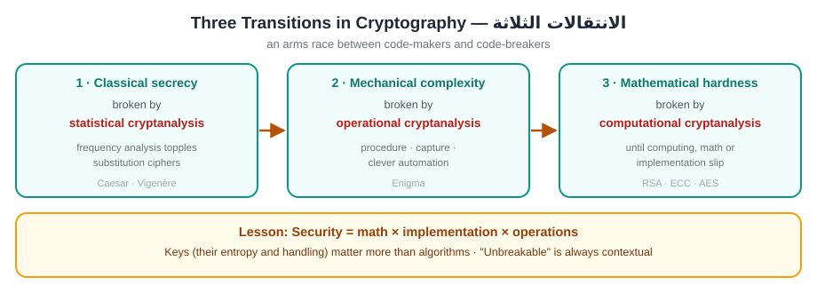
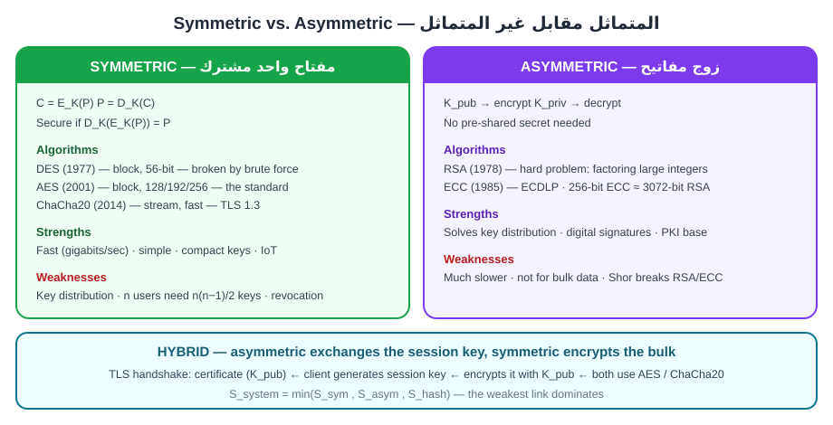
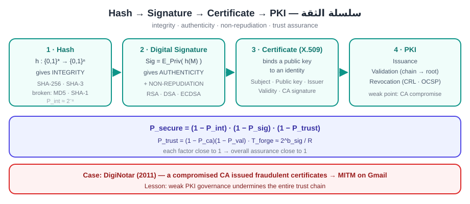
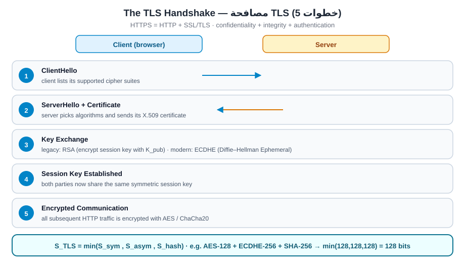

# الجابتر الرابع — Cryptography Basics
## التشفير: من الشفرات الكلاسيكية إلى TLS

> **دليل القراءة:** كل مقطع مقسوم ثلاث طبقات:
> **① النص الأصلي (English)** — نسخة نظيفة **كثافة وسط** (مو مضغوطة للصفر، ومو منسوخة سطر بسطر) · **② الترجمة** — ترجمة كاملة مطابقة · **③ الشرح الفهمي** — الشرح اللي يفهمك المفهوم.
>
> **المصدر:** `02_Raw_Materials/W04_Cryptography.pdf` (18 صفحة).
>
> ⚠️ **مهم:** هذا الفصل **مادة مولّدة بالـ AI**. عنوانه الداخلي مكتوب **«Week 3»** بالغلط (المادة نفسها تسمّي الجابتر الرابع «الأسبوع الثالث» — هذا خلل ترقيم بالمصدر). ومعادلاته الرياضية (`RSA`, `ECC`, `SHA-256`, `TLS`) **قياسية وحقيقية** — أفضَل جابتر بالمادة من ناحية الدقة.

## ⚠️ أخطاء الدكتورة بالمحاضرة (من التفريغ — ماكو نسخة معلَّمة لهذا الجابتر)

| # | قالت | الصحيح |
|:--:|:---|:---|
| 1 | «Vigenère **غير متماثل**» | ❌ **Caesar و Vigenère الاثنان symmetric** — الفرق = كلمة مفتاحية متكررة، مو «غير متماثل» |
| 2 | «AES عندها **16 Round**» | **10 / 12 / 14** (لـ 128 / 192 / 256) |
| 3 | «$D$ = **Distance**» بـ unicity distance | $D$ = **Redundancy** (تكرارية اللغة) — مو مسافة |
| 4 | «المتماثل يحتاج مفتاح واحد… فكل شخص مفتاح فريد» | $n$ مستخدمين = $\frac{n(n-1)}{2}$ مفتاح |

> **مفرداتها للامتحان:** هي تسمّي الأشياء بأسمائها الإنكليزية — «symmetric / asymmetric», «hash», «signature», «PKI». احفظ المفردات الإنكليزية، واشرح بالعربي.

---

### القسم 1 — Why history matters in cybersecurity

#### ① النص الأصلي

> Cryptography's history reads like an arms race between code-makers and code-breakers. Each epoch's "breakthrough" method was eventually broken by a new analytic technique, a faster computer, or a procedural slip. This history isn't trivia — it explains why today's controls look the way they do, which assumptions are safe (or unsafe), and how to reason quantitatively about security over time.
>
> At a high level, three transitions define the arc:
>
> - **Classical secrecy** → statistical cryptanalysis (frequency analysis topples substitution ciphers).
> - **Mechanical complexity** → operational cryptanalysis (Enigma's combinatorics beaten by procedure, capture, and clever automation).
> - **Mathematical hardness** → computational cryptanalysis (modern systems stand on well-studied hard problems and provable design goals until computing, math, or implementation mistakes catch up).
>
> Those transitions map directly to modern cybersecurity lessons:
>
> - Security is not only math — it's math ⨉ implementation ⨉ operations.
> - Keys (their entropy and handling) matter more than algorithms in many real failures.
> - "Unbreakable" is always contextual: it means "beyond the feasible work factor of realistic adversaries, within the asset's lifetime."

#### ② الترجمة

> «تاريخ التشفير يُقرأ كسباق تسلّح بين صانعي الشيفرة وكاسريها. كل «اختراق» في حقبة ما انتهى مكسورًا عبر تقنية تحليلية جديدة، أو حاسوب أسرع، أو زلة إجرائية. هذا التاريخ ليس معرفة هامشية — بل يفسّر لماذا تبدو ضوابط اليوم كما هي، وأي الافتراضات آمنة (أو غير آمنة)، وكيف نفكّر كمّيًا بشأن الأمن عبر الزمن.
>
> على المستوى العام، ثلاثة انتقالات ترسم المسار:
>
> - **السرية الكلاسيكية** ← التحليل الإحصائي للتشفير (تحليل التكرار يُسقط شيفرات الاستبدال).
> - **التعقيد الميكانيكي** ← التحليل التشغيلي للتشفير (تراكيب Enigma تُهزم بالإجراء والاستيلاء والأتمتة الذكية).
> - **الصعوبة الرياضية** ← التحليل الحسابي للتشفير (الأنظمة الحديثة تقف على مسائل صعبة مدروسة جيدًا وأهداف تصميم قابلة للإثبات حتى تلحق بها الحوسبة أو الرياضيات أو أخطاء التنفيذ).
>
> هذه الانتقالات تنعكس مباشرة على دروس الأمن السيبراني الحديثة:
>
> - الأمن ليس رياضيات فقط — بل رياضيات ⨉ تنفيذ ⨉ عمليات.
> - المفاتيح (إنتروبيتها وإدارتها) تهمّ أكثر من الخوارزميات في كثير من الإخفاقات الحقيقية.
> - «غير القابل للكسر» سياقي دائمًا: يعني «خارج عامل العمل الممكن للخصوم الواقعيين، ضمن عمر الأصل».»

#### ③ الشرح الفهمي

الفكرة الأساسية إن التشفير مو حالة ثابتة — هو صراع مستمر. كل ما يطلع طريقة تشفير قوية، تطلع بعدها طريقة تحليل تكسرها. لهذا ندرس التاريخ: مو لأنه معلومات قديمة، بل لأنه يفسّر ليش ضوابطنا الحالية مصمّمة بهذا الشكل، وأي افتراضات تكدر تعتمد عليها وأي لا.

الانتقالات الثلاثة هي جوهر الموضوع:

| المرحلة | شلون انكسرت | الدرس |
|---|---|---|
| السرية الكلاسيكية | تحليل التكرار (frequency analysis) | الشيفرة اللي تعتمد على سرّية الآلية تنكسر |
| التعقيد الميكانيكي (Enigma) | إجراء + استيلاء + أتمتة | التعقيد يأخّر التحليل بس ما يمنعه |
| الصعوبة الرياضية (الحديثة) | حوسبة / رياضيات / أخطاء تنفيذ | الأمان مسألة عامل عمل (work factor) |

والدروس الثلاثة تختصر فلسفة المادة كلها: (1) الأمن = رياضيات ⨉ تنفيذ ⨉ عمليات — يعني الخوارزمية وحدها ما تكفي. (2) المفتاح (entropy وإدارة) أهم من الخوارزمية بكثير من الإخفاقات الحقيقية. (3) كلمة «غير قابل للكسر» سياقية: تعني خارج قدرة الخصم الواقعي خلال عمر الأصل، مو مستحيل مطلقًا.

مثال عملي: لو خزّنت مفتاح ضعيف أو تسرّب المفتاح، خوارزمية AES القوية ما راح تنقذك. الهجوم غالبًا يجي على المفتاح أو على التنفيذ، مو على الخوارزمية نفسها.

---

### القسم 2 — 2.1 Caesar (shift) cipher

#### ① النص الأصلي

> The Caesar cipher replaces each letter $x$ (encoded 0–25) with $(x + k) \bmod 26$, using the encryption and decryption functions shown below.
>
> Why it fails:
>
> - Tiny keyspace (25 nontrivial keys).
> - Preserved statistics: letter frequencies and diagram patterns leak the shift.
> - Automatable attacks: exhaustive search or frequency analysis recover $k$ in milliseconds.
>
> Cybersecurity lesson: Small keyspaces and preserved structure are fatal. Any scheme that fails to obscure plaintext statistics is brittle once an adversary can collect enough ciphertext.

$$E(x) = (x + k) \bmod 26 \qquad D(x) = (x - k) \bmod 26$$

| Symbol | Meaning |
|---|---|
| $x$ | letter encoded 0–25 |
| $k$ | shift / key |

#### ② الترجمة

> «شيفرة قيصر تستبدل كل حرف $x$ (مُرمَّز 0–25) بـ $(x + k) \bmod 26$، باستخدام دالتي التشفير وفكّ التشفير الموضّحتين أدناه.
>
> لماذا تفشل:
>
> - فضاء مفاتيح ضئيل (25 مفتاحًا غير تافه).
> - إحصاءات محفوظة: تكرارات الحروف وأنماط الثنائيات تسرّب الإزاحة.
> - هجمات قابلة للأتمتة: البحث الشامل أو تحليل التكرار يستعيدان $k$ خلال ميلي ثانية.
>
> درس الأمن السيبراني: فضاءات المفاتيح الصغيرة والبنية المحفوظة قاتلة. أي مخطط يفشل في إخفاء إحصاءات النص الأصلي يصبح هشًّا بمجرد أن يجمع الخصم نصًّا مشفّرًا كافيًا.»

#### ③ الشرح الفهمي

شيفرة قيصر أبسط أنواع الاستبدال: كل حرف تزيحه بعدد ثابت $k$. مثلاً بـ $k = 3$: يتحوّل A ← D، و B ← E، وهكذا. والتشفير وفكّ التشفير عكس بعض تمامًا — الإزاحة والرجوع عنها.

ليش تنكسر؟

1. فضاء المفاتيح صغير جدًا — 25 احتمال غير تافه بس، يعني تكدر تجرّبهم كلهم بالثواني (brute force).
2. ما تخفي إحصاءات اللغة — تكرار حرف E بالإنجليزية يبقى ظاهر بس مزيّح، فـ frequency analysis يكتشف الإزاحة بسرعة.
3. قابلة للأتمتة بالكامل — حاسوب بسيط يستعيد $k$ بميلي ثانية.

| الخاصية | قيصر |
|---|---|
| نوع الشيفرة | substitution (monoalphabetic) |
| فضاء المفاتيح | 25 مفتاحًا غير تافه |
| هل يخفي التكرار؟ | لا |
| طريقة الكسر | brute force / frequency analysis |

ملاحظة أمانة: بالنص الأصلي مكتوب `mode` بدل `mod` بالمعادلة الثانية — الصحيح `mod` (باقي القسمة على 26)، وهي الصيغة الصحيحة المعروضة أعلاه.

الدرس: أي شيفرة ما تخفي إحصاءات النص الأصلي تكون هشّة بمجرد ما يجمع المهاجم نص مشفّر كافي.

---

### القسم 3 — 2.2 Vigenère (polyalphabetic) cipher

#### ① النص الأصلي

> Vigenère uses a repeated key $K$ to apply different Caesar shifts per position.
>
> For centuries this looked "unbreakable" because a single frequency distribution no longer sufficed — each key position induced its own distribution. But Kasiski examination and Friedman's index of coincidence reveal the key length. Once the period is known, the cipher reduces to multiple Caesar problems.
>
> Cybersecurity lesson: Adding complexity (multiple alphabets) can delay, not prevent, analysis. Attackers evolve; security that relies on secrecy of mechanism rather than work factor erodes with time.

$$C_i = (P_i + K_i) \bmod 26$$

| Symbol | Meaning |
|---|---|
| $C_i$ | ciphertext letter at position $i$ |
| $P_i$ | plaintext letter at position $i$ |
| $K_i$ | key letter at position $i$ (from the repeated keyword) |

#### ② الترجمة

> «فيجينير يستخدم مفتاحًا متكرّرًا $K$ لتطبيق إزاحات قيصر مختلفة لكل موضع.
>
> لقرون بدا هذا «غير قابل للكسر» لأن توزيع تكرار واحد لم يعد كافيًا — كل موضع مفتاح أنتج توزيعه الخاص. لكن فحص كاسيسكي ومؤشّر التطابق لفريدمان يكشفان طول المفتاح. وبمجرد معرفة الدورة، تتحوّل الشيفرة إلى عدة مسائل قيصر.
>
> درس الأمن السيبراني: إضافة التعقيد (أبجديات متعددة) يمكن أن تؤجّل التحليل لا أن تمنعه. المهاجمون يتطوّرون؛ والأمن الذي يعتمد على سرّية الآلية بدل عامل العمل يتآكل مع الزمن.»

#### ③ الشرح الفهمي

فيجينير تطوّر على قيصر: بدل إزاحة واحدة ثابتة، تستخدم كلمة مفتاحية (keyword) وتكرّرها. كل حرف من النص يُشفّر بإزاحة مختلفة حسب الحرف المقابل من الكلمة. مثلاً keyword = KEY تعني إزاحات 10, 4, 24, 10, 4, 24... وهكذا دواليك.

لهذا حيّرت الناس لقرون: تحليل التكرار العادي ما ينفع، لأن كل موضع من المفتاح يعطي توزيع مختلف، فيتوزّع تكرار الحرف الواحد على عدة أبجديات (polyalphabetic).

شلون تنكسر؟

- **Kasiski examination**: يكتشف طول المفتاح (period) عن طريق تكرار مقاطع متطابقة بالنص المشفّر.
- **Friedman's index of coincidence (IC)**: يقيس انتظام التوزيع ويقدّر طول المفتاح إحصائيًا.
- بعد معرفة الطول، الشيفرة تنفصل إلى عدة مسائل قيصر مستقلة — كل واحدة تنكسر بتحليل التكرار العادي.

| الخوارزمية | المفتاح | الإزاحة لكل موضع |
|---|---|---|
| Caesar | حرف واحد (رقم) | ثابتة |
| Vigenère | كلمة مفتاحية متكرّرة | تتغيّر حسب الحرف |

نقطة توضيح مهمة: **Caesar و Vigenère الاثنان symmetric** — يعني مفتاح واحد يُستخدم للتشفير وفكّ التشفير. الفرق الحقيقي بينهم هو إن Vigenère يستخدم keyword متكرّر (إزاحة مختلفة لكل موضع)، مو إنه «asymmetric».

الدرس: التعقيد (أبجديات متعددة) يأخّر التحليل بس ما يمنعه. والأمن اللي يعتمد على سرّية الآلية بدل عامل العمل يتآكل مع الزمن.

---

### القسم 4 — 2.3 A quantitative view: unicity distance

#### ① النص الأصلي

> Claude Shannon formalized why classical ciphers break under enough ciphertext. The unicity distance $U$ estimates how many characters an attacker needs, on average, to determine a unique key given language redundancy.
>
> - $H(K)$: key entropy (bits).
> - $D$: redundancy of the language (bits/character; English ≈ 1–1.5).
>
> Example: A monoalphabetic substitution cipher's keyspace is $26!$ (about $2^{88}$ possibilities). With English redundancy $D \approx 1.5$, $U \approx 88/1.5 \approx 59$ characters. In other words, mere paragraphs suffice, in principle, to uniquely determine the key.
>
> Cybersecurity relevance: Even without computers, statistics break systems once the ciphertext exceeds $U$. Modern designs strive to ensure $U$ is effectively unreachable within an asset's lifetime and bandwidth.

$$U \approx \frac{H(K)}{D}$$

| Symbol | Meaning |
|---|---|
| $U$ | unicity distance (characters) |
| $H(K)$ | key entropy in bits |
| $D$ | redundancy of the language (bits/char; English ≈ 1–1.5) |

#### ② الترجمة

> «كلود شانون صاغ رياضيًا لماذا تنكسر الشيفرات الكلاسيكية عند وجود نص مشفّر كافٍ. مسافة الوحدانية $U$ تقدّر عدد الأحرف التي يحتاجها المهاجم، في المتوسط، لتحديد مفتاح وحيد بالنظر إلى تكرارية اللغة.
>
> - $H(K)$: إنتروبيا المفتاح (بت).
> - $D$: تكرارية اللغة (بت/حرف؛ الإنجليزية ≈ 1–1.5).
>
> مثال: فضاء مفاتيح شيفرة الاستبدال أحادية الأبجدية هو $26!$ (حوالي $2^{88}$ احتمالًا). مع تكرارية إنجليزية $D \approx 1.5$، فإن $U \approx 88/1.5 \approx 59$ حرفًا. بعبارة أخرى، فقرات بسيطة تكفي مبدئيًا لتحديد المفتاح بشكل وحيد.
>
> الأهمية السيبرانية: حتى دون حواسيب، الإحصاء يكسر الأنظمة بمجرد أن يتجاوز النص المشفّر $U$. التصاميم الحديثة تسعى لجعل $U$ غير قابل للوصول فعليًا ضمن عمر الأصل وعرض النطاق.»

#### ③ الشرح الفهمي

شانون سأل سؤال ذكي: كم حرف مشفّر يحتاج المهاجم حتى يصير عنده مفتاح وحيد صحيح؟ الجواب هو unicity distance، ورمزه $U$.

المعادلة أعلاه تقول: $U$ = إنتروبيا المفتاح ÷ تكرارية اللغة. يعني:

| الرمز | المعنى |
|---|---|
| $U$ | مسافة الوحدانية (بالأحرف) |
| $H(K)$ | إنتروبيا المفتاح (بت) — كم بت من العشوائية بالمفتاح |
| $D$ | تكرارية اللغة (redundancy، بت/حرف) — الإنجليزية ≈ 1–1.5 |

المعنى المنطقي: كل ما المفتاح أكبر إنتروبيا ($H(K)$ أكبر) أو اللغة أقل تكرارية ($D$ أقل)، كل ما احتاج المهاجم نص مشفّر أكثر حتى يثبّت المفتاح الوحيد.

المثال المحسوب خطوة بخطوة:

- شيفرة الاستبدال أحادية الأبجدية عندها $26!$ مفتاح ممكن.
- $\log_2(26!) \approx 88$ بت، يعني $H(K) \approx 88$ بت.
- اللغة الإنجليزية $D \approx 1.5$ بت/حرف.
- إذن $U \approx 88 / 1.5 \approx 59$ حرف.

يعني حوالي فقرة صغيرة تكفي نظريًا لتحديد المفتاح الوحيد — مو نص طويل. لهذا الشيفرات الكلاسيكية تنكسر بسهولة بالنص الكافي، حتى بدون حاسوب.

الأهمية السيبرانية: التصاميم الحديثة تحاول تخلي $U$ كبيرة جدًا لدرجة مستحيلة الوصول خلال عمر الأصل — يعني عمليًا تحتاج نص مشفّر أكبر من اللي راح يجمعه المهاجم بحياته، وهذا اللي يحمي النظام.

---

### القسم 5 — Introduction
#### ① النص الأصلي
> Encryption is one of the most fundamental mechanisms in cybersecurity, ensuring that sensitive information can only be accessed by authorized parties. All modern secure communication systems — from mobile banking and cloud storage to national defense and blockchain — depend on two complementary paradigms of encryption: symmetric encryption and asymmetric encryption.
>
> - **Symmetric encryption**: Same key used for encryption and decryption.
> - **Asymmetric encryption**: Uses mathematically related public/private key pairs.
>
> Each approach has distinct strengths, weaknesses, and applications, and in practice they are combined to provide scalability, efficiency, and trust in secure systems. This section explores both paradigms in depth — their algorithms, applications, limitations, and most importantly a mathematical framework for analyzing their security levels in real-world cybersecurity contexts.

#### ② الترجمة
> «التشفير (Encryption) واحد من أهم المبادئ الأساسية في الأمن السيبراني، لأنه يضمن أن المعلومات الحساسة ما يوصل لها إلا الأطراف المصرّح لها. كل أنظمة الاتصال الآمنة الحديثة — من الموبايل بانكنگ والتخزين السحابي إلى الدفاع الوطني والبلوكچين — تعتمد على نمطين متكاملين من التشفير: التشفير المتماثل (symmetric) والتشفير غير المتماثل (asymmetric).
>
> - **التشفير المتماثل (Symmetric encryption)**: نفس المفتاح يُستخدم للتشفير وفك التشفير.
> - **التشفير غير المتماثل (Asymmetric encryption)**: يستخدم زوج مفاتيح (public/private) مرتبطة ببعضها رياضياً.
>
> كل طريقة لها نقاط قوة وضعف وتطبيقات مميزة، وعملياً يتم دمجهن سوة لتوفير القابلية للتوسّع (scalability) والكفاءة (efficiency) والثقة (trust) في الأنظمة الآمنة. هذا القسم يستعرض النمطين بعمق — الخوارزميات والتطبيقات والقيود، والأهم إطار رياضي لتحليل مستويات الأمان مالهن في سياقات الأمن السيبراني الواقعية.»

#### ③ الشرح الفهمي
التشفير هو أساس الأمن السيبراني: بدونه أي معلومة تمرّ على الشبكة تكون مكشوفة. الفكرة كلها تدور على **نموذجين (paradigms)** للتشفير:

| النموذج | عدد المفاتيح | الفكرة بجملة |
|---|---|---|
| **Symmetric** | مفتاح واحد مشترك | نفس المفتاح يقفل ويفتح |
| **Asymmetric** | زوج مفاتيح (public + private) | مفتاح للقفل ومفتاح مختلف للفتح |

ولا واحد منهن كافي لحاله: المتماثل سريع بس عنده مشكلة توزيع المفتاح، وغير المتماثل يحل توزيع المفتاح بس بطيء. لهذا الواقع يجمع بينهن (Hybrid) — وهذا اللي راح نشوفه بالـ TLS مثلاً. هذا القسم راح يشرح الاثنين ويحطّ إطار رياضي (mathematical framework) نقيس بيه مستوى الأمان بشكل رقمي.

---

### القسم 6 — Symmetric Encryption
#### ① النص الأصلي
> **2.1 Definition**
>
> Symmetric encryption employs a single shared secret key $K$ for both encryption and decryption.
>
> - Encryption: $C = E_K(P)$
> - Decryption: $P = D_K(C)$
>
> Where:
>
> - $P$ = plaintext message,
> - $C$ = ciphertext,
> - $E_K$ = encryption function under key $K$,
> - $D_K$ = decryption function under key $K$.
>
> If the system is secure, $D_K(E_K(P)) = P$.
>
> **2.2 Key Characteristics**
>
> - **Fast and efficient**: Handles large volumes of data quickly.
> - **Minimal resource usage**: Suitable for embedded devices and IoT.
> - **Key distribution challenge**: Securely sharing $K$ across networks is difficult.
>
> **2.3 Common Algorithms**
>
> 1. **DES (Data Encryption Standard, 1977)**
>    - Block cipher, 56-bit key.
>    - Once dominant but broken by brute force.
>    - Demonstrated the danger of underestimating future computing power.
> 2. **AES (Advanced Encryption Standard, 2001)**
>    - Block cipher with 128-, 192-, or 256-bit keys.
>    - Secure against all practical cryptanalysis.
>    - Standard for VPNs, TLS, disk encryption.
> 3. **ChaCha20 (2014)**
>    - Stream cipher optimized for speed and resistance to timing attacks.
>    - Widely deployed in TLS 1.3 and mobile applications.
>
> **2.4 Strengths**
>
> - **Performance**: AES can achieve gigabits/sec throughput.
> - **Simplicity**: Easier to implement securely than asymmetric cryptography.
> - **Compactness**: Smaller key sizes achieve high security (AES-128 is robust).
>
> **2.5 Weaknesses**
>
> - **Key distribution problem**: If the key is intercepted or leaked, confidentiality collapses.
> - **Scalability**: With $n$ users, a symmetric system requires $\frac{n(n-1)}{2}$ unique keys.
> - **Revocation difficulty**: Replacing a compromised key requires distributing a new one securely.
>
> **2.6 Use Cases in Cybersecurity**
>
> - Encrypting stored data (databases, disks).
> - Securing network traffic (VPNs, Wi-Fi protocols like WPA2/WPA3).
> - Bulk encryption of cloud backups.

$$C = E_K(P) \qquad P = D_K(C)$$

$$\text{keys needed for } n \text{ users} = \frac{n(n-1)}{2}$$

#### ② الترجمة
> «**2.1 التعريف**
>
> التشفير المتماثل (Symmetric encryption) يستخدم مفتاح سري واحد مشترك $K$ للتشفير وفك التشفير سوة.
>
> - التشفير (Encryption): $C = E_K(P)$
> - فك التشفير (Decryption): $P = D_K(C)$
>
> حيث:
>
> - $P$ = الرسالة الأصلية (plaintext),
> - $C$ = النص المشفّر (ciphertext),
> - $E_K$ = دالة التشفير تحت المفتاح $K$,
> - $D_K$ = دالة فك التشفير تحت المفتاح $K$.
>
> إذا النظام آمن، فإن $D_K(E_K(P)) = P$.
>
> **2.2 الخصائص الرئيسية**
>
> - **سريع وفعّال (Fast and efficient)**: يتعامل مع كميات كبيرة من البيانات بسرعة.
> - **استهلاك موارد قليل (Minimal resource usage)**: مناسب للأجهزة المدمجة (embedded) والـ IoT.
> - **تحدي توزيع المفتاح (Key distribution challenge)**: مشاركة $K$ بشكل آمن عبر الشبكات صعبة.
>
> **2.3 الخوارزميات الشائعة**
>
> 1. **DES (معيار تشفير البيانات، 1977)**
>    - Block cipher، مفتاح 56-bit.
>    - كان مسيطر زمان بس انكسر بالقوة الغاشمة (brute force).
>    - أثبت خطر الاستهانة بقوة الحوسبة المستقبلية.
> 2. **AES (معيار التشفير المتقدم، 2001)**
>    - Block cipher بمفاتيح 128- أو 192- أو 256-bit.
>    - آمن ضد كل التحليل التشفيري العملي (practical cryptanalysis).
>    - معيار للـ VPNs والـ TLS وتشفير الأقراص (disk encryption).
> 3. **ChaCha20 (2014)**
>    - Stream cipher مُحسّن للسرعة ومقاوم لهجمات التوقيت (timing attacks).
>    - مُنتشر بشكل واسع في TLS 1.3 وتطبيقات الموبايل.
>
> **2.4 نقاط القوة**
>
> - **الأداء (Performance)**: الـ AES يوصل إنتاجية (throughput) بالگيگابت/ثانية.
> - **البساطة (Simplicity)**: أسهل تنفيذاً بشكل آمن من التشفير غير المتماثل.
> - **الاختصار (Compactness)**: أحجام مفاتيح أصغر تحقق أمان عالي (AES-128 قوي).
>
> **2.5 نقاط الضعف**
>
> - **مشكلة توزيع المفتاح (Key distribution problem)**: إذا انقطع المفتاح أو تسرّب، السرّية (confidentiality) تنهار.
> - **القابلية للتوسّع (Scalability)**: مع $n$ مستخدمين، النظام المتماثل يحتاج $\frac{n(n-1)}{2}$ مفاتيح فريدة.
> - **صعوبة الإبطال (Revocation difficulty)**: تبديل مفتاح مخترق يتطلّب توزيع مفتاح جديد بشكل آمن.
>
> **2.6 حالات الاستخدام في الأمن السيبراني**
>
> - تشفير البيانات المخزّنة (قواعد البيانات، الأقراص).
> - تأمين حركة الشبكة (VPNs، بروتوكولات الواي فاي مثل WPA2/WPA3).
> - التشفير الكمّي (bulk encryption) للنسخ الاحتياطية السحابية.»

#### ③ الشرح الفهمي
الفكرة الأساسية بجملة: **مفتاح واحد يقفل ويفتح**. يعني الطرفين (Sender و Receiver) لازم يكون عندهم نفس المفتاح $K$ سرّاً. إذا الأمان شغّال، فك التشفير يرجّعك للنص الأصلي بالضبط: $D_K(E_K(P)) = P$.

شنو يخلي المتماثل محبوب؟ سريع جداً ومناسب لكميات البيانات الكبيرة (bulk data) والأجهزة الضعيفة (IoT). بس عنده جرح كبير: **مشكلة توزيع المفتاح** — كيف نوصل نفس المفتاح للطرف الثاني بأمان أصلاً؟

الخوارزميات الثلاثة:

| الخوارزمية | السنة | النوع | حجم المفتاح | الملاحظة |
|---|---|---|---|---|
| **DES** | 1977 | Block cipher | 56-bit | انكسر بالـ brute force — درس: لا تستهين بقوة الحوسبة المستقبلية |
| **AES** | 2001 | Block cipher | 128 / 192 / 256-bit | المعيار الحالي، آمن عملياً |
| **ChaCha20** | 2014 | Stream cipher | — | سريع ومقاوم للـ timing attacks، مستخدم في TLS 1.3 |

معادلة عدد المفاتيح مهمة للامتحان: مع $n$ مستخدمين، عدد المفاتيح الفريدة المطلوبة = $\frac{n(n-1)}{2}$ — يعني تنمو بشكل تربيعي، وهذا سبب مشكلة الـ scalability.

⚠️ **ملاحظة صريحة (تصحيح):** النص ذكر مفاتيح AES (128/192/256) بس ما ذكر عدد الدورات (rounds). الحقيقة المعيارية: الـ AES يستخدم **10 / 12 / 14 دورات** لمفاتيح 128 / 192 / 256-bit — مو "16" (رقم شائع غلط). هاي معلومة خارج النص بس صحيحة ومهمة.

---

### القسم 7 — Asymmetric Encryption
#### ① النص الأصلي
> **3.1 Definition**
>
> Asymmetric encryption uses two related keys:
>
> - Public key ($K_{pub}$) → used for encryption.
> - Private key ($K_{priv}$) → used for decryption.
>
> This eliminates the need to share a secret key in advance.
>
> **3.2 RSA Algorithm (1978)**
>
> RSA is based on the difficulty of factoring large integers.
>
> 1. Choose two primes $p, q$.
> 2. Compute modulus: $n = p \cdot q$.
> 3. Compute Euler's totient: $\varphi(n) = (p-1)(q-1)$.
> 4. Choose public exponent $e$ with $\gcd(e, \varphi(n)) = 1$.
> 5. Compute private key $d \equiv e^{-1} \pmod{\varphi(n)}$.
> 6. Encryption: $C = P^{e} \bmod n$.
> 7. Decryption: $P = C^{d} \bmod n$.
>
> **3.3 Elliptic Curve Cryptography (ECC, 1985)**
>
> ECC relies on the Elliptic Curve Discrete Logarithm Problem (ECDLP).
>
> - Provides equivalent security with shorter keys:
>   - 256-bit ECC ≈ 3072-bit RSA.
> - More efficient for mobile, IoT, and blockchain.
>
> **3.4 Strengths**
>
> - **Key distribution solved**: No pre-shared secret required.
> - Supports digital signatures and authentication.
> - **Foundation of PKI** (certificates, HTTPS, secure email).
>
> **3.5 Weaknesses**
>
> - **Slower**: Orders of magnitude slower than AES.
> - **Resource intensive**: Not suitable for bulk encryption.
> - **Quantum vulnerability**: Shor's algorithm can break RSA/ECC.
>
> **3.6 Use Cases in Cybersecurity**
>
> - Establishing secure connections (TLS/SSL).
> - Email encryption and signing (PGP, S/MIME).
> - Authentication (SSH keys, smartcards).
> - Cryptocurrencies (Bitcoin wallets via ECC).

$$n = p \cdot q \qquad \varphi(n) = (p-1)(q-1) \qquad d \equiv e^{-1} \pmod{\varphi(n)}$$

$$C = P^{e} \bmod n \qquad P = C^{d} \bmod n$$

#### ② الترجمة
> «**3.1 التعريف**
>
> التشفير غير المتماثل (Asymmetric encryption) يستخدم مفتاحين مرتبطين:
>
> - المفتاح العام (Public key، $K_{pub}$) ← يُستخدم للتشفير.
> - المفتاح الخاص (Private key، $K_{priv}$) ← يُستخدم لفك التشفير.
>
> هذا يلغي الحاجة لمشاركة مفتاح سري مسبقاً.
>
> **3.2 خوارزمية RSA (1978)**
>
> الـ RSA تعتمد على صعوبة تحليل الأعداد الكبيرة إلى عواملها (factoring large integers).
>
> 1. اختر عددين أوليين (primes) $p, q$.
> 2. احسب المعامل (modulus): $n = p \cdot q$.
> 3. احسب دالة أويلر (Euler's totient): $\varphi(n) = (p-1)(q-1)$.
> 4. اختر الأس العام (public exponent) $e$ بحيث $\gcd(e, \varphi(n)) = 1$.
> 5. احسب المفتاح الخاص $d \equiv e^{-1} \pmod{\varphi(n)}$.
> 6. التشفير (Encryption): $C = P^{e} \bmod n$.
> 7. فك التشفير (Decryption): $P = C^{d} \bmod n$.
>
> **3.3 تشفير المنحنيات الإهليلجية (ECC، 1985)**
>
> الـ ECC تعتمد على مسألة اللوگاريتم المتقطّع للمنحنى الإهليلجي (ECDLP).
>
> - تعطي أمان مكافئ بمفاتيح أقصر:
>   - 256-bit ECC ≈ 3072-bit RSA.
> - أكثر كفاءة للموبايل والـ IoT والبلوكچين.
>
> **3.4 نقاط القوة**
>
> - **حلّت مشكلة توزيع المفتاح**: ما كو حاجة لسر مشترك مسبق.
> - تدعم التوقيعات الرقمية (digital signatures) والمصادقة (authentication).
> - **أساس الـ PKI** (الشهادات، HTTPS، البريد الآمن).
>
> **3.5 نقاط الضعف**
>
> - **أبطأ (Slower)**: أبطأ من AES بمراتب كثيرة.
> - **مستهلكة للموارد (Resource intensive)**: ما تناسب التشفير الكمّي (bulk encryption).
> - **هشاشة كمومية (Quantum vulnerability)**: خوارزمية Shor تقدر تكسر RSA/ECC.
>
> **3.6 حالات الاستخدام في الأمن السيبراني**
>
> - إنشاء الاتصالات الآمنة (TLS/SSL).
> - تشفير وتوقيع البريد الإلكتروني (PGP، S/MIME).
> - المصادقة (مفاتيح SSH، البطاقات الذكية smartcards).
> - العملات الرقمية (محافظ البيتكوين عبر ECC).»

#### ③ الشرح الفهمي
هنا الفكرة معكوسة عن المتماثل: **مفتاحين مختلفين مرتبطين رياضياً**. المفتاح العام ($K_{pub}$) يوزّعه أي واحد، والمفتاح الخاص ($K_{priv}$) يبقى سرّ عندك. اللي يقفل بالمفتاح العام، ما يفتحه إلا المفتاح الخاص. وهذا يحل مشكلة توزيع المفتاح اللي كانت تقتل النظام المتماثل — لأن ما كو حاجة نتفق على سر مشترك من قبل.

**خطوات RSA السبع (مهمة للامتحان):**

1. اختر عددين أوليين $p, q$.
2. $n = p \cdot q$ ← هذا هو الـ modulus.
3. $\varphi(n) = (p-1)(q-1)$ ← دالة أويلر.
4. اختر $e$ بحيث $\gcd(e, \varphi(n)) = 1$.
5. $d \equiv e^{-1} \pmod{\varphi(n)}$.
6. التشفير: $C = P^{e} \bmod n$.
7. فك التشفير: $P = C^{d} \bmod n$.

مقارنة RSA و ECC:

| | RSA (1978) | ECC (1985) |
|---|---|---|
| المسألة الصعبة | factoring الأعداد الكبيرة | ECDLP (Elliptic Curve Discrete Log) |
| حجم المفتاح لأمان مكافئ | 3072-bit | 256-bit |
| المناسبة | الاستخدام العام | الموبايل، IoT، البلوكچين |

**القوة:** حلّت توزيع المفتاح + تدعم digital signatures + هي أساس الـ PKI. **الضعف:** بطيئة جداً مقارنة بالـ AES، ولهذا ما تُستخدم للـ bulk encryption، وأخطر شي إنها هشّة قدام الحوسبة الكمومية — خوارزمية **Shor** تكسر RSA/ECC.

⚠️ **ملاحظة صريحة (تصحيح):** النص طبع الخطوة 4 بالشكل `gdc(e, φ(n)) = 1`، والصحيح هو **gcd** (greatest common divisor = القاسم المشترك الأكبر). كتبناها بالشكل الصحيح gcd داخل النص، وهاي تصحيح خطأ مطبعي واضح مو تغيير بالمحتوى.

---

---

### القسم 8 — 4. Hybrid Cryptography in Practice

#### ① النص الأصلي

> Modern systems rarely rely on just one paradigm; instead they combine both:
>
> - Asymmetric encryption → used to securely exchange a session key.
> - Symmetric encryption → used for efficient bulk data encryption.
>
> **Example: TLS Handshake**
>
> 1. Client connects to the server and retrieves the certificate (which contains the server's public key).
> 2. Client generates a random session key.
> 3. The session key is encrypted with the server's public key and sent.
> 4. Both parties now share the session key → use AES/ChaCha20 for the data.
>
> This model combines the scalability of asymmetric with the efficiency of symmetric encryption.

#### ② الترجمة

> «الأنظمة الحديثة نادرًا ما تعتمد على نموذج واحد فقط، بل تجمع بين الاثنين معًا:
>
> - التشفير غير المتماثل ← يُستخدم لتبادل مفتاح الجلسة (session key) بشكل آمن.
> - التشفير المتماثل ← يُستخدم لتشفير البيانات الكبيرة (bulk) بكفاءة.
>
> **مثال: مصافحة TLS (TLS Handshake)**
>
> 1. العميل يتصل بالخادم ويستحضر الشهادة (certificate) التي تحتوي على المفتاح العام للخادم.
> 2. العميل يولّد مفتاح جلسة (session key) عشوائيًا.
> 3. يُشفَّر مفتاح الجلسة بالمفتاح العام للخادم ويُرسَل.
> 4. الطرفان الآن يتشاركان مفتاح الجلسة ← يستخدمان AES/ChaCha20 للبيانات.
>
> هذا النموذج يجمع قابلية التوسّع (scalability) عند التشفير غير المتماثل مع كفاءة التشفير المتماثل.»

#### ③ الشرح الفهمي

ليش نخلط بين النوعين؟ لأن كل واحد عنده مشكلة والثاني يحلها. الـ **asymmetric** يحل مشكلة توزيع المفتاح (key distribution) بس بطيء. والـ **symmetric** سريع بس يحتاج مفتاح مشترك يوصل بأمان. فالحل هو الـ **Hybrid**: نستخدم asymmetric بس للجزء الصغير (تبادل مفتاح الجلسة)، وبعدها نكمّل بالـ symmetric للبيانات الكبيرة.

| المرحلة | نوع التشفير | السبب |
|---|---|---|
| تبادل مفتاح الجلسة | Asymmetric | يحل مشكلة توزيع المفتاح |
| نقل البيانات الفعلية | Symmetric (AES/ChaCha20) | سريع ويصلح للبيانات الكبيرة |

يعني باختصار: ندفع ضريبة البطء مرّة وحدة بس بالبداية، وبعدها نمشي بسرعة على البيانات.

### القسم 9 — 5. Mathematical Model: Security Work Factor in Encryption Systems

#### ① النص الأصلي

> To connect symmetric and asymmetric encryption to cybersecurity practice, we develop a **work factor model**. This quantifies how long a system can resist brute-force or mathematical attacks.
>
> **5.1 Bits of Security**
>
> - A system with a key space of size $2^k$ has $k$ bits of security.
> - The time to brute force depends on the adversary's computational rate $R$ (operations/sec).
>
> The average time equals half the keyspace:

$$T_{crack} \approx \frac{2^{k-1}}{R}$$

> **5.2 Symmetric Security**
>
> - AES-128.
> - With $R = 10^{18}$ ops/sec (an exascale adversary):

$$T_{crack} \approx \frac{2^{127}}{10^{18}} \approx 5.4 \times 10^{20}\ \text{years} \qquad (\text{AES-128})$$

> This is well beyond feasibility.
>
> **5.3 Asymmetric Security**
>
> The security of RSA/ECC is measured by its equivalent symmetric key strength:
>
> - RSA-2048 ≈ 112-bit symmetric security.
> - ECC-256 ≈ 128-bit symmetric security.
>
> These equivalences allow unified risk analysis.
>
> **5.4 Hybrid Model**
>
> For a secure system over lifetime $T_A$:

$$T_{system} = \min\{T_{sym}, T_{asym}\}$$

> - $T_{sym}$: cracking time for the symmetric session key.
> - $T_{asym}$: cracking time for the asymmetric key exchange.
>
> The weakest link dominates.

#### ② الترجمة

> «لربط التشفير المتماثل وغير المتماثل بالممارسة الأمنية، نبني **نموذج عامل الشغل (work factor model)**. هذا النموذج يقدّر كم من الوقت يقدر النظام يقاوم هجوم القوة الغاشمة (brute-force) أو الهجمات الرياضية.
>
> **5.1 بتات الأمان (Bits of Security)**
>
> - النظام اللي فضاء مفاتيحه (key space) بحجم $2^k$ عنده $k$ بت من الأمان.
> - زمن الـ brute force يعتمد على معدّل الحوسبة عند الخصم $R$ (عمليات/ثانية).
>
> متوسط الزمن يساوي نصف فضاء المفاتيح:»

$$T_{crack} \approx \frac{2^{k-1}}{R}$$

> «**5.2 الأمان المتماثل (Symmetric Security)**
>
> - AES-128.
> - بمعدّل $R = 10^{18}$ عملية/ثانية (خصم بمستوى exascale):»

$$T_{crack} \approx \frac{2^{127}}{10^{18}} \approx 5.4 \times 10^{20}\ \text{years} \qquad (\text{AES-128})$$

> «هذا يتجاوز حدود المعقول بكثير.
>
> **5.3 الأمان غير المتماثل (Asymmetric Security)**
>
> أمان RSA/ECC يُقاس بما يكافئه من قوة مفتاح متماثل:
>
> - RSA-2048 ≈ 112 بت من الأمان المتماثل.
> - ECC-256 ≈ 128 بت من الأمان المتماثل.
>
> هذه التكافؤات تسمح بتحليل موحّد للمخاطر.
>
> **5.4 النموذج الهجين (Hybrid Model)**
>
> لنظام آمن على مدى عمر $T_A$:»

$$T_{system} = \min\{T_{sym}, T_{asym}\}$$

> «- $T_{sym}$: زمن كسر مفتاح الجلسة المتماثل.
> - $T_{asym}$: زمن كسر تبادل المفتاح غير المتماثل.
>
> الحلقة الأضعف هي اللي تحكم (the weakest link dominates).»

#### ③ الشرح الفهمي

الفكرة الأساسية: الـ **work factor** يعني كم "شغل" لازم الخصم يسويه حتى يكسر النظام. ونقيسه بالـ **bits of security** — وكل بت إضافي يضاعف الشغل مرّتين. معادلة الزمن هي:

$$T_{crack} \approx \frac{2^{k-1}}{R}$$

| الرمز | المعنى |
|---|---|
| $k$ | بتات الأمان (bits of security) |
| $R$ | معدّل عمليات الخصم في الثانية (ops/sec) |
| $T_{crack}$ | الزمن المتوقع لكسر المفتاح (brute force) |

ليش $2^{k-1}$ مو $2^k$؟ لأننا بالمعدّل راح نلكى المفتاح بنص فضاء المفاتيح (half the keyspace).

مثال AES-128 مع خصم بمستوى exascale ($R = 10^{18}$):

$$T_{crack} \approx \frac{2^{127}}{10^{18}} \approx 5.4 \times 10^{20}\ \text{years} \qquad (\text{AES-128})$$

هذا رقم خيالي — للمقارنة، عمر الكون تقريبًا $1.4 \times 10^{10}$ سنة. يعني AES-128 عمليًا مستحيل.

نقطة مهمة جدًا: أمان **RSA/ECC** ما نقيسه بعدد بتات مفتاحه مباشرة، بل بما يكافئه من مفتاح متماثل. RSA-2048 (مفتاحه 2048 بت) يكافئ 112 بت متماثل بس! و ECC-256 يكافئ 128 بت. لذلك ECC أفضل — مفتاح أصغر وأمان أعلى.

والنموذج الهجين يقول إن أمان النظام كله = الأضعف بين الجزئين:

$$T_{system} = \min\{T_{sym}, T_{asym}\}$$

| الرمز | المعنى |
|---|---|
| $T_{sym}$ | زمن كسر الجزء المتماثل (session key) |
| $T_{asym}$ | زمن كسر الجزء غير المتماثل (key exchange) |
| $T_{system}$ | أمان النظام الكلي = الأضعف بينهما |

يعني لو الـ key exchange ضعيف، ما يفيدك إن الـ AES قوي — الحلقة الأضعف هي اللي تحكم.

ملاحظة صريحة: النص يعيد تكرار التكافؤ «RSA-2048 ≈ 112 بت / ECC-256 ≈ 128 بت» عدة مرات عبر الفصل — المادة مكرّرة بالتصميم.

### القسم 10 — 6. Case Studies

#### ① النص الأصلي

> **Case 1: Wi-Fi Security**
>
> - WPA2 uses AES-CCMP (symmetric).
> - Vulnerabilities often stem from key management (e.g., the KRACK attack exploiting nonce reuse).
>
> **Case 2: HTTPS/TLS**
>
> - Combination of asymmetric key exchange + symmetric encryption.
> - Misconfigured PKI or weak certificates are often the weak link.
>
> **Case 3: Bitcoin and Blockchain**
>
> - Transactions secured with ECDSA signatures (asymmetric).
> - Ledger integrity enforced with SHA-256 hashes.
>
> **Case 4: Quantum Threat**
>
> - RSA/ECC vulnerable to Shor's algorithm.
> - Symmetric AES only loses half its effective key length under Grover → AES-256 remains secure.

#### ② الترجمة

> «**الحالة 1: أمان الواي فاي (Wi-Fi Security)**
>
> - WPA2 يستخدم AES-CCMP (متماثل).
> - الثغرات غالبًا تنشأ من إدارة المفاتيح (key management) (مثل هجوم KRACK اللي يستغل إعادة استخدام الـ nonce).
>
> **الحالة 2: HTTPS/TLS**
>
> - مزيج من تبادل مفتاح غير متماثل + تشفير متماثل.
> - PKI المُهيّأ غلط أو الشهادات الضعيفة غالبًا هي الحلقة الأضعف.
>
> **الحالة 3: البيتكوين والبلوكتشين (Bitcoin and Blockchain)**
>
> - المعاملات مؤمّنة بتوقيعات ECDSA (غير متماثل).
> - سلامة السجل (ledger integrity) مفروضة بـ hashes من نوع SHA-256.
>
> **الحالة 4: التهديد الكمّي (Quantum Threat)**
>
> - RSA/ECC عرضة لخوارزمية Shor.
> - AES المتماثل يفقد نصف طول مفتاحه الفعلي تحت Grover، لذلك AES-256 يبقى آمنًا.»

#### ③ الشرح الفهمي

الأربع حالات تعلّمنا درس واحد: **النظام القوي = مزيج من الـ primitives، والأمان يحكمه أضعف جزء فيه**.

| الحالة | الـ primitive الأساسي | نقطة الضعف الفعلية |
|---|---|---|
| Wi-Fi (WPA2) | AES-CCMP متماثل | إدارة المفاتيح ← هجوم KRACK (nonce reuse) |
| HTTPS/TLS | hybrid (asym + sym) | PKI / شهادات ضعيفة |
| Bitcoin | ECDSA + SHA-256 | توقيع المفتاح الخاص |
| Quantum | Shor ضد RSA/ECC | Grover يضرب AES بس AES-256 يبقى آمن |

توضيح كل حالة:

- **Wi-Fi**: الخوارزمية (AES) قوية، بس الهجوم ما جاء من الخوارزمية — جاء من سوء إدارة المفاتيح (KRACK). يعني الحلقة الأضعف كانت implementation مو algorithm.
- **HTTPS/TLS**: يجمع الاثنين — asymmetric للـ handshake و symmetric للبيانات. والضعف عادة بالـ PKI (شهادات ضعيفة أو CA مخترق).
- **Bitcoin**: توقيع ECDSA يثبت ملكية العملة، و SHA-256 يثبّت البلوكتشين. لو غيّرت بلوك واحد، كل الـ hashes اللي بعده تتغيّر ← التلاعب يبان.
- **Quantum**: Shor يكسر RSA/ECC كامل، أما Grover على AES فيقلل البحث بـ square root بس ← AES-256 يفقد نصف طوله ويبقى ~128 بت أمان (آمن).

---

### القسم 11 — 1. Introduction

#### ① النص الأصلي

> Cybersecurity relies not only on encrypting information for confidentiality but also on ensuring integrity, authenticity, and trust. Encryption hides data, but organizations also need to confirm:
>
> 1. Has the data been modified? (Integrity)
> 2. Who created or sent the data? (Authenticity)
> 3. Can the sender later deny involvement? (Non-repudiation)
> 4. Can we trust the identity behind a key? (Trust assurance)
>
> These needs are met through hash functions, digital signatures, and digital certificates. Together, they form the backbone of secure Internet protocols, enabling banking, e-commerce, digital government, and blockchain ecosystems.

#### ② الترجمة

> «الأمن السيبراني ما يعتمد بس على تشفير المعلومات من أجل السرية (confidentiality)، بل كذلك على ضمان السلامة (integrity) والأصالة (authenticity) والثقة (trust). التشفير يخفي البيانات، بس المؤسسات كذلك تحتاج تأكّد:
>
> 1. هل البيانات تغيّرت؟ (السلامة ← Integrity)
> 2. منو أنشأ أو أرسل البيانات؟ (الأصالة ← Authenticity)
> 3. هل يمكن للمرسل لاحقًا ينكر التورط؟ (عدم الإنكار ← Non-repudiation)
> 4. هل نكدر نثق بالهوية اللي وراء المفتاح؟ (ضمان الثقة ← Trust assurance)
>
> هذي الاحتياجات تتحقّق عبر دوال الهاش (hash functions)، والتواقيع الرقمية (digital signatures)، والشهادات الرقمية (digital certificates). ومجتمعة تشكّل العمود الفقري لبروتوكولات الإنترنت الآمنة، وتُمكّن المصارف والتجارة الإلكترونية والحكومة الرقمية وأنظمة الـ blockchain.»

#### ③ الشرح الفهمي

الفكرة الأساسية: التشفير لحاله ما يكفي. التشفير يعطيك **confidentiality** (يخفي البيانات)، بس الأمن الكامل يحتاج أربعة أشياء غير — وهذا القسم يمهّد لهن قبل ما يدخل بالتقنيات.

| الحاجة | السؤال اللي تجاوب عليه | التقنية اللي تحققها |
|---|---|---|
| **Integrity** (السلامة) | هل البيانات تغيّرت؟ | Hash Functions |
| **Authenticity** (الأصالة) | منو أنشأ أو أرسل البيانات؟ | Digital Signatures |
| **Non-repudiation** (عدم الإنكار) | هل المرسل يمكن ينكر؟ | Digital Signatures |
| **Trust assurance** (ضمان الثقة) | هل نثق بالهوية وراء المفتاح؟ | Digital Certificates / PKI |

خلاصة تربط كل شي: **Hashing** يضمن السلامة، **Digital Signatures** يضمنون الأصالة وعدم الإنكار، و**Certificates/PKI** يعطونك الثقة بالهوية. وهذي الثلاثة مجتمعة هي أساس كل بروتوكول إنترنت آمن — من المصارف والتجارة الإلكترونية للحكومة الرقمية والـ blockchain.

---

### القسم 12 — 2. Hash Functions

#### ① النص الأصلي

> **2.1 Definition.** A hash function is a mathematical transformation that maps input data of arbitrary size to a fixed-size output, called a hash or digest.
>
> Where:
>
> - Input: any message of arbitrary length.
> - Output: fixed-length $n$-bit digest.
>
> **2.2 Properties of a Secure Hash**
>
> 1. Deterministic: same input → same output.
> 2. Pre-image resistance: hard to find $x$ given $h(x)$.
> 3. Second pre-image resistance: hard to find $y \neq x$ with $h(y) = h(x)$.
> 4. Collision resistance: hard to find any two inputs $x, y$ where $h(x) = h(y)$.
> 5. Avalanche effect: small input change → drastically different output.
>
> **2.3 Mathematical Property.** $h(x) \neq h(y)$ if $x \neq y$. This idealized property reflects collision resistance. In practice, collisions are inevitable due to the pigeonhole principle, but a good hash makes them computationally infeasible.
>
> **2.4 Algorithms**
>
> - SHA-256 (SHA-2 family): 256-bit output, standard in blockchain, TLS, and certificates.
> - SHA-3 (Keccak): sponge construction, resistant to length extension attacks.
> - Insecure algorithms: MD5 and SHA-1, both broken by practical collisions.
>
> **2.5 Cybersecurity Use Cases**
>
> **1. Password Storage.** Instead of storing plaintext passwords, systems store hashes; users' input passwords are hashed and compared to stored values. With salts (random values appended before hashing), attacks using rainbow tables are mitigated.
>
> Example:
>
> - Input: "password123"
> - SHA-256 digest: `ef92b778bafe771e89245b89ecbc08a44a4e166c06659911881f383d4473e94f`
>
> **2. File Integrity Verification.** Software updates are distributed with hash values; users recompute the hash to verify no tampering occurred during download.
>
> **3. Blockchain Security.** Bitcoin blocks use SHA-256 hashes of previous blocks, ensuring immutability; tampering with one block alters all subsequent blocks, making fraud evident.

$$h : \{0,1\}^{*} \rightarrow \{0,1\}^{n}$$

$$h(x) \neq h(y) \quad \text{if} \quad x \neq y$$

#### ② الترجمة

> «**2.1 التعريف (Definition).** دالة الهاش هي تحويل رياضي يربط بيانات إدخال بحجم اعتباطي (arbitrary size) بمخرج بحجم ثابت، يُسمّى hash أو digest.
>
> حيث:
>
> - الإدخال (Input): أي رسالة بطول اعتباطي.
> - الإخراج (Output): digest بطول ثابت $n$ بت.
>
> **2.2 خصائص الهاش الآمن (Properties of a Secure Hash)**
>
> 1. حتمية (Deterministic): نفس الإدخال ← نفس الإخراج.
> 2. مقاومة الصورة الأصلية (Pre-image resistance): يصعب إيجاد $x$ إذا عندك $h(x)$.
> 3. مقاومة الصورة الأصلية الثانية (Second pre-image resistance): يصعب إيجاد $y \neq x$ بحيث $h(y) = h(x)$.
> 4. مقاومة التصادم (Collision resistance): يصعب إيجاد أي مدخلين $x, y$ بحيث $h(x) = h(y)$.
> 5. تأثير الانهيار الجليدي (Avalanche effect): تغيير صغير بالإدخال ← مخرج مختلف جذريًا.
>
> **2.3 الخاصية الرياضية (Mathematical Property).** $h(x) \neq h(y)$ إذا $x \neq y$. هذي خاصية مثالية تعكس مقاومة التصادم. عمليًا، التصادمات حتمية بسبب مبدأ الحمّام (pigeonhole principle)، بس الهاش الجيد يخليها غير مجدية حسابيًا.
>
> **2.4 الخوارزميات (Algorithms)**
>
> - SHA-256 (عائلة SHA-2): مخرج 256 بت، معيارية بالـ blockchain و TLS والشهادات.
> - SHA-3 (Keccak): بنية إسفنجية (sponge construction)، مقاومة لهجمات تمديد الطول (length extension attacks).
> - خوارزميات غير آمنة (Insecure): MD5 و SHA-1، الاثنين مكسورين بتصادمات عملية.
>
> **2.5 حالات الاستخدام في الأمن السيبراني (Cybersecurity Use Cases)**
>
> **1. تخزين كلمات المرور (Password Storage).** بدل ما تخزّن كلمات المرور نص صريح، الأنظمة تخزّن هاشات؛ كلمة مرور المستخدم تُهشَّش وتُقارن بالقيمة المخزّنة. ومع الـ salts (قيم عشوائية تُضاف قبل الهاش)، تُخفَّف الهجمات اللي تستخدم جداول القوس قزح (rainbow tables).
>
> مثال:
>
> - الإدخال: "password123"
> - digest الـ SHA-256: `ef92b778bafe771e89245b89ecbc08a44a4e166c06659911881f383d4473e94f`
>
> **2. التحقق من سلامة الملفات (File Integrity Verification).** تحديثات البرامج تُوزَّع مع قيم هاش؛ والمستخدمون يعيدون حساب الهاش للتأكد إن ما صار تلاعب أثناء التنزيل.
>
> **3. أمن الـ Blockchain (Blockchain Security).** كتل البيتكوين تستخدم هاشات SHA-256 للكتل السابقة، مما يضمن عدم القابلية للتغيير (immutability)؛ والتلاعب بكتلة واحدة يغيّر كل الكتل اللي بعدها، فيصير الغش واضحًا.»

#### ③ الشرح الفهمي

الفكرة: دالة الهاش تشبه "بصمة" للبيانات. تاخذ أي شي — رسالة قصيرة أو ملف ضخم — وتطلّع منه سلسلة ثابتة الطول. أهم شي: **ما ترجع للوراء** (one-way)، يعني ما تكدر تستخرج النص الأصلي من الهاش.

**ملاحظة صادقة عن رموز الإدخال/الإخراج:** النص الأصلي يكتب مخرج الهاش `{0,1}*` للإدخال و `{0,1}^n` للإخراج. معنى `{0,1}*` = أي سلسلة بتات بأي طول (الـ `*` تعني "صفر أو أكثر")، وهذا دومين الإدخال (رسالة اعتباطية الطول). ومعنى `{0,1}^n` = سلسلة بتات بطول $n$ بت بالضبط، وهذا الـ digest ثابت الطول.

$$h : \{0,1\}^{*} \rightarrow \{0,1\}^{n}$$

يعني: الهاش دالة تاخذ **أي طول** وتطلّع **طول ثابت $n$**.

| الخاصية | شنو تعني بكلام بسيط |
|---|---|
| Deterministic | نفس الشي داخل ← نفس الشي خارج، دايمًا |
| Pre-image resistance | ما تكدر ترجع من الهاش للنص الأصلي |
| Second pre-image resistance | ما تكدر تطلّع رسالة ثانية تعطي نفس الهاش لنفس الرسالة |
| Collision resistance | ما تكدر تطلّع أي رسالتين مختلفتين تعطون نفس الهاش |
| Avalanche effect | تغيّر حرف واحد ← الهاش يتغير بالكامل |

**نقطة الرياضيات:** نظريًا الهاش يفترض `h(x) ≠ h(y)` إذا `x ≠ y` (يعني ما يصير تصادم). بس بسبب **pigeonhole principle** — عدد المدخلات اللانهائي مقابل عدد المخارج المحدود ($2^n$) — التصادمات **لا بد تصير** رياضيًا. الشغل الحقيقي مو "منع التصادم"، بل **خليه غير مجدي حسابيًا** (computationally infeasible).

$$h(x) \neq h(y) \quad \text{if} \quad x \neq y$$

**الخوارزميات:** SHA-256 (معيار البيتكوين و TLS)، SHA-3 (Keccak، يختلف بالبنية الإسفنجية ويقاوم length-extension attacks). أما **MD5 و SHA-1 فهما مكسورين** — صارت عليهن تصادمات عملية، فلا تُستخدم.

**حالات الاستخدام:**
- **Password Storage:** النظام ما يخزّن كلمة المرور، يخزّن الهاش. الـ **salt** = قيمة عشوائية تُضاف قبل الهاش، حتى لو مستخدمان عندهما نفس كلمة المرور يطلع هاش مختلف، وتُبطَل جداول الـ rainbow tables.
- **File Integrity:** عندك ملف تحديث؟ تاخذ الـ hash الرسمي وتقارنه بالهاش اللي حسبته — إذا اختلف، معناه الملف تلاعبوا بيه.
- **Blockchain:** كل كتلة تحمل هاش الكتلة اللي قبلها ← سلسلة؛ تغيّر كتلة واحدة ← كل الكتل بعدها تتغير، فالغش يصير مكشوف.

مثال تحفظه: `"password123"` ← الـ SHA-256 digest يبدأ بـ `ef92b778...`.

---

### القسم 13 — 3. Digital Signatures

#### ① النص الأصلي

> **3.1 Purpose.** While hashes provide integrity, they cannot confirm who created the data. For this, cybersecurity employs digital signatures, which bind identity to data using asymmetric cryptography. Digital signatures guarantee:
>
> - Integrity (data unaltered).
> - Authenticity (verifies sender identity).
> - Non-repudiation (sender cannot deny creating it).
>
> **3.2 Process**
>
> 1. Sender computes hash of message $M$: $h(M)$.
> 2. Sender encrypts hash with private key: $Sig = E_{Priv}(h(M))$.
> 3. Receiver decrypts signature with sender's public key and compares: $h(M) \stackrel{?}{=} D_{Pub}(Sig)$.
>
> If equal, the signature is valid.
>
> **3.3 Algorithms**
>
> - RSA Signatures: based on RSA encryption with private/public key.
> - DSA (Digital Signature Algorithm): U.S. Federal standard.
> - ECDSA (Elliptic Curve DSA): stronger security with smaller keys, used in Bitcoin and modern web services.
>
> **3.4 Cybersecurity Use Cases**
>
> 1. Software Distribution: operating systems digitally sign updates; users verify signatures before installation.
> 2. Secure Email (S/MIME, PGP): ensures emails truly come from the claimed sender.
> 3. Blockchain Transactions: Bitcoin uses ECDSA signatures to prove coin ownership.
> 4. Digital Contracts: legally binding e-signatures rely on digital signatures.
>
> **3.5 Attacks and Weaknesses**
>
> - Private key theft: if an attacker gains the private key, they can forge signatures.
> - Weak hash usage: if MD5 or SHA-1 is used, collisions allow forged signatures.
> - Implementation flaws: side-channel attacks (timing, power) can leak private keys.

$$Sig = E_{Priv}\big(h(M)\big)$$

$$\text{verify: } h(M) \stackrel{?}{=} D_{Pub}(Sig)$$

#### ② الترجمة

> «**3.1 الغرض (Purpose).** بينما الهاش يوفّر السلامة، ما يكدر يأكّد منو أنشأ البيانات. لهذا السبب يستخدم الأمن السيبراني التواقيع الرقمية (digital signatures)، اللي تربط الهوية بالبيانات باستخدام التشفير غير المتماثل (asymmetric cryptography). التواقيع الرقمية تضمن:
>
> - السلامة (Integrity): البيانات ما تغيّرت.
> - الأصالة (Authenticity): تتحقق من هوية المرسل.
> - عدم الإنكار (Non-repudiation): المرسل ما يكدر ينكر إنه أنشأها.
>
> **3.2 العملية (Process)**
>
> 1. المرسل يحسب هاش الرسالة $M$: $h(M)$.
> 2. المرسل يشفّر الهاش بالمفتاح الخاص: $Sig = E_{Priv}(h(M))$.
> 3. المستقبل يفكّ التوقيع بالمفتاح العام للمرسل ويقارن: $h(M) \stackrel{?}{=} D_{Pub}(Sig)$.
>
> إذا تساوَوا، فالتوقيع صحيح.
>
> **3.3 الخوارزميات (Algorithms)**
>
> - تواقيع RSA: مبنية على تشفير RSA بالمفتاح الخاص/العام.
> - DSA (خوارزمية التوقيع الرقمي): معيار فدرالي أمريكي.
> - ECDSA (توقيع المنحنى البيضوي): أمان أقوى بمفاتيح أصغر، تُستخدم في البيتكوين والخدمات الحديثة.
>
> **3.4 حالات الاستخدام في الأمن السيبراني (Cybersecurity Use Cases)**
>
> 1. توزيع البرامج (Software Distribution): أنظمة التشغيل توقّع التحديثات رقميًا؛ والمستخدمون يتحققون من التواقيع قبل التنصيب.
> 2. البريد الآمن (Secure Email — S/MIME, PGP): يضمن إن الإيميلات فعلاً تجي من المرسل المعلن.
> 3. معاملات الـ Blockchain: البيتكوين يستخدم تواقيع ECDSA لإثبات ملكية العملة.
> 4. العقود الرقمية (Digital Contracts): التواقيع الإلكترونية الملزمة قانونيًا تعتمد على التواقيع الرقمية.
>
> **3.5 الهجمات ونقاط الضعف (Attacks and Weaknesses)**
>
> - سرقة المفتاح الخاص (Private key theft): إذا حصل المهاجم على المفتاح الخاص، يكدر يزوّر التواقيع.
> - استخدام هاش ضعيف (Weak hash usage): إذا استُخدم MD5 أو SHA-1، فالتصادمات تسمح بتواقيع مزوّرة.
> - عيوب التنفيذ (Implementation flaws): هجمات القناة الجانبية (side-channel attacks) مثل التوقيت والطاقة تكدر تفشي المفتاح الخاص.»

#### ③ الشرح الفهمي

المشكلة: الـ Hash يعطيك **integrity** بس — يعني يعرفك إذا البيانات تغيّرت، بس **ما يعرفك منو أرسلها**. أي واحد يقدر يحسب الهاش نفسه! فهنا يجي الـ **Digital Signature**: يربط الهوية بالبيانات باستخدام **asymmetric cryptography**.

الفكرة الذكية: المرسل يوقّع **بالهاش** مو بالرسالة كلها (أسرع وأقصر)، ويشفّر هذا الهاش **بمفتاحه الخاص**. المستقبل يفكّ **بالمفتاح العام** ويعيد حساب الهاش من الرسالة ويقارن.

$$Sig = E_{Priv}\big(h(M)\big)$$

$$\text{verify: } h(M) \stackrel{?}{=} D_{Pub}(Sig)$$

نقطة مهمة تلخبط الطلاب: هذي **عكس** التشفير العادي!
- **التشفير (Encryption):** تشفّر بالمفتاح **العام**، يفكّون بالمفتاح **الخاص** ← للسرية.
- **التوقيع (Signature):** يوقّع بالمفتاح **الخاص**، يتحققون بالمفتاح **العام** ← للأصالة.

| الضمانة | شنو تعني |
|---|---|
| **Integrity** | البيانات ما تغيّرت (الهاش يطابق) |
| **Authenticity** | فعلاً فلان هو اللي أرسلها (فقط هو عنده المفتاح الخاص) |
| **Non-repudiation** | ما يكدر ينكر — لأن التوقيع ما يصير إلا بمفتاحه الخاص |

**الخوارزميات:** RSA Signatures (تعتمد على RSA)، DSA (معيار فدرالي أمريكي)، ECDSA (أقوى بمفاتيح أصغر — مستخدمة بالبيتكوين).

**الهجمات الثلاثة (احفظهن):**
1. **سرقة المفتاح الخاص** ← المهاجم يزوّر أي توقيع.
2. **هاش ضعيف** (MD5/SHA-1) ← التصادم يسمح بتزوير التوقيع.
3. **عيوب التنفيذ** ← side-channel attacks (timing / power) تفشي المفتاح الخاص.

خلاصة تربط كل شي: الهاش لحاله = سلامة بدون هوية. التوقيع = سلامة + هوية + عدم إنكار. ولهذا التواقيع الرقمية تعتمد **دايمًا** على دالة هاش جيدة وراها.

---

### القسم 14 — Certificates and PKI
#### ① النص الأصلي
> 4.1 Problem Addressed: Digital signatures require knowledge of a public key. But how can users confirm that a given public key actually belongs to "Alice" and not to an attacker? This is solved by Certificates and Public Key Infrastructure (PKI).
>
> 4.2 Digital Certificates: A digital certificate is an electronic credential that binds a public key to an entity's identity. The contents of an X.509 certificate are:
>
> - Subject (entity identity).
> - Public key.
> - Issuer (Certificate Authority).
> - Validity period.
> - Digital signature from the issuer.
>
> 4.3 Certificate Authorities (CAs): CAs are trusted organizations that verify identities and issue certificates. Examples: DigiCert, Let's Encrypt, GlobalSign.
>
> - The CA digitally signs the certificate using its private key.
> - Browsers/OS trust certificates signed by recognized CAs.
>
> 4.4 Public Key Infrastructure (PKI): PKI manages certificates through policies, technologies, and processes:
>
> - Issuance: CA verifies and signs certificates.
> - Validation: Clients check certificate chain against trusted roots.
> - Revocation: Expired/compromised certificates are invalidated via CRLs (Certificate Revocation Lists) or OCSP (Online Certificate Status Protocol).
>
> 4.5 Cybersecurity Use Cases:
>
> 1. HTTPS (TLS/SSL): Servers present certificates to browsers, and browsers validate the chain before establishing encrypted sessions.
> 2. Code Signing: Certificates confirm the legitimacy of software vendors.
> 3. VPNs and Secure Emails: Certificates authenticate devices and users.
>
> 4.6 Weaknesses and Attacks:
>
> - CA compromise: If a CA is hacked, attackers can issue fake certificates (e.g., DigiNotar breach, 2011).
> - Expired certificates: Service outages occur if certificates are not renewed (e.g., Microsoft Teams outage, 2020).
> - Man-in-the-Middle (MITM): Attackers with fraudulent certificates can impersonate websites.
#### ② الترجمة
> «4.1 المشكلة التي يُعالجها (Problem Addressed): التوقيعات الرقمية (digital signatures) تتطلّب معرفة المفتاح العام (public key). لكن كيف يمكن للمستخدمين التأكّد من أن هذا المفتاح العام يعود فعلاً إلى "Alice" وليس إلى مهاجم؟ يُحلّ ذلك عبر الشهادات (Certificates) والبنية التحتية للمفاتيح العامة (PKI).»
>
> «4.2 الشهادات الرقمية (Digital Certificates): الشهادة الرقمية وثيقة إلكترونية تربط مفتاحاً عاماً بهوية كيان ما. ومحتويات شهادة X.509 هي:»
>
> - «Subject (هوية الكيان).»
> - «Public key (المفتاح العام).»
> - «Issuer (جهة الإصدار — Certificate Authority).»
> - «Validity period (فترة الصلاحية).»
> - «Digital signature from the issuer (توقيع رقمي من جهة الإصدار).»
>
> «4.3 جهات إصدار الشهادات (CAs): هي منظّمات موثوقة تتحقّق من الهويات وتُصدر الشهادات. أمثلة: DigiCert، Let's Encrypt، GlobalSign.»
>
> - «توقّع الـ CA الشهادة رقمياً باستخدام مفتاحها الخاص (private key).»
> - «المتصفحات وأنظمة التشغيل (Browsers/OS) تثق بالشهادات الموقّعة من قِبل CAs معترف بها.»
>
> «4.4 البنية التحتية للمفاتيح العامة (PKI): تُدير الـ PKI الشهادات عبر السياسات والتقنيات والعمليات:»
>
> - «الإصدار (Issuance): تتحقّق الـ CA من الهوية وتوقّع الشهادة.»
> - «التحقق (Validation): يفحص العملاء سلسلة الشهادات (certificate chain) مقابل الجذور الموثوقة (trusted roots).»
> - «الإبطال (Revocation): تُبطَل الشهادات المنتهية أو المخترقة عبر قوائم إبطال الشهادات CRLs أو بروتوكول حالة الشهادة OCSP.»
>
> «4.5 حالات الاستخدام في الأمن السيبراني (Cybersecurity Use Cases):»
>
> 1. «HTTPS (TLS/SSL): تعرض الخوادم شهاداتها على المتصفحات، وتتحقّق المتصفحات من السلسلة قبل إنشاء الجلسات المشفّرة.»
> 2. «توقيع الشيفرة (Code Signing): تؤكّد الشهادات شرعية موردي البرمجيات.»
> 3. «شبكات VPN والبريد الآمن (VPNs and Secure Emails): تُصادِق الشهادات على الأجهزة والمستخدمين.»
>
> «4.6 نقاط الضعف والهجمات (Weaknesses and Attacks):»
>
> - «اختراق الـ CA (CA compromise): إذا اختُرقت جهة إصدار، يمكن للمهاجمين إصدار شهادات مزيّفة (مثل اختراق DigiNotar عام 2011).»
> - «الشهادات المنتهية (Expired certificates): تحدث انقطاعات في الخدمة إذا لم تُجدَّد الشهادات (مثل انقطاع Microsoft Teams عام 2020).»
> - «هجوم الوسيط (Man-in-the-Middle / MITM): يستطيع المهاجمون الذين يملكون شهادات مزيّفة انتحال مواقع الويب.»
#### ③ الشرح الفهمي
القسم هذا يحلّ فجوة أساسية في الـ digital signatures. التوقيع الرقمي يثبت إن الرسالة ما تغيّرت ومين وقّعها، **بس** يبقى سؤال: منين تعرف إن هذا الـ public key فعلاً ملك "Alice" مو ملك مهاجم انتحل شخصيتها؟ الجواب: **الشهادة (certificate) + PKI**.

الشهادة الرقمية = وثيقة إلكترونية تربط (bind) الـ public key بهوية الكيان. أهم صيغة هي **X.509**، ومحتوياتها:

| الحقل | المعنى بالمختصر |
|---|---|
| Subject | هوية الكيان (مين صاحب الشهادة) |
| Public key | المفتاح العام المربوط بالهوية |
| Issuer | الـ CA اللي أصدرت الشهادة |
| Validity period | فترة الصلاحية (بداية ونهاية) |
| Digital signature from the issuer | توقيع الـ CA — هذا اللي يخلّي الشهادة موثوقة |

الـ **CA (Certificate Authority)** = منظمة موثوقة تتحقق من الهويات وتصدر الشهادات (أمثلة: DigiCert, Let's Encrypt, GlobalSign). نقطتين مهمة: (1) الـ CA توقّع الشهادة بمفتاحها الخاص private key، و(2) المتصفحات والأنظمة Browsers/OS تثق تلقائياً بالشهادات الموقّعة من CAs معروفة.

أما الـ **PKI** فهي البنية التحتية الكاملة اللي تدير الشهادات عبر policies + technologies + processes، وثلاث عمليات:

| العملية | شنو تسوي |
|---|---|
| Issuance | الـ CA تتحقق من الهوية وتوقّع الشهادة |
| Validation | العميل يفحص سلسلة الشهادات (chain) ضد الجذور الموثوقة (trusted roots) |
| Revocation | إبطال الشهادات المنتهية أو المخترقة عبر CRL أو OCSP |

فرّق مهم بالـ Revocation: **CRL** = قائمة إبطال يسحبها العميل، **OCSP** = استعلام أونلاين مباشر عن حالة شهادة معينة. الاثنين هدفهم واحد: يمنعون شهادة مبطلة من أن تُقبل.

الاستخدامات: **HTTPS** (السيرفر يعرض شهادته والمتصفح يتحقق قبل ما يفتح session مشفّرة)، **Code Signing** (تأكيد إن البرنامج من ناشر شرعي)، و**VPNs & Secure Emails** (توثيق الأجهزة والمستخدمين).

أما نقاط الضعف:
- **CA compromise** ← لو اخترقت الـ CA، المهاجم يصدر شهادات مزيّفة (DigiNotar 2011).
- **Expired certificates** ← الشهادة المنتهية تسبّب انقطاع خدمة (Microsoft Teams 2020).
- **MITM** ← مهاجم بشهادة مزيّفة ينتحل موقع ويخدع المستخدم.

الخلاصة: الـ algorithms قوية، بس إذا الـ governance ضعيف، السلسلة كلها تنكسر.

### القسم 15 — Mathematical Model: Trust and Verification Framework
#### ① النص الأصلي
> We now integrate hashing, digital signatures, and PKI into a unified mathematical model for cybersecurity evaluation.
>
> 5.1 Integrity Probability (Hashing): Let $P_{int}$ be the probability that a tampered message goes undetected. If the hash output length is $n$ bits, then the collision probability is $P_{int} \approx 2^{-n}$. For SHA-256, $P_{int} \approx 2^{-256}$, effectively zero for practical purposes.
>
> 5.2 Authenticity Probability (Digital Signatures): Authenticity depends on the strength of the signature algorithm and private key security. Let $P_{sig}$ be the probability the signature is forged, $b_{sig}$ the effective security bits (RSA-2048 ≈ 112 bits, ECC-256 ≈ 128 bits), and $R$ the attacker rate in operations/sec. If $T_{forge} \gg$ asset lifetime, authenticity holds.
>
> 5.3 Trust Probability (Certificates & PKI): Let $P_{ca}$ be the probability the CA is compromised and $P_{val}$ the probability certificate validation fails. The overall trust probability is $P_{trust} = (1 - P_{ca})(1 - P_{val})$.
>
> 5.4 Integrated Security Model: The overall assurance that data is secure is $P_{secure} = (1 - P_{int})(1 - P_{sig})(1 - P_{trust})$. Integrity uses strong hashes to minimize $P_{int}$; authenticity uses strong signatures to minimize $P_{sig}$; trust uses robust PKI governance to minimize $P_{trust}$.

$$P_{int} \approx 2^{-n} \qquad \text{(SHA-256: } P_{int} \approx 2^{-256}\text{)}$$

$$T_{forge} \approx \frac{2^{b_{sig}}}{R}$$

$$P_{trust} = (1 - P_{ca})(1 - P_{val})$$

$$P_{secure} = (1 - P_{int})(1 - P_{sig})(1 - P_{trust})$$
#### ② الترجمة
> «ندمج الآن الـ hashing والتوقيعات الرقمية والـ PKI في نموذج رياضي موحّد لتقييم الأمن السيبراني.»
>
> «5.1 احتمال السلامة (Integrity Probability — Hashing): لتكن $P_{int}$ هي احتمال مرور رسالة متلاعب بها دون كشفها. إذا كان طول مخرَج الهاش $n$ بت، فإن احتمال التصادم (collision) هو $P_{int} \approx 2^{-n}$. وبالنسبة لـ SHA-256 يكون $P_{int} \approx 2^{-256}$، أي صفر فعلياً لأغراض عملية.»
>
> «5.2 احتمال الأصالة (Authenticity Probability — Digital Signatures): تعتمد الأصالة على قوة خوارزمية التوقيع وأمان المفتاح الخاص. لتكن $P_{sig}$ احتمال تزوير التوقيع، و$b_{sig}$ عدد بتات الأمان الفعلية (RSA-2048 ≈ 112 بت، ECC-256 ≈ 128 بت)، و$R$ معدّل المهاجم بالعمليات/الثانية. إذا كان $T_{forge} \gg$ عمر الأصل، فإن الأصالة تبقى صامدة.»
>
> «5.3 احتمال الثقة (Trust Probability — Certificates & PKI): لتكن $P_{ca}$ احتمال اختراق الـ CA، و$P_{val}$ احتمال فشل التحقق من الشهادة. واحتمال الثقة الكلي هو $P_{trust} = (1 - P_{ca})(1 - P_{val})$.»
>
> «5.4 نموذج الأمن المتكامل (Integrated Security Model): الضمان الكلي بأن البيانات آمنة هو $P_{secure} = (1 - P_{int})(1 - P_{sig})(1 - P_{trust})$. فالسلامة تستخدم هاشات قوية لتقليل $P_{int}$؛ والأصالة تستخدم توقيعات قوية لتقليل $P_{sig}$؛ والثقة تستخدم حوكمة PKI متينة لتقليل $P_{trust}$.»
#### ③ الشرح الفهمي
القسم هذا يجمع الـ hashing + digital signatures + PKI بموديل رياضي واحد يقيس الثقة. الفكرة المحورية: كل طبقة عندها احتمال فشل، والاحتمالات تتضارب (multiply) لأن كل الطبقات لازم تنجح حتى يكون النظام آمن.

الرموز:

| الرمز | المعنى |
|---|---|
| $P_{int}$ | احتمال عدم كشف التلاعب (tampered message goes undetected) |
| $P_{sig}$ | احتمال تزوير التوقيع |
| $b_{sig}$ | effective security bits |
| $R$ | attacker ops/sec |
| $T_{forge}$ | الزمن اللازم لتزوير التوقيع |
| $P_{ca}$ | احتمال اختراق الـ CA |
| $P_{val}$ | احتمال فشل التحقق (validation) |
| $P_{trust}$ | احتمال الثقة الكلية |
| $P_{secure}$ | الضمان الكلي بأن البيانات آمنة |

**5.1 السلامة (Integrity):** $P_{int} \approx 2^{-n}$ — كل ما زاد طول الهاش $n$، الاحتمال يقلّ أُسّياً. لـ SHA-256 الحساب يعطي $2^{-256}$ ≈ صفر عملياً، يعني مستحيل تصادم عملي.

**5.2 الأصالة (Authenticity):** $T_{forge} \approx \dfrac{2^{b_{sig}}}{R}$ — الزمن اللازم لتزوير التوقيع يعتمد على قوة البتات $b_{sig}$ وعلى سرعة المهاجم $R$. القاعدة: إذا $T_{forge}$ أكبر بكثير من عمر الأصل (asset lifetime) ← التوقيع يعتبر آمن.

**5.3 الثقة (Trust):** $P_{trust} = (1 - P_{ca})(1 - P_{val})$ — الثقة تعتمد على شرطين معاً: الـ CA مو مخترقة **AND** التحقق ما فشل. لو أي واحد من الاثنين خرب، الثقة تنزل.

**5.4 الأمن المتكامل (Integrated):** $P_{secure} = (1 - P_{int})(1 - P_{sig})(1 - P_{trust})$ — لاحظ إن الأقواس مضروبة ببعض، مو مجموعة. هذا يعني: لو أي عامل صار ضعيف (يعني $P$ تبعه صار كبير، و$(1-P)$ صار قريب من صفر)، يهبط بالأمان الكلي. نفس مبدأ "**the weakest link dominates**" — أضعف حلقة تحكم على السلسلة كلها.

ربط بالأقسام السابقة: 5.1 تجي من الـ hashing، 5.2 من الـ digital signatures، و5.3 من الـ PKI — يعني الموديل يغطّي الطبقات الثلاث اللي درسناها.

### القسم 16 — Case Studies: DigiNotar (2011)
#### ① النص الأصلي
> Case 1: DigiNotar (2011)
>
> - Dutch CA compromised.
> - Fraudulent certificates used for MITM attacks on Gmail.
> - Lesson: Weak PKI governance undermines entire trust chain.
#### ② الترجمة
> «الحالة الأولى: DigiNotar (2011)»
>
> - «اختراق جهة إصدار هولندية (Dutch CA).»
> - «استُخدمت شهادات مزيّفة (fraudulent certificates) في هجمات وسيط (MITM) على Gmail.»
> - «الدرس: الحوكمة الضعيفة للـ PKI تقوّض سلسلة الثقة بأكملها.»
#### ③ الشرح الفهمي
DigiNotar حالة واقعية تثبت الدرس اللي مرّ علينا في 4.6. سنة 2011، اخترقت جهة إصدار هولندية اسمها **DigiNotar**، والمهاجم أصدر شهادات مزيّفة استخدمها لـ **MITM على Gmail** — يعني كان يقدر يتنصّت على اتصالات مستخدمي Gmail وهم يظنون إن الاتصال آمن (يقفل القفل الأخضر بالمتصفح). النتيجة: انهيار الثقة بالـ CA وانهيار الشركة نفسها.

الدرس بالجملة: **Weak PKI governance undermines entire trust chain** — يعني الحوكمة الضعيفة للـ PKI تهدّ القوس كامل. المهم هنا: الـ algorithms (AES, RSA, SHA-256) ما غلطت ولا انكسرت؛ اللي فشل هو الـ **governance** — إدارة الـ CA وثقة الجمهور فيها. وهذا يأكّد إن الأمن = math ⨉ implementation ⨉ operations، مو رياضيات بس.

| العنصر | الحالة |
|---|---|
| الجهة المخترقة | DigiNotar (CA هولندية) |
| السنة | 2011 |
| الأداة | شهادات مزيّفة (fraudulent certificates) |
| الهجوم | MITM على Gmail |
| السبب الجذري | حوكمة PKI ضعيفة (مو خوارزمية مكسورة) |
| الدرس | Weak PKI governance undermines entire trust chain |

---

### القسم 17 — 1. Introduction

#### ① النص الأصلي

> Cryptography finds its most visible and impactful role not in theoretical design but in real-world applications. Every time a user logs into an online bank account, shops on Amazon, or transfers Bitcoin, cryptographic protocols ensure confidentiality, integrity, authenticity, and non-repudiation.
>
> The most prominent example is HTTPS, which secures web communications through the SSL/TLS protocols; these protocols show how symmetric and asymmetric encryption combine in hybrid systems to provide both scalability and efficiency. Beyond HTTPS, cryptography powers financial transactions, e-commerce, secure email, and blockchain ecosystems.
>
> This section explores how cryptographic primitives integrate into protocols, why they succeed (or sometimes fail), and presents a mathematical model to quantify the security of hybrid cryptography in real-world use.

#### ② الترجمة

> «التشفير يلقى دوره الأكثر وضوحاً وتأثيراً مو بالتصميم النظري، بل بالتطبيقات العملية بالعالم الحقيقي. كل مرة مستخدم يسجّل دخول لحساب بنك أونلاين، أو يتسوّق على Amazon، أو يحوّل Bitcoin، البروتوكولات التشفيرية تضمن السرية والسلامة والأصالة وعدم الإنكار.
>
> أوضح مثال هو HTTPS، اللي يؤمّن اتصالات الويب عبر بروتوكولات SSL/TLS؛ وهذي البروتوكولات تبيّن شلون التشفير المتماثل وغير المتماثل يتحدّون بأنظمة هجينة توفر القابلية للتوسع والكفاءة سوا. وما بعد HTTPS، التشفير يشغّل المعاملات المالية والتجارة الإلكترونية والإيميل الآمن وأنظمة البلوكتشين.
>
> هذي الفقرة تستكشف شلون المكوّنات التشفيرية الأولية تتكامل داخل البروتوكولات، وليش تنجح (أو أحياناً تفشل)، وتقدّم موديل رياضي لقياس أمن التشفير الهجين بالاستخدام الواقعي.»

#### ③ الشرح الفهمي

هنا الفصل الرابع يبدأ يدخل على الجانب العملي. الفكرة الأساسية إن التشفير مو بس شي نظري بالكتب، بل موجود بكل مكان نستخدمه بحياتنا اليومية.

مثلاً:
- تدخل حسابك البنكي ← TLS يشتغل.
- تشتري من Amazon ← TLS يشتغل.
- تحوّل Bitcoin ← توقيعات ECDSA والهاشات تشتغل.

هدف الفصل كله إن يوضّح إن الأنظمة الحقيقية تستخدم تشفير **hybrid** (متماثل + غير متماثل + hash)، وبعدين يعطينا موديل رياضي نحسب بيه "قوة الأمن".

| المفهوم | المعنى بالمختصر |
|---|---|
| Confidentiality | السرية — ما حد يقرأ البيانات |
| Integrity | السلامة — البيانات ما تتغيّر |
| Authenticity | الأصالة — نعرف منو المرسل |
| Non-repudiation | عدم الإنكار — المرسل ما يكدر ينكر |

---

### القسم 18 — 2. HTTPS and SSL/TLS

#### ① النص الأصلي

> 2.1 HTTPS Defined
>
> - HTTP (HyperText Transfer Protocol) is the foundation of web communication.
> - HTTPS ("HTTP Secure") = HTTP + SSL/TLS.
> - TLS provides:
>   - Confidentiality (symmetric encryption).
>   - Integrity (hashes and MACs).
>   - Authentication (certificates, PKI).
>
> 2.2 The TLS Handshake
>
> The TLS handshake establishes a secure channel between client and server.
>
> 1. ClientHello: Browser → Server; the browser lists the supported cryptographic algorithms (cipher suites).
> 2. ServerHello + Certificate: The server selects the algorithms and sends its X.509 certificate (contains the server's public key, signed by a CA).
> 3. Key Exchange: RSA handshake (legacy) — the client encrypts the session key with the server's public key; ECDHE handshake (modern) — client and server perform an Elliptic Curve Diffie–Hellman Ephemeral exchange to derive a shared session key.
> 4. Session Key Established: Both parties compute the symmetric session key; a symmetric cipher (AES, ChaCha20) is used for data.
> 5. Encrypted Communication: All subsequent HTTP requests and responses are encrypted.
>
> 2.3 Hybrid Encryption in TLS
>
> TLS is a hybrid cryptosystem:
>
> - Asymmetric cryptography: Used in authentication and key exchange.
> - Symmetric cryptography: Used for fast, bulk encryption.
> - Hashes/MACs: Ensure integrity.
> - Certificates (PKI): Provide trust in server identity.
>
> This design solves the scalability and performance challenge of purely asymmetric or symmetric systems.
>
> 2.4 Mathematical Model of TLS Security
>
> Let $S_{sym}$ be the security level of the symmetric algorithm (bits), $S_{asym}$ the security level of the asymmetric key exchange (bits), and $S_{hash}$ the security level of the hash function (bits). The effective security level of a TLS session is:
>
> Example: TLS 1.3 with AES-128, ECDHE-256, and SHA-256 gives $S_{sym} = 128$ bits, $S_{asym} \approx 128$ bits (ECC-256), and $S_{hash} = 128$ bits (SHA-256 collision resistance), so:
>
> This ensures ~$2^{128}$ operations are required to compromise the session, well beyond feasible attacks.
>
> .5 Security Evolution: TLS 1.0 → TLS 1.3
>
> - SSL 2.0/3.0: Deprecated due to vulnerabilities.
> - TLS 1.0/1.1: Weak ciphers (RC4, MD5).
> - TLS 1.2: Strong ciphers (AES, GCM), SHA-2.
> - TLS 1.3: Mandates forward secrecy (ECDHE), removes legacy algorithms, faster handshakes.

$$S_{TLS} = \min(S_{sym}, S_{asym}, S_{hash})$$

$$S_{TLS} = \min(128, 128, 128) = 128\ \text{bits} \qquad (\text{TLS 1.3, AES-128 + ECDHE-256 + SHA-256})$$

#### ② الترجمة

> «2.1 تعريف HTTPS
>
> - HTTP (HyperText Transfer Protocol) هو أساس الاتصال بالويب.
> - HTTPS ("HTTP Secure") = HTTP + SSL/TLS.
> - TLS يوفّر:
>   - السرية (تشفير متماثل).
>   - السلامة (hashes و MACs).
>   - الأصالة (الشهادات، PKI).
>
> 2.2 مصافحة TLS
>
> مصافحة TLS تنشئ قناة آمنة بين العميل والسيرفر.
>
> 1. ClientHello: المتصفح ← السيرفر؛ والمتصفح يعدّد الخوارزميات المدعومة (cipher suites).
> 2. ServerHello + Certificate: السيرفر يختار الخوارزميات ويرسل شهادته X.509 (تحتوي المفتاح العام للسيرفر، موقّعة من CA).
> 3. Key Exchange: مصافحة RSA (قديمة) — العميل يشفّر مفتاح الجلسة بالمفتاح العام للسيرفر؛ ومصافحة ECDHE (حديثة) — العميل والسيرفر يسوّون تبادل Elliptic Curve Diffie–Hellman Ephemeral باش يشتقّون مفتاح جلسة مشترك.
> 4. Session Key Established: الطرفان يحسبون مفتاح الجلسة المتماثل؛ ويستخدمون تشفير متماثل (AES، ChaCha20) للبيانات.
> 5. Encrypted Communication: كل طلبات وردود HTTP اللاحقة تكون مشفّرة.
>
> 2.3 التشفير الهجين في TLS
>
> TLS هو نظام تشفير هجين:
>
> - التشفير غير المتماثل: يُستخدم بالمصادقة وتبادل المفاتيح.
> - التشفير المتماثل: يُستخدم للتشفير السريع وبالحجم الكبير.
> - Hashes/MACs: تضمن السلامة.
> - الشهادات (PKI): توفّر الثقة بهوية السيرفر.
>
> هالتصميم يحلّ مشكلة القابلية للتوسع والأداء عند الأنظمة غير المتماثلة أو المتماثلة الصافية.
>
> 2.4 الموديل الرياضي لأمن TLS
>
> خلّينا $S_{sym}$ مستوى أمن الخوارزمية المتماثلة (bits)، و$S_{asym}$ مستوى أمن تبادل المفاتيح غير المتماثل (bits)، و$S_{hash}$ مستوى أمن دالة الهاش (bits). مستوى الأمن الفعلي لجلسة TLS هو:
>
> مثال: TLS 1.3 مع AES-128 وECDHE-256 وSHA-256 يعطي $S_{sym} = 128$ bits، و$S_{asym} \approx 128$ bits (ECC-256)، و$S_{hash} = 128$ bits (SHA-256 collision resistance)، إذن:
>
> هذا يضمن إن ~$2^{128}$ عملية مطلوبة لاختراق الجلسة، وهذا بعيد جداً عن الهجمات الممكنة.
>
> .5 تطوّر الأمن: TLS 1.0 ← TLS 1.3
>
> - SSL 2.0/3.0: مهجورة بسبب الثغرات.
> - TLS 1.0/1.1: خوارزميات ضعيفة (RC4، MD5).
> - TLS 1.2: خوارزميات قوية (AES، GCM)، SHA-2.
> - TLS 1.3: تفرض forward secrecy (ECDHE)، وتحذف الخوارزميات القديمة، ومصافحات أسرع.»

#### ③ الشرح الفهمي

الفكرة الأساسية: TLS = **hybrid cryptosystem**. يعني يستخدم غير المتماثل مرة وحدة بالبداية (عشان نتفق على مفتاح جلسة)، وبعدين يستخدم المتماثل لباقي البيانات (أسرع بمراحل).

ليش هيج؟
- غير المتماثل (RSA/ECC) قوي بس بطيء.
- المتماثل (AES/ChaCha20) سريع جداً بس يحتاج مفتاح مشترك.
- الحل: نستخدم غير المتماثل بس لتبادل المفتاح، وبعدين متماثل للبيانات.

**خطوات المصافحة الخمس (ملخّص):**

| # | الخطوة | شنو يصير |
|---|---|---|
| 1 | ClientHello | المتصفح يگول للسيرفر: هاي الخوارزميات اللي أدعمها |
| 2 | ServerHello + Certificate | السيرفر يختار ويبعث شهادته X.509 |
| 3 | Key Exchange | يتبادلون مفتاح الجلسة (RSA قديم / ECDHE حديث) |
| 4 | Session Key Established | الطرفان عندهم نفس المفتاح المتماثل |
| 5 | Encrypted Communication | كل شي بعدها مشفّر |

**الموديل الرياضي — قاعدة "أضعف حلقة":**

$$S_{TLS} = \min(S_{sym}, S_{asym}, S_{hash})$$

| الرمز | المعنى |
|---|---|
| $S_{TLS}$ | مستوى أمن الجلسة الكلي (bits) |
| $S_{sym}$ | مستوى أمن التشفير المتماثل |
| $S_{asym}$ | مستوى أمن تبادل المفاتيح غير المتماثل |
| $S_{hash}$ | مستوى أمن دالة الهاش |

معنى $\min$: الجلسة قوّتها بقوة **أضعف** مكوّن، مو أقواه. مثلاً لو AES-256 وECDHE-256 بس SHA-256 (يعني 128) ← النتيجة 128 مو 256.

**ملاحظة أمانة:** المصافحة والموديل $S = \min(\dots)$ مكرّرين مرة ثانية بالفصل (بالقسم 4 — Mathematical Model). هذا تكرار من نفس المادة، فإذا سُئلت اكتب أي صيغة منهما.

---

### القسم 19 — 3. Real-World Applications

#### ① النص الأصلي

> 3.1 Banking Transactions
>
> - Online banking, SWIFT transfers, and stock trading rely on TLS.
> - Example: HSBC and JPMorgan Chase secure transactions with AES-256 and ECC certificates.
> - Failure case: In 2011, a Turkish certificate authority compromise enabled MITM attacks on banking websites.
>
> Cybersecurity lesson: Even strong algorithms fail if PKI governance is weak.
>
> 3.2 E-Commerce Security
>
> - Giants like Amazon, eBay, and PayPal rely on HTTPS.
> - TLS ensures:
>   - Credit card details are encrypted.
>   - Merchant identity verified by certificate.
>   - Transactions cannot be modified.
>
> Mathematical insight: Attack cost > potential fraud value. A 128-bit TLS session resists brute-force beyond feasible attacker economics.
>
> 3.3 Secure Email
>
> Two main standards:
>
> 1. PGP (Pretty Good Privacy) → Web-of-trust model.
> 2. S/MIME (Secure/Multipurpose Internet Mail Extensions) → PKI-based.
>
> Both combine:
>
> - Hashing (SHA-256) for integrity.
> - Digital signatures (RSA/ECC) for authenticity.
> - Encryption (AES) for confidentiality.
>
> Case study: The 2018 "EFAIL" vulnerability showed that improper integration (mixing HTML rendering + encrypted messages) can leak plaintext. Cybersecurity lesson: protocol design and implementation matter as much as algorithms.
>
> 3.4 Blockchain and Cryptocurrency
>
> Blockchain systems like Bitcoin and Ethereum use cryptography in three layers:
>
> 1. Hashes (SHA-256, Keccak-256): ensure immutability of the blockchain; each block references the previous block's hash.
> 2. Digital Signatures (ECDSA/EdDSA): authenticate transactions; only the private key owner can spend funds.
> 3. Consensus Mechanisms: security relies on computational hardness (Proof-of-Work) or cryptographic commitments (Proof-of-Stake).
>
> Case study: The 2010 Bitcoin overflow bug allowed the creation of billions of coins due to missing integer checks. Although not a cryptographic flaw, it highlights that protocol integrity is as important as primitives.

#### ② الترجمة

> «3.1 المعاملات البنكية
>
> - البنك الأونلاين وتحويلات SWIFT وتداول الأسهم تعتمد على TLS.
> - مثال: HSBC وJPMorgan Chase يؤمّنون المعاملات بـ AES-256 وشهادات ECC.
> - حالة فشل: سنة 2011، اختراق سلطة شهادات تركية مكّن هجمات MITM على مواقع بنكية.
>
> درس أمني: حتى الخوارزميات القوية تفشل لو حوكمة PKI ضعيفة.
>
> 3.2 أمن التجارة الإلكترونية
>
> - عمالقة مثل Amazon وeBay وPayPal تعتمد على HTTPS.
> - TLS يضمن:
>   - تفاصيل بطاقة الائتمان تكون مشفّرة.
>   - هوية التاجر موثّقة بالشهادة.
>   - المعاملات ما تتحوّل.
>
> بُعد رياضي: كلفة الهجوم > قيمة الاحتيال المحتملة. جلسة TLS بـ 128-bit تقاوم brute-force بما يتجاوز اقتصاد المهاجم الممكن.
>
> 3.3 الإيميل الآمن
>
> معياران رئيسيان:
>
> 1. PGP (Pretty Good Privacy) ← موديل web-of-trust.
> 2. S/MIME (Secure/Multipurpose Internet Mail Extensions) ← يعتمد على PKI.
>
> كلاهما يجمع:
>
> - Hashing (SHA-256) للسلامة.
> - توقيعات رقمية (RSA/ECC) للأصالة.
> - تشفير (AES) للسرية.
>
> دراسة حالة: ثغرة "EFAIL" سنة 2018 بيّنت إن التكامل الخاطئ (خلط عرض HTML + الرسائل المشفّرة) يكدر يسرّب النص الصريح. درس أمني: تصميم البروتوكول وتنفيذه مهمين بقدر الخوارزميات.
>
> 3.4 البلوكتشين والعملات الرقمية
>
> أنظمة البلوكتشين مثل Bitcoin وEthereum تستخدم التشفير بثلاث طبقات:
>
> 1. Hashes (SHA-256، Keccak-256): تضمن عدم قابلية التغيير بالبلوكتشين؛ وكل بلوك يشير لهاش البلوك السابق.
> 2. توقيعات رقمية (ECDSA/EdDSA): توثّق المعاملات؛ ومالك المفتاح الخاص فقط يكدر يصرف الأموال.
> 3. آليات التوافق (Consensus): الأمن يعتمد على الصلابة الحسابية (Proof-of-Work) أو الالتزامات التشفيرية (Proof-of-Stake).
>
> دراسة حالة: ثغرة overflow في Bitcoin سنة 2010 سمحت بإنشاء مليارات العملات بسبب نقص فحوصات الأعداد الصحيحة. مع إنها مو خلل تشفيري، بس تبيّن إن سلامة البروتوكول مهمة بقدر المكوّنات الأولية.»

#### ③ الشرح الفهمي

هذا القسم يعطينا أمثلة واقعية كيف التشفير يشتغل بأربع مجالات. النمط المتكرر: **الخوارزميات قوية، بس الحوكمة/التنفيذ هو اللي يفشل**.

| المجال | شنو يستخدم | الحادثة | الدرس |
|---|---|---|---|
| Banking | TLS + AES-256 + ECC | اختراق CA تركي 2011 | حوكمة PKI ضعيفة تكسر كل شي |
| E-Commerce | HTTPS + TLS 128-bit | — | كلفة الهجوم > قيمة الاحتيال |
| Secure Email | PGP / S/MIME | EFAIL 2018 | التنفيذ مهم بقدر الخوارزمية |
| Blockchain | SHA-256 + ECDSA | Bitcoin overflow 2010 | سلامة البروتوكول مهمة |

**PGP vs S/MIME** — الفرق الأساسي بمصدر الثقة:

| | PGP | S/MIME |
|---|---|---|
| موديل الثقة | Web-of-trust (الناس توقّع على مفاتيح بعض) | PKI (سلطات شهادات رسمية) |
| الاستخدام | شائع بالمجتمعات التقنية | شائع بالمؤسسات والشركات |

**طبقات البلوكتشين الثلاث:**

$$Layer = \{\text{hashes}, \text{digital signatures}, \text{consensus}\}$$

| الطبقة | الوظيفة |
|---|---|
| Hashes | عدم قابلية التغيير (immutability) |
| Digital Signatures | ملكية الأموال والأصالة |
| Consensus | يمنع الغش والتوافق بين العقد |

نقطة مهمة: حادثة EFAIL وحادثة Bitcoin overflow الاثنين مو خلل بالخوارزمية، بل بالتنفيذ/البروتوكول. هذا الدرس يتكرر بالفصل.

---

### القسم 20 — 4. Mathematical Model: Security of Hybrid Cryptography in Real-World Applications

#### ① النص الأصلي

> We formalize security as a minimum guarantee model across primitives.
>
> 4.1 Components
>
> - Symmetric security: $S_{sym} = k_{sym}$ bit (AES-128 = 128).
> - Asymmetric security: $S_{asym} = f(\text{key size})$; RSA-2048 ≈ 112 bits, ECC-256 ≈ 128 bits.
> - Hash security: $S_{hash} = n/2$ bits for an $n$-bit digest (collision resistance).
>
> 4.2 Overall Security
>
> The overall security of the system is the minimum across all primitives:
>
> 4.3 Economic Security Model
>
> The attacker's expected cost to break the system is:
>
> where $R$ is the attack rate (operations/sec), $T_{crack} = 2^{S_{system}-1}/R$, and $c$ is the cost per operation (energy/hardware). The system is secure if:
>
> 4.4 Example: Banking Transaction
>
> - AES-256 (sym): 256 bits.
> - ECDHE-384 (asym): ~192 bits.
> - SHA-256: 128 bits (collision).
>
> So $S_{system} = \min(256, 192, 128) = 128$ bits. Assume $R = 10^{18}$ ops/sec, $c = 10^{-12}$ USD/op, and $T_{crack} \approx 2^{127}/10^{18}$, then:
>
> This far exceeds the value of any banking transaction, hence the system is secure.

$$S_{system} = \min(S_{sym}, S_{asym}, S_{hash})$$

$$C_{attack} = R \cdot T_{crack} \cdot c \qquad \text{secure if } C_{attack} > V_{asset}$$

$$C_{attack} \approx (10^{18})(1.7 \times 10^{20})(10^{-12}) \approx 1.7 \times 10^{26}\ \text{USD}$$

#### ② الترجمة

> «نصيغ الأمن كموديل "ضمان أدنى" عبر المكوّنات الأولية.
>
> 4.1 المكوّنات
>
> - أمن متماثل: $S_{sym} = k_{sym}$ bit (AES-128 = 128).
> - أمن غير متماثل: $S_{asym} = f(\text{حجم المفتاح})$؛ RSA-2048 ≈ 112 bits، ECC-256 ≈ 128 bits.
> - أمن الهاش: $S_{hash} = n/2$ bits لهضم بحجم $n$-bit (collision resistance).
>
> 4.2 الأمن الكلي
>
> الأمن الكلي للنظام هو الأدنى عبر كل المكوّنات:
>
> 4.3 الموديل الاقتصادي للأمن
>
> الكلفة المتوقعة للمهاجم لكسر النظام هي:
>
> حيث $R$ معدّل الهجوم (عمليات/ثانية)، و$T_{crack} = 2^{S_{system}-1}/R$، و$c$ كلفة العملية الوحدة (طاقة/هاردوير). والنظام آمن إذا:
>
> 4.4 مثال: معاملة بنكية
>
> - AES-256 (متماثل): 256 bits.
> - ECDHE-384 (غير متماثل): ~192 bits.
> - SHA-256: 128 bits (collision).
>
> إذن $S_{system} = \min(256, 192, 128) = 128$ bits. افترض $R = 10^{18}$ عملية/ثانية، و$c = 10^{-12}$ USD/عملية، و$T_{crack} \approx 2^{127}/10^{18}$، إذن:
>
> هذا يفوق بمراحل قيمة أي معاملة بنكية، وبالتالي النظام آمن.»

#### ③ الشرح الفهمي

هذا القسم يجمع كل شي بموديل رياضي واحد. الفكرة بثلاث قواعد:

**1) الأمن الكلي = أضعف مكوّن** (نفس فكرة TLS):

$$S_{system} = \min(S_{sym}, S_{asym}, S_{hash})$$

**2) الموديل الاقتصادي** — السؤال: "قديش يكلّف المهاجم حتى يكسر النظام؟"

$$C_{attack} = R \cdot T_{crack} \cdot c \qquad \text{secure if } C_{attack} > V_{asset}$$

**3) الشرط:** إذا كلفة الهجوم أكبر من قيمة الهدف ← النظام آمن (منطقياً المهاجم ما يستفيد).

**جدول الرموز:**

| الرمز | المعنى |
|---|---|
| $S_{sym}$ | مستوى أمن التشفير المتماثل (bits) |
| $S_{asym}$ | مستوى أمن التشفير غير المتماثل (bits) |
| $S_{hash}$ | مستوى أمن دالة الهاش (bits) |
| $S_{system}$ | الأمن الكلي للنظام = الأدنى |
| $R$ | معدّل هجوم المهاجم (عمليات/ثانية) |
| $T_{crack}$ | زمن كسر المفتاح = $2^{S_{system}-1}/R$ |
| $c$ | كلفة العملية الوحدة (طاقة/هاردوير) |
| $V_{asset}$ | القيمة الاقتصادية للهدف |

**مثال البنك (4.4) خطوة بخطوة:**
- المكوّنات: 256 / 192 / 128 ← الأدنى = **128 bits**.
- $T_{crack} \approx 2^{127}/10^{18} \approx 1.7 \times 10^{20}$ (ثواني/وحدات زمن).
- $C_{attack} \approx (10^{18})(1.7 \times 10^{20})(10^{-12}) \approx 1.7 \times 10^{26}$ USD.
- بما إن الرقم خيالي ← النظام آمن عملياً.

نقطة مهمة: لاحظ إنه حتى لو AES-256 وECDHE-384 أقوياء، النتيجة النهائية 128 بس لأن SHA-256 هي الحلقة الأضعف. هذا نفس منطق TLS بالقسم 2.

---

### القسم 21 — 5. Challenges and Threats

#### ① النص الأصلي

> 5.1 Quantum Computing
>
> - Shor's algorithm: Breaks RSA/ECC.
> - Grover's algorithm: Reduces symmetric search by square root.
>
> Mitigation:
>
> - Post-quantum cryptography (lattice-based key exchange, hash-based signatures).
> - AES-256 remains quantum-resistant (effective ~128-bit security).
>
> 5.2 Certificate Authority (CA) Risks
>
> - DigiNotar breach (2011): Fraudulent certificates issued, enabling MITM attacks.
> - Solution: Certificate Transparency logs, multi-path validation, automated revocation.
>
> 5.3 Implementation Vulnerabilities
>
> - Heartbleed (2014): A bug in OpenSSL leaked private keys.
> - TLS downgrade attacks (forcing weak ciphers).
> - Side-channel attacks (timing leaks in RSA/ECDSA).
>
> Cybersecurity professionals must secure not only algorithms but also implementations.

#### ② الترجمة

> «5.1 الحوسبة الكمومية
>
> - خوارزمية Shor: تكسر RSA/ECC.
> - خوارزمية Grover: تقلّل البحث المتماثل بالجذر التربيعي.
>
> المعالجة:
>
> - تشفير ما بعد الكم (post-quantum): تبادل مفاتيح قائم على الشبكات (lattice-based)، وتوقيعات قائمة على الهاش (hash-based).
> - AES-256 يبقى مقاوم للكم (أمن فعّال ~128-bit).
>
> 5.2 مخاطر سلطة الشهادات (CA)
>
> - اختراق DigiNotar (2011): صدرت شهادات مزيفة، ومكّنت هجمات MITM.
> - الحل: سجلات Certificate Transparency، والتحقق متعدد المسارات، والإبطال الآلي.
>
> 5.3 ثغرات التنفيذ
>
> - Heartbleed (2014): خلل بـ OpenSSL سرّب المفاتيح الخاصة.
> - هجمات TLS downgrade (تجبر على خوارزميات ضعيفة).
> - هجمات القناة الجانبية (side-channel) (تسريب التوقيت بـ RSA/ECDSA).
>
> مختصو الأمن السيبراني لازم يؤمّنون مو بس الخوارزميات، بل التنفيذ هم.»

#### ③ الشرح الفهمي

القسم الأخير يعطينا التحديات اللي تواجه التشفير بالمستقبل. ثلاث فئات:

**1) التهديد الكمّي (Quantum):**

| الخوارزمية | تأثيرها |
|---|---|
| Shor | تكسر RSA/ECC تماماً (لأنها تحل factoring و discrete log) |
| Grover | تسرّع البحث بس بجذر تربيعي ← AES-256 ينزل لـ ~128-bit ويبقى آمن |

المعالجة: post-quantum cryptography + الاعتماد على AES-256.

**2) مخاطر CA:** المشكلة مو بالخوارزمية، بل بالثقة. إذا سلطة شهادات تُخترق (DigiNotar 2011) ← شهادات مزيفة ← MITM. الحل: Certificate Transparency + multi-path validation + إبطال آلي.

**3) ثغرات التنفيذ:** أشهرها Heartbleed (2014) بـ OpenSSL، وهجمات downgrade، وهجمات side-channel (تسريب التوقيت).

الدرس الجامع للفصل كله: **"الأمن = الخوارزمية ⨉ التنفيذ ⨉ الحوكمة"**. لو أي واحد منهم ضعيف، النظام كله ينهار — وهذا يتكرر بكل قسم من أقسام الفصل الأربعة.

---

## 🎯 خلاصة الامتحان

### ⭐ المهم (يتكرر ويجي بالامتحان)

| # | المهم | ليش |
|:--:|:---|:---|
| 1 | الفرق بين **Symmetric / Asymmetric** (نفس المفتاح أو لا) | أساس الفصل كله |
| 2 | **DES · AES · ChaCha20** — السنوات والمفاتيح والنوع | يُحفظ حرفياً |
| 3 | **RSA** (7 خطوات) و **ECC** (ECDLP) | يشرحهم بالتفصيل |
| 4 | **TLS Handshake** (5 خطوات) | مكرّر مرتين بالمادة |
| 5 | **خصائص الهاش الآمن** (5 خصائص) | لستة تُحفظ |
| 6 | **التوقيع الرقمي**: $Sig = E_{Priv}(h(M))$ | عملية تُحفظ |
| 7 | **شهادة X.509 + PKI** (Issuance · Validation · Revocation) | أساس الثقة |
| 8 | **$S = \min(\ldots)$** — الحلقة الأضعف | يتكرر 3 مرات |
| 9 | **RSA-2048 ≈ 112** · **ECC-256 ≈ 128** | مكافئات تُحفظ |
| 10 | **Shor** يكسر RSA/ECC · **Grover** ينصّف AES | الكم |

### 🧮 المعادلات — الجدول الكامل

| المعادلة | تقيس |
|:---|:---|
| $E(x) = (x + k) \bmod 26$ | Caesar (إزاحة ثابتة) |
| $C_i = (P_i + K_i) \bmod 26$ | Vigenère (إزاحة متغيرة) |
| $U \approx \dfrac{H(K)}{D}$ | Unicity distance |
| $C = E_K(P) \quad P = D_K(C)$ | التشفير المتماثل |
| $\dfrac{n(n-1)}{2}$ | عدد المفاتيح لـ $n$ مستخدمين |
| $n = p\,q \quad \varphi(n) = (p-1)(q-1)$ | RSA — بناء المفاتيح |
| $C = P^{e} \bmod n \quad P = C^{d} \bmod n$ | RSA — التشفير/الفك |
| $T_{crack} \approx \dfrac{2^{k-1}}{R}$ | زمن الكسر (متوسط = نصف الفضاء) |
| $T_{system} = \min\{T_{sym}, T_{asym}\}$ | الحلقة الأضعف |
| $h : \{0,1\}^{*} \rightarrow \{0,1\}^{n}$ | دالة الهاش |
| $Sig = E_{Priv}\big(h(M)\big)$ | التوقيع الرقمي |
| $P_{int} \approx 2^{-n}$ | احتمال عدم كشف التلاعب |
| $T_{forge} \approx \dfrac{2^{b_{sig}}}{R}$ | زمن تزوير التوقيع |
| $P_{trust} = (1-P_{ca})(1-P_{val})$ | ثقة الشهادات |
| $P_{secure} = (1-P_{int})(1-P_{sig})(1-P_{trust})$ | الأمان الكلي |
| $S_{TLS} = \min(S_{sym}, S_{asym}, S_{hash})$ | أمان الجلسة |
| $C_{attack} = R \cdot T_{crack} \cdot c$ | النموذج الاقتصادي |

### ⚠️ مصائد الامتحان

| # | المصيدة | الجواب الآمن |
|:--:|:---|:---|
| 1 | «Vigenère غير متماثل؟» | ❌ **متماثل** — Caesar و Vigenère الاثنان symmetric |
| 2 | «AES كم جولة؟» | **10 / 12 / 14** (مو 16) |
| 3 | الفرق symmetric/asymmetric | حسب **نفس المفتاح أو لا** — مو عدد المفاتيح |
| 4 | $D$ بـ unicity distance | **Redundancy** مو «distance» |
| 5 | هاش مقابل توقيع | الهاش = **سلامة** · التوقيع = سلامة + **هوية + عدم إنكار** |
| 6 | «RSA-2048 = 128 بت؟» | **112** بت (و ECC-256 = 128) |
| 7 | الكم: مين ينكسر؟ | **Shor** يكسر RSA/ECC · **Grover** ينصّف AES فقط ← AES-256 يبقى آمن |
| 8 | «الأقوى يحكم؟» | ❌ **الأضعف يحكم**: $S = \min(\ldots)$ |
| 9 | هاش SHA-256 قوته؟ | 256 للـ pre-image، **128** للـ collision (birthday bound) |

### 🗂️ حالات تُحفظ (Cases)

| الحالة | الدرس |
|:---|:---|
| **DigiNotar (2011)** | اختراق CA هولندي ← شهادات مزيفة ← MITM على Gmail |
| **Heartbleed (2014)** | ثغرة OpenSSL تسرّب المفاتيح الخاصة |
| **EFAIL (2018)** | دمج غلط (HTML + رسائل مشفّرة) يسرّب النص |
| **Bitcoin overflow (2010)** | خطأ برمجي (مو تشفيري) ← خلق مليارات العملات |
| **KRACK** | إعادة استخدام nonce بـ WPA2 |

---

## Retrieval set — أسئلة استرجاع

**1. شنو الفرق بين التشفير المتماثل وغير المتماثل؟**
> المتماثل = **نفس المفتاح** للتشفير والفك (سريع، بس توزيع المفتاح صعب). غير المتماثل = **مفتاحان** (عام للتشفير + خاص للفك)، يحلّ توزيع المفتاح (أبطأ).

**2. ليش شيفرة Caesar تفشل؟**
> ثلاثة أسباب: فضاء مفاتيح ضئيل (25)، إحصاءات محفوظة (تكرار الحروف)، وقابلة للأتمتة (بحث شامل / تحليل تكرار).

**3. شلون انكسرت Vigenère رغم إنها صمدت قروناً؟**
> بـ **Kasiski examination** و **Friedman's index of coincidence** ← تحديد **طول المفتاح** ← ترجع تصير عدة شفرات Caesar.

**4. شنو تقيس Unicity Distance؟**
> عدد الأحرف اللي يحتاجها المهاجم وسطياً لتحديد مفتاح وحيد: $U \approx H(K)/D$ (H = إنتروبيا المفتاح، D = تكرارية اللغة).

**5. شنو مشكلة توزيع المفتاح وشلون حُلّت؟**
> بالمتماثل لازم تشارك سرّ مسبقاً. غير المتماثل يستخدم مفتاحاً عاماً للتشفير ← ما تحتاج تشارك سرّ.

**6. عدّد خوارزميات التشفير المتماثل بسنواتها ومفاتيحها.**
> **DES** (1977، block، 56-bit، انكسرت) · **AES** (2001، block، 128/192/256) · **ChaCha20** (2014، stream، سريعة، TLS 1.3).

**7. اشرح خطوات RSA.**
> اختيار عددين أوليين $p,q$ ← $n = pq$ ← $\varphi(n) = (p-1)(q-1)$ ← اختيار $e$ بحيث $\gcd(e,\varphi(n))=1$ ← $d \equiv e^{-1} \bmod \varphi(n)$ ← التشفير $C = P^e \bmod n$ ← الفك $P = C^d \bmod n$.

**8. ليش ECC أفضل من RSA بالمفاتيح القصيرة؟**
> تعتمد على **ECDLP**: **256-bit ECC ≈ 3072-bit RSA** — نفس الأمان بمفاتيح أقصر ← أخف على الموبايل و IoT.

**9. اشرح التشفير الهجين بخطوات TLS.**
> غير المتماثل **يتبادل session key**؛ المتماثل **يشفّر البيانات**. TLS: ClientHello ← ServerHello + Certificate ← Key Exchange (RSA قديم / **ECDHE** حديث) ← Session Key ← تشفير بـ AES/ChaCha20.

**10. شنو bits of security وشلون نحسب زمن الكسر؟**
> فضاء مفاتيح $2^k$ = $k$ بت أمان. $T_{crack} \approx 2^{k-1}/R$ (متوسط = نصف الفضاء). مثال: AES-128 مع $R = 10^{18}$ ← $5.4 \times 10^{20}$ سنة.

**11. شنو خصائص الهاش الآمن الخمسة؟**
> Deterministic · Pre-image resistance · Second pre-image resistance · Collision resistance · Avalanche effect.

**12. شلون يشتغل التوقيع الرقمي؟ وشنو يضمن؟**
> $Sig = E_{Priv}(h(M))$؛ المستقبل يفكّ بالمفتاح العام ويقارن $h(M)$. يضمن **Integrity + Authenticity + Non-repudiation**.

**13. شنو محتوى شهادة X.509؟ وشنو وظائف PKI؟**
> Subject · Public key · Issuer (CA) · Validity period · CA signature. والـ PKI: **Issuance · Validation · Revocation** (CRL / OCSP).

**14. اكتب نموذج أمان TLS واشرحه.**
> $S_{TLS} = \min(S_{sym}, S_{asym}, S_{hash})$ — الأمان = **الحلقة الأضعف**. مثال: AES-128 + ECDHE-256 + SHA-256 ← $\min(128,128,128) = 128$ بت.

**15. شلون نحسب تكلفة كسر النظام (النموذج الاقتصادي)؟**
> $C_{attack} = R \cdot T_{crack} \cdot c$ حيث $T_{crack} = 2^{S-1}/R$. النظام آمن إذا $C_{attack} > V_{asset}$.

**16. ليش AES-256 تبقى آمنة بعد الكم؟ وشنو ينكسر؟**
> **Grover** يقلّص البحث للجذر التربيعي ← AES-256 تفقد نصف قوتها بس تبقى ~128 بت. أما **RSA/ECC** فتنكسر بـ **Shor** ← الحل: post-quantum cryptography.

**17. شنو مصادر الضعف الحقيقية بالممارسة؟**
> مو الخوارزميات، بل: **المفاتيح** (توزيعها وتسريبها) · **التنفيذ** (Heartbleed · side-channel) · **الحوكمة** (اختراق CA ← DigiNotar).

---

*المصدر: `02_Raw_Materials/W04_Cryptography.pdf` (18 صفحة). الشرح المطوّل + أخطاء المحاضرة: `W04_DeepDive.md`. الأشكال: `06_Diagrams_&_Mindmaps/cy_w4_*.svg`. المقارنة مع كتاب Sharp: `CYBER_SOURCE_BOOK_COMPARISON.md`.*

