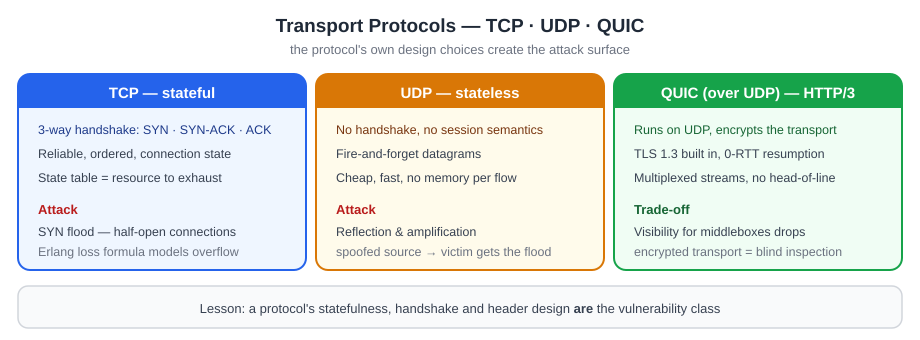
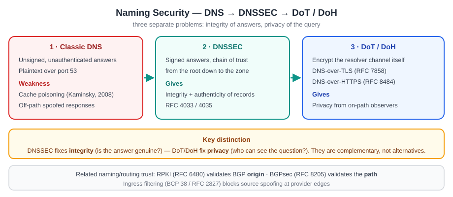
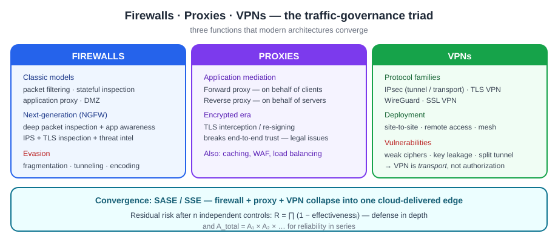
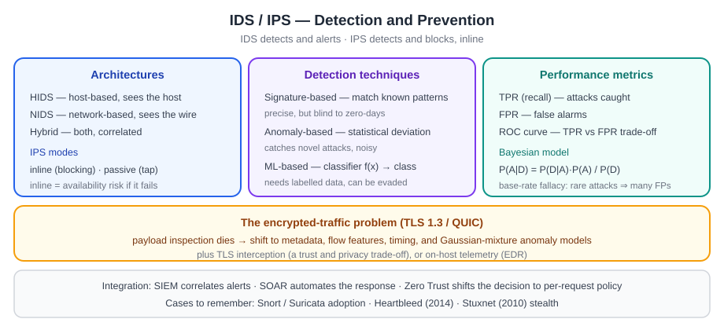
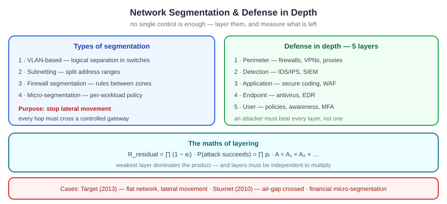

# الجابتر الخامس — Network Security Fundamentals
## أمن الشبكات: البروتوكولات · الجدارات والبروكسي و VPN · IDS/IPS · التقسيم والدفاع بالعمق

> **دليل القراءة:** كل مقطع مقسوم ثلاث طبقات:
> **① النص الأصلي (English)** — نسخة نظيفة **كثافة وسط** · **② الترجمة** — ترجمة كاملة مطابقة · **③ الشرح الفهمي** — الشرح اللي يفهمك المفهوم.
>
> **المصدر:** `02_Raw_Materials/W05_Network_Security.pdf` (29 صفحة · 46,836 حرفاً).
>
> ⚠️ **ملاحظتان:** (1) هذا **أربعة فصول مدموجة بملف واحد**، وعنوانه الداخلي **«Week 4»** — ترقيم المادة فوضى. (2) **ماكو نسخة معلَّمة لهذا الجابتر** (فحصت كل التنزيلات — ما لكيت تأشيرات).
>
> ✅ **بس الخبر الزين:** هذا **أكثر جابتر مستند لمعايير حقيقية** بالمادة كلها — فيه **24 إشارة RFC فعلية** (RFC 793 · 8446 · 8484 · 4033/4035 · 6480 · 8205 · 5905 · 6105/7113 · 3118 · 4301…). يعني أغلبه **مو مُختَرَع** — مبني على بروتوكولات الإنترنت الحقيقية.

## 🗺️ خريطة الفصل (4 فصول مدموجة)

| الفصل | العنوان | الأقسام | الأهم |
|:--:|:---|:--:|:---|
| **1** | Overview of Network Protocols and Their Vulnerabilities | §1–14 | TCP/UDP/QUIC · DNS/DNSSEC · BGP/RPKI · NTP · TLS 1.3 |
| **2** | Firewalls, Proxies, and VPNs | §1–9 | NGFW · forward/reverse proxy · VPN families · convergence |
| **3** | Intrusion Detection and Prevention Systems (IDS/IPS) | §1–11 | HIDS/NIDS · signature/anomaly/ML · ROC · Bayes |
| **4** | Network Segmentation and Defense in Depth | §1–9 | 4 أنواع تقسيم · 5 طبقات · ROSI |

> **ملاحظة على الترتيب:** ترقيم الأقسام في هذا الملف **يبدأ من جديد بكل فصل** (لأنه 4 وثائق مدموجة) — فـ«القسم 1» يتكرر أربع مرات. اعتمد على **عنوان الفصل** فوق كل قسم.

---

### القسم 1 — 1. Purpose and scope

#### ① النص الأصلي

> Modern software systems live on networks, so their security posture depends not only on application code but also on the behavior and weaknesses of the protocols that move, resolve, route, and time their packets. This chapter surveys the core Internet protocols — link, network, transport, name resolution, routing, timing, and selected application protocols — analyzes their canonical vulnerabilities, and frames mitigation strategies grounded in standards. Where helpful, compact mathematical models formalize attack surfaces and control efficacy.

#### ② الترجمة

> «الأنظمة البرمجية الحديثة تعيش على الشبكات، فموقفها الأمني يعتمد مو بس على كود التطبيق، بل كذلك على سلوك وثغرات البروتوكولات اللي تنقل الحزم وتحلّل الأسماء وتوجّهها وتوقّتها. هذا الفصل يستعرض بروتوكولات الإنترنت الأساسية — link و network و transport و name resolution و routing و timing وبعض بروتوكولات التطبيق — ويحلّل ثغراتها المعروفة، ويؤطّر استراتيجيات تخفيف مستندة إلى المعايير. وحيث يفيد، تستخدم نماذج رياضية مدمجة لتصيغ أسطح الهجوم وفعالية الضوابط.»

#### ③ الشرح الفهمي

الفكرة الأساسية إن الأمن مو بس كود التطبيق. حتى لو التطبيق مكتوب صح، البروتوكولات اللي تشتغل تحته تحمل ثغرات: اللي تنقل البيانات (move)، اللي تحلّل الأسماء لـ IP (resolve)، اللي توجّه الحزم بين الشبكات (route)، واللي تزامن الوقت (time). الفصل هذا يعمل مسح (survey) شامل لكل هذي الطبقات، بعدين يحلّل الثغرات المتعارف عليها (canonical vulnerabilities)، ويقدّم تخفيفات (mitigations) مبنية على المعايير. وكلما يفيد الموضوع، يستخدم نماذج رياضية مدمجة حتى يقيس سطح الهجوم (attack surface) وفعالية الضوابط (control efficacy).

| المجال | أمثلة بروتوكولات | شنو يشتغل |
|---|---|---|
| link | Ethernet, ARP | التواصل بين الجيران على نفس السلك |
| network | IPv4/IPv6, ICMP | العنونة والتوجيه |
| transport | TCP, UDP, QUIC | نقل البيانات بين الطرفين |
| name resolution | DNS, DoH, DoT | ترجمة الأسماء إلى عناوين IP |
| routing | BGP, RPKI, BGPsec | التوجيه بين الشبكات المستقلة |
| timing | NTP | تزامن الوقت بين الأجهزة |

الدرس: تدرس البروتوكولات مو كمعرفة نظرية، بل لأن كل واحدة منها تمثّل سطح هجوم (attack surface) محتمل. وإذا فهمت التصميم الأصلي ووين الثغرة، تكدر تعرف شنو الضابط المناسب وشنو حجم الخطر الباقي (residual risk).

---

### القسم 2 — 2. The layered context: why protocol design choices matter

#### ① النص الأصلي

> The canonical "TCP/IP stack" (link → network → transport → application) was engineered for reachability and resilience, not for adversarial environments. Many protocols shipped with minimal or no cryptographic protections and implicit trust in endpoints or intermediaries. Security retrofits — DNSSEC, TLS 1.3, QUIC, RPKI/BGPsec, DoT/DoH, RA-Guard, SEND — were introduced later to constrain known classes of attacks without sacrificing interoperability or performance. Understanding both the original design intent and the retrofits is essential to reason about residual risk and prioritize controls.
>
> Protocol originals and security upgrades:
>
> - TCP — RFC 793
> - TLS 1.3 — RFC 8446
> - DoH — RFC 8484
> - DNSSEC — RFC 4033/4035
> - RPKI — RFC 6480
> - BGPsec — RFC 8205
> - RA-Guard — RFC 6105/7113

#### ② الترجمة

> «حزمة TCP/IP الكانونية (link ← network ← transport ← application) انهندست لتحقيق الوصولية (reachability) والصمود (resilience)، مو لبيئة معادية (adversarial). كثير بروتوكولات نزلت بحماية تشفيرية ضئيلة أو معدومة، ومعها ثقة ضمنية (implicit trust) بالأطراف أو بالوسطاء. الترقيعات الأمنية — DNSSEC و TLS 1.3 و QUIC و RPKI/BGPsec و DoT/DoH و RA-Guard و SEND — جت لاحقًا لتقييد أصناف معروفة من الهجمات دون التضحية بالتشغيل البيني (interoperability) أو الأداء. وفهم نية التصميم الأصلية والترقيعات معًا ضروري للتفكير بالخطر الباقي وترتيب أولويات الضوابط.
>
> أصول البروتوكولات وترقيعاتها الأمنية:
>
> - TCP — RFC 793
> - TLS 1.3 — RFC 8446
> - DoH — RFC 8484
> - DNSSEC — RFC 4033/4035
> - RPKI — RFC 6480
> - BGPsec — RFC 8205
> - RA-Guard — RFC 6105/7113»

#### ③ الشرح الفهمي

الـ TCP/IP stack الأصلي انبنى لهدفين واضحين: الوصولية (reachability) — يعني أي طرف يوصل لأي طرف — والصمود (resilience) — يعني الشبكة تبقى شغّالة حتى لو انكسر جزء منها. بس ما انبنى أبدًا لبيئة معادية (adversarial). بمعنى آخر: التصميم الأصلي افترض حسن النية، والخصم ما عنده حسن نية. لهذا كثير بروتوكولات نزلت بأمان تشفيري ضعيف أو معدوم، ومعها ثقة ضمنية (implicit trust) بالأطراف وبالوسطاء (middleboxes).

عشان نعالج هذا، جت الترقيعات الأمنية (security retrofits) لاحقًا — كل ترقيع يعالج صنف هجمات معروف، بس دون ما يكسر التشغيل البيني (interoperability) أو الأداء.

| الثغرة الأصلية | الترقيع الأمني | الـ RFC |
|---|---|---|
| DNS بلا تحقق من صحة البيانات | DNSSEC | RFC 4033/4035 |
| TLS بهجمات معروفة | TLS 1.3 | RFC 8446 |
| DNS بلا تشفير (يُراقَب بسهولة) | DoH / DoT | RFC 8484 |
| توجيه BGP قابل للانتحال | RPKI / BGPsec | RFC 6480 / RFC 8205 |
| إعلانات RA مزيّفة في IPv6 | RA-Guard | RFC 6105/7113 |
| Neighbor Discovery غير موثّق | SEND | — |
| TCP بلا تشفير مدمج في النقل | QUIC | — |

الخلاصة: تفهم الاثنين معًا — نية التصميم الأصلي ووين كانت الثغرة، والترقيع اللي جاء بعدها — حتى تكدر تقدّر الخطر الباقي (residual risk) وترتب أولوياتك بالضوابط. مو كل ترقيع يغطّي كل شي، ولهذا لازم تعرف حدود كل واحد.

---

### القسم 3 — 3. Transport protocols: TCP, UDP, and QUIC

#### ① النص الأصلي

> **3.1 TCP: reliability with state and the SYN flood**
>
> TCP provides connection-oriented reliability using a three-way handshake and per-connection state — and that state can be weaponized. In a SYN flooding attack, an adversary sends a high rate of SYNs (often with spoofed sources), driving the server into keeping half-open connections and exhausting backlog resources, denying service to legitimate clients. Mitigations include SYN cookies, reduced SYN-RECEIVED timers, and ingress filtering to block spoofed sources (BCP 38).
>
> **Queueing model of a SYN flood.** Let $\beta$ be the backlog capacity, $\lambda$ the arrival rate of half-open SYNs, and $\mu$ the "service" rate at which half-opens transition (to established or drop). Modeling the backlog as an $M/M/1/B$ queue, the blocking probability (probability an honest SYN is dropped) under load $\rho = \lambda/\mu$ is the Erlang loss. SYN cookies effectively increase $\mu$ (no state until ACK) and reduce pressure on $B$, while BCP 38 reduces $\lambda$ by filtering spoofed sources upstream.
>
> **3.2 UDP: simplicity with no session semantics**
>
> UDP's statelessness and lack of handshake enable reflection and amplification: an attacker spoofs the victim's source IP and sends small queries to misconfigured reflectors (DNS, NTP, memcached), which reply with larger responses to the victim. The amplification factor $A$ is the ratio of response bytes to request bytes, and total attack bandwidth at the victim approximates $A \sum_j r_j$ — the sum of rates $r_j$ across reflectors. NTP's historic monlist made $A$ dangerously high until patched and widely disabled.
>
> **3.3 QUIC (over UDP) and HTTP/3: encrypting the transport**
>
> QUIC integrates TLS 1.3 into the transport, yielding 0-RTT/1-RTT handshakes, per-stream multiplexing without head-of-line blocking, connection migration, and authenticated encryption by default. HTTP/3 maps HTTP semantics onto QUIC. These shifts close large classes of passive observation and injection attacks present in TCP+TLS and improve performance, but move more complexity — and thus security responsibility — into user-space stacks and middlebox interactions.

$$B = \frac{\rho^{B+1}}{1 + \rho + \rho^2 + \cdots + \rho^{B+1}} \quad (\rho \neq 1)$$

| الرمز | المعنى |
|---|---|
| $\rho$ | offered load — الحمل المعروض على الطابور ($\rho = \lambda/\mu$) |
| $B$ | buffer / queue size — حجم الـ backlog (سعة الطابور) |
| $\lambda$ | معدل وصول الـ SYN نصف المفتوحة (arrival rate) |
| $\mu$ | معدل خدمة الـ half-opens (تنتقل لـ established أو تُسقط) |

#### ② الترجمة

> «**3.1 TCP: الموثوقية بالحالة وهجوم SYN flood**
>
> TCP يوفّر موثوقية موجهة للاتصال (connection-oriented) عبر مصافحة ثلاثية (three-way handshake) وحالة لكل اتصال (per-connection state) — وهذي الحالة ممكن تتحوّل لسلاح. في هجوم SYN flooding، الخصم يرسل معدلًا عاليًا من حزم SYN (غالبًا بمصادر مزيّفة)، فيجبر السيرفر على الاحتفاظ باتصالات نصف مفتوحة (half-open) واستنزاف موارد الـ backlog، فيُحجب الخدمة عن العملاء الشرعيين. التخفيفات تشمل SYN cookies، وتقليل مؤقتات SYN-RECEIVED، والترشيح الداخلي (ingress filtering) لحجب المصادر المزيّفة (BCP 38).
>
> **نموذج الطابور لهجوم SYN flood.** لتكن $\beta$ سعة الـ backlog، و $\lambda$ معدل وصول حزم SYN نصف المفتوحة، و $\mu$ معدل «الخدمة» اللي تنتقل به الحالات النصف مفتوحة (إلى established أو تُسقط). بنمذجة الـ backlog كطابور $M/M/1/B$، فإن احتمال الحجب (احتمال إسقاط SYN شرعية) عند حمل $\rho = \lambda/\mu$ هو Erlang loss. SYN cookies فعليًا تزيد $\mu$ (بلا حالة حتى يجي الـ ACK) وتقلّل الضغط على $B$، بينما BCP 38 تقلّل $\lambda$ بترشيح المصادر المزيّفة في المنبع (upstream).
>
> **3.2 UDP: البساطة بلا دلالات جلسة**
>
> انعدام الحالة (statelessness) في UDP وغياب المصافحة يمكّنان الانعكاس والتضخيم (reflection and amplification): المهاجم يزيّف عنوان المصدر تبع الضحية ويرسل استعلامات صغيرة إلى مُنعكسات (reflectors) سيئة الضبط (DNS, NTP, memcached)، وهذي المُنعكسات ترد بردود أكبر على الضحية. عامل التضخيم $A$ هو نسبة بايتات الرد إلى بايتات الطلب، وعرض نطاق الهجوم الكلي عند الضحية يقارب $A \sum_j r_j$ — مجموع المعدلات $r_j$ عبر المُنعكسات. أمر monlist التاريخي في NTP خلّى $A$ مرتفعًا بشكل خطير إلى أن تم ترقيعه وتعطيله على نطاق واسع.
>
> **3.3 QUIC (فوق UDP) و HTTP/3: تشفير طبقة النقل**
>
> QUIC يدمج TLS 1.3 داخل طبقة النقل، فيمنح مصافحات 0-RTT/1-RTT، وتعدد إرسال لكل stream دون حجب رأس الطابور (head-of-line blocking)، وترحيل الاتصال (connection migration)، وتشفيرًا موثّقًا (authenticated encryption) بشكل افتراضي. أما HTTP/3 فيُسقط دلالات HTTP على QUIC. هذي التحوّلات تسدّ أصنافًا كبيرة من هجمات المراقبة السلبية والحقن الموجودة في TCP+TLS وتحسّن الأداء، لكنها تنقل تعقيدًا أكبر — وبالتالي مسؤولية أمنية أكبر — إلى مكدّسات (stacks) مساحة المستخدم (user space) وتفاعلات الوسطاء (middleboxes).»

#### ③ الشرح الفهمي

هذا القسم يقارن ثلاث بروتوكولات نقل (transport): TCP و UDP و QUIC. القاعدة العامة: **كل ما تضيف موثوقية وحالة، كل ما تفتح ثغرة جديدة**.

**3.1 — TCP وهجوم SYN flood.** TCP موثوق (reliable) لأنه connection-oriented: قبل ما تنتقل البيانات، يصير three-way handshake (SYN ← SYN-ACK ← ACK)، وبعدها السيرفر يحتفظ بحالة (state) لكل اتصال. هذي الحالة هي نقطة الضعف: المهاجم يرسل وابل من حزم SYN (غالبًا بمصادر مزيّفة/spoofed) فيدخل السيرفر في حالة نصف مفتوحة (half-open) وينتظر الـ ACK اللي ما راح يجي، فيمتلئ الـ backlog ← وبالتالي تُسقط حزم SYN الحقيقية ويصير denial of service.

عشان نفهم متى ينطرد الطلب الشرعي، نستخدم نموذج طابور $M/M/1/B$. احتمال الحجب (blocking probability) اللي تعطيه معادلة Erlang loss:

$$B = \frac{\rho^{B+1}}{1 + \rho + \rho^2 + \cdots + \rho^{B+1}} \quad (\rho \neq 1)$$

| الرمز | المعنى |
|---|---|
| $\rho$ | offered load — الحمل المعروض، $\rho = \lambda/\mu$ |
| $B$ | buffer / queue size — حجم الطابور (سعة الـ backlog) |
| $\lambda$ | arrival rate — معدل وصول الـ SYN |
| $\mu$ | service rate — معدل خدمة الـ half-opens |

المعنى المنطقي: كل ما الـ backlog ($B$) أصغر أو الحمل ($\rho$) أكبر، كل ما زاد احتمال حجب الـ SYN الشرعية. لهذا التخفيف يشتغل على طرفين:

- **SYN cookies** ← تزيد $\mu$ لأن السيرفر ما يحتفظ بحالة حتى يجي الـ ACK، فتقلّ الضغط على $B$.
- **BCP 38 (ingress filtering)** ← تقلّل $\lambda$ بترشيح المصادر المزيّفة في المنبع، فما تصلك أصلًا.

**3.2 — UDP والانعكاس/التضخيم.** UDP بلا اتصال (stateless) وبلا مصافحة، وهذي البساطة نفسها هي الثغرة. المهاجم يزيّف عنوان المصدر تبع الضحية (spoof)، ويرسل استعلام صغير لمُنعكس سيئ الضبط (misconfigured reflector مثل DNS أو NTP أو memcached)، والمُنعكس يرد برد كبير على الضحية. النتيجة:

$$A = \frac{\text{response bytes}}{\text{request bytes}}, \qquad \text{bandwidth at victim} \approx A \sum_j r_j$$

| الرمز | المعنى |
|---|---|
| $A$ | عامل التضخيم (amplification factor) |
| $r_j$ | معدل الطلبات من المُنعكس رقم $j$ |
| $\sum_j r_j$ | مجموع معدلات كل المُنعكسات |

كل ما $A$ أكبر، كل ما الهجوم أخطر. أمر monlist في NTP كان يعطي $A$ ضخم جدًا إلى أن تم ترقيعه وتعطيله.

**ملاحظة أمانة مهمة:** الانعكاس والتضخيم في UDP يشتغل أصلًا لأن **عنوان المصدر قابل للانتحال (spoofable)**. لو ما كدر المهاجم يزيّف العنوان، الردود ترجع له هو مو للضحية. لهذا الترشيح الداخلي (ingress filtering) — المعروف بـ BCP 38 / RFC 2827 — ضروري جدًا، وهو مشروح لاحقًا في هذا الفصل. يعني الحل ما بس عند الضحية، بل عند الشبكات اللي تسمح بحزم بمصدر مزيّف تخرج منها.

**3.3 — QUIC و HTTP/3.** QUIC هو محاولة تحل مشاكل TCP+TLS من الأساس: يدمج TLS 1.3 مباشرة في طبقة النقل (فوق UDP)، فيصير التشفير افتراضيًا مو اختياري، والمصافحة أسرع (0-RTT/1-RTT)، وكل stream مستقل بلا head-of-line blocking، مع دعم connection migration. HTTP/3 بعدين يشتغل فوق QUIC. الفائدة الأمنية: يسدّ أصناف كبيرة من هجمات المراقبة السلبية (passive observation) والحقن (injection). المقابل: يزيد التعقيد، وينقل المسؤولية إلى user-space stacks وإلى الوسطاء (middleboxes) اللي صاروا ما يكدرون يشوفون المحتوى.

| الخاصية | TCP | UDP | QUIC |
|---|---|---|---|
| نوع الاتصال | connection-oriented | stateless (بلا اتصال) | اتصال فوق UDP |
| الحالة | per-connection state | بلا حالة | حالة مشفّرة |
| الموثوقية | موثوق (retransmission) | غير موثوق | موثوق لكل stream |
| التشفير | لا (يحتاج TLS خارجي) | لا | TLS 1.3 مدمج (افتراضيًا) |
| الثغرة الأشهر | SYN flood | reflection / amplification | تعقيد user-space + middleboxes |

الخلاصة العملية: TCP يدفع ثمن الموثوقية بحالة قابلة للاستنزاف، و UDP يدفع ثمن البساطة بانعدام التحقق من المصدر، و QUIC يحاول يجمع الموثوقية والأمان معًا لكن ينقل التعقيد لمكان ثاني. كل بروتوكول عنده مقايضة (trade-off).

---

---

### القسم 4 — 4. Network layer: IPv4/IPv6, spoofing, fragmentation, and ND/RA
#### ① النص الأصلي
> **4.1 IPv4/IPv6 source spoofing and ingress controls (RFC 2827 / BCP 38)**
>
> IP permits endpoints to set their own source addresses, so attackers can forge ("spoof") sources to hide their origin, defeat naive filters, and enable reflection. BCP 38 (RFC 2827) mandates ingress filtering at provider edges so that only topologically valid source addresses traverse upstream; despite its age, universal deployment remains incomplete.
>
> **4.2 IPv6 Neighbor Discovery, rogue RA, and SEND/RA-Guard (RFC 3971 SEND · RFC 6105 RA-Guard)**
>
> IPv6 replaces ARP with Neighbor Discovery (ND) and uses Router Advertisements (RAs) for autoconfiguration. Both can be forged to perform on-link MITM or route black-holing. SEND (RFC 3971) secures ND via Cryptographically Generated Addresses and signatures but is operationally heavy. RA-Guard (RFC 6105 + RFC 7113) adds L2 filtering for RAs but must parse the full IPv6 header chain to resist evasion via extension headers.
>
> **4.3 IPv6 extension headers: filtering and survivability**
>
> IPv6 extension headers complicate middlebox processing, and ambiguities historically allowed evasion (e.g., hiding RA inside crafted chains). Updates clarify handling (RFC 7045) and ongoing work tightens hop-by-hop processing guidance, but operational filtering of exotic header combinations remains prudent in high-speed fabrics. A finite-state parsing model treats the legal header chains as a DFA $H = (S, \Sigma, \delta, s_0, F)$, where states $S$ represent "next header expected" classes; a middlebox that accepts only $x \in \Sigma^{*}$ with $\delta(s_0, x) \in F$ thwarts many header-chain evasions, with performance bounds depending on $|x|$ (chain length) and per-transition cost.

$$H = (S, \Sigma, \delta, s_0, F), \qquad x \text{ accepted} \iff \delta(s_0, x) \in F$$

#### ② الترجمة
> «**4.1 انتحال المصدر في IPv4/IPv6 وضوابط الدخول (ingress controls) — RFC 2827 / BCP 38**
>
> بروتوكول IP يسمح للأطراف (endpoints) إنها تحدّد عنوان المصدر بنفسها، فلهذا المهاجم يقدر يزوّر ("ينتحل") المصدر ليخفي أصله، ويكسر الفلاتر الساذجة (naive filters)، ويفعّل الانعكاس (reflection). معيار BCP 38 (RFC 2827) يفرض ترشيح الدخول (ingress filtering) عند حدود مزوّد الخدمة، بحيث ما تعبر للأعلى إلا عناوين المصدر الصحيحة طوبولوجياً؛ ورغم قِدمه، النشر الشامل ما زال ناقصاً.
>
> **4.2 استكشاف الجيران في IPv6 (ND)، وإعلانات الموجّه المزوّرة (rogue RA)، و SEND/RA-Guard — RFC 3971 SEND · RFC 6105 RA-Guard**
>
> IPv6 يستبدل ARP بـ Neighbor Discovery (ND) ويستخدم إعلانات الموجّه (RAs) للتكوين التلقائي (autoconfiguration). الاثنين يقدرون يتزوّرون لتنفيذ هجوم رجل بالوسط على الرابط (on-link MITM) أو حجب التوجيه (route black-holing). بروتوكول SEND (RFC 3971) يؤمّن الـ ND عبر العناوين المولّدة تشفيرياً (Cryptographically Generated Addresses) والتوقيعات، بس ثقيل عملياً. أما RA-Guard (RFC 6105 + RFC 7113) فيضيف ترشيح L2 للـ RAs، بس لازم يحلّل سلسلة ترويسات IPv6 كاملة لمقاومة التهرّب (evasion) عبر ترويسات الامتداد (extension headers).
>
> **4.3 ترويسات الامتداد في IPv6: الترشيح وقابلية البقاء (survivability)**
>
> ترويسات الامتداد في IPv6 تعقّد معالجة الأجهزة الوسيطة (middlebox)، والغموض سابقاً سمح بالتهرّب (مثلاً إخفاء RA داخل سلاسل مُصمّمة). التحديثات توضّح المعالجة (RFC 7045) والعمل الجاري يشدد إرشادات معالجة hop-by-hop، بس الترشيح التشغيلي لتراكيب الترويسات الغريبة يبقى حكمة في الشبكات عالية السرعة. نموذج التحليل بالحالات المحدودة (finite-state) يتعامل مع سلاسل الترويسات القانونية كنموذج DFA $H = (S, \Sigma, \delta, s_0, F)$، حيث الحالات $S$ تمثّل أصناف "الترويسة التالية المتوقّعة"؛ والجهاز الوسيط اللي يقبل فقط $x \in \Sigma^{*}$ بحيث $\delta(s_0, x) \in F$ يمنع كثير من عمليات التهرّب بسلاسل الترويسات، مع حدود أداء تعتمد على $|x|$ (طول السلسلة) وكلفة كل انتقال.»

#### ③ الشرح الفهمي
طبقة الشبكة (Network layer) هي اللي تتحكم بالعناوين والتوجيه، وهاي بالضبط نقطة ضعفها: **IP ما عندە مصادقة على عنوان المصدر** — يعني أي جهاز يقدر يحطّ أي عنوان مصدر يريده. من هاي الثغرة تطلع ثلاث عائلات:

| الهجوم | الطبقة | المعيار | العلاج |
|---|---|---|---|
| **Source spoofing** | IP | BCP 38 / RFC 2827 | ingress filtering عند حدود المزوّد |
| **Rogue RA / ND poisoning** | IPv6 (L2/L3) | RFC 3971 (SEND)، RFC 6105/7113 (RA-Guard) | ترشيح L2 + توقيعات CGA |
| **Extension-header evasion** | IPv6 | RFC 7045، RFC 7113 | تحليل سلسلة الترويسات كاملة (DFA) |

الفكرة المهمة بالانتحال: لمّا يكون المصدر مزوّر، المهاجم يخفي أصله ويفعّل الانعكاس (reflection) — وهذا هو أساس هجمات UDP amplification اللي نشوفها بعدين.

بالـ IPv6 القصة تختلف: ما كو ARP، بداله **ND** و **RA** للتكوين التلقائي. بما إنهن بلا مصادقة، أي واحد يقدر يبعت RA مزوّر ويصير رجل بالوسط (MITM) أو يحجب التوجيه. الحلول: **SEND** (توقيعات + CGA، بس ثقيل عملياً) و **RA-Guard** (ترشيح L2). بس RA-Guard عنده مصيدة: إذا ما حلّل **سلسلة الترويسات كاملة**، المهاجم يخبّي الـ RA داخل extension headers ويتجاوزه.

لهذا جاء **نموذج الـ DFA**: نعرّف "شكل الترويسة القانوني" كآلة حالات محدودة، وأي سلسلة تطلع خارج الحالات المقبولة تنرفض. المعادلة برا الصندوق توضّح: نقبل $x$ بس إذا $\delta(s_0, x) \in F$.

---

### القسم 5 — 5. Naming: DNS, DNSSEC, and encrypted resolution (DoT/DoH)
#### ① النص الأصلي
> **5.1 Classic DNS weaknesses and the Kaminsky cache-poisoning episode**
>
> Traditional DNS uses 16-bit transaction IDs, UDP source ports, and no authentication. In 2008, a generalized cache-poisoning technique showed that an attacker sending floods of forged replies during a resolver's query window could inject false records with modest effort; emergency patches randomized source ports to expand entropy, but the architectural fix is DNSSEC (origin authentication and integrity via signed zones). In an entropy model, if a resolver randomizes a 16-bit TXID and a 16-bit UDP source port, an off-path attacker must guess a 32-bit value, so the success probability per forged reply is $p = 2^{-32}$; with $m$ guesses during the race window, success probability is $1 - (1-p)^{m}$. Rate-limiting and response pacing cap $m$, while DNSSEC eliminates guessing by cryptographically validating RRSIGs.
>
> **5.2 DNSSEC: signed answers and the chain of trust (RFC 4033/4035)**
>
> DNSSEC introduces new record types (DNSKEY, RRSIG, DS, NSEC/X) and the concept of a signed zone with validation along a hierarchical chain of trust from the root. Validating resolvers reject tampered data, preventing cache poisoning regardless of off-path spoofing capabilities.
>
> **5.3 Resolver-to-recursor privacy: DoT and DoH (DoT = RFC 7858 · DoH = RFC 8484)**
>
> To mitigate local passive surveillance and manipulation, DNS-over-TLS (RFC 7858) and DNS-over-HTTPS (RFC 8484) encrypt the resolver channel. DoT uses TLS on port 853; DoH maps DNS exchanges into HTTPS requests, inheriting HTTP's authentication and caching. These mechanisms complement, not replace, DNSSEC: DoT/DoH protect the path; DNSSEC protects the data.

$$p = 2^{-32}, \qquad P(\text{success}) = 1 - (1-p)^{m}$$

#### ② الترجمة
> «**5.1 نقاط ضعف DNS الكلاسيكي وحادثة تسميم الكاش (Kaminsky cache-poisoning)**
>
> الـ DNS التقليدي يستخدم معرّفات معاملات (transaction IDs) بحجم 16-bit، ومنافذ مصدر UDP، وبدون أي مصادقة. في 2008، تقنية عامة لتسميم الكاش (cache poisoning) أظهرت إن المهاجم اللي يرسل سيولاً من الردود المزوّرة خلال نافذة استعلام الـ resolver يقدر يحقن سجلات كاذبة بجهد متواضع؛ والتحديثات الطارئة عشّرت منافذ المصدر لتوسيع العشوائية (entropy)، بس الحل المعماري هو DNSSEC (مصادقة الأصل (origin authentication) والسلامة (integrity) عبر المناطق الموقّعة (signed zones)). في نموذج العشوائية (entropy model)، إذا الـ resolver عشّر معرّف TXID بحجم 16-bit ومنفذ مصدر UDP بحجم 16-bit، فالمهاجم خارج المسار (off-path) لازم يخمّن قيمة بحجم 32-bit، فاحتمال النجاح لكل رد مزوّر هو $p = 2^{-32}$؛ ومع $m$ محاولة خلال نافذة السباق (race window)، احتمال النجاح هو $1 - (1-p)^{m}$. تحديد المعدّل (rate-limiting) وتهدئة الردود (response pacing) يحدّان من $m$، بينما DNSSEC يلغي التخمين عبر التحقّق التشفيري من توقيعات RRSIG.
>
> **5.2 DNSSEC: الردود الموقّعة وسلسلة الثقة (chain of trust) — RFC 4033/4035**
>
> DNSSEC يقدّم أنواع سجلات جديدة (DNSKEY، RRSIG، DS، NSEC/X) ومفهوم المنطقة الموقّعة (signed zone) مع التحقّق على طول سلسلة ثقة هرمية تبدأ من الجذر (root). الـ resolvers المتحقّقة ترفض البيانات المتلاعب بها، فتمنع تسميم الكاش بغض النظر عن قدرات الانتحال خارج المسار.
>
> **5.3 خصوصية Resolver-to-recursor: DoT و DoH — DoT = RFC 7858 · DoH = RFC 8484**
>
> لتخفيف المراقبة السلبية المحلية (passive surveillance) والتلاعب، تشفّر DNS-over-TLS (RFC 7858) و DNS-over-HTTPS (RFC 8484) قناة الـ resolver. الـ DoT يستخدم TLS على المنفذ 853؛ والـ DoH يحوّل تبادلات DNS إلى طلبات HTTPS، فيرث مصادقة HTTP والتخزين المؤقت (caching). هذي الآليات تكمّل DNSSEC ولا تستبدله: DoT/DoH يحميان المسار (the path)؛ و DNSSEC يحمي البيانات (the data).»

#### ③ الشرح الفهمي
الـ DNS هو "دفتر هاتف الإنترنت": يحوّل الاسم (google.com) إلى عنوان IP. المشكلة إنه بُني من الأساس **بدون مصادقة** — فالثقة عمياء، والـ resolver يقبل أي رد يوصل. من هنا تطلع ثغرتين منفصلتين:

| المشكلة | السبب | العلاج |
|---|---|---|
| **تسميم الكاش (cache poisoning)** | TXID 16-bit + منفذ 16-bit فقط، وبلا مصادقة | تعشير المنافذ (stop-gap) + **DNSSEC** |
| **المراقبة/التلاعب على المسار** | استعلامات نصّ صريح (plaintext) على UDP/53 | **DoT** (RFC 7858) / **DoH** (RFC 8484) |

**حادثة Kaminsky (2008):** المهاجم يغرق الـ resolver بردود مزوّرة خلال نافذة السباق (race window) قبل ما يوصل الرد الحقيقي. التحديث الطارئ كان يعشّر منافذ المصدر، فصار المهاجم لازم يخمّن قيمة **32-bit** (16 من TXID + 16 من المنفذ). احتمال النجاح لكل رد = $p = 2^{-32}$ تقريباً واحد من 4 مليار — بس مع $m$ محاولة يطلع الاحتمال $1 - (1-p)^{m}$. لهذا **rate-limiting** يقلّل $m$، و **DNSSEC** يصفّي الموضوع كلياً لأن الرد صار موقّع ومتحقَّق منه تشفيرياً.

الفرق الجوهري اللي ركز عليه بالامتحان: **DoT/DoH يحميان المسار (the path) — DNSSEC يحمي البيانات (the data).** الاثنين مكمّلين لبعض، ما واحد بديل عن الثاني.

---

### القسم 6 — 6. Address configuration: DHCP and its security gaps
#### ① النص الأصلي
> DHCP automates IP configuration but historically lacked authentication, enabling rogue DHCP servers and traffic redirection. RFC 3118 specifies DHCP message authentication but saw limited deployment due to key management and performance concerns; in practice, enterprises rely on DHCP snooping at switches and 802.1X/NAC to bind ports to legitimate servers and clients. A risk-aggregation model lets attack types $i$ (rogue server, starvation, MITM) have probability $P_i$ and impact $I_i$, giving residual risk $R_{DHCP} = \sum_i (1 - e_i) P_i I_i$, where $e_i \in [0,1]$ represents control efficacy (for example, snooping blocks rogue servers with $e$ near 1; RFC 3118, if operational, would further reduce $P_i$). This simple model supports prioritizing L2 controls when RFC 3118 is impractical.

$$R_{DHCP} = \sum_i (1 - e_i)\, P_i\, I_i$$

#### ② الترجمة
> «DHCP يؤتمت تكوين الـ IP بس تاريخياً كان بلا مصادقة، وهذا فتح الباب لخوادم DHCP المزوّرة (rogue DHCP servers) وإعادة توجيه الحركة (traffic redirection). المعيار RFC 3118 يحدّد مصادقة رسائل DHCP بس نشره كان محدود بسبب إدارة المفاتيح (key management) ومخاوف الأداء؛ وعملياً، المؤسسات تعتمد على DHCP snooping عند السويتشات و 802.1X/NAC لربط المنافذ بخوادم/عملاء شرعيين. نموذج تجميع المخاطر (risk-aggregation) يخلّي أنواع الهجوم $i$ (خادم مزوّر، استنزاف (starvation)، MITM) لها احتمال $P_i$ وتأثير $I_i$، فينتج خطر متبقٍ $R_{DHCP} = \sum_i (1 - e_i) P_i I_i$، حيث $e_i \in [0,1]$ تمثّل فاعلية الضابط (control efficacy) (مثلاً، الـ snooping يمنع الخوادم المزوّرة بـ $e$ قريب من 1؛ و RFC 3118، لو اشتغل، راح يقلّل $P_i$ أكثر). هذا النموذج البسيط يدعم ترجيح ضوابط الطبقة الثانية (L2) لما يكون RFC 3118 غير عملي.»

#### ③ الشرح الفهمي
الـ DHCP هو اللي يعطي الأجهزة إعداداتها (IP، البوابة، الـ DNS) تلقائياً. بما إنه بلا مصادقة، أي جهاز يقدر يشتغل كخادم DHCP ووزّع إعدادات غلط — والنتيجة **إعادة توجيه الحركة** أو MITM. ثلاث هجمات أساسية:

| الهجوم | الوصف | العلاج |
|---|---|---|
| **Rogue DHCP server** | خادم مزوّر يوزّع بوابة/DNS خبيثة | DHCP snooping عند السويتش |
| **Starvation** | استنزاف مجمّع العناوين (pool exhaustion) | port security / snooping |
| **MITM عبر خيارات خبيثة** | توجيه حركة الضحية عبر المهاجم | 802.1X / NAC |

**RFC 3118** يعرّف مصادقة رسائل DHCP، بس ما انتشر بسبب تعقيد إدارة المفاتيح وكلفة الأداء. لهذا الواقع المؤسسي اعتمد على ضوابط **الطبقة الثانية (L2)** — الـ snooping و 802.1X/NAC تربط المنفذ بخادم شرعي.

**نموذج المخاطر المتبقية:** الخطر المتبقي = مجموع (1 − فاعلية الضابط) × الاحتمال × التأثير. المعنى: كل ما زادت فاعلية $e_i$ اقترب الحد من الصفر. مثلاً الـ snooping عندە $e$ قريب من 1 للخادم المزوّر، فلو RFC 3118 غير عملي، الأفضل نرجّح ضوابط الـ L2.

$$R_{DHCP} = \sum_i (1 - e_i)\, P_i\, I_i$$

---

### القسم 7 — 7. Interdomain routing: BGP, RPKI, and BGPsec

#### ① النص الأصلي

> **7.1 BGP's trust model and hijack surface.** BGP was designed for policy exchange among autonomous systems (ASes) with implicit trust in path attributes. Attackers (or misconfigurations) can mis-originate a prefix or shorten paths, diverting or black-holing traffic.
>
> **7.2 Origin validation with RPKI.** RPKI (RFC 6480) binds IP prefixes and ASNs to certificates in a hierarchical public-key infrastructure. Operators publish Route Origin Authorizations (ROAs). Routers perform BGP origin validation (RFC 6811), marking updates as valid, invalid, or unknown; policies can drop or de-prefer invalid paths, reducing mis-origination.
>
> **7.3 Path validation with BGPsec.** BGPsec (RFC 8205) extends BGP with per-hop cryptographic signatures that protect the AS_PATH against tampering, strengthening guarantees but increasing CPU and memory costs and complicating incremental deployment.
>
> **Validation efficacy model.** If a fraction $f$ of global routes are covered by ROAs and participating ASes enforce "drop invalid," the probability a random hijack succeeds on an end-to-end path of length $L$ is approximately $(1-f)^{L}$ (assuming independent AS adoption), highlighting network effects: each additional validating AS exponentially reduces hijack success on traversals.

#### ② الترجمة

> «**7.1 نموذج الثقة وسطح الاختطاف في BGP.** صُمِّم BGP لتبادل السياسات بين الأنظمة المستقلة (ASes) اعتمادًا على ثقة ضمنية في خصائص المسار (path attributes). ويمكن للمهاجمين (أو أخطاء الإعداد) أن يُعلنوا أصلًا خاطئًا (mis-originate) لبادئة معيّنة أو أن يقصّروا المسارات، فيحوّلون حركة المرور أو يبتلعونها (black-holing).
>
> **7.2 التحقق من الأصل عبر RPKI.** يربط RPKI (RFC 6480) بادئات IP و ASNs بشهادات في بنية تحتية هرمية للمفاتيح العامة. وينشر المشغّلون تصاريح أصل المسار (ROAs). وتُجري الراوترات تحقق أصل BGP (RFC 6811) فتصنّف التحديثات إلى صحيحة أو غير صحيحة أو مجهولة؛ ويمكن للسياسات أن تُسقط المسارات غير الصحيحة أو تُقلّل أولويتها، مما يحدّ من خطأ الأصل (mis-origination).
>
> **7.3 التحقق من المسار عبر BGPsec.** يوسّع BGPsec (RFC 8205) بروتوكول BGP بتوقيعات تشفيرية لكل قفزة (per-hop) تحمي الـ AS_PATH من التلاعب، فتقوّي الضمانات لكنها ترفع كلفة المعالج والذاكرة وتُعقّد النشر التدريجي.
>
> **نموذج فعالية التحقق.** إذا كانت نسبة $f$ من المسارات العالمية مغطّاة بـ ROAs، وكانت الأنظمة المستقلة المشاركة تطبّق "أسقِط غير الصحيح" (drop invalid)، فإن احتمال نجاح اختطاف عشوائي على مسار من طرف إلى طرف بطول $L$ يقارب $(1-f)^{L}$ (بافتراض تبنٍّ مستقل بين الأنظمة المستقلة)، وهذا يبرز تأثيرات الشبكة (network effects): فكل نظام تحقق إضافي يقلّل نجاح الاختطاف أُسّيًا عبر عمليات العبور.»

#### ③ الشرح الفهمي

شنو قصة BGP؟ هو بروتوكول التوجيه **بين** الأنظمة المستقلة (interdomain) — يعني هو اللي يخبر الإنترنت كله «هذي البادئة (prefix) موجودة عندي، وهذا المسار اللي يوصّلها». المشكلة الأساسية إنه مبني على **الثقة الضمنية (implicit trust)**: أي AS يعلن شي، الباقي يصدّقه من غير ما يتحقق. من هنا يجي سطح الهجوم.

نوعان من الهجوم:

| الهجوم | شنو يسوي | النتيجة |
|---|---|---|
| Prefix hijack / mis-origination | AS يعلن بادئة مو ملكه | حركة المرور تروح للمهاجم (interception) أو تختفي |
| Path shortening | يحذف قفزات من المسار ليصير "الأقصر" | يُفضَّل عليه لأن BGP يفضّل المسار الأقصر |

الحلول تجي على طبقتين:

| الحل | شنو يحمي بالضبط | كيف | الـ RFC |
|---|---|---|---|
| RPKI + ROAs | **الأصل (origin) فقط** | شهادة تربط البادئة بـ AS معيّن | RFC 6480 |
| BGP origin validation | تصنيف التحديث | valid / invalid / unknown | RFC 6811 |
| BGPsec | **المسار الكامل (AS_PATH)** | توقيع تشفيري لكل قفزة | RFC 8205 |

نقطة مهمة جدًا: **RPKI و BGPsec مو بدائل لبعض، هم مكمّلين.**
- RPKI يتأكد «هل AS الفلاني مسموح يعلن هالبادئة؟» ← يحمي الأصل بس.
- BGPsec يحمي المسار كامل ← يتأكد إن كل قفزة بالمسار ما تلاعبوا بيها.

يعني لو عندك RPKI بس، المهاجم ما يقدر يختطف الأصل، بس يقدر يلعب بالمسار. و BGPsec يسد هالثغرة، بس ثمنه CPU/memory عالية ونشر تدريجي صعب (لأنه يحتاج كل AS على المسار تدعمه).

نموذج الفعالية — ليش «تأثيرات الشبكة» مهمة:

$$P_{\text{hijack}} \approx (1-f)^{L}$$

| الرمز | المعنى |
|---|---|
| $f$ | نسبة المسارات العالمية المغطّاة بـ ROA |
| $L$ | طول المسار (عدد قفزات الـ ASes) |
| $(1-f)$ | احتمال إن القفزة الوحدة **مو** محميّة |
| $P_{\text{hijack}}$ | احتمال نجاح اختطاف عشوائي |

المعنى: كل قفزة إضافية تضرب نفسها مرّة ثانية. مثال: لو $f = 0.5$ و $L = 4$:

$$P_{\text{hijack}} \approx (0.5)^{4} = 0.0625 = 6.25\%$$

هذا اللي يقصدوه بـ **network effects**: كل AS إضافي يتبنّى التحقق يفيد الشبكة كلها، لأن أي مسار يمرّ بيه يصير محمي. والعكس: طالما التبنّي جزئي، فائدته محدودة.

### القسم 8 — 8. Time synchronization: NTP and reflection abuse (RFC 5905)

#### ① النص الأصلي

> NTP underpins log ordering, Kerberos ticket lifecycles, and TLS certificate validation. Misconfigured servers historically exposed commands (e.g., monlist) exploitable for reflection amplification DDoS. Current guidance disables legacy commands and restricts public exposure; correct implementation follows RFC 5905.
>
> **Amplification calculus.** For reflectors $j$ with request-to-response ratios $A_j$ and request rates $r_j$, victim ingress is $\sum_{j} A_j r_j$. Rate-limiting at the reflectors caps $r_j$, while upstream filtering (BCP 38) removes spoofed sources, pushing $\sum_{j} r_j$ toward zero.

#### ② الترجمة

> «يشكّل NTP الأساس لترتيب السجلات (log ordering)، ودورة حياة تذاكر Kerberos، والتحقق من صلاحية شهادات TLS. وقد كشفت الخوادم المُهيّأة بشكل خاطئ تاريخيًا عن أوامر (مثل monlist) قابلة للاستغلال في هجمات الانعكاس والتضخيم (reflection amplification DDoS). والإرشاد الحالي يعطّل الأوامر القديمة ويقيّد التعرض العام؛ والتنفيذ الصحيح يتبع RFC 5905.
>
> **حساب التضخيم.** بالنسبة للـ reflectors $j$ بنسب الرد إلى الطلب $A_j$ ومعدّلات الطلبات $r_j$، فإن الوارد عند الضحية هو $\sum_{j} A_j r_j$. وتحديد المعدّل (rate-limiting) عند الـ reflectors يحدّ $r_j$، أما الفلترة في المنبع (BCP 38) فتُزيل المصادر المزوّرة، مما يدفع $\sum_{j} r_j$ نحو الصفر.»

#### ③ الشرح الفهمي

ليش الوقت (time) أمنيًا مهم؟ لأنه أساس لثلاثة أشياء:
- ترتيب السجلات (log ordering) — التحقيق الجنائي يعتمد على توقيت الأحداث.
- عمر تذاكر Kerberos (ticket lifecycles) — صلاحية التذكرة مرتبطة بالوقت.
- التحقق من صلاحية شهادات TLS — هل الشهادة منتهية أو لا.

يعني لو انضرب الوقت (time shifting)، كل هذي تختل: ممكن تذكرة منتهية تشتغل، أو شهادة منتهية تبدو صالحة.

الاستغلال (reflection/amplification): خوادم NTP القديمة كانت تفتح أوامر مثل `monlist` اللي يرجّع قائمة آخر العملاء — طلب **صغير** ورد **كبير**. المهاجم يزوّر IP الضحية، فتروح الردود الكبيرة كلها للضحية ← DDoS.

معادلة الـ amplification:

$$R_{\text{victim}} = \sum_{j} A_j r_j$$

| الرمز | المعنى |
|---|---|
| $A_j$ | نسبة الرد إلى الطلب عند الـ reflector رقم $j$ |
| $r_j$ | معدّل الطلبات المرسلة إلى الـ reflector رقم $j$ |
| $R_{\text{victim}}$ | معدّل الوارد عند الضحية (ingress) |

كيف نحدّها؟ على طبقتين:
- **Rate-limiting عند الـ reflectors** ← يحدّ $r_j$ نفسه.
- **BCP 38 (upstream filtering)** ← يشيل المصادر المزوّرة (spoofed)، فالمهاجم ما يقدر يخلي الردود تروح للضحية ← $\sum_{j} r_j$ يقترب من الصفر.

الخلاصة العملية: تنفيذ متوافق مع RFC 5905، تعطيل الأوامر القديمة، وتقييد التعرض العام للخادم.

### القسم 9 — 9. Security of application transports: TLS 1.3 and the Web (RFC 8446)

#### ① النص الأصلي

> TLS 1.3 (RFC 8446) eliminates legacy ciphers, compressions, and renegotiation pitfalls, standardizes AEAD suites, and shortens handshakes with forward secrecy by default. When combined with HTTP/2 or HTTP/3, it provides authenticated, encrypted channels for most Web traffic, reducing passive surveillance and active tampering risks. However, enterprise inspection policies must reconcile visibility with end-to-end cryptography (e.g., via split-TLS proxies), which themselves become high-value targets.

#### ② الترجمة

> «يُلغي TLS 1.3 (RFC 8446) التشفيرات القديمة (legacy ciphers) والضغط ومزالق إعادة التفاوض (renegotiation)، ويوحّد أطقم AEAD، ويقصّر المصافحات (handshakes) مع السرّية الأمامية (forward secrecy) بشكل افتراضي. وعند دمجه مع HTTP/2 أو HTTP/3، يوفّر قنوات موثّقة ومشفّرة لمعظم حركة الويب، مما يقلّل خطر التنصّت السلبي (passive surveillance) والتلاعب النشط (active tampering). إلا أن سياسات التفتيش في المؤسسات يجب أن توفّق بين الرؤية (visibility) والتشفير من طرف إلى طرف (مثلًا عبر بروكسيات split-TLS)، وهذه البروكسيات نفسها تصبح أهدافًا عالية القيمة.»

#### ③ الشرح الفهمي

TLS 1.3 هو النسخة اللي «نظّفت» TLS من المشاكل التاريخية. شنو سوى بالضبط:

| اللي شاله / صلّحه | ليش كان مشكلة |
|---|---|
| legacy ciphers | تشفيرات قديمة ضعيفة (زي RC4 و 3DES) |
| compression | الضغط يفتح الباب لهجوم يستغل فرق حجم البيانات |
| renegotiation | مزالق إعادة التفاوض اللي تربك حالة الجلسة |

وشنو الجديد اللي ضافه:

| الميزة | المعنى |
|---|---|
| AEAD suites موحّدة | كل الأطقم المسموحة AEAD (زي AES-GCM و ChaCha20-Poly1305) |
| forward secrecy افتراضيًا | كسر مفتاح طويل الأمد ما يفكّ الجلسات القديمة |
| handshake أقصر | 1-RTT أو 0-RTT ← أسرع وأبسط |

مع HTTP/2 أو HTTP/3، يصير عندك قناة مشفّرة وموثّقة لمعظم حركة الويب ← يقلّل التنصّت السلبي والتلاعب النشط.

بس تظهر معضلة (dilemma): المؤسسات تريد تفتّش حركة المرور (inspection) للكشف عن التهديدات، بس TLS 1.3 يشفّر كل شي. الحل هو **split-TLS proxies** — بروكسي يفك التشفير، يفحص، وبعدين يعيد يشفّر. والمشكلة إن هذا البروكسي نفسه يصير **هدفًا عالي القيمة (high-value target)**: لو انكسر، كل حركة المؤسسة تصير مكشوفة. يعني حلّينا مشكلة الرؤية، وخلقنا نقطة فشل مركزية جديدة.

### القسم 10 — 10. Intradomain control: ICMP/ICMPv6 and control-plane hygiene

#### ① النص الأصلي

> ICMP communicates reachability and diagnostics. Filtering all ICMP breaks PMTU discovery and can degrade performance; selective filtering that blocks abuse patterns while allowing essential types (e.g., "fragmentation needed" for IPv4, "Packet Too Big" for IPv6) is a safer posture. IPv6 moves many control-plane functions (ND, RA) into ICMPv6; the security of these functions thus inherits the ND/RA considerations discussed earlier (RA-Guard/SEND).

#### ② الترجمة

> «ينقل ICMP معلومات الوصول (reachability) والتشخيص (diagnostics). وفلترة كل رسائل ICMP تكسر اكتشاف PMTU وقد تُدهور الأداء؛ أما الفلترة الانتقائية التي تحجب أنماط الاستغلال مع السماح بالأنواع الضرورية (مثل "fragmentation needed" في IPv4 و"Packet Too Big" في IPv6) فهي وضعية أكثر أمانًا. وينقل IPv6 الكثير من وظائف الطبقة التحكمية (ND و RA) إلى داخل ICMPv6؛ وبالتالي يرث أمان هذه الوظائف اعتبارات ND/RA التي نوقشت سابقًا (RA-Guard/SEND).»

#### ③ الشرح الفهمي

ICMP هو بروتوكول «الطبقة التحكمية» — ينقل معلومات الوصول (reachability) والتشخيص (diagnostics). الخطأ الشائع: منع ICMP كليًا. ليش غلط؟

لأنه يكسر **PMTU discovery** (اكتشاف وحدة النقل القصوى على المسار). لما تمنع رسائل ICMP الضرورية، الراوترات ما تقدر تخبر الأطراف «الرزمة كبيرة عليّ»، فتصير **black hole** — الاتصال يعلّق من غير سبب واضح.

الحل الصح: **فلترة انتقائية (selective filtering)** — تحجب أنماط الاستغلال بس تسمح بالأنواع الضرورية.

| الحالة | لازم تسمح | إذا منعتها |
|---|---|---|
| IPv4 PMTU | "fragmentation needed" | PMTU discovery ينكسر ← black hole |
| IPv6 PMTU | "Packet Too Big" | نفس المشكلة بـ IPv6 |
| ICMPv6 ND/RA | رسائل ND/RA | تفقد الـ autoconfiguration وتصير عرضة لـ rogue RA |

نقطة IPv6: أغلب وظائف الطبقة التحكمية (ND و RA) انتقلت داخل ICMPv6. يعني أمان ICMPv6 = أمان ND/RA ← يرث نفس المخاطر اللي مرّت سابقًا (rogue RA و neighbor poisoning)، وعلاجها RA-Guard و SEND. فإذا فلترت ICMPv6 كليًا، إما تكسر الـ IPv6 أو تترك نفسك مكشوف لهذي الهجمات.

---

### القسم 11 — 11. Formalizing protocol risk and control

#### ① النص الأصلي

> **11.1 Multi-protocol residual risk portfolio.** Let protocols $i \in \{\text{TCP, UDP, DNS, DHCP, BGP, NTP}, \dots\}$ carry an exploit probability $P_i$ and an impact $I_i$. With controls reducing exploit probability by efficacy $e_i \in [0,1]$, the residual risk aggregates as the risk-portfolio sum given below. This linear, ISO 27005-style model helps prioritize investment: deploying DNSSEC raises $e_{\text{DNS}}$ markedly, adopting RPKI raises $e_{\text{BGP}}$, and enforcing BCP 38 raises $e_{\text{UDP-reflect}}$. (DNSSEC and RPKI effectiveness and semantics: RFC 4033/4035; RFC 6480/6811.)
>
> **11.2 State-machine exposure.** Protocols with explicit state (TCP, BGP, ND) expose DoS vectors where an attacker inflates $|S|$, the number of concurrent state instances. Let $M$ be the maximum manageable state; let burst arrivals follow a Poisson process with rate $\lambda$, and let state duration have mean $1/\mu$. The expected number of concurrent states in an $M/M/\infty$ system is $\lambda/\mu$; if $\lambda/\mu \ge M$, the system saturates. Controls such as SYN cookies (TCP) or hard caps on peering sessions (BGP) reduce the realized $\lambda/\mu$ or increase $M$.
>
> **11.3 Attacker work-factor via entropy.** For off-path spoofing (e.g., pre-DNSSEC poisoning), increasing the number of unpredictable bits $H$ (TXID + source port) raises the attacker's expected attempts toward $2^{H-1}$ for a 50% chance of success. Randomized ephemeral ports and per-query entropy (0x20 encoding, source-port randomization) raised $H$ significantly, buying time for the DNSSEC rollout.

$$R_{\text{net}} = \sum_{i} (1 - e_i)\, P_i\, I_i$$

$$\frac{\lambda}{\mu} \ge M \;\Rightarrow\; \text{saturation}$$

$$E[N] \approx 2^{\,H-1}$$

#### ② الترجمة

> «**11.1 محفظة المخاطر المتبقية متعددة البروتوكولات (Multi-protocol residual risk portfolio).** خلّي البروتوكولات $i \in \{\text{TCP, UDP, DNS, DHCP, BGP, NTP}, \dots\}$ عندها احتمال استغلال $P_i$ وأثر $I_i$. ولمّا الضوابط تقلّل احتمال الاستغلال بفاعلية $e_i \in [0,1]$، فالمخاطر المتبقية تتجمّع بمجموع محفظة المخاطر اللي تحت. هذا النموذج الخطي (على طراز ISO 27005) يساعد على ترتيب أولويات الاستثمار: تنصيب DNSSEC يرفع $e_{\text{DNS}}$ بشكل واضح، وتبنّي RPKI يرفع $e_{\text{BGP}}$، وتطبيق BCP 38 يرفع $e_{\text{UDP-reflect}}$. (فاعلية DNSSEC و RPKI ودلالاتها: RFC 4033/4035؛ RFC 6480/6811.)
>
> **11.2 التعرّض عبر آلة الحالة (State-machine exposure).** البروتوكولات اللي عندها حالة صريحة (TCP، BGP، ND) تفتح نواقل DoS حيث المهاجم يضخّم $|S|$، أي عدد نسخ الحالة المتزامنة. خلّي $M$ أقصى حالة قابلة للإدارة؛ وخلّي وصول الدفعات يتبع عملية بواسون (Poisson) بمعدل $\lambda$، وخلّي مدة الحالة عندها متوسط $1/\mu$. عدد الحالات المتزامنة المتوقّع بنظام $M/M/\infty$ هو $\lambda/\mu$؛ وإذا $\lambda/\mu \ge M$، فالنظام يتشبّع (saturates). ضوابط مثل SYN cookies (TCP) أو سقوف صلبة على جلسات الـ peering (BGP) تقلّل $\lambda/\mu$ الفعلي أو ترفع $M$.
>
> **11.3 عامل شغل المهاجم عبر الإنتروبيا (Attacker work-factor via entropy).** للانتحال خارج المسار (off-path spoofing) — مثل تسميم ما قبل DNSSEC — زيادة عدد البتات غير القابلة للتنبؤ $H$ (TXID + source port) ترفع عدد المحاولات المتوقّعة للمهاجم نحو $2^{H-1}$ لفرصة نجاح 50%. عشوائية المنافذ العابرة (randomized ephemeral ports) والإنتروبيا لكل استعلام (ترميز 0x20، عشوائية منفذ المصدر) رفعت $H$ بشكل كبير، فاشترت وقتًا لطرح DNSSEC.»

#### ③ الشرح الفهمي

هذا القسم "يريّض" (formalizes) المخاطر بمعادلات، حتى ترتّب أولوياتك بالجهد والفلوس بدل الحدس. يقدّم ثلاث زوايا: **محفظة المخاطر** (كم بروتوكول ناقص ومجموعهم شكد)، **التعرّض عبر الحالة** (شنو يصير لمّا تتضخّم الحالات)، و**عامل شغل المهاجم** (شكد يكلّف المهاجم يتخمّن).

**11.1 — محفظة المخاطر:** كل بروتوكول عنده احتمال استغلال $P_i$ وأثر $I_i$. الضابط (control) ما يشيل الخطر كامل، يشيل بس نسبة $e_i$ منه، فاللي يبقى هو $(1-e_i)\,P_i I_i$؛ ونجمعهم على كل البروتوكولات ← $R_{net}$.

$$R_{\text{net}} = \sum_{i} (1 - e_i)\, P_i\, I_i$$

| الرمز | المعنى |
|---|---|
| $i$ | البروتوكول (TCP, UDP, DNS, DHCP, BGP, NTP, ...) |
| $P_i$ | احتمال استغلال البروتوكول $i$ (exploit probability) |
| $I_i$ | الأثر/الضرر إذا نجح الاستغلال (impact) |
| $e_i$ | فاعلية الضابط، من 0 (بلا فاعلية) إلى 1 (يمنع تمامًا) |
| $(1-e_i)$ | الاحتمال المتبقي بعد تطبيق الضابط |
| $R_{net}$ | المخاطر المتبقية الكلية على مستوى الشبكة |

نقطة الاستعمال: هذا نموذج **خطي** بسيط، مو دقيق 100%، بس وظيفته **ترتيب الأولويات**: إذا رفعت $e_i$ لأكبر حاصل $P_i I_i$، تنزل $R_{net}$ أكثر. مثلاً DNSSEC يرفع $e_{DNS}$، RPKI يرفع $e_{BGP}$، و BCP 38 يرفع $e_{UDP-reflect}$ (لأنه يمنع الانتحال من الأصل).

**11.2 — التعرّض عبر آلة الحالة:** كل بروتوكول عنده "حالة" (connection state، session، neighbor entry) يقدر المهاجم يستغلها إذا ضخّم عدد الحالات المتزامنة $|S|$. بنموذج الطابور $M/M/\infty$:

$$\frac{\lambda}{\mu} \ge M \;\Rightarrow\; \text{saturation}$$

| الرمز | المعنى |
|---|---|
| $\lambda$ | معدل وصول الحالات الجديدة (burst arrivals, Poisson) |
| $\mu$ | معدل "الخدمة"/إنهاء الحالة |
| $1/\mu$ | متوسط عمر الحالة |
| $M$ | أقصى عدد حالات يتحمّله النظام |
| $\lambda/\mu$ | متوسط عدد الحالات المتزامنة المتوقّع |

القاعدة: إذا $\lambda/\mu \ge M$ ← النظام يتشبّع ويصير DoS. الضوابط إما تنزّل $\lambda/\mu$ الفعلي (SYN cookies: ما تحفظ حالة إلا بعد ACK، فتصير الحالة أرخص وأقصر) أو ترفع $M$ (سقوف الـ peering بالـ BGP).

**11.3 — عامل شغل المهاجم:** إذا المهاجم **خارج المسار** (ما يشوف الرد)، لازم يخمّن القيمة غير المتوقّعة. عدد البتات السرّية $H$ يحدّد كلفة التخمين:

$$E[N] \approx 2^{\,H-1}$$

| الرمز | المعنى |
|---|---|
| $H$ | عدد البتات غير القابلة للتنبؤ (مثلاً 16-bit TXID + 16-bit source port = 32 بت) |
| $E[N]$ | عدد المحاولات المتوقّعة للمهاجم للوصول لفرصة نجاح 50% |
| $2^{\,H-1}$ | نصف فضاء الاحتمالات (نصف $2^H$) اللازم لتغطية 50% من الاحتمالات |

علاقة مهمة: كل ما تزيد $H$ بواحد، الكلفة **تتضاعف** (نمو أُسّي). لهذا عشوائية المنفذ وترميز 0x20 رفعوا $H$ و"اشتروا وقتًا" لحد ما ينتشر DNSSEC. بس نقطة جوهرية: هذا **دفاع احتمالي** (probabilistic) — يصعّب الهجوم، ما يمنعه جذريًا؛ اللي يمنعه جذريًا هو التحقق التشفيري (cryptographic validation).

---

### القسم 12 — 12. Protocol-specific vulnerability précis and mitigations

#### ① النص الأصلي

> This précis pairs each protocol's canonical weakness with its standard mitigation.
>
> **TCP**
>
> - Attacks: SYN flood; RST injection on long-haul links; session hijacking where sequence-number windows are predictable.
> - Mitigations: SYN cookies, short half-open timers, TCP-AO for authenticated options in sensitive contexts, and BCP 38 to suppress spoofing.
>
> **UDP**
>
> - Attacks: reflection/amplification (DNS, NTP, SSDP).
> - Mitigations: anti-spoofing (BCP 38), rate-limiting on reflectors, disabling legacy commands, and response-size limiting.
>
> **DNS**
>
> - Attacks: cache poisoning, Kaminsky-style "race," interception by rogue resolvers.
> - Mitigations: DNSSEC validation (authoritative + recursive), source-port randomization as a stop-gap, and DoT/DoH to encrypt the path.
>
> **DHCP**
>
> - Attacks: rogue server, starvation (exhausting pools), MITM via malicious options.
> - Mitigations: DHCP snooping at switches, 802.1X/NAC, private VLANs; RFC 3118 authentication where feasible.
>
> **IPv6 ND/RA**
>
> - Attacks: rogue RA, neighbor-table poisoning.
> - Mitigations: RA-Guard with full header-chain parsing; SEND for cryptographic assurance in high-assurance environments.
>
> **BGP**
>
> - Attacks: prefix hijack/mis-origination; path shortening.
> - Mitigations: RPKI/ROAs with origin validation (drop invalid), BGPsec for path validation, and prefix filtering with IRR/RPKI hygiene.
>
> **NTP**
>
> - Attacks: reflection via legacy commands; time shifting for authentication disruption.
> - Mitigations: RFC 5905-compliant configurations, restrict mode 6/7, authenticated associations for critical domains.
>
> **TLS/HTTP**
>
> - Attacks: legacy protocol downgrade, weak ciphersuites, compression or renegotiation bugs (largely removed in TLS 1.3); HTTP/2 abuse (header flooding).
> - Mitigations: enforce TLS 1.3, strict cipher policy, ALPN pinning, and request/stream limits for HTTP/2 and HTTP/3.

#### ② الترجمة

> «هذا الملخّص الدقيق (précis) يقارن الضعف القانوني (canonical weakness) لكل بروتوكول ← التخفيف المعياري (standard mitigation) الخاص بيه.
>
> **TCP**
>
> - الهجمات (Attacks): فيضان SYN (SYN flood)؛ حقن RST على الروابط الطويلة (RST injection on long-haul links)؛ اختطاف الجلسة (session hijacking) لمّا تكون نوافذ أرقام التسلسل قابلة للتنبؤ.
> - التخفيفات (Mitigations): SYN cookies، مؤقتات نصف-مفتوحة قصيرة (short half-open timers)، TCP-AO للخيارات الموثّقة بالسياقات الحساسة، و BCP 38 لكبت الانتحال.
>
> **UDP**
>
> - الهجمات: الانعكاس/التضخيم (reflection/amplification) عبر DNS و NTP و SSDP.
> - التخفيفات: مكافحة الانتحال (BCP 38)، تحديد المعدّل (rate-limiting) على المنعكسات (reflectors)، تعطيل الأوامر القديمة، وتحديد حجم الرد.
>
> **DNS**
>
> - الهجمات: تسميم الذاكرة المؤقتة (cache poisoning)، "سباق" على طريقة Kaminsky، الاعتراض عبر resolvers خبيثة.
> - التخفيفات: تحقق DNSSEC (عند الـ authoritative والـ recursive)، عشوائية منفذ المصدر كحل مؤقّت (stop-gap)، و DoT/DoH لتشفير المسار.
>
> **DHCP**
>
> - الهجمات: سيرفر خبيث (rogue server)، الاستنزاف (starvation) بإفراغ المجمّعات (pools)، وهجوم رجل-بالوسط (MITM) عبر خيارات خبيثة.
> - التخفيفات: DHCP snooping عند السويتشات، 802.1X/NAC، private VLANs؛ ومصادقة RFC 3118 حيثما يكون ذلك ممكنًا.
>
> **IPv6 ND/RA**
>
> - الهجمات: إعلان راوتر خبيث (rogue RA)، تسميم جدول الجيران (neighbor-table poisoning).
> - التخفيفات: RA-Guard مع تحليل سلسلة الهيدرات كاملة؛ SEND للضمان التشفيري ببيئات الضمان العالي.
>
> **BGP**
>
> - الهجمات: اختطاف/سوء إسناد البادئة (prefix hijack/mis-origination)؛ تقصير المسار (path shortening).
> - التخفيفات: RPKI/ROAs مع تحقق الأصل (origin validation) وإسقاط الـ invalid، BGPsec لتحقق المسار، وتصفية البادئات مع نظافة IRR/RPKI.
>
> **NTP**
>
> - الهجمات: الانعكاس عبر الأوامر القديمة؛ تحويل الوقت (time shifting) لتعطيل المصادقة.
> - التخفيفات: إعدادات متوافقة مع RFC 5905، تقييد mode 6/7، وروابط موثّقة (authenticated associations) للنطاقات الحرجة.
>
> **TLS/HTTP**
>
> - الهجمات: تخفيض البروتوكول القديم (protocol downgrade)، مجموعات تشفير ضعيفة (weak ciphersuites)، أخطاء الضغط أو إعادة التفاوض (أُزيلت غالبًا في TLS 1.3)؛ إساءة استعمال HTTP/2 (فيضان الهيدرات).
> - التخفيفات: فرض TLS 1.3، سياسة تشفير صارمة، تثبيت ALPN، وحدود الطلبات/الجداول لـ HTTP/2 و HTTP/3.»

#### ③ الشرح الفهمي

هذا القسم جدول مرجعي سريع: لكل بروتوكول **الضعف** ← **التخفيف**. احفظه كأزواج، مو كقائمة منفصلة، لأن بالامتحان غالبًا يسأل "شنو ضعف X وشنو علاجه؟".

| البروتوكول | الضعف (Weakness) | التخفيف (Mitigation) |
|---|---|---|
| **TCP** | SYN flood؛ حقن RST؛ اختطاف جلسة (نوافذ تسلسل متوقّعة) | SYN cookies؛ مؤقتات half-open قصيرة؛ TCP-AO؛ BCP 38 |
| **UDP** | انعكاس/تضخيم (DNS, NTP, SSDP) | مكافحة الانتحال (BCP 38)؛ rate-limiting على المنعكسات؛ تعطيل الأوامر القديمة؛ تحديد حجم الرد |
| **DNS** | تسميم الكاش؛ سباق Kaminsky؛ اعتراض من resolvers خبيثة | تحقق DNSSEC؛ عشوائية منفذ المصدر (مؤقّت)؛ DoT/DoH |
| **DHCP** | سيرفر خبيث؛ استنزاف المجمّع؛ MITM بخيارات خبيثة | DHCP snooping؛ 802.1X/NAC؛ private VLANs؛ مصادقة RFC 3118 |
| **IPv6 ND/RA** | rogue RA؛ تسميم جدول الجيران | RA-Guard مع تحليل سلسلة الهيدرات؛ SEND |
| **BGP** | اختطاف/سوء إسناد بادئة؛ تقصير المسار | RPKI/ROAs + origin validation؛ BGPsec؛ تصفية بادئات (IRR/RPKI) |
| **NTP** | انعكاس بأوامر قديمة؛ تحويل الوقت | إعداد RFC 5905؛ تقييد mode 6/7؛ روابط موثّقة |
| **TLS/HTTP** | downgrade؛ تشفير ضعيف؛ أخطاء ضغط/إعادة تفاوض؛ إساءة HTTP/2 | فرض TLS 1.3؛ سياسة تشفير صارمة؛ ALPN pinning؛ حدود الطلبات/الجداول |

قراءة الجدول: كل صف = زوج "هجوم ← علاج". لاحظ إن **BCP 38** يتكرّر (TCP و UDP) لأنه يعالج جذر المشكلة — الانتحال. ولاحظ إن **DNSSEC** يخص **البيانات**، بينما **DoT/DoH** يخصّون **المسار** (قناة الـ resolver). هذي التفاصيل تجيب عليها بالامتحان.

---

### القسم 13 — 13. Case analysis: DNS cache poisoning as a design-level lesson

#### ① النص الأصلي

> The 2008 DNS event illustrated how probabilistic defenses can be outpaced by well-resourced adversaries, and why cryptographic validation is a qualitatively different control. Emergency source-port randomization raised the entropy of the race but did not change DNS's trust model; DNSSEC did. The coordinated response — multivendor patches plus guidance — remains a canonical example of upgrading a critical protocol without breaking the Internet.

#### ② الترجمة

> «حدث الـ DNS سنة 2008 وضّح كيف إن الدفاعات الاحتمالية (probabilistic defenses) يمكن تتجاوزها من خصوم ذوي موارد قوية، وليش التحقق التشفيري (cryptographic validation) ضابط من نوع مختلف جذريًا (qualitatively different). العشوائية الطارئة لمنفذ المصدر رفعت إنتروبيا السباق، بس ما غيّرت نموذج الثقة (trust model) بالـ DNS؛ اللي غيّره هو DNSSEC. والاستجابة المنسّقة — تحديثات من عدة شركات (multivendor patches) مع إرشادات — تبقى مثالًا نموذجيًا على ترقية بروتوكول حرج بدون كسر الإنترنت.»

#### ③ الشرح الفهمي

الدرس الأساسي: الفرق بين **دفاع احتمالي** و**دفاع تشفيري**. الأول يصعّب الهجوم بس يبقى ممكنًا إذا المهاجم قوي؛ الثاني يقطعه من الأساس.

| البُعد | عشوائية منفذ المصدر (Probabilistic) | DNSSEC (Cryptographic) |
|---|---|---|
| شنو يزيد/يغيّر | يزيد الإنتروبيا $H$ ← يرفع عدد المحاولات $E[N]$ | يتحقق من توقيع RRSIG ← يمنع قبول أي بيانات غير موقّعة |
| هل يغيّر نموذج الثقة؟ | لا (نفس trust model) | نعم (يضيف سلسلة ثقة ← chain of trust) |
| أمام مهاجم قوي الموارد | يمكن يتجاوزه (outpaced) | يمنعه جذريًا |
| طبيعته | حل مؤقّت (stop-gap) | إصلاح معماري (architectural fix) |

نقطة "درس التصميم" (design-level lesson): لمّا البروتوكول مبني على افتراض ثقة (implicit trust)، فأي ترقيع احتمالي يبقى هشّ. الإصلاح الحقيقي يجي من داخل التصميم نفسه (تشفير وتحقّق). والنقطة الثانية: الترقية ممكنة **بدون كسر الإنترنت** إذا كانت منسّقة بين كل المصنّعين — وهذا اللي صار فعلاً سنة 2008.

---

### القسم 14 — 14. Toward robust networks: governance and deployment realities

#### ① النص الأصلي

> Standards codify mitigations, but risk depends on deployment. BCP 38's effectiveness scales with adoption; RPKI's benefits compound with more ROAs and more validating ASes; and DNSSEC validation at recursors helps even when many zones are unsigned — it still prevents off-path poisoning of signed responses and improves validation telemetry. Organizations should therefore treat protocol security as an ecosystem program, not a one-time toggle.

#### ② الترجمة

> «المعايير (standards) تُقنّن التخفيفات، بس الخطر يعتمد على التنفيذ الفعلي (deployment). فاعلية BCP 38 تتدرّج مع نسبة التبنّي (adoption)؛ وفوائد RPKI تتراكم مع زيادة عدد الـ ROAs وزيادة الـ ASes اللي تتحقق (validating)؛ وتحقق DNSSEC عند الـ recursors يفيد حتى لمّا تكون نطاقات كثيرة غير موقّعة (unsigned) — لأنه يبقى يمنع التسميم خارج المسار للردود الموقّعة ويحسّن قياسات التحقق (validation telemetry). لهذا المؤسسات لازم تتعامل مع أمن البروتوكولات كبرنامج بيئي متكامل (ecosystem program)، مو كمفتاح يُشغَل مرة واحدة (one-time toggle).»

#### ③ الشرح الفهمي

الفكرة المحورية: **وجود المعيار ≠ وجود الحماية**. الحماية الحقيقية تعتمد على **التبنّي** (deployment / adoption)، وهذا يخلق **تأثيرات شبكية** (network effects): كل ما يزيد عدد المشاركين، تزيد الفاعلية أسّيًا.

| الضابط (Control) | يعتمد على | التأثير الشبكي (Network effect) |
|---|---|---|
| **BCP 38** | نسبة تبنّي مزوّدي الخدمة | كل ما زاد التبنّي، قلّ الانتحال القادم من مصادرهم |
| **RPKI** | عدد الـ ROAs + عدد الـ validating ASes | الفوائد تتراكم (compound) مع زيادة الاثنين معًا |
| **DNSSEC** | تحقق عند الـ recursors | يفيد حتى لو نطاقات كثيرة غير موقّعة: يمنع التسميم خارج المسار للردود الموقّعة + يحسّن الـ telemetry |

الخلاصة العملية: لا تتعامل مع أمن البروتوكولات كـ **مفتاح ON/OFF** (one-time toggle)، بل كـ **برنامج مستمر** (ecosystem program) يتطوّر مع تبنّي بقية العالم — وهذا هو المعنى العملي للانتقال من "المعيار موجود" إلى "الشبكة فعلاً محمية".

---

### القسم 15 — Introduction
#### ① النص الأصلي
> The triad of firewalls, proxies, and virtual private networks (VPNs) forms the foundation of contemporary network defense and traffic governance. Each is rooted in decades of operational practice, has evolved under the pressures of performance, encryption, and adversarial sophistication, and embodies a different abstraction of trust boundaries.
>
> Firewalls mediate traffic at defined layers, enforcing security policy through allow/deny semantics and inspection. Proxies mediate application-layer interactions, providing indirection, filtering, and performance optimization. VPNs create cryptographically enforced tunnels across untrusted networks, securing confidentiality and integrity of data in motion.
>
> In modern practice, these functions increasingly blur: next-generation firewalls perform deep application inspection once associated with proxies, and VPNs converge with Zero Trust network access and cloud-edge models. Yet their conceptual distinctness remains analytically useful, particularly for understanding vulnerabilities, performance trade-offs, and mathematical risk postures.
#### ② الترجمة
> «ثلاثية الـ firewalls والـ proxies والـ virtual private networks (VPNs) تُشكّل أساس الدفاع الشبكي المعاصر وحوكمة حركة المرور (traffic governance). كلٌّ منها متجذّر في عقود من الممارسة التشغيلية، وتطوّر تحت ضغط الأداء والتشفير وتعقيد المهاجمين (adversarial sophistication)، ويجسّد تجريداً مختلفاً لحدود الثقة (trust boundaries).»
>
> «تتوسّط الـ firewalls حركة المرور عند طبقات محدّدة، وتفرض سياسة الأمن عبر دلالات allow/deny والفحص (inspection). وتتوسّط الـ proxies التفاعلات على مستوى طبقة التطبيق (application layer)، فتوفّر التمرير غير المباشر (indirection) والتصفية وتحسين الأداء. أما الـ VPNs فتُنشئ أنفاقاً مفروضة تشفيرياً (cryptographically enforced tunnels) عبر الشبكات غير الموثوقة، مؤمّنةً سرية البيانات وسلامتها أثناء النقل.»
>
> «في الممارسة الحديثة، هذه الوظائف تتداخل بشكل متزايد: فالـ next-generation firewalls تُجري فحصاً عميقاً للتطبيقات كان يُنسب سابقاً إلى الـ proxies، والـ VPNs تتقارب مع Zero Trust network access ونماذج cloud-edge. ومع ذلك يبقى تمييزها المفاهيمي مفيداً تحليلياً، لا سيّما لفهم نقاط الضعف ومقايضات الأداء والمواقف الرياضية للمخاطر (mathematical risk postures).»
#### ③ الشرح الفهمي
هذا القسم مقدّمة تحضيرية: يقول إن **firewalls + proxies + VPNs** هم العمود الفقري للدفاع الشبكي الحديث. الثلاثة ما ظهروا بيوم واحد، بل تراكموا من عقود من الممارسة العملية، وتطوّروا تحت ثلاثة ضغوط: **الأداء (performance)** و**التشفير (encryption)** و**تطوّر المهاجمين (adversarial sophistication)**. كل واحد منهم يعبّر عن **abstraction مختلف لحدود الثقة (trust boundaries)** — يعني كل واحد يرسم "وين الثقة تبدأ ووين تنتهي" بطريقة مختلفة.

الفروق الأساسية بين الثلاثة:

| التقنية | شنو تسوي | المستوى |
|---|---|---|
| Firewalls | تتوسّط حركة المرور وتفرض سياسة الأمن عبر allow/deny + inspection | طبقات محدّدة |
| Proxies | تتوسّط تفاعلات التطبيق، تعطي indirection + filtering + performance | application layer |
| VPNs | تنشئ أنفاق مشفّرة (tunnels) عبر شبكات غير موثوقة، تحفظ confidentiality + integrity | data in motion |

النقطة المحورية في القسم: **الوظائف تداخلت (blur)**. الـ NGFW صار يسوي فحص تطبيقات عميق كان سابقاً شغل الـ proxy، والـ VPN صار يتقارب مع **Zero Trust** ونماذج **cloud-edge**. بس رغم التداخل، الفصل المفاهيمي بينهم يبقى مفيد — لأن كل واحد له **vulnerabilities** و**performance trade-offs** و**mathematical risk posture** مختلفة. يعني تفهم كل واحد على حدة، حتى لو واقعياً اشتغلوا سوية.

### القسم 16 — Firewalls: Evolution, Architectures, and Threat Posture
#### ① النص الأصلي
> 2.1 Classic models: Early firewalls enforced policy through stateless packet filtering, matching headers against access control lists (ACLs). Stateful firewalls extended this by tracking connection state (SYN, ESTABLISHED) and inspecting traffic sequences. These approaches embody the perimeter defense model: the enterprise edge as a chokepoint, with firewalls defining the demarcation between "inside" and "outside."
>
> 2.2 Next-generation firewalls (NGFWs): Modern firewalls integrate:
>
> - Deep Packet Inspection (DPI) to classify traffic by application signatures.
> - TLS/SSL interception to inspect encrypted payloads.
> - Intrusion prevention features that embed IDS/IPS engines.
> - Integration with identity providers for per-user access control.
>
> NGFWs extend firewalls beyond packet/connection semantics into application-layer policy enforcement, aligning with the migration of threats to port-agile, encrypted traffic.
>
> 2.3 Firewall evasion techniques: Attackers employ fragmentation, tunneling (HTTP/S encapsulation), encryption misuse, and traffic shaping to evade detection. Adaptive firewalls incorporate anomaly detection and machine learning classifiers to identify traffic characteristics even under obfuscation.
>
> 2.4 Mathematical framing: firewall reliability. Let P_allow be the probability that malicious traffic is erroneously allowed, and P_deny the probability that benign traffic is erroneously blocked. Define firewall accuracy as A = 1 − (P_allow + P_deny). Further, let incoming traffic consist of proportions q_m (malicious) and q_b (benign). The expected risk exposure is R = q_m·P_allow·I_m + q_b·P_deny·I_b, where I_m and I_b denote impact of missed detections and false positives respectively. This quantifies the balance between security and usability in firewall deployments.

$$A = 1 - (P_{allow} + P_{deny})$$

$$R = q_m\,P_{allow}\cdot I_m + q_b\,P_{deny}\cdot I_b$$
#### ② الترجمة
> «2.1 النماذج الكلاسيكية (Classic models): فرضت الـ firewalls المبكّرة سياستها عبر ترشيح الحزم عديم الحالة (stateless packet filtering)، بمطابقة الترويسات (headers) مع قوائم التحكم بالوصول (ACLs). ثم وسّعت الـ stateful firewalls ذلك بتتبّع حالة الاتصال (SYN، ESTABLISHED) وفحص تسلسلات حركة المرور. هذه المقاربات تجسّد نموذج الدفاع المحيطي (perimeter defense): حافة المؤسسة كنقطة عنق زجاجة (chokepoint)، حيث تحدّد الـ firewalls الحدّ الفاصل بين "الداخل" و"الخارج".»
>
> «2.2 الجيل الجديد من الـ firewalls (NGFWs): تدمج الـ firewalls الحديثة:»
>
> - «الفحص العميق للحزم (Deep Packet Inspection — DPI) لتصنيف المرور حسب بصمات التطبيقات (application signatures).»
> - «اعتراض TLS/SSL لفحص الحمولات المشفّرة (encrypted payloads).»
> - «خصائص منع التسلّل (intrusion prevention) التي تُدمج محرّكات IDS/IPS.»
> - «التكامل مع مزوّدي الهوية (identity providers) للتحكم بالوصول لكل مستخدم.»
>
> «توسّع الـ NGFWs نطاق الـ firewall إلى ما بعد دلالات الحزمة/الاتصال ليشمل فرض السياسة على طبقة التطبيق، بما يوافق انتقال التهديدات نحو مرور مشفّر يتنقّل بين المنافذ (port-agile).»
>
> «2.3 تقنيات تجنّب الـ firewall (evasion techniques): يوظّف المهاجمون التجزئة (fragmentation)، والأنفاق (tunneling عبر تغليف HTTP/S)، وإساءة استخدام التشفير، وتشكيل المرور (traffic shaping) لتجنّب الكشف. أما الـ adaptive firewalls فتُدرج كشف الشذوذ (anomaly detection) ومصنّفات التعلّم الآلي لتحديد خصائص المرور حتى تحت التمويه (obfuscation).»
>
> «2.4 التأطير الرياضي: موثوقية الـ firewall. لتكن P_allow احتمال السماح الخاطئ بمرور مرور ضارّ، وP_deny احتمال الحجب الخاطئ لمرور سليم. عرّف دقة الـ firewall بأنها A = 1 − (P_allow + P_deny). كذلك لتتكوّن حركة المرور الواردة من نسبتين q_m (ضارّ) وq_b (سليم). والتعرض المتوقّع للمخاطر هو R = q_m·P_allow·I_m + q_b·P_deny·I_b، حيث I_m وI_b تدلّان على أثر حالات عدم الكشف والإنذارات الخاطئة (false positives) على التوالي. هذا يكمّم التوازن بين الأمن والاستعمالية (usability) في نشر الـ firewalls.»
#### ③ الشرح الفهمي
الـ firewall هي أول خط دفاع، وهي بالجوهر جهاز يفرض سياسة **allow/deny** على حركة المرور. تطوّرت على ثلاث مراحل:

| الجيل | الطريقة | الخصائص |
|---|---|---|
| Stateless packet filtering | يطابق الـ headers مع الـ ACLs | سريع بس غبي — ما يفهم سياق الاتصال |
| Stateful | يتتبّع حالة الاتصال (SYN, ESTABLISHED) | يفهم إذا الحزمة جزء من جلسة قائمة |
| NGFW | DPI + TLS interception + IPS + identity | يشوف على مستوى التطبيق والمستخدم |

نموذج **perimeter defense** (الدفاع المحيطي): المؤسسة كأنها قلعة، والحافة (edge) هي **chokepoint** — كل المرور لازم يمر من نقطة واحدة، وهناك الـ firewall ترسم الحد بين "inside" و"outside". مشكلة هذا النموذج إنه ينهار لو صار المرور مشفّر أو يتنقّل بين منافذ (**port-agile**).

**الـ NGFW** يدمج أربعة أشياء: **DPI** (تصنيف حسب بصمة التطبيق)، **TLS/SSL interception** (فك التشفير للفحص)، **IPS engine**، و**identity integration** (سياسة لكل مستخدم).

**تقنيات التجنّب (evasion):** المهاجم يستعمل fragmentation، tunneling عبر تغليف HTTP/S، إساءة استخدام التشفير، وtraffic shaping. الرد عليها: **adaptive firewalls** بكشف شذوذ و**ML classifiers**.

أما الرياضيات، فهي تقيس الموثوقية بمقايضة **security ↔ usability**:

| الرمز | المعنى |
|---|---|
| $P_{allow}$ | احتمال السماح الخاطئ بمرور ضارّ (missed detection) |
| $P_{deny}$ | احتمال الحجب الخاطئ لمرور سليم (false positive) |
| $A$ | دقة الـ firewall |
| $q_m$ | نسبة المرور الضارّ الوارد |
| $q_b$ | نسبة المرور السليم الوارد |
| $I_m$ | أثر تفويت الكشف (missed detection impact) |
| $I_b$ | أثر الإنذار الخاطئ (false positive impact) |
| $R$ | التعرض المتوقّع للمخاطر (expected risk exposure) |

المعادلة الأولى $A = 1 - (P_{allow} + P_{deny})$: الدقة = 1 ناقص مجموع نوعي الخطأ. لاحظ إنه **مجموع** مو ضرب، لأن الخطأين (allow خاطئ وdeny خاطئ) كلاهما يقلّل الدقة بنفس الاتجاه.

المعادلة الثانية $R = q_m P_{allow} I_m + q_b P_{deny} I_b$: التعرض للمخاطر = (احتمال المرور الضارّ × خطأ السماح × أثره) + (احتمال المرور السليم × خطأ الحجب × أثره). الفكرة المحورية: **ما يكفي تعرف نسبة الخطأ، لازم توزنه بالأثر** — خطأ واحد بمرور ضارّ أثره $I_m$ يمكن يكون أكبر بمراتب من خطأ حجب سليم أثره $I_b$. هذا اللي يفسّر ليش بعض المؤسسات تختار تكون "أكثر تشدّداً" (تحجب أكثر) حتى لو تعطّلت خدمات شوي.

### القسم 17 — Proxies: Application Mediation and Indirection
#### ① النص الأصلي
> 3.1 Forward proxies: Forward proxies act on behalf of internal clients requesting external resources. Common uses include caching, content filtering, anonymization, and access control. Enterprises deploy forward proxies to enforce acceptable use policies, block malicious content, and aggregate monitoring.
>
> 3.2 Reverse proxies: Reverse proxies sit in front of servers, mediating inbound connections. They provide load balancing, TLS termination, caching, and Web Application Firewall (WAF) functionality. By abstracting servers behind a proxy, they reduce direct attack surface and enable consistent security enforcement.
>
> 3.3 Proxies in the encrypted era: With the near-universal adoption of TLS, proxies require decryption to inspect content. This introduces challenges:
>
> - Performance overhead of bulk decryption/re-encryption.
> - Privacy and trust concerns due to visibility into plaintext.
> - Certificate management complexity when implementing enterprise TLS interception.
>
> 3.4 Mathematical framing: cache hit optimization. One measure of proxy performance is cache hit ratio (CHR). If N requests are made and H are served from cache, CHR = H/N. Latency reduction per request can be approximated as ΔL = L_origin − L_cache, yielding total saved latency L_saved = H·(L_origin − L_cache). Security benefit emerges when malicious or unwanted content is blocked upstream, reducing exposure probability P_exp. For example, the expected malicious content exposure after proxy filtering is P_exp = (1 − e_p)·P_exp′, where e_p is proxy filtering efficacy.

$$CHR = \frac{H}{N}$$

$$\Delta L = L_{origin} - L_{cache}$$

$$L_{saved} = H \cdot (L_{origin} - L_{cache})$$

$$P_{exp} = (1 - e_p)\, P_{exp}'$$
#### ② الترجمة
> «3.1 الـ Forward proxies: تعمل بالنيابة عن العملاء الداخليين الذين يطلبون موارد خارجية. ومن استخداماتها الشائعة: التخزين المؤقّت (caching)، وتصفية المحتوى (content filtering)، وإخفاء الهوية (anonymization)، والتحكم بالوصول (access control). وتنشر المؤسسات الـ forward proxies لفرض سياسات الاستخدام المقبول، وحجب المحتوى الضارّ، وتجميع المراقبة (aggregate monitoring).»
>
> «3.2 الـ Reverse proxies: تقف أمام الخوادم فتتوسّط الاتصالات الواردة (inbound). وتوفّر موازنة الحمل (load balancing)، وإنهاء TLS (TLS termination)، والتخزين المؤقّت، ووظائف جدار حماية تطبيقات الويب (WAF). وبإخفاء الخوادم خلف البروكسي، تقلّل مساحة الهجوم المباشرة (direct attack surface) وتُتيح فرضاً متّسقاً للأمن.»
>
> «3.3 الـ proxies في عصر التشفير (encrypted era): مع التبنّي شبه العالمي لـ TLS، تحتاج الـ proxies إلى فك التشفير لفحص المحتوى. وهذا يطرح تحديات:»
>
> - «كلفة أداء (performance overhead) لفك وإعادة تشفير كميات كبيرة.»
> - «مخاوف الخصوصية والثقة بسبب الإطّلاع على النص الصريح (plaintext).»
> - «تعقيد إدارة الشهادات عند تطبيق اعتراض TLS على مستوى المؤسسة.»
>
> «3.4 التأطير الرياضي: تحسين إصابة الذاكرة المؤقّتة (cache hit optimization). أحد مقاييس أداء البروكسي هو نسبة إصابة الذاكرة المؤقّتة (CHR). إذا قُدِّم N طلب وخُدِم منها H من الذاكرة المؤقّتة، فإن CHR = H/N. ويمكن تقريب خفض زمن الاستجابة لكل طلب بـ ΔL = L_origin − L_cache، ما يعطي إجمالي زمن الاستجابة الموفَّر L_saved = H·(L_origin − L_cache). وينشأ نفع أمني عندما يُحجب المحتوى الضارّ أو غير المرغوب فيه عند المصدر (upstream)، فينخفض احتمال التعرّض P_exp. فعلى سبيل المثال، التعرض المتوقّع للمحتوى الضارّ بعد تصفية البروكسي هو P_exp = (1 − e_p)·P_exp′، حيث e_p هي فاعلية تصفية البروكسي.»
#### ③ الشرح الفهمي
الـ **proxy** هي وسيط (mediator) يقف بين طرفين ويتمرّر المرور بالنيابة عنهم، فيوفّر **indirection** (تمرير غير مباشر). نوعان أساسيان — والفرق بينهم هو **اتجاه من يستفيد**:

| النوع | يقف وين | يخدم مين | أهم الوظائف |
|---|---|---|---|
| Forward proxy | بين العملاء الداخليين والإنترنت | العملاء (clients) | caching, content filtering, anonymization, access control |
| Reverse proxy | أمام الخوادم (servers) | الخوادم | load balancing, TLS termination, caching, WAF |

الـ **forward proxy** تستعمله المؤسسة لفرض **acceptable use policies**، حجب محتوى ضارّ، وتجميع المراقبة. الـ **reverse proxy** يخفي الخوادم خلفه ← يقلّل **direct attack surface** ويفرض الأمن بشكل متّسق.

**مشكلة عصر التشفير (encrypted era):** بما إن تقريباً كل المرور صار TLS، الـ proxy لازم **يفك التشفير** حتى يفحص المحتوى. هذا يولّد ثلاث تحديات: كلفة أداء (decryption/re-encryption)، مخاوف خصوصية (لأنه يشوف الـ plaintext)، وتعقيد إدارة الشهادات عند **TLS interception** على مستوى المؤسسة.

أما رياضياً، فالقسم فيه محورين: **الأداء** و**الأمن**.

| الرمز | المعنى |
|---|---|
| $H$ | عدد الطلبات المخدومة من الذاكرة المؤقّتة (cache hits) |
| $N$ | إجمالي عدد الطلبات |
| $CHR$ | نسبة إصابة الذاكرة المؤقّتة (cache hit ratio) |
| $L_{origin}$ | زمن الاستجابة من المصدر الأصلي |
| $L_{cache}$ | زمن الاستجابة من الذاكرة المؤقّتة |
| $\Delta L$ | مقدار خفض الزمن لكل طلب |
| $L_{saved}$ | إجمالي الزمن الموفَّر |
| $e_p$ | فاعلية تصفية البروكسي (proxy filtering efficacy) |
| $P_{exp}$ | احتمال التعرّض للمحتوى الضارّ |

معادلة الأداء $CHR = \dfrac{H}{N}$: نسبة الطلبات اللي جاوبها الكاش. وكل ما زادت $CHR$، زاد النفع: $\Delta L = L_{origin} - L_{cache}$ هو الوفر لكل طلب، والإجمالي $L_{saved} = H \cdot (L_{origin} - L_{cache})$.

معادلة الأمن $P_{exp} = (1 - e_p)\, P_{exp}'$: نفس نمط "الفاعلية تختصر الاحتمال". $P_{exp}'$ هو التعرّض قبل التصفية، و$e_p$ فاعلية البروكسي؛ فكل ما زادت $e_p$، انخفض التعرّض. لاحظ إن البروكسي بحد ذاته **ما يمنع الهجوم** — هو بس **يقلّل فرصة الوصول** للمحتوى الضارّ.

### القسم 18 — Virtual Private Networks (VPNs)
#### ① النص الأصلي
> 4.1 Fundamental role: VPNs secure communications across untrusted networks by creating encrypted tunnels. They provide confidentiality, integrity, and endpoint authentication, effectively extending a private network over the public Internet.
>
> 4.2 Protocol families:
>
> - IPsec (RFC 4301): Operates at the IP layer, supporting tunnel and transport modes, with ESP and AH for confidentiality and authentication.
> - SSL/TLS VPNs: Operate at transport/application layers, leveraging TLS.
> - WireGuard: A modern VPN protocol emphasizing simplicity, minimal codebase, and reliance on modern cryptographic primitives (Curve25519, ChaCha20-Poly1305).
>
> 4.3 Deployment models:
>
> - Remote access VPNs: Secure teleworker connections.
> - Site-to-site VPNs: Connect geographically dispersed enterprise sites.
> - Cloud-native VPNs: Integrate with multi-cloud and hybrid environments.
>
> 4.4 Vulnerabilities: Misconfigurations, weak authentication, obsolete protocols (PPTP, L2TP without IPsec), and credential theft undermine VPNs. Compromise of a VPN gateway provides adversaries with broad lateral movement opportunities.
>
> 4.5 Mathematical framing: VPN confidentiality assurance. Let P_int be the probability of successful interception without VPN, and e_vpn the efficacy of VPN encryption against interception. The residual probability of interception is P_int′ = (1 − e_vpn)·P_int. Similarly, performance overhead can be modeled: let T_0 be baseline transmission time and O_enc the overhead from encryption, then T_vpn = T_0 + O_enc. The trade-off between security and latency is expressed by optimizing e_vpn relative to acceptable T_vpn.

$$P_{int}' = (1 - e_{vpn})\, P_{int}$$

$$T_{vpn} = T_0 + O_{enc}$$
#### ② الترجمة
> «4.1 الدور الأساسي (Fundamental role): تؤمّن الـ VPNs الاتصالات عبر الشبكات غير الموثوقة بإنشاء أنفاق مشفّرة (encrypted tunnels). وتوفّر السرية (confidentiality) والسلامة (integrity) ومصادقة الأطراف (endpoint authentication)، فتمتدّ بالشبكة الخاصة فعلياً فوق الإنترنت العام.»
>
> «4.2 عائلات البروتوكولات (Protocol families):»
>
> - «IPsec (RFC 4301): يعمل عند طبقة IP، ويدعم نمطَي tunnel وtransport، مع ESP وAH للسرية والمصادقة.»
> - «SSL/TLS VPNs: تعمل عند طبقتي النقل/التطبيق، مستفيدةً من TLS.»
> - «WireGuard: بروتوكول VPN حديث يركّز على البساطة وقاعدة شيفرة ضئيلة والاعتماد على primitives تشفيرية حديثة (Curve25519، ChaCha20-Poly1305).»
>
> «4.3 نماذج النشر (Deployment models):»
>
> - «Remote access VPNs: تؤمّن اتصالات العاملين عن بُعد (teleworker).»
> - «Site-to-site VPNs: تربط مواقع المؤسسة المتباعدة جغرافياً.»
> - «Cloud-native VPNs: تتكامل مع البيئات متعدّدة السحابات والهجينة (multi-cloud / hybrid).»
>
> «4.4 نقاط الضعف (Vulnerabilities): تقوّض الـ VPNs الأخطاء في الإعداد (misconfigurations)، والمصادقة الضعيفة، والبروتوكولات المتقادمة (PPTP، وL2TP بدون IPsec)، وسرقة بيانات الاعتماد (credential theft). كما أن اختراق بوابة VPN (gateway) يمنح المهاجمين فرصاً واسعة للحركة الجانبية (lateral movement).»
>
> «4.5 التأطير الرياضي: ضمان سرية الـ VPN (confidentiality assurance). لتكن P_int احتمال الاعتراض الناجح دون VPN، وe_vpn فاعلية تشفير الـ VPN ضد الاعتراض. فاحتمال الاعتراض المتبقّي هو P_int′ = (1 − e_vpn)·P_int. وبالمثل يمكن نمذجة كلفة الأداء: لتكن T_0 زمن الإرسال الأساسي، وO_enc الكلفة الإضافية للتشفير، فيكون T_vpn = T_0 + O_enc. وتُعبَّر مقايضة الأمن وزمن الاستجابة (latency) عبر تحسين e_vpn نسبةً إلى T_vpn المقبول.»
#### ③ الشرح الفهمي
الـ **VPN** تحلّ مشكلة أساسية: كيف نمرّر بيانات سرّية عبر شبكة غير موثوقة (الإنترنت)؟ الجواب: **encrypted tunnel** — نفق مشفّر يخلّي الشبكة العامة كأنها شبكة خاصة ممتدّة. توفّر ثلاثة أشياء: **confidentiality** + **integrity** + **endpoint authentication**.

**عائلات البروتوكولات (Protocol families):**

| البروتوكول | الطبقة | ملاحظات |
|---|---|---|
| IPsec (RFC 4301) | IP layer | أنماط tunnel وtransport؛ ESP للسرية، AH للمصادقة |
| SSL/TLS VPNs | transport/application | تستفيد من TLS |
| WireGuard | — | حديث: بساطة + codebase ضئيل + Curve25519, ChaCha20-Poly1305 |

**نماذج النشر (Deployment models):**

| النموذج | الاستخدام |
|---|---|
| Remote access | العاملون عن بُعد (teleworker) |
| Site-to-site | ربط مواقع المؤسسة المتباعدة |
| Cloud-native | بيئات multi-cloud وhybrid |

**نقاط الضعف:** misconfigurations، مصادقة ضعيفة، بروتوكولات متقادمة (**PPTP**، **L2TP بدون IPsec**)، وسرقة credentials. أخطر نقطة: لو انخترقت **VPN gateway** ← المهاجم يحصل على **lateral movement** واسع داخل الشبكة. يعني الـ VPN تنقل الثقة (shift trust) بس **ما تلغي المخاطر** — نقطة مهمة جداً.

الرياضيات: محورين — **السرية** و**الأداء**.

| الرمز | المعنى |
|---|---|
| $P_{int}$ | احتمال الاعتراض الناجح بدون VPN |
| $e_{vpn}$ | فاعلية تشفير الـ VPN ضد الاعتراض |
| $P_{int}'$ | احتمال الاعتراض المتبقّي (residual) |
| $T_0$ | زمن الإرسال الأساسي (baseline transmission time) |
| $O_{enc}$ | الكلفة الإضافية للتشفير (encryption overhead) |
| $T_{vpn}$ | زمن الإرسال مع VPN |

معادلة السرية $P_{int}' = (1 - e_{vpn})\, P_{int}$: نفس نمط باقي الفصول — التشفير **يختصر** الاحتمال بنسبة فاعليته. لو $e_{vpn} = 0$ (بلا فاعلية) يبقى $P_{int}' = P_{int}$؛ ولو $e_{vpn}$ تقترب من 1، الاحتمال المتبقّي يقترب من صفر.

معادلة الأداء $T_{vpn} = T_0 + O_{enc}$: الـ VPN **تزيد** زمن الإرسال بمقدار كلفة التشفير. هذا هو جوهر الـ **trade-off**: ترفع الأمن ($e_{vpn}$ عالي) بس تدفع بـ latency أعلى ($T_{vpn}$ أكبر). الهدف العملي: **optimize** قيمة $e_{vpn}$ بما يوازن الأمن مقابل $T_{vpn}$ المقبول — مو "أعلى تشفير ممكن" دائماً، بل الأنسب للاستخدام.

---

### القسم 19 — 5. Intersections and Convergence

#### ① النص الأصلي

> Modern architectures converge these functions:
>
> - NGFWs integrate DPI, proxy-like inspection, and VPN support.
> - SASE (Secure Access Service Edge) frameworks merge VPN tunneling, Zero Trust policies, firewalling, and cloud-based proxy inspection.
> - ZTNA (Zero Trust Network Access) shifts away from the implicit trust of VPNs toward per-session, identity-centric policy enforcement.
>
> This convergence is driven by encryption ubiquity, remote workforce demands, cloud adoption, and the increasing sophistication of adversaries.

#### ② الترجمة

> «المعماريات الحديثة تدمج هذي الوظائف مع بعض:
>
> - الـ NGFW تدمج الـ DPI والفحص الشبيه بالـ proxy ودعم الـ VPN.
> - أطر SASE (Secure Access Service Edge) تدمج نفق الـ VPN وسياسات Zero Trust والجدار الناري وفحص الـ proxy السحابي.
> - الـ ZTNA (Zero Trust Network Access) تنتقل من الثقة الضمنية بالـ VPN ← نحو إنفاذ سياسة لكل جلسة مبنية على الهوية.
>
> هذا التقارب مدفوع بانتشار التشفير ومتطلبات العمل عن بُعد وتبنّي السحابة وتزايد تطور الخصوم.»

#### ③ الشرح الفهمي

هنا الدرس المهم: الحدود بين firewall وproxy وVPN صارت ضبابية. مو معناته إنهم اختفوا — لا، باقين موجودين، بس بشكل hybrid داخل معماريات أكبر. الوظائف تتقارب بالمكان والوقت.

| الاختصار | الاسم الكامل | الفكرة بالمختصر |
|---|---|---|
| NGFW | Next-Generation Firewall | جدار ناري يفحص طبقة التطبيق (DPI) ويسوي شي يشبه الـ proxy ويدعم VPN |
| SASE | Secure Access Service Edge | إطار واحد يدمج نفق VPN + Zero Trust + firewall + proxy سحابي |
| ZTNA | Zero Trust Network Access | بديل للـ VPN: ما تثق بأحد ضمنياً، كل جلسة تتفحّص بالهوية |

شنو يعني "تقارب" (convergence)؟ يعني وظيفتين كانوا بمكانين مختلفين ويصيرون بنفس الجهاز أو الخدمة. مثلاً NGFW كان بس يفحص packets، هسه صار يسوي شي يشبه الـ proxy (فحص التطبيق) ودعم VPN بنفس الوقت.

القوى الدافعة للتقارب:

- التشفير صار بكل مكان (encryption ubiquity) ← الفحص صار صعب، فاضطروا يدمجون الأدوات.
- العمل عن بُعد ← الـ VPN التقليدي وحده ما يكفي.
- تبنّي السحابة ← الحدود التقليدية اختفت.
- الخصوم صاروا أكثر تطوراً ← يحتاجون استجابة موحّدة.

---

### القسم 20 — 6. Case Analyses

#### ① النص الأصلي

> 6.1 Firewall misconfiguration
>
> A misconfigured firewall that allowed outbound SMB traffic enabled the WannaCry ransomware worm to propagate beyond its initial foothold; tight egress filtering would have contained the outbreak.
>
> 6.2 Proxy and TLS inspection
>
> An enterprise proxy terminating TLS without rigorous certificate validation inadvertently downgraded security, enabling man-in-the-middle exploits against its own users.
>
> 6.3 VPN compromise
>
> The SolarWinds campaign leveraged compromised VPN credentials to maintain persistence and evade detection, underscoring that VPNs shift trust but do not eliminate risk.

#### ② الترجمة

> «6.1 سوء إعداد الجدار الناري
>
> جدار ناري مساء إعداده سمح بمرور حركة SMB الخارجة (outbound)، فخلّى دودة فدية WannaCry تنتشر أبعد من نقطة دخولها الأولى؛ وفلترة egress صارمة كانت تحصر التفشي.
>
> 6.2 فحص الـ Proxy والـ TLS
>
> proxy بمؤسسة كان ينهي الـ TLS بدون تحقّق صارم من الشهادات، فخفّض الأمن بدون ما يدري وفتح الباب لهجمات man-in-the-middle على مستخدمينه نفسهم.
>
> 6.3 اختراق الـ VPN
>
> حملة SolarWinds استخدمت بيانات اعتماد VPN مسروقة للبقاء داخل الشبكة والتهرّب من الكشف؛ هذا يبيّن إن الـ VPN ينقل الثقة بس ما يلغي المخاطر.»

#### ③ الشرح الفهمي

كل حالة = درس عملي. الشكل العام: هذي حالات real-world تُبيّن إن الأداة وحدها ما تحميك — الإعداد هو المهم.

| الحالة | شنو صار | السبب الجذري | الدرس |
|---|---|---|---|
| WannaCry (firewall) | دودة فدية انتشرت بالشبكة | egress filtering ضعيف — الأجهزة تكدر تطلع SMB برّا | اقفل المنافذ الخارجة، مو بس الداخلة |
| Proxy + TLS | MITM على مستخدمين المؤسسة نفسهم | proxy ينهي TLS بدون تحقّق صارم من الشهادة | الـ TLS interception نفسه لازم يتأمّن، وإلا يصير نقطة ضعف |
| SolarWinds (VPN) | المهاجم بقى داخل الشبكة فترة طويلة | بيانات اعتماد VPN مسروقة | VPN يحرّك حدود الثقة، ما يلغيها — لازم Zero Trust + MFA |

ملاحظة تربط الثلاثة: كلهم عن "الثقة". firewall وثق بالحركة الخارجة، proxy وثق بحاله (إنه هو الأمين)، وVPN وثق بالبيانات المسربة. الثقة الزائدة = ثغرة.

نقطة عملية: الحالتين الأولى والثانية سببهن **misconfiguration** مو عيب بالتقنية نفسها — وهذا يؤكد إن الأداة قوية بس الإعداد الضعيف يهدم كل شي.

---

### القسم 21 — 7. Formal Risk Models

#### ① النص الأصلي

> 7.1 Defense in depth across layers
>
> Residual risk after multiple controls can be modeled multiplicatively, where $R_0$ is the initial risk and $e_i$ is the efficacy of control $i$ (firewall, proxy, VPN). This captures the layered-defense concept: independent partial controls combine to drive down residual risk.
>
> 7.2 Reliability modeling
>
> If firewall availability is $a_f$, proxy availability $a_p$, and VPN availability $a_v$, then the composite reliability in series is their product. High availability requires redundancy and fault tolerance at each component.
>
> 7.3 Utility function
>
> Organizations optimize security $S$, performance $P$, and cost $C$ with weights $\alpha$, $\beta$, and $\gamma$ reflecting enterprise priorities. Choices of firewall inspection depth, proxy decryption, or VPN cipher suite can then be modeled as parameter optimizations within this utility function.

$$R_{\text{residual}} = R_0 \prod_{i=1}^{n} (1 - e_i)$$

$$a_{\text{total}} = a_f \cdot a_p \cdot a_v$$

$$U = \alpha S + \beta P - \gamma C$$

#### ② الترجمة

> «7.1 الدفاع بالعمق عبر الطبقات
>
> المخاطرة المتبقية بعد عدة ضوابط تُنمذَج بشكل ضربي، حيث $R_0$ هي المخاطرة الأولية و$e_i$ هي فاعلية الضابط $i$ (firewall، proxy، VPN). هذا يمثّل مفهوم الدفاع الطبقي: ضوابط مستقلة جزئية تتجمع لتخفض المخاطرة المتبقية.
>
> 7.2 نمذجة الموثوقية
>
> إذا كانت إتاحية الجدار الناري $a_f$، وإتاحية الـ proxy $a_p$، وإتاحية الـ VPN $a_v$، فإن الموثوقية المركّبة على التوالي هي حاصل ضربهم. الإتاحية العالية تتطلّب redundancy وتحمّل أعطال بكل مكوّن.
>
> 7.3 دالة المنفعة
>
> المنظمات توازن بين الأمن $S$ والأداء $P$ والكلفة $C$ بأوزان $\alpha$، $\beta$، $\gamma$ تعبّر عن أولويات المؤسسة. اختيار عمق فحص الجدار الناري، أو فك تشفير الـ proxy، أو cipher suite الـ VPN يصير نمذجته كتحسين معاملات داخل دالة المنفعة.»

#### ③ الشرح الفهمي

**7.1 المخاطرة المتبقية (multiplicative residual risk):** الفكرة إن كل طبقة ما تقتل الخطر 100%، بس تقلله بنسبة. فالمخاطرة المتبقية = المخاطرة الأولية × حاصل ضرب "بقايا" كل طبقة.

| الرمز | المعنى |
|---|---|
| $R_{\text{residual}}$ | المخاطرة المتبقية بعد كل الطبقات |
| $R_0$ | المخاطرة الأولية قبل أي ضابط |
| $e_i$ | فاعلية الضابط رقم $i$ (0 = بلا فاعلية، 1 = يمنع تماماً) |
| $n$ | عدد الضوابط/الطبقات |
| $\prod_{i=1}^{n}$ | حاصل الضرب من $i=1$ إلى $n$ |

مثال من المادة: ثلاث طبقات فاعليتهن 0.4 و0.5 و0.3 ← المخاطرة المتبقية = $R_0 \times (0.6 \times 0.5 \times 0.7) = 0.21\,R_0$. يعني 21% بس من الخطر الأصلي باقي — هذا "compounding benefit" للدفاع الطبقي.

تحذير مهم: الموديل يفترض إن الضوابط **مستقلة** (independent). لو مو مستقلة (نفس الثغرة تكسر أكثر من طبقة)، النتيجة تصير متفائلة أكثر من الواقع.

**7.2 الموثوقية على التوالي (reliability in series):** لو المكونات سلسلة، أي واحد يفشل ← الكل يفشل. فالموثوقية = حاصل ضرب الإتاحيات.

| الرمز | المعنى |
|---|---|
| $a_{\text{total}}$ | الإتاحية/الموثوقية الكلية للسلسلة |
| $a_f$ | إتاحية الجدار الناري (firewall) |
| $a_p$ | إتاحية الـ proxy |
| $a_v$ | إتاحية الـ VPN |

مثال: لو كل واحد إتاحيته 0.99 ← $a_{\text{total}} = 0.99^3 \approx 0.9703$. لاحظ إن السلسلة الكلية أضعف من أضعف مكوّن، والسبب إن الأعطال تتراكم. لهذا المادة تقول "High availability requires redundancy and fault tolerance at each component" — الحل redundancy (نسخ احتياطية) مو مجرد مكوّن واحد قوي.

**7.3 دالة المنفعة (utility function):** مو دائماً "أقوى أمن" هو القرار الأفضل — لازم توازن مع الأداء والكلفة. دالة المنفعة تجمع الثلاثة بمعادلة وحدة.

| الرمز | المعنى |
|---|---|
| $U$ | المنفعة الكلية (utility) — الأعلى أفضل |
| $S$ | مستوى الأمن (security) |
| $P$ | مستوى الأداء (performance) |
| $C$ | الكلفة (cost) |
| $\alpha$ | وزن الأمن حسب أولويات المؤسسة |
| $\beta$ | وزن الأداء |
| $\gamma$ | وزن الكلفة |

الإشارات مقصودة: $S$ و$P$ بالموجب (نبي نزيدهم)، و$C$ بالسالب (نبي نقللها). مثال: شركة تهمها السرعة ترفع $\beta$؛ شركة عندها بيانات حساسة ترفع $\alpha$؛ شركة ميزانيتها ضيقة ترفع $\gamma$. بعدين تختار (عمق الفحص، فك تشفير الـ proxy، أو cipher suite الـ VPN) بحيث تكبّر $U$.

---

### القسم 22 — 8. Governance, Standards, and Compliance

#### ① النص الأصلي

> 8.1 Standards alignment
>
> - Firewalls: NIST SP 800-41 guidelines.
> - Proxies: align with ISO 27001 Annex A controls on monitoring and content filtering.
> - VPNs: must meet FIPS 140-3 cryptographic module requirements in regulated sectors.
>
> 8.2 Compliance and audit
>
> Policies mandate consistent deployment of firewalls at network edges, centralized proxy enforcement for acceptable use, and VPN configurations audited for cryptographic strength and user access controls.

#### ② الترجمة

> «8.1 التوافق مع المعايير
>
> - الجدران النارية: إرشادات NIST SP 800-41.
> - البروكسيات: تتوافق مع ضوابط ISO 27001 Annex A الخاصة بالمراقبة وفلترة المحتوى.
> - الـ VPN: لازم تحقّق متطلبات الوحدة التشفيرية FIPS 140-3 بالقطاعات المنظّمة.
>
> 8.2 الالتزام والتدقيق
>
> السياسات تُلزم بالنشر المتسق للجدران النارية على حدود الشبكة، وبإنفاذ البروكسي مركزيّاً للاستخدام المقبول، وتدقيق إعدادات الـ VPN من ناحية قوة التشفير وضوابط وصول المستخدمين.»

#### ③ الشرح الفهمي

هنا الجانب الحوكمي (governance): الأدوات وحدها ما تكفي — لازم معايير تحدد "شلون" تستخدمها، وتدقيق (audit) يتأكد إنك فعلاً ملتزم.

| الأداة | المعيار/المرجع | على شنو يركز |
|---|---|---|
| Firewall | NIST SP 800-41 | إرشادات تصميم وإدارة الجدران النارية |
| Proxy | ISO 27001 Annex A | ضوابط المراقبة وفلترة المحتوى |
| VPN | FIPS 140-3 | متطلبات الوحدة التشفيرية بالقطاعات المنظّمة (بنوك، حكومة، صحة) |

الفرق بين الثلاثة مصطلحات:

- Standards = المرجع التقني (شنو الصح والموصى به).
- Compliance = إنك فعلاً مطابق للمعيار (وضعك الحالي).
- Audit = الدليل والفحص اللي يثبت إنك مطابق (audit trail).

ملاحظة: FIPS 140-3 خاص بالقطاعات المنظّمة (regulated sectors) بس — يعني مو كل مؤسسة ملزمة بيه، بس البنوك والحكومة والصحة إي.

---

### القسم 23 — 9. Emerging Trends

#### ① النص الأصلي

> - Encrypted traffic visibility via machine learning without full decryption.
> - Zero Trust principles replacing implicit VPN trust with per-transaction validation.
> - Cloud-native architectures moving firewalls and proxies into distributed service meshes.
> - Post-quantum VPNs under study, incorporating lattice-based cryptography.

#### ② الترجمة

> «- رؤية حركة المرور المشفّرة عبر تعلّم الآلة بدون فك تشفير كامل.
> - مبادئ Zero Trust تستبدل الثقة الضمنية بالـ VPN بالتحقق لكل معاملة.
> - المعماريات السحابية الأصلية تنقل الجدران النارية والبروكسيات إلى service meshes موزّعة.
> - VPNs مقاومة للحوسبة الكمية تحت الدراسة، وتضمّ تشفير قائم على الشبكيات (lattice-based).»

#### ③ الشرح الفهمي

هذي الاتجاهات المستقبلية اللي راح تشكّل تطور الـ firewall وproxy وVPN. كلها تدور حول نفس المحاور: التشفير، الهوية، السحابة، والحوسبة الكمية.

| الاتجاه | الفكرة | ليش مهم |
|---|---|---|
| ML لرؤية الحركة المشفّرة | تتنبأ بالتهديد من الـ metadata (الحجم، التوقيت، الاتجاه) بدون فك التشفير | يحل مشكلة إن أغلب الحركة صارت مشفّرة |
| Zero Trust بدل VPN | تحقق لكل معاملة، مو مرة وحدة عند الدخول | يلغي الثقة الضمنية بالشبكة الداخلية |
| Firewall/Proxy داخل service mesh | الأدوات تنتقل للسحابة وتصير موزّعة بدل صندوق مركزي | تواكب microservices وحركة east-west |
| Post-quantum VPN | تشفير قائم على lattice-based cryptography | يصمد بوجه كمبيوترات الكم اللي تهدد المفاتيح الحالية |

الخلاصة: نفس الأدوات الثلاثة (firewall، proxy، VPN) باقية، بس بشكل hybrid مدمج داخل Zero Trust وSASE — يعني الشكل يتغيّر بس المبدأ ثابت: حوكمة الحركة، وساطة التطبيق، وسرية البيانات أثناء النقل.

---

### القسم 24 — 1. Introduction

#### ① النص الأصلي

> The growth of digital infrastructure has expanded the attack surface of information systems, letting adversaries exploit vulnerabilities at unprecedented scales. As networks grow in size and complexity, perimeter defenses such as firewalls and VPNs alone prove insufficient — attackers bypass static defenses using polymorphic malware, encrypted payloads, and zero-day vulnerabilities. To close these gaps, Intrusion Detection Systems (IDS) and Intrusion Prevention Systems (IPS) emerged as complementary mechanisms providing active visibility and control inside enterprise environments.
>
> An IDS monitors traffic and system activity for signs of compromise, issuing alerts upon detection. An IPS extends this paradigm by not only detecting malicious activity but also taking automated actions to block, quarantine, or modify traffic. Together they provide a critical control layer for detecting advanced persistent threats, insider misuse, and anomalies that bypass perimeter defenses.
>
> This chapter presents an advanced treatment of IDS and IPS — their architectures, algorithms, and the mathematical models that underpin performance evaluation — emphasizing their relevance within modern cybersecurity ecosystems, especially against encrypted traffic, distributed architectures, and adversarial evasion.

#### ② الترجمة

> «نموّ البنية التحتية الرقمية وسّع سطح الهجوم للأنظمة المعلوماتية، مما مكّن الخصوم من استغلال الثغرات على نطاقات غير مسبوقة. ومع نموّ الشبكات حجمًا وتعقيدًا، تبيّن أن الدفاعات المحيطية وحدها — كالجدران النارية و VPNs — غير كافية؛ إذ يتجاوز المهاجمون الدفاعات الساكنة بالبرمجيات الخبيثة متعدّدة الأشكال (polymorphic malware)، والحمولات المشفّرة، وثغرات اليوم صفر (zero-day). لسدّ هذه الفجوات، ظهرت أنظمة كشف التسلل (IDS) وأنظمة منع التسلل (IPS) كآليات مكمّلة توفّر رؤيةً وتحكّمًا نشطًا داخل بيئات المؤسسة.
>
> الـ IDS يراقب حركة المرور ونشاط النظام بحثًا عن مؤشرات الاختراق، ويصدر تنبيهات عند الكشف. والـ IPS يوسّع هذا النموذج بأنه لا يكتشف النشاط الخبيث فقط، بل يتّخذ إجراءات آلية للحجب أو الحجر أو تعديل حركة المرور. ومعًا يشكّلان طبقة تحكّم حرجة لكشف التهديدات المستمرة المتقدمة (APT)، وإساءة الاستخدام الداخلية، والشذوذات التي تتجاوز الدفاعات المحيطية.
>
> يعرض هذا الفصل معالجة متقدّمة للـ IDS والـ IPS — معمارياتهما وخوارزمياتهما والنماذج الرياضية التي تسند تقييم أدائهما — مع التأكيد على أهميتهما داخل المنظومات السيبرانية الحديثة، خصوصًا في مواجهة حركة المرور المشفّرة والمعماريات الموزّعة والتهرّب العدائي (adversarial evasion).»

#### ③ الشرح الفهمي

الفكرة الأساسية: كل ما تكبر الشبكة وتتعقّد، كل ما يكبر سطح الهجوم. الجدار الناري (firewall) والـ VPN يحمون الحدود (perimeter)، بس هذي وحدها ما عاد تكفي، لأن المهاجم صار يتجاوزها بـ:

- **polymorphic malware** — برمجية خبيثة تغيّر شكلها لتتفادى التوقيعات.
- **encrypted payloads** — حمولات مشفّرة تخفي المحتوى.
- **zero-day** — ثغرات ما عندها توقيع معروف بعد.

لهذا طلع الـ IDS والـ IPS — طبقة داخلية تعطي **رؤية (visibility)** و**تحكّم (control)** جوّة المؤسسة، مو بس على الحدود.

الفرق الجوهري بينهم:

| النظام | الوظيفة | الإجراء |
|---|---|---|
| IDS | يراقب ويكتشف | يصدر تنبيه (alert) فقط |
| IPS | يراقب ويكتشف ويتصرّف | يحجب / يحجر / يعدّل تلقائيًا |

يعني الـ IPS = IDS + قدرة ردّ فعل آلية. والاثنان معًا يكشفون الـ APT والإساءة الداخلية (insider misuse) والشذوذات اللي تعدّي الـ firewall.

نقطة مهمة: كلمة "advanced treatment" بالفصل تعني إنه ما يكتفي بالوصف — يبيّن المعماريات والخوارزميات و**النماذج الرياضية** لتقييم الأداء (وهذا اللي راح يجي بالأقسام 4-6).

---

### القسم 25 — 2. Historical and Conceptual Foundations

#### ① النص الأصلي

> **2.1 Evolution**
>
> - **First-generation IDS (1980s–1990s):** Focused on signature-based detection. Systems like Dorothy Denning's anomaly-based IDS model laid the conceptual foundation.
> - **Second-generation IDS (2000s):** Introduced anomaly-based detection, integrating statistical learning and early machine learning techniques.
> - **Contemporary IDS/IPS:** Employ hybrid approaches, distributed deployment (host-based and network-based), and integration with Security Information and Event Management (SIEM) systems.
>
> **2.2 Position in layered defense**
>
> IDS and IPS occupy a middle layer between perimeter defenses (firewalls, VPNs) and endpoint protections (anti-malware, EDR). They serve as visibility nodes, ensuring that malicious activities not filtered at the edge are detected and mitigated internally.

#### ② الترجمة

> «**2.1 التطوّر**
>
> - **الجيل الأول من الـ IDS (الثمانينيات–التسعينيات):** ركّز على الكشف بالتوقيعات (signature-based). أنظمة مثل نموذج الكشف بالشذوذ (anomaly-based) لدوروثي ديننغ أرست الأساس المفاهيمي.
> - **الجيل الثاني من الـ IDS (الألفينيات):** أدخل الكشف بالشذوذ، ودمج التعلّم الإحصائي وتقنيات التعلّم الآلي المبكرة.
> - **الـ IDS/IPS المعاصر:** يستخدم مقاربات هجينة، ونشرًا موزّعًا (قائم على المضيف وعلى الشبكة)، وتكاملًا مع أنظمة إدارة المعلومات والأحداث الأمنية (SIEM).
>
> **2.2 الموقع ضمن الدفاع الطبقي**
>
> الـ IDS والـ IPS يحتلّان طبقة وسطى بين الدفاعات المحيطية (الجدران النارية، VPNs) وحمايات نقاط النهاية (مضاد البرمجيات الخبيثة، EDR). يعملان كعُقد رؤية، تضمن كشف الأنشطة الخبيثة التي لم تُفلتر عند الحدود وتخفيفها داخليًا.»

#### ③ الشرح الفهمي

الموضوع هذا تاريخي بس مهم، لأنه يبيّن إن الـ IDS تطوّر بثلاث مراحل:

| الجيل | الفترة | الميزة |
|---|---|---|
| الأول | 1980s–1990s | الكشف بالتوقيعات (signature-based) + أساس نظري من Denning |
| الثاني | 2000s | الكشف بالشذوذ (anomaly-based) + تعلّم إحصائي و ML مبكّر |
| المعاصر | اليوم | هجين + نشر موزّع + تكامل مع SIEM |

ملاحظة أمانة: بالنص الأصلي في تناقض بسيط — يقول الجيل الأول كان signature-based، بس بنفس الجملة يقول نموذج Denning الـ anomaly-based "أرسى الأساس". المعنى: الجيل الأول اعتمد التوقيعات عمليًا، لكن نموذج Denning الشاذ قدّم الأساس النظري للكشف بالشذوذ اللي انفجر بالجيل الثاني.

بالنسبة للموقع الطبقي (2.2)، الـ IDS/IPS **طبقة وسطى** — يعني مو على الحدود (edge) ومو عند نقطة النهاية (endpoint)، بل بالنص:

| الطبقة | أمثلة |
|---|---|
| المحيطية (perimeter) | firewall، VPN |
| **الوسطى ← IDS/IPS** | رؤية داخلية وتخفيف |
| نقطة النهاية (endpoint) | anti-malware، EDR |

دورهما "visibility nodes": يكشفون أي شي خبيث عدّى الـ firewall وما انمسك عند الحد.

---

### القسم 26 — 3. IDS/IPS Architectures

#### ① النص الأصلي

> **3.1 Host-based IDS (HIDS)**
>
> Monitors events within a single host. It inspects system calls, file integrity, and application logs. HIDS provides granularity but lacks visibility across networks.
>
> **3.2 Network-based IDS (NIDS)**
>
> Deployed at strategic network points, monitoring traffic flow across segments. NIDS can analyze packet headers and payloads, but faces challenges with encrypted traffic.
>
> **3.3 Hybrid IDS**
>
> Combines host- and network-level monitoring, integrating log analysis, anomaly detection, and behavior monitoring.
>
> **3.4 IPS Deployment Modes**
>
> - **Inline IPS:** Positioned directly in the traffic path, capable of blocking traffic in real-time.
> - **Out-of-band IDS:** Only alerts administrators, leaving response actions to human operators.

#### ② الترجمة

> «**3.1 نظام كشف التسلل القائم على المضيف (HIDS)**
>
> يراقب الأحداث داخل مضيف واحد. يفحص استدعاءات النظام (system calls)، وسلامة الملفات (file integrity)، وسجلات التطبيقات. يوفّر الـ HIDS دقّة تفصيلية (granularity) لكن يفتقر إلى الرؤية عبر الشبكات.
>
> **3.2 نظام كشف التسلل القائم على الشبكة (NIDS)**
>
> يُنشَر عند نقاط شبكية استراتيجية، ويراقب تدفّق حركة المرور عبر المقاطع. يستطيع الـ NIDS تحليل رؤوس الحزم (packet headers) والحمولات (payloads)، لكنه يواجه تحديات مع حركة المرور المشفّرة.
>
> **3.3 نظام كشف التسلل الهجين (Hybrid IDS)**
>
> يجمع المراقبة على مستوى المضيف والشبكة معًا، ويدمج تحليل السجلات وكشف الشذوذ ومراقبة السلوك.
>
> **3.4 أنماط نشر الـ IPS**
>
> - **الـ IPS المضمّن (Inline):** يوضع مباشرة في مسار حركة المرور، وقادر على الحجب في الزمن الحقيقي.
> - **الـ IDS خارج المسار (Out-of-band):** ينبّه المسؤولين فقط، تاركًا إجراءات الاستجابة للمشغّلين البشريين.»

#### ③ الشرح الفهمي

المعماريات تنقسم حسب "وين" يراقب النظام:

| المعمارية | نطاق المراقبة | يشوف شنو | الضعف |
|---|---|---|---|
| HIDS | مضيف واحد | system calls، ملفات، سجلات | ما يشوف الشبكة |
| NIDS | الشبكة/المقاطع | packet headers + payloads | يضيع مع التشفير |
| Hybrid | الاثنين معًا | سجلات + شذوذ + سلوك | أعقد وأثقل |

**HIDS** يعطيك تفصيل عميق (granularity) داخل الجهاز — يعرف إن ملف تغيّر أو process غريب اشتغل. بس ما يعرف شنو يصير بالأجهزة الثانية.

**NIDS** ينصب عند نقاط استراتيجية بالشبكة (spans، TAPs) ويحلّل الحزم. مشكلته الأساسية: إذا الترافيك مشفّر (TLS)، الـ payload يصير غير مقروء.

**Hybrid** يدمج الاثنين — هذا اللي يستخدم اليوم غالبًا.

أما أنماط النشر (3.4)، الفرق بينهم هو **موقع الجهاز بالنسبة للمسار**:

| النمط | الموقع | القدرة |
|---|---|---|
| Inline IPS | داخل مسار الترافيك | يحجب فورًا (real-time block) |
| Out-of-band IDS | خارج المسار (نسخة/مرآة) | ينبّه فقط، والبشري يقرّر |

نقطة مهمة: Inline IPS عنده خطر — إذا الجهاز نفسه وقع، ممكن يقطع الشبكة كلها. Out-of-band أأمن بس ما عنده رد فعل آلي.

---

### القسم 27 — 4. Detection Techniques

#### ① النص الأصلي

> **4.1 Signature-based detection**
>
> Relies on pattern matching against a database of known threats. Efficient but blind to zero-day attacks.
>
> Mathematical formulation: Let $M = \{m_1, m_2, \cdots, m_n\}$ be observed traffic sequences and $S = \{s_1, s_2, \cdots, s_k\}$ be signature database patterns. The detection function is defined below. Here $D(m_i) = 1$ denotes detection of malicious activity.
>
> **4.2 Anomaly-based detection**
>
> Defines a model of "normal" behavior and flags deviations as anomalies. Statistical model shown below, where $x$ is an observed metric, $\mu$ the mean, $\sigma$ the standard deviation, and $k$ a sensitivity constant.
>
> **4.3 Machine learning–based IDS**
>
> Incorporates supervised and unsupervised algorithms (decision trees, SVMs, neural networks, clustering) to classify or detect anomalies. Given a feature vector $\mathbf{x} \in \mathbb{R}^d$, a classifier $f$ maps traffic to class labels. The decision boundary is optimized using a loss function $L(f(\mathbf{x}), \mathcal{Y})$, where $\mathcal{Y}$ is ground truth.

#### ② الترجمة

> «**4.1 الكشف القائم على التوقيعات (signature-based)**
>
> يعتمد على مطابقة الأنماط (pattern matching) مع قاعدة بيانات للتهديدات المعروفة. فعّال لكنه أعمى تجاه هجمات اليوم صفر (zero-day).
>
> الصياغة الرياضية: لتكن $M = \{m_1, m_2, \cdots, m_n\}$ متتاليات حركة المرور المرصودة، و $S = \{s_1, s_2, \cdots, s_k\}$ أنماط قاعدة بيانات التوقيعات. تُعرَّف دالة الكشف أدناه. هنا $D(m_i) = 1$ يدلّ على كشف نشاط خبيث.
>
> **4.2 الكشف القائم على الشذوذ (anomaly-based)**
>
> يعرّف نموذجًا للسلوك "الطبيعي" ويرصد الانحرافات كشذوذ. النموذج الإحصائي موضّح أدناه، حيث $x$ قياس مرصود، و $\mu$ المتوسط، و $\sigma$ الانحراف المعياري، و $k$ ثابت حسّاسية.
>
> **4.3 نظام كشف التسلل القائم على التعلّم الآلي (ML-based)**
>
> يضمّ خوارزميات خاضعة للإشراف وغير خاضعة له (أشجار القرار، SVMs، الشبكات العصبية، التجميع clustering) لتصنيف أو كشف الشذوذ. بمعطى متجه السمات $\mathbf{x} \in \mathbb{R}^d$، يربط المصنّف $f$ حركة المرور بتسميات الفئات. ويُحسَّن حدّ القرار (decision boundary) باستخدام دالة خسارة $L(f(\mathbf{x}), \mathcal{Y})$، حيث $\mathcal{Y}$ هي الحقيقة الأرضية (ground truth).»

$$D(m_i) = \begin{cases} 1 & \text{if } \exists\, s_j \in S : \text{match}(m_i, s_j) = \text{true} \\[4pt] 0 & \text{otherwise} \end{cases}$$

| الرمز | المعنى |
|---|---|
| $m_i$ | متتالية حركة مرور مرصودة |
| $s_j$ | نمط توقيع من قاعدة البيانات $S$ |
| $\text{match}(m_i, s_j)$ | دالة مطابقة الأنماط |
| $D(m_i)$ | $1$ = كُشف نشاط خبيث، $0$ = لا |

$$A(x) = \begin{cases} 1 & \text{if } |x - \mu| > k\sigma \\[4pt] 0 & \text{otherwise} \end{cases}$$

| الرمز | المعنى |
|---|---|
| $x$ | القياس المرصود |
| $\mu$ | المتوسط (mean) للسلوك الطبيعي |
| $\sigma$ | الانحراف المعياري (standard deviation) |
| $k$ | ثابت الحسّاسية (sensitivity constant) |
| $A(x)$ | $1$ = شاذ (anomaly)، $0$ = طبيعي |

$$f: \mathbb{R}^d \rightarrow \{\text{benign}, \text{malicious}\}, \qquad \min_f \; \mathbb{E}\big[\, L(f(\mathbf{x}), \mathcal{Y}) \,\big]$$

| الرمز | المعنى |
|---|---|
| $\mathbf{x} \in \mathbb{R}^d$ | متجه السمات (feature vector) بُعده $d$ |
| $f$ | المصنّف (classifier) |
| $\{\text{benign}, \text{malicious}\}$ | فضاء التسميات (labels) |
| $L$ | دالة الخسارة (loss function) |
| $\mathcal{Y}$ | الحقيقة الأرضية (ground truth) |

#### ③ الشرح الفهمي

عندنا ثلاث عائلات للكشف، كل واحدة تفكّر بطريقة مختلفة:

| التقنية | المنطق | القوة | الضعف |
|---|---|---|---|
| Signature-based | يطابق مع توقيعات معروفة | سريع ودقيق على المعروف | أعمى على zero-day |
| Anomaly-based | يعرّف "الطبيعي" ويرصد الانحراف | يمسك الجديد | false positives عالية |
| ML-based | يتعلّم من البيانات ويصنّف | يتكيّف ويتطوّر | يحتاج بيانات + هجمات adversarial |

**4.1 التوقيعات:** تخيّل عندك قائمة بصمات (signatures) لكل هجوم معروف. الـ IDS يقارن كل متتالية ترافيك $m_i$ مع كل توقيع $s_j$؛ إذا طابق واحد، يرجع $D(m_i)=1$ (كشف). سريع بس إذا الهجوم جديد ما عنده توقيع، يمر بسلام.

**4.2 الشذوذ:** بدل التوقيعات، تتعلم شنو "طبيعي". إذا القياس $x$ بعيد عن المتوسط $\mu$ بأكثر من $k$ انحرافات معيارية ($k\sigma$)، نعتبره شاذ. المشكلة: أي شي غير مألوف (بس بريء) يطلع alert — false positives. و $k$ يتحكّم بالحساسية: $k$ صغير ← حساس أكثر (تنبيهات أكثر)، $k$ كبير ← متسامح.

**4.3 التعلّم الآلي:** نحوّل الترافيك لمتجه سمات $\mathbf{x}$ (بُعده $d$)، والمصنّف $f$ يربطه بتسمية: benign أو malicious. التدريب يصير بتقليل دالة الخسارة $L$ (يعني كل ما نتوقّع غلط، الخسارة تكبر، والنموذج يعدّل نفسه). يشمل خوارزميات supervised (decision trees, SVM, neural nets) و unsupervised (clustering).

---

### القسم 28 — 5. Prevention Mechanisms in IPS

#### ① النص الأصلي

> Unlike IDS, which only detects and alerts, IPS systems act upon detections. Actions include:
>
> - **Packet dropping:** Malicious packets are removed.
> - **TCP reset:** Connections are forcefully terminated.
> - **Traffic rate-limiting:** Mitigates flooding or DoS.
> - **Quarantine:** Segments hosts until remediation.
>
> IPS introduces a performance-security trade-off, as false positives directly impact availability.
>
> Mathematical reliability model — define probabilities:
>
> - $P_{TP}$: True positive rate (detection of actual attack).
> - $P_{FP}$: False positive rate (benign traffic flagged).
> - $P_{FN}$: False negative rate (missed attack).
>
> The security effectiveness index (SEI) is defined below. A high SEI reflects a system that balances strong detection with minimal disruption.

#### ② الترجمة

> «بخلاف الـ IDS الذي يكتشف وينبّه فقط، فإن أنظمة الـ IPS تتصرّف بناءً على الكشوفات. الإجراءات تشمل:
>
> - **إسقاط الحزم (Packet dropping):** تُزال الحزم الخبيثة.
> - **إعادة ضبط TCP (TCP reset):** تُنهى الاتصالات قسرًا.
> - **تحديد معدّل المرور (Traffic rate-limiting):** يخفّف الفيض (flooding) أو هجمات DoS.
> - **الحجر (Quarantine):** يعزل المضيفين حتى المعالجة (remediation).
>
> يُدخل الـ IPS مقايضة بين الأداء والأمن (performance-security trade-off)، إذ تؤثّر الإيجابيات الكاذبة مباشرة على التوفّر (availability).
>
> نموذج موثوقية رياضي — عرّف الاحتمالات:
>
> - $P_{TP}$: معدّل الإيجابيات الصحيحة (كشف هجوم فعلي).
> - $P_{FP}$: معدّل الإيجابيات الكاذبة (ترافيك بريء صُنِّف هجومًا).
> - $P_{FN}$: معدّل السلبيات الكاذبة (هجوم لم يُكتشف).
>
> يُعرَّف مؤشّر الفعالية الأمنية (SEI) أدناه. القيمة العالية للـ SEI تعكس نظامًا يوازن بين كشف قوي وأقلّ إزعاج ممكن.»

$$\text{SEI} = \frac{P_{TP}}{P_{TP} + P_{FN} + P_{FP}}$$

| الرمز | المعنى |
|---|---|
| $\text{SEI}$ | مؤشّر الفعالية الأمنية (Security Effectiveness Index) |
| $P_{TP}$ | معدّل الإيجابيات الصحيحة (كشف الهجوم الحقيقي) |
| $P_{FN}$ | معدّل السلبيات الكاذبة (هجوم فائت) |
| $P_{FP}$ | معدّل الإيجابيات الكاذبة (ترافيك بريء مُعلَّم) |

#### ③ الشرح الفهمي

الفرق الجوهري: الـ IDS "يشوف وينبّه"، الـ IPS "يشوف ويتصرّف". إجراءاته الأربعة:

| الإجراء | الوظيفة | يمنع |
|---|---|---|
| Packet dropping | إسقاط الحزم الخبيثة | تسلّل الحمولة |
| TCP reset | قطع الاتصال قسرًا | جلسة مهاجم |
| Traffic rate-limiting | تحديد المعدّل | flooding / DoS |
| Quarantine | عزل المضيف | انتشار جانبي |

بس هنا تجي المقايضة الخطيرة: **performance-security trade-off**. لأن الـ IPS يتصرّف آليًا، أي **false positive** (يظن ترافيك بريء إنه هجوم) راح يحجب ترافيك شرعي ← يضرّ **availability**. يعني IPS قوي بالكشف بس عدواني زيادة ممكن يوقّف شغلك.

مؤشّر SEI يقيس هذي الموازنة:

$$\text{SEI} = \frac{P_{TP}}{P_{TP} + P_{FN} + P_{FP}}$$

المعنى من المقام: البسط هو الكشف الصحيح ($P_{TP}$)، والمقام يجمع الكشف الصحيح + الهجمات الفائتة ($P_{FN}$) + الإنذارات الكاذبة ($P_{FP}$). يعني:

- $P_{TP}$ كبير ← SEI يقترب من 1 ← نظام ممتاز.
- $P_{FN}$ كبير ← يفوّت هجمات ← SEI ينزل.
- $P_{FP}$ كبير ← إنذارات كاذبة وإزعاج ← SEI ينزل.

النظام المثالي يوازن: كشف قوي ($P_{TP}$ عالي) مع أقل إزعاج ($P_{FP}$ واطي). لاحظ إن القيمة القصوى للـ SEI هي 1 (لما $P_{FN}=P_{FP}=0$).

---

### القسم 29 — 6. Mathematical Models of IDS/IPS Performance

#### ① النص الأصلي

> **6.1 Risk reduction model**
>
> If the initial risk of compromise is $R_0$ and IDS/IPS efficacy is $e$, residual risk becomes the expression below. Efficacy depends on attack detection probability and prevention reliability.
>
> **6.2 ROC analysis**
>
> Receiver Operating Characteristic (ROC) curves characterize IDS/IPS classifiers.
>
> - **True Positive Rate (TPR):** as defined below.
> - **False Positive Rate (FPR):** as defined below.
>
> The Area Under the Curve (AUC) quantifies detection performance, with a higher AUC reflecting stronger classifiers.
>
> **6.3 Bayesian attack probability model**
>
> Let $A$ denote attack presence and $D$ denote detection alert. Using Bayes' theorem, the posterior attack probability given an IDS alert is given below. This provides probabilistic assurance for decision-making.

#### ② الترجمة

> «**6.1 نموذج تقليل المخاطر**
>
> إذا كان الخطر الابتدائي للاختراق $R_0$ وفعالية الـ IDS/IPS هي $e$، فإن الخطر المتبقّي يصبح كما في التعبير أدناه. وتعتمد الفعالية على احتمال كشف الهجوم وموثوقية المنع.
>
> **6.2 تحليل ROC**
>
> منحنيات خاصية تشغيل المستقبِل (ROC) تميّز مصنّفات الـ IDS/IPS.
>
> - **معدّل الإيجابيات الصحيحة (TPR):** كما هو معرّف أدناه.
> - **معدّل الإيجابيات الكاذبة (FPR):** كما هو معرّف أدناه.
>
> المساحة تحت المنحنى (AUC) تقيس أداء الكشف، حيث تعكس AUC الأعلى مصنّفات أقوى.
>
> **6.3 نموذج الاحتمال البايزي للهجوم**
>
> لتكن $A$ تدلّ على وجود هجوم، و $D$ تدلّ على تنبيه الكشف. باستخدام مبرهنة بايز، يُعطى الاحتمال البعدي (posterior) للهجوم بمعطى تنبيه IDS كما أدناه. وهذا يوفّر ضمانًا احتماليًا لاتخاذ القرار.»

$$R_{res} = R_0 (1 - e)$$

| الرمز | المعنى |
|---|---|
| $R_{res}$ | الخطر المتبقّي (residual risk) |
| $R_0$ | الخطر الابتدائي للاختراق |
| $e$ | فعالية الـ IDS/IPS (efficacy) |

$$\text{TPR} = \frac{TP}{TP + FN}, \qquad \text{FPR} = \frac{FP}{FP + TN}$$

| الرمز | المعنى |
|---|---|
| $\text{TPR}$ | معدّل الإيجابيات الصحيحة (حساسية) |
| $\text{FPR}$ | معدّل الإيجابيات الكاذبة |
| $TP$ | إيجابي صحيح (هجوم كُشف) |
| $FN$ | سلبي كاذب (هجوم فائت) |
| $FP$ | إيجابي كاذب (بريء مُعلَّم) |
| $TN$ | سلبي صحيح (بريء سليم) |

$$P(A \mid D) = \frac{P(D \mid A)\,P(A)}{P(D \mid A)\,P(A) + P(D \mid \neg A)\,P(\neg A)}$$

| الرمز | المعنى |
|---|---|
| $P(A \mid D)$ | الاحتمال البعدي لوجود هجوم بمعطى تنبيه |
| $P(D \mid A)$ | احتمال إصدار تنبيه عند وجود هجوم فعلًا (≈ TPR) |
| $P(A)$ | الاحتمال القبلي (prior) لوجود هجوم |
| $P(D \mid \neg A)$ | احتمال تنبيه كاذب عند عدم وجود هجوم (≈ FPR) |
| $P(\neg A)$ | الاحتمال القبلي لعدم وجود هجوم |

#### ③ الشرح الفهمي

هذا القسم يعطينا ثلاث أدوات رياضية لتقييم الـ IDS/IPS:

**6.1 تقليل المخاطر** — أبسط نموذج. عندك خطر ابتدائي $R_0$، والنظام يخفّضه بفعالية $e$ (بين 0 و 1). الخطر المتبقّي:

$$R_{res} = R_0 (1 - e)$$

مثال: لو $R_0 = 100$ و $e = 0.8$، يبقى $R_{res} = 100 \times 0.2 = 20$. يعني النظام شال 80% من الخطر. الفعالية $e$ نفسها تعتمد على احتمال الكشف وموثوقية المنع.

**6.2 تحليل ROC** — يقيس المصنّف بأربع نتائج ممكنة:

| | هجوم فعلي | لا هجوم |
|---|---|---|
| **تنبيه** | $TP$ | $FP$ |
| **لا تنبيه** | $FN$ | $TN$ |

ومنها:
- $\text{TPR} = TP/(TP+FN)$ ← كم نسبة الهجمات اللي كشفناها (كل ما أعلى أحسن).
- $\text{FPR} = FP/(FP+TN)$ ← كم نسبة البريء اللي أزعجناه (كل ما أوطى أحسن).

منحنى ROC يرسم TPR مقابل FPR، و**AUC** (المساحة تحت المنحنى) تختصر الأداء برقم واحد: AUC قريب من 1 ← مصنّف ممتاز، AUC = 0.5 ← عشوائي مثل رمي العملة.

**6.3 نموذج بايز** — يجيب سؤال ذكي: "طلع alert، شكد احتمال إنه فعلاً هجوم؟" هذا هو الاحتمال البعدي $P(A \mid D)$:

$$P(A \mid D) = \frac{P(D \mid A)\,P(A)}{P(D \mid A)\,P(A) + P(D \mid \neg A)\,P(\neg A)}$$

الفكرة المهمة (وهي مفاجئة): حتى لو الـ IDS دقيق، إذا الهجمات نادرة ($P(A)$ صغير جدًا)، معظم التنبيهات تطلع **كاذبة**. لأن $P(D \mid \neg A)$ (احتمال تنبيه كاذب) يضرب بعدد الأحداث البريئة الكبير. لهذا false positives مشكلة جوهرية بنماذج IDS الواقعية.

---

---

### القسم 30 — 7. IDS/IPS in Encrypted Environments

#### ① النص الأصلي

> 7.1 Challenge of TLS/SSL inspection
>
> The ubiquity of encrypted traffic — today over 90% of Internet traffic — obscures payload inspection and forces IDS/IPS to adapt. Solutions include:
>
> • TLS termination at proxies/firewalls.
> • Metadata analysis (e.g., JA3 TLS fingerprinting).
> • Encrypted Traffic Analytics (ETA) using ML models.
>
> 7.2 Mathematical model for encrypted traffic anomaly detection
>
> Traffic features f_i (packet size, timing, direction) form a feature vector **f**. Its probability density function is modeled with a Gaussian Mixture Model, and a low likelihood p(**f**) < τ implies an anomaly.

$$p(\mathbf{f}) = \sum_{k=1}^{K} \pi_k \, \mathcal{N}\!\left(\mathbf{f} \mid \mu_k, \Sigma_k\right)$$

#### ② الترجمة

> «7.1 تحدّي فحص الـ TLS/SSL
>
> انتشار الترافيك المشفّر — اليوم أكثر من 90% من ترافيك الإنترنت — يخفي فحص الـ payload ويجبر الـ IDS/IPS إنه يتكيّف. الحلول تشمل:
>
> • إنهاء الـ TLS عند الـ proxies/firewalls.
> • تحليل الـ metadata (مثلاً JA3 TLS fingerprinting).
> • Encrypted Traffic Analytics (ETA) باستخدام موديلات ML.
>
> 7.2 الموديل الرياضي لكشف الـ anomaly بالترافيك المشفّر
>
> خصائص الترافيك f_i (حجم الـ packet، التوقيت، الاتجاه) تكوّن feature vector **f**. ودالة كثافة الاحتمال تتنمذج بـ Gaussian Mixture Model، والاحتمال المنخفض p(**f**) < τ يعني وجود anomaly.»

#### ③ الشرح الفهمي

هذا القسم يحلّ مشكلة أساسية: الـ IDS/IPS التقليدي يشوف الـ payload ويطابق الـ signatures، بس هسه أغلب الترافيك مشفّر (TLS)، فالـ payload يبينله عتمة. يعني صار "أعمى" قدام الهجمات اللي مخبّية داخل قنوات مشفّرة.

الحلول الثلاثة للفحص:

| الحل | شنو يسوي | الملاحظة |
|---|---|---|
| TLS termination | يفكّ التشفير عند الـ proxy/firewall، يفحص، وبعدين يعيد يشفّره | يشتغل بس الـ proxy يصير high-value target |
| Metadata analysis | ما يلمس المحتوى، بس يفحص بصمة الـ handshake (JA3) | خفيف وما يكسر الخصوصية |
| ETA (Encrypted Traffic Analytics) | يستخدم ML على إحصاءات الترافيك بدل المحتوى | الأحدث والأكثر قابلية للتوسع |

فكرة الـ GMM: بدل ما نفحص "شنو داخل الـ packet"، نفحص "شكل الـ flow". ننمذج الترافيك الطبيعي كخليط من K من الـ Gaussian distributions. إذا جاك flow جديد، نحسب احتماله؛ إذا كان أقل من threshold τ، يعني الـ flow شاذ (anomaly).

$$p(\mathbf{f}) = \sum_{k=1}^{K} \pi_k \, \mathcal{N}\!\left(\mathbf{f} \mid \mu_k, \Sigma_k\right)$$

| الرمز | المعنى |
|---|---|
| $p(\mathbf{f})$ | احتمال إنه الـ flow يكون طبيعي |
| $\mathbf{f}$ | feature vector (حجم الـ packet، التوقيت، الاتجاه) |
| $K$ | عدد الـ Gaussian components |
| $\pi_k$ | وزن الـ component رقم $k$ (مجموع الأوزان = 1) |
| $\mu_k$ | المتوسط (mean) للـ component رقم $k$ |
| $\Sigma_k$ | مصفوفة التغاير (covariance) للـ component رقم $k$ |
| $\mathcal{N}(\dots)$ | دالة الـ Gaussian (normal) distribution |
| $\tau$ | الـ threshold: إذا $p(\mathbf{f}) < \tau$ نعتبره anomaly |

---

### القسم 31 — 8. Case Studies and Incidents

#### ① النص الأصلي

> 8.1 Snort and Suricata adoption
>
> Open-source IDS frameworks like Snort became global standards, while Suricata introduced multithreaded performance to address high-throughput environments.
>
> 8.2 Heartbleed exploitation
>
> The Heartbleed bug in OpenSSL bypassed IDS/IPS visibility into encrypted payloads, illustrating the challenges of monitoring vulnerabilities within encrypted channels.
>
> 8.3 Stuxnet and stealth
>
> Stuxnet avoided detection through rootkits that manipulated process-control-system logs, demonstrating that sophisticated adversaries target IDS blind spots.

#### ② الترجمة

> «8.1 تبنّي Snort وSuricata
>
> أطر الـ IDS مفتوحة المصدر مثل Snort صارت معايير عالمية، بينما Suricata أدخلت أداء multithreaded لمعالجة البيئات عالية الإنتاجية.
>
> 8.2 استغلال Heartbleed
>
> ثغرة Heartbleed بـ OpenSSL تجاوزت رؤية الـ IDS/IPS للـ payload المشفّر، وهذا يوضّح تحدّيات مراقبة الثغرات داخل القنوات المشفّرة.
>
> 8.3 Stuxnet والتخفّي
>
> Stuxnet تجنّب الكشف عبر rootkits تلاعبت بسجلات أنظمة التحكم بالعمليات، وهذا يبيّن إن الخصوم المتقدمين يستهدفون النقاط العمياء للـ IDS.»

#### ③ الشرح الفهمي

هذا القسم ثلاث دراسات حالة، وكلها تدور حول نفس الفكرة: الـ IDS/IPS عندها نقاط عمياء، والمهاجم الشاطر يستهدفها.

| الحالة | شنو صار | الدرس |
|---|---|---|
| Snort & Suricata | Snort صار معيار عالمي مفتوح المصدر، وSuricata حلّت مشكلة الأداء بالـ multithreading | الـ IDS صار commodity، والأداء صار عامل حاسم بالشبكات السريعة |
| Heartbleed (2014) | ثغرة بـ OpenSSL سرّبت ذاكرة الـ server (منها مفاتيح خاصة)، والـ IDS ما شافها لأن الترافيك مشفّر | الـ IDS ما تكدر تراقب الـ vulnerabilities داخل القناة المشفّرة نفسها |
| Stuxnet (2010) | استخدمت rootkits تعدّل سجلات أنظمة التحكم (ICS/SCADA) | الخصم المتقدم يستهدف logs ونقاط عمياء حتى ما ينكشف |

الخلاصة: ما تكفي بس تحطّ IDS وتعتبر نفسك آمن. لازم تعرف وين عمياء، وتكمّل بالـ endpoint detection والـ integrity monitoring.

---

### القسم 32 — 9. Integration with SIEM and SOAR

#### ① النص الأصلي

> Modern IDS/IPS feed alerts into Security Information and Event Management (SIEM) systems, which correlate events across sources, and into Security Orchestration, Automation, and Response (SOAR) platforms, which automate responses. Correlation is modeled as a weighted sum of evidence, and if the score exceeds a threshold θ, an incident is declared.

$$C(E) = \sum_{i=1}^{n} w_i e_i$$

#### ② الترجمة

> «الـ IDS/IPS الحديثة تغذّي التنبيهات لأنظمة Security Information and Event Management (SIEM)، اللي تربط الأحداث بين المصادر المختلفة، ولأنظمة Security Orchestration, Automation, and Response (SOAR)، اللي تؤتمت الاستجابات. والربط (correlation) يتنمذج كمجموع مرجّح للأدلة، وإذا النتيجة تجاوزت threshold θ، تُعلن حادثة (incident).»

#### ③ الشرح الفهمي

الفكرة: الـ IDS/IPS لحالها تنتج تنبيهات كثيرة، وأغلبها ممكن يكون false positives. فبدل ما نتعامل مع كل تنبيه لحاله، نرسله للـ SIEM اللي يربط (correlate) الأحداث من مصادر متعددة، وبعدين الـ SOAR يؤتمت الاستجابة (مثلاً يفتح ticket أو يعزل host).

$$C(E) = \sum_{i=1}^{n} w_i e_i$$

| الرمز | المعنى |
|---|---|
| $C(E)$ | نتيجة الربط (correlation score) |
| $E$ | مجموعة الأدلة (evidence) القادمة من التنبيهات |
| $e_i$ | دليل رقم $i$ من تنبيهات الـ IDS/IPS |
| $w_i$ | وزن الربط (correlation weight) للدليل $e_i$ |
| $n$ | عدد الأدلة |
| $\theta$ | الـ threshold: إذا $C(E) > \theta$ تُعلن حادثة (incident) |

نقطة مهمة: الأوزان $w_i$ تعبّر عن "أهمية" كل دليل — مثلاً تنبيه من IPS + تسجيل دخول غريب + تغيير بصلاحيات = مجموع عالي ← incident. هذا يقلّل الـ noise ويخلي القرار أكثر دقة.

---

### القسم 33 — 10. IDS/IPS in Next-Generation Architectures

#### ① النص الأصلي

> 10.1 Cloud-native environments
>
> IDS/IPS are integrated into cloud fabrics, monitoring east–west traffic inside virtualized networks.
>
> 10.2 Zero Trust architectures
>
> IDS/IPS support continuous verification of device and user behavior, monitoring micro-segmented environments.
>
> 10.3 AI-driven systems
>
> Machine learning enhances IDS/IPS to adapt to evolving threats, reducing reliance on static signatures. Adversarial ML attacks (evasion, poisoning) introduce new research challenges.

#### ② الترجمة

> «10.1 البيئات السحابية الأصلية (Cloud-native)
>
> الـ IDS/IPS تُدمج داخل الـ cloud fabrics، وتراقب ترافيك east–west داخل الشبكات الافتراضية.
>
> 10.2 معماريات Zero Trust
>
> الـ IDS/IPS تدعم التحقق المستمر من سلوك الأجهزة والمستخدمين، وتراقب البيئات micro-segmented.
>
> 10.3 الأنظمة المدفوعة بالذكاء الاصطناعي (AI-driven)
>
> الـ machine learning يعزّز الـ IDS/IPS حتى تتكيّف مع التهديدات المتطوّرة، ويقلّل الاعتماد على الـ signatures الثابتة. وهجمات adversarial ML (الـ evasion والـ poisoning) تقدّم تحدّيات بحثية جديدة.»

#### ③ الشرح الفهمي

هذا القسم يبيّن إن الـ IDS/IPS ما بقيت بس على حافة الشبكة، بل انتقلت لبيئات جديدة:

| البيئة | شنو تغيّر | ليش مهم |
|---|---|---|
| Cloud-native | مراقبة ترافيك east–west داخل الشبكات الافتراضية | بالـ cloud الترافيك الداخلي كبير وأهم من الحافة |
| Zero Trust | تحقق مستمر من الجهاز والمستخدم + مراقبة micro-segmentation | ما بقى في "ثقة ضمنية" داخل الشبكة |
| AI-driven | ML يتكيّف مع تهديدات جديدة بدل signatures ثابتة | الـ malware يتغيّر بسرعة، فالـ static signatures تفشل |

نقطة حساسة: الـ AI-driven IDS تفتح باب جديد للهجوم — **adversarial ML**:

- **Evasion**: المهاجم يعدّل الـ input شوي حتى يخدع الموديل ويعدّيه كـ benign.
- **Poisoning**: المهاجم يلوّث بيانات التدريب حتى الموديل يتعلّم غلط.

يعني نفس الذكاء اللي يحمي، يصير هدف. وهذا من أهم اتجاهات البحث بالمجال.

---

### القسم 34 — 11. Mathematical Reliability and Resilience Modeling

#### ① النص الأصلي

> 11.1 Availability
>
> Let IDS availability be A_ids and IPS availability A_ips. If deployed in tandem, the effective availability is the product of the two.
>
> 11.2 Expected loss model
>
> Let probability of attack P_a, probability of detection P_d, prevention success P_p, and impact I. The expected loss quantifies economic exposure under IDS/IPS protection.

$$A_{eff} = A_{ids} \cdot A_{ips}$$

$$EL = P_a(1 - P_d P_p) I$$

#### ② الترجمة

> «11.1 التوافرية (Availability)
>
> خلّينا توافرية الـ IDS هي A_ids وتوافرية الـ IPS هي A_ips. وإذا نُشرا مع بعض، فالتوافرية الفعّالة هي حاصل ضربهما.
>
> 11.2 موديل الخسارة المتوقعة (Expected loss)
>
> خلّينا احتمال الهجوم P_a، واحتمال الكشف P_d، ونجاح المنع P_p، والتأثير I. الخسارة المتوقعة تكمّم التعرض الاقتصادي تحت حماية الـ IDS/IPS.»

#### ③ الشرح الفهمي

هذا القسم يعطينا موديلين: واحد للـ reliability (التوافرية) وواحد للـ economic exposure (الخسارة المتوقعة).

**1) التوافرية (Availability):** لأن الـ IDS والـ IPS مركّبين بالـ series (إذا واحد وقف، السلسلة كلها تتأثر)، فالتوافرية الفعّالة هي حاصل ضربهم. يعني لو الاثنين 99% ← النتيجة 98% تقريباً، لأن الأعطال تتراكم.

$$A_{eff} = A_{ids} \cdot A_{ips}$$

| الرمز | المعنى |
|---|---|
| $A_{eff}$ | التوافرية الفعّالة للنظام كله |
| $A_{ids}$ | توافرية الـ IDS |
| $A_{ips}$ | توافرية الـ IPS |

**2) الخسارة المتوقعة (Expected loss):** تقيس التعرض الاقتصادي. الفكرة: الخسارة تحصل بس إذا صار هجوم **و** فشل الكشف/المنع. فاحتمال "نجاح الهجوم" = $1 - P_d P_p$، ونضربه بـ احتمال الهجوم $P_a$ وبالتأثير $I$.

$$EL = P_a(1 - P_d P_p) I$$

| الرمز | المعنى |
|---|---|
| $EL$ | الخسارة المتوقعة (expected loss) |
| $P_a$ | احتمال وقوع الهجوم |
| $P_d$ | احتمال كشف الهجوم (detection) |
| $P_p$ | احتمال نجاح المنع (prevention success) |
| $I$ | حجم التأثير (impact) إذا نجح الهجوم |
| $P_d P_p$ | الاحتمال المركّب إنه الهجوم ينكشف **و** ينمنع |

نقطة مهمة: لاحظ إن $P_d P_p$ هي "الحماية الفعّالة". كل ما زادت، كل ما قلّت الخسارة المتوقعة. وإذا $P_d P_p = 1$ (حماية كاملة) ← الخسارة = 0. وهذا يوضّح ليش نستثمر بالكشف والمنع سوا، مو بس الكشف.

---

### القسم 35 — 1. Introduction

#### ① النص الأصلي

> The accelerating complexity of modern digital ecosystems has made network security one of the most critical pillars of enterprise defense. Perimeter-based protections once sufficed, but the erosion of the traditional network boundary — driven by cloud adoption, distributed workforces, and the proliferation of Internet of Things (IoT) devices — demands a rethinking of traditional models. Within this context, network segmentation and defense in depth emerge as foundational strategies that strengthen resilience and align cybersecurity practices with evolving threat landscapes.
>
> Network segmentation divides networks into smaller, isolated zones, limiting the ability of adversaries to move laterally once an initial breach occurs. Defense in depth complements segmentation by layering multiple, overlapping security controls that collectively reduce the probability of a successful attack. Together, these strategies embody the principle of layered resilience, ensuring that no single point of failure can compromise the integrity of the system.
>
> This chapter analyzes network segmentation and defense in depth, emphasizing their theoretical underpinnings, practical deployment, and emerging trends such as micro segmentation, Zero Trust architectures, and AI-driven adaptive defenses. It incorporates mathematical models for quantifying risk reduction, residual vulnerabilities, and security reliability, keeping the discussion conceptually robust and empirically grounded.

#### ② الترجمة

> «التعقيد المتسارع في النظم الرقمية الحديثة جعل أمن الشبكات واحدًا من أهم أركان الدفاع المؤسسي. كانت الحمايات القائمة على المحيط (perimeter) كافية في السابق، لكن تآكل الحدود التقليدية للشبكة — بفعل تبنّي الحوسبة السحابية والقوى العاملة الموزّعة وانتشار أجهزة إنترنت الأشياء (IoT) — يستلزم إعادة التفكير في النماذج التقليدية. وفي هذا السياق، يبرز تقسيم الشبكة (network segmentation) والدفاع في العمق (defense in depth) كاستراتيجيتين تأسيسيتين تعزّزان المرونة وتوائمان ممارسات الأمن السيبراني مع مشهد التهديدات المتطوّر.
>
> تقسيم الشبكة يقسّم الشبكات إلى مناطق أصغر معزولة، مما يحدّ من قدرة الخصوم على الحركة الجانبية بعد حدوث اختراق أولي. والدفاع في العمق يكمّل التقسيم بطبقات متعددة متداخلة من الضوابط الأمنية التي تخفّض مجتمعةً احتمال نجاح الهجوم. ومعًا، يجسّدان مبدأ المرونة الطبقية، بما يضمن ألّا تؤدي أي نقطة فشل واحدة إلى المساس بسلامة النظام.
>
> يحلّل هذا الفصل تقسيم الشبكة والدفاع في العمق، مع التركيز على أسسهما النظرية وتطبيقهما العملي والاتجاهات الناشئة مثل التقسيم الدقيق (micro segmentation) ومعماريات Zero Trust والدفاعات التكيفية المدفوعة بالذكاء الاصطناعي. ويتضمّن نماذج رياضية لقياس خفض المخاطر والثغرات المتبقية وموثوقية الأمن، بما يبقي الطرح متينًا مفاهيميًا ومرتكزًا تجريبيًا.»

#### ③ الشرح الفهمي

الفكرة الأساسية إن الشبكة التقليدية اللي كان عندها "محيط" واحد (perimeter) ما عادت كافية. السحابة (cloud) والعمل عن بعد (remote work) وانتشار أجهزة IoT، كلها فتحت الشبكة ووزّعتها، فصار الخط الفاصل بين "داخل" و"خارج" مو واضح. لهذا نحتاج استراتيجيتين تأسيسيتين تشتغلان معًا:

| الاستراتيجية | شنو تسوي | الهدف |
|---|---|---|
| Network Segmentation | تقسّم الشبكة لمناطق (zones) معزولة بضوابط وفايرولات | تحدّ من الحركة الجانبية (lateral movement) بعد الاختراق |
| Defense in Depth | تحط طبقات متعددة من الضوابط فوق بعضها | لو طبقة فشلت، الطبقات الثانية تعوّض |

النقطة المهمة: هالثنتين مو بدائل لبعض، بل مكمّلات. Segmentation تضيّق مساحة الهجوم (attack surface) بعد ما يصير اختراق، و Defense in Depth تضمن إنه ما عندك نقطة فشل واحدة (single point of failure). اجتماعهم = layered resilience.

هذا الفصل راح يجمع بين:
- الأساس النظري والتطبيق العملي للتقسيم والدفاع الطبقي.
- الاتجاهات الحديثة: micro segmentation، و Zero Trust، والدفاعات المدفوعة بالـ AI.
- نماذج رياضية كمّية لقياس المخاطر وخفضها — يعني مو كلام نظري بس، بل أرقام.

---

### القسم 36 — 2. Conceptual Foundations of Network Segmentation

#### ① النص الأصلي

> Network segmentation is the practice of dividing a computer network into multiple segments or subnetworks, each isolated by access controls or firewalls. Its primary objectives are:
>
> - Containment of breaches: preventing an attacker who compromises one zone from accessing others.
> - Performance optimization: reducing congestion by limiting broadcast traffic.
> - Policy enforcement: applying granular controls to sensitive or regulated data flows.
>
> Segmentation can be logical (through VLANs or software-defined networking) or physical (separate hardware networks). The main types are:
>
> - VLAN-based segmentation: logical separation within switches to isolate broadcast domains.
> - Subnetting: splitting IP address ranges into smaller segments, controlling communication through routing policies.
> - Firewall segmentation: rules that limit access between segments.
> - Micro segmentation: granular segmentation at the workload or application level, increasingly important in virtualized and cloud-native infrastructures.
>
> Attackers frequently exploit flat networks to move laterally from low-value to high-value assets; by isolating critical resources, segmentation disrupts this progression. Formally, if an attacker compromises a node $v_i$ in a network graph $G = (V, E)$, the probability of reaching a target node $v_t$ without segmentation is the number of possible attack paths divided by $|E|$. Segmentation introduces cut-sets $C \subseteq E$ such that communication between zones requires crossing controlled gateways, which significantly reduces the probability of successful lateral movement.

$$P_{reach} = \frac{|P(v_i, v_t)|}{|E|} \qquad P_{reach}^{seg} = \frac{|P(v_i, v_t) \cap C|}{|E|}$$

| الرمز | المعنى |
|---|---|
| $P_{reach}$ | احتمال الوصول للهدف بدون تقسيم |
| $P_{reach}^{seg}$ | احتمال الوصول للهدف مع التقسيم |
| $v_i$ | العقدة المخترَقة (نقطة الدخول) |
| $v_t$ | العقدة الهدف |
| $G = (V, E)$ | مخطّط الشبكة: $V$ عقد، $E$ حواف |
| $P(v_i, v_t)$ | مجموعة مسارات الهجوم الممكنة من $v_i$ إلى $v_t$ |
| $C \subseteq E$ | مجموعة القطع (cut-set): حواف البوابات المتحكَّم بها |

#### ② الترجمة

> «تقسيم الشبكة هو ممارسة تقسيم شبكة الحاسوب إلى عدة قطاعات أو شبكات فرعية، كل منها معزول بضوابط وصول أو فايرولات. أهدافه الأساسية هي:
>
> - احتواء الاختراقات: منع المهاجم الذي يخترق منطقة واحدة من الوصول إلى غيرها.
> - تحسين الأداء: تقليل الازدحام بالحدّ من حركة البثّ (broadcast traffic).
> - فرض السياسات: تطبيق ضوابط دقيقة على تدفّقات البيانات الحسّاسة أو المنظَّمة.
>
> يمكن أن يكون التقسيم منطقيًا (عبر VLANs أو الشبكات المعرّفة برمجيًا) أو ماديًا (شبكات عتاد منفصلة). والأنواع الرئيسية هي:
>
> - التقسيم القائم على VLAN: فصل منطقي داخل السويتشات لعزل نطاقات البثّ.
> - التقسيم إلى شبكات فرعية (Subnetting): تقسيم نطاقات عناوين IP إلى قطع أصغر، والتحكّم في الاتصال عبر سياسات التوجيه.
> - تقسيم الفايرول: قواعد تحدّ من الوصول بين القطاعات.
> - التقسيم الدقيق (Micro segmentation): تقسيم دقيق على مستوى الحِمل أو التطبيق، ويزداد أهميته في البنى الافتراضية والسحابية.
>
> كثيرًا ما يستغل المهاجمون الشبكات المسطّحة (flat) للحركة الجانبية من أصول منخفضة القيمة إلى أصول عالية القيمة؛ وبعزل الموارد الحسّاسة، يعطّل التقسيم هذا التقدّم. وبشكل صريح، إذا اخترق المهاجم عقدة $v_i$ في مخطّط الشبكة $G = (V, E)$، فإن احتمال الوصول إلى عقدة هدف $v_t$ بدون تقسيم هو عدد مسارات الهجوم الممكنة مقسومًا على $|E|$. ويُدخِل التقسيم مجموعات قطع $C \subseteq E$ بحيث يتطلّب الاتصال بين المناطق عبور بوابات متحكَّم بها، مما يخفّض احتمال نجاح الحركة الجانبية تخفيضًا كبيرًا.»

#### ③ الشرح الفهمي

التقسيم يعني بدل شبكة واحدة كبيرة مفتوحة، تسوّي جُزر (zones) معزولة، والتنقّل بينها يمرّ عبر بوابات متحكَّم بها (gateways). ليش؟ لأن المهاجم اللي يدخل منطقة صغيرة، ما راح يكدر يقفز لكل الشبكة — تُحتوى المشكلة بمكانها.

الأنواع الأربعة:

| النوع | وين يشتغل | شلون يعزل |
|---|---|---|
| VLAN-based | داخل السويتش | يفصل نطاقات البثّ (broadcast domains) منطقيًا |
| Subnetting | طبقة IP / التوجيه | يقسّم نطاقات العناوين ويسيطر عبر routing policies |
| Firewall segmentation | بين القطاعات | قواعد allow/deny بين المناطق |
| Micro segmentation | مستوى الحِمل/التطبيق | سياسات دقيقة قائمة على الهوية (identity-based) |

الجزء الرياضي: تخيّل الشبكة كمخطّط (graph) $G=(V,E)$ — العقد $V$ هي الأجهزة، والحواف $E$ هي وصلات الاتصال. لو المهاجم دخل عند عقدة $v_i$، احتمال يوصّل للهدف $v_t$ يعتمد على عدد المسارات الممكنة بينهم نسبةً لكل الحواف. المعادلة أعلاه تحسب هالاحتمال:

- $P_{reach} = \dfrac{|P(v_i, v_t)|}{|E|}$ — بدون تقسيم، كل المسارات ممكنة.
- $P_{reach}^{seg} = \dfrac{|P(v_i, v_t) \cap C|}{|E|}$ — مع تقسيم، المسارات لازم تعبر البوابات المتحكَّم بها $C$ فقط.

الخلاصة: كل ما زادت البوابات المتحكَّم بها (cut-set $C$)، قلّت المسارات المتاحة للمهاجم، فنزل احتمال الحركة الجانبية. هذا جوهر الحماية اللي يقدّمها التقسيم.

---

### القسم 37 — 3. Defense in Depth: A Strategic Paradigm

#### ① النص الأصلي

> Defense in depth is a layered security approach designed to ensure that multiple controls exist at different levels — network, host, application, and user — so that if one fails, others compensate. The key layers are:
>
> - Perimeter layer: firewalls, VPNs, and proxies.
> - Detection layer: IDS/IPS and SIEM systems.
> - Application layer: secure coding and web application firewalls (WAF).
> - Endpoint layer: antivirus and endpoint detection and response (EDR).
> - User layer: policies, awareness, and multi-factor authentication.
>
> Mathematically, if each security control $i$ reduces the initial risk $R_0$ by a factor $r_i \in (0,1)$, the residual risk after $n$ layers is $R_0$ multiplied by the product of the terms $(1 - r_i)$. For example, with three layers reducing risk by 40%, 50%, and 30% respectively, the residual risk equals $R_0 \times (0.6 \times 0.5 \times 0.7) = 0.21 R_0$, which illustrates the compounding benefit of layered defenses.

$$R_{residual} = R_0 \times \prod_{i=1}^{n} (1 - r_i)$$

| الرمز | المعنى |
|---|---|
| $R_{residual}$ | المخاطر المتبقية بعد كل الطبقات |
| $R_0$ | المخاطر الابتدائية قبل أي ضابط |
| $n$ | عدد طبقات الدفاع |
| $r_i$ | معامل الخفض للضابط $i$، وقيمته في المدى $(0,1)$ |

#### ② الترجمة

> «الدفاع في العمق هو أسلوب أمني طبقي مصمَّم لضمان وجود ضوابط متعددة على مستويات مختلفة — الشبكة والمضيف والتطبيق والمستخدم — بحيث إذا فشل أحدها، يعوّضه غيره. والطبقات الرئيسية هي:
>
> - طبقة المحيط: الفايرولات و VPNs والبروكسيات.
> - طبقة الكشف: أنظمة IDS/IPS وأنظمة SIEM.
> - طبقة التطبيق: البرمجة الآمنة وجدران حماية تطبيقات الويب (WAF).
> - طبقة الأجهزة الطرفية: مضادات الفيروسات وأنظمة الكشف والاستجابة الطرفية (EDR).
> - طبقة المستخدم: السياسات والتوعية والمصادقة متعددة العوامل.
>
> رياضيًا، إذا خفّض كل ضابط أمني $i$ المخاطر الابتدائية $R_0$ بمعامل $r_i \in (0,1)$، فإن المخاطر المتبقية بعد $n$ طبقة تساوي $R_0$ مضروبة في حاصل ضرب الحدود $(1 - r_i)$. وعلى سبيل المثال، مع ثلاث طبقات تخفّض المخاطر بنسب 40% و50% و30% على التوالي، تكون المخاطر المتبقية $R_0 \times (0.6 \times 0.5 \times 0.7) = 0.21 R_0$، وهو ما يوضّح الفائدة المتراكمة للدفاعات الطبقية.»

#### ③ الشرح الفهمي

Defense in Depth يعني ما تعتمد على حماية واحدة. بدل ما تحط جدار واحد وخلاص، تحط طبقات: لو المهاجم عدّى الفايرول، يلكاه IDS؛ لو عدّاه، يلكاه WAF؛ لو وصل للجهاز، يلكاه EDR؛ ولو وصل للمستخدم، يلكاه MFA. كل طبقة تزيد الصعوبة.

الطبقات الخمس حسب المصدر:

| # | الطبقة | أمثلة على الضوابط |
|---|---|---|
| 1 | Perimeter | Firewalls, VPNs, Proxies |
| 2 | Detection | IDS/IPS, SIEM |
| 3 | Application | Secure coding, WAF |
| 4 | Endpoint | Antivirus, EDR |
| 5 | User | Policies, Awareness, MFA |

الرياضيات: كل طبقة تخفّض المخاطر بنسبة $r_i$، يعني تخلي المتبقي $(1 - r_i)$ من المخاطر. ولأن الطبقات مستقلة، المتبقي الكلي = حاصل ضربهم (منتج تراكمي). المعادلة أعلاه تعبّر عن هذا.

المثال المحسوب خطوة بخطوة:
- طبقة 1: تخفض 40% ← يتبقى 0.6.
- طبقة 2: تخفض 50% ← يتبقى 0.5.
- طبقة 3: تخفض 30% ← يتبقى 0.7.
- المتبقي الكلي = $0.6 \times 0.5 \times 0.7 = 0.21$.

يعني بعد ثلاث طبقات، المخاطر صارت 21% فقط من الأصلية. لاحظ إن الفائدة متراكمة (multiplicative) — مو جمع. هذا اللي يخلي الدفاع الطبقي قوي: كل طبقة إضافية تضرب المتبقي، فينزل بسرعة.

---

### القسم 38 — 4. Mathematical Models of Segmentation and Layered Security

#### ① النص الأصلي

> Let network assets be grouped into $m$ segments $S_1, S_2, \dots, S_m$. Each segment has a vulnerability score $V_i$ and a threat probability $P_i$, so the segment-specific risk is the product of the two. The aggregate network risk is the sum of the per-segment risks. If segmentation reduces inter-segment connectivity by a factor $\alpha \in [0,1]$, the effective risk becomes $\alpha$ times the aggregate risk, where $\alpha$ represents segmentation efficiency; for micro segmentation in virtualized systems, $\alpha$ approaches 0, significantly reducing aggregate risk.
>
> For attack paths, let the path consist of $n$ defense layers, each with a probability of failure $q_i$. The probability that an attack succeeds across all layers is the product of the $q_i$. If the average $q_i = 0.2$ across 5 layers, then $P_{success} = (0.2)^5 = 0.00032$, showing exponential risk reduction.

$$R_i = P_i \cdot V_i \qquad R_{net} = \sum_{i=1}^{m} R_i \qquad R_{eff} = \alpha \cdot R_{net}$$

$$P_{success} = \prod_{i=1}^{n} q_i$$

| الرمز | المعنى |
|---|---|
| $R_i$ | مخاطر القطاع $i$ المحدَّدة |
| $P_i$ | احتمال التهديد للقطاع $i$ |
| $V_i$ | درجة الثغرة (vulnerability score) للقطاع $i$ |
| $m$ | عدد القطاعات |
| $R_{net}$ | المخاطر الكلية للشبكة |
| $\alpha$ | معامل كفاءة التقسيم، وقيمته في المدى $[0,1]$ |
| $R_{eff}$ | المخاطر الفعلية بعد التقسيم |
| $P_{success}$ | احتمال نجاح الهجوم عبر كل الطبقات |
| $n$ | عدد طبقات الدفاع |
| $q_i$ | احتمال فشل الطبقة $i$ |

#### ② الترجمة

> «لنُجمّع أصول الشبكة في $m$ قطاع $S_1, S_2, \dots, S_m$. لكل قطاع درجة ثغرة $V_i$ واحتمال تهديد $P_i$، فتصبح مخاطر القطاع حاصل ضرب الاثنين. والمخاطر الكلية للشبكة هي مجموع مخاطر القطاعات. وإذا خفّض التقسيم الاتصال بين القطاعات بمعامل $\alpha \in [0,1]$، تصبح المخاطر الفعلية $\alpha$ مضروبًا في المخاطر الكلية، حيث يمثّل $\alpha$ كفاءة التقسيم؛ وفي التقسيم الدقيق داخل الأنظمة الافتراضية يقترب $\alpha$ من الصفر، فينخفض إجمالي المخاطر انخفاضًا كبيرًا.
>
> أما بالنسبة لمسارات الهجوم، فلنفترض أن المسار يتكوّن من $n$ طبقة دفاعية، ولكل منها احتمال فشل $q_i$. واحتمال نجاح الهجوم عبر كل الطبقات هو حاصل ضرب قيم $q_i$. وإذا كان المتوسط $q_i = 0.2$ عبر 5 طبقات، فإن $P_{success} = (0.2)^5 = 0.00032$، وهو ما يُظهر خفضًا أُسّيًا للمخاطر.»

#### ③ الشرح الفهمي

هذا القسم يحوّل الكلام النظري لأرقام. عندك نموذجان:

**1) توزيع المخاطر في الشبكة المقسّمة**

| الرمز | المعنى |
|---|---|
| $R_i = P_i \cdot V_i$ | مخاطر كل قطاع = احتمال التهديد × درجة الثغرة |
| $R_{net} = \sum_{i=1}^{m} R_i$ | المخاطر الكلية = مجموع مخاطر كل القطاعات |
| $R_{eff} = \alpha \cdot R_{net}$ | المخاطر الفعلية = المخاطر الكلية × كفاءة التقسيم |

المعنى المنطقي: كل قطاع له ثغرة ($V_i$) واحتمال استغلال ($P_i$). تجمعهم تحصل المخاطر الكلية. بعدين التقسيم يضربها بمعامل $\alpha$:
- لو $\alpha = 1$ ← يعني ما عندك عزل، المخاطر كاملة.
- لو $\alpha$ قريب من 0 ← يعني عزل شبه تام (micro segmentation)، المخاطر تنهار.

**2) احتمال نجاح الهجوم عبر طبقات الدفاع**

المنطق معاكس تمامًا لاحتمال الدفاع: حتى ينجح الهجوم، لازم يفشل **كل** الضوابط بالتتابع. فبدل ما نجمع، نضرب احتمالات الفشل $q_i$:

$$P_{success} = \prod_{i=1}^{n} q_i$$

المثال: متوسط فشل $q_i = 0.2$ عبر 5 طبقات:
- $P_{success} = 0.2 \times 0.2 \times 0.2 \times 0.2 \times 0.2 = (0.2)^5 = 0.00032$.

يعني احتمال نجاح 0.032% فقط — خفض أُسّي (exponential) مو خطي. هذا يفسّر ليش Defense in Depth فعّال جدًا: كل طبقة إضافية تقلّل الاحتمال بمعامل ثابت، فينزل بسرعة هائلة.

نقطة مقارنة سريعة:

| المفهوم | المعادلة | الاتجاه |
|---|---|---|
| مخاطر القطاع | $R_i = P_i \cdot V_i$ | تراكم ضربي |
| المخاطر الكلية | $R_{net} = \sum R_i$ | تراكم جمعي |
| خفض المخاطر بالتقسيم | $R_{eff} = \alpha \cdot R_{net}$ | ضرب بمعامل $\alpha$ |
| نجاح الهجوم عبر الطبقات | $P_{success} = \prod q_i$ | تراكم ضربي (أُسّي) |

---

### القسم 39 — 5. Emerging Trends in Network Segmentation

#### ① النص الأصلي

> Micro segmentation isolates workloads and applications at the process level, often enforced through software-defined networking (SDN). Unlike VLANs, which separate traffic by broadcast domains, micro segmentation enforces fine-grained, identity-based policies. Its efficiency can be modeled as the fraction of total communications that are not legitimate: with $N$ total communications and $N_{allowed}$ legitimate communications post-policy, the segmentation effectiveness rises as more unnecessary traffic is contained.
>
> Zero Trust assumes no implicit trust, even within internal networks; access is continuously verified, with segmentation enforcing least-privilege. This is often modeled as a Markov chain with four states — access request, authentication/verification, conditional access granted, and denial/quarantine — where the transition probabilities reflect verification rigor, and the steady-state probability of compromise is minimized under strict verification.
>
> In cloud-native environments, segmentation extends to containers, pods, and microservices. Policies are enforced via service meshes (e.g., Istio), ensuring encrypted, authenticated east–west communication.

$$E_{micro} = \frac{N - N_{allowed}}{N}$$

$$\pi = \pi P \qquad \text{s.t.} \qquad \sum_{j} \pi_j = 1$$

| الرمز | المعنى |
|---|---|
| $E_{micro}$ | فعالية التقسيم الدقيق (احتواء الحركة غير الضرورية) |
| $N$ | إجمالي الاتصالات |
| $N_{allowed}$ | الاتصالات المشروعة المسموح بها بعد السياسة |
| $\pi$ | متجه الاحتمالات في الحالة المستقرة (steady-state) لسلسلة Markov |
| $P$ | مصفوفة احتمالات الانتقال لسلسلة Markov |
| $S_1$ | Access Request |
| $S_2$ | Authentication / Verification |
| $S_3$ | Conditional Access Granted |
| $S_4$ | Denial / Quarantine |

#### ② الترجمة

> «التقسيم الدقيق (Micro segmentation) يعزل أحمال العمل والتطبيقات على مستوى العملية (process)، وغالبًا يُفرض عبر الشبكات المعرّفة برمجيًا (SDN). وبخلاف VLANs التي تفصل الحركة بنطاقات البثّ، يفرض التقسيم الدقيق سياسات دقيقة قائمة على الهوية. ويمكن نمذجة فعاليته ككسر من إجمالي الاتصالات غير المشروعة: مع $N$ اتصالًا إجماليًا و $N_{allowed}$ اتصالًا مشروعًا بعد السياسة، ترتفع فعالية التقسيم كلما احتُويت حركة غير ضرورية أكثر.
>
> يفترض Zero Trust عدم وجود ثقة ضمنية، حتى داخل الشبكات الداخلية؛ ويُتحقَّق من الوصول باستمرار، مع فرض التقسيم لمبدأ الامتياز الأدنى (least-privilege). وغالبًا ما يُنمذَج هذا كسلسلة Markov بأربع حالات — طلب الوصول، والمصادقة/التحقق، ومنح الوصول المشروط، والرفض/الحجر — حيث تعكس احتمالات الانتقال صرامة التحقق، ويُقلَّل احتمال الاختراق في الحالة المستقرة في ظل تحقّق صارم.
>
> وفي البيئات السحابية الأصلية، يمتدّ التقسيم ليشمل الحاويات (containers) والـ pods والخدمات المصغّرة (microservices). وتُفرض السياسات عبر أعمدة الخدمة (service meshes) مثل Istio، بما يضمن اتصالًا شرق–غرب (east–west) مشفّرًا وموثّقًا.»

#### ③ الشرح الفهمي

هذا القسم عن ثلاثة اتجاهات حديثة:

**1) Micro segmentation**

الفرق الجوهري عن VLAN: الـ VLAN تفصل حسب نطاق البثّ (broadcast domain)، أما micro segmentation فتفرض سياسات دقيقة قائمة على الهوية (identity-based) على مستوى الحِمل/التطبيق/العملية. يعني عزل أدق بمراحل.

الفعالية تُقاس بالكسر: كم نسبة الحركة اللي **ما** سمحنا بها من أصل كل الحركة:

| الرمز | المعنى |
|---|---|
| $E_{micro}$ | الفعالية (احتواء الحركة غير الضرورية) |
| $N$ | إجمالي الاتصالات |
| $N_{allowed}$ | الاتصالات المشروعة المسموح بها بعد السياسة |

كل ما $E_{micro}$ أعلى ← عزلنا حركة أكثر غير ضرورية ← احتواء أفضل.

**2) Zero Trust Integration**

الفكرة: ما تعطي ثقة تلقائية لأي أحد، حتى لو كان داخل الشبكة. كل وصول يُتحقَّق منه باستمرار، والتقسيم يفرض least-privilege. يُنمذَج كسلسلة Markov بأربع حالات:

| الحالة | المعنى |
|---|---|
| $S_1$ | Access Request — طلب الوصول |
| $S_2$ | Authentication / Verification — المصادقة والتحقق |
| $S_3$ | Conditional Access Granted — منح الوصول المشروط |
| $S_4$ | Denial / Quarantine — الرفض أو الحجر |

احتمالات الانتقال ($P$) تعكس صرامة التحقق. ومعادلة الحالة المستقرة أعلاه ($\pi = \pi P$) تحسب التوزيع طويل الأمد على الحالات؛ كل ما التحقق أصرم، قلّ احتمال الوصول للحالة $S_3$ (المنح) وبالتالي قلّ احتمال الاختراق في الحالة المستقرة.

**3) Cloud and Containerized Segmentation**

في البيئات السحابية الأصلية، التقسيم ما يوقف عند الأجهزة — يمتد للحاويات (containers) والـ pods والخدمات المصغّرة (microservices). ويُفرض عبر service meshes مثل Istio، اللي تضمن إن الاتصال شرق–غرب (بين الخدمات داخليًا) يكون مشفّرًا وموثّقًا. هذا مهم لأن أغلب الهجمات الحديثة تستهدف الحركة الداخلية (east–west) مو الحدود الخارجية.

---

---

### القسم 40 — 6. Emerging Trends in Defense in Depth

#### ① النص الأصلي

> Defense in depth is evolving from static layers toward adaptive, resilient designs. Machine learning models dynamically adjust security controls based on real-time telemetry; for example, anomaly-based IDS coupled with predictive analytics can anticipate new attack vectors.
>
> The governing model here is Bayesian updating of risk, where A is the presence of an attack and E is the observed evidence; continuous updating enables adaptive thresholds.
>
> Defense in depth is now extended with resilience engineering, ensuring recovery and continuity even when defenses are breached. Resilience is captured by a reliability function over time t, where λ is the failure rate of layered defenses; a lower λ reflects higher resilience due to redundancy.

$$P(A \mid E) = \frac{P(E \mid A)\,P(A)}{P(E \mid A)\,P(A) + P(E \mid \lnot A)\,P(\lnot A)}$$

$$R(t) = e^{-\lambda t}$$

#### ② الترجمة

> «الدفاع في العمق يتطوّر من طبقات جامدة إلى تصاميم تكيّفية ومرنة. نماذج تعلّم الآلة تعدّل ضوابط الأمن ديناميكيًا اعتمادًا على القياسات اللحظية (telemetry)؛ فمثلًا، نظام كشف التسلل القائم على الشذوذ (anomaly-based IDS) مقترنًا بالتحليلات التنبؤية يستطيع توقّع نواقل هجوم جديدة.
>
> النموذج الحاكم هنا هو التحديث البايزي للمخاطر (Bayesian updating)، حيث A وجود الهجوم و E الدليل المرصود؛ والتحديث المستمر يمكّن من عتبات تكيّفية (adaptive thresholds).
>
> ثم يُوسَّع الدفاع في العمق بهندسة المرونة (resilience engineering)، بما يضمن التعافي والاستمرارية حتى عند اختراق الدفاعات. وتُعبَّر المرونة بدالة موثوقية (reliability function) على الزمن t، حيث λ معدّل فشل الدفاعات الطبقية؛ فانخفاض λ يعكس مرونة أعلى بفعل التكرار الاحتياطي (redundancy).»

#### ③ الشرح الفهمي

الدفاع في العمق التقليدي = طبقات ثابتة (firewall, IDS, WAF, EDR). الجديد هنا إنه صار «حيّ»: كل ما تجيه telemetry جديدة يعدّل قراره. هذا هو جوهر الـ **adaptive defense** — بدل قواعد مكتوبة مرّة وتنتهي، عندنا نظام يتعلّم ويتغيّر.

**١) التحديث البايزي (Bayesian updating):**

$$P(A \mid E) = \frac{P(E \mid A)\,P(A)}{P(E \mid A)\,P(A) + P(E \mid \lnot A)\,P(\lnot A)}$$

| الرمز | المعنى |
|---|---|
| $A$ | وجود الهجوم (attack present) |
| $E$ | الدليل المرصود (observed evidence) |
| $P(A)$ | الاحتمال المسبق للهجوم قبل رؤية الدليل (prior) |
| $P(E \mid A)$ | احتمال رؤية الدليل بوجود هجوم فعلي |
| $P(E \mid \lnot A)$ | احتمال رؤية نفس الدليل بدون هجوم (معدّل الإنذار الكاذب) |
| $P(A \mid E)$ | الاحتمال اللاحق للهجوم بعد رؤية الدليل (posterior) |

الفكرة: كل ما يجي دليل جديد نحدّث اعتقادنا. لو نفس الدليل ممكن يجي من ضجة طبيعية (يعني $P(E \mid \lnot A)$ عالية) ← الـ posterior ما يرتفع واجد، وهذا يحمينا من الإنذارات الكاذبة. و«العتبات التكيّفية» تعني إن النظام يرفع أو ينزّل الحساسية حسب السياق الحالي بدل ما تكون ثابتة.

**٢) دالة الموثوقية (reliability function):**

$$R(t) = e^{-\lambda t}$$

| الرمز | المعنى |
|---|---|
| $R(t)$ | احتمال بقاء النظام شغّالًا بلا فشل حتى الزمن $t$ |
| $t$ | الزمن |
| $\lambda$ | معدّل الفشل (failure rate) للدفاعات الطبقية |
| $e$ | أساس اللوغاريتم الطبيعي |

كل ما $\lambda$ أصغر ← $R(t)$ أعلى ← مرونة (resilience) أعلى، وهذا يصير بفضل الـ redundancy.

مقارنة سريعة بين الطرازين:

| البُعد | دفاع في العمق التقليدي | دفاع في العمق التكيّفي |
|---|---|---|
| الضوابط | ثابتة (static) | تتغيّر حسب telemetry |
| أساس القرار | قواعد يكتبها الإنسان | نماذج ML + تحديث بايزي |
| هدف التصميم | منع الاختراق | منع + مرونة + تعافٍ |

### القسم 41 — 7. Case Studies

#### ① النص الأصلي

> Three incidents illustrate the value of segmentation and layered defense:
>
> - **Target Data Breach (2013):** Attackers gained entry through a third-party vendor and moved laterally across a flat internal network; the lack of segmentation allowed them to reach payment card systems.
> - **Stuxnet (2010):** Although segmented networks were present in industrial systems, inadequate depth in defense allowed attackers to exploit trusted certificates and removable media — highlighting the need for both segmentation and multi-layered defenses.
> - **Financial Sector Micro segmentation:** Global banks adopted micro segmentation using software-defined policies, reducing lateral movement; risk exposure decreased by 35–40% based on internal metrics.

#### ② الترجمة

> «ثلاث حوادث توضّح قيمة التقسيم (segmentation) والدفاع الطبقي:
>
> - **اختراق Target (2013):** دخل المهاجمون عبر مورّد خارجي (third-party vendor) وتحرّكوا جانبيًا (lateral movement) داخل شبكة داخلية مسطّحة (flat)؛ وغياب التقسيم سمح لهم بالوصول إلى أنظمة بطاقات الدفع.
> - **Stuxnet (2010):** مع إن الشبكات في الأنظمة الصناعية كانت مقطّعة، إلا إن قلة العمق في الدفاع (inadequate depth) سمحت للمهاجمين باستغلال شهادات موثوقة (trusted certificates) ووسائط قابلة للإزالة (removable media) — وهذا يبيّن إنك تحتاج الاثنين معًا: تقسيم + دفاع متعدد الطبقات.
> - **التقسيم الدقيق في القطاع المالي (Micro segmentation):** البنوك العالمية تبنّت micro segmentation بسياسات معرّفة برمجيًا (software-defined)، ممّا قلّل الحركة الجانبية؛ وانخفض التعرّض للمخاطر بنسبة 35–40% حسب مؤشرات داخلية.»

#### ③ الشرح الفهمي

الثلاث حالات تعطي ثلاث دروس مختلفة، وكل واحدة تكمّل الثانية:

| الحالة | شنو صار | الدرس |
|---|---|---|
| Target 2013 | شبكة داخلية مسطّحة (flat) ← حركة جانبية حرّة | غياب التقسيم = الكارثة |
| Stuxnet 2010 | كان فيه تقسيم، بس العمق ضعيف | التقسيم لحده ما يكفي بلا طبقات |
| Micro segmentation المالي | سياسات software-defined | التقسيم الدقيق قلّل المخاطر 35–40% |

توضيح كل حالة:

- **Target** = دليل على إن الـ flat network خطر. الهجوم ما جاء من ضعف تشفير أو خوارزمية — جاء من إن كل الأجهزة تقدر توصل لبعضها. لو كان فيه segmentation، كان الهجوم وقف عند نقطة الدخول بدل ما يوصل لبطاقات الدفع.
- **Stuxnet** = العكس بالمعنى: كان فيه segmentation (شبكات معزولة صناعيًا) بس نفّذ الهجوم عبر قنوات «موثوقة» (شهادات موثوقة + USB). هذا يثبت إن التقسيم لحده لا يكفي — لازم defense in depth معه.
- **القطاع المالي** = الدليل العملي على الفائدة: نفس فكرة الـ micro segmentation بالـ SDN قلّلت المخاطر 35–40%. لاحظ إن الرقم جاي من internal metrics (مصدر داخلي) — مو رقم نظري.

الخلاصة: **segmentation + depth سوا**. أي واحد لحده يفشل.

### القسم 42 — 8. Quantitative Evaluation of Emerging Models

#### ① النص الأصلي

> Two models allow a quantitative evaluation of the emerging approaches.
>
> The **segmentation cost-benefit model** uses Return on Security Investment (ROSI). Let the cost of implementing segmentation be Cs and the expected annual loss reduction be ΔL. If segmentation reduces the annual breach cost from 10 million to 6 million at a cost of 2 million, ROSI equals 1, or 100%.
>
> The **optimal layer allocation model** asks: given a budget B and the cost of each layer ci, maximize risk reduction, subject to the total layer cost not exceeding B. This optimization ensures a rational allocation of resources across defensive layers.

$$ROSI = \frac{\Delta L - C_s}{C_s}$$

$$\max \left( R_0 - R_{residual} \right) = R_0 \left( 1 - \prod_{i=1}^{n} (1 - r_i) \right) \quad \text{subject to} \quad \sum_{i=1}^{n} c_i \le B$$

#### ② الترجمة

> «نموذجان يسمحان بتقييم كمّي للأساليب الناشئة.
>
> **نموذج الكلفة-الفائدة للتقسيم (segmentation cost-benefit model)** يستخدم العائد على الاستثمار الأمني (ROSI). لنفترض إن كلفة تنفيذ التقسيم $C_s$ والانخفاض السنوي المتوقّع في الخسارة $\Delta L$. لو التقسيم قلّل كلفة الاختراق السنوية من 10 مليون إلى 6 مليون بكلفة 2 مليون، فإن ROSI تساوي 1، أي 100%.
>
> **نموذج التوزيع الأمثل للطبقات (optimal layer allocation)** يسأل: بمعطى ميزانية $B$ وكلفة كل طبقة $c_i$، عظّم تقليل المخاطر، بشرط ألّا يتجاوز مجموع كلف الطبقات $B$. هذا التحسين يضمن توزيعًا عقلانيًا للموارد على طبقات الدفاع.»

#### ③ الشرح الفهمي

هنا ننتقل من الكلام النظري إلى الأرقام. نموذجان:

**١) ROSI — العائد على الاستثمار الأمني:**

$$ROSI = \frac{\Delta L - C_s}{C_s}$$

| الرمز | المعنى |
|---|---|
| $\Delta L$ | الانخفاض السنوي المتوقّع في الخسارة (expected annual loss reduction) |
| $C_s$ | كلفة تنفيذ التقسيم (cost of implementing segmentation) |
| $ROSI$ | العائد على الاستثمار الأمني (Return on Security Investment) |

مثال من النص: كلفة الاختراق السنوية نزلت من 10M إلى 6M، يعني $\Delta L = 4M$، والكلفة $C_s = 2M$:

$$ROSI = \frac{4 - 2}{2} = 1 = 100\%$$

يعني كل وحدة نقدية تحطها، ترجع لك ضعفها بالمنفعة. لو ROSI > 0 ← المشروع مربح أمنيًا؛ لو ROSI < 0 ← ما يستاهل من ناحية اقتصادية بحتة.

**٢) التوزيع الأمثل للطبقات تحت قيد الميزانية:**

$$\max \left( R_0 - R_{residual} \right) = R_0 \left( 1 - \prod_{i=1}^{n} (1 - r_i) \right) \quad \text{subject to} \quad \sum_{i=1}^{n} c_i \le B$$

| الرمز | المعنى |
|---|---|
| $R_0$ | المخاطر الابتدائية قبل أي طبقة (initial risk) |
| $r_i$ | نسبة تقليل المخاطر للطبقة $i$، حيث $r_i \in (0,1)$ |
| $R_{residual}$ | المخاطر المتبقية بعد كل الطبقات |
| $n$ | عدد طبقات الدفاع |
| $c_i$ | كلفة الطبقة $i$ |
| $B$ | الميزانية الكلية (budget) |

المعنى: نريد نكبّر الفرق بين المخاطر الابتدائية والمتبقية (يعني نقلّل المخاطر أكثر ما يمكن)، بس بشرط إن مجموع الكلف ما يتجاوز الميزانية. هذا هو الـ **constrained optimization** — نفس منطق الـ knapsack. الطبقات الرخيصة وذات $r_i$ العالية تكون أولوية، والغالية قليلة الفائدة تتأجّل.

ملاحظة: النص الأصلي كان يستخدم رمز العملة الدولارية للمبالغ؛ هنا ذكرنا المبالغ كأرقام مجرّدة (10M, 6M, 2M) لتجنّب كتابة رمز العملة.

### القسم 43 — 9. Synthesis and Future Directions

#### ① النص الأصلي

> The convergence of network segmentation and defense in depth demonstrates the maturity of network security practices — a shift from static perimeter defense to dynamic, multi-layered resilience frameworks.
>
> Future directions include:
>
> - AI-driven segmentation policies that dynamically adapt zones based on observed traffic flows.
> - Quantum-resistant defense layers, ensuring cryptographic elements remain secure against quantum computing.
> - Self-healing networks, where defense-in-depth mechanisms automatically reconfigure after compromise.
>
> Network segmentation and defense in depth remain central strategies for safeguarding contemporary information infrastructures. Segmentation disrupts lateral movement, containing breaches within defined zones, while defense in depth ensures that multiple, redundant controls provide resilience even when individual mechanisms fail. The mathematical models — from residual risk formulations to attack path probabilities, Bayesian updating, and optimization under budget constraints — illustrate the scientific foundations of these strategies, enabling rigorous evaluation, predictive analysis, and resource optimization.
>
> As emerging trends reshape the security landscape through Zero Trust, micro segmentation, AI-driven defenses, and cloud-native deployments, the principles of segmentation and layered defense will continue to evolve. Their fusion represents not merely defensive measures but a holistic paradigm for resilience, adaptability, and strategic alignment between cybersecurity and organizational governance.

#### ② الترجمة

> «تقارب التقسيم الشبكي والدفاع في العمق يُظهر نضوج ممارسات أمن الشبكات — تحوّلًا من دفاع محيطي ثابت (static perimeter) إلى أطر مرونة ديناميكية متعددة الطبقات.
>
> الاتجاهات المستقبلية تشمل:
>
> - سياسات تقسيم مدفوعة بالذكاء الاصطناعي (AI-driven) تعدّل المناطق ديناميكيًا حسب تدفّقات الترافيك المرصودة.
> - طبقات دفاع مقاومة للحوسبة الكمّية (quantum-resistant)، تضمن بقاء العناصر التشفيرية آمنة ضد الحوسبة الكمّية.
> - شبكات ذاتية الشفاء (self-healing)، حيث تعيد آليات الدفاع في العمق تشكيل نفسها تلقائيًا بعد الاختراق.
>
> يبقى التقسيم الشبكي والدفاع في العمق استراتيجيتين محوريتين لحماية البنى المعلوماتية المعاصرة. التقسيم يعطّل الحركة الجانبية، فيحتوي الاختراقات داخل مناطق محدّدة، بينما يضمن الدفاع في العمق إن ضوابط متعددة ومكرّرة توفّر المرونة حتى عند فشل آليات فردية. والنماذج الرياضية — من صيغ المخاطر المتبقية إلى احتمالات مسارات الهجوم والتحديث البايزي والتحسين تحت قيود الميزانية — تُظهر الأسس العلمية لهذه الاستراتيجيات، وتمكّن من التقييم الصارم والتحليل التنبؤي وتحسين الموارد.
>
> ومع إعادة صياغة الاتجاهات الناشئة لمشهد الأمن عبر Zero Trust والتقسيم الدقيق والدفاعات المدفوعة بالذكاء الاصطناعي والنشر السحابي (cloud-native)، ستستمر مبادئ التقسيم والدفاع الطبقي في التطوّر. ودمجها يمثّل ليس مجرّد تدابير دفاعية، بل نموذجًا شموليًا للمرونة والقابلية للتكيّف والمواءمة الاستراتيجية بين الأمن السيبراني وحوكمة المنظّمة.»

#### ③ الشرح الفهمي

الفصل يختم بخلاصة: التقسيم والدفاع في العمق مو «حلول منفصلة» — هم فكرة وحدة اسمها **layered resilience**.

| الاستراتيجية | شنو تسوي | الأثر |
|---|---|---|
| Segmentation | تقسّم الشبكة لمناطق معزولة | توقف الـ lateral movement |
| Defense in depth | طبقات متعددة متداخلة | لو طبقة فشلت، الثانية تعوّض |

الاتجاهات الثلاثة المستقبلية:

| الاتجاه | الفكرة | ليش مهم |
|---|---|---|
| AI-driven segmentation | مناطق تتغيّر تلقائيًا حسب الترافيك | الشبكات السحابية تتغيّر بسرعة، فالقواعد الثابتة تتقادم |
| Quantum-resistant layers | تشفير يقاوم الحواسيب الكمّية | الخوف إن الـ RSA/ECC الحالي ينكسر مستقبلًا |
| Self-healing networks | إعادة تشكيل تلقائي بعد الاختراق | يقلّل زمن التعافي (recovery) ويحافظ على الاستمرارية |

الخلاصة الكبرى: النماذج الرياضية في الفصل (residual risk، attack path probability، Bayesian updating، budget optimization) مو زينة — هي اللي تخلّي القرار الأمني **قابل للقياس** بدل ما يكون بالحدس. يعني تقدر تجاوب على سؤال: «وين أحط فلوسي الأمنية حتى أحصل أكبر تقليل خطر؟»

---

## 🎯 خلاصة الامتحان

### ⭐ المهم — الفصل الأول (البروتوكولات)

| # | المهم | ليش |
|:--:|:---|:---|
| 1 | **TCP/UDP/QUIC** — المقايضة (state ← SYN flood · stateless ← amplification · QUIC = TLS 1.3 مدمج) | أساس الفصل |
| 2 | **SYN flood** + التخفيفات: SYN cookies · تقليل SYN-RECEIVED · **BCP 38 / RFC 2827** | هجوم + ضابط |
| 3 | **DNS ← DNSSEC ← DoT/DoH** (تكامل مقابل خصوصية) | الثلاثي الأهم |
| 4 | **Kaminsky cache poisoning** (2008) | الحالة الكلاسيكية |
| 5 | **BGP hijack ← RPKI (origin) ← BGPsec (path)** | التوجيه |
| 6 | **NTP monlist** — تضخيم عالي | مثال على `A` كبير |

### ⭐ المهم — الفصل الثاني (الجدارات/البروكسي/VPN)

| # | المهم | ليش |
|:--:|:---|:---|
| 7 | **Firewalls**: classic ← **NGFW** (DPI + app awareness + IPS) · **evasion** | تطوّر |
| 8 | **Forward vs Reverse proxy** · **TLS interception** (مقايضة الثقة) | تمييز |
| 9 | **VPN**: عائلات (IPsec · TLS VPN · WireGuard) · نشر · **ثغرات** | الأساس |
| 10 | **VPN = نقل (transport) مو تخويل (authorization)** | مصيدة |
| 11 | **Convergence ← SASE/SSE** | الاتجاه |

### ⭐ المهم — الفصل الثالث (IDS/IPS)

| # | المهم | ليش |
|:--:|:---|:---|
| 12 | **HIDS · NIDS · Hybrid** · أوضاع نشر IPS (inline/passive) | معماريات |
| 13 | **Signature · Anomaly · ML** — مزايا وعيوب كل واحد | تقنيات الكشف |
| 14 | **TPR / FPR / ROC** + **Bayes `P(A\|D)`** + **base-rate fallacy** | الرياضيات |
| 15 | **البيئة المشفّرة (TLS 1.3/QUIC)** — الكشف يصير على الميتاداتا | التحدي |
| 16 | حالات: **Snort/Suricata** · **Heartbleed 2014** · **Stuxnet 2010** | يُحفظ |

### ⭐ المهم — الفصل الرابع (التقسيم والدفاع بالعمق)

| # | المهم | ليش |
|:--:|:---|:---|
| 17 | **4 أنواع تقسيم**: VLAN · Subnetting · Firewall · **Micro-segmentation** | يُحفظ |
| 18 | **5 طبقات الدفاع**: Perimeter · Detection · Application · Endpoint · User | يُحفظ |
| 19 | **`R_residual = ∏(1 − eᵢ)`** — الطبقات لازم تكون **مستقلة** | الرياضيات |
| 20 | حالات: **Target 2013** (شبكة مسطّحة) · **Stuxnet** · التقسيم المالي | يُحفظ |

### 🧮 أهم المعادلات (مرتّبة بالفصل)

| المعادلة | تقيس | الفصل |
|:---|:---|:--:|
| $B = \dfrac{\rho^{B+1}}{1 + \rho + \cdots + \rho^{B+1}}$ | Erlang loss — احتمال حجب SYN شرعية | 1 |
| $A = \dfrac{\text{response bytes}}{\text{request bytes}}$ | عامل تضخيم UDP | 1 |
| $R_{residual} = \prod_i (1 - e_i)$ | الخطر الباقي بعد $n$ ضابط | 2 · 4 |
| $A_{total} = A_1 \times A_2 \times \cdots$ | الموثوقية بالتسلسل (series) | 2 |
| $SEI$ (security effectiveness index) | فعّالية IPS | 3 |
| $TPR = \dfrac{TP}{TP+FN} \quad FPR = \dfrac{FP}{FP+TN}$ | ROC | 3 |
| $P(A \mid D) = \dfrac{P(D \mid A)\,P(A)}{P(D)}$ | احتمال الهجوم بعد الإنذار (Bayes) | 3 |
| $R_i = V_i \times P_i$ · $R_{net} = \sum_i R_i$ | خطر كل مقطع / الخطر الكلي | 4 |
| $P(\text{attack}) = \prod_i p_i$ | احتمال نجاح الهجوم عبر الطبقات | 4 |
| $ROSI = \dfrac{\Delta L - \text{cost}}{\text{cost}}$ | العائد على استثمار الأمن | 4 |

### ⚠️ مصائد الامتحان

| # | المصيدة | الجواب الآمن |
|:--:|:---|:---|
| 1 | «DNSSEC يشفّر الاستعلام؟» | ❌ DNSSEC = **تكامل/صحة** · التشفير = **DoT/DoH** |
| 2 | «RPKI و BGPsec نفس الشي؟» | ❌ RPKI = تحقق **الأصل (origin)** · BGPsec = تحقق **المسار (path)** |
| 3 | «IDS يمنع؟» | ❌ IDS **يكتشف وينبّه** · IPS **يحجب** (inline) |
| 4 | «VPN يخوّل المستخدم؟» | ❌ VPN = **نقل مشفّر** — التخويل شي ثاني |
| 5 | «نضيف طبقات فيقل الخطر حتماً؟» | ❌ بس إذا كانت **مستقلة** — وإلا الأضعف يحكم |
| 6 | «التضخيم (amplification) يصير بلا انتحال؟» | ❌ يحتاج **source spoofing** ← لهذا BCP 38 |
| 7 | «SYN cookies شتسوي؟» | تزيد $\mu$ (بلا حالة حتى ACK) — و BCP 38 تقلّل $\lambda$ |
| 8 | «QUIC = TCP محسّن؟» | ❌ QUIC = **فوق UDP** + TLS 1.3 مدمج |
| 9 | «Micro-segmentation = VLAN؟» | ❌ Micro = لكل **workload** · VLAN = لكل شبكة منطقية |
| 10 | «إنذار IDS يعني هجوم؟» | ❌ **base-rate fallacy** — الهجمات نادرة ← إنذارات كاذبة كثيرة |

---

## Retrieval set — أسئلة استرجاع

**1. ليش البروتوكولات صارت سطح هجوم؟**
> لأن حزمة TCP/IP انهندست للوصولية والصمود، **مو لبيئة معادية** — كثير بروتوكولات نزلت بثقة ضمنية وبلا تشفير، والترقيعات (DNSSEC · TLS 1.3 · QUIC · RPKI/BGPsec · DoT/DoH · RA-Guard · SEND) جت لاحقاً.

**2. اشرح SYN flood وضوابطه.**
> المهاجم يرسل وابل SYN (غالباً بمصادر مزيّفة) ← اتصالات half-open ← استنزاف الـ backlog ← إسقاط SYN الشرعية. الضوابط: **SYN cookies** (تزيد $\mu$) · تقليل SYN-RECEIVED timers · **ingress filtering BCP 38 / RFC 2827** (تقلّل $\lambda$).

**3. ليش UDP يمكّن الانعكاس والتضخيم؟**
> لأنه **stateless وبلا مصافحة** ← المهاجم يزيّف عنوان الضحية ويرسل استعلام صغير لمُنعكس سيئ الضبط (DNS · NTP · memcached) ← رد كبير على الضحية. عامل التضخيم $A$ = بايتات الرد ÷ بايتات الطلب.

**4. شنو QUIC وشنو يغيّر؟**
> بروتوكول نقل **فوق UDP** يدمج **TLS 1.3** داخله: مصافحات 0-RTT/1-RTT · تعدد streams بلا head-of-line blocking · connection migration · تشفير افتراضي. HTTP/3 يشتغل فوقه. **المقابل:** ينقل التعقيد للمسؤولية الأمنية وللـ middleboxes.

**5. شنو الفرق بين DNSSEC و DoT/DoH؟**
> **DNSSEC** (RFC 4033/4035) = **تكامل وصحة** الردود (سلسلة ثقة) ← يمنع cache poisoning. **DoT (RFC 7858) / DoH (RFC 8484)** = **تشفير قناة الاستعلام** ← خصوصية من المراقب على المسار. **مكمّلين مو بدائل**.

**6. شنو Kaminsky attack؟**
> (2008) هجوم **cache poisoning**: المهاجم يحقن ردود DNS مزيّفة في الـ resolver ← يوجّه المستخدمين لمواقع مزيفة. الدرس: تصميم DNS بلا تحقق = ثغرة **على مستوى التصميم**، مو تنفيذ.

**7. شنو الفرق بين RPKI و BGPsec؟**
> **RPKI (RFC 6480)** = تحقق **الأصل (origin validation)** — هل هذي AS مخوّلة تعلن هذا البادئة؟ **BGPsec (RFC 8205)** = تحقق **المسار (path validation)** — هل المسار المعلن صحيح؟

**8. ليش NTP خطر؟**
> لأنه UDP وبلا مصافحة، و**monlist** كان يرد قائمة كبيرة ← **عامل تضخيم ضخم** ($A$ عالي) ← استُخدم بهجمات DDoS انعكاسية إلى أن تم ترقيعه وتعطيله.

**9. عدّد أنواع الجدارات وتطورها.**
> Classic: **packet filtering** · **stateful inspection** · **application proxy** · DMZ. الحديث: **NGFW** = deep packet inspection + application awareness + IPS + TLS inspection + threat intel. و**evasion**: fragmentation · tunneling · encoding.

**10. شنو الفرق بين forward و reverse proxy؟**
> **Forward** = ينوب عن **العملاء** (تصفية خروج، تحكّم، تخزين مؤقت). **Reverse** = ينوب عن **السيرفرات** (WAF · load balancing · إخفاء البنية). بالعصر المشفّر: **TLS interception** تكسر الثقة من الطرف للطرف.

**11. شنو ثغرات VPN؟**
> خوارزميات ضعيفة · تسريب المفاتيح · **split tunneling** (ترافيك يخرج بره النفق). **القاعدة:** VPN = نقل مشفّر **مو تخويل** — المصادقة والصلاحيات طبقة ثانية.

**12. شنو الفرق بين HIDS و NIDS؟**
> **HIDS** = على **المضيف** (يشوف الملفات/العمليات/السجلات) · **NIDS** = على **الشبكة** (يشوف الحزم). **Hybrid** = الاثنين مع ربط. وأوضاع IPS: **inline** (يحجب، خطر على التوفر) أو **passive** (tap، ينبّه بس).

**13. عدّد تقنيات الكشف ومزايا/عيوب كل واحدة.**
> **Signature** — دقيق، بس أعمى عن zero-days. **Anomaly** — يمسك الجديد، بس ضجيج عالي (FPs). **ML** — مصنّف $f(x)$، يحتاج بيانات موسومة، وقابل للتهرّب (evasion).

**14. اكتب TPR و FPR ومعادلة Bayes، وشنو الـ base-rate fallacy؟**
> $TPR = TP/(TP+FN)$ · $FPR = FP/(FP+TN)$ · $P(A\mid D) = \frac{P(D\mid A)P(A)}{P(D)}$. الـ **base-rate fallacy**: بما إن الهجمات **نادرة**، احتمال الهجوم فعلاً بعد إنذار ممكن يكون واطي رغم حساسية عالية.

**15. شنو مشكلة الكشف بالبيئة المشفّرة؟**
> TLS 1.3 و QUIC يشفّرون حتى ميتاداتا كثيرة ← فحص المحتوى يموت ← ننتقل لـ **flow features · timing · حجم الحزم** ونماذج **Gaussian Mixture** — أو **TLS interception** (مقايضة ثقة وخصوصية) أو telemetry من المضيف (EDR).

**16. عدّد أنواع التقسيم الأربعة.**
> **VLAN** (فصل منطقي بالمبدّلات) · **Subnetting** (تقسيم مدى العناوين) · **Firewall segmentation** (قواعد بين المناطق) · **Micro-segmentation** (سياسة لكل workload).

**17. عدّد طبقات الدفاع الخمس.**
> **Perimeter** (جدارات · VPN · بروكسي) · **Detection** (IDS/IPS · SIEM) · **Application** (secure coding · WAF) · **Endpoint** (antivirus · EDR) · **User** (سياسات · توعية · MFA).

**18. ليش الطبقات ما تضرب ببعض أحياناً؟**
> لأن `R_residual = ∏(1−eᵢ)` صحيحة **فقط إذا الضوابط مستقلة** — وإذا مترابطة، الأضعف يحكم والحاصل ما ينزل كما نتوقع. لهذا التنوّع (diversity) مهم، مو تكرار نفس النوع.

**19. شنو حالة Target 2013 تعلّمنا؟**
> شبكة **مسطّحة (flat)** ← بعد اختراق نقطة (مورّد HVAC) صار **lateral movement** سهل للمنطقة المالية. الدرس: التقسيم يحدّ الحركة الجانبية.

**20. كيف نبرّر الاستثمار بالتقسيم رقمياً؟**
> بـ **ROSI** = (تقليل الخسارة − الكلفة) ÷ الكلفة، وأيضاً مشكلة **توزيع الطبقات الأمثل** تحت قيد الميزانية: `max ∏(1−eᵢ)` بشرط `Σcᵢ ≤ B`.

---

*المصدر: `02_Raw_Materials/W05_Network_Security.pdf` (29 صفحة · 4 فصول مدموجة · 24 إشارة RFC). الشرح المطوّل: `W05_*` بملفات الخزنة. الأشكال: `06_Diagrams_&_Mindmaps/cy_w5_*.svg`. تحليل أمانة المادة: `CYBER_SOURCE_BOOK_COMPARISON.md`.*

