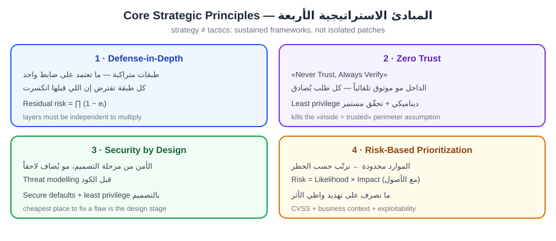
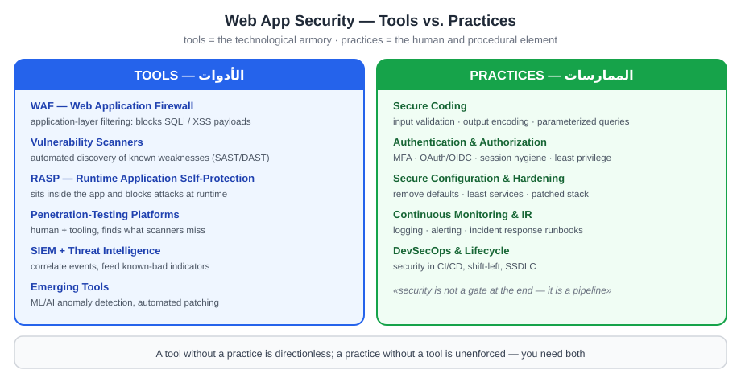
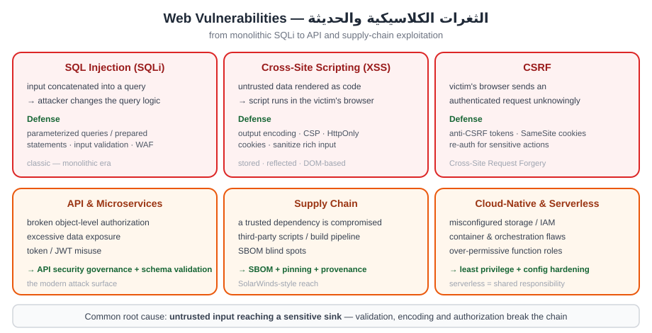
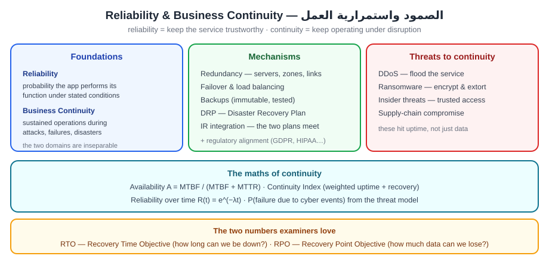

# الجابتر السادس — Web Application Security
## أمن تطبيقات الويب: الاستراتيجيات · الأدوات والممارسات · الثغرات · الصمود

> **دليل القراءة:** كل مقطع مقسوم ثلاث طبقات:
> **① النص الأصلي (English)** — نسخة نظيفة **كثافة وسط** · **② الترجمة** — ترجمة كاملة مطابقة · **③ الشرح الفهمي** — الشرح اللي يفهمك المفهوم.
>
> **المصدر:** `02_Raw_Materials/W06_Web_App_Security.pdf` (23 صفحة · 45,195 حرفاً).
>
> ⚠️ **ملاحظتان:** (1) هذا **أربعة مستندات مدموجة بملف واحد**، وعنوانه الداخلي **«Week 5»**. (2) **ماكو نسخة معلَّمة** لهذا الجابتر.
>
> 🎯 **مهم:** الثغرات الكلاسيكية (SQLi · XSS · CSRF) موجودة **بمستند واحد فقط** (المستند الثالث §3) — وهاي **أكثر مادة امتحانية بالفصل**. الباقي **استراتيجيات وصمود** (كلام إداري + معادلات). **لا تضيّع وقتك بالتساوي** — ركّز على المستند الثالث.

## 🗺️ خريطة الفصل (4 مستندات مدموجة)

| المستند | العنوان | الأقسام | الأهم |
|:--:|:---|:--:|:---|
| **1** | Web Application Security: **Strategies** | §1–6 | 4 مبادئ · DevSecOps · نماذج تحسين |
| **2** | Web Application Security: **Tools and Practices** | §1–3 | WAF · Scanners · RASP · Pen-test · SIEM · DevSecOps |
| **3** | **Securing Vulnerabilities: Modern Perspectives** | §1–6 | ⭐ **SQLi · XSS · CSRF · API · Supply Chain · Cloud** |
| **4** | Web Application Security: **Reliability and Business Continuity** | §1–8 | RTO/RPO · Redundancy · DDoS · Ransomware |

> **ملاحظة على الترتيب:** ترقيم الأقسام **يبدأ من جديد بكل مستند** (لأنه 4 وثائق مدموجة) — فـ«القسم 1» يتكرر أربع مرات. اعتمد على **عنوان المستند** فوق كل قسم.

---

### القسم 1 — Introduction to Web Application Security Strategies

#### ① النص الأصلي
> Web Application Security is a critical subset of cybersecurity: it encompasses the strategies, tools, and practices designed to protect web applications from malicious exploitation. With the rapid adoption of digital services, cloud platforms, and API-driven ecosystems, web applications have become one of the most targeted components of modern infrastructures. The stakes are high, because successful breaches can lead to financial losses, reputational damage, regulatory penalties, and systemic disruption.
>
> The threat landscape has evolved beyond traditional SQL injection and Cross-Site Scripting (XSS) to include bot-driven campaigns, supply chain compromises, API exploitation, and attacks on containerized microservices. Web application security has therefore shifted toward proactive, adaptive, and intelligence-driven paradigms, integrating machine learning–based anomaly detection, automated patching, and Zero Trust principles.
>
> Web application security is now a cornerstone of modern cybersecurity, reflecting the reality that organizations rely on digital platforms as their primary interface with users, partners, and governments. Its strategic dimension extends beyond tactical countermeasures and isolated patches; it is concerned with long-term frameworks that anticipate evolving threats, optimize resource allocation, and align with broader organizational objectives.
>
> Strategies here are deliberate, sustained approaches to managing risk and embedding security into the DNA of organizational processes. Unlike tactical responses, which address immediate vulnerabilities, strategic approaches recognize that web applications are part of larger socio-technical systems covering infrastructure, human behavior, governance, and adversarial dynamics.
>
> A modern strategy must therefore be dynamic, multi-layered, and adaptive, reflecting both technological advances (cloud computing, APIs, artificial intelligence) and regulatory pressures (GDPR, CCPA, HIPAA). Its effectiveness can be modeled mathematically to optimize the trade-offs between cost, usability, and resilience.

#### ② الترجمة
> «أمن تطبيقات الويب جزء أساسي من الأمن السيبراني: يشمل الاستراتيجيات والأدوات والممارسات المصمّمة لحماية تطبيقات الويب من الاستغلال الخبيث. ومع الانتشار السريع للخدمات الرقمية والمنصات السحابية والأنظمة القائمة على واجهات برمجة التطبيقات (APIs)، أصبحت تطبيقات الويب من أكثر المكوّنات استهدافًا في البنى التحتية الحديثة. والمخاطر عالية، لأن الاختراقات الناجحة قد تؤدي إلى خسائر مالية وضرر بالسمعة وعقوبات تنظيمية وتعطّل منهجي.
>
> تطوّر مشهد التهديدات ليتجاوز حقن SQL التقليدي والبرمجة عبر المواقع (XSS) ليضم حملات مدفوعة بالبوتات واختراقات سلسلة التوريد واستغلال الـ APIs والهجمات على الخدمات المصغّرة داخل الحاويات. لذلك تحوّل أمن تطبيقات الويب نحو نماذج استباقية ومتكيّفة ومدفوعة بالاستخبارات، تدمج كشف الشذوذ القائم على تعلّم الآلة والترقيع الآلي ومبادئ Zero Trust.
>
> أمن تطبيقات الويب أصبح الآن حجر الزاوية في الأمن السيبراني الحديث، معبّرًا عن واقع اعتماد المؤسسات على المنصات الرقمية كواجهة أساسية مع المستخدمين والشركاء والحكومات. وبُعده الاستراتيجي يتجاوز التدابير التكتيكية والترقيعات المعزولة؛ فهو يعني تطوير أطر طويلة الأمد تتوقّع التهديدات المتطوّرة وتحسّن توزيع الموارد وتتوافق مع الأهداف التنظيمية الأوسع.
>
> الاستراتيجيات هنا تمثّل مقاربات مدروسة ومستدامة لإدارة المخاطر وإدماج الأمن في صميم عمليات المؤسسة. وخلافًا للاستجابات التكتيكية التي تعالج الثغرات الفورية، تعترف المقاربات الاستراتيجية بأن تطبيقات الويب جزء من أنظمة اجتماعية-تقنية أكبر تشمل البنية التحتية والسلوك البشري والحوكمة وديناميكيات الخصوم.
>
> لذلك يجب أن تكون الاستراتيجية الحديثة ديناميكية ومتعددة الطبقات ومتكيّفة، تعكس التقدّم التقني (الحوسبة السحابية، واجهات الـ APIs، الذكاء الاصطناعي) والضغوط التنظيمية (GDPR، CCPA، HIPAA). ويمكن نمذجة فعاليتها رياضيًا لتحسين المقايضات بين الكلفة وقابلية الاستخدام والمرونة.»

#### ③ الشرح الفهمي
هذا القسم يحكي إن أمن تطبيقات الويب ما عاد بس «patch هنا وهناك»، بل صار استراتيجية كاملة. لازم نفرّق بين شيئين:

- **Tactical (تكتيكي):** يعالج ثغرة فورية ← مثل ترقيع ثغرة اليوم.
- **Strategic (استراتيجي):** يفكّر بعيد المدى ← يتوقّع التهديدات، يوزّع الموارد، ويتوافق مع أهداف المؤسسة.

ليش تطبيقات الويب هدف مغرٍ؟ لأنها صارت الواجهة الأولى بين المؤسسة والمستخدم، وتشتغل على cloud و APIs، فمساحة الهجوم صارت كبيرة.

تطوّر التهديدات: من SQLi و XSS التقليدية ← إلى bot campaigns و supply chain compromises و API exploitation وهجمات على الحاويات (containers).

| البُعد | Tactical | Strategic |
|---|---|---|
| الأفق الزمني | قصير | طويل |
| الهدف | سدّ ثغرة فورية | بناء إطار مرن |
| النطاق | نقطة واحدة | نظام اجتماعي-تقني كامل |
| المخرَج | patch | resilience |

الاستراتيجية الحديثة لازم تكون **dynamic + multi-layered + adaptive**، وتنتبه لعاملين: التقنية (cloud, APIs, AI) والتنظيم (GDPR, CCPA, HIPAA).

---

### القسم 2 — Core Strategic Principles in Web Application Security

#### ① النص الأصلي
> **2.1 Defense-in-Depth** — This paradigm ensures that no single vulnerability can compromise the entire system. Multiple security layers are strategically deployed so that risk is mitigated even if one layer fails:
>
> - Input validation
> - Authentication controls
> - Intrusion monitoring
> - Firewalls
> - Encryption
>
> The principle can be modeled by expressing the probability of system compromise as the product of independent failure probabilities across the layers. A strategy that maximizes cumulative effectiveness across layers reduces the likelihood of compromise exponentially, reinforcing the importance of redundancy.
>
> **2.2 Zero Trust Paradigm** — Zero Trust reframes security by rejecting implicit trust within networks. Every request, internal or external, is verified using contextual attributes: identity, device health, geolocation, and behavioral baselines. Applied to web applications, this strategy prevents lateral movement of attackers once a single credential or session is compromised.
>
> **2.3 Security by Design** — Strategies rooted in "security by design" integrate security into the earliest phases of the software development lifecycle. Rather than retrofitting defenses, this approach embeds secure coding practices, automated testing, and vulnerability assessments into CI/CD pipelines. This aligns with the DevSecOps paradigm, where security "shifts left", reducing the cost and complexity of remediation.
>
> **2.4 Risk-Based Prioritization** — Web application security resources are finite, so strategies must prioritize risks based on likelihood, severity, and potential impact. This principle underpins frameworks like CVSS (Common Vulnerability Scoring System) and FAIR (Factor Analysis of Information Risk), ensuring that high-risk vulnerabilities, for example SQL injection on authentication forms, receive immediate attention.

$$P_{compromise} = \prod_{i=1}^{n}(1 - E_i)$$

| الرمز | المعنى |
|---|---|
| $E_i$ | effectiveness of security layer $i$ |
| $n$ | total number of layers |

#### ② الترجمة
> **2.1 الدفاع في العمق (Defense-in-Depth)** — هذا النموذج يضمن أن أي ثغرة واحدة لا تقدر تُخترق النظام بأكمله. تُنشر طبقات أمنية متعددة استراتيجيًا بحيث يُخفَّف الخطر حتى لو فشلت طبقة واحدة:
>
> - التحقق من المُدخلات (input validation)
> - ضوابط المصادقة (authentication controls)
> - مراقبة الاختراقات (intrusion monitoring)
> - الجدران النارية (firewalls)
> - التشفير (encryption)
>
> ويمكن نمذجة المبدأ بالتعبير عن احتمال اختراق النظام كحاصل ضرب احتمالات الفشل المستقلة عبر الطبقات. والاستراتيجية التي تزيد الفعالية التراكمية عبر الطبقات تُقلّل احتمال الاختراق بشكل أُسّي، ما يعزّز أهمية التكرار والتعدّد (redundancy).
>
> **2.2 نموذج Zero Trust** — يُعيد Zero Trust صياغة الأمن برفض الثقة الضمنية داخل الشبكات. كل طلب، داخلي أو خارجي، يُتحقَّق منه باستخدام سمات سياقية: الهوية، وصحة الجهاز، والموقع الجغرافي، والخطوط الأساسية للسلوك. وعند تطبيقه على تطبيقات الويب، يمنع هذا النموذج الحركة الجانبية للمهاجمين بمجرد اختراق بيانات اعتماد أو جلسة واحدة.
>
> **2.3 الأمن بالتصميم (Security by Design)** — الاستراتيجيات المتجذّرة في «الأمن بالتصميم» تدمج الأمن في أبكر مراحل دورة حياة تطوير البرمجيات. وبدلًا من إضافة الدفاعات لاحقًا، يُدمج هذا النهج ممارسات البرمجة الآمنة والاختبار الآلي وتقييم الثغرات داخل خطوط CI/CD. ويتوافق ذلك مع نموذج DevSecOps حيث «ينزاح الأمن يسارًا»، ما يقلّل كلفة المعالجة وتعقيدها.
>
> **2.4 الترتيب بحسب المخاطر (Risk-Based Prioritization)** — موارد أمن تطبيقات الويب محدودة، لذا يجب أن ترتّب الاستراتيجيات المخاطر بحسب الاحتمالية والخطورة والأثر المحتمل. ويقوم هذا المبدأ على أطر مثل CVSS (نظام تقييم الثغرات الشائع) و FAIR (تحليل عوامل مخاطر المعلومات)، ما يضمن أن الثغرات عالية الخطورة، مثل حقن SQL في نماذج تسجيل الدخول، تحصل على أولوية فورية.

#### ③ الشرح الفهمي
هذي أربع مبادئ أساسية، وكل واحدة تعالج زاوية مختلفة من الحماية:

| المبدأ | الفكرة الأساسية | المقولة المختصرة |
|---|---|---|
| Defense-in-Depth | طبقات متعددة، لو فشلت واحدة تبقى الباقي | لا تعتمد على جدار واحد |
| Zero Trust | لا تثق بأحد بشكل ضمني، تحقّق من كل طلب | «لا تثق، تحقّق دائمًا» |
| Security by Design | الأمن من أول سطر كود، مو بعد الاختراق | «security shifts left» |
| Risk-Based Prioritization | رتّب الثغرات حسب الخطر الحقيقي | الموارد محدودة ← الأولوية للأخطر |

معادلة الـ **Defense-in-Depth** تعني إن احتمال الاختراق = حاصل ضرب احتمالات فشل كل طبقة. بما إن كل حد أقل من 1، فكل ما تزيد طبقة، الناتج يصغر بسرعة (exponential).

الرمز: $E_i$ = فعالية الطبقة، و $n$ = عدد الطبقات. مثال بسيط: لو عندك 3 طبقات فعالية كل واحدة 0.9، فاحتمال الاختراق = 0.1 × 0.1 × 0.1 = 0.001 ← رقم صغير جدًا.

- **Zero Trust** مهم ضد **lateral movement**: لو انسرقت جلسة وحدة، المهاجم ما يقدر يتحرك للأنظمة الثانية بدون تحقّق جديد.
- **CVSS** يعطي درجة تقنية للثغرة، و**FAIR** يحلّل المخاطر ماليًا/كميًا ← الاثنين يساعدونك تقرر وين تبدأ.

---

### القسم 3 — DevSecOps as a Strategic Framework

#### ① النص الأصلي
> The transition to agile and DevOps methodologies necessitated a parallel evolution in security strategy: DevSecOps. This framework embeds security testing and monitoring throughout the development and deployment lifecycle, making it integral rather than peripheral.
>
> Key strategic components include:
>
> - Automated Static and Dynamic Analysis: continuous identification of vulnerabilities in code before deployment.
> - Infrastructure as Code Security: ensuring that deployment scripts and configurations are secured.
> - Continuous Compliance: automating alignment with regulatory requirements.
> - Red-Teaming and Threat Simulation: strategically assessing resilience against evolving adversarial tactics.
>
> Mathematically, the expected reduction in vulnerabilities over iterations in a CI/CD cycle can be modeled with a recurrence, where a strategy is effective when it achieves a declining trajectory of residual vulnerabilities over successive iterations.

$$V_{t+1} = V_t(1 - \alpha) + \beta$$

| الرمز | المعنى |
|---|---|
| $V_t$ | number of vulnerabilities at iteration $t$ |
| $\alpha$ | proportion of vulnerabilities eliminated through DevSecOps practices |
| $\beta$ | new vulnerabilities introduced during the iteration |

**Effectiveness condition:** $\alpha > \beta / V_t$ — ensuring a declining trajectory of residual vulnerabilities over successive iterations.

#### ② الترجمة
> الانتقال إلى منهجيات agile و DevOps فرض تطورًا موازيًا في استراتيجية الأمن: DevSecOps. هذا الإطار يدمج اختبار الأمن والمراقبة في كل مراحل التطوير والنشر، فيجعله جزءًا جوهريًا لا هامشيًا.
>
> وتشمل المكوّنات الاستراتيجية الرئيسية:
>
> - التحليل الآلي الساكن والديناميكي: التعرّف المستمر على الثغرات في الكود قبل النشر.
> - أمن البنية التحتية ككود (Infrastructure as Code Security): ضمان تأمين سكربتات وإعدادات النشر.
> - الامتثال المستمر (Continuous Compliance): أتمتة التوافق مع المتطلبات التنظيمية.
> - الفرق الحمراء ومحاكاة التهديدات (Red-Teaming): تقييم استراتيجي للمرونة أمام أساليب الخصوم المتطوّرة.
>
> رياضيًا، يمكن نمذجة الانخفاض المتوقع في الثغرات عبر دورات دورة CI/CD بعلاقة تكرارية، وتكون الاستراتيجية فعّالة عندما تحقّق مسارًا هابطًا للثغرات المتبقية على مرّ الدورات المتعاقبة.

#### ③ الشرح الفهمي
**DevSecOps** = DevOps + Security. الفكرة إن الأمن ما يكون مرحلة منفصلة بآخر المشروع، بل مدموج داخل الـ pipeline من البداية للنهاية.

المكوّنات الأربعة:

| المكوّن | شنو يسوي |
|---|---|
| Automated Static & Dynamic Analysis | يفحص الكود آليًا (SAST/DAST) قبل النشر |
| Infrastructure as Code Security | يأمّن سكربتات وإعدادات النشر (Terraform, YAML...) |
| Continuous Compliance | يتأكد آليًا من التوافق مع القوانين (GDPR, PCI DSS...) |
| Red-Teaming & Threat Simulation | يحاكي المهاجم الحقيقي لاختبار المناعة |

الآن نموذج تقليل الثغرات:

$$V_{t+1} = V_t(1 - \alpha) + \beta$$

| الرمز | المعنى |
|---|---|
| $V_t$ | عدد الثغرات عند الدورة $t$ |
| $\alpha$ | نسبة الثغرات اللي أُزيلت عبر DevSecOps |
| $\beta$ | الثغرات الجديدة اللي تدخل بالدورة |

المعنى بالعراقي: بالدورة الجديدة، عندك اللي بقى من قبل بعد ما شلنا نسبة $\alpha$ منه، وزيد عليه $\beta$ ثغرات جديدة دخلت. فعدد الثغرات ينزل بس إذا كانت الإزالة أقوى من الإدخال.

**شرط الفعالية:** $\alpha > \beta / V_t$

يعني لازم نسبة الإزالة تكون أكبر من نسبة الإدخال مقسومة على عدد الثغرات الحالي. إذا تحقّق الشرط، المنحنى يهبط تدريجيًا ← **residual vulnerabilities** تقل مع كل دورة، والمشروع يصير أأمن مع الوقت.

---

### القسم 4 — 4. Risk-Oriented Strategic Approaches

#### ① النص الأصلي
> Strategies must be firmly anchored in risk quantification, because without measurable parameters prioritization becomes arbitrary and leads to an inefficient allocation of resources.
>
> **4.1 Quantification of Web Application Risks** — The risk associated with each vulnerability can be defined as the product of three measurable factors:
>
> - $L_i$ = likelihood of exploitation of vulnerability $i$.
> - $S_i$ = severity (technical criticality, often a CVSS score).
> - $I_i$ = impact on confidentiality, integrity, and availability.
>
> The aggregate risk score is then the sum of the individual risks, which allows organizations to compare risks across different applications and prioritize remediation at the strategic level.
>
> **4.2 Prioritization Frameworks** — Modern strategies employ machine learning models to predict likelihood values ($L_i$) based on historical exploit data, adversarial intelligence, and environmental context. For example, vulnerabilities publicly weaponized in exploit kits receive higher likelihood scores, making them strategic priorities.

$$R_i = L_i \cdot S_i \cdot I_i$$

$$R_{total} = \sum_{i=1}^{n} R_i$$

| الرمز | المعنى |
|---|---|
| $R_i$ | risk of vulnerability $i$ |
| $L_i$ | likelihood of exploitation of vulnerability $i$ |
| $S_i$ | severity (technical criticality, often CVSS score) |
| $I_i$ | impact on confidentiality, integrity, and availability |
| $R_{total}$ | aggregate risk score across all vulnerabilities |
| $n$ | total number of vulnerabilities |

#### ② الترجمة
> «يجب أن تكون الاستراتيجيات مرتكزة بثبات على القياس الكمّي للمخاطر، لأنه بدون معاملات قابلة للقياس يصبح الترجيح عشوائيًا ويؤدي إلى توزيع غير فعّال للموارد.
>
> **4.1 القياس الكمّي لمخاطر تطبيقات الويب** — يمكن تعريف الخطر المرتبط بكل ثغرة كحاصل ضرب ثلاثة عوامل قابلة للقياس:
>
> - $L_i$ = احتمال استغلال الثغرة $i$.
> - $S_i$ = الخطورة (الأهمية التقنية، وغالبًا درجة CVSS).
> - $I_i$ = الأثر على السرية والسلامة والتوافر.
>
> ثم تكون درجة الخطر الكلية هي مجموع المخاطر الفردية، وهذا يسمح للمؤسسات بمقارنة المخاطر بين تطبيقات مختلفة وترجيح المعالجة على المستوى الاستراتيجي.
>
> **4.2 أطر الترجيح (Prioritization Frameworks)** — تستخدم الاستراتيجيات الحديثة نماذج تعلّم الآلة للتنبؤ بقيم الاحتمال ($L_i$) استنادًا إلى بيانات الاستغلال التاريخية واستخبارات الخصوم والسياق البيئي. ومثلًا، الثغرات المنشورة علنًا كأدوات جاهزة (exploit kits) تحصل على درجات احتمال أعلى، ما يجعلها أولويات استراتيجية.»

#### ③ الشرح الفهمي
هذا القسم هو العمود الفقري للاستراتيجية: **بدون قياس ما كو أولويات**. إذا ما عندك رقم يقيس الخطر، الترجيح يصير عشوائي والموارد تروح على أشياء مو مهمة.

المعادلة الأساسية للخطر:

$$R_i = L_i \cdot S_i \cdot I_i$$

| الرمز | المعنى |
|---|---|
| $R_i$ | خطر الثغرة رقم $i$ |
| $L_i$ | احتمال استغلال الثغرة (likelihood) |
| $S_i$ | الخطورة التقنية (severity) — غالباً درجة CVSS |
| $I_i$ | الأثر على السرية والسلامة والتوافر (CIA) |
| $R_{total}$ | مجموع الخطر الكلي |
| $n$ | عدد الثغرات |

نقطة مهمة: المعادلة **ضرب مو جمع**، يعني لو أي عامل = صفر، الخطر كله يصير صفر. مثلاً ثغرة خطيرة بس احتمال استغلالها شبه معدوم ← ما تستاهل موارد. وبعدها نجمع كل الثغرات لنطلع الخطر الكلي $R_{total}$، ونقدر نقارن بين تطبيقات مختلفة ← وهذا أساس الترجيح (prioritization).

**4.2 إطارات الترجيح:** هنا يدخل الذكاء الاصطناعي — موديلات ML تتنبأ بالاحتمال $L_i$ من ثلاث مصادر:

| المصدر | شنو يعطي |
|---|---|
| Historical exploit data | تاريخ الاستغلال الفعلي للثغرات |
| Adversarial intelligence | استخبارات الخصوم وأدواتهم |
| Environmental context | سياق البيئة (أصول مهمة؟ موصولة للإنترنت؟) |

القاعدة العملية: ثغرة منشورة كأداة جاهزة (exploit kit) ← احتمال أعلى ← أولوية أعلى. هذا هو اللي يحوّل القائمة الطويلة للثغرات إلى ترتيب قابل للتنفيذ.

---

### القسم 5 — 5. Modern Strategic Directions in Web Application Security

#### ① النص الأصلي
> **5.1 API and Microservices Security** — The migration toward microservices and API-first design has expanded the attack surface dramatically. Strategies must now address:
>
> - Broken object-level authorization (BOLA).
> - Data exposure through poorly secured APIs.
> - Rate limiting and abuse prevention.
>
> **5.2 Cloud-Native and Containerized Environments** — Security strategies extend to Kubernetes clusters, serverless functions, and hybrid cloud deployments. Ensuring consistency of security policies across multi-cloud environments is now a strategic priority.
>
> **5.3 AI-Driven Detection and Response** — Artificial intelligence augments strategies by enabling real-time anomaly detection, adaptive traffic filtering, and predictive analytics. Reinforcement learning models can dynamically tune WAF rules to reflect evolving attack patterns.
>
> **5.4 Policy- and Compliance-Driven Strategies** — Global regulations such as GDPR, HIPAA, and PCI DSS enforce minimum security standards. Aligning web application strategies with these regulatory requirements not only mitigates legal risks but also enforces structured governance.

#### ② الترجمة
> «**5.1 أمن الـ APIs والخدمات المصغّرة (Microservices)** — الانتقال نحو الخدمات المصغّرة والتصميم القائم على الـ API أولًا (API-first) وسّع مساحة الهجوم بشكل هائل. وعلى الاستراتيجيات الآن أن تعالج:
>
> - انكسار التخويل على مستوى الكائن (Broken object-level authorization — BOLA).
> - انكشاف البيانات عبر APIs ضعيفة التأمين.
> - تحديد المعدّل (rate limiting) ومنع الإساءة (abuse prevention).
>
> **5.2 البيئات السحابية الأصلية والحاويات (Cloud-Native & Containerized)** — تمتد استراتيجيات الأمن إلى عناقيد Kubernetes والدوال اللاخادمية (serverless) والنشر السحابي الهجين (hybrid cloud). وضمان اتساق سياسات الأمن عبر بيئات السحابة المتعددة (multi-cloud) صار أولوية استراتيجية.
>
> **5.3 الكشف والاستجابة المدفوعان بالذكاء الاصطناعي** — يعزّز الذكاء الاصطناعي الاستراتيجيات عبر تمكين كشف الشذوذ في الوقت الفعلي والترشيح المتكيّف للحركة والتحليلات التنبؤية. ونماذج التعلّم المعزّز (reinforcement learning) تقدر تضبط قواعد WAF ديناميكيًا لتواكب أنماط الهجوم المتطوّرة.
>
> **5.4 الاستراتيجيات المدفوعة بالسياسات والامتثال** — اللوائح العالمية مثل GDPR و HIPAA و PCI DSS تفرض حدًا أدنى من معايير الأمن. ومواءمة استراتيجيات تطبيقات الويب مع هذه المتطلبات لا تخفّف المخاطر القانونية فقط، بل تفرض أيضًا حوكمة منظّمة.»

#### ③ الشرح الفهمي
§5 يجيب أربع اتجاهات حديثة وسّعت مفهوم الاستراتيجية بعد ما تغيّرت البنية:

| الاتجاه | ليش مهم | الكلمة المفتاحية |
|---|---|---|
| API & Microservices | التصميم API-first كبّر مساحة الهجوم كثير | BOLA |
| Cloud-Native & Containers | Kubernetes · serverless · hybrid cloud | policy consistency |
| AI-Driven Detection | كشف شذوذ لحظي + ضبط تلقائي | reinforcement learning |
| Policy & Compliance | قوانين تفرض حد أدنى من الأمن | GDPR · HIPAA · PCI DSS |

**شنو يعني BOLA؟** (Broken Object-Level Authorization) هي أخطر ثغرة في الـ APIs. تصير لما المستخدم يقدر يوصل لكائنات (objects) مو ملكه — مو لأن الهوية غلط، بس لأن التطبيق يتحقق من **الهوية** ولا يتحقق من **الصلاحية على الكائن نفسه**. مثال: `GET /api/orders/123` يرجّع طلب مستخدم ثاني لأن ما كو تحقق إن الطلب فعلاً يخص المستخدم الحالي.

باقي الاتجاهات باختصار:

- **Cloud-native/containers:** المشكلة مو الحاوية نفسها، بل اتساق السياسة بين بيئات متعددة (multi-cloud). لو سياسة الأمن تختلف من بيئة لبيئة ← كو فراغ.
- **AI-driven:** الـ WAF التقليدي قواعده ثابتة (static rules)، فالمهاجم يتعلّم يتجاوزه. التعلّم المعزّز يخلّي القواعد تتحدّث لحالها حسب نمط الهجوم.
- **Compliance:** هذي مو بس «ورق» — هي تفرض حوكمة منظّمة وتحدّد الحد الأدنى اللي لازم توصله، وتحوّل الأمن من اختياري إلى إلزامي.

النقطة الجوهرية: هذي الأربعة **مو منفصلة** — الـ AI يخدم الأولى والثانية والثالثة، والـ compliance تفرض الكل.

---

### القسم 6 — 6. Mathematical Modeling of Strategic Web Application Security

#### ① النص الأصلي
> **6.1 Risk Scoring Model** — This model underpins vulnerability prioritization by combining likelihood, severity, and impact for every vulnerability into a single score.
>
> **6.2 Optimization Model for Resource Allocation** — Organizations face budgetary and human resource constraints, so the optimization of security investments is expressed as minimizing residual risk subject to a total budget constraint. This model ensures that risk reduction is maximized relative to resource allocation.
>
> **6.3 Game-Theoretic Model of Attack and Defense** — Web application security can also be conceptualized as a repeated game between attackers and defenders, where the payoff matrix reflects costs of exploitation versus costs of defense. With $P_A$ the probability of a successful attack, $I$ the impact, and $C_D$ the cost of defense, the defender's utility is the negative expected impact minus the defense cost, and optimal strategies minimize this utility while balancing $C_D$.
>
> **6.4 Attack Surface Reduction Model** — The effectiveness of reducing exposed endpoints can be quantified as a ratio of exposed to total endpoints. Maximizing it is a direct strategic objective in API-first architectures.

$$R = \sum_{i=1}^{n} L_i \cdot V_i \cdot I_i$$

| الرمز | المعنى |
|---|---|
| $R$ | total risk score |
| $L_i$ | likelihood of exploitation of vulnerability $i$ |
| $V_i$ | severity of vulnerability $i$ |
| $I_i$ | impact of vulnerability $i$ |
| $n$ | total number of vulnerabilities |

$$\min R_{residual} = \sum_{i=1}^{n} \big( R_i \cdot (1 - M_i) \big) \quad \text{s.t.} \quad \sum_{i=1}^{n} C_i \le B$$

| الرمز | المعنى |
|---|---|
| $R_{residual}$ | residual (remaining) risk after mitigation |
| $R_i$ | inherent risk of vulnerability $i$ |
| $M_i$ | mitigation effectiveness for vulnerability $i$ |
| $C_i$ | cost of mitigating vulnerability $i$ |
| $B$ | total available budget |

$$U_{defender} = -(P_A \cdot I) - C_D$$

| الرمز | المعنى |
|---|---|
| $U_{defender}$ | defender's utility (negative = loss) |
| $P_A$ | probability of a successful attack |
| $I$ | impact of a successful attack |
| $C_D$ | cost of defense |

$$ASR = 1 - \frac{E_{exposed}}{E_{total}}$$

| الرمز | المعنى |
|---|---|
| $ASR$ | attack surface reduction (closer to 1 = better) |
| $E_{exposed}$ | number of endpoints vulnerable to exploitation |
| $E_{total}$ | total functional endpoints |

#### ② الترجمة
> «**6.1 نموذج تسجيل الخطر (Risk Scoring Model)** — هذا النموذج يقوم عليه ترجيح الثغرات عبر دمج الاحتمال والخطورة والأثر لكل ثغرة في درجة واحدة.
>
> **6.2 نموذج التحسين لتوزيع الموارد (Optimization Model)** — تواجه المؤسسات قيودًا في الميزانية والموارد البشرية، لذا يُعبَّر عن تحسين استثمارات الأمن بأنه تصغير الخطر المتبقي بشرط ألّا يتجاوز الإنفاق الكلي الميزانية. وهذا النموذج يضمن تعظيم تقليل الخطر نسبةً إلى توزيع الموارد.
>
> **6.3 النموذج النظري اللعبي للهجوم والدفاع (Game-Theoretic Model)** — يمكن أيضًا تصوّر أمن تطبيقات الويب كلعبة متكرّرة بين المهاجمين والمدافعين، حيث تعكس مصفوفة المكاسب كلفة الاستغلال مقابل كلفة الدفاع. وباعتبار $P_A$ احتمال نجاح الهجوم و $I$ الأثر و $C_D$ كلفة الدفاع، تكون منفعة المدافع هي الأثر المتوقع السالب ناقص كلفة الدفاع، والاستراتيجيات المثلى تصغّر هذه المنفعة مع موازنة $C_D$.
>
> **6.4 نموذج تقليل مساحة الهجوم (Attack Surface Reduction Model)** — يمكن قياس فعالية تقليل نقاط النهاية المكشوفة كنسبة بين المكشوف والكلي. وتعظيمها هدف استراتيجي مباشر في البنى القائمة على الـ API أولًا.»

#### ③ الشرح الفهمي
§6 هو الجزء الرياضي — أربع موديلات تحوّل الاستراتيجية من كلام إلى أرقام:

| الموديل | السؤال اللي يجاوب عليه |
|---|---|
| Risk Scoring | شنو أخطر ثغرة عندي؟ |
| Optimization | وين أصرف الميزانية بأقل خطر؟ |
| Game Theory | شلون أفكّر بعقلية الخصم؟ |
| Attack Surface Reduction | شلون أقلّل التعرض من أصله؟ |

**6.1 Risk Scoring** — نفس فكرة §4: نجمع درجات الخطر للثغرات كلها. هنا الخطورة مسمّاة $V_i$ (severity). الناتج رقم واحد يقارن بين أنظمة مختلفة.

**6.2 Optimization (التحسين)** — الفكرة: عندك ميزانية محدودة $B$، وتريد تقلّل الخطر المتبقي. لو ثغرة عندها فاعلية تخفيف $M_i$ عالية وكلفة $C_i$ قليلة ← أولوية. الشرط $\sum C_i \le B$ يعني «ما تصرف أكثر من الميزانية».

$$R_{residual} = \sum_{i=1}^{n} \big( R_i \cdot (1 - M_i) \big)$$

| الرمز | المعنى |
|---|---|
| $R_{residual}$ | الخطر المتبقي بعد التخفيف |
| $R_i$ | الخطر الأصلي للثغرة $i$ |
| $M_i$ | فاعلية التخفيف ($1$ = أزلنا الخطر تماماً) |
| $C_i$ | كلفة تخفيف الثغرة $i$ |
| $B$ | الميزانية الكلية |

مثال بسيط: ثغرة خطرها 100، وفاعلية التخفيف 0.8 ← الخطر المتبقي = 100 × 0.2 = 20.

**6.3 Game Theory** — هنا نشوف الأمن كلعبة متكرّرة (repeated game) بين مهاجم ومدافع. منفعة المدافع سالبة (خسارة):

$$U_{defender} = -(P_A \cdot I) - C_D$$

| الرمز | المعنى |
|---|---|
| $U_{defender}$ | منفعة المدافع (سالبة = خسارة) |
| $P_A$ | احتمال نجاح الهجوم |
| $I$ | أثر الهجوم الناجح |
| $C_D$ | كلفة الدفاع |

المعنى: المدافع يخسر مقدار «الخسارة المتوقعة» زايد كلفة الدفاع. الهدف تصغير $U_{defender}$، بس مو على حساب دفاع مكلف بلا داعي — لازم نوازن $C_D$ مع الخسارة المتوقعة.

**6.4 Attack Surface Reduction** — بدل ما نرقّع ثغرة ثغرة، نقلّل عدد نقاط النهاية المكشوفة أصلاً:

$$ASR = 1 - \frac{E_{exposed}}{E_{total}}$$

| الرمز | المعنى |
|---|---|
| $ASR$ | نسبة تقليل مساحة الهجوم (كل ما اقتربت من 1 كان أحسن) |
| $E_{exposed}$ | عدد نقاط النهاية القابلة للاستغلال |
| $E_{total}$ | مجموع نقاط النهاية الوظيفية |

مثال: 100 endpoint، منها 25 مكشوف ← $ASR = 1 - 0.25 = 0.75$. لو خفّضنا المكشوف لـ 5 ← $ASR = 0.95$. لهذا في بنى API-first، «قلّل التعرض» هدف استراتيجي مباشر.

---

### القسم 7 — Introduction

#### ① النص الأصلي
> Web application security is not merely a technical discipline; it is a systemic science requiring the integration of robust tools and disciplined practices to ensure the confidentiality, integrity, and availability of application services. Tools form the technological armory — firewalls, scanners, runtime protectors, and monitoring platforms — while practices constitute the human and procedural element: secure coding, authentication frameworks, and lifecycle governance. Together, these elements define the operational effectiveness of modern web application defense.
>
> A sophisticated understanding of tools and practices must extend beyond enumeration into a framework of strategic integration, continuous evolution, and quantitative evaluation. Mathematical models allow the quantification of effectiveness, providing a rigorous scientific foundation for decision-making.

#### ② الترجمة
> «أمن تطبيقات الويب ليس مجرّد تخصّص تقني؛ بل هو علم منظومي يتطلّب دمج أدوات قوية وممارسات منضبطة لضمان السرّية والسلامة والتوافرية لخدمات التطبيقات. فالأدوات تشكّل الترسانة التقنية — الجدران النارية والماسحات وحُماة وقت التشغيل ومنصّات المراقبة — أما الممارسات فتمثّل العنصر البشري والإجرائي: البرمجة الآمنة وأطر المصادقة وحوكمة دورة الحياة. ومعًا تُحدّد هذه العناصر الفاعلية التشغيلية للدفاع الحديث عن تطبيقات الويب.
>
> والفهم المتقدّم للأدوات والممارسات يجب أن يتجاوز مجرّد التعداد إلى إطار من التكامل الاستراتيجي والتطوّر المستمر والتقييم الكمّي. فالنماذج الرياضية تتيح قياس الفاعلية، ما يوفّر أساسًا علميًا صارمًا لاتخاذ القرار.»

#### ③ الشرح الفهمي
هاي المقدمة تربط فكرتين: **الأدوات (Tools)** و**الممارسات (Practices)**. الاثنين ما ينفعون بدون بعض — الأداة بدون ممارسة صحيحة تصير بس تكلفة، والممارسة بدون أداة تصير نية بلا تنفيذ.

| البُعد | الأدوات (Tools) | الممارسات (Practices) |
|---|---|---|
| شنو هي | تقنية/برمجية | بشرية وإجرائية |
| أمثلة | WAF، Scanner، RASP، SIEM | Secure Coding، Authentication، Governance |
| دورها | تكتشف وتمنع تقنيًا | تنظّم العمل وتضبط السلوك |
| الهدف | حماية تقنية مباشرة | استدامة وحوكمة |

النقطة الأهم: الفهم ما يوقف عند **enumeration** (عدّ الأدوات وحفظها)، بل يتطوّر إلى إطار من ثلاثة عناصر:

- **Strategic integration** ← دمج الأدوات والممارسات مع بعضها.
- **Continuous evolution** ← تتطوّر مع تغيّر التهديدات.
- **Quantitative evaluation** ← تقييم بالأرقام مو بالإحساس.

وهنا يظهر دور **النماذج الرياضية (Mathematical models)** — لأنها تحوّل «الأداة زينة أو لا» إلى رقم نقدر نقارن بيه ونقرّر. الأساس هو الثلاثية الأمنية **CIA**: Confidentiality + Integrity + Availability.

---

### القسم 8 — Tools in Web Application Security

#### ① النص الأصلي
> **2.1 Web Application Firewalls (WAFs)** — A Web Application Firewall (WAF) operates at the application layer, filtering and monitoring HTTP/S traffic to block malicious payloads such as SQL injection and Cross-Site Scripting (XSS). Modern WAFs deploy signature-based detection, heuristic anomaly detection, and AI-driven adaptive filtering. WAF efficiency can be captured using the true positive rate (TPR) and the false positive rate (FPR), and the optimal strategy maximizes E_WAF by balancing detection accuracy with usability.
>
> **2.2 Vulnerability Scanners** — These are automated tools probing applications for misconfigurations, outdated components, or insecure coding patterns. They integrate with CVE (Common Vulnerabilities and Exposures) databases to detect known weaknesses. Risk scores from scanners can be formalized, forming the basis for vulnerability prioritization matrices in enterprise strategies.
>
> **2.3 Runtime Application Self-Protection (RASP)** — RASP operates within the runtime environment of an application, monitoring its internal behavior and intercepting malicious activity dynamically. Unlike WAFs, which monitor external traffic, RASP detects attacks by analyzing execution flow, API calls, and memory states. Its effectiveness is represented as runtime coverage (RC); the closer RC approaches 1, the more comprehensive the runtime protection.
>
> **2.4 Penetration Testing Platforms** — Whether automated or manual, these tools simulate adversarial techniques to identify weaknesses not captured by automated scanners. Their value lies in the adversarial creativity factor (ACF). An ACF greater than 1 indicates that human-led or hybrid pentesting provides additional strategic insight beyond automation.
>
> **2.5 Security Information and Event Management (SIEM) and Threat Intelligence Tools** — SIEM systems aggregate logs, detect anomalies, and provide real-time alerts. Their power lies in event correlation, which transforms isolated alerts into actionable incidents, forming the backbone of security orchestration.
>
> **2.6 Emerging Tools.** The emerging toolset includes:
>
> - API Gateways with Security Layers: Protect APIs with schema validation, OAuth 2.0 enforcement, and rate limiting.
> - Container and Cloud-Native Scanners: Tools scanning Kubernetes deployments or serverless functions.
> - AI-Powered Anomaly Detection: Reinforcement learning models predicting attack sequences.
>
> These emerging tools reflect the shift of strategic attention toward distributed architectures and intelligent adversaries.

$$E_{WAF} = \frac{TP}{TP + FN} - \lambda \cdot \frac{FP}{FP + TN}$$

| الرمز | المعنى |
|---|---|
| $TP$ | true positives — الهجمات اللي انصدّت بالصح |
| $FN$ | false negatives — الهجمات اللي فاتت (missed) |
| $FP$ | false positives — طلبات شرعية انحظرت بالغلط |
| $TN$ | true negatives — طلبات شرعية عدّت صح |
| $\lambda$ | معامل وزن يعكس تحمّل المؤسسة للـ false positives |

$$R_i = L_i \cdot I_i \cdot S_i$$

| الرمز | المعنى |
|---|---|
| $R_i$ | درجة خطر الثغرة $i$ |
| $L_i$ | likelihood — احتمال استغلال الثغرة $i$ |
| $I_i$ | impact — الأثر عند نجاح الاستغلال |
| $S_i$ | exposure scope — نطاق التعرّض (عدد النسخ المتاحة) |

$$RC = \frac{\text{Monitored Execution Paths}}{\text{Total Execution Paths}}$$

| الرمز | المعنى |
|---|---|
| $RC$ | runtime coverage — نسبة مسارات التنفيذ المراقَبة |
| Monitored Execution Paths | مسارات التنفيذ اللي يراقبها الـ RASP |
| Total Execution Paths | كل مسارات التنفيذ الممكنة |

$$ACF = \frac{V_d}{V_a}$$

| الرمز | المعنى |
|---|---|
| $ACF$ | adversarial creativity factor — عامل الإبداع الخصمي |
| $V_d$ | الثغرات المكتشفة عبر هجمات محاكاة (discovered) |
| $V_a$ | الثغرات المفترضة من التحليل الآلي (assumed) |

$$C_{event} = f(\Delta t, S, P)$$

| الرمز | المعنى |
|---|---|
| $C_{event}$ | قوة/درجة ربط الحدث |
| $\Delta t$ | temporal proximity — التقارب الزمني بين الأحداث المترابطة |
| $S$ | source similarity — تشابه المصدر (IP، هوية الجهاز) |
| $P$ | probability threshold — عتبة الاحتمال للربط |

#### ② الترجمة
> «**2.1 جدران حماية تطبيقات الويب (WAFs)** — يعمل جدار حماية تطبيقات الويب (WAF) على طبقة التطبيق، فيرشّح ويراقب حركة HTTP/S لحجب الحمولات الخبيثة مثل حقن SQL والبرمجة عبر المواقع (XSS). والـ WAFs الحديثة تستخدم الكشف القائم على التوقيعات، وكشف الشذوذ الإرشادي، والترشيح التكيّفي المدفوع بالذكاء الاصطناعي. ويمكن التعبير عن كفاءة الـ WAF باستخدام معدّل الإيجابيات الحقيقية (TPR) ومعدّل الإيجابيات الكاذبة (FPR)، والاستراتيجية المثلى تعظّم E_WAF عبر الموازنة بين دقة الكشف وقابلية الاستخدام.
>
> **2.2 ماسحات الثغرات** — أدوات آلية تفحص التطبيقات بحثًا عن أخطاء التهيئة أو المكوّنات القديمة أو أنماط البرمجة غير الآمنة. وتتكامل مع قواعد بيانات CVE (Common Vulnerabilities and Exposures) لاكتشاف نقاط الضعف المعروفة. ويمكن صياغة درجات الخطر الصادرة من الماسحات، وهي تشكّل أساسًا لمصفوفات ترتيب أولوية الثغرات في استراتيجيات المؤسسات.
>
> **2.3 الحماية الذاتية للتطبيق وقت التشغيل (RASP)** — يعمل الـ RASP داخل بيئة تشغيل التطبيق، فيراقب سلوكه الداخلي ويعترض النشاط الخبيث ديناميكيًا. وخلافًا للـ WAFs التي تراقب الحركة الخارجية، يكشف الـ RASP الهجمات عبر تحليل مسار التنفيذ واستدعاءات الـ API وحالات الذاكرة. ويُمثَّل فعاليته بتغطية وقت التشغيل (RC)؛ وكلّما اقتربت RC من 1 صارت حماية وقت التشغيل أشمل.
>
> **2.4 منصّات اختبار الاختراق** — سواء كانت آلية أو يدوية، تحاكي هذه الأدوات أساليب الخصم لتحديد نقاط ضعف لا تلتقطها الماسحات الآلية. وتكمن قيمتها في عامل الإبداع الخصمي (ACF). وقيمة ACF أكبر من 1 تدلّ على أن اختبار الاختراق البشري أو الهجين يوفّر رؤية استراتيجية إضافية تتجاوز الأتمتة.
>
> **2.5 إدارة معلومات وأحداث الأمن (SIEM) وأدوات استخبارات التهديدات** — تجمع أنظمة الـ SIEM السجلات، وتكشف الشذوذ، وتقدّم تنبيهات فورية. وتكمن قوّتها في ربط الأحداث، الذي يحوّل التنبيهات المعزولة إلى حوادث قابلة للتنفيذ، فيشكّل العمود الفقري لتنسيق الأمن.
>
> **2.6 الأدوات الناشئة.** وتشمل المجموعة الناشئة:
>
> - بوّابات الـ API مع طبقات أمنية: تحمي الـ APIs عبر التحقّق من الـ schema وفرض OAuth 2.0 وتحديد المعدّل.
> - ماسحات الحاويات والسحابة الأصلية: أدوات تفحص نشر Kubernetes أو دوال serverless.
> - كشف الشذوذ المدفوع بالذكاء الاصطناعي: نماذج التعلّم المعزّز تتنبّأ بتسلسلات الهجوم.
>
> وتعكس هذه الأدوات الناشئة انتقال الاهتمام الاستراتيجي نحو البنى الموزّعة والخصوم الأذكياء.»

#### ③ الشرح الفهمي
هذا القسم يجمع **الأدوات (Tools)** اللي نستخدمها لحماية تطبيقات الويب، وكل أداة تشتغل من زاوية مختلفة. الجدول يلخّص الستة:

| الأداة | وين تشتغل | شنو تسوي | المقياس |
|---|---|---|---|
| WAF | طبقة التطبيق (خارجي) | يرشّح HTTP/S ويحجب SQLi و XSS | $E_{WAF}$ |
| Vulnerability Scanner | على التطبيق كامل | يفحص ثغرات معروفة من CVE | $R_i$ |
| RASP | داخل runtime التطبيق | يراقب السلوك الداخلي ويعترض | $RC$ |
| Pentest Platform | ضد التطبيق (محاكاة) | يحاكي المهاجم يلقط اللي الماسح فوّته | $ACF$ |
| SIEM + Threat Intel | على السجلات والأحداث | يجمع logs ويربط الأحداث | $C_{event}$ |
| Emerging Tools | API / Cloud / AI | بوّابات API، ماسحات الحاويات، كشف AI | — |

**أهم تفريق لازم تحفظه:** الفرق بين **WAF** و**RASP**. الـ WAF يشوف من **برّه** (external traffic)، والـ RASP يشوف من **جوّه** (execution flow + API calls + memory states). يعني لو الهجوم وصل داخل التطبيق وتجاوز الـ WAF، الـ RASP بعد يقدر يمسكه ← هاي فكرة **defense-in-depth**.

**المعادلات بالعراقي:**

- **$E_{WAF}$:** الكفاءة = نسبة الهجمات اللي انصدّت (TP / TP+FN) ناقص عقوبة على الإنذارات الكاذبة (FP / FP+TN) مضروبة بـ $\lambda$. معنى $\lambda$: إذا المؤسسة تكره تحجب طلبات الزبائن الشرعيين، ترفع $\lambda$ ← تصير الأداة أكثر حذرًا (أقل false positives بس ممكن تفوّت هجمات). فالتوازن بين **detection accuracy** و**usability** هو كل اللعبة.
- **$R_i = L_i \cdot I_i \cdot S_i$:** درجة الخطر = احتمال الاستغلال × الأثر × نطاق التعرّض. لأنه حاصل ضرب، لو أي عامل صفر ← الخطر صفر (مثلاً ثغرة ما الها impact، ما تستاهل أولوية). هاي أساس **prioritization matrices**.
- **$RC$:** تغطية وقت التشغيل = مسارات التنفيذ المراقَبة ÷ الكل. كلّما $RC$ اقتربت من **1** ← حماية أشمل. يعني الـ RASP قوي بقدر ما «يغطّي» من الكود الشغّال.
- **$ACF = V_d / V_a$:** لو $ACF > 1$ ← اختبار الاختراق البشري/الهجين لقط ثغرات أكثر من اللي توقّعها التحليل الآلي ← يعني **الإبداع البشري** يضيف قيمة ما تقدر الآلة توصلها لحالها.
- **$C_{event} = f(\Delta t, S, P)$:** قوة ربط الحدث تعتمد على ثلاثة: قرب الأحداث زمنيًا ($\Delta t$)، تشابه المصدر ($S$)، وعتبة الاحتمال ($P$). الفايدة: بدل ما يصير عندك ألف تنبيه معزول، الـ SIEM يربطهم ببعض ← يطلع **incident** واحد مفهوم قابل للتنفيذ. هاي عمود **security orchestration**.

النقطة الاستراتيجية: **الأدوات الناشئة (Emerging Tools)** تدل على وين رايح الاهتمام — من تطبيق واحد ← إلى **distributed architectures** (containers, serverless, APIs) وخصوم أذكياء يستخدمون AI.

---

### القسم 9 — 3.1 Secure Coding Practices

#### ① النص الأصلي

> Secure coding forms the first line of defense, embedding resilience into the DNA of web applications. Its core principles include:
>
> - **Input Validation:** rejecting unexpected inputs and sanitizing parameters.
> - **Output Encoding:** neutralizing data before rendering it in browsers.
> - **Avoidance of Hardcoded Secrets:** using vaults or environment variables.
> - **Principle of Least Privilege:** assigning minimal rights to users and processes.
>
> Mathematically, the cumulative reduction of risk via secure coding practices can be expressed as shown below, where the baseline application risk is multiplied by the product of the residual weaknesses left after each applied practice.

$$R_{reduced} = R_{initial} \cdot \prod_{j=1}^{m}(1 - E_j)$$

| الرمز | المعنى |
|---|---|
| $R_{reduced}$ | المخاطر المتبقية بعد تطبيق الممارسات |
| $R_{initial}$ | المخاطر الأساسية للتطبيق (baseline application risk) |
| $E_j$ | فعالية ممارسة البرمجة رقم $j$ |
| $m$ | عدد الممارسات المطبّقة |

#### ② الترجمة

> «تشكّل البرمجة الآمنة (secure coding) خط الدفاع الأول، إذ تزرع المرونة في صميم تطبيقات الويب. وتشمل مبادئها الأساسية:
>
> - **التحقق من المُدخلات (Input Validation):** رفض المُدخلات غير المتوقّعة وتنظيف البارامترات.
> - **ترميز المُخرجات (Output Encoding):** تحييد البيانات قبل عرضها في المتصفح.
> - **تجنّب الأسرار المُضمّنة (Avoidance of Hardcoded Secrets):** استخدام الخزائن (vaults) أو متغيّرات البيئة.
> - **مبدأ أقل صلاحية (Principle of Least Privilege):** إسناد أدنى الحقوق للمستخدمين والعمليات.
>
> ورياضيًا، يمكن التعبير عن الانخفاض التراكمي للمخاطر عبر ممارسات البرمجة الآمنة كما هو موضّح أدناه، حيث تُضرب المخاطر الأساسية للتطبيق في حاصل ضرب الضعف المتبقي بعد كل ممارسة مطبّقة.»

#### ③ الشرح الفهمي

هذا القسم عن **secure coding** — أول خط دفاع وأرخص واحد، لأن الثغرة تُمسك هنا قبل ما توصل الإنتاج. الفكرة إن الأمن ينزرع بـ DNA التطبيق من أول سطر كود، مو يُلزَّق بعد الاختراق.

| الممارسة | شنو تسوي | تمنع أي ثغرة |
|---|---|---|
| Input Validation | ترفض المُدخلات غير المتوقّعة وتنظّف البارامترات | SQLi, XSS |
| Output Encoding | تحيّد البيانات قبل عرضها بالمتصفح | XSS |
| Avoidance of Hardcoded Secrets | تخزّن الأسرار بـ vaults أو environment variables | تسريب credentials |
| Principle of Least Privilege | تعطي أقل صلاحيات ممكنة للمستخدمين والعمليات | privilege escalation |

المعنى بالعراقي: $R_{reduced}$ هي المخاطر اللي تبقى بعد ما نطبّق $m$ ممارسة. كل ممارسة تشيل نسبة $E_j$ من الخطر، واللي يبقى منها هو $(1-E_j)$. ولمّا تضربهم كلهم ببعض، الخطر ينزل بشكل حاد ← دفاع بالعمق (defense-in-depth).

مثال رقمي: لو $R_{initial}=100$ وعندك ممارستين فعالية كل واحدة 0.5، فالباقي = 100 × 0.5 × 0.5 = 25. زيد ممارسة ثالثة بنفس الفعالية ← 12.5. كل ما تزيد ممارسة، النزول يصير أسرع.

---

### القسم 10 — 3.2 Authentication and Authorization Mechanisms

#### ① النص الأصلي

> Robust identity controls are foundational. Practices now extend beyond simple password enforcement to:
>
> - **Multi-Factor Authentication (MFA).**
> - **Passwordless authentication** using public-key cryptography.
> - **Fine-grained authorization models** such as ABAC.
>
> The probability of successful unauthorized access can be modeled as the product of the residual weaknesses of each authentication factor, which illustrates why MFA exponentially decreases the likelihood of compromise.

$$P_{unauth} = \prod_{k=1}^{n}(1 - F_k)$$

| الرمز | المعنى |
|---|---|
| $P_{unauth}$ | احتمال الوصول غير المصرّح به (unauthorized access) |
| $F_k$ | فعالية عامل المصادقة رقم $k$ |
| $n$ | عدد عوامل المصادقة المطبّقة |

#### ② الترجمة

> «ضوابط الهوية القوية هي الأساس. وقد تجاوزت الممارسات الآن مجرّد فرض كلمة المرور لتشمل:
>
> - **المصادقة متعددة العوامل (MFA).**
> - **المصادقة بلا كلمة مرور (passwordless)** باستخدام التشفير بالمفتاح العام.
> - **نماذج التصريح دقيقة الحبيبات (fine-grained authorization)** مثل ABAC.
>
> ويمكن نمذجة احتمال الوصول غير المصرّح به كحاصل ضرب الضعف المتبقي لكل عامل مصادقة، وهو ما يوضّح لماذا تقلّل MFA احتمال الاختراق بشكل أُسّي.»

#### ③ الشرح الفهمي

هذا القسم يميّز بين **Authentication** (منو أنت؟) و **Authorization** (شنو مسموح لك تسوي؟). الاثنين أساس الهوية، والممارسات تطوّرت من password بس ← إلى ثلاث نماذج:

| الممارسة | الفكرة | الفائدة |
|---|---|---|
| MFA | عاملين أو أكثر (شي تعرفه + شي تملكه + شي أنت عليه) | تمنع credential stuffing وسرقة كلمة السر |
| Passwordless (public-key) | مصادقة بمفاتيح تشفيرية بلا كلمة سر | تقلّل phishing |
| ABAC | صلاحيات دقيقة حسب سمات المستخدم والبيئة | least privilege فعلي |

ليش MFA ينزّل الاحتمال أُسّيًا؟ لأن كل عامل **مستقل**؛ لو فشل عامل واحد، لازم يفشل كل الباقي حتى ينجح الاختراق. لو عامل واحد فعالية 0.9 ← يبقى 0.1؛ واثنين ← 0.01؛ وثلاثة ← 0.001.

**ABAC** = Attribute-Based Access Control، يعني القرار يعتمد على سمات (القسم، الوقت، الموقع، الدور)، مو بس الدور الثابت مثل RBAC.

---

### القسم 11 — 3.3 Secure Configuration and Hardening

#### ① النص الأصلي

> Applications must minimize their attack surface by:
>
> - Disabling unused services.
> - Applying least functionality principles.
> - Enforcing TLS 1.3 for all communications.
>
> Configuration hardening can be modeled as attack surface reduction (ASR), and a value approaching 1 indicates near-optimal hardening.

$$ASR = 1 - \frac{E_{exposed}}{E_{total}}$$

| الرمز | المعنى |
|---|---|
| $ASR$ | نسبة تقليص سطح الهجوم، بين 0 و 1 |
| $E_{exposed}$ | عدد النقاط (endpoints) المكشوفة للاستغلال |
| $E_{total}$ | العدد الإجمالي للنقاط المحتملة |

#### ② الترجمة

> «يجب أن تُقلّل التطبيقات سطح هجومها عبر:
>
> - تعطيل الخدمات غير المستخدمة.
> - تطبيق مبادئ أقل وظيفة (least functionality).
> - فرض TLS 1.3 لكل الاتصالات.
>
> ويمكن نمذجة تقوية الإعدادات (configuration hardening) كتقليص سطح الهجوم (ASR)، وقيمة تقترب من 1 تشير إلى تقوية شبه مثالية.»

#### ③ الشرح الفهمي

هذا القسم عن **hardening** — تقليل سطح الهجوم بإغلاق اللي ما نحتاجه. المبدأ: **least functionality** — لا تشغّل إلا اللي لازم فعلاً.

| الإجراء | ليش مهم |
|---|---|
| تعطيل الخدمات غير المستخدمة | كل خدمة شغّالة = منفذ محتمل للمهاجم |
| أقل وظيفة (least functionality) | تقليل التطبيقات والبروتوكولات المتاحة |
| فرض TLS 1.3 | تشفير حديث، وإزالة بروتوكولات قديمة ضعيفة |

المعادلة بسيطة: إذا كشفت كل النقاط ← $ASR = 0$. وإذا سكّرت كل شي ← $ASR = 1$. الفكرة إن أحياناً **إغلاق خدمة** أنجع من ترقيع ثغرة — لأن الثغرة أصلاً ما تصير قابلة للوصول.

---

### القسم 12 — 3.4 Continuous Monitoring and Incident Response

#### ① النص الأصلي

> Security practices must emphasize not only prevention but also detection and response. Modern approaches employ:
>
> - **Behavioral Analytics:** AI models analyzing request anomalies.
> - **Forensic Logging:** tamper-proof records for post-incident analysis.
> - **Playbooks and Automation:** SOAR platforms that automate containment and recovery.
>
> The mean time to detect (MTTD) and mean time to respond (MTTR) are critical metrics: resilience is inversely proportional to their sum, so higher resilience corresponds to lower detection and response times.

$$Resilience = \frac{1}{MTTD + MTTR}$$

| الرمز | المعنى |
|---|---|
| $Resilience$ | المرونة التشغيلية للنظام |
| $MTTD$ | متوسّط زمن الكشف (Mean Time To Detect) |
| $MTTR$ | متوسّط زمن الاستجابة (Mean Time To Respond) |

#### ② الترجمة

> «يجب أن تؤكّد ممارسات الأمن لا على المنع فقط، بل أيضًا على الكشف والاستجابة. وتستخدم المقاربات الحديثة:
>
> - **التحليلات السلوكية (Behavioral Analytics):** نماذج ذكاء اصطناعي تحلّل شذوذ الطلبات.
> - **التسجيل الجنائي (Forensic Logging):** سجلات غير قابلة للتلاعب للتحليل بعد الحادث.
> - **كتب اللعب والأتمتة (Playbooks and Automation):** منصّات SOAR تؤتمت الاحتواء والاستعادة.
>
> ومتوسّط زمن الكشف (MTTD) ومتوسّط زمن الاستجابة (MTTR) مقياسان حرجان: فالمرونة تتناسب عكسيًا مع مجموعهما، لذا فالمرونة الأعلى تقابلها أزمنة كشف واستجابة أقصر.»

#### ③ الشرح الفهمي

القسم يقول: الوقاية لحالها ما تكفي؛ لازم **detection + response**. لأنه ما تمنع كل شي، فالمهم شكد تكتشف بسرعة وشكد تستجيب بسرعة.

| الممارسة | شنو تسوي |
|---|---|
| Behavioral Analytics | AI يحلّل سلوك الطلبات ويطلع الشاذّ |
| Forensic Logging | سجلات غير قابلة للتلاعب ← للأدلة بعد الحادث |
| Playbooks + SOAR | أتمتة الاحتواء والاستعادة (containment & recovery) |

المعادلة هي علاقة **عكسية**: $Resilience = 1/(MTTD + MTTR)$. يعني كل ما نقص الكشف والاستجابة، ارتفعت المرونة. إذا $MTTD + MTTR$ كبر ← المرونة تنزل. لهذا الشركات تستثمر بـ SIEM و SOAR لتقصير هذين الرقمين.

---

### القسم 13 — 3.5 DevSecOps and Lifecycle Practices

#### ① النص الأصلي

> Security practices are embedded across the software lifecycle:
>
> - **Pre-Deployment:** code reviews and automated static analysis.
> - **Deployment:** container scanning and secret validation.
> - **Post-Deployment:** runtime monitoring and adaptive policy enforcement.
>
> Lifecycle integration ensures that vulnerabilities do not accumulate across iterations. A sustainable practice achieves net vulnerability reduction when the elimination rate exceeds the introduction rate relative to the current count.

$$V_{t+1} = V_t(1 - \alpha) + \beta$$

$$\alpha > \frac{\beta}{V_t}$$

| الرمز | المعنى |
|---|---|
| $V_t$ | عدد الثغرات عند الدورة $t$ |
| $V_{t+1}$ | عدد الثغرات عند الدورة التالية |
| $\alpha$ | معدّل إزالة الثغرات (elimination rate) |
| $\beta$ | معدّل إدخال ثغرات جديدة (introduction rate) |

#### ② الترجمة

> «تُدمج ممارسات الأمن عبر دورة حياة البرمجيات:
>
> - **قبل النشر (Pre-Deployment):** مراجعات الكود والتحليل الساكن الآلي.
> - **عند النشر (Deployment):** فحص الحاويات والتحقق من الأسرار.
> - **بعد النشر (Post-Deployment):** الرصد وقت التشغيل وإنفاذ السياسات المتكيّف.
>
> ويضمن تكامل دورة الحياة ألّا تتراكم الثغرات عبر الدورات المتعاقبة. وتحقق الممارسة المستدامة انخفاضًا صافيًا في الثغرات عندما يتجاوز معدّل الإزالة معدّل الإدخال نسبةً إلى العدد الحالي.»

#### ③ الشرح الفهمي

هذا القسم يربط الأمن بكل مراحل lifecycle، ويعطي معادلة الاستدامة:

| المرحلة | الممارسات |
|---|---|
| Pre-Deployment | code reviews + automated static analysis (SAST) |
| Deployment | container scanning + secret validation |
| Post-Deployment | runtime monitoring + adaptive policy enforcement |

المعادلة: بالدورة الجديدة عندك اللي بقى من قبل بعد ما شلنا نسبة $\alpha$ منه، وزيد عليه $\beta$ ثغرات جديدة دخلت.

شرط الاستدامة $\alpha > \beta / V_t$ معناه إن معدل الإزالة لازم يتجاوز معدل الإدخال نسبةً للعدد الحالي. لو ما تحقّق ← الثغرات تتراكم مع الوقت حتى لو الفريق شغّال. هذا نفس النموذج اللي شفناه بالـ DevSecOps الاستراتيجي، بس هسه من زاوية دورة الحياة العملية.

---

### القسم 14 — Integration of Tools and Practices

#### ① النص الأصلي

> A robust web application security posture emerges from the integration of tools and practices. Tools without disciplined practices produce false assurance, while practices without supporting tools are unsustainable at scale.
>
> The combined effectiveness can be modeled as shown below, where each tool and each practice contributes an independent residual weakness. This multiplicative model reflects the defense-in-depth strategy, in which cumulative effectiveness grows with diversity and redundancy.

$$E_{total} = 1 - \prod_{i=1}^{p}(1 - T_i) \cdot \prod_{j=1}^{q}(1 - P_j)$$

| الرمز | المعنى |
|---|---|
| $E_{total}$ | الفعالية المُجمّعة للأمن |
| $T_i$ | فعالية الأداة رقم $i$ |
| $P_j$ | فعالية الممارسة رقم $j$ |
| $p$ | عدد الأدوات |
| $q$ | عدد الممارسات |

#### ② الترجمة

> «ينشأ وضع أمني قوي لتطبيقات الويب من تكامل الأدوات والممارسات. فالأدوات بلا ممارسات منظّمة تنتج طمأنينة زائفة، والممارسات بلا أدوات داعمة غير مستدامة على نطاق واسع.
>
> ويمكن نمذجة الفعالية المُجمّعة كما هو موضّح أدناه، حيث تسهم كل أداة وكل ممارسة بضعف متبقٍّ مستقل. ويعكس هذا النموذج الضربي استراتيجية الدفاع في العمق، التي تنمو فيها الفعالية التراكمية مع التنوّع والتعدّد.»

#### ③ الشرح الفهمي

الفكرة: **الأدوات لحالها تضليل، والممارسات لحالها ما تتحمّل الحجم**. الجمع بينهم هو اللي يبني posture قوي. هذه معادلة **دفاع في العمق (defense-in-depth)** مطبّقة على مزيج الأدوات والممارسات.

نقرأ المعادلة: كل أداة تترك ضعفًا متبقّيًا $(1-T_i)$، وكل ممارسة تترك ضعفًا $(1-P_j)$. نضربهم كلهم ← احتمال فشل كل الطبقات معًا. وبعدين $E_{total} = 1 - $ هذا الحاصل ← الفعالية الكلية.

مثال: أداة فعالية 0.9 وممارسة فعالية 0.8. الضعف المتبقي = 0.1 × 0.2 = 0.02 ← الفعالية الكلية = 1 − 0.02 = 0.98. لاحظ إن **التنوّع** (أداة + ممارسة) أقوى من تكرار نفس النوع، لأن الضعف المتبقي يصير أصغر.

---

### القسم 15 — Strategic Challenges

#### ① النص الأصلي

> Despite the maturity of tools and practices, several challenges persist:
>
> - **Over-Reliance on Tools:** excessive trust in automation may miss sophisticated attacks.
> - **Complexity of Integration:** combining multiple layers often leads to interoperability issues.
> - **Dynamic Threat Landscape:** emerging threats such as supply chain attacks and AI-driven malware continuously test the adaptability of practices.
> - **Human Factors:** misconfigurations, inadequate patching, and resistance to secure coding remain strategic vulnerabilities.
>
> Mathematical models help mitigate these challenges by objectively prioritizing risks and optimizing resource allocation.

#### ② الترجمة

> «رغم نضج الأدوات والممارسات، تبقى عدة تحديات:
>
> - **الاعتماد المفرط على الأدوات:** الثقة الزائدة بالأتمتة قد تفوّت هجمات متطوّرة.
> - **تعقيد التكامل:** دمج طبقات متعددة كثيرًا ما يؤدي إلى مشكلات في التشغيل البيني.
> - **مشهد التهديدات الديناميكي:** التهديدات الناشئة مثل هجمات سلسلة التوريد والبرمجيات الخبيثة المدفوعة بالذكاء الاصطناعي تختبر باستمرار قدرة الممارسات على التكيّف.
> - **العوامل البشرية:** سوء الإعداد، والترقيع غير الكافي، ومقاومة البرمجة الآمنة تبقى ثغرات استراتيجية.
>
> وتساعد النماذج الرياضية في تخفيف هذه التحديات عبر ترتيب المخاطر بموضوعية وتحسين توزيع الموارد.»

#### ③ الشرح الفهمي

هذا القسم يشير للتحديات الأربعة اللي تبقى رغم كل الأدوات والممارسات:

| التحدي | جوهر المشكلة | شلون نخفّفه |
|---|---|---|
| Over-Reliance on Tools | الأتمتة لحالها تفوّت هجمات ذكية | بشر + تحليل بشري (red team) |
| Complexity of Integration | طبقات كثيرة ← مشاكل تكامل | معايير موحّدة + orchestration |
| Dynamic Threat Landscape | supply chain و AI malware يتطوّرون | threat intel + تحديث مستمر |
| Human Factors | misconfig، ترقيع متأخر، مقاومة | تدريب + governance + culture |

الخلاصة: النماذج الرياضية (risk scoring, optimization) تساعد على ترتيب الأولويات بموضوعية وتوزيع الموارد بكفاءة — فتحوّل التحديات من ضجيج عاطفي إلى قرارات قابلة للقياس.

---

### القسم 16 — Closing Synthesis: Tools, Practices, and the Scientific Foundation

#### ① النص الأصلي

> Tools and practices together define the operational resilience of web applications against an evolving adversarial landscape. Tools such as WAFs, scanners, RASP, SIEM, and AI-based anomaly detectors provide the technological infrastructure, while practices such as secure coding, robust identity management, hardening, lifecycle integration, and continuous monitoring ensure resilience at the organizational level.
>
> Mathematical frameworks — from vulnerability scoring to optimization and resilience quantification — transform qualitative security approaches into measurable, adaptable strategies. This fusion of quantitative rigor, technological innovation, and disciplined practices forms the scientific foundation of modern web application security.

#### ② الترجمة

> «تحدّد الأدوات والممارسات معًا المرونة التشغيلية لتطبيقات الويب أمام مشهد خصومي متطوّر. فأدوات مثل WAFs والفحّاصات و RASP و SIEM وكواشف الشذوذ القائمة على الذكاء الاصطناعي توفّر البنية التقنية، بينما تضمن ممارسات مثل البرمجة الآمنة وإدارة الهوية القوية والتقوية وتكامل دورة الحياة والرصد المستمر المرونة على المستوى التنظيمي.
>
> وتحوّل الأطر الرياضية — من تقييم الثغرات إلى التحسين وقياس المرونة — مقاربات الأمن النوعية إلى استراتيجيات قابلة للقياس والتكيّف. وهذا الاندماج بين الصرامة الكمّية والابتكار التقني والممارسات المنظّمة يشكّل الأساس العلمي لأمن تطبيقات الويب الحديث.»

#### ③ الشرح الفهمي

هذا هو **خاتمة المستند**، وهي تركّب كل شي على بعض: الأدوات = البنية التقنية، والممارسات = المرونة على مستوى المؤسسة. الأدوات تغطّي الطبقة التقنية، والممارسات تغطّي الطبقة البشرية والتنظيمية، والاثنين مع بعض يعطون المرونة التشغيلية.

| المحور | الأدوات (Tools) | الممارسات (Practices) |
|---|---|---|
| المستوى | تقني (technological) | بشري/تنظيمي (organizational) |
| أمثلة | WAF, scanners, RASP, SIEM, AI anomaly detectors | secure coding, identity management, hardening, lifecycle, monitoring |
| الوظيفة | توفّر البنية التحتية | تضمن المرونة عند المؤسسة |

والرسالة الأخيرة: النماذج الرياضية هي اللي تحوّل الأمن من **qualitative** (كلام ونصائح) إلى **measurable** (قابل للقياس). هذا التزاوج بين quantitative rigor + technological innovation + disciplined practices هو **الأساس العلمي** لأمن تطبيقات الويب الحديث.

بعبارة واحدة: الأدوات تعطيك القدرة، والممارسات تعطيك الاستدامة، والرياضيات تعطيك القرار الموضوعي.

---

### القسم 17 — Introduction
#### ① النص الأصلي
> The security of web applications is contingent upon the timely identification and mitigation of vulnerabilities. Traditional approaches once focused on perimeter defenses and patch cycles; however, the increasing complexity of digital ecosystems, reliance on third-party components, and the sophistication of adversarial techniques necessitate more advanced perspectives. Securing vulnerabilities is no longer a reactive task but a proactive, continuous process embedded in the strategic and operational fabric of modern organizations.
>
> The concept of vulnerability management must now extend beyond the remediation of known weaknesses to encompass predictive analytics, adaptive protection, and automated remediation pipelines. From SQL injection in monolithic architectures to API exploits in microservice environments, modern perspectives demand systemic solutions combining governance, technology, and quantitative risk analysis.
#### ② الترجمة
> «يتوقّف أمن تطبيقات الويب على التحديد والمعالجة في الوقت المناسب لنقاط الضعف (vulnerabilities). كانت المقاربات التقليدية تركّز على دفاعات المحيط (perimeter defenses) ودورات الترقيع (patch cycles)؛ بيد أن التعقيد المتزايد للنظم البيئية الرقمية، والاعتماد على مكوّنات الأطراف الثالثة، وتعقيد تقنيات الخصوم، كلها تستوجب منظورات أكثر تقدّماً. لم يعد تأمين نقاط الضعف مهمّة تفاعلية (reactive)، بل عملية استباقية مستمرة مندمجة في النسيج الاستراتيجي والتشغيلي للمؤسسات الحديثة.»
>
> «على مفهوم إدارة نقاط الضعف (vulnerability management) الآن أن يتجاوز معالجة الضعفات المعروفة ليشمل التحليلات التنبّؤية (predictive analytics)، والحماية التكيّفية (adaptive protection)، وخطوط المعالجة الآلية (automated remediation pipelines). فمن الـ SQL injection في البنى المتراصّة (monolithic) إلى استغلال الـ APIs في بيئات الـ microservices، تتطلّب المنظورات الحديثة حلولاً نُظُمية (systemic) تجمع بين الحوكمة والتقنية والتحليل الكمّي للمخاطر.»
#### ③ الشرح الفهمي
هذا القسم مقدّمة مفتاحية للفصل: يقول إن **أمن تطبيقات الويب ما يقوم إلا إذا تكتشف الثغرة وتعالجها بسرعة**. الماضي كان يعتمد على **perimeter defenses** (يعني تحمي الحافة بس) و**patch cycles** (ترقّع كل فترة). هذا الأسلوب صار ما يكفي، لثلاثة أسباب: **تعقيد النظم البيئية** + **الاعتماد على مكوّنات طرف ثالث (third-party components)** + **تعقيد المهاجمين**.

النقطة المحورية: **تأمين الثغرات انتقل من reactive ← إلى proactive**. صار عملية مستمرة، مو شغلة مرة وتخلص. وأضاف القسم إن **vulnerability management** اليوم لازم تتجاوز "نصلّح الضعفات المعروفة" لتصير ثلاثة أشياء:

- **Predictive analytics** — تحليل تنبّؤي يتوقّع الثغرة قبل ما تصير.
- **Adaptive protection** — حماية تتكيّف مع التهديد المتغيّر.
- **Automated remediation pipelines** — خطوط معالجة آلية تشتغل بنفسها.

المثال اللي يعطيه يوضّح المدى: من **SQL injection** بالبنى القديمة **monolithic** ← إلى **API exploits** ببيئات **microservices**. يعني المشكلة تطوّرت مع المعمارية. والحل المطلوب **systemic** (نُظُمي، مو بقعة هنا وبقعة هناك) يجمع ثلاثة أعمدة: **governance** (حوكمة) + **technology** (تقنية) + **quantitative risk analysis** (تحليل كمّي للمخاطر).

### القسم 18 — Evolution of Vulnerability Management
#### ① النص الأصلي
> **2.1 Traditional Approach.** In earlier eras, vulnerability management was largely reactive. Periodic scans identified flaws, and security teams prioritized patches manually. This model suffered from long exposure windows, poor scalability, and limited contextual awareness.
>
> **2.2 Contemporary Approach.** Modern vulnerability management integrates continuous monitoring, real-time intelligence, and automated remediation. Vulnerabilities are contextualized by their exploitability, potential impact, and relation to business-critical assets. Strategic emphasis lies in predictive identification and risk-based prioritization, ensuring that scarce resources mitigate the most significant threats.
#### ② الترجمة
> «**2.1 المقاربة التقليدية (Traditional Approach).** في عصور سابقة، كانت إدارة نقاط الضعف تفاعلية (reactive) إلى حدّ كبير. فقد كانت الفحوصات الدورية (periodic scans) تحدّد العيوب، وتُرتّب فرق الأمن الترقيعات يدوياً. وعانى هذا النموذج من نوافذ تعرّض طويلة (long exposure windows)، وضعف قابلية التوسّع (scalability)، ومحدودية الوعي السياقي (contextual awareness).»
>
> «**2.2 المقاربة المعاصرة (Contemporary Approach).** تدمج إدارة نقاط الضعف الحديثة المراقبة المستمرة (continuous monitoring)، والاستخبارات الفورية (real-time intelligence)، والمعالجة الآلية (automated remediation). وتُوضَع نقاط الضعف في سياقها حسب قابليتها للاستغلال (exploitability)، وأثرها المحتمل، وعلاقتها بالأصول الحيوية للأعمال (business-critical assets). ويكمن التشديد الاستراتيجي في التحديد التنبّؤي (predictive identification) والترتيب القائم على المخاطر (risk-based prioritization)، بما يضمن أن الموارد الشحيحة تخفّف أخطر التهديدات.»
#### ③ الشرح الفهمي
هذا القسم يقارن بين عصرين في إدارة الثغرات. الفرق الأساسي: **reactive ← proactive**.

| المعيار | Traditional | Contemporary |
|---|---|---|
| التوقيت | فحوصات دورية (periodic scans) | مراقبة مستمرة (continuous monitoring) |
| الترتيب | يدوي (manual) | قائم على المخاطر (risk-based) |
| المصدر | بلا استخبارات | استخبارات فورية (real-time intelligence) |
| المعالجة | يدوية | آلية (automated remediation) |
| السياق | محدود (limited contextual awareness) | سياق كامل (exploitability + impact + أصول حرجة) |

المشاكل الثلاث للمقاربة التقليدية لازم تحفظها: **long exposure windows** (الثغرة تبقى مكشوفة مدة طويلة) + **poor scalability** (ما تتوسّع) + **limited contextual awareness** (ما تفهم شكد الثغرة مهمّة).

المقاربة الحديثة ترتّب الثغرة بثلاثة معايير: **exploitability** (شكد سهلة تُستغل) + **potential impact** (شكد أثرها) + **relation to business-critical assets** (هل تخصّ أصل حيوي). والهدف: **scarce resources** (موارد شحيحة) تروح للأخطر. النقطة المهمة للامتحان: **predictive identification** — يعني تتوقّع قبل ما تُستغل.

### القسم 19 — Modern Vulnerabilities in Web Applications
#### ① النص الأصلي
> The modern web application landscape is shaped by six dominant vulnerability classes, ranging from long-known exploits that keep resurfacing to risks unique to contemporary architectures.
>
> - **3.1 SQL Injection (SQLi).** SQLi remains a high-impact vulnerability, particularly when applications directly interact with relational databases. Despite its maturity as a threat, variations such as blind SQLi and NoSQL injection have reemerged due to the adoption of flexible data stores.
> - **3.2 Cross-Site Scripting (XSS).** XSS exploits remain prevalent, particularly in single-page applications (SPAs) where JavaScript dominates. DOM-based XSS introduces new complexity by shifting vulnerability to client-side code execution.
> - **3.3 Cross-Site Request Forgery (CSRF).** While mitigated by the SameSite cookie attribute, CSRF continues to present risks in environments with complex session handling, particularly across federated identity systems.
> - **3.4 API and Microservices Vulnerabilities.** With microservice adoption, APIs have become the primary interface for business logic. Broken object-level authorization (BOLA) and excessive data exposure now rank among the most exploited vulnerabilities.
> - **3.5 Supply Chain Vulnerabilities.** Third-party libraries and frameworks, often incorporated without sufficient vetting, create systemic risk. Exploits such as dependency confusion and malicious package injection demonstrate the necessity of securing the software supply chain.
> - **3.6 Cloud-Native and Serverless Vulnerabilities.** Container misconfigurations, insecure orchestration (e.g., Kubernetes API exposure), and event injection in serverless platforms highlight vulnerabilities unique to modern architectures.
#### ② الترجمة
> «يتشكّل مشهد تطبيقات الويب الحديثة من ستّ فئات مهيمنة من نقاط الضعف، تتراوح بين استغلالات معروفة منذ زمن طويل تعاود الظهور، ومخاطر فريدة بالبنى المعاصرة.»
>
> - «**3.1 حقن SQL (SQL Injection — SQLi).** يبقى الـ SQLi ثغرة عالية الأثر، لا سيّما حين تتفاعل التطبيقات مباشرة مع قواعد البيانات العلائقية (relational databases). ورغم نضوجه كتهديد، أعادت تنويعات مثل الـ blind SQLi وحقن NoSQL (NoSQL injection) الظهور بسبب تبنّي مخازن بيانات مرنة.»
> - «**3.2 البرمجة عبر المواقع (Cross-Site Scripting — XSS).** ما زالت استغلالات الـ XSS سائدة، خصوصاً في تطبيقات الصفحة الواحدة (SPAs) التي يهيمن عليها JavaScript. ويُدخل الـ DOM-based XSS تعقيداً جديداً بنقل نقطة الضعف إلى تنفيذ الكود على جانب العميل (client-side code execution).»
> - «**3.3 تزوير الطلب عبر المواقع (Cross-Site Request Forgery — CSRF).** رغم تخفيفها بخاصية SameSite في الـ cookie، لا يزال الـ CSRF يمثّل مخاطر في البيئات ذات إدارة الجلسات المعقّدة (complex session handling)، خصوصاً عبر أنظمة الهوية الاتحادية (federated identity systems).»
> - «**3.4 ثغرات الـ API والـ microservices.** مع تبنّي الـ microservices، صارت الـ APIs الواجهة الأساسية لمنطق الأعمال (business logic). ويُصنَّف الـ broken object-level authorization (BOLA) والكشف المفرط عن البيانات (excessive data exposure) الآن ضمن أكثر الثغرات استغلالاً.»
> - «**3.5 ثغرات سلسلة التوريد (Supply Chain).** تُنشئ مكتبات وأُطُر الأطراف الثالثة — التي كثيراً ما تُدمَج دون تدقيق كافٍ (sufficient vetting) — خطراً نُظُمياً. وتُظهر استغلالات مثل dependency confusion وحقن الحزم الخبيثة (malicious package injection) ضرورة تأمين سلسلة توريد البرمجيات.»
> - «**3.6 ثغرات البيئات السحابية الأصلية والـ serverless (Cloud-Native and Serverless).** تُبرز إساءات ضبط الحاويات (container misconfigurations)، والتنسيق غير الآمن (insecure orchestration، مثل تعرّض Kubernetes API)، وحقن الأحداث (event injection) في منصّات الـ serverless، نقاط ضعف فريدة بالبنى الحديثة.»
#### ③ الشرح الفهمي
هذا القسم هو **أهم قسم امتحانياً في الفصل** — الستّ ثغرات. خلّ نفهما وحدة وحدة، وبعدها الجدول الجامع.

**3.1 SQL Injection (SQLi):** تصير لما التطبيق يحطّ إدخال المستخدم مباشرة داخل استعلام قاعدة بيانات. الـ SQLi ما مات، بالعكس: طلعت تنويعات جديدة بسبب **flexible data stores**:
- **Blind SQLi** — المهاجم ما يشوف النتيجة مباشرة، يستنتجها من سلوك التطبيق (yes/no أو time delay).
- **NoSQL injection** — نفس الفكرة بس على قواعد NoSQL المرنة.

**3.2 Cross-Site Scripting (XSS):** حقن JavaScript خبيث ينفّذ بمتصفّح الضحية. صار خطير أكثر ببيئات **SPAs (Single-Page Applications)** لأن JavaScript يهيمن على كل شي. وأخطر تنويع هو **DOM-based XSS**: نقطة الضعف انتقلت من السيرفر إلى **client-side code execution** — يعني الثغرة بالمتصفّح نفسه، مو بالسيرفر، فهي أصعب كشفاً.

**3.3 Cross-Site Request Forgery (CSRF):** يخدع متصفّح الضحية حتى يرسل طلب مصادَق عليه (بالجلسة القائمة) بدون علمه. الدفاع المعروف هو **SameSite cookie attribute**. بس يبقى خطر ببيئات **complex session handling**، وخصوصاً **federated identity systems** (نظام تسجيل دخول واحد لعدّة خدمات).

**3.4 API and Microservices Vulnerabilities:** مع تبنّي الـ microservices، صارت الـ APIs هي **primary interface for business logic**. الثغرتين الأشهر:
- **BOLA (Broken Object-Level Authorization)** — المستخدم يوصّل شي ما لازم يوصّله، لأن التطبيق ما يتحقّق من ملكية الـ object.
- **Excessive data exposure** — الـ API ترجّع بيانات أكثر من اللازم.

**3.5 Supply Chain Vulnerabilities:** مكتبات وأُطُر الطرف الثالث تدخل المشروع **بلا تدقيق كافٍ (insufficient vetting)**، وهذا **systemic risk** — يعني الخطر مو بكويدك، بل باللي تعتمد عليه. مثالان مهمّان:
- **Dependency confusion** — المهاجم ينشر حزمة بنفس اسم حزمة داخلية، فالمشروع يسحب الحزمة الخبيثة.
- **Malicious package injection** — حقن حزمة خبيثة داخل السلسلة.

**3.6 Cloud-Native and Serverless Vulnerabilities:** ثغرات ما تخصّ البنى القديمة:
- **Container misconfigurations** — إساءة ضبط الحاويات.
- **Insecure orchestration** — مثل **Kubernetes API exposure**.
- **Event injection** — حقن الأحداث بمنصّات الـ serverless.

الجدول الجامع — احفظه للامتحان:

| الثغرة | كيف تشتغل | كيف نحمي منها |
|---|---|---|
| **SQLi** | إدخال مستخدم يدخل مباشرة بالـ SQL query (حتى blind وNoSQL variants) | Prepared statements / parameterized queries + input validation |
| **XSS** | حقن JavaScript خبيث ينفّذ بمتصفّح الضحية (SPAs و DOM-based) | Output encoding + CSP + input sanitization |
| **CSRF** | يخدع المتصفّح يرسل طلب مصادَق عليه بدون علم الضحية | SameSite cookie + anti-CSRF tokens |
| **API / Microservices** | BOLA + excessive data exposure على واجهات الـ API | Object-level authorization + schema validation + rate limiting |
| **Supply Chain** | مكتبات طرف ثالث غير مدقّقة (dependency confusion / malicious package) | Dependency vetting + SCA + تثبيت النسخ (pinning) |
| **Cloud-Native / Serverless** | container misconfigurations + insecure orchestration + event injection | Hardening + policy enforcement + continuous monitoring |

---

### القسم 20 — 4. Strategic Principles for Securing Vulnerabilities

#### ① النص الأصلي

> Securing vulnerabilities in modern web applications rests on four complementary strategic principles that reframe how exposure is assessed, detected, remediated, and prioritized.
>
> - **4.1 Risk-Based Prioritization** — not all vulnerabilities are equal; modern strategies rely on contextual scoring that accounts for asset value, exploitability, and adversarial interest.
> - **4.2 Continuous Vulnerability Assessment** — rather than periodic scanning, continuous monitoring ensures that new vulnerabilities are detected in real time, reducing the window of exposure.
> - **4.3 Automated Remediation** — automation is essential to address vulnerabilities at scale; integration with CI/CD pipelines ensures vulnerabilities are patched or mitigated before production deployment.
> - **4.4 Threat Intelligence Integration** — modern perspectives incorporate real-time threat feeds to correlate vulnerabilities with active exploitation campaigns, ensuring rapid prioritization.

#### ② الترجمة

> «يقوم تأمين الثغرات في تطبيقات الويب الحديثة على أربعة مبادئ استراتيجية متكاملة تعيد صياغة طريقة تقييم الانكشاف واكتشافه ومعالجته وترتيب أولوياته.
>
> - **4.1 ترتيب الأولويات القائم على المخاطر** — ليست كل الثغرات متساوية؛ تعتمد الاستراتيجيات الحديثة على تقييم سياقي يراعي قيمة الأصل، وقابلية الاستغلال، واهتمام المهاجمين.
> - **4.2 التقييم المستمر للثغرات** — بدلاً من الفحص الدوري، يضمن الرصد المستمر اكتشاف الثغرات الجديدة في الوقت الحقيقي، مما يقلّص نافذة الانكشاف.
> - **4.3 المعالجة الآلية** — الأتمتة ضرورية لمعالجة الثغرات على نطاق واسع؛ ويضمن التكامل مع خطوط CI/CD ترقيع الثغرات أو التخفيف منها قبل النشر في بيئة الإنتاج.
> - **4.4 دمج استخبارات التهديدات** — تتضمن الرؤى الحديثة تدفقات تهديدات آنية لربط الثغرات بحملات الاستغلال النشطة، بما يضمن ترتيباً سريعاً للأولويات.»

#### ③ الشرح الفهمي

هذي المبادئ الأربعة هي "العقل" وراء إدارة الثغرات، مو بس أدوات. الفكرة الأساسية إنه ما نتعامل مع كل ثغرة بنفس الطريقة، بل نرتّب حسب سياقنا الفعلي.

- **Risk-Based Prioritization**: ما تصلّح حسب رقم CVSS بس، لازم تشوف: شكد قيمة الأصل (asset)، وشكد سهلة الاستغلال، وهل المهاجمين مهتمين بيها فعلاً. ثغرة بـ CVSS عالي بس بجهاز معزول ← أولويتها أوطى من ثغرة وسطية على سيرفر الإنتاج.
- **Continuous Vulnerability Assessment**: الفحص الدوري (كل شهر مثلاً) يخلّي الثغرة الجديدة تبقى مكشوفة فتره. الرصد المستمر يقصّر هذي المدة.
- **Automated Remediation**: إذا عندك آلاف الحزم، الإيد ما تكفي. نربط الفحص مع CI/CD حتى الثغرة تُترقّع **قبل** ما توصل الإنتاج.
- **Threat Intelligence Integration**: نجيب feeds حيّة (زي CISA KEV) ونربطها بثغراتنا؛ إذا في حملة استغلال نشطة تستهدف ثغرة موجودة عندنا ← نرفع أولويتها فوراً.

| المبدأ | السؤال المحوري | الفائدة العملية |
|---|---|---|
| Risk-Based Prioritization | شكد خطر هذي الثغرة على *سياقنا*؟ | يقلّل ضجيج الفحص ويركّز الجهد |
| Continuous Assessment | شكد مرت الثغرة مكشوفة؟ | تقليص window of exposure |
| Automated Remediation | شكد يقدر الفريق يعالج يدوياً؟ | يوسّع التغطية عبر CI/CD |
| Threat Intelligence | هل في استغلال فعلي بالساحة؟ | ترتيب أولويات فوري ومدعوم بالأدلة |

---

### القسم 21 — 5. Mathematical Models for Vulnerability Management

#### ① النص الأصلي

> Vulnerability management can be expressed with quantitative models that turn prioritization into a scientific discipline.
>
> - **5.1 Risk Scoring Model** — risk is the product of likelihood, severity, and impact; the aggregate system risk is their sum, enabling prioritization so high-risk vulnerabilities are mitigated first.
> - **5.2 Exploitability Prediction Model** — with machine learning and historical exploit data, likelihood can be estimated probabilistically from the base score, exploit availability, and historical exploitation frequency, refining prioritization by forecasting real-world exploitation.
> - **5.3 Optimization of Resource Allocation** — under finite budgets, the problem seeks to minimize residual risk subject to a cost constraint, ensuring risk is reduced efficiently within organizational limits.
> - **5.4 Attack Surface Reduction Model** — securing vulnerabilities often means minimizing exposure rather than solely patching flaws; attack surface reduction is quantified from exposed versus total endpoints, and maximizing it reflects successful architectural mitigation.
> - **5.5 Vulnerability Lifecycle Model** — the dynamics of vulnerabilities across time follow a recurrence, and an effective strategy ensures the remediation rate exceeds the introduction rate, producing a downward trajectory.

#### ② الترجمة

> «يمكن التعبير عن إدارة الثغرات بنماذج كمّية تحوّل ترتيب الأولويات إلى تخصّص علمي.
>
> - **5.1 نموذج تقييم المخاطر** — الخطر هو حاصل ضرب الاحتمالية والخطورة والأثر؛ والخطر الكلي للنظام هو مجموعها، مما يمكّن من ترتيب الأولويات بحيث تُعالَج الثغرات الأعلى خطراً أولاً.
> - **5.2 نموذج التنبؤ بقابلية الاستغلال** — باستخدام تعلّم الآلة وبيانات الاستغلال التاريخية، يمكن تقدير الاحتمالية إحصائياً انطلاقاً من الدرجة الأساسية وتوافر الاستغلال وتكرار الاستغلال التاريخي، مما يحسّن ترتيب الأولويات بالتنبؤ بالاستغلال الواقعي.
> - **5.3 تحسين توزيع الموارد** — في ظل ميزانيات محدودة، تسعى المسألة إلى تصغير الخطر المتبقي بشرط قيد الكلفة، بما يضمن تقليل الخطر بكفاءة ضمن حدود المؤسسة.
> - **5.4 نموذج تقليص سطح الهجوم** — غالباً ما يعني تأمين الثغرات تقليل الانكشاف وليس ترقيع العيوب فقط؛ ويُقاس تقليص سطح الهجوم من نسبة النقاط المكشوفة إلى الإجمالية، وبلوغه الحد الأقصى يعكس نجاح التخفيف على المستوى المعماري.
> - **5.5 نموذج دورة حياة الثغرة** — تتبع ديناميكية الثغرات عبر الزمن علاقة تكرارية، وتضمن الاستراتيجية الفعّالة أن يتجاوز معدّل المعالجة معدّل التوليد، مما ينتج مساراً هبوطياً.»

#### ③ الشرح الفهمي

هذي المعادلات مو تجميل — هاي اللي تحوّل "إدارة الثغرات" من شغل حِسّي إلى شغل يمكن نحسبه ونبرهن عليه. كل موديل نمر عليه ونشوف رموزه.

**5.1 نموذج تقييم المخاطر**

$$
R_i = L_i \cdot S_i \cdot I_i
$$

$$
R_{\text{total}} = \sum_{i=1}^{n} R_i
$$

| الرمز | المعنى |
|---|---|
| $R_i$ | خطر الثغرة رقم $i$ |
| $L_i$ | احتمال استغلال الثغرة $i$ |
| $S_i$ | درجة الخطورة، غالباً من CVSS (1–10) |
| $I_i$ | الأثر على أصول المؤسسة إذا استُغلّت |
| $n$ | عدد الثغرات |
| $R_{\text{total}}$ | الخطر الكلي للنظام |

الفكرة: الخطر ما يجي من الخطورة لوحدها، بل من ضرب الاحتمال × الخطورة × الأثر. لو أي عامل صفر ← الخطر صفر. لهذا ثغرة خطيرة بس احتمال استغلالها نادر ما تكون أولوية قصوى.

**5.2 نموذج التنبؤ بقابلية الاستغلال**

$$
L_i = f(\text{CVSS}, E_t, P_h)
$$

| الرمز | المعنى |
|---|---|
| $L_i$ | الاحتمال المُقدّر لاستغلال الثغرة $i$ |
| $\text{CVSS}$ | الدرجة الأساسية للثغرة |
| $E_t$ | توافر الاستغلال (exploit) في المستودعات العامة |
| $P_h$ | تكرار الاستغلال التاريخي لثغرات مشابهة |
| $f$ | دالة تعلّم آلي مُدرَّبة على بيانات تاريخية |

هنا ما نستخدم رقم ثابت، بل ندرّب موديل ML يتنبأ باحتمال الاستغلال الحقيقي. لو الثغرة إلها exploit منشور بالساحة ← الاحتمال يقفز.

**5.3 تحسين توزيع الموارد**

$$
\min R_{\text{residual}} = \sum_{i=1}^{n} \left( R_i \cdot (1 - M_i) \right)
$$

$$
\text{subject to } \sum_{i=1}^{n} C_i \le B
$$

| الرمز | المعنى |
|---|---|
| $R_{\text{residual}}$ | الخطر المتبقي بعد المعالجة |
| $R_i$ | خطر الثغرة $i$ |
| $M_i$ | فعّالية التخفيف للضابط المطبَّق على الثغرة $i$ |
| $C_i$ | كلفة معالجة الثغرة $i$ |
| $B$ | الميزانية الكلية |

هذا موديل optimization: نريد نصغّر الخطر المتبقي، بس بشرط الكلفة ما تتجاوز الميزانية $B$. يعني مو كل الثغرات نصلّحها — نختار التركيبة اللي تعطي أعلى تقليل خطر بأقل كلفة.

**5.4 نموذج تقليص سطح الهجوم**

$$
ASR = 1 - \frac{E_{\text{exposed}}}{E_{\text{total}}}
$$

| الرمز | المعنى |
|---|---|
| $ASR$ | نسبة تقليص سطح الهجوم (بين 0 و 1) |
| $E_{\text{exposed}}$ | عدد النقاط/الخدمات المكشوفة |
| $E_{\text{total}}$ | العدد الإجمالي للنقاط المحتملة |

إذا كشفت كل النقاط ← $ASR = 0$. إذا سكّرت كل شي ← $ASR = 1$. الفكرة إنه أحياناً إغلاق خدمة أو منفذ أنجع من ترقيع ثغرة.

**5.5 نموذج دورة حياة الثغرة**

$$
V_{t+1} = V_t (1 - \alpha) + \beta
$$

$$
\alpha > \frac{\beta}{V_t}
$$

| الرمز | المعنى |
|---|---|
| $V_t$ | عدد الثغرات عند الزمن $t$ |
| $\alpha$ | معدّل المعالجة (remediation rate) |
| $\beta$ | معدّل ظهور ثغرات جديدة (introduction rate) |
| $V_{t+1}$ | عدد الثغرات في الخطوة التالية |

الشرط $\alpha > \beta / V_t$ يعني إنه معدل المعالجة لازم يتجاوز معدل التوليد حتى ينزل المنحنى. لو ما تحقق ← الثغرات تتراكم بمرور الوقت حتى لو شغلك شغّال.

---

### القسم 22 — 6. Modern Techniques for Securing Vulnerabilities

#### ① النص الأصلي

> Modern techniques for securing vulnerabilities span the full software lifecycle and runtime, from how code is built to how it is defended and governed in production.
>
> - **6.1 Secure Software Development Lifecycle (SSDLC)** — security is embedded into each development phase: requirements, design, coding, testing, deployment, and maintenance, ensuring vulnerabilities are addressed proactively.
> - **6.2 Automated Patch Management** — automated systems monitor software inventories and apply security patches with minimal delay, reducing exposure windows.
> - **6.3 Runtime Protection** — technologies such as Runtime Application Self-Protection (RASP) and Extended Detection and Response (XDR) provide real-time mitigation even before permanent patches are applied.
> - **6.4 Container and Orchestration Security** — securing containerized environments requires image scanning, policy enforcement in orchestration platforms, and continuous monitoring of runtime anomalies.
> - **6.5 API Security Governance** — API vulnerabilities are mitigated by schema validation, strong authentication, and rate limiting; API gateways increasingly integrate anomaly detection to prevent abuse.
>
> These cases underscore the shift from isolated remediation to systemic vulnerability management.
>
> The broader landscape is marked by persistent challenges.
>
> - **Zero-Day Exploits** — unknown vulnerabilities remain unaddressed until disclosure or detection.
> - **Complex Supply Chains** — dependency on third-party code increases systemic risk.
> - **Resource Constraints** — limited budgets require quantitative prioritization.
> - **Dynamic Architectures** — cloud-native and serverless platforms continuously alter exposure profiles.
>
> Securing vulnerabilities in modern web applications is a dynamic and continuous process that transcends traditional patch-and-scan approaches. Modern perspectives emphasize contextual prioritization, automation, predictive analytics, and systemic resilience. The integration of mathematical models — ranging from risk scoring and exploitability prediction to optimization and attack surface reduction — provides a scientific foundation for strategic vulnerability management. As adversaries leverage automation, AI, and supply chain manipulation, vulnerability management must evolve into an intelligence-driven discipline where proactive defense, continuous monitoring, and quantitative rigor define success.

#### ② الترجمة

> «تمتد التقنيات الحديثة لتأمين الثغرات على كامل دورة حياة البرمجيات ووقت التشغيل، من طريقة بناء الكود إلى طريقة الدفاع عنه وحكامته في الإنتاج.
>
> - **6.1 دورة حياة تطوير البرمجيات الآمنة (SSDLC)** — يُدمج الأمن في كل مرحلة من مراحل التطوير: المتطلبات، والتصميم، والبرمجة، والاختبار، والنشر، والصيانة، بما يضمن معالجة الثغرات استباقياً.
> - **6.2 إدارة الترقيع الآلية** — تراقب الأنظمة الآلية جرد البرمجيات وتطبّق ترقيعات الأمن بأقل تأخير، مما يقلّص نوافذ الانكشاف.
> - **6.3 الحماية أثناء التشغيل** — تقنيات مثل الحماية الذاتية للتطبيقات (RASP) والكشف والاستجابة الموسّعة (XDR) توفّر تخفيفاً آنياً حتى قبل تطبيق الترقيعات الدائمة.
> - **6.4 أمن الحاويات والتنسيق** — يتطلب تأمين بيئات الحاويات ممارسات مثل فحص الصور، وإنفاذ السياسات في منصات التنسيق، والرصد المستمر لشذوذ وقت التشغيل.
> - **6.5 حكامة أمن الـ API** — تُخفَّف ثغرات الـ API عبر التحقق من المخطط، والمصادقة القوية، وتحديد المعدل؛ وتدمج بوابات الـ API بشكل متزايد كشف الشذوذ لمنع إساءة الاستخدام.
>
> وتُبرز هذه الحالات التحول من المعالجة المعزولة إلى إدارة الثغرات المنهجية.
>
> ويتميّز المشهد الأوسع بتحديات مستمرة.
>
> - **ثغرات اليوم الصفري** — تبقى الثغرات المجهولة دون معالجة حتى الإفصاح عنها أو اكتشافها.
> - **سلاسل التوريد المعقّدة** — الاعتماد على كود طرف ثالث يزيد الخطر المنهجي.
> - **قيود الموارد** — تتطلب الميزانيات المحدودة ترتيباً كمّياً للأولويات.
> - **المعماريات الديناميكية** — تُغيّر المنصات السحابية والـ serverless ملفات الانكشاف باستمرار.
>
> إن تأمين الثغرات في تطبيقات الويب الحديثة عملية ديناميكية ومستمرة تتجاوز أساليب الترقيع والفحص التقليدية. وتركّز الرؤى الحديثة على الترتيب السياقي، والأتمتة، والتحليلات التنبؤية، والمرونة المنهجية. ويوفّر دمج النماذج الرياضية — من تقييم المخاطر والتنبؤ بقابلية الاستغلال إلى التحسين وتقليص سطح الهجوم — أساساً علمياً لإدارة الثغرات الاستراتيجية. وبما أن الخصوم يستغلون الأتمتة والذكاء الاصطناعي والتلاعب بسلاسل التوريد، فيجب أن تتطور إدارة الثغرات إلى تخصّص مدفوع بالاستخبارات، حيث يُعرَّف النجاح بالدفاع الاستباقي والرصد المستمر والصرامة الكمّية.»

#### ③ الشرح الفهمي

التقنيات هذي هي "الطبقة التنفيذية" — كيف نطبّق فعلياً اللي اتفقنا عليه بالنماذج فوق. نمر عليها وحدة وحدة:

- **6.1 SSDLC**: بدل ما نفحص الأمن بالآخر (shift-left)، ندخّله بكل مرحلة: المتطلبات ← التصميم ← الكود ← الاختبار ← النشر ← الصيانة. النتيجة: الثغرة تنكشف بمرحلة أرخص بكثير من الإنتاج.
- **6.2 Automated Patch Management**: النظام يراقب الجرد (inventory) ويطبّق الترقيعات بسرعة. هذي بالضبط تعالج متغير التأخير اللي شفناه بقضية Equifax.
- **6.3 Runtime Protection**: RASP و XDR يحميون وقت التشغيل حتى لو الترقيع الدائم بعده ما نزل. يعني defense أثناء الـ window of exposure.
- **6.4 Container & Orchestration Security**: فحص الصور (image scanning)، إنفاذ السياسات بـ Kubernetes، ورصد الشذوذ runtime.
- **6.5 API Security Governance**: schema validation + مصادقة قوية + rate limiting، وبوابات API تضيف كشف شذوذ. هذا رد مباشر على BOLA و excessive data exposure.

| التقنية | وين تشتغل | تعالج أي نوع ثغرة |
|---|---|---|
| SSDLC | قبل النشر (كل مرحلة) | عيوب التصميم والكود |
| Automated Patch Management | إدارة الأصول | التأخر بالترقيع |
| Runtime Protection (RASP/XDR) | وقت التشغيل | استغلال حيّ بلا ترقيع |
| Container/Orchestration | البنية التحتية | سوء إعداد الحاويات |
| API Governance | الواجهات | BOLA، تسريب البيانات |

وبعد التقنيات، الوثيقة تختم بتحديات مستمرة:

| التحدي | جوهر المشكلة |
|---|---|
| Zero-Day Exploits | ثغرة مجهولة ما إلها ترقيع لحد الإفصاح |
| Complex Supply Chains | كود طرف ثالث = خطر منهجي |
| Resource Constraints | ميزانية محدودة ← لازم ترتيب كمّي |
| Dynamic Architectures | السحابة والـ serverless تغيّر الانكشاف كل لحظة |

الخلاصة الكبرى: الأمن الحديث ما هو "patch-and-scan" بس، بل عملية مستمرة تعتمد على الترتيب السياقي + الأتمتة + التحليلات التنبؤية + المرونة المنهجية، مع النماذج الرياضية كأساس علمي. وبما إن الخصوم يستخدمون AI وأتمتة وسلاسل توريد، فإدارة الثغرات لازم تصير **intelligence-driven**، والنجاح يتحدد بالدفاع الاستباقي والرصد المستمر والصرامة الكمّية.

---

### القسم 23 — 1. Introduction

#### ① النص الأصلي

> Reliability and business continuity in web application security transcend technical uptime; they encapsulate the strategic resilience of digital infrastructures against adversarial, operational, and systemic threats. Reliability ensures applications deliver consistent and trustworthy services, while business continuity guarantees sustained operations even under disruption — whether caused by cyberattacks, infrastructure failures, or natural disasters.
>
> In modern economies where digital services underpin financial systems, healthcare delivery, and government administration, an application's inability to maintain reliability and continuity carries systemic implications. Cybersecurity threats such as distributed denial-of-service (DDoS) attacks, ransomware campaigns, and supply chain compromises directly intersect with operational continuity, making the two domains inseparable.

#### ② الترجمة

> «الموثوقية (Reliability) واستمرارية العمل (Business Continuity) في أمن تطبيقات الويب تتجاوزان مجرّد الجهوزية التقنية (uptime)؛ فهما تجسّدان الصمود الاستراتيجي للبنى التحتية الرقمية في مواجهة التهديدات العدائية والتشغيلية والمنظومية. تضمن الموثوقية أن تقدّم التطبيقات خدمات متّسقة وجديرة بالثقة، بينما تضمن استمرارية العمل استدامة العمليات حتى في ظلّ الاضطراب — سواء سبّبته الهجمات السيبرانية أو أعطال البنية التحتية أو الكوارث الطبيعية.
>
> وفي الاقتصادات الحديثة حيث تسند الخدمات الرقمية الأنظمة المالية والرعاية الصحية والإدارة الحكومية، فإن عجز تطبيق ويب عن الحفاظ على الموثوقية والاستمرارية يحمل تداعيات منظومية. فالتهديدات السيبرانية مثل هجمات حجب الخدمة الموزّعة (DDoS)، وحملات برامج الفدية (ransomware)، واختراقات سلسلة التوريد تتقاطع مباشرةً مع الاستمرارية التشغيلية، ما يجعل المجالين غير قابلين للفصل.»

#### ③ الشرح الفهمي

هذا الفصل مو عن "السيرفر شغّال لو واقف" بس — هو عن **الصمود** بمعنى أوسع. الفرق بين المفهومين:

| المفهوم | شنو يعالج | السؤال اللي يجاوب عليه |
|---|---|---|
| **Reliability** (الموثوقية) | الأداء المتّسق والثقة بالخدمة | هل التطبيق يشتغل صح باستمرار؟ |
| **Business Continuity** (استمرارية العمل) | استدامة العمليات وقت وبعد الاضطراب | هل الخدمة تستمر حتى وقت الكارثة؟ |

نقطة مهمة: الموثوقية والاستمرارية **مو موضوع تقني بحت**. لأن بالاقتصاد الحديث، الخدمات الرقمية تسند أنظمة مالية وصحية وحكومية ← فأي تعطّل صار عند تطبيق ويب يتحوّل لـ **تداعيات منظومية (systemic implications)**.

وأهم استنتاج بالفصل: الأمن السيبراني مو مجال منفصل عن الاستمرارية. لأن DDoS و ransomware و supply chain compromise ← تضرب الموثوقية والاستمرارية بنفس الوقت. لهذا الكورس يعتبرهم **مجالين غير قابلين للفصل (inseparable domains)**، وهذي هي الفكرة اللي يبني عليها باقي الأقسام.

---

### القسم 24 — 2. Conceptual Foundation

#### ① النص الأصلي

> **2.1 Reliability in Web Applications**
>
> Reliability denotes the probability that an application performs its intended function under stated conditions for a specified period. In web applications this translates into consistent performance across traffic surges, resistance to malicious payloads, and resilience under stress conditions.
>
> Formally, reliability is expressed as a decaying exponential, where the reliability function at time t depends on the system failure rate. In security-sensitive contexts, the failure rate is influenced not only by random failures but also by adversarial activity, making resilience both a technical and a security concern.
>
> **2.2 Business Continuity**
>
> Business continuity extends reliability into organizational strategy, ensuring critical services are maintained during and after disruptions. It encompasses disaster recovery, redundancy planning, incident response, and regulatory compliance, with the objective of minimizing downtime, financial loss, and reputational damage.

#### ② الترجمة

> «**2.1 الموثوقية في تطبيقات الويب**
>
> الموثوقية تعني الاحتمال بأن يؤدي التطبيق وظيفته المقصودة في ظروف محدّدة ولمدة زمنية معيّنة. وفي تطبيقات الويب، يتمثّل هذا في أداء متّسق خلال ذُرى حركة المرور (traffic surges)، ومقاومة الحمولات الخبيثة (malicious payloads)، وصمود تحت ظروف الإجهاد (stress).
>
> وصياغةً، تُعبَّر الموثوقية كدالة أسّية متلاشية (decaying exponential)، حيث تعتمد دالة الموثوقية عند الزمن t على معدّل فشل النظام. وفي السياقات الحسّاسة أمنيًا، يتأثّر معدّل الفشل ليس بالأعطال العشوائية فقط بل أيضًا بالنشاط العدائي (adversarial activity)، ما يجعل الصمود مسألة تقنية وأمنية في آنٍ واحد.
>
> **2.2 استمرارية العمل**
>
> استمرارية العمل توسّع الموثوقية إلى الاستراتيجية التنظيمية، فتضمن الحفاظ على الخدمات الحرجة أثناء الاضطرابات وبعدها. وتشمل التعافي من الكوارث (disaster recovery)، وتخطيط التكرار (redundancy planning)، والاستجابة للحوادث (incident response)، والامتثال التنظيمي (regulatory compliance)، بهدف تقليل التوقّف المالي والسمعة إلى أدنى حد.»

$$R(t) = e^{-\lambda t}$$

| الرمز | المعنى |
|---|---|
| $R(t)$ | دالة الموثوقية (reliability function) عند الزمن $t$ |
| $\lambda$ | معدّل الفشل (failure rate) للنظام |
| $t$ | الزمن |
| $e$ | أساس اللوغاريتم الطبيعي |

#### ③ الشرح الفهمي

**2.1 الموثوقية** — ما هي "كلمة"، هي **رقم بين 0 و 1**. المعادلة تقول إن الموثوقية تتلاشى أُسّيًا مع الزمن:

$$R(t) = e^{-\lambda t}$$

معنى المعادلة ببساطة: كل ما كبر معدّل الفشل $\lambda$، أو كل ما زاد الزمن $t$، صارت النتيجة أصغر ← يعني الموثوقية تنزل. ولو $\lambda = 0$ عند الزمن صفر، تكون $R = 1$ (موثوقية كاملة).

بس **النقطة الأهم بالسياق الأمني** (وهي اللي يعتمد عليها الفصل): $\lambda$ مو محرّكه الأعطال العشوائية (random failures) فقط — مثل عطل هاردوير أو باگ سوفتوير. **النشاط العدائي (adversarial activity)** يرفع $\lambda$ بعد. يعني هجوم DDoS أو ransomware يزيد معدّل الفشل، فتنزل $R(t)$ بسرعة. لهذا الصمود **مسألة أمنية مو تقنية بس** — هذي بالضبط الجملة اللي يعقّد عليها النص.

وبتطبيقات الويب، الموثوقية تترجم عمليًا لثلاث قدرات: أداء ثابت وقت **ذُرى الترافيك (traffic surges)**، ومقاومة **الحمولات الخبيثة (malicious payloads)**، وصمود تحت **الإجهاد (stress)**.

**2.2 استمرارية العمل** — هنا نطلع من "التطبيق" لـ "المؤسسة". استمرارية العمل تضم أربع ركائز:

| الركيزة | المعنى |
|---|---|
| Disaster recovery | التعافي من الكوارث |
| Redundancy planning | تخطيط التكرار |
| Incident response | الاستجابة للحوادث |
| Regulatory compliance | الامتثال التنظيمي |

والهدف واحد: تقليل **التوقّف (downtime)** و**الخسارة المالية** و**الضرر السمعي** لأدنى حد. يعني الموثوقية = بُعد تقني، والاستمرارية = بُعد تنظيمي/استراتيجي يبني فوقه.

---

### القسم 25 — 3. Intersection of Reliability, Continuity, and Cybersecurity

#### ① النص الأصلي

> Web applications face three classes of risks impacting continuity:
>
> 1. Operational Risks: Hardware failures, software bugs, misconfigurations.
> 2. Cybersecurity Risks: DDoS, ransomware, supply chain exploits.
> 3. Environmental Risks: Natural disasters, power outages.
>
> The intersection occurs where adversarial threats amplify operational vulnerabilities — for example, a misconfigured load balancer exploited to trigger service outages. Thus modern perspectives treat cybersecurity as integral to continuity planning.

#### ② الترجمة

> «تواجه تطبيقات الويب ثلاث فئات من المخاطر تؤثّر على الاستمرارية:
>
> 1. المخاطر التشغيلية (Operational Risks): أعطال العتاد، وأخطاء البرمجيات، وسوء التهيئة.
> 2. المخاطر السيبرانية (Cybersecurity Risks): هجمات DDoS، وبرامج الفدية، واختراقات سلسلة التوريد.
> 3. المخاطر البيئية (Environmental Risks): الكوارث الطبيعية، وانقطاعات الطاقة.
>
> ويحدث التقاطع حيث تضخّم التهديدات العدائية مواطن الضعف التشغيلية — فمثلًا، موازن حمل (load balancer) سيّئ التهيئة يُستغَل لإحداث انقطاعات في الخدمة. لهذا تتعامل المنظورات الحديثة مع الأمن السيبراني كجزء لا يتجزّأ من تخطيط الاستمرارية.»

#### ③ الشرح الفهمي

هذا القسم يجمع الخيوط بجدول واحد — ثلاث فئات مخاطر تهدّد الاستمرارية:

| الفئة | أمثلة | طبيعتها |
|---|---|---|
| **Operational** (تشغيلية) | أعطال عتاد، أخطاء برمجيات، سوء تهيئة | داخلية / غير مقصودة |
| **Cybersecurity** (سيبرانية) | DDoS، ransomware، supply chain exploits | عدائية / مقصودة |
| **Environmental** (بيئية) | كوارث طبيعية، انقطاع طاقة | خارجية / غير مقصودة |

بس الفكرة الحلوة هي كلمة **"التقاطع" (intersection)**. التقاطع مو مجرد إن الفئات الثلاث موجودة — التقاطع هو إن **التهديد العدائي يضخّم موطن الضعف التشغيلي**. المثال بالنص: موازن حمل (load balancer) سيّئ التهيئة ← هذا أصلاً موطن ضعف **تشغيلي** (misconfiguration)، بس المهاجم يستغله ليسبّب **انقطاع خدمة** ← فصار مشكلة **سيبرانية + استمرارية** بنفس الوقت.

لهذا الاستنتاج: الأمن السيبراني **جزء لا يتجزّأ من تخطيط الاستمرارية (integral to continuity planning)**، مو شي يضاف جنب. أي خطة استمرارية تتجاهل العدائي تكون ناقصة.

---

### القسم 26 — 4. Reliability Engineering in Web Applications

#### ① النص الأصلي

> **4.1 Redundancy Strategies**
>
> Redundancy ensures no single point of failure disrupts operations. Strategies include:
>
> - N+1 Redundancy: One additional component beyond required capacity.
> - Active-Active Clustering: Multiple servers handling requests simultaneously.
> - Geo-Redundancy: Distribution of services across geographical regions.
>
> System reliability for components in parallel is modeled as a parallel-reliability expression, where each component's reliability is denoted. This demonstrates how strategic redundancy exponentially increases reliability.
>
> **4.2 Reliability Metrics**
>
> Key metrics include:
>
> - Mean Time Between Failures (MTBF): Average operational uptime between failures.
> - Mean Time To Repair (MTTR): Average time to restore service after disruption.
> - Availability (A): expressed as the ratio of MTBF to the sum of MTBF and MTTR.
>
> High availability (above 99.99%) requires not only robust infrastructure but also proactive cybersecurity measures.

#### ② الترجمة

> «**4.1 استراتيجيات التكرار (Redundancy Strategies)**
>
> يضمن التكرار ألّا يُعطّل أي موطن فشل منفرد (single point of failure) العمليات. وتشمل الاستراتيجيات:
>
> - تكرار N+1: مكوّن إضافي واحد فوق السعة المطلوبة.
> - العنقدة النشطة-النشطة (Active-Active Clustering): خوادم متعدّدة تخدم الطلبات في الوقت نفسه.
> - التكرار الجغرافي (Geo-Redundancy): توزيع الخدمات عبر مناطق جغرافية.
>
> وتُنمذَج موثوقية النظام للمكوّنات المتوازية (parallel) بتعبير الموثوقية المتوازية، حيث يُرمز لموثوقية كل مكوّن. وهذا يبيّن كيف يرفع التكرار الاستراتيجي الموثوقية أُسّيًا.
>
> **4.2 مقاييس الموثوقية (Reliability Metrics)**
>
> تشمل المقاييس الرئيسية:
>
> - متوسط الزمن بين الأعطال (MTBF): متوسط زمن التشغيل بين الأعطال.
> - متوسط الزمن للإصلاح (MTTR): متوسط الزمن لاستعادة الخدمة بعد الاضطراب.
> - التوفّر (Availability - A): يُعبَّر عنه بنسبة MTBF إلى مجموع MTBF و MTTR.
>
> والتوفّر العالي (فوق 99.99%) يتطلّب ليس بنية تحتية متينة فقط بل أيضًا إجراءات أمنية سيبرانية استباقية.»

$$R_{system} = 1 - \prod_{i=1}^{n}(1 - R_i)$$

| الرمز | المعنى |
|---|---|
| $R_{system}$ | موثوقية النظام ككل |
| $R_i$ | موثوقية المكوّن $i$ |
| $n$ | عدد المكوّنات المتوازية |
| $\prod$ | حاصل الضرب على كل المكوّنات |

$$A = \frac{MTBF}{MTBF + MTTR}$$

| الرمز | المعنى |
|---|---|
| $A$ | التوفّر (Availability) |
| $MTBF$ | متوسط الزمن بين الأعطال |
| $MTTR$ | متوسط الزمن للإصلاح |

#### ③ الشرح الفهمي

**4.1 التكرار** — الفكرة: ما نخلّي **موطن فشل منفرد (single point of failure)**، يعني أي مكوّن واحد يوقع يوقّف كل شي. الثلاث استراتيجيات:

| الاستراتيجية | الفكرة | تحمي من |
|---|---|---|
| **N+1** | مكوّن زائد واحد فوق الحاجة | فشل مكوّن واحد |
| **Active-Active** | عدة خوادم تخدم الطلبات بنفس الوقت | فشل خادم + توزيع الحمل |
| **Geo-Redundancy** | توزيع الخدمات جغرافيًا | كارثة تشلّ منطقة كاملة |

والمعادلة الرياضية للمكوّنات المتوازية:

$$R_{system} = 1 - \prod_{i=1}^{n}(1 - R_i)$$

المنطق: عندنا طريقتين للربط —
- **Series (تسلسلي):** نضرب الموثوقيات $R_1 \times R_2$ ← كل ما زادت المكوّنات **نزلت** الموثوقية (لأن أي واحد يوقع يوقّف الكل).
- **Parallel (متوازي):** نستخدم المكمّل. احتمال إن **كل** المكوّنات تفشل = $\prod(1-R_i)$، فاحتمال إن **واحد على الأقل** يشتغل = $1$ ناقص هذا الحاصل.

مثال يوضّح الفرق: مكوّنين كل واحد $R = 0.9$:
- Series: $0.9 \times 0.9 = 0.81$
- Parallel: $1 - (0.1 \times 0.1) = 1 - 0.01 = 0.99$

يعني التكرار يرفع الموثوقية **أُسّيًا** — لهذا هو أساس هندسة الموثوقية.

**4.2 مقاييس الموثوقية** — ثلاثة مقاييس:

| المقياس | المعنى |
|---|---|
| **MTBF** | متوسط الزمن بين الأعطال (كل ما زاد أحسن) |
| **MTTR** | متوسط الزمن للإصلاح (كل ما قلّ أحسن) |
| **A** | التوفّر = نسبة الزمن اللي الخدمة شغّالة |

ومعادلة التوفّر:

$$A = \frac{MTBF}{MTBF + MTTR}$$

معناها واضح: كل ما زاد $MTBF$ (الخدمة تشتغل مدة أطول) أو قلّ $MTTR$ (نصلّح أسرع)، صار التوفّر أقرب لـ 1. والتوفّر العالي (>99.99%، وتسمى "four nines") ما توصلها بالبنية القوية بس — تحتاج **إجراءات أمنية استباقية** بعد، لأن الهجوم يقلّل $MTBF$ ويرفع $MTTR$ بنفس الوقت.

---

### القسم 27 — 5. Business Continuity in Web Application Security

#### ① النص الأصلي

> **5.1 Disaster Recovery Planning (DRP)**
>
> DRP ensures recovery from catastrophic events. In web application contexts, it involves:
>
> - Data replication across sites.
> - Recovery Time Objective (RTO): Maximum tolerable downtime.
> - Recovery Point Objective (RPO): Maximum acceptable data loss in time.
>
> **5.2 Incident Response Integration**
>
> Business continuity strategies incorporate security incident response, ensuring rapid containment of breaches. For example, continuity depends on whether a ransomware infection triggers full downtime or isolated containment.
>
> **5.3 Regulatory Alignment**
>
> Continuity strategies must adhere to frameworks such as ISO 22301 for business continuity management, integrated with ISO 27001 for information security.

#### ② الترجمة

> «**5.1 تخطيط التعافي من الكوارث (DRP)**
>
> يضمن الـ DRP التعافي من الأحداث الكارثية. وفي سياق تطبيقات الويب، يشمل:
>
> - تكرار البيانات عبر المواقع (data replication across sites).
> - هدف زمن التعافي (RTO): أقصى زمن توقّف يمكن تحمّله.
> - هدف نقطة التعافي (RPO): أقصى فقدان بيانات مقبول زمنيًا.
>
> **5.2 تكامل الاستجابة للحوادث**
>
> تدمج استراتيجيات استمرارية العمل الاستجابة للحوادث الأمنية، بما يضمن الاحتواء السريع للاختراقات. فمثلًا، تعتمد الاستمرارية على ما إذا كانت عدوى برامج الفدية تُسبّب توقّفًا كاملًا أم احتواءً معزولًا.
>
> **5.3 الامتثال التنظيمي**
>
> يجب أن تلتزم استراتيجيات الاستمرارية بأطر مثل ISO 22301 لإدارة استمرارية العمل، متكاملةً مع ISO 27001 لأمن المعلومات.»

#### ③ الشرح الفهمي

**5.1 تخطيط التعافي من الكوارث (DRP)** — الـ DRP هو الخطة اللي ترجّعك بعد الكارثة الكبرى. وعنده ثلاثة عناصر، أهمهم مصطلحين لازم ما يختلطون:

| المصطلح | التعريف | السؤال اللي يجاوب عليه |
|---|---|---|
| **RTO** (Recovery Time Objective) | أقصى زمن تعطّل يمكن تحمّله — يعني قدّيش نقدر نخلي الخدمة واقفة قبل ما نرجّعها | "شكد نتحمّل بدون خدمة؟" |
| **RPO** (Recovery Point Objective) | أقصى فقدان بيانات مقبول زمنيًا — يعني لأي نقطة زمنية نرجّع النسخة | "شكد بيانات نقدر نخسر؟" |

الفرق الجوهري بينهم: **RTO بُعد زمني للخدمة** (كم نتحمّل downtime)، و**RPO بُعد بياناتي** (لأي نقطة نرجّع). مثال يوضّح: لو $RPO = 1$ ساعة، لازم النسخ الاحتياطي (backup) يصير كل ساعة على الأقل — لأن أي بيانات بعد آخر نسخة راح تُفقد. ولو $RTO = 4$ ساعات، لازم نظام التعافي يرجّع الخدمة خلال 4 ساعات. أما العنصر الثالث فهو **تكرار البيانات عبر المواقع** (data replication across sites) اللي يسند الاثنين.

**5.2 تكامل الاستجابة للحوادث** — الاستمرارية مو منفصلة عن الاستجابة للحوادث الأمنية؛ لازم **الاحتواء (containment)** يصير سريع. المثال بالنص ذكي: لما تصير عدوى ransomware، الاستمرارية تعتمد على **مسار الحادثة** — هل تسحب النظام لتوقّف كامل (full downtime)؟ أو تحتوي العدوى معزولة (isolated containment) وتبقى باقي الخدمات شغّالة؟ الفرق بين الاثنين هو الفرق بين كارثة وعطل محدود.

**5.3 الامتثال التنظيمي** — الخطط مو "مزاج"؛ لازم تلتزم بأطر معيارية، وأهمها اثنين متكاملين:

| الإطار | يغطّي |
|---|---|
| **ISO 22301** | إدارة استمرارية العمل (Business Continuity Management) |
| **ISO 27001** | أمن المعلومات (Information Security) |

النقطة إنهم **متكاملين**: ISO 22301 يعطيك هيكل الاستمرارية، و ISO 27001 يعطيك الضوابط الأمنية ← فالمؤسسة الجدّية تجمع الاثنين لأن الاستمرارية بلا أمن ناقصة، والأمن بلا استمرارية ما ينفع وقت الكارثة.

---

---

### القسم 28 — 6. Cybersecurity Threats to Reliability and Continuity

#### ① النص الأصلي

> Cybersecurity threats to reliability and continuity strike at availability and at the survival of critical functions, and four categories dominate this risk.
>
> - **6.1 Distributed Denial-of-Service (DDoS)** — DDoS attacks target reliability directly, overwhelming services and making them unavailable; mitigation includes rate-limiting, traffic scrubbing, and CDN-based absorption.
> - **6.2 Ransomware** — ransomware disrupts continuity by encrypting critical data and demanding ransom, so effective continuity requires offline backups, immutable storage, and tested recovery workflows.
> - **6.3 Insider Threats** — malicious or negligent insiders can compromise reliability by altering configurations or disabling security controls.
> - **6.4 Supply Chain Compromises** — compromises in third-party components may undermine continuity, as illustrated by SolarWinds, where adversarial infiltration of updates caused systemic disruption.

#### ② الترجمة

> «تضرب التهديدات السيبرانية للموثوقية والاستمرارية التوفرية وبقاء الوظائف الحرجة، وتسيطر أربع فئات على هذا الخطر.
>
> - **6.1 هجمات الحرمان من الخدمة الموزّعة (DDoS)** — تستهدف هجمات DDoS الموثوقية مباشرةً، فتُغرق الخدمات وتجعلها غير متاحة؛ ويشمل التخفيف تحديد المعدل، وتنقية المرور، والامتصاص عبر CDN.
> - **6.2 برامج الفدية** — تُعطّل برامج الفدية الاستمرارية عبر تشفير البيانات الحرجة وطلب فدية، لذا تتطلب الاستمرارية الفعّالة نسخاً احتياطية غير متصلة وتخزيناً غير قابلاً للتغيير وسير عمل استرداد مُختبَراً.
> - **6.3 الخصوم الداخليون** — يمكن للخصوم الداخليين الخبثاء أو المهملين أن يُضعفوا الموثوقية عبر تغيير الإعدادات أو تعطيل ضوابط الأمان.
> - **6.4 اختراقات سلسلة التوريد** — قد تُقوّض الاختراقات في مكوّنات الأطراف الثالثة الاستمرارية، كما يتضح من حادثة SolarWinds حيث أدّى التسلل العدائي إلى التحديثات إلى تعطّل منهجي.»

#### ③ الشرح الفهمي

هذي التهديدات الأربعة مو بس تخترق بيانات — هي تستهدف مباشرة قدرة الخدمة على الاستمرار بالعمل. خلينا نفهم كل واحد:

- **DDoS**: يغرّق الخدمة بطلبات وهمية ← تصير ما تستجيب للمستخدمين الحقيقيين. هذا هجوم على التوفرية (availability) مو على السرية. التخفيف: rate-limiting (نحدد عدد الطلبات)، traffic scrubbing (ننقّي الترافيك)، وامتصاص عبر CDN (نوزّع الحمل على شبكة واسعة).
- **Ransomware**: يشفّر البيانات ويطلب فدية. المشكلة إنه ما يسرق بس — يوقف العمل كله. لهذا الحل: نسخ احتياطية offline (ما متصلة بالشبكة)، تخزين immutable (ما ينعدّل ولا ينمسح)، وسير استرداد مُختبَر (تجربته قبل ما تحتاجه).
- **Insider Threats**: شخص من داخل الشركة — إما بنيّة خبيثة أو بإهمال — يغيّر إعدادات أو يعطّل حماية. هذي خطيرة لأن الداخلي عنده صلاحيات أصلاً.
- **Supply Chain**: تخترق مكوّن طرف ثالث (مكتبة، تحديث). SolarWinds مثال كلاسيكي: المهاجم دخل عبر تحديث رسمي موثوق ← انتشر لكل العملاء وسبّب تعطّل منهجي.

| التهديد | يستهدف | الأثر | التخفيف |
|---|---|---|---|
| DDoS | التوفرية | الخدمة توقف للمستخدمين | rate-limiting، traffic scrubbing، CDN |
| Ransomware | البيانات والاستمرارية | تشفير + توقف كامل للعمل | backups offline، immutable storage، استرداد مُختبَر |
| Insider Threats | الضوابط والإعدادات | تعطيل حماية من الداخل | least privilege، مراقبة، فصل المهام |
| Supply Chain | مكوّنات الطرف الثالث | انتشار واسع عبر تحديث موثوق | SBOM، توقيع التحديثات، تحقق من الموردين |

الخلاصة: الثلاثة الأولى تهدد التوفرية، والرابعة (supply chain) تهدد "الثقة بالمنبع" نفسه. وكلها تنعكس على الاستمرارية.

---

### القسم 29 — 7. Mathematical Modeling of Reliability and Continuity

#### ① النص الأصلي

> Reliability and continuity can be modeled quantitatively, turning resilience engineering into a measurable discipline through three complementary models.
>
> - **7.1 Probability of Failure Due to Cyber Events** — with an operational failure rate (λo) and a cybersecurity-induced failure rate (λc), the total failure rate is their sum, and reliability decays exponentially over time, highlighting the necessity of cybersecurity in reliability engineering.
> - **7.2 Continuity Index Model** — continuity is modeled with a Business Continuity Index (BCI), a weighted average in which Ci is the compliance level with continuity requirement i (0–1) and wi is its weight; a higher BCI reflects stronger resilience in the face of disruption.
> - **7.3 Resilience Optimization Model** — organizations minimize residual risk under budgetary constraints, where Mi is the mitigation effectiveness for vulnerability i, Ci is the cost of mitigation, and B is the available budget; this framework aligns cybersecurity investments with continuity objectives.

#### ② الترجمة

> «يمكن نمذجة الموثوقية والاستمرارية كمّياً، بما يحوّل هندسة المرونة إلى تخصّص قابل للقياس عبر ثلاثة نماذج متكاملة.
>
> - **7.1 احتمال الفشل بسبب الأحداث السيبرانية** — مع وجود معدّل فشل تشغيلي (λo) ومعدّل فشل ناتج عن الأمن السيبراني (λc)، يكون معدّل الفشل الكلي هو مجموعهما، وتتلاشى الموثوقية أُسّياً مع الوقت، مما يُبرز ضرورة الأمن السيبراني في هندسة الموثوقية.
> - **7.2 نموذج مؤشر الاستمرارية** — تُنمذَج الاستمرارية بمؤشر استمرارية الأعمال (BCI)، وهو متوسط مرجّح يكون فيه Ci مستوى الالتزام بمتطلب الاستمرارية i (0–1) وwi وزنه؛ وارتفاع BCI يعكس مرونة أقوى في مواجهة التعطّل.
> - **7.3 نموذج تحسين المرونة** — تُصغّر المؤسسات المخاطر المتبقية في ظل قيود الميزانية، حيث Mi فعالية التخفيف للثغرة i، وCi كلفة التخفيف، وB الميزانية المتاحة؛ ويوفّق هذا الإطار بين استثمارات الأمن السيبراني وأهداف الاستمرارية.»

#### ③ الشرح الفهمي

هذي المعادلات هي العمود الفقري — تحوّل "المرونة" من كلام إلى أرقام قابلة للحساب والبرهان. نمر على الثلاثة ونشوف رموزها.

**7.1 احتمال الفشل بسبب الأحداث السيبرانية**

$$
\lambda_{total} = \lambda_o + \lambda_c
$$

| الرمز | المعنى |
|---|---|
| $\lambda_{total}$ | معدّل الفشل الكلي |
| $\lambda_o$ | معدّل الفشل التشغيلي (operational) |
| $\lambda_c$ | معدّل الفشل الناتج عن الهجمات السيبرانية |

$$
R(t) = e^{-(\lambda_o + \lambda_c)t}
$$

| الرمز | المعنى |
|---|---|
| $R(t)$ | الموثوقية عند الزمن $t$ (احتمال بقاء النظام شغّالاً) |
| $\lambda_o + \lambda_c$ | معدّل الفشل الكلي $\lambda_{total}$ |
| $t$ | الزمن |

المعنى: كل ما يزيد $\lambda_c$ (الفشل السببه الهكر) كل ما يكبر المعدّل الكلي ← تقل الموثوقية $R(t)$. يعني الأمن السيبراني جزء من هندسة الموثوقية، مو شي منفصل.

**7.2 نموذج مؤشر الاستمرارية**

$$
BCI = \frac{\sum_{i=1}^{n} w_i \cdot C_i}{\sum_{i=1}^{n} w_i}
$$

| الرمز | المعنى |
|---|---|
| $BCI$ | مؤشر استمرارية الأعمال (بين 0 و 1) |
| $C_i$ | مستوى الالتزام بمتطلب الاستمرارية $i$ (0–1) |
| $w_i$ | وزن أهمية المتطلب $i$ |
| $n$ | عدد المتطلبات |

المعنى: هذا متوسط مرجّح. مو كل المتطلبات نفس الأهمية، فاللي وزنه أعلى ($w_i$ أكبر) يأثر أكثر على النتيجة. كل ما اقترب BCI من 1 ← مرونة أقوى وقت التعطّل.

**7.3 نموذج تحسين المرونة**

$$
\min R_{\text{residual}} = \sum_{i=1}^{n} \left( R_i \cdot (1 - M_i) \right)
$$

| الرمز | المعنى |
|---|---|
| $R_{\text{residual}}$ | المخاطر المتبقية بعد التخفيف |
| $R_i$ | المخاطر الكامنة للثغرة $i$ |
| $M_i$ | فعالية التخفيف للثغرة $i$ (0–1) |

Subject to:

$$
\sum_{i=1}^{n} C_i \le B
$$

| الرمز | المعنى |
|---|---|
| $C_i$ | كلفة التخفيف للثغرة $i$ |
| $B$ | الميزانية المتاحة |

المعنى: نريد نصغّر المخاطر المتبقية، بس بشرط الكلفة ما تتجاوز الميزانية $B$. الجزء $(1 - M_i)$ هو نسبة الخطر الباقية بعد التخفيف. يعني مو كل شي نصلّحه — نختار التركيبة اللي تعطي أعلى تقليل خطر بأقل كلفة.

ربط بين الثلاثة:

| النموذج | يجيب على أي سؤال |
|---|---|
| 7.1 | شكد الأمن السيبراني يأثر على الموثوقية؟ |
| 7.2 | شكد قوية استمراريتنا الحالية (رقم واحد)؟ |
| 7.3 | وين نصرف ميزانيتنا حتى نصغّر الخطر المتبقي؟ |

---

### القسم 30 — 8. Modern Perspectives in Reliability and Continuity

#### ① النص الأصلي

> Modern perspectives reframe how reliability and continuity are engineered across cloud, analytics, trust, and records.
>
> - **8.1 Cloud-Native Architectures** — cloud providers offer elasticity, redundancy, and global failover as strategic enablers of continuity, yet dependency on third-party infrastructure introduces shared-responsibility risks.
> - **8.2 AI-Driven Predictive Analytics** — machine learning models forecast potential disruptions by analyzing patterns in logs, user behavior, and infrastructure performance, enabling proactive mitigation through predictive reliability engineering.
> - **8.3 Zero Trust Architectures** — by assuming no implicit trust within networks, Zero Trust minimizes the impact of compromised credentials on continuity.
> - **8.4 Blockchain for Resilient Records** — blockchain-based solutions ensure immutable logs and tamper-proof records, enhancing continuity of trust even during systemic disruptions.
>
> Reliability and business continuity in web application security form the backbone of digital resilience. Reliability ensures predictable performance, while continuity guarantees the survival of critical functions under disruption. The fusion of redundancy engineering, proactive vulnerability management, incident response, and regulatory alignment creates a holistic security architecture.
>
> Mathematical models ranging from reliability functions and continuity indices to resilience optimization provide the scientific rigor necessary for strategic decisions. As organizations increasingly depend on digital ecosystems, modern perspectives dictate that reliability and continuity be treated as inseparable pillars of cybersecurity.

#### ② الترجمة

> «تعيد الرؤى الحديثة صياغة طريقة هندسة الموثوقية والاستمرارية عبر السحابة والتحليلات والثقة والسجلات.
>
> - **8.1 المعماريات السحابية الأصلية** — يوفّر مزوّدو السحابة المرونة والتكرار والتحويل العالمي عند الفشل كعوامل تمكينية استراتيجية للاستمرارية، لكن الاعتماد على بنية طرف ثالث يُدخل مخاطر المسؤولية المشتركة.
> - **8.2 التحليلات التنبؤية المدعومة بالذكاء الاصطناعي** — تتنبأ نماذج تعلّم الآلة بالتعطّلات المحتملة عبر تحليل الأنماط في السجلات وسلوك المستخدم وأداء البنية، مما يمكّن من التخفيف الاستباقي عبر هندسة الموثوقية التنبؤية.
> - **8.3 معماريات الثقة الصفرية** — بافتراض عدم وجود ثقة ضمنية داخل الشبكات، تُقلّل الثقة الصفرية من أثر بيانات الاعتماد المخترقة على الاستمرارية.
> - **8.4 البلوكتشين للسجلات المرنة** — تضمن الحلول القائمة على البلوكتشين سجلات غير قابلة للتغيير وسجلات مقاومة للتلاعب، مما يعزّز استمرارية الثقة حتى خلال الاضطرابات المنهجية.
>
> تشكّل الموثوقية واستمرارية الأعمال في أمن تطبيقات الويب العمود الفقري للمرونة الرقمية. فالموثوقية تضمن أداءً متوقعاً، بينما تضمن الاستمرارية بقاء الوظائف الحرجة تحت التعطّل. ودمج هندسة التكرار وإدارة الثغرات الاستباقية والاستجابة للحوادث والمواءمة التنظيمية يخلق معمارية أمنية شاملة.
>
> وتوفّر النماذج الرياضية — من دوال الموثوقية ومؤشرات الاستمرارية إلى تحسين المرونة — الصرامة العلمية اللازمة للقرارات الاستراتيجية. وبما أن المؤسسات تعتمد بشكل متزايد على الأنظمة الرقمية، فإن الرؤى الحديثة تُلزم بمعاملة الموثوقية والاستمرارية كعمودين غير قابلين للفصل في الأمن السيبراني.»

#### ③ الشرح الفهمي

النظرات الحديثة تغيّر طريقة هندسة الاستمرارية. بدل ما نبني حصن واحد وننتظر، نستعمل السحابة والذكاء الاصطناعي وZero Trust والبلوكتشين. نمر على الأربعة:

- **8.1 Cloud-Native**: السحابة تعطيك elasticity (توسّع عند الحاجة)، redundancy (نسخ احتياطية)، وglobal failover (تحويل عالمي عند العطل). بس الجانب الثاني: صرت تعتمد على طرف ثالث ← خطر "المسؤولية المشتركة" (shared responsibility).
- **8.2 AI Predictive Analytics**: موديلات ML تحلل اللوغات وسلوك المستخدم وأداء البنية ← تتنبأ بالعطل قبل وقوعه. يعني تخفيف استباقي (proactive) بدل رد فعل.
- **8.3 Zero Trust**: ما تفترض ثقة ضمنية بأي شبكة داخلية أو جلسة. هذا يقلل أثر سرقة بيانات الدخول على الاستمرارية — لأن السرقة ما تعطي حركة حرة.
- **8.4 Blockchain**: سجلات immutable وغير قابلة للتلاعب ← استمرارية الثقة حتى وقت الاضطراب المنهجي.

| الاتجاه | الفكرة | الفائدة للاستمرارية | التحدي |
|---|---|---|---|
| Cloud-Native | elasticity + redundancy + global failover | تعافي سريع وعالمي | shared-responsibility risk |
| AI Predictive | ML يتنبأ بالعطل من اللوغات والسلوك | تخفيف استباقي قبل المشكلة | جودة البيانات والإنذارات الكاذبة |
| Zero Trust | لا ثقة ضمنية، تحقق مستمر | يقلل أثر سرقة الدخول | التعقيد التشغيلي |
| Blockchain | سجلات immutable | استمرارية الثقة وقت الاضطراب | الأداء والكلفة |

وبعدها الوثيقة تختم بالخلاصة:

- الموثوقية تضمن الأداء المتوقع، والاستمرارية تضمن بقاء الوظائف الحرجة.
- دمج redundancy engineering + إدارة ثغرات استباقية + incident response + regulatory alignment = معمارية أمنية شاملة (holistic).
- النماذج الرياضية (reliability functions، continuity indices، resilience optimization) هي اللي تعطي القرارات الاستراتيجية الصرامة العلمية.
- النتيجة النهائية: الموثوقية والاستمرارية عمودين ما ينفصلون في الأمن السيبراني.

---

## 🎯 خلاصة الامتحان

### ⭐ المستند الثالث — الثغرات (الأهم امتحانياً)

| الثغرة | كيف تشتغل | كيف نحمي منها |
|:---|:---|:---|
| **SQL Injection (SQLi)** | إدخال المستخدم يدخل مباشرة بالاستعلام (تنويعات: **blind SQLi** · **NoSQL injection**) | **Parameterized queries / prepared statements** + input validation |
| **Cross-Site Scripting (XSS)** | JavaScript خبيث ينفّذ بمتصفّح الضحية (تنويع: **DOM-based** — بالـSPAs) | **Output encoding** + **CSP** + sanitization |
| **CSRF** | يخدع المتصفّح يرسل طلب **مصادَق عليه** بدون علم الضحية | **SameSite cookie** + **anti-CSRF tokens** |
| **API & Microservices** | **BOLA** (تخويل على مستوى الكائن مكسور) + **excessive data exposure** | Object-level authorization + schema validation + rate limiting |
| **Supply Chain** | مكتبات طرف ثالث بلا تدقيق · **dependency confusion** · **malicious package injection** | Dependency vetting + **SCA** + **pinning** |
| **Cloud-Native / Serverless** | **container misconfigurations** · **insecure orchestration** (K8s API) · **event injection** | Hardening + policy enforcement + monitoring |

**السبب الجذري الجامع:** **إدخال غير موثوق يوصل لـ sink حسّاس** — والتحقق والتشفير (encoding) والتخويل يقطعون السلسلة.

### ⭐ بقية الفصل — المهم

| # | المهم | ليش |
|:--:|:---|:---|
| 1 | **المبادئ الأربعة**: Defense-in-Depth · Zero Trust · Security by Design · Risk-Based Prioritization | يُحفظ |
| 2 | **DevSecOps** — الأمن بالـ CI/CD (shift-left) | يتكرر بالمستند 1 و2 |
| 3 | **الأدوات**: WAF · Vulnerability Scanners · **RASP** · Pen-test · **SIEM** | يُحفظ |
| 4 | **الممارسات**: Secure Coding · Auth/Authz · Hardening · Monitoring · DevSecOps | يُحفظ |
| 5 | **Reliability vs Business Continuity** | تمييز |
| 6 | **RTO / RPO** — الزمن المسموح للتوقف / البيانات المسموح خسارتها | سؤال كلاسيكي |
| 7 | **Redundancy**: N+1 · Active-Active · Geo-Redundancy | يُحفظ |
| 8 | تهديدات الاستمرارية: **DDoS · Ransomware · Insider · Supply Chain** | يُحفظ |

### 🧮 المعادلات

| المعادلة | تقيس | المستند |
|:---|:---|:--:|
| $V_{t+1} = V_t(1-\alpha) + \beta$ | تقليل الثغرات عبر دورات DevSecOps (فعّال إذا $\alpha > \beta/V_t$) | 1 |
| $R_i = L_i \cdot S_i \cdot I_i$ | خطر الثغرة (احتمال × شدّة × أثر) | 1 |
| $R(t) = e^{-\lambda t}$ | دالة الموثوقية عبر الزمن | 4 |
| $R_{sys} = 1 - \prod_{i=1}^{n}(1 - R_i)$ | موثوقية المكوّنات **المتوازية** (redundancy) | 4 |
| $A = \dfrac{MTBF}{MTBF + MTTR}$ | التوافر (Availability) | 4 |
| نماذج: risk scoring · optimization · game-theoretic · attack-surface · exploitability · continuity index | نماذج التحسين والتخصيص | 1 · 3 · 4 |

> **فرق مهم يُحفظ:** **Series** (تسلسل) ← الموثوقية **تنزل** ($R = \prod R_i$) · **Parallel** (توازي) ← الموثوقية **تطلع** ($1 - \prod(1-R_i)$). **Redundancy = parallel.**

### ⚠️ مصائد الامتحان

| # | المصيدة | الجواب الآمن |
|:--:|:---|:---|
| 1 | «الوقاية من SQLi؟» | **Parameterized queries** — مو «تهريب الأحرف» بس |
| 2 | «الوقاية من XSS؟» | **Output encoding + CSP** — مو فلترة الإدخال لحالها |
| 3 | «WAF يكفي؟» | ❌ WAF **ضابط تعويضي (compensating)** — ما يصلّح الثغرة |
| 4 | «CSRF و XSS نفس الشي؟» | ❌ XSS = ينفّذ كود بمتصفّحك · CSRF = يستغل جلستك **بدون** كود |
| 5 | «Strategy و Tactics نفس الشي؟» | ❌ Strategy = أطر مستدامة · Tactics = رد فعل فوري |
| 6 | «Security by Design = نضيف فايروول بالأخير؟» | ❌ يعني الأمن **من مرحلة التصميم** (shift-left) |
| 7 | «RTO و RPO نفس الشي؟» | ❌ RTO = شكد نتوقف · RPO = شكد **بيانات** نخسر |
| 8 | «نضيف سيرفر redundancy ← الموثوقية؟» | **تطلع** (parallel) — بس بالسلسلة **تنزل** |
| 9 | «Cloud/serverless = مسؤولية المزوّد كاملة؟» | ❌ **shared responsibility** — إعدادك مسؤوليتك |
| 10 | «BOLA = excessive data exposure؟» | ❌ BOLA = **تخويل** · Excessive = **كشف بيانات زايدة** |

---

## Retrieval set — أسئلة استرجاع

**1. ليش أمن تطبيقات الويب تحوّل من reactive إلى proactive؟**
> لثلاثة أسباب: **تعقيد النظم البيئية** + **الاعتماد على مكوّنات طرف ثالث** + **تعقيد تقنيات الخصوم**. صار عملية مستمرة (continuous) مندمجة بالاستراتيجية — بـ **predictive analytics · adaptive protection · automated remediation**.

**2. عدّد المبادئ الاستراتيجية الأربعة.**
> **Defense-in-Depth** (طبقات) · **Zero Trust** (Never Trust, Always Verify) · **Security by Design** (الأمن من التصميم) · **Risk-Based Prioritization** (ترتيب حسب الخطر).

**3. شنو DevSecOps؟ وشنو مكوّناته؟**
> دمج الأمن داخل دورة التطوير والنشر. المكوّنات: **automated static/dynamic analysis** · **Infrastructure as Code security** · **continuous compliance** · **red-teaming/threat simulation**. فعّال إذا $\alpha > \beta/V_t$ (إزالة الثغرات > إضافة الجديدة).

**4. عدّد أدوات أمن تطبيقات الويب.**
> **WAF** (فلترة بطبقة التطبيق) · **Vulnerability Scanners** (كشف آلي) · **RASP** (حماية داخل التطبيق بالوقت الفعلي) · **Penetration-Testing Platforms** · **SIEM + Threat Intelligence** · أدوات ناشئة (ML/AI + ترقيع آلي).

**5. عدّد ممارسات أمن تطبيقات الويب.**
> **Secure Coding** · **Authentication & Authorization** · **Secure Configuration & Hardening** · **Continuous Monitoring & IR** · **DevSecOps & Lifecycle**.

**6. شنو WAF وشنو حدوده؟**
> جدار ناري **بطبقة التطبيق** يفلتر ويراقب الطلبات ويمنع أنماط معروفة (SQLi/XSS). **حدوده:** ضابط **تعويضي** — ما يصلّح الثغرة، ويُتجاوَز بـ evasion، ويصير أعمى مع TLS المشفّر.

**7. شنو RASP وشنو يختلف عن WAF؟**
> **RASP** يشتغل **داخل** التطبيق نفسه ويراقب التنفيذ بالوقت الفعلي ← يشوف البيانات **بعد** فك التشفير، فما يتأثر بالتشفير مثل الـWAF.

**8. عدّد الثغرات الست الرئيسية.**
> **SQLi** · **XSS** · **CSRF** · **API/Microservices (BOLA + excessive data exposure)** · **Supply Chain (dependency confusion)** · **Cloud-Native/Serverless (misconfig + insecure orchestration + event injection)**.

**9. شنو BOLA؟**
> **Broken Object-Level Authorization** — المستخدم يوصل لكائن (object) ما إله حق فيه، لأن التطبيق ما يتحقّق من **الملكية** على مستوى الكائن. من أكثر ثغرات الـAPI استغلالاً.

**10. شنو dependency confusion؟**
> المهاجم ينشر حزمة خبيثة بنفس اسم حزمة **داخلية**، فمدير الحزم يسحب الحزمة العامة الخبيثة. من ثغرات **سلسلة التوريد**.

**11. شنو الفرق بين المقاربة التقليدية والمعاصرة بإدارة الثغرات؟**
> **Traditional:** فحوصات دورية · ترتيب يدوي · نوافذ تعرّض طويلة · ضعف توسّع · سياق محدود. **Contemporary:** مراقبة مستمرة · استخبارات فورية · معالجة آلية · ترتيب حسب **exploitability + impact + الأصول الحيوية**.

**12. ليش الترتيب القائم على المخاطر ضروري؟**
> لأن الموارد **شحيحة** — ما نصرف على تهديد واطي الأثر ونترك ثغرة على نموذج تسجيل الدخول. أدوات الترتيب: **CVSS** و **FAIR**.

**13. شنو الفرق بين Reliability و Business Continuity؟**
> **Reliability** = احتمال إن التطبيق يشتغل وظيفته بالظروف المحدّدة لمدة معيّنة. **Business Continuity** = ضمان استمرار الخدمات **أثناء وبعد** الاضطراب (DRP · redundancy · IR · امتثال).

**14. اكتب دالة الموثوقية، وشنو يعني λ بالأمن؟**
> $R(t) = e^{-\lambda t}$ — و $\lambda$ مو بس الأعطال العشوائية، بل كذلك **النشاط العدائي** (لهذا الصمود شأن أمني، مو هندسي فقط).

**15. اكتب معادلة الموثوقية للمكوّنات المتوازية واشرحها.**
> $R_{sys} = 1 - \prod_{i=1}^{n}(1 - R_i)$ — كل ما نضيف مكوّن redundancy، الموثوقية **تطلع**. (بالمقابل، بالسلسلة $R = \prod R_i$ **تنزل** — الأضعف يحكم.)

**16. عدّد استراتيجيات الـRedundancy.**
> **N+1** (مكوّن زايد فوق الحاجة) · **Active-Active Clustering** (أكثر من سيرفر يشتغل بنفس الوقت) · **Geo-Redundancy** (توزيع جغرافي).

**17. شنو RTO و RPO؟**
> **RTO (Recovery Time Objective)** = أقصى زمن مسموح للتوقف. **RPO (Recovery Point Objective)** = أقصى قدر بيانات مسموح نخسرها (يعني شكد نرجع بالنسخ الاحتياطي).

**18. عدّد تهديدات الاستمرارية الأربعة.**
> **DDoS** (إغراق الخدمة) · **Ransomware** (تشفير + ابتزاز) · **Insider Threats** (وصول موثوق) · **Supply Chain Compromises** — كلها تضرب **التوافر** مو بس البيانات.

**19. شنو الاتجاهات الناشئة بالصمود؟**
> **Cloud-Native architectures** · **AI-driven predictive analytics** · **Zero Trust** · **Blockchain for resilient records**.

**20. شنو الدرس الجامع للفصل؟**
> الأمن **نُظُمي (systemic)** مو بقعة هنا وبقعة هناك — يجمع **الحوكمة + التقنية + التحليل الكمّي للمخاطر**، ويمتد من التصميم (shift-left) إلى الصمود (continuity).

---

*المصدر: `02_Raw_Materials/W06_Web_App_Security.pdf` (23 صفحة · 4 مستندات مدموجة). الأشكال: `06_Diagrams_&_Mindmaps/cy_w6_*.svg`. تحليل أمانة المادة: `CYBER_SOURCE_BOOK_COMPARISON.md`.*

