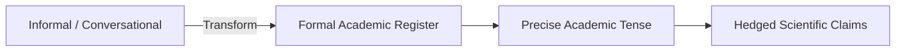

# 👨‍🏫 Instructor Dossier: Asst. Prof. Dr. Haidar Akab Alwan

> **Subject:** 🇬🇧 English Language for Academic & Research Purposes (EN601)  
> **Academic Rank:** Assistant Professor (*أستاذ مساعد دكتور*)  
> **Faculty:** College of Computer Science & Information Technology, University of Wasit  
> **Lecture Slot:** Sunday, 10:30 AM – 11:30 AM (1 Credit Hour)  
> **Status:** Active Coursework Instructor (Semester 1, 2026–2027)

---

## 1. Professional Background & Academic Persona

Asst. Prof. Dr. Haidar Akab Alwan is a specialist in English for Academic Purposes (EAP), academic discourse, and scientific communication. 

His mission for postgraduate computer science students is **not elementary conversational English**, but transforming candidates into **proficient academic communicators** capable of:
- Reading and critiquing dense IEEE/ACM research literature.
- Writing formal thesis proposals, conference abstracts, and journal manuscripts conforming to international publishing standards.
- Delivering polished, persuasive oral presentations during seminars and defending technical decisions before the departmental 3-member committee (*اللجنة الثلاثية*).

---

## 2. Core Textbooks & Technical Focus Areas

```
+-----------------------------------------------------------------------------------------------+
|                                DR. HAIDAR'S CORE CURRICULUM                                   |
+===============================================================================================+
| 1. Primary Reference Book         | "Q: Skills for Success 4 - Reading & Writing" (Oxford)    |
| 2. Academic Word List (AWL)       | Coxhead's 570 Academic Word Families (Sublists 1–10)      |
| 3. Scientific Grammar Framework   | Research tense shifts, hedging, passive voice, nominals   |
| 4. Oral Defense Discourse         | Signposting, handling cross-examination, slide commentary |
| 5. Abstract & Proposal Drafting   | IMRAD structure, concise problem-solution articulation    |
+-----------------------------------------------------------------------------------------------+
```

### Key Syllabus Emphases
1. **Academic Reading Skills:** Skimming for central thesis, scanning for empirical data, determining authorial stance, and contextual vocabulary deduction.
2. **Scientific Register vs. Informal Idioms:** Systematic eradication of conversational colloquialisms (*"get bigger", "a lot of", "really good"*) in favor of formal academic phrasing (*"expand exponentially", "a substantial volume of", "demonstrates superior efficacy"*).
3. **Research Paper Tense System:** Strict enforcement of standard academic tense conventions across the IMRAD (Introduction, Methods, Results, and Discussion) structure.
4. **Hedging & Academic Caution:** Mastering modal verbs (*may, might, could*), tentative verbs (*suggests, indicates, appears*), and epistemic adverbs (*presumably, potentially*) to qualify claims without over-generalization.

---

## 3. Examination Philosophy & Question Formats

Dr. Haidar evaluates both **written academic precision** and **oral communicative competence**.

### Typical Written Exam Question Types

| Question Type | Focus & Cognitive Demand | Example Prototype |
|:---|:---|:---|
| **Academic Text Analysis** | Critical reading of a 400-word computer science excerpt; inference and tone questions. | *"Read the provided passage on Distributed Ledger Security. Identify the author's primary argument and explain how the author hedges the claim in paragraph 3."* |
| **Vocabulary in Academic Context (AWL)** | Choosing correct morphological forms (noun/verb/adjective/adverb) and collocations. | *"Complete the sentence with the appropriate derivative of [CONVERT]: 'The proposed model facilitates seamless ________ of unstructured logs into tabular embeddings.'"* (Answer: *conversion*) |
| **Sentence Restructuring & Register Correction** | Transforming informal, clumsy sentences into formal scientific prose. | *"Rewrite in formal academic English: 'We did an experiment that showed our algorithm is way faster than the old one.'"* $\rightarrow$ *"Empirical evaluation demonstrates that the proposed algorithm significantly outperforms the baseline method in execution throughput."* |
| **Abstract / Summary Drafting** | Condensing a technical case study into a 100-word structured abstract. | *"Write a concise 4-sentence abstract (Background, Method, Key Result, Conclusion) based on the supplied data table."* |

---

## 4. Master-Level Writing & Grammar Protocol

To secure top marks ($\ge 90\%$) in Dr. Haidar's assessments, follow these mandatory rules:



### Rule 1: The 4 Golden Tense Rules in CS Research
1. **Established Scientific Facts & Universal Laws:** *Present Simple*  
   $\rightarrow$ *"Asymmetric encryption relies on mathematically hard problems such as integer factorization."*
2. **Literature Review & Previous Findings:** *Past Simple* (with author names) or *Present Perfect* (without specific names)  
   $\rightarrow$ *"LeCun et al. (1998) introduced convolutional architectures."*  
   $\rightarrow$ *"Several researchers have investigated heuristic optimization for graph partitioning."*
3. **Methodology, Implementation & Experiments Executed:** *Past Simple (Passive)*  
   $\rightarrow$ *"A benchmark suite of 10,000 synthetic transactions was executed across 4 distributed nodes."*
4. **Discussion of Results & Deductions:** *Present Simple with Hedging*  
   $\rightarrow$ *"The experimental telemetry suggests that microservices introduce non-trivial network latency under peak concurrency."*

### Rule 2: Eradicate the "Banned Informal List"
- ❌ **Do NOT write:** *"I think", "In my opinion", "A lot of", "Big difference", "Bad results", "Things", "Stuff"*.
- ✅ **Write instead:** *"The evidence indicates", "A substantial quantity", "A statistically significant divergence", "Suboptimal performance", "Parameters / Artifacts / Metrics"*.

---

## 5. Seminar & Oral Defense Rubric

When presenting or answering questions during Dr. Haidar's classes:
- **Signposting Language:** Use formal transitions (*"Let us now turn our attention to the architectural trade-offs...", "To substantiate this claim, consider the benchmark depicted in Figure 2..."*).
- **Handling Questions:** Use respectful academic rejoinders (*"That is a pertinent question, Dr. Haidar. The trade-off was evaluated by measuring memory footprint..."*).
- **Slide Legibility:** Ensure every Marp slide adheres to academic capitalization, clean bullet syntax, and zero grammatical typos.

---

## 6. Doctor-Specific Agent Tuning Prompt (`@examiner` & `@tutor`)

```yaml
doctor_profile:
  name: "Asst. Prof. Dr. Haidar Akab Alwan"
  subject: "English Language (Academic & Research)"
  rigor_level: "Postgraduate Academic Register (EAP)"
  textbook: "Q: Skills for Success 4 - Reading & Writing"
  pedagogical_focus: "Academic Word List (AWL), scientific tense shifts, hedging, abstract drafting, defense discourse"
  forbidden_patterns:
    - "Informal contractions (don't, can't, it's)"
    - "First-person informal expressions (I believe, in my humble opinion)"
    - "Unhedged absolute claims (This algorithm is 100% perfect)"
  scoring_rubric:
    academic_register_and_vocabulary: 40%
    grammatical_accuracy_and_tenses: 35%
    coherence_and_signposting: 25%
```
