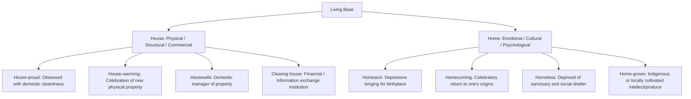

# CS502 / EN601: Unit 01 — The English Tense System, Time Adverbials & Academic Register Analysis

> **Academic Level:** Master of Computer Science (Coursework & Research Preparation)  
> **Institution:** College of Computer Science & Information Technology, University of Wasit  
> **Governing Text:** *New Headway Upper-Intermediate* (Oxford University Press) + *Q: Skills for Success 4*  
> **Focus:** Rigorous tense aspect distinction, time adverbial constraints, and academic vs. informal register translation.

```
+-------------------------------------------------------------------------------------------------------+
|                                    UNIT 01 COMPETENCY ARCHITECTURE                                    |
+-------------------------------------------------------------------------------------------------------+
| Core Grammar: The English Tense Matrix (Simple vs. Continuous, Simple vs. Perfect)                     |
| Temporal Syntax: Adverbial Compatibility Rules (Definite Past vs. Ongoing Indefinite)                 |
| Stylistics: Register Translation (Informal Colloquialisms -> High-Distinction Academic Publishing)    |
| Lexicology: Compound Nouns & Collocations (House vs. Home Semantic Divergence)                        |
+-------------------------------------------------------------------------------------------------------+
```

---

## 1. Executive Summary & Conceptual Bridge (Tier 1)

### 1.1. High-Level Linguistic Synopsis
In academic computer science literature and postgraduate dissertation writing, grammatical precision in verb tense and aspect is not merely an aesthetic concern—it is a functional mechanism for establishing **scientific validity, temporal scope, and epistemic commitment**. Authors utilize specific tenses to signal whether a finding is an immutable empirical fact (*Present Simple*), an experimental procedure localized in a completed study (*Past Simple*), or a continuum of historical research informing the contemporary state of the art (*Present Perfect*).

Mastering the English tense system requires decoupling the naive concept of **Time** (a physical, linear continuum: Past, Present, Future) from grammatical **Aspect** (how the internal temporal structure of an action is framed: Simple, Continuous/Progressive, or Perfect).

---

### 1.2. Intuitive Mental Model & Arabic Conceptual Bridge (*الجسر المفاهيمي والحدسي*)

> **الرؤية اللغوية والحدس التطبيقي للباحث:**  
> ينشأ الارتباك الأكبر لدى الباحثين والطلاب الناطقين باللغة العربية من اختلاف المنظومة الزمنية والجهوية (Tense & Aspect) بين اللغتين:
> 
> * **في اللغة العربية:** يعتمد النظام الفعلي بشكل أساسي على **الجهة (Aspect)** بدلاً من الزمن المجرد، حيث ينقسم الفعل إلى **ماضٍ** (تام الدلالة على حدث وقع وانقطع) و**مضارع** (غير تام، يحتمل الحاضر والمستقبل والاستمرار).
> * **في اللغة الإنكليزية:** توجد مصفوفة ثلاثية الأبعاد: **الزمن (Time: Past, Present, Future)** مضروباً في **الجهة (Aspect: Simple, Continuous, Perfect, Perfect Continuous)** ليعطي 12 قالباً فعلياً دقيقاً.
>
> **العقدة الجوهرية (The Fundamental Bottleneck):**  
> غياب زمن موازٍ تماماً للـ *Present Perfect* في اللغة العربية. يترجم الناطقون بالعربية جملتي:
> 1. *I lived in Baghdad for five years.* (Past Simple: حدث ماضٍ انتهى تماماً والكاتب يعيش في مكان آخر الآن).
> 2. *I have lived in Baghdad for five years.* (Present Perfect: حدث بدأ في الماضي وما زال متصلاً بالحاضر والكاتب يسكن هناك حتى اللحظة).
> بنفس الصيغة غالباً: *"عشت في بغداد لخمس سنوات"*. هذا الخلط يؤدي لأخطاء فادحة في كتابة بحوث الماجستير عند وصف الدراسات السابقة (*Literature Review*) أو منهجية البحث (*Methodology*).

| البعد النحوي | المعنى الوظيفي الدقيق | المقابل المفاهيمي الأكاديمي | خطأ الترجمة الشائع |
|:---|:---|:---|:---|
| **Simple Aspect** | ينظر إلى الفعل ككتلة واحدة مكتملة، حقيقة ثابتة، أو عادة متكررة. | الحقائق العلمية والقوانين الرياضية الثابتة. | استخدامه لوصف تجارب مخبرية ذات مدة زمنية محددة. |
| **Continuous Aspect** | ينظر إلى الفعل من الداخل، مبرزاً الاستمرارية، المؤقتية، أو عدم الاكتمال. | العمليات المؤقتة أثناء القياس والاختبار. | الإفراط في استخدامه مع أفعال الحالة (*State Verbs*). |
| **Perfect Aspect** | يربط بين نقطتين زمنيتين (غالباً الماضي بالحاضر)، مبرزاً الأثر أو النتيجة. | تطور الأبحاث السابقة حتى نقطة كتابة البحث الحالي. | استبداله بالماضي البسيط عند غياب تاريخ محدد. |

---

## 2. Theoretical Linguistic Architecture (Tier 2)

### 2.1. The 12-Tense Aspect Matrix
The English verb phrase operates on two binary parameters intersecting with three temporal axes:
* **$\pm$ Continuous:** $[\text{BE} + \text{V-ing}]$ (Frames action as ongoing, temporary, or in-flight).
* **$\pm$ Perfect:** $[\text{HAVE} + \text{V-ed/V3}]$ (Frames action as completed prior to a designated reference point, possessing active relevance to that point).

| Tense Frame | Simple Aspect ($\varnothing$) | Continuous Aspect ($[\text{BE} + \text{V-ing}]$) | Perfect Aspect ($[\text{HAVE} + \text{V3}]$) | Perfect Continuous ($[\text{HAVE} + \text{BEEN} + \text{V-ing}]$) |
|:---|:---|:---|:---|:---|
| **Present** | *The algorithm routes packets via Dijkstra's shortest path.* (Universal law) | *The GPU is overheating due to unoptimized thread allocation.* (Temporary state) | *Researchers have proposed several neural pruning mechanisms.* (Past to present relevance) | *The cluster has been running benchmarks since Monday.* (Duration up to now) |
| **Past** | *Turing formulated the Halting Problem in 1936.* (Isolated historic event) | *The server was dropping connections during the benchmark.* (Duration in the past) | *The adversary had breached the perimeter before the IDS triggered.* (Past-prior-to-past) | *The nodes had been transmitting for hours before packet loss spiked.* (Duration prior to past event) |
| **Future** | *The scheduled cron job will execute at midnight.* (Neutral prediction / plan) | *The simulation will be collecting metrics throughout the trial.* (In-flight future action) | *The cluster will have converged before Epoch 50.* (Completion before future point) | *By December, the model will have been training for six weeks.* (Duration reaching future point) |

---

### 2.2. State Verbs vs. Dynamic Verbs (Crucial Constraint)
In English, verbs are taxonomized into:
1. **Dynamic Verbs (أفعال الحركة والنشاط):** e.g., *run, compile, execute, transmit, evaluate*. They admit both Simple and Continuous forms freely (*is executing, executes*).
2. **State Verbs (أفعال الحالة والملكية والإدراك):** e.g., *contain, consist, know, understand, prefer, believe, resemble, possess, want*.
   * **The Golden Rule:** State verbs **resist the Continuous Aspect** unless their semantic core shifts to a dynamic activity.
   * *Incorrect:* $\times$ *This framework is containing three microservices.*
   * *Correct:* $\checkmark$ *This framework contains three microservices.*
   * *Incorrect:* $\times$ *He is wanting his cell phone.* (From Max's worksheet)
   * *Correct:* $\checkmark$ *He wants his cell phone.*

---

## 3. Systematic Analysis of "Test Your Grammar" Diagnostic (Worksheet Page 6)

The Oxford diagnostic worksheet (`CamScanner Scan - Grammar Worksheet (No Place Like Home).pdf`) evaluates the student's syntactic command of **Time Adverbials** and their deterministic constraints upon verb tenses.

```
+=======================================================================================================+
|                                  TIME ADVERBIAL COMPATIBILITY MATRIX                                  |
+=======================================================================================================+
| Adverbial Category           | Permissible Tense Categories          | Forbidden Combinations         |
|------------------------------|---------------------------------------|--------------------------------|
| Definite Past Point          | Past Simple, Past Continuous          | Present Perfect, Present Simple|
| Indefinite Frequency         | Present Simple, Past Simple           | Continuous (generally)         |
| Open Duration (Since / For)  | Present Perfect, Present Perfect Cont | Past Simple (if still active)  |
| Definite Future Marker       | Present Cont (Arrangement), Will, Due | Past Simple, Present Perfect   |
+=======================================================================================================+
```

### 3.1. Detailed Sentence-by-Sentence Breakdown & Oxford Solutions

#### Sentence 1: *"My parents met in Paris..."*
* **Verb Phrase:** *met* (Past Simple — completed, punctual event).
* **Compatible Adverbials:**
  * $\checkmark$ `in the 1970s` (Definite historical decade).
  * $\checkmark$ `ages ago` (Indefinite distant past point with *ago*).
  * $\checkmark$ `during a snowstorm` (Specific past temporal circumstance).
* **Incompatible:** `never`, `tonight`, `for a year`, `since I was a child`.

#### Sentence 2: *"They travel abroad..."*
* **Verb Phrase:** *travel* (Present Simple — habitual routine / timeless disposition).
* **Compatible Adverbials:**
  * $\checkmark$ `never` (Zero-frequency adverb of habit).
  * $\checkmark$ `frequently` (High-frequency adverb of habit).
  * $\checkmark$ `sometimes` (Medium-frequency adverb of habit).
* **Pedagogical Note:** Frequency adverbs sit between the subject and the main verb (*They frequently travel abroad*).

#### Sentence 3: *"They were working in Canada..."*
* **Verb Phrase:** *were working* (Past Continuous — temporary duration or interrupted activity in past time).
* **Compatible Adverbials:**
  * $\checkmark$ `when I was born` (Time clause providing the point of background interruption).
  * $\checkmark$ `in the 1970s` (Bounded historical frame viewed as temporary activity).
  * $\checkmark$ `for ages` (Perceived extended duration).
  * $\checkmark$ `recently` (Temporary state in near past).
  * $\checkmark$ `for a year` (Explicit duration emphasizing temporary tenure).
* **Oxford Pedagogical Note:** Students are often surprised that *for a year* can combine with Past Continuous. It is used intentionally to emphasize that the activity was **temporary and uncompleted at the reference time**, whereas Past Simple (*worked*) would treat it as a closed, finished milestone.

#### Sentence 4: *"I was born in Montreal..."*
* **Verb Phrase:** *was born* (Past Simple passive — unrepeatable punctual past milestone).
* **Compatible Adverbials:**
  * $\checkmark$ `in the 1970s`
  * $\checkmark$ `ages ago`
  * $\checkmark$ `during a snowstorm`
* **Incompatible:** `for a year` (A birth cannot extend over a year), `since I was a child` (A birth cannot happen continuously since childhood).

#### Sentence 5: *"My grandparents have lived in Ireland..."*
* **Verb Phrase:** *have lived* (Present Perfect Simple — past action with continued relevance or uninterrupted continuity into the present).
* **Compatible Adverbials:**
  * $\checkmark$ `never` (*My grandparents have never lived in Ireland* — life experience up to now).
  * $\checkmark$ `recently` (Near-past action with active repercussions).
  * $\checkmark$ `for ages` (Duration starting in past and continuing to present).
  * $\checkmark$ `for a year` (Duration up to present).
  * $\checkmark$ `since I was a child` (Starting point anchoring the continuum to the speaker's childhood).

#### Sentence 6: *"I wrote to my grandmother..."*
* **Verb Phrase:** *wrote* (Past Simple — completed act of correspondence).
* **Compatible Adverbials:**
  * $\checkmark$ `the other day` (Idiomatic English for *a few days ago*).
  * $\checkmark$ `in the 1970s`
  * $\checkmark$ `ages ago`
  * $\checkmark$ `during a snowstorm`
  * $\checkmark$ `recently`
  * $\checkmark$ `never` / `frequently` / `sometimes` (*I frequently wrote to my grandmother* — past habitual routine).

#### Sentence 7: *"I'm going to work in the US..."*
* **Verb Phrase:** *am going to work* (Be going to — future intention, premeditated decision, or certainty based on present evidence).
* **Compatible Adverbials:**
  * $\checkmark$ `in a fortnight's time` (*A fortnight* = 14 days / 2 weeks; standard British academic temporal term).
  * $\checkmark$ `for a year` (Duration of the intended future appointment).
  * $\checkmark$ `later` (Indefinite future point).
  * $\checkmark$ `never` (*I'm never going to work in the US* — absolute negation of future intent).

#### Sentence 8: *"My brother's flying to Abu Dhabi on business..."*
* **Verb Phrase:** *is flying* (Present Continuous with future reference — fixed, scheduled arrangement with confirmed tickets/visas).
* **Compatible Adverbials:**
  * $\checkmark$ `tonight` (Immediate scheduled future).
  * $\checkmark$ `in a fortnight's time` (Scheduled date).
  * $\checkmark$ `later` (Broader future arrangement).
  * $\checkmark$ `frequently` (*My brother's frequently flying...* — expressive habitual annoyance or repeated routine).

#### Sentence 9: *"He's been learning Arabic..."*
* **Verb Phrase:** *has been learning* (Present Perfect Continuous — activity commenced in past, unbroken duration, active in progress at the moment of speaking).
* **Compatible Adverbials:**
  * $\checkmark$ `for ages` (Extended duration).
  * $\checkmark$ `for a year` (Specific duration).
  * $\checkmark$ `since I was a child` (Starting anchor).
  * $\checkmark$ `recently` (Current active trend).
* **Linguistic Rule:** Cannot take punctual past dates (*in 1995*) without the preposition *since* (*since 1995*).

#### Sentence 10: *"I'll see you..."*
* **Verb Phrase:** *will see* (Future Simple / Modal *will* — spontaneous decision, promise, or casual social sign-off).
* **Compatible Adverbials:**
  * $\checkmark$ `tonight`
  * $\checkmark$ `in a fortnight's time`
  * $\checkmark$ `later`
  * $\checkmark$ `sometimes` / `frequently` / `never` (*I'll never see you again*).

---

## 4. Register Analysis: Academic Scientific Prose vs. Informal Correspondence

The second half of Worksheet Page 6 features a personal letter written by Max from "Grove Hill Summer Camp":

```
Tuesday, 9.00pm
Hi Mom, Hi Dad!
Been here two days but seems like FOREVER - it's kind of boring and I'm feeling 
very homesick - more homesick than last year 'cause at Pine Trees we had more 
exciting stuff to do. Here we have an activity called 'extreme sun tanning', where 
you sit outside for two hours and do nothing. We also have an activity called 
'sitting around playing chess'. Last year we did stuff like archery and mountain 
biking. I'm still hanging in there, though. Got to go to sleep now. We're making 
chocolate chip pancakes for breakfast tomorrow.
Love you lots, Max xxxxxx
P.S. Could you send me more money? Oh, and my cell phone. ALL the other kids have 
their cell phones!
```

### 4.1. Linguistic Dissection of Informal Structures (Why They Fail in Academic Writing)

1. **Ellipsis (إسقاط الفاعل أو الفعل المساعد):**
   * *Worksheet Text:* *"Been here two days..."* / *"Got to go to sleep now."*
   * *Syntactic Defect:* The grammatical subject (*I*) and auxiliary verb (*have*) are omitted. Permissible only in spoken/informal notes.
   * *Academic Requirement:* Every independent clause must maintain an explicit subject and conjugated verb. $\rightarrow$ *"The author has conducted the trial over a forty-eight-hour period."*

2. **Colloquial Contractions & Phonological Reductions:**
   * *Worksheet Text:* *'cause*, *kind of*, *I'm*.
   * *Academic Rule:* Contractions are strictly forbidden in formal dissertation prose. Must be written in full: *because*, *somewhat / moderately*, *I am / the researcher is*.

3. **Vague Lexical Pro-Forms (*Stuff*, *Things*):**
   * *Worksheet Text:* *"...we had more exciting stuff to do."*
   * *Academic Rule:* The word *stuff* has zero information density. Master's candidates must replace general nouns with precise technical nomenclature: *methodologies, protocols, benchmarks, experimental activities*.

4. **Idiomatic Phrasal Expressions:**
   * *Worksheet Text:* *"hanging in there"*, *"sitting around"*.
   * *Academic Equivalent:* Latinate single-verb equivalents are demanded: *enduring, persisting, remaining inactive*.

### 4.2. Corpus Comparison: Register Translation Table

| Informal / Colloquial Register (Worksheet) | Functional Pragmatic Meaning | Formal Academic Register (Master's Publication Tier) |
|:---|:---|:---|
| *"Been here two days but seems like FOREVER"* | Extreme psychological perception of duration | *"The temporal duration of the preliminary observation phase proved substantial."* |
| *"...more homesick than last year 'cause..."* | Causal relationship comparing two trials | *"Heightened emotional distress was observed relative to the antecedent baseline, owing to..."* |
| *"...did stuff like archery and mountain biking"* | Exemplification of physical activity | *"Engaged in rigorous physical protocols, exemplified by archery and cross-country cycling."* |
| *"I'm still hanging in there, though."* | Persistence under adversity | *"Nevertheless, system equilibrium has been successfully sustained under operational stress."* |
| *"We're making chocolate chip pancakes tomorrow."* | Scheduled future arrangement | *"The subsequent phase of the schedule entails the execution of culinary operations."* |

---

## 5. Lexicology: Compound Nouns with *House* and *Home*

A central lexical theme of Unit 1 is the morphological synthesis of compound nouns and adjectives rooted in the semantic dichotomy between **House** (physical building, corporate structure, concrete asset) and **Home** (emotional sanctuary, birthplace, psychological refuge).



### 5.1. Academic Collocation & Context Matrix

| Compound Term | Part of Speech | Precise Definition | Academic / Contextual Sentence |
|:---|:---:|:---|:---|
| **Homesick** | Adjective | Experiencing emotional grief or depression due to separation from home. | *International postgraduate scholars frequently experience acute homesickness during the initial semester.* |
| **House-proud** | Adjective | Overly attentive to the cleanliness and visual decoration of one's dwelling. | *The demographic analysis revealed that house-proud homeowners allocate 14% more capital to interior refurbishment.* |
| **Homecoming** | Noun | The return of a person, group, or alumni to their native environment. | *The university hosted an annual homecoming symposium celebrating distinguished alumni innovations.* |
| **House-warming** | Noun | A social gathering held shortly after moving into a new residence. | *The gathering functioned as an informal house-warming ceremony for the newly recruited faculty members.* |
| **Home-grown** | Adjective | Developed or produced locally within an institution or nation; not imported. | *The faculty prioritized the adoption of home-grown intrusion detection algorithms over proprietary foreign suites.* |
| **Homelessness** | Noun | The state of lacking permanent, secure housing. | *Algorithmic urban modeling was deployed to forecast seasonal fluctuations in municipal homelessness.* |

---

## 6. Official Oxford Solutions & Question Tense Guide (Worksheet Page 6, Ex 2)

Below are the definitive, verified solutions to the reading comprehension and grammatical question-formation task based on Max's letter, cross-referenced with the *Oxford Teacher's Book (Answer Key)*:

1. **Question 1:**  
   *Prompt:* `'How long ______ Max ______ at summer camp?'`  
   *Answer:* **`'How long has Max been at summer camp?'`**  
   *Response:* `'Just two days.'`  
   *Grammatical Justification:* **Present Perfect Simple** ($[\text{has}] + [\text{been}]$) is required because Max arrived in the past and is *still at the camp right now*. Past Simple (*How long was Max...*) would incorrectly imply he has already departed.

2. **Question 2:**  
   *Prompt:* `'______ he ______ a good time?'`  
   *Answer:* **`'Is he having a good time?'`**  
   *Response:* `'No, not really. He's feeling very homesick.'`  
   *Grammatical Justification:* **Present Continuous** ($[\text{Is}] + [\text{having}]$) is employed because *have* here signifies a dynamic experience (*having a good time* = enjoying oneself), not static possession.

3. **Question 3:**  
   *Prompt:* `'Is this his first time at summer camp?'`  
   *Answer:* `'No, it's not. He's been once before. Last year he ______ to Pine Trees.'`  
   *Answer Fill:* **`went`**  
   *Grammatical Justification:* The first sentence utilizes Present Perfect (*He has been once before*) to state unanchored lifetime experience. The second sentence must shift to **Past Simple (*went*)** because the temporal marker is explicitly bounded (*Last year*).

4. **Question 4:**  
   *Prompt:* `'______ he ______ it at Pine Trees?'`  
   *Answer:* **`'Did he like it at Pine Trees?'`**  
   *Response:* `'Oh, yes, he did, very much.'`  
   *Grammatical Justification:* **Past Simple question inversion** ($[\text{Did}] + [\text{Subject}] + [\text{Base Verb}]$) referencing a closed historical episode.

5. **Question 5:**  
   *Prompt:* `'Why was that?'`  
   *Answer:* `'Because they ______ things like archery and mountain biking.'`  
   *Answer Fill:* **`did`**  
   *Grammatical Justification:* Past Simple (*did*) describing the completed curriculum of activities at the prior camp.

6. **Question 6:**  
   *Prompt:* `'What's he ______ tomorrow?'`  
   *Answer:* **`'What's he doing tomorrow?'`**  
   *Response:* `'He's making pancakes.'`  
   *Grammatical Justification:* **Present Continuous for fixed future arrangement** ($[\text{'s doing}] / [\text{'s making}]$). In English, pre-planned scheduled events taking place in the immediate future are predominantly conveyed via the Present Continuous rather than *will*.

7. **Question 7:**  
   *Prompt:* `'Why ______ he ______ his cell phone?'`  
   *Answer:* **`'Why does he want his cell phone?'`**  
   *Response:* `'Because all the other kids have theirs.'`  
   *Grammatical Justification:* **Present Simple** ($[\text{does}] + [\text{want}]$). *Want* is a cognitive state verb; constructing it as continuous (*Why is he wanting...*) violates standard English syntactic grammar.

---

## 7. Spaced Repetition Flashcards (Anki / TSV Bank)

```tsv
Target Tense	Temporal Adverbial Trigger	Correct Academic Example	Linguistic Rule
Past Simple	in the 1970s / ages ago	The original ARPANET node was commissioned in 1969.	Requires a closed, completed historical point in past time.
Present Perfect	for five years / since 2020	Neural network research has accelerated since 2012.	Action commenced in past with unbroken relevance to present moment.
Present Continuous	tomorrow / tonight	The research team is deploying the pilot system tomorrow.	Conveys confirmed future arrangements with fixed logistical commitment.
State Verbs	contain / belong / understand	The packet header contains a 32-bit destination IP.	State verbs resist continuous forms unless shifting to active dynamic conduct.
Present Perfect Continuous	for ages / all morning	The cluster has been ingesting telemetry data for six hours.	Emphasizes ongoing, in-progress duration without focusing on completion.
Past Continuous Interruption	when / while	The server was synchronizing logs when the power fault occurred.	Background in-flight activity interrupted by a punctual Past Simple event.
```

---

## 8. Self-Assessment & Exam Checklist

- [ ] Can you articulate why Arabic learners mistakenly substitute Past Simple for Present Perfect?
- [ ] Can you classify all 15 time adverbials from the Oxford worksheet into their permissible tense categories?
- [ ] Why is *I am wanting* grammatically defective while *I am having lunch* is standard?
- [ ] How does the semantic scope of *house-proud* differ fundamentally from *homesick*?
- [ ] In dissertation abstracts, what specific tense must be chosen when referring to a milestone achieved in an authored experiment vs. an accepted universal principle?
