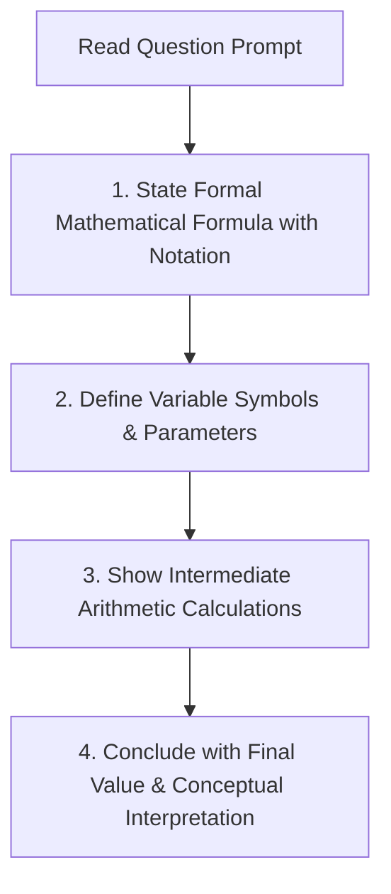

# 👨‍🏫 Instructor Dossier: Asst. Prof. Dr. Ahmed Shakir Abd Al-Rida

> **Subject:** ⛏️ Data Mining & Knowledge Discovery (CS602)  
> **Academic Rank:** Assistant Professor (*أستاذ مساعد دكتور*)  
> **Faculty:** College of Computer Science & Information Technology, University of Wasit  
> **Lecture Slot:** Monday, 08:30 AM – 10:30 AM (2 Credit Hours)  
> **Status:** Active Coursework Instructor (Semester 1, 2026–2027)

---

## 1. Professional Background & Academic Persona

Asst. Prof. Dr. Ahmed Shakir Abd Al-Rida is a specialist in machine learning, data mining, pattern recognition, and knowledge discovery in databases (KDD).

His pedagogical framework is **rigorously textbook-anchored, mathematically precise, and definition-critical**. He adheres strictly to the classic reference by **Jiawei Han, Micheline Kamber, and Jian Pei** (*Data Mining: Concepts and Techniques*, Morgan Kaufmann).

Dr. Ahmed places immense value on:
- Formal, unambiguous mathematical definitions of data structures and attribute types.
- Step-by-step manual execution of data preprocessing and normalization algorithms.
- Clear geometric and statistical intuition behind distance and similarity metrics.
- Feature extraction pipelines from raw domain signals (e.g., medical imagery texture analysis).

---

## 2. Core Textbook & High-Yield Examination Domains

```
+-----------------------------------------------------------------------------------------------+
|                                DR. AHMED'S CORE KNOWLEDGE DOMAINS                             |
+===============================================================================================+
| 1. Primary Textbook               | Han, Kamber & Pei: "Data Mining: Concepts and Techniques" |
| 2. Attribute Taxonomy & Metrics   | Nominal, Binary, Ordinal, Interval vs Ratio, Distances    |
| 3. Data Preprocessing Pipeline    | Cleaning (binning), Integration (Chi-sq), Normalization   |
| 4. Frequent Pattern Mining        | Apriori candidate generation, support/confidence, FP-Tree |
| 5. Classification & Clustering    | Decision Trees (Entropy/Gain), Naive Bayes, K-Means       |
+-----------------------------------------------------------------------------------------------+
```

### Key Syllabus Emphases
1. **Data Object & Attribute Classification:** Precise formal boundaries between:
   - *Nominal attributes* (categories without ranking, e.g., marital status, color).
   - *Binary attributes* (Symmetric vs. Asymmetric binary, e.g., medical test outcomes).
   - *Ordinal attributes* (ranked categories where distance between ranks is unknown, e.g., customer satisfaction ratings).
   - *Numeric: Interval-Scaled vs. Ratio-Scaled* (Zero is arbitrary in Interval like Celsius; Zero is an absolute physical zero in Ratio like Kelvin, salary, weight).
2. **Data Normalization Mathematics:** Exact manual computation of:
   - Min-Max Normalization: $v' = \frac{v - \min_A}{\max_A - \min_A} (\text{new\_max}_A - \text{new\_min}_A) + \text{new\_min}_A$
   - Z-score Normalization (Standard Deviation): $v' = \frac{v - \bar{A}}{\sigma_A}$
   - Z-score with Mean Absolute Deviation ($s_A$): $v' = \frac{v - \bar{A}}{s_A}$ where $s_A = \frac{1}{n} \sum_{i=1}^n |x_i - \bar{A}|$
   - Decimal Scaling: $v' = \frac{v}{10^j}$ where $j$ is the smallest integer such that $\max(|v'|) < 1$.
3. **Statistical Independence & Redundancy:** Computing Pearson correlation $r_{A,B}$, Covariance $\text{Cov}(A,B)$, and Chi-Square statistic:
   $$\chi^2 = \sum_{i=1}^c \sum_{j=1}^r \frac{(O_{ij} - E_{ij})^2}{E_{ij}}, \quad \text{where } E_{ij} = \frac{\text{count}(A=a_i) \times \text{count}(B=b_j)}{n}$$
4. **Dissimilarity Matrices for Mixed Attributes:** Combining nominal, numeric, and ordinal attributes into a unified distance matrix using Gower's similarity coefficient or normalized Minkowski distance ($L_p$).

---

## 3. Examination Philosophy & Question Formats

Dr. Ahmed’s exams feature a balanced mix of **rigorous definitional differentiation** and **step-by-step numerical calculation problems**.

### Typical Question Prototypes

| Format | Cognitive Target | Question Prototype |
|:---|:---|:---|
| **Mathematical Normalization Problem** | Manual arithmetic precision | *"Given the attribute values $A = \{12, 24, 33, 45, 60\}$: (a) Compute the Min-Max normalization for $v = 33$ into the range $[0.0, 1.0]$. (b) Compute the Z-score normalized value for $v = 33$ using Mean Absolute Deviation."* |
| **Definitional Differentiation** | Exact conceptual boundaries | *"State the formal mathematical difference between Interval-scaled and Ratio-scaled numeric attributes. Provide two concrete real-world computer science examples for each."* |
| **Statistical Independence Test** | $\chi^2$ hypothesis testing | *"Given the following $2 \times 2$ contingency table of Customer Gender vs. Software Purchase, calculate the Chi-Square ($\chi^2$) statistic and determine if the attributes are statistically dependent at $\alpha = 0.05$ (Degrees of Freedom = 1, Critical Value = 3.84)."* |
| **Feature Extraction Workflow** | Applied data preparation | *"Illustrate the complete feature extraction and data preparation pipeline for classifying lung nodule malignancy from 2D CT scans."* |
| **Apriori Algorithm Execution** | Candidate generation & pruning | *"Given a transactional database $T$ with minimum support $= 2$: (a) Trace the candidate itemset generation $C_k$ and frequent itemset generation $L_k$ for $k=1,2,3$. (b) Extract all strong association rules with minimum confidence $= 70\%$."* |

---

## 4. Master-Level Exam Answering Protocol



### The 4 Golden Rules for Dr. Ahmed's Exams:
1. **Rule 1: Always Write the Symbolic Equation First:** Never jump directly into numerical calculation. Write out $\chi^2 = \sum \frac{(O - E)^2}{E}$ or $v' = \frac{v - \min_A}{\max_A - \min_A}$.
2. **Rule 2: Document Intermediate Calculations:** If calculating standard deviation $\sigma_A$, show the variance calculation $\sigma_A^2 = \frac{1}{n} \sum (x_i - \bar{x})^2$ in a structured mini-table.
3. **Rule 3: Use Han & Kamber Terminology:** Use standard terms (*"Information Gain", "Entropy", "Gini Index", "Support Count", "Asymmetric Binary Attribute"*). Avoid inventing ad-hoc terms.
4. **Rule 4: State the Units & Edge Conditions:** Always specify whether normalized values fall in $[0, 1]$ or $[-1, 1]$, and state what happens if $\sigma = 0$ (constant attribute).

---

## 5. Seminar & Presentation Expectations

- **Presentation Style:** Structured slide flow based on Han & Kamber chapters or recent IEEE TKDE / ACM SIGKDD papers.
- **Key Requirement:** Every presentation must include an algorithmic walkthrough (pseudocode + trace table) and an empirical benchmark comparing runtime or accuracy against baseline techniques.

---

## 6. Doctor-Specific Agent Tuning Prompt (`@examiner` & `@tutor`)

```yaml
doctor_profile:
  name: "Asst. Prof. Dr. Ahmed Shakir Abd Al-Rida"
  subject: "Data Mining & Knowledge Discovery"
  rigor_level: "Postgraduate (Han & Kamber Standard)"
  reference: "Data Mining: Concepts and Techniques (3rd/4th Edition)"
  exam_focus: "Attribute taxonomy proofs, manual normalization math, Chi-square independence tests, Apriori rule generation"
  scoring_rubric:
    mathematical_formula_and_derivation: 40%
    calculation_precision_and_steps: 30%
    textbook_definitional_accuracy: 30%
```
