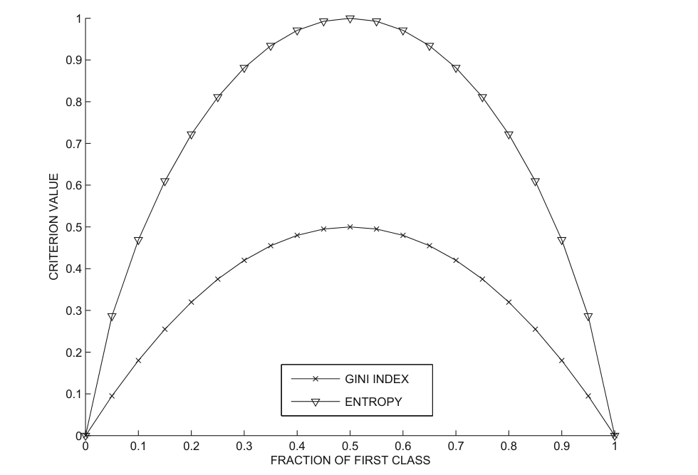
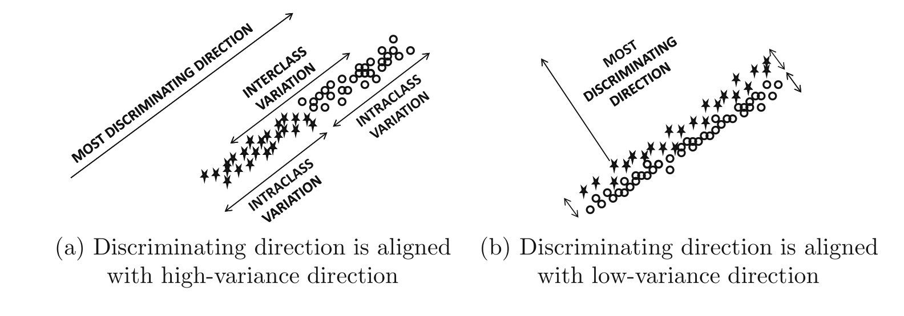
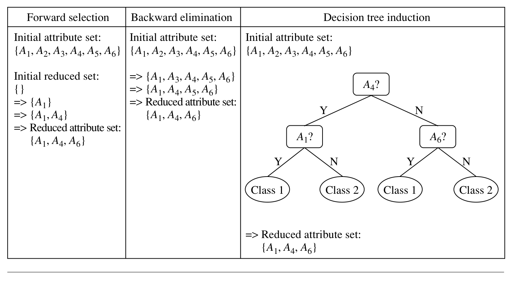
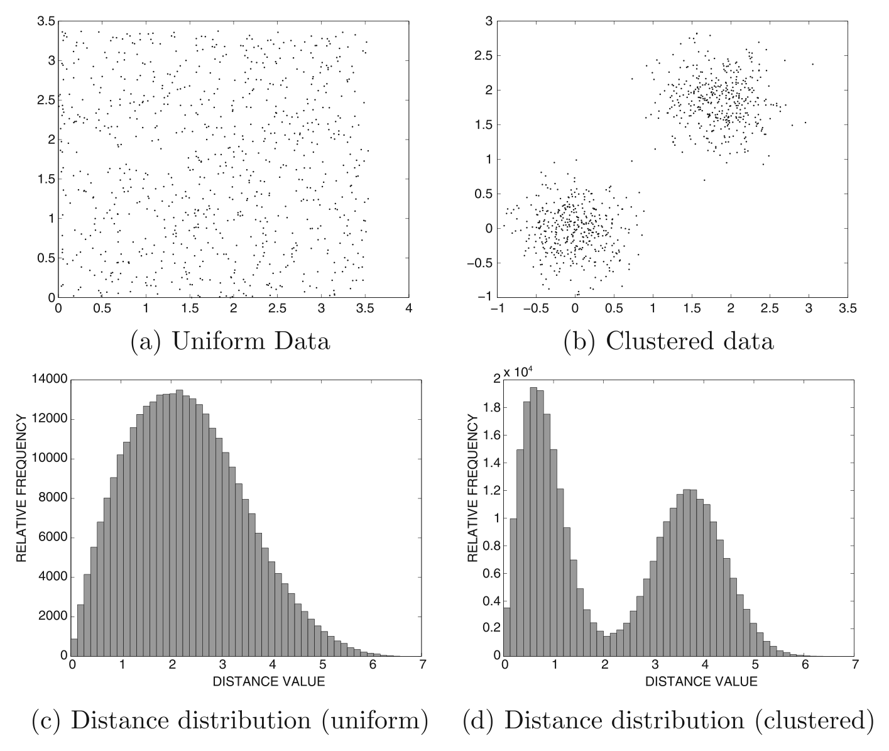

# Data Mining — Feature Selection Techniques
## اختيار الميزات — ملزمة شرح معمّقة

> **Instructor:** Asst. Prof. Dr. Ahmed Shakir Abd Al-Rida
> **Course:** `03_Data_Mining` (CS602) — 2 Credit Hours
> **Topic:** Feature Selection Techniques — the announced **seminar** topic. The doctor gave no further lecture material, so **this note is the lecture**.
> **Week note:** the doctor's delivery order puts this right after Week 03; the syllabus roadmap places "Feature Selection / Attribute Subset Selection" inside its Week 06 (Data Reduction). Week number is **provisional**.
>
> **Sources (the two books):**
> 1. **Han, Kamber & Pei**, *Data Mining: Concepts and Techniques*, 3rd ed., Morgan Kaufmann, 2011 — **§3.4.4 Attribute Subset Selection** (printed pp. 103–105).
> 2. **Aggarwal**, *Data Mining: The Textbook*, Springer, 2015 — **§10.2 Feature Selection for Classification** (pp. 287–293), **§6.2 Feature Selection for Clustering** (pp. 155–158), **§2.4.2** (p. 40).
>
> **Cross-links:** `Week_02_Data_Types_and_Preparation.md` §7, `Week_03_Feature_Extraction_and_Portability.md`.

---

## المحتويات

| # | القسم | من وين |
|:--:|:---|:---|
| 0 | [Where this sits — القصة التي أوصلتنا إلى هنا](#0) | ربط |
| 1 | [المشكلة: الأعمدة غير المرتبطة والمكرّرة](#1) | H&K p.103 · Aggarwal §2.4.2 |
| 2 | [ما هي Feature Selection — وشجرة العائلة](#2) | H&K p.105 · W02 §7 |
| 3 | [الهدف الرسمي للاختيار](#3) | H&K p.104 |
| 4 | [لماذا صعب؟ انفجار 2ⁿ](#4) | H&K p.104 · Aggarwal §10.2.1 |
| 5 | [كيف نُقيّم عموداً — الدلالة الإحصائية ومكسب المعلومة](#5) | H&K p.104 |
| 6 | [مقاييس الفلتر — Gini و Entropy (مع مثال محسوب)](#6) | Aggarwal §10.2.1.1–.2 |
| 7 | [Fisher score و Fisher's Linear Discriminant](#7) | Aggarwal §10.2.1.3–.4 |
| 8 | [كيف نبحث — الطرق الأربعة (مع تتبّع مُدرَّج)](#8) | H&K pp.104–105 · Fig 3.6 |
| 9 | [Filter vs Wrapper vs Embedded](#9) | Aggarwal §10.2.1–.3 |
| 10 | [الاختيار حسب المهمة — تصنيف أم تجميع](#10) | Aggarwal §10.2 · §6.2 |
| 11 | [Attribute Construction — الابن العمّ](#11) | H&K p.105 |
| 12 | [فخاخ الامتحان والأجوبة الآمنة](#12) | مُجمّع |
| 13 | [عدسة الامتحان — كيف يُختبر هذا الموضوع](#13) | تحليلي |
| 14 | [من النظرية إلى التطبيق — سير عمل الاختيار](#14) | مُجمّع |
| 15 | [Retrieval set — بنك الأسئلة](#15) | 14 سؤال |
| 16 | [Cross-links](#16) | ربط |

---

# 0. Where This Sits — القصة التي أوصلتنا إلى هنا

The Data-Mining course walks the **KDD** lifecycle from raw data to knowledge. Weeks 01–02 established *what a data object is* and *what an attribute is*; Week 03 asked how to **build** a representation an algorithm can digest. This topic attacks the *other* half of the same problem: once the data is represented, **not every column deserves to be there**.

> **The one problem, carried through this whole note:** a table can have hundreds of columns, and most of them do not earn their place. We want the **smallest set of columns that still tells the algorithm everything it needs** — but finding that set is combinatorially explosive, so we must **score** features and **search** for a subset intelligently.

**The arc of the note:**

1. **Why** columns hurt (§1) →
2. **What** selection actually is, vs its cousins (§2) →
3. **The exact goal** (§3) →
4. **Why brute force dies** (§4) →
5. **How to score one feature** (§5–§7) →
6. **How to search the space** (§8) →
7. **How the score ties to the model** (§9) →
8. **How the task changes the rule** (§10) →
9. **The neighbour technique** — construction (§11) →
10. **How it is examined** (§13) and **applied** (§14).

القصة تبلش من سؤال هندسي بسيط: عندنا جدول بيانات، والأعمدة هواي. المشكلة مو "الزحمة" وبس — المشكلة إنّ الأعمدة الزايدة **تضرّ**: تبطّئ الخوارزمية، وتشوّش عليها، وتطلّع أنماط رديئة. فنسأل: **أصغر مجموعة أعمدة** تحافظ على المعلومة المهمة شنو؟ وهنا تنكشف صعوبة رياضية: عدد المجموعات الممكنة = 2ⁿ (انفجار). فنلجأ لطريقتين: (١) نعطي كل عمود **درجة** (score) تبيّن شكد يفيد، (٢) **نبحث** بالفضاء بطريقة ذكية (greedy) مو عشوائية. وآخر شي نكتشف إنّ الدرجة إذا كانت **مستقلّة عن النموذج** نسميها Filter، وإذا **تعتمد عليه** نسميها Wrapper، وإذا ظهرت من داخل التدريب نفسه نسميها Embedded. هذا العمود الفقري — وكل الأقسام الجاية تفصّله.

---

# 1. المشكلة: الأعمدة غير المرتبطة والمكرّرة

A real dataset may carry **hundreds of attributes**, and many are worthless for the task at hand.

> **Verbatim (H&K p.103):** *"Data sets for analysis may contain hundreds of attributes, many of which may be irrelevant to the mining task or redundant. For example, if the task is to classify customers based on whether or not they are likely to purchase a popular new CD at AllElectronics when notified of a sale, attributes such as the customer's telephone number are likely to be irrelevant, unlike attributes such as age or music taste. Although it may be possible for a domain expert to pick out some of the useful attributes, this can be a difficult and time-consuming task, especially when the data's behavior is not well known. (Hence, a reason behind its analysis!)"*

> **Verbatim (H&K p.103):** *"Leaving out relevant attributes or keeping irrelevant attributes may be detrimental, causing confusion for the mining algorithm employed. This can result in discovered patterns of poor quality. In addition, the added volume of irrelevant or redundant attributes can slow down the mining process."*

### Two different diseases — never merge them

| Disease | Definition | AllElectronics example | Concrete cost |
|:--|:--|:--|:--|
| **Irrelevant** | the attribute has **no relationship** to the target | `customer's telephone number` | adds pure noise; the model may fit spurious patterns |
| **Redundant** | the attribute **duplicates** information already carried by another | `age` ↔ `date of birth`; `height (cm)` ↔ `height (in)` | adds nothing new; inflates dimensionality and runtime |

### The two consequences H&K names explicitly

1. **Quality** — *"discovered patterns of poor quality"*: an algorithm fed noise will happily report a relationship that is not there.
2. **Cost** — *"can slow down the mining process"*: more dimensions means more computation on every step.

### Why the expert cannot simply be asked

H&K concede that a domain expert *can* sometimes hand-pick attributes — but the job is *"difficult and time-consuming … especially when the data's behavior is not well known"*. That last clause is the entire reason Data Mining exists: we are exploring data whose structure we do **not** already know. So the selection must be **automatic**.

> **Verbatim (Aggarwal §2.4.2, p.40):** *"Some features can be discarded when they are known to be irrelevant. Which features are relevant? Clearly, this decision depends on the application at hand."*

المشكلة مو "تخاف من الزحمة" — المشكلة **ضرر حقيقي** بنتيجتين صريحتين يذكرهنّ H&K: (١) **جودة رديئة** — الخوارزمية تتعلّم من الضجيج وتطلّع علاقة مو موجودة أصلاً؛ (٢) **بطء** — كل بُعد زايد يعني حساب أكثر بكل خطوة.
نوعين من الأعمدة السيئة، ولازم تفرّق بينهم بالامتحان:
- **غير مرتبطة (Irrelevant):** ماكو أي علاقة بين العمود والهدف — مثل رقم تلفون الزبون وأنت تريد تتوقع إذا راح يشتري. هذا **ضجيج خالص**.
- **مكرّرة (Redundant):** العمود يعطيك نفس المعلومة اللي عمود ثاني يعطيها أصلاً — مثل العمر وتاريخ الميلاد (واحد يشتق من الثاني)، أو الطول بالسنتيمتر والإنچ. هذا ما يضيف معلومة، بس يكبّر الأبعاد.
وليش ما نسأل الخبير؟ لأنّ H&K نفسه يقول: الخبير **أحياناً** يعرف يختار، بس الشغلة **صعبة وتاخذ وقت، خاصة إذا سلوك البيانات مو معروف**. وهنا بالضبط سبب وجود التنقيب: نحن نستكشف بيانات **ما نعرف بنيتها**، فما نكدر نعتمد على حكم يدوي. لهذا الاختيار لازم يكون **آلي**.
⚠️ نقطة امتحانية: **Irrelevant ≠ Redundant**. الأول علاقته بالهدف معدومة، والثاني علاقته بالعمود الثاني كاملة. و Aggarwal يضيف إنّ قرار "شنو مفيد" **يعتمد على التطبيق** — يعني نفس العمود يكدر يكون مفيد بمشكلة وضجيج بمشكلة ثانية.

---

# 2. ما هي Feature Selection — وشجرة العائلة

**Feature selection keeps a subset of the *existing* attributes and discards the rest.** Nothing new is created — the columns are the same columns, only fewer of them.

> **Verbatim (H&K p.104):** *"Attribute subset selection reduces the data set size by removing irrelevant or redundant attributes (or dimensions)."*
> *"In machine learning, attribute subset selection is known as feature subset selection."* (footnote, p. 104)

### The family tree — four operations, memorise the direction of each

| Operation | Direction | What happens to the columns | Example | Name |
|:--|:--|:--|:--|:--|
| **Select** | remove | keep a subset of the **existing** columns | keep `Age`, drop `Phone` | Feature **Selection** |
| **Construct** | add | add a **new** column built from existing ones | `area = height × width` | Feature **Construction** |
| **Extract** | transform | build a **new representation** (new axes) | PCA components | Feature **Extraction** |
| **Reduce** | umbrella | any strategy that shrinks the data | sampling, histograms, wavelets | Data **Reduction** |

> **The exam's favourite trap:** *Selection chooses; Construction and Extraction create.* One English sentence to keep: **selection picks from the shelf; extraction builds a new shelf.**

### Where selection sits in the textbook

H&K place **§3.4.4 Attribute Subset Selection** *inside* **§3.4 Data Reduction** — immediately after **§3.4.2 (wavelet transforms)** and **§3.4.3 (PCA)**, and before **§3.4.5 (regression & log-linear models)**. So the textbook itself classifies selection as **one data-reduction strategy among several**, not as a separate universe. That is the single most important structural fact to carry into the exam: **if asked "where does selection sit?", the answer is "inside data reduction".**

المعنى بلغة أوضح: الاختيار **ما يبني شي جديد** — ياخذ من الأعمدة **الموجودة** ويترك الباقي. وهذا الفرق الجوهري عن الاثنين اللي يشبهونه:
- **Construction:** يبني عموداً جديداً من الموجود — مثلاً `area = height × width` (يضيف عمود).
- **Extraction:** يبني **تمثيلاً جديداً** كاملاً — مثلاً مكوّنات PCA، اللي هي محاور جديدة مو أعمدة أصلية (يغيّر المحاور).
- أما **Selection:** يبقى على نفس المحاور، بس **يختار شوي منها** (يحذف أعمدة).
وكلهم تحت مظلة واحدة اسمها **Data Reduction** (تقليل البيانات). و H&K صنّف الاختيار داخل فصل تقليل البيانات نفسه (§3.4.4) — يعني الكتاب يعتبره **استراتيجية تقليل**، مو عالم منفصل. احفظ الجملة الإنكليزية: **selection picks from the shelf; extraction builds a new shelf.** وهذي أهم حقيقة بنيوية تحملها للامتحان: إذا سُئلت "وين يجي الاختيار؟"، الجواب: **جوّا تقليل البيانات**.

---

# 3. الهدف الرسمي للاختيار

> **Verbatim (H&K p.104):** *"The goal of attribute subset selection is to find a minimum set of attributes such that the resulting probability distribution of the data classes is as close as possible to the original distribution obtained using all attributes."*

Unpack that single sentence into three testable pieces:

1. **"minimum set of attributes"** → we are **minimising**: the fewest columns.
2. **"such that the resulting probability distribution of the data classes is as close as possible to the original"** → we are **constrained**: the class distribution must survive.
3. Together they define a **trade-off**, not a one-sided goal: *smallest* subset subject to *information preservation*.

**Why "class distribution" and not just "accuracy"?** Because the criterion is defined **before** any classifier is chosen. The distribution of the classes across the retained attributes is the *raw material*; if it is preserved, any downstream model still has what it needs. This is what makes the goal **model-independent** — the same reasoning that later lets us call such criteria *filter* criteria.

**A second, quieter benefit:**

> **Verbatim (H&K p.104):** *"Mining on a reduced set of attributes has an additional benefit: It reduces the number of attributes appearing in the discovered patterns, helping to make the patterns easier to understand."*

That is the **interpretability** argument: a rule that uses 3 attributes is something a human can read; a rule that uses 40 is not.

**The formal goal in one formula-free line:** *keep the fewest columns that preserve the class distribution.* There is no closed-form formula for the optimum — it is a **criterion**, not an equation, and that is precisely why §4 (the search problem) exists.

الهدف الرسمي مو "قلّل الأعمدة وبس". لو كان كذلك، الجواب تافه: احذف كل شي. الهدف فيه **شرطين مقترنين**:
- **أصغر مجموعة (minimum set)** — نقلّل.
- **بشرط أن توزيع الأصناف (class distribution) يبقى أقرب ما يمكن للأصل** — نحافظ على المعلومة.
وهذا **مقايضة (trade-off)**، مو هدف من طرف واحد. وليش "توزيع الأصناف" مو "الدقّة"؟ لأنّ المعيار يتحدّد **قبل** ما نختار أي مصنّف — توزيع الأصناف هو **المادة الخام**؛ إذا حافظنا عليه، أي نموذج لاحق يبقى عنده اللي يحتاجه. وهذا اللي يخلّي الهدف **مستقلّاً عن النموذج** (model-independent) — ونفس المنطق راح يخلّينا نسمّي هذي المعايير لاحقاً **فلتر (filter)**.
وملاحظة دقيقة: الهدف **ما عنده معادلة مغلقة** — هو **معيار (criterion)** مو معادلة. ولهذا بالضبط القسم الجاي (مشكلة البحث) موجود: لأنّ الحل الأمثل مو معطى بصيغة، لازم نبحث عنه.
وما ننسى الفائدة الثانية: **interpretability** — الأعمدة الأقل تخلي الأنماط أسهل للفهم؛ قاعدة بـ ٣ أعمدة إنسان يقرأها، قاعدة بـ ٤٠ ما يقرأها.

---

# 4. لماذا صعب؟ انفجار 2ⁿ

> **Verbatim (H&K p.104):** *"'How can we find a 'good' subset of the original attributes?' For n attributes, there are 2ⁿ possible subsets. An exhaustive search for the optimal subset of attributes can be prohibitively expensive, especially as n and the number of data classes increase. Therefore, heuristic methods that explore a reduced search space are commonly used for attribute subset selection. These methods are typically greedy in that, while searching through attribute space, they always make what looks to be the best choice at the time. Their strategy is to make a locally optimal choice in the hope that this will lead to a globally optimal solution. Such greedy methods are effective in practice and may come close to estimating an optimal solution."*

Aggarwal states the same bound in his own notation:

> **Verbatim (Aggarwal §10.2.1, p.288):** *"such methods are often expensive because there are 2ᵈ possible subsets of features on which a search may need to be performed."*

### The numbers — why "prohibitively" is not an exaggeration

| Features *n* | Possible subsets 2ⁿ | If you tested 1 million subsets per second |
|--:|--:|:--|
| 10 | 1,024 | instant |
| 20 | 1,048,576 | ~1 second |
| 30 | 1,073,741,824 | ~18 minutes |
| 40 | 1,099,511,627,776 | ~13 days |
| 50 | 1,125,899,906,842,624 | ~36 years |

So exhaustive search is dead on arrival. The escape is **greedy (heuristic) search**: at each step make the choice that looks best *right now*, and accept a **locally optimal** point that is usually **close** to the global optimum.

**The precise vocabulary matters:** a greedy method is **not** "wrong"; it is **near-optimal with no guarantee**. That is the price of tractability, and H&K explicitly say such methods *"are effective in practice and may come close to estimating an optimal solution."*

### Optimal vs near-optimal — the honest statement to write in an exam

| | Exhaustive search | Greedy / heuristic |
|:--|:--|:--|
| Guarantee | **globally optimal** | **no guarantee** (locally optimal) |
| Cost | **2ⁿ** — infeasible | **polynomial** — practical |
| Verdict | correct but unusable | usable and *close* |

الانفجار الاندماجي (combinatorial explosion) هو قلب صعوبة الموضوع. لو عندك `n` عمود، عدد المجموعات = **2ⁿ**. عشرين عمود = أكثر من مليون؛ ثلاثين = أكثر من مليار؛ خمسين = أكثر من **ألف تريليون**. فما نكدر نجرّب كل الاحتمالات (Exhaustive search مستحيل عملياً). الحل: **الطرق التقريبية (heuristic)** وخصيصاً **الجشعة (greedy)**.
شنو يعني greedy بالضبط؟ بكل خطوة تختار "أفضل شي يبدو الآن" — **قرار محلي أمثل (locally optimal)** — على أمل توصل لحل **قريب من الأمثل العام (globally optimal)**. والفرق الدقيق اللي لازم تحفظه: الطريقة الجشعة **مو غلط**، بس **قريبة من الأمثل وبدون ضمان**. هذا ثمن إنّنا خلّيناها قابلة للحساب (tractable). و H&K بنفسه يقول إنّها **فعّالة عملياً** وتوصل قريب من الحل الأمثل.
وجملة جاهزة للامتحان: **Exhaustive = optimal بس مستحيل؛ Greedy = ممكن بس بلا ضمان.** إذا سُئلت "ليش ما نستخدم البحث الكامل؟" الجواب: **2ⁿ**.

---

# 5. كيف نُقيّم عموداً — الدلالة الإحصائية ومكسب المعلومة

Before any search can begin, we need a **number** that says how good a feature (or a set) is.

> **Verbatim (H&K p.104):** *"The 'best' (and 'worst') attributes are typically determined using tests of statistical significance, which assume that the attributes are independent of one another. Many other attribute evaluation measures can be used such as the information gain measure used in building decision trees for classification."*

### 5.1 Tests of statistical significance

The "best" attributes are those whose relationship to the class is statistically unlikely to be chance. The key **assumption** is that *"the attributes are independent of one another"* — a simplification we must state, because it is exactly what breaks when two features are **redundant** (a redundant pair is, by definition, *not* independent).

### 5.2 Information gain — the decision-tree measure

**Information gain** is the same quantity decision-tree algorithms (ID3, C4.5) use to choose a split. It is defined on top of **entropy** (see §6.2). For an attribute $A$ and class set $C$:

$$\text{Gain}(A) = H(C) - \sum_{v} \frac{|S_v|}{|S|}\, H(S_v)$$

where $H$ is the entropy, $S_v$ is the subset of records where $A = v$, and $|S_v|/|S|$ is that subset's weight. In words:

- $H(C)$ = our uncertainty **before** seeing the attribute.
- The weighted sum = our remaining uncertainty **after** splitting on the attribute.
- **Gain** = how much uncertainty the attribute removed. **Higher = better.**

This is why H&K calls it a *"measure … used in building decision trees"* — the tree's split choice **is** a feature-selection decision at every node.

Aggarwal sharpens the requirement for *classification*:

> **Verbatim (Aggarwal §10.2.1, p.288):** *"In filter models, a feature or a subset of features is evaluated with the use of a class-sensitive discriminative criterion. The advantage of evaluating a group of features at one time is that redundancies are well accounted for."*

He then gives the practical caveat that governs real implementations:

> **Verbatim (Aggarwal §10.2.1, p.288):** *"However, such methods are often expensive because there are 2ᵈ possible subsets of features on which a search may need to be performed. Therefore, in practice, most feature selection methods evaluate the features independently of one another and select the most discriminative ones."*

قبل ما نبحث، لازم نعرف **نقيّم**: شكد هذا العمود يفيد؟ عندنا أداتين كلاسيكيتين من H&K:
- **اختبارات الدلالة الإحصائية (tests of statistical significance):** نختبر إذا العلاقة بين العمود والصنف **مو صدفة**. بس عندها **افتراض** مهم: إنّ الأعمدة **مستقلة عن بعضها** — وهذا الافتراض بالضبط اللي **ينكسر** لما يكون عندنا عمودين مكرّرين (العمود المكرّر **ما هو مستقل** عن توأمه). فخلّي بالك: الافتراض نقطة ضعف، وذكرها بالامتحان يبيّن فهم.
- **مكسب المعلومة (information gain):** يقيس **شكد يقلّل العمود عدم اليقين (uncertainty)** عن الصنف. صيغته: `Gain(A) = H(C) − Σ (|Sᵥ|/|S|)·H(Sᵥ)`. يعني: (عدم اليقين قبل) ناقص (عدم اليقين بعد التقسيم على العمود). **الأكبر أفضل.** وربطه بأشجار القرار: اختيار التقسيم بكل عقدة **هو نفسه** قرار اختيار عمود — ولهذا H&K يسمّيه "measure used in building decision trees".
و Aggarwal يضيف شرطاً مهماً للتصنيف: المعيار لازم يكون **حسّاساً للصنف (class-sensitive)** — يقيس قدرة العمود على التمييز بين الأصناف. وميزة إنّك تقيّم **مجموعة** أعمدة سوية، مو فردية: هيك **تحاسب التكرار (redundancy)**. بس عيبها إنّها **غالية حسابياً** (2ᵈ). فعملياً، أكثر الطرق تقيّم الأعمدة **فردياً** وتختار الأكثر تمييزاً — وهذي مقايضة دقيقة بين الدقّة والكلفة.

---

# 6. مقاييس الفلتر — Gini و Entropy (مع مثال محسوب)

This section is the mathematical core of *filter* selection. Both measures answer one question: **for a given feature, how well do its values separate the classes?**

### 6.1 Gini Index — the "impurity" of a feature value

> **Verbatim (Aggarwal §10.2.1.1, p.288):** *"The Gini index is commonly used to measure the discriminative power of a particular feature. Typically, it is used for categorical variables, but it can be generalized to numeric attributes by the process of discretization."*

For an attribute value $v_i$, with $p_j$ = fraction of the points at $v_i$ that belong to class $j$ (out of $k$ classes):

$$G(v_i) = 1 - \sum_{j=1}^{k} p_j^{\,2} \tag{10.1}$$

The attribute-wise Gini index is the **weighted average** over all $r$ values, where $n_i$ is the number of points taking value $v_i$ and $n$ the total:

$$G = \sum_{i=1}^{r} n_i\,G(v_i) \big/ n \tag{10.2}$$

**Read the formula, do not memorise it blindly:**

- If **all** points at $v_i$ belong to one class → $p = (1, 0, \dots)$ → $\sum p_j^2 = 1$ → $G(v_i) = 0$. **Perfect separation.**
- If the classes are **evenly** split across $k$ classes → each $p_j = 1/k$ → $\sum p_j^2 = k \cdot (1/k)^2 = 1/k$ → $G(v_i) = 1 - 1/k$. **Maximum confusion.** For two classes that is $0.5$.

> **Verbatim (Aggarwal §10.2.1.1, p.289):** *"lower values of the Gini index imply greater discrimination."*

### 6.2 Entropy — the information-theoretic twin

> **Verbatim (Aggarwal §10.2.1.2, p.289):** *"The class-based entropy measure is related to notions of information gain resulting from fixing a specific attribute value. The entropy measure achieves a similar goal as the Gini index at an intuitive level, but it is based on sound information-theoretic principles."*

$$E(v_i) = -\sum_{j=1}^{k} p_j \log_2(p_j) \tag{10.3} \qquad\qquad E = \sum_{i=1}^{r} n_i\,E(v_i) \big/ n \tag{10.4}$$

> **Verbatim (Aggarwal §10.2.1.2, p.289):** *"The class-based entropy value lies in the interval [0, log₂(k)]. Higher values of the entropy imply greater 'mixing' of different classes. A value of 0 implies perfect separation, and, therefore, the largest possible discriminative power."*

**Why the logarithm?** Because information is measured in **bits**: if an outcome is certain ($p = 1$), it carries 0 bits of surprise; if it is a fair coin ($p = 0.5$), it carries 1 bit. The $-\log_2 p$ term encodes exactly that — *rare events carry more information*. Entropy is the **expected** surprise.

### 6.3 The two curves, side by side

Both are **0 at perfect separation**, both are **maximal at an even split** — and they trace the same "arch" shape:

- The **Gini** curve peaks at $p_1 = 0.5$ with value $0.5$; the **Entropy** curve peaks at $p_1 = 0.5$ with value $1.0$. Both reach $0$ at the ends.
- **The one-line rule to keep:** for both Gini and Entropy, **smaller = better**.
- **Gini vs Entropy, the difference:** entropy uses a logarithm (information-theoretic); Gini uses squared probabilities (simpler, cheaper, no log). They almost always rank features the same way; entropy is the one that appears in *information gain*.

### 6.4 A fully worked example

Take one binary attribute and 10 records, split by the attribute into two values:

| Value | Class A | Class B | Total |
|:--|--:|--:|--:|
| $v_1$ | 5 | 0 | 5 |
| $v_2$ | 2 | 3 | 5 |

**Gini:**
- $v_1$: $p_A = 1,\ p_B = 0$ → $G(v_1) = 1 - (1^2 + 0^2) = 0$ (pure).
- $v_2$: $p_A = 0.4,\ p_B = 0.6$ → $G(v_2) = 1 - (0.16 + 0.36) = 0.48$ (mixed).
- Attribute Gini (Eq. 10.2): $G = (5 \cdot 0 + 5 \cdot 0.48)/10 = \mathbf{0.24}$.

**Entropy** (same split):
- $v_1$: $E(v_1) = -(1\log_2 1 + 0) = 0$.
- $v_2$: $E(v_2) = -(0.4\log_2 0.4 + 0.6\log_2 0.6) = -(0.4(-1.322) + 0.6(-0.737)) \approx 0.971$.
- Attribute entropy (Eq. 10.4): $E = (5 \cdot 0 + 5 \cdot 0.971)/10 \approx \mathbf{0.485}$.

**Interpretation:** the *lower* both values, the more separating work the attribute is doing at $v_1$. The algorithm reads the **weighted average**, so one pure value can pull the score down — which is exactly why a single sharp split can rescue an otherwise-messy attribute.

هذا القسم هو **القلب الرياضي** للفلتر. المقياسان يجيبان على سؤال واحد: **لعمود معيّن، شكد قيمه تفصل الأصناف؟**
**Gini** بمعناه البسيط: "الشوائب" (impurity). لاحظ المعادلة (10.1): `G(v) = 1 − Σ pⱼ²`.
- إذا كل النقاط عند القيمة `v` صنف واحد → `p = (1,0,…)` → المجموع = 1 → **G = 0** (فصل تام).
- إذا الأصناف **موزّعة بالتساوي** → كل `pⱼ = 1/k` → المجموع = `1/k` → **G = 1 − 1/k** (أقصى خربطة؛ لصنفين = 0.5).
**Entropy** توأمه من نظرية المعلومات: `E(v) = −Σ pⱼ log₂ pⱼ` (المعادلة 10.3). نفس الفكرة: **0 = فصل تام**، والأعلى = خربطة أكثر، ومداها `[0, log₂ k]`.
**وليش اللوغاريتم؟** لأنّ المعلومة تُقاس بالـ **bits**: الحدث المؤكّد (`p=1`) عنده صفر مفاجأة، والحدث الاحتمالي (`p=0.5`) عنده بت واحد. الحد `−log₂ p` يرمّز هذي الفكرة: **الأحداث النادرة تحمل معلومة أكثر**، والـ Entropy هي **المعدّل المتوقّع** للمفاجأة.
**القاعدة الذهبية للامتحان:** بالـ Gini والـ Entropy، **الأصغر أفضل** (عكس Fisher). وشوف الشكل 10.1: المنحنيان يصنعان "قوساً" — **صفر** عند الطرفين (`p₁=0` أو `1`)، و**قمة** عند التوزيع المتساوي (`p₁=0.5`). Gini قمّته 0.5، و Entropy قمّته 1.0.
**والفرق بين الاثنين:** الـ Entropy تستخدم **لوغاريتم** (منظرية المعلومات)، والـ Gini تستخدم **مربّع الاحتمالات** (أبسط وأرخص، بلا لوغ). تقريباً يرتّبون الأعمدة بنفس الطريقة، بس الـ Entropy هي اللي تظهر بـ **information gain**.
وبالمثال المحسوب أعلاه: `v₁` نقية (G=0, E=0)، و `v₂` مخلوطة (G=0.48, E≈0.971)، والمعدّل الموزون للعمود: **G≈0.24 و E≈0.485**. والدرس: المعادلة تاخذ **متوسطاً موزوناً**، فقيمة نقية واحدة تكدر تشدّ النتيجة للأسفل — ولهذا تقسيم حادّ واحد ينقذ عموداً مخلوطاً.

---

# 7. Fisher score و Fisher's Linear Discriminant

Gini and entropy both ask "how mixed are the classes?" The **Fisher score** asks a geometric question instead: **how far apart are the class means, relative to how spread each class is?**

> **Verbatim (Aggarwal §10.2.1.3, p.290):** *"The Fisher score is naturally designed for numeric attributes to measure the ratio of the average interclass separation to the average intraclass separation. The larger the Fisher score, the greater the discriminatory power of the attribute."*

$$F = \frac{\sum_{j=1}^{k} p_j\,(\mu_j - \mu)^2}{\sum_{j=1}^{k} p_j\,\sigma_j^{\,2}} \tag{10.5}$$

- **Numerator** = average **interclass** separation: how far each class mean $\mu_j$ sits from the global mean $\mu$.
- **Denominator** = average **intraclass** spread: how wide each class is ($\sigma_j$).
- **Higher = better.** A large numerator and a small denominator is exactly "the classes are distinct and tight".

### 7.1 The geometric reading — separation *between* vs spread *within*

Imagine two clouds of points on a line. A feature is **good** if the two clouds are **far apart** (large numerator) and **each cloud is tight** (small denominator). A feature is **bad** if the clouds overlap (small numerator) or are smeared out (large denominator). That is the whole intuition — and it is why Fisher is called a **separation-to-spread ratio**.

### 7.2 Fisher's Linear Discriminant — the cousin that *builds* instead of *selects*

The Fisher score **scores an existing feature**. Fisher's linear discriminant goes one step further: it **builds a new direction** $W$ (a linear combination of features) that maximises the same ratio.

> **Verbatim (Aggarwal §10.2.1.4, p.290):** *"Fisher's linear discriminant may be viewed as a generalization of the Fisher score in which newly created features correspond to linear combinations of the original features rather than a subset of the original features."*

The optimal direction is (Eq. 10.6, p.291): $\overline{W^{*}} \propto (\mu_1 - \mu_0)(p_0\Sigma_0 + p_1\Sigma_1)^{-1}$ — built from the **between-class scatter** $S_b = (\mu_1-\mu_0)(\mu_1-\mu_0)^{T}$ and the **within-class scatter** $S_w = p_0\Sigma_0 + p_1\Sigma_1$. So the direction that maximises $\dfrac{W^{T}S_bW}{W^{T}S_wW}$ is the one that best separates the classes.

**The critical subtlety**, visible in the figure below: **the most discriminating direction is not the highest-variance direction.** In panel (a) it coincides with high variance; in panel (b) it is aligned with the *lowest*-variance direction. So Fisher's discriminant is **supervised dimensionality reduction**, and it is **not** the same operation as PCA (which maximises preserved variance, ignoring the class labels).

هنا المقياس يغيّر السؤال: Gini و Entropy يسألان "شكد الأصناف مخلوطة؟"، أما **Fisher score** يسأل سؤالاً **هندسياً**: "شكد متباعدة مراكز الأصناف، نسبة إلى شكد كل صنف منتشر؟". شوف المعادلة (10.5):
- **البسط** = التباعد **بين** الأصناف (interclass): بعد كل مركز صنف `μⱼ` عن المركز العام `μ`.
- **المقام** = التشتت **داخل** الصنف (intraclass): عرض كل صنف `σⱼ`.
- **الأكبر أفضل** — لأنّ البسط كبير والمقام صغير يعني "أصناف متباعدة ومتماسكة".
**الصورة الهندسية:** تخيّل غيمتين من النقاط على خط. العمود **زين** إذا الغيمتين **متباعدتين** (بسط كبير) وكل غيمة **متماسكة** (مقام صغير). العمود **سيّئ** إذا الغيمتين متداخلة أو مبعثرة. ولهذا Fisher يسمّى **نسبة الفصل إلى التشتت** (separation-to-spread ratio).
**واحفظ الانعكاس للامتحان:** Gini/Entropy **أصغر=أفضل**، Fisher **أكبر=أفضل**. سؤال امتحاني كلاسيكي.
والآن الجزء الدقيق: **Fisher score** يقيّم **عموداً موجوداً**؛ أما **Fisher's Linear Discriminant** فيبني **اتجاهاً جديداً** `W` (تركيب خطي من الأعمدة) يعظّم نفس النسبة — ويُبنى من **مصفوفة التشتت بين الأصناف** `S_b` و**مصفوفة التشتت داخل الصنف** `S_w`. فالـ score **يختار**، والـ discriminant **يصنع**. وشوف الشكل 10.2: الاتجاه الأكثر تمييزاً **مو بالضرورة** اتجاه أكبر تباين — باللوحة (a) يصادف التباين العالي، وباللوحة (b) يصادف **أقل** تباين. لهذا الـ discriminant هو **تقليل أبعاد مُعلَّم (supervised)**، ومو نفس PCA اللي يعظّم التباين المحفوظ ويتجاهل الأصناف.

---

# 8. كيف نبحث — الطرق الأربعة (مع تتبّع مُدرَّج)

Scoring tells us how good a feature is; we still need a **strategy to walk** the space of subsets. H&K give four basic heuristic methods, all illustrated in Figure 3.6.

> **Verbatim (H&K p.105):** *"1. Stepwise forward selection: The procedure starts with an empty set of attributes as the reduced set. The best of the original attributes is determined and added to the reduced set. At each subsequent iteration or step, the best of the remaining original attributes is added to the set."*
> *"2. Stepwise backward elimination: The procedure starts with the full set of attributes. At each step, it removes the worst attribute remaining in the set."*
> *"3. Combination of forward selection and backward elimination: The stepwise forward selection and backward elimination methods can be combined so that, at each step, the procedure selects the best attribute and removes the worst from among the remaining attributes."*
> *"4. Decision tree induction: Decision tree algorithms (e.g., ID3, C4.5, and CART) were originally intended for classification. … At each node, the algorithm chooses the 'best' attribute to partition the data into individual classes."*

### 8.1 The full {A₁ … A₆} trace (exactly as Figure 3.6)

| Method | Initial set | Step 1 | Step 2 | Step 3 | Result |
|:--|:--|:--|:--|:--|:--|
| **Forward selection** | `{}` | `{A₁}` | `{A₁, A₄}` | `{A₁, A₄, A₆}` | **`{A₁, A₄, A₆}`** |
| **Backward elimination** | `{A₁…A₆}` | `{A₁,A₃,A₄,A₅,A₆}` | `{A₁,A₄,A₅,A₆}` | — | **`{A₁, A₄, A₆}`** |
| **Combination** | `{A₁…A₆}` | add best / drop worst each step | — | — | **`{A₁, A₄, A₆}`** |
| **Decision tree** | `{A₁…A₆}` | split on `A₄?` | then `A₁?` / `A₆?` | — | **`{A₁, A₄, A₆}`** |

**The lesson buried in the table:** four different strategies converge on the **same** reduced set. That is the point — the greedy search space is small enough that independent heuristics tend to agree.

### 8.2 The same trace with scores attached

Forward selection is easiest to see with numbers. Suppose the evaluation scores for the six attributes are: $A_1 = 0.90$, $A_2 = 0.20$, $A_3 = 0.30$, $A_4 = 0.80$, $A_5 = 0.10$, $A_6 = 0.70$:

| Step | Candidates left | Best this step | Reduced set |
|:--|:--|:--|:--|
| 1 | A₁…A₆ | $A_1$ (0.90) | `{A₁}` |
| 2 | A₂…A₆ | $A_4$ (0.80) | `{A₁, A₄}` |
| 3 | A₂, A₃, A₅, A₆ | $A_6$ (0.70) | `{A₁, A₄, A₆}` |

Then the **stopping threshold** decides when to halt: if the threshold were, say, `0.75`, the procedure would stop after Step 2 with `{A₁, A₄}` — the stopping rule *is* part of the algorithm, not an afterthought.

### 8.3 Decision tree induction in words

> **Verbatim (H&K p.105):** *"Decision tree induction constructs a flowchart-like structure where each internal (nonleaf) node denotes a test on an attribute, each branch corresponds to an outcome of the test, and each external (leaf) node denotes a class prediction."*
> *"When decision tree induction is used for attribute subset selection, a tree is constructed from the given data. All attributes that do not appear in the tree are assumed to be irrelevant. The set of attributes appearing in the tree form the reduced subset of attributes."*

So the rule is brutally simple: **if the attribute never earned a split in the tree, it is discarded.** (Trees named by H&K: **ID3, C4.5, CART**.)

### 8.4 Stopping

> **Verbatim (H&K p.105):** *"The stopping criteria for the methods may vary. The procedure may employ a threshold on the measure used to determine when to stop the attribute selection process."*

In other words: stop when the score stops improving past a threshold. There is **no single universal stopping rule** — it is a design choice.

بعد ما عرفنا نقيّم، لازم **نمشي** بفضاء المجموعات. أربع طرق:
1. **Forward selection (للأمام):** ابدي من **الفارغ** `{}`، وكل خطوة **أضف أفضل** عمود من الباقي.
2. **Backward elimination (للخلف):** ابدي من **كل الأعمدة**، وكل خطوة **احذف أسوأ** عمود.
3. **Combination (دمج):** بكل خطوة **أضف الأفضل واحذف الأسوأ** بنفس الوقت.
4. **Decision tree induction:** ابنِ شجرة قرار (ID3/C4.5/CART) — كل عقدة داخلية **اختبار على عمود**، وكل فرع **نتيجة**، وكل ورقة **توقّع صنف**. والقاعدة: **العمود اللي ما ظهر بالشجرة = غير مرتبط، يُحذف.**
**الدرس المخفي بالجدول:** الطرق الأربعة توصل لنفس النتيجة `{A₁, A₄, A₆}`. ليش؟ لأنّ فضاء البحث الجشع **صغير كفاية**، فالطرق المستقلة تميل تتفق — وهذي بحد ذاتها حجّة إنّ الجشع فعّال.
وبمثال الدرجات (القسم 8.2): الأعمدة درجاتها `A₁=0.90, A₄=0.80, A₆=0.70` — فـ forward selection يضيفها بالترتيب: `{A₁}` → `{A₁,A₄}` → `{A₁,A₄,A₆}`. و**عتبة التوقّف** تكدر توقفك أبكر (لو العتبة 0.75، توقف عند `{A₁,A₄}`) — يعني قاعدة التوقّف **جزء من الخوارزمية**، مو تفصيل ثانوي.
**نقطة التوقّف:** H&K يقول معايير التوقّف **تختلف** — ممكن تكون **عتبة (threshold)** على المقياس. ماكو قاعدة وحدة عالمية؛ قرار تصميمي.

---

# 9. Filter vs Wrapper vs Embedded

This is Aggarwal's central classification — it answers the question: **who computes the score?**

> **Verbatim (Aggarwal §10.2.1, p.288):** *"1. Filter models: A crisp mathematical criterion is available to evaluate the quality of a feature or a subset of features. This criterion is then used to filter out irrelevant features."*
> *"2. Wrapper models: It is assumed that a classification algorithm is available to evaluate how well the algorithm performs with a particular subset of features. A feature search algorithm is then wrapped around this algorithm to determine the relevant set of features."*
> *"3. Embedded models: The solution to a classification model often contains useful hints about the most relevant features. Such features are isolated, and the classifier is retrained on the pruned features."*

| Model | Who scores the feature? | Needs a classifier? | Cost | Sensitivity to the model |
|:--|:--|:--|:--|:--|
| **Filter** | a fixed mathematical criterion | **No** | cheap | **none** (model-agnostic) |
| **Wrapper** | the classifier's own accuracy | **Yes** | expensive | **high** |
| **Embedded** | the model reveals it while training | **Yes** (built-in) | moderate | **high** |

> **Verbatim (Aggarwal §10.2.2, p.292):** *"Filter models are agnostic to the particular classification algorithm being used."*
> *"Because the classification algorithm A is used in the second step for evaluation, the final set of identified features will be sensitive to the choice of the algorithm A."*

### 9.1 The wrapper algorithm, step by step

> **Verbatim (Aggarwal §10.2.2, p.292):** *"The basic strategy in wrapper models is to iteratively refine a current set of features F by successively adding features to it. The algorithm starts by initializing the current feature set F to {}."*
> *"1. Create an augmented set of features F by adding one or more features to the current feature set."*
> *"2. Use a classification algorithm A to evaluate the accuracy of the set of features F. Use the accuracy to either accept or reject the augmentation of F."*
> *"This approach is continued until there is no improvement in the current feature set for a minimum number of iterations."*

The augmentation can be **greedy** (add the feature with the greatest filter-score) or **random**. Either way, the *judge* is the classifier's accuracy, not a formula.

### 9.2 Embedded models — the score hides in the weights

> **Verbatim (Aggarwal §10.2.3, p.292):** *"The core idea in embedded models is that the solutions to many classification formulations provide important hints about the most relevant features to be used."*

For a linear classifier $y_i = \operatorname{sign}\{W \cdot X + b\}$ (Eq. 10.7, p.292), the weight vector $W = (w_1,\dots,w_d)$ tells you directly which features matter:

> **Verbatim (Aggarwal §10.2.3, p.292):** *"If the value of |wᵢ| is relatively small, the iᵗʰ feature is used very weakly by the model and is more likely to be noninformative. Therefore, such dimensions may be removed."*

Two named embedded techniques: **L1-regularised SVMs / Lasso** (called *sparse learning*) and **decision trees** — *"Many decision tree classifiers, such as ID3, also have feature selection methods embedded in them."* Aggarwal also names **recursive feature elimination (RFE)**: remove a few features, retrain, re-estimate the weights, prune again — repeat.

### 9.3 Which one to use — the practical rule

| If you want… | use… | because |
|:--|:--|:--|
| speed, and a model-agnostic filter | **Filter** | no training inside the loop |
| the best subset for **one specific** classifier | **Wrapper** | the classifier itself judges |
| selection **for free**, during training | **Embedded** | the model already computes it |
| interpretable, human-readable rules | **Embedded** (trees) | the tree *is* the explanation |

هذا التصنيف هو **الأهم في الموضوع كله**، ويجاوب سؤال: **مَن يحسب الدرجة؟**
- **Filter:** معيار رياضي **ثابت** يقيّم العمود **بدون أي مصنّف** (Gini/Entropy/Fisher). **رخيص**، و**ما يهمّه** أي خوارزمية تستخدم (model-agnostic). ترجمتها: "فلتر" — تفلتر الأعمدة قبل ما تدخل للنموذج.
- **Wrapper:** تلفّ (wrap) خوارزمية بحث حوالين **مصنّف**: تجرّب مجموعة أعمدة → درّب المصنّف → شوف دقّته → اقبل أو ارفض. **غالي**، والنتيجة **حسّاسة للمصنّف**.
- **Embedded:** العمود المهم **يظهر من داخل التدريب نفسه**. مثال المصنّف الخطي `y = sign(W·X + b)`: إذا الوزن `|wᵢ|` صغير، يعني النموذج "يستخدم العمود بشكل ضعيف" → غالباً غير مفيد → يُحذف.
ومن أدوات الـ embedded: **Lasso / L1-regularised SVM** (تسمّى sparse learning)، و**أشجار القرار** (ID3 عندها اختيار أعمدة مدمج)، و**Recursive Feature Elimination (RFE)** — احذف شوي أعمدة، أعد التدريب، أعد تقدير الأوزان، وكرّر.
**ملاحظة الفرق الجوهري:** الفلتر **ما يهتم** بالخوارزمية (agnostic)، أما الوابر **يعتمد** عليها اعتماداً كاملاً. احفظ الجملة: *Filter = model-free; Wrapper = model-tied.*
**وقاعدة الاختيار العملية:** تريد **سرعة ومعيار عام**؟ فلتر. تريد **أفضل مجموعة لمصنّف معيّن**؟ وابر. تريد **اختياراً مجانياً أثناء التدريب + قواعد مفهومة**؟ embedded (والأشجار الأفضل للفهم). هذي القاعدة تكدر تجاوب بيها أي سؤال "أيّ طريقة تختار؟".

---

# 10. الاختيار حسب المهمة — تصنيف أم تجميع

Aggarwal splits Feature Selection by **what you are doing with the data**, because that changes what "relevant" even means.

### 10.1 Classification (supervised) — the score needs the label

> **Verbatim (Aggarwal §10.2, p.288):** *"Irrelevant features will typically harm the accuracy of the classification model in addition to being a source of computational inefficiency. Therefore, the goal of feature selection algorithms is to select the most informative features with respect to the class label."*

Everything in §6–§9 lives here: the score is **class-sensitive** because a label exists.

### 10.2 Clustering (unsupervised) — no label, so measure *clustering tendency*

> **Verbatim (Aggarwal §2.4.2, p.40):** *"1. Unsupervised feature selection: This corresponds to the removal of noisy and redundant attributes from the data. Unsupervised feature selection is best defined in terms of its impact on clustering applications."*

With no labels, the score must ask: **does this feature subset make the data look clustered?** The central intuition is the **distance distribution**:

> **Verbatim (Aggarwal §6.2.1.3, p.156):** *"It is evident that the distance distribution for uniform data is arranged in the form of a bell curve, whereas that for clustered data has two different peaks corresponding to the intercluster distributions and intracluster distributions, respectively."*

Panel (c) shows the **single bell curve** of uniform data; panel (d) shows the **two peaks** of clustered data. The entropy measure (Eq. 6.2, p.157) quantifies the *shape* of this distribution:

$$E = -\sum_{i=1}^{m} \big[\,p_i \log(p_i) + (1-p_i)\log(1-p_i)\,\big] \tag{6.2}$$

- **Uniform data → high entropy; clustered data → lower entropy.** So we pick the feature subset that **minimises** $E$.

### 10.3 The three named clustering-selection measures, in detail

| Measure | How it works | Formula / value | Suited to |
|:--|:--|:--|:--|
| **Term strength** (§6.2.1.1) | for a term appearing in the first of a similar document pair, how often it also appears in the second | $\text{TS} = P(t \in Y \mid t \in X)$ (Eq. 6.1) | sparse / **text** data |
| **Classification-based relevance** (§6.2.1.2) | treat attribute $i$ as an artificial class, predict it from the rest, report the accuracy | accuracy = relevance | any (uses a classifier as judge) |
| **Hopkins statistic** (§6.2.1.4) | sample points; compare their nearest-neighbour distances ($\alpha$) to those of uniformly random points ($\beta$) | $H = \dfrac{\sum \beta_i}{\sum(\alpha_i + \beta_i)}$ (Eq. 6.3) | numeric data |

**Hopkins, read simply:** if the real points are *closer together* than random points would be (small $\alpha$, larger $\beta$), the data is **clustered** → $H \to 1$. If they behave like random points, $H \to 0.5$ (**uniform**). So a **high** Hopkins value is evidence that the chosen feature subset exposes real structure.

> **Verbatim (Aggarwal §6.2.2, p.158):** *"Wrapper models use an internal cluster validity criterion in conjunction with a clustering algorithm that is applied to an appropriate subset of features."*

نفس فكرة الاختيار، بس **المهمة تغيّر المعيار**. إذا كانت المهمة **تصنيف (classification)** — عندنا **label** — فالمعيار لازم يكون **حسّاساً للصنف**: نختار الأعمدة اللي تتنبّأ بالـ class label. أما إذا كانت **تجميع (clustering)** — **ماكو label** — فالمعيار لازم يقيس **قابلية التجمّع (clustering tendency)**: هل هذي الأعمدة تخلي البيانات "تتجّمّع" فعلاً؟
**والحدس المركزي: توزيع المسافات (distance distribution).** شوف الشكل 6.1: البيانات **الموزّعة بانتظام** تعطي **منحنى جرس واحد** (لوحة c)، أما البيانات **المتجمّعة** فتعطي **قمّتين** (لوحة d) — قمة بين العناقيد وقمة داخل العنقود. ومقياس **Entropy** (المعادلة 6.2) يقيس "شكل" هذا التوزيع: البيانات المنتظمة = entropy عالي، والمتجمّعة = entropy أقل. فـ **نختار المجموعة اللي تقلّل الـ entropy**.
**والمقاييس الثلاثة بالتفصيل:**
- **Term strength** (المعادلة 6.1): لكلمة (term) تظهر بأول وثيقة من زوج وثائق متشابهة، شكد تظهر بعد بالثانية؟ `TS = P(t∈Y | t∈X)`. مناسبة للبيانات **النصية المتفرقة (sparse/text)**، لأنّ التكرار بيه أهم من المسافات.
- **Classification-based relevance:** عامل العمود `i` كأنّه صنف، درّب مصنّفاً يتنبّأ به من باقي الأعمدة، و**الدقّة = أهميته**. تكدر تستخدم أي مصنّف (الأقرب جار أنسب لأنّه مرتبط بمفهوم التشابه).
- **Hopkins statistic** (المعادلة 6.3): تاخذ عيّنة نقاط حقيقية وقيّس بُعدها لأقرب جار (`α`)، وتقارنها بنقاط عشوائية موزّعة بانتظام (`β`). إذا النقاط الحقيقية **أقرب لبعضها** من العشوائية (α صغير، β أكبر) → البيانات **متجمّعة** → `H → 1`. وإذا تتصرّف مثل العشوائية → `H → 0.5` (**منتظم**). فالقيمة **العليا** دليل على بنية حقيقية.
والـ wrapper بالـ clustering يستخدم **معيار صلاحية عنقودية (cluster validity criterion)** بدل دقّة مصنّف — لأنه ماكو label أصلاً.

---

# 11. Attribute Construction — الابن العمّ

Sometimes the correct move is not to **pick** a feature but to **build** one.

> **Verbatim (H&K p.105):** *"In some cases, we may want to create new attributes based on others. Such attribute construction can help improve accuracy and understanding of structure in high-dimensional data. For example, we may wish to add the attribute area based on the attributes height and width. By combining attributes, attribute construction can discover missing information about the relationships between data attributes that can be useful for knowledge discovery."*
> *"In the machine learning literature, attribute construction is known as feature construction."* (footnote, p. 105)

**Why it belongs in this note:** it is the natural neighbour of selection — same *goal* (a better feature space), opposite *operation* (add vs remove). Keep the three operations distinct:

| Operation | Add or remove? | New axes? | Example |
|:--|:--|:--|:--|
| **Selection** | remove | no | drop `Phone` |
| **Construction** | add | no (a new *column*, same axes) | `area = height × width` |
| **Extraction** | neither | yes (new *axes*) | PCA components |

مرات أفضل حركة مو تختار عموداً، بل **تبني** عموداً جديداً من غيره: `area = height × width`. هذا اسمه **Attribute Construction** (أو Feature Construction). ويشبه الـ Extraction لكن أبسط: الـ Construction يضيف **عموداً** جديداً بنفس المحاور، أما الـ Extraction يبني **محاور** جديدة كاملة. الفائدة: يكشف **معلومات ناقصة** عن العلاقات بين الأعمدة، ويحسّن الدقّة والفهم بالأبعاد العالية. احفظ الثلاثي: **Selection يحذف · Construction يضيف عموداً · Extraction يغيّر المحاور.**

---

# 12. فخاخ الامتحان والأجوبة الآمنة

| # | الفخ | الجواب الآمن |
|:--:|:--|:--|
| 1 | الخلط بين Selection و Extraction | Selection = **يختار موجوداً**؛ Extraction = **يبني جديداً**. |
| 2 | "هل بحث 2ⁿ أمثل؟" | **لا** — الـ exhaustive غالي بشكل مانع؛ الجشع **قريب من الأمثل**، مو أمثل. |
| 3 | اتجاه Gini / Entropy | **الأصغر أفضل** (0 = فصل تام). |
| 4 | اتجاه Fisher score | **الأكبر أفضل** (نسبة بين/داخل). |
| 5 | Filter مقابل Wrapper | Filter = **بلا نموذج** (model-free)؛ Wrapper = **يستخدم المصنّف**. |
| 6 | Fisher *score* مقابل Fisher *discriminant* | الـ score **يختار** عموداً؛ الـ discriminant **يبني اتجاهاً**. |
| 7 | "هل الشجرة تستخدم كل الأعمدة؟" | لا — **الأعمدة الظاهرة بالشجرة فقط** تبقى. |
| 8 | Selection مقابل Reduction | Selection **استراتيجية تقليل واحدة** (مع PCA و wavelets و sampling). |
| 9 | Irrelevant مقابل Redundant | Irrelevant = علاقته بالهدف معدومة؛ Redundant = يكرّر عموداً آخر. |
| 10 | Hopkins: قيمة عالية أم منخفضة؟ | **عالية (→1) = متجمّع**؛ 0.5 = منتظم. |
| 11 | Gini مقابل Entropy | نفس الاتجاه (أصغر=أفضل)؛ الفرق: Entropy فيها **لوغاريتم**، وGini **مربّعات**. |

**القصة كلها بخمسة أسطر:**
1. أعمدة زايدة (غير مرتبطة + مكرّرة) → **بطء وأنماط رديئة**.
2. نريد **أصغر مجموعة** تحافظ على **معلومة الأصناف**.
3. بس عدد المجموعات **2ⁿ** → فنقيّم و**نبحث جشعاً**.
4. التقييم = **فلتر** (Gini/Entropy/Fisher) أو **مرتبط بالنموذج** (**wrapper/embedded**).
5. Selection **يختار**؛ Construction/Extraction **يصنعان**.

---

# 13. عدسة الامتحان — كيف يُختبر هذا الموضوع

This section is a study aid, not source content: it maps the material to the **shapes of question** it invites. Dr. Ahmed's subject is analytical and mathematical, so expect the following four shapes.

### Shape 1 — Define & distinguish (short answer)

| Likely prompt | The one-line answer |
|:--|:--|
| Define feature selection. | Choosing a **subset of existing attributes** so the class distribution is preserved as closely as possible. |
| Selection vs extraction? | **Choose existing** vs **build new**. |
| Irrelevant vs redundant? | No relation to the target vs **duplicates** another feature. |
| Filter vs wrapper? | **Model-free** vs **model-tied**. |

### Shape 2 — Explain the mechanics (essay)

- **"Why is exhaustive search impossible?"** → 2ⁿ; give the numbers (30 features ≈ 10⁹).
- **"Why greedy, and what is the trade-off?"** → locally optimal, no guarantee, but close in practice.
- **"How does a decision tree select features?"** → the attributes that appear in the tree; the rest are irrelevant.

### Shape 3 — Compute (numerical)

This is the highest-value shape, because it cannot be bluffed:

- Given a small class/value table, **compute the Gini index** (Eq. 10.1–10.2) and the **entropy** (Eq. 10.3–10.4).
- Given class means and standard deviations, **compute the Fisher score** (Eq. 10.5).
- **Trace forward selection** over a scored attribute list and give the final subset.

### Shape 4 — Judge & choose (scenario)

- **"You have a text dataset with no labels — how do you select features?"** → unsupervised; use **term strength**, or distance-entropy / Hopkins.
- **"Your model is a linear classifier — how do you know which features matter?"** → **embedded**; inspect $|w_i|$, or use Lasso/RFE.

### The three sentences worth memorising verbatim

1. *"The goal of attribute subset selection is to find a minimum set of attributes such that the resulting probability distribution of the data classes is as close as possible to the original distribution obtained using all attributes."* (H&K p.104)
2. *"There are 2ⁿ possible subsets."* (H&K p.104)
3. *"Filter models are agnostic to the particular classification algorithm being used."* (Aggarwal §10.2.2)

هذا القسم **دليل دراسة**، مو محتوى مصدر — يربط المادة بأشكال الأسئلة اللي تدعوها. ولأنّ مادة الدكتور **تحليلية ورياضية**، توقّع أربعة أشكال:
**الشكل 1 — تعريف وتمييز (جواب قصير):** أسئلة مثل "عرّف feature selection"، "الفرق بين selection و extraction"، "الفرق بين irrelevant و redundant"، "الفرق بين filter و wrapper". الجواب بجملة واحدة محفوظة.
**الشكل 2 — شرح الآلية (مقالي):** "ليش البحث الكامل مستحيل؟" (2ⁿ + الأرقام)، "ليش الجشع وشنو مقايضته؟" (محلي أمثل، بلا ضمان، بس قريب عملياً)، "كيف تختار الشجرة الأعمدة؟" (الظاهرة بالشجرة فقط).
**الشكل 3 — حساب (عددي) — الأعلى قيمة** لأنه ما ينغش: يحسبولك Gini و Entropy من جدول صغير (المعادلات 10.1–10.4)، أو Fisher score من المتوسطات والانحرافات (المعادلة 10.5)، أو يتتبّعون forward selection على قائمة درجات.
**الشكل 4 — حكم واختيار (سيناريو):** "عندك بيانات نصية بلا labels — شلون تختار؟" → unsupervised (term strength، أو distance-entropy/Hopkins). "نموذجك مصنّف خطي — شلون تعرف الأعمدة المهمة؟" → embedded (افحص `|wᵢ|`، أو Lasso/RFE).
**والثلاث جمل اللي تحفظها حرفياً:** (١) هدف الاختيار (H&K p.104)، (٢) "there are 2ⁿ possible subsets"، (٣) "Filter models are agnostic to the particular classification algorithm being used".

---

# 14. من النظرية إلى التطبيق — سير عمل الاختيار

If you were handed a real dataset tomorrow, the procedure implied by both sources is a clean five-step pipeline:

1. **Decide the task.** Classification (labels exist) → class-sensitive criteria. Clustering (no labels) → clustering-tendency criteria. *(§10)*
2. **Pick the score.** Fast and general → a **filter** (Gini / entropy / Fisher). Tied to one classifier → a **wrapper**. Free with training → **embedded**. *(§6–§9)*
3. **Pick the search.** Forward, backward, stepwise, or decision-tree — plus a **stopping threshold**. *(§8)*
4. **Run it, and check the trade-off.** Fewer features should *not* collapse the class distribution (the formal goal, §3).
5. **Consider construction.** If no single feature separates the classes well, maybe the right feature does not exist yet — **build it**. *(§11)*

**The single sentence that ties the whole pipeline together:** *score a feature, search for a subset, and let the task decide what "good" means.*

لو أعطوك مجموعة بيانات حقيقية بكرة، الإجراء اللي يستنتج من المصدرين هو خط خمس خطوات:
1. **حدّد المهمة:** تصنيف (عندنا labels) → معايير حسّاسة للصنف؛ تجميع (بلا labels) → معايير قابلية التجمّع. (§10)
2. **اختر المقياس:** سرعة وعمومية → **فلتر**؛ مرتبط بمصنّف واحد → **وابر**؛ مجاناً مع التدريب → **embedded**. (§6–§9)
3. **اختر البحث:** للأمام، للخلف، دمج، أو شجرة قرار — مع **عتبة توقّف**. (§8)
4. **شغّله وافحص المقايضة:** الأعمدة الأقل **ما لازم** تنهار بتوزيع الأصناف (الهدف الرسمي، §3).
5. **فكّر بالبناء:** إذا ماكو عمود واحد يفصل زين، يمكن العمود الصحيح **مو موجود بعد** — فـ **ابنِه**. (§11)
**والجملة الوحدة اللي تربط الخط كله:** *قيّم العمود، ابحث عن مجموعة، وخلّي المهمة تحدّد شنو يعني "جيد".*

---

## Retrieval set — بنك الأسئلة

**1. Define feature (attribute subset) selection in one sentence.**
> Choosing a **subset of the existing attributes**, discarding irrelevant/redundant ones, so that the resulting class distribution stays as close as possible to the original.

**2. Distinguish Feature Selection from Feature Extraction, and give an example of each.**
> **Selection** keeps *existing* features (keep `Age`, drop `Phone`); **Extraction** *creates new* ones (PCA components, `BMI` from weight/height).

**3. Why can exhaustive search not find the optimal subset?**
> Because for *n* features there are **2ⁿ** subsets. At 30 features that is over a billion; at 50, over a quadrillion. So heuristic/greedy search is used instead.

**4. State the formal goal of attribute subset selection (Han–Kamber).**
> Find a **minimum set** of attributes whose **class probability distribution** is **as close as possible** to the distribution obtained using all attributes.

**5. What extra benefit does a reduced attribute set give, beyond speed?**
> Fewer attributes appear in the discovered patterns, making them **easier to understand** (interpretability).

**6. Name the four basic heuristic methods (Han–Kamber).**
> 1. Stepwise **forward selection** · 2. Stepwise **backward elimination** · 3. **Combination** of both · 4. **Decision tree induction**.

**7. In forward selection where do we start, and in backward elimination?**
> Forward: from the **empty set**, add the best each step. Backward: from the **full set**, remove the worst each step.

**8. How does decision-tree induction select features?**
> Build a tree; the attributes **appearing in the tree** form the reduced subset; attributes **not** in the tree are assumed irrelevant. (ID3, C4.5, CART.)

**9. What is a filter model? Give two examples.**
> A model that scores features with a **fixed mathematical criterion**, independent of any classifier. Examples: **Gini index**, **entropy**.

**10. What is a wrapper model, and its two drawbacks?**
> It **wraps** a search around a **classifier**, using the classifier's accuracy to judge subsets. Drawbacks: **computationally expensive** and **sensitive to the choice of classifier**.

**11. What is an embedded model? Name one concrete technique.**
> The model reveals relevant features **during training** — e.g. a linear classifier where a small weight $|w_i|$ marks a noninformative feature. Concrete technique: **Lasso / L1-regularised SVM**, or **recursive feature elimination (RFE)**.

**12. Write the Gini index for an attribute value, and state the two extreme values.**
> $G(v_i) = 1 - \sum_j p_j^2$. **0** = perfect separation; **$1 - 1/k$** = even mixing ($0.5$ for two classes). **Lower is better.**

**13. Write the entropy criterion and its range, and say which direction is better.**
> $E(v_i) = -\sum_j p_j \log_2 p_j$, with $E \in [0, \log_2 k]$. **0 = perfect separation (best)**; higher = more mixing.

**14. Write the Fisher score, explain numerator and denominator, and state the direction.**
> $F = \dfrac{\sum_j p_j(\mu_j-\mu)^2}{\sum_j p_j\sigma_j^2}$. Numerator = **interclass** separation; denominator = **intraclass** spread. **Larger is better.** This **selects** a feature; Fisher's discriminant **builds a direction**.

---

# 16. Cross-links

- **Week 02 §7** — Feature Selection vs Feature Extraction (the standing distinction).
- **Week 03** — Feature Extraction & Portability (the "build" side of the family).
- **Sources:** H&K §3.4.4 (pp. 103–105); Aggarwal §10.2 (pp. 287–293), §6.2 (pp. 155–158), §2.4.2 (p. 40).
- **Figures:** `../06_Diagrams_&_Mindmaps/feature_selection_sources/` (see its README for citations).
- **Seminar plan:** `Feature_Selection_Seminar_Plan.md`.
