# قراءة بحثية عميقة — محاضرة 2 و 3: أنواع البيانات وقابلية النقل (النسخة v4.2)

> **ملاحظة مهمة قبل تبدأ:** الدكتور ما يعلم — هو **يوزع بحث**. في هالنسخة v4.2، كل اقتباس إنكليزي معلَّم بـ `Wn Px` (الملزمة n، الصفحة x) هو **حرفياً من كلام الدكتور** بالمصادر (ملفات الـ docx الأصلية) — ما انجم من راسي. تحته مباشرة الشرح العربي الفهمي. باقي الملزمة كله عربي (والمصطلحات الإنكليزية كما هي بالمحاضرة).
>
> قراها كأنك باحث: كل قسم فيه **بطاقة بحث** تحتها ثلاثة خطوط — **شنو هو**، **شلون يشتغل** (مع مثال)، و**ارتباطه بالمحاضرة**.

---

## القسم 1 — التصنيف الكبير: عائلتان من البيانات

قبل أي شي، الدكتور ي divide البيانات لـ **عائلتين** (هذا أساس كل المحاضرة، وغالباً يسأل عنه). هما التصنيف الحرفي من كلامه:

> **W2 P1** "Nondependency-Oriented Data → Data where values are independent of each other."
>
> **W2 P1** "Dependency-Oriented Data → Data where values are related or dependent on each other, often involving order, time, or structure."

| العائلة | المعنى الحرفي | شلون نعرفها؟ |
|---|---|---|
| **Nondependency-Oriented** (غير معتمدة على بعض) | القيم مستقلة، كل سجل وحده ما يعتمد على الثاني | جدول مرضى: العمر والضغط والكوليسترول — كل مريض رقمه بحد نفسه |
| **Dependency-Oriented** (معتمدة على بعض) | القيم بينها علاقة / ترتيب / وقت / بنية | سعر السهم عبر الأيام — اليوم يعتمد على الأمس |

> **حفظ سريع:** Nondependency = "كل واحد بحده". Dependency = "بينهم خيوط" (وقت، ترتيب، أو بنية شبكية).

**الشرح الفهمي:** الدكتور يفتتح المحاضرة بهالخطوة — يقسم البيانات أولاً. العائلة الأولى "ما يهمها الثاني": كل صف بجدول يقف لحاله. العائلة الثانية "بين عناصرها خيوط": ترتيب، أو وقت، أو بنية شبكية (زي الروابط بـ graph). هالفرق هو اللي يحدد أي خوارزمية نستخدم.

---

## القسم 2 — العائلة الأولى: Nondependency-Oriented (4 أنواع)

### 2.1 Quantitative Multidimensional Data (بيانات كمية متعددة الأبعاد)

> **W2 P1** "Definition: Data represented by multiple numerical attributes."
>
> **W2 P1** "Characteristics: Continuous values (real numbers). Can be represented in a vector form. Use cases: Regression, clustering, anomaly detection."

**التعريف:** بيانات تمثّل بأكثر من سمة رقمية (vector).
**مثال الدكتور:** مجموعة طبية فيها `Age, Blood Pressure, Cholesterol, BMI`.
**الخصائص:** قيم مستمرة (أرقام حقيقية)، تمثّل على شكل متجه (vector)، استخداماتها: Regression, clustering, anomaly detection.
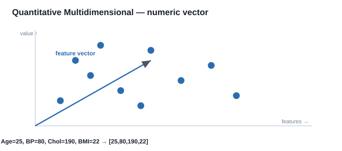

**جدول بيانات حقيقي (مجموعة طبية — كل صف متجه أرقام):**

| Patient | Age | Blood Pressure | Cholesterol | BMI |
|---|---:|---:|---:|---:|
| P1 | 25 | 120 | 190 | 22.1 |
| P2 | 41 | 135 | 210 | 26.4 |
| P3 | 33 | 118 | 175 | 23.0 |
| P4 | 58 | 150 | 240 | 29.8 |

> كل صف = نقطة بـ 4 أبعاد، مثلاً P1 = `[25, 120, 190, 22.1]`.

> [!CONCEPT] بطاقة بحث: Regression (الانحدار)
> - **شنو هو:** عائلة من النماذج تحاول تتنبأ بقيمة رقمية مستمرة من مدخلات. الفرق الجوهري عن التصنيف (classification): التصنيف يجاوب "نعم/لا" أو "فئة"، الانحدار يجاوب "كم؟" (سعر، عمر، ضغط).
> - **شلون يشتغل (مثال):** لو عندك أعمار وضغط لمرضى، تبني خط `BP ≈ a·Age + b`. تعطيه عمر جديد فيتوقع الضغط. أبسط نوع = Linear Regression (أقل مربعات). أنواع ثانية: Polynomial, Ridge, Lasso.
> - **ارتباطه بالمحاضرة:** هذا النوع (Quantitative Multidimensional) هو "الوقود" الطبيعي للانحدار لأنه أرقام متجهة. لهذا الدكتور خليه ضمن الـ use cases.

> [!CONCEPT] بطاقة بحث: Clustering (التجميع)
> - **شنو هو:** تقسيم البيانات لـ groups بحيث اللي داخل المجموعة الوحدة يكونون متشابهين، وكل مجموعة تختلف عن الثانية — **بدون ما نعرف مقدمًا أسماء المجموعات** ( unsupervised).
> - **شلون يشتغل (مثال):** K-Means: تختار K مركز عشوائي، توزع كل نقطة لأقرب مركز، تحسب مراكز جديدة، تكرر لحد يستقر. النتيجة: عناقيد.
> - **ارتباطه بالمحاضرة:** ينطبق على البيانات الكمية لأننا نحتاج "مسافة" بين النقاط (Euclidean distance) — وهذا متوفر بس لما البيانات رقمية متجهة.

> [!CONCEPT] بطاقة بحث: Anomaly Detection (كشف الشذوذ)
> - **شنو هو:** اكتشاف النقاط اللي "ما تطابق" باقي البيانات — اللي هي نادرة أو غريبة (تسمى outliers أو anomalies).
> - **شلون يشتغل (مثال):** قيمة ضغط = 300 تعتبر شذوذ لأنها بعيدة جداً عن توزيع باقي المرضى. طرق: statistical (z-score)، أو clustering (نقطة ما انتمت لأي عنقود)، أو Isolation Forest.
> - **ارتباطه بالمحاضرة:** يظهر مرتين بالمحاضرة (هنا، وفي Time-Series) لأن الشذوذ يهم بكل أنواع البيانات — طبي (مرض)، مالي (احتيال)، حساس للوقت (إنذار مبكر).

---

### 2.2 Categorical and Mixed Attribute Data (بيانات تصنيفية ومختلطة)

> **W2 P1** "Categorical Data: Attributes represent discrete categories/labels."
>
> **W2 P1** "Mixed Attribute Data: Contains both numerical and categorical variables."
>
> **W2 P1** "Challenges: Need special encoding techniques (e.g., one-hot encoding). Distance metrics are harder to define compared to numerical data."

**التعريف:** Categorical = سمات تمثل تصنيفات منفصلة (Red/Green/Blue، أو Kenya/India/USA). Mixed = تجمع رقمي + تصنيفي (مثال: `{Age=21, Gender=Male, GPA=3.4, Major=CS}`).
**التحدي:** نحتاج تقنيات ترميز خاصة (مثل one-hot)، وقياس المسافة أصعب من الرقمي.
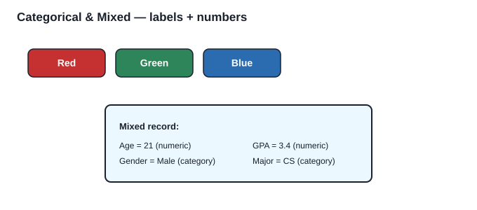

**جدول بيانات حقيقي (سجلات طلاب — مختلطة رقمي + تصنيفي):**

| Student | Age | Gender | GPA | Major |
|---|---:|---|---:|---|
| S1 | 21 | Male | 3.4 | CS |
| S2 | 22 | Female | 3.1 | Math |
| S3 | 20 | Male | 2.9 | CS |
| S4 | 23 | Female | 3.7 | Physics |

> العمود `Gender` و `Major` تصنيفي (nominal)؛ الباقي رقمي. هذا بالضبط اللي يحتاج one-hot.

> [!CONCEPT] بطاقة بحث: One-Hot Encoding (الترميز الساخن الواحد)
> - **شنو هو:** لكل فئة نسوي عمود ثنائي (0/1). اللون {Red,Blue,Green} يصير 3 أعمدة: Red=[1,0,0]، Blue=[0,1,0]، Green=[0,0,1].
> - **شلون يشتغل:** المريض P1 بفصيلة A يصير [1,0,0]، P2 بفصيلة B يصير [0,1,0]. الـ 1 يعني "هذا الفئة موجود"، الـ 0 "غايب".
> - **ليش ما نكتب A=1, B=2, O=3؟** لأن هذا **يوهم النموذج إنه فيه ترتيب عددي** (B أكبر من A؟ ما منطق). فصائل الدم nominal ما بينها ترتيب، فـ one-hot هو الصح للـ nominal.
> - **ارتباطه بالمحاضرة:** هذا هو الحل لمشكلة "الخوارزميات تريد أرقام" مع البيانات التصنيفية. تذكره دائماً كجسر Categorical → Numeric (راح نشوفه بالقسم 6).

> [!CONCEPT] بطاقة بحث: Distance Metrics for Categorical (قياس المسافة للتصنيفي)
> - **شنو هو:** كيف "نقيس تقارب" سجلين فيهم حقول تصنيفية. بالرقمي نستخدم Euclidean، بالتصنيفي نستخدم مثلاً Hamming distance (عدد الحقول المختلفة) أو Jaccard.
> - **شلون يشتغل:** سجلان {Male, CS} و {Male, Math} — يختلفون بـ حقل واحد من 2 → مسافة 0.5.
> - **ارتباطه بالمحاضرة:** الدكتور ذكر إن "المسافة أصعب تعريفها" للتصنيفي — لأن مفهوم "البعد" ما ينطبق مباشرة، فلازم نحول أو نستخدم مقاييس بديلة.

---

### 2.3 Binary and Set Data (بيانات ثنائية وبيانات مجموعات)

> **W2 P1** "Binary Data: Attributes with only two possible values {0,1} or {True, False}."
>
> **W2 P1** "Set Data: Each object described by a set of items."
>
> **W2 P2** "Applications: Association rule mining (e.g., Market Basket Analysis). Recommendation systems."

**التعريف:** Binary = قيمتين بس {0,1} أو {True,False} (مثال: Smoker نعم/لا، Loan Defaulted نعم/لا). Set = كل غرض يوصف بـ مجموعة عناصر (مثال: سلة تسوق {Milk, Bread, Eggs}).
**التطبيقات:** Association rule mining، recommender systems.
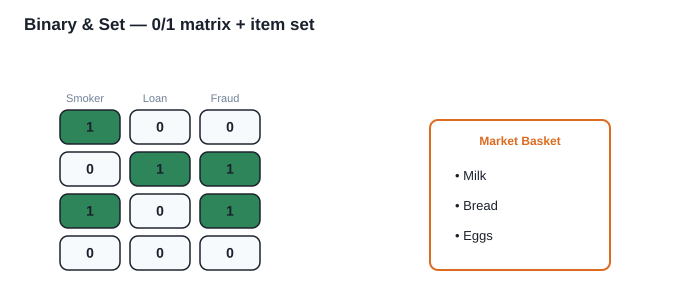

**جدول بيانات حقيقي (مصفوفة شرائية — كل صف binary set):**

| Customer | Milk | Bread | Eggs | Cheese |
|---|---:|---:|---:|---:|
| C1 | 1 | 1 | 1 | 0 |
| C2 | 0 | 1 | 0 | 1 |
| C3 | 1 | 0 | 1 | 0 |
| C4 | 0 | 0 | 0 | 0 |

> سلة C1 = {Milk, Bread, Eggs}. خوارزمية Apriori تبحث الأنماط بين هالسلات.

> [!CONCEPT] بطاقة بحث: Association Rule Mining / Market Basket Analysis (تنقيب القواعد الارتباطية / تحليل سلة التسوق)
> - **شنو هو:** اكتشاف قواعد من نوع "إذا اشترى X فغالباً يشتري Y" من بيانات المعاملات. أشهر مثال: "حفاضات → بيرة" (أسطورة Walmart).
> - **شلون يشتغل:** خوارزمية Apriori: تعدّ تكرار العناصر المفردة، ثم الأزواج، ثم الثلاثيات، وتصفية بالـ support (نسبة الظهور) و الـ confidence (احتمال Y إذا ظهر X) و الـ lift.
> - **ارتباطه بالمحاضرة:** بيانات الـ Set (السلة) هي الوقود الطبيعي لها — كل سلة = set، ونبحث الأنماط بين السلات.

> [!CONCEPT] بطاقة بحث: Recommendation Systems (أنظمة التوصية)
> - **شنو هو:** نظام يقترح عناصر (فيلم، منتج) بناءً على سلوك المستخدم. نوعان رئيسيان: collaborative filtering (بناءً على مستخدمين مشابهين) و content-based (بناءً على خصائص العنصر).
> - **ارتباطه بالمحاضرة:** يذكره الدكتور لأنه يأكل بيانات ثنائية/مجموعات (user-item matrix مليان 0/1 = شاف/ما شاف).

---

### 2.4 Text Data (بيانات نصية) — ★ أهم نوع عند الدكتور

> **W2 P2** "Definition: Data stored as unstructured textual information."
>
> **W2 P2** "Text is unstructured and must be converted into numerical form (Bag of Words, TF-IDF, word embeddings)."
>
> **W2 P2** "Applications: Sentiment analysis, topic modeling, chatbots, search engines."

**التعريف:** بيانات مخزنة كمعلومات نصية غير مهيكلة (emails, articles, reviews, tweets).
**التحدي:** النص غير مهيكل ولا بد نحوله لأرقام (Bag of Words, TF-IDF, word embeddings).
**التطبيقات:** Sentiment analysis, topic modeling, chatbots, search engines.
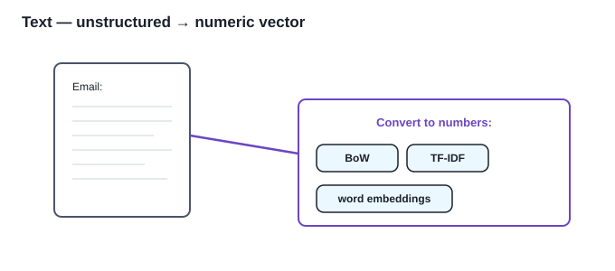

**جدول بيانات حقيقي (مستندات + تمثيلها):**

| Doc | Text (raw) | Bag-of-Words vector (cat, dog, mat, log, sat, the, on) |
|---|---|---|
| D1 | "The cat sat on the mat" | [1, 0, 1, 0, 1, 2, 1] |
| D2 | "The dog sat on the log" | [0, 1, 0, 1, 1, 2, 1] |

> النص الخام ما يقراه النموذج — نحوله لأرقام (BoW/TF-IDF) أولاً.

> [!CONCEPT] بطاقة بحث: Bag of Words (BoW — حقيبة الكلمات)
> - **شنو هو:** تمثيل النص كـ vector من عدد مرات كل كلمة.
> > **W2 P7** "Represents text as a vector of word counts."
> > **W2 P7** "Vocabulary: [cat, dog, mat, log, sat, the, on] — Sentence 1 → [1, 0, 1, 0, 1, 2, 1]"
> - **شلون يشتغل (مثال):**
>   - ج1: "The cat sat on the mat" — ج2: "The dog sat on the log"
>   - القاموس: `[cat, dog, mat, log, sat, the, on]`
>   - ج1 → `[1, 0, 1, 0, 1, 2, 1]` (the ظهر مرتين)
>   - ج2 → `[0, 1, 0, 1, 1, 2, 1]`
> - **المشكلة:** يتجاهل ترتيب الكلمات ومعناها (cat و dog يهمشون بنفس البعد). وهذا يؤدي لـ **sparsity** (أغلب الخانات صفر).

> [!CONCEPT] بطاقة بحث: TF-IDF (Term Frequency – Inverse Document Frequency) — ★★ اللي سألت عنه
> - **شنو هو:** وزن إحصائي لكل كلمة داخل مستند ضمن مجموعة مستندات (corpus). يكافئ الكلمات المهمة بوزن عالي، والكلمات الشائعة (مثل "the", "is") بوزن منخفض. هو **تطوير** على BoW يحل مشكلة الكلمات التافهة.
> > **W2 P7** "TF-IDF(t,d) = TF(t,d) × IDF(t)"
> > **W2 P8** "Better than BoW because it reduces the impact of frequent but uninformative words."
> - **شلون يشتغل (المعادلة والخطوات):**
>   - `TF(t,d)` = عدد مرات الكلمة t بالمستند d ÷ مجموع كلمات d.
>   - `IDF(t)` = `log( N / (1 + df(t)) )` حيث N = عدد المستندات، `df(t)` = عدد المستندات اللي تحتوي t.
>   - `TF-IDF(t,d) = TF(t,d) × IDF(t)`.
>   - **مثال:** مستندان — د1 "the cat sat"، د2 "the dog ran". كلمة "the" بكليهما → `df=2`، `N=2` → `IDF = log(2/3) ≈ سلبي صغير` → وزن "the" ضعيف. كلمة "cat" بس بد1 → `df=1` → `IDF = log(2/2)=0`؟ لا، بالصيغة بـ +1 بالمقام تطلع موجبة ومرتفعة → "cat" تاخذ وزن عالي لأنها نادرة ومميزة.
> - **ليش أحسن من BoW:** يقلل تأثير الكلمات المتكررة لكن غير المفيدة. "cancer" بورقة طبية أهم من "the" رغم إن "the" أكثر عدداً.

> [!CONCEPT] بطاقة بحث: Word Embeddings (تضمين الكلمات — Word2Vec, GloVe, FastText)
> - **شنو هو:** تمثيل كل كلمة كـ vector كثيف (dense) بأبعاد قليلة (مثل 100–300)، بحيث الكلمات القريبة بالمعنى يكون لها vectors قريبة بالفضاء.
> > **W2 P8** "Advantage: Captures semantic relationships ('king – man + woman ≈ queen')."
> - **شلون يشتغل (مثال الخرافة المعروفة):** `king − man + woman ≈ queen`. النموذج التقط العلاقة الدلالية. Word2Vec يتعلم من السياق (الكلمات اللي تطلع جنب بعض)، GloVe من مصفوفة التشارك الإحصائي.
> - **ارتباطه بالمحاضرة:** بديل أعمق من BoW/TF-IDF لأنه يفهم المعنى والسياق، يستخدم بـ chatbots والترجمة.

> [!CONCEPT] بطاقة بحث: Sentiment Analysis (تحليل المشاعر)
> - **شنو هو:** تصنيف النص حسب المشاعر (إيجابي/سلبي/محايد). تطبيق كلاسيكي: مراجعات الأفلام.
> - **شلون يشتغل:** نحول المراجعة إلى TF-IDF أو embeddings → نمررها لنموذج (Naïve Bayes أو BERT) → يصنفها.
> - **ارتباطه بالمحاضرة:** من تطبيقات Text→Numeric؛ الدكتور يذكره كدليل عملي إن تحويل النص لأرقام يقود لمهام حقيقية.

> [!CONCEPT] بطاقة بحث: Topic Modeling (نمذجة المواضيع)
> - **شنو هو:** اكتشاف "مواضيع مخفية" داخل مجموعة وثائق (مثال: أخبار مقسمة لرياضة/سياسة/اقتصاد بدون تسمية مسبقة). أشهر خوارزمية: LDA (Latent Dirichlet Allocation).
> - **ارتباطه بالمحاضرة:** تطبيق نصي يعتمد على التمثيل الرقمي للوثائق.

> [!CONCEPT] بطاقة بحث: Chatbots & Search Engines
> - **Chatbots:** نظام يفهم ويرد على النص. يعتمد على embeddings/transformers (BERT/GPT) لتحويل سؤال المستخدم لنص "قابل للمعالجة".
> - **Search Engines:** تحول استعلامك والصفحات لأرقام (sentence embeddings) وتقارن التشابه. الدكتور يذكرها لأنها أضخم تطبيق عملي لـ Text→Numeric.

---

## القسم 3 — العائلة الثانية: Dependency-Oriented (4 أنواع)

### 3.1 Time-Series Data (بيانات سلاسل زمنية)

> **W2 P2** "Definition: A sequence of values recorded over time."
>
> **W2 P2** "Characteristics: Temporal dependency (past values influence future values). Often analyzed using ARIMA, LSTMs, Transformers. Applications: Forecasting, anomaly detection."

**التعريف:** سلسلة قيم مسجلة عبر الزمن (أسعار أسهم، طقس، إشارات ECG).
**الخصائص:** اعتماد زمني (الماضي يأثر بالمستقبل). تُحلل بـ ARIMA, LSTMs, Transformers.
**التطبيقات:** Forecasting, anomaly detection.
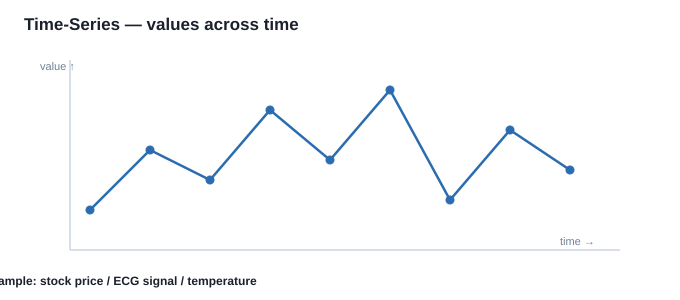

**جدول بيانات حقيقي (سعر سهم عبر 8 أيام):**

| Day | 1 | 2 | 3 | 4 | 5 | 6 | 7 | 8 |
|---|---:|---:|---:|---:|---:|---:|---:|---:|
| Price | 100 | 102 | 99 | 105 | 103 | 107 | 110 | 108 |

> الترتيب مهم: 100→102→99 له معنى، ما يصير نعيد ترتيبه عشوائي.

> [!CONCEPT] بطاقة بحث: ARIMA / LSTM / Transformers
> - **ARIMA** (AutoRegressive Integrated Moving Average): نموذج إحصائي كلاسيكي للتنبؤ يعتمد على القيم السابقة والفروق بينها.
> - **LSTM** (Long Short-Term Memory): نوع من الشبكات العصبية المتكررة (RNN) "يتذكر" السياق الطويل — ممتاز للسلاسل الزمنية.
> - **Transformers** (مثل BERT/GPT لكن للزمن): أحدث نماذج، تلتقط الاعتماديات بعيدة المدى.
> - **ارتباطه بالمحاضرة:** الدكتور يذكرها لأن Time-Series تحتاج نماذج "تفهم الترتيب" — عكس الـ Quantitative اللي كل صف وحده.

### 3.2 Discrete Sequences and Strings (سلاسل رموز منفصلة)

> **W2 P2** "Definition: Data represented as sequences of discrete symbols."
>
> **W2 P2** "Challenges: Pattern matching, alignment, and subsequence analysis."

**التعريف:** تسلسل رموز منفصلة (DNA: ATCG، clickstreams: سلسلة صفحات).
**التحدي:** pattern matching، alignment، تحليل الأنظمة الفرعية.
**التطبيقات:** Bioinformatics، web usage mining، NLP.
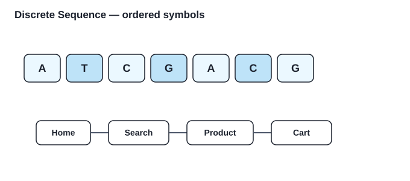

**جدول بيانات حقيقي (سلاسل منفصلة):**

| ID | Type | Sequence |
|---|---|---|
| S1 | DNA | A → T → C → G → A → C → G |
| S2 | Clickstream | Home → Search → Product → Cart |
| S3 | DNA | A → T → G → G → A → C → T |

> تبديل رمز واحد يغير المعنى (مثل الطفرة بالـ DNA) — لذلك الترتيب أساسي.

> [!CONCEPT] بطاقة بحث: Pattern Matching / Alignment (مطابقة الأنماط / المحاذاة)
> - **شنو هو:** إيجاد تشابه بين تسلسلين (مثل محاذاة تسلسلين DNA لاكتشاف طفرة). أدوات: Needleman–Wunsch، BLAST.
> - **ارتباطه بالمحاضرة:** التحدي هنا مو "المسافة" بس، بل "الترتيب مهم" — فلازم خوارزميات تسلسل لا خوارزميات جدول.

### 3.3 Spatial Data (بيانات مكانية)

> **W2 P2** "Definition: Data representing objects in a spatial or geographical context."
>
> **W2 P3** "Challenges: Spatial autocorrelation (nearby objects are more related)."

**التعريف:** بيانات بسياق جغرافي/مكاني (خرائط، صور أقمار، إحداثيات lat/long).
**التحدي:** Spatial autocorrelation (الأشياء القريبة مكانياً أكثر ارتباطاً).
**التطبيقات:** GIS، مراقبة المرور، النمذجة البيئية.
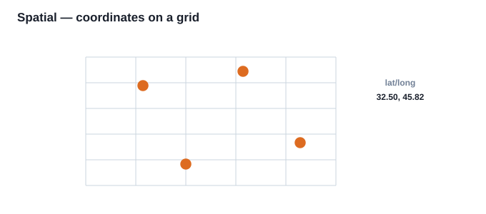

**جدول بيانات حقيقي (مواقع مستشفيات — lat/long):**

| Hospital | Latitude | Longitude | Type |
|---|---:|---:|---|
| H1 | 32.50 | 45.82 | General |
| H2 | 32.48 | 45.85 | Children |
| H3 | 32.55 | 45.79 | Cardiac |
| H4 | 32.46 | 45.90 | General |

> نحسب "المسافة" بينها بالإحداثيات — أقرب مستشفى = الأهم للتحليل المكاني.

> [!CONCEPT] بطاقة بحث: Spatial Autocorrelation (الارتباط الذاتي المكاني)
> - **شنو هو:** مبدأ "القريب من القريب أقرب" — مدينة تشبه جيرانها أكثر من مدينة بعيدة. يقاس بـ Moran's I.
> - **ارتباطه بالمحاضرة:** هذا يكسر فرضية "كل سجل وحده" (الـ independence) — وبالتالي يصنفها الدكتور Dependency.

### 3.4 Network and Graph Data (شبكات ورسوم بيانية) — ★★ مهم جداً ومرتبط بنقطة توقفك

> **W2 P3** "Definition: Data represented as nodes and edges."
>
> **W2 P3** "Characteristics: Strongly structured data. Requires graph algorithms (PageRank, community detection, Graph Neural Networks)."

**التعريف:** بيانات ممثلة بـ nodes (عقد) و edges (روابط). مثال: Facebook (المستخدمون = nodes، الصداقة = edges)، شبكات الاقتباس.
**الخصائص:** بيانات "بنية قوية"، تتطلب خوارزميات رسوم (PageRank, community detection, GNN).
**التطبيقات:** تحليل التواصل الاجتماعي، كشف الاحتيال، recommender systems.
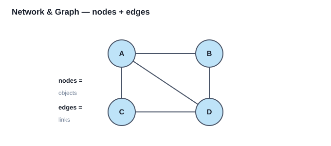

**جدول بيانات حقيقي (شبكة تواصل — قائمة روابط):**

| Edge | From (node) | To (node) | Relation |
|---|---|---|---|
| e1 | Ahmed | Sara | friend |
| e2 | Sara | Omar | friend |
| e3 | Omar | Ahmed | friend |
| e4 | Lina | Omar | colleague |

> الجدول يحتوي عقد (From/To) وروابط — هذا تمثيل "edge list" لـ graph.

> [!CONCEPT] بطاقة بحث: PageRank
> - **شنو هو:** خوارزمية جوجل لترتيب الصفحات: العقدة "مهمة" إذا ربطت بها عقد مهمة. تعطي كل node درجة أهمية.
> - **ارتباطه بالمحاضرة:** مثال على "قياس أهمية node" داخل graph — راح نحتاجه بالقسم 6 (Graph → Numeric).

> [!CONCEPT] بطاقة بحث: Community Detection (كشف المجتمعات)
> - **شنو هو:** تقسيم الـ graph لمجموعات (communities) فيها روابط كثيفة داخلياً وخفيفة خارجياً. خوارزميات: Louvain, Girvan–Newman.
> - **ارتباطه بالمحاضرة:** يظهر كتطبيق وكتقنية cluster لكن على graphs بدل نقاط إحداثيات.

> [!CONCEPT] بطاقة بحث: Graph Neural Networks (GNN — شبكات عصبية رسومية)
> - **شنو هو:** شبكات عصبية "تتعلم" من بنية الـ graph نفسها (لكل node تجمع معلومات جيرانها). أمثلة: GCN, GraphSAGE, GAT.
> - **ارتباطه بالمحاضرة:** الطريقة الحديثة لتحويل graph → numeric embeddings (نرجع لها بالقسم 6).

---

## القسم 4 — تجهيز البيانات (Data Preparation) — 6 خطوات

هذا إجرائي (مو بحثي)، الدكتور يذكره كـ pipeline. الست خطوات (بالترتيب غالباً) — بالكلام الحرفي للدكتور:

> **W2 P4** "Data Collection – Gathering data from multiple sources (databases, files, APIs, sensors, etc.)."
> **W2 P4** "Data Cleaning – Handling missing values, removing duplicates, correcting errors, and resolving inconsistencies."
> **W2 P4** "Data Integration – Combining data from different sources into a single coherent dataset."
> **W2 P4** "Data Transformation – Converting data into a consistent format (e.g., encoding categorical variables, normalization, scaling)."
> **W2 P4** "Data Reduction – Reducing the size/dimensionality of data by removing irrelevant features or aggregating values."
> **W2 P4** "Data Splitting – Dividing data into training, validation, and test sets (in machine learning tasks)."

1. **Data Collection** — جمع البيانات من مصادر (قواعد، ملفات، APIs، sensors).
2. **Data Cleaning** — معالجة القيم المفقودة، إزالة المكرر، تصحيح الأخطاء، حل التناقضات. *(نفصلها بالقسم 7)*
3. **Data Integration** — دمج بيانات من مصادر مختلفة بـ dataset واحد متماسك.
4. **Data Transformation** — تحويل لصيغة متسقة (encoding، normalization، scaling).
5. **Data Reduction** — تقليل الحجم/الأبعاد بحذف سمات غير مهمة أو تجميع قيم. *(نفصلها بالقسم 7)*
6. **Data Splitting** — تقسيم لـ training / validation / test (بمهام ML).
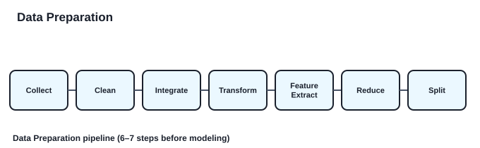

> كل خطوة تأخذ مخرجات السابقة — هذا هو "الأنبوب" قبل ما تدخل البيانات للنموذج.

> **لماذا مهم؟** (بكلام الدكتور الحرفي):
> **W2 P4** "Ensures accuracy (removes errors and inconsistencies). Improves efficiency (organized data is faster to process). Enhances model performance (clean, balanced, and relevant data leads to better predictions). Supports better decision-making (reliable insights come from well-prepared data)."

---

## القسم 5 — استخراج السمات (Feature Extraction)

> **W3 P1** "Feature extraction is the process of creating new features from existing data to represent its important characteristics in a form suitable for data mining or machine learning algorithms."
>
> **W3 P1** "Instead of giving the complete image directly to a traditional algorithm, we can represent it using useful features."

**شنو هو:** اشتقاق سمات جديدة "أكثر إفادة" من البيانات الخام لتحسين التحليل/النموذج — بدل استخدام الخام مباشرة.
**ليش مهم:** الخام معقد/مزعج؛ يقلل الأبعاد؛ يظهر الأنماط؛ يحسّن الدقة.
**أمثلة من المحاضرة:**
- **من صورة:** استخراج edges/textures/color histograms أو deep embeddings (من طبقات CNN). مثال: من صورة سرطان ثدي نستخرج shape و texture.
- **من نص:** TF-IDF, BoW, embeddings (Word2Vec, BERT). مثال: استخراج كلمات مفتاحية من ملاحظات طبية.
- **من صوت/إشارة:** frequency, amplitude, MFCC. مثال: كشف murmur بالقلب من ECG.
- **من جدول:** سمات مشتقة مثل BMI = weight/height²، أو "فئة العمر" من العمر الخام.

> **مكانه بالـ pipeline:** Collection → Cleaning → Integration → Transformation → **Feature Extraction** → Reduction → Splitting.

---

## القسم 6 — قابلية نقل نوع البيانات (Data Type Portability) — ★★ الضعف الأساسي

هذا قلب المحاضرة 2 و 3. التعريف الحرفي من الدكتور:

> **W3 P3** "Data Type Portability means converting data from one representation or type into another representation so that it can be processed by a data mining algorithm."

**المعنى:** تحويل البيانات من تمثيل لنوع إلى تمثيل آخر علمود الخوارزمية تقدر تعالجه.

**العملية العامة:** `أنواع بيانات مختلفة → تحويل → تمثيل مناسب → خوارزمية تنقيب`.

الدكتور يذكر قائمة التحويلات الشائعة (بكلامه):

> **W3 P4** "Numerical → Categorical: Discretization. Categorical → Numerical: Encoding. Text → Numerical: Vectorization. Time Series → Sequence: Symbolic representation. Time Series → Numerical features: DFT / DWT or feature extraction. Image → Numerical features: Feature extraction. Graph → Numerical representation: Graph embedding. Any data type → Graph: Similarity graph."

### الجدول المرجعي الشامل (من المحاضرة 3 — احفظه)
| من (From) | إلى (To) | التقنية |
|---|---|---|
| Numerical | Categorical | Discretization (تقطيع) |
| Categorical | Numerical | One-Hot Encoding |
| Text | Numerical | Vectorization (BoW / TF-IDF / embeddings) |
| Time Series | Numerical | Feature extraction (DFT/DWT) |
| Time Series | Sequence | Symbolic representation (SAX) |
| Image | Numerical | Feature extraction |
| Sequence | Numerical | Sequence encoding |
| Spatial | Numerical | Distance / shape features |
| **Graph** | **Numerical** | **Graph embedding** |
| **أي نوع** | **Graph** | **Similarity graph** |

> **انتبه للسطرين الأخيرين** — هما الاتجاهين المختلفين اللي الدكتور قفز بينهم وهذا سبب تشتتك (نفصل تحت).

### 6.1 Numerical → Categorical: Discretization (التقطيع)

> **W2 P5** "Discretization is the process of converting continuous numeric data into discrete categorical data by dividing the range of values into intervals (bins)."
>
> **W2 P6** "Example: Age = [15, 18, 22, 35, 42, 50, 63, 70]. Equal-Width Binning (width=20): Categories: Teen (0–20), Young (21–40), Middle-aged (41–60), Senior (61–80). Result: [Teen, Teen, Young, Young, Middle-aged, Middle-aged, Senior, Senior]."

**شنو هو:** تحويل قيم رقمية مستمرة إلى فئات بـ تقسيم المدى إلى intervals (bins).
**أنواعه:**
- **Equal-Width:** فترات متساوية (Age 0–100 → [0–20],[21–40],...).
- **Equal-Frequency (Quantile):** كل bin فيه نفس عدد النقاط تقريباً.
- **Clustering-Based:** نستخدم k-means لتجميع القيم.
- **Supervised:** نأخذ التصنيف (class label) بالحسبان (مثال: نقسم الدخل ليفصل "مقبول قرض" عن "مرفوض").
**العيب:** ضياع معلومة (21 و39 يصيرون نفس الفئة "Adult").
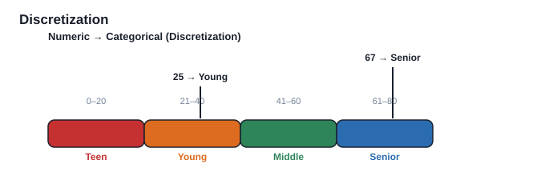

**جدول بيانات حقيقي (Numeric → Categorical):**

| Age | Bin (Equal-Width=20) |
|---:|---|
| 15 | Teen (0–20) |
| 18 | Teen (0–20) |
| 22 | Young (21–40) |
| 35 | Young (21–40) |
| 42 | Middle-aged (41–60) |
| 50 | Middle-aged (41–60) |
| 63 | Senior (61–80) |
| 70 | Senior (61–80) |

> العمر 21 و 39 كلهن "Young" — الفرق الدقيق ضاع (هذا هو العيب).

### 6.2 Categorical → Numerical: Binarization / One-Hot

(غطيناه بالقسم 2.2 — راجع بطاقة One-Hot. النقطة الإضافية من المحاضرة 3 — **لا تكتب A=1,B=2,O=3** للـ nominal). كلام الدكتور الحرفي:

> **W3 P5** "Why Not Simply Use A = 1, B = 2, O = 3? Using A = 1, B = 2, O = 3 may incorrectly suggest that the categories have a numerical order. For nominal categories such as blood type, there is no meaningful order. Therefore, one-hot encoding is usually more appropriate for nominal categorical data."

> **W2 P7** "One-Hot Encoding: Each category gets a new binary column. Example: Color = {Red, Blue, Green} → Red 1 0 0, Blue 0 1 0, Green 0 0 1."

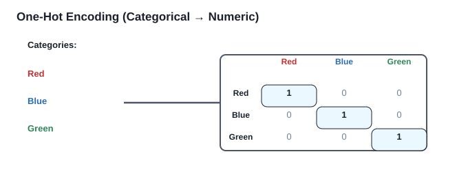

**جدول بيانات حقيقي (فصائل دم → One-Hot):**

| Patient | Blood Type | A | B | O |
|---|---|---:|---:|---:|
| P1 | A | 1 | 0 | 0 |
| P2 | B | 0 | 1 | 0 |
| P3 | O | 0 | 0 | 1 |
| P4 | A | 1 | 0 | 0 |

> ثلاثة أعمدة بدل رقم واحد — ما كتبنا A=1,B=2,O=3 عمداً.

### 6.3 Text → Numerical

(غطيناه بالقسم 2.4 — BoW, TF-IDF, embeddings. هذا أهم تحويل عند الدكتور.)
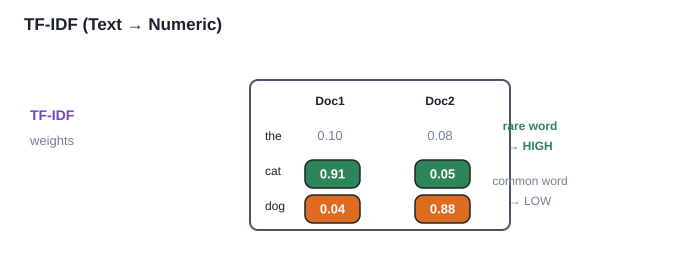

**جدول بيانات حقيقي (مصفوفة Term–Document بأوزان TF-IDF):**

| Term | Doc1 | Doc2 | ملاحظة |
|---|---:|---:|---|
| the | 0.10 | 0.08 | شائعة → وزن منخفض |
| cat | 0.91 | 0.05 | نادرة بـ Doc1 → وزن عالي |
| dog | 0.04 | 0.88 | نادرة بـ Doc2 → وزن عالي |

> الجدول **هو** التمثيل الرقمي اللي ياكله النموذج — كل خلية = وزن الكلمة بالمستند.

### 6.4 Time Series → Numerical / → Sequence

- **→ Numerical:** نستخرج إحصائيات (mean, std, min/max, skewness) أو ميزات ترددية (Fourier/Wavelet) أو shapelets. النتيجة vector ثابت الطول.
- **→ Sequence (رمزي):** نحول الأرقام لرموز. مثال الدكتور الحرفي للقلب:

> **W2 P9** "Instead of keeping raw heart rate values [75, 77, 80, 60, 58, 90], we can convert them into symbols like: [N, N, H, L, L, H] (where N = Normal, H = High, L = Low)."

> **W2 P10** "SAX Steps: Normalize the series (mean = 0, variance = 1). Divide series into equal-sized segments. Compute average value for each segment. Map averages into symbols using breakpoints."

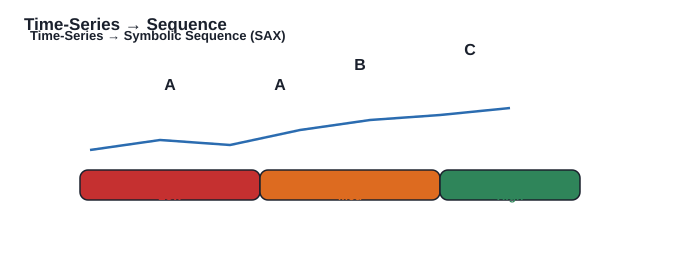

**جدول بيانات حقيقي (Time-Series → Symbolic Sequence):**

| Time | 1 | 2 | 3 | 4 | 5 | 6 |
|---|---:|---:|---:|---:|---:|---:|
| Heart Rate | 75 | 77 | 80 | 60 | 58 | 90 |
| Symbol | N | N | H | L | L | H |

> بدل الأرقام الخام، صارت رموز — أسهل لاكتشاف الأنماط والشذوذ.

### 6.5 Image → Numerical
الصورة أساساً matrix من شدة البكسل (grayscale: 0=أسود، 255=أبيض؛ RGB: 3 قنوات). بدل كل بكسل، نستخرج shape/texture/edges → vector.

### 6.6 Spatial → Numerical
إحداثيات مباشرة (lat,long)، أو مسافات لنقاط مرجعية، أو shape features (area, perimeter, compactness)، أو grid/raster.

### 6.7 Sequence → Numerical
One-hot لكل رمز، أو k-mer counts (نكسر التسلسل لقطع طول k ونعدها — مفيد بـ DNA)، أو embeddings (DNA2Vec).

---

## ★★ القسم 6.8 — Graph → Numerical: Graph Embedding (الأهم للفهم الأول)

هنا نحول **الرسم البياني نفسه إلى أرقام** علمود الخوارزميات. التعريف الحرفي:

> **W2 P17** "A graph G = (V, E) consists of nodes (V) and edges (E) that connect them."

طرق:

- **Node-Level:** درجة العقدة (degree)، clustering coefficient، centrality (betweenness/closeness/eigenvector)، **PageRank**. مثال الدكتور:
> **W2 P17** "Example: Social network node → [degree=5, clustering=0.3, betweenness=0.12]"
- **Edge-Level:** وزن الحافة، edge betweenness، تشابه العقدتين.
- **Graph-Level:** عدد العقد/الروابط، density = `2|E| / (|V|(|V|−1))`، diameter، متوسط clustering.
> **W2 P18** "Density = 2\*|E| / (|V|\*(|V|-1))"
- **Adjacency / Laplacian flattening:** نفرد مصفوفة الجوار لأرقام (أو نأخذ eigenvalues).
- **Graph Embedding (Node2Vec / GNN):** نتعلم vectors كثيفة.
> **W2 P18** "Node2Vec / DeepWalk: Random walks on the graph → treat as sentences → use Word2Vec to get node embeddings."
> **W2 P18** "Graph Neural Networks (GNNs): Aggregate features from neighbors → node-level or graph-level embeddings. Examples: GCN, GraphSAGE, GAT."

> **ارتباطه بالمحاضرة:** الدكتور يذكر Node2Vec/GNN كحل لمشكلة "الخوارزميات تريد أرقام والـ graph مو أرقام".
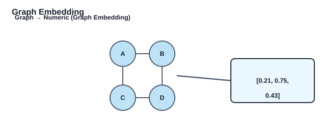

**جدول بيانات حقيقي (Graph → Numeric vector):**

| Node | Embedding (dense vector) |
|---|---|
| A | [0.21, 0.75, 0.43] |
| B | [0.19, 0.81, 0.39] |
| C | [0.24, 0.70, 0.51] |
| D | [0.22, 0.78, 0.44] |

> كل عقدة صارت متجه أرقام — النموذج يقدر يشتغل عليه.

---

## ★★★ القسم 6.9 — Converting Different Data Types INTO a Graph (النقطة اللي وقفت عندها)

**هذا هو السبب الحقيقي لتشتتك:** المحاضرة 2 كلها كانت "حوّل كل شي إلى أرقام" (Graph → Numerical). بس المحاضرة 3 فجأة قلبت الاتجاه: **"بدل ما نحول كل شي أرقام، نمثّل العلاقات كـ graph"**. الدكتور سماها "Converting Different Data Types into a Graph". هذي نقطة التحول واللي ما فهمتها. كلام الدكتور الحرفي (وهذا اللي لازم تحفظه زين):

> **W3 P9** "Instead of converting everything into numerical data, relationships between objects can be represented using a graph."
>
> **W3 P9** "Suppose we have five patients. If two patients are sufficiently similar, we connect them. The nodes represent objects, and the edges represent similarity."
>
> **W3 P10** "A similarity graph can be created using a similarity or distance measure. For example: If distance(P1, P2) < threshold → Connect P1 and P2. The graph represents which objects are similar to each other."
>
> **W3 P10** "Applications: Clustering. Classification. Nearest-neighbor analysis. Outlier detection."

### شنو يعني (What)?
بدل التمثيل الرقمي، نمثّل **الأغراض (objects) كـ nodes** و **العلاقات بينها كـ edges**. أشهر شكل: **Similarity Graph (رسم التشابه)** — نربط كل غرضين متشابهين بـ edge.

### شلون يشتغل (How) — بالخطوات والمثال:
1. عندنا 5 مرضى، كل واحد عنده سمات رقمية (مثلاً العمر، الضغط، الكوليسترول).
2. نختار **مقياس تشابه أو مسافة** (مثلاً Euclidean distance على السمات).
3. لكل زوج (P_i, P_j): **إذا** `distance(P_i, P_j) < threshold` **إذن** نربطهم بـ edge.
4. النتيجة: graph يمثل **أي مريض يشبه أي مريض**.

**شكل الرسم الناتج (بالكلمات):** العقد P1,P2,P3,P4 متصلين ببعض (P1—P2، P2—P4، P4—P3، P3—P1) فيتشكل عنقود واحد، بينما P5 عقدة **معزولة** ما انربطت بأحد لأن مسافتها عن الكل فوق الـ threshold.
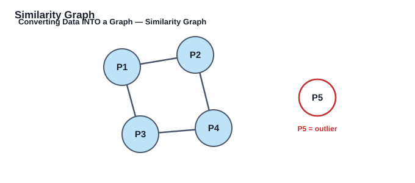

**جدول بيانات حقيقي (5 مرضى + مسافات → روابط):**

| Pair | Distance | Connected? |
|---|---:|---|
| P1–P2 | 0.12 | ✓ (نفس العنقود) |
| P2–P4 | 0.18 | ✓ |
| P4–P3 | 0.15 | ✓ |
| P3–P1 | 0.20 | ✓ |
| P5–الكل | 0.95 | ✗ (معزول → outlier) |

> المسافة < threshold → نربط. P5 بعيدة عن الكل → ما انربطت → شذوذ.

- P1,P2,P3,P4 قريبين من بعض → عنقود (cluster).
- P5 معزول (ما انربط بأحد) → **مرشح شذوذ (outlier)** — وهذا يربطنا ببطاقة Anomaly Detection من القسم 2.1!

### التطبيقات (ليش نسويها؟):
- **Clustering:** كل مكوّن متصل (connected component) = عنقود.
- **Classification:** ننشر لصنف من العقد المعروفة لباقي العقد.
- **Nearest-neighbor analysis:** الجيران = العقد المتصلة.
- **Outlier detection:** العقدة المعزولة = شاذة.

> **الفكرة الجوهرية:** التحويل لـ graph يعكس الاتجاه — هنا نحول **إلى** graph (من أي نوع بيانات)، بينما بالقسم 6.8 حولنا **من** graph إلى numbers. الدكتور يدرّس الاتجاهين لأن بعض الخوارزميات (spectral clustering, community detection, k-NN على graph) تشتغل على البنية العلاقاتية أحسن من المتجهات.

### تحذير الدكتور (مهم للفهم):
> **W3 P10** "Data type conversion is useful, but it may result in information loss. Example: Original ages: 21, 22, 39. After discretization: Adult, Adult, Adult. The exact ages have disappeared. Therefore: A good conversion should preserve the important information needed for the mining task."

---

## القسم 7 — التنظيف، التحجيم، والتخفيض

### 7.1 Data Cleaning (تنظيف البيانات)

> **W2 P21** "MCAR – Missing Completely at Random: The missingness has no relationship with the data (observed or unobserved)."
> **W2 P21** "MAR – Missing at Random: The missingness depends on observed data but not on the missing data itself."
> **W2 P21** "MNAR – Missing Not at Random: The missingness depends on the missing data itself."

**المشاكل الشائعة:** missing entries، incorrect entries (typos)، inconsistent entries (تواريخ بصيغ مختلفة)، outliers، redundancy (تكرار).
**التعامل مع المفقود (Missing Data):**
- **MCAR** (Missing Completely at Random): عشوائي تماماً.
- **MAR** (Missing at Random): يعتمد على قيم موجودة (الدخل مفقود أكثر عند الشباب).
- **MNAR** (Missing Not at Random): يعتمد على القيمة المفقودة نفسها (أصحاب الدخل العالي يخفونه).
**الاستراتيجيات:**
> **W2 P21** "Listwise Deletion: Remove any record (row) with missing values. Column Deletion: Remove attributes (columns) with too many missing values. Useful if >50% values are missing in a column."
- **Deletion:** حذف الصفوف (listwise) أو الأعمدة (إذا >50% مفقود).
- **Imputation:** تعبئة بـ mean/median/mode، أو KNN imputation، أو regression imputation، أو multiple imputation.

### 7.2 Scaling & Normalization (التحجيم والتطبيع)

> **W2 P23** "Min-Max Scaling: Rescales values to a fixed range, usually [0, 1]. Formula: x' = (x − x_min)/(x_max − x_min)."
> **W2 P23** "Z-Score Standardization: Centers the data at 0 and scales to unit variance. Formula: x' = (x − μ)/σ."

**ليش؟** الخوارزميات (KNN, SVM, neural nets) تفترض الميزات بنفس المقياس؛ بدونه الميزة الكبيرة تسيطر.
- **Min-Max Scaling:** `x' = (x − x_min)/(x_max − x_min)` → مدى [0,1]. حساس للـ outliers.
- **Z-Score (Standardization):** `x' = (x − μ)/σ` → متوسط 0 وانحراف 1. أقل حساسية للـ outliers.
- **Max Abs / Robust / Decimal Scaling:** بدائل حسب الحالة.
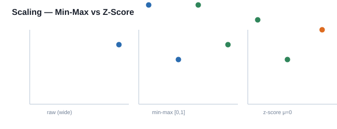

**جدول بيانات حقيقي (Scaling على ميزة واحدة):**

| Raw | Min-Max (0–1) | Z-Score |
|---:|---:|---:|
| 10 | 0.00 | -1.22 |
| 20 | 0.50 | 0.00 |
| 30 | 1.00 | 1.22 |

> بدون التحجيم، القيمة 30 تسيطر على الخوارزمية — بعده كل الميزات بمدى متقارب.

### 7.3 Data Reduction & Transformation (تخفيض وتحويل)

> **W2 P25** "Sampling: Selecting a subset of data to represent the entire dataset."
> **W2 P25** "Filter methods: Evaluate features using statistical measures (correlation, chi-square). Wrapper methods: Use ML algorithms to test feature subsets (e.g., recursive feature elimination). Embedded methods: Feature selection is part of model training (e.g., Lasso regression)."

- **Sampling:** أخذ عيّنة ممثلة (random, stratified, systematic, cluster, reservoir للـ streams).
- **Feature Subset Selection (3 أنواع — مهمة جداً):**
  - **Filter:** مقاييس إحصائية (correlation, chi-square, mutual information) — سريع، يتجاهل التفاعلات.
  - **Wrapper:** نستخدم النموذج لتقييم الأنواع الفرعية (RFE) — أدق بس مكلف حسابياً.
  - **Embedded:** الاختيار يصير أثناء التدريب (Lasso/L1، Random Forest importance) — فعال.
- **Dimensionality Reduction بالـ Axis Rotation:**
  - **PCA:** إسقاط على مكونات رئيسية تلتقط أقصى تباين (orthogonal). خطوات الدكتور:
> **W2 P31** "PCA Steps: Standardize the data (mean = 0, variance = 1). Compute the covariance matrix. Compute eigenvectors and eigenvalues. Sort eigenvectors by eigenvalues → choose top-k components. Project data onto these principal components."
  - **SVD:** `A = U Σ Vᵀ`، يقلل الأبعاد. أساس LSA بالنصوص.
> **W2 P32** "SVD Factorizes the data matrix A into three matrices: A = U Σ Vᵀ."
- **Dimensionality Reduction بالـ Type Transformation:**
  - **Haar Wavelet:** متوسط والفرق بين قيم متجاورة → ضغط.
  - **MDS:** يحافظ على المسافات الزوجية للتصور.
  - **Spectral Graph Embedding:** eigenvectors للمصفوفة Laplacian → تمثيل رقمي للـ graph (يرجع لنفس موضوع 6.8).

---

## خاتمة — ملخص سريع للمراجعة
1. **عائلتان:** Nondependency (كل سجل وحده) و Dependency (بينهم خيوط وقت/ترتيب/بنية).
2. **8 أنواع:** 4 + 4 كما فصلنا.
3. **Data Preparation:** 6 خطوات.
4. **Feature Extraction:** اشتقاق سمات أفضل من الخام.
5. **Portability:** جدول التحويل (استوعب اتجاهين: → numeric و → graph).
6. **نقطة التحول:** Converting INTO a Graph = Similarity Graph (نبني edges بالمسافة < threshold) — هذا اللي وقفت عنده.
7. **Cleaning / Scaling / Reduction:** المكمل الإجرائي.

> **نصيحة للدكتور:** هو "يوزع بحث" — فكل كلمة بسمتها (ARIMA, PageRank, TF-IDF, SAX...) هي بطاقة بحث بهالوثيقة. راجع البطاقة قبل أي محاضرة جاية.

---

## Retrieval Set (بطاقات للمراجعة السريعة — للامتحان)
**[RS-01]** ما الفرق بين Nondependency و Dependency data؟
> Nondependency: كل سجل مستقل (مثل جدول مرضى). Dependency: القيم بينها علاقة/وقت/بنية (مثل سلسلة زمنية).

**[RS-02]** اذكر الـ 4 أنواع من كل عائلة.
> Nondependency: Quantitative Multidimensional, Categorical & Mixed, Binary & Set, Text. Dependency: Time-Series, Discrete Sequences, Spatial, Network & Graph.

**[RS-03]** لماذا نستخدم One-Hot بدل A=1,B=2,O=3؟
> لأن A=1,B=2 يختلق ترتيباً عددياً غير موجود بالفئات الاسمية (nominal)، فالنموذج يفهمه غلط.

**[RS-04]** اشرح TF-IDF بكلمتين.
> يوزن الكلمة بـ تكرارها بالمستند × ندرتها بالـ corpus؛ يرفع المهم ويخفض التافه ("the").

**[RS-05]** ما هو Similarity Graph ولماذا نبنيه؟
> نمثّل الأغراض nodes والعلاقات edges؛ نربط كل زوج مسافته < threshold. يفيد clustering, classification, NN, outlier detection.

**[RS-06]** اذكر 3 أنواع Feature Selection.
> Filter (إحصاء)، Wrapper (نموذج يقيّم)، Embedded (أثناء التدريب كـ Lasso).
