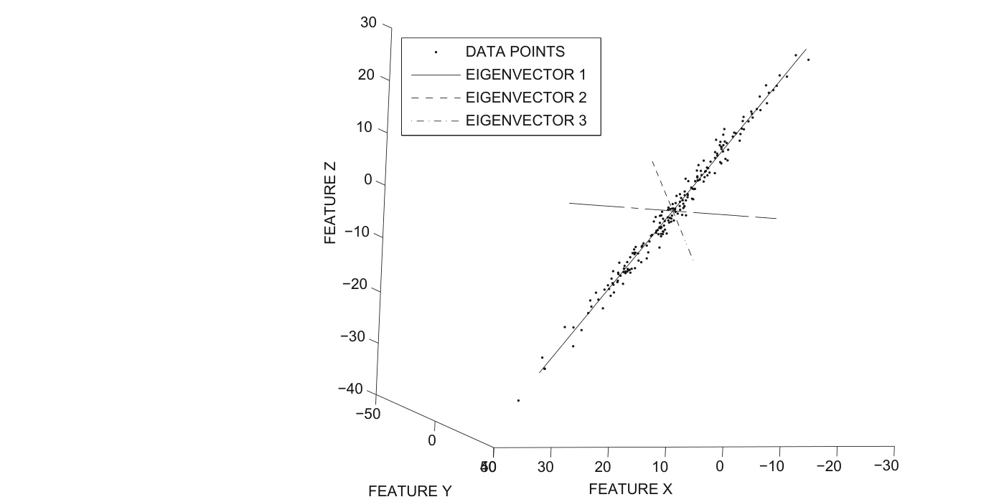
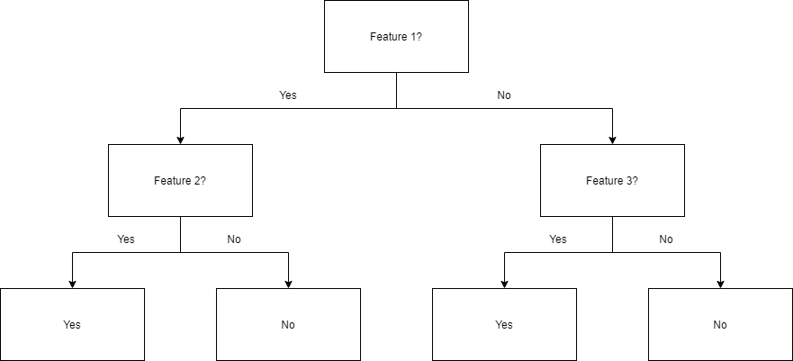
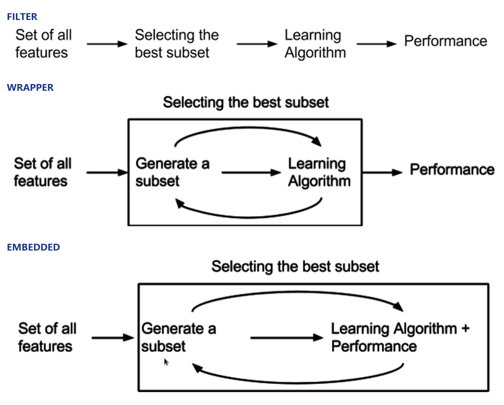

<!-- _class: lead -->

# Feature Selection Techniques
## اختيار الميزات — Data Mining (CS602)

Candidate: Master of Computer Science Student
Instructor: Asst. Prof. Dr. Ahmed Shakir Abd Al-Rida
Institution: College of Computer Science & IT — University of Wasit
Date: September 2026

::: notes
Opening line: "Every table in data mining has a dirty secret — most of its columns are not pulling their weight." Then state the roadmap in one breath: the problem, what selection is, the goal, why it is hard, how we score, how we search, the three model families, and how the task changes the rule. Sources: Han, Kamber & Pei §3.4.4 and Aggarwal §10.2 / §6.2. Say plainly that this seminar is the lecture, because no further material was issued.
:::

---

# Most columns in a real dataset do not earn their place.

- Irrelevant: no relationship to the target — a customer's telephone number.
- Redundant: duplicates information already present — age versus date of birth.
- Cost: poor-quality patterns, and a slower mining process.

::: notes
Read the two H&K sentences: "Data sets for analysis may contain hundreds of attributes, many of which may be irrelevant to the mining task or redundant." and "Leaving out relevant attributes or keeping irrelevant attributes may be detrimental... the added volume of irrelevant or redundant attributes can slow down the mining process." The figure shows exactly what redundancy looks like: the data is correlated, so most of its spread lies along one direction — the other dimensions carry almost no new information. Stress the exam distinction: irrelevant = no link to the target; redundant = duplicates another feature. Then the key sentence: we cannot simply ask the domain expert, because H&K say the job is "difficult and time-consuming, especially when the data's behavior is not well known" — which is the whole reason the selection must be automatic.
:::

---

# Feature selection chooses existing columns; it never creates new ones.

- Select: keep a subset of the existing attributes (drop Phone).
- Construct: add a new column from existing ones (area = height x width).
- Extract: build a new representation with new axes (PCA components).
- All three sit under the umbrella of data reduction.

::: notes
This slide exists to prevent the single most common exam error. H&K define attribute subset selection as reducing the data set "by removing irrelevant or redundant attributes (or dimensions)", and note that "in machine learning, attribute subset selection is known as feature subset selection". The direction of each operation is the thing to memorise: Select removes; Construct adds a column (same axes); Extract changes the axes entirely. One memorable line: "selection picks from the shelf; extraction builds a new shelf." Structural fact worth stating: H&K place §3.4.4 inside §3.4 Data Reduction, right after wavelet transforms (§3.4.2) and PCA (§3.4.3) — so the textbook classifies selection as one reduction strategy among several.
:::

---

# The goal is the smallest subset that still preserves the class distribution.

> "The goal of attribute subset selection is to find a minimum set of attributes such that the resulting probability distribution of the data classes is as close as possible to the original distribution obtained using all attributes." — Han, Kamber & Pei, p.104

- Minimum set: we are minimising.
- Class distribution preserved: we are constrained.
- Together: a trade-off, not a one-sided goal.

::: notes
Unpack the definition into three testable pieces, then explain why it says "class distribution" and not "accuracy": the criterion is defined before any classifier is chosen, so it stays model-independent — which is exactly why such criteria are later called filters. Add the quieter benefit H&K give: "It reduces the number of attributes appearing in the discovered patterns, helping to make the patterns easier to understand" — the interpretability argument. Finally, note that there is no closed-form formula for the optimum; it is a criterion, not an equation, which is precisely why the next slide (the search problem) exists.
:::

---

# There are 2-to-the-n possible subsets, so exhaustive search is impossible.

- 20 features: 1,048,576 subsets. 30 features: over a billion. 50 features: over a quadrillion.
- H&K: an exhaustive search "can be prohibitively expensive".
- So we search heuristically — greedy: a locally optimal choice, hoping for a near-global optimum.

::: notes
Quote H&K directly: "For n attributes, there are 2ⁿ possible subsets. An exhaustive search for the optimal subset of attributes can be prohibitively expensive." Walk the numbers table: 20 → ~1 million (about a second at a million per second); 30 → over a billion (~18 minutes); 50 → over a quadrillion (~36 years). Then the honest vocabulary: a greedy method is not wrong — it is near-optimal with no guarantee. H&K say such methods "are effective in practice and may come close to estimating an optimal solution." Exam-ready sentence: exhaustive = optimal but impossible; greedy = possible but unguaranteed.
:::

---

# Both Gini and entropy ask one question: how mixed are the classes?

- Gini (Eq. 10.1): 1 minus the sum of squared class fractions.
- Entropy (Eq. 10.3): minus the sum of p log2 p.
- Both: 0 = perfect separation; higher = more mixing. Lower is better.

::: notes
Explain both formulas from first principles. Gini: if every point at a value belongs to one class, the sum of squares is 1 and Gini is 0; if the classes are evenly split across k classes, Gini reaches 1 − 1/k (0.5 for two classes). Entropy: the −log2 p term encodes that rare events carry more information; entropy is the expected surprise, ranging from 0 to log2 k. Then read the figure: both curves are 0 at the extremes (p1 = 0 or 1) and peak at an even split (p1 = 0.5) — Gini peaks at 0.5, entropy at 1.0. Worked example: a value with 5 of class A and 0 of class B gives Gini 0; a value with 2 and 3 gives 0.48; the attribute's Gini is the weighted average (0.24). The rule to memorise: for Gini and entropy, lower is better. Contrast with the next slide: Fisher is the opposite direction.
:::

---

# The Fisher score rewards classes that are far apart and tight within.

- Eq. 10.5: interclass separation divided by intraclass spread.
- Numerator: how far each class mean sits from the global mean.
- Denominator: how wide each class is. Higher is better.

::: notes
Read Aggarwal: "The Fisher score is naturally designed for numeric attributes to measure the ratio of the average interclass separation to the average intraclass separation. The larger the Fisher score, the greater the discriminatory power." The geometric reading: two clouds of points — good if the clouds are far apart and each is tight. Then the subtlety that separates a strong answer from a weak one: Fisher's linear discriminant is not the Fisher score. The score evaluates an existing feature; the discriminant builds a new direction W, from the between-class scatter and the within-class scatter. Use the figure: the most discriminating direction is not necessarily the highest-variance direction — in panel (b) it is aligned with the lowest-variance direction. That is why Fisher's discriminant is supervised dimensionality reduction, and is not the same as PCA.
:::

---

# Four greedy searches all converge on the same reduced subset.

- Forward selection: start empty, add the best each step.
- Backward elimination: start full, remove the worst each step.
- Combination: add the best and remove the worst. Decision tree: keep the attributes it splits on.

::: notes
Walk the figure line by line. Forward selection: {} → {A1} → {A1, A4} → {A1, A4, A6}. Backward elimination: {A1..A6} → drop the worst → ... → {A1, A4, A6}. Decision tree induction: split on A4, then A1 or A6, and the attributes appearing in the tree are exactly the selected subset. The buried lesson: four different strategies converge on the same subset, which is evidence that greedy search is stable. Add the stopping rule: H&K say the criteria "may vary" — a threshold on the evaluation measure — so there is no single universal stopping rule; it is a design choice.
:::

---

# A decision tree keeps only the attributes it actually splits on.

- Each internal node is a test on an attribute.
- Each branch is an outcome; each leaf is a class prediction.
- Attributes that never appear in the tree are assumed irrelevant.

::: notes
This slide deepens the fourth method. Read H&K: "Decision tree induction constructs a flowchart-like structure where each internal (nonleaf) node denotes a test on an attribute, each branch corresponds to an outcome of the test, and each external (leaf) node denotes a class prediction." Then the selection rule, quoted: "All attributes that do not appear in the tree are assumed to be irrelevant. The set of attributes appearing in the tree form the reduced subset." Name the trees H&K list: ID3, C4.5, CART. If asked "which attributes does the tree select?", the answer is mechanical: the ones that earned a split. Image credit: CollaborativeGeneticist, CC BY-SA 4.0, via Wikimedia Commons.
:::

---

# Who computes the score? That single question defines three families.

- Filter: a fixed mathematical criterion — no classifier, cheap, model-agnostic.
- Wrapper: the classifier's own accuracy judges each subset — expensive, model-tied.
- Embedded: the model reveals the features while training — e.g. small weights, Lasso, RFE.

::: notes
Read Aggarwal's three definitions verbatim. Filter: "A crisp mathematical criterion is available to evaluate the quality of a feature or a subset of features." Wrapper: "It is assumed that a classification algorithm is available to evaluate how well the algorithm performs with a particular subset of features. A feature search algorithm is then wrapped around this algorithm." Embedded: "The solution to a classification model often contains useful hints about the most relevant features." Then the decisive contrast: "Filter models are agnostic to the particular classification algorithm being used" — whereas a wrapper's result "will be sensitive to the choice of the algorithm A." Walk the figure: filter selects first, then learns (no feedback loop); wrapper loops generate-subset → learning algorithm → performance; embedded folds selection into the learning algorithm itself. Named embedded techniques: Lasso / L1-regularised SVM (sparse learning), decision trees, and recursive feature elimination (RFE). Image credits: Lucien Mousin and Lastdreamer7591, CC BY-SA 4.0, via Wikimedia Commons.
:::

---

# Without labels, the score must measure clustering tendency instead.

- Uniform data: one bell-shaped distance distribution. Clustered data: two peaks.
- Pick the subset that minimises the distance-distribution entropy.
- Named measures: term strength, classification-based relevance, Hopkins statistic.

::: notes
Explain the task split: classification has a label, so the score is class-sensitive; clustering has no label, so the score must ask whether the feature subset makes the data look clustered. Read Aggarwal: "the distance distribution for uniform data is arranged in the form of a bell curve, whereas that for clustered data has two different peaks corresponding to the intercluster distributions and intracluster distributions." In the figure, panels (c) and (d) show the two distributions. Then the three named measures: term strength (Eq. 6.1, for sparse text data), classification-based relevance (predict one attribute from the rest; accuracy is relevance), and the Hopkins statistic (Eq. 6.3), where 0.5 means uniform and closer to 1 means clustered. Note that a wrapper in clustering uses a cluster-validity criterion instead of classifier accuracy, because there is no label.
:::

---

# Sometimes the right feature does not exist yet — so build it.

> "In some cases, we may want to create new attributes based on others. Such attribute construction can help improve accuracy and understanding of structure in high-dimensional data." — Han, Kamber & Pei, p.105

- Example: area = height x width — a new column on the same axes.
- Selection removes; construction adds a column; extraction changes the axes.

::: notes
Read the H&K passage on attribute construction, and note that "in the machine learning literature, attribute construction is known as feature construction." Its value: "By combining attributes, attribute construction can discover missing information about the relationships between data attributes." Keep the three-way contrast sharp, because it is a recurring exam question: selection removes existing columns, construction adds a new column on the same axes, extraction builds new axes. Give the one-line example: area = height x width.
:::

---

# Five traps decide this topic in the exam.

- Selection chooses existing; extraction and construction create.
- Gini and entropy: lower is better. Fisher score: higher is better.
- Filter is model-free; wrapper is model-tied.
- Fisher score selects a feature; Fisher's discriminant builds a direction.
- Hopkins near 1 means clustered; 0.5 means uniform.

::: notes
Drill the five traps as a rapid-fire recall. Then add the shapes of question the subject invites: define-and-distinguish (short answer); explain-the-mechanics (why 2ⁿ, why greedy, how a tree selects); compute (Gini and entropy from a small table, Fisher score from means and standard deviations, a forward-selection trace); and judge-and-choose (text data with no labels → term strength or Hopkins; a linear classifier → embedded, inspect |wi|). Close with the three sentences worth memorising verbatim: the goal definition (H&K p.104), "there are 2ⁿ possible subsets" (H&K p.104), and "Filter models are agnostic to the particular classification algorithm being used" (Aggarwal §10.2.2).
:::

---

# The whole topic in five lines.

- Too many features hurt — noise and redundancy.
- We want the smallest subset that preserves class information.
- There are 2-to-the-n subsets, so we score and search greedily.
- The score is a filter, or model-tied (wrapper or embedded).
- Selection chooses; construction and extraction create.

::: notes
Deliver this as the closing summary and stop. If the audience remembers nothing else, they should remember these five lines: the problem, the goal, the obstacle, the two families of scoring, and the one distinction. Invite questions.
:::

---

# References and image credits

- Han, Jiawei; Kamber, Micheline; Pei, Jian. Data Mining: Concepts and Techniques, 3rd ed. Morgan Kaufmann, 2011 — Section 3.4.4 (pp. 103-105).
- Aggarwal, Charu C. Data Mining: The Textbook. Springer, 2015 — Section 10.2 (pp. 287-293); Section 6.2 (pp. 155-158).
- Figures 3.6, 10.1, 10.2, 6.1, 2.2 reproduced from the two textbooks above, for study use, with page anchors.
- Decision-tree diagram: CollaborativeGeneticist, CC BY-SA 4.0, via Wikimedia Commons.
- Filter / wrapper / embedded diagrams: Lucien Mousin and Lastdreamer7591, CC BY-SA 4.0, via Wikimedia Commons.

::: notes
State the sources cleanly and credit the CC BY-SA 4.0 images. If the professor asks where a number or definition came from, every claim is anchored to a page in one of the two books: H&K §3.4.4 (pp. 103-105), Aggarwal §10.2 (pp. 287-293) and §6.2 (pp. 155-158).
:::
