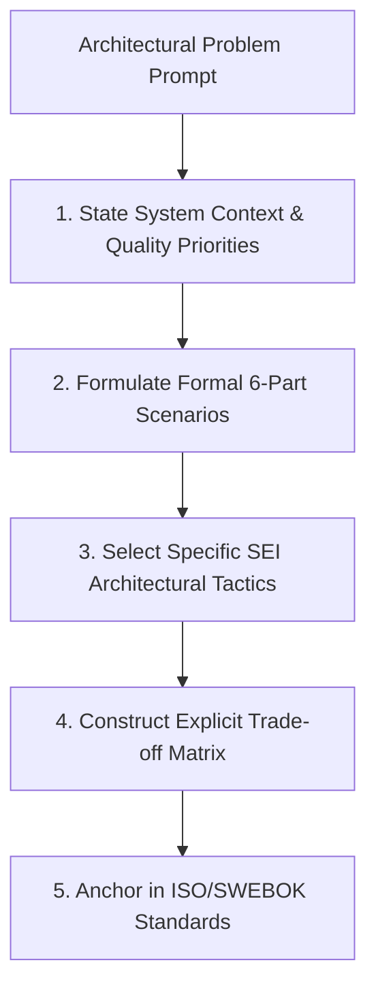

# 👨‍🏫 Instructor Dossier: Asst. Prof. Dr. Ali Fahim Ni'ma

> **Subject:** 🏗️ Advanced Software Engineering (CS603)  
> **Academic Rank:** Assistant Professor (*أستاذ مساعد دكتور*)  
> **Faculty:** College of Computer Science & Information Technology, University of Wasit  
> **Lecture Slot:** Monday, 10:30 AM – 01:30 PM (3 Credit Hours / 3 Contact Hours)  
> **Status:** Active Coursework Instructor (Semester 1, 2026–2027)

---

## 1. Professional Background & Academic Persona

Asst. Prof. Dr. Ali Fahim Ni'ma is a senior faculty member and software engineering authority specializing in software architecture, quality attribute engineering, systems modeling, and empirical software engineering methodologies.

- **Canonical Textbooks (Distributed 2026-09-16):**
  1. Ian Sommerville — *Software Engineering* (9th Edition)
  2. Roger Pressman — *Software Engineering: A Practitioner's Approach*
  3. Rajib Mall — *Fundamentals of Software Engineering* (4th Edition)
  4. B.B. Agarwal, S.P. Tayal, M. Gupta — *Software Engineering and Testing: An Introduction* (2010)
- **Policy on Proposing External Sources:** Dr. Ali explicitly stated: *"و ممكن ان يعتمد مصدر اخر بعد ان تعرضوه عليه اشوفه"* (Students are permitted to adopt external literature or books after presenting them to him for review and approval).
- **Primary Source Immersion:** In addition to the four canonical textbooks, students are required to read, synthesize, and critique primary academic literature (IEEE TSE, ACM TOSEM, ICSE), SEI technical reports, and international standards (ISO/IEC 25010, SWEBOK, IEEE 42010).
- **Architectural Trade-offs as Core Philosophy:** Software architecture is fundamentally the *science of trade-offs*.

## 2. Core Theoretical Foundations & High-Yield Domains

```
+-----------------------------------------------------------------------------------------------+
|                              DR. ALI FAHIM'S INTELLECTUAL PILLARS                             |
+===============================================================================================+
| 1. SEI Architecture Tactics       | Bass, Clements, Kazman: "Software Architecture in Practice"|
| 2. Quality Attributes Taxonomy    | ISO/IEC 25010 Quality Model (Availability, Modifiability) |
| 3. Formal Scenario Engineering    | 6-Part SEI Quality Attribute Scenario Template            |
| 4. Architecture Evaluation        | ATAM (Trade-offs/Sensitivity) & CBAM (Economic ROI)       |
| 5. Empirical Software Engineering | Research paradigms, experimental design, validity threats |
| 6. SWEBOK Knowledge Areas         | Design, Requirements, Quality, Maintenance, Metrics       |
+-----------------------------------------------------------------------------------------------+
```

### Key Architectural Tactics Catalogs
Dr. Ali Fahim expects master candidates to master the specific tactical mechanisms categorized by the Software Engineering Institute (SEI):

1. **Availability Tactics:**
   - *Fault Detection:* Ping/Echo, Heartbeat, Timestamp, Sanity Checking, Condition Monitoring, Voting.
   - *Fault Recovery:* Active Redundancy (hot standby), Passive Redundancy (warm/cold standby), State Resynchronization, Rollback / Checkpoint, Shadowing.
   - *Fault Prevention:* Removal from Service, Transactions, Process Monitor.
2. **Performance Tactics:**
   - *Demand Control:* Manage request rate, Sample input, Limit queue sizes.
   - *Resource Management:* Increase concurrency, Thread pooling, Introduce caching, Maintain multiple copies of data (replication), Asynchronous processing.
   - *Resource Arbitration:* Priority scheduling, Round-robin, Earliest Deadline First.
3. **Modifiability Tactics:**
   - *Reduce Coupling:* Encapsulation, Use an intermediary (Broker, Adapter, Facade), Restrict communication paths, Publish-Subscribe event buses.
   - *Increase Cohesion:* Semantic coherence, Abstract common interfaces.
   - *Defer Binding Time:* Runtime configuration files, Dynamic component loading / Plugins, Polymorphism.
4. **Security Tactics:**
   - *Resist Attacks:* Authenticate actors, Authorize actors, Encrypt data in transit/at rest, Validate input.
   - *Detect Attacks:* Intrusion Detection Systems (IDS), Audit trails.
   - *Recover from Attacks:* Graceful degradation, State restoration.

---

## 3. The 6-Part Quality Attribute Scenario Framework

In all assignments and exams, Dr. Ali Fahim rejects vague quality claims (*"the system must be fast and secure"*). Every quality requirement must be formulated using the **formal SEI 6-part specification**:

```
+=======================================================================================================+
|                                    FORMAL SEI 6-PART SCENARIO TEMPLATE                                |
+====================+==================================================================================+
| Element            | Definition & Master Standard                                                     |
+====================+==================================================================================+
| 1. Source          | The entity generating the stimulus (e.g., Internal user, External attacker)     |
| 2. Stimulus        | The condition arriving at the system (e.g., 50,000 req/sec spike, DB failure)    |
| 3. Artifact        | The specific subsystem/component affected (e.g., Payment Gateway, Auth Service)  |
| 4. Environment     | System state during arrival (e.g., Normal operation, Degraded mode, Peak load)   |
| 5. Response        | The observable activity undertaken (e.g., Shed load, Failover to standby node)   |
| 6. Response Measure| Quantifiable metric (e.g., Latency < 200ms at 99th percentile, Downtime < 5 sec)|
+====================+==================================================================================+
```

---

## 4. Examination Philosophy & Question Formats

Dr. Ali Fahim’s examinations are **highly challenging, scenario-driven, and design-oriented**.

### Typical Exam Question Types

| Question Type | Cognitive Demand | Example Prototype |
|:---|:---|:---|
| **Architectural Trade-off Analysis** | Synthesizing competing architectural styles across quality dimensions. | *"A financial brokerage requires sub-millisecond execution latency while guaranteeing zero transaction loss during cloud node failures. Construct a comprehensive Trade-off Matrix comparing Event-Driven Microservices vs. Shared-Memory Monolith across Availability, Performance, and Modifiability. Justify your architectural selection using SEI tactics."* |
| **Formal Scenario Construction** | Writing rigorous 6-part ISO 25010 scenarios. | *"Formulate two formal 6-part Quality Attribute Scenarios for an Autonomous Medical Infusion Pump: one for Safety/Availability and one for Security/Integrity."* |
| **ATAM Evaluation Walkthrough** | Tracing the steps of the Architecture Trade-off Analysis Method. | *"Explain how ATAM identifies Sensitivity Points and Trade-off Points. Provide a concrete scenario where Modifiability conflicts with Performance."* |
| **Empirical Validity Defense** | Evaluating research methodology in empirical software engineering. | *"Define Construct Validity, Internal Validity, and External Validity. Analyze how a controlled experiment evaluating a new refactoring tool might suffer from threats to External Validity."* |
| **Software Metrics Calculation** | Formal software measurement arithmetic. | *"Given the following control flow graph, calculate McCabe's Cyclomatic Complexity $V(G) = E - N + 2P$. Explain how this metric guides unit test suite design."* |

---

## 5. Master-Level Answering Protocol

To achieve a top grade ($\ge 85\%$) under Dr. Ali Fahim:



### The 3 Inviolable Rules:
1. **Rule 1: Always Articulate Trade-offs:** Never claim a solution is purely beneficial. Always state what is sacrificed (*"Applying the Publish-Subscribe tactic improves Modifiability by decoupling publishers from subscribers, but introduces non-deterministic latency and increases debugging complexity, penalizing Testability."*).
2. **Rule 2: Never Use Vague Terminology:** Replace *"the system is scalable"* with *"the system applies horizontal replication tactics to maintain sub-200ms latency under 10,000 concurrent transactions (ISO/IEC 25010 Performance Efficiency)."*
3. **Rule 3: Use Mermaid Architectural C4 Diagrams:** Illustrate subsystem relationships with clear container/component boundary diagrams.

---

## 6. Doctor-Specific Agent Tuning Prompt (`@examiner` & `@tutor`)

```yaml
doctor_profile:
  name: "Asst. Prof. Dr. Ali Fahim Ni'ma"
  subject: "Advanced Software Engineering"
  course_weight: "3 Credit Hours (Flagship Core)"
  pedagogy: "Syllabus & Primary Literature-driven, SEI Architecture Tactics, ISO/IEC 25010, ATAM/CBAM"
  mandatory_structures:
    - "6-part formal Quality Attribute Scenarios"
    - "Explicit Trade-off Analysis Matrices (Benefit vs Penalty)"
    - "SEI named tactics (e.g., Active Redundancy, Encapsulation, Heartbeat)"
  forbidden_patterns:
    - "Generic answers without trade-off analysis"
    - "Unquantified quality claims ('fast', 'reliable')"
  scoring_rubric:
    architectural_tactics_and_tradeoffs: 45%
    formal_scenario_precision: 30%
    standards_and_literature_grounding: 25%
```
