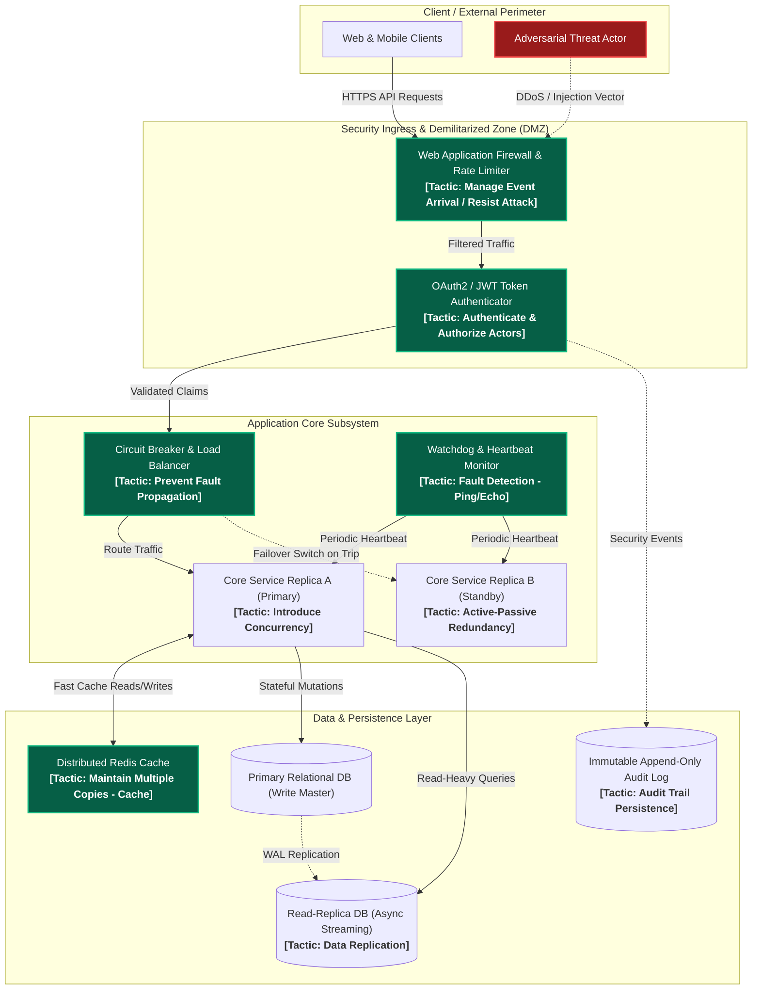

# CS-MCS-504: Software Architecture & Quality Attribute Tactics

> **Academic Level:** Master of Computer Science (Preparatory Coursework Stage)  
> **Institution:** College of Computer Science & Information Technology, University of Wasit  
> **Course:** Advanced Software Engineering (CS-MCS-504)  
> **Instructor:** Asst. Prof. Dr. Ali Fahim Ni'ma (3 Credit Hours)  
> **Prerequisites:** Undergraduate Software Engineering, Object-Oriented Design, Operating Systems & Distributed Systems Foundations

```
+-------------------------------------------------------------------------------+
|                             TOPIC NAVIGATION & SCOPE                          |
|                                                                               |
|  Subject: 04_Advanced_Software_Eng        | Week: Week 01                     |
|  Cognitive Tier: 3-Tier Progressive       | Literature Base: IEEE / ISO / SEI |
|  Target Retention: Master's Exam & Oral Defense Gateway                       |
+-------------------------------------------------------------------------------+
```

---

## 1. Executive Summary & Conceptual Bridge (Tier 1)

### 1.1. High-Level Technical Synopsis (English)
Software architecture forms the fundamental structural blueprint of a software system, embodying the early design decisions that dictate system-wide Quality Attributes (QAs)—such as availability, modifiability, performance, security, testability, and usability. While architectural patterns (e.g., Microservices, Event-Driven, Layers) offer macro-level structural topologies, **Architectural Tactics** (as formalized by Bass, Clements, and Kazman at the Software Engineering Institute) represent fine-grained design decisions that directly control and manipulate specific quality attribute response measures. 

In advanced software engineering, achieving non-functional requirements is not an accidental byproduct of clean code, but a direct consequence of deliberate tactic selection. An architectural tactic directly influences a specific property of a quality attribute model (such as reducing execution time, masking faults, or preventing unauthorized access). The international standard **ISO/IEC 25010** classifies system and software quality into eight distinct characteristics, creating a standardized taxonomic framework for specifying and evaluating architectural fitness. Master's-level software engineering requires analyzing how these individual tactics interact, introduce systemic trade-offs (e.g., security encryption degrading performance latency), and map directly into concrete source code constructs.

### 1.2. Intuitive Mental Model & Arabic Conceptual Bridge (*الجسر المفاهيمي والحدسي*)
> **الرؤية الهندسية والحدس التطبيقي:**  
> تخيل المعمارية البرمجية كبناء ناطحة سحاب عملاقة. النمط المعماري العام (*Architectural Pattern*) هو الهيكل الإنشائي العام للمبنى (مثل: نظام الجسور الفولاذية أو الخرسانة المسلحة). لكن عندما تسأل: *كيف يصمد المبنى أمام زلزال بقوة 7 درجات؟ أو كيف يتم إخماد حريق مفاجئ في الطابق 40 دون انقطاع الكهرباء؟* هنا يأتي دور **التكتيكات المعمارية (*Architectural Tactics*)**. التكتيكات هي الآليات الدقيقة المصممة خصيصاً للتصدي لمؤثرات معينة؛ مثل تركيب مخمدات الصدمات الزلزالية (*Shock Absorbers*) كإجراء احترازي للتوفرية (*Availability*)، أو استخدام أبواب عازلة للحرارة لمنع انتشار الحريق كإجراء أمني (*Security Containment*).
> 
> في هندسة البرمجيات المتقدمة، لا يمكنك تحقيق صفات الجودة بالصدفة. التكتيك المعماري هو "القرار الذري" (*Atomic Design Decision*) الذي يضمن استجابة النظام للمحفزات الخارجية (*Stimuli*) ضمن حدود مقبولة ومقاسة رياضياً.

- **المشكلة الجوهرية (*The Root Bottleneck*):** الأنماط المعمارية الكبرى (*Patterns*) واسعة وشاملة، ولا توضح للمهندس بالتحديد كيف يعالج صفة جودة منفردة (مثل تقليل زمن الاستجابة إلى ما دون $20\text{ms}$ عند ذروة الحمل).
- **الحل الهندسي (*The Architectural Solution*):** تجزئة الحلول إلى تكتيكات معمارية متخصصة (*Tactics*) تستهدف معايير استجابة محددة (*Response Metrics*) قابلة للقياس والتحقق الرياضي والعملي.
- **القاعدة الذهبية (*The Golden Invariant*):** *لا يوجد تكتيك معماري مجاني*—كل تكتيك يعزز صفة جودة معينة يفرض حتماً ضريبة على صفات جودة أخرى (*Trade-off Coupling*).

---

## 2. Formal Theoretical Foundations & Mechanics (Tier 2)

### 2.1. Mathematical Formulation & Quality Attribute Scenarios
An Architectural Quality Attribute Requirement is formalized using a **6-Part Quality Attribute Scenario**:

$$\mathcal{S}_{\text{QA}} = \langle \text{Stimulus}, \text{Stimulus Source}, \text{Environment}, \text{Artifact}, \text{Response}, \text{Response Measure} \rangle$$

Where:
- **Stimulus ($\sigma$):** The condition or arrival event that triggers a system reaction (e.g., unauthenticated client request, hardware node failure).
- **Stimulus Source ($s$):** The originating entity of the stimulus (e.g., internal timer, external adversary, downstream service).
- **Environment ($\epsilon$):** The operational condition of the system during stimulus arrival (e.g., normal operation, overloaded state, degraded failover mode).
- **Artifact ($\alpha$):** The specific subsystem, component, or communication channel stimulated.
- **Response ($\rho$):** The deterministic observable action executed by the architecture upon stimulus receipt.
- **Response Measure ($\mu$):** The mathematically quantifiable metric evaluating the adequacy of the response (e.g., MTTR $\le 2\text{s}$, latency $p99 \le 50\text{ms}$, detection latency $\le 100\mu\text{s}$).

#### Mathematical Modeling of System Availability
System Availability $\mathcal{A}$ under steady-state conditions is governed by Mean Time Between Failures ($\text{MTBF}$) and Mean Time to Repair ($\text{MTTR}$):

$$\mathcal{A} = \frac{\text{MTBF}}{\text{MTBF} + \text{MTTR}} = \frac{1}{1 + \frac{\text{MTTR}}{\text{MTBF}}}$$

- **Fault Detection Tactics** (e.g., Ping/Echo, Heartbeat, Watchdog) decrease detection latency $\tau_{\text{detect}}$.
- **Fault Recovery Tactics** (e.g., Active Redundancy, State Resynchronization, Rollback) minimize recovery duration $\tau_{\text{recover}}$.
- Total repair time: $\text{MTTR} = \tau_{\text{detect}} + \tau_{\text{recover}} + \tau_{\text{verify}}$.

$$\lim_{\text{MTTR} \to 0} \mathcal{A} = 1.0 \quad (100\% \text{ Availability})$$

### 2.2. Taxonomy of Architectural Tactics (SEI & Bass et al.)

```
                        +---------------------------------------+
                        |      ARCHITECTURAL TACTICS SUITE      |
                        +---------------------------------------+
                                            |
        +-------------------+---------------+-------------------+-------------------+
        |                   |                                   |                   |
+---------------+   +---------------+                   +---------------+   +---------------+
| AVAILABILITY  |   |  PERFORMANCE  |                   |   SECURITY    |   | MODIFIABILITY |
+---------------+   +---------------+                   +---------------+   +---------------+
| • Heartbeat   |   | • Cache Mgmt  |                   | • Authenticate|   | • Encapsulate |
| • Checkpoint  |   | • Concurrency |                   | • Authorize   |   | • Restrict Com|
| • Active Redun|   | • Bound Queue |                   | • Encrypt     |   | • Use Intermed|
| • Circuit Brk |   | • Dynamic Res |                   | • Audit Log   |   | • Config Param|
+---------------+   +---------------+                   +---------------+   +---------------+
```

1. **Availability Tactics:**
   - *Fault Detection:* Ping/Echo, Heartbeat, Timestamp, Sanity Checking, Condition Monitoring.
   - *Fault Recovery (Preparation & Repair):* Active Redundancy ($N$-way replication), Passive Redundancy (Warm/Cold Standby), State Resynchronization, Shadowing, Rollback / Forward Recovery.
   - *Fault Prevention:* Removal from Service, Transactions, Process Monitor.
2. **Performance Tactics:**
   - *Demand Management:* Increase Computation Efficiency, Reduce Computational Overhead, Manage Event Arrival Rates (Throttling / Token Bucket), Bound Queue Sizes.
   - *Resource Management:* Increase Available Resources (Horizontal/Vertical Scaling), Introduce Concurrency, Maintain Multiple Copies of Computation / Data (Caching / Read Replicas).
   - *Resource Arbitration:* Scheduling Policies (FIFO, Priority-based, Earliest Deadline First).
3. **Security Tactics:**
   - *Detect Attacks:* Intrusion Detection Systems (IDS), Anomaly Verification, Audit Logging.
   - *Resist Attacks:* Authenticate Actors, Authorize Access, Encrypt Data in Transit/Rest, Limit Exposure / Least Privilege.
   - *React to Attacks:* Revoke Access, Lockout Account, Honeypots.
   - *Recover from Attacks:* Audit Trail Investigation, State Restoration.
4. **Modifiability Tactics:**
   - *Reduce Size of Modules:* Split Component, Single Responsibility Principle.
   - *Increase Cohesion & Decrease Coupling:* Encapsulate Data, Restrict Dependencies, Introduce Intermediaries (Broker / Facade / Adapter).
   - *Defer Binding Time:* Configuration Files, Dependency Injection, Dynamic Plugin Loading.

---

## 3. Architectural Diagrams (C4 & Tactic Workflows)

### 3.1. C4 Container & Component Model with Embedded Tactics



---

## 4. Master's-Level Academic Rigor, Standards & Literature (Tier 3)

### 4.1. Formal International Standards & Frameworks
- **ISO/IEC 25010 (System and Software Quality Requirements and Evaluation — SQuaRE):**
  - *Standard Structure:* Replaces the legacy ISO/IEC 9126 standard. Decomposes software product quality into 8 core characteristics:
    1. **Functional Suitability** (Completeness, Correctness, Appropriateness).
    2. **Performance Efficiency** (Time behavior, Resource utilization, Capacity).
    3. **Compatibility** (Co-existence, Interoperability).
    4. **Usability** (Appropriateness recognizability, Learnability, Operability, User error protection, UI aesthetics, Accessibility).
    5. **Reliability** (Maturity, Availability, Fault tolerance, Recoverability).
    6. **Security** (Confidentiality, Integrity, Non-repudiation, Accountability, Authenticity).
    7. **Maintainability** (Modularity, Reusability, Analyzability, Modifiability, Testability).
    8. **Portability** (Adaptability, Installability, Replaceability).
  - *Engineering Implication:* In academic research and enterprise systems design, quality requirements must be systematically mapped from ISO/IEC 25010 characteristics to specific SEI architectural tactics.

- **ISO/IEC/IEEE 42010 (Systems and Software Engineering — Architecture Description):**
  - Defines the formal ontology of architecture descriptions: *Stakeholder, Concern, Architecture View, Architecture Viewpoint, Architecture Model, and Architecture Rationale*.
  - Mandates that architectural decisions and tactic selections must be justified by explicit Architectural Rationale (*ADRs - Architectural Decision Records*).

### 4.2. Foundational & State-of-the-Art Academic Literature

1. **Foundational Paper on Architectural Tactics Tracing (IEEE TSE):**
   - **Citation:** [Mirakhorli, M., & Cleland-Huang, J. (2016). "Detecting, Tracing, and Monitoring Architectural Tactics in Code", *IEEE Transactions on Software Engineering*, 42(3), 205–224.](https://doi.org/10.1109/TSE.2015.2479234)
   - **Key Finding:** Establishes machine learning and information retrieval classifiers to trace high-level architectural tactics (such as Heartbeat, Resource Pooling, Role-Based Access Control) directly into concrete source code footprints, proving that architectural degradation occurs when tactic implementations erode over time.
   - **Relevance to Wasit MCS Curriculum:** Directly supports automated architectural conformance checking and software maintenance in Advanced Software Engineering.

2. **Landmark Study on Pattern-Tactic Interaction (JSS):**
   - **Citation:** [Harrison, N. B., & Avgeriou, P. (2010). "How Do Architecture Patterns and Tactics Interact? A Comprehensive Approach", *Journal of Systems and Software*, 83(10), 1735–1758.](https://doi.org/10.1016/j.jss.2010.04.067)
   - **Key Finding:** Formulates the formal relationship between patterns and tactics: *Tactics are the building blocks of patterns*. A pattern packages multiple complementary tactics, but applying an additional tactic to an existing pattern can either reinforce its quality attributes or create catastrophic architectural conflicts.
   - **Thesis Research Gateway:** Developing automated synthesis tools that analyze semantic conflicts when new security tactics are injected into legacy microservice topologies.

3. **Seminal Software Architecture Foundations:**
   - **Citation:** [Garlan, D. (2000). "Software Architecture: A Roadmap", *ACM/IEEE ICSE '00*, 91–101.](https://doi.org/10.1145/336512.336537)
   - **Citation:** [Perry, D. E., & Wolf, A. L. (1992). "Foundations for the Study of Software Architecture", *ACM SIGSOFT SEN*, 17(4), 40–52.](https://doi.org/10.1145/141874.141884)
   - **Key Finding:** Formulates the classical architectural model: $\text{Architecture} = \{\text{Elements}, \text{Form}, \text{Rationale}\}$.

---

## 5. Comparative Trade-off Matrix

| Quality Attribute Focus | Core Architectural Tactic | Key Benefits (+) | Critical Trade-offs & Penalties (-) | Computational / System Complexity | Optimal Production Context |
|:---|:---|:---|:---|:---|:---|
| **Availability** | **Active Redundancy ($N$-way replication)** | • Near-zero failover time ($\text{MTTR} \approx 0$)<br>• Seamless client session survival | • $N \times$ infrastructure hardware cost<br>• Distributed consensus latency (Raft/Paxos) | $\mathcal{O}(N)$ compute overhead<br>$\mathcal{O}(\log N)$ consensus messages | Mission-critical payment gateways, medical telemetry, aerospace avionics |
| **Performance** | **Multi-tier Caching (Write-Through / LRU)** | • Sub-millisecond read latency ($p99 < 5\text{ms}$)<br>• Dramatic DB connection offloading | • Cache invalidation complexity<br>• Eventual consistency / stale read anomalies | $\mathcal{O}(1)$ lookup<br>$\mathcal{O}(M)$ cache memory budget | E-commerce product catalogs, high-volume social feeds |
| **Security** | **End-to-End Encryption & Token Interception** | • Total data privacy in transit/rest<br>• Zero-trust perimeter defense | • Heavy CPU overhead (cryptographic handshakes)<br>• Increased request latency ($\approx +15\text{ms}$) | $\mathcal{O}(k)$ crypto cipher execution<br>Key management lifecycle | Banking APIs, healthcare HIPAA records, identity federations |
| **Modifiability** | **Introduce Intermediary (API Gateway / Service Mesh)** | • Decoupled client-service routing<br>• Centralized policy & security injection | • Single point of configuration failure<br>• Extra network hop penalty ($+2\text{ms}$ - $+5\text{ms}$) | $\mathcal{O}(1)$ route resolution<br>$\mathcal{O}(R)$ routing table memory | Large-scale polyglot microservice architectures |

---

## 6. Practical Enterprise Scenario & Failure Mode Analysis

### 6.1. Production Scenario: Circuit Breaker & Fallback Tactic
> **Context:** A high-throughput fintech microservice experiences a cascading timeout cascade because a downstream third-party credit scoring API increases latency from $50\text{ms}$ to $8000\text{ms}$ under load. Thread pool exhaustion threatens to crash the entire application tier.

```python
"""
Enterprise Architectural Tactic Implementation:
Circuit Breaker with Dynamic Failure Thresholds and Local Fallback
Tactic Family: Availability -> Fault Recovery & Prevention
"""

import time
from enum import Enum
from typing import Callable, Any, Dict, Optional

class CircuitState(Enum):
    CLOSED = "CLOSED"      # Normal operation: traffic passes through
    OPEN = "OPEN"          # Fault state: requests immediately fail / route to fallback
    HALF_OPEN = "HALF_OPEN"# Trial state: canary requests test downstream health

class CircuitBreaker:
    def __init__(self, failure_threshold: int = 5, recovery_timeout_sec: float = 10.0):
        self.failure_threshold = failure_threshold
        self.recovery_timeout_sec = recovery_timeout_sec
        self.state = CircuitState.CLOSED
        self.failure_count = 0
        self.last_state_change = time.time()

    def execute(self, primary_call: Callable[[], Any], fallback_call: Callable[[], Any]) -> Dict[str, Any]:
        current_time = time.time()
        
        # State transition: OPEN -> HALF_OPEN after recovery timeout
        if self.state == CircuitState.OPEN:
            if current_time - self.last_state_change > self.recovery_timeout_sec:
                self.state = CircuitState.HALF_OPEN
                self.last_state_change = current_time
            else:
                # Fast-fail tactic: do not invoke dead downstream service
                return {"result": fallback_call(), "source": "FALLBACK_TACTIC", "state": self.state.value}

        try:
            result = primary_call()
            # Success path in HALF_OPEN recovers the circuit back to CLOSED
            if self.state == CircuitState.HALF_OPEN:
                self.state = CircuitState.CLOSED
                self.failure_count = 0
                self.last_state_change = current_time
            return {"result": result, "source": "PRIMARY_SERVICE", "state": self.state.value}
            
        except Exception as exc:
            self.failure_count += 1
            if self.failure_count >= self.failure_threshold or self.state == CircuitState.HALF_OPEN:
                self.state = CircuitState.OPEN
                self.last_state_change = current_time
            return {"result": fallback_call(), "source": "FALLBACK_ON_EXCEPTION", "error": str(exc), "state": self.state.value}
```

### 6.2. Boundary Conditions & Failure Modes (*نقاط الانهيار وحالات الحافة*)
- **Failure Mode 1 (Thundering Herd / Stampede on Cache Invalidation):**
  - *Condition:* When a high-traffic cache key expires simultaneously for 50,000 concurrent requests, all requests hit the database simultaneously, bypassing the caching tactic.
  - *Mitigation:* Employ **Mutex Locking around Cache Misses** (*Cache Stampede Lock*) or **Probabilistic Early Invalidation (XFetch algorithm)**.
- **Failure Mode 2 (Split-Brain under Asymmetric Network Partition):**
  - *Condition:* In active redundancy, if partition isolates Node A from Node B, both may elect themselves leader and process conflicting writes.
  - *Mitigation:* Require strict **Majority Quorum Voting ($\lfloor N/2 \rfloor + 1$)** and **Fencing Tokens** before committing state transitions.

---

## 7. High-Probability Exam Questions & Distractor Teardown

### 7.1. Scenario-Based Multiple Choice Question (Master's Difficulty)

**Exam Scenario:**  
A distributed healthcare imaging repository stores patient DICOM scans. The system requires:
1. Retrieval latency for emergency room scans must satisfy $p99 \le 100\text{ms}$.
2. Zero unauthorized record decryption even if intermediate network hops are intercepted.
3. System availability must remain $\ge 99.999\%$ during scheduled maintenance.

The architecture team proposes introducing an inline decompression and decryption filter directly within the central API gateway.

**Question:** Which of the following architectural evaluations most accurately identifies the fundamental flaw in this design under ISO/IEC 25010 and SEI Tactic Trade-off analysis?

- **[A]** The design violates modifiability because API gateways cannot support polymorphic filter pipelines.
- **[B]** The design creates a severe performance and availability bottleneck by coupling CPU-intensive cryptographic decryption with the central gateway, violating latency and throughput invariants under burst loads.
- **[C]** The design is invalid because ISO/IEC 25010 strictly prohibits implementing security tactics inside the demilitarized zone.
- **[D]** The design fails because symmetric key encryption cannot achieve $p99 \le 100\text{ms}$ under any hardware configuration.

<details>
<summary><b>🔍 View Model Answer, Distractor Analysis & Bilingual Rationale</b></summary>

> **Correct Answer:** **[B]**

#### English Technical Rationale:
Cryptographic decryption and decompression are computationally bounded operations ($\mathcal{O}(k \cdot \text{size})$ CPU execution). Placing heavy decryption inside the centralized API Gateway concentrates compute load at the single entry point, causing request queue buildup (violating Performance Tactic: *Manage Resource Contention* and *Bound Queue Latency*). Furthermore, if the gateway exhausts its worker pool, availability drops below the required five-nines ($\text{MTBF}$ drops, violating Availability). The architecturally sound approach is TLS termination at gateway with delegated, distributed decryption at downstream dedicated worker containers.

#### Arabic Intuitive Explanation (*تفكيك السؤال والمغالطات بالعربي*):
وضع عمليات فك التشفير الثقيلة وضغط الصور داخل بوابة العبور المركزية (*API Gateway*) يشبه وضع نقطة تفتيش جمركية تفصيلية واحدة وتفريغ كامل الشاحنات عند مدخل مدينة سريع! هذا يسبب اختناقاً مرورياً هائلاً (*Resource Exhaustion*)، مما يدمر زمن الاستجابة المطلوب ($p99 \le 100\text{ms}$) ويؤدي إلى انهيار توفرية النظام بالكامل. الحل الصحيح معمارياً هو توزيع الحمل (*Decoupling & Distributed Worker Execution*).

#### Distractor Breakdown:
- **Why [A] is False:** API gateways frequently support extensible filter pipelines (e.g., Spring Cloud Gateway, Envoy filters); modifiability is not the primary fatal flaw.
- **Why [C] is False:** ISO/IEC 25010 is a quality taxonomic standard; it does not contain prescriptive prohibitions against specific network topology zones.
- **Why [D] is False:** Hardware-accelerated symmetric encryption (e.g., AES-NI) can easily process data in microseconds; the flaw is centralized placement and resource contention, not the mathematical limits of symmetric crypto.

#### Authoritative Source / Standard:
- Ref: Bass, Clements, & Kazman, *Software Architecture in Practice*, 4th Edition, Chapter on Security & Performance Tactics.
- ISO/IEC 25010:2011 Clause 4.2 (Performance Efficiency & Reliability).
</details>

---

### 7.2. Oral Defense / Comprehensive Viva Question

**Viva Question:**  
*"Candidate, in your proposed architecture for a high-concurrency cloud platform, you have applied both the 'Active Redundancy' availability tactic and the 'Asynchronous Eventual Consistency' performance tactic. Under the CAP Theorem and PACELC theorem, prove why these two tactics can produce mutually destructive invariants, and defend your mitigation strategy before this committee."*

<details>
<summary><b>🎓 View Comprehensive Oral Defense Model Answer & Rubric</b></summary>

#### Candidate Model Response:
> *"Distinguished Committee Members, this trade-off touches the core tension of modern distributed systems engineering.*
>
> 1. **Theoretical Contradiction:**  
>    *Active Redundancy* requires all active replicas to maintain synchronous or tightly bounded state so that any replica can instantly assume master responsibility upon failover ($\text{MTTR} \to 0$). Conversely, *Asynchronous Eventual Consistency* achieves high write throughput and low client latency by decoupling the write path from immediate multi-replica synchronization ($\Delta t_{\text{sync}} > 0$). Under network partition ($\mathcal{P}$) or high write contention, a sudden failover to an eventually consistent replica causes **Stale Reads** or **Silent Data Loss (Lost Updates)**, fundamentally violating safety invariants.
>
> 2. **PACELC Formulation:**  
>    According to Abadi's PACELC theorem: If there is a Partition ($\text{P}$), how do you trade Consistency ($\text{C}$) and Availability ($\text{A}$)? Else ($\text{E}$), how do you trade Latency ($\text{L}$) and Consistency ($\text{C}$)? The naive combination attempts to claim $(\text{PA}/\text{EL})$ without acknowledging that $(\text{A})$ during failovers requires $(\text{C})$ at the replicas.
>
> 3. **Architectural Mitigation Strategy:**  
>    To reconcile this tension, we implement **Hybrid State Partitioning**:
>    - Critical ACID invariants (financial balance, cryptographic identity) are isolated into a quorum-backed consensus partition governed by **Raft/Paxos ($\text{PC}/\text{EC}$)**.
>    - High-volume sensory and analytical streams utilize **Conflict-Free Replicated Data Types (CRDTs)** with monotonic join semilattices, ensuring mathematical convergence without locking coordination.
>    - Failover triggers a brief **Fencing Epoch Protocol** to prevent split-brain writes."*

#### Evaluation Rubric:
- **Excellence ($\ge 75\%$):** Explicitly invokes PACELC/CAP theorems, identifies exact failure modes (Lost Updates, Split-Brain), and proposes a concrete mathematical/architectural mitigation (CRDTs or Quorum Consensus).
- **Passing ($60\% - 74\%$):** Recognizes the inconsistency risk but proposes generic solutions like "use better hardware" or "increase timeouts".
- **Fail ($< 60\%$):** Assumes active redundancy and eventual consistency can coexist without any synchronization or data loss risks.
</details>

---

## 8. Spaced Repetition Flashcard Prompts (Anki Deck Extraction Block)

```tsv
# Target Deck: Master-CS::04_Advanced_Software_Eng::Week_01_Architecture_Tactics
What is the fundamental difference between an Architectural Pattern and an Architectural Tactic?	An Architectural Pattern defines the macro structural topology (e.g. Microservices, Layers), while an Architectural Tactic is an atomic design decision targeting a specific quality attribute response measure (e.g. Heartbeat, Caching).	arch-tactics definitions
ما هو الفرق المعماري بين التكتيك (Tactic) والنمط (Pattern)؟	النمط (Pattern) هو الهيكل العام للبناء البرمجي، بينما التكتيك (Tactic) هو الآلية الدقيقة المصممة لضبط صفة جودة محددة (مثل التوفرية أو الأداء) ومواجهة محفزات معينة.	arch-tactics arabic-intuition
State the 6 parts of an SEI Quality Attribute Scenario.	1. Stimulus, 2. Stimulus Source, 3. Environment, 4. Artifact, 5. Response, 6. Response Measure.	arch-tactics sei-scenarios
Write the steady-state Availability formula in terms of MTBF and MTTR.	$$\mathcal{A} = \frac{\text{MTBF}}{\text{MTBF} + \text{MTTR}}$$ where MTTR includes detection, recovery, and verification latencies.	arch-tactics availability-math
Name the 8 product quality characteristics defined in ISO/IEC 25010:2011.	1. Functional Suitability, 2. Performance Efficiency, 3. Compatibility, 4. Usability, 5. Reliability, 6. Security, 7. Maintainability, 8. Portability.	iso-25010 standards
What is the core trade-off introduced by the Active Redundancy tactic?	Near-zero failover time ($\text{MTTR} \approx 0$) at the cost of $N \times$ infrastructure expenses and distributed quorum consensus synchronization overhead.	arch-tactics trade-offs
```
