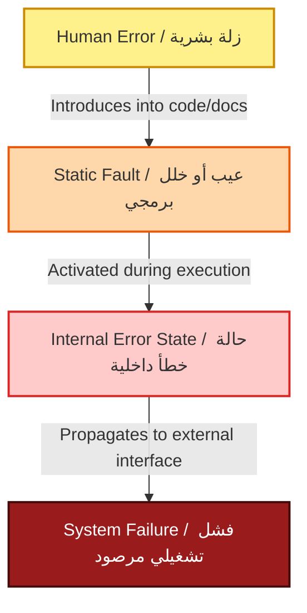

# Lecture 01: Foundations of Software Engineering, Software Crisis, and Documented Failures

> **Curricular Source:** Asst. Prof. Dr. Ali Fahim Ni'ma  
> **Course:** Advanced Software Engineering (3 Credit Hours / 3 Contact Hours)  
> **Canonical Textbooks:**  
> 1. Ian Sommerville — *Software Engineering* (9th Edition), Chapters 1 & 2  
> 2. Roger S. Pressman — *Software Engineering: A Practitioner's Approach*, Chapter 1  
> 3. Rajib Mall — *Fundamentals of Software Engineering* (4th Edition), Chapters 1 & 2  
> 4. B.B. Agarwal, S.P. Tayal, M. Gupta — *Software Engineering and Testing: An Introduction* (2010), Chapter 1  

---

## 🧭 Executive Summary & Arabic Conceptual Bridge (Tier 1)

هذه المحاضرة التأسيسية تمثل المدخل الفلسفي والمعياري لدراسة ماجستير هندسة البرمجيات. الدكتور علي فاهم يركز على الانتقال من النظرة السطحية للبرمجيات (كمجرد أسطر كود برمجية يكتبها مبرمج هاوٍ) إلى مفهوم **الهندسة النظامية الصارمة**.

تاريخياً، لم تظهر "هندسة البرمجيات" كرفاهية أكاديمية، بل ولدت من رحم كارثة حقيقية تسمى **أزمة البرمجيات (Software Crisis)** في مؤتمر الناتو عام 1968، حيث أصبحت كلفة صيانة البرمجيات وفشلها تفوق كلفة العتاد (Hardware) بأضعاف مضاعفة. تُبرز المحاضرة فشل منظومة صواريخ **الباتريوت (Patriot Missile)** عام 1991 كدليل رياضي وهندسي قاطع على أن خطأً تقريبياً صغيراً جداً في السجلات الثنائية ($24\text{-bit fixed-point}$) قادر على إزاحة نظام التتبع بمئات الأمتار والتسبب بكارثة بشرية.

كما تطرح المحاضرة أطروحة فريد بروكس الشهيرة **"لا توجد رصاصة فضية" (No Silver Bullet)** التي تفرق بين الصعوبة الجوهرية للبرمجيات (التعقيد، التوافقية، التغير، عدم المرئية) وبين الصعوبات العرضية التي حلتها لغات البرمجة وأدوات التطوير الحديثة.



---

## 1. The Evolving Role and Changing Nature of Software

In the earliest era of computing (1950s–1960s), software was treated as an afterthought—a secondary component bundled free with expensive mainframe hardware. Software development was an unmanaged craft practiced by individual mathematicians and electronic engineers.

Over seven decades, the nature of software underwent a profound structural transformation:

```
[1950s - 1960s]        [1970s - 1980s]        [1990s - 2000s]        [2010s - 2026+]
Batch Systems   ───> Multi-User Systems ───> Distributed / Web ───> Ubiquitous / Cloud / AI
- Custom software     - Real-time databases  - Client-server        - Cyber-physical systems
- No methodology      - Product software     - Global networks      - Microservices & Edge
- Hardware dominant   - Maintenance costs    - Component reuse      - Autonomous decision agents
```

### The Dual Role of Software
As formulated by Roger Pressman, modern software exhibits a distinct **dual nature**:
1. **Software as a Product:** It delivers computing capability, transforms information, produces and displays content, and drives business logic.
2. **Software as a Vehicle (The Infrastructure):** It acts as the operational conduit that manages and controls hardware, other software, operating platforms, communications networks, and cyber-physical infrastructure.

### The Socio-Technical Dimension (Sommerville Formulation)
Ian Sommerville emphasizes that advanced software does not operate in an isolated mathematical vacuum; modern software forms **Socio-Technical Systems**. A complete system encompasses:
* **The Technical Core:** Code, databases, and microservices.
* **The Operational Process:** Procedures, security runbooks, and deployment pipelines.
* **The Human Element:** Operators, organizational hierarchies, and user psychology.
A failure in communication or human training causes system collapse just as readily as a null-pointer exception.

---

## 2. Documented Failures: The Dhahran Patriot Missile & "No Silver Bullet"

### 2.1. The Patriot Missile System Disaster (Dhahran, Saudi Arabia — Feb 25, 1991)

The failure of the US MIM-104 Patriot Missile Battery during Operation Desert Storm remains the benchmark case study illustrating how minor numerical representation anomalies produce lethal, catastrophic system failures.

```
       Radar Transceiver (Calculates target location in radar track window)
                              │
  [True Scud Position]        │         [Predicted Radar Gate (Range Gate)]
           📍                 │                        🎯
           │<─────────────────┼────────────────────────>│
           │                  │                         │
           │                  │                  Shift: ~687 meters!
           └──────────────────┼─────────────────────────┘
                              │
   Result: Target classified as false track / Scud penetrates / 28 Casualties
```

#### The Mathematical Root Cause Analysis
1. **Clock Generation:** The Patriot’s central tracking computer measured operational time using an internal electronic clock that incremented an integer counter every **tenth of a second** ($0.1\text{ seconds}$).
2. **Binary Truncation in 24-Bit Registers:** To calculate real time in seconds, the system multiplied the integer count by $0.1$. In base-2 binary floating/fixed-point arithmetic, the fractional value $\frac{1}{10}$ is an infinite non-terminating repeating fraction:
   $$\frac{1}{10} = \frac{1}{2^4} + \frac{1}{2^5} + \frac{1}{2^8} + \frac{1}{2^9} + \frac{1}{2^{12}} + \dots = 0.00011001100110011001100110011\dots_2$$
3. The tracking computer hardware utilized a **24-bit fixed-point register**. It chopped and truncated the fraction at bit 24:
   $$\text{Stored Binary} = 0.00011001100110011001100_2 \approx 0.099999904632568359375_{10}$$
4. **The Truncation Error:**
   $$\Delta t = 0.1 - 0.099999904632568359375 = 0.000000095367431640625\text{ seconds per tick}$$
5. **Accumulated Drift over Continuous Operation:**
   The battery at Dhahran had been left operating continuously for approximately **100 hours**:
   $$100\text{ hours} = 100 \times 3,600 \times 10 = 3,600,000\text{ clock ticks}$$
   $$\text{Total Clock Drift} = 3,600,000 \times 0.000000095367431640625 \approx \mathbf{0.3433\text{ seconds}}$$
6. **Kinematic Consequence:**
   An incoming Iraqi Al-Hussein (Scud derivative) missile travels at Mach 5 ($\approx 1,676\text{ meters/second}$). The Patriot computes a spatial "range gate" (the volume of airspace where radar expects the target):
   $$\text{Range Gate Tracking Offset} = 1,676\text{ m/s} \times 0.3433\text{ s} \approx \mathbf{575\text{ to }687\text{ meters}}$$
7. **The Catastrophe:** The radar searched for the incoming Scud over half a kilometer away from its actual physical trajectory. The system concluded no target was present, dismissed the track, and did not launch an interceptor. The Scud struck an army barracks, killing 28 soldiers and injuring 98.

#### Key Software Engineering Takeaways:
* **The Maintenance Discrepancy:** US Army engineers had previously noticed this drift and updated some radar routines to use higher-precision 48-bit arithmetic. However, they failed to update *all* subroutines! The conversion in the range gate calculation still used the uncorrected 24-bit clock. Inconsistent maintenance is more dangerous than unpatched software.
* **Specification Envelope Violations:** The Patriot was designed in the 1970s as a mobile anti-aircraft system intended to operate for a few hours before relocation. Leaving it stationary for 100+ continuous hours violated original operational assumptions.

---

### 2.2. Frederick P. Brooks Jr.: "No Silver Bullet — Essence and Accidents of Software Engineering" (1986/1987)

Frederick Brooks (ACM A.M. Turing Award laureate and project leader for the IBM System/360) published this seminal paper challenging the recurring industry belief that a technological silver bullet will emerge to eliminate the difficulties of software development.

> **Brooks' Primary Thesis:**  
> *"There is no single development, in either technology or management technique, which by itself promises even one order of magnitude ($10\times$) improvement in productivity, in reliability, in simplicity, within a decade."*

```
                           SOFTWARE COMPLEXITY
                                    │
           ┌────────────────────────┴────────────────────────┐
           ▼                                                 ▼
   ESSENTIAL COMPLEXITY                             ACCIDENTAL COMPLEXITY
(Inherent to the problem domain)               (Associated with implementation tools)
- Complexity (non-linear scaling)              - Clumsy programming languages
- Conformity (arbitrary human rules)           - Slow manual compilers & linkers
- Changeability (pressures to modify)          - Primitive text editors & debuggers
- Invisibility (unvisualizable topology)       - Manual memory management
```

#### The Four Inherent Properties of Essential Complexity:
1. **Complexity:** Software systems are composed of vast numbers of non-identical interacting parts. When a physical system doubles in size, geometric symmetry often simplifies it; when software doubles in size, the combinatorial space of internal state transitions grows exponentially.
2. **Conformity:** Software must conform to arbitrary human institutions, legacy hardware, judicial regulations, and external business processes. Unlike physics or civil engineering, software cannot appeal to natural physical laws for simplification.
3. **Changeability:** Because software exists as malleable bits rather than cured concrete or steel, it faces perpetual pressure to change. Successful software is continually modified to accommodate new functional environments until its architectural integrity deteriorates.
4. **Invisibility:** Software is inherently unvisualizable. Physical machines can be represented through geometric diagrams, architectural blue-prints, or physical models. Software has no geometric representation; attempting to map it reveals overlapping, multi-dimensional webs of control flow, data flow, dependency structures, and memory references.

#### What Addressed Accidental Complexity (Past Gains):
Past $10\times$ gains came from resolving accidental bottlenecks:
* High-level languages (freed developers from machine-level assembly registers).
* Time-sharing / interactive terminals (eliminated days of waiting for punched card batch runs).
* Integrated development environments (IDEs), automatic memory management (garbage collection), and component libraries.

Once accidental complexity is eliminated, the remaining development effort is dominated by **essential complexity** (conceptualizing the solution, defining requirements, and designing architectures), which cannot be automated away by simple tools.

---

## 3. What Software Truly Is: Code + Data + Documentation

In undergraduate and amateur settings, software is mistakenly equated solely with executable source code. In advanced graduate software engineering, software is defined as a formal tripartite engineering asset:

$$\mathbf{Software} = \mathbf{Programs} + \mathbf{Data\ Structures} + \mathbf{Documentation}$$

```
                          ┌──────────────────────────┐
                          │     SOFTWARE ASSET       │
                          └─────────────┬────────────┘
         ┌──────────────────────────────┼──────────────────────────────┐
         ▼                              ▼                              ▼
 1. PROGRAMS (CODE)            2. DATA STRUCTURES             3. DOCUMENTATION
 - Executable binaries         - Relational & NoSQL schemas   - Architectural specifications
 - Source code (clean, testable)- In-memory structures & graphs- Requirement specifications (SRS)
 - Build & deployment scripts   - Configurations & seed files - API contracts (OpenAPI/Swagger)
 - Automated unit/integration tests - State representations    - User & Administrator manuals
```

### The Three Pillars Detailed:
1. **Programs (Code):** The operational instructions that execute on target hardware. Must be structured, maintainable, modular, and covered by automated verification suites.
2. **Data Structures:** The structural models, database schemas, message payloads, and cache organizations that allow the program to manipulate information efficiently. Without clean data models, programs cannot maintain semantic coherence.
3. **Associated Documentation:**
   * **Development / Architectural Documentation:** Software Requirements Specification (SRS, ISO 29148), Architecture Decision Records (ADRs), component interfaces, and threat models.
   * **Operational Documentation:** Deployment instructions, monitoring alerts, incident response playbooks, and disaster recovery procedures.
   * **User Documentation:** Operational manuals, training guides, and release notes.

> **Engineering Rule:** Code without documentation is not software; it is merely an undocumented technical liability. An unmaintained codebase without architecture documentation guarantees project abandonment.

---

## 4. Formal Definition of Software Engineering & The Software Process

### 4.1. Official Standards Definitions

#### IEEE Standard 610.12 Definition:
> *"Software Engineering is the application of a systematic, disciplined, quantifiable approach to the development, operation, and maintenance of software; that is, the application of engineering to software."*

#### Fritz Bauer's Classic Formulation (Garmisch, 1968):
> *"The establishment and use of sound engineering principles in order to obtain economically software that is reliable and works efficiently on real machines."*

### 4.2. Computer Science vs. Software Engineering: The Academic Distinction

| Dimension | Computer Science (CS) | Software Engineering (SE) |
|---|---|---|
| **Primary Focus** | Mathematical theory, algorithmic complexity, formal logic, computability. | Systematic development, lifecycle management, quality attributes, practical delivery. |
| **Success Metric** | Proof correctness, asymptotic complexity ($O(N \log N)$), theoretical elegance. | High availability, maintainability, customer satisfaction, budget & schedule compliance. |
| **Scale** | Individual algorithms, self-contained programs, lab experiments. | Large-scale multi-person systems, legacy integration, long-term evolution (10–20 years). |
| **Constraints** | Computational limits, memory limits, mathematical boundaries. | Cost, schedule, incomplete requirements, legal compliance, human factors. |

### 4.3. The Fundamental Software Process Activities (Sommerville & Pressman)

Regardless of the development lifecycle model chosen (Waterfall, V-Model, Scrum, Kanban, Extreme Programming), all engineering processes consist of four universal foundational activities:

```
┌─────────────────────┐      ┌─────────────────────┐
│ 1. SPECIFICATION    │ ───> │ 2. DEVELOPMENT      │
│ (Requirements Eng)  │      │ (Design & Code)     │
└─────────────────────┘      └─────────────────────┘
           │                            │
           ▼                            ▼
┌─────────────────────┐      ┌─────────────────────┐
│ 4. EVOLUTION        │ <─── │ 3. VALIDATION       │
│ (Maintenance/Refac) │      │ (V & V / Testing)   │
└─────────────────────┘      └─────────────────────┘
```

1. **Software Specification (Requirements Engineering):** Defining what functionality the system must provide and the operational constraints under which it must execute.
2. **Software Development (Architecture, Design & Implementation):** Translating the abstract specification into an executable system through layered architectural design, component decomposition, and coding.
3. **Software Validation (Verification and Validation):**
   * *Verification:* "Are we building the product right?" (Conforming to specifications, code reviews, static analysis).
   * *Validation:* "Are we building the right product?" (Ensuring the system satisfies true user needs and operational goals).
4. **Software Evolution (Maintenance):** Modifying and re-architecting the software to meet evolving customer needs, security patches, performance scaling, and hardware migrations.

---

## 5. The Software Crisis: Historical Foundations, IBM Metrics & Realities

The term **Software Crisis** was officially introduced at the landmark **1968 NATO Science Committee Conference** in Garmisch, Germany. Leaders in computing recognized that software projects were consistently failing, bankrupting enterprises, and resisting traditional project management.

### 5.1. Symptoms of the Crisis
1. **Severe Schedule Overruns:** Projects delivered years behind promised schedules or never delivered at all.
2. **Exponential Budget Blowouts:** Projects exceeding original estimates by $200\%$ to $500\%$.
3. **Substandard Quality:** Software delivered with hundreds of latent bugs, causing frequent crashes and corrupting databases.
4. **The Maintenance Trap:** Maintenance costs consumed between $70\%$ and $85\%$ of all IT budgets, leaving little capital for new innovation.

### 5.2. Historical Metrics: The IBM OS/360 Experience
The development of IBM's operating system for the System/360 architecture in the 1960s was the single largest empirical software catastrophe of its era:
* **Initial Plan:** Budget of a few million dollars, scheduled for rapid delivery.
* **Actual Reality:**
  * Consumed over **5,000 man-years** of engineering effort.
  * Cost more than **$50,000,000** (equivalent to hundreds of millions today).
  * The release was delayed by multiple years.
  * Upon initial delivery, OS/360 contained thousands of documented defects requiring hundreds of subsequent patch releases.
* **Fred Brooks' Empirical Lessons (From *The Mythical Man-Month*):**
  * **Brooks' Law:** *"Adding human resources to a late software project makes it later."* Why? Because onboarding new engineers incurs training overhead and causes an $O(N^2)$ combinatorial explosion in team communication channels ($C = \frac{N(N-1)}{2}$).
  * A complex software project cannot be partitioned linearly like harvesting crops. "Nine women cannot produce a baby in one month."

### 5.3. Contributing Causes to the Crisis
* **Hardware Advances (Moore's Law):** Computing power grew exponentially, enabling machines to execute larger systems than human unassisted memory could comprehend.
* **Absence of Engineering Methods:** Programmers relied on individual cleverness rather than structured methodologies, modularity, and configuration management.
* **Inadequate Requirements Engineering:** Requirements were treated casually, leading to massive downstream architectural churn.

---

## 6. Software Myths: Management, Customer, and Practitioner

Roger Pressman classifies the persistent false beliefs that permeate software organizations into three categories:

### 6.1. Management Myths
| Management Myth | Empirical Reality |
|---|---|
| *"We already have a comprehensive book of standards and procedures; our people know everything they need."* | Most standard binders sit unread on shelves. Following obsolete, rigid procedures does not guarantee modern quality or cloud readiness. |
| *"If we fall behind schedule, we can simply add more programmers to catch up."* | **Brooks' Law holds:** Adding people increases communication overhead and disrupts existing developers who must train newcomers, making the project later. |
| *"If we outsource the software development to a third party, we can just relax and let them build it."* | If an organization cannot rigorously define and manage software internally, it will completely fail when managing external offshore contracts. |

### 6.2. Customer / Stakeholder Myths
| Customer Myth | Empirical Reality |
|---|---|
| *"A general statement of objectives is enough to begin writing code; we can work out the details as we go."* | Ambiguous requirements guarantee massive rework. Unclear specifications are the number one cause of project abandonment. |
| *"Software is flexible and easy to change; requirements can be modified continuously at any stage."* | The cost of change grows exponentially. Modifying a requirement during architecture costs $1\times$; modifying it after deployment costs up to $100\times$. |

### 6.3. Practitioner / Developer Myths
| Practitioner Myth | Empirical Reality |
|---|---|
| *"Once we write the code and get it to compile, our job is done."* | Delivering working code is only the beginning. Post-deployment maintenance and evolution consume $60\%\text{--}80\%$ of total lifetime effort. |
| *"Until I get the program running, I have no way of assessing its quality."* | Formal design inspections, architecture reviews, and static analysis catch between $60\%$ and $80\%$ of defects before a single line of code is executed. |
| *"The only deliverable work product is the working binary program."* | Working code without tests, architecture documentation, and runbooks is a maintainability failure that guarantees technical bankruptcy. |

---

## 7. Core Terminology Taxonomy: Error, Fault, Defect, and Failure

In graduate-level software engineering, calling everything a "bug" is prohibited. We employ the formal taxonomy codified by the **IEEE Standard 610.12** and **Jean-Claude Laprie / Algirdas Avižienis** (The Dependability Paradigm):

```
       [Human Action]                [Static Artifact]                 [Runtime State]                [Observable Service]
 ┌───────────────────────┐      ┌─────────────────────────┐      ┌────────────────────────┐      ┌────────────────────────────┐
 │         ERROR         │      │      FAULT / DEFECT     │      │      INTERNAL ERROR    │      │          FAILURE           │
 │ (Human mental mistake │ ───> │  (Incorrect step/logic  │ ───> │ (Invalid internal state│ ───> │   (Service deviates from   │
 │   or typo by dev)     │      │   stored in code/spec)  │      │     during runtime)    │      │   specified expectations)  │
 └───────────────────────┘      └─────────────────────────┘      └────────────────────────┘      └────────────────────────────┘
```

### Detailed Definitions:

1. **Error (Human Mistake):**
   * *Definition:* A human action that produces an unintended, incorrect result.
   * *Origin:* Cognitive slip, misunderstanding of a business requirement, algorithmic flaw, or fatigue.
   * *Example:* A programmer writes `if (buffer_len > MAX)` instead of `if (buffer_len >= MAX)`.

2. **Fault (Defect / "Bug"):**
   * *Definition:* A physical or logical condition in a software component or document that, if activated, may cause a failure. It is the static, dormant flaw embedded in the artifact (code, design model, or SRS).
   * *Property:* A fault can remain dormant inside source code for years without causing issues if that specific branch or input boundary is never executed.

3. **Defect:**
   * *Definition:* Synonymous with fault in standard IEEE nomenclature; specifically used in quality assurance to describe any non-conformance of an artifact with its specified requirements.

4. **Failure (Dynamic Breakdown):**
   * *Definition:* The observable event where a system's delivered service deviates from its specified intended behavior or fails to perform within specified limits.
   * *Condition:* A failure occurs *only during execution* when a dynamic execution trace activates a dormant fault, causing an invalid internal state that propagates across the system's boundary to the end user or calling service.

> **Crucial Academic Distinction:**  
> A system can contain thousands of latent **faults** without experiencing a single **failure** (if those code paths are never triggered). Conversely, an environment change can cause a dormant fault to produce catastrophic, repeated **failures** (as occurred in the Patriot Missile).

---

## 8. Professional Ethics: The ACM/IEEE Software Engineering Code

Software engineers design systems that directly impact human health, financial infrastructure, national security, and civic privacy. In response to high-stakes failures, the **Joint IEEE Computer Society and ACM Steering Committee** established the **Software Engineering Code of Ethics and Professional Practice**.

### The 8 Core Principles:

```
                              ACM / IEEE ETHICS CODE
                                         │
        ┌───────────────────┬────────────┴────────────┬───────────────────┐
        ▼                   ▼                         ▼                   ▼
    1. PUBLIC         2. CLIENT & EMPLOYER       3. PRODUCT          4. JUDGMENT
 (Public Interest)      (Fiduciary Duty)     (Highest Standards)   (Integrity & Independence)
        │                   │                         │                   │
        ▼                   ▼                         ▼                   ▼
  5. MANAGEMENT       6. PROFESSION             7. COLLEAGUES          8. SELF
 (Ethical Leadership) (Reputation & Standards)  (Fairness & Support) (Lifelong Learning)
```

1. **PUBLIC (Public Interest):** Software engineers shall act consistently with the public interest. If a software system threatens human safety, public welfare, or privacy, the engineer has a professional obligation to blow the whistle or refuse deployment.
2. **CLIENT AND EMPLOYER:** Act in the best interests of the client and employer, consistent with the overarching public interest.
3. **PRODUCT:** Strive for the highest professional quality, testing rigor, and architectural integrity. Never deliver software known to contain critical unverified flaws.
4. **JUDGMENT:** Maintain professional objectivity, ethical integrity, and independence. Refuse to rubber-stamp deceptive metrics or compromised safety assessments.
5. **MANAGEMENT:** Software managers shall subscribe to and promote ethical development, transparent scheduling, and never pressure developers to cut critical testing corners.
6. **PROFESSION:** Advance the integrity, reputation, and public standing of the software engineering discipline.
7. **COLLEAGUES:** Be fair, transparent, and supportive of fellow practitioners, crediting contributions and mentoring junior engineers.
8. **SELF:** Commit to lifelong professional education, staying abreast of evolving security practices, architectural paradigms, and ethical impacts.

---

## 9. Comprehensive Trade-off Analysis Matrix

| Dimension / Topic | Conventional Craft Programming | Disciplined Software Engineering |
|---|---|---|
| **Primary Artifact** | Executable source code only. | Tripartite asset: Code + Data Structures + Complete Documentation. |
| **Response to Change** | Ad-hoc patching; immediate code edits. | Impact analysis, change control boards, regression verification. |
| **Quality Verification** | Late testing / reactive debugging after deployment. | Early verification (reviews, static analysis) + automated continuous validation. |
| **Failure Management** | Treating all issues as generic "bugs". | Rigorous taxonomy: Error $\rightarrow$ Fault $\rightarrow$ Failure causal analysis. |
| **Resource Allocation** | Heaviest effort spent during initial coding. | Lifecycle planning; design to minimize the $70\%$ maintenance footprint. |
| **Complexity Focus** | Obsessing over accidental tool syntax. | Managing essential complexity through architectural abstraction. |

---

## 10. Master's Examination & Oral Defense Simulation (Viva Questions)

### Question 1 (Scenario-Based MCQ):
**Scenario:** A flight control avionics module operates correctly during standard low-altitude cruise. However, when executing a rapid supersonic dive under high thermal stress, a sensor reading overflows an internal 16-bit accumulator, causing the horizontal stabilizer to lock up. In the formal IEEE/Laprie dependability taxonomy:
* A) The sensor overflow is an error; the developer's mathematical oversight is a failure.
* B) The developer's incorrect variable sizing is an error; the dormant static 16-bit declaration is a fault; the stabilizer lockup is a failure.
* C) The lockup is a fault; the sensor overflow is a defect.
* D) The developer's code is an error; the stabilizer lockup is a fault.

> **Answer:** **B**  
> **Explanation (Bilingual):**  
> The developer's cognitive mistake in choosing a 16-bit type is the **Error** (زلة بشرية). The static code declaration `int16_t accumulator;` in the source repository is the **Fault/Defect** (عيب ساكن). The resulting incorrect value at runtime is an internal error state, and the observable cessation of stabilizer service is the **Failure** (فشل مرصود).

### Question 2 (Oral Defense / Viva Prompt):
**Dr. Ali Fahim asks:** *"Explain why Brooks' 'No Silver Bullet' principle implies that modern advancements like Generative AI, cloud computing, and low-code platforms cannot completely eliminate the software crisis."*
* **Model Viva Answer:**
  > *"Generative AI and automated tooling primarily accelerate **accidental complexity**—they synthesize boilerplate syntax, generate unit test scaffolding, and manage deployment plumbing. However, the **essential complexity** of software—discovering ambiguous business requirements, guaranteeing mathematical conformity to complex legal standards, managing non-linear architectural dependencies, and designing for volatile future changes—remains fundamentally human and conceptual. Because the essence of software engineering is deciding what to build rather than the mechanical act of typing code, no tool can eliminate essential complexity."*

---

## 11. Anki Spaced Repetition Flashcards (TSV Export Block)

```tsv
What was the mathematical cause of the 1991 Dhahran Patriot Missile failure?	Truncation of the infinite binary fraction 1/10 in a 24-bit fixed-point register, accumulating a 0.3433-second drift over 100 hours, shifting the radar range gate by ~687 meters.
What is the primary thesis of Fred Brooks' "No Silver Bullet"?	No single technology or management technique will yield a 10x order-of-magnitude increase in productivity, reliability, or simplicity within a decade.
According to Brooks, what are the four properties of Essential Complexity in software?	Complexity, Conformity, Changeability, and Invisibility.
Define Software in advanced graduate software engineering.	Software = Executable Programs (Code) + Data Structures + Complete Associated Documentation (SRS, architecture, operations manuals).
Differentiate between an Error, a Fault, and a Failure.	Error: Human mental mistake. Fault/Defect: Static dormant flaw in code/document. Failure: Observable dynamic deviation of service from specifications at runtime.
State Brooks' Law regarding project staffing.	"Adding human resources to a late software project makes it later" due to training overhead and O(N^2) communication channel growth.
```
