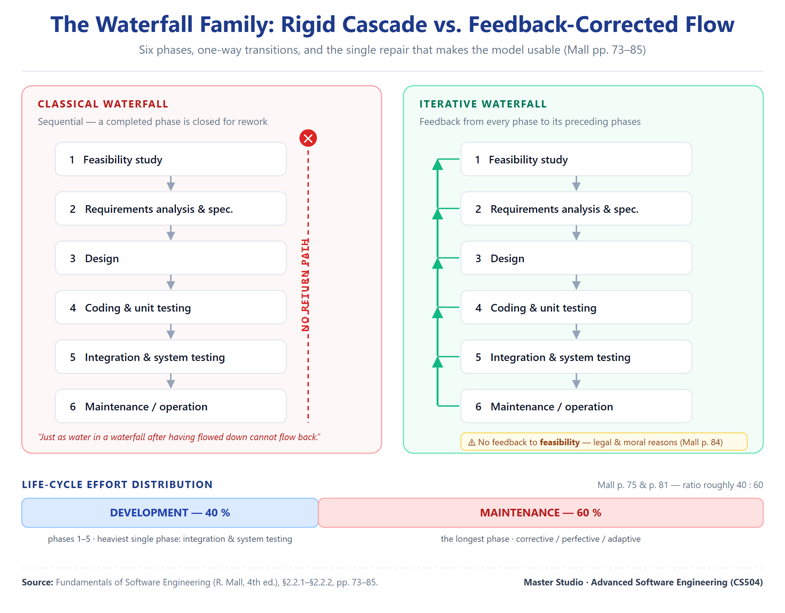

# Unit 02 — Build & Fix and the Waterfall Family

> **Sources.** Mall, *Fundamentals of Software Engineering* 4th ed., pp.28 and 72–91. Sommerville, *Software Engineering* 9th ed., pp.46–49.
> **Page numbers are PDF page numbers**, not printed page numbers.
> **Method.** Every definition is quoted verbatim from the source before it is explained, and every claim carries a page anchor. Where a concept rests on a single source, or where a phase is summarised rather than reproduced in full, the coverage note says so explicitly.

---

## Where this sits

**Previous unit:** Unit 01 established that a team needs a process — a *"precise understanding as to when to do what"* — and that the reason is coordination, not skill.

**The problem this file opens with:** *what did people actually do before there was a process — and what did the first real process look like?*

**The question it hands to the next unit:** the waterfall family works, but **only when the requirements are stable** — and Unit 01 established that requirements begin vague and keep changing. So the next four models are all attempts to repair that one weakness. The next unit takes the first repair: **learn the requirements by building something.**

---

## 1. Build and fix — the era before process

### 1.1 The arc the term sits inside

Mall frames build-and-fix not as a model but as a **stage in the profession's history**. The section is titled *"Evolution—From an Art Form to an Engineering Discipline"*.

> **Verbatim (Mall p.28):** *"Software engineering principles have evolved over the last sixty years with contributions from numerous researchers and software professionals. Over the years, it has emerged from a **pure art to a craft, and finally to an engineering discipline*."

Mall ما يقدّم build-and-fix كنموذج — يقدّمه كـ**مرحلة بالتاريخ المهني**. عنوان القسم: *«التطوّر — من شكل فنّي إلى انضباط هندسي»*. وهندسة البرمجيات تطوّرت على مدى ستين سنة من **فنّ خالص**، إلى **حرفة**، وأخيراً إلى **انضباط هندسي**.

**ليش هذا مهم؟** لأنه يحدد **الموقع المنطقي** لـbuild-and-fix: هو **ما كان قبل الهندسة**، مو نموذج منافس. يعني ما ينقارن بـWaterfall كخيار — هو **الوضع الافتراضي اللي تنشأ منه الحاجة للعملية**.

### 1.2 The three names for the same style

> **Verbatim (Mall p.28):** *"The early programmers used an **ad hoc programming style**. This style of program development is now variously being referred to as **exploratory, build and fix, and code and fix** styles."

ثلاث تسميات لنفس الأسلوب: **exploratory · build and fix · code and fix**. وكلها تعني **أسلوب برمجة عشوائي (ad hoc)**.

**لللامتحان:** لو جاب السؤال اسم واحد منهن، اعرف إن الثلاثة مترادفة. وهذا نوع سؤال سهل يضيّع الطالب.

### 1.3 What build and fix actually is

> **Verbatim (Mall p.28):** *"In a **build and fix** style, a program is quickly developed **without making any specification, plan, or design**. The different imperfections that are subsequently noticed are fixed."

التعريف دقيق ومحدد: **يُطوَّر البرنامج بسرعة بلا مواصفة ولا خطة ولا تصميم**، وبعدين **تُصلَّح العيوب اللي تُلاحظ لاحقاً**.

**لاحظ البنية:** ثلاث أشياء **معدومة** (specification · plan · design)، وشي واحد **موجود** (fixing بعد الملاحظة). يعني **البناء أول، والفهم بعدين**. وهذي **بالضبط** عكس ما تقوله الملفات الجاية.

### 1.4 Exploratory — the style beneath the style

> **Verbatim (Mall p.28):** *"The **exploratory** programming style is an **informal** style in the sense that there are **no set rules or recommendations** that a programmer has to adhere to — **every programmer himself evolves his own software development techniques** solely guided by his own **intuition, experience, whims, and fancies*."

الـ**exploratory** أسلوب **غير رسمي**: ما فيه قواعد ولا توصيات ملزمة، و**كل مبرمج يطوّر تقنياته بنفسه**، موجّه فقط بـ**الحدس والخبرة والأهواء والخيالات**.

**انتبه لكلمة `whims and fancies`** (أهواء وخيالات) — Mall يختار كلمات **سلبية عن قصد**. هذا مو وصف محايد؛ هذا **حكم**.

### 1.5 The verdict on build and fix

> **Verbatim (Mall p.28):** *"The exploratory style **comes naturally to all first time programmers**. Later in this chapter we point out that **except for trivial problems, the exploratory style usually yields poor quality and unmaintainable code** and also makes program development **very expensive as well as time-consuming*."

And the historical honesty:

> **Verbatim (Mall p.28):** *"the build and fix style was **widely adopted by the programmers in the early years of computing history**. We can consider the exploratory program development style as an **art** — since this style, as is the case with any art, is mostly guided by intuition. There are many stories about programmers in the past who were like **proficient artists** and could write good programs using an essentially build and fix model and some esoteric knowledge."

الحكم من ثلاث جهات:

| الجهة | الحكم |
|:---|:---|
| **الطبيعية** | **يجي طبيعياً لكل مبرمج مبتدئ** — مو اختيار، هو الافتراضي |
| **الجودة** | **ما عدا المشاكل التافهة** → **كود رديء وغير قابل للصيانة** |
| **الكلفة** | **مكلف جداً ومستهلك للوقت** |

**والنقطة التاريخية المهمة:** Mall **ما يهاجم الماضي** — يقول إن build-and-fix كان **منتشراً على نطاق واسع**، وإن بعض المبرمجين كانوا **فنانين بارعين** يكتبون برامج جيدة به. ويصفه بأنه **فنّ**.

**ليش يهم هذا؟** لأنه يعني **الفنّ نجح مع الأفراد الموهوبين، وفشل مع الفرق** — وهذا **بالضبط** ما قاله الملف 01 بحجّة فشل الفريق. **الملفان يتفقان على نفس الاستنتاج من جهتين مختلفتين.**

### 1.6 Why the model fails at scale — the link to Unit 01

Mall's own link back to the argument in Unit 01:

> **Verbatim (Mall p.71):** *"While development of a software of the former type could succeed even while an individual programmer uses a **build and fix** style of development, use of a **suitable SDLC is essential** for a professional software development project involving team effort to succeed."

**الربط المباشر بالوحدة 01:** build-and-fix **يكدر ينجح** مع **مبرمج فرد**، بس **ما ينجح** مع **فريق** على برنامج احترافي.

**القاعدة اللي تطلع من الملفين معاً:**

| | مبرمج فرد | فريق |
|:---|:---|:---|
| **برنامج صغير** | build-and-fix ينجح | — |
| **برنامج احترافي** | — | **SDLC ضروري** |

---

## 2. Phase entry and exit criteria — the concept that makes phases work

Before the waterfall itself, Mall establishes what makes a *phase* a phase. This is the machinery that all the models in the series depend on.

> **Verbatim (Mall p.73):** *"If the **entry and exit criteria** for various phases are not well-defined, then that would leave enough scope for **ambiguity** in starting and ending various phases, and cause lot of confusion among the developers. Sometimes they might **prematurely stop** the activities in a phase, and some other times they might **continue working on a phase much after** when the phase should have been over."

> **Verbatim (Mall p.73):** *"The decision regarding whether a phase is complete or not becomes **subjective** and it becomes difficult for the project manager to accurately tell how much has the development progressed. When the phase entry and exit criteria are not well-defined, the developers might close the activities of a phase **much before they are actually complete, giving a false impression of rapid progress*."

**معايير الدخول والخروج (entry and exit criteria)** هي اللي تحدد **متى تبلش المرحلة ومتى تخلص**. بدونها:

- **غموض** بالبداية والنهاية،
- الفريق **يوقف المرحلة بدري** أو **يستمر بيها بعد ما كان المفروض تخلص**،
- قرار «المرحلة مكتملة لو لا؟» يصير **ذاتياً**،
- والمطورين **يسكّرون المرحلة قبل ما تكتمل فعلاً** → **انطباع كاذب بالتقدّم السريع**.

### 2.1 The 99 per cent complete syndrome

> **Verbatim (Mall p.73):** *"This usually leads to a problem that is usually identified as the **99 per cent complete syndrome**. This syndrome appears when there the software project manager has no definite way of assessing the progress of a project, the **optimistic team members feel that their work is 99 per cent complete even when their work is far from completion** — making all projections made by the project manager about the project completion time to be **highly inaccurate*."

**متلازمة الـ99% مكتمل.** تظهر لما مدير المشروع **ما عنده طريقة محددة** لتقييم التقدّم، فيحسّ **الأعضاء المتفائلون** إن شغلهم **99% مكتمل** وهو **بعيد جداً عن الاكتمال** — وكل تقديرات وقت الإنجاز تصير **غير دقيقة جداً**.

**ليش هذا مفهوم قوي؟** لأنه يشرح **فشل مشاريع مو بسبب الكود، بل بسبب القياس**. ولو تذكره بسيناريو امتحاني، فهذا **مصطلح مميّز** يدل على فهم عميق.

**وهذا مو هامش — هذا هو السبب اللي يجعل كل النماذج الجاية تحتاج «معالم» (milestones) واضحة.**

---

## 3. The classical waterfall model

### 3.1 What it is, and why it is studied

> **Verbatim (Mall p.73):** *"The waterfall model and its derivatives were **extremely popular in the 1970s** and still are **heavily being used** across many development projects. The waterfall model is possibly the **most obvious and intuitive** way in which software can be developed through team effort. We can think of the waterfall model as a **generic model that has been extended in many ways** for catering to certain specific software development situations to **realise all other software life cycle models**. For this reason, after discussing the classical and iterative waterfall models, we discuss its various extensions."

> **Verbatim (Mall p.73):** *"Classical waterfall model is intuitively the most obvious way to develop software. It is **simple but idealistic**. In fact, it is **hard to put this model into use in any non-trivial software development project*."

And the justification for studying something unusable:

> **Verbatim (Mall p.73):** *"One might wonder if this model is hard to use in practical development projects, then why study it at all? The reason is that **all other life cycle models can be thought of as being extensions of the classical waterfall model*."

> **Verbatim (Mall p.74):** *"Therefore, it makes sense to first understand the classical waterfall model, in order to be able to develop a proper understanding of other life cycle models. Besides, we shall see later in this text that this model **though not used for software development; is implicitly used while documenting software*."

**أهم فكرة بهذا الملف كله:**

> **Waterfall ليس نموذجاً منافساً — هو النموذج الأمّ اللي تنبثق منه كل النماذج الثانية.**

Mall يقولها صراحة: **كل نماذج دورة الحياة الثانية يمكن اعتبارها امتدادات للـWaterfall الكلاسيكي**. ولهذا ندرسه **مع إنه صعب الاستخدام**: لأنه **الأساس اللي يفهمك الباقي**.

**ووصفه الدقيق:** **بسيط لكن مثالي (simple but idealistic)** — و**صعب استخدامه بأي مشروع غير تافه**.

**والجملة اللي تنحفظ:** *"though not used for software development; is **implicitly used while documenting software*" — يعني **حتى لو ما تستخدمه للتطوير، تستخدمه ضمنياً بالتوثيق**. (وهذا مفتوح بالتفصيل بـ§3.7.)

### 3.2 Why the name

> **Verbatim (Mall p.74):** *"It can be easily observed from this figure that the diagrammatic representation of the classical waterfall model **resembles a multi-level waterfall**. This resemblance justifies the name of the model."

الاسم **من الشكل**: التمثيل البياني **يشبه شلالاً متعدد المستويات**. يعني الاسم **وصفي بصري**، مو اسم مؤلف ولا اختصار. (ونفس الشي راح نشوفه بـV-model.)

### 3.3 The six phases

> **Verbatim (Mall p.74):** *"As shown in Figure 2.1, the different phases are — **feasibility study, requirements analysis and specification, design, coding and unit testing, integration and system testing, and maintenance*."

> **Verbatim (Mall p.74):** *"The phases starting from the **feasibility study to the integration and system testing** phase are known as the **development phases**. A software is developed during the development phases, and at the completion of the development phases, the software is **delivered to the customer*."

> **Verbatim (Mall p.74):** *"After the delivery of software, customers start to use the software signalling the commencement of the **operation phase**… Therefore, the last phase is also known as the **maintenance phase** of the life cycle."

**الست مراحل بالترتيب:**

| # | المرحلة | التصنيف |
|:---:|:---|:---|
| 1 | **Feasibility study** | تطوير |
| 2 | **Requirements analysis and specification** | تطوير |
| 3 | **Design** | تطوير |
| 4 | **Coding and unit testing** | تطوير |
| 5 | **Integration and system testing** | تطوير |
| 6 | **Maintenance** (= operation) | تشغيل |

**التصنيف المهم:** المراحل **1→5** هي **development phases**، وبعدها التسليم، وبعدها المرحلة 6.

**تنبيه Mall:** *"some of the text books have different number and names of the phases"* (p.75).

**احفظ هذا التنبيه.** كتب ثانية تستخدم **أرقاماً وأسماء مختلفة** للمراحل. فلو شفت نموذج بخمس مراحل أو بسبع، **مو تناقض** — اختلاف تقطيع. ولو سألك الدكتور بأسماء Mall، جاوب بأسماء Mall.

**ومقارنة مع Sommerville:** عنده **خمس** مراحل: *requirements analysis and definition · system and software design · implementation and unit testing · integration and system testing · operation and maintenance* (Sommerville p.48). **الفرق الأساسي: Sommerville ما عنده feasibility study كمرحلة.** وهذي نقطة مهمة لو سألك «شنو المرحلة الأولى؟» — الجواب يعتمد على المصدر.

### 3.4 Project management — the activity outside the phases

> **Verbatim (Mall p.75):** *"An activity that spans all phases of software development is **project management**. Since it spans the entire project duration, **no specific phase is named after it**. Project management, nevertheless, is an important activity in the life cycle and deals with managing the software development and maintenance activities."

**إدارة المشروع نشاط يمرّ على كل المراحل** — ولهذا **ما سمّوا مرحلة باسمه**. لكنه **نشاط مهم** يدير أنشطة التطوير والصيانة.

**ليش يذكرها؟** لأنها **استثناء بالبنية**: كل شي بالمراحل، إلا هذا. لو سألك «وين موقع إدارة المشروع بالنموذج؟» — الجواب: **خارج المراحل، يغطيها كلها**.

### 3.5 The effort distribution — the number that changes how you think

> **Verbatim (Mall p.75):** *"Observe from Figure 2.2 that among all the life cycle phases, the **maintenance phase normally requires the maximum effort**. On the average, about **60 per cent of the total effort** put in by the development team in the entire life cycle is spent on the maintenance activities alone."

> **Verbatim (Mall p.75):** *"However, among the **development phases**, the **integration and system testing** phase requires the **maximum effort** in a typical development project."

> **Verbatim (Mall p.81):** *"Many studies carried out in the past confirm this and indicate that the ratio of relative effort of developing a typical software product and the total effort spent on its maintenance is roughly **40:60*."

**توزيع الجهد — رقم يغيّر طريقة تفكيرك:**

| | النسبة |
|:---|:---|
| **التطوير** (كل المراحل 1→5) | **40%** |
| **الصيانة** (المرحلة 6) | **60%** |

**و داخل مراحل التطوير:** مرحلة **Integration and system testing** هي **الأثقل**.

**ليش هذا الرقم مهم جداً؟**

لأنه **يقلب أولوياتك**: لو **60% من الجهد** يروح للصيانة، فالنموذج اللي ما يعالج الصيانة زين **نموذج يفشل بستين بالمئة من الشغل** — حتى لو بنيته الأولى كانت أنيقة.

**وهذا يربط بالمفهوم السابق:** هناك شفنا إن مرحلة التشغيل **أطول** مرحلة؛ وهنا نشوف إنها **الأثقل** كذلك. **مرتان نفس النتيجة بمقياسين مختلفين** (الزمن والجهد). يعني **مو مصادفة**.

### 3.6 The phases described

#### 3.6.1 Feasibility study

> **Verbatim (Mall p.75):** *"The main focus of the feasibility study stage is to determine whether it would be **financially and technically feasible** to develop the software."

The activities, verbatim (Mall p.76):

> *"The feasibility study involves carrying out several activities such as **collection of basic information** relating to the software such as the different **data items that would be input** to the system, the **processing** required to be carried out on these data, the **output data** required to be produced by the system, as well as various **constraints** on the development."

The three analyses (Mall p.76), each verbatim:

| Activity | Mall's wording |
|:---|:---|
| **Development of an overall understanding of the problem** | *"It is necessary to first develop an overall understanding of what the customer requires to be developed. For this, **only the important requirements of the customer need to be understood** and the details of various requirements such as the **screen layouts** required in the graphical user interface (GUI), **specific formulas or algorithms** required for producing the required results, and the **databases schema** to be used **are ignored*." |
| **Formulation of the various possible strategies for solving the problem** | *"In this activity, various possible **high-level solution schemes** to the problem are determined. For example, solution in a **client-server framework** and a **standalone application framework** may be explored." |
| **Evaluation of the different solution strategies** | *"The different identified solution schemes are analysed to evaluate their **benefits and shortcomings**. Such evaluation often requires making **approximate estimates of the resources required, cost of development, and development time** required. The different solutions are compared based on the estimations that have been worked out. **Once the best solution is identified, all activities in the later phases are carried out as per this solution.*" |

And the outcome that can end the project:

> **Verbatim (Mall p.76):** *"At this stage, it may also be determined that **none of the solutions is feasible** due to high cost, resource constraints, or some technical reasons. This scenario would, of course, require the **project to be abandoned*."

> **Verbatim (Mall p.76):** *"other than deciding whether to take up a project or not, at this stage very **high-level decisions regarding the solution strategy is defined**. Therefore, feasibility study is a **very crucial stage** in software development."

**الهدف:** تحديد هل التطوير **مجدٍ مالياً وتقنياً**.

**الأنشطة:** جمع معلومات أساسية — **بيانات الإدخال**، **المعالجة**، **بيانات الإخراج**، و**القيود**.

**ثلاث تحليلات:**

1. **فهم عام للمشكلة** — **المطلوبات المهمة فقط**، وتُهمَل التفاصيل: تخطيطات الشاشات (GUI)، الصيغ أو الخوارزميات المحددة، ومخطط قاعدة البيانات.
2. **صياغة الاستراتيجيات الممكنة** — حلول عالية المستوى، مثلاً **client-server مقابل standalone**.
3. **تقييم الاستراتيجيات** — مقارنة الفوائد والعيوب، بـ**تقديرات تقريبية** للموارد والكلفة والوقت. **والمهم:** *«بعد تحديد أفضل حل، كل أنشطة المراحل اللاحقة تُنفَّذ وفقاً لهذا الحل»* — يعني **هذه المرحلة تقرر مسار المشروع كله**.

**وقد تُنهي المشروع:** لو **ما طلع أي حل مجدٍ** (كلفة عالية، قيود موارد، أسباب تقنية) → **يُترك المشروع**.

**النقطة المهمة:** المرحلة **مو بس قرار «نبلش لو لا»** — هي كذلك **تحدد استراتيجية الحل عالية المستوى**. ولهذا وصفها Mall بـ**«مرحلة حرجة جداً»**.

**والمقارنة مع Sommerville:** **Sommerville ما عنده feasibility study كمرحلة منفصلة.** عنده `requirements analysis and definition` أول مرحلة. وهذا فرق **جوهري** — مو تسمية. يعني **Mall يبلش بقرار الجدوى، وSommerville يبلش بجمع المطلوبات.** لو سألك «شنو أول مرحلة؟» — حدد المصدر اللي تتبعه.

**دراسة الحالة اللي يعطيها Mall (Case study 2.1, p.77):** شركة تعدين هندية (GMC Ltd.) بخمسين موقع تعدين بثماني ولايات، تريد نظام صندوق ادخار خاص، بميزانية مليون روبية. مدير المشروع حدد **حلّين**: قاعدة بيانات مركزية عبر وصلة أقمار صناعية، أو **قواعد محلية بكل موقع تُحدَّث دورياً عبر اتصال هاتفي**. واختار الثاني لأنه **أرخص وأكثر تحملاً للأعطال** — لو انقطعت الوصلة، يتأخر تحديث المركز فقط، بدل ما يتوقف العمل بكل الموقع.

**لاحظ منطق الاختيار:** القرار **ما كان تقنياً فقط** — كان **مقايضة بين الكلفة وتحمّل الأعطال**. وهذا جوهر مرحلة الجدوى.

#### 3.6.2 Requirements analysis and specification

> **Verbatim (Mall p.77):** *"The aim of the requirements analysis and specification phase is to **understand the exact requirements of the customer and to document** them…"*

الهدف: **فهم المطلوبات الدقيقة للعميل وتوثيقها** (ينتج SRS document).

#### 3.6.3 Design · coding and unit testing · integration and system testing

المراحل الثلاث الوسطى:
- **Design** — التصميم
- **Coding and unit testing** — الكود + اختبار الوحدات
- **Integration and system testing** — الدمج واختبار النظام (وهي **الأثقل بين مراحل التطوير**، بحسب Mall p.75)

**ملاحظة تغطية:** Mall يفصّل هذه المراحل في صفحات 78–81، وهذا الملف يلخّصها. **راجعها لو احتجت التفاصيل.**

#### 3.6.4 Maintenance — and its three types

> **Verbatim (Mall p.81):** *"The total effort spent on maintenance of a typical software during its operation phase is **much more than that required for developing the software itself*."

> **Verbatim (Mall p.81):** *"Maintenance is required in the following **three types of situations**:*
> - **Corrective maintenance**: This type of maintenance is carried out to **correct errors that were not discovered during the product development phase**.*
> - **Perfective maintenance**: This type of maintenance is carried out to **improve the performance of the system, or to enhance the functionalities of the system based on customer's requests**.*
> - **Adaptive maintenance**: Adaptive maintenance is usually required for **porting the software to work in a new environment**. For example, porting may be required to get the software to work on a **new computer platform or with a new operating system**."

**ثلاثة أنواع صيانة — احفظها بالأسماء:**

| النوع | السبب |
|:---|:---|
| **Corrective** | تصحيح **أخطاء ما انكشفت** بمرحلة التطوير |
| **Perfective** | تحسين **الأداء** أو **إضافة وظائف** بناءً على طلب العميل |
| **Adaptive** | **نقل البرنامج لبيئة جديدة** — منصة جديدة أو نظام تشغيل جديد |

**قاعدة التمييز:** **Corrective = خطأ** · **Perfective = تحسين** · **Adaptive = بيئة**. لو السؤال وصف «نقل النظام لمنصة جديدة» → **adaptive**. لو «تحسين الأداء بطلب من العميل» → **perfective**.

### 3.7 The shortcomings of the classical waterfall

Mall lists them systematically. This is the heart of the file, because **every later model is a response to one of these**.

**Shortcoming 1 — No feedback paths:**

> **Verbatim (Mall p.81):** *"In classical waterfall model, the evolution of a software from one phase to the next is analogous to a waterfall. **Just as water in a waterfall after having flowed down cannot flow back**, once a phase is complete, the activities carried out in it and any artifacts produced in this phase are considered to be **final and are closed for any rework**. This requires that **all activities during a phase are flawlessly carried out*."

> **Verbatim (Mall p.81):** *"The classical waterfall model is **idealistic** in the sense that it **assumes that no error is ever committed** by the developers during any of the life cycle phases, and therefore, **incorporates no mechanism for error correction*."

التشبيه **مضبوط حتى النهاية**: كما الماء بالشلال ما يرجع لفوق، **بعد ما تخلص المرحلة، ممنوع أي إعادة عمل**. وهذا **يفترض إن كل نشاط يُنفَّذ بلا خطأ**.

**وهذا هو «المثالية» اللي وصفها Mall:** النموذج **يفترض صفر أخطاء**، فـ**ما عنده آلية تصحيح**.

**Shortcoming 2 — The reality of errors:**

> **Verbatim (Mall p.82):** *"Contrary to a fundamental assumption made by the classical waterfall model, in practical development environments, the developers **do commit a large number of errors in almost every activity** they carry out during various phases of the life cycle. After all, **programmers are humans** and as the old adage says **to err is humane**. The cause for errors can be many — **oversight, wrong interpretations, use of incorrect solution scheme, communication gap**, etc."

> **Verbatim (Mall p.82):** *"These defects usually get detected **much later in the life cycle**. For example, a **design defect might go unnoticed till the coding or testing phase**. Once a defect is detected at a later time, the developers need to **redo some of the work done during that phase and also redo the work of later phases that are affected by the rework**. Therefore, in any non-trivial software development project, it becomes **nearly impossible to strictly follow the classical waterfall model*."

ضد الافتراض الأساسي: المطورون **يخطئون كثيراً** بكل نشاط تقريباً. والأسباب: **سهو · تفسيرات خاطئة · استخدام حل خاطئ · فجوة تواصل**.

**والأخطر:** العيوب **تُكتشف متأخراً** — عيب تصميم ممكن **ما ينكشف إلا بمرحلة الكود أو الاختبار**. ولما ينكشف متأخر، لازم **إعادة عمل المرحلة + كل المراحل اللاحقة المتأثرة**.

**والمحصلة:** **يستحيل عملياً** اتّباع الـWaterfall الكلاسيكي بدقة.

**Shortcoming 3 — Difficult to accommodate change requests:**

> **Verbatim (Mall p.82):** *"This model assumes that **all customer requirements can be completely and correctly defined at the beginning** of the project. There is much emphasis on creating an **unambiguous and complete** set of requirements. But, it is hard to achieve this **even in ideal project scenarios**. The customers' requirements usually **keep on changing with time**. But, in this model it becomes difficult to accommodate any requirement change requests made by the customer **after the requirements specification phase is complete**, and this often becomes a **source of customer discontent*."

النموذج **يفترض** إن كل المطلوبات **تُعرَّف كاملة وصحيحة بالبداية**. وصعب تحقيق هذا **حتى بالسيناريوهات المثالية**. والمطلوبات **تتغيّر باستمرار**، والنموذج **ما يستوعب** أي تغيير بعد اكتمال مرحلة المطلوبات → **مصدر استياء للعميل**.

**وهذي هي النقطة اللي تربط الملف 01 بهذا الملف:** الملف 01 أثبت إن المطلوبات **تبدأ مبهمة**؛ وهنا نشوف إن النموذج **مبني على افتراض معاكس**. **فالفشل مو سوء تنفيذ — هو فشل بالافتراض نفسه.**

**Shortcoming 4 — Inefficient error corrections:**

> **Verbatim (Mall p.82):** *"This model **defers integration of code and testing tasks until it is very late** when the problems are harder to resolve."

النموذج **يأجّل الدمج والاختبار لوقت متأخر جداً**، لما تصير المشاكل **أصعب حلاً**.

**Shortcoming 5 — No overlapping of phases:**

> **Verbatim (Mall p.82):** *"This model recommends that the phases be carried out **sequentially** — new phase can start only after the previous one completes. However, it is **rarely possible to adhere to this recommendation** and it leads to a **large number of team members to idle for extended periods*."

The example Mall gives:

> **Verbatim (Mall p.82):** *"For efficient utilisation of manpower, the **testing team might need to design the system test cases immediately after requirements specification is complete**. (We shall discuss in Chapter 10 that the **system test cases are designed solely based on the SRS document**). In this case, the activities of the design and testing phases **overlap*."

> **Verbatim (Mall p.82):** *"Consequently, it is safe to say that in a practical software development scenario, rather than having a **precise point in time at which a phase transition occurs**, the different phases **need to overlap for cost and efficiency reasons*."

النموذج يفرض **تسلسلاً صارماً**: المرحلة الجديدة ما تبلش إلا بعد اكتمال السابقة. بس **نادراً** ممكن الالتزام بهذا، ونتيجته **بقاء عدد كبير من الأعضاء عاطلين لفترات طويلة**.

**والمثال الذكي:** فريق الاختبار **يحتاج يصمّم حالات اختبار النظام مباشرة بعد اكتمال المطلوبات** — لأن **حالات اختبار النظام تُصمَّم من مستند SRS فقط**. يعني **التصميم والاختبار يتداخلان** فعلاً.

**والنتيجة:** عملياً **ما يوجد «نقطة انتقال» دقيقة** — المراحل **لازم تتداخل** لأسباب كلفة وكفاءة.

**Shortcoming 6 — and the rest of the list (Mall p.88):**

| Shortcoming | Mall's wording |
|:---|:---|
| **Long delivery** | *"the complete application may take **several months or years**… By the time the software is delivered… the customer's business process might have changed substantially. This makes the developed application a **poor fit*." |
| **Phase overlap not supported** | *"it becomes difficult to follow the **rigid phase sequence**… strict adherence… creates **blocking states*." |
| **Error correction unduly expensive** | *"validation is **delayed till the complete development** of the software. As a result, the defects that are noticed at the time of validation incur **expensive rework*." |
| **Limited customer interactions** | *"It is generally accepted that software developed **in isolation from the customer** is the cause of many problems. In fact, interactions occur **only at the start of the project and at project completion*." |
| **Heavy weight** | *"The waterfall model **overemphasises documentation**. A significant portion of the time of the developers is spent in preparing documents, and revising them as changes occur… Heavy documentation though useful during maintenance and for carrying out review, is a **source of team inefficiency*." |
| **No support for risk handling and code reuse** | *"It becomes difficult to use the waterfall model in projects that are susceptible to various types of **risks**, or those involving significant **reuse of existing development artifacts*." |

ست عيوب إضافية — وكل واحد منها **يبرّر نموذجاً لاحقاً**:

| العيب | النموذج اللي يعالجه |
|:---|:---|
| **تسليم طويل** → منتج ما يلائم العمل | **Incremental** (04) و **RAD** (05) |
| **ما يدعم تداخل المراحل** → blocking states | **Iterative** (هذا الملف) |
| **تصحيح الأخطاء مكلف** | **Prototyping** (03) و **V-model** |
| **تفاعل محدود مع العميل** (بالبداية والنهاية فقط) | **Agile** (08) |
| **ثقيل** (توثيق مفرط) | **Agile** (08) |
| **ما يدعم المخاطر وإعادة الاستخدام** | **Spiral** (06) و **RAD** (05) |

**هذا الجدول هو خريطة السلسلة كلها.** لو فهمته، عرفت **ليش** كل نموذج موجود — مو بس **شنو** هو.

### 3.8 Is the classical waterfall useful at all?

> **Verbatim (Mall p.83):** *"We have already pointed out that it is hard to use the classical waterfall model in real projects… Therefore, the classical waterfall model is **hardly usable for software development**. But, as suggested by **Parnas [1972]** the final documents for the product should be written as if the product was developed using a **pure classical waterfall*."

> **Verbatim (Mall p.83):** "*Irrespective of the life cycle model that is actually followed for a product development, the final documents are always written to reflect a classical waterfall model of development**, so that **comprehension of the documents becomes easier for any one reading the document*."

And the justification — a metaphor worth quoting in full:

> **Verbatim (Mall p.83):** *"The rationale behind preparation of documents based on the classical waterfall model can be explained using **Hoare's metaphor of mathematical theorem [1994] proving** — A mathematician presents a proof as a **single chain of deductions**, even though the proof might have come from a **convoluted set of partial attempts, blind alleys and backtracks**. Imagine how difficult it would be to understand, if a mathematician presents a proof by **retaining all the backtracking, mistake corrections, and solution refinements** he made while working out the proof."

**هذا جواب سؤال امتحاني مباشر** (Mall نفسه يسأله بتمرين 44): *«ليش لازم المستندات النهائية توصف البرنامج كأنه تطوّر بـWaterfall كلاسيكي؟»*

**الجواب من ثلاث طبقات:**

1. **المصدر:** **Parnas [1972]** اقترح إن المستندات النهائية تُكتب كأن المنتج تطوّر بـWaterfall خالص.
2. **القاعدة:** **بغض النظر عن النموذج المستخدم فعلاً**، المستندات النهائية تُكتب لتعكس **Waterfall كلاسيكي** — حتى **يسهل فهمها لأي قارئ**.
3. **التبرير (تشبيه Hoare [1994]):** عالم الرياضيات يعرض البرهان **كسلسلة استنتاج واحدة**، مع إنه **وصل له من محاولات جزئية متعرّجة وأزقة مسدودة وتراجعات**. تخيّل صعوبة الفهم لو عرض البرهان **مع كل التراجعات وتصحيحات الأخطاء وتنقيحات الحل**.

**الخلاصة:** المستند النهائي **مو سجل رحلة** — هو **نتيجة نهائية منظّمة**. ولهذا نستخدم شكل Waterfall للتوثيق: **لأنه الترتيب الأسهل للفهم**، مو لأنه ما صار تغيير.

---

## 4. The iterative waterfall model — repair number one

### 4.1 What changed

> **Verbatim (Mall p.83):** *"the iterative waterfall model can be thought of as **incorporating the necessary changes to the classical waterfall model to make it usable in practical software development projects*."

> **Verbatim (Mall p.83):** "*The main change brought about by the iterative waterfall model to the classical waterfall model is in the form of providing feedback paths from every phase to its preceding phases.*"

> **Verbatim (Mall p.83):** *"The feedback paths allow for **correcting errors committed by a programmer during some phase, as and when these are detected in a later phase**. For example, if during the testing phase a design error is identified, then the feedback path allows the design to be reworked and the changes to be reflected in the design documents and all other subsequent documents."

**التغيير الواحد الأساسي: مسارات تغذية راجعة (feedback paths) من كل مرحلة إلى المراحل السابقة.**

**وظيفتها:** تصحيح الأخطاء **لحظة اكتشافها بمرحلة لاحقة**. مثال: لو انكشف خطأ تصميم بمرحلة الاختبار، المسار يسمح **بإعادة عمل التصميم** وانعكاس التغيير على مستندات التصميم **وكل المستندات اللاحقة**.

**قارن:** الـWaterfall الكلاسيكي كان يگول **«الماء ما يرجع لفوق»**. التكراري يگول **«الماء يرجع — بهذه المسارات»**. **هذا هو الفرق كله.**

### 4.2 Why there is no feedback path to feasibility

> **Verbatim (Mall p.84):** *"Please notice that in Figure 2.3 there is **no feedback path to the feasibility stage**. This is because **once a team having accepted to take up a project, does not give up the project easily due to legal and moral reasons*."

**ما يوجد مسار رجوع لمرحلة الجدوى** — لأنه **بعد ما يقبل الفريق المشروع، ما يتركه بسهولة لأسباب قانونية وأخلاقية**.

**وهذي نقطة ذكية تجي بالامتحان:** لو سألك «ليش ما يوجد مسار رجوع للجدوى؟» — الجواب **قانوني وأخلاقي، مو تقني**.

### 4.3 The sequential-versus-iterative classification

> **Verbatim (Mall p.84):** "*Almost every life cycle model that we discuss are iterative in nature, except the classical waterfall model and the V-model — which are sequential in nature.** In a **sequential model**, once a phase is complete, **no work product of that phase are changed later*."

**قاعدة تصنيفية مهمة:**

| | النماذج |
|:---|:---|
| **Iterative** | **كل النماذج** ما عدا اثنين |
| **Sequential** | **الكلاسيكي** و **V-model** فقط |

**والتعريف:** النموذج **التسلسلي** = بمجرد اكتمال المرحلة، **ما يتغيّر أي مخرج من مخرجاتها لاحقاً**.

**احفظ الاستثناءين** — هذي معلومة يجي عليها سؤال «أي النماذج تسلسلية؟».

### 4.4 Phase containment of errors

> **Verbatim (Mall p.84):** *"It is advantageous to **detect these errors in the same phase in which they take place**, since **early detection of bugs reduces the effort and time required for correcting those**. For example, if a design problem is detected in the design phase itself, then the problem can be taken care of **much more easily** than if the error is identified, say, at the end of the testing phase. In the later case, it would be necessary **not only to rework the design, but also to appropriately redo the relevant coding as well as the testing activities**, thereby incurring higher cost."

And the formal definition:

> **Verbatim (Mall p.85):** "*The principle of detecting errors as close to their points of commitment as possible is known as phase containment of errors.*"

And the technique:

> **Verbatim (Mall p.85):** *"For achieving phase containment of errors, how can the developers detect almost all error that they commit in the same phase? After all, the end product of many phases are **text or graphical documents**, e.g. SRS document, design document, test plan document, etc. A popular technique is to **rigorously review the documents produced at the end of a phase*."

**مبدأ احتواء الأخطاء بالمرحلة (phase containment of errors)** = **كشف الخطأ أقرب ما يمكن لنقطة ارتكابه**.

**المنطق:** كشف الخطأ **بنفس مرحلته** يقلّل الجهد والوقت المطلوب لتصحيحه. مثال: مشكلة تصميم تُكتشف **بمرحلة التصميم** أسهل بكثير من كشفها **بنهاية الاختبار** — لأنه بالحالة الثانية لازم **إعادة التصميم + الكود + الاختبار**.

**والتقنية:** لأن مخرجات كثير من المراحل **مستندات نصية أو رسومية** (SRS، مستند التصميم، خطة الاختبار)، فالحل **مراجعة صارمة للمستندات بنهاية كل مرحلة**.

**لاحظ الربط:** هذا المبدأ هو **نفسه** اللي يبرّر وجود الـV-model (اللي يجي بعد قليل) — لأنه يبني **تصميم حالات الاختبار بالتوازي مع التطوير** لتحقيق الاحتواء.

### 4.5 Phase overlap and the blocking state

> **Verbatim (Mall p.85):** *"Even though the strict waterfall model envisages **sharp transitions** to occur from one phase to the next, in practice the activities of different phases **overlap** due to **two main reasons**:*

**Reason one — escape and rework:**

> *"In spite of the best effort to detect errors in the same phase in which they are committed, **some errors escape detection and are detected in a later phase**. These subsequently detected errors cause the activities of some already completed phases to be reworked. If we consider such rework after a phase is complete, we can say that the activities pertaining to a phase **do not end at the completion of the phase**, but overlap with other phases."

**Reason two — the blocking state:**

> **Verbatim (Mall p.85):** *"An important reason for phase overlap is that usually the work required to be carried out in a phase is **divided among the team members**. Some members may **complete their part of the work earlier** than other members. If strict phase transitions are maintained, then the team members who complete their work early would **idle waiting for the phase to be complete, and are said to be in a blocking state**. Thus the developers who complete early would idle while waiting for their team mates to complete their assigned work. Clearly this is a cause for **wastage of resources and a source of cost escalation and inefficiency*."

> **Verbatim (Mall p.85):** *"As a result, in real projects, the phases are allowed to overlap. That is, **once a developer completes his work assignment for a phase, proceeds to start the work for the next phase, without waiting for all his team members to complete their respective work allocations*."

**سببان لتداخل المراحل:**

**1. الأخطاء اللي تفلت.** حتى مع أفضل جهد للاحتواء، **بعض الأخطاء تفلت وتنكشف لاحقاً** → إعادة عمل مراحل منتهية → يعني أنشطة المرحلة **ما تنتهي عند اكتمالها**، بل تتداخل مع غيرها.

**2. حالة الإعاقة (blocking state).** العمل يُقسَّم على الأعضاء، وبعضهم **يخلّص أسرع**. لو التزمنا بالتسلسل الصارم، **المكملون يظلون عاطلين** ينتظرون الباقي → **هذا اسمه blocking state** → **هدر موارد + تضخّم كلفة + عدم كفاءة**.

**والحل الواقعي:** *«بمجرد ما يخلّص المطور مهمته بمرحلة، ينتقل للعمل بالمرحلة الجاية بلا انتظار»*.

**احفظ المصطلح `blocking state`** — هو مصطلح Mall الخاص، ويجي بالامتحان.

---

## 4.6 The two variants side by side

**كيف تقرأ الرسم — وهذا هو مفتاح المقارنة:**

| العنصر في الرسم | معناه الهندسي |
|:---|:---|
| **الأسهم النازلة فقط** (يسار) | التسلسل الصارم: مرحلة مكتملة = مغلقة نهائياً، بلا أي إعادة عمل |
| **الخط الأحمر المتقطّع `NO RETURN PATH`** | المسار الممنوع: الماء ما يرجع لفوق — ولهذا يفشل النموذج لو ظهر خطأ متأخر |
| **الحافلة الخضراء الصاعدة** (يمين) | **مسارات التغذية الراجعة**: من كل مرحلة إلى كل المراحل السابقة |
| **صندوق التحذير الأصفر** | **الاستثناء الوحيد:** ما يوجد رجوع لمرحلة **الجدوى**، لأسباب قانونية وأخلاقية |
| **شريط الجهد 40 : 60** | البناء 40% والصيانة 60% — وهذا اللي يفسّر ليش النموذج لازم يتحمّل التغيير |

**الخلاصة البصرية:** الفرق بين النموذجين **مو بالمراحل** — المراحل نفسها بالضبط. الفرق **كله** بالأسهم. ستة صناديق وحافلة رجوع واحدة = نموذج مختلف تماماً.

---

## 5. The V-model — repair number two

> **Verbatim (Mall p.88):** *"A popular development process model, **V-model is a variant of the waterfall model**. As is the case with the waterfall model, this model gets its name from its **visual appearance*."

> **Verbatim (Mall p.88–89):** *"In this model **verification and validation activities are carried out throughout the development life cycle**, and therefore the chances [of] bugs in the work products considerably reduce."

> **Verbatim (Mall p.89):** *"This model is therefore generally considered to be suitable for use in projects concerned with development of **safety-critical software** that are required to have **high reliability*."

الـ**V-model** **مشتقّ من Waterfall**، واسمه **من شكله البصري**. وفيه **أنشطة التحقق والتحقّق (verification and validation) تُنفَّذ على امتداد دورة الحياة كلها** — فتقلّ احتمالية الأخطاء بالمخرجات. ولهذا يُعتبر مناسباً لمشاريع **البرمجيات الحرجة للسلامة** اللي تحتاج **موثوقية عالية**.

### 5.1 The structure

> **Verbatim (Mall p.89):** *"there are **two main phases — development and validation phases**. The **left half** of the model comprises the **development phases** and the **right half** comprises the **validation phases*."

> **Verbatim (Mall p.89):** *"In each development phase, along with the development of a work product, **test case design and the plan for testing the work product are carried out**, whereas the **actual testing is carried out in the validation phase**. This validation plan created during the development phases is carried out in the corresponding validation phase which have been shown by **dotted arcs** in Figure 2.5."

> **Verbatim (Mall p.89):** *"In the validation phase, testing is carried out in **three steps — unit, integration, and system testing**. The purpose of these three different steps of testing during the validation phase is to **detect defects that arise in the corresponding phases of software development*."

**البنية:**

| النصف | المحتوى |
|:---|:---|
| **اليسار** | **مراحل التطوير** |
| **اليمين** | **مراحل التحقّق (validation)** |

**والآلية الأساسية — وهذي الفكرة اللي تميّز V-model:**

في **كل مرحلة تطوير**، وبالتوازي مع بناء المخرج:
- **يُصمَّم حالات الاختبار**،
- **وتُوضع خطة الاختبار**.

أما **الاختبار الفعلي** فيصير بـ**مرحلة التحقّق المقابلة**. والأقواس المنقّطة بالشكل تربط كل مرحلة تطوير بمرحلة تحقّقها.

**وفي مرحلة التحقّق، الاختبار على ثلاث خطوات: unit · integration · system** — و**غرضها كشف العيوب اللي تنشأ بالمراحل المقابلة**.

**يعني:** خطوات الاختبار الثلاث **مو عشوائية** — كل واحدة **تقابل مرحلة تطوير محددة** وتكشف أخطاءها. وهذا هو **شكل الحرف V**: كل مستوى بالتطوير إله مستوى مقابل بالتحقّق.

**وهذا هو تحقيق مبدأ `phase containment of errors`** (§4.4) **بالتصميم، مو بالمراجعة**.

**ملاحظة تغطية:** **Sommerville ما عنده V-model إطلاقاً** (صفر نتائج بكل الـ790 صفحة). **Mall هو المصدر الوحيد المتاح لك.** ولو سألك الدكتور عن V-model، ما تكدر ترجع لـSommerville.

---

## 6. Sommerville's account — the cross-check

Sommerville covers the same waterfall but frames it differently. Worth knowing both framings, because an exam answer that mentions both looks stronger.

> **Verbatim (Sommerville p.47):** *"The **first published model** of the software development process was derived from more general system engineering processes (**Royce, 1970**). Because of the **cascade** from one phase to another, this model is known as the **'waterfall model' or software life cycle**. The waterfall model is an example of a **plan-driven process** — in principle, you must plan and schedule all of the process activities before starting work on them."

Sommerville يعطي **معلومتين Mall ما يعطيهن:**
1. **الأصل:** أول نموذج منشور، **مشتق من عمليات هندسة الأنظمة العامة**، و**Royce (1970)** هو المرجع.
2. **السبب التسمية عند Sommerville:** **التتابع الشلالي (cascade)** — وMall يقول **الشكل**. الاثنان متوافقان.
3. **والتصنيف:** **plan-driven process**.

**الخمس مراحل عند Sommerville (p.48):** requirements analysis and definition · system and software design · implementation and unit testing · integration and system testing · operation and maintenance. **بلا feasibility study.**

**والنقطة اللي يضيفها Sommerville عن آلية المراحل:**

> **Verbatim (Sommerville p.48):** *"In principle, the result of each phase is **one or more documents that are approved ('signed off')**. The following phase **should not start until the previous phase has finished**. In practice, these stages **overlap and feed information to each other*."

> **Verbatim (Sommerville p.48):** *"Because of the **costs of producing and approving documents**, iterations can be **costly*."

Sommerville يسمّي آلية الانتقال: **«التوقيع (signed off)»** — كل مرحلة تنتج مستندات **تُعتمد**، والمرحلة التالية ما تبلش قبل انتهاء السابقة. وعملياً **تتداخل وتغذّي بعضها**. و**كلفة إنتاج واعتماد المستندات** تجعل التكرار **مكلفاً**.

**وهذا يفسّر العيب السادس عند Mall** (التوثيق المفرط) **بمنطق اقتصادي**: المستندات **مو مجانية**، واعتمادها **له كلفة**.

**والحكم عند Sommerville (p.49):**

> **Verbatim:** *"Its major problem is the **inflexible partitioning of the project into distinct stages**. Commitments must be made at an early stage in the process, which makes it difficult to respond to changing customer requirements."

> **Verbatim:** *"In principle, the waterfall model **should only be used when the requirements are well understood and unlikely to change radically** during system development."

> **Verbatim:** *"However, the waterfall model reflects the type of process used in other engineering projects. As is easier to use a common management model for the whole project, software processes based on the waterfall model are **still commonly used*."

العيب الأكبر عند Sommerville: **التقسيم غير المرن للمشروع لمراحل منفصلة**. والالتزامات تُتخذ مبكراً، فيصعب الاستجابة لتغيّر المطلوبات.

**ومتى يُستخدم؟** *«فقط لما المطلوبات مفهومة جيداً وغير محتمل تغيّرها جذرياً»*.

**وليش ما زال مستخدماً؟** لأنه **يعكس نوع العمليات المستخدمة بمشاريع هندسية أخرى**، ولأن **استخدام نموذج إداري موحّد للمشروع كله أسهل**. → يعني **سبب بقائه إداري، مو تقني.**

**وملاحظتان أخريان من Sommerville تخصّ هذا الملف:**

- **النماذج الثلاثة العامة عنده (p.47):** waterfall · incremental development · **reuse-oriented software engineering**. *"These models are not mutually exclusive and are often used together."
- **والقاعدة العملية المهمة (p.47):** *"Parts of the system that are **well understood can be specified and developed using a waterfall-based process**. Parts of the system which are **difficult to specify in advance, such as the user interface, should always be developed using an incremental approach*."

**هذي جملة عملية تنفع بالسيناريوهات:** النظام الواحد **ما لازم يكون نموذج واحد**. الأجزاء **المفهومة** → Waterfall؛ الأجزاء **الصعب تحديدها مسبقاً** (مثل واجهة المستخدم) → **incremental**.

**والـ`reuse-oriented`** اللي يذكره Sommerville هو **بذرة الملف 05 (RAD)** — لاحظ إنه ظهر **من أول فصل**.

**وأخيراً — نوعان خاصان يذكرهما Sommerville (p.49):**

| النوع | الوصف |
|:---|:---|
| **Formal system development** | *"a **mathematical model of a system specification is created**. This model is then refined, using **mathematical transformations that preserve its consistency**, into executable code." مثال: **the B method**. |
| **Cleanroom** | *"originally developed by **IBM**… each software increment is **formally specified**… **There is no unit testing for defects**… system testing is focused on assessing the system's **reliability**. The objective… is **zero-defects software*." |

**هذولا مو بالخطة** (المحاضرة ما سمّتهن)، لكن ذكرهن هنا للاكتمال: **التطوير الرسمي** (بناء نموذج رياضي وتحويله لكود بتحويلات تحفظ الاتساق)، و**Cleanroom** من IBM (هدفها **برمجيات بلا عيوب**، وما فيها اختبار وحدات للأخطاء).

---

## Source notes

| Source | Verdict for this file |
|:---|:---|
| **Mall pp.72–91** | **Primary for everything in §1–§5.** Build-and-fix and its three names; the entry/exit-criteria machinery and the 99% syndrome; the classical waterfall and its six phases with the full detail of feasibility study; the 40:60 effort ratio; the three maintenance types; the complete shortcoming list; the Parnas and Hoare justifications; the iterative waterfall with feedback paths, phase containment and blocking states; and the V-model. **Sommerville has almost none of this.** |
| **Mall p.28** | **The only source for build-and-fix.** Sommerville: 0 hits. Pressman: 0 hits. Agarwal: 0 hits. |
| **Mall p.72** | Also carries a point worth keeping: a documented process is a **mandatory requirement of ISO 9000 and SEI CMM** — without it an organisation *"would not qualify for accreditation"* and *"might find it difficult to win tenders"*. Plus: good organisations document their process *"in the form of a booklet"*. |
| **Sommerville pp.46–49** | **Primary for §6 only** — but §6 carries the two facts Mall does not: the **origin and date (Royce, 1970)** and the **plan-driven classification**. Also the reuse-oriented model and the "well-understood parts use waterfall / unclear parts use incremental" rule. |
| **Coverage note** | **The V-model rests on Mall alone.** Sommerville has no V-model. If the doctor examines it, Mall pp.88–91 is your only authority. |
| **Coverage note** | **The middle phases (design, coding, integration) are compressed here.** Mall develops them at pp.78–81. I summarised rather than reproduced them, because the examinable content of this file is the model-level argument, not the phase internals. |
| Note | **Sommerville has five phases; Mall has six.** The difference is that **Sommerville has no feasibility study**. Flagged rather than merged — do not treat it as a contradiction. |
| Note | **Sommerville p.47 gives a different taxonomy of "three generic models"** (waterfall, incremental, reuse-oriented) from the lecture's (which follows Mall). Both are correct; they are different cuts. |

---

## Retrieval set

> Answers appear directly beneath each question, as agreed. **Cover the answer, produce your own, then compare.**

**1. Name the three terms for the pre-process programming style, and define build and fix.**
> **Exploratory · build and fix · code and fix** — all names for the *"ad hoc programming style"*. In a build-and-fix style, *"a program is quickly developed **without making any specification, plan, or design**. The different imperfections that are subsequently noticed are fixed." (Mall p.28)

**2. What is the verdict on the exploratory style, and for whom does it "come naturally"?**
> *"Except for trivial problems, the exploratory style usually yields **poor quality and unmaintainable code*" and makes development *"very expensive as well as time-consuming." It *"comes naturally to all first time programmers." (Mall p.28)

**3. What goes wrong if phase entry and exit criteria are not well-defined? Name the syndrome.**
> The decision whether a phase is complete becomes **subjective**; developers close phases *"much before they are actually complete, giving a **false impression of rapid progress*", and the project manager cannot assess progress. This produces the **99 per cent complete syndrome** — optimistic members feel their work is 99% done *"even when their work is far from completion"*, making all completion-time projections *"highly inaccurate." (Mall p.73)

**4. Why is the classical waterfall studied at all, given that it is hard to use?**
> Because "*all other life cycle models can be thought of as being extensions of the classical waterfall model*" — so understanding it is the route to understanding every other model. And because *"though not used for software development; is **implicitly used while documenting software*." (Mall p.73–74)

**5. Name the six phases of the classical waterfall, and say which are the "development phases".**
> **Feasibility study · requirements analysis and specification · design · coding and unit testing · integration and system testing · maintenance.** The **development phases** are feasibility study through integration and system testing; the software is delivered at their completion. The last phase is also called the **operation** phase. (Mall p.74)

**6. What is the effort distribution across the life cycle, and which development phase is heaviest?**
> Roughly **40:60** — about **40% development, 60% maintenance**. *"The maintenance phase normally requires the maximum effort." Among the development phases, **integration and system testing** requires the most effort. (Mall p.75, p.81)

**7. Name the three types of maintenance and give the distinguishing situation for each.**
> **Corrective** — to *"correct errors that were not discovered during the product development phase." **Perfective** — to *"improve the performance of the system, or to enhance the functionalities… based on customer's requests." **Adaptive** — *"usually required for porting the software to work in a new environment"*, e.g. a new platform or operating system. (Mall p.81)

**8. State the classical waterfall's most fundamental shortcoming, and the assumption behind it.**
> **No feedback paths** — *"just as water in a waterfall after having flowed down cannot flow back"*, a completed phase is *"final and… closed for any rework." The assumption behind it: the model is **idealistic** because it *"assumes that no error is ever committed by the developers during any of the life cycle phases, and therefore, incorporates **no mechanism for error correction*." (Mall p.81)

**9. Why is it "nearly impossible" to follow the classical waterfall strictly?**
> Because developers *"do commit a large number of errors in almost every activity"* — *"to err is humane"* — and defects are *"detected much later in the life cycle"*, so fixing one requires reworking *"some of the work done during that phase and also the work of later phases that are affected." (Mall p.82)

**10. Explain the "blocking state" and why phases overlap in practice.**
> Work in a phase is divided among members; some finish early. Under strict phase transitions those members *"idle waiting for the phase to be complete, and are said to be in a **blocking state*" — a cause of *"wastage of resources and a source of cost escalation and inefficiency." The second reason for overlap is that some errors escape detection and are found later, causing rework. So *"the phases are allowed to overlap"* and a developer moves on *"without waiting for all his team members." (Mall p.85)

**11. Define phase containment of errors and give the technique for achieving it.**
> *"The principle of detecting errors as **close to their points of commitment** as possible is known as **phase containment of errors*." Since many phase outputs are documents (SRS, design document, test plan), the technique is to "*rigorously review the documents produced at the end of a phase*." (Mall p.85)

**12. Why is the final documentation written as if the classical waterfall had been used? Give both authorities.**
> **Parnas [1972]** suggested it. The rule: *"Irrespective of the life cycle model that is actually followed… the final documents are always written to reflect a classical waterfall model of development, so that **comprehension of the documents becomes easier for any one reading the document*." The rationale is **Hoare's metaphor [1994]**: a mathematician presents a proof as a *"single chain of deductions"* even though it came from *"partial attempts, blind alleys and backtracks"* — imagine trying to follow it with all the backtracking retained. (Mall p.83)

**13. What is the main change the iterative waterfall makes, and which phase gets no feedback path?**
> *"The main change… is in the form of providing **feedback paths from every phase to its preceding phases*", allowing errors detected later to be corrected. **There is no feedback path to the feasibility stage**, because *"once a team having accepted to take up a project, does not give up the project easily due to **legal and moral reasons*." (Mall p.83–84)

**14. Which life-cycle models are sequential rather than iterative?**
> "*Almost every life cycle model… are iterative in nature, except the classical waterfall model and the V-model — which are sequential in nature.*" In a sequential model, *"once a phase is complete, no work product of that phase are changed later." (Mall p.84)

**15. Describe the V-model: its origin, its structure, and why it suits safety-critical projects.**
> It is a **variant of the waterfall model**, named for its **visual appearance**. It has **two main phases** — the **left half is development**, the **right half is validation**. In each development phase, *"along with the development of a work product, **test case design and the plan for testing**… are carried out"*, while actual testing happens in the corresponding validation phase. Validation testing runs in three steps — **unit, integration, system** — each aimed at *"detecting defects that arise in the corresponding phases of software development." Because verification and validation run throughout the life cycle, *"the chances [of] bugs… considerably reduce"*, making it suitable for **safety-critical software requiring high reliability**. (Mall p.88–89)

**16. Give the origin and date of the waterfall model, its classification, and the one-line rule for when to use it.**
> It was *"the **first published model** of the software development process"*, derived from *"more general system engineering processes (**Royce, 1970**)"*, and it is an example of a **plan-driven process**. It *"should only be used when the **requirements are well understood and unlikely to change radically*." (Sommerville p.47, p.49)

---

## Page anchors

| Revisit | For |
|:---|:---|
| **Mall p.28** | The art-to-engineering arc · the three names for the ad hoc style · the build-and-fix definition · the exploratory style and its verdict · the historical honesty about "proficient artists" |
| **Mall p.72** | Process tailoring for a specific project (the outsourcing example) · ISO 9000 and SEI CMM as a mandatory requirement · documented processes kept "in the form of a booklet" |
| **Mall p.73** | **Phase entry and exit criteria** · the **99 per cent complete syndrome** · §2.2 waterfall as the generic model · §2.2.1 and why it is studied |
| **Mall p.74** | The name from the shape · **the six phases** · the development/operation split · the warning that textbooks differ |
| **Mall p.75** | Project management spans all phases · **the 40:60 effort distribution** · integration and system testing as the heaviest development phase · the start of the phase descriptions |
| **Mall pp.75–77** | **Feasibility study in full** — the three analyses, the abandonment outcome, and **Case study 2.1 (GMC Ltd.)** |
| **Mall p.81** | The 40:60 ratio restated · **the three maintenance types** · the start of the shortcomings list (**no feedback paths**) |
| **Mall p.82** | Errors are inevitable ("to err is humane") · **difficult to accommodate change requests** · **inefficient error corrections** · **no overlapping of phases** |
| **Mall p.83** | **Parnas [1972]** and **Hoare's metaphor** · §2.2.2 the iterative waterfall's purpose · **feedback paths** as the main change |
| **Mall p.84** | Why there is no feedback to feasibility · **the sequential-vs-iterative classification** · **phase containment of errors** |
| **Mall p.85** | The definition of phase containment · reviewing documents as the technique · **phase overlap** and the **blocking state** |
| **Mall p.88** | The remaining waterfall limitations (long delivery, rigid sequence, expensive correction, limited customer interaction, heavy weight, no risk/reuse support) · **§2.2.3 the V-model opens** |
| **Mall p.89** | **The V-model in full** — two halves, test design during development, the three validation steps |
| **Sommerville pp.46–47** | The three generic models · reuse-oriented software engineering · "well-understood parts waterfall / unclear parts incremental" · **Royce 1970 and the plan-driven classification** |
| **Sommerville p.48** | The five stages · **"signed off" documents** · the cost of producing and approving documents |
| **Sommerville p.49** | **The critique** — inflexible partitioning · when to use it · why it survives · formal system development (the B method) · **Cleanroom** |

---