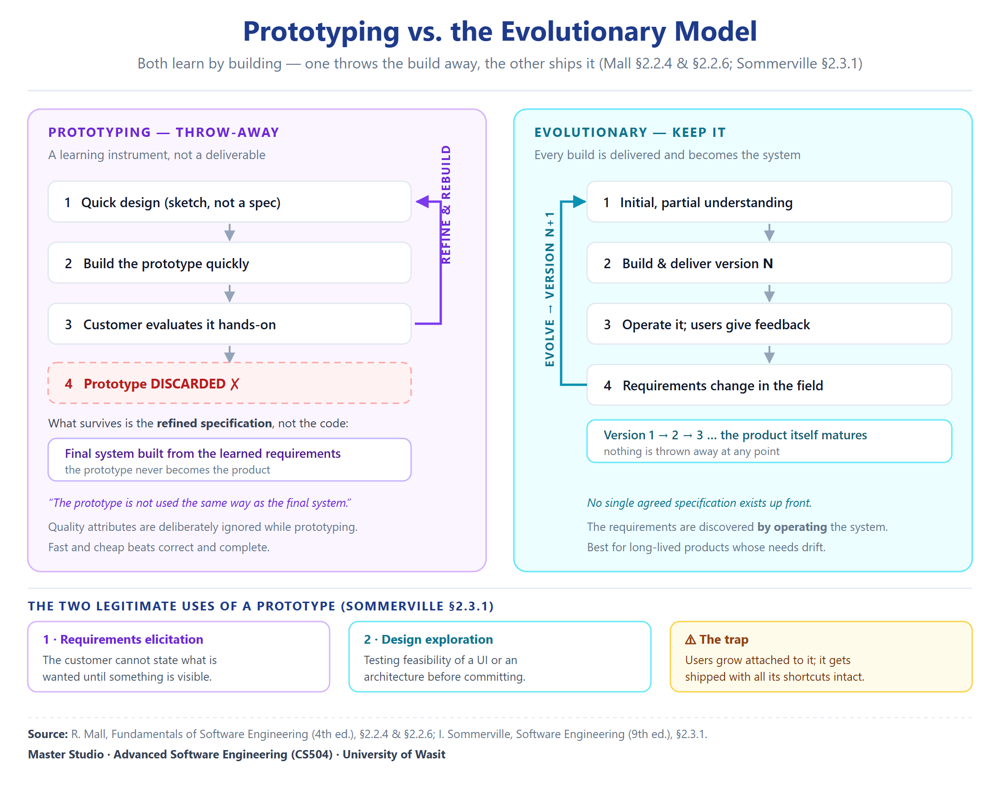

# Unit 03 — Prototyping and the Evolutionary Model

> **Sources.** Mall, *Fundamentals of Software Engineering* 4th ed., pp.91–99. Sommerville, *Software Engineering* 9th ed., pp.60–65.
> **Page numbers are PDF page numbers**, not printed page numbers.
> **Method.** Every definition is quoted verbatim from the source before it is explained, and every claim carries a page anchor. Where a concept rests on a single source, or where a phase is summarised rather than reproduced in full, the coverage note says so explicitly.

---

## Where this sits

**Previous unit:** Unit 02 ended with the waterfall family's central weakness — it assumes the requirements can be *"completely and correctly defined at the beginning"* (Mall p.82), and Unit 01 established that requirements begin **vague**. So the family fails on its own assumption, not on its execution.

**The problem this file opens with:** *if we cannot write the requirements down correctly up front, what if we build something in order to discover them?*

**The question it hands to Unit 04:** a prototype teaches us the requirements — **but the prototype is thrown away**. What if instead we delivered the *real* thing, in pieces, so each piece taught us something? That is incremental development.

---

## 1. The framework — two ways to survive change

Before either model, Sommerville supplies the lens that organises the whole series. It is worth having first, because it explains *why* prototyping exists rather than just *what* it is.

> **Verbatim (Sommerville p.60):** "*Change is inevitable in all large software projects.** The system requirements change as the business procuring the system responds to external pressures and management priorities change. As new technologies become available, new design and implementation possibilities emerge. Therefore **whatever software process model is used, it is essential that it can accommodate changes** to the software being developed."

> **Verbatim (Sommerville p.61):** *"Change adds to the costs of software development because it usually means that work that has been completed has to be redone. **This is called rework.*"

**التغيير حتمي بكل مشروع كبير** — المطلوبات تتغيّر لما تستجيب المؤسسة لضغوط خارجية، وتتغيّر أولويات الإدارة، وتظهر تقنيات جديدة. فـ**أي نموذج تُستخدم، لازم يكون قادر على استيعاب التغيير**.

**والتغيير يكلّف** لأنه يعني إعادة عمل شغل منجز. وهذا اسمه **rework**.

**ثم يعطينا الحلّين — وهذا الإطار مهم جداً:**

> **Verbatim (Sommerville p.61):** *"There are **two related approaches** that may be used to reduce the costs of rework:*
> 1. **Change avoidance**, where the software process includes activities that can **anticipate possible changes before significant rework is required**. For example, a prototype system may be developed to show some key features of the system to customers. They can **experiment with the prototype and refine their requirements before committing to high software production costs**.*
> 2. **Change tolerance**, where the process is designed so that **changes can be accommodated at relatively low cost**. This normally involves some form of **incremental development**. Proposed changes may be implemented **in increments that have not yet been developed**. If this is impossible, then **only a single increment** (a small part of the system) may have to be altered to incorporate the change."

**طريقتان لتقليل كلفة إعادة العمل:**

| الطريقة | الفكرة | المثال |
|:---|:---|:---|
| **Change avoidance** (تجنّب التغيير) | أنشطة **تتوقّع التغيير قبل** ما تصير إعادة عمل كبيرة | **نموذج أولي (prototype)** — العميل **يجرّب ويصفّي مطلوباته قبل** ما يلتزم بكلفة إنتاج عالية |
| **Change tolerance** (تحمّل التغيير) | العملية **مصمّمة** حتى يستوعب التغيير **بكلفة واطية** | **التطوير التزايدي** — التغيير يُنفَّذ **بالشرائح اللي ما انبنت بعد**؛ وإذا مستحيل، **شريحة وحدة بس** تتغيّر |

**وهذا الإطار هو العدسة اللي تشوف بيها كل النماذج الجاية:**

| النموذج | أي طريقة؟ |
|:---|:---|
| **Prototyping** (هذا الملف) | **Change avoidance** |
| **Evolutionary** (هذا الملف) | **Change tolerance** (الأقصى) |
| **Incremental delivery**  | **الاثنتان معاً** |
| **RAD** (05) | Change tolerance |
| **Spiral** (06) | Change avoidance + risk |
| **Agile** (08) | الاثنتان |

**وSommerville يصرّح بالتوزيع بنفسه (p.61):**
- *«System prototyping… This supports **change avoidance**»*
- *«Incremental delivery… This supports **both change avoidance and change tolerance**»*

**احفظ هذي الثلاث جمل — هي مفتاح فهم ليش كل نموذج موجود.**

---

## 2. Prototyping — Mall's account

### 2.1 What a prototype actually is

> **Verbatim (Mall p.91):** *"The prototype model is also a popular life cycle model. **The prototyping model can be considered to be an extension of the waterfall model.** This model suggests **building a working prototype of the system, before development of the actual software*."

> **Verbatim (Mall p.91):** *"A prototype is a **toy and crude implementation of a system**. It has **limited functional capabilities, low reliability, or inefficient performance** as compared to the actual software."

**نموذج Prototyping** — وصفه Mall بأنه **امتداد للـWaterfall**. الفكرة: **بناء نموذج عامل للنظام قبل تطوير البرنامج الفعلي**.

**وتعريف النموذج الأولي دقيق وقاسٍ:** **تطبيق لعبة وخام (toy and crude)** — إمكانيات وظيفية **محدودة**، موثوقية **واطية**، وأداء **غير كفؤ** بالمقارنة بالبرنامج الفعلي.

**ليش هذا مهم؟** لأن الطالب عادة يفهم «prototype» كأنه **نسخة مصغّرة جيدة**. Mall يگول **لا** — هو **خام عن قصد**. والخامّية مو عيب، هي **الغرض**.

### 2.2 The shortcuts — how it is built fast

> **Verbatim (Mall p.91):** *"A prototype can be built **very quickly by using several shortcuts**. The shortcuts usually involve developing **inefficient, inaccurate, or dummy functions**. The shortcut implementation of a function, for example, may produce the desired results by using a **table look-up rather than by performing the actual computations*."

> **Verbatim (Mall p.91):** *"Normally the term **rapid prototyping** is used when software tools are used for prototype construction. For example, tools based on **fourth generation languages (4GL)** may be used to construct the prototype for the GUI parts."

**كيف يُبنى بسرعة؟ بالاختصارات (shortcuts).** والاختصارات تعني دوال **غير كفؤة، غير دقيقة، أو وهمية (dummy)**.

**المثال:** دالة تنتج النتيجة المطلوبة عن طريق **جدول بحث (table look-up)** بدل تنفيذ الحسابات الفعلية.

**والمصطلح:** **rapid prototyping** — لما تُستخدم أدوات برمجية لبناء النموذج، مثل أدوات مبنية على **لغات الجيل الرابع (4GL)**، مثلاً لواجهة المستخدم.

**لاحظ المنطق:** الاختصار **يشتري السرعة بالدقة**. وهذا مقبول **لأن النموذج سيُرمى** (وهذا يجي بالتفصيل بـ§2.5).

### 2.3 When prototyping is the right choice — three cases

Mall is specific: prototyping is **not** for everything. He names the project types where it wins.

**Case one — the graphical user interface:**

> **Verbatim (Mall p.91):** *"It is advantageous to use the prototyping model for development of the **graphical user interface (GUI)** part of an application. Through the use of a prototype, it becomes easier to **illustrate the input data formats, messages, reports, and the interactive dialogs** to the customer. This is a valuable mechanism for **gaining better understanding of the customers' needs*."

> **Verbatim (Mall p.92):** *"For the user, it becomes much easier to form an opinion regarding what would be more suitable by **experimenting with a working user interface, rather than trying to imagine the working of a hypothetical user interface*."

> **Verbatim (Mall p.92):** "*The GUI part of a software system is almost always developed using the prototyping model.*"

**الحالة الأولى — واجهة المستخدم الرسومية (GUI).** النموذج يسهّل **توضيح** صيغ الإدخال، والرسائل، والتقارير، والحوارات التفاعلية للعميل. وهي **آلية قيّمة لفهم احتياجات العميل**.

**والجملة اللي تنحفظ:** *«أسهل على المستخدم يكوّن رأياً بالتجربة مع واجهة عاملة، بدل ما يتخيّل واجهة افتراضية»*. ← **فرق التجربة عن التخيّل** هو جوهر فايدة النموذج.

**والمعلومة القاطعة:** **جزء الـGUI يُطوَّر دائماً تقريباً بنموذج Prototyping.**

**Case two — unclear technical solutions:**

> **Verbatim (Mall p.92):** *"The prototyping model is especially useful when **the exact technical solutions are unclear to the development team**. A prototype can help them to **critically examine the technical issues** associated with product development."

Mall's own worked example:

> **Verbatim (Mall p.92):** *"For example, consider a situation where the development team has to write a **command language interpreter** as part of a graphical user interface development. Suppose **none of the team members has ever written a compiler before**. Then, this **lack of familiarity with a required development technology is a technical risk**. This risk can be resolved by **developing a prototype compiler for a very small language** to understand the issues associated with writing a compiler for a command language. Once they feel confident in writing compiler for the small language, they can use this knowledge to develop the compiler for the command language."

> **Verbatim (Mall p.92):** *"Often, major design decisions depend on issues such as the **response time of a hardware controller**, or the **efficiency of a sorting algorithm**, etc. In such circumstances, a prototype is often the **best way to resolve the technical issues*."

**الحالة الثانية — الحلول التقنية غير واضحة.** والنموذج يساعد على **فحص المسائل التقنية نقدياً**.

**مثال Mall:** الفريق لازم يكتب **مفسّر لغة أوامر**، و**ما أحد منهم كتب مترجماً (compiler) قبل**. هذا **نقص خبرة بتقنية مطلوبة = خطر تقني**. والحل: **بناء نموذج مترجم للغة صغيرة جداً** لفهم المسائل، وبعدها ينقلون المعرفة للمترجم الفعلي.

**وأمثلة القرارات التصميمية الكبرى:** **زمن استجابة متحكم عتادي**، أو **كفاءة خوارزمية ترتيب**.

**الحالة الثالثة — مبدأ Brooks:**

> **Verbatim (Mall p.92):** *"An important reason for developing a prototype is that it is **impossible to 'get it right' the first time**. As advocated by **Brooks [1975]**, one must **plan to throw away the software** in order to develop a good software later. Thus, the prototyping model can be deployed when development of **highly optimised and efficient software** is required."

**الحالة الثالثة — مبدأ Brooks [1975]:** *«مستحيل تجيبها صح من أول مرة»*، و**لازم تخطّط إنك ترمي البرنامج** حتى تطوّر برنامجاً جيداً لاحقاً.

**وهذي هي الجملة الفلسفية للملف:** **الرمي جزء من الخطة، مو فشل**.

**والخلاصة عند Mall (p.92):**

> **Verbatim:** *"The prototyping model is considered to be useful for the development of **not only the GUI parts** of a software, but also for a software project **for which certain technical issues are not clear** to the development team."

النموذج مفيد **لجزء الـGUI**، **و**لمشروع **فيه مسائل تقنية غير واضحة للفريق**. **حالتان — احفظهن.**

### 2.4 The life cycle — two major activities

> **Verbatim (Mall p.93):** *"software is developed through **two major activities — prototype construction and iterative waterfall-based software development*."

**Activity one — prototype development:**

> **Verbatim (Mall p.93):** *"Prototype development starts with an **initial requirements gathering phase**. A **quick design** is carried out and a prototype is built. The developed prototype is **submitted to the customer for evaluation**. Based on the customer feedback, **the requirements are refined and the prototype is suitably modified**. This cycle of obtaining customer feedback and modifying the prototype continues **till the customer approves the prototype*."

**Activity two — iterative development:**

> **Verbatim (Mall p.93):** *"Once the customer approves the prototype, the actual software is developed using the **iterative waterfall approach**. In spite of the availability of a working prototype, **the SRS document is usually needed to be developed** since the SRS document is invaluable for carrying out **traceability analysis, verification, and test case design** during later phases. However, **for GUI parts, the requirements analysis and specification phase becomes redundant since the working prototype that has been approved by the customer serves as an animated requirements specification*."

**نشاطان رئيسيان:**

**1. بناء النموذج** — يبلش بـ**جمع مطلوبات أولي**، ثم **تصميم سريع**، ثم بناء النموذج، ثم **تقديمه للعميل للتقييم**. وبناءً على التغذية الراجعة **تُصفَّى المطلوبات ويُعدَّل النموذج**. وهذه الدورة **تستمر لحد ما يوافق العميل على النموذج**.

**2. التطوير التكراري** — بعد موافقة العميل، **البرنامج الفعلي يُطوَّر بالـiterative waterfall**.

**ونقطتان مهمتان جداً:**

**(أ) الـSRS يظل مطلوباً حتى مع وجود نموذج عامل** — لأنه **لا غنى عنه** لـ:
- **traceability analysis** (تحليل التتبّع)
- **verification** (التحقق)
- **test case design** (تصميم حالات الاختبار)

**(ب) ولهذا الاستثناء الذكي:** **لأجزاء الـGUI، مرحلة تحليل وتوصيف المطلوبات تصير زائدة عن الحاجة** — لأن **النموذج العامل اللي وافق عليه العميل يخدم كـ«مواصفة مطلوبات متحركة» (animated requirements specification)**.

**عبارة `animated requirements specification` عبارة رائعة وتنحفظ** — لأنها تلخّص فكرة أن **النموذج العامل يوصف المطلوبات أفضل من أي مستند نصي**.

### 2.5 The prototype is thrown away — and why that is the point

> **Verbatim (Mall p.93):** "*The code for the prototype is usually thrown away.** However, **the experience gathered from developing the prototype helps a great deal in developing the actual system.*"

**كود النموذج يُرمى عادةً** — بس **الخبرة المستفادة منه تساعد كثيراً في تطوير النظام الفعلي**.

**فالمكسب مو الكود — المكسب المعرفة.** وهذا بالضبط منطق Brooks: **ارمِ حتى تبني أحسن**.

**ملاحظة مهمة:** هذا هو **النموذج الأولي المُرمى (throwaway prototype)**. لكن Sommerville يذكر نوعاً آخر — **النموذج التطويري (evolutionary prototyping)** — حيث **النموذج نفسه يصير المنتج**. وهذا الفرق يجي بالتفصيل بـ§3.3.

---

## 3. Prototyping — Sommerville's account

### 3.1 The definition

> **Verbatim (Sommerville p.62):** *"A **prototype is an initial version of a software system** that is used to **demonstrate concepts, try out design options, and find out more about the problem and its possible solutions**. **Rapid, iterative development of the prototype is essential** so that costs are controlled and system stakeholders can experiment with the prototype early in the software process."

تعريف Sommerville: النموذج **نسخة أولية من نظام برمجي** تُستخدم لـ:
1. **عرض المفاهيم** (demonstrate concepts)
2. **تجربة خيارات التصميم** (try out design options)
3. **معرفة المزيد عن المشكلة وحلولها الممكنة**

**وشرط أساسي:** **التطوير السريع والتكراري للنموذج ضروري** — حتى **تُضبط الكلفة**، و**يجرّب أصحاب المصلحة النموذج مبكراً**.

**قارن مع Mall:** Mall يركّز على **الخامّية** (toy and crude)، وSommerville يركّز على **الغرض** (three uses). **الاثنان يحتاجان للامتحان.**

### 3.2 The two uses

> **Verbatim (Sommerville p.62):** *"A software prototype can be used in a software development process to help **anticipate changes** that may be required:*
> 1. *In the **requirements engineering process**, a prototype can help with the **elicitation and validation of system requirements**.*
> 2. *In the **system design process**, a prototype can be used to **explore particular software solutions** and to support **user interface design**."

And the mechanism — why experimenting beats specifying:

> **Verbatim (Sommerville p.62):** *"System prototypes allow users to **see how well the system supports their work**. They may **get new ideas for requirements**, and **find areas of strength and weakness** in the software. They may then **propose new system requirements**. Furthermore, as the prototype is developed, it may **reveal errors and omissions in the requirements** that have been proposed."

> **Verbatim (Sommerville p.62):** *"A function described in a specification may seem useful and well defined. **However, when that function is combined with other functions, users often find that their initial view was incorrect or incomplete.** The system specification may then be modified to reflect their changed understanding of the requirements."

**استعمالان:**

| # | المرحلة | الفايدة |
|:---:|:---|:---|
| **1** | **Requirements engineering** | **استخلاص المطلوبات والتحقق منها** |
| **2** | **System design** | **استكشاف حلول برمجية معينة** ودعم **تصميم واجهة المستخدم** |

**والميكانيزم — جملة مهمة جداً:**

> *«دالة موصوفة بالمواصفة ممكن تبان مفيدة ومعرّفة زين. **بس لما تُدمج مع دوال ثانية، المستخدمون يكتشفون إن رأيهم الأول كان خاطئاً أو ناقصاً**.»*

**هذي هي الحجّة النظرية للنموذج الأولي:** المشكلة **مو بالدالة وحدها** — المشكلة **بالتفاعل بين الدوال**. والتفاعل **ما ينكشف بالمستند، ينكشف بالتشغيل**. ولهذا **التجربة تتقدّم على الوصف**.

**وهذا يفسّر كلام Mall عن «الواجهة المتحركة»:** النموذج **يُظهر التفاعل**، والمستند **يوصف الدوال منفصلة**.

### 3.3 The two kinds of prototype — and the problem

> **Verbatim (Sommerville p.63):** *"A general problem with prototyping is that **the prototype may not necessarily be used in the same way as the final system**. The tester of the prototype may **not be typical of system users**. The **training time during prototype evaluation may be insufficient**. If the prototype is slow, the evaluators may **adjust their way of working and avoid those system features that have slow response times**. When provided with better response in the final system, they may use it in a **different way*."

> **Verbatim (Sommerville p.63):** *"Developers are sometimes pressured by managers to deliver **throwaway prototypes**, particularly when there are delays in delivering the final version of the software."

**المشكلة العامة — وتستاهل تنحفظ:** *«النموذج ممكن ما يُستخدم بنفس الطريقة اللي يُستخدم بيها النظام النهائي»*. والأسباب:
- **المختبِر مو نموذجي** (مو من مستخدمي النظام الفعليين)،
- **وقت التدريب غير كافٍ**،
- **لو النموذج بطيء**، المقيّمون **يعدّلون طريقة عملهم ويتجنبون الميزات البطيئة** — وبعدين **يستخدمون النظام النهائي بطريقة مختلفة** لما يصير أسرع.

**وهذا تحذير منهجي عميق:** **نتائج تقييم النموذج مو بالضرورة صحيحة للمنتج**. يعني **النموذج يكذب — مو عن قصد، بس لأن ظروف الاختبار مو ظروف الاستخدام.**

**والضغط الإداري:** *«المطورون يتعرضون أحياناً لضغط المديرين حتى يسلّمون النماذج المُرمية»* — خصوصاً عند تأخّر التسليم النهائي.

**نقطة خطرة عملية:** النموذج المُرمى **يُسلَّم للعميل** لما تتأخر النسخة النهائية — وهذا **فخ إداري** يعرفه Sommerville ويحذّر منه.

**ملاحظة تغطية:** Sommerville يفصّل أكثر في **النماذج التطويرية مقابل المُرمية** (evolutionary vs throwaway prototyping) في صفحات 61–64. هذا الملف يذكر الفرق لأنه يربط بالملف التالي، لكن **التفصيل الكامل عند المصدر**.

### 3.4 Strengths and weaknesses — Mall's summary

Mall closes his prototyping section with a balance sheet, and it contains the cost argument that justifies building something you will throw away.

> **Verbatim (Mall p.94):** *"Even though the construction of a throwaway prototype might involve incurring **additional cost**, for systems with **unclear customer requirements** and for systems with **unresolved technical issues**, the overall development cost usually turns out to be **lower** compared to an equivalent system developed using the iterative waterfall model."

> **Verbatim (Mall p.94):** *"By constructing the prototype and submitting it for user evaluation, **many customer requirements get properly defined and technical issues get resolved** by experimenting with the prototype. This **minimises later change requests from the customer and the associated redesign costs*."

**الحجّة الاقتصادية:** مع إن بناء نموذج مُرمى **يضيف كلفة**، إلا إنه **لأنظمة مطلوباتها غير واضحة أو فيها مسائل تقنية غير محلولة**، **الكلفة الإجمالية تطلع أقل** من نظام مكافئ يُبنى بالـiterative waterfall.

**والسبب:** بناء النموذج وتقديمه للعميل **يعرّف مطلوبات كثيرة بشكل صحيح ويحلّ مسائل تقنية** → وهذا **يقلّل طلبات التغيير اللاحقة وكلفة إعادة التصميم المرتبطة بيها**.

**وهذا يقلب الفكرة الشائعة:** «ليش أبني شي وراح أرميه؟» → **لأن الرمي أرخص من التصحيح المتأخر**.

**Strengths:**

> **Verbatim (Mall p.95):** *"This model is the **most appropriate for projects that suffer from technical and requirements risks**. A constructed prototype helps overcome these risks."

**Weaknesses — and these are precise:**

> **Verbatim (Mall p.95):** *"The prototype model can **increase the cost of development** for projects that are **routine development work and do not suffer from any significant risks**. Even when a project is susceptible to risks, the prototyping model is effective **only for those projects for which the risks can be identified upfront before the development starts**. Since the prototype is constructed only at the start of the project, the prototyping model is **ineffective for risks identified later during the development cycle**. The prototyping model would not be appropriate for projects for which the risks can only be identified after the development is underway."

**القوة:** النموذج **الأنسب للمشاريع اللي تعاني من مخاطر تقنية ومخاطر مطلوبات**.

**والضعف — وهذي دقيقة وتستاهل الانتباه، ثلاث حالات:**

| الحالة | الحكم |
|:---|:---|
| **شغل تطوير روتيني بلا مخاطر كبيرة** | النموذج **يزيد الكلفة** |
| **مخاطر تُحدَّد مسبقاً** قبل بدء التطوير | النموذج **فعّال** |
| **مخاطر تظهر بعد بدء التطوير** | النموذج **غير فعّال** |

**والسبب البنيوي:** *«النموذج يُبنى ببداية المشروع فقط»* — فهو **يكشف المخاطر الموجودة بداية، مو اللي تظهر لاحقاً**.

**وهذي معلومة قوية للسيناريوهات:** لو السؤال وصف مشروعاً **روتينياً** أو **مخاطره تظهر لاحقاً** → **الجواب: النموذج الأولي مو مناسب**.

**وهذا كذلك يمهّد للملف 04:** لأن النموذج الأولي **مقيّد ببداية المشروع**، فهو ما يعالج **المخاطر اللي تظهر خلال التطوير**. والنماذج الجاية (التزايدي، ثم الحلزوني) تعالج هذا القيد.

---

## 4. The evolutionary model

### 4.1 What it is

> **Verbatim (Mall p.97):** *"This model has **many of the features of the incremental model**. As in case of the incremental model, the software is developed over a **number of increments**. At each increment, a **concept (feature) is implemented and is deployed at the client site**. The software is **successively refined and feature-enriched until the full software is realised*."

> **Verbatim (Mall p.98):** *"Though the evolutionary model can also be viewed as an extension of the waterfall model, but it **incorporates a major paradigm shift** that has been widely adopted in many recent life cycle models."

النموذج التطوري **يشترك بخصائص كثيرة مع التزايدي**: البرنامج يُبنى على **عدة زيادات**، وكل زيادة **تُنفَّذ وتُنشَر بموقع العميل**، والبرنامج **يُصفَّى ويُثرى بالميزات** لحد ما يكتمل.

**والتصنيف:** يُعتبر **امتداداً للـWaterfall**، **بس فيه تحوّل جذري بالمنهج (major paradigm shift)** — وهذا التحوّل معتمَد بنماذج حديثة كثيرة.

### 4.2 The distinction from incremental — the sentence to memorise

This is the core of the file. Mall draws the line explicitly.

> **Verbatim (Mall p.98):** *"The principal idea behind the evolutionary life cycle model is conveyed by its name. **In the incremental development model, complete requirements are first developed and the SRS document prepared. In contrast, in the evolutionary model, the requirements, plan, estimates, and solution evolve over the iterations, rather than fully defined and frozen in a major up-front specification effort before the development iterations begin.** Such evolution is consistent with the pattern of **unpredictable feature discovery and feature changes** that take place in new product development."

**هذا أهم فرق بالملف — احفظه حرفياً:**

| | **Incremental** | **Evolutionary** |
|:---|:---|:---|
| **المطلوبات** | **تُطوَّر كاملة أولاً**، ويُعدّ **مستند SRS** | **تتطوّر مع التكرارات** |
| **الخطة** | تُوضع مسبقاً | **تتطوّر** |
| **التقديرات** | تُوضع مسبقاً | **تتطوّر** |
| **الحل** | يُحدَّد مسبقاً | **يتطوّر** |
| **الجوهر** | التجميد المسبق ثم التقسيم | **لا تجميد — كل شي يتطوّر** |

**والتبرير:** هذا التطوّر **منسجم مع نمط «اكتشاف الميزات وتغيّرها بشكل غير متوقّع»** اللي يحصل بتطوير المنتجات الجديدة.

**يعني الفرق مو بعدد الزيادات — الفرق باللي يتجمّد.**
- **Incremental:** تجمّد **المطلوبات** أولاً، وبعدين توزّع.
- **Evolutionary:** **ما يجمّد شي** — حتى المطلوبات نفسها تتطوّر.

### 4.3 The nickname

> **Verbatim (Mall p.98):** *"Due to obvious reasons, the evolutionary software development process is sometimes referred to as **design a little, build a little, test a little, deploy a little model**. This means that **after the requirements have been specified, the design, build, test, and deployment activities are iterated*."

النموذج التطوري يُسمّى أحياناً: **«صمّم شوية، ابنِ شوية، اختبر شوية، انشر شوية»**.

**ومعناه:** بعد توصيف المطلوبات، **أنشطة التصميم والبناء والاختبار والنشر تُكرَّر**.

**لاحظ الترتيب:** التصميم → البناء → الاختبار → **النشر**. يعني **النشر جزء من الدورة التكرارية** — مو خطوة نهائية بعد كل شي. وهذا **الفرق عن النماذج التسلسلية**، وهي نفسها **فكرة Incremental delivery** اللي تجي بالمفهوم السابق.

### 4.4 The advantages

> **Verbatim (Mall p.98):** "*Effective elicitation of actual customer requirements:** In this model, the user gets a chance to **experiment with a partially developed software much before the complete requirements are developed**. Therefore, the evolutionary model helps to **accurately elicit user requirements** with the help of feedback obtained on the delivery of different versions of the software. As a result, **the change requests after delivery of the complete software gets substantially reduced*."

> **Verbatim (Mall p.98):** "*Easy handling change requests:** In this model, handling change requests is easier as **no long term plans are made**. Consequently, **reworks required due to change requests are normally much smaller** compared to the sequential models."

**ميزتان أساسيتان:**

**1. استخلاص فعّال لمطلوبات العميل الحقيقية** — المستخدم **يجرّب برنامجاً نصف مطوَّر قبل** ما تُطوَّر المطلوبات الكاملة. فالنموذج **يساعد على استخلاص المطلوبات بدقة** بالتغذية الراجعة من النسخ المختلفة. **والنتيجة:** **طلبات التغيير بعد التسليم الكامل تقلّ بشكل كبير**.

**2. سهولة التعامل مع طلبات التغيير** — لأن **ما تُوضع خطط طويلة المدى**. فـ**إعادة العمل المطلوبة أصغر بكثير** بالمقارنة بالنماذج التسلسلية.

**لاحظ التعبير:** *«compared to the **sequential** models»* — يعني Mall يقارن بالكلاسيكي و V-model تحديداً (وهما الوحيدان التسلسليان، بحسب الملف 02 §4.3).

### 4.5 The disadvantages

> **Verbatim (Mall p.99):** "*Feature division into incremental parts can be non-trivial:** For many development projects, **especially for small-sized projects, it is difficult to divide the required features into several parts** that can be incrementally implemented and delivered. Further, even for larger problems, **often the features are so intertwined and dependent on each other that even an expert would need considerable effort to plan the incremental deliveries*."

> **Verbatim (Mall p.99):** "*Ad hoc design:** Since at a time design for only the current increment is done, the design can become **ad hoc without specific attention being paid to maintainability and optimality**. Obviously, **for moderate sized problems and for those for which the customer requirements are clear, the iterative waterfall model can yield a better solution*."

**عيبان أساسيان:**

**1. تقسيم الميزات لأجزاء تزايدية قد يكون صعباً** — خصوصاً **للمشاريع الصغيرة**. وحتى للمشاكل الكبيرة، **الميزات متشابكة ومتعمدة على بعضها** لدرجة إن **حتى الخبير يحتاج جهداً كبيراً** لخطّة التسليمات التزايدية.

**2. تصميم عشوائي (ad hoc design)** — لأن التصميم يُسوّى **للزيادة الحالية فقط**، فيصير التصميم **عشوائياً بلا اهتمام خاص بقابلية الصيانة والأمثلية**.

**والحكم المهم:** *«للمشاكل متوسطة الحجم، واللي مطلوبات عميلها **واضحة**، نموذج الـ**iterative waterfall** ممكن يعطي حلاً أفضل»*.

**وهذا يعطينا قاعدة اختيار عملية:** **المطلوبات واضحة؟** → iterative waterfall. **المطلوبات غامضة أو متغيّرة؟** → evolutionary.

---

## 4.6 The two models side by side

**كيف تقرأ الرسم — الفرق كله بسهم واحد:**

| العنصر في الرسم | معناه الهندسي |
|:---|:---|
| **حلقة `REFINE & REBUILD` البنفسجية** (يسار) | دورة تعلّم: تُبنى، تُقيَّم، تُنقّح، وتُعاد. الهدف **المعرفة**، مو التسليم |
| **الصندوق الأحمر المتقطّع `Prototype DISCARDED ✗`** | **الكود يُرمى.** الناجي هو **المواصفة المنقّحة**، مو البرنامج |
| **حلقة `EVOLVE → VERSION N+1` السماوية** (يمين) | كل نسخة **تُسلَّم وتشتغل بموقع العميل**، والتغذية الراجعة تبني النسخة الجاية |
| **صندوق `Version 1 → 2 → 3`** | **ماكو رمي إطلاقاً** — المنتج نفسه هو اللي ينضج |
| **الشريط السفلي (استعمالان + فخ)** | الاستعمالان المشروعان: استنباط المطلوبات · استكشاف التصميم. والفخ: المستخدم يتعلّق بالنموذج فيُسلَّم بكل اختصاراته |

**الجملة الواحدة للامتحان:** الاثنان **يتعلّمان بالبناء**؛ الاختلاف **مصير البناء** — يُرمى (prototyping) أو يُسلَّم (evolutionary).

---

## 5. The distinctions — three models, one table

This is the comparison an exam is most likely to ask for, and Mall sets it up himself in his exercise set (Q52: *"Identify the major differences between the iterative and evolutionary SDLCs"*).

| | **Iterative waterfall** (Unit 02) | **Incremental** (Unit 04) | **Evolutionary** (this file) |
|:---|:---|:---|:---|
| **Requirements up front?** | **Yes** — full, before development | **Yes** — complete, then split into versions | **No** — they evolve |
| **SRS document?** | Yes, before development | **Yes** — *"complete requirements are first developed and the SRS document prepared"* | **No** — emerges over iterations |
| **What changes over iterations?** | **Errors are corrected** via feedback paths | **Features are added** version by version | **Requirements, plan, estimates AND solution** |
| **Is the plan long-term?** | Yes | *"no long-term plans are made"* | *"no long term plans are made"* |
| **Is it sequential?** | **No** — iterative | No | No |
| **Main risk** | Errors caught late | Feature division may be hard | **Ad hoc design**; feature division may be hard |
| **Best when** | Requirements are **clear** | Requirements are clear and the system can be **partitioned** | Requirements are **unclear or unpredictable** |

**الفرق الجوهري بجملة واحدة:**

> **التكراري والتزايدي يجمّدان المطلوبات أولاً — والتطوري لا.**

**وSommerville يدعم هذا من جهة ثانية (p.60):**

> **Verbatim:** *"This distinction between development and maintenance is increasingly irrelevant. Hardly any software systems are completely new systems and it makes much more sense to see development and maintenance as a **continuum**. Rather than two separate processes, it is more realistic to think of software engineering as an **evolutionary process** where software is **continually changed over its lifetime in response to changing requirements and customer needs*."

Sommerville يگول شي جذري: **التمييز بين التطوير والصيانة صار غير ذي صلة**. ما تكاد توجد أنظمة جديدة تماماً، والأصحّ نرى **التطوير والصيانة كاستمرارية (continuum)** — ونفكّر بهندسة البرمجيات كـ**عملية تطورية**، البرنامج فيها **يتغيّر باستمرار على مدى عمره**.

**ليش هذه جملة مهمة؟** لأنها **تبرّر النموذج التطوري نظرياً**: لو التطوير والصيانة **استمرارية**، فالنموذج اللي يفصلهما (كل التسلسلية) **مبني على تصنيف خاطئ**.

---

## 6. A structural insight from Sommerville worth keeping

Sommerville adds a point that connects this file to the next. Incremental delivery does not suit every system — and he names which.

> **Verbatim (Sommerville p.65):** *"There are some types of system where incremental development and delivery is **not the best approach**. These are **very large systems** where development may involve teams working in different locations, some **embedded systems** where the software depends on hardware development and some **critical systems** where all the requirements must be analyzed to check for interactions that may compromise the safety or security of the system."

And then the resolution — which is **prototyping**:

> **Verbatim (Sommerville p.65):** *"These systems, of course, suffer from the same problems of uncertain and changing requirements. Therefore, to address these problems and get some of the benefits of incremental development, a process may be used in which **a system prototype is developed iteratively and used as a platform for experiments with the system requirements and design. With the experience gained from the prototype, definitive requirements can then be agreed**…"*

**أنواع أنظمة لا يناسبها التطوير والتسليم التزايدي:**
- **الأنظمة الضخمة جداً** (فرق بمواقع مختلفة)،
- **الأنظمة المضمّنة** (البرنامج يعتمد على تطوير العتاد)،
- **الأنظمة الحرجة** (لازم تحليل كل المطلوبات لفحص التفاعلات اللي تهدّد السلامة أو الأمن).

**والحل لهذي الأنظمة هو... النموذج الأولي:** *«نموذج يُطوَّر تكرارياً ويُستخدم كمنصّة للتجربة مع مطلوبات النظام وتصميمه، وبالخبرة المستفادة منه تُتّفق المطلوبات النهائية»*.

**ليش هذه النقطة مهمة؟** لأنها تعطي **قاعدة اختيار عكسية**: لما **التزايدي ما يناسب**، **النموذج الأولي هو البديل**. يعني النموذجان **مو متنافسين — مكمّلان حسب نوع النظام**.

---

## Source notes

| Source | Verdict for this file |
|:---|:---|
| **Mall pp.91–93** | **Primary for all of §2.** The prototype as a *"toy and crude implementation"*, the shortcuts and the table-look-up example, 4GL and rapid prototyping, the two cases where prototyping wins (GUI; unclear technical solutions), the **Brooks [1975]** justification, the two major activities, the *"animated requirements specification"* for GUI parts, and the throwaway code. |
| **Mall pp.97–99** | **Primary for §4.** The evolutionary model, the **explicit distinction from incremental**, the *"design a little, build a little, test a little, deploy a little"* nickname, the two advantages, and the two disadvantages. |
| **Sommerville pp.60–61** | **Primary for §1 — and this is the most valuable section of the file.** The **change avoidance / change tolerance** framework, the definition of *rework*, and Sommerville's own statement of which model supports which. **This framework organises the entire series.** |
| **Sommerville pp.62–63** | **Primary for §3.** The prototype definition and its three uses, the two uses in the life cycle, the mechanism (a function seems fine alone but fails in combination), the general problem of the prototype not being used as the final system would be, and the managerial pressure to deliver throwaway prototypes. |
| **Sommerville pp.60, 65** | §5 and §6 — the *"development and maintenance as a continuum"* argument, the systems where incremental delivery does not fit, and prototyping as the resolution. |
| **Pressman / Agarwal** | **Add little here.** Pressman has 62 pages mentioning prototyping but at a lower level of precision; Agarwal covers it at introductory depth. Neither adds a distinction Mall and Sommerville do not already give. |
| **Coverage note** | **The evolutionary-versus-throwaway prototype distinction is only touched here.** Sommerville develops it in pp.61–64. If the doctor asks which kind of prototype becomes the product, **go to the source**. |
| **Coverage note** | **Mall's incremental model (§2.2.5, pp.95–97) is only referenced, not taught** — it belongs to Unit 04. The core/non-core feature distinction and the two incremental advantages are recorded there. |
| Note | Mall's *"no long term plans are made"* is said of **both** the incremental and the evolutionary models (pp.96, 98). Do not use it to distinguish them — use **what is frozen**, per §4.2. |

---

## Retrieval set

> Answers appear directly beneath each question, as agreed. **Cover the answer, produce your own, then compare.**

**1. What is rework, and what are the two approaches to reducing its cost?**
> **Rework** is work that has been completed having to be redone because of change. The two approaches are **change avoidance** — activities that *"anticipate possible changes before significant rework is required"* — and **change tolerance** — a process designed so changes *"can be accommodated at relatively low cost"*, normally through incremental development. (Sommerville p.61)

**2. Which of the two approaches does prototyping support, and which does incremental delivery support?**
> **Prototyping supports change avoidance** — it lets users experiment and refine requirements *"before committing to high software production costs." **Incremental delivery supports both** change avoidance and change tolerance. (Sommerville p.61)

**3. Define a prototype in Mall's terms, and say why the crudeness is deliberate.**
> *"A prototype is a **toy and crude implementation of a system**. It has **limited functional capabilities, low reliability, or inefficient performance** as compared to the actual software." The crudeness is deliberate because it is built *"very quickly by using several **shortcuts*" — inefficient, inaccurate or dummy functions, e.g. producing a result by **table look-up rather than performing the actual computations**. Speed is bought with accuracy, which is acceptable **because the prototype is thrown away**. (Mall p.91)

**4. Name the two situations where Mall says prototyping is the right choice.**
> **(1)** The **graphical user interface** part of an application — prototyping makes it easier to illustrate *"input data formats, messages, reports, and the interactive dialogs"*, and *"the GUI part of a software system is almost always developed using the prototyping model." **(2)** When **the exact technical solutions are unclear** to the team — e.g. writing a compiler when nobody has written one, which is a *"technical risk"* resolved by prototyping a compiler for a very small language first. (Mall pp.91–92)

**5. State the Brooks [1975] justification for prototyping.**
> *"It is impossible to 'get it right' the first time. As advocated by Brooks [1975], one must **plan to throw away the software** in order to develop a good software later." (Mall p.92)

**6. Name the two major activities of the prototyping life cycle, and say what survives after the prototype is discarded.**
> **Prototype construction** (initial requirements gathering → quick design → build → customer evaluation → refine and modify, repeated *"till the customer approves the prototype"*) and **iterative waterfall-based development**. After approval, *"the code for the prototype is usually thrown away. However, **the experience gathered from developing the prototype** helps a great deal in developing the actual system." (Mall p.93)

**7. Is the SRS document still needed when a working prototype exists? When is it not?**
> **Usually yes** — *"in spite of the availability of a working prototype, the SRS document is usually needed to be developed"*, because it is invaluable for **traceability analysis, verification, and test case design**. **But for GUI parts the requirements analysis and specification phase becomes redundant**, because the approved prototype *"serves as an **animated requirements specification*." (Mall p.93)

**8. Give Sommerville's definition of a prototype and its three purposes.**
> *"A prototype is an **initial version of a software system** that is used to **demonstrate concepts, try out design options, and find out more about the problem and its possible solutions*." Rapid, iterative development is essential so costs are controlled and stakeholders can experiment early. (Sommerville p.62)

**9. Why does experimenting with a prototype reveal problems that reading a specification does not?**
> Because the difficulty lies in **interaction, not in individual functions**: *"A function described in a specification may seem useful and well defined. However, **when that function is combined with other functions, users often find that their initial view was incorrect or incomplete*." (Sommerville p.62)

**10. What is the general problem with prototyping, and what are its three causes?**
> *"The prototype may not necessarily be used in the same way as the final system." Causes: the **tester may not be typical** of system users; **training time during evaluation may be insufficient**; and if the prototype is **slow**, evaluators avoid the slow features and then *"may use it in a different way"* once the final system responds better. (Sommerville p.63)

**11. State the distinction between the incremental and evolutionary models in one sentence, and explain what it means to freeze something.**
> *"In the incremental development model, **complete requirements are first developed and the SRS document prepared**. In contrast, in the evolutionary model, **the requirements, plan, estimates, and solution evolve over the iterations, rather than fully defined and frozen in a major up-front specification effort** before the development iterations begin." To **freeze** something is to fix it in advance so it does not change — incremental freezes the requirements and the SRS; evolutionary freezes nothing. (Mall p.98)

**12. What is the evolutionary model sometimes called, and what does the name mean?**
> "*design a little, build a little, test a little, deploy a little model*" — meaning that *"after the requirements have been specified, the design, build, test, and deployment activities are **iterated*." Note that **deployment is part of the iteration**, not a final step. (Mall p.98)

**13. Give the two advantages of the evolutionary model.**
> **(1) Effective elicitation of actual customer requirements** — the user experiments with partially developed software *"much before the complete requirements are developed"*, so requirements are elicited accurately and *"the change requests after delivery of the complete software gets substantially reduced." **(2) Easy handling of change requests** — *"handling change requests is easier as **no long term plans are made*", so rework is *"much smaller compared to the sequential models." (Mall p.98)

**14. Give the two disadvantages of the evolutionary model, and the model Mall recommends instead in some cases.**
> **(1) Feature division into incremental parts can be non-trivial** — especially for small projects, and for large ones the features are *"so intertwined and dependent on each other that even an expert would need considerable effort." **(2) Ad hoc design** — designing only the current increment at a time can produce design *"without specific attention being paid to maintainability and optimality." Mall's alternative: *"for moderate sized problems and for those for which the customer requirements are clear, the **iterative waterfall model can yield a better solution*." (Mall p.99)

**15. Sommerville argues that the split between development and maintenance is outdated. What does he propose instead?**
> That *"development and maintenance"* be seen as a **continuum**, and software engineering as an "*evolutionary process** where software is continually changed over its lifetime in response to changing requirements and customer needs." (Sommerville p.60)

**16. Name the three kinds of system where incremental delivery is not the best approach, and say what Sommerville recommends for them instead.**
> **Very large systems** (teams in different locations), some **embedded systems** (software depends on hardware development), and some **critical systems** (all requirements must be analysed for safety or security interactions). The recommendation: develop *"a **system prototype** iteratively and use it as a platform for experiments"*, so that *"with the experience gained from the prototype, definitive requirements can then be agreed." (Sommerville p.65)

---

## Page anchors

| Revisit | For |
|:---|:---|
| **Sommerville p.60** | Software evolution as the reason for flexibility · **development and maintenance as a continuum** · **§2.3 Coping with change** — "change is inevitable in all large software projects" |
| **Sommerville p.61** | **Rework** defined · **change avoidance** vs **change tolerance** · which model supports which · the two approaches introduced |
| **Sommerville p.62** | The **prototype definition** and its three purposes · the **two uses** in the life cycle · the mechanism — a function fine alone, wrong in combination |
| **Sommerville p.63** | **The general problem** with prototyping and its three causes · **managerial pressure to deliver throwaway prototypes** |
| **Sommerville p.64–65** | Incremental delivery in full (belongs to Unit 04) · the three problems · **the systems where it does not fit, and prototyping as the resolution** |
| **Mall p.91** | **§2.2.4 Prototyping** · the prototype as *"toy and crude"* · the shortcuts and table look-up · **4GL and rapid prototyping** · **the GUI case** |
| **Mall p.92** | *"experimenting with a working user interface rather than imagining a hypothetical one"* · **the unclear-technical-solution case** with the compiler example · **Brooks [1975]** · the summary of when prototyping is useful |
| **Mall p.93** | **The two major activities** · prototype development as a customer-feedback loop · the SRS still required · **"animated requirements specification"** for GUI · **the code is thrown away, the experience is not** |
| **Mall pp.95–97** | The incremental model — belongs to Unit 04, but read here for the contrast |
| **Mall p.97–98** | **§2.2.6 Evolutionary Model** · the shared features with incremental · **the explicit distinction (requirements frozen or not)** · the paradigm shift · the nickname |
| **Mall p.98** | The two advantages of the evolutionary model · *"compared to the sequential models"* |
| **Mall p.99** | The two disadvantages · **the recommendation to use iterative waterfall when requirements are clear** |

---