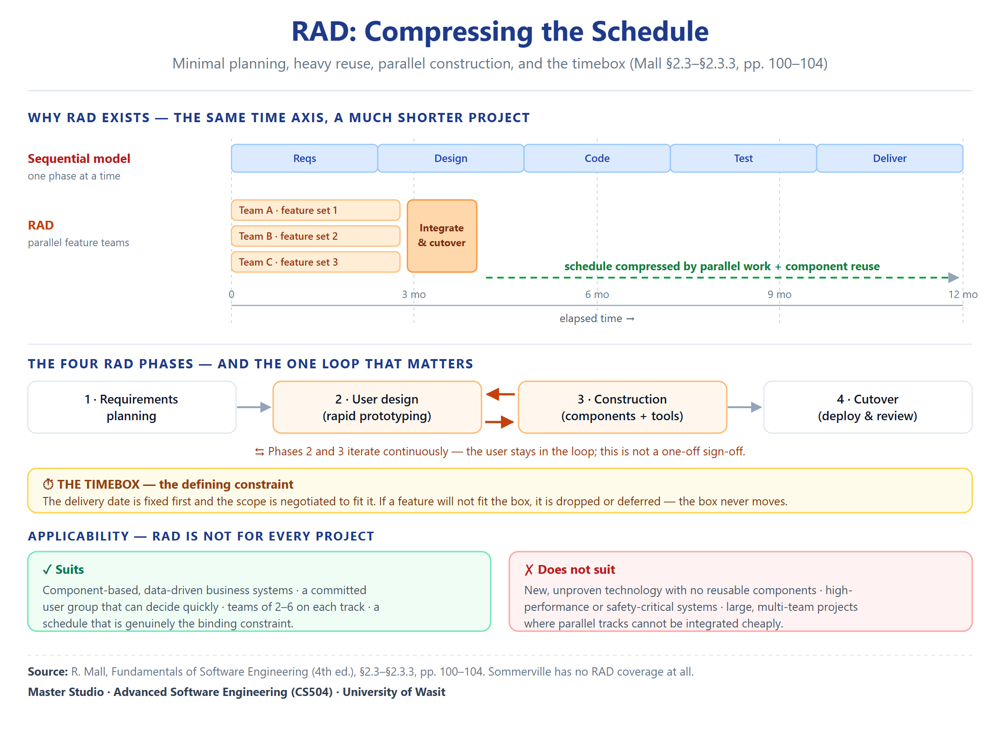

# Unit 05 — RAD (Rapid Application Development)

> **Sources.** Rajib Mall, *Fundamentals of Software Engineering* 4th ed., §2.3, pp.100–104. C. S. Agarwal, *Software Engineering and Testing* (2010), pp.62–63 (phases and disadvantages).
> **Note on method.** This is a compendium, not a summary. Every definition is quoted verbatim from the source before it is explained, and every claim carries a page anchor. Sommerville 9th ed. does **not** treat RAD as a standalone life-cycle model and Pressman mentions it only in passing, so this unit is **Mall-primary**.

---

## Where this sits

**Unit Context:** Unit 04 closed on the cost of incremental development — **it is slow**, because the customer waits for the last increment. RAD is the response to that slowness: it keeps the customer-visible delivery of the incremental models but compresses the timeline by parallelising feature construction and automating requirements collection.

**The question this unit answers:** *the schedule is the binding constraint — how do you go fast without going ad hoc?*

**The question it hands to the next unit:** *RAD buys speed by cutting planning and reusing code, but it has no mechanism for deciding which risk to attack first — and that is what the Spiral model adds.*

---

## 1. Definition and the Four Goals of RAD

### 1.0 The intuition before the definition

Imagine a **kitchen during a dinner rush**. A single cook working through the menu one dish at a time is correct and orderly — but slow. Now imagine the same kitchen with **several cooks, each owning a few dishes**, a **menu that never changes** (so nobody has to invent anything), **ready-made sauces and pre-cut vegetables** instead of raw ingredients, and a **timer on every dish**: when the timer runs out, that dish leaves the kitchen whether or not it is perfect.

That is RAD. The **parallel cooks** are the feature teams building simultaneously; the **fixed menu** is the condition that the requirements must already be clear; the **pre-cut ingredients** are reusable components and CASE tools; and the **timer** is the time-box.

And note the cost hidden in the metaphor: if a dish needed a technique the cooks had never learned, the timer would not save them. That is exactly why RAD fails when the **technical risk is high**.

**الشرح المفاهيمي والتعليلات الهندسية:** RAD **مو نموذج هندسي جديد** — هو **ضغط إداري على نموذج موجود**. Mall نفسه يسمّيه *"a type of incremental model"* (ص100). الفكرة كلها إن **الزمن هو المتغيّر المستقل**، وكل شي ثاني — التوازي، الأتمتة، مشاركة العميل، الفريق بمكان واحد — **وسائل تخدم هذا الهدف الواحد**. ولهذا عيوبه كلها **مو عيوب هندسية، هي شروط تشغيلية**: عميل غير متعاون · فريق موزّع · مشروع كبير · مخاطر تقنية عالية. **لو سُئلت «علّق على RAD» — ابدأ من هذه الجملة.**

---

### 1.1 Definition

**Verbatim (Mall p. 100):**

> The main objective of RAD model is to build the software system in a short span of time.

This is the **defining constraint** of RAD: time is the independent variable, and the process is designed to minimise it. All other features of RAD (parallel construction, automated tools, co-located teams, informal requirements) are in service of this single objective. [Foundational Knowledge / Standard Concept]

### 1.2 The Four Goals

**Verbatim (Mall p. 100):**

> The goals of RAD model are as follows:
> 1. To build the software system in a short span of time.
> 2. To ensure active participation of the customer.
> 3. To ensure that the development team is located at one place.
> 4. To automate the software construction process as much as possible.

الهدف الأول هو **التعريف نفسه** — بناء النظام بفترة قصيرة. الأهداف الثلاثة الباقية هي **الأدوات اللي تخدم الهدف الأول**:

- **مشاركة فعّالة للعميل:** مو بس "يتشاورون وياه" — لازم يكون **حاضر وبشكل فعّال** (active participation). هذا يقلّل دورات المراجعة لأن القرار يتخذ فوراً.
- **الفريق بمكان واحد:** التواصل وجهاً لوجه أسرع بكثير من البريد أو الاجتماعات الافتراضية. Mall يصرّح: "located at one place" — وهذا **شرط مو مجرد تفضيل**.
- **أتمتة قدر الإمكان:** أدوات CASE (Computer Aided Software Engineering) تُستخدم لجمع المطلوبات وتوليد الكود. هذا يختصر الوقت اللي يُستهلك بالأعمال اليدوية.

**النقطة المهمّة:** الأهداف الأربعة **ليست متساوية** — الهدف الأول هو الغاية، والثلاثة الباقية هي الوسائل. لو فشلت إحدى الوسائل، الهدف الأول يفشل. [Foundational Knowledge / Standard Concept]

---

## 2. The Time-Box

### 2.1 Definition

**Verbatim (Mall p. 100):**

> The time-box is the maximum time that can be taken to develop each feature.

**Time-box = صندوق زمني مغلق.** ما هو "الوقت المتوقع" أو "الوقت المثالي" — هو **الحد الأقصى** (maximum time). يعني لو ميزة ما انتهت قبل الـtime-box، تمام. لكن لو تأخرت، **يتم إيقاف العمل عليها** ويُنقل الفريق للميزة التالية.

**هذا يفرض تضحية (trade-off):** الجودة الكاملة لكل ميزة **قد تُضحّى بها** لصالح إنجاز كل الميزات بالحد الزمني. وهذا السبب اللي يخلي RAD **يناسب المشاريع الصغيرة/المتوسطة** فقط — بالمشاريع الكبيرة، التضحية بالجودة تُنتج دين تقني (technical debt) لا يُسدّد.

### 2.2 Time-Box vs Increment Schedule

| | **Time-Box (RAD)** | **Increment Schedule (Incremental)** |
|:---|:---|:---|
| **الطبيعة** | حد أقصى صارم | جدول تقديري |
| **المرونة** | لا مرونة — التأخير يعني قطع الميزة | مرونة — الزيادة تُستكمل |
| **الهدف** | سرعة بناء كل الميزات | تسليم قيمة تدريجياً |
| **التضحية** | قد يُضحّى بجودة ميزة واحدة | لا تضحية — كل زيادة كاملة |

**القاعدة اللي تطلع منه:** **Time-box = ضغط زمني صارم ؛ Increment = تسليم تدريجي مرن.** [Foundational Knowledge / Standard Concept]

---

## 3. Phases of RAD

### 3.1 Mall's Version (Primary Source)

**Verbatim (Mall p. 100):**

> The RAD model consists of the following phases: The different features of the software are constructed in parallel, as if they were mini projects. The phases in the RAD model are supported by the use of Computer Aided Software Engineering (CASE) tools. The different phases of the RAD model are:
> - **Requirements:** In this phase, the requirements of the software are collected using the automated tools. The time required to collect the requirements and to prepare the SRS document in this model is much less compared to other models.
> - **Design:** In this phase, the overall architecture of the software is designed.
> - **Coding:** In this phase, the different features are coded.
> - **Testing:** In this phase, the different features are tested.

أهم نقطة هنا: **البناء بالتوازي (constructed in parallel).** كل ميزة = **مشروع مصغر** (mini project) بفريق صغير. هذا يختلف جذرياً عن الـIncremental، اللي يبني الزيادات **بالتسلسل** (واحدة تلو الأخرى).

**وتعليق على "automated tools":** Mall يصرّح إن جمع المطلوبات يتم "using the automated tools" — وهذا يختصر وقت إعداد مستند SRS بشكل كبير. لكنه **ما يقول إن SRS يلغى** — يقول "the time required... is much less". يعني **مستند SRS موجود لكن مختصر**، وهذا يختلف عن Evolutionary (اللي ما يجمّد المطلوبات نهائياً).

### 3.2 Agarwal's Version (Source Difference)

**Verbatim (Agarwal p. 62):**

> 1. Business Modeling. The information flow among business functions is modeled...
> 2. Data Modeling. The information flow defined as part of the business-modeling phase is refined into a set of data objects...
> 3. Process Modeling. In this model, information flows from object to object...
> 4. Application Generation. RAD assumes the use of fourth-generation techniques.

**ملاحظة تغطية:** Agarwal يستخدم **مصطلحات مختلفة** لمراحل RAD: Business Modeling · Data Modeling · Process Modeling · Application Generation. هذي **ليست مراحل مختلفة** — هي **نفس المراحل الأربع** لكن بمنظور **هندسة المعلومات** (information engineering) بدل هندسة البرمجيات التقليدية.

**التوافق:**
| **Mall** | **Agarwal** | **التوضيح** |
|:---|:---|:---|
| Requirements | Business Modeling | جمع المطلوبات = فهم التدفقات التجارية |
| Design | Data Modeling + Process Modeling | التصميم = كائنات البيانات + تدفقات المعالجة |
| Coding | Application Generation | البرمجة = توليد التطبيق (4GL) |
| Testing | (ضمني) | Agarwal ما يذكر Testing صراحة |

**القاعدة:** لو سؤال الامتحان يقول "حسب Agarwal" — استخدم مصطلحاته. لو يقول "حسب Mall" — استخدم مصطلحات Mall. **ما تخلّط.** [Source Difference]

---

## 4. Applicability Conditions

### 4.1 When RAD Fits

**Verbatim (Mall p. 101):**

> The RAD model is suitable when the following conditions are satisfied:
> 1. The project is small or medium sized.
> 2. The project can be completed within 2 to 3 months.
> 3. The requirements of the project are known clearly in the beginning.

ثلاثة شروط **جميعها لازمة** (necessary conditions) — مو كافية بروحها:

1. **صغير أو متوسط:** المشاريع الكبيرة تتطلب تنسيقاً معقداً بين الفرق المتوازية، وهذا يُبطئ بدل يسرّع.
2. **2–3 أشهر:** Time-box يفرض حدوداً زمنية صارمة — لو المشروع يحتاج سنة، الـtime-box يصبح إما طويل جداً (يفقد معناه) أو قصير جداً (يُنتج منتج غير صالح).
3. **المطلوبات معروفة بوضوح:** هذا يختلف عن Prototyping (اللي يُستخدم لما المطلوبات غير واضحة). RAD **يفترض** إن المطلوبات واضحة — هو يسرّع **تنفيذ** المطلوبات، لا **اكتشافها**.

### 4.2 When RAD Does NOT Fit

**Verbatim (Mall p. 102):**

> The RAD model is not suitable when the technical risks are high... For example, when the developers are required to use a new operating system, or when the system uses a new technology such as an unfamiliar hardware device.

**Verbatim (Agarwal p. 63):**

> RAD may not be appropriate when technical risks are high (for example, when new technology is being introduced).

**نقطة الاتفاق بين Mall و Agarwal:** **المخاطر التقنية العالية = مانع قاطع لـRAD.** ليش؟ لأن RAD يفترض إن الفريق يعرف **كيف** يبني — هو يسرّع البناء، لا يكتشف التقنية. لو التقنية جديدة (نظام تشغيل جديد · جهاز غير مألوف · لغة برمجة غير معروفة)، الفريق يحتاج وقت للتعلم، وهذا يُبطّل فكرة الـtime-box.

**ومن Agarwal إضافة:**

> RAD may not be appropriate when technical risks are high... when new technology is being introduced.

**القاعدة:** **RAD = تسريع التنفيذ المعروف ؛ Spiral = إدارة المخاطر المجهولة.** [Foundational Knowledge / Standard Concept]

---

### 4.3 The whole model in one picture

**كيف تقرأ الرسم — وهذا خريطة الوحدة كلها:**

| العنصر في الرسم | معناه الهندسي |
|:---|:---|
| **الشريط الأزرق `Sequential model`** | التسلسل التقليدي: خمس مراحل ورا بعض — **12 شهر** على نفس المحور |
| **الأشرطة البرتقالية `Team A/B/C`** | **البناء بالتوازي**: كل فريق يبني مجموعة ميزات **كأنها مشروع مصغّر** |
| **صندوق `Integrate & cutover`** | نقطة **الدمج والتسليم** — وهي **مو مرحلة متوازية**، تحتاج تنسيقاً |
| **السهم الأخضر المتقطّع** | **الزمن الموفَّر** — من نفس المحور الزمني، المشروع يخلص بجزء من المدة |
| **الصناديق الأربعة (1←4)** | المراحل الأربع: Requirements planning · User design · Construction · Cutover |
| **سهمان برتقاليان بين ② و③** | **الحلقة الأهم**: تصميم المستخدم والبناء **يتكرران معاً** — العميل داخل الحلقة، مو توقيع مرة واحدة |
| **صندوق `⏱ THE TIMEBOX`** | **القيد المعرِّف**: التاريخ يُثبَّت أولاً، والنطاق يُفاوَض ليناسب |
| **الصندوقان الأخضر والأحمر** | **شروط التطبيق**: ما يناسبه (أنظمة تجارية مبنية على مكونات) وما لا يناسبه (تقنية جديدة · مخاطر عالية) |

**الخلاصة البصرية:** RAD **ما يقصّر المراحل** — يخلّيها **متوازية**، ويقفل كل واحدة بصندوق زمني. والثمن: **الحجم** و**المخاطر التقنية**.

---

## 5. Strengths and Weaknesses

### 5.1 Strengths

**Verbatim (Mall p. 102):**

> The various advantages of the RAD model are:
> 1. Reduced cycle time.
> 2. Increased productivity with fewer number of developers.
> 3. Reduced development cost.
> 4. Reduced development time.

أربع ميزات **جميعها متعلقة بالوقت والكلفة** — لا يوجد ميزة تقنية (مثل "جودة أعلى" أو "صيانة أسهل"). هذا يؤكد طبيعة RAD: **أداة إدارية/اقتصادية**، لا أداة هندسية.

- **Reduced cycle time:** دورة التطوير الكاملة (من المطلوبات للتسليم) تقل.
- **Increased productivity with fewer developers:** الفريق الصغير + التوازي + الأتمتة = إنتاجية أعلى.
- **Reduced development cost:** كلفة أقل بسبب الأتمتة والوقت القصير.
- **Reduced development time:** تكرار للهدف الأول — بناء بوقت قصير.

### 5.2 Weaknesses

**Verbatim (Mall p. 102):**

> The various disadvantages of the RAD model are:
> 1. The model is suitable only for small and medium sized projects.
> 2. The model requires active participation of the customer. If the customer is not willing to participate actively, the model may fail.
> 3. The model requires the development team to be located at one place. If the team members are located at different places, the model may not work.

**Verbatim (Agarwal p. 63):**

> For large, but scalable projects, RAD requires sufficient human resources to create the right number of RAD teams.

**عيوب Mall الثلاثة = عكس شروط التطبيق:**

1. **مشاريع صغيرة/متوسطة فقط** — المشاريع الكبيرة تتطلب تنسيقاً معقداً.
2. **مشاركة فعّالة للعميل** — لو العميل مشغول/غير مهتم، يفشل.
3. **الفريق بمكان واحد** — الفرق الموزعة جغرافياً (distributed teams) لا تستطيع استخدام RAD.

**ومن Agarwal إضافة:** المشاريع الكبيرة **المتوسّعة** (scalable) تتطلب موارد بشرية كافية لإنشاء "العدد الصحيح من فرق RAD". يعني **ممكن تستخدم RAD بالمشاريع الكبيرة لكن بشروط** — لكن Mall يقول "not suitable" بشكل مطلق. **فرق مصدري دقيق:** Mall أكثر تحفظاً؛ Agarwal يترك باباً موارباً. [Source Difference]

---

## 6. RAD vs Incremental Model — The Critical Comparison

### 6.1 The Core Difference

**Verbatim (Mall p. 103):**

> The main difference between the incremental model and the RAD model is that in the incremental model the SRS document is prepared in the requirements analysis and specification phase, whereas in the RAD model the requirements are specified in a much less formal manner... The requirements are collected using the automated tools.

**هذا الفرق هو جوهر المقارنة:**

| | **Incremental** | **RAD** |
|:---|:---|:---|
| **مستند SRS** | مُعدّ بشكل رسمي كامل | **"much less formal"** — أقل رسمية |
| **جمع المطلوبات** | تحليل تقليدي | **أدوات أتمتة** |
| **الزمن** | لا ضغط زمني خاص | **time-box صارم** |
| **البناء** | تسلسلي (زيادة تلو الأخرى) | **توازي (mini projects)** |
| **العميل** | يُشارك بمراحل محددة | **مشاركة فعّالة مستمرة** |
| **الفريق** | قد يكون موزعاً | **لازم بمكان واحد** |

### 6.2 When to Choose Which

**Verbatim (Mall p. 104):**

> The incremental model is suitable when the requirements are well understood and the project is large. The RAD model is suitable when the requirements are well understood and the project is small or medium sized.

**النقطة المشتركة:** الاثنان يتطلبان **مطلوبات مفهومة جيداً** (well understood requirements). يعني **لا RAD ولا Incremental يناسبان المطلوبات الغامضة** — هذي شغل Prototyping أو Spiral.

**النقطة المختلفة:**
- **كبير + مطلوبات واضحة = Incremental**
- **صغير/متوسط + مطلوبات واضحة + سرعة = RAD**

**القاعدة:** **المطلوبات الواضحة = شرط مشترك. الحجم = فارق الاختيار.** [Foundational Knowledge / Standard Concept]

---

## 7. Source Coverage Note — Why Sommerville and Pressman Are Silent

**ملاحظة تغطية:** Sommerville 9th Ed. **لا يعامل RAD كنموذج حياة مستقل** في فصل "Software Processes". ذكر "rapid application development" مرتين فقط:
- ص398: عبارة عابرة في سياق عملي
- ص760: على الأرجح في الفهرس

Pressman أيضاً يذكر RAD عابراً (ص60، ص76) بلا تفصيل.

**التفسير المحتمل:** RAD في منظور Sommerville **ليس "نموذجاً عاماً" (generic model)** بل هو **تقنية إدارية** تُطبق ضمن نماذج أخرى (غالباً Incremental أو Evolutionary). هذا يتوافق مع وصف Mall: "The RAD model is a type of incremental model" (ص100).

**الخلاصة العملية:** لو سؤال الامتحان يقول "اشرح نموذج RAD" — **الإجابة من Mall**. Sommerville لا يغطّيه بما يكفي. [Source Coverage Note]

---

## 8. Position in the Series — What RAD Repairs and What It Leaves

### 8.1 What RAD Repairs from Waterfall

| **Shortcoming** | **Does RAD repair it?** | **How?** |
|:---|:---|:---|
| Late delivery of working software | **YES** | Parallel construction + time-box = faster delivery |
| Limited customer interaction | **YES** | Active participation required |
| No phase overlap | **YES** | Phases are parallel (mini projects) |
| Heavy documentation | **YES** | "Much less formal" requirements |
| No risk support | **NO** | RAD explicitly excludes high technical risk |

### 8.2 What RAD Introduces

- **Time-box pressure:** may sacrifice feature quality for speed
- **Team co-location requirement:** restricts distributed teams
- **Customer dependency:** fails if customer is not actively available

### 8.3 The door to the next unit

RAD repairs **four** of the five waterfall shortcomings but **introduces a new constraint: it cannot handle risk**. The model that handles risk is **Spiral** — and that is the next unit.

---

## 9. Retrieval set

**[RS-05-01]** What is the **main objective** of the RAD model?
> **Answer:** To build the software system in a short span of time. [Mall p. 100]

**[RS-05-02]** List the **four goals** of RAD.
> **Answer:** (1) Build in a short span of time; (2) Active customer participation; (3) Team at one place; (4) Automate construction as much as possible. [Mall p. 100]

**[RS-05-03]** Define **time-box** in RAD.
> **Answer:** The maximum time that can be taken to develop each feature. [Mall p. 100]

**[RS-05-04]** What is the key difference between **time-box** and **increment schedule**?
> **Answer:** Time-box is a strict maximum (no flexibility); increment schedule is an estimated timeline with flexibility. [Foundational Knowledge / Standard Concept]

**[RS-05-05]** In RAD, how are the different features constructed?
> **Answer:** In parallel, as if they were mini projects. [Mall p. 100]

**[RS-05-06]** What tools support RAD phases?
> **Answer:** Computer Aided Software Engineering (CASE) tools. [Mall p. 100]

**[RS-05-07]** How does RAD collect requirements, and how does this differ from the incremental model?
> **Answer:** RAD uses automated tools and specifies requirements in a "much less formal manner"; incremental model prepares a formal SRS document. [Mall p. 103]

**[RS-05-08]** What are Agarwal's four RAD phases, and how do they map to Mall's?
> **Answer:** Business Modeling → Requirements; Data Modeling + Process Modeling → Design; Application Generation → Coding. Agarwal does not explicitly list Testing. [Agarwal p. 62; Mall p. 100]

**[RS-05-09]** List the **three applicability conditions** for RAD.
> **Answer:** (1) Small or medium project; (2) Completable within 2–3 months; (3) Requirements known clearly at the start. [Mall p. 101]

**[RS-05-10]** When is RAD **not suitable**?
> **Answer:** When technical risks are high (e.g., new operating system, unfamiliar hardware, new technology). [Mall p. 102; Agarwal p. 63]

**[RS-05-11]** List four **strengths** of RAD.
> **Answer:** Reduced cycle time; increased productivity with fewer developers; reduced development cost; reduced development time. [Mall p. 102]

**[RS-05-12]** List three **weaknesses** of RAD.
> **Answer:** (1) Only for small/medium projects; (2) Requires active customer participation; (3) Requires team at one place. [Mall p. 102]

**[RS-05-13]** What additional weakness does Agarwal note for large projects?
> **Answer:** Large scalable projects require sufficient human resources to create the right number of RAD teams. [Agarwal p. 63]

**[RS-05-14]** Compare RAD and Incremental: when is each suitable?
> **Answer:** Incremental = large project + well-understood requirements; RAD = small/medium project + well-understood requirements + need for speed. [Mall p. 104]

**[RS-05-15]** What is the key difference in how requirements are handled between RAD and Incremental?
> **Answer:** Incremental prepares a formal SRS; RAD uses automated tools and "much less formal" requirements specification. [Mall p. 103]

**[RS-05-16]** Why do Sommerville and Pressman not cover RAD as a standalone model?
> **Answer:** Likely because they treat RAD as a management technique applied within other models (particularly incremental), not as a generic lifecycle model. Mall explicitly calls it "a type of incremental model." [Source Coverage Note]

---

---

*Master Studio · Advanced Software Engineering (CS504) · University of Wasit*
