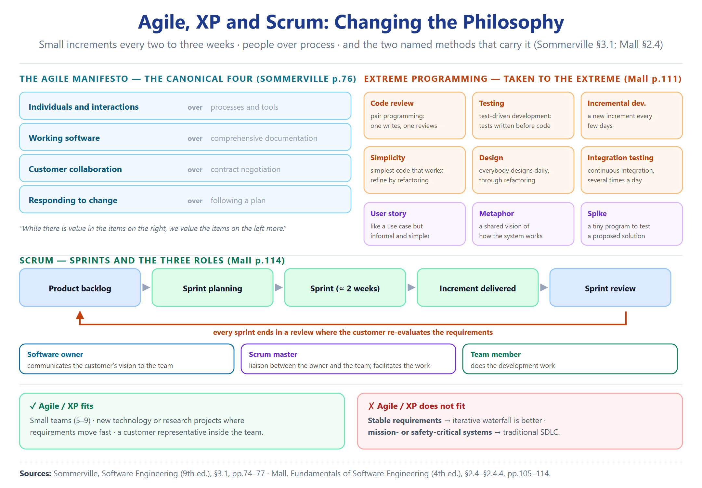

# Unit 08 — Agile, XP and Scrum: Changing the Philosophy

> **Sources.** Sommerville, *Software Engineering* 9th ed., §3.1, pp.74–77 (context, the agile definition, the four manifesto statements, where it works and fails). Mall, *Fundamentals of Software Engineering* 4th ed., §2.4–§2.4.4, pp.105–114 (agile overview, agile-versus-other-models, Extreme Programming, Scrum).
> **Note on method.** This is a compendium, not a summary. Every definition is quoted verbatim from the source before it is explained, and every claim carries a page anchor. The manifesto is shown in **both** wordings — Sommerville gives the canonical 2001 four, Mall gives a restated, expanded version — and they are presented side by side, never merged.

---

## Where this sits

**Unit Context:** Unit 07 (Unified Process) closed on its own weight — UP is **disciplined and complete, and heavy**. For a small team with fast-changing requirements, even UP is **too much process** (Sommerville p.70: "not a suitable process for all types of development, e.g., embedded software").

**The question this unit answers:** *what if the problem is not which process, but the assumption that we can plan at all?* Agile throws out the heavyweight plan-driven machinery and replaces it with **people, working software, and the acceptance that requirements will change**. [Foundational Knowledge / Standard Concept]

**The question it hands to the next unit:** *agile is not the final answer either — it fails on critical systems and on stable requirements. So the last question is no longer "which model is best" but "which model fits".*

**The connective tissue:** every model so far tried to *absorb change through structure* (loops, increments, phases). Agile's move is more radical — it says **stop trying to freeze change; build a process that assumes it from minute one**. This is the philosophical flip the narrative spine promised.

---

## 1. Why Agile Appeared — The Failure of Plan-Driven for Business Systems

**Verbatim (Sommerville p.74):**

> Businesses now operate in a global, rapidly changing environment... many businesses are willing to trade off software quality and compromise on requirements to achieve faster deployment of the software that they need. Because these businesses are operating in a changing environment, it is often practically impossible to derive a complete set of stable software requirements.

**Verbatim (Sommerville p.74):**

> Software development processes that plan on completely specifying the requirements and then designing, building, and testing the system are not geared to rapid software development... a conventional waterfall or specification-based process is usually prolonged and the final software is delivered to the customer long after it was originally specified.

السبب الجذري: بالبيئة السريعة التغيّر، **مستحيل تستخرج مطلوبات مستقرة كاملة** — فالـWaterfall (اللي يفترض تجميد المطلوبات أول) **يتأخر جداً**، والبرنامج يوصل **بعد ما تغير سبب شرائه أصلاً**.

**Verbatim (Sommerville p.74):**

> For some types of software, such as safety-critical control systems, where a complete analysis of the system is essential, a plan-driven approach is the right one. However, in a fast-moving business environment, this can cause real problems. By the time the software is available for use, the original reason for its procurement may have changed so radically that the software is effectively useless.

توازن مهم: **plan-driven صح للأنظمة الحرجة** (اللي تحتاج تحليل كامل)، بس **فاشل للأنظمة التجارية السريعة**. هذا يربط بملف 02 (أنظمة حرجة → Waterfall) ويفتح باب Agile.

**Verbatim (Mall p.105):**

> Capers Jones carried out research involving 800 real-life software development projects, and concluded that on the average 40 per cent of the requirements is arrived after the development has already begun.

رقم قوي من Mall: **40% من المطلوبات تظهر بعد ما يبلش التطوير**. هذا يقتل فكرة "جمّد المطلوبات أول" عملياً.

**Verbatim (Mall p.106):**

> The agile software development model was proposed in the mid-1990s to overcome the serious shortcomings of the waterfall model... Agility is achieved by fitting the process to the project, i.e. removing activities that may not be necessary for a specific project. Also, anything that wastes time and effort is avoided.

تعريف «الخفة» (agility): **لاءمة العملية للمشروع** — احذف أي نشاط مو ضروري، وابتعد عن أي شي يضيّع وقت.

**Verbatim (Mall p.106):**

> Please note that agile model is being used as an umbrella term to refer to a group of development processes... A few popular agile SDLC models are the following: Crystal, Atern (formerly DSDM), Feature-driven development, Scrum, Extreme programming (XP), Lean development, Unified process.

**Agile = مظلّة (umbrella term)**، مو نموذج واحد. تذكّر: UP نفسه مذكور ضمن عائلة Agile عند Mall — يعني UP وAgile **مو متناقضين**، UP هو نسخة «منضبطة/ثقيلة» من نفس العائلة.

---

## 2. What Agile Is — The Definition

**Verbatim (Sommerville p.75):**

> Agile methods are incremental development methods in which the increments are small and, typically, new releases of the system are created and made available to customers every two or three weeks. They involve customers in the development process to get rapid feedback on changing requirements. They minimize documentation by using informal communications rather than formal meetings with written documents.

**Verbatim (Mall p.107):**

> The requirements are decomposed into many small parts that can be incrementally developed. The agile model adopts an iterative approach. Each incremental part is developed over an iteration. Each iteration is intended to be small and easily manageable and lasting for a couple of weeks only. At a time, only one increment is planned, developed, and then deployed at the customer site. No long-term plans are made.

الاتفاق بين المصدرين: تكرارات **صغيرة (~أسبوعين)**، **تسليم للعميل كل تكرار**، **إشراك العميل**، **توثيق م minimised**. الفرق الطفيف: Mall يضيف **«نخطط/نطوّر/ننشر زيادة واحدة بس كل مرة + ما أكو خطط طويلة المدى»**.

### 2.1 The Time Box in Agile (distinct from RAD's time box)

**Verbatim (Mall p.107):**

> The time to complete an iteration is called a time box. The implication of the term time box is that the end date for an iteration does not change. That is, the delivery date is considered sacrosanct. The development team can, however, decide to reduce the delivered functionality during a time box if necessary.

**هذا يختلف عن time-box حق RAD (ملف 05):** هنا الـtime box = **مدة التكرار**، وتاريخ التسليم **مقدّس لا يتغيّر** — فإذا تأخرت، **يُقلّص functionality مو يُمدّد التاريخ**. (بـRAD كان الـtime-box = الحد الأقصى لكل ميزة). الاثنان يستخدمان نفس المصطلح بسياق مختلف.

### 2.2 Team Size and the Customer Representative

**Verbatim (Mall p.107):**

> It is recommended that the development team size be deliberately kept small (5–9 people) to help the team members meaningfully engage in face-to-face communication and have collaborative work environment. It is implicit then that the agile model is suited to the development of small projects.

**Verbatim (Mall p.107):**

> For establishing close contact with the customer during development... each agile project usually includes a customer representative in the team. At the end of each iteration, stakeholders and the customer representative review the progress made and re-evaluate the requirements.

فريق **صغير (5–9)** + **ممثل عميل داخل الفريق** — هذا يفرّق Agile جذرياً عن النماذج الكبيرة (اللي فيها عقود وتفاوض رسمي).

---

## 3. The Three Characteristics of Rapid Development (Sommerville)

**Verbatim (Sommerville p.74–75):**

> Although there are many approaches to rapid software development, they share some fundamental characteristics:
>
> 1. The processes of specification, design, and implementation are interleaved. There is no detailed system specification, and design documentation is minimized or generated automatically by the programming environment used to implement the system. The user requirements document only defines the most important characteristics of the system.
> 2. The system is developed in a series of versions. End-users and other system stakeholders are involved in specifying and evaluating each version. They may propose changes to the software and new requirements that should be implemented in a later version of the system.
> 3. System user interfaces are often developed using an interactive development system that allows the interface design to be quickly created by drawing and placing icons on the interface.

ثلاث خصائص: (1) المواصفة/التصميم/التنفيذ **متداخلة** (مو متسلسلة) + توثيق م minimised؛ (2) سلسلة إصدارات + **العملاء يقيّمون ويقترحون تغييرات**؛ (3) واجهات تُطوّر بأدوات تفاعلية.

---

## 4. The Agile Manifesto — Shown in Both Wordings

### 4.1 Sommerville's Canonical Four Statements (p.76)

**Verbatim:**

> We are uncovering better ways of developing software by doing it and helping others do it. Through this work we have come to value:
>
> - **Individuals and interactions** over processes and tools
> - **Working software** over comprehensive documentation
> - **Customer collaboration** over contract negotiation
> - **Responding to change** over following a plan
>
> That is, while there is value in the items on the right, we value the items on the left more.

### 4.2 Mall's Restated Version (p.108)

**Verbatim:**

> The following important principles behind the agile model were publicised in the agile manifesto in 2001:
>
> - **Working software** over comprehensive documentation.
> - **Frequent delivery** of incremental versions of the software to the customer in intervals of few weeks.
> - **Requirement change requests** from the customer are encouraged and are efficiently incorporated.
> - **Having competent team members and enhancing interactions** among them is considered much more important than issues such as usage of sophisticated tools or strict adherence to a documented process.
> - **Continuous interaction with the customer** is considered much more important rather than effective contract negotiation. A customer representative is required to be a part of the development team.
> - Agile development projects usually deploy **pair programming**.

**فرق مصدري — مو تناقض:** Sommerville يذكر **الأربعة الكلاسيكية** (منشور 2001). Mall **يعيد صياغتها** ويضيف تفاصيل عملية (التسليم المتكرر، تشجيع تغيير المطلوبات، pair programming). الاثنان يتفقان على الجوهر: **software + customer + change + people > documents + contract + plan + process**. لو السؤال گال «حسب Sommerville» — جاوب بالأربعة الكلاسيكية. [Source Difference]

---

### 4.3 The whole philosophy in one picture

**كيف تقرأ الرسم — وهذا خريطة الوحدة كلها:**

| العنصر في الرسم | معناه الهندسي |
|:---|:---|
| **صفوف «X over Y»** | **بيان Agile** — اليسار (الأزرق) **أهم**، واليمين (الرمادي) **له قيمة لكن أقل**. الجملة الأخيرة تحسم: *«we value the items on the left more»* |
| **الشرائح البرتقالية الست** | **ممارسات XP «لحد التطرف»** — مراجعة → pair programming · اختبار → TDD · تكرار → زيادات أيام · بساطة · تصميم يومي · تكامل مستمر |
| **الشرائح البنفسجية الثلاث** | مفاهيم XP: **user story** · **metaphor** · **spike** (الـspike شبيه بالنموذج الأولي — يربط بالوحدة 03) |
| **سلسلة الـsprint** | **Scrum**: من الـbacklog → تخطيط → sprint (~أسبوعين) → زيادة مسلَّمة → مراجعة، ثم **ترجع للـbacklog** |
| **الأدوار الثلاثة** | software owner (رؤية العميل) · scrum master (وسيط وميسّر) · team member |
| **الصندوقان السفليان** | **متى يناسب ومتى لا** — الفرق **مو بالحجم بس، بالاستقرار والخطورة** |

**الخلاصة البصرية:** الفرق بين Agile وما قبله **مو بالمراحل — بالافتراض**. النماذج السابقة تفترض إن التغيير **استثناء يُدار**؛ Agile يفترض إنه **القاعدة الافتراضية**. ولهذا يفشل مع **المطلوبات المستقرة** و**الأنظمة الحرجة** — مو لأنه ضعيف، بل لأنه **مصمّم لبيئة مختلفة**.

---

## 5. Agile versus Other Models (Mall — unique material)

**ملاحظة تغطية:** Sommerville does not do these head-to-head comparisons; the following three contrasts are **Mall-only** and are high-value for exams.

### 5.1 Agile vs Iterative Waterfall

**Verbatim (Mall p.109):**

> In the waterfall model... Progress is generally measured in terms of the number of completed and reviewed artifacts such as requirement specifications, design documents, test plans, code reviews, etc. In contrast, while using an agile model, progress is measured in terms of the developed and delivered functionalities... agile teams use the waterfall model on a small scale, repeating the entire waterfall cycle in every iteration. If a project being developed using waterfall model is cancelled mid-way during development, then there is nothing to show from the abandoned project beyond several documents. With agile model, even if a project is cancelled midway, it still leaves the customer with some worthwhile code, that might possibly have already been put into live operation.

الفرق الجوهري: Waterfall يقيس التقدّم بـ**المنتجات الموثّقة** (artifacts)؛ Agile بـ**الوظائف المُسلَّمة**. ونقطة ذكية: Agile يستخدم Waterfall **بمقياس صغير بكل تكرار** (يكرّر الدورة كاملة). وإذا أُلغي المشروع منتصفاً: Waterfall **ما يترك شي غير أوراق**؛ Agile **يترك كود شغّال**.

### 5.2 Agile vs Exploratory Programming

**Verbatim (Mall p.109–110):**

> Agile development model's frequent re-evaluation of plans, emphasis on face-to-face communication, and relatively sparse use of documentation are similar to that of the exploratory style. Agile teams, however, do follow defined and disciplined processes and carry out systematic requirements capture, rigorous designs, compared to chaotic coding in exploratory programming.

Agile **مو** «برمجة استكشافية» (chaotic coding) — عنده **عمليات منضبطة والتزام بتصميم رigorous**. التشابه بالتواصل وجهاً لوجه والتوثيق الخفيف فقط.

### 5.3 Agile vs RAD

**Verbatim (Mall p.110):**

> The important differences between the agile and the RAD models are the following:
>
> - Agile model does not recommend developing prototypes, but emphasises systematic development of each incremental feature. In contrast, the central theme of RAD is based on designing quick-and-dirty prototypes, which are then refined into production quality code.
> - Agile projects logically break down the solution into features that are incrementally developed and delivered. The RAD approach does not recommend this. Instead, developers using the RAD model focus on developing all the features of an application by first doing it badly and then successively improving the code over time.
> - Agile teams only demonstrate completed work to the customer. In contrast, RAD teams demonstrate to customers screen mock ups, and prototypes, that may be based on simplifications such as table look-ups rather than actual computations.

**هذا يربط بملف 05:** RAD = نماذج أولية «quick-and-dirty» ثم تُحسّن؛ Agile = **تطوير منهجي لكل ميزة** بدون نماذج أولية. Agile يعرض **شغل مكتمل**؛ RAD يعرض **mock-ups**. (تذكّر: RAD يبني ميزة واحدة بس بـmini-projects متوازية؛ Agile يبني زيادة واحدة متسلسلة بس).

---

## 6. Advantages and Disadvantages of Agile (Mall)

**Verbatim (Mall p.108–109):**

> The agile methods derive much of their agility by relying on the tacit knowledge of the team members about the development project and informal communications to clarify issues, rather than spending significant amounts of time in preparing formal documents and reviewing them. Though this eliminates some overhead, but lack of adequate documentation may lead to several types of problems, which are as follows:
>
> - Lack of formal documents leaves scope for confusion and important decisions taken during different phases can be misinterpreted at later points of time by different team members.
> - In the absence of any formal documents, it becomes difficult to get important project decisions such as design decisions to be reviewed by external experts.
> - When the project completes and the developers disperse, maintenance can become a problem.

**الميزة:** اعتماد على المعرفة الضمنية (tacit knowledge) + تواصل غير رسمي = خفّة. **العيوب الثلاثة:** (1) توثيق ضعيف → تشوّش وسوء فهم؛ (2) صعوبة مراجعة القرارات من خبراء خارجيين؛ (3) **المحافظة (maintenance) تصير مشكلة** لما يتفرّق المطوّرون. هذي العيوب الثلاثة تردّد صدى عيوب النماذج المُرمية (ملف 03).

---

## 7. Extreme Programming (XP) — Mall Primary

**ملاحظة تغطية:** Sommerville names XP in one sentence (*"Probably the best-known agile method is extreme programming (Beck, 1999; Beck, 2000)"*, p.76) and lists it among others, but the **substantive XP treatment is Mall-only**. The same applies to Scrum.

**Verbatim (Mall p.110):**

> Extreme programming (XP) is an important process model under the agile umbrella and was proposed by Kent Beck in 1999. The name of this model reflects the fact that it recommends taking these best practices that have worked well in the past in program development projects to extreme levels. This model is based on a rather simple philosophy: "If something is known to be beneficial, why not put it to constant use?"

فكرة XP: **خذ أفضل الممارسات وطبّقها لحد التطرف** (extreme). الفلسفة: *«إذا شي مفيد، ليش ما نستخدمه باستمرار؟»*

### 7.1 The Five Practices Taken to the Extreme

**Verbatim (Mall p.111):**

> - **Code review:** ... It suggests pair programming as the way to achieve continuous review. In pair programming, coding is carried out by pairs of programmers. The programmers take turn in writing programs and while one writes the other reviews code that is being written.
> - **Testing:** XP suggests test-driven development (TDD) to continually write and execute test cases. In the TDD approach, test cases are written even before any code is written.
> - **Incremental development:** ... the team should come up with new increments every few days.
> - **Simplicity:** ... one should try to create the simplest code that makes the basic functionality being written to work. For creating the simplest code, one can ignore the aspects such as efficiency, reliability, maintainability, etc. Once the simplest thing works, other aspects can be introduced through refactoring.
> - **Design:** ... everybody should design daily. This can be achieved through refactoring, whereby a working code is improved for efficiency and maintainability.
> - **Integration testing:** ... extreme programming suggests that the developers should achieve continuous integration, by building and performing integration testing several times a day.

ست ممارسات (Mall سمّاها 6 بس خمسة منها «to the extreme» + integration): 

1. **المراجعة** → pair programming (مبرمجان معاً، واحد يكتب والثاني يراجع، يبدّلون كل ساعة)

2. **الاختبار** → TDD (تكتب اختبارات **قبل** الكود)

3. **التطوير التزايدي** → زيادات كل بضعة أيام

4. **البساطة** → أبسط كود يشتغل، وتجاهل الكفاءة/الموثوقية أولاً، ثم تضيفها بـ**refactoring**

5. **التصميم** → الكل يصمّم يومياً عبر refactoring

6. **اختبار التكامل** → **continuous integration** عدة مرات يومياً

### 7.2 The Basic Idea — User Stories, Metaphors, Spikes

**Verbatim (Mall p.111–112):**

> XP is based on frequent releases (called iteration), during which the developers implement "user stories". User stories are similar to use cases, but are more informal and are simpler. A user story is the conversational description by the user about a feature of the required system... On the basis of user stories, the project team proposes "metaphors"—a common vision of how the system would work. The development team may decide to construct a spike for some feature. A spike, is a very simple program that is constructed to explore the suitability of a solution being proposed. A spike can be considered to be similar to a prototype.

ثلاثة مفاهيم XP:

- **User stories** = زي use cases بس **أبسط وأقل رسمية** (وصف محادثة لميزة)

- **Metaphors** = رؤية مشتركة لكيفية عمل النظام

- **Spike** = برنامج بسيط جداً **لاستكشاف ملاءمة حل** — شبيه بالنموذج الأولي (يربط بملف 03)

### 7.3 The Six XP Activities

**Verbatim (Mall p.112–113):**

> XP prescribes several basic activities to be part of the software development process: **Coding**... **Testing**... **Listening**... **Designing**... **Feedback**... **Simplicity**...

الأنشطة الستة: Coding · Testing · Listening (الاستماع للعميل لأنه يملك المعرفة بالمجال) · Designing · Feedback («نظام بعيد عن المستخدمين = مشكلة قادمة») · Simplicity («ابنِ شي بسيط يشتغل اليوم، لا تبنِ شي يأخذ وقتاً وربما لن يُستخدم أبداً»).

### 7.4 When XP / Agile Fits — and When It Does NOT

**Verbatim (Mall p.113):**

> Projects involving new technology or research projects: In this case, the requirements change rapidly and unforeseen technical problems need to be resolved. Small projects: Extreme programming was proposed in the context of small teams as face to face meeting is easier to achieve.

**Verbatim (Mall p.113–114):**

> Project characteristics not suited to development using agile models:
>
> - **Stable requirements:** Conventional development models are more suited to use in projects characterised by stable requirements... process models such as iterative waterfall model that involve making long-term plans during project initiation can meaningfully be used.
> - **Mission critical or safety critical systems:** In the development of such systems, the traditional SDLC models are usually preferred to ensure reliability.

**XP يناسب:** تقنية جديدة/بحث (مطلوبات سريعة التغيّر) + مشاريع صغيرة. **ما يناسب:** مطلوبات مستقرة (استخدم iterative waterfall) + أنظمة حرجة/مهمة بسلامة (استخدم SDLC التقليدي). هذا **يطابق تماماً** ما قاله Sommerville بص74 (plan-driven صح للأنظمة الحرجة).

---

## 8. Scrum — Mall Primary

**Verbatim (Mall p.114):**

> In the scrum model, a project is divided into small parts of work that can be incrementally developed and delivered over time boxes that are called sprints. The software therefore gets developed over a series of manageable chunks. Each sprint typically takes only a couple of weeks to complete. At the end of each sprint, stakeholders and team members meet to assess the progress made and the stakeholders suggest to the development team any changes needed to features that have already been developed and any overall improvements that they might feel necessary.

**Verbatim (Mall p.114):**

> In the scrum model, the team members assume three fundamental roles—software owner, scrum master, and team member. The software owner is responsible for communicating the customers vision of the software to the development team. The scrum master acts as a liaison between the software owner and the team, thereby facilitating the development work.

Scrum:

- **Sprints** = time boxes قصيرة (~أسبوعين)، ينتهي كل واحد باجتماع تقييم + **العميل يقترح تغييرات على ميزات صار انبنيت**

- **ثلاثة أدوار:** software owner (ينقل رؤية العميل) · scrum master (وسيط/ميسّر) · team member

**ملاحظة تغطية:** Sommerville lists Scrum among agile methods (p.76: "Scrum (Cohn, 2009; Schwaber, 2004; Schwaber and Beedle, 2001)") but defers detailed treatment; Mall supplies the sprints + roles. Note that Sommerville's agile chapter (§3.3, §3.4) is said to "focus on two of the most widely used methods: extreme programming and Scrum" — but in the pages extracted (up to p.77) only the listing appears; the detailed sections are beyond the extracted range. The substantive XP/Scrum content used here is Mall's. [Source Difference]

---

## 9. Where Agile Works — and the Principles Hard to Realise

**Verbatim (Sommerville p.76–77):**

> Agile methods have been very successful for some types of system development: 1. Product development where a software company is developing a small or medium-sized product for sale. 2. Custom system development within an organization, where there is a clear commitment from the customer to become involved in the development process and where there are not a lot of external rules and regulations that affect the software.

**Verbatim (Sommerville p.77):**

> In practice, the principles underlying agile methods are sometimes difficult to realize: 1. Although the idea of customer involvement... its success depends on having a customer who is willing and able to spend time with the development team and who can represent all system stakeholders... 2. Individual team members may not have suitable personalities for the intense involvement... 3. Prioritizing changes can be extremely difficult, especially in systems for which there are many stakeholders... 4. Maintaining simplicity requires extra work.

**ينجح بـ:** منتج صغير/متوسط للبيع + تطوير مخصص بـ**التزام عميل حقيقي** وبدون قوانين خارجية كثيرة. **يتعذّر تطبيقه بـ:** (1) العميل غير متفرّغ/ما يمثّل كل أصحاب المصلحة؛ (2) شخصيات الفريق ما تناسب العمل المكثّف؛ (3) **ترتيب الأولويات للتغييرات صعب** مع كثرة أصحاب المصلحة؛ (4) **البساطة تتطلب شغل إضافي** (تحت ضغط الجدول يضيعونها). هذي النقاط الأربع تكمّل عيوب Mall الثلاثة (§6).

---

## 10. The Agile Principles (Sommerville Figure 3.1)

**Verbatim (Sommerville p.77):**

| Principle | Description |
|:---|:---|
| **Customer involvement** | Customers should be closely involved throughout the development process. |
| **Incremental delivery** | The software is developed in increments with the customer specifying the requirements to be included in each increment. |
| **People not process** | The skills of the development team should be recognized and exploited. |
| **Embrace change** | Expect the system requirements to change and so design the system to accommodate these changes. |
| **Maintain simplicity** | Focus on simplicity in both the software and in the development process. |

خمسة مبادئ (من Sommerville): إشراك العميل · التسليم التزايدي · **الناس لا العملية** · احتضان التغيير · الحفاظ على البساطة. هذي تلخّص فلسفة Agile كلها.

---

## 11. Source notes

| **Source** | **Role** | **What it adds** | **What it omits** |
|:---|:---|:---|:---|
| **Sommerville p.74–77** | Primary (philosophy) | Business context for agile; three rapid-dev characteristics; the canonical four manifesto statements; where agile works/fails; the five principles (Fig 3.1); the four "difficult to realize" points | Detailed XP/Scrum mechanics — only named/listed |
| **Mall p.105–114** | Primary (XP + Scrum) | Why waterfall failed (Capers Jones 40%); time box definition; team size 5–9; agile-vs-waterfall/exploratory/RAD; advantages/disadvantages; full XP (5 practices, user stories/metaphors/spikes, 6 activities, applicability); full Scrum (sprints, 3 roles); manifesto restated | The canonical four manifesto wording (uses restated version) |

**The decision rule applied (per student instruction):** all sources read in full before writing; nothing compressed — this is a compendium. The manifesto is shown in **both** wordings (§4) because Sommerville gives the canonical 2001 four and Mall gives a restated, expanded version; they are presented as a source difference, not merged. Where Mall alone supplies material (agile-vs-other-models, XP mechanics, Scrum roles), it is marked `coverage note` so a student knows Sommerville will not supply it. Rule 3 (show both) and Rule 6 (coverage note) honoured. [Source Difference]

---

## 12. Retrieval set

**[RS-08-01]** Why did agile methods emerge?
> **Answer:** Plan-driven/waterfall processes are too slow for fast-changing business environments; requirements cannot be frozen up front (Sommerville: "practically impossible to derive a complete set of stable requirements"; Mall: Capers Jones found 40% of requirements arrive after development begins). [Sommerville p.74; Mall p.105]

**[RS-08-02]** What is an agile method, in one sentence?
> **Answer:** Incremental development with small increments, new releases typically every two or three weeks, close customer involvement for rapid feedback, and minimal documentation via informal communication. [Sommerville p.75; Mall p.107]

**[RS-08-03]** What is the agile "time box" and how does it differ from RAD's?
> **Answer:** The duration of one iteration; the end date is sacrosanct and if late, functionality is reduced (not the date extended). (RAD's time box = max time per feature.) [Mall p.107; contrasts Unit 05]

**[RS-08-04]** State the four manifesto statements (Sommerville's canonical wording).
> **Answer:** Individuals and interactions over processes and tools; Working software over comprehensive documentation; Customer collaboration over contract negotiation; Responding to change over following a plan. [Sommerville p.76]

**[RS-08-05]** How does Mall's manifesto version differ from Sommerville's?
> **Answer:** Mall restates the same values and adds operational points — frequent delivery every few weeks, encouraging requirement changes, competent-team-over-tools, customer rep in team, pair programming. Same spirit, expanded. Do not merge. [Mall p.108; Source Difference]

**[RS-08-06]** List the three fundamental characteristics of rapid development (Sommerville).
> **Answer:** (1) Spec/design/implementation interleaved, minimal docs; (2) System built in versions with stakeholder involvement and change proposals; (3) UIs built with interactive development tools. [Sommerville p.74–75]

**[RS-08-07]** Agile vs iterative waterfall — the key contrast?
> **Answer:** Waterfall measures progress by reviewed artifacts (documents); agile by delivered functionality. Agile uses waterfall at small scale each iteration. If cancelled, waterfall leaves only documents; agile leaves working code. [Mall p.109]

**[RS-08-08]** Agile vs RAD — the key contrast?
> **Answer:** Agile develops each feature systematically with no prototypes; RAD builds quick-and-dirty prototypes refined later. Agile shows completed work; RAD shows mock-ups. [Mall p.110]

**[RS-08-09]** Agile vs exploratory programming — the key contrast?
> **Answer:** Both favour face-to-face and light docs, but agile follows defined, disciplined processes with systematic requirements capture and rigorous design; exploratory is chaotic coding. [Mall p.109–110]

**[RS-08-10]** What are the advantages and disadvantages of agile (Mall)?
> **Answer:** Advantage: agility from tacit knowledge + informal comms. Disadvantages: confusion from missing docs; hard to get external expert review; maintenance problems when developers disperse. [Mall p.108–109]

**[RS-08-11]** Who proposed XP, when, and what is its core philosophy?
> **Answer:** Kent Beck, 1999. Philosophy: take proven good practices to extreme levels — "if something is known to be beneficial, why not put it to constant use?" [Mall p.110]

**[RS-08-12]** Name the five XP practices taken "to the extreme" and what each becomes.
> **Answer:** Code review → pair programming; Testing → TDD (tests before code); Incremental dev → increments every few days; Simplicity → simplest code, then refactor; Design → daily design via refactoring; (plus Integration → continuous integration several times a day). [Mall p.111]

**[RS-08-13]** What are user stories, metaphors, and spikes in XP?
> **Answer:** User stories = informal/simpler use cases (conversational feature description); Metaphors = common vision of how the system works; Spike = a very simple program to explore a solution's suitability (similar to a prototype). [Mall p.111–112]

**[RS-08-14]** When is XP/agile suitable, and when is it NOT?
> **Answer:** Suitable: new-technology/research projects (rapid requirement change) and small teams. NOT suitable: stable requirements (use iterative waterfall) and mission/safety-critical systems (use traditional SDLC). [Mall p.113–114]

**[RS-08-15]** What is Scrum — sprints and the three roles?
> **Answer:** Project divided into time-boxed chunks called sprints (~2 weeks); each ends with a review where stakeholders propose changes. Three roles: software owner (customer's vision), scrum master (liaison/facilitator), team member. [Mall p.114]

**[RS-08-16]** What are the five agile principles (Sommerville Fig 3.1) and where does agile fail to scale?
> **Answer:** Customer involvement; Incremental delivery; People not process; Embrace change; Maintain simplicity. Scaling fails on: unavailable customer, personality misfit, hard change-prioritisation with many stakeholders, simplicity needing extra work. [Sommerville p.77]

---

## 13. Page anchors

- **Sommerville:** p.74 (business context, 40% requirements, plan-driven right for safety-critical) · p.74–75 (three rapid-dev characteristics) · p.75 (agile definition, 2–3 weeks, minimal docs) · p.76 (manifesto, names XP/Scrum/others) · p.76–77 (where agile succeeds) · p.77 (principles hard to realize, Fig 3.1 five principles)

- **Mall:** p.105 (Capers Jones 40%, agile mid-1990s, umbrella term, 7 agile models) · p.106 (agility = fit process to project) · p.107 (iteration/time box sacrosanct, team 5–9, customer rep) · p.108 (manifesto restated, pair programming) · p.108–109 (pair programming detail, advantages/disadvantages) · p.109–110 (agile vs waterfall/exploratory/RAD) · p.110 (XP defined, Beck 1999) · p.111 (five practices to extreme) · p.111–112 (user stories/metaphors/spikes) · p.112–113 (six activities, applicability, unsuitability) · p.114 (Scrum sprints + three roles)

---

**End of Unit 08.**

---

*Master Studio · Advanced Software Engineering (CS504) · University of Wasit*
