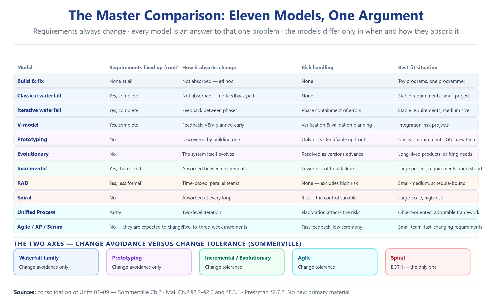

# Unit 10 — Master Comparison and Exam Bank

> **Sources.** A consolidation of Units 01–09 — Sommerville Ch.2; Mall Ch.2 §2.2–§2.6 and §8.3.1; Pressman §2.7.2 (the spiral); Agarwal (RAD). **No new primary material** — every statement here is a re-cut of material already verified and page-anchored in the earlier units.
> **Note on method.** This unit exists to be reviewed, not to be read first. It carries the side-by-side comparison, the two-axis recap, and the consolidated retrieval bank. If a claim here disagrees with its source unit, the source unit is correct — this is a re-cut, not a new reading.

---

## Where this sits

**Unit Context:** Unit 09 (Choosing a Model) closed the argument: no model wins, only fits — selection is driven by the product, the team, the customer, and above all by **requirements and risk**. The series had reached its meta-step: a *decision rule* sitting above all ten models. [Foundational Knowledge / Standard Concept]

**The question this unit answers:** *can I see all ten models side by side, lay the two recurring axes bare, and drill every topic back to its retrieval question?* This file is the **consolidation** — one master comparison table, the two axes recapped, Mall's exercises mapped to the file that answers each, and the **complete retrieval bank** (all 133 questions from Units 01–09) in one place.

**The question it hands to the next unit:** *nothing further in this subject* — Unit 10 is the end of the Advanced Software Engineering process-models thread. What it hands forward is the exam itself: the ability to pick the right row on sight.

**The connective tissue:** the nine files were never ten topics — they were ten chapters of one argument (requirements always change; every model is a different answer to *when* and *how* that change is absorbed). This file is the index to that argument.

---

## 1. Master Model Comparison Table

| # | Model | Best-fit situation (when to use) | Key limitation / weakness | Risk posture | Requirements posture | Customer cash-flow | Source file |
|:--:|:---|:---|:---|:---|:---|:---|:---|
| 1 | **Build & Fix / Exploratory** | Trivial / single-programmer "toy" work; "comes naturally to first-time programmers" | Poor quality, unmaintainable, expensive for non-trivial; **fails at team scale** (coordination breaks) | None managed | None captured | n/a | Unit 02 / Mall p.28 |
| 2 | **Classical Waterfall** | Requirements **well understood and unlikely to change radically**; also implicitly used to *document* any software | **No feedback paths**; idealistic; cannot absorb change | Assumes no errors occur | Frozen up front | Large up-front (monolithic delivery) | Unit 02 / Mall p.73–81; Sommerville p.47–49 |
| 3 | **Iterative Waterfall** | **Well-understood problems**; the most widely used model | Not for **very large** or **high-risk** projects | Feedback paths allow correction, but no risk *analysis* | Frozen up front (with correction) | Monolithic | Unit 02 / Mall p.83–84; Unit 09 p.118 |
| 4 | **V-Model** | **Safety-critical / high-reliability**; verification & validation run throughout | **Sequential** (no iteration); rigid | Testing built in from the start | Frozen | Monolithic | Unit 02 / Mall p.88–89 `[THIN: Sommerville has no V-model]` |
| 5 | **Prototyping** | GUI part; unclear technical solution; requirements/technical **not** understood but **all risks identifiable up front** | Prototype not used the same way as final; pressure to deliver throwaway; degraded structure | **Change avoidance**; handles *known* risks | Discovered via prototype; SRS usually still needed (except GUI) | Lower up-front | Unit 03 / Sommerville p.62–63; Mall p.91–93 |
| 6 | **Evolutionary** | Large **decomposable** problems; OO; customer accepts incremental delivery | Feature division non-trivial; ad-hoc design; *not* best when requirements are clear (iterative waterfall wins) | **Change tolerance** | **Evolve**, not frozen | Incremental | Unit 03 / Mall p.97–99 |
| 7 | **Incremental Dev & Delivery** | Large / slow-changing; **most common** approach today; can be plan-driven, agile, or mixed | Process **not visible**; structure **degrades**; not for very large / embedded / critical | **Change tolerance** (later increments absorb change) | Core first; later outlined; *current* increment frozen | Incremental (no large up-front) | Unit 04 / Sommerville p.49–51, 64–65; Mall p.95–97 |
| 8 | **RAD** | Small/medium; completable in **2–3 months**; requirements **known clearly**; need for speed | Only small/medium; needs **active customer + collocated team**; unsuitable for high technical risk | Minimal (assumes known requirements) | Less formal (automated tools), known up front | Fast | Unit 05 / Mall p.100–104 `[THIN: Sommerville/Pressman cover RAD only in passing]` |
| 9 | **Spiral** | Technically challenging, large, risks **hard to anticipate at start** (emerge during) | Complex; hard to convince customers; needs risk-assessment expertise; less widely used | **Explicit risk-driven**; meta-model encompassing all others | Evolve per loop; prototype each phase | Refined over loops | Unit 06 / Sommerville p.65–67; Mall p.114–116; Pressman p.64–68 |
| 10 | **Unified Process (RUP)** | OO; large; wants incremental + iterative but **disciplined** | **Heavy**; not for embedded; needs experienced team | Risk addressed in Elaboration (key risks) | Use-case-driven; elaborated | Phased | Unit 07 / Mall p.475–476; Sommerville p.67–70 |
| 11 | **Agile / XP / Scrum** | Small teams; rapidly changing requirements; business systems; new technology | **Not** for critical/safety systems; scaling problems; needs available customer | **Embraces change**; low-ceremony | Emerge; user stories; no big up-front SRS | Incremental (2–3 week releases) | Unit 08 / Sommerville p.74–77; Mall p.105–114 |

> **Reading the table [Foundational Knowledge / Standard Concept]:** the column that decides the row is **Requirements posture** + **Risk posture**. Freeze-and-plan (rows 2–4) ⇒ stable requirements, low risk. Learn-then-build (5–6) ⇒ unclear requirements, known risks. Slice-and-absorb (7) ⇒ change expected. Compress (8) ⇒ speed-bound, known requirements. Risk-drive (9) ⇒ emergent risk. Hybrid-discipline (10) ⇒ OO + need for control. Embrace-change (11) ⇒ volatile requirements, available customer.

---

## 2. The Two Axes Recap — Why the Series Is One Argument

The whole series reduces to **two drivers** and **two lenses**. Keep these in mind during the exam and every model snaps into place.

### 2.1 The underlying axis: Requirements & Risk (the "what changes" axis)

- **Requirements always change.** Inception starts vague (Mall p.67); maintenance — the longest phase — is continual change (Mall p.68); `evolution` is one of the four fundamental activities (Sommerville p.45).

- **Sommerville's avoidance/tolerance split (p.61):** *Change avoidance* = anticipate change before rework (prototyping). *Change tolerance* = absorb change cheaply (incremental). **Spiral = both.**

- **Risk as the second driver:** identifiable up front → prototyping; emerges during → spiral; low + well-understood → iterative waterfall; high + changing → spiral.

### 2.2 Lens A — Mall's three selection factors (Unit 09, p.120)

1. **Product** — small services → agile; product/embedded → iterative waterfall; OO → evolutionary.

2. **Team** — experienced → even embedded via iterative waterfall; novice → even simple DPA via prototyping.

3. **Customer** — unfamiliar with computers → requirements drift → prototyping.

### 2.3 Lens B — Sommerville's critical↔business + plan-driven↔agile axes (Unit 01/09, p.46)

- **Critical systems** → very structured / plan-driven process.

- **Business systems with rapidly changing requirements** → less formal, flexible / agile process.

- **Boehm & Turner (2003):** each approach suits different software; **find a balance**.

> **No contradiction.** Lens A (three factors) and Lens B (two axes) are **complementary descriptions of the same choice** — requirements-and-risk is the underlying axis; Mall's factors are the concrete knobs. Shown side by side in Unit 09 §5, not merged.

### 2.4 The narrative in one line per model

### 2.5 The whole series in one picture

**كيف تقرأ الرسم — وهذا خريطة الوحدة كلها:**

| العنصر في الرسم | معناه الهندسي |
|:---|:---|
| **الصفوف الأفقية (11 صف)** | **كل صف = نموذج** من Build & Fix إلى Agile. RAD و Unified Process و Agile كلها صفوف مستقلة |
| **عمود Requirements posture** | **المحور الأول**: freeze-and-plan (صفوف 2–4) مقابل evolve-and-absorb (صفوف 5–11). هذا العمود يحدد شكل الصف |
| **عمود Risk posture** | **المحور الثاني**: none → managed → explicit. Spiral (صف 9) هو الوحيد اللي يصير الخطر هو المحرّك الصريح |
| **التجميع اللوني** | الصفوف مرتّبة حسب «متى تتغير المطلوبات» — نفس التدرّج بالنص §1 والجدول |
| **العمود الأخير (Source file)** | **العودة للأصل**: كل صف يشير لملف الوحدة اللي درّسه — وهذا الرابط للـRetrieval bank تحت |

**الخلاصة البصرية:** الخريطة مو «أي نموذج أحسن» — هي **دالة** لمحورين (المطلوبات + الخطر). لو سُئلت «أي نموذج؟» — حدد المحورين أول، وراح الصف يطلع من نفسه.

---

## 3. Mall's Exercises Mapped to the Topics That Answer Them

The chapter-2 exercise set (Q1–Q69) is the exam's question bank. Below, each cluster points to the **file in this series that teaches the answer**.

| Exercise(s) | Topic | File that answers it |
|:---|:---|:---|
| Q1–Q2, Q5–Q6 | SDLC / process / methodology definitions | **Unit 01** |
| Q9, Q11, Q12, Q15, Q17, Q51 | Waterfall phases, effort, idealistic critique, phase completeness | **Unit 02** |
| Q20, Q68 | Build-and-fix description & activities | **Unit 02** |
| Q21, Q45 | T/F on models; iterative-waterfall shortcomings + which model overcomes each | **Unit 02** (+ Unit 09 for the "which model" part) |
| Q25–Q27, Q46 | V-model strengths/weaknesses & suitability | **Unit 02** |
| Q19, Q39, Q52 | Incremental vs evolutionary; evolutionary model | **Unit 03** / **Unit 04** |
| Q27–Q30, Q32, Q34, Q35, Q37, Q41, Q50 | Prototyping vs spiral; spiral meta-model; loops; why spiral may not be prudent | **Unit 03** / **Unit 06** |
| Q29, Q32, Q33, Q34, Q38 | Risk handling: prototyping vs spiral; spiral for MIS | **Unit 06** |
| Q24 (a–i) | "Which model for each application?" (data processing, satellite comm, telephone switch, library automation, cellular-via-satellites, text editor, compiler, OO, GUI) | **Unit 09** (selection) + Units 02–06 |
| Q40 | Payroll software → which model (experienced team) | **Unit 09** |
| Q44 | Why final docs written as-if waterfall | **Unit 09** (also **Unit 02** §2.2.1) |
| Q47–Q48, Q54, Q59, Q60 | RAD motivation, aspects, advantages vs iterative/evolutionary | **Unit 05** |
| Q49 | Customer unsure + requirements change frequently → which model | **Unit 03** / **Unit 09** |
| Q53, Q55 | Three factors; important factors influencing choice | **Unit 09** |
| Q56–Q58, Q61–Q64, Q67 | Agile features, XP practices, pairwise programming, cost/time reduction | **Unit 08** |
| Q65 | Customising existing software → agile vs iterative waterfall | **Unit 08** |
| Q66 | OO software → which model | **Unit 07** / **Unit 09** |
| Q62 | Waterfall/RAD/agile shortcomings | **Unit 02** / **Unit 05** / **Unit 08** |

> **How to use this map in revision:** pick a past paper question → find its Q-number (or topic) → jump to the named file → then to the matching retrieval item below. Every answer below is already drilled.

---

## Source notes

- **This file is a consolidation.** Its authority is entirely inherited from Units 01–09, each of which was built directly from Sommerville, Mall, Pressman, and Agarwal with verbatim anchors. No new interpretation is introduced here that is not already in those files.

- **Counts:** 11 models compared (§1); 2 axes + 3 factors recapped (§2); 30+ exercise clusters mapped (§3); **133 retrieval items** consolidated (§Retrieval Set): Unit 01 = 12, Units 02–08 = 16 each (112), Unit 09 = 9.

- **What adds nothing new:** Pressman and Agarwal appear only through Units 05–06; they contribute no unique claim at the consolidation level, so they are not re-cited here except where a prior file already carried them.

- **Coverage note (carried forward):** File 05 (RAD) could not be checked against Sommerville at all (0 relevant hits); File 02's V-model and File 03's evolutionary model are Mall-only. These gaps are inherited, not closed, by this file — noted so the student knows where a second source does not exist.

- **Rule compliance:** every item in the bank below carries its original page anchor; questions and answers are together (Rule 8); no claim here lacks a traceable source in the series.

---

## Retrieval set — the consolidated bank (133 items, Units 01–09)

> **Format:** question, then its answer directly beneath (as agreed). **Cover the answer, produce your own, then compare.**

### From Unit 01 — SDLC Fundamentals (12 items)

**1. Why does the software life cycle begin with a request rather than with software?**
> Because the term is defined on the biological analogy: it runs from "an initial customer request" to the point where the software is "no longer useful to any user, and then it is discarded." The request is the seed. (Mall p.67)

**2. Name the four stages Mall identifies, and say which is the longest.**
> **Inception** → the development stages → **operation (also called maintenance)** → **retirement**. "The operation phase is usually the longest of all phases and constitutes the useful life of a software." (Mall p.67–68)

**3. What exactly is wrong with the requirements at the inception stage?**
> The customers are "not clear about all the features that would be needed", cannot "completely describe the identified features in concrete terms", and "can only vaguely describe what is needed." (Mall p.67)

**4. Name the four fundamental activities of a software process, in order, and state what makes them fundamental.**
> **Specification · design and implementation · validation · evolution.** They are fundamental because "In some form, these activities are part of all software processes." (Sommerville p.45)

**5. A process description is not only activities. What else does it contain? Give one example of each.**
> **Products** (the outcome of architectural design is a model of the software architecture) · **roles** (project manager, configuration manager, programmer) · **pre- and post-conditions** (statements true before and after an activity is enacted). (Sommerville p.45)

**6. Distinguish SDLC, process and methodology — widest to narrowest.**
> **SDLC** is the most generic: the phases a software evolves through, graphically depicted plus textually described. A **process** is more precise and elaborate: it describes all activities from inception to maintenance and retirement, may prescribe methodologies, and may name the documents produced per phase — and "several development processes may fit the same SDLC." A **methodology** prescribes the steps for "only a single or at best a few individual activities", and may include the rationale and philosophical assumptions behind those steps. (Mall p.68–69)

**7. Distinguish programming-in-the-small from programming-in-the-large, and say what follows for the use of an SDLC.**
> **Small** = a "toy program by a single programmer"; **large** = "professional software through team effort." For small work a build-and-fix style can succeed; for large work "use of a suitable SDLC is essential." So the answer to "is an SDLC always needed?" is **no — it depends on scale**. (Mall p.70–71)

**8. Describe what goes wrong when a team has no process. Where does the failure actually appear?**
> Members work to their own assumptions: one writes code "while making assumptions about the input results required from the other parts", another prepares test documents first, another starts designing. "Severe problems can arise in **interfacing the different parts** and in **managing the overall development**." The failure lands on **coordination**, not on coding skill. (Mall p.70)

**9. State, in one sentence, the understanding a team needs — and what its absence produces.**
> A "precise understanding among the team members as to — **when to do what**." Without it, each member does whatever he feels like, which is "an open invitation to developmental chaos and project failure." (Mall p.70)

**10. Having a process is not enough. What else is required, and why?**
> It must be **properly documented**. Without documentation the team holds only "an informal understanding", activities and their ordering become "loosely defined", developers fall back on **subjective judgment** (e.g. when to design test cases, or whether to document them at all), and — importantly — an undocumented process signals to the team "the lack of seriousness on the part of the management." (Mall p.71)

**11. Define plan-driven and agile processes, and say which wins.**
> **Plan-driven:** all process activities are planned in advance and progress is measured against the plan. **Agile:** planning is incremental and the process is easier to change. **Neither wins** — "each approach is suitable for different types of software" (Boehm and Turner, 2003), and a balance is needed. Critical systems need structure; business systems with rapidly changing requirements need flexibility. (Sommerville p.46)

**12. State the one problem the whole series of models is trying to solve, and why the series is a story rather than a list.**
> That **requirements begin vague and then change** — inception is unclear, maintenance (the longest phase) is continual change, and `evolution` is one of the four fundamental activities. Every model that follows is a different answer to *when* and *how* the change is absorbed. (Sommerville p.44–45; Mall p.67–68)

### From Unit 02 — Build & Fix and the Waterfall Family (16 items)

**1. Name the three terms for the pre-process programming style, and define build and fix.**
> **Exploratory · build and fix · code and fix** — all names for the "ad hoc programming style". In a build-and-fix style, "a program is quickly developed **without making any specification, plan, or design**. The different imperfections that are subsequently noticed are fixed." (Mall p.28)

**2. What is the verdict on the exploratory style, and for whom does it "come naturally"?**
> "Except for trivial problems, the exploratory style usually yields **poor quality and unmaintainable code**" and makes development "very expensive as well as time-consuming." It "comes naturally to all first time programmers." (Mall p.28)

**3. What goes wrong if phase entry and exit criteria are not well-defined? Name the syndrome.**
> The decision whether a phase is complete becomes **subjective**; developers close phases **"much before they are actually complete, giving a **false impression of rapid progress**", and the project manager cannot assess progress. This produces the **99 per cent complete syndrome** — optimistic members feel their work is 99% done **"even when their work is far from completion", making all completion-time projections "highly inaccurate." (Mall p.73)

**4. Why is the classical waterfall studied at all, given that it is hard to use?**
> Because "all other life cycle models can be thought of as being extensions of the classical waterfall model" — so understanding it is the route to understanding every other model. And because "though not used for software development; is **implicitly used while documenting software**." (Mall p.73–74)

**5. Name the six phases of the classical waterfall, and say which are the "development phases".**
> **Feasibility study · requirements analysis and specification · design · coding and unit testing · integration and system testing · maintenance.** The **development phases** are feasibility study through integration and system testing; the software is delivered at their completion. The last phase is also called the **operation** phase. (Mall p.74)

**6. What is the effort distribution across the life cycle, and which development phase is heaviest?**
> Roughly **40:60** — about **40% development, 60% maintenance**. "The maintenance phase normally requires the maximum effort." Among the development phases, **integration and system testing** requires the most effort. (Mall p.75, p.81)

**7. Name the three types of maintenance and give the distinguishing situation for each.**
> **Corrective** — to "correct errors that were not discovered during the product development phase." **Perfective** — to "improve the performance of the system, or to enhance the functionalities… based on customer's requests." **Adaptive** — "usually required for porting the software to work in a new environment", e.g. a new platform or operating system. (Mall p.81)

**8. State the classical waterfall's most fundamental shortcoming, and the assumption behind it.**
> **No feedback paths** — "just as water in a waterfall after having flowed down cannot flow back", a completed phase is "final and… closed for any rework." The assumption behind it: the model is **idealistic** because it "assumes that no error is ever committed by the developers during any of the life cycle phases, and therefore, incorporates **no mechanism for error correction**." (Mall p.81)

**9. Why is it "nearly impossible" to follow the classical waterfall strictly?**
> Because developers "do commit a large number of errors in almost every activity" — "to err is humane" — and defects are "detected much later in the life cycle", so fixing one requires reworking "some of the work done during that phase and also the work of later phases that are affected." (Mall p.82)

**10. Explain the "blocking state" and why phases overlap in practice.**
> Work in a phase is divided among members; some finish early. Under strict phase transitions those members "idle waiting for the phase to be complete, and are said to be in a **blocking state**" — a cause of "wastage of resources and a source of cost escalation and inefficiency." The second reason for overlap is that some errors escape detection and are found later, causing rework. So "the phases are allowed to overlap" and a developer moves on "without waiting for all his team members." (Mall p.85)

**11. Define phase containment of errors and give the technique for achieving it.**
> "The principle of detecting errors as **close to their points of commitment** as possible is known as **phase containment of errors**." Since many phase outputs are documents (SRS, design document, test plan), the technique is to "rigorously review the documents produced at the end of a phase." (Mall p.85)

**12. Why is the final documentation written as if the classical waterfall had been used? Give both authorities.**
> **Parnas [1972]** suggested it. The rule: "Irrespective of the life cycle model that is actually followed… the final documents are always written to reflect a classical waterfall model of development, so that **comprehension of the documents becomes easier for any one reading the document**." The rationale is **Hoare's metaphor [1994]**: a mathematician presents a proof as a "single chain of deductions" even though it came from "partial attempts, blind alleys and backtracks" — imagine trying to follow it with all the backtracking retained. (Mall p.83)

**13. What is the main change the iterative waterfall makes, and which phase gets no feedback path?**
> "The main change… is in the form of providing **feedback paths from every phase to its preceding phases**", allowing errors detected later to be corrected. **There is no feedback path to the feasibility stage**, because **"once a team having accepted to take up a project, does not give up the project easily due to **legal and moral reasons." (Mall p.83–84)

**14. Which life-cycle models are sequential rather than iterative?**
> "Almost every life cycle model… are iterative in nature, except the classical waterfall model and the V-model — which are sequential in nature." In a sequential model, "once a phase is complete, no work product of that phase are changed later." (Mall p.84)

**15. Describe the V-model: its origin, its structure, and why it suits safety-critical projects.**
> It is a **variant of the waterfall model**, named for its **visual appearance**. It has **two main phases** — the **left half is development**, the **right half is validation**. In each development phase, "along with the development of a work product, **test case design and the plan for testing**… are carried out", while actual testing happens in the corresponding validation phase. Validation testing runs in three steps — **unit, integration, system** — each aimed at "detecting defects that arise in the corresponding phases of software development." Because verification and validation run throughout the life cycle, "the chances [of] bugs… considerably reduce", making it suitable for **safety-critical software requiring high reliability**. (Mall p.88–89)

**16. Give the origin and date of the waterfall model, its classification, and the one-line rule for when to use it.**
> It was "the **first published model** of the software development process", derived from "more general system engineering processes (**Royce, 1970**)", and it is an example of a **plan-driven process**. It "should only be used when the **requirements are well understood and unlikely to change radically**." (Sommerville p.47, p.49)

### From Unit 03 — Prototyping and the Evolutionary Model (16 items)

**1. What is rework, and what are the two approaches to reducing its cost?**
> **Rework** is work that has been completed having to be redone because of change. The two approaches are **change avoidance** — activities that "anticipate possible changes before significant rework is required" — and **change tolerance** — a process designed so changes "can be accommodated at relatively low cost", normally through incremental development. (Sommerville p.61)

**2. Which of the two approaches does prototyping support, and which does incremental delivery support?**
> **Prototyping supports change avoidance** — it lets users experiment and refine requirements "before committing to high software production costs." **Incremental delivery supports both** change avoidance and change tolerance. (Sommerville p.61)

**3. Define a prototype in Mall's terms, and say why the crudeness is deliberate.**
> "A prototype is a **toy and crude implementation of a system**. It has **limited functional capabilities, low reliability, or inefficient performance** as compared to the actual software." The crudeness is deliberate because it is built "very quickly by using several **shortcuts**" — inefficient, inaccurate or dummy functions, e.g. producing a result by **table look-up rather than performing the actual computations**. Speed is bought with accuracy, which is acceptable **because the prototype is thrown away**. (Mall p.91)

**4. Name the two situations where Mall says prototyping is the right choice.**
> **(1)** The **graphical user interface** part of an application — prototyping makes it easier to illustrate "input data formats, messages, reports, and the interactive dialogs", and "the GUI part of a software system is almost always developed using the prototyping model." **(2)** When **the exact technical solutions are unclear** to the team — e.g. writing a compiler when nobody has written one, which is a "technical risk" resolved by prototyping a compiler for a very small language first. (Mall pp.91–92)

**5. State the Brooks [1975] justification for prototyping.**
> "It is impossible to 'get it right' the first time. As advocated by Brooks [1975], one must **plan to throw away the software** in order to develop a good software later." (Mall p.92)

**6. Name the two major activities of the prototyping life cycle, and say what survives after the prototype is discarded.**
> **Prototype construction** (initial requirements gathering → quick design → build → customer evaluation → refine and modify, repeated "till the customer approves the prototype") and **iterative waterfall-based development**. After approval, "the code for the prototype is usually thrown away. However, **the experience gathered from developing the prototype** helps a great deal in developing the actual system." (Mall p.93)

**7. Is the SRS document still needed when a working prototype exists? When is it not?**
> **Usually yes** — "in spite of the availability of a working prototype, the SRS document is usually needed to be developed", because it is invaluable for **traceability analysis, verification, and test case design**. **But for GUI parts the requirements analysis and specification phase becomes redundant**, because the approved prototype "serves as an **animated requirements specification**." (Mall p.93)

**8. Give Sommerville's definition of a prototype and its three purposes.**
> "A prototype is an **initial version of a software system** that is used to **demonstrate concepts, try out design options, and find out more about the problem and its possible solutions**." Rapid, iterative development is essential so costs are controlled and stakeholders can experiment early. (Sommerville p.62)

**9. Why does experimenting with a prototype reveal problems that reading a specification does not?**
> Because the difficulty lies in **interaction, not in individual functions**: "A function described in a specification may seem useful and well defined. However, **when that function is combined with other functions, users often find that their initial view was incorrect or incomplete**." (Sommerville p.62)

**10. What is the general problem with prototyping, and what are its three causes?**
> "The prototype may not necessarily be used in the same way as the final system." Causes: the **tester may not be typical** of system users; **training time during evaluation may be insufficient**; and if the prototype is **slow**, evaluators avoid the slow features and then "may use it in a different way" once the final system responds better. (Sommerville p.63)

**11. State the distinction between the incremental and evolutionary models in one sentence, and explain what it means to freeze something.**
> "In the incremental development model, **complete requirements are first developed and the SRS document prepared**. In contrast, in the evolutionary model, **the requirements, plan, estimates, and solution evolve over the iterations, rather than fully defined and frozen in a major up-front specification effort** before the development iterations begin." To **freeze** something is to fix it in advance so it does not change — incremental freezes the requirements and the SRS; evolutionary freezes nothing. (Mall p.98)

**12. What is the evolutionary model sometimes called, and what does the name mean?**
> "design a little, build a little, test a little, deploy a little model" — meaning that "after the requirements have been specified, the design, build, test, and deployment activities are **iterated**." Note that **deployment is part of the iteration**, not a final step. (Mall p.98)

**13. Give the two advantages of the evolutionary model.**
> **(1) Effective elicitation of actual customer requirements** — the user experiments with partially developed software **"much before the complete requirements are developed", so requirements are elicited accurately and "the change requests after delivery of the complete software gets substantially reduced." **(2) Easy handling of change requests** — **"handling change requests is easier as **no long term plans are made**", so rework is "much smaller compared to the sequential models." (Mall p.98)

**14. Give the two disadvantages of the evolutionary model, and the model Mall recommends instead in some cases.**
> **(1) Feature division into incremental parts can be non-trivial** — especially for small projects, and for large ones the features are "so intertwined and dependent on each other that even an expert would need considerable effort." **(2) Ad hoc design** — designing only the current increment at a time can produce design "without specific attention being paid to maintainability and optimality." Mall's alternative: "for moderate sized problems and for those for which the customer requirements are clear, the **iterative waterfall model can yield a better solution**." (Mall p.99)

**15. Sommerville argues that the split between development and maintenance is outdated. What does he propose instead?**
> That "development and maintenance" be seen as a **continuum**, and software engineering as an "evolutionary process where software is continually changed over its lifetime in response to changing requirements and customer needs." (Sommerville p.60)

**16. Name the three kinds of system where incremental delivery is not the best approach, and say what Sommerville recommends for them instead.**
> **Very large systems** (teams in different locations), some **embedded systems** (software depends on hardware development), and some **critical systems** (all requirements must be analysed for safety or security interactions). The recommendation: develop "a **system prototype** iteratively and use it as a platform for experiments", so that "with the experience gained from the prototype, definitive requirements can then be agreed." (Sommerville p.65)

### From Unit 04 — Incremental Development (16 items)

**1. Define incremental development, and name the second term Mall uses for it.**
> "Developing an **initial implementation, exposing this to user comment and evolving it through several versions** until an adequate system has been developed." Mall calls it also the **successive versions model**, and defines it as: "first a **simple working system implementing only a few basic features is built and delivered** to the customer. Over many successive iterations successive versions are implemented and delivered… until the desired system is realised." (Sommerville p.49; Mall p.95)

**2. What does Sommerville mean when he says the activities are "interleaved"?**
> That "specification, development, and validation activities are interleaved rather than separate**, with rapid feedback across activities.**" The waterfall keeps them as distinct stages; incremental runs them concurrently. (Sommerville p.50)

**3. Give the argument that incremental development is natural.**
> "Incremental development **reflects the way that we solve problems. We rarely work out a complete problem solution in advance but move toward a solution in a series of steps, backtracking when we realize that we have made a mistake.**" (Sommerville p.50)

**4. State Sommerville's three benefits, and say which is the deepest and why.**
> **(1)** The cost of accommodating changing requirements is reduced — less analysis and documentation has to be redone. **(2)** It is easier to get customer feedback — and **"customers find it difficult to judge progress from software design documents**." **(3)** More rapid delivery and deployment of usable software is possible. **Benefit 2 is the deepest**, because it says documents are not an effective communication channel with the customer — which is why later models replace documents with working software. (Sommerville p.50)

**5. State Mall's two advantages, and say how they differ from Sommerville's.**
> **(1) Error reduction** — the core modules "are used by the customer from the beginning and therefore these get tested thoroughly", reducing errors in the core of the final product and giving "greater reliability." **(2) Incremental resource deployment** — it "obviates the need for the customer to commit large resources at one go", and saves the developer from deploying large resources and manpower at once. **They do not overlap with Sommerville's three at all** — Mall's are about **early testing** and **financing**, not about cost of change, feedback or delivery speed. (Mall p.97)

**6. How does Mall decide which features go into the first version?**
> The **core features** go first, and the definition is precise: "core or basic features are those that **do not need to invoke any services from the other features**. On the other hand, **non-core features need services from the core features**." So core = independent. (Mall p.96)

**7. What model is used inside each increment, and what does that tell you about how these models relate?**
> "Each incremental version is usually developed using an **iterative waterfall model** of development." It tells you the models are **not mutually exclusive** — the incremental model **contains** the iterative waterfall. (Mall p.96)

**8. State the two management problems with incremental development.**
> **(1) The process is not visible** — managers need regular deliverables to measure progress, but "if systems are developed quickly, it is not cost-effective to produce documents that reflect every version." **(2) System structure tends to degrade** — "unless time and money is spent on **refactoring**… regular change tends to corrupt its structure", and further changes become "increasingly difficult and costly." (Sommerville p.51)

**9. For which kind of system do these problems become acute, and what must therefore be planned in advance?**
> **Large, complex, long-lifetime systems** with different teams on different parts. They need a **stable framework or architecture**, and team responsibilities must be clearly defined against it — and **"this has to be planned in advance rather than developed incrementally**." So: plan the architecture, develop the content incrementally. (Sommerville p.51)

**10. Distinguish incremental development from incremental delivery.**
> With **incremental development** you can **"expose it to customers for comment, **without actually delivering it and deploying it** in the customer's environment.**" With **incremental delivery and deployment** the software **"is used in **real, operational processes**." The second is not always possible because "experimenting with new software can disrupt normal business processes**." (Sommerville p.51)

**11. In incremental delivery, how are services allocated to increments, and what is frozen?**
> Customers identify the services "in outline" and rank them; allocation "depends on the **service priority**, with the **highest-priority services implemented and delivered first**." What is frozen is **local**: "further requirements analysis for later increments can take place but **requirements changes for the current increment are not accepted**." (Sommerville p.64)

**12. Give the three advantages of incremental delivery, and explain the "no re-learning" point.**
> **(1)** Early increments act as prototypes and inform later requirements — and **"unlike prototypes, these are part of the real system so there is no re-learning when the complete system is available**." **(2)** Customers **"do not have to wait until the entire system is delivered before they can gain value from it." **(3)** The benefits of incremental development are maintained. **The **"no re-learning" point** is that a throwaway prototype teaches the customer something that then disappears; a delivered increment teaches the same thing and **stays**. (Sommerville p.64)

**13. Give the three problems with incremental delivery, and say which is organisational rather than technical.**
> **(1)** Common facilities needed by all increments are **hard to identify**, since requirements are only detailed when an increment is implemented. **(2)** It is **difficult when replacing an existing system** — users want "all of the functionality of the old system" and are "unwilling to experiment with an incomplete new system." **(3)** It **conflicts with the procurement model** — "the complete system specification is part of the system development contract", but in the incremental approach "there is no complete system specification until the final increment is specified." **Problem 3 is organisational**, not technical — it "requires a new form of contract, which large customers such as government agencies may find difficult to accommodate." (Sommerville p.65)

**14. Name the three kinds of system where incremental development and delivery is not the best approach.**
> **Very large systems** (teams in different locations), some **embedded systems** (software depends on hardware development), and some **critical systems** (all requirements must be analysed for interactions compromising safety or security). (Sommerville p.65)

**15. What is the primary cause of difficulty in adopting incremental development, according to Sommerville?**
> That "large organizations have **bureaucratic procedures that have evolved over time" and there may be a "mismatch between these procedures and a more informal iterative or agile process**." Some procedures exist for good reasons — e.g. compliance with **external regulations such as Sarbanes-Oxley** — and "changing these procedures may not be possible so **process conflicts may be unavoidable**." (Sommerville p.51)

**16. Is incremental development plan-driven or agile, and how common is it?**
> **Both** — "this approach can be either plan-driven, agile, or, more usually, a mixture of these approaches." In a **plan-driven** approach the increments are "identified in advance"; in an **agile** approach "the early increments are identified but the development of later increments depends on progress and customer priorities." And: "incremental development in some form is now the most common approach for the development of application systems." (Sommerville p.51)

### From Unit 05 — RAD (16 items)

**[RS-05-01]** What is the **main objective** of the RAD model?
> **Answer:** To build the software system in a short span of time. [Mall p. 100]

**[RS-05-02]** List the **four goals** of RAD.
> **Answer:** (1) Build in a short span of time; (2) Active customer participation; (3) Team at one place; (4) Automate construction as much as possible. [Mall p. 100]

**[RS-05-03]** Define **time-box** in RAD.
> **Answer:** The maximum time that can be taken to develop each feature. [Mall p. 100]

**[RS-05-04]** What is the key difference between **time-box** and **increment schedule**?
> **Answer:** Time-box is a strict maximum (no flexibility); increment schedule is an estimated timeline with flexibility. [Foundational Knowledge / Standard Concept]

**[RS-05-05]** In RAD, how are the different features constructed?
> **Answer:** In parallel, as if they were mini projects. [Mall p. 100]

**[RS-05-06]** What tools support RAD phases?
> **Answer:** Computer Aided Software Engineering (CASE) tools. [Mall p. 100]

**[RS-05-07]** How does RAD collect requirements, and how does this differ from the incremental model?
> **Answer:** RAD uses automated tools and specifies requirements in a "much less formal manner"; incremental model prepares a formal SRS document. [Mall p. 103]

**[RS-05-08]** What are Agarwal's four RAD phases, and how do they map to Mall's?
> **Answer:** Business Modeling → Requirements; Data Modeling + Process Modeling → Design; Application Generation → Coding. Agarwal does not explicitly list Testing. [Agarwal p. 62; Mall p. 100]

**[RS-05-09]** List the **three applicability conditions** for RAD.
> **Answer:** (1) Small or medium project; (2) Completable within 2–3 months; (3) Requirements known clearly at the start. [Mall p. 101]

**[RS-05-10]** When is RAD **not suitable**?
> **Answer:** When technical risks are high (e.g., new operating system, unfamiliar hardware, new technology). [Mall p. 102; Agarwal p. 63]

**[RS-05-11]** List four **strengths** of RAD.
> **Answer:** Reduced cycle time; increased productivity with fewer developers; reduced development cost; reduced development time. [Mall p. 102]

**[RS-05-12]** List three **weaknesses** of RAD.
> **Answer:** (1) Only for small/medium projects; (2) Requires active customer participation; (3) Requires team at one place. [Mall p. 102]

**[RS-05-13]** What additional weakness does Agarwal note for large projects?
> **Answer:** Large scalable projects require sufficient human resources to create the right number of RAD teams. [Agarwal p. 63]

**[RS-05-14]** Compare RAD and Incremental: when is each suitable?
> **Answer:** Incremental = large project + well-understood requirements; RAD = small/medium project + well-understood requirements + need for speed. [Mall p. 104]

**[RS-05-15]** What is the key difference in how requirements are handled between RAD and Incremental?
> **Answer:** Incremental prepares a formal SRS; RAD uses automated tools and "much less formal" requirements specification. [Mall p. 103]

**[RS-05-16]** Why do Sommerville and Pressman not cover RAD as a standalone model?
> **Answer:** Likely because they treat RAD as a management technique applied within other models (particularly incremental), not as a generic lifecycle model. Mall explicitly calls it "a type of incremental model." [Source Coverage Note]

### From Unit 06 — The Spiral Model (16 items)

**[RS-06-01]** Who proposed the spiral model and in what year?
> **Answer:** Boehm, 1988. [Sommerville p.65]

**[RS-06-02]** What makes the spiral model different from all other process models?
> **Answer:** Its **explicit recognition of risk**. [Sommerville p.67]

**[RS-06-03]** What does "risk" mean informally, according to Sommerville?
> **Answer:** "Something that can go wrong" — e.g., a new language whose compilers are unreliable or produce inefficient object code. Risks cause schedule/cost overruns. [Sommerville p.67]

**[RS-06-04]** How does the spiral model relate to Sommerville's change-avoidance / change-tolerance axis?
> **Answer:** It **combines both** — it assumes changes result from project risks and includes explicit risk-management activities. It is the only model so far to score on both axes. [Sommerville p.65]

**[RS-06-05]** Name Sommerville's four sectors of a spiral loop.
> **Answer:** (1) Objective setting; (2) Risk assessment and reduction; (3) Development and validation; (4) Planning. [Sommerville p.66]

**[RS-06-06]** In sector 3 (Development and validation), how is the development model chosen?
> **Answer:** By the dominant risk — UI risk → throwaway prototyping; safety risk → formal transformations; sub-system integration risk → waterfall. The spiral *contains* other models. [Sommerville p.66]

**[RS-06-07]** What are Mall's four quadrants, and what does the radius/angle represent?
> **Answer:** Q1 objectives+risks+alternatives; Q2 evaluate via prototype; Q3 develop & verify next level; Q4 review with customer + plan next. **Radius = cost so far; angular dimension = progress in current phase.** [Mall p.116]

**[RS-06-08]** How does the spiral's use of prototyping differ from the stand-alone prototyping model (Unit 03)?
> **Answer:** Stand-alone prototyping builds one prototype at project start (assumes all risks known up front); the spiral builds a prototype at the start of **every** phase, catching risks that emerge later. [Mall p.114–115]

**[RS-06-09]** How many task regions does Pressman's spiral variation have, and what are they?
> **Answer:** Typically 3–6; the six shown are: Customer communication, Planning, Risk analysis, Engineering, Construction and release, Customer evaluation. [Pressman p.64]

**[RS-06-10]** How does Pressman characterise the spiral's relationship to the classic lifecycle?
> **Answer:** It "maintains the systematic stepwise approach suggested by the classic life cycle but incorporates it into an iterative framework." [Pressman p.66]

**[RS-06-11]** Does the spiral model end at software delivery?
> **Answer:** No. Unlike classical models, it "can be adapted to apply throughout the life of the computer software" and remains operative until retirement. [Pressman p.65]

**[RS-06-12]** List the weaknesses of the spiral model (only one source covers these).
> **Answer:** (1) Hard to convince customers (esp. in contract situations) it is controllable; (2) Demands high risk-assessment expertise — undiscovered risk = certain problems; (3) Less widely used than linear or prototyping. [Pressman p.66]

**[RS-06-13]** What is special about the number of loops/phases in the spiral?
> **Answer:** Not fixed — the project manager **dynamically determines** the number of phases as the project progresses. [Mall p.114, p.116]

**[RS-06-14]** What is the WINWIN spiral model?
> **Answer:** Boehm's extension adding stakeholder-negotiation activities at the start of each loop (identify stakeholders → their win conditions → negotiate win-win), with three anchor points (LCO, LCA, IOC). [Pressman p.66–67; THIN depth]

**[RS-06-15]** Why is the spiral particularly suited to large-scale systems?
> **Answer:** Because software evolves as the process progresses, developer and customer better understand and react to risks at each evolutionary level. [Pressman p.66]

**[RS-06-16]** If an exam says "according to Sommerville" vs "according to Pressman," which loop structure do you cite?
> **Answer:** Sommerville → four sectors (objective setting / risk assessment / development & validation / planning). Pressman → six task regions (customer communication / planning / risk analysis / engineering / construction & release / customer evaluation). Do not merge them. [Source Difference]

### From Unit 07 — The Unified Process (16 items)

**[RS-07-01]** What is the Unified Process, and who originated it?
> **Answer:** An incremental and iterative process model for object-oriented software development. First described in *The Unified Software Development Process* (1999) by Jacobson, Booch, and Rumbaugh. "RUP" is the Rational-flavoured name. [Mall p.475]

**[RS-07-02]** What are the two main characteristics of the UP?
> **Answer:** **Use-case-driven** and **iterative**. The use-case model is the central model; all other models must conform to it. [Mall p.475]

**[RS-07-03]** Why is the UP called a "hybrid process model"?
> **Answer:** It brings together elements from all the generic process models (waterfall, incremental, reuse-oriented) and supports prototyping and incremental delivery. [Sommerville p.67]

**[RS-07-04]** Name the four phases of the UP.
> **Answer:** Inception, Elaboration, Construction, Transition. [Mall p.476; Sommerville p.67–68]

**[RS-07-05]** How does the UP differ from the waterfall in how phases relate to activities?
> **Answer:** In the waterfall, phases are equated with process activities; in the UP, phases are related to **business** rather than technical concerns, and the same workflow (e.g., requirements) can be active in multiple phases. [Sommerville p.67]

**[RS-07-06]** What happens in the Inception phase, per Mall vs Sommerville?
> **Answer:** Mall: scope defined, prototypes may be built. Sommerville: establish the **business case**; project may be **cancelled** if its business contribution is minor. [Mall p.476; Sommerville p.67]

**[RS-07-07]** Describe Elaboration — and note the source difference.
> **Answer:** **Mall:** functional + non-functional requirements captured; preliminary use case + domain model developed. **Sommerville:** understand problem domain, establish architectural framework, develop project plan, identify key project risks; deliver a requirements model (UML use-cases), architectural description, development plan. Both mention use cases; they weight different facets. Do not merge. [Mall p.476; Sommerville p.68; Source Difference]

**[RS-07-08]** What happens in Construction?
> **Answer:** Design + implementation + testing; features implemented in short iterations, each yielding an executable release. Sommerville adds: parts developed in parallel and integrated. [Mall p.476; Sommerville p.68]

**[RS-07-09]** What happens in Transition, and why does Sommerville call it an innovation?
> **Answer:** Product installed in the user's environment and maintained. Sommerville: moving the system to the user community is "ignored in most models" yet "expensive and sometimes problematic" — so recognising deployment as *part of the process* is a key UP innovation. [Mall p.476; Sommerville p.68, p.70]

**[RS-07-10]** What are the two levels of iteration in the RUP?
> **Answer:** (1) Each phase enacted iteratively; (2) the whole set of phases enacted incrementally, looping from Transition back to Inception. [Sommerville p.68]

**[RS-07-11]** What are the three perspectives from which the RUP is described?
> **Answer:** Dynamic (phases over time), Static (activities/workflows enacted), Practice (good practices). [Sommerville p.67]

**[RS-07-12]** List the six best practices of the RUP.
> **Answer:** (1) Develop iteratively; (2) Manage requirements; (3) Use component-based architectures; (4) Visually model software (UML); (5) Verify software quality; (6) Control changes to software. [Sommerville p.69]

**[RS-07-13]** What are the RUP workflows (static view)?
> **Answer:** Six core: Business modelling, Requirements, Analysis and design, Implementation, Testing, Deployment. Three supporting: Configuration and change management, Project management, Environment. [Sommerville p.69]

**[RS-07-14]** What is the key innovation of the RUP, according to Sommerville?
> **Answer:** The **separation of phases and workflows**, and the **recognition that deploying software is part of the process**. [Sommerville p.70]

**[RS-07-15]** When is the RUP NOT suitable?
> **Answer:** Not for all development types — e.g., **embedded software development**. [Sommerville p.70; THIN — Mall does not state this]

**[RS-07-16]** If an exam says "according to Mall" vs "according to Sommerville" for the UP, what differs?
> **Answer:** Mall = use-case-driven + iterative, OO focus, four phases with domain-model emphasis, no best-practices/workflows list. Sommerville = hybrid framing, business-not-technical phases, Elaboration with architecture+risks, six best practices, static workflows, embedded limitation. Show both; never merge. [Source Difference]

### From Unit 08 — Agile, XP and Scrum (16 items)

**[RS-08-01]** Why did agile methods emerge?
> **Answer:** Plan-driven/waterfall processes are too slow for fast-changing business environments; requirements cannot be frozen up front (Sommerville: "practically impossible to derive a complete set of stable requirements"; Mall: Capers Jones found 40% of requirements arrive after development begins). [Sommerville p.74; Mall p.105]

**[RS-08-02]** What is an agile method, in one sentence?
> **Answer:** Incremental development with small increments, new releases typically every two or three weeks, close customer involvement for rapid feedback, and minimal documentation via informal communication. [Sommerville p.75; Mall p.107]

**[RS-08-03]** What is the agile "time box" and how does it differ from RAD's?
> **Answer:** The duration of one iteration; the end date is sacrosanct and if late, functionality is reduced (not the date extended). (RAD's time box = max time per feature.) [Mall p.107; contrasts Unit 05]

**[RS-08-04]** State the four manifesto statements (Sommerville's canonical wording).
> **Answer:** Individuals and interactions over processes and tools; Working software over comprehensive documentation; Customer collaboration over contract negotiation; Responding to change over following a plan. [Sommerville p.76]

**[RS-08-05]** How does Mall's manifesto version differ from Sommerville's?
> **Answer:** Mall restates the same values and adds operational points — frequent delivery every few weeks, encouraging requirement changes, competent-team-over-tools, customer rep in team, pair programming. Same spirit, expanded. Do not merge. [Mall p.108; Source Difference]

**[RS-08-06]** List the three fundamental characteristics of rapid development (Sommerville).
> **Answer:** (1) Spec/design/implementation interleaved, minimal docs; (2) System built in versions with stakeholder involvement and change proposals; (3) UIs built with interactive development tools. [Sommerville p.74–75]

**[RS-08-07]** Agile vs iterative waterfall — the key contrast?
> **Answer:** Waterfall measures progress by reviewed artifacts (documents); agile by delivered functionality. Agile uses waterfall at small scale each iteration. If cancelled, waterfall leaves only documents; agile leaves working code. [Mall p.109]

**[RS-08-08]** Agile vs RAD — the key contrast?
> **Answer:** Agile develops each feature systematically with no prototypes; RAD builds quick-and-dirty prototypes refined later. Agile shows completed work; RAD shows mock-ups. [Mall p.110]

**[RS-08-09]** Agile vs exploratory programming — the key contrast?
> **Answer:** Both favour face-to-face and light docs, but agile follows defined, disciplined processes with systematic requirements capture and rigorous design; exploratory is chaotic coding. [Mall p.109–110]

**[RS-08-10]** What are the advantages and disadvantages of agile (Mall)?
> **Answer:** Advantage: agility from tacit knowledge + informal comms. Disadvantages: confusion from missing docs; hard to get external expert review; maintenance problems when developers disperse. [Mall p.108–109]

**[RS-08-11]** Who proposed XP, when, and what is its core philosophy?
> **Answer:** Kent Beck, 1999. Philosophy: take proven good practices to extreme levels — "if something is known to be beneficial, why not put it to constant use?" [Mall p.110]

**[RS-08-12]** Name the five XP practices taken "to the extreme" and what each becomes.
> **Answer:** Code review → pair programming; Testing → TDD (tests before code); Incremental dev → increments every few days; Simplicity → simplest code, then refactor; Design → daily design via refactoring; (plus Integration → continuous integration several times a day). [Mall p.111]

**[RS-08-13]** What are user stories, metaphors, and spikes in XP?
> **Answer:** User stories = informal/simpler use cases (conversational feature description); Metaphors = common vision of how the system works; Spike = a very simple program to explore a solution's suitability (similar to a prototype). [Mall p.111–112]

**[RS-08-14]** When is XP/agile suitable, and when is it NOT?
> **Answer:** Suitable: new-technology/research projects (rapid requirement change) and small teams. NOT suitable: stable requirements (use iterative waterfall) and mission/safety-critical systems (use traditional SDLC). [Mall p.113–114]

**[RS-08-15]** What is Scrum — sprints and the three roles?
> **Answer:** Project divided into time-boxed chunks called sprints (~2 weeks); each ends with a review where stakeholders propose changes. Three roles: software owner (customer's vision), scrum master (liaison/facilitator), team member. [Mall p.114]

**[RS-08-16]** What are the five agile principles (Sommerville Fig 3.1) and where does agile fail to scale?
> **Answer:** Customer involvement; Incremental delivery; People not process; Embrace change; Maintain simplicity. Scaling fails on: unavailable customer, personality misfit, hard change-prioritisation with many stakeholders, simplicity needing extra work. [Sommerville p.77]

### From Unit 09 — Choosing a Model (9 items)

**[RS-09-01]** Why does Mall say no single life-cycle model is "the best"?
> **Answer:** The classical waterfall is the "basic model" and all others are "embellishments" of it, yet even the most-used model (iterative waterfall) is "suitable only for well-understood problems" and not for very large or high-risk projects. Each model fits a specific context, so the right question is fit, not superiority. [Mall p.118]

**[RS-09-02]** What are Mall's three factors that influence SDLC selection?
> **Answer:** (1) Characteristics of the software/product (small services → agile; product/embedded → iterative waterfall; OO → evolutionary); (2) Characteristics of the development team (experienced → even embedded via iterative waterfall; novice → even simple DPA via prototyping); (3) Characteristics of the customer (unfamiliar with computers → requirements drift → prototyping). [Mall p.120]

**[RS-09-03]** According to Mall, which model is favoured for small services, for product/embedded software, and for object-oriented development?
> **Answer:** Small services → agile; product/embedded → iterative waterfall; object-oriented → evolutionary. [Mall p.120]

**[RS-09-04]** How does team skill level change the model choice?
> **Answer:** An experienced team can use iterative waterfall even for embedded software; an entirely novice team may need prototyping even for a simple data-processing application. Skill level can override product type. [Mall p.120]

**[RS-09-05]** How does customer computer-familiarity affect the choice?
> **Answer:** An unfamiliar customer makes requirements likely to change (hard to form complete, consistent, unambiguous requirements), so a prototyping model is used to reduce later change requests. [Mall p.120]

**[RS-09-06]** When is prototyping used vs the spiral model?
> **Answer:** Prototyping when risks are few and identifiable at project start; spiral when risks are hard to anticipate at the beginning but likely to crop up as development proceeds. [Mall p.119]

**[RS-09-07]** From the customer's viewpoint, why do incremental/evolutionary approaches reduce resentment and "trauma"?
> **Answer:** In monolithic (waterfall) development customer confidence drops because no working software is visible and delays are announced in technical slang. Incremental/evolutionary lets the customer experiment with working software earlier, adjust gradually to the new system (less trauma), and avoids a large upfront capital outlay (pay per increment as affordable). [Mall p.119]

**[RS-09-08]** Payroll case (Mall Q40): a company experienced in payroll software must build payroll software for a customer still using manual processing. Which model, and why?
> **Answer:** Iterative waterfall. Payroll is a well-understood, stable-requirements problem, and the team is experienced in similar software — both conditions that Mall ties to iterative waterfall (suitable for well-understood problems; experienced teams can use it even for harder products). [Derived from Mall p.118 + p.120; scenario Mall p.130]

**[RS-09-09]** Why are final documents written as if the software was developed with the classical waterfall model, regardless of the actual model used?
> **Answer:** To make it easier for the maintainers to understand the software documents. Execution model is chosen for fit; documentation model is standardized to waterfall for legibility. [Mall p.121; exercise Q44 p.130]

---

## Page anchors — consolidated (Units 01–09)

**Unit 01 — SDLC Fundamentals:** Sommerville p.44–46 · Mall p.67–71.
**Unit 02 — Build & Fix / Waterfall:** Mall p.28, 73–89 · Sommerville p.46–49.
**Unit 03 — Prototyping / Evolutionary:** Sommerville p.60–65 · Mall p.91–99.
**Unit 04 — Incremental:** Sommerville p.47, 49–51, 64–65 · Mall p.95–97.
**Unit 05 — RAD:** Mall p.100–104 · Pressman p.60/76 · Agarwal p.62 (passing). `[THIN: Sommerville 0 hits]`
**Unit 06 — Spiral:** Sommerville p.65–67 · Mall p.114–116 · Pressman p.64–68.
**Unit 07 — Unified Process:** Mall p.475–476 · Sommerville p.67–70.
**Unit 08 — Agile / XP / Scrum:** Sommerville p.74–77 · Mall p.105–114.
**Unit 09 — Choosing a Model:** Mall p.118–121, 130–131 · Sommerville p.46.

> **All ten files of Week 02 are now complete.** This master file is the entry point: start at the comparison table (§1), recall the two axes (§2), use the exercise map (§3) to find the right file, then drill the matching retrieval item above.

---

**End of Unit 10 — end of the Week 02 series (10 of 10).**

---

*Master Studio · Advanced Software Engineering (CS504) · University of Wasit*
