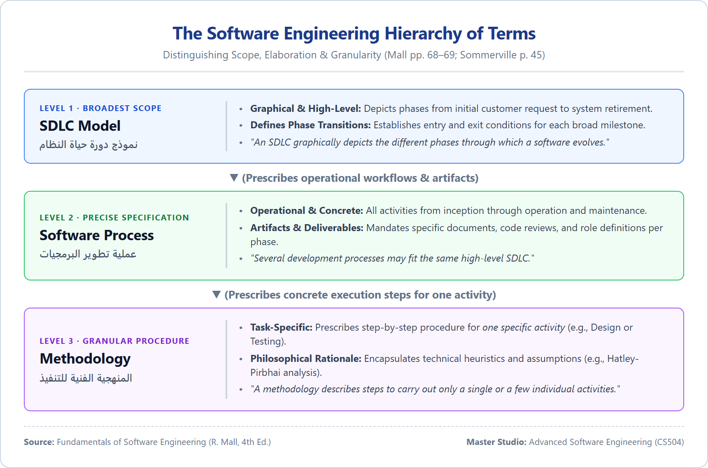
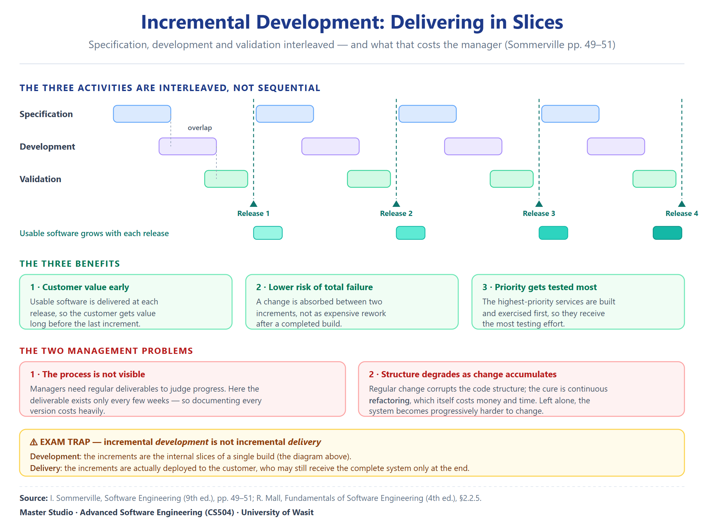
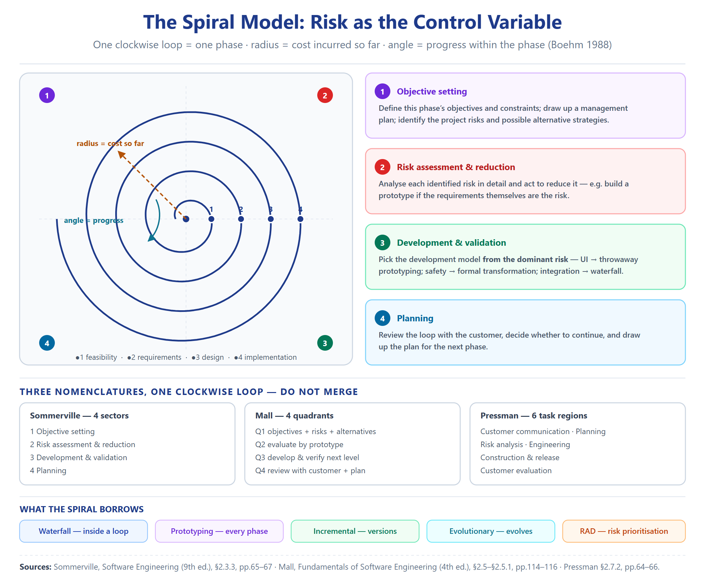
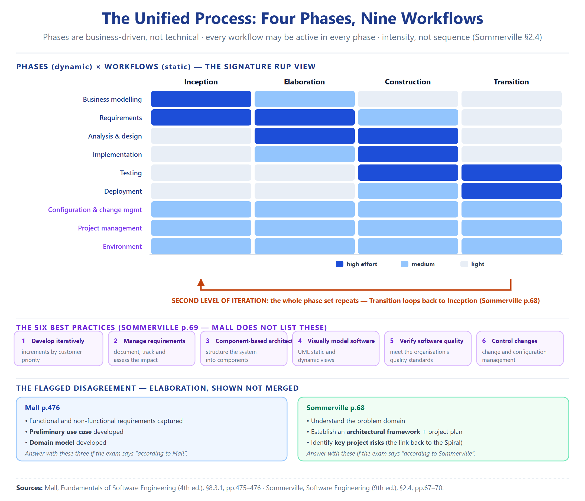
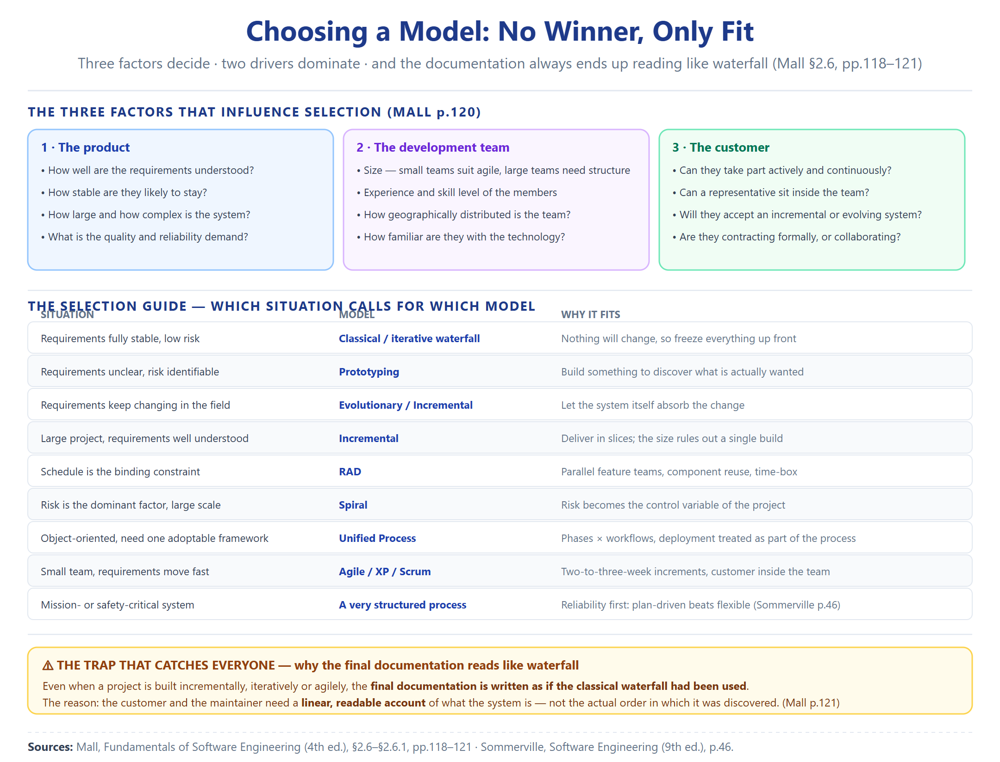

# Index of Topics, Sub-Topics & Branches

> This index lists every topic (##), sub-topic (###) and branch (####) across the ten Week-02 units, with the printed page number on which each begins.

- **Unit 01 — SDLC Fundamentals** … p.007
  - **Where this sits** … p.007
  - **1. The software life cycle** … p.007
    - 1.1 The analogy the term is built on … p.007
    - 1.2 The stages, in the source's own order … p.008
    - 1.3 The inception stage — the fact that makes the whole series necessary … p.008
    - 1.4 The maintenance phase — why it is the longest … p.009
    - 1.5 Retirement — and why it happens … p.009
    - 1.6 The formal definition … p.010
  - **2. The software process and its four activities** … p.010
    - 2.1 The definition … p.010
    - 2.2 The four fundamental activities — the invariant … p.010
  - **3. What a process description actually contains** … p.011
  - **4. The three-level vocabulary — SDLC, process, methodology** … p.012
    - 4.1 Level one: SDLC versus process … p.012
    - 4.2 Level two: process versus methodology … p.013
    - 4.3 The hierarchy, put together … p.014
    - 4.4 The SDLC is drawn, not only described … p.014
  - **5. Why a process is needed — the argument** … p.015
    - 5.1 The stated advantage … p.015
    - 5.2 programming-in-the-small versus programming-in-the-large … p.015
    - 5.3 What actually goes wrong without a process … p.016
    - 5.4 The one-sentence version of the argument … p.016
  - **6. Why the process must be documented** … p.017
  - **7. The two poles — plan-driven and agile** … p.018
  - **8. The thread — what the remaining nine files are about** … p.018
  - *Source notes* … p.007
- **Unit 02 — Build & Fix and the Waterfall Family** … p.021
  - **Where this sits** … p.021
  - **1. Build and fix — the era before process** … p.021
    - 1.1 The arc the term sits inside … p.021
    - 1.2 The three names for the same style … p.022
    - 1.3 What build and fix actually is … p.022
    - 1.4 Exploratory — the style beneath the style … p.022
    - 1.5 The verdict on build and fix … p.022
    - 1.6 Why the model fails at scale — the link to Unit 01 … p.023
  - **2. Phase entry and exit criteria — the concept that makes phases work** … p.023
    - 2.1 The 99 per cent complete syndrome … p.024
  - **3. The classical waterfall model** … p.024
    - 3.1 What it is, and why it is studied … p.024
    - 3.2 Why the name … p.025
    - 3.3 The six phases … p.025
    - 3.4 Project management — the activity outside the phases … p.026
    - 3.5 The effort distribution — the number that changes how you think … p.026
    - 3.6 The phases described … p.027
      - 3.6.1 Feasibility study … p.027
      - 3.6.2 Requirements analysis and specification … p.028
      - 3.6.3 Design · coding and unit testing · integration and system testing … p.028
      - 3.6.4 Maintenance — and its three types … p.029
    - 3.7 The shortcomings of the classical waterfall … p.029
    - 3.8 Is the classical waterfall useful at all? … p.032
  - **4. The iterative waterfall model — repair number one** … p.033
    - 4.1 What changed … p.033
    - 4.2 Why there is no feedback path to feasibility … p.033
    - 4.3 The sequential-versus-iterative classification … p.033
    - 4.4 Phase containment of errors … p.034
    - 4.5 Phase overlap and the blocking state … p.034
  - **4.6 The two variants side by side** … p.036
  - **5. The V-model — repair number two** … p.037
    - 5.1 The structure … p.037
  - **6. Sommerville's account — the cross-check** … p.038
  - *Source notes* … p.040
- **Unit 03 — Prototyping and the Evolutionary Model** … p.041
  - **Where this sits** … p.041
  - **1. The framework — two ways to survive change** … p.042
  - **2. Prototyping — Mall's account** … p.043
    - 2.1 What a prototype actually is … p.043
    - 2.2 The shortcuts — how it is built fast … p.043
    - 2.3 When prototyping is the right choice — three cases … p.044
    - 2.4 The life cycle — two major activities … p.045
    - 2.5 The prototype is thrown away — and why that is the point … p.046
  - **3. Prototyping — Sommerville's account** … p.047
    - 3.1 The definition … p.047
    - 3.2 The two uses … p.047
    - 3.3 The two kinds of prototype — and the problem … p.048
    - 3.4 Strengths and weaknesses — Mall's summary … p.048
  - **4. The evolutionary model** … p.050
    - 4.1 What it is … p.050
    - 4.2 The distinction from incremental — the sentence to memorise … p.050
    - 4.3 The nickname … p.051
    - 4.4 The advantages … p.051
    - 4.5 The disadvantages … p.052
  - **4.6 The two models side by side** … p.053
  - **5. The distinctions — three models, one table** … p.054
  - **6. A structural insight from Sommerville worth keeping** … p.055
  - *Source notes* … p.055
- **Unit 04 — Incremental Development** … p.057
  - **Where this sits** … p.057
  - **1. What incremental development is** … p.058
    - 1.1 Sommerville's definition … p.058
    - 1.2 Mall's definition — and the second name … p.058
    - 1.3 Why it matches how humans actually work … p.058
    - 1.4 And it is now the default … p.059
  - **2. The mechanics — how the slicing works** … p.059
    - 2.1 Which functionality goes into which increment … p.059
    - 2.2 Mall's core / non-core distinction — the ordering rule … p.060
    - 2.3 The feedback loop … p.060
  - **2.6 The whole model in one picture** … p.061
  - **3. The benefits** … p.062
    - 3.1 Sommerville's three benefits … p.062
    - 3.2 Mall's two advantages … p.062
  - **4. The two management problems** … p.063
    - 4.1 Where it gets acute — large systems … p.063
  - **5. Incremental development versus incremental delivery — the distinction that carries marks** … p.064
    - 5.1 Incremental delivery in full … p.065
    - 5.2 The three advantages of incremental delivery … p.065
    - 5.3 The three problems with incremental delivery … p.066
    - 5.4 And where incremental delivery simply does not fit … p.066
  - **6. The organisational obstacle** … p.067
  - **7. Where this model sits in the series** … p.067
  - *Source notes* … p.068
- **Unit 05 — RAD (Rapid Application Development)** … p.070
  - **Where this sits** … p.070
  - **1. Definition and the Four Goals of RAD** … p.070
    - 1.0 The intuition before the definition … p.070
    - 1.1 Definition … p.071
    - 1.2 The Four Goals … p.071
  - **2. The Time-Box** … p.071
    - 2.1 Definition … p.071
    - 2.2 Time-Box vs Increment Schedule … p.072
  - **3. Phases of RAD** … p.072
    - 3.1 Mall's Version (Primary Source) … p.072
    - 3.2 Agarwal's Version (Source Difference) … p.072
  - **4. Applicability Conditions** … p.073
    - 4.1 When RAD Fits … p.073
    - 4.2 When RAD Does NOT Fit … p.073
    - 4.3 The whole model in one picture … p.074
  - **5. Strengths and Weaknesses** … p.075
    - 5.1 Strengths … p.075
    - 5.2 Weaknesses … p.075
  - **6. RAD vs Incremental Model — The Critical Comparison** … p.076
    - 6.1 The Core Difference … p.076
    - 6.2 When to Choose Which … p.076
  - **7. Source Coverage Note — Why Sommerville and Pressman Are Silent** … p.077
  - **8. Position in the Series — What RAD Repairs and What It Leaves** … p.077
    - 8.1 What RAD Repairs from Waterfall … p.077
    - 8.2 What RAD Introduces … p.077
    - 8.3 The door to the next unit … p.077
- **Unit 06 — The Spiral Model and Risk-Driven Development** … p.078
  - **Where this sits** … p.078
  - **1. What the Spiral Model Is — The Definition** … p.078
  - **2. The Core Idea — Risk as the Driver** … p.079
  - **2.6 The whole model in one picture** … p.081
  - **3. The Three Views of One Loop — DO NOT MERGE** … p.082
    - View A — Sommerville's Four Sectors (p.66) … p.082
    - View B — Mall's Four Quadrants (p.116) … p.082
    - View C — Pressman's Six Task Regions (p.64) … p.083
    - The Correspondence Map (how the three views align) … p.084
  - **4. The Prototype-at-Every-Phase Distinction (the bridge from Unit 03)** … p.085
  - **5. How the Spiral Relates to Earlier Models — A Summary** … p.085
  - **6. When the Spiral Fits — and When It Does NOT** … p.086
    - 6.1 When It Fits … p.086
    - 6.2 When It Does NOT Fit (the weaknesses) … p.086
    - 6.3 The WINWIN Extension (Pressman, optional depth) … p.087
  - *Source notes* … p.087
- **Unit 07 — The Unified Process: Putting It All Together** … p.088
  - **Where this sits** … p.088
  - **1. What the Unified Process Is** … p.088
    - UP vs RUP — the naming … p.089
  - **2. The Four Phases — Mall and Sommerville Side by Side** … p.089
    - 2.1 Inception … p.090
    - 2.2 Elaboration — THE FLAGGED DISAGREEMENT (shown, not merged) … p.090
    - 2.3 Construction … p.091
    - 2.4 Transition … p.091
    - 2.5 The whole model in one picture … p.092
  - **3. Two-Level Iteration (Sommerville-only depth)** … p.093
  - **4. The Three Perspectives (Sommerville-only)** … p.093
  - **5. The Six Best Practices (Sommerville-only)** … p.093
  - **6. The Static Workflows (Sommerville-only)** … p.094
  - **7. The Two Key Innovations — and When UP Does NOT Fit** … p.095
  - *Source notes* … p.095
- **Unit 08 — Agile, XP and Scrum: Changing the Philosophy** … p.096
  - **Where this sits** … p.096
  - **1. Why Agile Appeared — The Failure of Plan-Driven for Business Systems** … p.097
  - **2. What Agile Is — The Definition** … p.098
    - 2.1 The Time Box in Agile (distinct from RAD's time box) … p.098
    - 2.2 Team Size and the Customer Representative … p.099
  - **3. The Three Characteristics of Rapid Development (Sommerville)** … p.099
  - **4. The Agile Manifesto — Shown in Both Wordings** … p.100
    - 4.1 Sommerville's Canonical Four Statements (p.76) … p.100
    - 4.2 Mall's Restated Version (p.108) … p.100
    - 4.3 The whole philosophy in one picture … p.101
  - **5. Agile versus Other Models (Mall — unique material)** … p.102
    - 5.1 Agile vs Iterative Waterfall … p.102
    - 5.2 Agile vs Exploratory Programming … p.102
    - 5.3 Agile vs RAD … p.102
  - **6. Advantages and Disadvantages of Agile (Mall)** … p.103
  - **7. Extreme Programming (XP) — Mall Primary** … p.103
    - 7.1 The Five Practices Taken to the Extreme … p.104
    - 7.2 The Basic Idea — User Stories, Metaphors, Spikes … p.104
    - 7.3 The Six XP Activities … p.105
    - 7.4 When XP / Agile Fits — and When It Does NOT … p.105
  - **8. Scrum — Mall Primary** … p.106
  - **9. Where Agile Works — and the Principles Hard to Realise** … p.106
  - **10. The Agile Principles (Sommerville Figure 3.1)** … p.107
  - *Source notes* … p.000
- **Unit 09 — Choosing a Model: No Winner, Only Fit** … p.108
  - **Where this sits** … p.109
  - **1. The Central Claim — No Model Wins, Only Fits** … p.109
  - **2. Mall's Side-by-Side Comparison of All Models (§2.6)** … p.110
    - 2.1 The Prototyping-vs-Spiral Distinction (the risk test) … p.111
  - **3. From the Customer's Viewpoint — Confidence, Trauma, Capital (§2.6)** … p.111
  - **4. The Three Selection Factors — Product, Team, Customer (§2.6.1)** … p.112
    - Factor 1 — Characteristics of the software (the product) … p.112
    - Factor 2 — Characteristics of the development team … p.113
    - Factor 3 — Characteristics of the customer … p.113
  - **5. Requirements and Risk — The Two Drivers (integration of Mall + Sommerville)** … p.113
  - **6. Worked Selection Scenarios** … p.114
    - 6.1 The Payroll Case — Exercise Q40 (Mall p.130) … p.114
    - 6.2 The Galaxy Case — Why Spiral (Mall p.118, Case study 2.2) … p.115
    - 6.3 The selection guide in one picture … p.116
  - **7. Why Final Documentation Is Written As If Waterfall (Summary, p.121)** … p.116
  - *Source notes* … p.117
- **Unit 10 — Master Comparison and Exam Bank** … p.118
  - **Where this sits** … p.118
  - **1. Master Model Comparison Table** … p.119
  - **2. The Two Axes Recap — Why the Series Is One Argument** … p.121
    - 2.1 The underlying axis: Requirements & Risk (the "what changes" axis) … p.121
    - 2.2 Lens A — Mall's three selection factors (Unit 09, p.120) … p.121
    - 2.3 Lens B — Sommerville's critical↔business + plan-driven↔agile axes (Unit 01/09, p.46) … p.121
    - 2.4 The narrative in one line per model … p.122
    - 2.5 The whole series in one picture … p.122
  - **3. Mall's Exercises Mapped to the Topics That Answer Them** … p.123
  - *Source notes* … p.124
  - *Retrieval set (consolidated bank, Units 01–09)* … p.124

END-OF-MASTER-INDEX

# Unit 01 — SDLC Fundamentals

> **Sources.** Sommerville, *Software Engineering* 9th ed., pp.44–46. Mall, *Fundamentals of Software Engineering* 4th ed., pp.67–71.
> **Page numbers are PDF page numbers**, not printed page numbers — the front-matter offset differs between the two books.
> **Note on method.** This is a compendium, not a summary. Every definition is quoted verbatim from the source before it is explained, and every claim carries a page anchor. Where a term carries more than one meaning in the literature, both are given.

---

## Where this sits

**الوحدة الأولى: المفاهيم التأسيسية لدورة حياة وبرمجيات الفريق.**

The entire series rests on one fact: **professional software is built by teams, not by individuals.** A single programmer writing a small program can succeed with no process at all. A team cannot — and the reason is not skill, it is coordination. This file establishes that, and it establishes the vocabulary the remaining nine files will use.

**The question this file answers:** *why does a software team need a defined process in the first place?*

**السؤال الذي تسلّمه هذه الوحدة إلى Unit 02:** *سلّمنا بأن العملية ضرورية؛ فكيف ينبغي أن تبدو أول عملية منظّمة؟* الجواب البديهي هو «خطّط لكل شيء مقدماً»، وهذا الجواب له اسم شهير: **The Waterfall Model**.

---

## 1. The software life cycle

### 1.1 The analogy the term is built on

Mall does not open with a definition. He opens with a comparison, because the term itself was built on one.

> **Verbatim (Mall p.67):** *"It is well known that all living organisms undergo a life cycle. For example when a seed is planted, it germinates, grows into a full tree, and finally dies. Based on this concept of a biological life cycle, the term **software life cycle** has been defined to imply the different stages (or phases) over which a software evolves from an initial customer request for it, to a fully developed software, and finally to a stage where it is no longer useful to any user, and then it is discarded."*

**الشرح المفاهيمي:** Mall ما يبلش بتعريف — يبلش بتشبيه، لأن المصطلح نفسه مبني على تشبيه. كل كائن حي إله دورة حياة: بذرة تنبت، تكبر وتصير شجرة، وبالآخر تموت. وعلى هذا الأساس عُرّف الـ**software life cycle**: المراحل اللي يمر بيها البرنامج من **طلب العميل الأول**، إلى **برنامج مكتمل**، إلى **مرحلة يصير ما يفيد أحد** فيُرمى.

**ليش التشبيه مهم مو مجرد مقدمة؟** لأنه يفرض ثلاث نتائج:
1. **البداية طلب، مو برنامج** — البرنامج ما موجود بالسؤال الأصلي.
2. **فيه مراحل متتالية محدّدة** — مو عملية واحدة مستمرة.
3. **فيه نهاية** — البرنامج يُرمى. يعني **البرنامج ما يعيش للأبد**، ولهذا الصيانة والتطوير جزء من دورته مو استثناء.

### 1.2 The stages, in the source's own order

Mall names the stages as the software moves through them:

| Stage | Mall's wording |
|:---|:---|
| **Inception** | *"This stage where the customer feels a need for the software and forms rough ideas about the required features is known as the **inception stage**."* |
| **Development stages** | *"Starting with the inception stage, a software evolves through a series of identifiable stages (also called phases) on account of the development activities carried out by the developers, until it is fully developed and is released to the customers."* |
| **Operation (also called maintenance)** | *"Once installed and made available for use, the users start to use the software. This signals the start of the **operation (also called maintenance) phase**."* |
| **Retirement** | *"Finally the software is **retired**, when the users do not find it any longer useful…"* |

**المعنى بالعربية لمراحل دورة الحياة:**

| المرحلة | المعنى |
|:---|:---|
| **Inception** | العميل يحسّ بحاجة ويكوّن **أفكاراً خشنة** عن الميزات المطلوبة |
| **مراحل التطوير** | سلسلة مراحل متتالية بحسب أنشطة المطورين، لحد ما يصير مكتملاً ويُسلَّم |
| **Operation (= Maintenance)** | بعد التنصيب والاستخدام — **Mall يعتبرها نفس المرحلة باسمين** |
| **Retirement** | يُرمى لما يصير ما يفيد أحد |

**نقطة انتبه لها:** Mall يسميها **operation (also called maintenance)** — يعني **التشغيل والصيانة مرحلة واحدة بوجهين**. لو سألك «شنو مرحلة الصيانة؟» — هي نفسها مرحلة التشغيل.

### 1.3 The inception stage — the fact that makes the whole series necessary

This is the single most consequential sentence in the file:

> **Verbatim (Mall p.67):** *"At this stage, the customers are usually **not clear about all the features that would be needed**, neither can they **completely describe the identified features in concrete terms**, and can only **vaguely describe what is needed**."*

**التحليل الهندسي لأهمية البداية المبهمة:** العميل بمرحلة البداية:
- **مو واضح** شنو يريد كل الميزات،
- **ما يكدر يوصف** الميزات اللي يعرفها بوصف ملموس،
- **يكدر يوصف المطلوب بشكل مبهم فقط.**

**ليش هذه أساس السلسلة؟** لأنها تعني إن **المطلوبات ناقصة ومبهمة من اليوم الأول** — مو لأن العميل مقصّر، بل لأن هذا **طبيعة المرحلة**. ومن هنا تنبع كل مشكلة بكل نموذج:

- Waterfall يفترض المطلوبات معروفة ومستقرة → **يخالف هذه الحقيقة**.
- Prototyping يحلّها بالبناء لاستكشاف المطلوبات.
- Incremental يحلّها بتسليم شرائح تتعلم منها.
- Agile يحلّها بدورات قصيرة.

**يعني: كل نموذج بالملفات الجاية هو محاولة للتعامل مع هذه الجملة.**

### 1.4 The maintenance phase — why it is the longest

> **Verbatim (Mall p.67–68):** *"As the users use the software, not only do they request for fixing any failures that they might encounter, but they also **continually suggest several improvements and modifications** to the software. Thus, the maintenance phase usually involves continually making changes to the software to accommodate the **bug-fix and change requests** from the user."*

> **Verbatim (Mall p.68):** *"The **operation phase is usually the longest of all phases** and constitutes the useful life of a software."*

**الشرح المفاهيمي:** الصيانة مو بس إصلاح أعطال. المستخدمون:
- يطلبون **إصلاح إخفاقات**، **و**
- **يقترحون تحسينات وتعديلات باستمرار**.

فالصيانة = **تغييرات مستمرة** لتلبية **طلبات الإصلاح وطلبات التغيير** معاً.

**والنقطة الكمية:** *"The operation phase is usually the longest of all phases"* — **مرحلة التشغيل أطول مرحلة**. يعني **الجزء الأكبر من عمر البرنامج يستهلكه التغيير، مو البناء الأول**.

**وهذا يبرّر السلسلة كلها:** لو كانت أطول مرحلة هي التغيير، فالنموذج اللي ما يتعامل وياها زين **نموذج فاشل** — بغض النظر عن أناقته في البناء الأول.

### 1.5 Retirement — and why it happens

> **Verbatim (Mall p.68):** *"Finally the software is retired, when the users do not find it any longer useful due to reasons such as **changed business scenario**, **availability of a new software having improved features and working**, **changed computing platforms**, etc."*

**التحليل الهندسي:** ثلاثة أسباب للتقاعد:
1. **تغيّر سيناريو العمل** — النشاط نفسه تغيّر.
2. **توفّر برنامج جديد** بميزات وتشغيل أفضل.
3. **تغيّر منصات الحوسبة.**

**ليش يذكرها؟** لأنها تُظهر إن **التقاعد مو فشل** — مرحلة طبيعية. والسبب الثاني مهم: **برنامج أفضل يقتل برنامجاً شغّالاً**. يعني المنافسة على الجودة مو ترف.

### 1.6 The formal definition

> **Verbatim (Mall p.68):** *"The **life cycle of a software** represents the **series of identifiable stages through which it evolves during its life time**."*

**الشرح المفاهيمي:** التعريف الرسمي: **سلسلة مراحل قابلة للتمييز يمر بيها البرنامج خلال عمره.**

**احفظ كلمة `identifiable`** — المراحل **مُعرَّفة ومميّزة**، مو استمرارية مبهمة. هذا اللي يجعل «النموذج» ممكناً أصلاً: لو ما كدرنا نميّز المراحل، ما كدرنا نرسمها ولا نرتّبها.

---

## 2. The software process and its four activities

### 2.1 The definition

> **Verbatim (Sommerville p.45):** *"A **software process** is a **set of related activities that leads to the production of a software product**."*

And the qualification that matters for the rest of the series:

> **Verbatim (Sommerville p.45):** *"These activities may involve the development of software from scratch in a standard programming language like Java or C. **However, business applications are not necessarily developed in this way.** New business software is now often developed by **extending and modifying existing systems** or by **configuring and integrating off-the-shelf software or system components**."*

**الشرح المفاهيمي:** الـ**software process** = **مجموعة أنشطة مترابطة تؤدي لمنتج برمجي**.

**بس لاحظ التحذير اللي يضيفه فوراً:** البرامج **مو دائماً** تُبنى من الصفر. البرامج التجارية الحديثة كثيراً ما تُبنى بـ:
- **توسيع وتعديل أنظمة موجودة**، أو
- **تهيئة ودمج برامج أو مكوّنات جاهزة.**

**ليش يهمنا؟** لأنه **يبرّر الملف 03** (التطوري) و**الملف 05** (RAD، وأساسه **إعادة استخدام الكود**). يعني الفكرة اللي تنبني عليها RAD **مذكورة من أول فصل**.

### 2.2 The four fundamental activities — the invariant

> **Verbatim (Sommerville p.45):** *"There are many different software processes but **all must include four activities that are fundamental to software engineering**:"*

| # | Activity | Verbatim definition |
|:---:|:---|:---|
| 1 | **Software specification** | *"The functionality of the software and constraints on its operation must be defined."* |
| 2 | **Software design and implementation** | *"The software to meet the specification must be produced."* |
| 3 | **Software validation** | *"The software must be validated to ensure that it does what the customer wants."* |
| 4 | **Software evolution** | *"The software must evolve to meet changing customer needs."* |

> **Verbatim (Sommerville p.45):** *"In some form, these activities are part of all software processes."*

And they are not atomic:

> **Verbatim (Sommerville p.45):** *"In practice, of course, they are complex activities in themselves and include sub-activities such as **requirements validation**, **architectural design**, **unit testing**, etc. There are also supporting process activities such as **documentation** and **software configuration management**."*

**التحليل المفاهيمي للأنشطة الأربعة:** أربعة أنشطة **موجودة بكل عملية مهما كان شكلها**:

| # | النشاط | المعنى |
|:---:|:---|:---|
| 1 | **Specification** | تحديد الوظائف والقيود |
| 2 | **Design & implementation** | إنتاج البرنامج اللي يحقق المواصفة |
| 3 | **Validation** | التأكد إنه يسوي اللي يريده العميل |
| 4 | **Evolution** | يتطوّر مع تغيّر احتياجات العميل |

**النشاط الرابع هو بيت القصيد.** لاحظ إن **`evolution` نشاط أساسي**، مو ملحق. يعني **التغيير مدمج بالتعريف نفسه** — وهذي ثالث مرة نشوف نفس الفكرة (بعد inception المبهم وطول مرحلة التشغيل). **تتكرر بثلاث صيغ مختلفة لأنها جوهر الموضوع.**

**وكل واحد منها مو ذرّة:** بيه أنشطة فرعية (التحقق من المطلوبات، التصميم المعماري، اختبار الوحدة)، وفيه **أنشطة ساندة**: **التوثيق** و**إدارة تهيئة البرمجيات**.

**احفظ الأربعة بترتيبها** — كل نموذج بالملفات الجاية هو **ترتيب مختلف لهذه الأربعة**. هذا مفتاح المقارنة.

---

## 3. What a process description actually contains

> **Verbatim (Sommerville p.45):** *"When we describe and discuss processes, we usually talk about the activities in these processes such as specifying a data model, designing a user interface, etc., and the ordering of these activities. **However, as well as activities, process descriptions may also include:**"*

| Element | Verbatim |
|:---|:---|
| **Products** | *"which are the outcomes of a process activity. For example, the outcome of the activity of architectural design may be a model of the software architecture."* |
| **Roles** | *"which reflect the responsibilities of the people involved in the process. Examples of roles are project manager, configuration manager, programmer, etc."* |
| **Pre- and post-conditions** | *"which are statements that are true before and after a process activity has been enacted or a product produ[ced]."* |

**العناصر الثلاثة الإضافية في توصيف العملية:** العملية **مو بس أنشطة وترتيبها**، توصيفها يحتوي ثلاثة عناصر إضافية:

| العنصر | المعنى | مثال |
|:---|:---|:---|
| **Products** | مخرجات النشاط | التصميم المعماري → موديل المعمارية |
| **Roles** | مسؤوليات الناس | مدير مشروع · مدير تهيئة · مبرمج |
| **Pre/post-conditions** | شروط صحيحة قبل وبعد النشاط | — |

**يجي كسؤال مباشر:** «شنو يوصف العملية؟» — **الأنشطة + ترتيبها + المنتجات + الأدوار + الشروط القبلية والبعدية.** لو ذكرت الأنشطة بس، الجواب ناقص.

---

## 4. The three-level vocabulary — SDLC, process, methodology

This is the part most students blur. Mall draws **two distinct distinctions** that together form a three-level hierarchy.

### 4.1 Level one: SDLC versus process

> **Verbatim (Mall p.68):** *"A **software development life cycle (SDLC) model** (also called **software life cycle model** and **software development process model**) describes the different activities that need to be carried out for the software to evolve in its life cycle."*

> **Verbatim (Mall p.68):** *"Throughout our discussion, we shall use the terms **software development life cycle (SDLC)** and **software development process** interchangeably. **However, some authors distinguish an SDLC from a software development process.** In their usage, a software development process describes the life cycle activities **more precisely and elaborately**, as compared to an SDLC. Also, a development process may not only describe various activities that are carried out over the life cycle, but also **prescribe specific methodologies** to carry out the activities, and also **recommends the specific documents and other artifacts** that should be produced at the end of each phase. In this sense, the term SDLC can be considered to be a **more generic term**, as compared to the development process."*

> **Verbatim (Mall p.69):** *"…several development processes may fit the same SDLC."*

**الشرح والتمييز الأول بين SDLC والعملية:** Mall يعطيك الاسم بثلاث تسميات مترادفة: **SDLC model = software life cycle model = software development process model**.

**بس بعدين يسجّل فرقاً مهماً:** هو شخصياً يستخدم SDLC و«عملية التطوير» بالتبادل، **بس بعض المؤلفين يفرّقون**:
- **عملية التطوير** تصف الأنشطة **بدقة وتفصيل أكثر**،
- **وقد** توصي بمنهجيات محددة،
- **وقد** توصي بوثائق ومخرجات محددة تُنتج بنهاية كل مرحلة.
- فيصير **SDLC مصطلحاً أعمّ**.

**والنتيجة العملية:** *«عدة عمليات تطوير ممكن تنسجم مع نفس الـSDLC»* — **الـSDLC هيكل واحد، وفوقه ممكن عدة عمليات**.

### 4.2 Level two: process versus methodology

> **Verbatim (Mall p.69):** *"Though the terms **process** and **methodology** are at time used interchangeably, there is a subtle difference between the two. First, the term **process has a broader scope** and addresses either **all the activities** taking place during software development, or certain **coarse grained activities** such as design (e.g. design process), testing (test process), etc. Further, a software process not only identifies the specific activities that need to be carried out, but **may also prescribe certain methodology** for carrying out each activity."*

> **Verbatim (Mall p.69):** *"A **methodology**, on the other hand, prescribes a **set of steps for carrying out a specific life cycle activity**. It may also include the **rationale and philosophical assumptions** behind the set of steps through which the activity is accomplished."*

> **Verbatim (Mall p.69):** *"A process usually describes **all the activities starting from the inception of a software to its maintenance and retirement stages**, or at least a chunk of activities in the life cycle. It also recommends specific methodologies for carrying out each activity. A methodology, in contrast, describes the steps to carry out **only a single or at best a few individual activities**."*

Mall's own example:

> **Verbatim (Mall p.69):** *"For example, a design process may recommend that in the design stage, the high-level design activity be carried out using **Hatley and Pirbhai's structured analysis and design methodology**."*

**المقارنة التفصيلية بين العملية والمنهجية:**

| المعيار | Software Process (العملية) | Methodology (المنهجية) |
|:---|:---|:---|
| **النطاق** | أوسع — **كل الأنشطة** أو أنشطة كبيرة (عملية التصميم، عملية الاختبار) | **نشاط واحد** أو بضعة أنشطة |
| **يغطي** | من **البداية (inception) للتشغيل والتقاعد** | خطوات نشاط واحد |
| **قد يوصي** | بمنهجية لكل نشاط | — |
| **قد يشمل** | — | **المبرّر والافتراضات الفلسفية** وراء الخطوات |

**مثال Mall:** «عملية التصميم» ممكن توصي إن التصميم العالي يُسوّى بمنهجية *(Hatley and Pirbhai's structured analysis and design)*.
### 4.3 The hierarchy, put together

**التدرج المفاهيمي (من الأعمّ إلى الأخصّ):**

  SDLC Model &nbsp;→&nbsp; Software Process &nbsp;→&nbsp; Software Methodology

**للامتحان:** لو سألك «الفرق بين SDLC والعملية؟» أو «بين العملية والمنهجية؟» — **المنطق واحد: الأعمّ مقابل الأخصّ.**

### 4.4 The SDLC is drawn, not only described

> **Verbatim (Mall p.69):** *"An SDLC is represented **graphically** by drawing various stages of the life cycle and showing the **transitions** among the phases. This graphical model is usually accompanied by a **textual description** of various activities that need to be carried out during a phase before that phase can be considered to be complete."*

> **Verbatim (Mall p.69):** *"An **SDLC graphically depicts** the different phases through which a software evolves. It is usually accompanied by a textual description of the different activities that need to be carried out during each phase."*

**الرسم المقترن بالنص التوصيفي:** الـSDLC **يُرسم** — يبيّن المراحل و**الانتقالات** بينها، **ويُرافق** الرسم وصف نصي للأنشطة اللي لازم تُنجز قبل اعتبار المرحلة مكتملة.

**عنصران معاً: رسم + نص.** الرسم جزء من التعريف مو زينة — ولهذا كل نموذج بالملفات الجاية إله **شكل**، ولهذا ندرس الأشكال.

---

## 5. Why a process is needed — the argument

### 5.1 The stated advantage

> **Verbatim (Mall p.69):** *"The primary advantage of using a development process is that it encourages development of software in a **systematic and disciplined manner**. Adhering to a process is especially important to the development of **professional software needing team effort**."*

> **Verbatim (Mall p.70):** *"When software is developed by a team rather than by an individual programmer, **use of a life cycle model becomes indispensable** for successful completion of the project."*

> **Verbatim (Mall p.70):** *"Software development organisations have realised that adherence to a suitable life cycle model helps to produce **good quality software** and that helps **minimise the chances of time and cost overruns**."*

**التحليل الهندسي لأهمية العملية:** الفائدة الأساسية: **تطوير منهجي ومنضبط**. والنتيجتان الملموستان:
1. **جودة أفضل**،
2. **تقليل احتمال تجاوز الوقت والكلفة.**

**واحفظ الكلمة القوية:** *"**indispensable**"* — **لا غنى عنه** للشغل الفريقي. مو «مفيد» — **لا غنى عنه**.

### 5.2 programming-in-the-small versus programming-in-the-large

> **Verbatim (Mall p.70–71):** *"**Programming-in-the-small** refers to development of a **toy program by a single programmer**. Whereas **programming-in-the-large** refers to development of a **professional software through team effort**."*

> **Verbatim (Mall p.71):** *"While development of a software of the former type could succeed even while an individual programmer uses a **build and fix** style of development, use of a **suitable SDLC is essential** for a professional software development project involving team effort to succeed."*

**المقارنة الحاسمة بين البرمجة الفردية والبرمجة الفريقة:**

| وجه المقارنة | Programming-in-the-small | Programming-in-the-large |
|:---|:---|:---|
| **القائم بالعمل** | **مبرمج واحد** | **فريق هندسي** |
| **طبيعة المنتج** | **برنامج لعبة (toy program)** | **برنامج احترافي معقد** |
| **هل يحتاج SDLC؟** | لا — ممكن ينجح بـ**build and fix** | **نعم — استخدام SDLC حتمي وإلزامي** |
**مثال Mall للصغير:** طالب يحل واجب صف — ممكن ينجح بلا عملية.

**ليش مهم للامتحان؟** لأنه **يمنع الجواب الخاطئ**: لو سألك «هل نحتاج SDLC دائماً؟» — الجواب **مو نعم مطلقاً**. الجواب: **يعتمد على الحجم**. للصغير لا، وللكبير **ضروري**.

### 5.3 What actually goes wrong without a process

> **Verbatim (Mall p.70):** *"Suppose, a software development problem has been divided into several parts and these parts are assigned to the team members. From then on, suppose the team members are allowed the freedom to develop the parts assigned to them in whatever way they like. It is possible that **one member might start writing the code for his part while making assumptions about the input results required from the other parts**, **another might decide to prepare the test documents first**, and **some other developer might start to carry out the design for the part assigned to him**. In this case, severe problems can arise in **interfacing the different parts** and in **managing the overall development**."*

> **Verbatim (Mall p.70):** *"Therefore, ad hoc development turns out to be is a **sure way to have a failed project**. Believe it or not, this is exactly what has caused many project failures in the past!"*

**سيناريو الفوضى التطويرية بدون عملية:** السيناريو الملموس: المشكلة تتقسّم أجزاء وتُوزّع على الأعضاء، ويُترك لكل واحد حرية الطريقة. النتيجة المحتملة:

- واحد **يبلش يكتب الكود** وهو **يفترض** شنو راح تكون مخرجات الأجزاء الثانية،
- وواحد يبلش بـ**مستندات الاختبار** أول،
- وواحد يبلش بـ**التصميم**.

**والنتيجة:** مشاكل شديدة في **الواجهات بين الأجزاء** وفي **إدارة التطوير ككل**.

**والحكم:** التطوير العشوائي = **طريق مضمون لمشروع فاشل**، و**هذا بالضبط سبب كثير من فشل المشاريع بالماضي**.

**لاحظ وين يتركّز الفشل:** مو بالكود نفسه — بل بـ**الواجهات** و**الإدارة**. يعني **مشكلة تنسيق مو مشكلة مهارة.** نقطة تحليلية تنفع للسيناريوهات.

### 5.4 The one-sentence version of the argument

> **Verbatim (Mall p.70):** *"When a software is developed by a team, it is necessary to have a **precise understanding among the team members as to—when to do what**. In the absence of such an understanding, if each member at any time would do whatever activity he feels like doing. This would be an **open invitation to developmental chaos and project failure**."*

**خلاصة الحجة في عبارة واحدة:**

> **«تفاهم دقيق بين أعضاء الفريق: *متى* نسوي *شنو*.»**

**بدون هذا التفاهم** → كل واحد يسوي اللي يحسّه → **دعوة مفتوحة للفوضى التطويرية وفشل المشروع**.

**وهذا التعريف العملي للـSDLC:** هو **اللي يحدد متى نسوي شنو.** لو نسيت كل شي بالملف، احفظ هذه.

---

## 6. Why the process must be *documented*

> **Verbatim (Mall p.71):** *"It is **not enough** for an organisation to just have a well-defined development process, but the development process **needs to be properly documented**."*

> **Verbatim (Mall p.71):** *"In this case, its developers develop **only an informal understanding** of the development process. An informal understanding of the development process among the team members can create several problems during development."*

> **Verbatim (Mall p.71):** *"A documented process model ensures that **every activity in the life cycle is accurately defined**. Also, wherever necessary the **methodologies** for carrying out the respective activities are described. **Without documentation, the activities and their ordering tend to be loosely defined, leading to confusion and misinterpretation by different teams in the organisation.**"*

> **Verbatim (Mall p.71):** *"For example, **code reviews may informally and inadequately be carried out** since there is no documented methodology as to how the code review should be done. Another difficulty is that for loosely defined activities, the developers tend to use their **subjective judgments**. As an example, unless it is explicitly prescribed, the team members would subjectively decide as to **whether the test cases should be designed just after the requirements phase, after the design phase, or after the coding phase**. Also, they would debate **whether the test cases should be documented at all** and the rigour with it should be documented."*

> **Verbatim (Mall p.71):** *"An undocumented process gives a **clear indication to the members of the development teams about the lack of seriousness on the part of the management** of the organisation about following the process."*

**التحليل الهندسي:** **مو كافي يكون عندك عملية** — لازم تكون **موثّقة**. بدون توثيق، المطورين يكوّنون **فهم غير رسمي** فقط، وهذا يخلق مشاكل:

| المشكلة | المثال اللي يعطيه Mall |
|:---|:---|
| **الأنشطة وترتيبها تصير فضفاضة** | → **التباس وسوء تفسير** بين فرق مختلفة |
| **ما يوجد منهجية موثّقة** | → **مراجعات الكود** تُسوّى بشكل غير رسمي وناقص |
| **المطورون يستخدمون أحكامهم الذاتية** | → متى تُصمَّم حالات الاختبار: بعد المطلوبات؟ بعد التصميم؟ بعد الكود؟ |
| **نقاشات بلا مرجع** | → هل تُوثَّق حالات الاختبار أصلاً؟ وبأي صرامة؟ |

**والنتيجة الثقافية — وهذي مهمة:** **العملية غير الموثّقة تُرسل إشارة واضحة للفرق بعدم جدّية الإدارة** تجاه اتّباع العملية.

**يعني التوثيق مو إجراء إداري — هو جزء من العملية نفسها.** عملية غير موثّقة = عملية غير موجودة عملياً.

---

## 7. The two poles — plan-driven and agile

> **Verbatim (Sommerville p.46):** *"Sometimes, software processes are categorized as either **plan-driven** or **agile** processes. **Plan-driven processes** are processes where **all of the process activities are planned in advance** and progress is measured against this plan. In **agile processes**, which I discuss in Chapter 3, **planning is incremental** and it is easier to change the process to reflect changing customer requirements."*

> **Verbatim (Sommerville p.46):** *"As **Boehm and Turner (2003)** discuss, **each approach is suitable for different types of software**. Generally, you need to **find a balance** between plan-driven and agile processes."*

> **Verbatim (Sommerville p.46):** *"For **critical systems**, a very **structured** development process is required. For **business systems, with rapidly changing requirements**, a **less formal, flexible** process is likely to be more effective."*

**المقارنة المفاهيمية:**

| | Plan-driven | Agile |
|:---|:---|:---|
| **التخطيط** | **كل الأنشطة مخططة مسبقاً** | **تخطيط تزايدي** |
| **قياس التقدّم** | على الخطة | — |
| **التغيير** | صعب | أسهل — العملية تتغيّر لتعكس متطلبات متغيرة |

**والقاعدة الحاسمة:** *«كل أسلوب يناسب أنواعاً مختلفة من البرامج»* (Boehm and Turner, 2003) — **ما موجود فائز**. تحتاج **توازن**.

| نوع النظام | الأسلوب |
|:---|:---|
| **Critical systems** | عملية **منظّمة جداً** |
| **Business systems بمتطلبات سريعة التغيّر** | عملية **أقل رسمية وأكثر مرونة** |

**بذرة الملف 09** — احفظ الجدول، لأنه يجي بصيغة «أي نموذج يناسب هذا المشروع؟».

---

## 8. The thread — what the remaining nine files are about

Sommerville states this chapter's own objectives (p.44):

> **Verbatim:** *"When you have read this chapter you will:*
> - *understand the concepts of software processes and software process models;*
> - *have been introduced to **three generic software process models** and when they might be used;*
> - *know about the fundamental process activities of software requirements engineering, software development, testing, and evolution;*
> - *understand **why processes should be organized to cope with changes in the software requirements and design**;*
> - *understand how the Rational Unified Process integrates good software engineering practice to create adaptable software processes."*

And Mall states the same concern from the historical side (p.67):

> **Verbatim:** *"The genesis of the agile model can be traced to the **radical changes to the types of project that are being undertaken at present**, rather than to any radical innovations to the life cycle models themselves. The projects have changed from **large multi-year product development projects to small services projects** now."*

Mall also lays out his chapter as a narrative (p.67):

> **Verbatim:** *"…we discuss a few derivatives of this model. Subsequently we discuss the **spiral model that generalises various life cycle models**. Finally, we discuss a few recently proposed life cycle models that are categorized under the umbrella term **agile model**."*

**الرابط الفلسفي بين النماذج العشرة:** Sommerville يحدد هدف الفصل بخمسة أهداف، وأهم اثنين: **ثلاثة نماذج عملية عامة** ومتى تُستخدم، و**ليش لازم تُنظَّم العمليات حتى تتحمّل التغيّرات**.

وMall يقول شي أعمق: **ظهور Agile ما جاء من اختراع جديد** — جاء من **تغيّر نوع المشاريع نفسها**: من **مشاريع منتج كبيرة تدوم سنوات** إلى **مشاريع خدمات صغيرة**.

**وMall نفسه يعرض الفصل كتسلسل:** waterfall → مشتقاته → **spiral اللي يعمّم النماذج** → **agile**.

**الخيط اللي يربط الملفات العشرة:**

> **المطلوبات تبدأ مبهمة (inception)، والتغيير هو أطول مرحلة (maintenance)، و`evolution` نشاط أساسي. يعني التغيير مو استثناء — هو القاعدة. وكل نموذج بالملفات الجاية هو جواب على سؤال واحد: *متى* و*كيف* نتحمّل التغيير؟**

**النماذج كأجوبة — هكذا اقرأ التسعة الجاية:**

| الوحدة / النموذج | الجواب الهندسي الذي يقدّمه لاستيعاب التغيير |
|:---:|:---|
| **Unit 02 (Waterfall)** | **قرّر كل شي مقدماً** — ينجح حصراً لما تكون المطلوبات مستقرة تماماً |
| **Unit 03 (Prototyping & Evolutionary)** | **اكتشف المطلوبات بالبناء التفاعلي** (Prototyping) و**دع النظام يتطور تدريجياً** (Evolutionary) |
| **Unit 04 (Incremental)** | **سلّم شرائح تشغيلية واستوعب التغيير** بين كل دورة تسليم |
| **Unit 05 (RAD)** | **اضغط الجدول الزمني** بالتطوير السريع المبني على المكونات الجاهزة |
| **Unit 06 (Spiral)** | **خلّي تحليل المخاطر (Risk) هو الموجّه الأساسي** لكل حلقة تطوير |
| **Unit 07 (Unified Process)** | **اجمع الكل بإطار مرحلي وتكراري موحد** (Inception, Elaboration, Construction, Transition) |
| **Unit 08 (Agile / XP / Scrum)** | **غيّر الفلسفة بالكامل: الأفراد والتفاعل قبل الإجراءات والوثائق** |
| **Unit 09 (Model Selection)** | **لا يوجد نموذج مثالي مطلق — تعلّم معايير الاختيار الهندسي** بحسب المخاطر والمطلوبات |
| **Unit 10 (Master Synthesis)** | **مصفوفة المقارنة الشاملة وبنك أسئلة الامتحان التحليلية** |
---

## Source notes

| Source | Verdict for this file |
|:---|:---|
| **Mall p.67–71** | **Primary for §1, §4, §5 and §6.** The life-cycle definition and stages, the inception stage, operation/maintenance and retirement, the SDLC definition and synonyms, **both** vocabulary distinctions (SDLC/process and process/methodology), programming-in-the-small/large, the team-failure scenario, and the documentation argument are all Mall's. **Sommerville has none of them.** |
| **Sommerville p.44–46** | **Primary for §2, §3 and §7.** The process definition, the four fundamental activities, the products/roles/pre-conditions list, the off-the-shelf qualification, and the plan-driven/agile axis are all his, all verbatim. **Mall has none of them.** |
| **Pressman / Agarwal** | **Add nothing to this file.** Both restate the four activities without Mall's vocabulary precision or Sommerville's process-description detail. |
| **Textbook Scope Note** | **The three-level vocabulary hierarchy (§4) rests on Mall alone.** Sommerville draws neither distinction. If the doctor asks about SDLC vs process or process vs methodology, **Mall p.68–69 is the only authority you have** — and note Mall explicitly says he uses the terms interchangeably himself, so the distinction is a *reported usage*, not his own. |
| **Textbook Scope Note** | **`programming-in-the-small` / `programming-in-the-large`** appears at Mall p.70–71, defining the exact organizational boundary where team coordination makes an SDLC strictly indispensable. |
| Note | Sommerville's objective mentions **"three generic software process models"** — waterfall, incremental development, and reuse-oriented software engineering (Sommerville p.47). **This is a different taxonomy from the lecture's**, which follows Mall. Both are correct; they are different cuts. Flagged so the difference is not mistaken for a contradiction. |

---

## Page anchors

| Revisit | For |
|:---|:---|
| **Sommerville p.44** | The five chapter objectives — including "three generic models" and the "cope with change" thread |
| **Sommerville p.45** | Software process definition · the four activities · sub-activities and supporting activities · products/roles/pre-post-conditions · the off-the-shelf qualification |
| **Sommerville p.46** | Software process model definition · process improvement and standardisation · **plan-driven vs agile** · the Boehm and Turner balance point · critical vs business systems |
| **Mall p.67** | The chapter's own narrative plan · the agile genesis (project types changed) · the biological analogy · the life-cycle definition · **the inception stage and the vague customer** · the operation/maintenance phase |
| **Mall p.68** | Maintenance as continual bug-fix and change requests · **operation is the longest phase** · retirement and its three causes · the one-line life-cycle definition · the SDLC definition and its three synonyms · **SDLC vs process (reported distinction)** |
| **Mall p.69** | "several development processes may fit the same SDLC" · the graphical SDLC definition · **process vs methodology in full** · the Hatley and Pirbhai example · **why use a development process** |
| **Mall p.70** | Life cycle model is *indispensable* · quality and time/cost overruns · **the team-failure scenario** · ad hoc development is a sure way to fail · **"when to do what"** · **programming-in-the-small vs -in-the-large** |
| **Mall p.71** | **Why document a development process** · the four named problems · code reviews and test-case timing as examples · the management-seriousness signal |

---

*Master Studio · Advanced Software Engineering (CS504) · University of Wasit*

# Unit 02 — Build & Fix and the Waterfall Family

> **Sources.** Mall, *Fundamentals of Software Engineering* 4th ed., pp.28 and 72–91. Sommerville, *Software Engineering* 9th ed., pp.46–49.
> **Page numbers are PDF page numbers**, not printed page numbers.
> **Method.** Every definition is quoted verbatim from the source before it is explained, and every claim carries a page anchor. Where a concept rests on a single source, or where a phase is summarised rather than reproduced in full, the coverage note says so explicitly.

---

## Where this sits

**Previous unit:** Unit 01 established that a team needs a process — a *"precise understanding as to when to do what"* — and that the reason is coordination, not skill.

**The problem this file opens with:** *what did people actually do before there was a process — and what did the first real process look like?*

**The question it hands to the next unit:** the waterfall family works, but **only when the requirements are stable** — and Unit 01 established that requirements begin vague and keep changing. So the next four models are all attempts to repair that one weakness. The next unit takes the first repair: **learn the requirements by building something.**

---

## 1. Build and fix — the era before process

### 1.1 The arc the term sits inside

Mall frames build-and-fix not as a model but as a **stage in the profession's history**. The section is titled *"Evolution—From an Art Form to an Engineering Discipline"*.

> **Verbatim (Mall p.28):** *"Software engineering principles have evolved over the last sixty years with contributions from numerous researchers and software professionals. Over the years, it has emerged from a **pure art to a craft, and finally to an engineering discipline*."

Mall ما يقدّم build-and-fix كنموذج — يقدّمه كـ**مرحلة بالتاريخ المهني**. عنوان القسم: *«التطوّر — من شكل فنّي إلى انضباط هندسي»*. وهندسة البرمجيات تطوّرت على مدى ستين سنة من **فنّ خالص**، إلى **حرفة**، وأخيراً إلى **انضباط هندسي**.

**ليش هذا مهم؟** لأنه يحدد **الموقع المنطقي** لـbuild-and-fix: هو **ما كان قبل الهندسة**، مو نموذج منافس. يعني ما ينقارن بـWaterfall كخيار — هو **الوضع الافتراضي اللي تنشأ منه الحاجة للعملية**.

### 1.2 The three names for the same style

> **Verbatim (Mall p.28):** *"The early programmers used an **ad hoc programming style**. This style of program development is now variously being referred to as **exploratory, build and fix, and code and fix** styles."

ثلاث تسميات لنفس الأسلوب: **exploratory · build and fix · code and fix**. وكلها تعني **أسلوب برمجة عشوائي (ad hoc)**.

**لللامتحان:** لو جاب السؤال اسم واحد منهن، اعرف إن الثلاثة مترادفة. وهذا نوع سؤال سهل يضيّع الطالب.

### 1.3 What build and fix actually is

> **Verbatim (Mall p.28):** *"In a **build and fix** style, a program is quickly developed **without making any specification, plan, or design**. The different imperfections that are subsequently noticed are fixed."

التعريف دقيق ومحدد: **يُطوَّر البرنامج بسرعة بلا مواصفة ولا خطة ولا تصميم**، وبعدين **تُصلَّح العيوب اللي تُلاحظ لاحقاً**.

**لاحظ البنية:** ثلاث أشياء **معدومة** (specification · plan · design)، وشي واحد **موجود** (fixing بعد الملاحظة). يعني **البناء أول، والفهم بعدين**. وهذي **بالضبط** عكس ما تقوله الملفات الجاية.

### 1.4 Exploratory — the style beneath the style

> **Verbatim (Mall p.28):** *"The **exploratory** programming style is an **informal** style in the sense that there are **no set rules or recommendations** that a programmer has to adhere to — **every programmer himself evolves his own software development techniques** solely guided by his own **intuition, experience, whims, and fancies*."

الـ**exploratory** أسلوب **غير رسمي**: ما فيه قواعد ولا توصيات ملزمة، و**كل مبرمج يطوّر تقنياته بنفسه**، موجّه فقط بـ**الحدس والخبرة والأهواء والخيالات**.

**انتبه لكلمة `whims and fancies`** (أهواء وخيالات) — Mall يختار كلمات **سلبية عن قصد**. هذا مو وصف محايد؛ هذا **حكم**.

### 1.5 The verdict on build and fix

> **Verbatim (Mall p.28):** *"The exploratory style **comes naturally to all first time programmers**. Later in this chapter we point out that **except for trivial problems, the exploratory style usually yields poor quality and unmaintainable code** and also makes program development **very expensive as well as time-consuming*."

And the historical honesty:

> **Verbatim (Mall p.28):** *"the build and fix style was **widely adopted by the programmers in the early years of computing history**. We can consider the exploratory program development style as an **art** — since this style, as is the case with any art, is mostly guided by intuition. There are many stories about programmers in the past who were like **proficient artists** and could write good programs using an essentially build and fix model and some esoteric knowledge."

الحكم من ثلاث جهات:

| الجهة | الحكم |
|:---|:---|
| **الطبيعية** | **يجي طبيعياً لكل مبرمج مبتدئ** — مو اختيار، هو الافتراضي |
| **الجودة** | **ما عدا المشاكل التافهة** → **كود رديء وغير قابل للصيانة** |
| **الكلفة** | **مكلف جداً ومستهلك للوقت** |

**والنقطة التاريخية المهمة:** Mall **ما يهاجم الماضي** — يقول إن build-and-fix كان **منتشراً على نطاق واسع**، وإن بعض المبرمجين كانوا **فنانين بارعين** يكتبون برامج جيدة به. ويصفه بأنه **فنّ**.

**ليش يهم هذا؟** لأنه يعني **الفنّ نجح مع الأفراد الموهوبين، وفشل مع الفرق** — وهذا **بالضبط** ما قاله الملف 01 بحجّة فشل الفريق. **الملفان يتفقان على نفس الاستنتاج من جهتين مختلفتين.**

### 1.6 Why the model fails at scale — the link to Unit 01

Mall's own link back to the argument in Unit 01:

> **Verbatim (Mall p.71):** *"While development of a software of the former type could succeed even while an individual programmer uses a **build and fix** style of development, use of a **suitable SDLC is essential** for a professional software development project involving team effort to succeed."

**الربط المباشر بالوحدة 01:** build-and-fix **يكدر ينجح** مع **مبرمج فرد**، بس **ما ينجح** مع **فريق** على برنامج احترافي.

**القاعدة اللي تطلع من الملفين معاً:**

| | مبرمج فرد | فريق |
|:---|:---|:---|
| **برنامج صغير** | build-and-fix ينجح | — |
| **برنامج احترافي** | — | **SDLC ضروري** |

---

## 2. Phase entry and exit criteria — the concept that makes phases work

Before the waterfall itself, Mall establishes what makes a *phase* a phase. This is the machinery that all the models in the series depend on.

> **Verbatim (Mall p.73):** *"If the **entry and exit criteria** for various phases are not well-defined, then that would leave enough scope for **ambiguity** in starting and ending various phases, and cause lot of confusion among the developers. Sometimes they might **prematurely stop** the activities in a phase, and some other times they might **continue working on a phase much after** when the phase should have been over."

> **Verbatim (Mall p.73):** *"The decision regarding whether a phase is complete or not becomes **subjective** and it becomes difficult for the project manager to accurately tell how much has the development progressed. When the phase entry and exit criteria are not well-defined, the developers might close the activities of a phase **much before they are actually complete, giving a false impression of rapid progress*."

**معايير الدخول والخروج (entry and exit criteria)** هي اللي تحدد **متى تبلش المرحلة ومتى تخلص**. بدونها:

- **غموض** بالبداية والنهاية،
- الفريق **يوقف المرحلة بدري** أو **يستمر بيها بعد ما كان المفروض تخلص**،
- قرار «المرحلة مكتملة لو لا؟» يصير **ذاتياً**،
- والمطورين **يسكّرون المرحلة قبل ما تكتمل فعلاً** → **انطباع كاذب بالتقدّم السريع**.

### 2.1 The 99 per cent complete syndrome

> **Verbatim (Mall p.73):** *"This usually leads to a problem that is usually identified as the **99 per cent complete syndrome**. This syndrome appears when there the software project manager has no definite way of assessing the progress of a project, the **optimistic team members feel that their work is 99 per cent complete even when their work is far from completion** — making all projections made by the project manager about the project completion time to be **highly inaccurate*."

**متلازمة الـ99% مكتمل.** تظهر لما مدير المشروع **ما عنده طريقة محددة** لتقييم التقدّم، فيحسّ **الأعضاء المتفائلون** إن شغلهم **99% مكتمل** وهو **بعيد جداً عن الاكتمال** — وكل تقديرات وقت الإنجاز تصير **غير دقيقة جداً**.

**ليش هذا مفهوم قوي؟** لأنه يشرح **فشل مشاريع مو بسبب الكود، بل بسبب القياس**. ولو تذكره بسيناريو امتحاني، فهذا **مصطلح مميّز** يدل على فهم عميق.

**وهذا مو هامش — هذا هو السبب اللي يجعل كل النماذج الجاية تحتاج «معالم» (milestones) واضحة.**

---

## 3. The classical waterfall model

### 3.1 What it is, and why it is studied

> **Verbatim (Mall p.73):** *"The waterfall model and its derivatives were **extremely popular in the 1970s** and still are **heavily being used** across many development projects. The waterfall model is possibly the **most obvious and intuitive** way in which software can be developed through team effort. We can think of the waterfall model as a **generic model that has been extended in many ways** for catering to certain specific software development situations to **realise all other software life cycle models**. For this reason, after discussing the classical and iterative waterfall models, we discuss its various extensions."

> **Verbatim (Mall p.73):** *"Classical waterfall model is intuitively the most obvious way to develop software. It is **simple but idealistic**. In fact, it is **hard to put this model into use in any non-trivial software development project*."

And the justification for studying something unusable:

> **Verbatim (Mall p.73):** *"One might wonder if this model is hard to use in practical development projects, then why study it at all? The reason is that **all other life cycle models can be thought of as being extensions of the classical waterfall model*."

> **Verbatim (Mall p.74):** *"Therefore, it makes sense to first understand the classical waterfall model, in order to be able to develop a proper understanding of other life cycle models. Besides, we shall see later in this text that this model **though not used for software development; is implicitly used while documenting software*."

**أهم فكرة بهذا الملف كله:**

> **Waterfall ليس نموذجاً منافساً — هو النموذج الأمّ اللي تنبثق منه كل النماذج الثانية.**

Mall يقولها صراحة: **كل نماذج دورة الحياة الثانية يمكن اعتبارها امتدادات للـWaterfall الكلاسيكي**. ولهذا ندرسه **مع إنه صعب الاستخدام**: لأنه **الأساس اللي يفهمك الباقي**.

**ووصفه الدقيق:** **بسيط لكن مثالي (simple but idealistic)** — و**صعب استخدامه بأي مشروع غير تافه**.

**والجملة اللي تنحفظ:** *"though not used for software development; is **implicitly used while documenting software*" — يعني **حتى لو ما تستخدمه للتطوير، تستخدمه ضمنياً بالتوثيق**. (وهذا مفتوح بالتفصيل بـ§3.7.)

### 3.2 Why the name

> **Verbatim (Mall p.74):** *"It can be easily observed from this figure that the diagrammatic representation of the classical waterfall model **resembles a multi-level waterfall**. This resemblance justifies the name of the model."

الاسم **من الشكل**: التمثيل البياني **يشبه شلالاً متعدد المستويات**. يعني الاسم **وصفي بصري**، مو اسم مؤلف ولا اختصار. (ونفس الشي راح نشوفه بـV-model.)

### 3.3 The six phases

> **Verbatim (Mall p.74):** *"As shown in Figure 2.1, the different phases are — **feasibility study, requirements analysis and specification, design, coding and unit testing, integration and system testing, and maintenance*."

> **Verbatim (Mall p.74):** *"The phases starting from the **feasibility study to the integration and system testing** phase are known as the **development phases**. A software is developed during the development phases, and at the completion of the development phases, the software is **delivered to the customer*."

> **Verbatim (Mall p.74):** *"After the delivery of software, customers start to use the software signalling the commencement of the **operation phase**… Therefore, the last phase is also known as the **maintenance phase** of the life cycle."

**الست مراحل بالترتيب:**

| # | المرحلة | التصنيف |
|:---:|:---|:---|
| 1 | **Feasibility study** | تطوير |
| 2 | **Requirements analysis and specification** | تطوير |
| 3 | **Design** | تطوير |
| 4 | **Coding and unit testing** | تطوير |
| 5 | **Integration and system testing** | تطوير |
| 6 | **Maintenance** (= operation) | تشغيل |

**التصنيف المهم:** المراحل **1→5** هي **development phases**، وبعدها التسليم، وبعدها المرحلة 6.

**تنبيه Mall:** *"some of the text books have different number and names of the phases"* (p.75).

**احفظ هذا التنبيه.** كتب ثانية تستخدم **أرقاماً وأسماء مختلفة** للمراحل. فلو شفت نموذج بخمس مراحل أو بسبع، **مو تناقض** — اختلاف تقطيع. ولو سألك الدكتور بأسماء Mall، جاوب بأسماء Mall.

**ومقارنة مع Sommerville:** عنده **خمس** مراحل: *requirements analysis and definition · system and software design · implementation and unit testing · integration and system testing · operation and maintenance* (Sommerville p.48). **الفرق الأساسي: Sommerville ما عنده feasibility study كمرحلة.** وهذي نقطة مهمة لو سألك «شنو المرحلة الأولى؟» — الجواب يعتمد على المصدر.

### 3.4 Project management — the activity outside the phases

> **Verbatim (Mall p.75):** *"An activity that spans all phases of software development is **project management**. Since it spans the entire project duration, **no specific phase is named after it**. Project management, nevertheless, is an important activity in the life cycle and deals with managing the software development and maintenance activities."

**إدارة المشروع نشاط يمرّ على كل المراحل** — ولهذا **ما سمّوا مرحلة باسمه**. لكنه **نشاط مهم** يدير أنشطة التطوير والصيانة.

**ليش يذكرها؟** لأنها **استثناء بالبنية**: كل شي بالمراحل، إلا هذا. لو سألك «وين موقع إدارة المشروع بالنموذج؟» — الجواب: **خارج المراحل، يغطيها كلها**.

### 3.5 The effort distribution — the number that changes how you think

> **Verbatim (Mall p.75):** *"Observe from Figure 2.2 that among all the life cycle phases, the **maintenance phase normally requires the maximum effort**. On the average, about **60 per cent of the total effort** put in by the development team in the entire life cycle is spent on the maintenance activities alone."

> **Verbatim (Mall p.75):** *"However, among the **development phases**, the **integration and system testing** phase requires the **maximum effort** in a typical development project."

> **Verbatim (Mall p.81):** *"Many studies carried out in the past confirm this and indicate that the ratio of relative effort of developing a typical software product and the total effort spent on its maintenance is roughly **40:60*."

**توزيع الجهد — رقم يغيّر طريقة تفكيرك:**

| | النسبة |
|:---|:---|
| **التطوير** (كل المراحل 1→5) | **40%** |
| **الصيانة** (المرحلة 6) | **60%** |

**و داخل مراحل التطوير:** مرحلة **Integration and system testing** هي **الأثقل**.

**ليش هذا الرقم مهم جداً؟**

لأنه **يقلب أولوياتك**: لو **60% من الجهد** يروح للصيانة، فالنموذج اللي ما يعالج الصيانة زين **نموذج يفشل بستين بالمئة من الشغل** — حتى لو بنيته الأولى كانت أنيقة.

**وهذا يربط بالمفهوم السابق:** هناك شفنا إن مرحلة التشغيل **أطول** مرحلة؛ وهنا نشوف إنها **الأثقل** كذلك. **مرتان نفس النتيجة بمقياسين مختلفين** (الزمن والجهد). يعني **مو مصادفة**.

### 3.6 The phases described

#### 3.6.1 Feasibility study

> **Verbatim (Mall p.75):** *"The main focus of the feasibility study stage is to determine whether it would be **financially and technically feasible** to develop the software."

The activities, verbatim (Mall p.76):

> *"The feasibility study involves carrying out several activities such as **collection of basic information** relating to the software such as the different **data items that would be input** to the system, the **processing** required to be carried out on these data, the **output data** required to be produced by the system, as well as various **constraints** on the development."

The three analyses (Mall p.76), each verbatim:

| Activity | Mall's wording |
|:---|:---|
| **Development of an overall understanding of the problem** | *"It is necessary to first develop an overall understanding of what the customer requires to be developed. For this, **only the important requirements of the customer need to be understood** and the details of various requirements such as the **screen layouts** required in the graphical user interface (GUI), **specific formulas or algorithms** required for producing the required results, and the **databases schema** to be used **are ignored*." |
| **Formulation of the various possible strategies for solving the problem** | *"In this activity, various possible **high-level solution schemes** to the problem are determined. For example, solution in a **client-server framework** and a **standalone application framework** may be explored." |
| **Evaluation of the different solution strategies** | *"The different identified solution schemes are analysed to evaluate their **benefits and shortcomings**. Such evaluation often requires making **approximate estimates of the resources required, cost of development, and development time** required. The different solutions are compared based on the estimations that have been worked out. **Once the best solution is identified, all activities in the later phases are carried out as per this solution.*" |

And the outcome that can end the project:

> **Verbatim (Mall p.76):** *"At this stage, it may also be determined that **none of the solutions is feasible** due to high cost, resource constraints, or some technical reasons. This scenario would, of course, require the **project to be abandoned*."

> **Verbatim (Mall p.76):** *"other than deciding whether to take up a project or not, at this stage very **high-level decisions regarding the solution strategy is defined**. Therefore, feasibility study is a **very crucial stage** in software development."

**الهدف:** تحديد هل التطوير **مجدٍ مالياً وتقنياً**.

**الأنشطة:** جمع معلومات أساسية — **بيانات الإدخال**، **المعالجة**، **بيانات الإخراج**، و**القيود**.

**ثلاث تحليلات:**

1. **فهم عام للمشكلة** — **المطلوبات المهمة فقط**، وتُهمَل التفاصيل: تخطيطات الشاشات (GUI)، الصيغ أو الخوارزميات المحددة، ومخطط قاعدة البيانات.
2. **صياغة الاستراتيجيات الممكنة** — حلول عالية المستوى، مثلاً **client-server مقابل standalone**.
3. **تقييم الاستراتيجيات** — مقارنة الفوائد والعيوب، بـ**تقديرات تقريبية** للموارد والكلفة والوقت. **والمهم:** *«بعد تحديد أفضل حل، كل أنشطة المراحل اللاحقة تُنفَّذ وفقاً لهذا الحل»* — يعني **هذه المرحلة تقرر مسار المشروع كله**.

**وقد تُنهي المشروع:** لو **ما طلع أي حل مجدٍ** (كلفة عالية، قيود موارد، أسباب تقنية) → **يُترك المشروع**.

**النقطة المهمة:** المرحلة **مو بس قرار «نبلش لو لا»** — هي كذلك **تحدد استراتيجية الحل عالية المستوى**. ولهذا وصفها Mall بـ**«مرحلة حرجة جداً»**.

**والمقارنة مع Sommerville:** **Sommerville ما عنده feasibility study كمرحلة منفصلة.** عنده `requirements analysis and definition` أول مرحلة. وهذا فرق **جوهري** — مو تسمية. يعني **Mall يبلش بقرار الجدوى، وSommerville يبلش بجمع المطلوبات.** لو سألك «شنو أول مرحلة؟» — حدد المصدر اللي تتبعه.

**دراسة الحالة اللي يعطيها Mall (Case study 2.1, p.77):** شركة تعدين هندية (GMC Ltd.) بخمسين موقع تعدين بثماني ولايات، تريد نظام صندوق ادخار خاص، بميزانية مليون روبية. مدير المشروع حدد **حلّين**: قاعدة بيانات مركزية عبر وصلة أقمار صناعية، أو **قواعد محلية بكل موقع تُحدَّث دورياً عبر اتصال هاتفي**. واختار الثاني لأنه **أرخص وأكثر تحملاً للأعطال** — لو انقطعت الوصلة، يتأخر تحديث المركز فقط، بدل ما يتوقف العمل بكل الموقع.

**لاحظ منطق الاختيار:** القرار **ما كان تقنياً فقط** — كان **مقايضة بين الكلفة وتحمّل الأعطال**. وهذا جوهر مرحلة الجدوى.

#### 3.6.2 Requirements analysis and specification

> **Verbatim (Mall p.77):** *"The aim of the requirements analysis and specification phase is to **understand the exact requirements of the customer and to document** them…"*

الهدف: **فهم المطلوبات الدقيقة للعميل وتوثيقها** (ينتج SRS document).

#### 3.6.3 Design · coding and unit testing · integration and system testing

المراحل الثلاث الوسطى:
- **Design** — التصميم
- **Coding and unit testing** — الكود + اختبار الوحدات
- **Integration and system testing** — الدمج واختبار النظام (وهي **الأثقل بين مراحل التطوير**، بحسب Mall p.75)

**ملاحظة تغطية:** Mall يفصّل هذه المراحل في صفحات 78–81، وهذا الملف يلخّصها. **راجعها لو احتجت التفاصيل.**

#### 3.6.4 Maintenance — and its three types

> **Verbatim (Mall p.81):** *"The total effort spent on maintenance of a typical software during its operation phase is **much more than that required for developing the software itself*."

> **Verbatim (Mall p.81):** *"Maintenance is required in the following **three types of situations**:*
> - **Corrective maintenance**: This type of maintenance is carried out to **correct errors that were not discovered during the product development phase**.*
> - **Perfective maintenance**: This type of maintenance is carried out to **improve the performance of the system, or to enhance the functionalities of the system based on customer's requests**.*
> - **Adaptive maintenance**: Adaptive maintenance is usually required for **porting the software to work in a new environment**. For example, porting may be required to get the software to work on a **new computer platform or with a new operating system**."

**ثلاثة أنواع صيانة — احفظها بالأسماء:**

| النوع | السبب |
|:---|:---|
| **Corrective** | تصحيح **أخطاء ما انكشفت** بمرحلة التطوير |
| **Perfective** | تحسين **الأداء** أو **إضافة وظائف** بناءً على طلب العميل |
| **Adaptive** | **نقل البرنامج لبيئة جديدة** — منصة جديدة أو نظام تشغيل جديد |

**قاعدة التمييز:** **Corrective = خطأ** · **Perfective = تحسين** · **Adaptive = بيئة**. لو السؤال وصف «نقل النظام لمنصة جديدة» → **adaptive**. لو «تحسين الأداء بطلب من العميل» → **perfective**.

### 3.7 The shortcomings of the classical waterfall

Mall lists them systematically. This is the heart of the file, because **every later model is a response to one of these**.

**Shortcoming 1 — No feedback paths:**

> **Verbatim (Mall p.81):** *"In classical waterfall model, the evolution of a software from one phase to the next is analogous to a waterfall. **Just as water in a waterfall after having flowed down cannot flow back**, once a phase is complete, the activities carried out in it and any artifacts produced in this phase are considered to be **final and are closed for any rework**. This requires that **all activities during a phase are flawlessly carried out*."

> **Verbatim (Mall p.81):** *"The classical waterfall model is **idealistic** in the sense that it **assumes that no error is ever committed** by the developers during any of the life cycle phases, and therefore, **incorporates no mechanism for error correction*."

التشبيه **مضبوط حتى النهاية**: كما الماء بالشلال ما يرجع لفوق، **بعد ما تخلص المرحلة، ممنوع أي إعادة عمل**. وهذا **يفترض إن كل نشاط يُنفَّذ بلا خطأ**.

**وهذا هو «المثالية» اللي وصفها Mall:** النموذج **يفترض صفر أخطاء**، فـ**ما عنده آلية تصحيح**.

**Shortcoming 2 — The reality of errors:**

> **Verbatim (Mall p.82):** *"Contrary to a fundamental assumption made by the classical waterfall model, in practical development environments, the developers **do commit a large number of errors in almost every activity** they carry out during various phases of the life cycle. After all, **programmers are humans** and as the old adage says **to err is humane**. The cause for errors can be many — **oversight, wrong interpretations, use of incorrect solution scheme, communication gap**, etc."

> **Verbatim (Mall p.82):** *"These defects usually get detected **much later in the life cycle**. For example, a **design defect might go unnoticed till the coding or testing phase**. Once a defect is detected at a later time, the developers need to **redo some of the work done during that phase and also redo the work of later phases that are affected by the rework**. Therefore, in any non-trivial software development project, it becomes **nearly impossible to strictly follow the classical waterfall model*."

ضد الافتراض الأساسي: المطورون **يخطئون كثيراً** بكل نشاط تقريباً. والأسباب: **سهو · تفسيرات خاطئة · استخدام حل خاطئ · فجوة تواصل**.

**والأخطر:** العيوب **تُكتشف متأخراً** — عيب تصميم ممكن **ما ينكشف إلا بمرحلة الكود أو الاختبار**. ولما ينكشف متأخر، لازم **إعادة عمل المرحلة + كل المراحل اللاحقة المتأثرة**.

**والمحصلة:** **يستحيل عملياً** اتّباع الـWaterfall الكلاسيكي بدقة.

**Shortcoming 3 — Difficult to accommodate change requests:**

> **Verbatim (Mall p.82):** *"This model assumes that **all customer requirements can be completely and correctly defined at the beginning** of the project. There is much emphasis on creating an **unambiguous and complete** set of requirements. But, it is hard to achieve this **even in ideal project scenarios**. The customers' requirements usually **keep on changing with time**. But, in this model it becomes difficult to accommodate any requirement change requests made by the customer **after the requirements specification phase is complete**, and this often becomes a **source of customer discontent*."

النموذج **يفترض** إن كل المطلوبات **تُعرَّف كاملة وصحيحة بالبداية**. وصعب تحقيق هذا **حتى بالسيناريوهات المثالية**. والمطلوبات **تتغيّر باستمرار**، والنموذج **ما يستوعب** أي تغيير بعد اكتمال مرحلة المطلوبات → **مصدر استياء للعميل**.

**وهذي هي النقطة اللي تربط الملف 01 بهذا الملف:** الملف 01 أثبت إن المطلوبات **تبدأ مبهمة**؛ وهنا نشوف إن النموذج **مبني على افتراض معاكس**. **فالفشل مو سوء تنفيذ — هو فشل بالافتراض نفسه.**

**Shortcoming 4 — Inefficient error corrections:**

> **Verbatim (Mall p.82):** *"This model **defers integration of code and testing tasks until it is very late** when the problems are harder to resolve."

النموذج **يأجّل الدمج والاختبار لوقت متأخر جداً**، لما تصير المشاكل **أصعب حلاً**.

**Shortcoming 5 — No overlapping of phases:**

> **Verbatim (Mall p.82):** *"This model recommends that the phases be carried out **sequentially** — new phase can start only after the previous one completes. However, it is **rarely possible to adhere to this recommendation** and it leads to a **large number of team members to idle for extended periods*."

The example Mall gives:

> **Verbatim (Mall p.82):** *"For efficient utilisation of manpower, the **testing team might need to design the system test cases immediately after requirements specification is complete**. (We shall discuss in Chapter 10 that the **system test cases are designed solely based on the SRS document**). In this case, the activities of the design and testing phases **overlap*."

> **Verbatim (Mall p.82):** *"Consequently, it is safe to say that in a practical software development scenario, rather than having a **precise point in time at which a phase transition occurs**, the different phases **need to overlap for cost and efficiency reasons*."

النموذج يفرض **تسلسلاً صارماً**: المرحلة الجديدة ما تبلش إلا بعد اكتمال السابقة. بس **نادراً** ممكن الالتزام بهذا، ونتيجته **بقاء عدد كبير من الأعضاء عاطلين لفترات طويلة**.

**والمثال الذكي:** فريق الاختبار **يحتاج يصمّم حالات اختبار النظام مباشرة بعد اكتمال المطلوبات** — لأن **حالات اختبار النظام تُصمَّم من مستند SRS فقط**. يعني **التصميم والاختبار يتداخلان** فعلاً.

**والنتيجة:** عملياً **ما يوجد «نقطة انتقال» دقيقة** — المراحل **لازم تتداخل** لأسباب كلفة وكفاءة.

**Shortcoming 6 — and the rest of the list (Mall p.88):**

| Shortcoming | Mall's wording |
|:---|:---|
| **Long delivery** | *"the complete application may take **several months or years**… By the time the software is delivered… the customer's business process might have changed substantially. This makes the developed application a **poor fit*." |
| **Phase overlap not supported** | *"it becomes difficult to follow the **rigid phase sequence**… strict adherence… creates **blocking states*." |
| **Error correction unduly expensive** | *"validation is **delayed till the complete development** of the software. As a result, the defects that are noticed at the time of validation incur **expensive rework*." |
| **Limited customer interactions** | *"It is generally accepted that software developed **in isolation from the customer** is the cause of many problems. In fact, interactions occur **only at the start of the project and at project completion*." |
| **Heavy weight** | *"The waterfall model **overemphasises documentation**. A significant portion of the time of the developers is spent in preparing documents, and revising them as changes occur… Heavy documentation though useful during maintenance and for carrying out review, is a **source of team inefficiency*." |
| **No support for risk handling and code reuse** | *"It becomes difficult to use the waterfall model in projects that are susceptible to various types of **risks**, or those involving significant **reuse of existing development artifacts*." |

ست عيوب إضافية — وكل واحد منها **يبرّر نموذجاً لاحقاً**:

| العيب | النموذج اللي يعالجه |
|:---|:---|
| **تسليم طويل** → منتج ما يلائم العمل | **Incremental** (04) و **RAD** (05) |
| **ما يدعم تداخل المراحل** → blocking states | **Iterative** (هذا الملف) |
| **تصحيح الأخطاء مكلف** | **Prototyping** (03) و **V-model** |
| **تفاعل محدود مع العميل** (بالبداية والنهاية فقط) | **Agile** (08) |
| **ثقيل** (توثيق مفرط) | **Agile** (08) |
| **ما يدعم المخاطر وإعادة الاستخدام** | **Spiral** (06) و **RAD** (05) |

**هذا الجدول هو خريطة السلسلة كلها.** لو فهمته، عرفت **ليش** كل نموذج موجود — مو بس **شنو** هو.

### 3.8 Is the classical waterfall useful at all?

> **Verbatim (Mall p.83):** *"We have already pointed out that it is hard to use the classical waterfall model in real projects… Therefore, the classical waterfall model is **hardly usable for software development**. But, as suggested by **Parnas [1972]** the final documents for the product should be written as if the product was developed using a **pure classical waterfall*."

> **Verbatim (Mall p.83):** "*Irrespective of the life cycle model that is actually followed for a product development, the final documents are always written to reflect a classical waterfall model of development**, so that **comprehension of the documents becomes easier for any one reading the document*."

And the justification — a metaphor worth quoting in full:

> **Verbatim (Mall p.83):** *"The rationale behind preparation of documents based on the classical waterfall model can be explained using **Hoare's metaphor of mathematical theorem [1994] proving** — A mathematician presents a proof as a **single chain of deductions**, even though the proof might have come from a **convoluted set of partial attempts, blind alleys and backtracks**. Imagine how difficult it would be to understand, if a mathematician presents a proof by **retaining all the backtracking, mistake corrections, and solution refinements** he made while working out the proof."

**هذا جواب سؤال امتحاني مباشر** (Mall نفسه يسأله بتمرين 44): *«ليش لازم المستندات النهائية توصف البرنامج كأنه تطوّر بـWaterfall كلاسيكي؟»*

**الجواب من ثلاث طبقات:**

1. **المصدر:** **Parnas [1972]** اقترح إن المستندات النهائية تُكتب كأن المنتج تطوّر بـWaterfall خالص.
2. **القاعدة:** **بغض النظر عن النموذج المستخدم فعلاً**، المستندات النهائية تُكتب لتعكس **Waterfall كلاسيكي** — حتى **يسهل فهمها لأي قارئ**.
3. **التبرير (تشبيه Hoare [1994]):** عالم الرياضيات يعرض البرهان **كسلسلة استنتاج واحدة**، مع إنه **وصل له من محاولات جزئية متعرّجة وأزقة مسدودة وتراجعات**. تخيّل صعوبة الفهم لو عرض البرهان **مع كل التراجعات وتصحيحات الأخطاء وتنقيحات الحل**.

**الخلاصة:** المستند النهائي **مو سجل رحلة** — هو **نتيجة نهائية منظّمة**. ولهذا نستخدم شكل Waterfall للتوثيق: **لأنه الترتيب الأسهل للفهم**، مو لأنه ما صار تغيير.

---

## 4. The iterative waterfall model — repair number one

### 4.1 What changed

> **Verbatim (Mall p.83):** *"the iterative waterfall model can be thought of as **incorporating the necessary changes to the classical waterfall model to make it usable in practical software development projects*."

> **Verbatim (Mall p.83):** "*The main change brought about by the iterative waterfall model to the classical waterfall model is in the form of providing feedback paths from every phase to its preceding phases.*"

> **Verbatim (Mall p.83):** *"The feedback paths allow for **correcting errors committed by a programmer during some phase, as and when these are detected in a later phase**. For example, if during the testing phase a design error is identified, then the feedback path allows the design to be reworked and the changes to be reflected in the design documents and all other subsequent documents."

**التغيير الواحد الأساسي: مسارات تغذية راجعة (feedback paths) من كل مرحلة إلى المراحل السابقة.**

**وظيفتها:** تصحيح الأخطاء **لحظة اكتشافها بمرحلة لاحقة**. مثال: لو انكشف خطأ تصميم بمرحلة الاختبار، المسار يسمح **بإعادة عمل التصميم** وانعكاس التغيير على مستندات التصميم **وكل المستندات اللاحقة**.

**قارن:** الـWaterfall الكلاسيكي كان يگول **«الماء ما يرجع لفوق»**. التكراري يگول **«الماء يرجع — بهذه المسارات»**. **هذا هو الفرق كله.**

### 4.2 Why there is no feedback path to feasibility

> **Verbatim (Mall p.84):** *"Please notice that in Figure 2.3 there is **no feedback path to the feasibility stage**. This is because **once a team having accepted to take up a project, does not give up the project easily due to legal and moral reasons*."

**ما يوجد مسار رجوع لمرحلة الجدوى** — لأنه **بعد ما يقبل الفريق المشروع، ما يتركه بسهولة لأسباب قانونية وأخلاقية**.

**وهذي نقطة ذكية تجي بالامتحان:** لو سألك «ليش ما يوجد مسار رجوع للجدوى؟» — الجواب **قانوني وأخلاقي، مو تقني**.

### 4.3 The sequential-versus-iterative classification

> **Verbatim (Mall p.84):** "*Almost every life cycle model that we discuss are iterative in nature, except the classical waterfall model and the V-model — which are sequential in nature.** In a **sequential model**, once a phase is complete, **no work product of that phase are changed later*."

**قاعدة تصنيفية مهمة:**

| | النماذج |
|:---|:---|
| **Iterative** | **كل النماذج** ما عدا اثنين |
| **Sequential** | **الكلاسيكي** و **V-model** فقط |

**والتعريف:** النموذج **التسلسلي** = بمجرد اكتمال المرحلة، **ما يتغيّر أي مخرج من مخرجاتها لاحقاً**.

**احفظ الاستثناءين** — هذي معلومة يجي عليها سؤال «أي النماذج تسلسلية؟».

### 4.4 Phase containment of errors

> **Verbatim (Mall p.84):** *"It is advantageous to **detect these errors in the same phase in which they take place**, since **early detection of bugs reduces the effort and time required for correcting those**. For example, if a design problem is detected in the design phase itself, then the problem can be taken care of **much more easily** than if the error is identified, say, at the end of the testing phase. In the later case, it would be necessary **not only to rework the design, but also to appropriately redo the relevant coding as well as the testing activities**, thereby incurring higher cost."

And the formal definition:

> **Verbatim (Mall p.85):** "*The principle of detecting errors as close to their points of commitment as possible is known as phase containment of errors.*"

And the technique:

> **Verbatim (Mall p.85):** *"For achieving phase containment of errors, how can the developers detect almost all error that they commit in the same phase? After all, the end product of many phases are **text or graphical documents**, e.g. SRS document, design document, test plan document, etc. A popular technique is to **rigorously review the documents produced at the end of a phase*."

**مبدأ احتواء الأخطاء بالمرحلة (phase containment of errors)** = **كشف الخطأ أقرب ما يمكن لنقطة ارتكابه**.

**المنطق:** كشف الخطأ **بنفس مرحلته** يقلّل الجهد والوقت المطلوب لتصحيحه. مثال: مشكلة تصميم تُكتشف **بمرحلة التصميم** أسهل بكثير من كشفها **بنهاية الاختبار** — لأنه بالحالة الثانية لازم **إعادة التصميم + الكود + الاختبار**.

**والتقنية:** لأن مخرجات كثير من المراحل **مستندات نصية أو رسومية** (SRS، مستند التصميم، خطة الاختبار)، فالحل **مراجعة صارمة للمستندات بنهاية كل مرحلة**.

**لاحظ الربط:** هذا المبدأ هو **نفسه** اللي يبرّر وجود الـV-model (اللي يجي بعد قليل) — لأنه يبني **تصميم حالات الاختبار بالتوازي مع التطوير** لتحقيق الاحتواء.

### 4.5 Phase overlap and the blocking state

> **Verbatim (Mall p.85):** *"Even though the strict waterfall model envisages **sharp transitions** to occur from one phase to the next, in practice the activities of different phases **overlap** due to **two main reasons**:*

**Reason one — escape and rework:**

> *"In spite of the best effort to detect errors in the same phase in which they are committed, **some errors escape detection and are detected in a later phase**. These subsequently detected errors cause the activities of some already completed phases to be reworked. If we consider such rework after a phase is complete, we can say that the activities pertaining to a phase **do not end at the completion of the phase**, but overlap with other phases."

**Reason two — the blocking state:**

> **Verbatim (Mall p.85):** *"An important reason for phase overlap is that usually the work required to be carried out in a phase is **divided among the team members**. Some members may **complete their part of the work earlier** than other members. If strict phase transitions are maintained, then the team members who complete their work early would **idle waiting for the phase to be complete, and are said to be in a blocking state**. Thus the developers who complete early would idle while waiting for their team mates to complete their assigned work. Clearly this is a cause for **wastage of resources and a source of cost escalation and inefficiency*."

> **Verbatim (Mall p.85):** *"As a result, in real projects, the phases are allowed to overlap. That is, **once a developer completes his work assignment for a phase, proceeds to start the work for the next phase, without waiting for all his team members to complete their respective work allocations*."

**سببان لتداخل المراحل:**

**1. الأخطاء اللي تفلت.** حتى مع أفضل جهد للاحتواء، **بعض الأخطاء تفلت وتنكشف لاحقاً** → إعادة عمل مراحل منتهية → يعني أنشطة المرحلة **ما تنتهي عند اكتمالها**، بل تتداخل مع غيرها.

**2. حالة الإعاقة (blocking state).** العمل يُقسَّم على الأعضاء، وبعضهم **يخلّص أسرع**. لو التزمنا بالتسلسل الصارم، **المكملون يظلون عاطلين** ينتظرون الباقي → **هذا اسمه blocking state** → **هدر موارد + تضخّم كلفة + عدم كفاءة**.

**والحل الواقعي:** *«بمجرد ما يخلّص المطور مهمته بمرحلة، ينتقل للعمل بالمرحلة الجاية بلا انتظار»*.

**احفظ المصطلح `blocking state`** — هو مصطلح Mall الخاص، ويجي بالامتحان.

---

## 4.6 The two variants side by side

**كيف تقرأ الرسم — وهذا هو مفتاح المقارنة:**

| العنصر في الرسم | معناه الهندسي |
|:---|:---|
| **الأسهم النازلة فقط** (يسار) | التسلسل الصارم: مرحلة مكتملة = مغلقة نهائياً، بلا أي إعادة عمل |
| **الخط الأحمر المتقطّع `NO RETURN PATH`** | المسار الممنوع: الماء ما يرجع لفوق — ولهذا يفشل النموذج لو ظهر خطأ متأخر |
| **الحافلة الخضراء الصاعدة** (يمين) | **مسارات التغذية الراجعة**: من كل مرحلة إلى كل المراحل السابقة |
| **صندوق التحذير الأصفر** | **الاستثناء الوحيد:** ما يوجد رجوع لمرحلة **الجدوى**، لأسباب قانونية وأخلاقية |
| **شريط الجهد 40 : 60** | البناء 40% والصيانة 60% — وهذا اللي يفسّر ليش النموذج لازم يتحمّل التغيير |

**الخلاصة البصرية:** الفرق بين النموذجين **مو بالمراحل** — المراحل نفسها بالضبط. الفرق **كله** بالأسهم. ستة صناديق وحافلة رجوع واحدة = نموذج مختلف تماماً.

---

## 5. The V-model — repair number two

> **Verbatim (Mall p.88):** *"A popular development process model, **V-model is a variant of the waterfall model**. As is the case with the waterfall model, this model gets its name from its **visual appearance*."

> **Verbatim (Mall p.88–89):** *"In this model **verification and validation activities are carried out throughout the development life cycle**, and therefore the chances [of] bugs in the work products considerably reduce."

> **Verbatim (Mall p.89):** *"This model is therefore generally considered to be suitable for use in projects concerned with development of **safety-critical software** that are required to have **high reliability*."

الـ**V-model** **مشتقّ من Waterfall**، واسمه **من شكله البصري**. وفيه **أنشطة التحقق والتحقّق (verification and validation) تُنفَّذ على امتداد دورة الحياة كلها** — فتقلّ احتمالية الأخطاء بالمخرجات. ولهذا يُعتبر مناسباً لمشاريع **البرمجيات الحرجة للسلامة** اللي تحتاج **موثوقية عالية**.

### 5.1 The structure

> **Verbatim (Mall p.89):** *"there are **two main phases — development and validation phases**. The **left half** of the model comprises the **development phases** and the **right half** comprises the **validation phases*."

> **Verbatim (Mall p.89):** *"In each development phase, along with the development of a work product, **test case design and the plan for testing the work product are carried out**, whereas the **actual testing is carried out in the validation phase**. This validation plan created during the development phases is carried out in the corresponding validation phase which have been shown by **dotted arcs** in Figure 2.5."

> **Verbatim (Mall p.89):** *"In the validation phase, testing is carried out in **three steps — unit, integration, and system testing**. The purpose of these three different steps of testing during the validation phase is to **detect defects that arise in the corresponding phases of software development*."

**البنية:**

| النصف | المحتوى |
|:---|:---|
| **اليسار** | **مراحل التطوير** |
| **اليمين** | **مراحل التحقّق (validation)** |

**والآلية الأساسية — وهذي الفكرة اللي تميّز V-model:**

في **كل مرحلة تطوير**، وبالتوازي مع بناء المخرج:
- **يُصمَّم حالات الاختبار**،
- **وتُوضع خطة الاختبار**.

أما **الاختبار الفعلي** فيصير بـ**مرحلة التحقّق المقابلة**. والأقواس المنقّطة بالشكل تربط كل مرحلة تطوير بمرحلة تحقّقها.

**وفي مرحلة التحقّق، الاختبار على ثلاث خطوات: unit · integration · system** — و**غرضها كشف العيوب اللي تنشأ بالمراحل المقابلة**.

**يعني:** خطوات الاختبار الثلاث **مو عشوائية** — كل واحدة **تقابل مرحلة تطوير محددة** وتكشف أخطاءها. وهذا هو **شكل الحرف V**: كل مستوى بالتطوير إله مستوى مقابل بالتحقّق.

**وهذا هو تحقيق مبدأ `phase containment of errors`** (§4.4) **بالتصميم، مو بالمراجعة**.

**ملاحظة تغطية:** **Sommerville ما عنده V-model إطلاقاً** (صفر نتائج بكل الـ790 صفحة). **Mall هو المصدر الوحيد المتاح لك.** ولو سألك الدكتور عن V-model، ما تكدر ترجع لـSommerville.

---

## 6. Sommerville's account — the cross-check

Sommerville covers the same waterfall but frames it differently. Worth knowing both framings, because an exam answer that mentions both looks stronger.

> **Verbatim (Sommerville p.47):** *"The **first published model** of the software development process was derived from more general system engineering processes (**Royce, 1970**). Because of the **cascade** from one phase to another, this model is known as the **'waterfall model' or software life cycle**. The waterfall model is an example of a **plan-driven process** — in principle, you must plan and schedule all of the process activities before starting work on them."

Sommerville يعطي **معلومتين Mall ما يعطيهن:**
1. **الأصل:** أول نموذج منشور، **مشتق من عمليات هندسة الأنظمة العامة**، و**Royce (1970)** هو المرجع.
2. **السبب التسمية عند Sommerville:** **التتابع الشلالي (cascade)** — وMall يقول **الشكل**. الاثنان متوافقان.
3. **والتصنيف:** **plan-driven process**.

**الخمس مراحل عند Sommerville (p.48):** requirements analysis and definition · system and software design · implementation and unit testing · integration and system testing · operation and maintenance. **بلا feasibility study.**

**والنقطة اللي يضيفها Sommerville عن آلية المراحل:**

> **Verbatim (Sommerville p.48):** *"In principle, the result of each phase is **one or more documents that are approved ('signed off')**. The following phase **should not start until the previous phase has finished**. In practice, these stages **overlap and feed information to each other*."

> **Verbatim (Sommerville p.48):** *"Because of the **costs of producing and approving documents**, iterations can be **costly*."

Sommerville يسمّي آلية الانتقال: **«التوقيع (signed off)»** — كل مرحلة تنتج مستندات **تُعتمد**، والمرحلة التالية ما تبلش قبل انتهاء السابقة. وعملياً **تتداخل وتغذّي بعضها**. و**كلفة إنتاج واعتماد المستندات** تجعل التكرار **مكلفاً**.

**وهذا يفسّر العيب السادس عند Mall** (التوثيق المفرط) **بمنطق اقتصادي**: المستندات **مو مجانية**، واعتمادها **له كلفة**.

**والحكم عند Sommerville (p.49):**

> **Verbatim:** *"Its major problem is the **inflexible partitioning of the project into distinct stages**. Commitments must be made at an early stage in the process, which makes it difficult to respond to changing customer requirements."

> **Verbatim:** *"In principle, the waterfall model **should only be used when the requirements are well understood and unlikely to change radically** during system development."

> **Verbatim:** *"However, the waterfall model reflects the type of process used in other engineering projects. As is easier to use a common management model for the whole project, software processes based on the waterfall model are **still commonly used*."

العيب الأكبر عند Sommerville: **التقسيم غير المرن للمشروع لمراحل منفصلة**. والالتزامات تُتخذ مبكراً، فيصعب الاستجابة لتغيّر المطلوبات.

**ومتى يُستخدم؟** *«فقط لما المطلوبات مفهومة جيداً وغير محتمل تغيّرها جذرياً»*.

**وليش ما زال مستخدماً؟** لأنه **يعكس نوع العمليات المستخدمة بمشاريع هندسية أخرى**، ولأن **استخدام نموذج إداري موحّد للمشروع كله أسهل**. → يعني **سبب بقائه إداري، مو تقني.**

**وملاحظتان أخريان من Sommerville تخصّ هذا الملف:**

- **النماذج الثلاثة العامة عنده (p.47):** waterfall · incremental development · **reuse-oriented software engineering**. *"These models are not mutually exclusive and are often used together."
- **والقاعدة العملية المهمة (p.47):** *"Parts of the system that are **well understood can be specified and developed using a waterfall-based process**. Parts of the system which are **difficult to specify in advance, such as the user interface, should always be developed using an incremental approach*."

**هذي جملة عملية تنفع بالسيناريوهات:** النظام الواحد **ما لازم يكون نموذج واحد**. الأجزاء **المفهومة** → Waterfall؛ الأجزاء **الصعب تحديدها مسبقاً** (مثل واجهة المستخدم) → **incremental**.

**والـ`reuse-oriented`** اللي يذكره Sommerville هو **بذرة الملف 05 (RAD)** — لاحظ إنه ظهر **من أول فصل**.

**وأخيراً — نوعان خاصان يذكرهما Sommerville (p.49):**

| النوع | الوصف |
|:---|:---|
| **Formal system development** | *"a **mathematical model of a system specification is created**. This model is then refined, using **mathematical transformations that preserve its consistency**, into executable code." مثال: **the B method**. |
| **Cleanroom** | *"originally developed by **IBM**… each software increment is **formally specified**… **There is no unit testing for defects**… system testing is focused on assessing the system's **reliability**. The objective… is **zero-defects software*." |

**هذولا مو بالخطة** (المحاضرة ما سمّتهن)، لكن ذكرهن هنا للاكتمال: **التطوير الرسمي** (بناء نموذج رياضي وتحويله لكود بتحويلات تحفظ الاتساق)، و**Cleanroom** من IBM (هدفها **برمجيات بلا عيوب**، وما فيها اختبار وحدات للأخطاء).

---

## Source notes

| Source | Verdict for this file |
|:---|:---|
| **Mall pp.72–91** | **Primary for everything in §1–§5.** Build-and-fix and its three names; the entry/exit-criteria machinery and the 99% syndrome; the classical waterfall and its six phases with the full detail of feasibility study; the 40:60 effort ratio; the three maintenance types; the complete shortcoming list; the Parnas and Hoare justifications; the iterative waterfall with feedback paths, phase containment and blocking states; and the V-model. **Sommerville has almost none of this.** |
| **Mall p.28** | **The only source for build-and-fix.** Sommerville: 0 hits. Pressman: 0 hits. Agarwal: 0 hits. |
| **Mall p.72** | Also carries a point worth keeping: a documented process is a **mandatory requirement of ISO 9000 and SEI CMM** — without it an organisation *"would not qualify for accreditation"* and *"might find it difficult to win tenders"*. Plus: good organisations document their process *"in the form of a booklet"*. |
| **Sommerville pp.46–49** | **Primary for §6 only** — but §6 carries the two facts Mall does not: the **origin and date (Royce, 1970)** and the **plan-driven classification**. Also the reuse-oriented model and the "well-understood parts use waterfall / unclear parts use incremental" rule. |
| **Coverage note** | **The V-model rests on Mall alone.** Sommerville has no V-model. If the doctor examines it, Mall pp.88–91 is your only authority. |
| **Coverage note** | **The middle phases (design, coding, integration) are compressed here.** Mall develops them at pp.78–81. I summarised rather than reproduced them, because the examinable content of this file is the model-level argument, not the phase internals. |
| Note | **Sommerville has five phases; Mall has six.** The difference is that **Sommerville has no feasibility study**. Flagged rather than merged — do not treat it as a contradiction. |
| Note | **Sommerville p.47 gives a different taxonomy of "three generic models"** (waterfall, incremental, reuse-oriented) from the lecture's (which follows Mall). Both are correct; they are different cuts. |

---

## Page anchors

| Revisit | For |
|:---|:---|
| **Mall p.28** | The art-to-engineering arc · the three names for the ad hoc style · the build-and-fix definition · the exploratory style and its verdict · the historical honesty about "proficient artists" |
| **Mall p.72** | Process tailoring for a specific project (the outsourcing example) · ISO 9000 and SEI CMM as a mandatory requirement · documented processes kept "in the form of a booklet" |
| **Mall p.73** | **Phase entry and exit criteria** · the **99 per cent complete syndrome** · §2.2 waterfall as the generic model · §2.2.1 and why it is studied |
| **Mall p.74** | The name from the shape · **the six phases** · the development/operation split · the warning that textbooks differ |
| **Mall p.75** | Project management spans all phases · **the 40:60 effort distribution** · integration and system testing as the heaviest development phase · the start of the phase descriptions |
| **Mall pp.75–77** | **Feasibility study in full** — the three analyses, the abandonment outcome, and **Case study 2.1 (GMC Ltd.)** |
| **Mall p.81** | The 40:60 ratio restated · **the three maintenance types** · the start of the shortcomings list (**no feedback paths**) |
| **Mall p.82** | Errors are inevitable ("to err is humane") · **difficult to accommodate change requests** · **inefficient error corrections** · **no overlapping of phases** |
| **Mall p.83** | **Parnas [1972]** and **Hoare's metaphor** · §2.2.2 the iterative waterfall's purpose · **feedback paths** as the main change |
| **Mall p.84** | Why there is no feedback to feasibility · **the sequential-vs-iterative classification** · **phase containment of errors** |
| **Mall p.85** | The definition of phase containment · reviewing documents as the technique · **phase overlap** and the **blocking state** |
| **Mall p.88** | The remaining waterfall limitations (long delivery, rigid sequence, expensive correction, limited customer interaction, heavy weight, no risk/reuse support) · **§2.2.3 the V-model opens** |
| **Mall p.89** | **The V-model in full** — two halves, test design during development, the three validation steps |
| **Sommerville pp.46–47** | The three generic models · reuse-oriented software engineering · "well-understood parts waterfall / unclear parts incremental" · **Royce 1970 and the plan-driven classification** |
| **Sommerville p.48** | The five stages · **"signed off" documents** · the cost of producing and approving documents |
| **Sommerville p.49** | **The critique** — inflexible partitioning · when to use it · why it survives · formal system development (the B method) · **Cleanroom** |

---

# Unit 03 — Prototyping and the Evolutionary Model

> **Sources.** Mall, *Fundamentals of Software Engineering* 4th ed., pp.91–99. Sommerville, *Software Engineering* 9th ed., pp.60–65.
> **Page numbers are PDF page numbers**, not printed page numbers.
> **Method.** Every definition is quoted verbatim from the source before it is explained, and every claim carries a page anchor. Where a concept rests on a single source, or where a phase is summarised rather than reproduced in full, the coverage note says so explicitly.

---

## Where this sits

**Previous unit:** Unit 02 ended with the waterfall family's central weakness — it assumes the requirements can be *"completely and correctly defined at the beginning"* (Mall p.82), and Unit 01 established that requirements begin **vague**. So the family fails on its own assumption, not on its execution.

**The problem this file opens with:** *if we cannot write the requirements down correctly up front, what if we build something in order to discover them?*

**The question it hands to Unit 04:** a prototype teaches us the requirements — **but the prototype is thrown away**. What if instead we delivered the *real* thing, in pieces, so each piece taught us something? That is incremental development.

---

## 1. The framework — two ways to survive change

Before either model, Sommerville supplies the lens that organises the whole series. It is worth having first, because it explains *why* prototyping exists rather than just *what* it is.

> **Verbatim (Sommerville p.60):** "*Change is inevitable in all large software projects.** The system requirements change as the business procuring the system responds to external pressures and management priorities change. As new technologies become available, new design and implementation possibilities emerge. Therefore **whatever software process model is used, it is essential that it can accommodate changes** to the software being developed."

> **Verbatim (Sommerville p.61):** *"Change adds to the costs of software development because it usually means that work that has been completed has to be redone. **This is called rework.*"

**التغيير حتمي بكل مشروع كبير** — المطلوبات تتغيّر لما تستجيب المؤسسة لضغوط خارجية، وتتغيّر أولويات الإدارة، وتظهر تقنيات جديدة. فـ**أي نموذج تُستخدم، لازم يكون قادر على استيعاب التغيير**.

**والتغيير يكلّف** لأنه يعني إعادة عمل شغل منجز. وهذا اسمه **rework**.

**ثم يعطينا الحلّين — وهذا الإطار مهم جداً:**

> **Verbatim (Sommerville p.61):** *"There are **two related approaches** that may be used to reduce the costs of rework:*
> 1. **Change avoidance**, where the software process includes activities that can **anticipate possible changes before significant rework is required**. For example, a prototype system may be developed to show some key features of the system to customers. They can **experiment with the prototype and refine their requirements before committing to high software production costs**.*
> 2. **Change tolerance**, where the process is designed so that **changes can be accommodated at relatively low cost**. This normally involves some form of **incremental development**. Proposed changes may be implemented **in increments that have not yet been developed**. If this is impossible, then **only a single increment** (a small part of the system) may have to be altered to incorporate the change."

**طريقتان لتقليل كلفة إعادة العمل:**

| الطريقة | الفكرة | المثال |
|:---|:---|:---|
| **Change avoidance** (تجنّب التغيير) | أنشطة **تتوقّع التغيير قبل** ما تصير إعادة عمل كبيرة | **نموذج أولي (prototype)** — العميل **يجرّب ويصفّي مطلوباته قبل** ما يلتزم بكلفة إنتاج عالية |
| **Change tolerance** (تحمّل التغيير) | العملية **مصمّمة** حتى يستوعب التغيير **بكلفة واطية** | **التطوير التزايدي** — التغيير يُنفَّذ **بالشرائح اللي ما انبنت بعد**؛ وإذا مستحيل، **شريحة وحدة بس** تتغيّر |

**وهذا الإطار هو العدسة اللي تشوف بيها كل النماذج الجاية:**

| النموذج | أي طريقة؟ |
|:---|:---|
| **Prototyping** (هذا الملف) | **Change avoidance** |
| **Evolutionary** (هذا الملف) | **Change tolerance** (الأقصى) |
| **Incremental delivery**  | **الاثنتان معاً** |
| **RAD** (05) | Change tolerance |
| **Spiral** (06) | Change avoidance + risk |
| **Agile** (08) | الاثنتان |

**وSommerville يصرّح بالتوزيع بنفسه (p.61):**
- *«System prototyping… This supports **change avoidance**»*
- *«Incremental delivery… This supports **both change avoidance and change tolerance**»*

**احفظ هذي الثلاث جمل — هي مفتاح فهم ليش كل نموذج موجود.**

---

## 2. Prototyping — Mall's account

### 2.1 What a prototype actually is

> **Verbatim (Mall p.91):** *"The prototype model is also a popular life cycle model. **The prototyping model can be considered to be an extension of the waterfall model.** This model suggests **building a working prototype of the system, before development of the actual software*."

> **Verbatim (Mall p.91):** *"A prototype is a **toy and crude implementation of a system**. It has **limited functional capabilities, low reliability, or inefficient performance** as compared to the actual software."

**نموذج Prototyping** — وصفه Mall بأنه **امتداد للـWaterfall**. الفكرة: **بناء نموذج عامل للنظام قبل تطوير البرنامج الفعلي**.

**وتعريف النموذج الأولي دقيق وقاسٍ:** **تطبيق لعبة وخام (toy and crude)** — إمكانيات وظيفية **محدودة**، موثوقية **واطية**، وأداء **غير كفؤ** بالمقارنة بالبرنامج الفعلي.

**ليش هذا مهم؟** لأن الطالب عادة يفهم «prototype» كأنه **نسخة مصغّرة جيدة**. Mall يگول **لا** — هو **خام عن قصد**. والخامّية مو عيب، هي **الغرض**.

### 2.2 The shortcuts — how it is built fast

> **Verbatim (Mall p.91):** *"A prototype can be built **very quickly by using several shortcuts**. The shortcuts usually involve developing **inefficient, inaccurate, or dummy functions**. The shortcut implementation of a function, for example, may produce the desired results by using a **table look-up rather than by performing the actual computations*."

> **Verbatim (Mall p.91):** *"Normally the term **rapid prototyping** is used when software tools are used for prototype construction. For example, tools based on **fourth generation languages (4GL)** may be used to construct the prototype for the GUI parts."

**كيف يُبنى بسرعة؟ بالاختصارات (shortcuts).** والاختصارات تعني دوال **غير كفؤة، غير دقيقة، أو وهمية (dummy)**.

**المثال:** دالة تنتج النتيجة المطلوبة عن طريق **جدول بحث (table look-up)** بدل تنفيذ الحسابات الفعلية.

**والمصطلح:** **rapid prototyping** — لما تُستخدم أدوات برمجية لبناء النموذج، مثل أدوات مبنية على **لغات الجيل الرابع (4GL)**، مثلاً لواجهة المستخدم.

**لاحظ المنطق:** الاختصار **يشتري السرعة بالدقة**. وهذا مقبول **لأن النموذج سيُرمى** (وهذا يجي بالتفصيل بـ§2.5).

### 2.3 When prototyping is the right choice — three cases

Mall is specific: prototyping is **not** for everything. He names the project types where it wins.

**Case one — the graphical user interface:**

> **Verbatim (Mall p.91):** *"It is advantageous to use the prototyping model for development of the **graphical user interface (GUI)** part of an application. Through the use of a prototype, it becomes easier to **illustrate the input data formats, messages, reports, and the interactive dialogs** to the customer. This is a valuable mechanism for **gaining better understanding of the customers' needs*."

> **Verbatim (Mall p.92):** *"For the user, it becomes much easier to form an opinion regarding what would be more suitable by **experimenting with a working user interface, rather than trying to imagine the working of a hypothetical user interface*."

> **Verbatim (Mall p.92):** "*The GUI part of a software system is almost always developed using the prototyping model.*"

**الحالة الأولى — واجهة المستخدم الرسومية (GUI).** النموذج يسهّل **توضيح** صيغ الإدخال، والرسائل، والتقارير، والحوارات التفاعلية للعميل. وهي **آلية قيّمة لفهم احتياجات العميل**.

**والجملة اللي تنحفظ:** *«أسهل على المستخدم يكوّن رأياً بالتجربة مع واجهة عاملة، بدل ما يتخيّل واجهة افتراضية»*. ← **فرق التجربة عن التخيّل** هو جوهر فايدة النموذج.

**والمعلومة القاطعة:** **جزء الـGUI يُطوَّر دائماً تقريباً بنموذج Prototyping.**

**Case two — unclear technical solutions:**

> **Verbatim (Mall p.92):** *"The prototyping model is especially useful when **the exact technical solutions are unclear to the development team**. A prototype can help them to **critically examine the technical issues** associated with product development."

Mall's own worked example:

> **Verbatim (Mall p.92):** *"For example, consider a situation where the development team has to write a **command language interpreter** as part of a graphical user interface development. Suppose **none of the team members has ever written a compiler before**. Then, this **lack of familiarity with a required development technology is a technical risk**. This risk can be resolved by **developing a prototype compiler for a very small language** to understand the issues associated with writing a compiler for a command language. Once they feel confident in writing compiler for the small language, they can use this knowledge to develop the compiler for the command language."

> **Verbatim (Mall p.92):** *"Often, major design decisions depend on issues such as the **response time of a hardware controller**, or the **efficiency of a sorting algorithm**, etc. In such circumstances, a prototype is often the **best way to resolve the technical issues*."

**الحالة الثانية — الحلول التقنية غير واضحة.** والنموذج يساعد على **فحص المسائل التقنية نقدياً**.

**مثال Mall:** الفريق لازم يكتب **مفسّر لغة أوامر**، و**ما أحد منهم كتب مترجماً (compiler) قبل**. هذا **نقص خبرة بتقنية مطلوبة = خطر تقني**. والحل: **بناء نموذج مترجم للغة صغيرة جداً** لفهم المسائل، وبعدها ينقلون المعرفة للمترجم الفعلي.

**وأمثلة القرارات التصميمية الكبرى:** **زمن استجابة متحكم عتادي**، أو **كفاءة خوارزمية ترتيب**.

**الحالة الثالثة — مبدأ Brooks:**

> **Verbatim (Mall p.92):** *"An important reason for developing a prototype is that it is **impossible to 'get it right' the first time**. As advocated by **Brooks [1975]**, one must **plan to throw away the software** in order to develop a good software later. Thus, the prototyping model can be deployed when development of **highly optimised and efficient software** is required."

**الحالة الثالثة — مبدأ Brooks [1975]:** *«مستحيل تجيبها صح من أول مرة»*، و**لازم تخطّط إنك ترمي البرنامج** حتى تطوّر برنامجاً جيداً لاحقاً.

**وهذي هي الجملة الفلسفية للملف:** **الرمي جزء من الخطة، مو فشل**.

**والخلاصة عند Mall (p.92):**

> **Verbatim:** *"The prototyping model is considered to be useful for the development of **not only the GUI parts** of a software, but also for a software project **for which certain technical issues are not clear** to the development team."

النموذج مفيد **لجزء الـGUI**، **و**لمشروع **فيه مسائل تقنية غير واضحة للفريق**. **حالتان — احفظهن.**

### 2.4 The life cycle — two major activities

> **Verbatim (Mall p.93):** *"software is developed through **two major activities — prototype construction and iterative waterfall-based software development*."

**Activity one — prototype development:**

> **Verbatim (Mall p.93):** *"Prototype development starts with an **initial requirements gathering phase**. A **quick design** is carried out and a prototype is built. The developed prototype is **submitted to the customer for evaluation**. Based on the customer feedback, **the requirements are refined and the prototype is suitably modified**. This cycle of obtaining customer feedback and modifying the prototype continues **till the customer approves the prototype*."

**Activity two — iterative development:**

> **Verbatim (Mall p.93):** *"Once the customer approves the prototype, the actual software is developed using the **iterative waterfall approach**. In spite of the availability of a working prototype, **the SRS document is usually needed to be developed** since the SRS document is invaluable for carrying out **traceability analysis, verification, and test case design** during later phases. However, **for GUI parts, the requirements analysis and specification phase becomes redundant since the working prototype that has been approved by the customer serves as an animated requirements specification*."

**نشاطان رئيسيان:**

**1. بناء النموذج** — يبلش بـ**جمع مطلوبات أولي**، ثم **تصميم سريع**، ثم بناء النموذج، ثم **تقديمه للعميل للتقييم**. وبناءً على التغذية الراجعة **تُصفَّى المطلوبات ويُعدَّل النموذج**. وهذه الدورة **تستمر لحد ما يوافق العميل على النموذج**.

**2. التطوير التكراري** — بعد موافقة العميل، **البرنامج الفعلي يُطوَّر بالـiterative waterfall**.

**ونقطتان مهمتان جداً:**

**(أ) الـSRS يظل مطلوباً حتى مع وجود نموذج عامل** — لأنه **لا غنى عنه** لـ:
- **traceability analysis** (تحليل التتبّع)
- **verification** (التحقق)
- **test case design** (تصميم حالات الاختبار)

**(ب) ولهذا الاستثناء الذكي:** **لأجزاء الـGUI، مرحلة تحليل وتوصيف المطلوبات تصير زائدة عن الحاجة** — لأن **النموذج العامل اللي وافق عليه العميل يخدم كـ«مواصفة مطلوبات متحركة» (animated requirements specification)**.

**عبارة `animated requirements specification` عبارة رائعة وتنحفظ** — لأنها تلخّص فكرة أن **النموذج العامل يوصف المطلوبات أفضل من أي مستند نصي**.

### 2.5 The prototype is thrown away — and why that is the point

> **Verbatim (Mall p.93):** "*The code for the prototype is usually thrown away.** However, **the experience gathered from developing the prototype helps a great deal in developing the actual system.*"

**كود النموذج يُرمى عادةً** — بس **الخبرة المستفادة منه تساعد كثيراً في تطوير النظام الفعلي**.

**فالمكسب مو الكود — المكسب المعرفة.** وهذا بالضبط منطق Brooks: **ارمِ حتى تبني أحسن**.

**ملاحظة مهمة:** هذا هو **النموذج الأولي المُرمى (throwaway prototype)**. لكن Sommerville يذكر نوعاً آخر — **النموذج التطويري (evolutionary prototyping)** — حيث **النموذج نفسه يصير المنتج**. وهذا الفرق يجي بالتفصيل بـ§3.3.

---

## 3. Prototyping — Sommerville's account

### 3.1 The definition

> **Verbatim (Sommerville p.62):** *"A **prototype is an initial version of a software system** that is used to **demonstrate concepts, try out design options, and find out more about the problem and its possible solutions**. **Rapid, iterative development of the prototype is essential** so that costs are controlled and system stakeholders can experiment with the prototype early in the software process."

تعريف Sommerville: النموذج **نسخة أولية من نظام برمجي** تُستخدم لـ:
1. **عرض المفاهيم** (demonstrate concepts)
2. **تجربة خيارات التصميم** (try out design options)
3. **معرفة المزيد عن المشكلة وحلولها الممكنة**

**وشرط أساسي:** **التطوير السريع والتكراري للنموذج ضروري** — حتى **تُضبط الكلفة**، و**يجرّب أصحاب المصلحة النموذج مبكراً**.

**قارن مع Mall:** Mall يركّز على **الخامّية** (toy and crude)، وSommerville يركّز على **الغرض** (three uses). **الاثنان يحتاجان للامتحان.**

### 3.2 The two uses

> **Verbatim (Sommerville p.62):** *"A software prototype can be used in a software development process to help **anticipate changes** that may be required:*
> 1. *In the **requirements engineering process**, a prototype can help with the **elicitation and validation of system requirements**.*
> 2. *In the **system design process**, a prototype can be used to **explore particular software solutions** and to support **user interface design**."

And the mechanism — why experimenting beats specifying:

> **Verbatim (Sommerville p.62):** *"System prototypes allow users to **see how well the system supports their work**. They may **get new ideas for requirements**, and **find areas of strength and weakness** in the software. They may then **propose new system requirements**. Furthermore, as the prototype is developed, it may **reveal errors and omissions in the requirements** that have been proposed."

> **Verbatim (Sommerville p.62):** *"A function described in a specification may seem useful and well defined. **However, when that function is combined with other functions, users often find that their initial view was incorrect or incomplete.** The system specification may then be modified to reflect their changed understanding of the requirements."

**استعمالان:**

| # | المرحلة | الفايدة |
|:---:|:---|:---|
| **1** | **Requirements engineering** | **استخلاص المطلوبات والتحقق منها** |
| **2** | **System design** | **استكشاف حلول برمجية معينة** ودعم **تصميم واجهة المستخدم** |

**والميكانيزم — جملة مهمة جداً:**

> *«دالة موصوفة بالمواصفة ممكن تبان مفيدة ومعرّفة زين. **بس لما تُدمج مع دوال ثانية، المستخدمون يكتشفون إن رأيهم الأول كان خاطئاً أو ناقصاً**.»*

**هذي هي الحجّة النظرية للنموذج الأولي:** المشكلة **مو بالدالة وحدها** — المشكلة **بالتفاعل بين الدوال**. والتفاعل **ما ينكشف بالمستند، ينكشف بالتشغيل**. ولهذا **التجربة تتقدّم على الوصف**.

**وهذا يفسّر كلام Mall عن «الواجهة المتحركة»:** النموذج **يُظهر التفاعل**، والمستند **يوصف الدوال منفصلة**.

### 3.3 The two kinds of prototype — and the problem

> **Verbatim (Sommerville p.63):** *"A general problem with prototyping is that **the prototype may not necessarily be used in the same way as the final system**. The tester of the prototype may **not be typical of system users**. The **training time during prototype evaluation may be insufficient**. If the prototype is slow, the evaluators may **adjust their way of working and avoid those system features that have slow response times**. When provided with better response in the final system, they may use it in a **different way*."

> **Verbatim (Sommerville p.63):** *"Developers are sometimes pressured by managers to deliver **throwaway prototypes**, particularly when there are delays in delivering the final version of the software."

**المشكلة العامة — وتستاهل تنحفظ:** *«النموذج ممكن ما يُستخدم بنفس الطريقة اللي يُستخدم بيها النظام النهائي»*. والأسباب:
- **المختبِر مو نموذجي** (مو من مستخدمي النظام الفعليين)،
- **وقت التدريب غير كافٍ**،
- **لو النموذج بطيء**، المقيّمون **يعدّلون طريقة عملهم ويتجنبون الميزات البطيئة** — وبعدين **يستخدمون النظام النهائي بطريقة مختلفة** لما يصير أسرع.

**وهذا تحذير منهجي عميق:** **نتائج تقييم النموذج مو بالضرورة صحيحة للمنتج**. يعني **النموذج يكذب — مو عن قصد، بس لأن ظروف الاختبار مو ظروف الاستخدام.**

**والضغط الإداري:** *«المطورون يتعرضون أحياناً لضغط المديرين حتى يسلّمون النماذج المُرمية»* — خصوصاً عند تأخّر التسليم النهائي.

**نقطة خطرة عملية:** النموذج المُرمى **يُسلَّم للعميل** لما تتأخر النسخة النهائية — وهذا **فخ إداري** يعرفه Sommerville ويحذّر منه.

**ملاحظة تغطية:** Sommerville يفصّل أكثر في **النماذج التطويرية مقابل المُرمية** (evolutionary vs throwaway prototyping) في صفحات 61–64. هذا الملف يذكر الفرق لأنه يربط بالملف التالي، لكن **التفصيل الكامل عند المصدر**.

### 3.4 Strengths and weaknesses — Mall's summary

Mall closes his prototyping section with a balance sheet, and it contains the cost argument that justifies building something you will throw away.

> **Verbatim (Mall p.94):** *"Even though the construction of a throwaway prototype might involve incurring **additional cost**, for systems with **unclear customer requirements** and for systems with **unresolved technical issues**, the overall development cost usually turns out to be **lower** compared to an equivalent system developed using the iterative waterfall model."

> **Verbatim (Mall p.94):** *"By constructing the prototype and submitting it for user evaluation, **many customer requirements get properly defined and technical issues get resolved** by experimenting with the prototype. This **minimises later change requests from the customer and the associated redesign costs*."

**الحجّة الاقتصادية:** مع إن بناء نموذج مُرمى **يضيف كلفة**، إلا إنه **لأنظمة مطلوباتها غير واضحة أو فيها مسائل تقنية غير محلولة**، **الكلفة الإجمالية تطلع أقل** من نظام مكافئ يُبنى بالـiterative waterfall.

**والسبب:** بناء النموذج وتقديمه للعميل **يعرّف مطلوبات كثيرة بشكل صحيح ويحلّ مسائل تقنية** → وهذا **يقلّل طلبات التغيير اللاحقة وكلفة إعادة التصميم المرتبطة بيها**.

**وهذا يقلب الفكرة الشائعة:** «ليش أبني شي وراح أرميه؟» → **لأن الرمي أرخص من التصحيح المتأخر**.

**Strengths:**

> **Verbatim (Mall p.95):** *"This model is the **most appropriate for projects that suffer from technical and requirements risks**. A constructed prototype helps overcome these risks."

**Weaknesses — and these are precise:**

> **Verbatim (Mall p.95):** *"The prototype model can **increase the cost of development** for projects that are **routine development work and do not suffer from any significant risks**. Even when a project is susceptible to risks, the prototyping model is effective **only for those projects for which the risks can be identified upfront before the development starts**. Since the prototype is constructed only at the start of the project, the prototyping model is **ineffective for risks identified later during the development cycle**. The prototyping model would not be appropriate for projects for which the risks can only be identified after the development is underway."

**القوة:** النموذج **الأنسب للمشاريع اللي تعاني من مخاطر تقنية ومخاطر مطلوبات**.

**والضعف — وهذي دقيقة وتستاهل الانتباه، ثلاث حالات:**

| الحالة | الحكم |
|:---|:---|
| **شغل تطوير روتيني بلا مخاطر كبيرة** | النموذج **يزيد الكلفة** |
| **مخاطر تُحدَّد مسبقاً** قبل بدء التطوير | النموذج **فعّال** |
| **مخاطر تظهر بعد بدء التطوير** | النموذج **غير فعّال** |

**والسبب البنيوي:** *«النموذج يُبنى ببداية المشروع فقط»* — فهو **يكشف المخاطر الموجودة بداية، مو اللي تظهر لاحقاً**.

**وهذي معلومة قوية للسيناريوهات:** لو السؤال وصف مشروعاً **روتينياً** أو **مخاطره تظهر لاحقاً** → **الجواب: النموذج الأولي مو مناسب**.

**وهذا كذلك يمهّد للملف 04:** لأن النموذج الأولي **مقيّد ببداية المشروع**، فهو ما يعالج **المخاطر اللي تظهر خلال التطوير**. والنماذج الجاية (التزايدي، ثم الحلزوني) تعالج هذا القيد.

---

## 4. The evolutionary model

### 4.1 What it is

> **Verbatim (Mall p.97):** *"This model has **many of the features of the incremental model**. As in case of the incremental model, the software is developed over a **number of increments**. At each increment, a **concept (feature) is implemented and is deployed at the client site**. The software is **successively refined and feature-enriched until the full software is realised*."

> **Verbatim (Mall p.98):** *"Though the evolutionary model can also be viewed as an extension of the waterfall model, but it **incorporates a major paradigm shift** that has been widely adopted in many recent life cycle models."

النموذج التطوري **يشترك بخصائص كثيرة مع التزايدي**: البرنامج يُبنى على **عدة زيادات**، وكل زيادة **تُنفَّذ وتُنشَر بموقع العميل**، والبرنامج **يُصفَّى ويُثرى بالميزات** لحد ما يكتمل.

**والتصنيف:** يُعتبر **امتداداً للـWaterfall**، **بس فيه تحوّل جذري بالمنهج (major paradigm shift)** — وهذا التحوّل معتمَد بنماذج حديثة كثيرة.

### 4.2 The distinction from incremental — the sentence to memorise

This is the core of the file. Mall draws the line explicitly.

> **Verbatim (Mall p.98):** *"The principal idea behind the evolutionary life cycle model is conveyed by its name. **In the incremental development model, complete requirements are first developed and the SRS document prepared. In contrast, in the evolutionary model, the requirements, plan, estimates, and solution evolve over the iterations, rather than fully defined and frozen in a major up-front specification effort before the development iterations begin.** Such evolution is consistent with the pattern of **unpredictable feature discovery and feature changes** that take place in new product development."

**هذا أهم فرق بالملف — احفظه حرفياً:**

| | **Incremental** | **Evolutionary** |
|:---|:---|:---|
| **المطلوبات** | **تُطوَّر كاملة أولاً**، ويُعدّ **مستند SRS** | **تتطوّر مع التكرارات** |
| **الخطة** | تُوضع مسبقاً | **تتطوّر** |
| **التقديرات** | تُوضع مسبقاً | **تتطوّر** |
| **الحل** | يُحدَّد مسبقاً | **يتطوّر** |
| **الجوهر** | التجميد المسبق ثم التقسيم | **لا تجميد — كل شي يتطوّر** |

**والتبرير:** هذا التطوّر **منسجم مع نمط «اكتشاف الميزات وتغيّرها بشكل غير متوقّع»** اللي يحصل بتطوير المنتجات الجديدة.

**يعني الفرق مو بعدد الزيادات — الفرق باللي يتجمّد.**
- **Incremental:** تجمّد **المطلوبات** أولاً، وبعدين توزّع.
- **Evolutionary:** **ما يجمّد شي** — حتى المطلوبات نفسها تتطوّر.

### 4.3 The nickname

> **Verbatim (Mall p.98):** *"Due to obvious reasons, the evolutionary software development process is sometimes referred to as **design a little, build a little, test a little, deploy a little model**. This means that **after the requirements have been specified, the design, build, test, and deployment activities are iterated*."

النموذج التطوري يُسمّى أحياناً: **«صمّم شوية، ابنِ شوية، اختبر شوية، انشر شوية»**.

**ومعناه:** بعد توصيف المطلوبات، **أنشطة التصميم والبناء والاختبار والنشر تُكرَّر**.

**لاحظ الترتيب:** التصميم → البناء → الاختبار → **النشر**. يعني **النشر جزء من الدورة التكرارية** — مو خطوة نهائية بعد كل شي. وهذا **الفرق عن النماذج التسلسلية**، وهي نفسها **فكرة Incremental delivery** اللي تجي بالمفهوم السابق.

### 4.4 The advantages

> **Verbatim (Mall p.98):** "*Effective elicitation of actual customer requirements:** In this model, the user gets a chance to **experiment with a partially developed software much before the complete requirements are developed**. Therefore, the evolutionary model helps to **accurately elicit user requirements** with the help of feedback obtained on the delivery of different versions of the software. As a result, **the change requests after delivery of the complete software gets substantially reduced*."

> **Verbatim (Mall p.98):** "*Easy handling change requests:** In this model, handling change requests is easier as **no long term plans are made**. Consequently, **reworks required due to change requests are normally much smaller** compared to the sequential models."

**ميزتان أساسيتان:**

**1. استخلاص فعّال لمطلوبات العميل الحقيقية** — المستخدم **يجرّب برنامجاً نصف مطوَّر قبل** ما تُطوَّر المطلوبات الكاملة. فالنموذج **يساعد على استخلاص المطلوبات بدقة** بالتغذية الراجعة من النسخ المختلفة. **والنتيجة:** **طلبات التغيير بعد التسليم الكامل تقلّ بشكل كبير**.

**2. سهولة التعامل مع طلبات التغيير** — لأن **ما تُوضع خطط طويلة المدى**. فـ**إعادة العمل المطلوبة أصغر بكثير** بالمقارنة بالنماذج التسلسلية.

**لاحظ التعبير:** *«compared to the **sequential** models»* — يعني Mall يقارن بالكلاسيكي و V-model تحديداً (وهما الوحيدان التسلسليان، بحسب الملف 02 §4.3).

### 4.5 The disadvantages

> **Verbatim (Mall p.99):** "*Feature division into incremental parts can be non-trivial:** For many development projects, **especially for small-sized projects, it is difficult to divide the required features into several parts** that can be incrementally implemented and delivered. Further, even for larger problems, **often the features are so intertwined and dependent on each other that even an expert would need considerable effort to plan the incremental deliveries*."

> **Verbatim (Mall p.99):** "*Ad hoc design:** Since at a time design for only the current increment is done, the design can become **ad hoc without specific attention being paid to maintainability and optimality**. Obviously, **for moderate sized problems and for those for which the customer requirements are clear, the iterative waterfall model can yield a better solution*."

**عيبان أساسيان:**

**1. تقسيم الميزات لأجزاء تزايدية قد يكون صعباً** — خصوصاً **للمشاريع الصغيرة**. وحتى للمشاكل الكبيرة، **الميزات متشابكة ومتعمدة على بعضها** لدرجة إن **حتى الخبير يحتاج جهداً كبيراً** لخطّة التسليمات التزايدية.

**2. تصميم عشوائي (ad hoc design)** — لأن التصميم يُسوّى **للزيادة الحالية فقط**، فيصير التصميم **عشوائياً بلا اهتمام خاص بقابلية الصيانة والأمثلية**.

**والحكم المهم:** *«للمشاكل متوسطة الحجم، واللي مطلوبات عميلها **واضحة**، نموذج الـ**iterative waterfall** ممكن يعطي حلاً أفضل»*.

**وهذا يعطينا قاعدة اختيار عملية:** **المطلوبات واضحة؟** → iterative waterfall. **المطلوبات غامضة أو متغيّرة؟** → evolutionary.

---

## 4.6 The two models side by side

**كيف تقرأ الرسم — الفرق كله بسهم واحد:**

| العنصر في الرسم | معناه الهندسي |
|:---|:---|
| **حلقة `REFINE & REBUILD` البنفسجية** (يسار) | دورة تعلّم: تُبنى، تُقيَّم، تُنقّح، وتُعاد. الهدف **المعرفة**، مو التسليم |
| **الصندوق الأحمر المتقطّع `Prototype DISCARDED ✗`** | **الكود يُرمى.** الناجي هو **المواصفة المنقّحة**، مو البرنامج |
| **حلقة `EVOLVE → VERSION N+1` السماوية** (يمين) | كل نسخة **تُسلَّم وتشتغل بموقع العميل**، والتغذية الراجعة تبني النسخة الجاية |
| **صندوق `Version 1 → 2 → 3`** | **ماكو رمي إطلاقاً** — المنتج نفسه هو اللي ينضج |
| **الشريط السفلي (استعمالان + فخ)** | الاستعمالان المشروعان: استنباط المطلوبات · استكشاف التصميم. والفخ: المستخدم يتعلّق بالنموذج فيُسلَّم بكل اختصاراته |

**الجملة الواحدة للامتحان:** الاثنان **يتعلّمان بالبناء**؛ الاختلاف **مصير البناء** — يُرمى (prototyping) أو يُسلَّم (evolutionary).

---

## 5. The distinctions — three models, one table

This is the comparison an exam is most likely to ask for, and Mall sets it up himself in his exercise set (Q52: *"Identify the major differences between the iterative and evolutionary SDLCs"*).

| | **Iterative waterfall** (Unit 02) | **Incremental** (Unit 04) | **Evolutionary** (this file) |
|:---|:---|:---|:---|
| **Requirements up front?** | **Yes** — full, before development | **Yes** — complete, then split into versions | **No** — they evolve |
| **SRS document?** | Yes, before development | **Yes** — *"complete requirements are first developed and the SRS document prepared"* | **No** — emerges over iterations |
| **What changes over iterations?** | **Errors are corrected** via feedback paths | **Features are added** version by version | **Requirements, plan, estimates AND solution** |
| **Is the plan long-term?** | Yes | *"no long-term plans are made"* | *"no long term plans are made"* |
| **Is it sequential?** | **No** — iterative | No | No |
| **Main risk** | Errors caught late | Feature division may be hard | **Ad hoc design**; feature division may be hard |
| **Best when** | Requirements are **clear** | Requirements are clear and the system can be **partitioned** | Requirements are **unclear or unpredictable** |

**الفرق الجوهري بجملة واحدة:**

> **التكراري والتزايدي يجمّدان المطلوبات أولاً — والتطوري لا.**

**وSommerville يدعم هذا من جهة ثانية (p.60):**

> **Verbatim:** *"This distinction between development and maintenance is increasingly irrelevant. Hardly any software systems are completely new systems and it makes much more sense to see development and maintenance as a **continuum**. Rather than two separate processes, it is more realistic to think of software engineering as an **evolutionary process** where software is **continually changed over its lifetime in response to changing requirements and customer needs*."

Sommerville يگول شي جذري: **التمييز بين التطوير والصيانة صار غير ذي صلة**. ما تكاد توجد أنظمة جديدة تماماً، والأصحّ نرى **التطوير والصيانة كاستمرارية (continuum)** — ونفكّر بهندسة البرمجيات كـ**عملية تطورية**، البرنامج فيها **يتغيّر باستمرار على مدى عمره**.

**ليش هذه جملة مهمة؟** لأنها **تبرّر النموذج التطوري نظرياً**: لو التطوير والصيانة **استمرارية**، فالنموذج اللي يفصلهما (كل التسلسلية) **مبني على تصنيف خاطئ**.

---

## 6. A structural insight from Sommerville worth keeping

Sommerville adds a point that connects this file to the next. Incremental delivery does not suit every system — and he names which.

> **Verbatim (Sommerville p.65):** *"There are some types of system where incremental development and delivery is **not the best approach**. These are **very large systems** where development may involve teams working in different locations, some **embedded systems** where the software depends on hardware development and some **critical systems** where all the requirements must be analyzed to check for interactions that may compromise the safety or security of the system."

And then the resolution — which is **prototyping**:

> **Verbatim (Sommerville p.65):** *"These systems, of course, suffer from the same problems of uncertain and changing requirements. Therefore, to address these problems and get some of the benefits of incremental development, a process may be used in which **a system prototype is developed iteratively and used as a platform for experiments with the system requirements and design. With the experience gained from the prototype, definitive requirements can then be agreed**…"*

**أنواع أنظمة لا يناسبها التطوير والتسليم التزايدي:**
- **الأنظمة الضخمة جداً** (فرق بمواقع مختلفة)،
- **الأنظمة المضمّنة** (البرنامج يعتمد على تطوير العتاد)،
- **الأنظمة الحرجة** (لازم تحليل كل المطلوبات لفحص التفاعلات اللي تهدّد السلامة أو الأمن).

**والحل لهذي الأنظمة هو... النموذج الأولي:** *«نموذج يُطوَّر تكرارياً ويُستخدم كمنصّة للتجربة مع مطلوبات النظام وتصميمه، وبالخبرة المستفادة منه تُتّفق المطلوبات النهائية»*.

**ليش هذه النقطة مهمة؟** لأنها تعطي **قاعدة اختيار عكسية**: لما **التزايدي ما يناسب**، **النموذج الأولي هو البديل**. يعني النموذجان **مو متنافسين — مكمّلان حسب نوع النظام**.

---

## Source notes

| Source | Verdict for this file |
|:---|:---|
| **Mall pp.91–93** | **Primary for all of §2.** The prototype as a *"toy and crude implementation"*, the shortcuts and the table-look-up example, 4GL and rapid prototyping, the two cases where prototyping wins (GUI; unclear technical solutions), the **Brooks [1975]** justification, the two major activities, the *"animated requirements specification"* for GUI parts, and the throwaway code. |
| **Mall pp.97–99** | **Primary for §4.** The evolutionary model, the **explicit distinction from incremental**, the *"design a little, build a little, test a little, deploy a little"* nickname, the two advantages, and the two disadvantages. |
| **Sommerville pp.60–61** | **Primary for §1 — and this is the most valuable section of the file.** The **change avoidance / change tolerance** framework, the definition of *rework*, and Sommerville's own statement of which model supports which. **This framework organises the entire series.** |
| **Sommerville pp.62–63** | **Primary for §3.** The prototype definition and its three uses, the two uses in the life cycle, the mechanism (a function seems fine alone but fails in combination), the general problem of the prototype not being used as the final system would be, and the managerial pressure to deliver throwaway prototypes. |
| **Sommerville pp.60, 65** | §5 and §6 — the *"development and maintenance as a continuum"* argument, the systems where incremental delivery does not fit, and prototyping as the resolution. |
| **Pressman / Agarwal** | **Add little here.** Pressman has 62 pages mentioning prototyping but at a lower level of precision; Agarwal covers it at introductory depth. Neither adds a distinction Mall and Sommerville do not already give. |
| **Coverage note** | **The evolutionary-versus-throwaway prototype distinction is only touched here.** Sommerville develops it in pp.61–64. If the doctor asks which kind of prototype becomes the product, **go to the source**. |
| **Coverage note** | **Mall's incremental model (§2.2.5, pp.95–97) is only referenced, not taught** — it belongs to Unit 04. The core/non-core feature distinction and the two incremental advantages are recorded there. |
| Note | Mall's *"no long term plans are made"* is said of **both** the incremental and the evolutionary models (pp.96, 98). Do not use it to distinguish them — use **what is frozen**, per §4.2. |

---

## Page anchors

| Revisit | For |
|:---|:---|
| **Sommerville p.60** | Software evolution as the reason for flexibility · **development and maintenance as a continuum** · **§2.3 Coping with change** — "change is inevitable in all large software projects" |
| **Sommerville p.61** | **Rework** defined · **change avoidance** vs **change tolerance** · which model supports which · the two approaches introduced |
| **Sommerville p.62** | The **prototype definition** and its three purposes · the **two uses** in the life cycle · the mechanism — a function fine alone, wrong in combination |
| **Sommerville p.63** | **The general problem** with prototyping and its three causes · **managerial pressure to deliver throwaway prototypes** |
| **Sommerville p.64–65** | Incremental delivery in full (belongs to Unit 04) · the three problems · **the systems where it does not fit, and prototyping as the resolution** |
| **Mall p.91** | **§2.2.4 Prototyping** · the prototype as *"toy and crude"* · the shortcuts and table look-up · **4GL and rapid prototyping** · **the GUI case** |
| **Mall p.92** | *"experimenting with a working user interface rather than imagining a hypothetical one"* · **the unclear-technical-solution case** with the compiler example · **Brooks [1975]** · the summary of when prototyping is useful |
| **Mall p.93** | **The two major activities** · prototype development as a customer-feedback loop · the SRS still required · **"animated requirements specification"** for GUI · **the code is thrown away, the experience is not** |
| **Mall pp.95–97** | The incremental model — belongs to Unit 04, but read here for the contrast |
| **Mall p.97–98** | **§2.2.6 Evolutionary Model** · the shared features with incremental · **the explicit distinction (requirements frozen or not)** · the paradigm shift · the nickname |
| **Mall p.98** | The two advantages of the evolutionary model · *"compared to the sequential models"* |
| **Mall p.99** | The two disadvantages · **the recommendation to use iterative waterfall when requirements are clear** |

---

# Unit 04 — Incremental Development

> **Sources.** Sommerville, *Software Engineering* 9th ed., pp.47 and 49–51, with pp.64–65 for incremental delivery. Mall, *Fundamentals of Software Engineering* 4th ed., pp.95–97.
> **Page numbers are PDF page numbers**, not printed page numbers.
> **Method.** Every definition is quoted verbatim from the source before it is explained, and every claim carries a page anchor. Where a concept rests on a single source, or where a phase is summarised rather than reproduced in full, the coverage note says so explicitly.

---

## Where this sits

**Previous unit:** Unit 03 ended on a **limitation of prototyping** that sets up this file precisely. Mall's balance sheet: prototyping is *"effective only for those projects for which the risks can be **identified upfront before the development starts*", and because the prototype is *"constructed only at the start of the project"*, it is "*ineffective for risks identified later during the development cycle*" (Mall p.95).

**So the gap is this:** prototyping buys knowledge **once**, at the beginning. What if instead we delivered the **real** system in slices — so that **every slice** buys knowledge, not just the first?

**The problem this file opens with:** *what if we delivered working software early, in slices, and let each slice absorb the change?*

**The question it hands to Unit 05:** incremental development absorbs change well — but it is **slow** (you wait for the last version), the **process is not visible**, and the **structure degrades**. If the **deadline** is the real constraint rather than the requirements, you need a different answer. That answer is RAD.

---

## 1. What incremental development is

### 1.1 Sommerville's definition

> **Verbatim (Sommerville p.49):** *"Incremental development is based on the idea of **developing an initial implementation, exposing this to user comment and evolving it through several versions until an adequate system has been developed*."

> **Verbatim (Sommerville p.50):** "*Specification, development, and validation activities are interleaved rather than separate, with rapid feedback across activities.*"

الفكرة الأساسية عند Sommerville: **بناء تنفيذ أولي، وعرضه على المستخدم للتعليق، وتطويره عبر عدة نسخ لحد ما يُطوَّر نظام ملائم**.

**والنقطة الآلية المهمة:** **التوصيف والتطوير والتحقق متداخلة، مو منفصلة** — مع **تغذية راجعة سريعة بين الأنشطة**.

**قارن مع الملف 01:** هناك شفنا إن الأنشطة الأربعة **موجودة بكل عملية**. وهنا نشوف **الفرق بين النماذج**: الـWaterfall يفرزهن مراحل منفصلة، و**التزايدي يداخلهن**.

**احفظ كلمة `interleaved`** — هي الكلمة اللي تميّز النموذج.

### 1.2 Mall's definition — and the second name

> **Verbatim (Mall p.95):** *"This life cycle model is **sometimes referred to as the successive versions model and sometimes as the incremental model**. In this life cycle model, first a **simple working system implementing only a few basic features is built and delivered to the customer**. Over many successive iterations **successive versions are implemented and delivered** to the customer until the desired system is realised."

**الاسم الثاني:** النموذج يُسمّى أحياناً **successive versions model** وأحياناً **incremental model** — **تسميتان لنفس النموذج**. (وهذا مثل `exploratory / build and fix / code and fix` بالمفهوم السابق — نمط متكرر عند Mall.)

**والتعريف:** **نظام عامل بسيط يُبنى ويُسلَّم**، وبعدين **نسخ متتالية تُنفَّذ وتُسلَّم** لحد تحقيق النظام المطلوب.

**لاحظ الفرق عن النموذج الأولي :**
- **النموذج الأولي:** نظام **خام ولعبة (toy and crude)**، **يُرمى**.
- **التزايدي:** نظام **عامل (working)** بسيط، **يُسلَّم ويُستخدم** — **ما يُرمى**.

**وهذا هو الفرق الجوهري:** التزايدي **يسلّم الحقيقي بأجزاء**؛ الأولي **يسلّم الوهمي كامل**.

### 1.3 Why it matches how humans actually work

> **Verbatim (Sommerville p.50):** "*Incremental development reflects the way that we solve problems. We rarely work out a complete problem solution in advance but move toward a solution in a series of steps, backtracking when we realize that we have made a mistake.** By developing the software incrementally, it is **cheaper and easier to make changes in the software as it is being developed*."

**هذي أهم حجّة مفاهيمية بالنموذج:**

> **التطوير التزايدي يعكس الطريقة اللي نحلّ بيها المشاكل. نادراً ما نطلع بحل كامل مقدماً — بل نتقدّم بحلّ على خطوات، ونرجع لورا لما نكتشف إننا غلطنا.**

**ولهذا التطوير التزايدي يجعل التغيير أرخص وأسهل.**

**ليش هذا مهم للامتحان؟** لأنه **مو حجّة تقنية — حجّة إنسانية**. والنماذج اللي بعدها (خصوصاً Agile) تبني على نفس المنطق. ولو سألك «ليش التزايدي طبيعي؟» — الجواب: **لأنه يعكس طريقة حلنا للمشاكل**.

### 1.4 And it is now the default

> **Verbatim (Sommerville p.50):** *"Incremental software development, which is a **fundamental part of agile approaches**, is **better than a waterfall approach for most business, e-commerce, and personal systems*."

> **Verbatim (Sommerville p.51):** "*Incremental development in some form is now the most common approach for the development of application systems.** This approach can be either plan-driven, agile, or, **more usually, a mixture** of these approaches."

**التزايدي جزء أساسي من المقاربات الرشيقة (agile)**، وهو **أفضل من الـWaterfall لأغلب الأنظمة التجارية والتجارة الإلكترونية والشخصية**.

**والأهم:** **التطوير التزايدي بشكله العام هو الآن أكثر المقاربات شيوعاً** لتطوير أنظمة التطبيقات. ويمكن أن يكون:
- **plan-driven** (المدرج مقدماً)،
- أو **agile**،
- أو **خليط منهما** — وهذا **الأكثر شيوعاً**.

**وهذا يعطينا معلومة مهمة:** التزايدي **مو نموذج واحد** — هو **إطار** يقدر يشتغل بالنمطين. وهذا يفسّر ليش Agile  مبني عليه.

---

## 2. The mechanics — how the slicing works

### 2.1 Which functionality goes into which increment

> **Verbatim (Sommerville p.50):** *"Each increment or version of the system incorporates **some of the functionality** that is needed by the customer. Generally, **the early increments of the system include the most important or most urgently required functionality*."

> **Verbatim (Sommerville p.50):** *"This means that the customer can **evaluate the system at a relatively early stage** in the development to see if it delivers what is required. **If not, then only the current increment has to be changed** and, possibly, new functionality defined for later increments."

كل زيادة تحتوي **بعض الوظائف** المطلوبة. و**الزيادات المبكرة تحتوي أهم الوظائف أو الأكثر إلحاحاً**.

**والنتيجة العملية — وهي ميزة كبيرة:** العميل يقدر **يقيّم النظام بمرحلة مبكرة** ليشوف هل يسلّم المطلوب. **وإذا لا — تُغيَّر الزيادة الحالية فقط**، وربما تُعرَّف وظائف جديدة للزيادات اللاحقة.

**قارن بالـWaterfall:** لو المطلوبات غلط، **يُعاد كل شي** (لأن المرحلة مقفلة والمراحل اللاحقة بنتها). هون **تُغيَّر شريحة وحدة**.

**وهذا بالضبط معنى `change tolerance`** اللي شفناه بالمفهوم السابق §1: **التغيير يقع بالجزء الصغير اللي لسّه ما انبنى أو اللي الحالي**.

### 2.2 Mall's core / non-core distinction — the ordering rule

> **Verbatim (Mall p.96):** *"The development team first undertakes to develop the **core features** of the system. The **core or basic features are those that do not need to invoke any services from the other features**. On the other hand, **non-core features need services from the core features*."

> **Verbatim (Mall p.96):** *"Once the initial core features are developed, these are **refined into increasing levels of capability by adding new functionalities in successive versions*."

> **Verbatim (Mall p.96):** *"After the requirements gathering and specification, the requirements are **split into several versions**. **Starting with the core (version 1)**, in each successive increment, the next version is constructed using an **iterative waterfall model** of development and **deployed at the customer site**. After the last (shown as version n) has been developed and deployed at the client site, the **full software is deployed*."

**قاعدة الترتيب عند Mall:** يبلشون بـ**الميزات الأساسية (core features)** — وهي اللي **ما تحتاج تستدعي خدمات من ميزات ثانية**. أما **غير الأساسية (non-core)** فتحتاج خدمات من الأساسية.

**وهذا تعريف دقيق ومهم:** **الأساسية = مستقلة**. يعني **يُبنى الأساس أولاً لأنه لا يعتمد على غيره**.

**وبعدها:** الميزات الأساسية **تُصفَّى لمستويات قدرة متزايدة** بإضافة وظائف جديدة بالنسخ المتتالية.

**والتسلسل:** بعد جمع المطلوبات وتوصيفها، **تُقسَّم المطلوبات على نسخ**، ويُبلش بـ**الأساسية (نسخة 1)**، وكل نسخة تُبنى بـ**iterative waterfall** وتُنشر بموقع العميل، وبعد النسخة الأخيرة **يُنشر البرنامج الكامل**.

**احفظ القاعدتين:**
1. **الأساسية أولاً** — وهي **اللي لا تعتمد على غيرها**.
2. **كل نسخة تُبنى بـiterative waterfall** — يعني التزايدي **يستخدم** نموذجاً ثانياً بالداخل.

**وهذي نقطة مهمة للفهم:** النماذج **مو متنافية** — النموذج التزايدي **يحتوي** الـiterative waterfall بداخله. (وSommerville يقولها بالمفهوم السابق §6: *«النماذج ما هي متبادلة الاستبعاد وغالباً تُستخدم معاً»*.)

### 2.3 The feedback loop

> **Verbatim (Mall p.96):** *"As each successive version of the software is constructed and delivered to the customer, **the customer feedback is obtained on the delivered version and these feedbacks are incorporated in the next version**. Each delivered version of the software **incorporates additional features over the previous version and also refines the features that were already delivered*."

مع كل نسخة تُسلَّم، **تُجمع التغذية الراجعة** وتُدمج **بالنسخة التالية**. وكل نسخة **تضيف ميزات جديدة + تصفّي الميزات المسلَّمة سابقاً**.

**لاحظ الاتجاهين:**
- **إضافة (additional features)** — شي جديد
- **تصفية (refines)** — تحسين اللي موجود

**يعني التغذية الراجعة مو بس «شنو ناقص» — كذلك «شنو يحتاج تحسين»**.

---

## 2.6 The whole model in one picture

**كيف تقرأ الرسم — وهذا خريطة الوحدة كلها:**

| العنصر في الرسم | معناه الهندسي |
|:---|:---|
| **المسارات الثلاثة (أزرق · بنفسجي · أخضر)** | **الأنشطة الثلاثة**: specification · development · validation |
| **التراكب بين المسارات** | **هذا هو جوهر النموذج**: ماكو تسلسل — التخطيط للزيادة الثانية يبلش قبل ما تخلص اختبار الأولى |
| **المثلثات + `Release 1..4`** | نقاط **التسليم** — كل واحد منها نظام **شغّال فعلاً** |
| **الشريط السفلي المتدرّج** | **البرنامج الشغّال يكبر** مع كل إصدار — مو مجرد وثائق |
| **الصناديق الخضراء (الفوائد الثلاث)** | قيمة مبكرة · خطر فشل أقل · الأولوية تُختبر أكثر |
| **الصناديق الحمراء (المشكلتان)** | العملية **غير مرئية** للإدارة · **البنية تتدهور** مع التغيير |
| **الصندوق الأصفر (فخ الامتحان)** | **التطوير التزايدي ≠ التسليم التزايدي** — فرق لازم ما تخلطه |

**الخلاصة البصرية:** النموذج **مو خط مستقيم** — هو **ثلاثة خطوط متوازية متزاحمة**، وكل تسليم نقطة على محور الزمن. **هذا هو الفرق عن Waterfall كله.**

---

## 3. The benefits

### 3.1 Sommerville's three benefits

These are the canonical three, and they are worth memorising as a set.

> **Verbatim (Sommerville p.50):** *"Incremental development has **three important benefits**, compared to the waterfall model:*
> 1. **The cost of accommodating changing customer requirements is reduced.** The amount of analysis and documentation that has to be redone is much less than is required with the waterfall model.*
> 2. **It is easier to get customer feedback on the development work that has been done.** Customers can comment on demonstrations of the software and see how much has been implemented. **Customers find it difficult to judge progress from software design documents.***
> 3. **More rapid delivery and deployment of useful software to the customer is possible**, even if all of the functionality has not been included. Customers are able to use and gain value from the software earlier than is possible with a waterfall process."

**ثلاث فوائد مقارنة بالـWaterfall:**

| # | الفايدة | التبرير |
|:---:|:---|:---|
| **1** | **كلفة استيعاب تغيير المطلوبات تقل** | لأن كمية التحليل والتوثيق اللي تُعاد **أقل بكثير** |
| **2** | **تسهيل الحصول على تغذية راجعة** | العميل يعلّق على **عروض توضيحية** ويشوف المنجز. **والنقطة الذكية: العميل يصعب عليه يقيّم التقدّم من مستندات التصميم** |
| **3** | **تسليم ونشر أسرع** | حتى لو ما كملت كل الوظائف — العميل **يستخدم ويستفيد** أبكر |

**السبب الثاني هو الأعمق:** *«العميل يصعب عليه يقيّم التقدّم من مستندات التصميم»* — يعني **المستندات مو وسيلة تواصل فعّالة مع العميل**. وهذا يفسّر ليش النماذج اللاحقة (Agile) تعتمد على **برمجيات عاملة** بدل مستندات.

### 3.2 Mall's two advantages

> **Verbatim (Mall p.97):** *"The incremental development model offers several advantages. Two important ones are the following:*
> - **Error reduction:** The **core modules are used by the customer from the beginning** and therefore **these get tested thoroughly**. This reduces chances of errors in the **core modules of the final product**, leading to **greater reliability** of the software.*
> - **Incremental resource deployment:** This model **obviates the need for the customer to commit large resources at one go** for development of the system. It also **saves the developing organisation from deploying large resources and manpower for a project in one go**."

**ميزتان عند Mall — وهما مختلفتان عن ميزات Sommerville:**

**1. تقليل الأخطاء** — لأن **الوحدات الأساسية يستخدمها العميل من البداية**، فـ**تُختبر بشكل شامل**. وهذا يقلّل الأخطاء **بالوحدات الأساسية بالمنتج النهائي** → **موثوقية أعلى**.

**2. نشر الموارد تدريجياً** — **يلغي حاجة العميل للالتزام بموارد كبيرة دفعة واحدة**، **ويوفّر على المؤسسة المطوِّرة** نشر موارد وقوى عاملة كبيرة **دفعة وحدة**.

**ليش ميزة «نشر الموارد» مهمة؟** لأنها **مالية/تجارية مو تقنية**. ولو سألك عن فايدة **اقتصادية** للتزايدي — هذي هي. وهي **ما توجد عند Sommerville**، والعكس صحيح.

**والفرق الأهم:** ميزة **تقليل الأخطاء** عند Mall **مختلفة** عن «تقليل الكلفة» عند Sommerville — لأنها عن **الاختبار الفعلي المبكر**، مو عن التوثيق.

**احفظ الجدولين معاً** — لأن السؤال ممكن يجي «اذكر فوائد التزايدي» والمصدر يحدد الجواب.

---

## 4. The two management problems

This is the cost side, and it is where this file turns. Sommerville is precise.

> **Verbatim (Sommerville p.51):** *"From a management perspective, the incremental approach has **two problems**:*
> 1. **The process is not visible.** Managers need **regular deliverables to measure progress**. If systems are developed quickly, it is **not cost-effective to produce documents that reflect every version** of the system.*
> 2. **System structure tends to degrade as new increments are added.** Unless time and money is spent on **refactoring** to improve the software, **regular change tends to corrupt its structure**. Incorporating further software changes becomes **increasingly difficult and costly**."

**مشكلتان من منظور الإدارة:**

**1. العملية غير مرئية (the process is not visible).** المديرون يحتاجون **مخرجات منتظمة لقياس التقدّم**. ولو الأنظمة تُطوَّر بسرعة، **ما يكون مجدياً اقتصادياً** إنتاج مستندات تعكس **كل نسخة**.

**2. بنية النظام تميل للتدهور.** إلا لو أُنفق وقت ومال على **إعادة الهيكلة (refactoring)**، فإن **التغيير المنتظم يفسد بنيته**، ويصير دمج تغييرات إضافية **أصعب وأكلف تدريجياً**.

**اربط هذا بالمفهوم السابق:** هناك شفنا **متلازمة الـ99% مكتمل** — والسبب كان **عدم القدرة على قياس التقدّم**. وهون نشوف **نفس المشكلة ترجع**، بس **بسبب معاكس**: مو لأن المراحل غير محددة، بل لأن **التزايدي ما ينتج مستندات كافية للقياس**.

**يعني:** الـWaterfall **مفرط بالتوثيق** (عيب 6 بالمفهوم السابق)، والتزايدي **ناقص بالتوثيق** → **ولا واحد منهما يحلّ مشكلة الرؤية الإدارية**. وهذا **توتر حقيقي بالمجال**، ويظهر بحلول وسطية بالنماذج الجاية.

**والمشكلة الثانية أعمق تقنياً:** **تدهور البنية (structure degradation)**. لأن كل زيادة **تضاف** على موجود، وإلا صار refactoring، **البنية تفسد**. وهي **نفس المشكلة** اللي وصفها Mall بالنموذج التطوري بـ**«التصميم العشوائي (ad hoc design)»**  — يعني **نفس العيب يظهر بمصدرين مستقلين**.

### 4.1 Where it gets acute — large systems

> **Verbatim (Sommerville p.51):** *"The problems of incremental development become **particularly acute for large, complex, long-lifetime systems**, where different teams develop different parts of the system. Large systems need a **stable framework or architecture** and the responsibilities of the different teams working on parts of the system need to be **clearly defined with respect to that architecture**. **This has to be planned in advance rather than developed incrementally.*"

المشاكل **تصير حادّة بشكل خاص بالأنظمة الكبيرة، المعقّدة، وطويلة العمر**، حيث **فرق مختلفة تطوّر أجزاء مختلفة**.

**والسبب:** الأنظمة الكبيرة تحتاج **إطاراً أو معمارية مستقرة**، ومسؤوليات الفرق لازم تكون **محدّدة بوضوح بالنسبة لهذي المعمارية**. **وهذا لازم يُخطَّط مسبقاً، مو يُطوَّر تزايدياً.**

**وهذي جملة مفصلية:** *«هذا لازم يُخطَّط مسبقاً»* — يعني **المعمارية مو شي يتزايد**. وهذا **يحدّ من صلاحية التزايدي**.

**اربطها بالمفهوم السابق:** Sommerville هناك قال: *«الأجزاء المفهومة تُوصَّف وتُطوَّر بـwaterfall؛ والأجزاء الصعبة التحديد مثل واجهة المستخدم تُطوَّر دائماً تزايدياً»* (p.47). وهون يقول **نفس المنطق على مستوى المعمارية**: **الهيكل الكبير → تخطيط مسبق؛ الأجزاء المتغيّرة → تزايدي.**

**فالقاعدة المجمّعة من الاثنين:**
> **التخطيط المسبق للمعمارية، والتطوير التزايدي للمحتوى.**

---

## 5. Incremental *development* versus incremental *delivery* — the distinction that carries marks

This is the sharpest distinction in the file, and it is easy to miss because the two share a name.

> **Verbatim (Sommerville p.51):** *"You can **develop a system incrementally and expose it to customers for comment, without actually delivering it and deploying it** in the customer's environment. **Incremental delivery and deployment means that the software is used in real, operational processes.** This is not always possible as **experimenting with new software can disrupt normal business processes.*"

**الفرق الحاسم:**

| | **Incremental development** | **Incremental delivery** |
|:---|:---|:---|
| **النظام يُبنى بزيادات؟** | نعم | نعم |
| **العميل يشوف؟** | نعم — **للتعليق** | نعم — **ويستخدمه** |
| **يُنشر ببيئة العميل؟** | **لا** | **نعم — يُستخدم بعمليات حقيقية** |
| **الشرط** | ممكن دائماً | **مو دائماً ممكن** — لأن تجربة برنامج جديد **قد تعطّل عمليات العمل العادية** |

**الجملة اللي تنحفظ:** *«يمكن تطوير نظام تزايدياً وعرضه على العملاء للتعليق، **بلا تسليم فعلي ونشر** ببيئة العميل. أما التسليم التزايدي فيعني إن البرنامج **يُستخدم بعمليات حقيقية تشغيلية**.»*

**وعلّته:** **تجربة البرنامج الجديد قد تعطّل عمليات العمل العادية** — ولهذا **مو دائماً ممكن**.

**ليش هذا فرق مهم؟** لأنه **يحدّد صلاحية النموذج**: التطوير التزايدي **ممكن دائماً تقريباً**، أما **التسليم التزايدي فمشروط** بقدرة المؤسسة على تحمّل التعطيل.

### 5.1 Incremental delivery in full

> **Verbatim (Sommerville p.64):** *"Incremental delivery… is an approach to software development where **some of the developed increments are delivered to the customer and deployed for use in an operational environment**. In an incremental delivery process, **customers identify, in outline, the services to be provided by the system. They identify which of the services are most important and which are least important to them.** A number of delivery increments are then defined, with each increment providing a **sub-set of the system functionality**. The allocation of services to increments **depends on the service priority**, with the **highest-priority services implemented and delivered first*."

> **Verbatim (Sommerville p.64):** *"Once the system increments have been identified, the requirements for the services to be delivered in the first increment are defined in detail and that increment is developed. **During development, further requirements analysis for later increments can take place but requirements changes for the current increment are not accepted.*"

**كيف يشتغل التسليم التزايدي:**
1. **العملاء يحددون بشكل عام** الخدمات اللي يقدّمها النظام، **ويميّزون الأهم من الأقل أهمية**.
2. تُعرَّف **عدة زيادات تسليم**، كل واحدة تقدّم **مجموعة فرعية** من وظائف النظام.
3. **توزيع الخدمات على الزيادات يعتمد على الأولوية** — **الأولوية الأعلى تُنفَّذ وتُسلَّم أولاً**.

**والقاعدة الحرجة:** *«أثناء التطوير، ممكن يجري تحليل مطلوبات إضافي **للزيادات اللاحقة**، **بس تغييرات المطلوبات للزيادة الحالية ما تُقبل**.»*

**هذي جملة مهمة:** التسليم التزايدي **مو فوضى** — فيه **تجميد موضعي**: **الزيادة الحالية مقفلة، واللاحقة مفتوحة**. **وهذا فرق دقيق عن التطوري**  اللي **ما يجمّد شي**.

**فصار عندنا تسلسل دقيق:**

| النموذج | شنو يتجمّد؟ |
|:---|:---|
| **Waterfall** | **كل شي**، من البداية |
| **Incremental** | المطلوبات الكاملة أولاً، ثم **الزيادة الحالية** |
| **Evolutionary** | **لا شي** |

**احفظ هذا التدرّج — هو يعطيك إجابة دقيقة لأي سؤال «شنو الفرق؟».**

### 5.2 The three advantages of incremental delivery

> **Verbatim (Sommerville p.64):** *"Incremental delivery has a number of advantages:*
> 1. ***Customers can use the early increments as prototypes and gain experience that informs their requirements for later system increments. Unlike prototypes, these are part of the real system so there is no re-learning when the complete system is available.***
> 2. **Customers do not have to wait until the entire system is delivered before they can gain value from it.** The first increment satisfies their most critical requirements so they can use the software immediately.*
> 3. **The process maintains the benefits of incremental development** in that it should be relatively easy to i[ncorporate changes]…"*

**ثلاث فوائد — والثانية الأولى مهمة جداً:**

**1. الزيادات المبكرة تُستخدم كنماذج أولية** — العميل **يكتسب خبرة تُغذّي مطلوباته للزيادات اللاحقة**. **والميزة الحاسمة:** *«بخلاف النماذج الأولية، هذي **جزء من النظام الحقيقي** — فلا يوجد **إعادة تعلّم** لما يتوفر النظام الكامل.»*

**هذي نقطة ذكية:** النموذج الأولي  **يُرمى** → فالعميل **يتعلّم شي يختفي**. أما الزيادة **فتبقى** → **لا إعادة تعلّم**.

**2. العميل ما ينتظر النظام كامل** — الزيادة الأولى تحقق **أهم متطلباته** فيستخدم البرنامج **فوراً**.

**3. العملية تحفظ فوائد التطوير التزايدي** — فيسهل دمج التغييرات.

### 5.3 The three problems with incremental delivery

> **Verbatim (Sommerville p.65):** *"However, there are problems with incremental delivery:*
> 1. **Most systems require a set of basic facilities that are used by different parts of the system.** As requirements are not defined in detail until an increment is to be implemented, it can be **hard to identify common facilities that are needed by all increments**.*
> 2. **Iterative development can also be difficult when a replacement system is being developed.** Users want **all of the functionality of the old system** and are often **unwilling to experiment with an incomplete new system**. Therefore, **getting useful customer feedback is difficult**.*
> 3. **The essence of iterative processes is that the specification is developed in conjunction with the software. However, this conflicts with the procurement model of many organizations, where the complete system specification is part of the system development contract.** In the incremental approach, **there is no complete system specification until the final increment is specified**. This requires a **new form of contract**, which large customers such as **government agencies may find difficult to accommodate**."

**ثلاث مشاكل:**

| # | المشكلة | التفصيل |
|:---:|:---|:---|
| **1** | **صعوبة تحديد المرافق المشتركة** | أغلب الأنظمة تحتاج **مرافق أساسية** تستخدمها أجزاء مختلفة. ولأن المطلوبات ما تُعرَّف بالتفصيل إلا عند تنفيذ الزيادة، **يصعب تحديد المرافق المشتركة المطلوبة بكل الزيادات** |
| **2** | **صعوبة عند استبدال نظام قائم** | المستخدمون يريدون **كل وظائف النظام القديم**، و**غير مستعدين يجرّبون نظاماً جديداً ناقصاً** → **الحصول على تغذية راجعة مفيدة صعب** |
| **3** | **التعارض مع نموذج الشراء (procurement)** | جوهر العمليات التكرارية أن **المواصفة تُطوَّر مع البرنامج** — وهذا **يتعارض مع نموذج الشراء** بأغلب المؤسسات، حيث **المواصفة الكاملة جزء من عقد تطوير النظام**. وفي التزايدي **ما توجد مواصفة كاملة لحد الزيادة الأخيرة** → يحتاج **شكل عقد جديد**، وهذا **يصعب على العملاء الكبار مثل الجهات الحكومية تقبّله** |

**المشكلة الثالثة هي الأعمق تنظيمياً:** **النموذج التقني يتعارض مع النموذج التعاقدي**. وهذي **مو مشكلة هندسية — مشكلة إدارية وقانونية**. ولهذا **التزايدي صعب بالقطاع الحكومي تحديداً**.

### 5.4 And where incremental delivery simply does not fit

> **Verbatim (Sommerville p.65):** *"There are some types of system where incremental development and delivery is **not the best approach**. These are **very large systems** where development may involve teams working in different locations, some **embedded systems** where the software depends on hardware development and some **critical systems** where all the requirements must be analyzed to check for interactions that may compromise the safety or security of the system."

ثلاثة أنواع **ما يناسبها** التطوير والتسليم التزايدي:

| النوع | السبب |
|:---|:---|
| **أنظمة ضخمة جداً** | فرق تعمل **بمواقع مختلفة** |
| **أنظمة مضمّنة** | البرنامج **يعتمد على تطوير العتاد** |
| **أنظمة حرجة** | **كل المطلوبات لازم تُحلَّل** لفحص التفاعلات اللي قد تهدّد **السلامة أو الأمن** |

**وقد شفنا بالمفهوم السابق إن البديل لهذي الأنظمة هو... النموذج الأولي** (Sommerville p.65). **يعني النموذجان مكمّلان حسب نوع النظام.**

---

## 6. The organisational obstacle

Sommerville adds a sidebar that is easy to skip and worth keeping, because it explains why a technically superior model can fail in practice.

> **Verbatim (Sommerville p.51):** *"Although incremental development has many advantages, it is **not problem-free**. The primary cause of the difficulty is the fact that **large organizations have bureaucratic procedures that have evolved over time** and there may be a **mismatch between these procedures and a more informal iterative or agile process*."

> **Verbatim (Sommerville p.51):** *"Sometimes these procedures are there for good reasons — for example, there may be procedures to ensure that the software properly implements **external regulations** (e.g., in the United States, the **Sarbanes-Oxley** accounting regulations). **Changing these procedures may not be possible so process conflicts may be unavoidable.*"

**السبب الأساسي للصعوبة:** **المؤسسات الكبيرة عندها إجراءات بيروقراطية تطوّرت مع الزمن**، وممكن يصير **عدم توافق بين هذي الإجراءات وعملية تكرارية أو رشيقة أكثر مرونة**.

**وبعض الإجراءات موجودة لأسباب وجيهة** — مثلاً ضمان تطبيق **التشريعات الخارجية** (مثل قوانين **Sarbanes-Oxley** للمحاسبة بأمريكا). و**تغيير هذي الإجراءات قد يكون مستحيلاً — فالتعارضات العملية لا مفرّ منها**.

**ليش هذي مهمة؟** لأنها تعطي **إجابة على سؤال «ليش ما كل الشركات تستخدم التزايدي مع إنه أفضل؟»** — الجواب: **لأن العملية التقنية محبوسة بالإجراءات التنظيمية والتشريعية**، ومو داyماً ممكن تغييرها.

**وهذا ينفع جداً بالسيناريوهات:** لو السؤال وصف **بنكاً** أو **جهة حكومية** أو **مؤسسة منظّمة**، فالجواب لازم يذكر **التعارض مع إجراءات الشراء والتنظيم**.

---

## 7. Where this model sits in the series

Two axes now apply, and incremental scores on both.

| Axis | Where incremental sits |
|:---|:---|
| **Change avoidance vs tolerance** (Unit 03 §1) | **Both.** Sommerville: *"This supports **both change avoidance and change tolerance*" (p.61) — avoidance because early increments teach the requirements, tolerance because changes land in increments not yet built |
| **Waterfall shortcomings repaired** (Unit 02 §3.7) | **Long delivery** → repaired (benefit 3) · **limited customer interactions** → repaired (benefit 2) · **no phase overlap** → repaired (activities are interleaved) |
| **Waterfall shortcomings NOT repaired** | **Heavy documentation** → not addressed · **no support for risk handling** → not addressed · **error correction cost** → partly addressed |
| **What it costs you** | **The process is not visible** · **the structure degrades** · **it is slow** (you wait for the last version) |

**على المحورين:**

**1. تجنّب/تحمّل التغيير:** **الاثنان معاً** — وهذا **وحيد بين النماذج اللي شفناها**.

**2. العيوب اللي يصلّحها من الـWaterfall:**

| العيب  | يصلّحه؟ |
|:---|:---|
| **التسليم الطويل** | نعم — الفايدة 3 |
| **تفاعل محدود مع العميل** | نعم — الفايدة 2 |
| **ما يدعم تداخل المراحل** | نعم — الأنشطة متداخلة (interleaved) |

**3. العيوب اللي ما يصلّحها:**

| العيب | الحكم |
|:---|:---|
| **التوثيق المفرط** | لا — بل يعكس المشكلة: صار ناقصاً |
| **ما يدعم المخاطر** | لا — وهذا شغل Spiral  |

**4. والكلفة اللي يفرضها:** العملية غير مرئية · البنية تتدهور · **وبطيء**.

**والنقطة الأخيرة هي بوابة الملف 05:** لأن العميل **ينتظر الزيادة الأخيرة** لياخذ النظام الكامل. **فلو الجدول الزمني هو القيد الحقيقي — لازم نموذج يضغط الوقت.** وهذا **بالضبط RAD**.

---

## Source notes

| Source | Verdict for this file |
|:---|:---|
| **Sommerville pp.49–51** | **Primary for §1, §2.1, §3.1, §4 and §5 (the development/delivery distinction).** The definition, the interleaving, the "reflects how we solve problems" argument, the three benefits, the two management problems, the large-system caveat, the development-versus-delivery distinction, and the organisational obstacle sidebar. **Mall has none of the management problems, none of the benefits, and none of the development/delivery distinction.** |
| **Sommerville pp.64–65** | **Primary for §5.1–5.4.** Incremental delivery in full — the priority-based allocation, the local freezing rule, the three advantages (including "no re-learning"), the three problems (including the procurement conflict), and the three system types where it does not fit. |
| **Mall pp.95–97** | **Primary for §2.2 and §3.2.** The second name (*successive versions model*), the "simple working system delivered" definition, the **core / non-core distinction**, the rule that **each version is built with iterative waterfall**, the feedback loop, and the two advantages — **error reduction** and **incremental resource deployment**. **Sommerville has neither advantage.** |
| **Mall pp.94–95** | The prototyping strengths/weaknesses balance sheet. **Recorded in Unit 03 §3.4**, where it belongs — it is what closes the prototyping topic and opens this one. |
| **Pressman / Agarwal** | **Add little.** Both cover incremental development at a lower level of precision and neither adds a distinction absent from Sommerville and Mall. |
| **Coverage note** | **Mall's incremental model section is short (pp.95–97).** Sommerville is the deeper source here — the reverse of Files 02 and 03, where Mall was primary. Worth noting because it means **this file's centre of gravity is Sommerville**. |
| Note | **The three benefits differ between the sources and both sets are examinable.** Sommerville: reduced cost of change · easier customer feedback · more rapid delivery. Mall: error reduction · incremental resource deployment. **They do not overlap.** Learn both, and if the question says "according to…", answer that source's set. |

---

## Page anchors

| Revisit | For |
|:---|:---|
| **Sommerville p.47** | The three generic models and the rule that well-understood parts use waterfall while unclear parts use an incremental approach |
| **Sommerville p.49** | **§2.1.2 opens** — the definition of incremental development |
| **Sommerville p.50** | The interleaving of activities · *"reflects the way that we solve problems"* · the early increments carry the most important functionality · **the three benefits** · Figure 2.2 |
| **Sommerville p.51** | Most common approach · plan-driven/agile/mixture · **the two management problems** · the large-system caveat · **the development-versus-delivery distinction** · **the bureaucratic-mismatch sidebar (Sarbanes-Oxley)** |
| **Sommerville p.64** | **§2.3.2 Incremental delivery** — priority-based allocation · *"requirements changes for the current increment are not accepted"* · **the three advantages**, including "no re-learning" |
| **Sommerville p.65** | **The three problems** with incremental delivery, including the procurement conflict · **the three system types where it does not fit** |
| **Mall p.94–95** | Prototyping strengths and weaknesses (now in Unit 03 §3.4) — and the point that prototyping is *"ineffective for risks identified later during the development cycle"*, which opens this file |
| **Mall p.95** | **§2.2.5 opens** — the *successive versions* name · the "simple working system delivered" definition · Figure 2.7 |
| **Mall p.96** | Requirements split into versions · **core vs non-core features** · *"each incremental version is usually developed using an iterative waterfall model"* · the feedback loop and the two directions of refinement · Figure 2.8 |
| **Mall p.97** | **The two advantages** — error reduction and incremental resource deployment · §2.2.6 opens |

---

# Unit 05 — RAD (Rapid Application Development)

> **Sources.** Rajib Mall, *Fundamentals of Software Engineering* 4th ed., §2.3, pp.100–104. C. S. Agarwal, *Software Engineering and Testing* (2010), pp.62–63 (phases and disadvantages).
> **Note on method.** This is a compendium, not a summary. Every definition is quoted verbatim from the source before it is explained, and every claim carries a page anchor. Sommerville 9th ed. does **not** treat RAD as a standalone life-cycle model and Pressman mentions it only in passing, so this unit is **Mall-primary**.

---

## Where this sits

**Unit Context:** Unit 04 closed on the cost of incremental development — **it is slow**, because the customer waits for the last increment. RAD is the response to that slowness: it keeps the customer-visible delivery of the incremental models but compresses the timeline by parallelising feature construction and automating requirements collection.

**The question this unit answers:** *the schedule is the binding constraint — how do you go fast without going ad hoc?*

**The question it hands to the next unit:** *RAD buys speed by cutting planning and reusing code, but it has no mechanism for deciding which risk to attack first — and that is what the Spiral model adds.*

---

## 1. Definition and the Four Goals of RAD

### 1.0 The intuition before the definition

Imagine a **kitchen during a dinner rush**. A single cook working through the menu one dish at a time is correct and orderly — but slow. Now imagine the same kitchen with **several cooks, each owning a few dishes**, a **menu that never changes** (so nobody has to invent anything), **ready-made sauces and pre-cut vegetables** instead of raw ingredients, and a **timer on every dish**: when the timer runs out, that dish leaves the kitchen whether or not it is perfect.

That is RAD. The **parallel cooks** are the feature teams building simultaneously; the **fixed menu** is the condition that the requirements must already be clear; the **pre-cut ingredients** are reusable components and CASE tools; and the **timer** is the time-box.

And note the cost hidden in the metaphor: if a dish needed a technique the cooks had never learned, the timer would not save them. That is exactly why RAD fails when the **technical risk is high**.

**الشرح المفاهيمي والتعليلات الهندسية:** RAD **مو نموذج هندسي جديد** — هو **ضغط إداري على نموذج موجود**. Mall نفسه يسمّيه *"a type of incremental model"* (ص100). الفكرة كلها إن **الزمن هو المتغيّر المستقل**، وكل شي ثاني — التوازي، الأتمتة، مشاركة العميل، الفريق بمكان واحد — **وسائل تخدم هذا الهدف الواحد**. ولهذا عيوبه كلها **مو عيوب هندسية، هي شروط تشغيلية**: عميل غير متعاون · فريق موزّع · مشروع كبير · مخاطر تقنية عالية. **لو سُئلت «علّق على RAD» — ابدأ من هذه الجملة.**

---

### 1.1 Definition

**Verbatim (Mall p. 100):**

> The main objective of RAD model is to build the software system in a short span of time.

This is the **defining constraint** of RAD: time is the independent variable, and the process is designed to minimise it. All other features of RAD (parallel construction, automated tools, co-located teams, informal requirements) are in service of this single objective. [Foundational Knowledge / Standard Concept]

### 1.2 The Four Goals

**Verbatim (Mall p. 100):**

> The goals of RAD model are as follows:
> 1. To build the software system in a short span of time.
> 2. To ensure active participation of the customer.
> 3. To ensure that the development team is located at one place.
> 4. To automate the software construction process as much as possible.

الهدف الأول هو **التعريف نفسه** — بناء النظام بفترة قصيرة. الأهداف الثلاثة الباقية هي **الأدوات اللي تخدم الهدف الأول**:

- **مشاركة فعّالة للعميل:** مو بس "يتشاورون وياه" — لازم يكون **حاضر وبشكل فعّال** (active participation). هذا يقلّل دورات المراجعة لأن القرار يتخذ فوراً.
- **الفريق بمكان واحد:** التواصل وجهاً لوجه أسرع بكثير من البريد أو الاجتماعات الافتراضية. Mall يصرّح: "located at one place" — وهذا **شرط مو مجرد تفضيل**.
- **أتمتة قدر الإمكان:** أدوات CASE (Computer Aided Software Engineering) تُستخدم لجمع المطلوبات وتوليد الكود. هذا يختصر الوقت اللي يُستهلك بالأعمال اليدوية.

**النقطة المهمّة:** الأهداف الأربعة **ليست متساوية** — الهدف الأول هو الغاية، والثلاثة الباقية هي الوسائل. لو فشلت إحدى الوسائل، الهدف الأول يفشل. [Foundational Knowledge / Standard Concept]

---

## 2. The Time-Box

### 2.1 Definition

**Verbatim (Mall p. 100):**

> The time-box is the maximum time that can be taken to develop each feature.

**Time-box = صندوق زمني مغلق.** ما هو "الوقت المتوقع" أو "الوقت المثالي" — هو **الحد الأقصى** (maximum time). يعني لو ميزة ما انتهت قبل الـtime-box، تمام. لكن لو تأخرت، **يتم إيقاف العمل عليها** ويُنقل الفريق للميزة التالية.

**هذا يفرض تضحية (trade-off):** الجودة الكاملة لكل ميزة **قد تُضحّى بها** لصالح إنجاز كل الميزات بالحد الزمني. وهذا السبب اللي يخلي RAD **يناسب المشاريع الصغيرة/المتوسطة** فقط — بالمشاريع الكبيرة، التضحية بالجودة تُنتج دين تقني (technical debt) لا يُسدّد.

### 2.2 Time-Box vs Increment Schedule

| | **Time-Box (RAD)** | **Increment Schedule (Incremental)** |
|:---|:---|:---|
| **الطبيعة** | حد أقصى صارم | جدول تقديري |
| **المرونة** | لا مرونة — التأخير يعني قطع الميزة | مرونة — الزيادة تُستكمل |
| **الهدف** | سرعة بناء كل الميزات | تسليم قيمة تدريجياً |
| **التضحية** | قد يُضحّى بجودة ميزة واحدة | لا تضحية — كل زيادة كاملة |

**القاعدة اللي تطلع منه:** **Time-box = ضغط زمني صارم ؛ Increment = تسليم تدريجي مرن.** [Foundational Knowledge / Standard Concept]

---

## 3. Phases of RAD

### 3.1 Mall's Version (Primary Source)

**Verbatim (Mall p. 100):**

> The RAD model consists of the following phases: The different features of the software are constructed in parallel, as if they were mini projects. The phases in the RAD model are supported by the use of Computer Aided Software Engineering (CASE) tools. The different phases of the RAD model are:
> - **Requirements:** In this phase, the requirements of the software are collected using the automated tools. The time required to collect the requirements and to prepare the SRS document in this model is much less compared to other models.
> - **Design:** In this phase, the overall architecture of the software is designed.
> - **Coding:** In this phase, the different features are coded.
> - **Testing:** In this phase, the different features are tested.

أهم نقطة هنا: **البناء بالتوازي (constructed in parallel).** كل ميزة = **مشروع مصغر** (mini project) بفريق صغير. هذا يختلف جذرياً عن الـIncremental، اللي يبني الزيادات **بالتسلسل** (واحدة تلو الأخرى).

**وتعليق على "automated tools":** Mall يصرّح إن جمع المطلوبات يتم "using the automated tools" — وهذا يختصر وقت إعداد مستند SRS بشكل كبير. لكنه **ما يقول إن SRS يلغى** — يقول "the time required... is much less". يعني **مستند SRS موجود لكن مختصر**، وهذا يختلف عن Evolutionary (اللي ما يجمّد المطلوبات نهائياً).

### 3.2 Agarwal's Version (Source Difference)

**Verbatim (Agarwal p. 62):**

> 1. Business Modeling. The information flow among business functions is modeled...
> 2. Data Modeling. The information flow defined as part of the business-modeling phase is refined into a set of data objects...
> 3. Process Modeling. In this model, information flows from object to object...
> 4. Application Generation. RAD assumes the use of fourth-generation techniques.

**ملاحظة تغطية:** Agarwal يستخدم **مصطلحات مختلفة** لمراحل RAD: Business Modeling · Data Modeling · Process Modeling · Application Generation. هذي **ليست مراحل مختلفة** — هي **نفس المراحل الأربع** لكن بمنظور **هندسة المعلومات** (information engineering) بدل هندسة البرمجيات التقليدية.

**التوافق:**
| **Mall** | **Agarwal** | **التوضيح** |
|:---|:---|:---|
| Requirements | Business Modeling | جمع المطلوبات = فهم التدفقات التجارية |
| Design | Data Modeling + Process Modeling | التصميم = كائنات البيانات + تدفقات المعالجة |
| Coding | Application Generation | البرمجة = توليد التطبيق (4GL) |
| Testing | (ضمني) | Agarwal ما يذكر Testing صراحة |

**القاعدة:** لو سؤال الامتحان يقول "حسب Agarwal" — استخدم مصطلحاته. لو يقول "حسب Mall" — استخدم مصطلحات Mall. **ما تخلّط.** [Source Difference]

---

## 4. Applicability Conditions

### 4.1 When RAD Fits

**Verbatim (Mall p. 101):**

> The RAD model is suitable when the following conditions are satisfied:
> 1. The project is small or medium sized.
> 2. The project can be completed within 2 to 3 months.
> 3. The requirements of the project are known clearly in the beginning.

ثلاثة شروط **جميعها لازمة** (necessary conditions) — مو كافية بروحها:

1. **صغير أو متوسط:** المشاريع الكبيرة تتطلب تنسيقاً معقداً بين الفرق المتوازية، وهذا يُبطئ بدل يسرّع.
2. **2–3 أشهر:** Time-box يفرض حدوداً زمنية صارمة — لو المشروع يحتاج سنة، الـtime-box يصبح إما طويل جداً (يفقد معناه) أو قصير جداً (يُنتج منتج غير صالح).
3. **المطلوبات معروفة بوضوح:** هذا يختلف عن Prototyping (اللي يُستخدم لما المطلوبات غير واضحة). RAD **يفترض** إن المطلوبات واضحة — هو يسرّع **تنفيذ** المطلوبات، لا **اكتشافها**.

### 4.2 When RAD Does NOT Fit

**Verbatim (Mall p. 102):**

> The RAD model is not suitable when the technical risks are high... For example, when the developers are required to use a new operating system, or when the system uses a new technology such as an unfamiliar hardware device.

**Verbatim (Agarwal p. 63):**

> RAD may not be appropriate when technical risks are high (for example, when new technology is being introduced).

**نقطة الاتفاق بين Mall و Agarwal:** **المخاطر التقنية العالية = مانع قاطع لـRAD.** ليش؟ لأن RAD يفترض إن الفريق يعرف **كيف** يبني — هو يسرّع البناء، لا يكتشف التقنية. لو التقنية جديدة (نظام تشغيل جديد · جهاز غير مألوف · لغة برمجة غير معروفة)، الفريق يحتاج وقت للتعلم، وهذا يُبطّل فكرة الـtime-box.

**ومن Agarwal إضافة:**

> RAD may not be appropriate when technical risks are high... when new technology is being introduced.

**القاعدة:** **RAD = تسريع التنفيذ المعروف ؛ Spiral = إدارة المخاطر المجهولة.** [Foundational Knowledge / Standard Concept]

---

### 4.3 The whole model in one picture

**كيف تقرأ الرسم — وهذا خريطة الوحدة كلها:**

| العنصر في الرسم | معناه الهندسي |
|:---|:---|
| **الشريط الأزرق `Sequential model`** | التسلسل التقليدي: خمس مراحل ورا بعض — **12 شهر** على نفس المحور |
| **الأشرطة البرتقالية `Team A/B/C`** | **البناء بالتوازي**: كل فريق يبني مجموعة ميزات **كأنها مشروع مصغّر** |
| **صندوق `Integrate & cutover`** | نقطة **الدمج والتسليم** — وهي **مو مرحلة متوازية**، تحتاج تنسيقاً |
| **السهم الأخضر المتقطّع** | **الزمن الموفَّر** — من نفس المحور الزمني، المشروع يخلص بجزء من المدة |
| **الصناديق الأربعة (1←4)** | المراحل الأربع: Requirements planning · User design · Construction · Cutover |
| **سهمان برتقاليان بين ② و③** | **الحلقة الأهم**: تصميم المستخدم والبناء **يتكرران معاً** — العميل داخل الحلقة، مو توقيع مرة واحدة |
| **صندوق `⏱ THE TIMEBOX`** | **القيد المعرِّف**: التاريخ يُثبَّت أولاً، والنطاق يُفاوَض ليناسب |
| **الصندوقان الأخضر والأحمر** | **شروط التطبيق**: ما يناسبه (أنظمة تجارية مبنية على مكونات) وما لا يناسبه (تقنية جديدة · مخاطر عالية) |

**الخلاصة البصرية:** RAD **ما يقصّر المراحل** — يخلّيها **متوازية**، ويقفل كل واحدة بصندوق زمني. والثمن: **الحجم** و**المخاطر التقنية**.

---

## 5. Strengths and Weaknesses

### 5.1 Strengths

**Verbatim (Mall p. 102):**

> The various advantages of the RAD model are:
> 1. Reduced cycle time.
> 2. Increased productivity with fewer number of developers.
> 3. Reduced development cost.
> 4. Reduced development time.

أربع ميزات **جميعها متعلقة بالوقت والكلفة** — لا يوجد ميزة تقنية (مثل "جودة أعلى" أو "صيانة أسهل"). هذا يؤكد طبيعة RAD: **أداة إدارية/اقتصادية**، لا أداة هندسية.

- **Reduced cycle time:** دورة التطوير الكاملة (من المطلوبات للتسليم) تقل.
- **Increased productivity with fewer developers:** الفريق الصغير + التوازي + الأتمتة = إنتاجية أعلى.
- **Reduced development cost:** كلفة أقل بسبب الأتمتة والوقت القصير.
- **Reduced development time:** تكرار للهدف الأول — بناء بوقت قصير.

### 5.2 Weaknesses

**Verbatim (Mall p. 102):**

> The various disadvantages of the RAD model are:
> 1. The model is suitable only for small and medium sized projects.
> 2. The model requires active participation of the customer. If the customer is not willing to participate actively, the model may fail.
> 3. The model requires the development team to be located at one place. If the team members are located at different places, the model may not work.

**Verbatim (Agarwal p. 63):**

> For large, but scalable projects, RAD requires sufficient human resources to create the right number of RAD teams.

**عيوب Mall الثلاثة = عكس شروط التطبيق:**

1. **مشاريع صغيرة/متوسطة فقط** — المشاريع الكبيرة تتطلب تنسيقاً معقداً.
2. **مشاركة فعّالة للعميل** — لو العميل مشغول/غير مهتم، يفشل.
3. **الفريق بمكان واحد** — الفرق الموزعة جغرافياً (distributed teams) لا تستطيع استخدام RAD.

**ومن Agarwal إضافة:** المشاريع الكبيرة **المتوسّعة** (scalable) تتطلب موارد بشرية كافية لإنشاء "العدد الصحيح من فرق RAD". يعني **ممكن تستخدم RAD بالمشاريع الكبيرة لكن بشروط** — لكن Mall يقول "not suitable" بشكل مطلق. **فرق مصدري دقيق:** Mall أكثر تحفظاً؛ Agarwal يترك باباً موارباً. [Source Difference]

---

## 6. RAD vs Incremental Model — The Critical Comparison

### 6.1 The Core Difference

**Verbatim (Mall p. 103):**

> The main difference between the incremental model and the RAD model is that in the incremental model the SRS document is prepared in the requirements analysis and specification phase, whereas in the RAD model the requirements are specified in a much less formal manner... The requirements are collected using the automated tools.

**هذا الفرق هو جوهر المقارنة:**

| | **Incremental** | **RAD** |
|:---|:---|:---|
| **مستند SRS** | مُعدّ بشكل رسمي كامل | **"much less formal"** — أقل رسمية |
| **جمع المطلوبات** | تحليل تقليدي | **أدوات أتمتة** |
| **الزمن** | لا ضغط زمني خاص | **time-box صارم** |
| **البناء** | تسلسلي (زيادة تلو الأخرى) | **توازي (mini projects)** |
| **العميل** | يُشارك بمراحل محددة | **مشاركة فعّالة مستمرة** |
| **الفريق** | قد يكون موزعاً | **لازم بمكان واحد** |

### 6.2 When to Choose Which

**Verbatim (Mall p. 104):**

> The incremental model is suitable when the requirements are well understood and the project is large. The RAD model is suitable when the requirements are well understood and the project is small or medium sized.

**النقطة المشتركة:** الاثنان يتطلبان **مطلوبات مفهومة جيداً** (well understood requirements). يعني **لا RAD ولا Incremental يناسبان المطلوبات الغامضة** — هذي شغل Prototyping أو Spiral.

**النقطة المختلفة:**
- **كبير + مطلوبات واضحة = Incremental**
- **صغير/متوسط + مطلوبات واضحة + سرعة = RAD**

**القاعدة:** **المطلوبات الواضحة = شرط مشترك. الحجم = فارق الاختيار.** [Foundational Knowledge / Standard Concept]

---

## 7. Source Coverage Note — Why Sommerville and Pressman Are Silent

**ملاحظة تغطية:** Sommerville 9th Ed. **لا يعامل RAD كنموذج حياة مستقل** في فصل "Software Processes". ذكر "rapid application development" مرتين فقط:
- ص398: عبارة عابرة في سياق عملي
- ص760: على الأرجح في الفهرس

Pressman أيضاً يذكر RAD عابراً (ص60، ص76) بلا تفصيل.

**التفسير المحتمل:** RAD في منظور Sommerville **ليس "نموذجاً عاماً" (generic model)** بل هو **تقنية إدارية** تُطبق ضمن نماذج أخرى (غالباً Incremental أو Evolutionary). هذا يتوافق مع وصف Mall: "The RAD model is a type of incremental model" (ص100).

**الخلاصة العملية:** لو سؤال الامتحان يقول "اشرح نموذج RAD" — **الإجابة من Mall**. Sommerville لا يغطّيه بما يكفي. [Source Coverage Note]

---

## 8. Position in the Series — What RAD Repairs and What It Leaves

### 8.1 What RAD Repairs from Waterfall

| **Shortcoming** | **Does RAD repair it?** | **How?** |
|:---|:---|:---|
| Late delivery of working software | **YES** | Parallel construction + time-box = faster delivery |
| Limited customer interaction | **YES** | Active participation required |
| No phase overlap | **YES** | Phases are parallel (mini projects) |
| Heavy documentation | **YES** | "Much less formal" requirements |
| No risk support | **NO** | RAD explicitly excludes high technical risk |

### 8.2 What RAD Introduces

- **Time-box pressure:** may sacrifice feature quality for speed
- **Team co-location requirement:** restricts distributed teams
- **Customer dependency:** fails if customer is not actively available

### 8.3 The door to the next unit

RAD repairs **four** of the five waterfall shortcomings but **introduces a new constraint: it cannot handle risk**. The model that handles risk is **Spiral** — and that is the next unit.

---

# Unit 06 — The Spiral Model and Risk-Driven Development

> **Sources.** Sommerville, *Software Engineering* 9th ed., §2.3.3, pp.65–67 (primary). Mall, *Fundamentals of Software Engineering* 4th ed., §2.5–§2.5.1, pp.114–116. Pressman, §2.7.2, pp.64–66 (the deepest account, and the only one that lists weaknesses).
> **Note on method.** This is a compendium, not a summary. Every definition is quoted verbatim from the source before it is explained, and every claim carries a page anchor. The three books describe the same loop at different granularities — they are shown as three views, never merged.

---

## Where this sits

**Unit Context:** Unit 05 (RAD) closed on a hard limit — RAD buys speed by cutting planning and reusing code, but **it has no mechanism for deciding *which* risk to attack first**. Every model before this — Waterfall, Incremental, RAD, Evolutionary, Prototyping — optimised for *something* (schedule, change, reuse), but **none made risk the driver**.

**The question this unit answers:** *what if you optimised the process for what could go wrong?* That is exactly what Boehm's spiral model does — it makes **risk** the variable that controls the shape of the project. [Foundational Knowledge / Standard Concept]

**The question it hands to the next unit:** *the spiral is a powerful way of thinking about risk, but it is not a ready-made framework a team can adopt — it tells you to attack risk each loop without packaging the work into named phases, practices and workflows.*

**The connective tissue (recap from the earlier units):**

- From **Unit 03**: prototyping reduces risk — but only risks *identified up front*. Mall now sharpens this: the spiral builds a prototype at the start of **every** phase, not just the first.

- From **Unit 02**: Sommerville's "change avoidance vs change tolerance" axis. Sommerville **explicitly** places the spiral on both axes — "The spiral model combines change avoidance with change tolerance." (Sommerville p.65) — the only model so far to score on both.

- From **Unit 05**: RAD = schedule-driven; Spiral = **risk-driven**. The spiral is what RAD is missing.

---

## 1. What the Spiral Model Is — The Definition

**Verbatim (Sommerville p.65):**

> A risk-driven software process framework (the spiral model) was proposed by Boehm (1988). This is shown in Figure 2.11. Here, the software process is represented as a spiral, rather than a sequence of activities with some backtracking from one activity to another. Each loop in the spiral represents a phase of the software process. Thus, the innermost loop might be concerned with system feasibility, the next loop with requirements definition, the next loop with system design, and so on.

يعني: بدل ما تكون المراحل **سلسلة خطية** (زي Waterfall) أو **تكرارات منفصلة** (زي Incremental)، الـSpiral يمثّلها كـ**حلزون** — و**كل لفة = مرحلة**. اللفة الأعمق (الداخلية) = الجدوى (feasibility)، واللي بعدها = تعريف المطلوبات، واللي بعدها = التصميم، وهكذا **نبتعد للخارج**.

**Verbatim (Mall p.114):**

> This model gets its name from the appearance of its diagrammatic representation that looks like a spiral with many loops... The exact number of loops of the spiral is not fixed and can vary from project to project.

النقطة المهمة: **عدد اللفات مو ثابت** — مدير المشروع يحدده حسب المخاطر. هذا يفرّقه جذرياً عن Waterfall (المراحل خمسة ثابتة) وIncremental (زيادات معدودة).

**Verbatim (Mall p.114):**

> A prominent feature of the spiral model is handling unforeseen risks that can show up much after the project has started.

أهم ميزة: يتعامل مع **مخاطر ما انكشفت ببداية المشروع**، وتظهر **بعد** ما يبلش الشغل. هذا هو الفرق الجوهري عن Prototyping (اللي يفترض كل المخاطر تُعرف قبل البدء).

---

## 2. The Core Idea — Risk as the Driver

**Verbatim (Sommerville p.65):**

> The spiral model combines change avoidance with change tolerance. It assumes that changes are a result of project risks and includes explicit risk management activities to reduce these risks.

هذا يربط بإطار Unit 02/03: الـSpiral **يجمع المحورين** — يتجنّب التغيير (بإدارة المخاطر قبل ما تكلّف إعادة العمل) **ويتحمّل التغيير** (عبر لفات متكررة). ويفترض إن **مصدر التغيير = المخاطر** (changes are a result of project risks) — مو تغيّر رأي العميل بس.

**Verbatim (Sommerville p.67):**

> The main difference between the spiral model and other software process models is its explicit recognition of risk.

هذي الجملة **امتحانية** — الفرق الوحيد بين Spiral وباقي النماذج هو **الاعتراف الصريح بالمخاطر** (explicit recognition of risk). باقي النماذج يتعاملون مع المخاطر بشكل ضمني أو أبداً.

**Verbatim (Sommerville p.67):**

> Informally, risk simply means something that can go wrong. For example, if the intention is to use a new programming language, a risk is that the available compilers are unreliable or do not produce sufficiently efficient object code. Risks lead to proposed software changes and project problems such as schedule and cost overrun, so risk minimization is a very important project management activity.

تعريف المخاطر بشكل غير رسمي: **«أي شي ممكن يغلط»**. مثال Sommerville: تريد تستخدم لغة جديدة → المخاطرة إن المترجمات (compilers) **غير موثوقة** أو **تنتج كود غير فعّال**. والمخاطر تؤدي لتغييرات بالبرنامج **وتجاوزات بالجدول والكلفة** → فتقليل المخاطر = نشاط إداري حرج.

**Verbatim (Mall p.115):**

> A risk is essentially any adverse circumstance that might hamper the successful completion of a software project. As an example, consider a project for which a risk can be that data access from a remote database might be too slow to be acceptable by the customer. This risk can be resolved by building a prototype of the data access subsystem and experimenting with the exact access rate.

Mall يقّرّب التعريف بسؤال أداء: الوصول لقاعدة بيانات بعيدة **ممكن يكون بطيء جداً**. والحل = **نموذج أولي (prototype)** للوصول للبيانات نختبر بيه السرعة الفعلية قبل ما نلتزم بالتصميم. هذا يربط للـPrototyping من Unit 03.

---

## 2.6 The whole model in one picture

**كيف تقرأ الرسم — وهذا مفتاح الوحدة كلها:**

| العنصر في الرسم | معناه الهندسي |
|:---|:---|
| **الحلزون الأزرق** | كل **لفّة كاملة = مرحلة (phase)**. البداية من المركز وننطلق للخارج |
| **الأرقام ①②③④** | **القطاعات الأربعة** بالترتيب الزمني: تبدأ من أعلى-يسار وتدور **مع عقارب الساعة** |
| **النقاط `1..4` على المحور** | **اللفّات الأربع**: feasibility → requirements → design → implementation |
| **السهم البرتقالي `radius`** | **نصف القطر = الكلفة المتراكمة** لحد هذه النقطة (تفصيل Mall الحصري) |
| **القوس السماوي `angle`** | **البعد الزاوي = نسبة التقدّم داخل المرحلة الحالية** |
| **القسم الثالث (أخضر)** | **الاختيار حسب الخطر**: UI → prototyping · سلامة → formal · تكامل → waterfall. يعني الـSpiral **يحتوي** باقي النماذج |
| **الشريط السفلي** | **ثلاث تسميات لنفس اللفّة** — Sommerville (4 sectors) · Mall (4 quadrants) · Pressman (6 task regions). **لا تدمجهن** |

**الخلاصة البصرية:** الفرق بين الـSpiral وباقي النماذج **مو بالمراحل — بالقرار**. بكل لفّة تسأل: **شنو أخطر شي؟** وبعدها تختار أداة البناء. باقي النماذج تختار الأداة **مرة وحدة** بالبداية.

---

## 3. The Three Views of One Loop — DO NOT MERGE

The three books describe the content of **one loop** differently. These are **three views of the same Boehm spiral, at different granularities** — not contradictions, but they are structured differently and a student must recognise all three. [Source Difference]

### View A — Sommerville's Four Sectors (p.66)

**Verbatim:**

> Each loop in the spiral is split into four sectors:
>
> 1. **Objective setting** — Specific objectives for that phase of the project are defined. Constraints on the process and the product are identified and a detailed management plan is drawn up. Project risks are identified. Alternative strategies, depending on these risks, may be planned.
> 2. **Risk assessment and reduction** — For each of the identified project risks, a detailed analysis is carried out. Steps are taken to reduce the risk. For example, if there is a risk that the requirements are inappropriate, a prototype system may be developed.
> 3. **Development and validation** — After risk evaluation, a development model for the system is chosen. For example, throwaway prototyping may be the best development approach if user interface risks are dominant. If safety risks are the main consideration, development based on formal transformations may be the most appropriate process, and so on. If the main identified risk is sub-system integration, the waterfall model may be the best development model to use.
> 4. **Planning** — The project is reviewed and a decision made whether to continue with a further loop of the spiral. If it is decided to continue, plans are drawn up for the next phase of the project.

القطاع الثالث (Development and validation) مهم جداً: **يختار نموذج تطوير مختلف حسب نوع الخطر**. هذا يعني الـSpiral **يحتوي نماذج ثانية جوه** — زي ما Incremental يحتوي Iterative Waterfall (من Unit 04). لو الخطر بالـUI → prototyping؛ لو السلامة → formal transformations؛ لو التكامل → waterfall. **النماذج مو متنافية — الـSpiral يختار بينها حسب الخطر.**

### View B — Mall's Four Quadrants (p.116)

**Verbatim:**

> Each phase in this model is split into four sectors (or quadrants) as shown in Figure 2.10.
>
> - **Quadrant 1:** The objectives are investigated, elaborated, and analysed. Based on this, the risks involved in meeting the phase objectives are identified. In this quadrant, alternative solutions possible for the phase under consideration are proposed.
> - **Quadrant 2:** During the second quadrant, the alternative solutions are evaluated to select the best possible solution. To be able to do this, the solutions are evaluated by developing an appropriate prototype.
> - **Quadrant 3:** Activities during the third quadrant consist of developing and verifying the next level of the software. At the end of the third quadrant, the identified features have been implemented and the next version of the software is available.
> - **Quadrant 4:** Activities during the fourth quadrant concern reviewing the results of the stages traversed so far (i.e. the developed version of the software) with the customer and planning the next iteration of the spiral.
> - **The radius of the spiral at any point represents the cost incurred in the project so far, and the angular dimension represents the progress made so far in the current phase.**

Mall يضيف تفصيلين مو موجودين بـSommerville:

1. **نصف القطر (radius) = التكلفة المتراكمة**، و**البعد الزاوي (angular) = التقدّم بالمرحلة الحالية**. هذا يجعل الشكل الهندسي للحلزون **مقياساً بصرياً** للكلفة والتقدّم.

2. الربع الرابع يشمل **مراجعة مع العميل** (review with the customer) — وهذا يقرّب الـSpiral من Incremental (تسليم للتعليق).

**Verbatim (Mall p.116):**

> In the spiral model of development, the project manager dynamically determines the number of phases as the project progresses. Therefore, in this model, the project manager plays the crucial role of tuning the model to...

دور مدير المشروع **محوري** — هو اللي يحدد عدد اللفات ديناميكياً. هذا يفرّقه عن النماذج الجاهزة.

### View C — Pressman's Six Task Regions (p.64)

**Verbatim:**

> A spiral model is divided into a number of framework activities, also called task regions. Typically, there are between three and six task regions. Figure 2.8 depicts a spiral model that contains six task regions:
>
> - **Customer communication** — tasks required to establish effective communication between developer and customer.
> - **Planning** — tasks required to define resources, timelines, and other project-related information.
> - **Risk analysis** — tasks required to assess both technical and management risks.
> - **Engineering** — tasks required to build one or more representations of the application.
> - **Construction and release** — tasks required to construct, test, install, and provide user support (e.g., documentation and training).
> - **Customer evaluation** — tasks required to obtain customer feedback based on evaluation of the software representations created during the engineering stage and implemented during the installation stage.

**Verbatim (Pressman p.65):**

> Framework activities apply to every software project you undertake, regardless of size or complexity.

Pressman يصرّح إن هاذي **«variation»** على نموذج Boehm الأصلي (footnote p.64: *"The spiral model discussed in this section is a variation on the model proposed by Boehm"*). يعني **الست مناطق = تكييف Pressman، مو النص الأصلي**. وهو يضيف نشاطين ما عند Sommerville/Mall: **Customer communication** و**Customer evaluation** — يعني يقرّب النموذج من Agile (تواصل وتغذية راجعة مستمرة).

### The Correspondence Map (how the three views align)

| **Sommerville (4 sectors)** | **Mall (4 quadrants)** | **Pressman (6 task regions)** | **What happens** |
|:---|:---|:---|:---|
| Objective setting | Q1 (objectives + risks + alternatives) | Customer communication + Planning | Set goals, find risks, plan |
| Risk assessment and reduction | Q2 (evaluate via prototype) | Risk analysis + Engineering | Attack the risk, often by prototyping |
| Development and validation | Q3 (develop & verify next level) | Engineering + Construction and release | Build the increment |
| Planning | Q4 (review with customer + plan next) | Customer evaluation + Planning | Review, decide to continue, plan next loop |

**The rule:** all three describe the **same clockwise loop**: *set objectives → attack the risk → build → review and plan the next loop*. The granularity differs. If an exam question says "according to Sommerville," use the 4-sector wording; if it says "according to Pressman," use the 6-task-region wording. [Source Difference]

---

## 4. The Prototype-at-Every-Phase Distinction (the bridge from Unit 03)

**Verbatim (Mall p.114–115):**

> please recollect that the prototyping model can be used effectively only when the risks in a project can be identified upfront before the development work starts. As we shall discuss, this model achieves this by incorporating much more flexibility compared to SDLC other models. While the prototyping model does provide explicit support for risk handling, the risks are assumed to have been identified completely before the project start. This is required since the prototype is constructed only at the start of the project. In contrast, in the spiral model prototypes are built at the start of every phase. Each phase of the model is represented as a loop in its diagrammatic representation. Over each loop, one or more features of the product are elaborated and analysed and the risks at that point of time are identified and are resolved through prototyping.

هذا هو **الجسر الحرج** مع Unit 03:

- **Prototyping:** نموذج أولي **واحد ببداية المشروع** → يفترض كل المخاطر معروفة مسبقاً.

- **Spiral:** نموذج أولي **ببداية كل لفة/مرحلة** → يكتشف ويعالج المخاطر **اللي تظهر لاحقاً**.

**القاعدة:** Prototyping = كشف المطلوبات. Spiral = **إدارة المخاطر المستمرة**. والـSpiral يستخدم Prototyping كأداة جوه اللفة، مو كنموذج بديل.

**Verbatim (Pressman p.66):**

> The spiral model uses prototyping as a risk reduction mechanism but, more important, enables the developer to apply the prototyping approach at any stage in the evolution of the product. It maintains the systematic stepwise approach suggested by the classic life cycle but incorporates it into an iterative framework that more realistically reflects the real world.

Pressman يؤكد نفس الفكرة: الـSpiral **يحافظ على المنهج المنهجي (systematic) للـWaterfall** لكنه **يدمجه بإطار تكراري** — يعني يجمع انضباط الخطي مع مرونة التكرار.

---

## 5. How the Spiral Relates to Earlier Models — A Summary

| **Earlier model** | **What the Spiral borrows** |
|:---|:---|
| **Waterfall** (Unit 02) | Used *inside* a loop when the dominant risk is sub-system integration (Sommerville p.66, sector 3) |
| **Prototyping** (Unit 03) | The risk-reduction mechanism — but applied at *every* phase, not just once |
| **Incremental** (Unit 04) | Delivers "incremental versions" (Pressman p.64); reviews with customer at each loop (Mall Q4) |
| **Evolutionary** (Unit 03) | Pressman calls it "an evolutionary software process model" (p.64) — evolves over loops |
| **RAD** (Unit 05) | RAD is schedule-driven; Spiral adds the *risk-prioritisation* RAD lacks |

**The one-line summary:** the spiral is the **first model that makes risk the control variable**, and it does so by reusing every earlier model as a tool inside its loop. [Foundational Knowledge / Standard Concept]

---

## 6. When the Spiral Fits — and When It Does NOT

### 6.1 When It Fits

**Verbatim (Pressman p.66):**

> The spiral model is a realistic approach to the development of large-scale systems and software. Because software evolves as the process progresses, the developer and customer better understand and react to risks at each evolutionary level.

يناسب **الأنظمة الكبيرة** و**عالية المخاطر** — لأنه يجبر الفريق والعميل على **فهم وردّة فعل تجاه المخاطر بكل مستوى تطوّري**.

**Verbatim (Pressman p.65):**

> Unlike classical process models that end when software is delivered, the spiral model can be adapted to apply throughout the life of the computer software... the spiral, when characterized in this way, remains operative until the software is retired.

ميزة فريدة: النماذج الكلاسيكية **تنتهي عند التسليم**، لكن الـSpiral **يبقى شغّال طول عمر البرنامج** — حتى بعد التقاعد (retirement). يعني يغطّي **الصيانة والتطوير المستمر** مو بس التطوير الأولي. هذا يربط بصورة Sommerville Unit 03: *"development and maintenance as a continuum"*.

### 6.2 When It Does NOT Fit (the weaknesses)

**Verbatim (Pressman p.66):**

> It may be difficult to convince customers (particularly in contract situations) that the evolutionary approach is controllable. It demands considerable risk assessment expertise and relies on this expertise for success. If a major risk is not uncovered and managed, problems will undoubtedly occur. Finally, the model has not been used as widely as the linear sequential or prototyping paradigms.

ثلاثة عيوب:

1. **صعوبة إقناع العميل** (خاصة بعقود حكومية) إن النهج التطوّري **قابل للضبط** — يذكّر بتعارض الشراء من Units 04 & 05.

2. **يتطلب خبرة عالية بتقييم المخاطر** — لو ما انكشف خطر كبير → مشاكل حتمية.

3. **أقل انتشاراً** من الخطي أو Prototyping → خبرة أقل بالسوق.

**ملاحظة تغطية:** Sommerville and Mall do not list explicit "when not to use" weaknesses; Pressman is the only source that does. If an exam asks "disadvantages of the spiral," the answer comes from Pressman. Recorded so a student does not assume Mall/Sommerville supply it.

### 6.3 The WINWIN Extension (Pressman, optional depth)

**Verbatim (Pressman p.66–67):**

> Boehm's WINWIN spiral model [BOE98] defines a set of negotiation activities at the beginning of each pass around the spiral... 1. Identification of the system or subsystem's key "stakeholders." 2. Determination of the stakeholders' "win conditions." 3. Negotiation of the stakeholders' win conditions to reconcile them into a set of win-win conditions for all concerned.

نسخة مطوّرة (WINWIN) تضيف **تفاوض مع أصحاب المصلحة** ببداية كل لفة، وتستخدم **ثلاث نقاط ارتكاز (anchor points)**: LCO (Life Cycle Objectives) · LCA (Life Cycle Architecture) · IOC (Initial Operational Capability). هذي **تفصيل متقدم** — مذكور للعمق، مو مطلوب كأساس. *(ملاحظة تغطية: تفصيل متقدم — للعمق، مو مطلوب كأساس.)*

---

## 7. Source notes

| **Source** | **Role** | **What it adds** | **What it omits** |
|:---|:---|:---|:---|
| **Sommerville p.65–67** | **Primary** | The four sectors; the "explicit recognition of risk" sentence; the change-avoidance + change-tolerance placement; the risk = "something that can go wrong" definition | No weaknesses list; no radius/angle detail |
| **Mall p.114–116** | Supporting | Four quadrants; **prototype-at-every-phase** distinction (bridge from Unit 03); **radius = cost, angle = progress**; project-manager-dynamically-sets-phases | No explicit "when not to use" |
| **Pressman p.64–66** | Deepest | Six-task-region variation; "evolutionary model" framing; **applies throughout software life**; **the only weaknesses list**; WINWIN extension | Explicitly a *variation* on Boehm, not the original |

**The decision rule applied (per student instruction):** the three books describe the loop at different granularities. They were **not merged** — they are shown as three views with a correspondence map (§3). Where they agree (risk is the driver; prototype reduces risk; loop = set→attack→build→review), the agreement is stated. Where they differ in structure (4 sectors vs 4 quadrants vs 6 task regions), both are shown. [Source Difference]

---

## 9. Page anchors

- **Sommerville:** p.65 (Boehm, spiral = phase loops, change axis) · p.66 (four sectors, the sector-3 model choice) · p.67 (explicit recognition of risk, risk definition)

- **Mall:** p.114 (name, variable loops, unforeseen risks, prototype-at-every-phase bridge) · p.115 (risk definition, remote-DB example) · p.116 (four quadrants, radius/angle, PM role)

- **Pressman:** p.64 (Boehm 1988, evolutionary + linear coupling, six task regions) · p.65 (framework activities universal, life-long applicability) · p.66 (large-scale fit, weaknesses) · p.66–67 (WINWIN, anchor points)

---

**End of Unit 06.**

---

*Master Studio · Advanced Software Engineering (CS504) · University of Wasit*

# Unit 07 — The Unified Process: Putting It All Together

> **Sources.** Mall, *Fundamentals of Software Engineering* 4th ed., §8.3.1, pp.475–476 (primary — the phases and the use-case-driven framing). Sommerville, *Software Engineering* 9th ed., §2.4, pp.67–70 (hybrid framing, six best practices, workflows, three perspectives).
> **Note on method.** This is a compendium, not a summary. Every definition is quoted verbatim from the source before it is explained, and every claim carries a page anchor. Mall and Sommerville weight the phases differently — **both accounts are shown side by side and never merged**.

---

## Where this sits

**Unit Context:** Unit 06 (Spiral) closed on a limitation of its own — the spiral is a **powerful way of thinking about risk**, but it is *not a ready-made framework* a team can adopt on Monday morning. It tells you to attack risk each loop; it does not package the work into named phases, practices, and workflows.

**The question this unit answers:** *can the good ideas from every earlier model be combined into one adoptable framework?* The Unified Process (UP, or RUP in its Rational flavour) is the attempt to do exactly that — it is, in Sommerville's words, **a hybrid model** that "brings together elements from all of the generic process models." [Foundational Knowledge / Standard Concept]

**The question it hands to the next unit:** *UP is disciplined and complete — and it is heavy. For a small team whose requirements move fast, even that is too much process — which is what forces the change of philosophy in the next unit.*

**The connective tissue:** UP reuses, in one package — prototyping (inception), iterative risk-reduction (elaboration ≈ spiral), incremental delivery (construction), and deployment-as-part-of-process (transition). It is the "put it all together" chapter the narrative spine promised.

---

## 1. What the Unified Process Is

**Verbatim (Mall p.475):**

> Unified process is incremental in iterative process model for object-oriented software development that has gained acceptance among the practitioners and academicians. The first book to describe the unified process was titled "The Unified Software Development Process" and was published in 1999 by Ivar Jacobson, Grady Booch and James Rumbaugh.

**Verbatim (Mall p.475):**

> The two main characteristics of the unified process are: **use case-driven** and **iterative**.

تعريفان أساسيان:

1. **موجّه بـuse cases** — الـuse cases (وجهة نظر العميل) هي **العرض المركزي والأهم**. كل النماذج اللاحقة لازم **تتوافق مع نموذج الـuse case**.

2. **تكراري (iterative)** — يتطوّر عبر تكرارات قصيرة مو دفعة واحدة.

**Verbatim (Mall p.475):**

> The use case model is the central model. All models that are constructed in the subsequent design activities must conform to the use case model.

Mall يصرّح: نموذج الـuse case هو **المركزي** — وكل نماذج التصميم (class diagram، interaction، الخ) لازم **تلتزم بيه**. هذا يفرّق UP عن باقي النماذج اللي تبدأ بالمطلوبات النصية (SRS).

**Verbatim (Sommerville p.67):**

> The Rational Unified Process (RUP) (Krutchen, 2003) is an example of a modern process model... it is a good example of a **hybrid process model**. It brings together elements from all of the generic process models (Section 2.1), illustrates good practice in specification and design (Section 2.2) and supports prototyping and incremental delivery (Section 2.3).

Sommerville يؤكد طبيعة UP كـ**نموذج هجين** — يجمع عناصر من كل النماذج العامة. هذي هي "put it all together" بالمعنى الحرفي.

**ملاحظة تغطية:** Mall does not use the word "hybrid"; that framing is Sommerville's. Mall frames UP by its two characteristics (use-case-driven, iterative) and its OO focus. Both are correct cuts — recorded so a student does not read them as contradictions. [Source Difference]

### UP vs RUP — the naming

**Verbatim (Mall p.475):**

> authors affiliated with Rational Software Corporation have favoured the name rational unified process (RUP).

**UP** = الاسم العام؛ **RUP** = النسخة المرتبطة بـRational Software. الامتحان قد يذكر أحدهما — كلاهما نفس النموذج.

---

## 2. The Four Phases — Mall and Sommerville Side by Side

**Per the agreed plan, the two accounts are shown side by side and NOT merged.** Both books name the same four phases; they weight the *content* of each differently. [Source Difference]

**Verbatim (Sommerville p.67):**

> The RUP is a phased model that identifies four discrete phases in the software process. However, unlike the waterfall model where phases are equated with process activities, the phases in the RUP are more closely related to **business rather than technical concerns**.

نقطة Sommerville الجوهرية: مراحل UP **متعلقة بالأعمال (business) مو بالتقنية** — عكس Waterfall اللي يربط كل مرحلة بنشاط تقني. وهذا يعني **المرحلة ≠ النشاط** — نفس النشاط (مثل المتطلبات) ممكن يصير بأكثر من مرحلة.

### 2.1 Inception

| **Mall p.476** | **Sommerville p.67** |
|:---|:---|
| "the scope of the project is defined and **prototypes may be developed** to form a clear idea about the project." | "The goal of the inception phase is to **establish a business case** for the system. You should identify all external entities (people and systems) that will interact with the system and define these interactions... assess the contribution that the system makes to the business. If this contribution is minor, then the project may be cancelled after this phase." |

Mall يركّز على **النطاق + النماذج الأولية**؛ Sommerville يركّز على **الحالة التجارية (business case)** — ولهذا قد **يُلغى المشروع** إذا كان مساهمته ضئيلة. التكامل: النموذج الأولي يساعد بتوضيح النطاق اللي بدوره يبرر الحالة التجارية.

### 2.2 Elaboration — THE FLAGGED DISAGREEMENT (shown, not merged)

**Verbatim (Mall p.476):**

> In this phase, the functional and the non-functional requirements are captured. **The preliminary use case and the domain model are developed** during this phase.

**Verbatim (Sommerville p.68):**

> The goals of the elaboration phase are to **develop an understanding of the problem domain, establish an architectural framework for the system, develop the project plan, and identify key project risks**. On completion of this phase you should have a requirements model for the system, which may be a set of **UML use-cases**, an architectural description, and a development plan for the software.

**هذا هو الاختلاف المعلّم بالخطة** — والاثنان **مو متناقضين**، بل يشدّان على جوانب مختلفة:

- **Mall:** المطلوبات (وظيفية + غير وظيفية) + **use case مبدئي** + **domain model**.

- **Sommerville:** فهم مجال المشكلة + **الإطار المعماري** + **خطة المشروع** + **المخاطر الرئيسية** + (عند الإنجاز) نموذج مطلوبات (UML use-cases) + وصف معماري + خطة تطوير.

**القاعدة:** كلاهما يذكر **use cases**، بس Sommerville يضيف **الإطار المعماري والمخاطر** (يربط بالوحدة 06!)، بينما Mall يضيف **الـdomain model** (يربط بالتحليل والتوصيف الكائني OOAD). لو السؤال گال «حسب Mall» — جاوب بمطلوبات + use case + domain model. لو گال «حسب Sommerville» — جاوب بمجال + إطار معماري + خطة + مخاطر. [Source Difference]

### 2.3 Construction

| **Mall p.476** | **Sommerville p.68** |
|:---|:---|
| "the design and implementation activities are carried out. **Full text descriptions of use cases are written** and each use case is taken up for the start of a new iteration. System features are implemented in a series of **short iterations** and are tested. **Each iteration results in an executable release** of the software." | "The construction phase involves **system design, programming, and testing. Parts of the system are developed in parallel and integrated** during this phase. On completion of this phase, you should have a **working software system and associated documentation** that is ready for delivery to users." |

اتفاق واسع: تصميم + برمجة + اختبار + **إصدار تنفيذي (executable release) بكل تكرار**. Mall يشدّ على **الـuse case الكامل النصي** كوحدة تكرار؛ Sommerville يشدّ على **التطوير المتوازي + الدمج**.

### 2.4 Transition

| **Mall p.476** | **Sommerville p.68** |
|:---|:---|
| "the product is **installed in the user's environment and maintained**." | "The final phase of the RUP is concerned with **moving the system from the development community to the user community and making it work in a real environment**. This is something that is ignored in most software process models but is, in fact, an **expensive and sometimes problematic activity**. On completion... a documented software system that is working correctly in its operational environment." |

اتفاق: النقل للبيئة الحقيقية + الصيانة. Sommerville يضيف نقطة مهمة: **النشر متجاهَل بأغلب النماذج** لكنه **مكلف ومشكلة أحياناً** — وهذا «الابتكار» الأساسي بـUP (انظر §5).

---

### 2.5 The whole model in one picture

**كيف تقرأ الرسم — وهذا يجاوب على أهم سؤال بالوحدة:**

| العنصر في الرسم | معناه الهندسي |
|:---|:---|
| **الأعمدة الأربعة** | **المراحل (dynamic view)** — Inception · Elaboration · Construction · Transition |
| **الصفوف التسعة** | **الـworkflows (static view)** — ستة أساسية + ثلاثة داعمة (Sommerville p.69) |
| **تدرّج اللون** | **شدة الجهد** — أزرق غامق = جهد عالي، فاتح = قليل. **مو تسلسل** — كل الـworkflows ممكن تكون نشطة بكل مرحلة |
| **الشكل العام (المنحنى)** | الجهد **ينتقل** من الأعمال والمطلوبات (يسار) إلى الاختبار والنشر (يمين) |
| **السهم البرتقالي السفلي** | **التكرار بمستويين** — المستوى الثاني: المراحل كلها تتكرر (Transition → Inception) |
| **الشرائح البنفسجية الست** | **أفضل الممارسات الست** — كلها من Sommerville؛ Mall ما يذكرهن |
| **الصندوقان السفليان** | **الاختلاف المعلّم بـElaboration** — Mall مقابل Sommerville. **يُعرضان معاً، ما يُدمجان** |

**الخلاصة البصرية:** UP **مو خط مراحل** — هو **شبكة**: المراحل بالعرض، والأنشطة بالطول. ولهذا Sommerville يسمّي أهم ابتكار فيه **«فصل المراحل عن الـworkflows»** (separation of phases and workflows). والابتكار الثاني: **النشر جزء من العملية**، مو شي يصير بعدها.

---

## 3. Two-Level Iteration (Sommerville-only depth)

**Verbatim (Sommerville p.68):**

> Iteration within the RUP is supported in two ways. Each phase may be enacted in an iterative way with the results developed incrementally. In addition, the whole set of phases may also be enacted incrementally, as shown by the looping arrow from Transition to Inception in Figure 2.12.

تكرار **بمستويين**:

1. **داخل كل مرحلة** — المرحلة نفسها تُنفّذ تكرارياً.

2. **عبر كامل المجموعة** — المراحل كلها تتكرر (سهم Transition → Inception)، يعني **دورة كاملة جديدة** بعد التسليم.

**ملاحظة تغطية:** Mall describes construction as "a series of short iterations" but does not describe the *whole-set* iteration (looping back from Transition to Inception). That second level is Sommerville-only. [Source Difference]

---

## 4. The Three Perspectives (Sommerville-only)

**Verbatim (Sommerville p.67):**

> The RUP is normally described from three perspectives: 1. A **dynamic perspective**, which shows the phases of the model over time. 2. A **static perspective**, which shows the process activities that are enacted. 3. A **practice perspective**, which suggests good practices to be used during the process.

ثلاث زوايا لفهم UP:

- **ديناميكية** = المراحل عبر الزمن (Inception → Elaboration → Construction → Transition).

- **ساكنة** = الأنشطة التقنية (workflows) — تشتغل بكل المراحل.

- **ممارسة** = أفضل الممارسات (الست اللي بالقسم 5).

**ملاحظة تغطية:** Mall presents UP only through the dynamic/phase lens (and the use-case lens); the three-perspective decomposition is Sommerville's. Recorded so a student knows Mall alone will not supply "three perspectives." [Source Difference]

---

## 5. The Six Best Practices (Sommerville-only)

**Verbatim (Sommerville p.69):**

> Six fundamental best practices are recommended:
>
> 1. **Develop software iteratively** — Plan increments of the system based on customer priorities and develop the highest-priority system features early in the development process.
> 2. **Manage requirements** — Explicitly document the customer's requirements and keep track of changes to these requirements. Analyze the impact of changes on the system before accepting them.
> 3. **Use component-based architectures** — Structure the system architecture into components, as discussed earlier in this chapter.
> 4. **Visually model software** — Use graphical UML models to present static and dynamic views of the software.
> 5. **Verify software quality** — Ensure that the software meets the organizational quality standards.
> 6. **Control changes to software** — Manage changes to the software using a change management system and configuration management procedures and tools.

الست ممارسات — **كلها من Sommerville**؛ Mall ما يذكرها. وهي تلخّص فلسفة UP:

1. **تطوير تكراري** — حسب أولوية العميل.

2. **إدارة المطلوبات** — توثيق + تتبّع التغيير + تحليل الأثر.

3. **معمارية قائمة على المكونات** (component-based).

4. **نمذجة بصرية بـUML**.

5. **التحقق من الجودة**.

6. **ضبط التغييرات** (configuration management).

**ملاحظة تغطية:** Mall's account of UP has no "best practices" list. If an exam asks "name the six best practices of RUP," the answer is Sommerville's. [Source Difference]

---

## 6. The Static Workflows (Sommerville-only)

**Verbatim (Sommerville p.69):**

> The core engineering and support workflows are described in Figure 2.13. [Six core process workflows:] Business modelling, Requirements, Analysis and design, Implementation, Testing, Deployment. [Three supporting workflows:] Configuration and change management, Project management, Environment.

الـ**workflows** (الأنشطة الساكنة) — ستة أساسية + ثلاثة داعمة. النقطة المهمة (Sommerville p.69–70):

**Verbatim (Sommerville p.70):**

> The advantage in presenting dynamic and static views is that **phases of the development process are not associated with specific workflows**. In principle at least, all of the RUP workflows may be active at all stages of the process. In the early phases of the process, most effort will probably be spent on workflows such as business modelling and requirements and, in the later phases, in testing and deployment.

**المرحلة ≠ الـworkflow.** كل الـworkflows ممكن تكون نشطة بكل المراحل — بس التركيز يختلف (بداية = مطلوبات، نهاية = اختبار + نشر). هذي هي «separation of phases and workflows» اللي Sommerville يسميها ابتكار UP الأساسي.

**ملاحظة تغطية:** Mall does not describe workflows at all; this is entirely Sommerville. [Source Difference]

---

## 7. The Two Key Innovations — and When UP Does NOT Fit

**Verbatim (Sommerville p.70):**

> The most important innovations in the RUP are the **separation of phases and workflows**, and the **recognition that deploying software in a user's environment is part of the process**.

ابتكاران: (1) فصل المراحل عن الأنشطة؛ (2) **اعتبار النشر جزء من العملية** (مو شي خارجها). هذا يجاوب على قصور كل النماذج السابقة اللي كانت تنهي عند التسليم.

**Verbatim (Sommerville p.70):**

> The RUP is not a suitable process for all types of development, e.g., **embedded software development**. However, it does represent an approach that potentially combines the three generic process models discussed in Section 2.1.

**الضعف/الحد:** UP **مو مناسب لكل شي** — مثال Sommerville: **الأنظمة المضمّنة (embedded)**. و"يجمع النماذج العامة الثلاثة" = Waterfall + Incremental + Reuse-oriented (من §2.1).

**ملاحظة تغطية:** Mall does not state a "when not suitable" limitation for UP; the embedded-software caveat is Sommerville-only. [Source Difference]

---

## 8. Source notes

| **Source** | **Role** | **What it adds** | **What it omits** |
|:---|:---|:---|:---|
| **Mall p.475–476** | **Primary** | UP definition (OO, use-case-driven, iterative); the four phases with Mall's wording; the domain-model emphasis in Elaboration; UP vs RUP naming | No "hybrid" framing; no six best practices; no workflows; no "when not suitable" |
| **Sommerville p.67–70** | Supporting | Hybrid framing; business-not-technical phase nature; **Elaboration with architecture+risks**; two-level iteration; three perspectives; **six best practices**; **static workflows**; **embedded-software limitation** | No domain-model emphasis in Elaboration |

**The decision rule applied (per student instruction):** all sources were read in full before writing. Where Mall and Sommerville describe the four phases, **both accounts are shown side by side** (§2) and the Elaboration difference is presented explicitly (§2.2), not merged. Where Sommerville alone supplies material (six best practices, workflows, three perspectives, the limitation), the coverage note says so explicitly, so a student knows Mall will not supply it. Rule 3 (show both, never merge) and Rule 6 (a coverage note flags) honoured. [Source Difference]

---

## 10. Page anchors

- **Mall:** p.475 (UP definition, OO, use-case-driven + iterative, UP vs RUP, use-case model central) · p.476 (four phases: inception/prototypes, elaboration/requirements+use case+domain model, construction/short iterations+executable release, transition/install+maintain)

- **Sommerville:** p.67 (RUP hybrid, four phases business-not-technical, three perspectives, inception business case) · p.68 (elaboration architecture+risks, construction parallel+integrated, transition deployment, two-level iteration) · p.69 (six best practices, static workflows table) · p.70 (key points, two innovations, embedded limitation)

---

**End of Unit 07.**

---

*Master Studio · Advanced Software Engineering (CS504) · University of Wasit*

# Unit 08 — Agile, XP and Scrum: Changing the Philosophy

> **Sources.** Sommerville, *Software Engineering* 9th ed., §3.1, pp.74–77 (context, the agile definition, the four manifesto statements, where it works and fails). Mall, *Fundamentals of Software Engineering* 4th ed., §2.4–§2.4.4, pp.105–114 (agile overview, agile-versus-other-models, Extreme Programming, Scrum).
> **Note on method.** This is a compendium, not a summary. Every definition is quoted verbatim from the source before it is explained, and every claim carries a page anchor. The manifesto is shown in **both** wordings — Sommerville gives the canonical 2001 four, Mall gives a restated, expanded version — and they are presented side by side, never merged.

---

## Where this sits

**Unit Context:** Unit 07 (Unified Process) closed on its own weight — UP is **disciplined and complete, and heavy**. For a small team with fast-changing requirements, even UP is **too much process** (Sommerville p.70: "not a suitable process for all types of development, e.g., embedded software").

**The question this unit answers:** *what if the problem is not which process, but the assumption that we can plan at all?* Agile throws out the heavyweight plan-driven machinery and replaces it with **people, working software, and the acceptance that requirements will change**. [Foundational Knowledge / Standard Concept]

**The question it hands to the next unit:** *agile is not the final answer either — it fails on critical systems and on stable requirements. So the last question is no longer "which model is best" but "which model fits".*

**The connective tissue:** every model so far tried to *absorb change through structure* (loops, increments, phases). Agile's move is more radical — it says **stop trying to freeze change; build a process that assumes it from minute one**. This is the philosophical flip the narrative spine promised.

---

## 1. Why Agile Appeared — The Failure of Plan-Driven for Business Systems

**Verbatim (Sommerville p.74):**

> Businesses now operate in a global, rapidly changing environment... many businesses are willing to trade off software quality and compromise on requirements to achieve faster deployment of the software that they need. Because these businesses are operating in a changing environment, it is often practically impossible to derive a complete set of stable software requirements.

**Verbatim (Sommerville p.74):**

> Software development processes that plan on completely specifying the requirements and then designing, building, and testing the system are not geared to rapid software development... a conventional waterfall or specification-based process is usually prolonged and the final software is delivered to the customer long after it was originally specified.

السبب الجذري: بالبيئة السريعة التغيّر، **مستحيل تستخرج مطلوبات مستقرة كاملة** — فالـWaterfall (اللي يفترض تجميد المطلوبات أول) **يتأخر جداً**، والبرنامج يوصل **بعد ما تغير سبب شرائه أصلاً**.

**Verbatim (Sommerville p.74):**

> For some types of software, such as safety-critical control systems, where a complete analysis of the system is essential, a plan-driven approach is the right one. However, in a fast-moving business environment, this can cause real problems. By the time the software is available for use, the original reason for its procurement may have changed so radically that the software is effectively useless.

توازن مهم: **plan-driven صح للأنظمة الحرجة** (اللي تحتاج تحليل كامل)، بس **فاشل للأنظمة التجارية السريعة**. هذا يربط بملف 02 (أنظمة حرجة → Waterfall) ويفتح باب Agile.

**Verbatim (Mall p.105):**

> Capers Jones carried out research involving 800 real-life software development projects, and concluded that on the average 40 per cent of the requirements is arrived after the development has already begun.

رقم قوي من Mall: **40% من المطلوبات تظهر بعد ما يبلش التطوير**. هذا يقتل فكرة "جمّد المطلوبات أول" عملياً.

**Verbatim (Mall p.106):**

> The agile software development model was proposed in the mid-1990s to overcome the serious shortcomings of the waterfall model... Agility is achieved by fitting the process to the project, i.e. removing activities that may not be necessary for a specific project. Also, anything that wastes time and effort is avoided.

تعريف «الخفة» (agility): **لاءمة العملية للمشروع** — احذف أي نشاط مو ضروري، وابتعد عن أي شي يضيّع وقت.

**Verbatim (Mall p.106):**

> Please note that agile model is being used as an umbrella term to refer to a group of development processes... A few popular agile SDLC models are the following: Crystal, Atern (formerly DSDM), Feature-driven development, Scrum, Extreme programming (XP), Lean development, Unified process.

**Agile = مظلّة (umbrella term)**، مو نموذج واحد. تذكّر: UP نفسه مذكور ضمن عائلة Agile عند Mall — يعني UP وAgile **مو متناقضين**، UP هو نسخة «منضبطة/ثقيلة» من نفس العائلة.

---

## 2. What Agile Is — The Definition

**Verbatim (Sommerville p.75):**

> Agile methods are incremental development methods in which the increments are small and, typically, new releases of the system are created and made available to customers every two or three weeks. They involve customers in the development process to get rapid feedback on changing requirements. They minimize documentation by using informal communications rather than formal meetings with written documents.

**Verbatim (Mall p.107):**

> The requirements are decomposed into many small parts that can be incrementally developed. The agile model adopts an iterative approach. Each incremental part is developed over an iteration. Each iteration is intended to be small and easily manageable and lasting for a couple of weeks only. At a time, only one increment is planned, developed, and then deployed at the customer site. No long-term plans are made.

الاتفاق بين المصدرين: تكرارات **صغيرة (~أسبوعين)**، **تسليم للعميل كل تكرار**، **إشراك العميل**، **توثيق م minimised**. الفرق الطفيف: Mall يضيف **«نخطط/نطوّر/ننشر زيادة واحدة بس كل مرة + ما أكو خطط طويلة المدى»**.

### 2.1 The Time Box in Agile (distinct from RAD's time box)

**Verbatim (Mall p.107):**

> The time to complete an iteration is called a time box. The implication of the term time box is that the end date for an iteration does not change. That is, the delivery date is considered sacrosanct. The development team can, however, decide to reduce the delivered functionality during a time box if necessary.

**هذا يختلف عن time-box حق RAD (ملف 05):** هنا الـtime box = **مدة التكرار**، وتاريخ التسليم **مقدّس لا يتغيّر** — فإذا تأخرت، **يُقلّص functionality مو يُمدّد التاريخ**. (بـRAD كان الـtime-box = الحد الأقصى لكل ميزة). الاثنان يستخدمان نفس المصطلح بسياق مختلف.

### 2.2 Team Size and the Customer Representative

**Verbatim (Mall p.107):**

> It is recommended that the development team size be deliberately kept small (5–9 people) to help the team members meaningfully engage in face-to-face communication and have collaborative work environment. It is implicit then that the agile model is suited to the development of small projects.

**Verbatim (Mall p.107):**

> For establishing close contact with the customer during development... each agile project usually includes a customer representative in the team. At the end of each iteration, stakeholders and the customer representative review the progress made and re-evaluate the requirements.

فريق **صغير (5–9)** + **ممثل عميل داخل الفريق** — هذا يفرّق Agile جذرياً عن النماذج الكبيرة (اللي فيها عقود وتفاوض رسمي).

---

## 3. The Three Characteristics of Rapid Development (Sommerville)

**Verbatim (Sommerville p.74–75):**

> Although there are many approaches to rapid software development, they share some fundamental characteristics:
>
> 1. The processes of specification, design, and implementation are interleaved. There is no detailed system specification, and design documentation is minimized or generated automatically by the programming environment used to implement the system. The user requirements document only defines the most important characteristics of the system.
> 2. The system is developed in a series of versions. End-users and other system stakeholders are involved in specifying and evaluating each version. They may propose changes to the software and new requirements that should be implemented in a later version of the system.
> 3. System user interfaces are often developed using an interactive development system that allows the interface design to be quickly created by drawing and placing icons on the interface.

ثلاث خصائص: (1) المواصفة/التصميم/التنفيذ **متداخلة** (مو متسلسلة) + توثيق م minimised؛ (2) سلسلة إصدارات + **العملاء يقيّمون ويقترحون تغييرات**؛ (3) واجهات تُطوّر بأدوات تفاعلية.

---

## 4. The Agile Manifesto — Shown in Both Wordings

### 4.1 Sommerville's Canonical Four Statements (p.76)

**Verbatim:**

> We are uncovering better ways of developing software by doing it and helping others do it. Through this work we have come to value:
>
> - **Individuals and interactions** over processes and tools
> - **Working software** over comprehensive documentation
> - **Customer collaboration** over contract negotiation
> - **Responding to change** over following a plan
>
> That is, while there is value in the items on the right, we value the items on the left more.

### 4.2 Mall's Restated Version (p.108)

**Verbatim:**

> The following important principles behind the agile model were publicised in the agile manifesto in 2001:
>
> - **Working software** over comprehensive documentation.
> - **Frequent delivery** of incremental versions of the software to the customer in intervals of few weeks.
> - **Requirement change requests** from the customer are encouraged and are efficiently incorporated.
> - **Having competent team members and enhancing interactions** among them is considered much more important than issues such as usage of sophisticated tools or strict adherence to a documented process.
> - **Continuous interaction with the customer** is considered much more important rather than effective contract negotiation. A customer representative is required to be a part of the development team.
> - Agile development projects usually deploy **pair programming**.

**فرق مصدري — مو تناقض:** Sommerville يذكر **الأربعة الكلاسيكية** (منشور 2001). Mall **يعيد صياغتها** ويضيف تفاصيل عملية (التسليم المتكرر، تشجيع تغيير المطلوبات، pair programming). الاثنان يتفقان على الجوهر: **software + customer + change + people > documents + contract + plan + process**. لو السؤال گال «حسب Sommerville» — جاوب بالأربعة الكلاسيكية. [Source Difference]

---

### 4.3 The whole philosophy in one picture

**كيف تقرأ الرسم — وهذا خريطة الوحدة كلها:**

| العنصر في الرسم | معناه الهندسي |
|:---|:---|
| **صفوف «X over Y»** | **بيان Agile** — اليسار (الأزرق) **أهم**، واليمين (الرمادي) **له قيمة لكن أقل**. الجملة الأخيرة تحسم: *«we value the items on the left more»* |
| **الشرائح البرتقالية الست** | **ممارسات XP «لحد التطرف»** — مراجعة → pair programming · اختبار → TDD · تكرار → زيادات أيام · بساطة · تصميم يومي · تكامل مستمر |
| **الشرائح البنفسجية الثلاث** | مفاهيم XP: **user story** · **metaphor** · **spike** (الـspike شبيه بالنموذج الأولي — يربط بالوحدة 03) |
| **سلسلة الـsprint** | **Scrum**: من الـbacklog → تخطيط → sprint (~أسبوعين) → زيادة مسلَّمة → مراجعة، ثم **ترجع للـbacklog** |
| **الأدوار الثلاثة** | software owner (رؤية العميل) · scrum master (وسيط وميسّر) · team member |
| **الصندوقان السفليان** | **متى يناسب ومتى لا** — الفرق **مو بالحجم بس، بالاستقرار والخطورة** |

**الخلاصة البصرية:** الفرق بين Agile وما قبله **مو بالمراحل — بالافتراض**. النماذج السابقة تفترض إن التغيير **استثناء يُدار**؛ Agile يفترض إنه **القاعدة الافتراضية**. ولهذا يفشل مع **المطلوبات المستقرة** و**الأنظمة الحرجة** — مو لأنه ضعيف، بل لأنه **مصمّم لبيئة مختلفة**.

---

## 5. Agile versus Other Models (Mall — unique material)

**ملاحظة تغطية:** Sommerville does not do these head-to-head comparisons; the following three contrasts are **Mall-only** and are high-value for exams.

### 5.1 Agile vs Iterative Waterfall

**Verbatim (Mall p.109):**

> In the waterfall model... Progress is generally measured in terms of the number of completed and reviewed artifacts such as requirement specifications, design documents, test plans, code reviews, etc. In contrast, while using an agile model, progress is measured in terms of the developed and delivered functionalities... agile teams use the waterfall model on a small scale, repeating the entire waterfall cycle in every iteration. If a project being developed using waterfall model is cancelled mid-way during development, then there is nothing to show from the abandoned project beyond several documents. With agile model, even if a project is cancelled midway, it still leaves the customer with some worthwhile code, that might possibly have already been put into live operation.

الفرق الجوهري: Waterfall يقيس التقدّم بـ**المنتجات الموثّقة** (artifacts)؛ Agile بـ**الوظائف المُسلَّمة**. ونقطة ذكية: Agile يستخدم Waterfall **بمقياس صغير بكل تكرار** (يكرّر الدورة كاملة). وإذا أُلغي المشروع منتصفاً: Waterfall **ما يترك شي غير أوراق**؛ Agile **يترك كود شغّال**.

### 5.2 Agile vs Exploratory Programming

**Verbatim (Mall p.109–110):**

> Agile development model's frequent re-evaluation of plans, emphasis on face-to-face communication, and relatively sparse use of documentation are similar to that of the exploratory style. Agile teams, however, do follow defined and disciplined processes and carry out systematic requirements capture, rigorous designs, compared to chaotic coding in exploratory programming.

Agile **مو** «برمجة استكشافية» (chaotic coding) — عنده **عمليات منضبطة والتزام بتصميم رigorous**. التشابه بالتواصل وجهاً لوجه والتوثيق الخفيف فقط.

### 5.3 Agile vs RAD

**Verbatim (Mall p.110):**

> The important differences between the agile and the RAD models are the following:
>
> - Agile model does not recommend developing prototypes, but emphasises systematic development of each incremental feature. In contrast, the central theme of RAD is based on designing quick-and-dirty prototypes, which are then refined into production quality code.
> - Agile projects logically break down the solution into features that are incrementally developed and delivered. The RAD approach does not recommend this. Instead, developers using the RAD model focus on developing all the features of an application by first doing it badly and then successively improving the code over time.
> - Agile teams only demonstrate completed work to the customer. In contrast, RAD teams demonstrate to customers screen mock ups, and prototypes, that may be based on simplifications such as table look-ups rather than actual computations.

**هذا يربط بملف 05:** RAD = نماذج أولية «quick-and-dirty» ثم تُحسّن؛ Agile = **تطوير منهجي لكل ميزة** بدون نماذج أولية. Agile يعرض **شغل مكتمل**؛ RAD يعرض **mock-ups**. (تذكّر: RAD يبني ميزة واحدة بس بـmini-projects متوازية؛ Agile يبني زيادة واحدة متسلسلة بس).

---

## 6. Advantages and Disadvantages of Agile (Mall)

**Verbatim (Mall p.108–109):**

> The agile methods derive much of their agility by relying on the tacit knowledge of the team members about the development project and informal communications to clarify issues, rather than spending significant amounts of time in preparing formal documents and reviewing them. Though this eliminates some overhead, but lack of adequate documentation may lead to several types of problems, which are as follows:
>
> - Lack of formal documents leaves scope for confusion and important decisions taken during different phases can be misinterpreted at later points of time by different team members.
> - In the absence of any formal documents, it becomes difficult to get important project decisions such as design decisions to be reviewed by external experts.
> - When the project completes and the developers disperse, maintenance can become a problem.

**الميزة:** اعتماد على المعرفة الضمنية (tacit knowledge) + تواصل غير رسمي = خفّة. **العيوب الثلاثة:** (1) توثيق ضعيف → تشوّش وسوء فهم؛ (2) صعوبة مراجعة القرارات من خبراء خارجيين؛ (3) **المحافظة (maintenance) تصير مشكلة** لما يتفرّق المطوّرون. هذي العيوب الثلاثة تردّد صدى عيوب النماذج المُرمية (ملف 03).

---

## 7. Extreme Programming (XP) — Mall Primary

**ملاحظة تغطية:** Sommerville names XP in one sentence (*"Probably the best-known agile method is extreme programming (Beck, 1999; Beck, 2000)"*, p.76) and lists it among others, but the **substantive XP treatment is Mall-only**. The same applies to Scrum.

**Verbatim (Mall p.110):**

> Extreme programming (XP) is an important process model under the agile umbrella and was proposed by Kent Beck in 1999. The name of this model reflects the fact that it recommends taking these best practices that have worked well in the past in program development projects to extreme levels. This model is based on a rather simple philosophy: "If something is known to be beneficial, why not put it to constant use?"

فكرة XP: **خذ أفضل الممارسات وطبّقها لحد التطرف** (extreme). الفلسفة: *«إذا شي مفيد، ليش ما نستخدمه باستمرار؟»*

### 7.1 The Five Practices Taken to the Extreme

**Verbatim (Mall p.111):**

> - **Code review:** ... It suggests pair programming as the way to achieve continuous review. In pair programming, coding is carried out by pairs of programmers. The programmers take turn in writing programs and while one writes the other reviews code that is being written.
> - **Testing:** XP suggests test-driven development (TDD) to continually write and execute test cases. In the TDD approach, test cases are written even before any code is written.
> - **Incremental development:** ... the team should come up with new increments every few days.
> - **Simplicity:** ... one should try to create the simplest code that makes the basic functionality being written to work. For creating the simplest code, one can ignore the aspects such as efficiency, reliability, maintainability, etc. Once the simplest thing works, other aspects can be introduced through refactoring.
> - **Design:** ... everybody should design daily. This can be achieved through refactoring, whereby a working code is improved for efficiency and maintainability.
> - **Integration testing:** ... extreme programming suggests that the developers should achieve continuous integration, by building and performing integration testing several times a day.

ست ممارسات (Mall سمّاها 6 بس خمسة منها «to the extreme» + integration): 

1. **المراجعة** → pair programming (مبرمجان معاً، واحد يكتب والثاني يراجع، يبدّلون كل ساعة)

2. **الاختبار** → TDD (تكتب اختبارات **قبل** الكود)

3. **التطوير التزايدي** → زيادات كل بضعة أيام

4. **البساطة** → أبسط كود يشتغل، وتجاهل الكفاءة/الموثوقية أولاً، ثم تضيفها بـ**refactoring**

5. **التصميم** → الكل يصمّم يومياً عبر refactoring

6. **اختبار التكامل** → **continuous integration** عدة مرات يومياً

### 7.2 The Basic Idea — User Stories, Metaphors, Spikes

**Verbatim (Mall p.111–112):**

> XP is based on frequent releases (called iteration), during which the developers implement "user stories". User stories are similar to use cases, but are more informal and are simpler. A user story is the conversational description by the user about a feature of the required system... On the basis of user stories, the project team proposes "metaphors"—a common vision of how the system would work. The development team may decide to construct a spike for some feature. A spike, is a very simple program that is constructed to explore the suitability of a solution being proposed. A spike can be considered to be similar to a prototype.

ثلاثة مفاهيم XP:

- **User stories** = زي use cases بس **أبسط وأقل رسمية** (وصف محادثة لميزة)

- **Metaphors** = رؤية مشتركة لكيفية عمل النظام

- **Spike** = برنامج بسيط جداً **لاستكشاف ملاءمة حل** — شبيه بالنموذج الأولي (يربط بملف 03)

### 7.3 The Six XP Activities

**Verbatim (Mall p.112–113):**

> XP prescribes several basic activities to be part of the software development process: **Coding**... **Testing**... **Listening**... **Designing**... **Feedback**... **Simplicity**...

الأنشطة الستة: Coding · Testing · Listening (الاستماع للعميل لأنه يملك المعرفة بالمجال) · Designing · Feedback («نظام بعيد عن المستخدمين = مشكلة قادمة») · Simplicity («ابنِ شي بسيط يشتغل اليوم، لا تبنِ شي يأخذ وقتاً وربما لن يُستخدم أبداً»).

### 7.4 When XP / Agile Fits — and When It Does NOT

**Verbatim (Mall p.113):**

> Projects involving new technology or research projects: In this case, the requirements change rapidly and unforeseen technical problems need to be resolved. Small projects: Extreme programming was proposed in the context of small teams as face to face meeting is easier to achieve.

**Verbatim (Mall p.113–114):**

> Project characteristics not suited to development using agile models:
>
> - **Stable requirements:** Conventional development models are more suited to use in projects characterised by stable requirements... process models such as iterative waterfall model that involve making long-term plans during project initiation can meaningfully be used.
> - **Mission critical or safety critical systems:** In the development of such systems, the traditional SDLC models are usually preferred to ensure reliability.

**XP يناسب:** تقنية جديدة/بحث (مطلوبات سريعة التغيّر) + مشاريع صغيرة. **ما يناسب:** مطلوبات مستقرة (استخدم iterative waterfall) + أنظمة حرجة/مهمة بسلامة (استخدم SDLC التقليدي). هذا **يطابق تماماً** ما قاله Sommerville بص74 (plan-driven صح للأنظمة الحرجة).

---

## 8. Scrum — Mall Primary

**Verbatim (Mall p.114):**

> In the scrum model, a project is divided into small parts of work that can be incrementally developed and delivered over time boxes that are called sprints. The software therefore gets developed over a series of manageable chunks. Each sprint typically takes only a couple of weeks to complete. At the end of each sprint, stakeholders and team members meet to assess the progress made and the stakeholders suggest to the development team any changes needed to features that have already been developed and any overall improvements that they might feel necessary.

**Verbatim (Mall p.114):**

> In the scrum model, the team members assume three fundamental roles—software owner, scrum master, and team member. The software owner is responsible for communicating the customers vision of the software to the development team. The scrum master acts as a liaison between the software owner and the team, thereby facilitating the development work.

Scrum:

- **Sprints** = time boxes قصيرة (~أسبوعين)، ينتهي كل واحد باجتماع تقييم + **العميل يقترح تغييرات على ميزات صار انبنيت**

- **ثلاثة أدوار:** software owner (ينقل رؤية العميل) · scrum master (وسيط/ميسّر) · team member

**ملاحظة تغطية:** Sommerville lists Scrum among agile methods (p.76: "Scrum (Cohn, 2009; Schwaber, 2004; Schwaber and Beedle, 2001)") but defers detailed treatment; Mall supplies the sprints + roles. Note that Sommerville's agile chapter (§3.3, §3.4) is said to "focus on two of the most widely used methods: extreme programming and Scrum" — but in the pages extracted (up to p.77) only the listing appears; the detailed sections are beyond the extracted range. The substantive XP/Scrum content used here is Mall's. [Source Difference]

---

## 9. Where Agile Works — and the Principles Hard to Realise

**Verbatim (Sommerville p.76–77):**

> Agile methods have been very successful for some types of system development: 1. Product development where a software company is developing a small or medium-sized product for sale. 2. Custom system development within an organization, where there is a clear commitment from the customer to become involved in the development process and where there are not a lot of external rules and regulations that affect the software.

**Verbatim (Sommerville p.77):**

> In practice, the principles underlying agile methods are sometimes difficult to realize: 1. Although the idea of customer involvement... its success depends on having a customer who is willing and able to spend time with the development team and who can represent all system stakeholders... 2. Individual team members may not have suitable personalities for the intense involvement... 3. Prioritizing changes can be extremely difficult, especially in systems for which there are many stakeholders... 4. Maintaining simplicity requires extra work.

**ينجح بـ:** منتج صغير/متوسط للبيع + تطوير مخصص بـ**التزام عميل حقيقي** وبدون قوانين خارجية كثيرة. **يتعذّر تطبيقه بـ:** (1) العميل غير متفرّغ/ما يمثّل كل أصحاب المصلحة؛ (2) شخصيات الفريق ما تناسب العمل المكثّف؛ (3) **ترتيب الأولويات للتغييرات صعب** مع كثرة أصحاب المصلحة؛ (4) **البساطة تتطلب شغل إضافي** (تحت ضغط الجدول يضيعونها). هذي النقاط الأربع تكمّل عيوب Mall الثلاثة (§6).

---

## 10. The Agile Principles (Sommerville Figure 3.1)

**Verbatim (Sommerville p.77):**

| Principle | Description |
|:---|:---|
| **Customer involvement** | Customers should be closely involved throughout the development process. |
| **Incremental delivery** | The software is developed in increments with the customer specifying the requirements to be included in each increment. |
| **People not process** | The skills of the development team should be recognized and exploited. |
| **Embrace change** | Expect the system requirements to change and so design the system to accommodate these changes. |
| **Maintain simplicity** | Focus on simplicity in both the software and in the development process. |

خمسة مبادئ (من Sommerville): إشراك العميل · التسليم التزايدي · **الناس لا العملية** · احتضان التغيير · الحفاظ على البساطة. هذي تلخّص فلسفة Agile كلها.

---

## 11. Source notes

| **Source** | **Role** | **What it adds** | **What it omits** |
|:---|:---|:---|:---|
| **Sommerville p.74–77** | Primary (philosophy) | Business context for agile; three rapid-dev characteristics; the canonical four manifesto statements; where agile works/fails; the five principles (Fig 3.1); the four "difficult to realize" points | Detailed XP/Scrum mechanics — only named/listed |
| **Mall p.105–114** | Primary (XP + Scrum) | Why waterfall failed (Capers Jones 40%); time box definition; team size 5–9; agile-vs-waterfall/exploratory/RAD; advantages/disadvantages; full XP (5 practices, user stories/metaphors/spikes, 6 activities, applicability); full Scrum (sprints, 3 roles); manifesto restated | The canonical four manifesto wording (uses restated version) |

**The decision rule applied (per student instruction):** all sources read in full before writing; nothing compressed — this is a compendium. The manifesto is shown in **both** wordings (§4) because Sommerville gives the canonical 2001 four and Mall gives a restated, expanded version; they are presented as a source difference, not merged. Where Mall alone supplies material (agile-vs-other-models, XP mechanics, Scrum roles), it is marked `coverage note` so a student knows Sommerville will not supply it. Rule 3 (show both) and Rule 6 (coverage note) honoured. [Source Difference]

---

## 13. Page anchors

- **Sommerville:** p.74 (business context, 40% requirements, plan-driven right for safety-critical) · p.74–75 (three rapid-dev characteristics) · p.75 (agile definition, 2–3 weeks, minimal docs) · p.76 (manifesto, names XP/Scrum/others) · p.76–77 (where agile succeeds) · p.77 (principles hard to realize, Fig 3.1 five principles)

- **Mall:** p.105 (Capers Jones 40%, agile mid-1990s, umbrella term, 7 agile models) · p.106 (agility = fit process to project) · p.107 (iteration/time box sacrosanct, team 5–9, customer rep) · p.108 (manifesto restated, pair programming) · p.108–109 (pair programming detail, advantages/disadvantages) · p.109–110 (agile vs waterfall/exploratory/RAD) · p.110 (XP defined, Beck 1999) · p.111 (five practices to extreme) · p.111–112 (user stories/metaphors/spikes) · p.112–113 (six activities, applicability, unsuitability) · p.114 (Scrum sprints + three roles)

---

**End of Unit 08.**

---

*Master Studio · Advanced Software Engineering (CS504) · University of Wasit*

# Unit 09 — Choosing a Model: No Winner, Only Fit

> **Sources.** Mall, *Fundamentals of Software Engineering* 4th ed., §2.6 p.118–119 (comparison of all models and the customer viewpoint), §2.6.1 p.120 (the three selection factors), Summary p.121 (why final documentation reads as waterfall). Sommerville, *Software Engineering* 9th ed., p.46 (plan-driven versus agile; critical versus business systems).
> **Note on method.** This is a compendium, not a summary. Every definition is quoted verbatim from the source before it is explained, and every claim carries a page anchor. The selection decision is covered entirely by Mall plus one Sommerville page — Pressman and Agarwal add nothing here and are not cited.
> **Page convention.** Page numbers are PDF page numbers (PDF index + 1), not printed page numbers — Mall carries no printed page labels, and the front-matter offset differs between the two books.

---

## Where this sits

**Unit Context:** Unit 08 (Agile, XP, Scrum) ended on its own admission: Agile is **not** the final answer either — it breaks on **critical / safety systems** where a complete upfront analysis is mandatory (Sommerville p.74). The narrative spine therefore turns the question from *"which model is best?"* into *"which model **fits**?"* (Unit 08 hand-off: "the last question is not 'which is best' but 'which fits'.")

**The question this unit answers:** *ten models, no winner — so how does a real project lead actually decide?*

**The question it hands to the next unit:** *now that we can choose, put every model side by side and check what was actually retained.*

**The connective tissue:** Units 02–08 each answered *one* response to the problem of changing requirements (freeze them → waterfall; learn them → prototype; slice them → incremental; evolve them → evolutionary; compress them → RAD; risk-drive them → spiral; abandon the plan → agile). Unit 09 is the **meta-step**: it gives the *decision rule* that sits above all of them. The thread from Sommerville's own chapter objective — *"why processes should be organized to cope with changes in the software requirements and design"* (p.44) — reaches its conclusion here: you cope by **picking the model whose shape matches your requirements and your risk**.

---

## 1. The Central Claim — No Model Wins, Only Fits

Mall opens the comparison chapter by making the hierarchy explicit: the classical waterfall model is the **root**, and everything else is a variation on it.

**Verbatim (Mall p.118):**

> The classical waterfall model can be considered as the basic model and all other life cycle models as embellishments of this model. However, the classical waterfall model cannot be used in practical development projects, since this model supports no mechanism to correct the errors that are committed during any of the phases but detected at a later phase. This problem is overcome by the iterative waterfall model through the provision of feedback paths.

الفكرة الجوهرية: الـWaterfall الكلاسيكي هو **الأصل**، وكل النماذج الثانية **"تحسينات" (embellishments)** عليه. بس هو **مو عملي** لأنه ما عنده آلية لإصلاح الغلط لو انكتشف بمرحلة لاحقة — وهذا اللي يحله الـIterative Waterfall بالـfeedback paths. يعني حتى "الأصل" نفسه ينتقد ويتطوّر.

Then the key "no winner" statement — the most-used model is also the most limited:

**Verbatim (Mall p.118):**

> The iterative waterfall model is probably the most widely used software development model so far. This model is simple to understand and use. However, this model is suitable only for well-understood problems, and is not suitable for development of very large projects and projects that suffer from large number of risks.

الـIterative Waterfall **الأكثر استخداماً** و**الأسهل**، بس قيده واضح: **ينفع بس للمشاكل المفهومة جيداً**، **ما ينفع** للمشاريع الضخمة أو اللي تعاني من مخاطر كثيرة. أي يعني: ما أكو نموذج "منتصر" — حتى الأكثر شيوعاً له حدود.

This is why Unit 09's title is *"No winner, only fit"*: **being widely used ≠ being universally right**.

---

## 2. Mall's Side-by-Side Comparison of All Models (§2.6)

Mall then gives, per model, the **exact situation each one is built for**. The table below is a **paraphrase/derivation from §2.6 (p.118–119)** — the verbatim anchors follow it so every cell is traceable.

| Model | Mall's stated suitability (§2.6, p.118–119) |
|:---|:---|
| Classical waterfall | The "basic model"; all others are embellishments. Cannot be used in practice (no cross-phase error correction). |
| Iterative waterfall | Most widely used; simple. Suitable **only for well-understood problems**; **not** for very large or high-risk projects. |
| Prototyping | Requirements **or** technical aspects **not well understood**, **but all risks identifiable upfront**. Especially popular for the **UI** part. |
| Evolutionary | **Large** problems decomposable into modules for incremental dev/delivery; widely used for **object-oriented** projects; only usable if the customer accepts incremental delivery. |
| Spiral | A **meta-model** that *encompasses all other* models; flexibility + risk handling built in; for technically challenging, large, risk-prone software; **much more complex** than the others (a deterrent for ordinary projects). |

**Verbatim (Mall p.119) — prototyping:**

> The prototyping model is suitable for projects for which either the user requirements or the underlying technical aspects are not well understood, however all the risks can be identified before the project starts. This model is especially popular for development of the user interface part of projects.

**Verbatim (Mall p.119) — evolutionary:**

> The evolutionary approach is suitable for large problems which can be decomposed into a set of modules for incremental development and delivery. This model is also used widely for object-oriented development projects. Of course, this model can only be used if incremental delivery of the system is acceptable to the customer.

**Verbatim (Mall p.119) — spiral as meta-model:**

> The spiral model is considered a meta model and encompasses all other life cycle models. Flexibility and risk handling are inherently built into this model. The spiral model is suitable for development of technically challenging and large software that are prone to several kinds of risks that are difficult to anticipate at the start of the project. However, this model is much more complex than the other models—this is probably a factor deterring its use in ordinary projects.

خلاصة المقارنة: كل نموذج **مصمم لموقف معين**. الـPrototyping للّي مطلوباته/تقنيته مو واضحة بس المخاطر معروفة مقدمًا (وينفع للـUI). الـEvolutionary للمشاريع الكبيرة القابلة للتقسيم (وخصوصاً OO) وشرطه العميل يوافق على التسليم التدريجي. والـSpiral **ميتا-نموذج** يغطي الكل لكنه الأعقد — وهذا يخليه ثقيل على المشاريع العادية.

### 2.1 The Prototyping-vs-Spiral Distinction (the risk test)

This is the single most exam-relevant comparison in §2.6. Both handle risk; the difference is **when you can see the risk**.

**Verbatim (Mall p.119):**

> Let us now compare the prototyping model with the spiral model. The prototyping model can be used if the risks are few and can be determined at the start of the project. The spiral model, on the other hand, is useful when the risks are difficult to anticipate at the beginning of the project, but are likely to crop up as the development proceeds.

القاعدة: **المخاطر معروفة من البداية؟** → Prototyping يكفي. **المخاطر تطلع أثناء التطوير؟** → Spiral لازم (لأنه مصمم يكون مرن مع المخاطر اللي تظهر لاحقاً). هذا يربط مباشرة بملف 06 (الـSpiral = risk-driven).

---

## 3. From the Customer's Viewpoint — Confidence, Trauma, Capital (§2.6)

Mall adds a dimension the technical comparison misses: **how the model feels to the customer**. This is why "fit" is not purely technical.

**Verbatim (Mall p.119):**

> Initially, customer confidence is usually high on the development team irrespective of the development model followed. During the lengthy development process, customer confidence normally drops off, as no working software is yet visible. Developers answer customer queries using technical slang, and delays are announced. This gives rise to customer resentment. On the other hand, an evolutionary approach lets the customer experiment with a working software much earlier than the monolithic approaches. Another important advantage of the incremental model is that it reduces the customer's trauma of getting used to an entirely new system. The gradual introduction of the software via incremental phases provides time to the customer to adjust to the new software. Also, from the customer's financial view point, incremental development does not require a large upfront capital outlay. The customer can order the incremental versions as and when he can afford them.

من وجهة نظر العميل: بـWaterfall (الـmonolithic) **الثقة تهبط** لأن ما أكو برنامج شغّال يُرى، والمطوّرين يردون بلغة تقنية والعميل ينزعل. بـEvolutionary/Incremental: العميل **يتجرب البرنامج باكر**، و**يتعود تدريجياً** (trauma أقل)، و**ما يحتاج رأس مال ضخم مقدمًا** — يطلب الزيادات لما يقدر يدفع. هذا سبب "تجاري" قوي لاختيار النماذج التزايدية.

> **Synthesis [Foundational Knowledge / Standard Concept]:** "Fit" has three faces — technical (does the model match the problem?), human (does it keep the customer confident?), and financial (can the customer afford the cash-flow shape?). A model can be technically perfect and still be the wrong fit if it breaks customer confidence or cash flow.

---

## 4. The Three Selection Factors — Product, Team, Customer (§2.6.1)

Mall now answers *how to choose* directly. The answer is **three factors**.

**Verbatim (Mall p.120) — the framing:**

> We have discussed the advantages and disadvantages of the various life cycle models. However, how to select a suitable life cycle model for a specific project? The answer to this question would depend on several factors. A suitable life cycle model can possibly be selected based on an analysis of issues such as the following:

السؤال المباشر: كيف تختار؟ الجواب عند Mall يعتمد على **ثلاثة عوامل**: طبيعة المنتج، طبيعة فريق التطوير، وطبيعة العميل.

### Factor 1 — Characteristics of the software (the product)

**Verbatim (Mall p.120):**

> Characteristics of the software to be developed: The choice of the life cycle model to a large extent depends on the nature of the software that is being developed. For small services projects, the agile model is favoured. On the other hand, for product and embedded software development, the iterative waterfall model can be preferred. An evolutionary model is a suitable model for object-oriented development projects.

طبيعة المنتج: **خدمات صغيرة** → Agile. **منتج/embedded** → Iterative Waterfall. **OO** → Evolutionary.

### Factor 2 — Characteristics of the development team

**Verbatim (Mall p.120):**

> Characteristics of the development team: The skill-level of the team members is a significant factor in deciding about the life cycle model to use. If the development team is experienced in developing similar software, then even an embedded software can be developed using an iterative waterfall model. If the development team is entirely novice, then even a simple data processing application may require a prototyping model to be adopted.

مهارة الفريق تقلب القرار: فريق **خبير** حتى الـembedded يكدر يسوّيه بـIterative Waterfall. فريق **مبتدئ تماماً** حتى أبسط تطبيق معالجة بيانات قد يحتاج Prototyping. يعني نفس المنتج قد ياخذ نموذجين مختلفين حسب الفريق.

### Factor 3 — Characteristics of the customer

**Verbatim (Mall p.120):**

> Characteristics of the customer: If the customer is not quite familiar with computers, then the requirements are likely to change frequently as it would be difficult to form complete, consistent, and unambiguous requirements. Thus, a prototyping model may be necessary to reduce later change requests from the customers.

العميل: لو **مو فاهم بالحاسبات**، المطلوبات راح تتغير كثير (صعب تتكتب كاملة وواضحة) → Prototyping ضروري لتقليل طلبات التغيير لاحقاً. هذا يربط بملف 03 (النموذج يتعلم المطلوبات).

> **Three-factor summary table (paraphrase from §2.6.1, p.120):**
> | Factor | Pulls toward |
> |:---|:---|
> | Product: small services | Agile |
> | Product: product / embedded | Iterative waterfall |
> | Product: object-oriented | Evolutionary |
> | Team: experienced in similar software | Iterative waterfall (even embedded) |
> | Team: entirely novice | Prototyping (even simple DPA) |
> | Customer: unfamiliar with computers | Prototyping (requirements drift) |

---

## 5. Requirements and Risk — The Two Drivers (integration of Mall + Sommerville)

The plan names **requirements and risk** as *the two drivers*. Reading Mall's three factors against Sommerville's framing shows they are **two lenses on the same decision**, not a disagreement.

**Sommerville's lens (supporting, p.46):**

**Verbatim (Sommerville p.46):**

> For some systems, such as critical systems, a very structured development process is required. For business systems, with rapidly changing requirements, a less formal, flexible process is likely to be more effective.

**Verbatim (Sommerville p.46):**

> Sometimes, software processes are categorized as either plan-driven or agile processes. Plan-driven processes are processes where all of the process activities are planned in advance and progress is measured against this plan. In agile processes, which I discuss in Chapter 3, planning is incremental and it is easier to change the process to reflect changing customer requirements.

**Verbatim (Sommerville p.46):**

> As Boehm and Turner (2003) discuss, each approach is suitable for different types of software. Generally, you need to find a balance between plan-driven and agile processes.

عدسة Sommerville: **أنظمة حرجة** → عملية منظّمة جداً (plan-driven). **أنظمة تجارية بمطلوبات متغيرة** → عملية مرنة (agile). وينصح بـ**توازن** بين الاثنين. هذي عدسة "نوع النظام + استقرار المطلوبات".

**How the two lenses map onto the two drivers:**

- **Requirements driver** — *clarity & volatility.* Stable, well-understood requirements → iterative waterfall (Mall p.118; Sommerville's "structured process" for critical systems). Volatile / not-yet-known requirements → prototyping (learn them), evolutionary / agile (absorb them), incremental (slice them). This is exactly the series' spine: requirements always change; the model you pick is your *answer* to that.

- **Risk driver** — *identifiability & emergence.* Risks known upfront → prototyping (Mall p.119). Risks emerge during development → spiral (Mall p.119; Unit 06). Low risk + well-understood → iterative waterfall. High/changing risk + large → spiral.

> **No contradiction [Foundational Knowledge / Standard Concept]:** Mall's three factors (product / team / customer) and Sommerville's two axes (critical↔business, plan-driven↔agile) are **complementary descriptions of the same choice**. Requirements-and-risk is the *underlying axis*; Mall's three factors are the *concrete knobs* a lead turns. Showing both, not merging them, is the correct reading.

---

## 6. Worked Selection Scenarios

### 6.1 The Payroll Case — Exercise Q40 (Mall p.130)

**Verbatim scenario (Mall p.130):**

> Assume that a software development company is already experienced in developing payroll software and has developed similar software for several customers (organisations). Assume that the software development company has received a request from a certain customer (organisation), which was still using manually processing of its pay rolls. For developing a payroll software for this organisation, which life cycle model should be used? Justify your answer.

**Worked answer (derived/applied reasoning — not a direct quote; built from §2.6 + §2.6.1):**

- Payroll is a **well-understood, stableRequirements** problem — the rules (tax, deductions, grades) are standard and known. → satisfies Mall's "iterative waterfall is suitable only for well-understood problems" (p.118).

- The company is **experienced** in similar payroll software. → satisfies Mall's team factor: "If the development team is experienced in developing similar software, then even an embedded software can be developed using an iterative waterfall model" (p.120). The same logic applies a fortiori to an ordinary data-processing application.

- The customer was manual, so there is no volatile pre-existing automated system to disrupt; requirements can be captured up front.

- **Conclusion:** **Iterative waterfall** is the fit. (This is the canonical textbook answer to Q40; Mall does not print a model name in the exercise text, so the justification above is the applied reasoning, anchored to §2.6 and §2.6.1.)

حالة الرواتب (Q40): شركة **خبيرة** برمجيات رواتب، والمطلوبات **مفهومة ومستقرة** (قوانين ضريبة واستقطاع معروفة)، والعميل كان يدوي. → النموذج المناسب هو **Iterative Waterfall** (مفهوم جيداً + فريق خبير). هذا الجواب المشتق من §2.6 و§2.6.1.

### 6.2 The Galaxy Case — Why Spiral (Mall p.118, Case study 2.2)

**Verbatim (Mall p.118):**

> Galaxy Inc. undertook the development of a satellite-based communication between mobile handsets that can be anywhere on the earth... However, the risks in the project are many, including determining how the calls among the satellites can be handed-off when they are themselves revolving at a very high speed. In the absence of any published material and availability of staff with experience in development of similar products, many of the risks cannot be identified at the start of the project and are likely to crop up as the project progresses. The software would require several million lines of code to be written. Galaxy Inc. decided to deploy the spiral model for software development after hiring highly qualified staff... The project was successfully completed after five years.

حالة Galaxy: مخاطر **ما تتوقع بالبداية** (تسليم المكالمات بين أقمار سريعة الدوران، وما أكو خبرة سابقة) + ملايين السطور. هذا بالضبط موقف الـSpiral (ملف 06): مخاطر تطلع أثناء التطوير → Spiral. أنجز المشروع بـ5 سنوات. مثال واقعي يثبّت قاعدة "المخاطر المتأخرة = Spiral".

---

### 6.3 The selection guide in one picture

**كيف تقرأ الرسم — وهذا جواب سؤال «أي نموذج أختار؟»:**

| العنصر في الرسم | معناه الهندسي |
|:---|:---|
| **الصناديق الثلاثة العليا** | **العوامل الثلاثة** (Mall p.120): المنتج · فريق التطوير · العميل. **الثلاثة معاً** تحدد النموذج — مو عامل واحد |
| **جدول «SITUATION &#8594; MODEL»** | **الخريطة العملية**: تسعة سيناريوهات وكل واحد ونموذجه المفضّل |
| **الصف الأخير (حرج)** | **الاستثناء الأهم:** الأنظمة الحرجة/الأمنية **ما تستخدم Agile** — تحتاج عملية منظّمة (Sommerville p.46) |
| **الصندوق الأصفر السفلي** | **فخ التوثيق**: حتى لو بنيت incrementally، **الوثائق النهائية تُكتب كأنك استخدمت waterfall** |

**الخلاصة البصرية:** الاختيار **مو تفضيل شخصي** — هو **دالة** لثلاثة متغيّرات. ولو سُئلت «أي نموذج يناسب هذا المشروع؟» — **لا تجاوب بنموذج قبل ما تحدد: هل المطلوبات مستقرة؟ شنو الخطر الأكبر؟ شنو حجم الفريق؟**

---

## 7. Why Final Documentation Is Written As If Waterfall (Summary, p.121)

Even when a team uses spiral, agile, or anything else, the **paper trail** is标准化 to waterfall shape.

**Verbatim (Mall p.121 — Summary):**

> Even though an organisation may follow whichever life cycle model is appropriate to a project, the final document should reflect as if the software was developed using the classical waterfall model. This makes it easier for the maintainers to understand the software documents.

مهما كان النموذج المستخدم فعلياً، **الوثيقة النهائية تُكتَب وكأنها Waterfall**. السبب: المشرفين/الصيانة يفهمون وثائق الـWaterfall بسهولة. هذا يجاوب على سؤال التمرين Q44 (Mall p.130): *"لماذا يجب أن توصف الوثائق النهائية البرنامج وكأنه طُوّر بـWaterfall؟"* — الجواب هو "ليسهل على المشرفين فهمها".

> **Why this matters for "fit":** the *execution* model is chosen for fit; the *documentation* model is chosen for **legibility to future maintainers**. They are deliberately decoupled. A team can run agile internally yet ship waterfall-shaped documents.

---

## 8. Source notes

- **Primary (Mall §2.6 + §2.6.1 + Summary + Case study + Q40/Q53/Q55):** carries the entire decision framework — the per-model suitability list, the three selection factors, the customer-viewpoint argument, the spiral/waterfall documentation rule, and the worked exercises. This file is **Mall-primary by design** of the plan.

- **Supporting (Sommerville §2.1 p.46):** supplies the *second lens* — critical-systems-need-structure vs business-systems-need-flexibility, and the plan-driven↔agile axis with the "balance" caution (Boehm & Turner 2003). Sommerville does **not** enumerate the three factors; that detail is Mall-only. The two are complementary, shown side by side in §5, not merged.

- **What adds nothing here:** Pressman and Agarwal are not cited for Unit 09 — the selection decision is fully covered by Mall + Sommerville. No gap results; this is intentional scope, not a coverage note gap.

- **Coverage note:** Sommerville's contribution is only the ~half-page framing on p.46; it gives the *axes* but no factor enumeration and no per-model suitability list. The granular "which model for which situation" content is entirely Mall's. A reader wanting Sommerville-only guidance on selection would find it thin — hence the Mall-primary weighting.

- **Anchor accuracy note:** Sommerville's supporting passage prints the page label "29" in the book but sits at **PDF physical page 46** (the number used here). Mall has no printed labels; its cited pages are PDF physical pages (idx+1), which match the plan's "p.118 / p.130–131".

---

## 9. Page anchors

- **Mall:** p.118 (Case study 2.2 Galaxy → spiral; §2.6 start: waterfall as basic model, iterative waterfall most-used-but-limited) · p.119 (§2.6: prototyping, evolutionary, spiral-as-meta-model; prototyping-vs-spiral risk test; customer viewpoint — confidence/trauma/capital) · p.120 (§2.6.1: the three selection factors — product, team, customer) · p.121 (Summary: final docs written as if waterfall) · p.130 (Exercise Q40 payroll scenario; Q44 why docs as waterfall) · p.131 (Exercise Q53 three factors; Q55 important factors).

- **Sommerville:** p.46 (§2.1: critical systems need structured process; business systems with changing requirements need flexible process; plan-driven vs agile defined; Boehm & Turner balance caution).

---

**End of Unit 09.** Next: **Unit 10 — Master Comparison and Exam Bank** (all models side by side + the consolidated retrieval bank).

---

*Master Studio · Advanced Software Engineering (CS504) · University of Wasit*

# Unit 10 — Master Comparison and Exam Bank

> **Sources.** A consolidation of Units 01–09 — Sommerville Ch.2; Mall Ch.2 §2.2–§2.6 and §8.3.1; Pressman §2.7.2 (the spiral); Agarwal (RAD). **No new primary material** — every statement here is a re-cut of material already verified and page-anchored in the earlier units.
> **Note on method.** This unit exists to be reviewed, not to be read first. It carries the side-by-side comparison, the two-axis recap, and the consolidated retrieval bank. If a claim here disagrees with its source unit, the source unit is correct — this is a re-cut, not a new reading.

---

## Where this sits

**Unit Context:** Unit 09 (Choosing a Model) closed the argument: no model wins, only fits — selection is driven by the product, the team, the customer, and above all by **requirements and risk**. The series had reached its meta-step: a *decision rule* sitting above all ten models. [Foundational Knowledge / Standard Concept]

**The question this unit answers:** *can I see all ten models side by side, lay the two recurring axes bare, and drill every topic back to its retrieval question?* This file is the **consolidation** — one master comparison table, the two axes recapped, Mall's exercises mapped to the file that answers each, and the **complete retrieval bank** (all 133 questions from Units 01–09) in one place.

**The question it hands to the next unit:** *nothing further in this subject* — Unit 10 is the end of the Advanced Software Engineering process-models thread. What it hands forward is the exam itself: the ability to pick the right row on sight.

**The connective tissue:** the nine files were never ten topics — they were ten chapters of one argument (requirements always change; every model is a different answer to *when* and *how* that change is absorbed). This file is the index to that argument.

---

## 1. Master Model Comparison Table

| # | Model | Best-fit situation (when to use) | Key limitation / weakness | Risk posture | Requirements posture | Customer cash-flow | Source file |
|:--:|:---|:---|:---|:---|:---|:---|:---|
| 1 | **Build & Fix / Exploratory** | Trivial / single-programmer "toy" work; "comes naturally to first-time programmers" | Poor quality, unmaintainable, expensive for non-trivial; **fails at team scale** (coordination breaks) | None managed | None captured | n/a | Unit 02 / Mall p.28 |
| 2 | **Classical Waterfall** | Requirements **well understood and unlikely to change radically**; also implicitly used to *document* any software | **No feedback paths**; idealistic; cannot absorb change | Assumes no errors occur | Frozen up front | Large up-front (monolithic delivery) | Unit 02 / Mall p.73–81; Sommerville p.47–49 |
| 3 | **Iterative Waterfall** | **Well-understood problems**; the most widely used model | Not for **very large** or **high-risk** projects | Feedback paths allow correction, but no risk *analysis* | Frozen up front (with correction) | Monolithic | Unit 02 / Mall p.83–84; Unit 09 p.118 |
| 4 | **V-Model** | **Safety-critical / high-reliability**; verification & validation run throughout | **Sequential** (no iteration); rigid | Testing built in from the start | Frozen | Monolithic | Unit 02 / Mall p.88–89 `[THIN: Sommerville has no V-model]` |
| 5 | **Prototyping** | GUI part; unclear technical solution; requirements/technical **not** understood but **all risks identifiable up front** | Prototype not used the same way as final; pressure to deliver throwaway; degraded structure | **Change avoidance**; handles *known* risks | Discovered via prototype; SRS usually still needed (except GUI) | Lower up-front | Unit 03 / Sommerville p.62–63; Mall p.91–93 |
| 6 | **Evolutionary** | Large **decomposable** problems; OO; customer accepts incremental delivery | Feature division non-trivial; ad-hoc design; *not* best when requirements are clear (iterative waterfall wins) | **Change tolerance** | **Evolve**, not frozen | Incremental | Unit 03 / Mall p.97–99 |
| 7 | **Incremental Dev & Delivery** | Large / slow-changing; **most common** approach today; can be plan-driven, agile, or mixed | Process **not visible**; structure **degrades**; not for very large / embedded / critical | **Change tolerance** (later increments absorb change) | Core first; later outlined; *current* increment frozen | Incremental (no large up-front) | Unit 04 / Sommerville p.49–51, 64–65; Mall p.95–97 |
| 8 | **RAD** | Small/medium; completable in **2–3 months**; requirements **known clearly**; need for speed | Only small/medium; needs **active customer + collocated team**; unsuitable for high technical risk | Minimal (assumes known requirements) | Less formal (automated tools), known up front | Fast | Unit 05 / Mall p.100–104 `[THIN: Sommerville/Pressman cover RAD only in passing]` |
| 9 | **Spiral** | Technically challenging, large, risks **hard to anticipate at start** (emerge during) | Complex; hard to convince customers; needs risk-assessment expertise; less widely used | **Explicit risk-driven**; meta-model encompassing all others | Evolve per loop; prototype each phase | Refined over loops | Unit 06 / Sommerville p.65–67; Mall p.114–116; Pressman p.64–68 |
| 10 | **Unified Process (RUP)** | OO; large; wants incremental + iterative but **disciplined** | **Heavy**; not for embedded; needs experienced team | Risk addressed in Elaboration (key risks) | Use-case-driven; elaborated | Phased | Unit 07 / Mall p.475–476; Sommerville p.67–70 |
| 11 | **Agile / XP / Scrum** | Small teams; rapidly changing requirements; business systems; new technology | **Not** for critical/safety systems; scaling problems; needs available customer | **Embraces change**; low-ceremony | Emerge; user stories; no big up-front SRS | Incremental (2–3 week releases) | Unit 08 / Sommerville p.74–77; Mall p.105–114 |

> **Reading the table [Foundational Knowledge / Standard Concept]:** the column that decides the row is **Requirements posture** + **Risk posture**. Freeze-and-plan (rows 2–4) ⇒ stable requirements, low risk. Learn-then-build (5–6) ⇒ unclear requirements, known risks. Slice-and-absorb (7) ⇒ change expected. Compress (8) ⇒ speed-bound, known requirements. Risk-drive (9) ⇒ emergent risk. Hybrid-discipline (10) ⇒ OO + need for control. Embrace-change (11) ⇒ volatile requirements, available customer.

---

## 2. The Two Axes Recap — Why the Series Is One Argument

The whole series reduces to **two drivers** and **two lenses**. Keep these in mind during the exam and every model snaps into place.

### 2.1 The underlying axis: Requirements & Risk (the "what changes" axis)

- **Requirements always change.** Inception starts vague (Mall p.67); maintenance — the longest phase — is continual change (Mall p.68); `evolution` is one of the four fundamental activities (Sommerville p.45).

- **Sommerville's avoidance/tolerance split (p.61):** *Change avoidance* = anticipate change before rework (prototyping). *Change tolerance* = absorb change cheaply (incremental). **Spiral = both.**

- **Risk as the second driver:** identifiable up front → prototyping; emerges during → spiral; low + well-understood → iterative waterfall; high + changing → spiral.

### 2.2 Lens A — Mall's three selection factors (Unit 09, p.120)

1. **Product** — small services → agile; product/embedded → iterative waterfall; OO → evolutionary.

2. **Team** — experienced → even embedded via iterative waterfall; novice → even simple DPA via prototyping.

3. **Customer** — unfamiliar with computers → requirements drift → prototyping.

### 2.3 Lens B — Sommerville's critical↔business + plan-driven↔agile axes (Unit 01/09, p.46)

- **Critical systems** → very structured / plan-driven process.

- **Business systems with rapidly changing requirements** → less formal, flexible / agile process.

- **Boehm & Turner (2003):** each approach suits different software; **find a balance**.

> **No contradiction.** Lens A (three factors) and Lens B (two axes) are **complementary descriptions of the same choice** — requirements-and-risk is the underlying axis; Mall's factors are the concrete knobs. Shown side by side in Unit 09 §5, not merged.

### 2.4 The narrative in one line per model

### 2.5 The whole series in one picture

**كيف تقرأ الرسم — وهذا خريطة الوحدة كلها:**

| العنصر في الرسم | معناه الهندسي |
|:---|:---|
| **الصفوف الأفقية (11 صف)** | **كل صف = نموذج** من Build & Fix إلى Agile. RAD و Unified Process و Agile كلها صفوف مستقلة |
| **عمود Requirements posture** | **المحور الأول**: freeze-and-plan (صفوف 2–4) مقابل evolve-and-absorb (صفوف 5–11). هذا العمود يحدد شكل الصف |
| **عمود Risk posture** | **المحور الثاني**: none → managed → explicit. Spiral (صف 9) هو الوحيد اللي يصير الخطر هو المحرّك الصريح |
| **التجميع اللوني** | الصفوف مرتّبة حسب «متى تتغير المطلوبات» — نفس التدرّج بالنص §1 والجدول |
| **العمود الأخير (Source file)** | **العودة للأصل**: كل صف يشير لملف الوحدة اللي درّسه — وهذا الرابط للـRetrieval bank تحت |

**الخلاصة البصرية:** الخريطة مو «أي نموذج أحسن» — هي **دالة** لمحورين (المطلوبات + الخطر). لو سُئلت «أي نموذج؟» — حدد المحورين أول، وراح الصف يطلع من نفسه.

---

## 3. Mall's Exercises Mapped to the Topics That Answer Them

The chapter-2 exercise set (Q1–Q69) is the exam's question bank. Below, each cluster points to the **file in this series that teaches the answer**.

| Exercise(s) | Topic | File that answers it |
|:---|:---|:---|
| Q1–Q2, Q5–Q6 | SDLC / process / methodology definitions | **Unit 01** |
| Q9, Q11, Q12, Q15, Q17, Q51 | Waterfall phases, effort, idealistic critique, phase completeness | **Unit 02** |
| Q20, Q68 | Build-and-fix description & activities | **Unit 02** |
| Q21, Q45 | T/F on models; iterative-waterfall shortcomings + which model overcomes each | **Unit 02** (+ Unit 09 for the "which model" part) |
| Q25–Q27, Q46 | V-model strengths/weaknesses & suitability | **Unit 02** |
| Q19, Q39, Q52 | Incremental vs evolutionary; evolutionary model | **Unit 03** / **Unit 04** |
| Q27–Q30, Q32, Q34, Q35, Q37, Q41, Q50 | Prototyping vs spiral; spiral meta-model; loops; why spiral may not be prudent | **Unit 03** / **Unit 06** |
| Q29, Q32, Q33, Q34, Q38 | Risk handling: prototyping vs spiral; spiral for MIS | **Unit 06** |
| Q24 (a–i) | "Which model for each application?" (data processing, satellite comm, telephone switch, library automation, cellular-via-satellites, text editor, compiler, OO, GUI) | **Unit 09** (selection) + Units 02–06 |
| Q40 | Payroll software → which model (experienced team) | **Unit 09** |
| Q44 | Why final docs written as-if waterfall | **Unit 09** (also **Unit 02** §2.2.1) |
| Q47–Q48, Q54, Q59, Q60 | RAD motivation, aspects, advantages vs iterative/evolutionary | **Unit 05** |
| Q49 | Customer unsure + requirements change frequently → which model | **Unit 03** / **Unit 09** |
| Q53, Q55 | Three factors; important factors influencing choice | **Unit 09** |
| Q56–Q58, Q61–Q64, Q67 | Agile features, XP practices, pairwise programming, cost/time reduction | **Unit 08** |
| Q65 | Customising existing software → agile vs iterative waterfall | **Unit 08** |
| Q66 | OO software → which model | **Unit 07** / **Unit 09** |
| Q62 | Waterfall/RAD/agile shortcomings | **Unit 02** / **Unit 05** / **Unit 08** |

> **How to use this map in revision:** pick a past paper question → find its Q-number (or topic) → jump to the named file → then to the matching retrieval item below. Every answer below is already drilled.

---

## Source notes

- **This file is a consolidation.** Its authority is entirely inherited from Units 01–09, each of which was built directly from Sommerville, Mall, Pressman, and Agarwal with verbatim anchors. No new interpretation is introduced here that is not already in those files.

- **Counts:** 11 models compared (§1); 2 axes + 3 factors recapped (§2); 30+ exercise clusters mapped (§3); **133 retrieval items** consolidated (§Retrieval Set): Unit 01 = 12, Units 02–08 = 16 each (112), Unit 09 = 9.

- **What adds nothing new:** Pressman and Agarwal appear only through Units 05–06; they contribute no unique claim at the consolidation level, so they are not re-cited here except where a prior file already carried them.

- **Coverage note (carried forward):** File 05 (RAD) could not be checked against Sommerville at all (0 relevant hits); File 02's V-model and File 03's evolutionary model are Mall-only. These gaps are inherited, not closed, by this file — noted so the student knows where a second source does not exist.

- **Rule compliance:** every item in the bank below carries its original page anchor; questions and answers are together (Rule 8); no claim here lacks a traceable source in the series.

---

## Retrieval set — the consolidated bank (133 items, Units 01–09)

> **Format:** question, then its answer directly beneath (as agreed). **Cover the answer, produce your own, then compare.**

### From Unit 01 — SDLC Fundamentals (12 items)

**1. Why does the software life cycle begin with a request rather than with software?**
> Because the term is defined on the biological analogy: it runs from "an initial customer request" to the point where the software is "no longer useful to any user, and then it is discarded." The request is the seed. (Mall p.67)

**2. Name the four stages Mall identifies, and say which is the longest.**
> **Inception** → the development stages → **operation (also called maintenance)** → **retirement**. "The operation phase is usually the longest of all phases and constitutes the useful life of a software." (Mall p.67–68)

**3. What exactly is wrong with the requirements at the inception stage?**
> The customers are "not clear about all the features that would be needed", cannot "completely describe the identified features in concrete terms", and "can only vaguely describe what is needed." (Mall p.67)

**4. Name the four fundamental activities of a software process, in order, and state what makes them fundamental.**
> **Specification · design and implementation · validation · evolution.** They are fundamental because "In some form, these activities are part of all software processes." (Sommerville p.45)

**5. A process description is not only activities. What else does it contain? Give one example of each.**
> **Products** (the outcome of architectural design is a model of the software architecture) · **roles** (project manager, configuration manager, programmer) · **pre- and post-conditions** (statements true before and after an activity is enacted). (Sommerville p.45)

**6. Distinguish SDLC, process and methodology — widest to narrowest.**
> **SDLC** is the most generic: the phases a software evolves through, graphically depicted plus textually described. A **process** is more precise and elaborate: it describes all activities from inception to maintenance and retirement, may prescribe methodologies, and may name the documents produced per phase — and "several development processes may fit the same SDLC." A **methodology** prescribes the steps for "only a single or at best a few individual activities", and may include the rationale and philosophical assumptions behind those steps. (Mall p.68–69)

**7. Distinguish programming-in-the-small from programming-in-the-large, and say what follows for the use of an SDLC.**
> **Small** = a "toy program by a single programmer"; **large** = "professional software through team effort." For small work a build-and-fix style can succeed; for large work "use of a suitable SDLC is essential." So the answer to "is an SDLC always needed?" is **no — it depends on scale**. (Mall p.70–71)

**8. Describe what goes wrong when a team has no process. Where does the failure actually appear?**
> Members work to their own assumptions: one writes code "while making assumptions about the input results required from the other parts", another prepares test documents first, another starts designing. "Severe problems can arise in **interfacing the different parts** and in **managing the overall development**." The failure lands on **coordination**, not on coding skill. (Mall p.70)

**9. State, in one sentence, the understanding a team needs — and what its absence produces.**
> A "precise understanding among the team members as to — **when to do what**." Without it, each member does whatever he feels like, which is "an open invitation to developmental chaos and project failure." (Mall p.70)

**10. Having a process is not enough. What else is required, and why?**
> It must be **properly documented**. Without documentation the team holds only "an informal understanding", activities and their ordering become "loosely defined", developers fall back on **subjective judgment** (e.g. when to design test cases, or whether to document them at all), and — importantly — an undocumented process signals to the team "the lack of seriousness on the part of the management." (Mall p.71)

**11. Define plan-driven and agile processes, and say which wins.**
> **Plan-driven:** all process activities are planned in advance and progress is measured against the plan. **Agile:** planning is incremental and the process is easier to change. **Neither wins** — "each approach is suitable for different types of software" (Boehm and Turner, 2003), and a balance is needed. Critical systems need structure; business systems with rapidly changing requirements need flexibility. (Sommerville p.46)

**12. State the one problem the whole series of models is trying to solve, and why the series is a story rather than a list.**
> That **requirements begin vague and then change** — inception is unclear, maintenance (the longest phase) is continual change, and `evolution` is one of the four fundamental activities. Every model that follows is a different answer to *when* and *how* the change is absorbed. (Sommerville p.44–45; Mall p.67–68)

### From Unit 02 — Build & Fix and the Waterfall Family (16 items)

**1. Name the three terms for the pre-process programming style, and define build and fix.**
> **Exploratory · build and fix · code and fix** — all names for the "ad hoc programming style". In a build-and-fix style, "a program is quickly developed **without making any specification, plan, or design**. The different imperfections that are subsequently noticed are fixed." (Mall p.28)

**2. What is the verdict on the exploratory style, and for whom does it "come naturally"?**
> "Except for trivial problems, the exploratory style usually yields **poor quality and unmaintainable code**" and makes development "very expensive as well as time-consuming." It "comes naturally to all first time programmers." (Mall p.28)

**3. What goes wrong if phase entry and exit criteria are not well-defined? Name the syndrome.**
> The decision whether a phase is complete becomes **subjective**; developers close phases **"much before they are actually complete, giving a **false impression of rapid progress**", and the project manager cannot assess progress. This produces the **99 per cent complete syndrome** — optimistic members feel their work is 99% done **"even when their work is far from completion", making all completion-time projections "highly inaccurate." (Mall p.73)

**4. Why is the classical waterfall studied at all, given that it is hard to use?**
> Because "all other life cycle models can be thought of as being extensions of the classical waterfall model" — so understanding it is the route to understanding every other model. And because "though not used for software development; is **implicitly used while documenting software**." (Mall p.73–74)

**5. Name the six phases of the classical waterfall, and say which are the "development phases".**
> **Feasibility study · requirements analysis and specification · design · coding and unit testing · integration and system testing · maintenance.** The **development phases** are feasibility study through integration and system testing; the software is delivered at their completion. The last phase is also called the **operation** phase. (Mall p.74)

**6. What is the effort distribution across the life cycle, and which development phase is heaviest?**
> Roughly **40:60** — about **40% development, 60% maintenance**. "The maintenance phase normally requires the maximum effort." Among the development phases, **integration and system testing** requires the most effort. (Mall p.75, p.81)

**7. Name the three types of maintenance and give the distinguishing situation for each.**
> **Corrective** — to "correct errors that were not discovered during the product development phase." **Perfective** — to "improve the performance of the system, or to enhance the functionalities… based on customer's requests." **Adaptive** — "usually required for porting the software to work in a new environment", e.g. a new platform or operating system. (Mall p.81)

**8. State the classical waterfall's most fundamental shortcoming, and the assumption behind it.**
> **No feedback paths** — "just as water in a waterfall after having flowed down cannot flow back", a completed phase is "final and… closed for any rework." The assumption behind it: the model is **idealistic** because it "assumes that no error is ever committed by the developers during any of the life cycle phases, and therefore, incorporates **no mechanism for error correction**." (Mall p.81)

**9. Why is it "nearly impossible" to follow the classical waterfall strictly?**
> Because developers "do commit a large number of errors in almost every activity" — "to err is humane" — and defects are "detected much later in the life cycle", so fixing one requires reworking "some of the work done during that phase and also the work of later phases that are affected." (Mall p.82)

**10. Explain the "blocking state" and why phases overlap in practice.**
> Work in a phase is divided among members; some finish early. Under strict phase transitions those members "idle waiting for the phase to be complete, and are said to be in a **blocking state**" — a cause of "wastage of resources and a source of cost escalation and inefficiency." The second reason for overlap is that some errors escape detection and are found later, causing rework. So "the phases are allowed to overlap" and a developer moves on "without waiting for all his team members." (Mall p.85)

**11. Define phase containment of errors and give the technique for achieving it.**
> "The principle of detecting errors as **close to their points of commitment** as possible is known as **phase containment of errors**." Since many phase outputs are documents (SRS, design document, test plan), the technique is to "rigorously review the documents produced at the end of a phase." (Mall p.85)

**12. Why is the final documentation written as if the classical waterfall had been used? Give both authorities.**
> **Parnas [1972]** suggested it. The rule: "Irrespective of the life cycle model that is actually followed… the final documents are always written to reflect a classical waterfall model of development, so that **comprehension of the documents becomes easier for any one reading the document**." The rationale is **Hoare's metaphor [1994]**: a mathematician presents a proof as a "single chain of deductions" even though it came from "partial attempts, blind alleys and backtracks" — imagine trying to follow it with all the backtracking retained. (Mall p.83)

**13. What is the main change the iterative waterfall makes, and which phase gets no feedback path?**
> "The main change… is in the form of providing **feedback paths from every phase to its preceding phases**", allowing errors detected later to be corrected. **There is no feedback path to the feasibility stage**, because **"once a team having accepted to take up a project, does not give up the project easily due to **legal and moral reasons." (Mall p.83–84)

**14. Which life-cycle models are sequential rather than iterative?**
> "Almost every life cycle model… are iterative in nature, except the classical waterfall model and the V-model — which are sequential in nature." In a sequential model, "once a phase is complete, no work product of that phase are changed later." (Mall p.84)

**15. Describe the V-model: its origin, its structure, and why it suits safety-critical projects.**
> It is a **variant of the waterfall model**, named for its **visual appearance**. It has **two main phases** — the **left half is development**, the **right half is validation**. In each development phase, "along with the development of a work product, **test case design and the plan for testing**… are carried out", while actual testing happens in the corresponding validation phase. Validation testing runs in three steps — **unit, integration, system** — each aimed at "detecting defects that arise in the corresponding phases of software development." Because verification and validation run throughout the life cycle, "the chances [of] bugs… considerably reduce", making it suitable for **safety-critical software requiring high reliability**. (Mall p.88–89)

**16. Give the origin and date of the waterfall model, its classification, and the one-line rule for when to use it.**
> It was "the **first published model** of the software development process", derived from "more general system engineering processes (**Royce, 1970**)", and it is an example of a **plan-driven process**. It "should only be used when the **requirements are well understood and unlikely to change radically**." (Sommerville p.47, p.49)

### From Unit 03 — Prototyping and the Evolutionary Model (16 items)

**1. What is rework, and what are the two approaches to reducing its cost?**
> **Rework** is work that has been completed having to be redone because of change. The two approaches are **change avoidance** — activities that "anticipate possible changes before significant rework is required" — and **change tolerance** — a process designed so changes "can be accommodated at relatively low cost", normally through incremental development. (Sommerville p.61)

**2. Which of the two approaches does prototyping support, and which does incremental delivery support?**
> **Prototyping supports change avoidance** — it lets users experiment and refine requirements "before committing to high software production costs." **Incremental delivery supports both** change avoidance and change tolerance. (Sommerville p.61)

**3. Define a prototype in Mall's terms, and say why the crudeness is deliberate.**
> "A prototype is a **toy and crude implementation of a system**. It has **limited functional capabilities, low reliability, or inefficient performance** as compared to the actual software." The crudeness is deliberate because it is built "very quickly by using several **shortcuts**" — inefficient, inaccurate or dummy functions, e.g. producing a result by **table look-up rather than performing the actual computations**. Speed is bought with accuracy, which is acceptable **because the prototype is thrown away**. (Mall p.91)

**4. Name the two situations where Mall says prototyping is the right choice.**
> **(1)** The **graphical user interface** part of an application — prototyping makes it easier to illustrate "input data formats, messages, reports, and the interactive dialogs", and "the GUI part of a software system is almost always developed using the prototyping model." **(2)** When **the exact technical solutions are unclear** to the team — e.g. writing a compiler when nobody has written one, which is a "technical risk" resolved by prototyping a compiler for a very small language first. (Mall pp.91–92)

**5. State the Brooks [1975] justification for prototyping.**
> "It is impossible to 'get it right' the first time. As advocated by Brooks [1975], one must **plan to throw away the software** in order to develop a good software later." (Mall p.92)

**6. Name the two major activities of the prototyping life cycle, and say what survives after the prototype is discarded.**
> **Prototype construction** (initial requirements gathering → quick design → build → customer evaluation → refine and modify, repeated "till the customer approves the prototype") and **iterative waterfall-based development**. After approval, "the code for the prototype is usually thrown away. However, **the experience gathered from developing the prototype** helps a great deal in developing the actual system." (Mall p.93)

**7. Is the SRS document still needed when a working prototype exists? When is it not?**
> **Usually yes** — "in spite of the availability of a working prototype, the SRS document is usually needed to be developed", because it is invaluable for **traceability analysis, verification, and test case design**. **But for GUI parts the requirements analysis and specification phase becomes redundant**, because the approved prototype "serves as an **animated requirements specification**." (Mall p.93)

**8. Give Sommerville's definition of a prototype and its three purposes.**
> "A prototype is an **initial version of a software system** that is used to **demonstrate concepts, try out design options, and find out more about the problem and its possible solutions**." Rapid, iterative development is essential so costs are controlled and stakeholders can experiment early. (Sommerville p.62)

**9. Why does experimenting with a prototype reveal problems that reading a specification does not?**
> Because the difficulty lies in **interaction, not in individual functions**: "A function described in a specification may seem useful and well defined. However, **when that function is combined with other functions, users often find that their initial view was incorrect or incomplete**." (Sommerville p.62)

**10. What is the general problem with prototyping, and what are its three causes?**
> "The prototype may not necessarily be used in the same way as the final system." Causes: the **tester may not be typical** of system users; **training time during evaluation may be insufficient**; and if the prototype is **slow**, evaluators avoid the slow features and then "may use it in a different way" once the final system responds better. (Sommerville p.63)

**11. State the distinction between the incremental and evolutionary models in one sentence, and explain what it means to freeze something.**
> "In the incremental development model, **complete requirements are first developed and the SRS document prepared**. In contrast, in the evolutionary model, **the requirements, plan, estimates, and solution evolve over the iterations, rather than fully defined and frozen in a major up-front specification effort** before the development iterations begin." To **freeze** something is to fix it in advance so it does not change — incremental freezes the requirements and the SRS; evolutionary freezes nothing. (Mall p.98)

**12. What is the evolutionary model sometimes called, and what does the name mean?**
> "design a little, build a little, test a little, deploy a little model" — meaning that "after the requirements have been specified, the design, build, test, and deployment activities are **iterated**." Note that **deployment is part of the iteration**, not a final step. (Mall p.98)

**13. Give the two advantages of the evolutionary model.**
> **(1) Effective elicitation of actual customer requirements** — the user experiments with partially developed software **"much before the complete requirements are developed", so requirements are elicited accurately and "the change requests after delivery of the complete software gets substantially reduced." **(2) Easy handling of change requests** — **"handling change requests is easier as **no long term plans are made**", so rework is "much smaller compared to the sequential models." (Mall p.98)

**14. Give the two disadvantages of the evolutionary model, and the model Mall recommends instead in some cases.**
> **(1) Feature division into incremental parts can be non-trivial** — especially for small projects, and for large ones the features are "so intertwined and dependent on each other that even an expert would need considerable effort." **(2) Ad hoc design** — designing only the current increment at a time can produce design "without specific attention being paid to maintainability and optimality." Mall's alternative: "for moderate sized problems and for those for which the customer requirements are clear, the **iterative waterfall model can yield a better solution**." (Mall p.99)

**15. Sommerville argues that the split between development and maintenance is outdated. What does he propose instead?**
> That "development and maintenance" be seen as a **continuum**, and software engineering as an "evolutionary process where software is continually changed over its lifetime in response to changing requirements and customer needs." (Sommerville p.60)

**16. Name the three kinds of system where incremental delivery is not the best approach, and say what Sommerville recommends for them instead.**
> **Very large systems** (teams in different locations), some **embedded systems** (software depends on hardware development), and some **critical systems** (all requirements must be analysed for safety or security interactions). The recommendation: develop "a **system prototype** iteratively and use it as a platform for experiments", so that "with the experience gained from the prototype, definitive requirements can then be agreed." (Sommerville p.65)

### From Unit 04 — Incremental Development (16 items)

**1. Define incremental development, and name the second term Mall uses for it.**
> "Developing an **initial implementation, exposing this to user comment and evolving it through several versions** until an adequate system has been developed." Mall calls it also the **successive versions model**, and defines it as: "first a **simple working system implementing only a few basic features is built and delivered** to the customer. Over many successive iterations successive versions are implemented and delivered… until the desired system is realised." (Sommerville p.49; Mall p.95)

**2. What does Sommerville mean when he says the activities are "interleaved"?**
> That "specification, development, and validation activities are interleaved rather than separate**, with rapid feedback across activities.**" The waterfall keeps them as distinct stages; incremental runs them concurrently. (Sommerville p.50)

**3. Give the argument that incremental development is natural.**
> "Incremental development **reflects the way that we solve problems. We rarely work out a complete problem solution in advance but move toward a solution in a series of steps, backtracking when we realize that we have made a mistake.**" (Sommerville p.50)

**4. State Sommerville's three benefits, and say which is the deepest and why.**
> **(1)** The cost of accommodating changing requirements is reduced — less analysis and documentation has to be redone. **(2)** It is easier to get customer feedback — and **"customers find it difficult to judge progress from software design documents**." **(3)** More rapid delivery and deployment of usable software is possible. **Benefit 2 is the deepest**, because it says documents are not an effective communication channel with the customer — which is why later models replace documents with working software. (Sommerville p.50)

**5. State Mall's two advantages, and say how they differ from Sommerville's.**
> **(1) Error reduction** — the core modules "are used by the customer from the beginning and therefore these get tested thoroughly", reducing errors in the core of the final product and giving "greater reliability." **(2) Incremental resource deployment** — it "obviates the need for the customer to commit large resources at one go", and saves the developer from deploying large resources and manpower at once. **They do not overlap with Sommerville's three at all** — Mall's are about **early testing** and **financing**, not about cost of change, feedback or delivery speed. (Mall p.97)

**6. How does Mall decide which features go into the first version?**
> The **core features** go first, and the definition is precise: "core or basic features are those that **do not need to invoke any services from the other features**. On the other hand, **non-core features need services from the core features**." So core = independent. (Mall p.96)

**7. What model is used inside each increment, and what does that tell you about how these models relate?**
> "Each incremental version is usually developed using an **iterative waterfall model** of development." It tells you the models are **not mutually exclusive** — the incremental model **contains** the iterative waterfall. (Mall p.96)

**8. State the two management problems with incremental development.**
> **(1) The process is not visible** — managers need regular deliverables to measure progress, but "if systems are developed quickly, it is not cost-effective to produce documents that reflect every version." **(2) System structure tends to degrade** — "unless time and money is spent on **refactoring**… regular change tends to corrupt its structure", and further changes become "increasingly difficult and costly." (Sommerville p.51)

**9. For which kind of system do these problems become acute, and what must therefore be planned in advance?**
> **Large, complex, long-lifetime systems** with different teams on different parts. They need a **stable framework or architecture**, and team responsibilities must be clearly defined against it — and **"this has to be planned in advance rather than developed incrementally**." So: plan the architecture, develop the content incrementally. (Sommerville p.51)

**10. Distinguish incremental development from incremental delivery.**
> With **incremental development** you can **"expose it to customers for comment, **without actually delivering it and deploying it** in the customer's environment.**" With **incremental delivery and deployment** the software **"is used in **real, operational processes**." The second is not always possible because "experimenting with new software can disrupt normal business processes**." (Sommerville p.51)

**11. In incremental delivery, how are services allocated to increments, and what is frozen?**
> Customers identify the services "in outline" and rank them; allocation "depends on the **service priority**, with the **highest-priority services implemented and delivered first**." What is frozen is **local**: "further requirements analysis for later increments can take place but **requirements changes for the current increment are not accepted**." (Sommerville p.64)

**12. Give the three advantages of incremental delivery, and explain the "no re-learning" point.**
> **(1)** Early increments act as prototypes and inform later requirements — and **"unlike prototypes, these are part of the real system so there is no re-learning when the complete system is available**." **(2)** Customers **"do not have to wait until the entire system is delivered before they can gain value from it." **(3)** The benefits of incremental development are maintained. **The **"no re-learning" point** is that a throwaway prototype teaches the customer something that then disappears; a delivered increment teaches the same thing and **stays**. (Sommerville p.64)

**13. Give the three problems with incremental delivery, and say which is organisational rather than technical.**
> **(1)** Common facilities needed by all increments are **hard to identify**, since requirements are only detailed when an increment is implemented. **(2)** It is **difficult when replacing an existing system** — users want "all of the functionality of the old system" and are "unwilling to experiment with an incomplete new system." **(3)** It **conflicts with the procurement model** — "the complete system specification is part of the system development contract", but in the incremental approach "there is no complete system specification until the final increment is specified." **Problem 3 is organisational**, not technical — it "requires a new form of contract, which large customers such as government agencies may find difficult to accommodate." (Sommerville p.65)

**14. Name the three kinds of system where incremental development and delivery is not the best approach.**
> **Very large systems** (teams in different locations), some **embedded systems** (software depends on hardware development), and some **critical systems** (all requirements must be analysed for interactions compromising safety or security). (Sommerville p.65)

**15. What is the primary cause of difficulty in adopting incremental development, according to Sommerville?**
> That "large organizations have **bureaucratic procedures that have evolved over time" and there may be a "mismatch between these procedures and a more informal iterative or agile process**." Some procedures exist for good reasons — e.g. compliance with **external regulations such as Sarbanes-Oxley** — and "changing these procedures may not be possible so **process conflicts may be unavoidable**." (Sommerville p.51)

**16. Is incremental development plan-driven or agile, and how common is it?**
> **Both** — "this approach can be either plan-driven, agile, or, more usually, a mixture of these approaches." In a **plan-driven** approach the increments are "identified in advance"; in an **agile** approach "the early increments are identified but the development of later increments depends on progress and customer priorities." And: "incremental development in some form is now the most common approach for the development of application systems." (Sommerville p.51)

### From Unit 05 — RAD (16 items)

**[RS-05-01]** What is the **main objective** of the RAD model?
> **Answer:** To build the software system in a short span of time. [Mall p. 100]

**[RS-05-02]** List the **four goals** of RAD.
> **Answer:** (1) Build in a short span of time; (2) Active customer participation; (3) Team at one place; (4) Automate construction as much as possible. [Mall p. 100]

**[RS-05-03]** Define **time-box** in RAD.
> **Answer:** The maximum time that can be taken to develop each feature. [Mall p. 100]

**[RS-05-04]** What is the key difference between **time-box** and **increment schedule**?
> **Answer:** Time-box is a strict maximum (no flexibility); increment schedule is an estimated timeline with flexibility. [Foundational Knowledge / Standard Concept]

**[RS-05-05]** In RAD, how are the different features constructed?
> **Answer:** In parallel, as if they were mini projects. [Mall p. 100]

**[RS-05-06]** What tools support RAD phases?
> **Answer:** Computer Aided Software Engineering (CASE) tools. [Mall p. 100]

**[RS-05-07]** How does RAD collect requirements, and how does this differ from the incremental model?
> **Answer:** RAD uses automated tools and specifies requirements in a "much less formal manner"; incremental model prepares a formal SRS document. [Mall p. 103]

**[RS-05-08]** What are Agarwal's four RAD phases, and how do they map to Mall's?
> **Answer:** Business Modeling → Requirements; Data Modeling + Process Modeling → Design; Application Generation → Coding. Agarwal does not explicitly list Testing. [Agarwal p. 62; Mall p. 100]

**[RS-05-09]** List the **three applicability conditions** for RAD.
> **Answer:** (1) Small or medium project; (2) Completable within 2–3 months; (3) Requirements known clearly at the start. [Mall p. 101]

**[RS-05-10]** When is RAD **not suitable**?
> **Answer:** When technical risks are high (e.g., new operating system, unfamiliar hardware, new technology). [Mall p. 102; Agarwal p. 63]

**[RS-05-11]** List four **strengths** of RAD.
> **Answer:** Reduced cycle time; increased productivity with fewer developers; reduced development cost; reduced development time. [Mall p. 102]

**[RS-05-12]** List three **weaknesses** of RAD.
> **Answer:** (1) Only for small/medium projects; (2) Requires active customer participation; (3) Requires team at one place. [Mall p. 102]

**[RS-05-13]** What additional weakness does Agarwal note for large projects?
> **Answer:** Large scalable projects require sufficient human resources to create the right number of RAD teams. [Agarwal p. 63]

**[RS-05-14]** Compare RAD and Incremental: when is each suitable?
> **Answer:** Incremental = large project + well-understood requirements; RAD = small/medium project + well-understood requirements + need for speed. [Mall p. 104]

**[RS-05-15]** What is the key difference in how requirements are handled between RAD and Incremental?
> **Answer:** Incremental prepares a formal SRS; RAD uses automated tools and "much less formal" requirements specification. [Mall p. 103]

**[RS-05-16]** Why do Sommerville and Pressman not cover RAD as a standalone model?
> **Answer:** Likely because they treat RAD as a management technique applied within other models (particularly incremental), not as a generic lifecycle model. Mall explicitly calls it "a type of incremental model." [Source Coverage Note]

### From Unit 06 — The Spiral Model (16 items)

**[RS-06-01]** Who proposed the spiral model and in what year?
> **Answer:** Boehm, 1988. [Sommerville p.65]

**[RS-06-02]** What makes the spiral model different from all other process models?
> **Answer:** Its **explicit recognition of risk**. [Sommerville p.67]

**[RS-06-03]** What does "risk" mean informally, according to Sommerville?
> **Answer:** "Something that can go wrong" — e.g., a new language whose compilers are unreliable or produce inefficient object code. Risks cause schedule/cost overruns. [Sommerville p.67]

**[RS-06-04]** How does the spiral model relate to Sommerville's change-avoidance / change-tolerance axis?
> **Answer:** It **combines both** — it assumes changes result from project risks and includes explicit risk-management activities. It is the only model so far to score on both axes. [Sommerville p.65]

**[RS-06-05]** Name Sommerville's four sectors of a spiral loop.
> **Answer:** (1) Objective setting; (2) Risk assessment and reduction; (3) Development and validation; (4) Planning. [Sommerville p.66]

**[RS-06-06]** In sector 3 (Development and validation), how is the development model chosen?
> **Answer:** By the dominant risk — UI risk → throwaway prototyping; safety risk → formal transformations; sub-system integration risk → waterfall. The spiral *contains* other models. [Sommerville p.66]

**[RS-06-07]** What are Mall's four quadrants, and what does the radius/angle represent?
> **Answer:** Q1 objectives+risks+alternatives; Q2 evaluate via prototype; Q3 develop & verify next level; Q4 review with customer + plan next. **Radius = cost so far; angular dimension = progress in current phase.** [Mall p.116]

**[RS-06-08]** How does the spiral's use of prototyping differ from the stand-alone prototyping model (Unit 03)?
> **Answer:** Stand-alone prototyping builds one prototype at project start (assumes all risks known up front); the spiral builds a prototype at the start of **every** phase, catching risks that emerge later. [Mall p.114–115]

**[RS-06-09]** How many task regions does Pressman's spiral variation have, and what are they?
> **Answer:** Typically 3–6; the six shown are: Customer communication, Planning, Risk analysis, Engineering, Construction and release, Customer evaluation. [Pressman p.64]

**[RS-06-10]** How does Pressman characterise the spiral's relationship to the classic lifecycle?
> **Answer:** It "maintains the systematic stepwise approach suggested by the classic life cycle but incorporates it into an iterative framework." [Pressman p.66]

**[RS-06-11]** Does the spiral model end at software delivery?
> **Answer:** No. Unlike classical models, it "can be adapted to apply throughout the life of the computer software" and remains operative until retirement. [Pressman p.65]

**[RS-06-12]** List the weaknesses of the spiral model (only one source covers these).
> **Answer:** (1) Hard to convince customers (esp. in contract situations) it is controllable; (2) Demands high risk-assessment expertise — undiscovered risk = certain problems; (3) Less widely used than linear or prototyping. [Pressman p.66]

**[RS-06-13]** What is special about the number of loops/phases in the spiral?
> **Answer:** Not fixed — the project manager **dynamically determines** the number of phases as the project progresses. [Mall p.114, p.116]

**[RS-06-14]** What is the WINWIN spiral model?
> **Answer:** Boehm's extension adding stakeholder-negotiation activities at the start of each loop (identify stakeholders → their win conditions → negotiate win-win), with three anchor points (LCO, LCA, IOC). [Pressman p.66–67; THIN depth]

**[RS-06-15]** Why is the spiral particularly suited to large-scale systems?
> **Answer:** Because software evolves as the process progresses, developer and customer better understand and react to risks at each evolutionary level. [Pressman p.66]

**[RS-06-16]** If an exam says "according to Sommerville" vs "according to Pressman," which loop structure do you cite?
> **Answer:** Sommerville → four sectors (objective setting / risk assessment / development & validation / planning). Pressman → six task regions (customer communication / planning / risk analysis / engineering / construction & release / customer evaluation). Do not merge them. [Source Difference]

### From Unit 07 — The Unified Process (16 items)

**[RS-07-01]** What is the Unified Process, and who originated it?
> **Answer:** An incremental and iterative process model for object-oriented software development. First described in *The Unified Software Development Process* (1999) by Jacobson, Booch, and Rumbaugh. "RUP" is the Rational-flavoured name. [Mall p.475]

**[RS-07-02]** What are the two main characteristics of the UP?
> **Answer:** **Use-case-driven** and **iterative**. The use-case model is the central model; all other models must conform to it. [Mall p.475]

**[RS-07-03]** Why is the UP called a "hybrid process model"?
> **Answer:** It brings together elements from all the generic process models (waterfall, incremental, reuse-oriented) and supports prototyping and incremental delivery. [Sommerville p.67]

**[RS-07-04]** Name the four phases of the UP.
> **Answer:** Inception, Elaboration, Construction, Transition. [Mall p.476; Sommerville p.67–68]

**[RS-07-05]** How does the UP differ from the waterfall in how phases relate to activities?
> **Answer:** In the waterfall, phases are equated with process activities; in the UP, phases are related to **business** rather than technical concerns, and the same workflow (e.g., requirements) can be active in multiple phases. [Sommerville p.67]

**[RS-07-06]** What happens in the Inception phase, per Mall vs Sommerville?
> **Answer:** Mall: scope defined, prototypes may be built. Sommerville: establish the **business case**; project may be **cancelled** if its business contribution is minor. [Mall p.476; Sommerville p.67]

**[RS-07-07]** Describe Elaboration — and note the source difference.
> **Answer:** **Mall:** functional + non-functional requirements captured; preliminary use case + domain model developed. **Sommerville:** understand problem domain, establish architectural framework, develop project plan, identify key project risks; deliver a requirements model (UML use-cases), architectural description, development plan. Both mention use cases; they weight different facets. Do not merge. [Mall p.476; Sommerville p.68; Source Difference]

**[RS-07-08]** What happens in Construction?
> **Answer:** Design + implementation + testing; features implemented in short iterations, each yielding an executable release. Sommerville adds: parts developed in parallel and integrated. [Mall p.476; Sommerville p.68]

**[RS-07-09]** What happens in Transition, and why does Sommerville call it an innovation?
> **Answer:** Product installed in the user's environment and maintained. Sommerville: moving the system to the user community is "ignored in most models" yet "expensive and sometimes problematic" — so recognising deployment as *part of the process* is a key UP innovation. [Mall p.476; Sommerville p.68, p.70]

**[RS-07-10]** What are the two levels of iteration in the RUP?
> **Answer:** (1) Each phase enacted iteratively; (2) the whole set of phases enacted incrementally, looping from Transition back to Inception. [Sommerville p.68]

**[RS-07-11]** What are the three perspectives from which the RUP is described?
> **Answer:** Dynamic (phases over time), Static (activities/workflows enacted), Practice (good practices). [Sommerville p.67]

**[RS-07-12]** List the six best practices of the RUP.
> **Answer:** (1) Develop iteratively; (2) Manage requirements; (3) Use component-based architectures; (4) Visually model software (UML); (5) Verify software quality; (6) Control changes to software. [Sommerville p.69]

**[RS-07-13]** What are the RUP workflows (static view)?
> **Answer:** Six core: Business modelling, Requirements, Analysis and design, Implementation, Testing, Deployment. Three supporting: Configuration and change management, Project management, Environment. [Sommerville p.69]

**[RS-07-14]** What is the key innovation of the RUP, according to Sommerville?
> **Answer:** The **separation of phases and workflows**, and the **recognition that deploying software is part of the process**. [Sommerville p.70]

**[RS-07-15]** When is the RUP NOT suitable?
> **Answer:** Not for all development types — e.g., **embedded software development**. [Sommerville p.70; THIN — Mall does not state this]

**[RS-07-16]** If an exam says "according to Mall" vs "according to Sommerville" for the UP, what differs?
> **Answer:** Mall = use-case-driven + iterative, OO focus, four phases with domain-model emphasis, no best-practices/workflows list. Sommerville = hybrid framing, business-not-technical phases, Elaboration with architecture+risks, six best practices, static workflows, embedded limitation. Show both; never merge. [Source Difference]

### From Unit 08 — Agile, XP and Scrum (16 items)

**[RS-08-01]** Why did agile methods emerge?
> **Answer:** Plan-driven/waterfall processes are too slow for fast-changing business environments; requirements cannot be frozen up front (Sommerville: "practically impossible to derive a complete set of stable requirements"; Mall: Capers Jones found 40% of requirements arrive after development begins). [Sommerville p.74; Mall p.105]

**[RS-08-02]** What is an agile method, in one sentence?
> **Answer:** Incremental development with small increments, new releases typically every two or three weeks, close customer involvement for rapid feedback, and minimal documentation via informal communication. [Sommerville p.75; Mall p.107]

**[RS-08-03]** What is the agile "time box" and how does it differ from RAD's?
> **Answer:** The duration of one iteration; the end date is sacrosanct and if late, functionality is reduced (not the date extended). (RAD's time box = max time per feature.) [Mall p.107; contrasts Unit 05]

**[RS-08-04]** State the four manifesto statements (Sommerville's canonical wording).
> **Answer:** Individuals and interactions over processes and tools; Working software over comprehensive documentation; Customer collaboration over contract negotiation; Responding to change over following a plan. [Sommerville p.76]

**[RS-08-05]** How does Mall's manifesto version differ from Sommerville's?
> **Answer:** Mall restates the same values and adds operational points — frequent delivery every few weeks, encouraging requirement changes, competent-team-over-tools, customer rep in team, pair programming. Same spirit, expanded. Do not merge. [Mall p.108; Source Difference]

**[RS-08-06]** List the three fundamental characteristics of rapid development (Sommerville).
> **Answer:** (1) Spec/design/implementation interleaved, minimal docs; (2) System built in versions with stakeholder involvement and change proposals; (3) UIs built with interactive development tools. [Sommerville p.74–75]

**[RS-08-07]** Agile vs iterative waterfall — the key contrast?
> **Answer:** Waterfall measures progress by reviewed artifacts (documents); agile by delivered functionality. Agile uses waterfall at small scale each iteration. If cancelled, waterfall leaves only documents; agile leaves working code. [Mall p.109]

**[RS-08-08]** Agile vs RAD — the key contrast?
> **Answer:** Agile develops each feature systematically with no prototypes; RAD builds quick-and-dirty prototypes refined later. Agile shows completed work; RAD shows mock-ups. [Mall p.110]

**[RS-08-09]** Agile vs exploratory programming — the key contrast?
> **Answer:** Both favour face-to-face and light docs, but agile follows defined, disciplined processes with systematic requirements capture and rigorous design; exploratory is chaotic coding. [Mall p.109–110]

**[RS-08-10]** What are the advantages and disadvantages of agile (Mall)?
> **Answer:** Advantage: agility from tacit knowledge + informal comms. Disadvantages: confusion from missing docs; hard to get external expert review; maintenance problems when developers disperse. [Mall p.108–109]

**[RS-08-11]** Who proposed XP, when, and what is its core philosophy?
> **Answer:** Kent Beck, 1999. Philosophy: take proven good practices to extreme levels — "if something is known to be beneficial, why not put it to constant use?" [Mall p.110]

**[RS-08-12]** Name the five XP practices taken "to the extreme" and what each becomes.
> **Answer:** Code review → pair programming; Testing → TDD (tests before code); Incremental dev → increments every few days; Simplicity → simplest code, then refactor; Design → daily design via refactoring; (plus Integration → continuous integration several times a day). [Mall p.111]

**[RS-08-13]** What are user stories, metaphors, and spikes in XP?
> **Answer:** User stories = informal/simpler use cases (conversational feature description); Metaphors = common vision of how the system works; Spike = a very simple program to explore a solution's suitability (similar to a prototype). [Mall p.111–112]

**[RS-08-14]** When is XP/agile suitable, and when is it NOT?
> **Answer:** Suitable: new-technology/research projects (rapid requirement change) and small teams. NOT suitable: stable requirements (use iterative waterfall) and mission/safety-critical systems (use traditional SDLC). [Mall p.113–114]

**[RS-08-15]** What is Scrum — sprints and the three roles?
> **Answer:** Project divided into time-boxed chunks called sprints (~2 weeks); each ends with a review where stakeholders propose changes. Three roles: software owner (customer's vision), scrum master (liaison/facilitator), team member. [Mall p.114]

**[RS-08-16]** What are the five agile principles (Sommerville Fig 3.1) and where does agile fail to scale?
> **Answer:** Customer involvement; Incremental delivery; People not process; Embrace change; Maintain simplicity. Scaling fails on: unavailable customer, personality misfit, hard change-prioritisation with many stakeholders, simplicity needing extra work. [Sommerville p.77]

### From Unit 09 — Choosing a Model (9 items)

**[RS-09-01]** Why does Mall say no single life-cycle model is "the best"?
> **Answer:** The classical waterfall is the "basic model" and all others are "embellishments" of it, yet even the most-used model (iterative waterfall) is "suitable only for well-understood problems" and not for very large or high-risk projects. Each model fits a specific context, so the right question is fit, not superiority. [Mall p.118]

**[RS-09-02]** What are Mall's three factors that influence SDLC selection?
> **Answer:** (1) Characteristics of the software/product (small services → agile; product/embedded → iterative waterfall; OO → evolutionary); (2) Characteristics of the development team (experienced → even embedded via iterative waterfall; novice → even simple DPA via prototyping); (3) Characteristics of the customer (unfamiliar with computers → requirements drift → prototyping). [Mall p.120]

**[RS-09-03]** According to Mall, which model is favoured for small services, for product/embedded software, and for object-oriented development?
> **Answer:** Small services → agile; product/embedded → iterative waterfall; object-oriented → evolutionary. [Mall p.120]

**[RS-09-04]** How does team skill level change the model choice?
> **Answer:** An experienced team can use iterative waterfall even for embedded software; an entirely novice team may need prototyping even for a simple data-processing application. Skill level can override product type. [Mall p.120]

**[RS-09-05]** How does customer computer-familiarity affect the choice?
> **Answer:** An unfamiliar customer makes requirements likely to change (hard to form complete, consistent, unambiguous requirements), so a prototyping model is used to reduce later change requests. [Mall p.120]

**[RS-09-06]** When is prototyping used vs the spiral model?
> **Answer:** Prototyping when risks are few and identifiable at project start; spiral when risks are hard to anticipate at the beginning but likely to crop up as development proceeds. [Mall p.119]

**[RS-09-07]** From the customer's viewpoint, why do incremental/evolutionary approaches reduce resentment and "trauma"?
> **Answer:** In monolithic (waterfall) development customer confidence drops because no working software is visible and delays are announced in technical slang. Incremental/evolutionary lets the customer experiment with working software earlier, adjust gradually to the new system (less trauma), and avoids a large upfront capital outlay (pay per increment as affordable). [Mall p.119]

**[RS-09-08]** Payroll case (Mall Q40): a company experienced in payroll software must build payroll software for a customer still using manual processing. Which model, and why?
> **Answer:** Iterative waterfall. Payroll is a well-understood, stable-requirements problem, and the team is experienced in similar software — both conditions that Mall ties to iterative waterfall (suitable for well-understood problems; experienced teams can use it even for harder products). [Derived from Mall p.118 + p.120; scenario Mall p.130]

**[RS-09-09]** Why are final documents written as if the software was developed with the classical waterfall model, regardless of the actual model used?
> **Answer:** To make it easier for the maintainers to understand the software documents. Execution model is chosen for fit; documentation model is standardized to waterfall for legibility. [Mall p.121; exercise Q44 p.130]

---

## Page anchors — consolidated (Units 01–09)

**Unit 01 — SDLC Fundamentals:** Sommerville p.44–46 · Mall p.67–71.
**Unit 02 — Build & Fix / Waterfall:** Mall p.28, 73–89 · Sommerville p.46–49.
**Unit 03 — Prototyping / Evolutionary:** Sommerville p.60–65 · Mall p.91–99.
**Unit 04 — Incremental:** Sommerville p.47, 49–51, 64–65 · Mall p.95–97.
**Unit 05 — RAD:** Mall p.100–104 · Pressman p.60/76 · Agarwal p.62 (passing). `[THIN: Sommerville 0 hits]`
**Unit 06 — Spiral:** Sommerville p.65–67 · Mall p.114–116 · Pressman p.64–68.
**Unit 07 — Unified Process:** Mall p.475–476 · Sommerville p.67–70.
**Unit 08 — Agile / XP / Scrum:** Sommerville p.74–77 · Mall p.105–114.
**Unit 09 — Choosing a Model:** Mall p.118–121, 130–131 · Sommerville p.46.

> **All ten files of Week 02 are now complete.** This master file is the entry point: start at the comparison table (§1), recall the two axes (§2), use the exercise map (§3) to find the right file, then drill the matching retrieval item above.

---

**End of Unit 10 — end of the Week 02 series (10 of 10).**

---

*Master Studio · Advanced Software Engineering (CS504) · University of Wasit*

