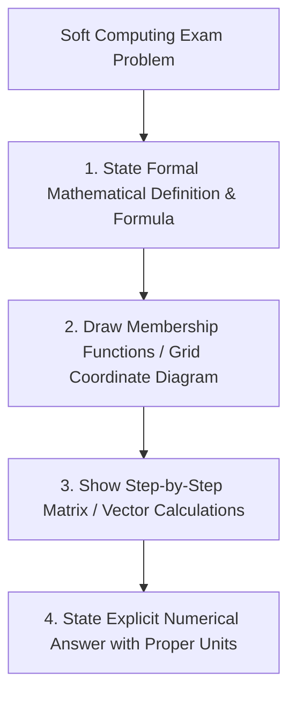

# 👨‍🏫 Instructor Dossier: Prof. Dr. Abdul Hadi Mohammed Adkhil

> **Subject:** 🧠 Soft Computing & Neuro-Fuzzy Systems (CS604)  
> **Academic Rank:** Full Professor (*أستاذ دكتور*)  
> **Faculty:** College of Computer Science & Information Technology, University of Wasit  
> **Lecture Slot:** Tuesday, 08:30 AM – 10:30 AM (2 Credit Hours)  
> **Status:** Active Coursework Instructor (Semester 1, 2026–2027)

---

## 1. Professional Background & Academic Persona

Prof. Dr. Abdul Hadi Mohammed Adkhil is a senior Full Professor and distinguished researcher in artificial intelligence, computational intelligence, fuzzy systems, neural modeling, and digital pattern recognition.

His pedagogical approach combines **rigorous mathematical formalism with practical pattern encoding and computational intelligence models**. 

Prof. Dr. Abdul Hadi emphasizes:
- The fundamental paradigm shift from **Hard Computing** (crisp, binary, precise, brittle) to **Soft Computing** (imprecise, tolerant of uncertainty, partial truth, computationally robust).
- Formal fuzzy set theory, membership function geometries, and multidimensional fuzzy relations.
- Step-by-step manual execution of Fuzzy Inference Systems (Mamdani vs. Takagi-Sugeno-Kang).
- **Chain Code Contour Representations:** A high-priority research specialty involving Freeman 4-directional and 8-directional chain codes, differential encoding, and invariant digital shape representation.
- Hybrid computational paradigms: Adaptive Neuro-Fuzzy Inference Systems (ANFIS).

---

## 2. Core Textbooks & High-Yield Examination Domains

```
+-----------------------------------------------------------------------------------------------+
|                            PROF. DR. ABDUL HADI'S INTELLECTUAL PILLARS                        |
+===============================================================================================+
| 1. Jang, Sun & Mizutani (Primary) | "Neuro-Fuzzy and Soft Computing" (Prentice Hall)          |
| 2. Sivanandam & Deepa (Reference) | "Principles of Soft Computing" (Wiley)                    |
| 3. Fuzzy Logic & Inference        | Mamdani (Max-Min, Centroid) vs. Sugeno (Weighted Average) |
| 4. Digital Contour Chain Codes    | Freeman 8-Connectivity, 1st Difference, Normalization     |
| 5. Neuro-Fuzzy Hybridization      | 5-Layer ANFIS Architecture & Hybrid Learning Rule         |
+-----------------------------------------------------------------------------------------------+
```

### Key Technical Mathematical Emphases

1. **Fuzzy Set Operations & Relations:**
   - Standard Complement: $\mu_{\bar{A}}(x) = 1 - \mu_A(x)$
   - Standard Union (S-norm / Max): $\mu_{A \cup B}(x) = \max(\mu_A(x), \mu_B(x))$
   - Standard Intersection (T-norm / Min): $\mu_{A \cap B}(x) = \min(\mu_A(x), \mu_B(x))$
   - Algebraic Product: $\mu_{A \cdot B}(x) = \mu_A(x) \cdot \mu_B(x)$
   - Bounded Sum: $\mu_{A \oplus B}(x) = \min(1, \mu_A(x) + \mu_B(x))$
   - Max-Min Composition for Relations $R \subseteq X \times Y$ and $S \subseteq Y \times Z$:
     $$\mu_{R \circ S}(x, z) = \max_{y \in Y} \left( \min(\mu_R(x, y), \mu_S(y, z)) \right)$$
   - Max-Product Composition:
     $$\mu_{R \circ S}(x, z) = \max_{y \in Y} \left( \mu_R(x, y) \cdot \mu_S(y, z) \right)$$

2. **Defuzzification Mathematical Formulations:**
   - **Centroid / Center of Gravity (COG):**
     $$z^* = \frac{\int z \mu_C(z) dz}{\int \mu_C(z) dz} \quad \text{or for discrete domains: } z^* = \frac{\sum_{i=1}^n z_i \mu_C(z_i)}{\sum_{i=1}^n \mu_C(z_i)}$$
   - **Mean of Maxima (MOM):** $z^* = \frac{\sum_{z' \in M} z'}{|M|}$, where $M = \{z' \mid \mu_C(z') = \max_z \mu_C(z)\}$.
   - **Bisector of Area (BOA):** $\int_{\alpha}^{z^*} \mu_C(z) dz = \int_{z^*}^{\beta} \mu_C(z) dz$.

3. **Freeman Chain Code Contour Encoding (8-Directional):**
   - Direction vectors: $0 (0^\circ / \text{East}), 1 (45^\circ / \text{NE}), 2 (90^\circ / \text{North}), 3 (135^\circ / \text{NW}), 4 (180^\circ / \text{West}), 5 (225^\circ / \text{SW}), 6 (270^\circ / \text{South}), 7 (315^\circ / \text{SE})$.
   - **First Difference (Derivative):** $d_i = (c_i - c_{i-1}) \pmod 8$ (counting counter-clockwise transitions).
   - **Shape Number / Normalization:** Cyclic shift of the first difference sequence to form the integer of minimum magnitude (rotation-invariant signature).

4. **ANFIS 5-Layer Blueprint:**
   - *Layer 1:* Fuzzification node outputs $\mu_{A_i}(x)$ using generalized bell or Gaussian parameters $\{a_i, b_i, c_i\}$.
   - *Layer 2:* Rule node outputs firing strength $w_i = \mu_{A_i}(x) \times \mu_{B_i}(y)$.
   - *Layer 3:* Normalization node $\bar{w}_i = \frac{w_i}{w_1 + w_2}$.
   - *Layer 4:* Consequent node $\bar{w}_i f_i = \bar{w}_i (p_i x + q_i y + r_i)$.
   - *Layer 5:* Overall output summation $f = \sum_i \bar{w}_i f_i$.

---

## 3. Examination Philosophy & Question Formats

Prof. Dr. Abdul Hadi’s exams demand **exceptional mathematical precision, clear geometric intuition, and meticulous step-by-step arithmetic**.

### Typical Exam Question Types

| Question Type | Cognitive Target | Example Prototype |
|:---|:---|:---|
| **Max-Min Relation Composition** | Matrix arithmetic & T-norm / S-norm operations | *"Given fuzzy relations $R(X, Y)$ and $S(Y, Z)$ represented by $3 \times 3$ matrices: (a) Compute the Max-Min composition matrix $T = R \circ S$. (b) Compute the Max-Product composition matrix $T' = R \circ_{prod} S$."* |
| **FIS Numerical Derivation** | Mamdani vs. Sugeno complete execution | *"A 2-input, 1-output Mamdani FIS has 2 rules: IF $x$ is Small AND $y$ is Medium THEN $z$ is High; IF $x$ is Large THEN $z$ is Low. Given crisp inputs $x_0 = 3.5, y_0 = 6.0$, compute: (a) Rule firing strengths, (b) Aggregated output fuzzy set, (c) Defuzzified crisp output using Centroid method."* |
| **Freeman Chain Code & Normalization** | Discrete contour representation | *"Given a binary object with boundary coordinates $P = \{(2,2), (3,2), (4,3), (4,4), (3,5), (2,4)\}$: (a) Trace the 8-directional Freeman chain code starting at $(2,2)$. (b) Compute the First Difference sequence. (c) Derive the normalized Shape Number."* |
| **Hard vs. Soft Computing Comparative Essay** | Epistemological & computational foundations | *"Construct a detailed comparative analysis between Hard Computing and Soft Computing across: Tolerance to Imprecision, Mathematical Foundations, Search Mechanisms, and Real-World Applicability."* |
| **ANFIS Forward Trace** | 5-layer parameter computation | *"Trace the forward pass of a first-order Sugeno ANFIS with 2 rules, given premise parameters and input $(x=2, y=5)$. Calculate the normalized firing strengths and overall output."* |

---

## 4. Master-Level Answering Protocol



### The 4 Golden Rules:
1. **Rule 1: Always Draw the Geometric Diagram:** When solving fuzzy sets or defuzzification problems, draw the geometric shapes (triangles/trapezoids) and shade the clipped/scaled output areas.
2. **Rule 2: Show Full Matrix Intermediate Steps:** For Max-Min composition, show how every element $t_{ij} = \max(\min(r_{i1}, s_{1j}), \min(r_{i2}, s_{2j}), \dots)$ is computed.
3. **Rule 3: Show Modulo-8 Arithmetic for Chain Codes:** Explicitly state the modulo-8 subtraction for first differences: $d_i = (c_i - c_{i-1} + 8) \pmod 8$.
4. **Rule 4: State Premise vs Consequent Parameters in ANFIS:** Explicitly distinguish between nonlinear premise parameters (adjusted via Gradient Descent) and linear consequent parameters (adjusted via Least Squares Estimation).

---

## 5. Doctor-Specific Agent Tuning Prompt (`@examiner` & `@tutor`)

```yaml
doctor_profile:
  name: "Prof. Dr. Abdul Hadi Mohammed Adkhil"
  subject: "Soft Computing & Neuro-Fuzzy Systems"
  academic_rank: "Full Professor (أستاذ دكتور)"
  textbooks:
    - "Jang, Sun & Mizutani: Neuro-Fuzzy and Soft Computing"
    - "Sivanandam & Deepa: Principles of Soft Computing"
  high_yield_topics:
    - "Fuzzy Max-Min / Max-Product relation compositions"
    - "Mamdani & Sugeno FIS with Centroid defuzzification"
    - "Freeman 8-directional chain codes and derivative shape numbers"
    - "ANFIS 5-layer architecture and hybrid learning algorithm"
  scoring_rubric:
    mathematical_derivation_and_formulas: 45%
    arithmetic_precision_and_trace_steps: 35%
    diagrams_and_geometric_clarity: 20%
```
