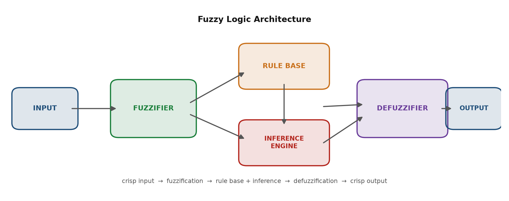
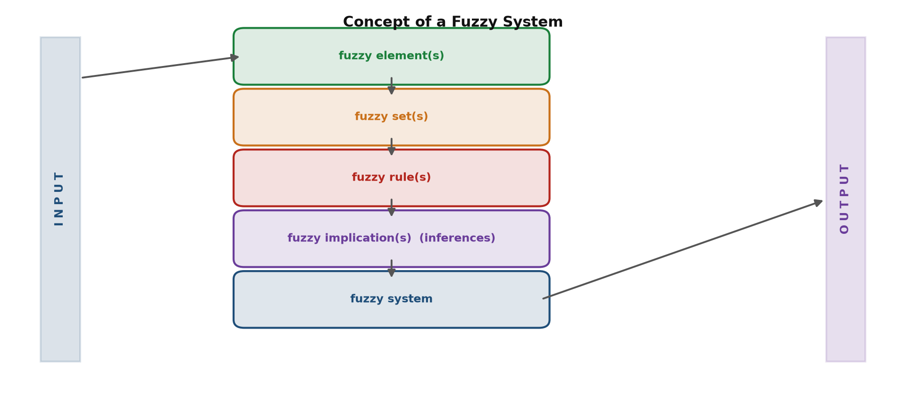
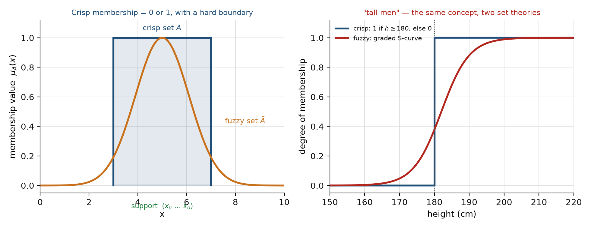

# Soft Computing — Fuzzy Logic Systems · الجزء الأول

> **نوع المحتوى:** تمهيد + فهرس

> **المصدر:** ملف المحاضرات الرسمي «Week 02-03 - Fuzzy Logic Systems.pdf» في مجلد المواد الخام — الصفحات **1–66** (المحاضرات 2 و3 الرسمية من موقع الدكتور).
> **موقع هذا الجزء:** هذا **الجزء الأول من الفصل الثاني** (Fuzzy Logic Systems) في المادة. يغطي: أساسيات المنطق الضبابي، نظرية المجموعات الكلاسيكية، ثم تعريف المجموعة الضبابية ودالة العضوية وتمثيلها. **الجزء الثاني** (ص 67–112) يكمل: مفاهيم المجموعة الضبابية (support · core · α-cut …) ودوال العضوية الهندسية.
> **ميزان الأولوية (حسب كلام الدكتور):** كل ما في هذا الجزء **مطلوب** — الأساس النظري والكلاسيكي هو قاعدة الامتحان. (استثناء واحد: أنواع دوال العضوية الهندسية في الجزء الثاني، فهي **للاطلاع فقط**.)
> **اللغة:** الشرح عربي–إنكليزي مدمج، والمصطلحات والمعادلات بالإنجليزية حصراً.
> **ملاحظة على التكرار:** المصدر يعيد نفس الفكرة على سلايدات متعددة (خصوصاً «Difference between Classical Set and Fuzzy Set» على ست سلايدات). دمجناها في **جدول جامع واحد** — بلا تكرار، وبلا حذف معلومة.

## المحتويات

| # | القسم | المصدر |
|:--:|:---|:---|
| 1 | أساسيات نظرية المنطق الضبابي | ص 1–7 |
| 2 | نظرية المجموعات الكلاسيكية | ص 11–44 |
| 3 | المجموعة الضبابية — التعريف والفرق الجوهري | ص 45–54 |
| 4 | دالة العضوية والتمثيل | ص 55–66 |
| 5 | ورقة الصيغ المركزة | تجميع |
| 6 | أسئلة الدكتور المحتملة — نماذج أجوبة | تجميع |
| 7 | Retrieval set — استدعاء نشط | تجميع |

---

# 1. أساسيات نظرية المنطق الضبابي (ص 1–7)

> **نوع المحتوى:** شرح + تعداد

هذا القسم يجيب على سؤال واحد: **ليش نحتاج المنطق الضبابي أصلاً؟** وبعدها يعرض بنية النظام ومكوّناته الأربعة.

## 1.1 لماذا المنطق الضبابي؟ (ص 2–3)

> *Fuzzy Logic system can work with any type of inputs whether it is imprecise, distorted or noisy input information.*

| الخاصية (نص المحاضرة) | يعني شنو بالعربي |
|:---|:---|
| يعمل مع **أي نوع من المدخلات** — غير دقيقة، مشوّهة، أو مليانة ضوضاء | الواقع ما يعطيك بيانات نظيفة؛ النظام مصمّم يتحمّل |
| **بناؤه سهل ومفهوم** | ما يحتاج رياضيات ثقيلة للبدء |
| يأتي بـ **مفاهيم رياضية من نظرية المجموعات** والاستدلال بسيط | الأساس الرياضي هو المجموعات (وهذا سبب بدء المحاضرة بالكلاسيكية) |
| **حل كفوء للمشاكل المعقّدة** في كل مجالات الحياة، لأنه يشبه **استدلال الإنسان وقراره** | ليس فقط «تقريباً»، بل محاكاة لطريقة تفكيرنا |
| **الخوارزميات تُوصف ببيانات قليلة** → ذاكرة أقل مطلوبة | حلول خفيفة، ما تحتاج بيانات ضخمة |

> *It is a technique to embody human-like thinkings into a control system.*
> *It may not be designed to give accurate reasoning but it is designed to give acceptable reasoning.*
> *It can emulate human deductive thinking, that is, the process people use to infer conclusions from what they know.*
> *Any uncertainties can be easily dealt with the help of fuzzy logic.*

**🧠 مرساة هذا القسم:**

$$\text{Imprecise / noisy inputs} \quad\cdot\quad \text{Easy construction} \quad\cdot\quad \text{Set theory} \quad\cdot\quad \text{Human-like reasoning}$$
$$\text{Little data} \quad\cdot\quad \text{Acceptable (not exact) reasoning} \quad\cdot\quad \text{Handles uncertainty}$$

**فرق مهم جداً تحفظه:** الدكتور يقول **acceptable reasoning** لا **accurate reasoning**. هذا جوهر المادة كلها — المنطق الضبابي ما يوصلك للدقة المطلقة، يوصلك لحل **مقبول وعملي**.

## 1.2 معمارية نظام المنطق الضبابي (ص 4–6)

> **نوع المحتوى:** شرح + تعداد

> *FUZZY LOGIC ARCHITECTURE: INPUT → FUZZIFIER → (RULE BASE, INFERENCE ENGINE) → DEFUZZIFIER → OUTPUT.*

المكوّنات الأربعة كما وردت حرفياً (ص 5–6):

| المكوّن | النص الأصلي (مختصر بلا حذف معنى) | الشرح بالعربي |
|:---|:---|:---|
| **RULE BASE** | *“It contains the set of rules and the IF-THEN conditions provided by the experts to govern the decision making system, on the basis of linguistic information. Recent developments in fuzzy theory offer several effective methods for the design and tuning of fuzzy controllers. Most of these developments reduce the number of fuzzy rules.”* | القواعد **IF–THEN** التي يضعها الخبير لتحكم القرار، وتكون **بلغة لغوية** (linguistic). التطورات الحديثة تهدف لـ **تقليل عدد القواعد** — لأن القواعد الكثيرة تعني تعقيداً وبطئاً. |
| **FUZZIFICATION** | *“It is used to convert inputs i.e. crisp numbers into fuzzy sets. Crisp inputs are basically the exact inputs measured by sensors and passed into the control system for processing, such as temperature, pressure, rpm's, etc.”* | تحويل **الأرقام الصريحة** (من الحسّاسات: حرارة، ضغط، عدد الدورات) إلى **مجموعات ضبابية**. هذه أول خطوة بعد الدخل. |
| **INFERENCE ENGINE** | *“It determines the matching degree of the current fuzzy input with respect to each rule and decides which rules are to be fired according to the input field. Next, the fired rules are combined to form the control actions.”* | يقيس **درجة المطابقة** بين الدخل الضبابي وكل قاعدة، يحدد القواعد التي **تُشتعل (fired)**، ثم **يجمعها** لتكوين فعل التحكّم. |
| **DEFUZZIFICATION** | *“It is used to convert the fuzzy sets obtained by inference engine into a crisp value. There are several defuzzification methods available and the best suited one is used with a specific expert system to reduce the error.”* | العكس: تحويل الناتج الضبابي إلى **قيمة صريحة** واحدة. توجد **عدة طرق** ونختار الأنسب لتقليل الخطأ. |

**🧠 مرساة المعمارية:**

$$\text{crisp input} \ \to\ \text{fuzzify} \ \to\ \text{rules} + \text{inference} \ \to\ \text{defuzzify} \ \to\ \text{crisp output}$$

**ملاحظة ربط:** لاحظ التناظر — الدخل صريح، فيُضبَّب (fuzzification)، ثم يعالَج ضبابياً، ثم يُعاد صريحاً (defuzzification). أي نظام تحكّم ضبابي **يبدأ وينتهي بقيمة صريحة**؛ المنطقة الضبابية في الوسط فقط.

## 1.3 من الكلاسيكي إلى الضبابي (ص 7)

> *Fuzzy set and crisp set are the part of the distinct set theories, where the fuzzy set implements infinite-valued logic while crisp set employs bi-valued logic.*
> *Previously, expert system principles were formulated premised on Boolean logic where crisp sets are used.*
> *But then scientists argued that human thinking does not always follow crisp "yes"/"no" logic, and it could be vague, qualitative, uncertain, imprecise or fuzzy in nature.*
> *This gave commencement to the development of the fuzzy set theory to imitate human thinking.*

| المرحلة | الفكرة |
|:---|:---|
| **قبل** | أنظمة الخبراء كانت مبنية على **المنطق البولياني (Boolean logic)** ومجموعاته **crisp** ذات القيمة المزدوجة (bi-valued) |
| **الاعتراض** | تفكير الإنسان **ليس دائماً** «نعم/لا» — قد يكون غامضاً، نوعياً، غير مؤكد، غير دقيق |
| **النتيجة** | ظهور **نظرية المجموعة الضبابية** لمحاكاة تفكير الإنسان |

**الفكرة المحورية:** crisp = **bi-valued logic** (قيمتان)، fuzzy = **infinite-valued logic** (قيم لا نهائية). هذه هي نقطة الانطلاق لكل ما يأتي.

---

# 2. نظرية المجموعات الكلاسيكية (ص 11–44)

> **نوع المحتوى:** شرح + تعريف

هذا القسم **ليس حفظاً للحفظ** — هو **الأرضية** التي تُبنى عليها المجموعة الضبابية. كل مفهوم كلاسيكي هنا سيقابله نسخة ضبابية في القسمين 3 و4. اقرأه وأنت تسأل: **«شلون يختلف الضبابي عنه؟»**.

## 2.1 تعريف المجموعة وطرق كتابتها (ص 11–14)

> *A set is an unordered collection of different elements. It can be written explicitly by listing its elements using the set bracket. If the order of the elements is changed or any element of a set is repeated, it does not make any changes in the set.*

**نقاط جوهرية:** المجموعة **غير مرتّبة** (unordered)، و**لا تتكرر عناصرها** (repetition لا تغيّر شيئاً). أمثلة السلايد: مجموعة الأعداد الصحيحة الموجبة · كواكب المجموعة الشمسية · ولايات الهند · حروف الأبجدية الصغيرة.

**ثلاث طرق للكتابة (ص 12–13):**

| الطريقة | الصيغة | مثال من السلايد |
|:---|:---|:---|
| **Roster / list** | كتابة العناصر بين أقواس، مفصولة بفواصل | $A = \{a,e,i,o,u\}$ · $B = \{1,3,5,7,9\}$ |
| **Set-builder** | $A = \{x : p(x)\}$ — بخاصية مشتركة | $A = \{x : x \text{ is a vowel in English alphabet}\}$ |
| **Set-builder (شرط)** | بشرط رياضي | $B = \{x : 1 \le x < 10 \text{ and } (x\%2) \ne 0\}$ |

**العضوية وعدم العضوية (ص 14):**

> *If an element x is a member of any set S, it is denoted by x ∈ S and if an element y is not a member of set S, it is denoted by y ∉ S.*
> *If S = {1, 1.2, 1.7, 2}, 1 ∈ S but 1.5 ∉ S.*

$$x \in S \qquad\qquad y \notin S$$

**ملاحظة:** العضوية هنا **ثنائية تماماً** — إمّا داخل أو خارج، ولا ثالث. هذا بالضبط ما سيتغيّر في المجموعة الضبابية.

## 2.2 الأصالة العددية (Cardinality) — ص 15–17

> *Cardinality of a set S, denoted by |S|, is the number of elements of the set. The number is also referred as the cardinal number. If a set has an infinite number of elements, its cardinality is ∞.*

$$|S| = \text{number of elements} \qquad\qquad |\{1,4,3,5\}| = 4 \qquad\qquad |\{1,2,3,4,5,\ldots\}| = \infty$$

**المقارنة بين مجموعتين (ص 16–17):**

| العلاقة | المعنى | نوع الدالة |
|:---|:---|:---|
| $\lvert X \rvert = \lvert Y \rvert$ | نفس عدد العناصر تماماً | **bijective** $f: X \to Y$ |
| $\lvert X \rvert \le \lvert Y \rvert$ | عدد عناصر X أقل أو يساوي | **injective** $f$ |
| $\lvert X \rvert < \lvert Y \rvert$ | أقل تماماً | injective **لكن ليست bijective** |

**بالعربي:** الأصالة الكلاسيكية **عدد صحيح دائماً** (عدّ عناصر). لاحظ هذا جيداً — في القسم 4 ستشوف أن الأصالة الضبابية **ليست عدّاً** بل **مجموع درجات**، فممكن تكون عدداً كسرياً. هذا أحد أهم فروق الامتحان.

## 2.3 أنواع المجموعات (ص 18–24)

> **نوع المحتوى:** تعداد فقط

| النوع | التعريف (نص المحاضرة) | مثال السلايد |
|:---|:---|:---|
| **Universal** $U$ | *collection of all elements in a particular context* — كل المجموعات في ذلك السياق جزئية منها | $U$ = كل الحيوانات على الأرض؛ الثدييات ⊂ U |
| **Finite** | *a definite number of elements* | $S = \{x \mid x \in \mathbb{N} \text{ and } 70 > x > 50\}$ |
| **Infinite** | *infinite number of elements* | $S = \{x \mid x \in \mathbb{N} \text{ and } x > 10\}$ |
| **Subset** $X \subseteq Y$ | *every element of X is an element of Y* | $X=\{1,\ldots,6\}$, $Y=\{1,2\}$ → $Y \subset X$ |
| **Proper Subset** $X \subset Y$ | *“subset of but not equal to”* — أي $X \subseteq Y$ **و** $\lvert X \rvert < \lvert Y \rvert$ | $X=\{1,\ldots,6\}$, $Y=\{1,2\}$ → $Y \subset X$ |
| **Empty / Null** $\Phi$ | *contains no elements*؛ أصالتها **صفر**، وهي مجموعة منتهية | $S = \{x \mid x \in \mathbb{N} \text{ and } 7 < x < 8\} = \Phi$ |
| **Singleton / Unit** $\{s\}$ | *contains only one element* | $S = \{x \mid x \in \mathbb{N},\ 7 < x < 9\} = \{8\}$ |
| **Equal** | *contain the same elements* | $A=\{1,2,6\}$, $B=\{6,1,2\}$ → متساويتان |
| **Equivalent** | *cardinalities are same* (العدد فقط) | $A=\{1,2,6\}$, $B=\{16,17,22\}$ → $\lvert A\rvert=\lvert B\rvert=3$ |
| **Overlapping** | *at least one common element* | $A=\{1,2,6\}$, $B=\{6,12,42\}$ → العنصر 6 |
| **Disjoint** | *not even one element in common* | $A=\{1,2,6\}$, $B=\{7,9,14\}$؛ و $n(A \cap B) = \varnothing$ |

**مصيدة الامتحان:** **Equal ≠ Equivalent**. Equal = نفس العناصر بالضبط. Equivalent = نفس **العدد** فقط، والعناصر مختلفة.

## 2.4 عمليات المجموعات (ص 25–33)

> **نوع المحتوى:** شرح + تعداد

> *Set Operations include Set Union, Set Intersection, Set Difference, Complement of Set, and Cartesian Product.*

| العملية | الصيغة | المثال ($A=\{10,11,12,13\}$, $B=\{13,14,15\}$) |
|:---|:---|:---|
| **Union** $A \cup B$ | $\{x \mid x \in A \ \text{OR} \ x \in B\}$ | $A \cup B = \{10,11,12,13,14,15\}$ — العنصر المشترك يظهر **مرة واحدة** |
| **Intersection** $A \cap B$ | $\{x \mid x \in A \ \text{AND} \ x \in B\}$ | $A \cap B = \{13\}$ — العناصر المشتركة فقط |
| **Difference** $A - B$ | $\{x \mid x \in A \ \text{AND} \ x \notin B\}$ | $A-B=\{10,11,12\}$ · $B-A=\{14,15\}$ — **غير تبديلية** |
| **Complement** $A'$ | $\{x \mid x \notin A\} = U - A$ | إذا $A$ = الأعداد الفردية → $A'$ = غير الفردية |
| **Cartesian Product** $A \times B$ | $\{(a,b) \mid a \in A,\ b \in B\}$ | $A=\{a,b\}, B=\{1,2\}$ → $A \times B = \{(a,1),(a,2),(b,1),(b,2)\}$ |

**ملاحظتان مهمّتان:**
- **الفرق غير تبديلي:** $A - B \ne B - A$. الفرق يحفظ ما هو **فقط في الأولى**.
- **الجداء الديكارتي مرتّب:** $A \times B \ne B \times A$، لأن $(a,1) \ne (1,a)$. وهذا سيصير مهماً في تمثيل المجموعة الضبابية كأزواج مرتّبة.

## 2.5 قوانين وخصائص المجموعات الكلاسيكية (ص 34–40)

> **نوع المحتوى:** تعداد فقط

| الخاصية | الصيغة |
|:---|:---|
| **Commutative** | $A \cup B = B \cup A$ · $A \cap B = B \cap A$ |
| **Associative** | $A \cup (B \cup C) = (A \cup B) \cup C$ · $A \cap (B \cap C) = (A \cap B) \cap C$ |
| **Distributive** | $A \cup (B \cap C) = (A \cup B) \cap (A \cup C)$ · $A \cap (B \cup C) = (A \cap B) \cup (A \cap C)$ |
| **Idempotency** | $A \cup A = A$ · $A \cap A = A$ |
| **Identity** | $A \cup \varphi = A$ · $A \cap X = A$ · $A \cap \varphi = \varphi$ · $A \cup X = X$ |
| **Transitive** | If $A \subseteq B \subseteq C$ then $A \subseteq C$ |
| **Involution** | $\overline{\overline{A}} = A$ (متمّم المتمّم = المجموعة نفسها) |
| **De Morgan's Law** | $\overline{A \cap B} = \overline{A} \cup \overline{B}$ · $\overline{A \cup B} = \overline{A} \cap \overline{B}$ |

> *De Morgan's Law: It is a very important law and supports in proving tautologies and contradiction.*

**بالعربي:** هاي القوانين هي «قواعد الجبر» مال المجموعات. ستحتاجها في **العمليات على المجموعات الضبابية** لاحقاً — فحفظها هنا استثمار. أهم اثنين للامتحان: **De Morgan** و **Distributive**.

## 2.6 تمارين البيت 1–3 مع الحل الكامل (ص 41–44)

> **نوع المحتوى:** تعداد + حل حسابي كامل

### HOME TASK 1 (ص 41–42)

**المعطيات:**

$$U = \{1,2,\ldots,20\}$$
$$A = \{2,5,7,8,10,13,15,16,18,19,20\}$$
$$B = \{1,2,3,4,5,6,9,10,11,12,14,16,17,19\}$$

**المطلوب والحل:**

| # | المطلوب | الحل |
|:--:|:---|:---|
| 1 | $A \cup B$ | $\{1,2,3,4,5,6,7,8,9,10,11,12,13,14,15,16,17,18,19,20\} = U$ |
| 2 | $A \cap B$ | $\{2,5,10,16,19\}$ |
| 3 | $A - B$ | $\{7,8,13,15,18,20\}$ |
| 4 | $B - A$ | $\{1,3,4,6,9,11,12,14,17\}$ |
| 5 | $A'$ | $\{1,3,4,6,9,11,12,14,17\}$ |
| 6 | $B'$ | $\{7,8,13,15,18,20\}$ |

**لماذا $A \cup B = U$؟** لأن مجموع عناصر A و B يغطي كل الأعداد من 1 إلى 20 بلا فراغ.
**لاحظ التناظر:** $A' = B - A$ و $B' = A - B$ — وهذا **ليس صدفة**: يحدث دائماً عندما $A \cup B = U$ (كل ما هو خارج A هو حتماً داخل B).

### HOME TASK 2 (ص 43)

**المعطيات:** $A = \{R, S\}$، $B = \{7, 10, 18\}$. **المطلوب:** الجداء الديكارتي.

$$A \times B = \{(R,7), (R,10), (R,18), (S,7), (S,10), (S,18)\}$$
$$B \times A = \{(7,R), (7,S), (10,R), (10,S), (18,R), (18,S)\}$$

**لاحظ:** العدد نفسه في الحالتين ($2 \times 3 = 6$)، لكن **الترتيب داخل كل زوج مختلف** → $A \times B \ne B \times A$.

### HOME TASK 3 (ص 44)

> *Give examples one from each for an Empty Set, Unit Set, Equal Set, Equivalent Set, Overlapping Set, Disjoint Set.*

| النوع | مثال |
|:---|:---|
| Empty Set | $\{x \mid x \in \mathbb{N},\ 3 < x < 4\} = \Phi$ |
| Unit (Singleton) Set | $\{x \mid x \in \mathbb{N},\ 4 < x < 6\} = \{5\}$ |
| Equal Set | $A=\{1,2,6\}$, $B=\{6,2,1\}$ |
| Equivalent Set | $A=\{1,2,6\}$, $B=\{16,17,22\}$ — $\lvert A \rvert = \lvert B \rvert = 3$ |
| Overlapping Set | $A=\{1,2,6\}$, $B=\{6,12,42\}$ — يشتركان بالعنصر 6 |
| Disjoint Set | $A=\{1,2,6\}$, $B=\{7,9,14\}$ — لا عنصر مشترك |

---

# 3. المجموعة الضبابية والفرق الجوهري (ص 45–54)

> **نوع المحتوى:** شرح + تعريف

## 3.1 مفهوم النظام الضبابي (ص 45)

> **نوع المحتوى:** تعداد

مسار المعالجة كما ورد على السلايد (ص 45):

$$\text{INPUT} \ \to\ \text{fuzzy element(s)} \ \to\ \text{fuzzy set(s)} \ \to\ \text{fuzzy rule(s)}$$
$$\to\ \text{fuzzy implication(s) (inferences)} \ \to\ \text{fuzzy system} \ \to\ \text{OUTPUT}$$

**بالعربي:** هذا تدرّج **من الصغير إلى الكبير**: العنصر ← المجموعة ← القاعدة ← الاستنتاج ← النظام. احفظ هذا الترتيب، فهو يوضّح «من أين تبدأ ومن أين تنتهي» أي معالجة ضبابية.

## 3.2 ما هي المجموعة الضبابية؟ (ص 46)

> *Fuzzy sets can be considered as an extension and gross oversimplification of classical sets.*
> *It can be best understood in the context of set membership. Basically it allows partial membership which means that it contain elements that have varying degrees of membership in the set.*

**الكلمتان المفتاحيتان:**
- **extension** — امتداد للمجموعة الكلاسيكية (تعميم لها، ليست شيئاً منفصلاً).
- **partial membership** — **العضوية الجزئية**: العنصر ممكن ينتمي **بدرجة**، مو «نعم أو لا».

## 3.3 الجدول الجامع: كلاسيكي مقابل ضبابي (ص 47–54)

> **نوع المحتوى:** تعداد فقط (النص الإنجليزي أولاً، ثم التعليق العربي في بلوك مستقل)

هذا الجدول **يدمج ست سلايدات** (49، 50، 51، 52، 53، 54) تتناول نفس المقارنة بصيغ مختلفة — دمجناها بلا تكرار.

| محور المقارنة | **Crisp / Classical Set** | **Fuzzy Set** |
|:---|:---|:---|
| **التعريف الأساسي** | *collection of distinct objects* | *set having degrees of membership between 1 and 0* (يُرمَز له بالتِلدة ~) |
| **الشكل الرياضي** | $S = \{s \mid s \in X\}$ — **قائمة عناصر** | $F = \{(s, \mu) \mid s \in X\}$ — **أزواج مرتّبة**، و $\mu(s)$ هي درجة الانتماء |
| **نوع العنصر** | كل فرد هو **member** أو **non-member** | كل فرد له **درجة انتماء** |
| **العضوية** | **strict boundary: yes or no** — إمّا داخل أو خارج، **لا عضوية جزئية** | **partial membership exists** — العنصر ممكن يكون جزءاً من أكثر من مجموعة ضبابية |
| **الحدّ** | حدّ **صارم** (T أو F) | حدّ **ضبابي** بدرجة انتماء |
| **القيم** | **True / False** أي $\{0,1\}$ | قيم عضوية على $[0,1]$ |
| **المنطق** | **bi-valued logic** (ثنائي) | **infinite-valued logic** (لا نهائي القيم) |
| **قانون الوسط الممتنع وعدم التناقض** | **hold** — ينطبقان دائماً | **may or may not hold** — قد ينطبقا وقد لا |
| **الطبيعة** | محدَّد بخصائص **دقيقة** | موصوف بخصائص **غامضة / ملتبسة** (vague or ambiguous) |
| **التطبيقات** | **Digital design** | **Fuzzy controllers** |
| **التحوّل** | قد تصير مجموعة **crisp** ضبابية في بعض الأحيان | **لا** يمكن أن تصير crisp |

**ودالة العضوية للطرفين (ص 47 و 48 و 54):**

$$\text{Classical: } \mu_A(x) = \begin{cases} 1 & \text{if } x \in A \\ 0 & \text{if } x \notin A \end{cases} \qquad\qquad \text{Fuzzy: } \tilde{A} = \{(x, \mu_{\tilde{A}}(x)) \mid x \in X\}$$

**مثال السلايد المحوري (ص 52) — «tall people»:**

> **تعليق عربي على المصدر:** السلايدات تعرض نفس فكرة «tall men» ثلاث مرات (ص 9، 52، 53) بنفس الرسم تقريباً — وهذا مثال واضح على التكرار الذي دُمج هنا. الفكرة واحدة: **الطول نفسه، والحدّ مختلف** — الكلاسيكي يقطع عند رقم (مثلاً 180 سم) والحكم يصير نعم/لا، أما الضبابي فيرسم **منحنى متدرّج** يعطي درجة لكل طول.

**الفرق الجوهري في جملة واحدة:** المجموعة الكلاسيكية تجيب على سؤال «**هل ينتمي؟**» بجواب ثنائي، والمجموعة الضبابية تجيب على «**إلى أي درجة ينتمي؟**» بدرجة في $[0,1]$.

---

# 4. دالة العضوية والتمثيل (ص 55–66)

> **نوع المحتوى:** شرح + تعريف

## 4.1 التعريف الرسمي للمجموعة الضبابية (ص 55–56، 60)

> *Definition 1: Membership function (and Fuzzy set). If X is a universe of discourse and x ∈ X, then a fuzzy set A in X is defined as a set of ordered pairs, that is $A = \{(x, \mu_A(x)) \mid x \in X\}$ where $\mu_A(x)$ is called the membership function for the fuzzy set A.*
> *Note: $\mu_A(x)$ maps each element of X onto a membership grade (or membership value) between 0 and 1 (both inclusive).*

$$\tilde{A} = \{(x, \mu_{\tilde{A}}(x)) \mid x \in X\} \qquad\qquad \mu_{\tilde{A}}: X \to [0,1]$$

> *A fuzzy set is totally characterized by a membership function (MF).*

| المصطلح | المعنى |
|:---|:---|
| **Universe of discourse** $X$ | مجموعة كل القيم الممكنة للمتغيّر (النطاق) |
| **Membership function** $\mu_{\tilde{A}}(x)$ | الدالة التي تعطي درجة الانتماء |
| **Membership grade / value** | القيمة الناتجة، بين 0 و 1 **ضمناً** (both inclusive) |

**نقطتان تحفظان حرفياً:**

| # | النقطة التي تُحفظ حرفياً |
|:--:|:---|
| 1 | **Universe of discourse** = $X$ (الكون الذي نتكلم عنه). |
| 2 | **«A fuzzy set is totally characterized by a membership function»** — جملة مفتاحية: المجموعة الضبابية **تُعرَّف بالكامل** بدالة العضوية. لا تحتاج شيئاً آخر. |

## 4.2 درجة العضوية — وليست احتمالاً (ص 57–58)

> *Here, $\mu_A(x)$ is the "membership function". Value of this function is between 0 and 1.*
> *This value represents the "degree of membership" (membership value) of element x in set A.*
> *The members of a fuzzy set are members to some degree, known as a membership grade or degree of membership.*
> *The membership grade is the degree of belonging to the fuzzy set. The larger the number (in [0, 1]) the more the degree of belonging. (N.B. This is not a probability).*
> *The translation from x to $\mu_A(x)$ is known as Fuzzification.*

$$\mu_{\tilde{A}}(x) = \begin{cases} 1 & x \text{ totally in } \tilde{A} \\ 0 & x \text{ not in } \tilde{A} \\ 0 < \mu_{\tilde{A}}(x) < 1 & x \text{ partly in } \tilde{A} \end{cases}$$

**النقاط الثلاث للحالة:** العضوية **1** = داخل تماماً · **0** = خارج تماماً · **بين 0 و 1** = **جزئياً** داخل.

**مصيدة الامتحان الكبرى:** **(N.B. This is not a probability)** — درجة العضوية **ليست احتمالاً**. العضوية تقيس «إلى أي درجة ينتمي العنصر للمجموعة الموصوفة غامضاً»، والاحتمال يقيس «احتمال وقوع حدث». الدكتور نبّه عليها صراحةً على السلايد.

**تعريف Fuzzification:** التحويل من $x$ إلى $\mu_A(x)$ — أي إعطاء كل قيمة صريحة درجتها. هذه هي **نفس** خطوة الـ FUZZIFICATION في معمارية القسم 1.2.

## 4.3 مثال محلول: مدن الهند (ص 59)

> *X = All cities in India. A = City of comfort.*
> *A = {(New Delhi, 0.7), (Bangalore, 0.9), (Chennai, 0.8), (Hyderabad, 0.6), (Kolkata, 0.3), (Kharagpur, 0)}*

| المدينة | درجة العضوية $\mu$ | قراءة |
|:---|:---:|:---|
| Bangalore | 0.9 | الأكثر «راحة» |
| Chennai | 0.8 | |
| New Delhi | 0.7 | |
| Hyderabad | 0.6 | |
| Kolkata | 0.3 | درجة منخفضة لكن **مو صفر** |
| Kharagpur | 0 | **خارج** تماماً |

**لاحظ:** المجموعة كلها مكتوبة كـ **أزواج مرتّبة** $(x, \mu)$. و Kharagpur موجود **صفر** — إدراجه هنا مقصود ليوضّح أن العضوية ممكن تكون صفراً، فالحامل (support) سيكون المدن الخمس الأولى فقط. (ستشوف تعريف الحامل في **الجزء الثاني §2.3**.)

## 4.4 الصيغة البديلة للتمثيل (ص 61–63)

> *The fuzzy set $\tilde{A}$ can be alternatively denoted as follows: If X is discrete then $\tilde{A} = \sum \mu_{\tilde{A}}(x_i)/x_i$. If X is continuous then $\tilde{A} = \int \mu_{\tilde{A}}(x)/x$.*
> *Note that Σ and integral signs stand for the union of membership grades; "/" stands for a marker and does not imply division.*

$$\tilde{A} = \sum_{x_i \in X} \frac{\mu_{\tilde{A}}(x_i)}{x_i} \quad (\text{discrete}) \qquad\qquad \tilde{A} = \int_{X} \frac{\mu_{\tilde{A}}(x)}{x} \quad (\text{continuous})$$

**⚠️ أهم ملاحظة في هذا القسم — نصها حرفياً على السلايد:** علامة **Σ والتكامل** تعنيان **اتحاد درجات العضوية** (union of membership grades)، وعلامة **«/» علامة فاصلة (marker) وليست قسمة**. لا تقسم أبداً — اقرأها «درجة على عنصر».

**صيغة المجموعة المتقطّعة (ص 63):**

$$A = \mu_1/x_1 + \mu_2/x_2 + \cdots + \mu_n/x_n = \sum_{i=1}^{n} \frac{\mu_i}{x_i}$$

حيث $x_1, x_2, \ldots, x_n$ **عناصر المجموعة**، و $\mu_1, \mu_2, \ldots, \mu_n$ **درجات انتمائها**. وعلامة **«+»** هنا أيضاً رمزية (اتحاد)، ليست جمعاً حسابياً.

## 4.5 التمثيل: حالتا الكون (ص 64–66)

> *A fuzzy set $\tilde{A}$ in the universe of information U can be defined as a set of ordered pairs: $\tilde{A} = \{(y, \mu_{\tilde{A}}(y)) \mid y \in U\}$. Here $\mu_{\tilde{A}}(y)$ = degree of membership of y in $\tilde{A}$, assumes values in the range from 0 to 1.*
> *Case 1: When universe of information U is discrete and finite.*
> *Case 2: When universe of information U is continuous and infinite.*

$$\text{Case 1 (discrete, finite): } \tilde{A} = \left\{ \frac{\mu_{\tilde{A}}(y_1)}{y_1} + \frac{\mu_{\tilde{A}}(y_2)}{y_2} + \frac{\mu_{\tilde{A}}(y_3)}{y_3} + \cdots \right\} = \left\{ \sum_{i=1}^{n} \frac{\mu_{\tilde{A}}(y_i)}{y_i} \right\}$$
$$\text{Case 2 (continuous, infinite): } \tilde{A} = \left\{ \int \frac{\mu_{\tilde{A}}(y)}{y} \right\}$$

**كيف تعرف أي حالة عندك؟**

| إذا كان الكون… | فالحالة | الأداة |
|:---|:---|:---|
| **discrete and finite** (قائمة عناصر معدودة) | Case 1 | مجموع $\sum$ |
| **continuous and infinite** (فترة حقيقية) | Case 2 | تكامل $\int$ |

> **تداخل مقصود بين الجزئين (تنبيه):** مواضيع الصيغة البديلة والتمثيل (ص 61–66 هنا) تتقاطع مع بداية **الجزء الثاني §1** (ص 67–69)، لأن المصدر نفسه يعيد الفكرة بأمثلة محلولة. **هنا القواعد والرمزية**، وفي **الجزء الثاني §1 الأمثلة المحلولة** على الحالات الثلاث (كون متقطّع مرتّب / غير مرتّب / مستمر). ما كرّرنا الأمثلة — وزّعناها.

---

# 5. ورقة الصيغ المركزة (Formula Sheet)

> **نوع المحتوى:** تعداد فقط

**المجموعات الكلاسيكية:**

$$A \cup B = \{x \mid x \in A \ \text{OR} \ x \in B\} \qquad A \cap B = \{x \mid x \in A \ \text{AND} \ x \in B\}$$
$$A - B = \{x \mid x \in A \ \text{AND} \ x \notin B\} \qquad A' = \{x \mid x \notin A\} = U - A$$
$$A \times B = \{(a,b) \mid a \in A,\ b \in B\}$$
$$\overline{A \cap B} = \overline{A} \cup \overline{B} \qquad \overline{A \cup B} = \overline{A} \cap \overline{B} \qquad \overline{\overline{A}} = A$$
$$A \cup (B \cap C) = (A \cup B) \cap (A \cup C) \qquad A \cap (B \cup C) = (A \cap B) \cup (A \cap C)$$

**المجموعة الضبابية:**

$$\tilde{A} = \{(x, \mu_{\tilde{A}}(x)) \mid x \in X\} \qquad\qquad \mu_{\tilde{A}}: X \to [0,1]$$
$$\mu_A(x) = \begin{cases} 1 & x \in A \\ 0 & x \notin A \end{cases} \quad \text{(classical)} \qquad\qquad \mu_{\tilde{A}}(x) = \begin{cases} 1 & x \text{ totally in} \\ 0 & x \text{ not in} \\ 0<\mu<1 & x \text{ partly in} \end{cases}$$
$$\tilde{A} = \sum_{i=1}^{n} \frac{\mu_{\tilde{A}}(x_i)}{x_i} \ \text{(discrete)} \qquad\qquad \tilde{A} = \int \frac{\mu_{\tilde{A}}(x)}{x} \ \text{(continuous)}$$

**المعمارية:**

$$\text{crisp input} \to \text{fuzzification} \to \text{rule base} + \text{inference engine} \to \text{defuzzification} \to \text{crisp output}$$

---

# 6. أسئلة الدكتور المحتملة — نماذج أجوبة

> **نوع المحتوى:** نقاط + شرح

| السؤال | نموذج الجواب |
|:---|:---|
| اذكر مزايا المنطق الضبابي. | It works with any type of input (imprecise, distorted, noisy); its construction is easy and understandable; it relies on set theory with simple reasoning; it gives efficient solutions to complex problems because it resembles human reasoning; its algorithms need little data, so little memory is required. |
| ما الفرق بين accurate reasoning و acceptable reasoning هنا؟ | Fuzzy logic is not designed to give accurate reasoning but to give **acceptable** reasoning — an approximate but usable answer, which is the whole point of soft computing. |
| اذكر مكوّنات معمارية المنطق الضبابي الأربعة ووظيفة كل واحد. | Rule base (IF–THEN rules from experts), Fuzzification (crisp inputs → fuzzy sets), Inference engine (matches inputs to rules, decides which fire, combines them), Defuzzification (fuzzy result → one crisp value). |
| ما الفرق بين المجموعة الكلاسيكية والمجموعة الضبابية؟ | A classical set is a collection of distinct objects where membership is strict (yes or no, μ ∈ {0,1}) and the universe splits into members and non-members. A fuzzy set allows **partial membership** with a grade μ ∈ [0,1], is written as a set of ordered pairs {(x, μ(x))}, uses infinite-valued logic, and is described by vague or ambiguous properties. |
| هل درجة العضوية احتمال؟ | No. The slide states explicitly "(N.B. This is not a probability)". Membership measures the degree of belonging to a vaguely defined set; probability measures the chance of an event. |
| عرّف دالة العضوية، وشنو يعرّف المجموعة الضبابية بالكامل؟ | The membership function μ_Ã(x) maps each element x of the universe X onto a membership grade between 0 and 1 (both inclusive). A fuzzy set is **totally characterized by its membership function**. |
| ما معنى «/» في الصيغة البديلة؟ | It is a **marker** separating the grade from the element — it does **not** imply division. Likewise Σ and ∫ stand for the union of membership grades, not arithmetic addition. |
| ما شرطا «Equal» و«Equivalent» في المجموعات الكلاسيكية؟ | Equal = exactly the same elements. Equivalent = the same cardinality only (the elements may differ). |

---

## Retrieval set

**[RS-F1-01]** Why is fuzzy logic described as giving "acceptable" rather than "accurate" reasoning?
> Because it deliberately trades exactness for usability: it produces an approximate but usable answer to complex problems that either cannot be solved exactly or would take too long. Its role model is the human mind.

**[RS-F1-02]** Name the four components of the fuzzy logic architecture, in order.
> Rule base (IF–THEN rules from experts) → Fuzzification (crisp inputs to fuzzy sets) → Inference engine (matching degree, firing, combining) → Defuzzification (fuzzy result back to one crisp value). Crisp input enters, crisp output leaves.

**[RS-F1-03]** What is the essential difference between a crisp set and a fuzzy set?
> Crisp: strict boundary, μ ∈ {0,1}, bi-valued logic, an element is a member or not, no partial membership. Fuzzy: partial membership with a grade μ ∈ [0,1], infinite-valued logic, written as ordered pairs {(x, μ(x))}, described by vague/ambiguous properties.

**[RS-F1-04]** Write the formal definition of a fuzzy set and state what characterises it completely.
> Ã = {(x, μ_Ã(x)) | x ∈ X}, where μ_Ã : X → [0,1]. A fuzzy set is **totally characterized by its membership function (MF)**.

**[RS-F1-05]** What does the membership grade mean, and what is it explicitly NOT?
> It is the degree of belonging of an element to a vaguely defined set; the larger the value in [0,1], the greater the degree of belonging. It is explicitly **not a probability**.

**[RS-F1-06]** Give the three cases of μ_Ã(x) and their meanings.
> μ = 1 → x is totally in Ã; μ = 0 → x is not in Ã; 0 < μ < 1 → x is partly in Ã.

**[RS-F1-07]** Write the alternative notation for a discrete and for a continuous universe, and explain the symbols.
> Discrete: Ã = Σ μ_Ã(x_i)/x_i. Continuous: Ã = ∫ μ_Ã(x)/x. Σ and ∫ denote the **union of membership grades**, and "/" is a **marker** separating grade from element — it does not imply division.

**[RS-F1-08]** Which two cases of universe of information are distinguished in the representation of a fuzzy set, and which symbol goes with each?
> Case 1: universe discrete and finite → summation Σ. Case 2: universe continuous and infinite → integration ∫.

**[RS-F1-09]** State the crisp membership function and the fuzzy membership function side by side.
> Crisp: μ_A(x) = 1 if x ∈ A, else 0. Fuzzy: μ_Ã(x) ∈ [0,1], with 1 = totally in, 0 = not in, and values strictly between 0 and 1 = partly in.

**[RS-F1-10]** For U = {1..20}, A = {2,5,7,8,10,13,15,16,18,19,20}, B = {1,2,3,4,5,6,9,10,11,12,14,16,17,19}: find A ∩ B, A − B and B′.
> A ∩ B = {2,5,10,16,19}. A − B = {7,8,13,15,18,20}. B′ = U − B = {7,8,13,15,18,20} (which equals A − B, because A ∪ B = U).

**[RS-F1-11]** For A = {R,S} and B = {7,10,18}, write A × B. Is A × B equal to B × A?
> A × B = {(R,7),(R,10),(R,18),(S,7),(S,10),(S,18)}. No — the Cartesian product is ordered, (R,7) ≠ (7,R), so A × B ≠ B × A.

**[RS-F1-12]** Distinguish Equal from Equivalent sets with an example of each.
> Equal: same elements exactly — A = {1,2,6}, B = {6,1,2}. Equivalent: same cardinality only — A = {1,2,6}, B = {16,17,22}, both have |·| = 3.

**[RS-F1-13]** State De Morgan's laws and the involution law.
> De Morgan: (A ∩ B)′ = A′ ∪ B′ and (A ∪ B)′ = A′ ∩ B′. Involution: the complement of the complement is the set itself.

**[RS-F1-14]** In the city-of-comfort example, what does a membership grade of 0 mean, and which city has it?
> A grade of 0 means the element is not in the fuzzy set at all. In the slide example, Kharagpur has 0; the five cities with grades above 0 form the support.

---

*المصدر: المحاضرتان الرسميتان 2 و3، من الصفحة 1 إلى الصفحة 66 من ملف المحاضرات الرسمي.*

*الجزء الثاني (من الصفحة 67 إلى الصفحة 112) يكمل هذه الملزمة: مفاهيم المجموعة الضبابية ودوال العضوية.*

*الأشكال مرسومة من نفس معادلات ومخطّطات السلايدات.*
