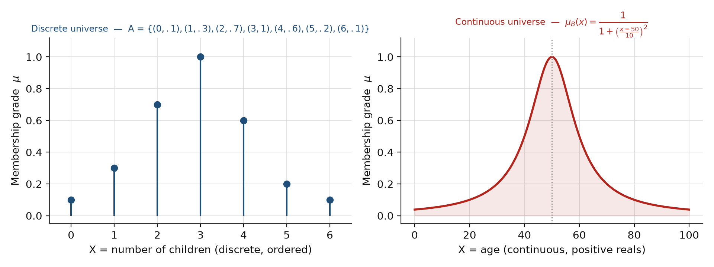
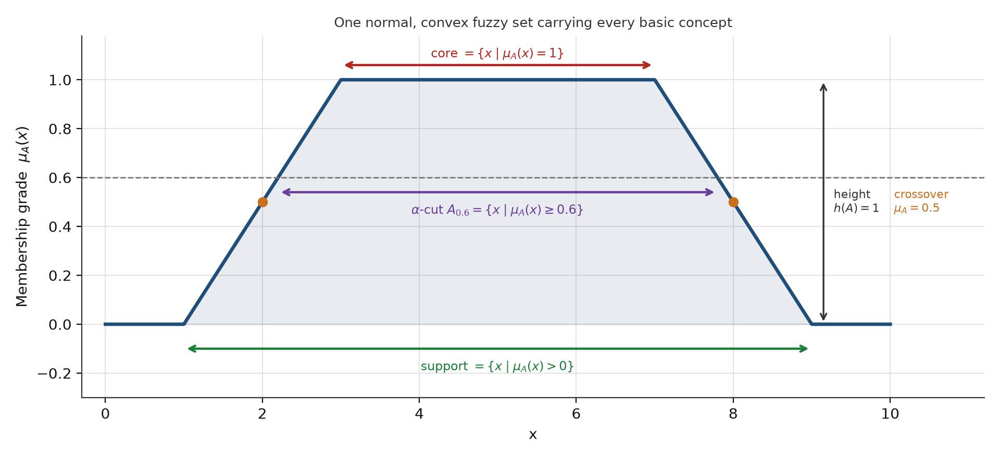
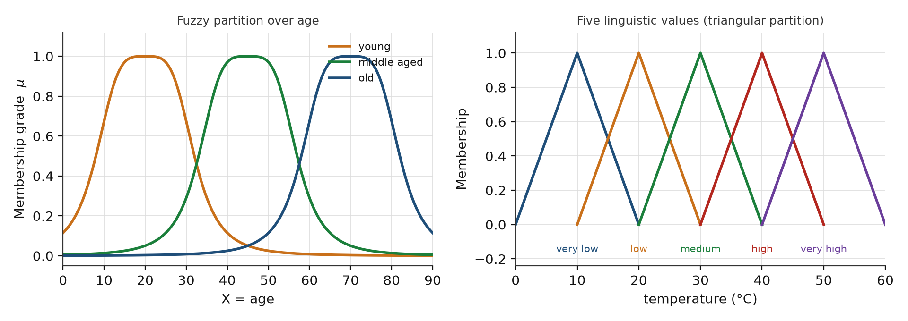
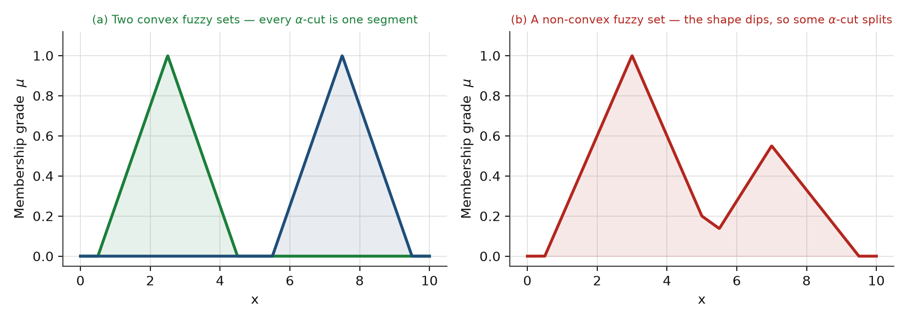
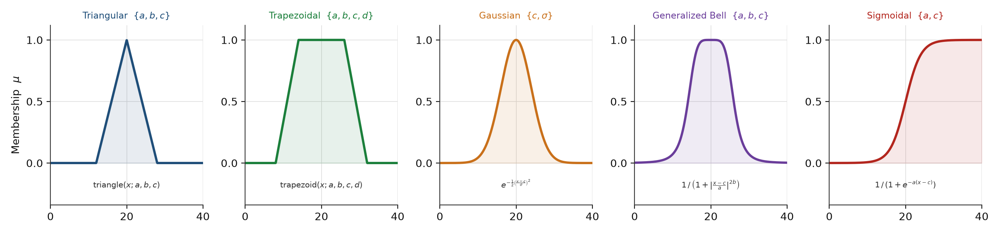

# Soft Computing — Fuzzy Logic Systems · الجزء الثاني

> **نوع المحتوى:** تمهيد + فهرس

> **المصدر:** ملف المحاضرات الرسمي «Week 02-03 - Fuzzy Logic Systems.pdf» في مجلد المواد الخام — الصفحات **67–112** (المحاضرات 2 و3 الرسمية من موقع الدكتور).
> **موقع هذا الجزء:** الجزء الأول (الملزمة القديمة) غطّى الصفحات 1–66 (السلاسل الكلاسيكية، تعريف المجموعة الضبابية، تمثيلها). هذا الجزء يكمل النصف الثاني من نفس المصدر: **مفاهيم المجموعة الضبابية + دوال العضوية الهندسية**.
> **ميزان الأولوية (حسب كلام الدكتور):** القسمان **1 و 2 هما المطلوبان** — مفاهيم المجموعة الضبابية (support · core · α-cut · convexity · cardinality …) هي مادة الحفظ والامتحان. أما القسم **3 (دوال العضوية الهندسية) فللفهم والاطلاع فقط**، والدكتور صرّح أنه ليس للحفظ.
> **اللغة:** الشرح عربي–إنكليزي مدمج، والمصطلحات والمعادلات بالإنجليزية حصراً.
> **طريقة القراءة:** كل قسم يبدأ بجملة المصدر الإنجليزية، ثم شرح مفهومي عربي، ثم المعادلة، ثم ملاحظة امتحانية. الأشكال مرسومة من نفس المعادلات المطبوعة على السلايدات.

## المحتويات

| # | القسم | المصدر |
|:--:|:---|:---|
| 1 | تمثيل المجموعة الضبابية عبر أنواع الأكوان | ص 67–69 |
| 2 | المفاهيم الأساسية للمجموعة الضبابية (16 مفهوماً) | ص 72–98 |
| 3 | دوال العضوية الشائعة في الهندسة — **للاطلاع فقط (غير مطلوب للحفظ)** | ص 102–112 |
| 4 | ورقة الصيغ المركزة | تجميع |
| 5 | أسئلة الدكتور المحتملة — نماذج أجوبة | تجميع |
| 6 | Retrieval set — استدعاء نشط | تجميع |

---

# 1. تمثيل المجموعة الضبابية عبر أنواع الأكوان (ص 67–69)

> **نوع المحتوى:** شرح + تعداد

نفس المجموعة الضبابية ممكن تعيش بثلاثة أنواع أكوان (universes)، ونوع الكون هو اللي يحدد **شلون نكتبها وشلون نرسمها**:

> **ملاحظة ربط:** قواعد الصيغة البديلة (Σ و ∫) ورمزية «/» مشروحة في **الجزء الأول §4.4**؛ وهنا **الأمثلة المحلولة** على الحالات الثلاث. لا تكرار — توزيع.

| نوع الكون | العناصر | الرسم | طريقة الكتابة |
|:---|:---|:---|:---|
| Discrete **non-ordered** | أسماء / تسميات بلا ترتيب طبيعي | نقاط منفصلة بلا محور مرتّب | زوج (عنصر، درجة) |
| Discrete **ordered** | أعداد أو قيم مرتّبة | محور متقطع + أعمدة | زوج (عنصر، درجة) |
| **Continuous** | فترة حقيقية | منحنى متصل | دالة عضوية صريحة |

## 1.1 الكون المتقطّع غير المرتّب (ص 67)

> *Fuzzy set C = “desirable city to live in”. X = {Tehran, Tabriz, Rasht} (discrete and non-ordered). C = {(Tehran, 0.1), (Tabriz, 0.8), (Rasht, 0.9)}.*

العناصر أسماء مدن — ما إلها ترتيب طبيعي، فما نكدر نرسمها على محور متصل ولا نرتبها تصاعدياً. نكتفي بكتابة الأزواج.

## 1.2 الكون المتقطّع المرتّب (ص 67)

> *Fuzzy set A = “sensible number of children in a family”. X = {0, 1, 2, 3, 4, 5, 6} (discrete ordered universe). A = {(0, .1), (1, .3), (2, .7), (3, 1), (4, .6), (5, .2), (6, .1)}.*

هنا العناصر أعداد صحيحة، إلها ترتيب → نرسمها كأعمدة (stem) على محور.

## 1.3 الكون المستمر (ص 68)

> *Fuzzy set B = “about 50 years old”. X = Set of positive real numbers (continuous). B = {(x, μ_B(x)) | x ∈ X}.*

$$\mu_B(x) = \frac{1}{1 + \left(\dfrac{x - 50}{10}\right)^{2}}$$

لاحظ: المنحنى ذروته عند $x = 50$ ودرجته $1$، ويقترب من الصفر كلما ابتعدنا — هذا شكل جرسي (bell-like) وليس مثلثياً.

## 1.4 الصيغة البديلة للتمثيل (ص 69)

> *If X is discrete then à = Σ μ_Ã(x_i) / x_i. If X is continuous then à = ʃ μ_Ã(x) / x.*

$$\tilde{A} = \sum_{i} \frac{\mu_{\tilde A}(x_i)}{x_i} \quad (\text{discrete}) \qquad\qquad \tilde{A} = \int_X \frac{\mu_{\tilde A}(x)}{x} \quad (\text{continuous})$$

**مصيدة الامتحان الأولى (وهي الأخطر بالجزء هذا):** علامة القسمة `/` هنا **ليست عملية قسمة رياضية** — هي **فاصل** بين الدرجة والعنصر (تُقرأ «درجة على عنصر»). مجموع/تكامل في هذي الصيغة **رمزي**، مو حسابي.

أمثلة السلايد مطبّقة:

| الحالة | الصيغة البديلة |
|:---|:---|
| A (متقطع) | $A = 0.1/0 + 0.3/1 + 0.7/2 + 1.0/3 + 0.7/4 + 0.3/5 + 0.1/6$ |
| C (متقطع) | $C = 0.9/\text{San Francisco} + 0.8/\text{Boston} + 0.6/\text{Los Angeles}$ |
| B (مستمر) | $B = \displaystyle\int_{\mathbb{R}} \frac{1}{1+\left(\frac{x-50}{10}\right)^{2}} \Big/ x$ |

> **ملاحظة على المصدر (تناقض داخلي حقيقي — تحقّقت منه بصرياً):** المجموعة $A$ تظهر بقيمتين مختلفتين على سلايدين متجاورين. ص 67 تكتب $(4,\mathbf{.6}),(5,\mathbf{.2})$، بينما ص 69 (وص 71 في التمرين) تكتب $(4,\mathbf{0.7}),(5,\mathbf{0.3})$. الفرق فقط بالعنصرين 4 و5. **ما أكو «نسخة صحيحة» وأخرى غلط** — كل نسخة صحيحة بالنسبة لسلايدها؛ فإذا سُئلت، انقل القيم كما وردت في السلايد اللي عليه السؤال. (هذا نمط شائع بسلايدات الدكتور: نفس المثال يتكرر بأرقام مختلفة — لاحظ دائماً.)

## 1.5 تمرينا البيت 4 و5 مع الحل (ص 70–71)

> **نوع المحتوى:** تعداد فقط (النص الإنجليزي أولاً، ثم التصحيحات والتعليق العربي في بلوك مستقل)

**HOME TASK 4** — *Give examples of fuzzy sets with: (i) discrete non-ordered universe, (ii) discrete ordered universe, (iii) continuous universe.*

الحل: المثالان (i) و (ii) موجودان حرفياً في ص 67 (C للمدن، A لعدد الأطفال)، والمثال (iii) في ص 68 (B للعمر).

**HOME TASK 5** — *Represent the alternative notation of the following fuzzy sets.*

| # | المعطى |
|:--:|:---|
| 1 | $A = \{(0,0.1),(1,0.3),(2,0.7),(3,1),(4,0.7),(5,0.3),(6,0.1)\}$ |
| 2 | $C = \{(\text{Delhi},0.5),(\text{Mumbai},0.7),(\text{Kolkata},0.6),(\text{Chennai},0.2),(\text{Bhubaneswar},0.9)\}$ |
| 3 | $\mu_A(x) = \dfrac{1}{1+x^{2}}$ — معطاة داخل **مربّع مظلّل** على السلايد (كون مستمر) |

الحل:

$$A = 0.1/0 + 0.3/1 + 0.7/2 + 1.0/3 + 0.7/4 + 0.3/5 + 0.1/6$$
$$C = 0.5/\text{Delhi} + 0.7/\text{Mumbai} + 0.6/\text{Kolkata} + 0.2/\text{Chennai} + 0.9/\text{Bhubaneswar}$$
$$A_3 = \int_{\mathbb{R}} \frac{1}{1+x^{2}} \Big/ x$$

**كيف نعرف أن البند 3 كون مستمر؟** لأن الدالة معطاة **بصيغة مغلقة على $\mathbb{R}$** (مو قائمة عناصر) → كون مستمر → نستعمل التكامل لا المجموع. لاحظ أيضاً أن $1/(1+x^2)$ هي نفسها صيغة دالة كوشي المذكورة في القسم 3 (الجرسية المعمّمة عند $a=b=1$، $c=0$) — نفس العائلة، وتفسيرها الهندسي جرسي.

---

# 2. المفاهيم الأساسية للمجموعة الضبابية (ص 72–98)

> **نوع المحتوى:** شرح + تعريف

هذا القسم هو **قلب الامتحان**، لأنه كله مصطلحات ومعادلات قصيرة قابلة للحفظ المباشر. القائمة الرسمية على ص 72:

| المفهوم | المصطلح |
|:---|:---|
| متغيّر لغوي / قيمة لغوية | Linguistic variable / Linguistic value |
| الحامل | Support |
| اللبّ | Core |
| الطبيعية | Normality |
| نقطة التقاطع | Crossover point |
| المفرد الضبابي | Fuzzy singleton |
| القطع-α و القطع-α القوي | α-cut and strong α-cut |
| التحدّب | Convexity |
| الأعداد الضبابية | Fuzzy numbers |
| عرض الحزمة | Bandwidth |
| التناظر | Symmetricity |
| مفتوح يسار/يمين/مغلق | Open left or right, closed |

الشكل التالي يجمع **كل** هذه المفاهيم على مجموعة ضبابية واحدة طبيعية ومحدّبة — احفظه كخريطة بصرية:

## 2.1 التقسيم الضبابي (Fuzzy Partition) — ص 73–74

> *Fuzzy partitions formed by the linguistic values “young”, “middle aged”, and “old”.* / *… “very low”, “low”, “medium”, “high”, and “very high”.*

**المعنى:** التقسيم الضبابي هو مجموعة دوال عضوية على **نفس الكون** تغطي المجال كله، وتسمح بالتداخل بين الفئات. خلافاً للتقسيم الكلاسيكي (كل عنصر بفئة واحدة فقط)، هنا العنصر الواحد ممكن ينتمي لأكثر من فئة بدرجات مختلفة.

**ملاحظة دقيقة:** مجموع درجات الانتماء عند أي نقطة **ليس بالضرورة يساوي 1** — لأن العضوية ليست احتمالاً. التداخل شرط طبيعي، وليس خطأ.

## 2.2 المتغيّر اللغوي والقيمة اللغوية — ص 75

> *Linguistic variable: In the first example “age” and in the second one “temperature” are linguistic variables.*
> *Linguistic value: In the first example “young” and in the second one “high” are linguistic values.*

| المصطلح | التعريف | مثالنا |
|:---|:---|:---|
| **Linguistic variable** | المتغيّر الأساسي اللي نصفه | `age` · `temperature` |
| **Linguistic value** | الحالة الوصفية المنتمية لذلك المتغيّر | `young` · `high` |

يعني: `age` هو المتغيّر اللغوي، و `young` قيمة لغوية **له**. سؤال شائع: «شنو الفرق؟» — الجواب: المتغيّر هو الشي اللي نقيسه، والقيمة هي الوصف الضبابي لأحد أحواله.

## 2.3 الحامل (Support) — ص 76–77

> *Support: The support of a fuzzy set A is the set of all points x ∈ X such that μ_A(x) > 0.*
> *In other words: support(A) = {x | μ_A(x) > 0}.*

$$\mathrm{support}(A) = \{x \mid \mu_A(x) > 0\}$$

**بالعربي:** الحامل = كل العناصر اللي **عضويّتها أكبر من صفر** (ولو بقليل). خارج الحامل، العضوية صفر تماماً. الحامل **مجموعة كلاسيكية (crisp)**، مو ضبابية.

## 2.4 اللبّ (Core) — ص 78–79

> *Core: The core of a fuzzy set A is the set of all points x in X such that μ_A(x) = 1.*
> *In other words: core(A) = {x | μ_A(x) = 1}.*

$$\mathrm{core}(A) = \{x \mid \mu_A(x) = 1\}$$

**بالعربي:** اللبّ = العناصر اللي عضويتها **كاملة (1)**. إذا اللبّ فاضي، المجموعة **subnormal**.

**الفرق الجوهري (سؤال امتحان دائم):** الحامل يستعمل `>` واللبّ يستعمل `=` مع القيمة 1. الحامل أوسع دائماً، واللبّ داخله.

## 2.5 المجموعة الضبابية الفارغة (Empty Fuzzy Set) — ص 80

> *A fuzzy set (A = ∅) is empty if its membership function is zero everywhere in its universe of discourse.*

$$A = \varnothing \quad \Longleftrightarrow \quad \mu_A(x) = 0,\ \forall x \in X$$

> *An empty fuzzy set has an empty support.*

**بالعربي:** فارغة = العضوية صفر بكل الكون. النتيجة المباشرة: حاملها فاضي.

## 2.6 الطبيعية (Normality) — ص 81–82

> *Normality: A fuzzy set A is normal if its core is non-empty. In other words, we can always find a point x ∈ X such that μ_A(x) = 1.*

$$\text{A is normal} \iff \exists x \in X:\ \mu_A(x) = 1$$

**بالعربي:** المجموعة **normal** إذا أكو عنصر عضويته 1 (يعني اللبّ مو فاضي). إذا أعلى عضوية أقل من 1 → **subnormal**. هذا هو نفس مفهوم الارتفاع (Height) بالأسفل، بس مصوغ بطريقة مختلفة.

## 2.7 نقطة التقاطع (Crossover Point) — ص 83–84

> *Crossover point: A crossover point of a fuzzy set A is a point x ∈ X at which μ_A(x) = 0.5.*
> *In other words: crossover(A) = {x | μ_A(x) = 0.5}.*

$$\mathrm{crossover}(A) = \{x \mid \mu_A(x) = 0.5\}$$

**بالعربي:** نقطة التقاطع = النقطة اللي العضوية عندها **بالضبط 0.5** — نقطة «الحياد». لمجموعة طبيعية محدّبة أكو **نقطتا تقاطع** (وحدة على كل جاني)، وهما اللي يحددان عرض الحزمة.

## 2.8 المفرد الضبابي (Fuzzy Singleton) — ص 85–86

> *Fuzzy singleton: A fuzzy set whose support is a single point in X with μ_A(x) = 1 is called a fuzzy singleton. That is |A| = |{x | μ_A(x) = 1}| = 1.*
> *Example: a fuzzy singleton “45 years old”.*

$$\text{singleton} \iff \mathrm{support}(A) = \{x_0\} \ \text{ and }\ \mu_A(x_0) = 1 \iff |A| = 1$$

**بالعربي:** المفرد الضبابي = مجموعة ضبابية «متحوّلة لنقطة»: حاملها نقطة وحدة وعضويتها 1. عملياً يكافئ قيمة رقمية صريحة، بس بصيغة ضبابية — مثال السلايد: «45 years old» (بالضبط 45، مو «حوالي 45»).

## 2.9 الارتفاع (Height) — ص 87–88

> *The height of a fuzzy set A is the largest membership grade obtained by any element in that set.*
> *A fuzzy set A is called normal when h(A) = 1. It is called subnormal when h(A) < 1. The height of A may also be viewed as the supremum of α for which A_α ≠ ∅.*

$$h(A) = \sup_{x \in X} \mu_A(x) \qquad\text{(ص 87)} \qquad\qquad H_A = \max_{x \in X}\{\mu_A(x)\} \qquad\text{(ص 88)}$$

**ملاحظة دقة (مو خطأ):** ص 87 يكتبها `sup` وص 88 يكتبها `max`. الفرق يظهر فقط إذا الكون لا نهائي وما يتحقق فيه الأعلى؛ **على كون منتهٍ (حالتنا) الاثنان متطابقان**.

## 2.10 القطع-α والقطع-α القوي (α-cut & strong α-cut) — ص 89–90

> *The α-cut of a fuzzy set A is a crisp set defined by:* $A_\alpha = \{x \mid \mu_A(x) \geq \alpha\}$
> *Strong α-cut is defined similarly:* $A'_\alpha = \{x \mid \mu_A(x) > \alpha\}$
> *Note: support(A) = A'_0 and core(A) = A_1.*

$$A_\alpha = \{x \mid \mu_A(x) \geq \alpha\} \qquad\qquad A'_\alpha = \{x \mid \mu_A(x) > \alpha\}$$

**بالعربي:** الـ α-cut يحوّل المجموعة **الضبابية** إلى مجموعة **كلاسيكية** عند مستوى α — ناخذ العناصر اللي عضويتها توصل α أو تزيد. الفرق الوحيد بين $A_\alpha$ و $A'_\alpha$ هو **علامة `=`**: هل نضمّ العناصر اللي عضويتها **بالضبط α** أو لا.

**جسر مهم:** هذا هو الجسر بين الجزئين — الدالة الضبابية تُختزل إلى مجموعة من المجموعات الكلاسيكية المتداخلة كلما ارتفع α. وعليه:

$$\mathrm{support}(A) = A'_0 \qquad\qquad \mathrm{core}(A) = A_1$$

## 2.11 التحدّب (Convexity) — ص 91–92

> *A fuzzy set A is convex if and only if for any x₁ and x₂ ∈ X and any λ ∈ [0, 1]:*
> $$\mu_A(\lambda x_1 + (1 - \lambda)x_2) \geq \min(\mu_A(x_1), \mu_A(x_2))$$
> *Note: A is convex if all its α-level sets are convex. Convexity (A_α) ⟹ A_α is composed of a single line segment only.*

**بالعربي:** التحدّب = **ما عندك «وادي» داخل الشكل**. المعنى الحسّي: لأي نقطتين، القيمة على أي نقطة بينهم لازم تكون **≥ الأصغر من القيمتين** — يعني ما ينزل خط العضوية تحت الأصغر بينهما. القمة الوحيدة المسموحة.

**التكافؤ الثاني (مهم جداً):** A محدّبة ⟺ **كل** مجموعات α-cut مالها محدّبة. هذا يخليك تفحص التحدّب بمجموعات كلاسيكية بدل دوال — أسهل بمراحل.

## 2.12 عرض الحزمة (Bandwidth) — ص 93–94

> *For a normal and convex fuzzy set, the bandwidth (or width) is defined as the distance between its two unique crossover points:*
> $$\mathrm{Bandwidth}(A) = |x_1 - x_2| \quad\text{where } \mu_A(x_1) = \mu_A(x_2) = 0.5$$

**بالعربي:** العرض = المسافة بين **نقطتي التقاطع** (اللي عضويتهم 0.5). لاحظ شرط التعريف: **معرّف فقط للمجموعة الطبيعية والمحدّبة** — عندها تكون نقطتا التقاطع وحيدتين.

## 2.13 العدد الضبابي (Fuzzy Number) — ص 95

> *A fuzzy number A is a fuzzy set that satisfies the condition for normality and convexity. Most fuzzy sets in the literature satisfy these conditions, and thus most fuzzy sets are fuzzy numbers.*

$$\text{Fuzzy number} = \text{normal} \ \wedge \ \text{convex}$$

**بالعربي:** العدد الضبابي = مجموعة ضبابية **طبيعية + محدّبة** معاً. سؤال امتحان كلاسيكي: «شنو شرطا العدد الضبابي؟» → normality و convexity.

## 2.14 التناظر (Symmetry) — ص 95–96

> *A fuzzy set A is symmetric if its membership function around a certain point x = c, namely μ_A(c + x) = μ_A(c − x) for all x ∈ X.*

$$\mu_A(c + x) = \mu_A(c - x) \quad \forall x \in X$$

**بالعربي:** متناظرة حول محور `c` إذا الانحراف يمين c ويسار c يعطي نفس الدرجة. مثال السلايد: دالة الجرس حول `c = 50` متناظرة.

## 2.15 مفتوح يسار / مفتوح يمين / مغلق — ص 97

> *Open left: if lim_{x→−∞} μ_A(x) = 1 and lim_{x→+∞} μ_A(x) = 0.*
> *Open right: if lim_{x→−∞} μ_A(x) = 0 and lim_{x→+∞} μ_A(x) = 1.*
> *Closed: if lim_{x→−∞} μ_A(x) = lim_{x→+∞} μ_A(x) = 0.*

| النوع | عند $x \to -\infty$ | عند $x \to +\infty$ | الشكل |
|:---|:---:|:---:|:---|
| **Open left** | 1 | 0 | ينزل من اليسار نحو اليمين |
| **Open right** | 0 | 1 | يصعد من اليسار نحو اليمين |
| **Closed** | 0 | 0 | جرس/مثلث: صفر بالطرفين |

**بالعربي:** التصنيف يعتمد على سلوك العضوية عند الأطراف (على اللانهاية)، مو على شكل المنطقة الوسطى.

## 2.16 الأصالة العددية (Cardinality) — ص 98

> *The cardinality |A| of a fuzzy set A is defined as:* $|A| = \sum_{x \in X} \mu(x)$
> *The relative cardinality of A is defined as:* $\|A\| = \dfrac{|A|}{|X|}$

**بالعربي (مصيدة):** أصالة المجموعة الضبابية = **مجموع درجات العضوية**، مو **عدد** العناصر. و«الأصالة النسبية» تقسم على عدد عناصر الكون فتصير نسبة في [0,1].

## 2.17 الجدول الجامع + مصائد الامتحان

| المفهوم | المعادلة | مفتاح الحفظ |
|:---|:---|:---|
| **Support** | $\{x \mid \mu_A(x) > 0\}$ | كل شي فوق الصفر |
| **Core** | $\{x \mid \mu_A(x) = 1\}$ | العضوية الكاملة |
| **Empty** | $\mu_A(x) = 0\ \forall x$ | صفر بكل الكون |
| **Normal** | $\exists x:\ \mu_A(x) = 1$ | اللبّ مو فاضي |
| **Crossover** | $\mu_A(x) = 0.5$ | نقطة الحياد |
| **Singleton** | $|A| = 1$, support نقطة | نقطة وحدة بكامل العضوية |
| **Height** | $h(A) = \sup_x \mu_A(x)$ | أعلى درجة موجودة |
| **α-cut** | $\{x \mid \mu_A(x) \geq \alpha\}$ | مع «يساوي» |
| **Strong α-cut** | $\{x \mid \mu_A(x) > \alpha\}$ | بلا «يساوي» |
| **Convex** | $\mu_A(\lambda x_1 + (1-\lambda)x_2) \geq \min(\mu_A(x_1), \mu_A(x_2))$ | بلا وادي |
| **Bandwidth** | $\lvert x_1 - x_2 \rvert$ عند $\mu = 0.5$ | المسافة بين نقطتي التقاطع |
| **Fuzzy number** | normal + convex | الاثنان معاً |
| **Symmetric** | $\mu_A(c+x) = \mu_A(c-x)$ | تناظر حول c |
| **Cardinality** | $\sum_x \mu(x)$ | مجموع الدرجات، لا عدد العناصر |

**مصائد الامتحان:**

| # | المصيدة | التصحيح |
|:--:|:---|:---|
| 1 | `support` مقابل `core` | `support` تستعمل `> 0`، أما `core` فتستعمل `= 1` — لا تخلط العلامتين. |
| 2 | `α-cut` مقابل `strong α-cut` | الأولى تستعمل `≥ α` والثانية `> α`؛ الفرق هو العناصر ذات العضوية `= α` بالضبط. |
| 3 | `cardinality` | هي **مجموع الدرجات**، مو عدد العناصر (الفرق يظهر جلياً في تمرين البيت 6). |
| 4 | `bandwidth` | معرّف فقط عندما تكون المجموعة **normal و convex**. |
| 5 | `membership` مقابل `probability` | الدرجة تعبّر عن **درجة الانتماء**، لا عن احتمال. |
| 6 | التقسيم الضبابي | يسمح بالتداخل، ومجموع الدرجات **ليس** بالضرورة 1. |

## 2.18 تمرين البيت 6 مع الحل الكامل (ص 99–101)

> **نوع المحتوى:** تعداد + حل حسابي كامل

**المعطيات:** $X = \{5,10,20,30,40,50,60,70,80,90\}$ (عمر).

$$young = \{(5,1),(10,1),(20,0.8),(30,0.5),(40,0.2),(50,0.1),(60,0),(70,0),(80,0),(90,0)\}$$
$$old = \{(5,0),(10,0),(20,0.1),(30,0.2),(40,0.4),(50,0.6),(60,0.8),(70,1),(80,1),(90,1)\}$$

**المطلوب والحل:**

| # | المطلوب | الحل | القاعدة |
|:--:|:---|:---|:---|
| 1 | support(young) | $\{5,10,20,30,40,50\}$ | $\mu > 0$ |
| 2 | support(old) | $\{20,30,40,50,60,70,80,90\}$ | $\mu > 0$ |
| 3 | core(young) | $\{5,10\}$ | $\mu = 1$ |
| 4 | core(old) | $\{70,80,90\}$ | $\mu = 1$ |
| 5 | $young_{0.2}$ | $\{5,10,20,30,40\}$ | $\mu \geq 0.2$ |
| 6 | $young'_{0.2}$ | $\{5,10,20,30\}$ | $\mu > 0.2$ |
| 7 | $young_{0.8}$ | $\{5,10,20\}$ | $\mu \geq 0.8$ |
| 8 | $young'_{0.8}$ | $\{5,10\}$ | $\mu > 0.8$ |
| 9 | $young_{1}$ | $\{5,10\}$ | $\mu \geq 1$ |
| 10 | $old_{0.4}$ | $\{40,50,60,70,80,90\}$ | $\mu \geq 0.4$ |
| 11 | $old'_{0.4}$ | $\{50,60,70,80,90\}$ | $\mu > 0.4$ |
| 12 | $old_{0.6}$ | $\{50,60,70,80,90\}$ | $\mu \geq 0.6$ |
| 13 | $old_{1}$ | $\{70,80,90\}$ | $\mu \geq 1$ |
| 14 | $\lvert young \rvert$ | $3.6$ | مجموع الدرجات |
| 15 | $\lvert old \rvert$ | $5.1$ | مجموع الدرجات |

**تفصيل الحساب (لازم تعرف تكتبه ورقة):**

$$|young| = 1 + 1 + 0.8 + 0.5 + 0.2 + 0.1 + 0 + 0 + 0 + 0 = 3.6$$
$$|old| = 0 + 0 + 0.1 + 0.2 + 0.4 + 0.6 + 0.8 + 1 + 1 + 1 = 5.1$$

**فخّان في هذا التمرين تحديداً:**

- البند 5: العضوية `0.2` عند العمر `40` — بما أن الشرط `≥` فهي **داخلة**. لو كان strong α-cut (البند 6) فهي **خارجة**. هذا هو الفرق العملي بين البندين 5 و6، وبين 7 و8.
- البند 14/15: `|young|` ليست عدد عناصر الحامل (6 عناصر)، بل **مجموع الدرجات** (3.6). أكو فرق ~نصف.

---

# 3. دوال العضوية الشائعة في الهندسة (ص 102–112) — للاطلاع فقط

> **نوع المحتوى:** تعداد + تعريف (مستوى اطّلاع)

> **⚠️ تنبيه الدكتور — وهذا يحكم طريقة مذاكرتك:** أنواع دوال العضوية هذه **للفهم والاطلاع فقط، وليست للحفظ**. الدكتور صرّح بذلك: تفيدك في **البحث مستقبلاً**، ولا ندخل حالياً في عمقها. المطلوب منك الآن أن تعرف **أسماءها وأشكالها** وتفهم فكرة «المعاملات التي تشكّل الشكل» — **لا تحفظ صيغها ولا معاملاتها**.

> *In the following, we try to parameterize the different MFs on a continuous universe of discourse.*

**الفكرة الوحيدة المطلوبة منك:** كل دالة عضوية تُعرَّف بـ **معاملات (parameters)** تحدد شكل منحناها، واسمها يأتي من شكل المنحنى. هذا كل شي يخصّك هسه.

**جدول مرجعي (للاطلاع — مو للحفظ):**

| النوع | الصيغة | المعاملات | الشكل |
|:---|:---|:---|:---|
| Triangular | $\mathrm{triangle}(x;a,b,c)$ — خطان مستقيمان يلتقيان عند قمة واحدة | $a,b,c$ | مثلث |
| Trapezoidal | $\mathrm{trapezoid}(x;a,b,c,d)$ — كالمثلث لكن بقمة مسطّحة | $a,b,c,d$ | شبه منحرف |
| Gaussian | $e^{-\frac{1}{2}\left(\frac{x-c}{\sigma}\right)^{2}}$ | $c,\ \sigma$ | جرس ناعم |
| Generalized Bell (Cauchy) | $\dfrac{1}{1+\left|\dfrac{x-c}{a}\right|^{2b}}$ | $a,b,c$ | جرس مرن |
| Sigmoidal | $\dfrac{1}{1+e^{-a(x-c)}}$ | $a,c$ | منحنى انتقال أحادي الاتجاه (ليس جرساً) |

**قراءة المعاملات (فكرة عامة):** المركز (centre) يحدد موضع القمة، والعرض (width) يحدد اتساعها، والميل (slope) يحدد حِدّة الجانبين. نفس الفكرة تتكرر بأسماء مختلفة بين الأنواع — ولهذا تُسمّى المعاملات بحروف مختلفة في كل نوع.

**ملاحظة ختامية:** تظهر على ص 112 أسماء هذه الدوال كما في MATLAB (`trimf`, `trapmf`, `gaussmf`, `gbellmf`, `smf`, `dsigmf`, `psigmf`) — معرفتها مفيدة للبحث العملي لاحقاً، وليست مطلوبة منك الآن.

> **ربط فقط (اختياري):** الدالة الكاوسية هنا هي نفس عائلة الدالة اللي شفتها بمثال «about 50 years old» في ص 68 — نفس الشكل الجرسي. هذا يوضّح أن دوال العضوية هي مجرد **أشكال هندسية معروفة**، مو شي غريب.

---

# 4. ورقة الصيغ المركزة (Formula Sheet)

> **نوع المحتوى:** تعداد فقط

$$\mathrm{support}(A) = \{x \mid \mu_A(x) > 0\}$$
$$\mathrm{core}(A) = \{x \mid \mu_A(x) = 1\}$$
$$A = \varnothing \iff \mu_A(x) = 0,\ \forall x \in X$$
$$\text{normal} \iff \exists x:\ \mu_A(x) = 1$$
$$\mathrm{crossover}(A) = \{x \mid \mu_A(x) = 0.5\}$$
$$h(A) = \sup_{x \in X} \mu_A(x) = \max_{x \in X} \mu_A(x)\ \text{(finite } X\text{)}$$
$$A_\alpha = \{x \mid \mu_A(x) \geq \alpha\} \qquad A'_\alpha = \{x \mid \mu_A(x) > \alpha\}$$
$$\mathrm{support}(A) = A'_0 \qquad \mathrm{core}(A) = A_1$$
$$\text{convex} \iff \mu_A(\lambda x_1 + (1-\lambda)x_2) \geq \min\!\big(\mu_A(x_1), \mu_A(x_2)\big),\ \lambda \in [0,1]$$
$$\mathrm{bandwidth}(A) = |x_1 - x_2|,\quad \mu_A(x_1) = \mu_A(x_2) = 0.5$$
$$\text{fuzzy number} = \text{normal} \wedge \text{convex}$$
$$\text{symmetric} \iff \mu_A(c + x) = \mu_A(c - x)$$
$$|A| = \sum_{x \in X} \mu_A(x) \qquad \|A\| = \frac{|A|}{|X|}$$

**أدناه للاطلاع فقط (غير مطلوب للحفظ — دوال العضوية الهندسية):**

$$\mathrm{triangle}(x;a,b,c),\quad \mathrm{trapezoid}(x;a,b,c,d),\quad \mathrm{gaussian}(x;c,\sigma)$$
$$\mathrm{bell}(x;a,b,c) = \frac{1}{1+\left|\frac{x-c}{a}\right|^{2b}} \qquad \mathrm{sigmf}(x;a,c) = \frac{1}{1+e^{-a(x-c)}}$$

---

# 5. أسئلة الدكتور المحتملة — نماذج أجوبة

> **نوع المحتوى:** نقاط + شرح

| السؤال | نموذج الجواب |
|:---|:---|
| عرّف الـ support والـ core. | The support of a fuzzy set A is the set of all points x ∈ X with μ_A(x) > 0. The core is the set of all points with μ_A(x) = 1. The core is always contained in the support. |
| ما شرطا العدد الضبابي (fuzzy number)؟ | A fuzzy number is a fuzzy set that satisfies **normality** and **convexity** simultaneously. |
| ما الفرق بين α-cut و strong α-cut؟ | $A_\alpha = \{x \mid \mu_A(x) \geq \alpha\}$ (يضم القيم المساوية لـ α)، أما $A'_\alpha = \{x \mid \mu_A(x) > \alpha\}$ (يستثنيها). ونتيجتان مهمّتان: support(A) = A'₀ و core(A) = A₁. |
| عرّف cardinality للمجموعة الضبابية. | It is the sum of the membership grades over the universe: $|A| = \sum_{x \in X} \mu_A(x)$, not the count of elements. The relative cardinality is $\|A\| = |A|/|X|$. |
| علّق على المجموعة الضبابية المحدّبة، وكيف نفحص تحدّبها؟ | A fuzzy set is convex iff μ_A(λx₁ + (1−λ)x₂) ≥ min(μ_A(x₁), μ_A(x₂)) for all λ ∈ [0,1]. Equivalently, A is convex iff **all** its α-cuts are convex (each α-cut is a single line segment). |
| ما الفرق بين التقسيم الكلاسيكي والتقسيم الضبابي؟ | In a classical partition each element belongs to exactly one class; in a fuzzy partition an element can belong to several classes with different grades, and the grades do not have to sum to one. |

---

## Retrieval set

**[RS-F2-01]** What is the support of a fuzzy set, and how does it differ from the core?
> support(A) = {x | μ_A(x) > 0} — every element with any positive grade. core(A) = {x | μ_A(x) = 1} — only full members. The core is a subset of the support.

**[RS-F2-02]** State the two conditions that make a fuzzy set a fuzzy number.
> It must be **normal** (its core is non-empty, i.e. some x has μ_A(x) = 1) **and convex** (no dip; μ_A(λx₁+(1−λ)x₂) ≥ min(μ_A(x₁), μ_A(x₂))).

**[RS-F2-03]** Write the α-cut and the strong α-cut, and give two special cases.
> A_α = {x | μ_A(x) ≥ α} and A'_α = {x | μ_A(x) > α}. Special cases: support(A) = A'₀ and core(A) = A₁.

**[RS-F2-04]** How is the cardinality of a fuzzy set defined, and why is it not the number of elements?
> |A| = Σ_{x∈X} μ_A(x) — the sum of the membership grades. Relative cardinality ‖A‖ = |A| / |X|. It is a sum of grades, not a count, so it is generally not an integer.

**[RS-F2-05]** What is the crossover point, and what does bandwidth measure?
> The crossover point is any x with μ_A(x) = 0.5. For a normal and convex fuzzy set, the bandwidth is the distance between its two unique crossover points: bandwidth(A) = |x₁ − x₂| with μ_A(x₁) = μ_A(x₂) = 0.5.

**[RS-F2-06]** In the alternative notation à = Σ μ(x_i)/x_i, what does the slash mean?
> The slash is a **separator** (grade-over-element), not division, and the summation is symbolic. This is the single most common trap in the representation section.

**[RS-F2-07]** For X = {5,10,20,30,40,50,60,70,80,90} with young = {(5,1),(10,1),(20,0.8),(30,0.5),(40,0.2),(50,0.1),(60,0),…}: find support(young), core(young) and |young|.
> support(young) = {5,10,20,30,40,50}; core(young) = {5,10}; |young| = 1+1+0.8+0.5+0.2+0.1 = 3.6.

**[RS-F2-08]** What distinguishes a discrete ordered universe from a discrete non-ordered one, with one example of each?
> Ordered: elements have a natural order and can be plotted on an axis — e.g. X = {0,1,2,3,4,5,6} for "sensible number of children". Non-ordered: labels with no natural order — e.g. X = {Tehran, Tabriz, Rasht} for "desirable city to live in".

**[RS-F2-09]** Define a fuzzy singleton and give the slide's example.
> A fuzzy set whose support is a single point x₀ with μ_A(x₀) = 1, so |A| = 1. Slide example: "45 years old".

---

*المصدر: المحاضرتان الرسميتان 2 و3، من الصفحة 67 إلى الصفحة 112 من ملف المحاضرات الرسمي.*

*الجزء الأول (من الصفحة 1 إلى الصفحة 66) هو ملزمة مستقلة تكمل هذه؛ الأشكال مرسومة من نفس معادلات السلايدات.*
