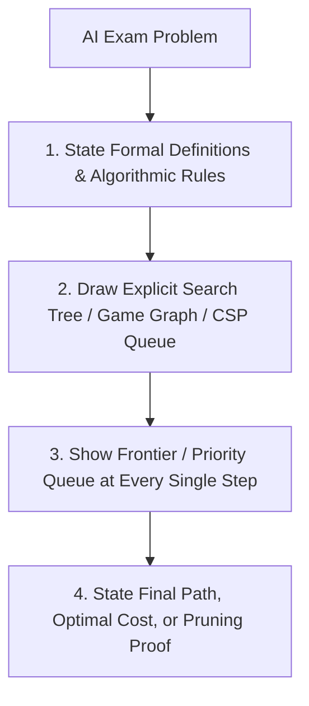

# 👨‍🏫 Instructor Dossier: Prof. Dr. Saif Ali Al-Saidi

> **Subject:** 🤖 Artificial Intelligence & Autonomous Agents (CS605)  
> **Academic Rank:** Full Professor (*أستاذ دكتور*)  
> **Faculty:** College of Computer Science & Information Technology, University of Wasit  
> **Lecture Slot:** Tuesday, 10:30 AM – 01:30 PM (3 Credit Hours / 3 Contact Hours)  
> **Status:** Active Coursework Instructor (Semester 1, 2026–2027)

---

## 1. Professional Background & Academic Persona

Prof. Dr. Saif Ali Al-Saidi is a distinguished Full Professor and leading artificial intelligence authority specializing in state-space heuristic search, intelligent agent paradigms, constraint satisfaction problems (CSP), automated reasoning, and game-theoretic adversarial search.

Alongside Advanced Software Engineering, this 3-hour course forms the **core theoretical pillar of Semester 1**. Prof. Dr. Saif enforces a **rigorous mathematical and algorithmic standard** anchored in the world's preeminent AI reference: **Stuart Russell and Peter Norvig's** *Artificial Intelligence: A Modern Approach (AIMA)* (3rd/4th Edition).

Prof. Dr. Saif places immense importance on:
- Formal, unambiguous state space problem formulation ($\langle S_0, Actions(s), Result(s, a), GoalTest(s), PathCost \rangle$).
- Rigorous mathematical proofs of heuristic properties: **Admissibility** ($h(n) \le h^*(n)$), **Consistency / Monotonicity** ($h(n) \le c(n,a,n') + h(n')$), and **Heuristic Dominance**.
- Step-by-step manual tracing of graph and tree search algorithms with explicit frontier / explored set tracking.
- Precise trace of adversarial game trees with **Alpha-Beta Pruning** and exact $\alpha, \beta$ interval updates.
- Systematic constraint propagation algorithms (AC-3, Forward Checking, MRV heuristic).

---

## 2. Core Textbook & High-Yield Knowledge Domains

```
+-----------------------------------------------------------------------------------------------+
|                            PROF. DR. SAIF'S INTELLECTUAL PILLARS                              |
+===============================================================================================+
| 1. Primary Reference Book         | Russell & Norvig: "AI: A Modern Approach (AIMA)" (Pearson)|
| 2. Agent Architectures & PEAS     | Rational Agents, PEAS Framework, 5 Agent Typologies       |
| 3. Uninformed vs Informed Search  | BFS, DFS, UCS, A*, Admissibility & Consistency Proofs     |
| 4. Adversarial Search & Games     | Minimax, Alpha-Beta Pruning Bounds, MCTS Foundations      |
| 5. Constraint Satisfaction (CSP)  | Arc Consistency (AC-3), MRV, Degree, LCV Heuristics       |
| 6. Knowledge & Automated Logic    | FOL, Resolution Refutation, Unification Algorithm         |
+-----------------------------------------------------------------------------------------------+
```

### Key Theoretical Emphases

1. **The Rational Agent Paradigm & PEAS Framework:**
   - Formal definition of an Agent: $f: P^* \rightarrow A$ (mapping percept sequence history to actions).
   - **PEAS Specification:** Performance Measure, Environment, Actuators, Sensors.
   - **Environment Dimensions:** Fully vs. Partially Observable, Single vs. Multi-agent (Competitive vs. Cooperative), Deterministic vs. Stochastic, Episodic vs. Sequential, Static vs. Dynamic, Discrete vs. Continuous, Known vs. Unknown.
   - **Agent Typologies:** Simple Reflex, Model-Based Reflex, Goal-Based, Utility-Based, and Learning Agents.

2. **Heuristic Search Theory & Mathematical Proofs:**
   - **A\* Evaluation Function:** $f(n) = g(n) + h(n)$
   - **Admissibility Proof for Tree Search:** If $h(n)$ never overestimates the true cost to reach the goal ($0 \le h(n) \le h^*(n)$), A\* Tree Search is guaranteed to return an optimal solution.
   - **Consistency (Monotonicity) Proof for Graph Search:** For every node $n$ and successor $n'$ generated by action $a$:
     $$h(n) \le c(n, a, n') + h(n')$$
     *Consequence:* If $h(n)$ is consistent, the $f(n)$ values along any path are monotonically non-decreasing, and A\* Graph Search expands nodes in strictly non-decreasing order of $f(n)$, ensuring that when a node is selected for expansion, the optimal path to it has already been discovered ($g(n) = g^*(n)$).
   - **Heuristic Dominance:** If $h_2(n) \ge h_1(n)$ for all nodes $n$, then $h_2$ dominates $h_1$, and A\* using $h_2$ will never expand more nodes than A\* using $h_1$.

3. **Adversarial Game Tree Optimization:**
   - **Minimax Value Derivation:**
     $$\text{Minimax}(s) = \begin{cases} \text{Utility}(s) & \text{if Terminal}(s) \\ \max_{a \in Actions(s)} \text{Minimax}(\text{Result}(s, a)) & \text{if Player}(s) = \text{MAX} \\ \min_{a \in Actions(s)} \text{Minimax}(\text{Result}(s, a)) & \text{if Player}(s) = \text{MIN} \end{cases}$$
   - **Alpha-Beta Pruning Mechanism:**
     - $\alpha$: Highest value found so far at any choice point along the path for MAX.
     - $\beta$: Lowest value found so far at any choice point along the path for MIN.
     - **Pruning Condition:** Prune remaining children whenever $\alpha \ge \beta$.

4. **Constraint Satisfaction & AC-3 Algorithm:**
   - CSP 3-tuple: $\langle X, D, C \rangle$.
   - **Arc Consistency (AC-3):** An arc $X_i \rightarrow X_j$ is consistent if for every value $x \in D_i$, there exists some value $y \in D_j$ satisfying the binary constraint on $(X_i, X_j)$.

---

## 3. Examination Philosophy & Question Formats

Prof. Dr. Saif’s exams are **extensively analytical, proof-driven, and trace-intensive**.

### Typical Exam Question Types

| Question Type | Cognitive Demand | Example Prototype |
|:---|:---|:---|
| **Graph Search Algorithm Trace** | Step-by-step priority queue trace | *"Given the following directed weighted graph with heuristic values $h(n)$: Trace the step-by-step execution of A\* Graph Search. Show the Open List (Frontier), Closed List (Explored), $g(n), h(n), f(n)$ values at each step, and identify the final returned path and total cost."* |
| **Heuristic Property Proof** | Mathematical proof construction | *"Prove that every consistent heuristic is also admissible. Provide a geometric/algebraic proof using the triangle inequality and explain why consistency is mandatory for Graph Search optimality."* |
| **Alpha-Beta Pruning Game Tree Trace** | Bound propagation and subtree elimination | *"For the provided 3-ply minimax game tree: (a) Perform Alpha-Beta pruning from left to right. (b) Write down the $(\alpha, \beta)$ intervals at every internal node. (c) Clearly indicate pruned subtrees with a double line (//) and state the exact pruning condition ($\alpha \ge \beta$)."* |
| **CSP AC-3 & Backtracking Trace** | Constraint propagation execution | *"Given the Map Coloring problem for 5 regions with domains $D = \{\text{Red, Green, Blue}\}$: (a) Trace the AC-3 algorithm queue. (b) Trace Backtracking search using Minimum Remaining Values (MRV) and Least Constraining Value (LCV) heuristics."* |
| **PEAS Environment Classification** | Analytical systems categorization | *"Formulate the complete PEAS specification for an Autonomous Surgical Robot. Classify its task environment across all 7 Russell & Norvig dimensions with full justification."* |

---

## 4. Master-Level Answering Protocol



### The 4 Golden Rules:
1. **Rule 1: Never Omit Intermediate Queue States:** In any search trace (BFS, UCS, A\*), write out the complete state of the Frontier/Priority Queue at every step: e.g., $\text{Frontier} = \{(B, g=3, h=5, f=8), (C, g=4, h=6, f=10)\}$.
2. **Rule 2: Annotate $\alpha$ and $\beta$ Explicitly:** On every MAX and MIN node of a game tree, write the current $[\alpha, \beta]$ interval. When pruning occurs, write: *"Pruned because $\alpha = 5 \ge \beta = 3$"*.
3. **Rule 3: Show Formal Inequalities in Heuristic Proofs:** When proving admissibility, write the summation of step costs along the optimal path $h^*(n) = \sum_{i=1}^k c(n_i, n_{i+1}) \ge h(n)$.
4. **Rule 4: State Time and Space Complexities:** Always state $O(b^d)$ or $O(b^{m})$ with formal definitions of branching factor $b$, depth $d$, and maximum path length $m$.

---

## 5. Doctor-Specific Agent Tuning Prompt (`@examiner` & `@tutor`)

```yaml
doctor_profile:
  name: "Prof. Dr. Saif Ali Al-Saidi"
  subject: "Artificial Intelligence & Intelligent Agents"
  academic_rank: "Full Professor (أستاذ دكتور)"
  course_weight: "3 Credit Hours (Flagship Core)"
  textbook: "Russell & Norvig: Artificial Intelligence: A Modern Approach (AIMA)"
  high_yield_topics:
    - "Uninformed & Informed Search Traces (BFS, UCS, A*)"
    - "Mathematical Proofs of Admissibility & Consistency"
    - "Alpha-Beta Pruning with explicit alpha/beta bounds"
    - "CSP Arc Consistency (AC-3) and MRV/LCV Backtracking"
    - "PEAS Environment Classifications"
  scoring_rubric:
    algorithmic_trace_precision: 45%
    mathematical_proofs_and_derivations: 35%
    definitional_and_theoretical_rigor: 20%
```
