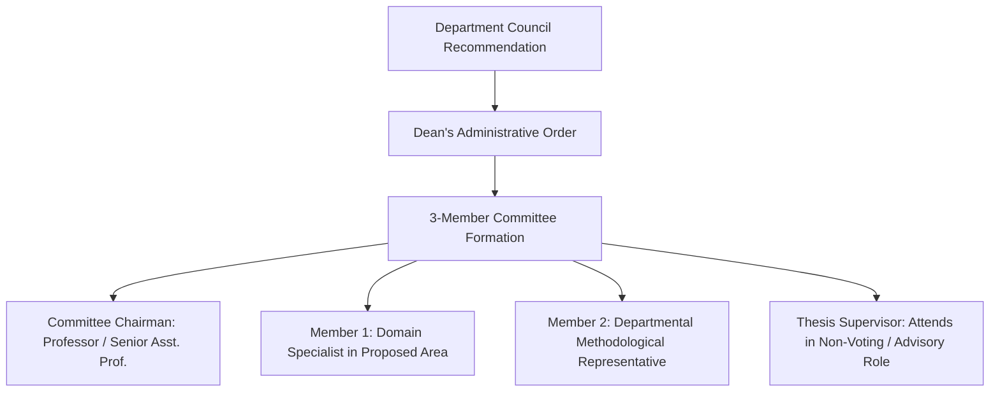
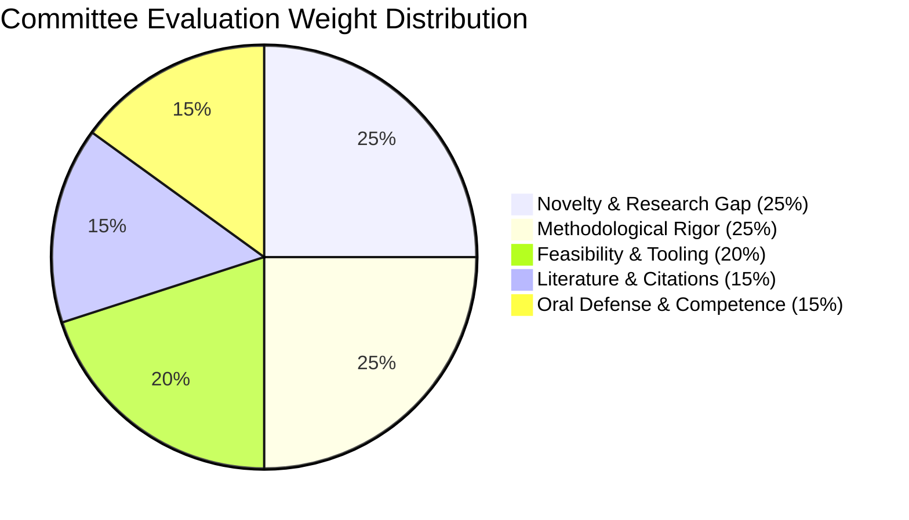

# 🏛️ Departmental 3-Member Committee (*اللجنة الثلاثية*) Guidelines & Proposal Defense Protocol

> **Institutional Framework:** College of Computer Science & Information Technology, University of Wasit  
> **Governing Regulation:** Iraqi Postgraduate Studies Law No. 26 of 1990 & Ministerial Directives for Master of Science Programs  
> **Target Gateway:** Transition from Preparatory Coursework (Year 1) to Thesis Research Stage (Year 2)  
> **Document Authority:** Official Protocol for Master of Computer Science Candidates

---

## 1. Statutory Role & Purpose of the 3-Member Committee (*اللجنة الثلاثية*)

The departmental **Three-Member Committee (*اللجنة الثلاثية / لجنة إقرار خطط البحث*)** is the statutory academic body empowered by the Department Council to evaluate, scrutinize, and formally approve or reject Master's thesis research proposals.

```
+=======================================================================================================+
|                                    YEAR 1 TO YEAR 2 TRANSITION GATEWAY                                |
+=======================================================================================================+
| 1. Coursework Clearance           | Complete 26 credit units across Semesters 1 & 2 (GPA >= 70%)      |
| 2. Supervisor Allocation          | Match with eligible faculty member (Asst. Prof. or Prof.)         |
| 3. Proposal Draft Formulation     | Author rigorous 15-25 page research plan with verified DOIs       |
| 4. Oral Defense (اللجنة الثلاثية) | Deliver 15-min defense before 3-member examination panel          |
| 5. Department Council Approval    | Official registration of thesis title in University records       |
+=======================================================================================================+
```

---

## 2. Committee Composition & Jurisdictional Structure

Under MOHESR postgraduate governance, the Committee is formed by an administrative order (*أمر إداري*) issued by the Dean of the College upon recommendation of the Head of the Computer Science Department.



### Statutory Roles & Qualifications:
1. **Committee Chairman (*رئيس اللجنة*):** Must hold the rank of **Full Professor (*أستاذ*)** or a senior **Assistant Professor (*أستاذ مساعد*)** with extensive supervisory experience. Responsible for chairing the session, enforcing time boundaries, and moderating the technical interrogation.
2. **Member 1 (Subject Specialist / *عضو تخصصي*):** An Assistant Professor or PhD Lecturer specialized directly in the candidate's chosen research subfield (e.g., Software Architecture, Neuro-Fuzzy Systems, Deep Learning, Cryptography). Scrutinizes mathematical validity, novelty, and baseline algorithmic comparisons.
3. **Member 2 (Methodology & Standards / *عضو المنهجية والمعايير*):** Faculty member responsible for verifying empirical methodology, dataset integrity, statistical testing protocols, and formatting compliance.
4. **The Thesis Supervisor (*المشرف الأكاديمي*):** Attends the defense in a supportive capacity. While the supervisor participates in the scientific discussion, the final evaluation decision rests solely with the independent 3-member panel.

---

## 3. Proposal Defense Presentation Protocol

The proposal defense is an intensive, formal academic proceeding conducted in English.

### Timing & Session Flow (45 Minutes Total)
- **00:00 – 00:03 (3 mins):** Chairman opens the session, announces the candidate and topic.
- **00:03 – 00:20 (17 mins):** **Candidate Oral Presentation:** Strict 15–20 minute delivery using Marp slide deck.
- **00:20 – 00:40 (20 mins):** **Committee Cross-Examination:** Detailed technical questioning by each committee member.
- **00:40 – 00:45 (5 mins):** **Closed Deliberation:** Candidate exits the chamber; committee determines the outcome and records formal recommendations.

---

## 4. Standard 12-Slide Marp Presentation Deck Structure

To guarantee high evaluation marks, the candidate's slide presentation must follow the standardized Master Studio 12-slide template (`00_STUDIO_HUB/templates/template-marp-seminar.md`):

```
+=======================================================================================================+
|                                  12-SLIDE PROPOSAL PRESENTATION BLUEPRINT                             |
+======+===================================+============================================================+
| Slide| Title & Content                    | Focus & Essential Elements                                 |
+======+===================================+============================================================+
| 01   | Title & Identification            | Thesis Title (En/Ar), Candidate, Supervisor, Department    |
| 02   | Problem Statement & Research Gap  | Explicit articulation of the unresolved technical challenge|
| 03   | Motivation & Practical Impact     | Real-world significance, industrial/academic motivation    |
| 04   | Research Objectives & Hypotheses  | 3–4 specific, quantifiable research goals and hypotheses   |
| 05   | State of the Art & Literature Gap | Comparison table of 5–8 recent IEEE/ACM benchmark papers   |
| 06   | Proposed Methodology & Framework  | Architectural block diagram / system model (Mermaid)       |
| 07   | Algorithmic / Mathematical Model  | Core mathematical formulas, objective functions, workflow  |
| 08   | Datasets & Evaluation Metrics     | Benchmark datasets, hardware setup, KPIs (F1, Latency, etc)|
| 09   | Feasibility & Risk Mitigation     | Technical risks, contingency plans, toolchain availability |
| 10   | 12-Month Research Timeline        | Gantt chart: Literature -> Dev -> Experiments -> Writing   |
| 11   | Target Publication Plan           | Targeted Scopus (Q1/Q2) journals & IEEE conferences        |
| 12   | Primary References (Verified DOIs)| 8–10 foundational and state-of-the-art citations           |
+======+===================================+============================================================+
```

---

## 5. Committee Evaluation Criteria & Scoring Rubric

The 3-member committee evaluates the proposal across **5 Core Evaluation Dimensions**:



| Evaluation Dimension | Weight | Critical Questions Evaluated by Committee |
|:---|:---:|:---|
| **1. Scientific Novelty & Research Gap** | 25% | Is this a genuine master's-level contribution, or a trivial re-implementation of existing software? Is the knowledge gap clearly demonstrated from 2024–2026 literature? |
| **2. Methodological & Mathematical Rigor** | 25% | Is the proposed algorithm/architecture mathematically sound? Are the evaluation metrics standard in IEEE/ACM transactions? |
| **3. Feasibility & Resource Availability** | 20% | Can the candidate complete the proposed work within the 12-month legal thesis window? Are datasets, compute resources (GPUs), and software licenses accessible? |
| **4. Literature Grounding & Verified Citations** | 15% | Does the proposal cite top-tier primary venues? Are all references authentic with working DOIs (zero fabricated citations)? |
| **5. Candidate Oral Competence & Defense** | 15% | Does the candidate demonstrate deep command of the domain? Are committee criticisms addressed diplomatically with technical evidence? |

---

## 6. Official Committee Decision Outcomes

Upon conclusion of closed deliberation, the committee issues one of **Four Binding Decisions**:

```
+-----------------------------------------------------------------------------------------------+
|                               FORMAL COMMITTEE DECISION OUTCOMES                              |
+===============================================================================================+
| 1. Approved Unconditionally (إقرار الخطة دون تعديل)                                           |
|    - Proposal accepted as submitted. Candidate proceeds immediately to thesis research.      |
+-----------------------------------------------------------------------------------------------+
| 2. Approved Subject to Minor Revisions (إقرار الخطة مع تعديلات طفيفة)                         |
|    - Minor wording, additional citations, or baseline benchmark additions required.           |
|    - Candidate has 14 calendar days to submit revised document endorsed by supervisor.        |
+-----------------------------------------------------------------------------------------------+
| 3. Major Revisions & Mandatory Re-defense (إعادة العرض بعد إجراء تعديلات جوهرية)              |
|    - Significant flaws in methodology, scope, or feasibility.                                 |
|    - Candidate has 30 calendar days to substantially revise and re-defend before panel.       |
+-----------------------------------------------------------------------------------------------+
| 4. Rejected / Topic Substitution (رفض الموضوع وتكليف الطالب بمقترح بديل)                       |
|    - Topic is obsolete, duplicate of existing thesis, or scientifically unviable.             |
|    - Candidate assigned to formulate a completely new topic within 45 days.                   |
+-----------------------------------------------------------------------------------------------+
```

---

## 7. Strategic Defense Tactics (How to Secure Unconditional Approval)

1. **Explicitly Differentiate from Undergraduate Graduation Projects (*مشاريع التخرج*):**
   - ❌ *Undergraduate mindset:* "We developed a mobile app using Flutter and Firebase for university parking."
   - ✅ *Master's research mindset:* "We propose a decentralized, latency-optimized consensus protocol for resource-constrained edge gateways, evaluating trade-offs between Byzantine fault tolerance and transaction throughput under dynamic network partitioning."
2. **Bring Empirical Baseline Evidence:** Show initial pilot benchmark results or exploratory dataset statistics on Slide 8. Demonstrating that preliminary data has already been collected virtually guarantees feasibility approval.
3. **Know Your Competing Baselines:** When a committee member asks *"Why didn't you use Model X instead?"*, be prepared to state: *"Model X achieves high accuracy on static tabular data, but suffers from $O(n^2)$ computational complexity, making it unviable for streaming IoT telemetry where our proposed linear-time model operates."*
4. **Never Fight the Committee:** Accept methodological critique diplomatically (*"That is an insightful observation, Dr. [Name]. We will incorporate that ablation benchmark into Phase 3 of our experimental plan."*).
