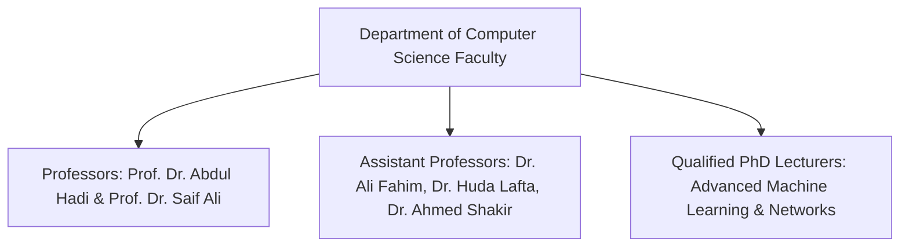
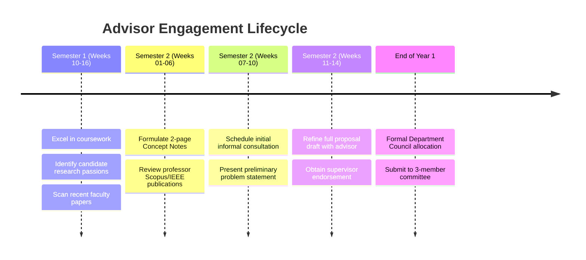

# 🧭 Supervisor Intelligence, Faculty Profiling & Research Topic Alignment

> **Institutional Entity:** Department of Computer Science, College of Computer Science & IT, University of Wasit  
> **Target Outcome:** Strategic identification and alignment with eligible thesis supervisors for Master of Computer Science candidates  
> **Regulatory Reference:** Iraqi Postgraduate Studies By-Laws (Law No. 26/1990) & MOHESR Supervisory Directives

---

## 1. Statutory Supervisor Eligibility Framework

Under Iraqi Ministry of Higher Education & Scientific Research (MOHESR) regulations, an academic staff member is legally authorized to supervise a Master of Science (*ماجستير*) thesis only if they satisfy one of the following **two statutory tiers**:

```
+=======================================================================================================+
|                                    MOHESR SUPERVISOR ELIGIBILITY TIERS                                |
+====================+==================================+===============================================+
| Academic Rank      | Service / Research Prerequisites | Supervisory Capacity Limit                    |
+====================+==================================+===============================================+
| 1. Full Professor  | Immediate statutory eligibility   | Up to 3–4 Master/PhD students simultaneously  |
|    (أستاذ دكتور)   | Active research portfolio        | Primary Supervisor / Committee Chair          |
+--------------------+----------------------------------+-----------------------------------------------+
| 2. Assistant Prof. | Immediate statutory eligibility   | Up to 2–3 Master students simultaneously      |
|    (أستاذ مساعد)  | Active research portfolio        | Primary Supervisor / Committee Member         |
+--------------------+----------------------------------+-----------------------------------------------+
| 3. PhD Lecturer    | Minimum 2 Years active post-PhD  | Maximum 1–2 Master students (subject to Dept  |
|    (مدرس دكتور)    | academic service + Minimum 2     | Council approval & joint supervision pairing) |
|                    | Scopus / Clarivate publications  |                                               |
+====================+==================================+===============================================+
```

### Ineligibility Criteria ❌
- Faculty members holding only an M.Sc. degree (Assistant Lecturers / *مدرس مساعد*) are legally prohibited from supervising master candidates.
- PhD Lecturers with $< 2$ years since their doctoral degree conferral or $< 2$ indexed journal papers cannot act as sole primary supervisors.

---

## 2. Department Faculty Intelligence & Research Dossiers

The Department of Computer Science at the University of Wasit possesses distinguished academic faculty spanning diverse core computing domains:



### 1. Prof. Dr. Abdul Hadi Mohammed Adkhil (*أ.د. عبد الهادي محمد ادخيل*)
- **Academic Rank:** Full Professor (*أستاذ دكتور*).
- **Core Specializations:** Soft Computing, Neuro-Fuzzy Systems (ANFIS), Artificial Neural Networks, Pattern Recognition, Digital Image Boundary Encoding (Freeman Chain Codes).
- **Supervisory Strengths:** High theoretical depth, mathematical rigor, well-established international publication record in computational intelligence.
- **Ideal Candidate Profile:** Students with strong mathematical intuition, digital signal/image processing interest, and algorithmic modeling skills.

### 2. Prof. Dr. Saif Ali Al-Saidi (*أ.د. سيف علي الساعدي*)
- **Academic Rank:** Full Professor (*أستاذ دكتور*).
- **Core Specializations:** Artificial Intelligence, Heuristic State-Space Search, Autonomous Agent Architectures, Constraint Satisfaction Problems (CSP), Adversarial Decision Theory.
- **Supervisory Strengths:** Deep expertise in classical and modern AI paradigms, rigorous algorithmic complexity proofs, multi-agent systems.
- **Ideal Candidate Profile:** Students interested in core AI, heuristic optimization on massive graphs, automated planning, and game-theoretic modeling.

### 3. Asst. Prof. Dr. Ali Fahim Ni'ma (*أ.م.د. علي فاهم نعمة*)
- **Academic Rank:** Assistant Professor (*أستاذ مساعد دكتور*).
- **Core Specializations:** Software Engineering, Software Architecture, Quality Attribute Scenarios (ISO/IEC 25010), Architectural Tactics (SEI), Empirical Software Engineering, Microservices & Distributed Systems.
- **Supervisory Strengths:** Strong focus on modern software architecture research, empirical validation methodologies, systematic literature reviews, high-impact software quality metrics.
- **Ideal Candidate Profile:** Candidates aiming to conduct thesis research in software architecture, distributed system resilience, architectural debt, or empirical software engineering.

### 4. Asst. Prof. Dr. Huda Lafta Majeed (*أ.م.د. هدى لفتة مجيد*)
- **Academic Rank:** Assistant Professor (*أستاذ مساعد دكتور*).
- **Core Specializations:** Information Security, Enterprise Cybersecurity, Cloud Security, IoT / Cyber-Physical Infrastructure, Threat Intelligence, Incident Triage.
- **Supervisory Strengths:** Practical, scenario-driven research, strong industry relevance, focus on contemporary real-world attack vectors and Zero Trust defense.
- **Ideal Candidate Profile:** Students focused on applied cybersecurity, intrusion detection telemetry, cloud security posture management, or IoT threat mitigation.

### 5. Asst. Prof. Dr. Ahmed Shakir Abd Al-Rida (*أ.م.د. أحمد شاكر عبد الرضا*)
- **Academic Rank:** Assistant Professor (*أستاذ مساعد دكتور*).
- **Core Specializations:** Data Mining, Machine Learning, Feature Extraction, Knowledge Discovery in Databases (KDD), Biomedical Data Analytics.
- **Supervisory Strengths:** Systematic data preprocessing pipelines, feature engineering from high-dimensional datasets, pattern classification.
- **Ideal Candidate Profile:** Students interested in applied machine learning, medical image feature extraction, or high-throughput tabular data mining.

---

## 3. Strategic Thesis Research Tracks & Topic Alignment Matrix

Candidates should align their emerging thesis interests during Semester 1 and Semester 2 with the specific research strengths of eligible supervisors:

```
+=======================================================================================================+
|                                  THESIS RESEARCH TRACKS & TOPIC ALIGNMENT                             |
+======+==============================+==================================+==============================+
| Track| Research Domain              | Candidate Thesis Topic Concepts  | Primary Potential Advisor    |
+======+==============================+==================================+==============================+
| A    | Software Architecture &      | 1. Dynamic Quality Attribute     | Asst. Prof. Dr. Ali Fahim    |
|      | Distributed Systems          |    Trade-off Evaluation in       |                                |
|      |                              |    Cloud-Native Microservices    |                              |
|      |                              | 2. Automated Architecture Debt   |                              |
|      |                              |    Quantification using Telemetry|                              |
|      |                              | 3. Resilience Tactics for Edge-  |                              |
|      |                              |    Cloud Hybrid Systems          |                              |
+------+------------------------------+----------------------------------+------------------------------+
| B    | Computational Intelligence & | 1. Hybrid ANFIS-Genetic Modeling | Prof. Dr. Abdul Hadi Adkhil  |
|      | Neuro-Fuzzy Systems          |    for Industrial Time-Series    |                              |
|      |                              | 2. Lossless Boundary Shape       |                              |
|      |                              |    Recognition via Multi-Scale   |                              |
|      |                              |    Differential Chain Codes      |                              |
+------+------------------------------+----------------------------------+------------------------------+
| C    | Heuristic Search &           | 1. Memory-Bounded Multi-Agent    | Prof. Dr. Saif Ali Al-Saidi  |
|      | Autonomous Agent Systems     |    Pathfinding on Massive Graphs |                              |
|      |                              | 2. Heuristic Optimization for    |                              |
|      |                              |    Constrained Resource Dispatch |                              |
+------+------------------------------+----------------------------------+------------------------------+
| D    | Enterprise Cyber Defense &   | 1. Real-Time Telemetry Triage for| Asst. Prof. Dr. Huda Lafta   |
|      | Zero Trust Architectures     |    Zero Trust Cloud Workloads    |                              |
|      |                              | 2. Automated Ransomware Kill     |                              |
|      |                              |    Chain Interruption Protocols  |                              |
+------+------------------------------+----------------------------------+------------------------------+
| E    | Applied Machine Learning &   | 1. Advanced Feature Extraction   | Asst. Prof. Dr. Ahmed Shakir |
|      | Pattern Recognition          |    for Multi-Modal Medical Scans |                              |
|      |                              | 2. Stream Data Anomaly Detection |                              |
|      |                              |    under Concept Drift           |                              |
+======+==============================+==================================+==============================+
```

---

## 4. Strategic Faculty Engagement Protocol (Semester 2 Timeline)

Securing an ideal thesis advisor requires proactive, professional, and well-timed academic engagement:



### The 4 Rules of Professional Engagement:
1. **Never Approach a Professor Empty-Handed:** Prepare a concise **2-Page Research Concept Note** containing: (a) Clear Problem Statement, (b) 3 Specific Research Objectives, (c) Proposed Methodology, (d) 5 Recent Verified IEEE/ACM Citations (with DOIs).
2. **Read the Professor’s Recent Publications:** Cite at least one paper authored or co-authored by the faculty member to demonstrate genuine familiarity with their research laboratory.
3. **Address Practical Feasibility:** Clarify that you have verified the availability of benchmark datasets, GPUs, or software toolchains necessary to conduct the research.
4. **Co-Supervision (*الإشراف المشترك*):** If a proposed topic bridges two distinct disciplines (e.g., Applying Neuro-Fuzzy AI to Software Architecture Resilience), request formal co-supervision pairing an AI specialist (Prof. Dr. Abdul Hadi / Prof. Dr. Saif Ali) with a Software Engineering specialist (Dr. Ali Fahim).

---

## 5. Formal Administrative Allocation Procedure

1. **Submission of Research Intent Form (*استمارة رغبة الإشراف*):** Submitted by the candidate to the Department Head at the conclusion of Semester 2 coursework.
2. **Supervisor Capacity Check:** The Department Council reviews the active student quotas of eligible faculty members.
3. **Department Council Resolution (*قرار مجلس القسم*):** Formal allocation of the student to the approved supervisor.
4. **Dean's Administrative Order (*أمر إداري بالتكليف*):** Legal authorization for the thesis stage to commence.
