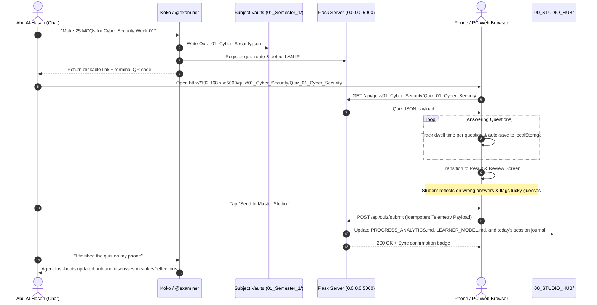

# Master Studio: Interactive Web Quiz Subsystem & Cognitive Telemetry Engine
## Design Specification (Architectural)

> **Date:** 2026-09-19  
> **Status:** APPROVED  
> **Target Subsystem:** `91_Dashboard/` & `00_STUDIO_HUB/`  
> **Author:** Abu Al-Hasan (Student) & Koko (AI Co-Pilot)

---

## 1. Executive Summary

The Master Studio Interactive Web Quiz Subsystem extends the file-driven academic OS into an interactive, mobile-first web learning environment. It enables the student to request quizzes in natural language chat, immediately receive a LAN-accessible link/QR code, complete the quiz on a phone or desktop browser with per-question dwell-time tracking, perform post-quiz metacognitive reflection on errors, flag "Lucky Guess / WOW" items, and synchronize the full psychometric telemetry back into Master Studio (`00_STUDIO_HUB/`) with a single click.

All client-side operations are zero-dependency (vanilla ES6+ and CSS variables), all icons use Lucide SVGs (zero emoji UI icons), and all cognitive classification is deterministic (zero LLM token waste for scoring and updates).

---

## 2. Core Workflows & User Journey



---

## 3. UI/UX & Routing Architecture

### 3.1. Routing Schema
* `GET /quiz`: Hub landing page showing all subjects, available quiz banks, recent attempts, and quick links.
* `GET /quiz/<subject_id>/<quiz_id>`: Direct Quiz Route. Launches the quiz interface directly in focused canvas mode.
* `GET /quiz/bookmarks`: Practice mode drill exclusively using saved questions across all subjects.

### 3.2. Visual Design & Theming
* **Typography**: Clean, readable sans-serif (`Inter`, `system-ui`, `-apple-system`).
* **Icons**: 100% **Lucide SVG Icons** loaded via lightweight CDN/inlined SVG. Strict prohibition of emoji characters as functional UI icons.
* **Themes**:
  * **Dark Mode (Default)**: Background `#0B1C2E`, Card Surface `#132A42`, Border `#1E3A5F`, Primary Accent `#38BDF8`, Text Primary `#F8FAFC`, Text Secondary `#94A3B8`.
  * **Light Mode**: Background `#F8FAFC`, Card Surface `#FFFFFF`, Border `#E2E8F0`, Primary Accent `#0284C7`, Text Primary `#0F172A`, Text Secondary `#64748B`.
  * **System**: Matches OS setting via `prefers-color-scheme`.

### 3.3. Canvas & Drawer Architecture (Approach 2)
The quiz interface uses a single-column layout with slide-over drawers:

1. **Top Application Bar**:
   * Back button (saves session to `localStorage` before exit).
   * Quiz metadata (Subject, Week/Topic).
   * Action Icons:
     * `bookmark` $\rightarrow$ Toggles Bookmarks slide-over drawer / bottom sheet.
     * `bar-chart-2` $\rightarrow$ Toggles Analytics slide-over drawer / bottom sheet.
     * `sun` / `moon` $\rightarrow$ Toggles visual theme.
2. **Progress & Timer Bar**:
   * Horizontal progress indicator.
   * Question counter (`Question X of Y`).
   * Live per-question dwell timer (`00:14`) and cumulative session timer (`04:32`).
3. **Question Card**:
   * Question text with proper BiDi rendering (LTR for English code/technical text, RTL for Arabic explanations).
   * Option buttons (`A`, `B`, `C`, `D`) with hover and active states.
   * Bookmark question toggle button (`bookmark` icon).
4. **Bottom Sticky Navigation Bar**:
   * `Previous` button (disabled on question 1).
   * `Next` / `Finish Quiz` button.

### 3.4. Result & Review Screen Architecture
1. **Performance Header**:
   * Score percentage with color-coded status (`Pass` $\ge 60\%$, `Excellence` $\ge 75\%$).
   * Statistical summary: Total questions, Correct count, Wrong count, Skipped count, Total duration, Average dwell time.
2. **Interactive Review Stream**:
   * **Wrong Answers**:
     * Red-tinted card showing Question, Student's choice, Correct choice, and Comprehensive explanation.
     * **Metacognitive Reflection Selector**:
       * 4 one-tap chips: `[Misread Question]`, `[Calculation Slip]`, `[Terminology Mix-up]`, `[Concept Gap]`.
       * Freeform 1-line note field for personal rationale.
   * **Correct Answers**:
     * Green-tinted card with collapsible explanation.
     * **"Lucky Guess / WOW" Toggle**: A toggle switch (`dice` / `sparkles` icon) allowing the student to mark that the question was answered correctly purely by luck.
3. **Action Controls**:
   * **`Try Again`**: Restarts the quiz as Attempt #2 while preserving historical attempts in `localStorage`.
   * **`+N More Questions`**: Requests an expanded question set.
   * **`Send to Master Studio`**: Transmits the telemetry payload to the backend and transitions to a verified green *"✓ Synced to Studio"* badge.

---

## 4. Algorithmic Foundation & Cognitive Engine

### 4.1. Bayesian Knowledge Tracing (BKT) with Slip/Guess Calibration
The backend updates student concept mastery $P(L_t)$ using Bayesian inference:

$$P(L_t | \text{Correct}) = \frac{P(L_{t-1}) \cdot (1 - P(S))}{P(L_{t-1}) \cdot (1 - P(S)) + (1 - P(L_{t-1})) \cdot P(G)}$$

$$P(L_t | \text{Wrong}) = \frac{P(L_{t-1}) \cdot P(S)}{P(L_{t-1}) \cdot P(S) + (1 - P(L_{t-1})) \cdot (1 - P(G))}$$

$$P(L_{t+1}) = P(L_t | \text{Obs}) + (1 - P(L_t | \text{Obs})) \cdot P(T)$$

* **Lucky Guess Calibration**: When `is_lucky_guess: true`, the engine sets $P(G) = 1.0$. The posterior $P(L_t | \text{Correct})$ collapses to $P(L_{t-1})$, ensuring zero false mastery credit is awarded.
* **Execution Slip Calibration**: When the reflection is `Calculation Slip` or `Misread Question`, the engine sets $P(S) = 1.0$, preserving the underlying concept score while logging an operational caution.

### 4.2. Dwell-Time Cognitive Load Classifier
Per-question dwell time ($t_d$) is evaluated against baseline bounds:
* **Fluency ($t_d < 12\text{s}$, Correct)**: Automaticity achieved. Concept marked for extended retention interval.
* **Fragile Retrieval ($t_d > 30\text{s}$, Correct)**: Cognitive friction detected. Queued for 3-day spaced repetition.
* **Impulsive Slip ($t_d < 6\text{s}$, Wrong)**: Premature answer. Prompted for review.
* **Conceptual Block ($t_d > 35\text{s}$, Wrong)**: Deep gap. Priority 1 in `LEARNER_MODEL.md`.

### 4.3. Half-Life Memory Decay Scheduling
Spaced repetition intervals are calculated using the Half-Life Regression model:

$$R = 2^{-\Delta t / h}$$

* Successful fluent retrieval: $h_{new} = h \times 2.2$.
* Fragile retrieval: $h_{new} = h \times 1.3$.
* Execution slip: $h_{new} = h \times 0.8$.
* Conceptual block: $h_{new} = 1.0\text{ day}$.

---

## 5. Data Schemas & Telemetry Payloads

### 5.1. Quiz JSON Schema (`01_Semester_1/<Subject>/07_Quizzes_&_Anki/<Quiz_ID>.json`)
```json
{
  "subject": "01_Cyber_Security",
  "quiz_id": "Quiz_01_Cyber_Security",
  "topic": "Week 01 Scenario Drills",
  "instructor": "Asst. Prof. Dr. Huda Lafta Majeed",
  "questions": [
    {
      "id": "q1",
      "question": "Which security domain does an IPS belong to?",
      "options": {
        "A": "Application Security",
        "B": "Network Security",
        "C": "Cloud Security",
        "D": "Physical Security"
      },
      "answer": "B",
      "explanation": "Intrusion Prevention Systems (IPS) operate at network boundaries."
    }
  ]
}
```

### 5.2. Telemetry Ingestion Payload (`POST /api/quiz/submit`)
```json
{
  "submission_uuid": "550e8400-e29b-41d4-a716-446655440000",
  "subject_id": "01_Cyber_Security",
  "quiz_id": "Quiz_01_Cyber_Security",
  "topic": "Week 01 Scenario Drills",
  "timestamp": "2026-09-19T23:15:00Z",
  "summary": {
    "total": 25,
    "correct": 21,
    "wrong": 4,
    "skipped": 0,
    "percentage": 84.0,
    "total_time_seconds": 380,
    "avg_dwell_time_seconds": 15.2,
    "attempt_number": 1
  },
  "questions": [
    {
      "id": "q4",
      "selected": "C",
      "correct": "B",
      "is_correct": false,
      "dwell_time_seconds": 34,
      "reflection": {
        "reason": "Terminology Mix-up",
        "note": "Confused 24-bit truncation drift with stack overflow."
      },
      "is_lucky_guess": false
    },
    {
      "id": "q7",
      "selected": "C",
      "correct": "C",
      "is_correct": true,
      "dwell_time_seconds": 5,
      "reflection": null,
      "is_lucky_guess": true
    }
  ]
}
```

---

## 6. Backend Ingestion & Vault Synchronization

The Flask backend in `91_Dashboard/app.py` implements the following atomic updates upon receiving `POST /api/quiz/submit`:

1. **Idempotency Gate**:
   * Verifies `submission_uuid` against `00_STUDIO_HUB/sessions/` and an in-memory set.
   * If already processed, returns HTTP 200 with `{"status": "already_ingested"}` without duplicate file mutations.
2. **`00_STUDIO_HUB/PROGRESS_ANALYTICS.md`**:
   * Parses existing log rows, generates next `#XXX` identifier, and appends the result row:
     `| #003 | 2026-09-19 23:15 | 01_Cyber_Security | Week 01 Scenario Drills | 21/25 (84%) | PASS | 🟢 Mastered |`
3. **`00_STUDIO_HUB/LEARNER_MODEL.md`**:
   * **Wrong Answers**: Appends to `## 4. Active Review Queue` with reflection notes and scheduled review dates.
   * **Lucky Guesses**: Questions with `is_lucky_guess: true` are added to the review queue with `Priority: Medium` and reason *"Lucky Guess / Fluke"*.
   * **Mastered Concepts**: Topics scoring $\ge 80\%$ with no outstanding conceptual blocks are appended to `## 3. Mastered Concepts List`.
4. **Session Journal (`00_STUDIO_HUB/sessions/YYYY-MM-DD.md`)**:
   * Appends a formatted session log detailing the quiz completion, time metrics, and queued review items.

---

## 7. Engineering Reliability & Offline-First Protocol

1. **Client Storage**: All state (`answers`, `dwell_times`, `bookmarks`, `reflections`, `attempt_history`) is continuously synchronized to browser `localStorage`.
2. **Offline Resilience**: If network connectivity fails during the quiz or at submission time, the payload is stored in a `localStorage` sync queue (`quiz_sync_queue`). A background retry loop flushes the queue upon network restoration.
3. **LAN Auto-Discovery**:
   * Backend retrieves host machine LAN IP via `socket.gethostbyname(socket.gethostname())`.
   * CLI and Dashboard render both direct URLs and an ASCII/SVG QR code for mobile camera scanning.

---

## 8. Acceptance Criteria

- [ ] **AC-1 (Routing)**: Visiting `/quiz` lists all subjects; visiting `/quiz/<subject>/<quiz>` directly launches the specified quiz.
- [ ] **AC-2 (Zero Emoji)**: WebUI renders exclusively Lucide SVG icons; no emoji characters used for UI controls.
- [ ] **AC-3 (Dwell Time)**: Dwell timer accurately captures per-question focus seconds and overall session duration.
- [ ] **AC-4 (Metacognitive Reflection)**: Wrong answers provide 4 reflection chips + custom note; reflections persist into `LEARNER_MODEL.md`.
- [ ] **AC-5 (Lucky Guess)**: Toggling "Lucky Guess" on a correct answer routes the concept to `active_review_queue` instead of `mastered_concepts`.
- [ ] **AC-6 (Idempotency)**: Multiple clicks on "Send to Master Studio" result in exactly one log entry in `PROGRESS_ANALYTICS.md`.
- [ ] **AC-7 (LAN Usability)**: Mobile devices on the same Wi-Fi network can complete quizzes and submit telemetry seamlessly.
