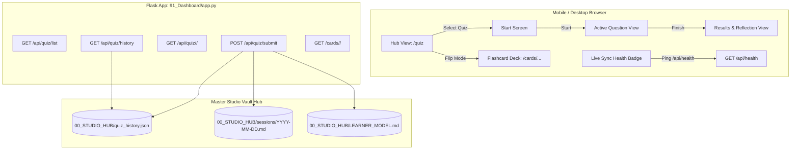

# Master Studio Online Quiz & Flashcard Subsystem: Production-Grade Architectural Specification

- **Date:** 2026-09-25
- **Author:** Master Studio Co-Pilot
- **Scope:** Full-stack overhaul of the online PC-connected quizzing and flashcard subsystem (`91_Dashboard/` and `90_Shared_Toolbox/tools/`).
- **Target Environments:** Desktop Web & Mobile Android via USB reverse port forwarding (`adb reverse tcp:5000 tcp:5000`) and LAN IP.

---

## 1. Problem Statement & Motivation

During a live operational audit on the active server (`http://127.0.0.1:5000`) and connected Android device via ADB reverse tunneling, several prototype-stage deficiencies were identified:

1. **Catalog vs. Quiz State Collision:**
   - Accessing `/quiz` (Catalog Hub) loaded a hardcoded demonstration quiz (`CS501`, "Search & Optimization Algorithms") in `quiz.js` because `subjectId` and `quizId` were absent.
   - This caused quiz session UI elements (topic banner, dwell timer, progress bar `1/5`, answer mode controls) to render above the subject catalog.
2. **Visual Leaks & DOM Redundancies:**
   - In mobile Chromium, the native `<input type="file" id="local-file-input">` leaked a 6x6 pixel gray button displaying "No file chosen" immediately below the progress bar.
   - On quiz start (`quiz-start-view`), subject and topic headers were rendered twice (once in `.topic-banner` and once inside the start card).
   - The question progress bar and counter were visible before the student clicked "Start Quiz".
3. **Lack of Persistent History in the WebUI:**
   - Submissions were only recorded as markdown bullet points in `00_STUDIO_HUB/sessions/YYYY-MM-DD.md`.
   - The WebUI had no historical query capability; returning students could not see their prior attempts, high scores, or weak areas in the catalog.
4. **Missing Flashcard Route:**
   - `AGENTS.md` specified a dedicated 3D flip-card spaced-repetition flashcard system at `/cards/<subject_id>/<quiz_id>`, but no route or template existed in `91_Dashboard/app.py`.
5. **No Server Connectivity Health Indicator:**
   - The client lacked an explicit status indicator showing whether the PC Flask server was reachable over USB/LAN.

---

## 2. Architecture & Components



---

## 3. Detailed Specifications

### 3.1. Frontend Overhaul (`quiz.html`, `quiz.js`, `quiz.css`)

#### A. Catalog Hub Mode (`directMode === false`)
- When `directMode` is false:
  - `.topic-banner`, `.progress-section`, `#quiz-view`, `#quiz-start-view`, and `#results-view` are cleanly hidden.
  - The catalog header renders an academic subject filter bar: `All Subjects`, `01_Cyber_Security`, `02_English_Language`, `03_Data_Mining`, `04_Advanced_Software_Eng`, `05_Soft_Computing`, `06_Artificial_Intelligence`.
  - Each quiz card displays:
    - Subject badge & lecture title.
    - Question count & estimated completion time.
    - **History Pill:** Displays previous highest score (`Best: 80% (4/5)`) and last attempt date, or `New` badge if unattempted.
    - Action buttons: `Start Quiz (تدريب)` | `Simulate Exam (امتحان)` | `Flashcards (بطاقات)`.
  - `quiz.js` does NOT load any fallback/demo quiz data when in catalog mode.

#### B. Quiz Session Mode (`directMode === true`)
- **Start Screen:**
  - `.topic-banner` and `.progress-section` remain hidden until the user clicks `ابدأ الكوز الآن` (`btn-start-quiz`).
  - Timer and dwell counters initialize strictly upon start button click.
- **Visual Glitch Elimination:**
  - `#local-file-input` is styled with `display: none !important;` to eliminate Chromium mobile button leakage.
  - All touch targets remain $\ge 48\text{px}$ adhering to mobile accessibility standards.
- **Live Connectivity Badge:**
  - The top bar displays a real-time status pill:
    - 🟢 `Live Sync (متصل)` when `/api/health` responds $\le 200\text{ms}$.
    - 🟡 `Offline Mode (حفظ محلي)` if server is unreachable, automatically queuing telemetry to `localStorage` and syncing once connectivity resumes.

### 3.2. Backend & Data Layer (`app.py`, `quiz_engine.py`)

#### A. Structured History Storage (`00_STUDIO_HUB/quiz_history.json`)
- Each submission via `POST /api/quiz/submit` atomically appends to `quiz_history.json`:
  ```json
  {
    "submission_uuid": "3d988a40-df43-4a2a-a9e1-d397f89cd014",
    "timestamp": "2026-09-25T09:43:00Z",
    "subject_id": "04_Advanced_Software_Eng",
    "quiz_id": "Quiz_01_Software_Crisis",
    "topic": "Lecture 01: Foundations, Patriot Failure, Brooks & Ethics",
    "score": 3,
    "total": 5,
    "percentage": 60.0,
    "session_duration_seconds": 304,
    "avg_dwell_time_seconds": 60.8,
    "mode": "study",
    "wrong_questions": [
      {"id": "q3", "concept_id": "brooks_law", "reflection_reason": "Concept Gap"},
      {"id": "q5", "concept_id": "se_ethics_public", "reflection_reason": "Concept Gap"}
    ]
  }
  ```
- Atomic write implementation using temporary file swap (`tmp_file.replace(target_file)`) to prevent file corruption during concurrent requests.

#### B. New Endpoints
1. `GET /api/health`: Returns `{"status": "ok", "timestamp": "...", "client_ip": "..."}`.
2. `GET /api/quiz/history`: Returns aggregated per-quiz statistics (best score, attempts count, last attempt date) and raw history records.
3. `GET /cards/<subject_id>/<quiz_id>`: Renders the active recall 3D flip card view.

### 3.3. Flashcard Memo Subsystem (`cards.html`, `cards.js`, `cards.css`)
- Leverages the identical JSON quiz banks (`Quiz_*.json`).
- Front of Card:
  - Bloom Taxonomy badge (`Understand`, `Apply`, `Analyze`, `Evaluate`).
  - Question prompt in Arabic or English with instant language toggle.
- Back of Card:
  - Canonical correct answer highlighted in green.
  - Deep academic explanation.
  - Feynman 9-year-old intuitive mental model.
  - Professor's Exam Trap alert box.
- 4-Tier Spaced Repetition Bar:
  - `Again (<1m)` · `Hard (1d)` · `Good (3d)` · `Easy (7d)`.
  - Card progress and review queues persist in `localStorage` under `ms_cards_<quiz_id>`.

---

## 4. Verification & Testing Strategy

1. **Automated Unit & Integration Tests (`pytest tests/`):**
   - Verify `/api/health` status and headers.
   - Verify `/api/quiz/history` serialization and aggregation.
   - Verify atomic persistence in `quiz_history.json`.
   - Verify `POST /api/quiz/submit` updates both `YYYY-MM-DD.md` and `quiz_history.json`.
   - Verify `/cards/<subject_id>/<quiz_id>` renders 200 OK with correct question count.
2. **End-to-End Mobile USB Verification (ADB):**
   - Access `/quiz` on mobile Chrome via `adb reverse tcp:5000 tcp:5000`.
   - Verify no fallback quiz banner or timers appear on the Catalog page.
   - Verify subject filter chips filter cards dynamically.
   - Complete a quiz, verify results screen, and confirm history badge updates on the Catalog.
   - Navigate to `/cards/04_Advanced_Software_Eng/Quiz_01_Software_Crisis` and verify 3D card flip and rating persistence.
